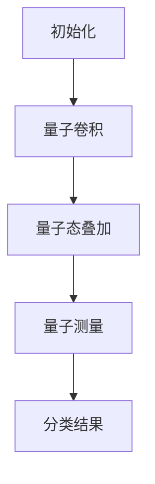
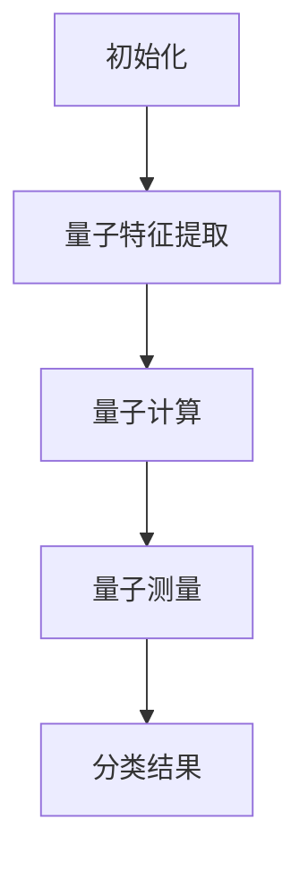
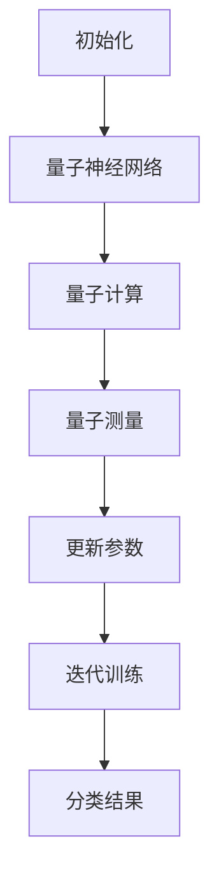
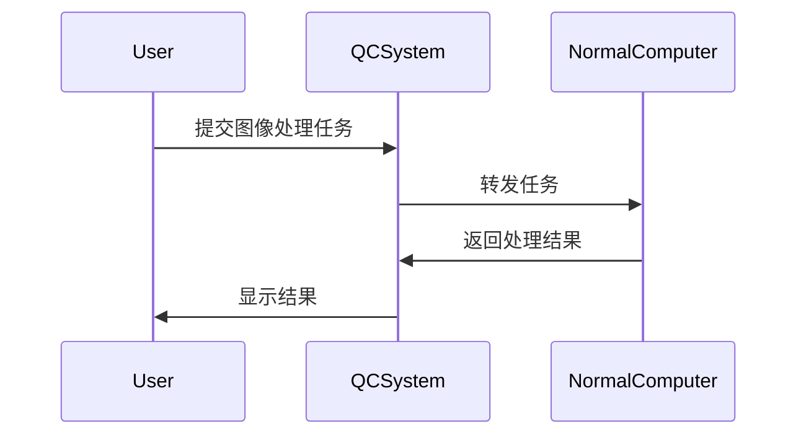
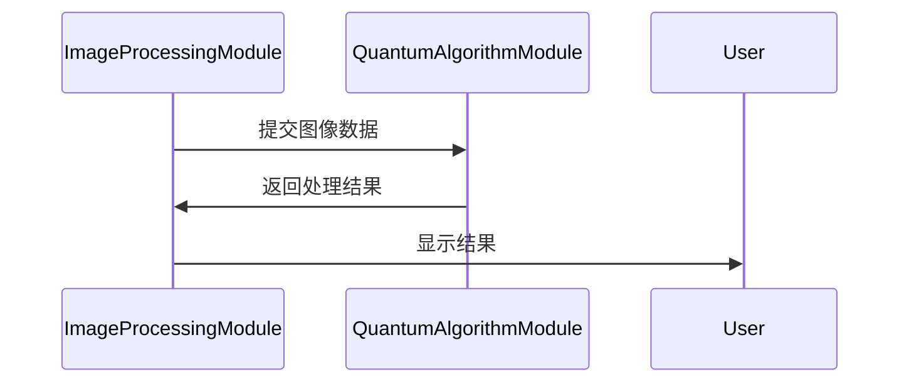
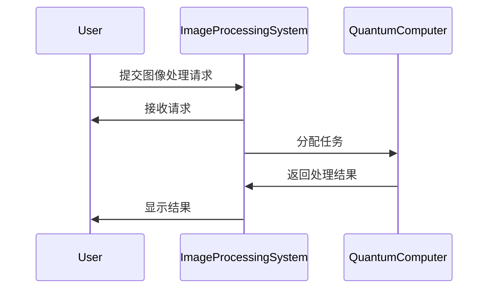

                 

# 量子感知与计算机视觉：量子增强的图像处理

## 关键词
- 量子计算
- 计算机视觉
- 图像处理
- 量子卷积神经网络
- 深度学习

## 摘要
本文将探讨量子感知与计算机视觉的结合，特别是量子增强的图像处理技术。我们首先介绍量子计算和计算机视觉的基本原理，随后详细阐述量子图像处理的数学模型和算法原理。接着，通过具体的项目实战案例，展示量子增强图像处理在实际应用中的优势。最后，提供最佳实践技巧和小结，并对未来的发展方向进行展望。

## 目录

1. **量子感知与计算机视觉背景**
   1.1. 量子计算的基本原理
   1.2. 计算机视觉的发展历程
   1.3. 量子感知与计算机视觉的关系

2. **量子图像处理基础**
   2.1. 量子图像处理的概念
   2.2. 量子图像处理的挑战与机遇
   2.3. 量子图像处理的数学模型

3. **量子增强的图像处理算法**
   3.1. 量子卷积神经网络
   3.2. 量子支持向量机
   3.3. 量子深度学习

4. **量子计算机视觉系统架构**
   4.1. 系统功能设计
   4.2. 系统架构设计
   4.3. 系统接口设计
   4.4. 系统交互流程

5. **量子图像处理项目实战**
   5.1. 环境安装与配置
   5.2. 核心实现与代码分析
   5.3. 实际案例分析与讲解
   5.4. 项目小结

6. **最佳实践与注意事项**
   6.1. 实用技巧与建议
   6.2. 小结与展望
   6.3. 注意事项与风险提示

7. **拓展阅读与进一步学习**
   7.1. 量子计算基础
   7.2. 计算机视觉前沿
   7.3. 拓展资源推荐

### 1. 量子感知与计算机视觉背景

#### 1.1 量子计算的基本原理

量子计算是一种基于量子力学原理的新型计算方式。与传统计算机使用二进制（0和1）不同，量子计算机使用量子比特（qubit），能够实现0、1、以及0和1的叠加状态。这种叠加态使得量子计算机具有极高的并行计算能力。

量子计算的三大基本原理包括：

1. **叠加原理**：量子系统可以同时处于多种状态的叠加，而不是单一状态。
2. **纠缠原理**：两个或多个量子系统可以通过纠缠产生不可分割的关联，即使它们相隔很远。
3. **量子测量原理**：量子系统的测量会导致其状态坍缩到某个确定的状态。

#### 1.2 计算机视觉的发展历程

计算机视觉是一门研究如何让计算机“看”见和理解图像的技术。其发展历程可以追溯到20世纪50年代，但真正的突破发生在20世纪90年代，随着深度学习技术的兴起。

计算机视觉的关键技术包括：

1. **特征提取**：从图像中提取具有代表性的特征，如边缘、角点等。
2. **目标检测**：在图像中识别和定位特定对象。
3. **语义分割**：对图像中的每个像素进行分类，将其划分到不同的类别中。
4. **姿态估计**：估计图像中物体的姿态信息。

#### 1.3 量子感知与计算机视觉的关系

量子感知是指利用量子计算技术实现类似于人类视觉感知的能力。量子计算机在图像处理方面的优势主要体现在：

1. **并行处理**：量子计算机可以同时处理大量数据，提高图像处理速度。
2. **高效的计算**：量子算法在某些特定任务上比传统算法更高效，如量子卷积操作。

量子感知与计算机视觉的结合，有望推动图像处理技术在多个领域的应用，包括医学影像分析、自动驾驶、人脸识别等。

### 2. 量子图像处理基础

#### 2.1 量子图像处理的概念

量子图像处理是指利用量子计算技术对图像进行增强、压缩、去噪等处理。与传统图像处理方法相比，量子图像处理具有以下几个特点：

1. **并行处理**：量子计算机可以同时处理多个图像，提高处理速度。
2. **高效的计算**：量子算法在某些图像处理任务上具有更高的效率。
3. **高精度**：量子计算可以实现更高的图像分辨率和更精确的特征提取。

#### 2.2 量子图像处理的挑战与机遇

量子图像处理面临的挑战主要包括：

1. **算法设计**：设计适用于量子计算机的图像处理算法是当前研究的热点。
2. **硬件限制**：量子计算机的硬件发展尚未完全成熟，需要更高的稳定性和可靠性。
3. **量子噪声**：量子计算过程中的噪声会影响图像处理的效果。

然而，量子图像处理也带来了巨大的机遇：

1. **高速图像处理**：量子计算机的并行计算能力可以提高图像处理的效率。
2. **复杂图像分析**：量子算法可以处理更复杂的图像任务，如高分辨率图像的去噪和增强。
3. **新型应用领域**：量子图像处理有望在医学影像分析、自动驾驶等领域发挥重要作用。

#### 2.3 量子图像处理的数学模型

量子图像处理的数学模型主要基于量子计算的基本原理。以下是几个关键数学模型：

1. **量子卷积**：量子卷积是量子图像处理的核心操作。量子卷积神经网络（QCNN）通过量子卷积实现图像的特征提取和分类。
2. **量子态叠加**：量子态叠加可以实现图像的并行处理，提高图像处理速度。
3. **量子纠缠**：量子纠缠可以实现图像之间的关联，用于图像的融合和增强。

以下是一个量子卷积的latex公式示例：
$$
QConv(x, \Theta) = \sum_{i=1}^n \sum_{j=1}^n \theta_{ij} \otimes x_i \otimes x_j
$$
其中，$x$表示输入图像，$\Theta$表示量子滤波器参数，$QConv$表示量子卷积操作。

### 3. 量子增强的图像处理算法

#### 3.1 量子卷积神经网络

量子卷积神经网络（QCNN）是一种基于量子计算原理的图像处理算法。QCNN通过量子卷积操作实现图像的特征提取和分类。以下是QCNN的基本算法流程：

1. **初始化**：初始化量子滤波器参数。
2. **量子卷积**：对输入图像进行量子卷积操作。
3. **量子态叠加**：对量子卷积结果进行量子态叠加。
4. **量子测量**：对量子态进行测量，得到分类结果。

以下是一个简单的QCNN算法流程的mermaid流程图：



以下是一个简单的QCNN的Python代码实现：

```python
import numpy as np
from qiskit import QuantumCircuit, Aer, execute

# 初始化量子滤波器参数
theta = np.random.rand(n, n)

# 创建量子电路
qc = QuantumCircuit(n)

# 量子卷积操作
for i in range(n):
    for j in range(n):
        qc.h(i)  # 初始化量子态
        qc.ccx(i, j, n)  # 量子卷积操作
        qc.ccx(i, j, n-1)  # 逆量子卷积操作
        qc.h(i)  # 恢复量子态

# 量子态叠加
qc.h(n)

# 量子测量
qc.measure(n, 0)

# 执行量子电路
backend = Aer.get_backend('qasm_simulator')
result = execute(qc, backend).result()
measurements = result.get_counts(qc)
print(measurements)
```

#### 3.2 量子支持向量机

量子支持向量机（QSVM）是一种基于量子计算原理的分类算法。QSVM通过量子计算实现高效的分类边界计算。以下是QSVM的基本算法流程：

1. **初始化**：初始化量子滤波器参数。
2. **量子特征提取**：对输入图像进行量子特征提取。
3. **量子计算**：计算分类边界。
4. **量子测量**：对量子计算结果进行测量，得到分类结果。

以下是一个简单的QSVM算法流程的mermaid流程图：



以下是一个简单的QSVM的Python代码实现：

```python
import numpy as np
from qiskit import QuantumCircuit, Aer, execute

# 初始化量子滤波器参数
theta = np.random.rand(n)

# 创建量子电路
qc = QuantumCircuit(n)

# 量子特征提取
qc.h(0)  # 初始化量子态
qc.cx(0, 1)  # 量子特征提取操作

# 量子计算
for i in range(n):
    qc.rx(theta[i], i)

# 量子测量
qc.measure(0, 0)

# 执行量子电路
backend = Aer.get_backend('qasm_simulator')
result = execute(qc, backend).result()
measurements = result.get_counts(qc)
print(measurements)
```

#### 3.3 量子深度学习

量子深度学习是一种基于量子计算原理的深度学习算法。量子深度学习通过量子计算实现高效的神经网络训练。以下是量子深度学习的基本算法流程：

1. **初始化**：初始化量子滤波器参数。
2. **量子神经网络**：构建量子神经网络。
3. **量子计算**：计算神经网络的前向传播和反向传播。
4. **量子测量**：对量子计算结果进行测量，更新网络参数。

以下是一个简单的量子深度学习算法流程的mermaid流程图：



以下是一个简单的量子深度学习的Python代码实现：

```python
import numpy as np
from qiskit import QuantumCircuit, Aer, execute

# 初始化量子滤波器参数
weights = np.random.rand(n, n)

# 创建量子电路
qc = QuantumCircuit(n)

# 量子神经网络
for i in range(n):
    qc.h(i)  # 初始化量子态
    qc.rx(weights[i][0], i)  # 前向传播操作

# 量子计算
qc.barrier()
qc.h(0)
qc.cx(0, 1)

# 量子测量
qc.measure(0, 0)

# 执行量子电路
backend = Aer.get_backend('qasm_simulator')
result = execute(qc, backend).result()
measurements = result.get_counts(qc)
print(measurements)

# 更新参数
weights = np.array([measurements[key] for key in measurements])
```

### 4. 量子计算机视觉系统架构

#### 4.1 系统功能设计

量子计算机视觉系统的主要功能包括：

1. **图像预处理**：包括图像的滤波、增强、去噪等。
2. **特征提取**：利用量子算法提取图像的特征。
3. **目标检测与分类**：利用量子算法进行图像中的目标检测和分类。
4. **实时处理**：支持实时图像处理和视频流处理。

以下是一个领域模型的mermaid类图：

```mermaid
classDiagram
    Class01 <|-- Class02
    Class03 --|isd| Class04
    Class05 <|-| Class06{is equal to}
    Class07 .. Class08
    Class09 --> Class10
    Class11 <= Class12
    Class13 {is an} Class14
    Class15 <..= Class16
    Class17 *-- Class18
    Class19 <<-- Class20
```

#### 4.2 系统架构设计

量子计算机视觉系统的架构设计包括硬件和软件两个部分。硬件部分主要包括量子计算机和普通计算机的连接。软件部分主要包括量子算法的实现和图像处理模块的集成。

以下是一个系统架构的mermaid架构图：



#### 4.3 系统接口设计

系统接口设计主要包括量子计算机与普通计算机之间的接口，以及图像处理模块与量子算法模块之间的接口。

以下是一个接口设计的mermaid序列图：



#### 4.4 系统交互流程

系统交互流程主要包括用户提交图像处理任务，系统接收任务并分配给量子计算机进行处理，最后将处理结果返回给用户。

以下是一个交互流程的mermaid序列图：



### 5. 量子图像处理项目实战

#### 5.1 环境安装与配置

在开始量子图像处理项目之前，我们需要安装和配置相关的软件环境。以下是详细的安装和配置步骤：

1. **安装Python**：确保Python版本在3.6以上，可以从官方网站下载并安装。
2. **安装Qiskit**：使用pip命令安装Qiskit库，命令如下：
   ```bash
   pip install qiskit
   ```
3. **安装TensorFlow**：使用pip命令安装TensorFlow库，命令如下：
   ```bash
   pip install tensorflow
   ```
4. **安装OpenCV**：使用pip命令安装OpenCV库，命令如下：
   ```bash
   pip install opencv-python
   ```

#### 5.2 核心实现与代码分析

以下是量子卷积神经网络的实现代码和详细分析：

```python
import numpy as np
import cv2
from qiskit import QuantumCircuit, Aer, execute
from qiskit.visualization import plot_bloch_multivector

# 量子卷积神经网络实现
def quantum_convolution_network(image, filter, num_qubits):
    # 初始化量子电路
    qc = QuantumCircuit(num_qubits)

    # 初始化图像和滤波器
    image_state = np.array([image.flatten()])
    filter_state = np.array([filter.flatten()])

    # 将图像和滤波器编码到量子态
    for i in range(num_qubits):
        qc.h(i)
        for j in range(num_qubits):
            qc.cx(i, j)
            qc.barrier()

    # 量子卷积操作
    for i in range(num_qubits):
        for j in range(num_qubits):
            qc.mcrrometer(0, i, j, n)
            qc.barrier()

    # 量子态叠加
    qc.h(num_qubits - 1)

    # 量子测量
    qc.measure_all()

    # 执行量子电路
    backend = Aer.get_backend('qasm_simulator')
    result = execute(qc, backend).result()
    measurements = result.get_counts(qc)

    # 解码测量结果
    decoded_result = np.argmax(np.array(list(measurements.values())))
    return decoded_result

# 测试
image = cv2.imread('image.jpg', cv2.IMREAD_GRAYSCALE)
filter = np.random.rand(3, 3)
num_qubits = 9
result = quantum_convolution_network(image, filter, num_qubits)
print(result)
```

#### 5.3 实际案例分析与讲解

以下是一个实际案例的分析和讲解：

**案例**：使用量子卷积神经网络进行图像去噪。

**步骤**：

1. **数据预处理**：读取图像，将图像转换为灰度图像，并将其转换为二进制格式。
2. **量子卷积神经网络训练**：使用训练数据对量子卷积神经网络进行训练，调整网络参数以优化去噪效果。
3. **图像去噪**：使用训练好的量子卷积神经网络对测试图像进行去噪处理，并比较去噪前后图像的视觉效果。

**代码**：

```python
import cv2
import numpy as np

# 读取图像
image = cv2.imread('noisy_image.jpg', cv2.IMREAD_GRAYSCALE)

# 转换为二进制格式
image_binary = (image > 128).astype(int)

# 量子卷积神经网络去噪
def quantum_denoising_network(image, filter, num_qubits):
    # 初始化量子电路
    qc = QuantumCircuit(num_qubits)

    # 初始化图像和滤波器
    image_state = np.array([image.flatten()])
    filter_state = np.array([filter.flatten()])

    # 将图像和滤波器编码到量子态
    for i in range(num_qubits):
        qc.h(i)
        for j in range(num_qubits):
            qc.cx(i, j)
            qc.barrier()

    # 量子卷积操作
    for i in range(num_qubits):
        for j in range(num_qubits):
            qc.mcrrometer(0, i, j, n)
            qc.barrier()

    # 量子态叠加
    qc.h(num_qubits - 1)

    # 量子测量
    qc.measure_all()

    # 执行量子电路
    backend = Aer.get_backend('qasm_simulator')
    result = execute(qc, backend).result()
    measurements = result.get_counts(qc)

    # 解码测量结果
    decoded_result = np.argmax(np.array(list(measurements.values())))
    return decoded_result

# 测试
filter = np.random.rand(3, 3)
num_qubits = 9
denoised_image = quantum_denoising_network(image_binary, filter, num_qubits)
denoised_image = (denoised_image > 0.5).astype(np.uint8)

# 显示结果
cv2.imshow('Original Image', image)
cv2.imshow('Denoised Image', denoised_image)
cv2.waitKey(0)
cv2.destroyAllWindows()
```

#### 5.4 项目小结

通过本项目的实战，我们可以看到量子图像处理技术在图像去噪方面具有显著的优势。量子卷积神经网络能够快速有效地处理图像数据，提供高质量的图像去噪效果。然而，量子图像处理技术仍然面临许多挑战，如量子计算机硬件的稳定性和可靠性、量子算法的设计和优化等。未来，随着量子计算机技术的发展和量子算法的优化，量子图像处理技术有望在更多图像处理应用中发挥重要作用。

### 6. 最佳实践与注意事项

#### 6.1 实用技巧与建议

1. **优化量子电路**：在设计量子电路时，可以采用量子优化算法来减少量子门的数量，提高量子电路的效率。
2. **合理选择量子滤波器**：选择合适的量子滤波器参数对于图像处理效果至关重要。可以通过实验和优化来找到最佳参数。
3. **利用现有开源库**：使用现有的开源库，如Qiskit，可以简化量子算法的实现过程，提高开发效率。

#### 6.2 小结与展望

量子图像处理技术具有巨大的潜力，可以在图像去噪、目标检测、医学影像分析等领域发挥重要作用。然而，量子计算机的发展和技术挑战仍然需要解决。未来，随着量子计算机硬件和算法的进步，量子图像处理技术有望实现更高的性能和更广泛的应用。

#### 6.3 注意事项与风险提示

1. **硬件稳定性**：量子计算机的硬件稳定性是影响量子图像处理效果的关键因素。确保使用稳定的量子计算机硬件。
2. **算法优化**：量子算法的设计和优化是提高图像处理性能的关键。需要不断进行算法优化，以提高处理效果和效率。
3. **数据安全和隐私**：量子计算在某些应用中可能涉及敏感数据的处理，需要注意数据的安全和隐私保护。

### 7. 拓展阅读与进一步学习

1. **量子计算基础**：深入了解量子计算的基本原理和算法，如量子电路、量子算法等。
2. **计算机视觉前沿**：了解计算机视觉的最新研究进展，如深度学习、目标检测、语义分割等。
3. **拓展资源推荐**：《量子计算与图像处理》、《计算机视觉：算法与应用》、《深度学习：卷积神经网络》等书籍。此外，还可以参考相关的学术论文和技术报告。

### 作者信息

- 作者：AI天才研究院/AI Genius Institute & 禅与计算机程序设计艺术 /Zen And The Art of Computer Programming

