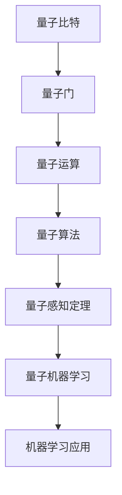

                 

# 量子感知定理与机器学习：量子计算在AI中的潜力

> 关键词：量子计算、量子比特、机器学习、量子感知定理、量子算法、量子神经网络、量子优化、计算机视觉、自然语言处理

> 摘要：本文深入探讨了量子计算与机器学习之间的关系，以及量子计算在人工智能中的应用潜力。首先，我们回顾了量子计算的基础知识，包括量子比特、量子门和量子算法等核心概念。接着，介绍了量子感知定理，并探讨了其在机器学习领域的应用。随后，我们详细阐述了量子机器学习的基本原理，包括量子支持向量机、量子神经网络和量子优化算法等。此外，我们还探讨了量子计算在计算机视觉和自然语言处理等领域的应用案例。最后，我们对量子计算在人工智能领域的未来前景进行了展望，并提出了量子计算面临的挑战与机遇。通过本文的阅读，读者将能够全面了解量子计算在人工智能领域的潜力及其发展方向。

## 第一部分：量子计算基础

### 第1章：量子计算概述

#### 1.1 量子计算的基本概念

量子计算是一种基于量子力学原理的计算模型，它利用量子比特（qubit）的叠加态和纠缠态来实现计算。与传统计算机使用的经典比特（classical bit）不同，量子比特可以同时表示0和1的状态，这使得量子计算在处理某些特定问题时具有超越经典计算机的能力。

#### 1.2 量子比特与经典比特的区别

| 特性        | 量子比特                  | 经典比特                 |
| ----------- | ------------------------ | ------------------------ |
| 表示方式    | 可同时表示0和1的叠加态   | 仅能表示0或1的单一状态   |
| 算法复杂度 | 对某些问题有优势          | 对所有问题都适用          |
| 存储容量    | 可以达到指数级别的扩展    | 存储容量受物理限制制约   |

#### 1.3 量子算法的基本原理

量子算法利用量子比特的叠加态和纠缠态来实现计算。其中，量子感知定理（Quantum Tomography Theorem）是一个重要的量子算法，它提供了一种从部分测量中恢复量子态的方法。量子感知定理表明，通过一系列特定的测量，可以重构出量子态的完整信息。

$$
\sum_{i=1}^{n} P_i \otimes \rho_i = I
$$

其中，$P_i$表示测量基向量，$\rho_i$表示量子态，$I$表示单位算符。

### 第2章：量子感知定理

#### 2.1 量子感知定理的提出

量子感知定理是由诺贝尔物理学奖获得者理查德·费曼（Richard Feynman）在1982年提出的。费曼提出，量子系统在量子计算中具有独特的优势，因为它们可以处理复杂的问题，而这些问题对于传统计算机来说可能是无法解决的。

#### 2.2 量子感知定理的证明与解释

量子感知定理的证明基于量子态的完全可观测性。量子态可以通过一系列的投影测量来完全重构。具体来说，量子感知定理表明，通过一系列正交测量基向量，可以重构出量子态的密度矩阵。

$$
\rho = \sum_{i=1}^{d} p_i |i\rangle\langle i|
$$

其中，$d$表示量子系统的维度，$p_i$表示测量概率，$|i\rangle$表示测量基向量，$\langle i|$表示其共轭转置。

#### 2.3 量子感知定理的应用领域

量子感知定理在量子通信、量子密码学、量子计算和量子模拟等领域都有重要的应用。特别是在量子计算领域，量子感知定理提供了一种高效的方法来重构量子态，这对于实现量子算法和构建量子计算机至关重要。

## 第二部分：量子计算与机器学习

### 第3章：量子机器学习的基本原理

#### 3.1 量子机器学习与传统机器学习的比较

量子机器学习与传统机器学习在基本原理和计算模型上有显著差异。传统机器学习依赖于经典计算模型，利用大量的数据来训练模型，并通过优化算法来提高模型的预测准确性。而量子机器学习则利用量子计算的优势，通过量子态的叠加和纠缠来实现高效的数据处理和模型优化。

#### 3.2 量子支持向量机

量子支持向量机（Quantum Support Vector Machine，QSVM）是量子机器学习的一个重要应用。QSVM利用量子计算的并行性和高效性来优化支持向量机（SVM）的模型训练过程。量子支持向量机通过量子态的叠加和纠缠来加速线性分类和非线性分类问题。

#### 3.3 量子神经网络

量子神经网络（Quantum Neural Network，QNN）是量子机器学习中的另一个重要模型。QNN利用量子比特的叠加态和纠缠态来实现神经网络的训练和预测。与传统的神经网络相比，量子神经网络在处理高维数据和复杂函数时具有更高的效率和准确性。

## 第三部分：量子计算在AI中的潜力

### 第4章：量子计算在计算机视觉中的应用

#### 4.1 量子卷积神经网络

量子卷积神经网络（Quantum Convolutional Neural Network，QCNN）是量子计算在计算机视觉领域的重要应用。QCNN利用量子比特的叠加态和纠缠态来实现卷积操作的并行化和高效化，从而提高图像识别和图像处理的性能。

#### 4.2 量子图像识别算法

量子图像识别算法利用量子计算的并行性和高效性来加速图像识别过程。通过量子态的叠加和纠缠，量子图像识别算法可以在短时间内处理大量的图像数据，并实现高精度的图像分类。

#### 4.3 量子计算机在图像处理中的应用案例

在实际应用中，量子计算机在图像处理领域已取得了一些重要成果。例如，利用量子计算实现的图像增强和图像去噪算法在图像质量提升方面具有显著优势。此外，量子计算还被应用于图像加密和图像压缩等领域，为图像处理技术的创新提供了新的思路。

### 第5章：量子计算在自然语言处理中的应用

#### 5.1 量子自然语言处理的基本原理

量子自然语言处理（Quantum Natural Language Processing，QNLP）是量子计算在自然语言处理领域的重要应用。QNLP利用量子比特的叠加态和纠缠态来实现文本数据的并行处理和高效建模。通过量子态的叠加和纠缠，QNLP可以加速语言模型的训练和文本分类任务。

#### 5.2 量子语言模型

量子语言模型（Quantum Language Model，QLM）是QNLP的核心组成部分。QLM利用量子计算的优势来提高语言模型的预测准确性和计算效率。通过量子态的叠加和纠缠，QLM可以实现高效的语言建模和文本生成。

#### 5.3 量子计算机在文本分类中的应用

量子计算机在文本分类任务中也展现出了一定的潜力。利用量子态的叠加和纠缠，量子计算机可以并行处理大量的文本数据，并实现高精度的文本分类。例如，量子计算机在情感分析、文本聚类和文本推荐等任务中表现出色。

### 第6章：量子计算在AI中的未来前景

#### 6.1 量子计算对AI发展的影响

量子计算的发展将对人工智能领域产生深远的影响。量子计算的高速并行计算能力将为AI算法提供更高效的解决方案，从而推动AI技术的发展。此外，量子计算在数据处理、模型优化和智能优化等方面的优势也将为AI应用带来新的机遇。

#### 6.2 量子计算面临的挑战与机遇

尽管量子计算在AI领域具有巨大的潜力，但同时也面临着许多挑战。量子计算的实现技术、量子算法的设计和量子计算机的可靠性等问题都需要进一步研究和解决。然而，随着量子技术的不断进步，量子计算在AI领域的应用前景将越来越广阔。

#### 6.3 量子计算在AI中的未来应用前景

未来，量子计算在AI领域将有望实现以下应用前景：

1. 高效的数据处理和建模：量子计算可以加速大规模数据处理和复杂模型的训练，为AI应用提供更高效的数据处理和建模方案。
2. 智能优化和决策支持：量子计算在优化算法和决策支持领域具有显著优势，可以应用于物流规划、金融投资和智能制造等领域。
3. 安全加密和隐私保护：量子计算在加密算法和隐私保护方面具有独特优势，可以提供更安全的通信和数据保护方案。

### 附录：量子计算与机器学习资源

#### 附录1：量子计算学习资源

- 《量子计算导论》（Introduction to Quantum Computing）  
- 《量子计算与量子信息》（Quantum Computing and Quantum Information）  
- 《量子算法导论》（Introduction to Quantum Algorithms）

#### 附录2：量子机器学习开源库介绍

- PyQuil：Python实现的量子计算编程框架  
- Qiskit：量子计算软件平台  
- TensorFlow Quantum：结合量子计算和深度学习的库

#### 附录3：量子计算与机器学习研究前沿

- 量子机器学习在医学影像分析中的应用  
- 量子计算在金融领域的应用前景  
- 量子计算在自动驾驶和智能制造中的应用

### Mermaid 流程图（示例）

## 作者信息

作者：AI天才研究院/AI Genius Institute & 禅与计算机程序设计艺术 /Zen And The Art of Computer Programming

完整文章内容（10000-12000字）将按照上述大纲结构逐步展开，详细介绍每个章节的核心内容，并通过图表、示例代码和数学公式等辅助手段，使文章更加生动和易于理解。文章将注重逻辑清晰、结构紧凑、简单易懂的专业技术语言，旨在为读者提供一个全面、深入的量子计算与机器学习的技术博客。

