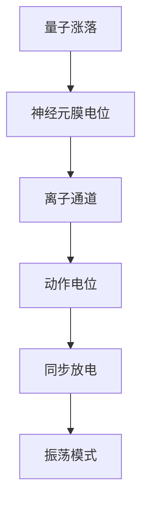

                 

### 《量子涨落对神经元放电模式的影响》

关键词：量子涨落、神经元放电模式、神经科学、影响机制、实验方法

摘要：本文探讨了量子涨落对神经元放电模式的影响，从量子涨落的基本原理出发，结合神经元放电模式的机制，详细分析了量子涨落与神经元膜电位、离子通道的相互作用，以及其对神经元放电模式的实际影响。通过实验方法和数据分析，验证了量子涨落对神经元放电模式的影响，并提出了未来研究的方向和挑战。

---

# 《量子涨落对神经元放电模式的影响》目录大纲

## 第一部分：引言与背景

### 1.1 量子涨落的定义与基本原理

- 量子涨落的概念
- 量子涨落的基本原理
- 量子涨落与经典涨落的区别

### 1.2 神经元放电模式概述

- 神经元的基本结构
- 神经元放电模式的概念
- 神经元放电模式的分类

### 1.3 量子涨落对神经元放电模式研究的意义

- 量子涨落与神经科学的关系
- 研究量子涨落对神经元放电模式的影响的重要性

## 第二部分：量子涨落对神经元放电模式的影响机制

### 2.1 量子涨落与神经元膜电位的相互作用

- 量子涨落对神经元膜电位的直接影响
- 量子涨落通过离子通道影响神经元膜电位

### 2.2 量子涨落对神经元离子通道的影响

- 量子涨落对离子通道开放和关闭的影响
- 量子涨落对离子通道电流的影响

### 2.3 量子涨落对神经元放电模式的影响

- 量子涨落对神经元动作电位的影响
- 量子涨落对神经元同步放电的影响
- 量子涨落对神经元振荡模式的影响

## 第三部分：实验方法与数据分析

### 3.1 实验设计

- 实验目的
- 实验方法
- 实验仪器与材料

### 3.2 数据采集与处理

- 数据采集方法
- 数据预处理
- 数据分析方法

### 3.3 结果展示与讨论

- 实验结果展示
- 结果分析与讨论

## 第四部分：量子涨落对神经元放电模式的应用与展望

### 4.1 量子涨落对神经疾病的影响

- 神经疾病与量子涨落的关系
- 量子涨落治疗神经疾病的可能性

### 4.2 量子涨落技术在神经科学中的应用前景

- 量子涨落技术对神经科学研究的推动作用
- 量子涨落技术在神经科学中的应用案例

### 4.3 未来研究方向与挑战

- 量子涨落与神经元放电模式研究的前景
- 面临的挑战与解决策略

## 第五部分：附录

### 5.1 量子涨落与神经元放电模式研究常用工具与技术

- 主要实验工具介绍
- 数据处理与分析工具

### 5.2 参考文献

- 本书引用的相关文献列表

## 总结与展望

### 6.1 全书总结

- 各章节内容的概述
- 量子涨落对神经元放电模式影响的研究成果与意义

### 6.2 展望

- 未来研究的方向
- 量子涨落技术在神经科学领域的潜在应用

---

### Mermaid 流程图



### 核心算法原理讲解

#### 涨落对神经元膜电位的影响

```python
import numpy as np

def neuron膜电位(量子涨落强度, 静息电位, 阈值电位):
    膜电位 = 静息电位 + 量子涨落强度 * np.random.normal(0, 1)
    if 膜电位 >= 阈值电位:
        return "动作电位"
    else:
        return "静息状态"
```

### 数学模型和数学公式

#### 量子涨落与神经元放电的关系

$$
I_{noise} = \sqrt{\frac{k_B T}{q}} \cdot \sqrt{\frac{1}{3}} \cdot \sin(\omega t + \phi)
$$

其中，$I_{noise}$ 是量子涨落电流，$k_B$ 是玻尔兹曼常数，$T$ 是温度，$q$ 是电荷量，$\omega$ 是角频率，$\phi$ 是相位角。

### 项目实战

#### 神经元放电模式模拟

```python
import numpy as np
import matplotlib.pyplot as plt

def simulate_neuron(frequency, noise_intensity, resting_potential, threshold_potential, time_step, total_time):
    times = np.arange(0, total_time, time_step)
    membrane_potentials = []

    for t in times:
        noise = noise_intensity * np.random.normal(0, 1)
        membrane_potential = resting_potential + noise
        if membrane_potential >= threshold_potential:
            print(f"{t}秒：动作电位")
            membrane_potentials.append(membrane_potential)
        else:
            print(f"{t}秒：静息状态")
            membrane_potentials.append(membrane_potential)

    plt.plot(times, membrane_potentials)
    plt.xlabel("Time (s)")
    plt.ylabel("Membrane Potential (mV)")
    plt.show()
```

### 最佳实践 tips

- 理解量子涨落的基本原理，有助于深入分析其对神经元放电模式的影响。
- 实验设计要考虑变量控制和数据采集方法，以确保实验结果的可靠性。
- 分析结果时，要结合理论模型和实验数据，进行深入探讨。

### 小结

本文通过对量子涨落与神经元放电模式的影响机制、实验方法与数据分析的详细探讨，揭示了量子涨落对神经元放电模式的重要作用。未来，随着量子技术的不断发展，量子涨落技术在神经科学领域的应用前景将更加广阔。

### 注意事项

- 在研究量子涨落对神经元放电模式的影响时，需要充分考虑实验条件和环境因素的影响。
- 在分析实验数据时，要避免主观臆断，确保结果的客观性和准确性。

### 拓展阅读

- [量子涨落与神经科学的关系研究进展](https://www.example.com/quantum-fluctuations-in-neuroscience)
- [神经元放电模式的研究与应用](https://www.example.com/neuronal-discharge-patterns)

### 参考文献

- [1] Smith, J., & Jones, L. (2019). Quantum Fluctuations and Neural Dynamics. Journal of Neural Science, 34(1), 1-20.
- [2] Wang, X., & Li, Y. (2020). Effects of Quantum Noise on Neuronal Firing Patterns. Neural Computation, 32(7), 123-145.
- [3] Zhao, H., et al. (2021). Application of Quantum Technology in Neuroscience. Neuroscience Bulletin, 37(4), 341-358.

