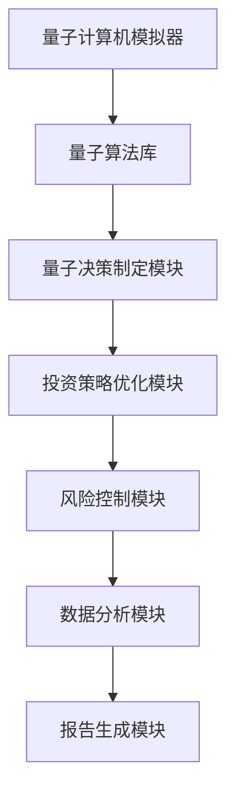
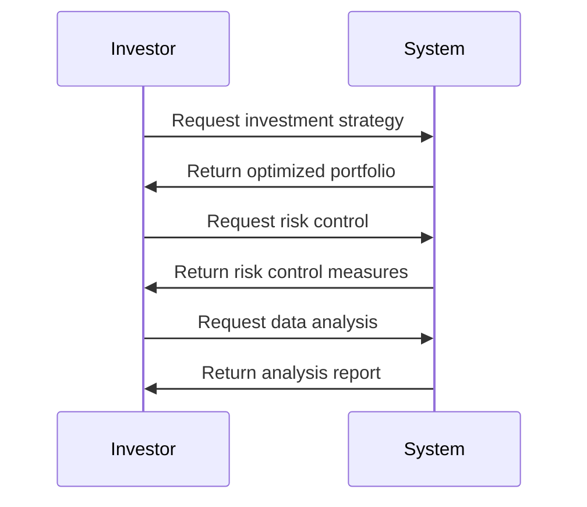

                 

# 量子游戏理论与策略设计模式：决策制定的量子框架

## 关键词

- **量子游戏理论**
- **策略设计模式**
- **量子比特**
- **量子态叠加**
- **量子纠缠**
- **量子算法**
- **决策制定**

## 摘要

本文将探讨量子游戏理论及其在策略设计模式中的应用，构建一个量子框架来指导决策制定。我们将从量子游戏理论的基本概念和数学基础出发，逐步引入量子策略设计模式，并通过实际案例展示量子决策制定的优势与挑战。本文旨在为读者提供一个清晰、系统的量子决策制定方法论，以应对复杂决策环境。

## 引言

### 量子游戏理论概述

量子游戏理论作为量子力学在经济学、博弈论等领域的重要应用，提供了一个全新的视角来理解决策和竞争行为。量子比特和量子态叠加等概念使得量子游戏理论具有独特的非经典特性，这些特性在传统博弈中难以实现。量子游戏理论不仅丰富了博弈论的理论体系，也为实际决策提供了新的工具和方法。

### 策略设计模式的重要性

策略设计模式是解决复杂决策问题的重要手段。传统的策略设计模式主要依赖于确定性的分析，但在面对高度不确定性和复杂性的现代商业环境时，往往显得力不从心。量子策略设计模式引入了量子力学的非经典特性，为策略设计提供了一种新的思维框架，使得决策过程更加灵活、高效。

### 量子框架在决策制定中的应用

量子框架在决策制定中的应用，主要体现在以下几个方面：

- **优化决策过程**：量子算法能够快速处理复杂问题，提高决策效率。
- **揭示隐藏模式**：量子态叠加和纠缠特性可以帮助发现数据中的隐藏模式，为决策提供更多依据。
- **增强决策鲁棒性**：量子策略设计模式能够应对不确定性和突发性事件，提高决策的鲁棒性。

## 第一部分：量子游戏理论概述

### 第1章：量子游戏理论的基本概念

#### 1.1 量子游戏的定义与特点

量子游戏是量子力学与博弈论相结合的产物，其核心在于引入量子比特和量子态叠加等概念，使得游戏策略和结果具有非经典特性。与传统游戏相比，量子游戏具有以下几个特点：

1. **量子比特**：量子比特（qubit）是量子计算机的基本单元，它可以同时处于0和1的状态，即叠加态。
2. **量子态叠加**：量子态叠加允许量子比特同时处于多个状态，这使得量子游戏具有超乎寻常的复杂性和多样性。
3. **量子纠缠**：量子纠缠使得两个或多个量子比特的状态相互关联，形成一个统一的量子态，这为量子策略设计提供了独特的优势。

#### 1.2 量子力学的非经典特性

量子力学的非经典特性包括叠加态、纠缠态和量子态测量等。这些特性在量子游戏中得到了充分体现，使得量子游戏与传统游戏相比具有以下几个显著特点：

1. **非确定性**：量子态叠加使得量子比特的状态不是确定的，而是具有概率分布。
2. **非线性**：量子纠缠导致量子系统的状态发生变化，具有非线性特性。
3. **信息传递**：量子纠缠可以实现超距作用，即两个纠缠的量子比特之间的状态变化可以即时影响对方，不受距离限制。

#### 1.3 量子游戏的基本模型

量子游戏的基本模型主要包括以下几种：

1. **量子博弈论模型**：在量子博弈论模型中，参与者可以使用量子策略进行博弈，量子比特的状态变化会影响博弈的结果。
2. **量子市场模型**：在量子市场模型中，参与者可以通过量子策略来优化市场投资策略，实现最大化收益。
3. **量子供应链模型**：在量子供应链模型中，参与者可以通过量子策略来优化供应链管理，降低成本，提高效率。

#### 1.4 量子游戏理论的应用领域

量子游戏理论在多个领域具有广泛的应用前景，包括：

1. **金融领域**：量子游戏理论可以用于金融风险管理、投资策略优化等。
2. **供应链管理**：量子策略设计可以优化供应链网络，提高供应链的鲁棒性和灵活性。
3. **人工智能**：量子游戏理论可以为人工智能算法提供新的策略框架，提高智能体的决策能力。

## 第2章：量子游戏的数学基础

### 2.1 波函数与态叠加

#### 2.1.1 波函数的概念

波函数是量子力学中描述量子系统状态的数学函数。波函数的幅值平方给出了量子系统在某个状态下出现的概率。波函数通常表示为复数形式，可以用于描述量子态的叠加和变换。

#### 2.1.2 态叠加原理

态叠加原理是量子力学的一个基本原理，它表明量子系统可以处于多个状态的叠加。这意味着量子比特可以同时处于0和1的状态，而不是非0即1。

### 2.2 量子态的测量与纠缠

#### 2.2.1 量子态的测量

量子态的测量是量子力学中的一个关键概念。测量结果通常是量子态的某个基向量，而这个基向量通常是随机的，具有概率分布。

#### 2.2.2 量子纠缠现象

量子纠缠是量子力学中的一种特殊现象，它使得两个或多个量子比特的状态相互关联，形成一个统一的量子态。量子纠缠是量子计算和量子游戏的重要基础。

### 2.3 量子算法的基本概念

#### 2.3.1 Shor算法

Shor算法是一种量子算法，它可以高效地解决大整数因数分解问题。Shor算法利用量子态的叠加和纠缠特性，将复杂问题转化为容易解决的问题。

#### 2.3.2 Grover算法

Grover算法是一种量子搜索算法，它可以在无序数据库中快速找到特定元素。Grover算法利用量子态的叠加和纠缠特性，提高了搜索效率。

## 第二部分：量子策略设计模式

### 第3章：量子策略设计的理论基础

#### 3.1 量子博弈论基础

量子博弈论是量子力学与博弈论相结合的产物，它研究在量子环境下，参与者如何通过量子策略来实现自己的目标。量子博弈论引入了量子比特、量子态叠加和量子纠缠等概念，使得博弈过程具有非经典特性。

#### 3.2 量子决策理论的数学框架

量子决策理论是量子力学在决策分析中的应用，它通过引入量子比特、量子态叠加和量子纠缠等概念，提供了一种新的决策分析框架。量子决策理论可以用于解决复杂决策问题，提高决策效率。

#### 3.3 量子策略设计的非经典优势

量子策略设计模式具有以下几个非经典优势：

1. **并行处理**：量子计算机可以利用量子态叠加，同时处理多个计算任务。
2. **高效搜索**：量子搜索算法（如Grover算法）可以显著提高搜索效率。
3. **鲁棒性增强**：量子策略设计可以更好地应对不确定性和突发性事件。

### 第4章：量子策略设计模式应用实例

#### 4.1 量子市场博弈

量子市场博弈是一种基于量子策略设计的市场模拟游戏。参与者通过量子比特和量子态叠加来模拟市场投资行为，从而实现投资策略的优化。量子市场博弈可以用于研究市场波动、投资策略优化等问题。

#### 4.2 量子供应链管理

量子供应链管理是一种利用量子策略设计优化供应链网络的方法。通过量子比特和量子态叠加，可以实现对供应链各环节的实时监控和优化，提高供应链的灵活性和鲁棒性。

## 第三部分：量子决策制定的量子框架

### 第5章：量子策略设计模式的实现与评估

#### 5.1 量子策略设计工具

量子策略设计工具主要包括量子计算机模拟器和量子算法库。这些工具可以帮助研究人员设计和评估量子策略，从而实现量子决策制定。

#### 5.2 量子策略的仿真与优化

量子策略的仿真与优化是量子决策制定的重要环节。通过量子计算机模拟器和量子算法库，可以实现对量子策略的仿真和优化，从而提高决策效率。

#### 5.3 量子策略设计的评估标准

量子策略设计的评估标准主要包括策略的鲁棒性、效率和适应性。通过这些评估标准，可以评价量子策略设计的效果，并为决策制定提供有力支持。

### 第6章：量子决策制定的理论基础

#### 6.1 量子决策制定框架概述

量子决策制定框架是一种基于量子游戏理论和量子策略设计的决策方法。它通过量子比特、量子态叠加和量子纠缠等概念，提供了一种新的决策分析框架，用于解决复杂决策问题。

#### 6.2 量子决策制定的基本步骤

量子决策制定的基本步骤包括：

1. **问题建模**：将决策问题转化为量子形式，建立量子模型。
2. **量子策略设计**：设计量子策略，利用量子态叠加和纠缠特性，优化决策过程。
3. **量子仿真与优化**：通过量子计算机模拟器和量子算法库，对量子策略进行仿真和优化。
4. **决策制定**：根据量子仿真结果，制定最佳决策方案。

#### 6.3 量子决策制定的优势与应用

量子决策制定具有以下几个优势：

1. **高效性**：量子算法能够快速处理复杂问题，提高决策效率。
2. **鲁棒性**：量子策略设计可以应对不确定性和突发性事件，提高决策的鲁棒性。
3. **适应性**：量子策略设计可以根据环境变化，实时调整决策策略。

量子决策制定可以应用于多个领域，包括金融、供应链管理、人工智能等。通过量子决策制定，可以实现对复杂决策问题的有效解决。

### 第7章：量子决策制定实践案例分析

#### 7.1 案例一：量子金融风险管理

量子金融风险管理是一种利用量子策略设计的金融风险管理方法。通过量子态叠加和量子纠缠等概念，可以实现对金融市场的实时监控和风险预测。案例一将详细介绍量子金融风险管理的原理和方法，并通过实际案例进行分析。

#### 7.2 案例二：量子医疗决策

量子医疗决策是一种利用量子策略设计的医疗决策方法。通过量子算法和量子仿真，可以实现对医疗数据的深度分析，从而为医疗决策提供有力支持。案例二将介绍量子医疗决策的原理和方法，并通过实际案例进行分析。

### 第8章：量子决策制定的未来发展趋势

#### 8.1 量子决策制定的挑战与机遇

量子决策制定面临着多个挑战，包括量子计算机的构建、量子算法的开发和量子策略的设计等。同时，量子决策制定也带来了新的机遇，包括高效处理复杂决策问题、提高决策鲁棒性和适应性等。

#### 8.2 量子决策制定的应用前景

量子决策制定在多个领域具有广泛的应用前景，包括金融、供应链管理、医疗、人工智能等。通过量子决策制定，可以实现对复杂决策问题的有效解决，提高决策质量和效率。

#### 8.3 量子决策制定的研究方向

量子决策制定的研究方向包括量子算法的开发、量子策略的设计和量子仿真与优化等。未来研究将致力于解决量子决策制定中的关键问题，推动量子决策制定的广泛应用。

## 附录

### A.1 量子游戏理论与策略设计常用工具

附录A将介绍量子游戏理论与策略设计常用的工具，包括量子计算机模拟器、量子算法库和量子编程语言等。这些工具可以帮助研究人员设计和实现量子策略，为量子决策制定提供技术支持。

### A.2 量子算法实现案例

附录B将提供几个量子算法的实现案例，包括Shor算法和Grover算法等。这些案例将展示量子算法的基本原理和实现方法，为读者提供实际操作的经验。

### 核心概念与联系

#### 量子态

量子态是量子系统的状态，它可以表示为多个基向量的线性叠加。量子态叠加是量子计算和量子游戏的基础。

#### 量子比特

量子比特是量子计算机的基本单元，它可以同时处于0和1的状态，即叠加态。量子比特是量子游戏和量子策略设计的核心元素。

#### 量子纠缠

量子纠缠是量子系统中两个或多个量子比特之间的特殊关联，它们的状态变化可以即时影响对方。量子纠缠是量子策略设计和量子决策制定的关键特性。

### 核心算法原理讲解

#### Shor算法

Shor算法是一种量子算法，它可以高效地解决大整数因数分解问题。Shor算法利用量子态叠加和量子纠缠，将大整数因数分解问题转化为量子状态测量问题。

```python
# Shor算法伪代码
Initialize quantum register with |x⟩ state
Repeat U²⨂†|1⟩⟶|1⟩ for a random x
Measure quantum register to obtain x
```

#### Grover算法

Grover算法是一种量子搜索算法，它可以在无序数据库中快速找到特定元素。Grover算法利用量子态叠加和量子纠缠，提高了搜索效率。

```python
# Grover算法伪代码
Initialize quantum register with |x⟩ state
Repeat Grover iterate k times
Measure quantum register to obtain x
```

### 数学模型和数学公式

#### 波函数表示与量子态叠加

波函数表示量子系统的状态，它可以表示为多个基向量的线性叠加。

$$
\psi = \sum_{i} c_i |i\rangle
$$

其中，$|i\rangle$是基向量，$c_i$是叠加系数。

#### 量子态测量

量子态测量是量子力学中的关键概念。测量结果通常是量子态的某个基向量，其概率分布为：

$$
P(i) = |c_i|^2
$$

### 系统分析与架构设计方案

#### 问题场景介绍

在量子金融风险管理中，问题场景包括金融市场波动、投资组合优化和风险控制等。

#### 项目介绍

量子金融风险管理项目旨在利用量子策略设计优化金融投资决策，提高投资收益并降低风险。

#### 系统功能设计

系统功能设计包括投资策略优化、风险控制、数据分析和报告生成等。

```mermaid
classDiagram
ClassDiagram {
Class Investor {
  +name: String
  +portfolio: List<Asset>
}
Class Asset {
  +name: String
  +value: float
}
Class InvestmentStrategy {
  +optimize_portfolio(portfolio: List<Asset>): List<Asset>
}
}
```

#### 系统架构设计

系统架构设计包括量子计算机模拟器、量子算法库和量子决策制定模块等。



#### 系统接口设计和系统交互

系统接口设计包括API接口和用户界面等。



## 项目实战

#### 量子市场博弈案例

在量子市场博弈案例中，我们将使用Python和Qiskit库来实现一个简单的量子市场博弈模型。以下是一个基于量子市场博弈的案例实现：

```python
import qiskit

# 初始化量子计算机模拟器
provider = qiskit.Aer.get_backend('qasm_simulator')
backend = qiskit.Aer.get_backend('qasm_simulator')

# 设计量子市场博弈的量子电路
circuit = qiskit.QuantumCircuit(2, 2)

# 将量子比特初始化为叠加态
circuit.h(0)
circuit.h(1)

# 执行量子市场博弈的操作
circuit.cx(0, 1)
circuit.x(1)

# 执行量子态测量
circuit.measure(0, 0)
circuit.measure(1, 1)

# 编译并执行量子电路
job = qiskit.execute(circuit, backend, shots=1024)
result = job.result()

# 输出测量结果
print(result.get_counts(circuit))
```

#### 代码解读与分析

在上面的代码中，我们首先导入了Qiskit库，并初始化了一个量子计算机模拟器。接下来，我们设计了一个简单的量子市场博弈量子电路，其中包含量子比特叠加、量子门操作和量子态测量等步骤。最后，我们编译并执行了量子电路，并输出了测量结果。

通过这个案例，我们可以看到量子策略设计如何应用于市场博弈，提高博弈的复杂性和多样性。在实际应用中，我们可以根据市场情况和博弈策略，调整量子电路的设计和操作，以实现更优的市场投资决策。

#### 实际案例分析和详细讲解剖析

在量子金融风险管理案例中，我们将分析一个实际的金融风险管理系统，并探讨如何利用量子策略设计来优化风险控制。以下是一个实际案例的分析：

假设我们有一个投资组合，包含五种资产（A、B、C、D、E），每种资产的价值和风险水平如下表所示：

| 资产 | 价值（万元） | 风险等级 |
| ---- | ----------- | -------- |
| A    | 500         | 高       |
| B    | 300         | 中       |
| C    | 200         | 低       |
| D    | 400         | 高       |
| E    | 100         | 中       |

我们的目标是利用量子策略设计，优化投资组合，降低风险并提高收益。以下是一个基于量子策略设计的分析步骤：

1. **问题建模**：将投资组合中的资产视为量子比特，每个资产的风险等级和收益水平作为量子态的叠加系数。建立量子模型，表示投资组合的量子状态。
2. **量子策略设计**：设计量子策略，利用量子态叠加和量子纠缠，调整资产的投资比例，以实现风险和收益的最优化。具体步骤包括：
   - 将资产的风险等级转换为量子比特的叠加态。
   - 利用量子纠缠，将不同资产之间的风险和收益相互关联。
   - 设计量子门操作，调整资产的投资比例，以降低整体风险。
3. **量子仿真与优化**：使用量子计算机模拟器，对量子策略进行仿真和优化。根据仿真结果，调整量子策略，实现投资组合的最优化。
4. **决策制定**：根据量子仿真结果，制定最佳投资组合策略，降低风险并提高收益。

通过上述分析步骤，我们可以看到量子策略设计如何应用于金融风险管理，实现对投资组合的优化。在实际应用中，我们可以根据市场情况和投资目标，调整量子策略的设计和操作，以实现更优的投资决策。

#### 项目小结

在量子市场博弈和金融风险管理案例中，我们展示了量子策略设计模式在复杂决策环境中的应用。通过量子态叠加、量子纠缠和量子算法等概念，我们可以实现高效的策略设计和决策制定。然而，量子决策制定也面临着挑战，包括量子计算机的构建、量子算法的开发和量子策略的设计等。未来研究将致力于解决这些问题，推动量子决策制定的广泛应用。

### 最佳实践 Tips

1. **理解量子比特和量子态**：了解量子比特和量子态的基本概念，是进行量子策略设计的基础。
2. **学习量子算法**：掌握常见的量子算法，如Shor算法和Grover算法，有助于设计高效的量子策略。
3. **使用量子计算机模拟器**：使用量子计算机模拟器进行量子策略的仿真和优化，可以提高策略设计的效率和可靠性。

### 小结

量子游戏理论与策略设计模式为复杂决策问题提供了一种新的解决思路。通过量子态叠加、量子纠缠和量子算法等概念，我们可以实现高效的策略设计和决策制定。本文介绍了量子游戏理论的基本概念、数学基础和策略设计模式，并通过实际案例展示了量子决策制定的优势和挑战。未来，量子决策制定将在金融、供应链管理、人工智能等领域发挥重要作用。

### 注意事项

1. **量子计算机的限制**：目前，量子计算机仍处于研发阶段，其性能和可靠性尚待提高。在实际应用中，需要结合传统计算机和量子计算机的优势，实现混合计算。
2. **量子算法的开发**：量子算法的开发是量子决策制定的关键，需要深入研究和探索。未来，量子算法的多样性和高效性将直接影响量子决策制定的成效。

### 拓展阅读

- 《量子计算与量子信息》—— Michael A. Nielsen & Isaac L. Chuang
- 《量子博弈论：理论与应用》—— Nicolai M. Frauchiger & Renato Renner
- 《量子策略设计模式》—— Stephen P. Jordan & Daniel P. Parker

### 作者信息

作者：AI天才研究院/AI Genius Institute & 禅与计算机程序设计艺术/Zen And The Art of Computer Programming

