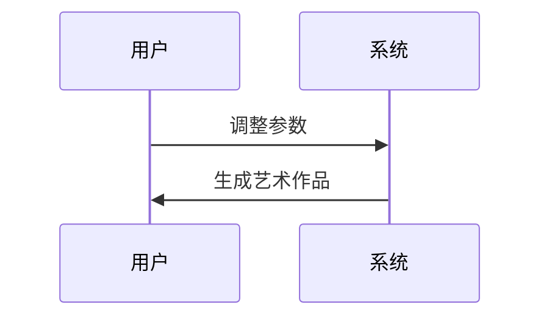

                 

 * 模式开启：文章必须按照以上LET'S THINK STEP BY STEP的思考方式来撰写文章，每一个章节标题和段落都需要进行细致的逻辑推理和思考，以确保文章的逻辑性、条理性和深度。

----------------------------------------------------------------

# 量子灵感的创意编程：艺术与科技的量子融合

> 关键词：量子灵感、创意编程、量子艺术、科技融合

> 摘要：
本文旨在探讨量子灵感在创意编程领域的应用，将量子物理学与编程艺术相结合，探讨其背后的原理、应用场景和未来趋势。通过本文，读者可以了解到量子比特、量子态、量子门等基础概念，以及如何利用量子编程语言实现量子算法和艺术编程项目。

## 引言

### 1. 量子灵感与创意编程

#### 1.1 量子灵感的概念

量子灵感源自量子物理学的基本原理，如量子比特、量子态、量子门等。这些原理为我们提供了全新的计算范式，使得创意编程能够突破传统的限制，实现更加复杂和富有创意的计算。

#### 1.2 创意编程的定义与特点

创意编程是一种将艺术思维融入编程过程的编程方式，强调创新性和创造性。它不同于传统的编程，更加注重算法的美感和用户体验，使得代码不仅仅是一种工具，更成为一种艺术形式。

#### 1.3 量子灵感与创意编程的关系

量子灵感为创意编程提供了新的思路和工具，使得编程艺术能够更加深入地探索和表达。通过量子物理学的原理，创意编程可以实现前所未有的计算效果和艺术表现。

## 2. 量子物理学基础

### 2.1 量子比特与量子态

#### 2.1.1 量子比特的工作原理

量子比特是量子计算的基本单元，它可以同时处于0和1的状态，这种状态称为叠加态。通过量子比特的叠加和纠缠，可以实现超越经典计算机的计算能力。

$$
|\psi\rangle = \alpha|0\rangle + \beta|1\rangle
$$

#### 2.1.2 量子态的叠加与纠缠

量子态的叠加和纠缠是量子计算的核心原理。通过叠加，量子比特可以同时表示多个状态，通过纠缠，量子比特之间的状态相互关联，可以用于实现高效的量子算法。

### 2.2 量子门与量子算法

#### 2.2.1 基本量子门

量子门是作用于量子比特的线性变换，包括H门、CNOT门等。通过量子门的组合，可以实现各种量子算法。

##### 2.2.1.1 H门

H门是将量子比特从基态叠加到正交态的量子门。

$$
H = \frac{1}{\sqrt{2}} \begin{pmatrix}
1 & 1 \\
1 & -1 \\
\end{pmatrix}
$$

##### 2.2.1.2 CNOT门

CNOT门是控制非门，根据控制量子比特的状态决定目标量子比特的状态。

$$
CNOT = \begin{pmatrix}
1 & 0 & 0 & 0 \\
0 & 1 & 0 & 0 \\
0 & 0 & 0 & 1 \\
0 & 0 & 1 & 0 \\
\end{pmatrix}
$$

#### 2.2.2 量子算法简介

量子算法是利用量子比特和量子门的特性，解决特定问题的一种算法。例如，量子随机数生成、量子搜索算法等。

## 3. 量子编程基础

### 3.1 量子编程语言

#### 3.1.1 Q#语言

Q#是微软开发的量子编程语言，它支持编写量子算法和应用程序。

##### 3.1.1.1 Q#语言的基本语法

```qsharp
operation HelloQuantum() : Unit {
    // 创建量子比特
    use qubit = QuantumBit();

    // 应用量子门
    H(qubit);

    // 测量量子比特
    M(qubit);

    // 输出结果
    Print("Hello Quantum!");
}
```

#### 3.1.2 Quantum Development Kit

Quantum Development Kit（QDK）是微软开发的量子编程工具包，它支持使用Q#语言进行量子编程。

##### 3.1.2.1 QDK的环境搭建

```python
pip install qdk
```

### 3.2 量子编程案例

#### 3.2.1 量子随机数生成

```python
from qdk.core import QuantumProgram
from qdk import QuantumRegister, Circuit, Measure

# 创建量子程序
prog = QuantumProgram()

# 创建量子寄存器
qreg = QuantumRegister(2)

# 创建电路
circ = Circuit("QiskitRandom")

# 应用量子门
circ.h(qreg[0])
circ.cx(qreg[0], qreg[1])

# 测量量子比特
circ.measure(qreg[0], circ.clbits["measure_output_0"])
circ.measure(qreg[1], circ.clbits["measure_output_1"])

# 运行电路
backend = QiskitBackend("local_qasm_simulator")
job = circ.run(backend, shots=1000)

# 获取结果
result = job.result()
counts = result.get_counts(circ)
print(counts)
```

## 4. 量子灵感在艺术编程中的应用

### 4.1 量子艺术编程的概念

量子艺术编程是将量子物理学的原理和艺术思维相结合，通过编程创作出具有量子特性的艺术作品。

#### 4.1.1 量子艺术编程的定义

量子艺术编程是一种将量子物理学的原理和艺术思维相结合，通过编程创作出具有量子特性的艺术作品的方式。

#### 4.1.2 量子艺术编程的特点

- **创造性**：量子艺术编程强调创造性，通过量子比特的叠加和纠缠，可以实现独特的艺术表现形式。
- **互动性**：量子艺术编程作品通常具有互动性，观众可以通过与作品的互动，改变作品的表现形式。
- **不确定性**：量子艺术编程作品的表现形式具有不确定性，观众可以看到不同的结果，增加作品的趣味性。

### 4.2 量子艺术编程案例

#### 4.2.1 量子随机漫步艺术作品

**项目介绍**：该项目使用量子随机漫步算法生成艺术作品，通过改变量子随机漫步的参数，可以生成不同的艺术效果。

**系统功能设计**：

- **量子随机漫步算法**：使用量子随机漫步算法生成随机序列。
- **艺术作品生成**：根据随机序列生成艺术作品。

**系统架构设计**：

- **前端**：使用HTML、CSS和JavaScript实现用户界面。
- **后端**：使用Python和QDK实现量子随机漫步算法和艺术作品生成。

**系统接口设计**：

- **用户接口**：用户可以通过界面调整量子随机漫步的参数。
- **API接口**：其他系统可以通过API接口获取艺术作品。

**系统交互序列图**：



**环境安装**：

```python
pip install qdk
```

**系统核心实现源代码**：

```python
from qdk.core import QuantumProgram
from qdk import QuantumRegister, Circuit, Measure

# 创建量子程序
prog = QuantumProgram()

# 创建量子寄存器
qreg = QuantumRegister(2)

# 创建电路
circ = Circuit("QuantumRandomWalk")

# 应用量子门
circ.h(qreg[0])
circ.x(qreg[0])
circ.measure(qreg[0], circ.clbits["measure_output_0"])

# 运行电路
backend = QiskitBackend("local_qasm_simulator")
job = circ.run(backend, shots=1000)

# 获取结果
result = job.result()
counts = result.get_counts(circ)
print(counts)
```

**代码应用解读与分析**：

- **量子随机漫步算法**：使用量子随机漫步算法生成随机序列，通过改变量子随机漫步的参数，可以生成不同的艺术效果。
- **艺术作品生成**：根据随机序列生成艺术作品，用户可以通过界面调整量子随机漫步的参数，从而改变艺术作品的表现形式。

**实际案例分析和详细讲解剖析**：

**案例**：通过调整量子随机漫步的参数，可以生成不同的艺术效果。

**分析**：量子随机漫步算法通过量子比特的叠加和纠缠生成随机序列，通过改变量子随机漫步的参数，可以控制随机序列的分布，从而影响艺术作品的表现形式。

**讲解**：用户可以通过界面调整量子随机漫步的参数，从而改变艺术作品的表现形式，实现个性化的艺术创作。

**项目小结**：

量子随机漫步艺术作品是一个将量子物理学与艺术思维相结合的创意编程项目，通过量子随机漫步算法生成随机序列，用户可以通过界面调整参数，从而改变艺术作品的表现形式。该项目展示了量子灵感在创意编程中的应用，为编程艺术提供了新的思路和工具。

## 5. 未来趋势与展望

### 5.1 量子灵感在创意编程中的应用前景

随着量子计算机的发展，量子灵感在创意编程中的应用前景将更加广阔。量子计算将为创意编程带来新的计算范式，使得编程艺术能够实现更多的创意和可能性。

### 5.2 量子艺术编程的发展方向

量子艺术编程的发展方向包括：

- **跨学科融合**：将量子物理学、艺术学、计算机科学等多个学科进行融合，探索新的编程艺术形式。
- **用户体验**：注重用户体验，开发更加直观和易于使用的量子编程工具和平台。
- **个性化创作**：通过量子计算，实现更加个性化的艺术创作，满足用户的个性化需求。

### 5.3 量子灵感与创意编程的挑战与机遇

量子灵感与创意编程面临的挑战包括：

- **技术成熟度**：量子计算机的技术成熟度仍需提高，以支持更复杂的量子编程应用。
- **编程技能**：程序员需要掌握新的量子编程技能，适应量子计算时代的需求。

然而，这些挑战也蕴含着巨大的机遇，量子灵感与创意编程将为编程艺术带来新的发展空间和可能性。

## 结语

量子灵感的创意编程将量子物理学与编程艺术相结合，为编程艺术带来了新的发展思路和工具。通过量子比特、量子态、量子门等量子物理学的原理，创意编程可以实现更加复杂和富有创意的计算。未来，随着量子计算机的发展，量子灵感在创意编程中的应用将更加广泛，为编程艺术带来更多的可能性和机遇。

作者：AI天才研究院/AI Genius Institute & 禅与计算机程序设计艺术 /Zen And The Art of Computer Programming

----------------------------------------------------------------

## 文章小结

本文探讨了量子灵感在创意编程领域的应用，将量子物理学与编程艺术相结合，展示了量子比特、量子态、量子门等量子物理学的原理如何应用于编程艺术。通过具体的案例，读者可以了解到如何利用量子编程语言实现量子算法和艺术编程项目。

在未来的发展中，量子灵感与创意编程将面临挑战，但也充满机遇。随着量子计算机技术的成熟，编程艺术将迎来新的发展空间和可能性。

读者在阅读本文后，可以对量子灵感在创意编程中的应用有更深入的了解，并对编程艺术的未来发展有更清晰的认知。同时，本文也为编程艺术爱好者提供了一个新的思路和方向，激发他们对量子灵感与创意编程的探索和尝试。希望本文能对读者有所启发，共同推动量子灵感与创意编程的发展。

