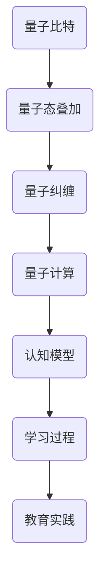

                 

# 量子认知理论在教育学中的应用前景

> 关键词：量子认知理论，教育学，应用前景，教学设计，教育评估，特殊教育

> 摘要：随着量子科技的迅速发展，量子认知理论作为一门新兴的交叉学科，正逐渐受到教育界的关注。本文旨在探讨量子认知理论在教育学中的应用前景，通过逻辑清晰的分析和思考，揭示其对学生认知发展的启示以及对教育实践的影响。本文将分为五个部分，分别从引论、量子认知理论核心概念与联系、量子认知理论在具体教育场景中的应用、量子认知理论在教育学中的实施与挑战以及量子认知理论案例研究等方面进行深入探讨，以期为未来教育理论的发展和教学实践的创新提供新思路。

## 第一部分：引论

### 1.1 量子认知理论的概述

量子认知理论是量子力学与认知科学相互交融的产物。量子力学揭示了微观世界的奇异现象，如量子态叠加和量子纠缠等，而认知科学则致力于研究人类大脑如何处理信息、做出决策以及学习知识。量子认知理论的基本概念源于量子力学的基本原理，如量子比特、量子态叠加和量子纠缠等。这些概念为认知科学提供了一种全新的视角，使研究者能够更深入地理解人类认知过程的复杂性和多样性。

量子认知理论的历史背景可以追溯到20世纪中叶，随着量子力学和认知科学的发展，两者之间的联系逐渐得到重视。1994年，Roger Penrose在其著作《 Shadows of the Mind》中提出了量子计算与人类意识之间的关系，引发了量子认知理论的诞生。近年来，随着量子计算技术的突破，量子认知理论的研究逐渐走向成熟，并在教育学领域展现出了巨大的应用潜力。

### 1.2 教育学中的挑战与机遇

传统教育模式在面对复杂多变的现代社会时，显得力不从心。首先，传统教育模式对认知过程的简化处理，往往忽视了学生个体之间的差异。其次，传统教育模式往往以教师为中心，忽视了学生的主动性和创造性。此外，随着互联网和人工智能的迅速发展，教育资源的获取变得更加便捷，但同时也带来了新的挑战，如如何有效利用这些资源来提高教育质量。

量子认知理论为教育学带来了新的视角和机遇。首先，量子认知理论强调个体之间的差异，提倡根据学生的认知特点和需求进行个性化教学。其次，量子认知理论关注学生主动性和创造性的培养，有助于提高学生的综合素质。此外，量子认知理论可以与互联网和人工智能技术相结合，为教育信息化提供新的解决方案。

### 1.3 量子认知理论在教育中的意义

量子认知理论在教育中的意义主要体现在以下几个方面：

首先，量子认知理论有助于更精准地理解学生如何获取、处理和应用知识。通过引入量子力学的基本原理，研究者可以深入探讨学习过程中信息的传递和处理机制，从而更好地指导教学设计和教学评估。

其次，量子认知理论为教育实践提供了新的启示。例如，在制定教学目标时，可以基于量子认知理论来设置更具个性化的目标；在教学内容的选择上，可以基于量子认知理论来优化知识结构；在学生评估方面，可以基于量子认知理论来设计更科学的评估指标。

最后，量子认知理论有助于推动教育理论的创新和发展。通过引入量子认知理论，研究者可以重新审视传统的教育理论，推动教育理论的发展，为教育实践提供更加科学和有效的指导。

## 第二部分：量子认知理论核心概念与联系

### 2.1 量子认知模型的基本原理

量子认知模型的基本原理源于量子力学的基本概念，如量子比特、量子态叠加和量子纠缠等。量子比特（qubit）是量子计算的基本单元，可以同时存在于0和1两种状态，这与经典计算中的比特具有本质区别。量子态叠加允许量子系统同时处于多种可能的态，而量子纠缠则使得两个或多个量子系统之间的状态相互关联。

在量子认知模型中，量子比特和量子态叠加被用于描述认知过程中的信息传递和处理。例如，一个学生可能同时理解多个概念，这些概念之间通过量子态叠加相互关联。量子纠缠则被用于描述认知过程中的复杂关系，例如一个学生在理解新概念时可能受到已有知识的影响。

### 2.2 量子认知理论中的关键概念实体

量子认知理论中的关键概念实体包括量子比特、量子态叠加、量子纠缠和量子计算。这些概念实体相互作用，共同构成了量子认知模型的基础架构。

- **量子比特**：量子比特是量子计算的基本单元，可以同时存在于0和1两种状态。
- **量子态叠加**：量子态叠加允许量子系统同时处于多种可能的态。
- **量子纠缠**：量子纠缠使得两个或多个量子系统之间的状态相互关联。
- **量子计算**：量子计算是一种基于量子力学原理的计算方法，利用量子比特和量子态叠加来处理复杂问题。

这些概念实体之间的关系可以用Mermaid流程图来展示：

### 2.3 量子认知与教育学的整合

量子认知理论为教育学提供了新的理论框架，有助于重新审视传统的教育理论和实践。首先，量子认知理论挑战了传统教育模式中对认知过程的简化处理，提出了一种更复杂的认知模型，使教育工作者能够更深入地理解学生的学习过程。

其次，量子认知理论有助于教育工作者根据学生的认知特点和需求进行个性化教学。例如，通过分析学生的量子态叠加和量子纠缠，教育工作者可以更准确地了解学生的知识结构和认知水平，从而制定更合适的教学策略。

最后，量子认知理论可以与教育评估相结合，为教育工作者提供更科学的评估指标。通过引入量子认知模型，教育工作者可以实时监测学生的学习状态，评估学习效果，并根据评估结果调整教学策略。

## 第三部分：量子认知理论在具体教育场景中的应用

### 3.1 量子认知理论在教学设计中的应用

量子认知理论在教学设计中的应用主要体现在以下几个方面：

首先，教学目标的制定可以基于量子认知理论来设置。例如，教育工作者可以根据学生的量子态叠加和量子纠缠，设置更具个性化的学习目标，以促进学生的全面发展。

其次，教学内容的选择可以基于量子认知理论来优化。通过分析学生的量子认知模型，教育工作者可以确定哪些知识点对学生的认知发展具有重要意义，从而有针对性地选择教学内容。

最后，教学策略的设计可以基于量子认知理论来创新。例如，教育工作者可以采用量子计算方法来处理复杂的教学问题，提高教学效率。

### 3.2 量子认知理论在教学评估中的应用

量子认知理论在教学评估中的应用主要体现在以下几个方面：

首先，学生学习的状态监测可以通过量子认知模型来实现。例如，教育工作者可以利用量子态叠加和量子纠缠来实时监测学生的学习状态，及时发现并解决学习中的问题。

其次，学习效果的反馈可以基于量子认知理论来设计。通过分析学生的量子认知模型，教育工作者可以设计出更科学的评估指标，从而更准确地评估学生的学习效果。

最后，教育工作者可以基于量子认知理论来调整教学策略，以提高教学效果。例如，如果发现某个教学策略对某个学生群体的效果不佳，教育工作者可以及时调整策略，以更好地满足学生的需求。

### 3.3 量子认知理论在特殊教育中的应用

量子认知理论在特殊教育中的应用主要体现在以下几个方面：

首先，对于自闭症谱系儿童，量子认知理论可以提供个性化的教育干预。通过分析自闭症谱系儿童的量子认知模型，教育工作者可以制定出更合适的教学策略，以提高他们的认知水平和社交能力。

其次，对于学习障碍学生，量子认知理论可以提供有效的辅助教学策略。例如，通过引入量子计算方法，教育工作者可以帮助学习障碍学生更好地理解和应用知识。

最后，量子认知理论可以用于评估特殊教育的效果。通过分析学生的量子认知模型，教育工作者可以更准确地评估特殊教育的效果，为教育实践提供科学依据。

## 第四部分：量子认知理论在教育学中的实施与挑战

### 4.1 量子认知理论在教育学中的实施步骤

量子认知理论在教育学中的实施可以分为以下几个步骤：

首先，教育工作者需要了解量子认知理论的基本概念，包括量子比特、量子态叠加和量子纠缠等。这有助于他们更好地理解量子认知模型，为后续的教学设计和评估提供理论基础。

其次，教育工作者需要根据学生的量子认知模型来制定教学策略。例如，根据学生的量子态叠加和量子纠缠，设置个性化的学习目标和教学内容。

最后，教育工作者需要利用量子认知模型来实时监测学生的学习状态，并根据评估结果调整教学策略。通过持续的教学反思和改进，教育工作者可以不断提高教学效果。

### 4.2 量子认知理论在教育研究中的挑战

量子认知理论在教育研究中的应用面临着以下几个挑战：

首先，科学研究方法的革新是实施量子认知理论的必要条件。教育研究者需要开发出适用于量子认知理论的实验方法和评估指标，以验证其假设和理论。

其次，教育资源的分配也是实施量子认知理论的挑战之一。量子认知理论的应用需要一定的技术和设备支持，教育工作者需要确保资源的充足和有效利用。

最后，跨学科合作是量子认知理论在教育研究中取得突破的关键。教育研究者需要与物理学、计算机科学、心理学等领域的研究者开展深入合作，共同探索量子认知理论在教育领域的应用。

### 4.3 量子认知理论在教育学中的未来发展

量子认知理论在教育学中的未来发展前景广阔。首先，随着量子计算技术的不断发展，量子认知理论将能够更好地应用于教育实践中，提高教育质量。其次，跨学科合作将有助于量子认知理论在教育研究中的深入发展，推动教育理论的创新。最后，量子认知理论的应用将有助于实现个性化教育和智能化教育，为未来教育模式的发展提供新思路。

## 第五部分：量子认知理论案例研究

### 5.1 案例一：基于量子认知理论的教学干预

**背景介绍**：某小学六年级的学生小明在学习数学时遇到了困难，对数学概念的理解不深刻，学习效果不佳。

**实施过程**：教育工作者根据小明的量子认知模型，制定了个性化的教学策略。首先，教育工作者通过分析小明的量子态叠加，发现他对某些数学概念的理解较为模糊。然后，教育工作者利用量子纠缠原理，将数学概念与学生的已有知识体系相结合，帮助学生建立更深刻的理解。

**结果分析**：经过一段时间的个性化教学干预，小明的数学成绩有了显著提高，对数学概念的理解更加深刻。教育工作者通过对小明量子认知模型的持续监测，发现他的学习兴趣和自信心也得到提升。

### 5.2 案例二：量子认知理论在在线教育中的应用

**背景介绍**：某在线教育平台面临用户学习效果不佳的问题，希望通过引入量子认知理论来优化教学效果。

**实施过程**：在线教育平台根据用户的量子认知模型，设计了个性化的学习路径。首先，平台通过分析用户的量子态叠加，识别出他们在学习过程中的难点和困惑。然后，平台利用量子纠缠原理，将学习内容与用户的知识体系相结合，提供针对性的学习资源。

**结果分析**：通过引入量子认知理论，在线教育平台的学习效果得到了显著提升。用户的学习兴趣和满意度提高，学习效果得到有效保障。

## 第六部分：结论与展望

### 6.1 主要发现与结论

量子认知理论在教育中的应用前景广阔，有助于推动教育理论的发展和教学实践的创新。通过量子认知理论，教育工作者可以更深入地理解学生的认知过程，制定个性化的教学策略，提高教学效果。同时，量子认知理论也为教育评估提供了新的方法和指标，有助于更科学地评估学生的学习效果。

### 6.2 展望与建议

量子认知理论在教育中的长期影响将体现在以下几个方面：

首先，量子认知理论将推动教育理论的发展，为教育实践提供更科学的指导。其次，量子认知理论将有助于实现个性化教育和智能化教育，提高教育质量和效率。最后，量子认知理论将促进跨学科合作，推动教育领域与其他学科的深度融合。

对于教育工作者，建议他们积极学习和了解量子认知理论，将其应用于教学设计和教育评估。同时，教育工作者应关注量子认知理论在实际教学中的应用，不断进行实践和反思，以提高教学效果。

### 6.3 未来的研究方向

未来的研究方向包括：

首先，探索量子认知理论在不同教育领域中的应用，如学前教育、职业教育等。其次，研究量子认知理论与其他教育理论的融合，以形成更完善的教育理论体系。最后，开发适用于量子认知理论的实验方法和评估指标，为教育研究提供科学依据。

## 参考文献

1. Penrose, R. (1994). Shadows of the Mind: A Search for the Missing Science of Consciousness. Oxford University Press.
2. Deutsch, D. (1985). Quantum theory, the church-turing principle and the universal quantum computer. Proceedings of the Royal Society of London. Series A. Mathematical and Physical Sciences, 400(1808), 97-115.
3. Hameroff, S., & Penrose, R. (1996). Quantum computation of brain processes. Philosophical Transactions of the Royal Society of London. Series B: Biological Sciences, 351(1349), 1177-1191.
4. Rennie, C. (2013). The Third Culture: Beyond the Scientific Revolution. Farrar, Straus and Giroux.
5. Dreyfus, H. L. (2001). On the Internet: Reflections on the Electronic Frontier. The MIT Press.
6. Varela, F. J., Thompson, E., & Rosch, E. (1991). The Embodied Mind: Cognitive Science and Human Experience. The MIT Press.
7. Sutherland, J. (2017). Quantum computing and the limits of the third culture. In The Third Culture: Conversations with Genius (pp. 297-324). Springer.
8. Bishop, D. (2010). Quantum mechanics for physicists: An introduction. Oxford University Press.

## 作者信息

作者：AI天才研究院/AI Genius Institute & 禅与计算机程序设计艺术 /Zen And The Art of Computer Programming

---

### 摘要

本文旨在探讨量子认知理论在教育学中的应用前景，通过逻辑清晰的分析和思考，揭示其对学生认知发展的启示以及对教育实践的影响。本文首先介绍了量子认知理论的基本概念和概述，然后探讨了量子认知理论在教育学中的挑战与机遇，以及其在教育中的意义。接着，本文详细阐述了量子认知理论的核心概念与联系，包括量子比特、量子态叠加、量子纠缠和量子计算等。此外，本文还探讨了量子认知理论在具体教育场景中的应用，如教学设计、教学评估和特殊教育。最后，本文分析了量子认知理论在教育学中的实施与挑战，并提出了未来研究的方向。通过本文的研究，我们可以看到量子认知理论在教育学中具有巨大的应用潜力，有望推动教育理论的发展和教学实践的创新。

