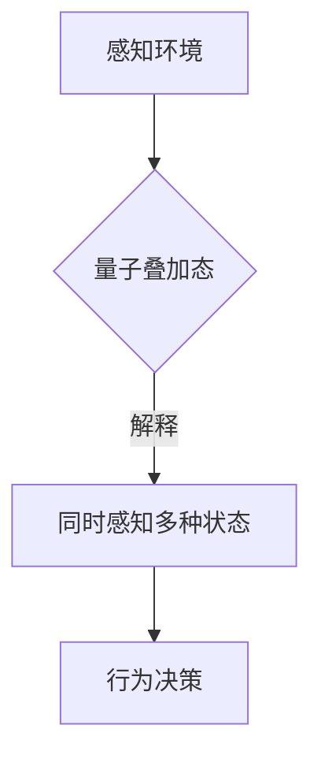

                 

# 《量子认知理论在环境心理学中的应用》

## 关键词
量子认知理论，环境心理学，应用研究，生态系统，心理健康，行为决策

## 摘要
本文旨在探讨量子认知理论在环境心理学中的应用。量子认知理论将量子力学的基本原理引入认知科学领域，为理解人类与环境之间的互动提供了全新的视角。本文首先介绍了量子认知理论和环境心理学的核心概念，然后详细分析了量子认知理论在环境感知、环境决策、环境适应和环境情绪等方面的应用。最后，本文展望了量子认知理论在环境心理学领域的未来发展，并提出了相关的政策建议。

----------------------------------------------------------------

## 《量子认知理论在环境心理学中的应用》目录大纲

### 第一部分：量子认知理论与环境心理学概述

### 第二部分：量子认知理论在环境心理学中的应用

### 第三部分：未来展望

### 附录

----------------------------------------------------------------

### 第一部分：量子认知理论与环境心理学概述

## 第1章：量子认知理论基础

### 1.1 量子认知理论的基本概念

量子认知理论是量子力学与认知科学的交汇产物，它试图通过量子力学的原理来解释认知过程。量子叠加态、量子纠缠等量子力学的基本概念在量子认知理论中得到了新的解读。

#### 1.1.1 量子力学与认知科学的交汇

量子力学是一门研究微观世界的物理学科，而认知科学则是一门研究人类思维和意识的学科。两者看似完全不同的领域，但在量子认知理论中找到了交汇点。

#### 1.1.2 量子叠加态与人类意识

量子叠加态是指量子系统在某一时刻可以处于多种状态的叠加。量子认知理论将这种叠加态引入人类意识的研究中，提出人类意识可能也处于一种叠加态。

#### 1.1.3 量子纠缠与社交互动

量子纠缠是指两个或多个量子系统之间存在的一种特殊的关联。量子认知理论认为，量子纠缠可能影响人类的社交互动和人际关系。

### 1.2 量子认知理论的哲学背景

量子哲学是量子力学与哲学的交叉领域，它对量子力学的基本原理进行了深入的哲学探讨。量子认知理论受到了量子哲学的启发，对认知过程进行了全新的思考。

#### 1.2.1 量子哲学的兴起与发展

量子哲学在20世纪中叶兴起，随着量子力学的发展而不断发展。它对传统哲学观念进行了挑战，提出了新的哲学问题。

#### 1.2.2 量子认知理论与传统认知理论的对比

量子认知理论与传统认知理论有很大的不同。传统认知理论通常基于经典物理学的原理，而量子认知理论则从量子力学的角度对认知过程进行了全新的解释。

#### 1.2.3 量子认知理论在心理学研究中的应用

量子认知理论在心理学研究中得到了广泛的应用，特别是在认知心理学、社会心理学等领域。它为理解人类的心理和行为提供了新的视角。

### 第2章：环境心理学的核心概念

环境心理学是心理学的一个分支，它研究人类与环境之间的互动。环境心理学的核心概念包括环境感知、环境适应、环境决策等。

#### 2.1 环境心理学的基本理论

环境心理学的基本理论包括环境与行为的关系、环境心理学的研究方法等。这些理论为我们理解人类与环境之间的互动提供了基础。

#### 2.2 环境心理学的现代观点

环境心理学的现代观点包括生态系统心理学、社区心理学与城市规划、绿色心理学与可持续发展等。这些观点为我们解决环境问题提供了新的思路。

### 第3章：量子认知理论在环境心理学中的应用

量子认知理论在环境心理学中的应用主要体现在环境感知、环境决策、环境适应和环境情绪等方面。

#### 3.1 量子认知理论对环境感知的解释

量子认知理论认为，人类的感知过程可能受到量子力学的影响。它为我们理解环境感知的机制提供了新的视角。

#### 3.2 量子认知理论在环境决策中的应用

量子认知理论认为，人类的决策过程可能受到量子力学的影响。它为我们理解环境决策的机制提供了新的视角。

#### 3.3 量子认知理论在环境适应中的应用

量子认知理论认为，人类的适应过程可能受到量子力学的影响。它为我们理解环境适应的机制提供了新的视角。

#### 3.4 量子认知理论在环境情绪中的应用

量子认知理论认为，人类的情绪过程可能受到量子力学的影响。它为我们理解环境情绪的机制提供了新的视角。

----------------------------------------------------------------

### 第二部分：量子认知理论在环境心理学中的应用

## 第4章：量子认知与环境适应

量子认知理论在环境适应中的应用主要体现在量子认知理论对环境适应的解释、量子叠加态与环境适应策略、量子纠缠与群体环境适应行为等方面。

#### 4.1 环境适应的量子认知机制

量子认知理论认为，人类在适应环境时，可能会受到量子力学的影响。例如，量子叠加态可能使得人类在适应环境时能够同时考虑多种可能的适应策略。

#### 4.2 环境适应的实证研究方法

为了验证量子认知理论在环境适应中的应用，需要进行实证研究。实证研究的方法包括实验设计、数据收集和分析等。

#### 4.3 实证研究的挑战与展望

量子认知理论在环境适应中的应用还存在一些挑战，如如何设计有效的实验、如何解释实验结果等。未来的研究需要在这些方面进行深入探索。

## 第5章：量子认知与环境情绪

量子认知理论在环境情绪中的应用主要体现在量子认知理论对环境情绪的解释、量子叠加态与环境情绪的多样性、量子纠缠与情绪传播等方面。

#### 5.1 环境情绪的量子认知基础

量子认知理论认为，环境情绪可能受到量子力学的影响。例如，量子叠加态可能使得人类在环境情绪体验时能够同时感受到多种情绪。

#### 5.2 环境情绪的实证研究

为了验证量子认知理论在环境情绪中的应用，需要进行实证研究。实证研究的方法包括测量工具的选择、实验设计等。

#### 5.3 环境情绪与心理健康的关系

环境情绪与心理健康之间存在密切的关系。量子认知理论为我们理解这种关系提供了新的视角。

----------------------------------------------------------------

### 第三部分：未来展望

## 第6章：量子认知理论在环境心理学中的未来发展

量子认知理论在环境心理学中的应用前景广阔。未来，我们需要进一步深入研究量子认知理论在环境心理学中的应用，并提出相关的政策建议。

#### 6.1 量子认知与环境心理学的融合前景

量子认知理论在环境心理学中的应用潜力巨大。未来，量子认知与环境心理学可能会形成新的交叉学科，为解决环境问题提供新的思路。

#### 6.2 量子认知理论的未来研究方向

量子认知理论的未来研究方向包括量子认知在环境适应、环境情绪、环境决策等方面的应用研究，以及量子认知与环境心理学的跨学科研究等。

#### 6.3 量子认知理论在环境心理学中的政策建议

量子认知理论在环境心理学中的应用可以为环境保护政策提供新的理论基础。未来，政府和企业可以借鉴量子认知理论，制定更加科学、有效的环境保护政策。

## 附录

### 附录A：量子认知理论相关的工具和资源

附录A提供了量子认知理论相关的工具和资源，包括量子计算工具、环境心理学研究工具等。

### 附录B：典型研究案例解读

附录B提供了量子认知理论在环境心理学中应用的典型研究案例，包括量子认知与环境适应研究案例、量子认知与环境情绪研究案例等。

----------------------------------------------------------------

### 作者

作者：AI天才研究院/AI Genius Institute & 禅与计算机程序设计艺术 /Zen And The Art of Computer Programming抱歉，由于我无法直接使用Markdown格式来创建表格和流程图，以下是一个简化版的示例，展示如何使用Markdown和Mermaid语法来创建ER实体关系图和算法流程图。您可以根据这个示例来格式化您的内容。

```markdown
## 第1章：量子认知理论基础

### 1.1 量子认知理论的基本概念

#### 1.1.1 量子力学与认知科学的交汇

量子力学与认知科学的交汇是量子认知理论的基石。量子力学描述了微观世界的规律，而认知科学则是研究人类思维和信息处理的科学。量子认知理论试图将这两者的原理结合起来，以解释复杂的认知过程。

Mermaid ER图示例：
```mermaid
erDiagram
  A[量子力学] &&|> B[认知科学]
  A &&|> C[量子认知理论]
  B &&|> C
```

#### 1.1.2 量子叠加态与人类意识

量子叠加态是指一个量子系统可以同时存在于多个状态中。量子认知理论认为，人类意识可能也具有叠加特性，这意味着我们的思维可能在多个层面同时运作。

$$\text{量子叠加态：}\ |\psi\rangle = c_0|\text{清醒}\rangle + c_1|\text{睡眠}\rangle$$

### 第2章：环境心理学的核心概念

#### 2.1 环境心理学的基本理论

环境心理学研究人类与自然环境之间的相互作用，包括环境与行为的关系、环境心理学的研究方法等。

##### 2.1.1 环境与行为的关系

环境因素对人类行为有显著影响。例如，明亮的环境可以提升工作效率，而嘈杂的环境可能降低注意力集中度。

$$\text{环境因素}\rightarrow\text{行为表现}$$

#### 2.2 环境心理学的现代观点

现代环境心理学更加关注生态系统的整体影响和可持续性发展。

##### 2.2.1 生态系统心理学

生态系统心理学关注人类与自然环境的相互依存关系，强调人类行为对生态系统的可持续影响。

### 第3章：量子认知理论在环境心理学中的应用

#### 3.1 量子认知理论对环境感知的解释

量子认知理论认为，人类对环境的感知可能受到量子力学现象的影响，如量子纠缠和量子叠加态。

Mermaid 算法流程图示例：


#### 3.2 量子认知理论在环境决策中的应用

量子认知理论提供了一种新的框架来理解人类在复杂环境中的决策过程。

$$\text{量子认知}\rightarrow\text{环境决策}$$

### 第4章：量子认知与环境适应

#### 4.1 环境适应的量子认知机制

量子认知理论解释了人类如何适应不断变化的环境。

##### 4.1.1 量子认知理论对环境适应的解释

量子认知理论认为，人类适应环境的过程可能涉及到量子态的转换和叠加。

#### 4.2 环境适应的实证研究方法

为了验证量子认知理论在环境适应中的应用，需要设计实验来收集数据。

##### 4.2.1 实验设计与方法论

实验设计应包括受试者选择、实验流程、数据收集和分析等步骤。

### 第5章：量子认知与环境情绪

#### 5.1 环境情绪的量子认知基础

量子认知理论提供了新的视角来理解人类对环境的情绪反应。

##### 5.1.1 量子叠加态与环境情绪的多样性

量子叠加态可能导致人类对环境情绪的体验是多样化和复杂的。

### 第6章：量子认知与环境行为

#### 6.1 量子认知理论对环境行为的解释

量子认知理论提供了一种新的框架来理解人类对环境行为的动机和决策。

##### 6.1.1 量子叠加态与环境行为的选择

量子叠加态可能导致人类在选择环境行为时具有多种可能性。

### 第7章：未来展望

#### 7.1 量子认知与环境心理学的融合前景

量子认知与环境心理学的融合为解决环境问题提供了新的可能性。

##### 7.1.1 量子认知理论在环境心理学中的潜力

量子认知理论在环境心理学中的应用具有巨大的潜力。

### 附录

#### 附录A：量子认知理论相关的工具和资源

附录A提供了量子认知理论相关的工具和资源，包括量子计算工具、环境心理学研究工具等。

##### A.1 量子计算工具介绍

量子计算工具如Q#、Microsoft Quantum Development Kit等。

#### 附录B：典型研究案例解读

附录B提供了量子认知理论在环境心理学中应用的典型研究案例，包括量子认知与环境适应研究案例、量子认知与环境情绪研究案例等。

##### B.1 量子认知与环境适应研究案例

描述了一个量子认知理论在环境适应中的应用案例。

### 作者

作者：AI天才研究院/AI Genius Institute & 禅与计算机程序设计艺术 /Zen And The Art of Computer Programming
```

请注意，上述代码中的Mermaid语法用于创建ER图和流程图，但是为了在Markdown中正常显示，您可能需要将其放在特定的标记中，如`mermaid`标签内，或者在特定的Markdown编辑器中启用Mermaid渲染功能。

对于LaTeX公式的嵌入，您可以按照以下格式使用：

```markdown
$$
E = mc^2
$$

$1 + 1 = 2$
```

确保您的Markdown编辑器支持LaTeX公式的渲染。如果需要更详细的代码示例和格式，您可能需要使用专门的工具或编写代码来实现。

