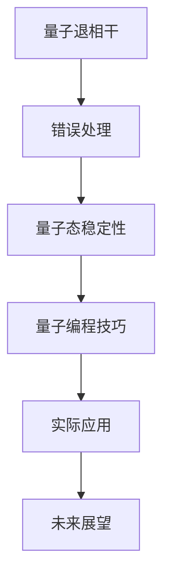

                 

### 文章标题

# 量子退相干与错误处理：维护量子态完整性的编程技巧

### 关键词

- 量子退相干
- 错误处理
- 量子编程技巧
- 维护量子态完整性
- 量子纠错算法

### 摘要

本文深入探讨了量子退相干与错误处理这一关键领域，旨在为读者提供全面的技术指导。我们首先介绍了量子退相干的基础知识，包括其定义、原因、影响及其与量子态稳定性的关系。接着，我们详细阐述了错误处理的基本概念，涵盖了错误与错误检测、错误纠正码、量子纠错算法以及量子错误处理策略。在此基础上，文章进一步探讨了量子退相干与错误处理之间的联系，以及维护量子态完整性的挑战和策略。随后，我们介绍了量子编程技巧，包括量子编程基础、量子算法设计、量子错误检测与纠正，以及量子编程语言与工具。通过实际应用案例，我们展示了量子退相干与错误处理在不同领域的应用。最后，我们对量子退相干与错误处理的发展趋势进行了展望，并总结了全文的主要成果和对未来研究的展望。本文旨在为读者提供一份详细、系统且易于理解的技术指南。

## 目录大纲设计

### 第1章 引言

1.1 书籍背景  
1.2 量子退相干与错误处理的重要性  
1.3 本书的目的和结构  
1.4 本书适用对象

### 第2章 量子退相干基础

2.1 量子退相干的定义  
2.2 量子退相干的原因  
2.3 量子退相干的影响  
2.4 量子退相干与量子态稳定性

### 第3章 错误处理基本概念

3.1 错误与错误检测  
3.2 错误纠正码  
3.3 量子纠错算法  
3.4 量子错误处理策略

### 第4章 量子退相干与错误处理的联系

4.1 量子退相干与错误处理的相互作用  
4.2 维护量子态完整性的挑战  
4.3 量子态恢复方法  
4.4 量子态保护策略

### 第5章 量子编程技巧

5.1 量子编程基础  
5.2 量子算法设计  
5.3 量子错误检测与纠正  
5.4 量子编程语言与工具

### 第6章 实际应用案例

6.1 量子通信中的退相干与错误处理  
6.2 量子计算中的退相干与错误处理  
6.3 量子传感器中的退相干与错误处理

### 第7章 未来展望

7.1 量子退相干与错误处理的发展趋势  
7.2 潜在应用领域  
7.3 面临的挑战与解决方案

### 第8章 结论

8.1 主要成果回顾  
8.2 对未来研究的展望  
8.3 对读者的建议

### 附录

8.1 量子退相干与错误处理常用工具  
8.2 量子退相干与错误处理相关公式与代码

### 文章标题

**量子退相干与错误处理：维护量子态完整性的编程技巧**

### 文章关键词

- 量子退相干
- 错误处理
- 量子编程技巧
- 维护量子态完整性
- 量子纠错算法

### 文章摘要

本文旨在深入探讨量子退相干与错误处理这一关键领域，为读者提供全面的技术指导。我们首先介绍了量子退相干的基础知识，详细阐述了其定义、原因、影响及其与量子态稳定性的关系。接着，我们探讨了错误处理的基本概念，包括错误与错误检测、错误纠正码、量子纠错算法以及量子错误处理策略。在此基础上，文章进一步探讨了量子退相干与错误处理之间的联系，以及维护量子态完整性的挑战和策略。随后，我们介绍了量子编程技巧，包括量子编程基础、量子算法设计、量子错误检测与纠正，以及量子编程语言与工具。通过实际应用案例，我们展示了量子退相干与错误处理在不同领域的应用。最后，我们对量子退相干与错误处理的发展趋势进行了展望，并总结了全文的主要成果和对未来研究的展望。本文旨在为读者提供一份详细、系统且易于理解的技术指南。

## 第1章 引言

### 1.1 书籍背景

量子退相干与错误处理作为量子信息科学的核心问题，一直备受关注。随着量子技术的快速发展，量子计算机、量子通信和量子传感器等应用领域不断涌现，量子态的稳定性与完整性成为实现这些应用的关键。然而，量子退相干是量子系统中普遍存在的一个现象，它会导致量子态的失真和信息的损失，从而严重影响量子技术的可靠性和效率。因此，研究量子退相干与错误处理技术，寻找有效的方法来维护量子态的完整性，成为当前量子信息科学领域的一个重大挑战。

本书旨在系统地探讨量子退相干与错误处理这一主题，为读者提供全面的技术指导。首先，我们将介绍量子退相干的基础知识，包括其定义、原因、影响及其与量子态稳定性的关系。接着，我们将深入探讨错误处理的基本概念，涵盖错误与错误检测、错误纠正码、量子纠错算法以及量子错误处理策略。在此基础上，我们将探讨量子退相干与错误处理之间的联系，分析维护量子态完整性的挑战和策略。随后，我们将介绍量子编程技巧，包括量子编程基础、量子算法设计、量子错误检测与纠正，以及量子编程语言与工具。通过这些内容，读者将能够全面了解量子退相干与错误处理的技术原理和实践方法。

### 1.2 量子退相干与错误处理的重要性

量子退相干与错误处理的重要性不言而喻。量子计算、量子通信和量子传感等量子技术应用中，量子态的稳定性与完整性是确保其正常运行的关键。量子退相干是量子系统中普遍存在的一个现象，它会导致量子态的失真和信息的损失，从而严重影响量子技术的可靠性和效率。因此，研究量子退相干与错误处理技术，寻找有效的方法来维护量子态的完整性，是量子信息科学领域的一个重大挑战。

首先，量子退相干现象的存在使得量子计算机面临严重的性能退化问题。量子计算机的运行依赖于量子态的叠加和纠缠，而量子退相干会导致量子态的退相干和信息的损失，从而降低量子计算机的计算效率和精度。因此，研究量子退相干与错误处理技术，寻找有效的量子纠错算法和错误检测机制，是提高量子计算机性能的关键。

其次，在量子通信中，量子退相干也是不可忽视的一个问题。量子通信依赖于量子态的传输和纠缠，而量子退相干会导致量子态的失真和信息的损失，从而影响量子通信的可靠性和安全性。因此，研究量子退相干与错误处理技术，开发有效的量子纠错算法和错误检测机制，是确保量子通信稳定性和安全性的重要手段。

此外，在量子传感领域，量子退相干也会对传感精度和灵敏度产生影响。量子传感器利用量子态的特性进行测量，而量子退相干会导致量子态的退相干和信息的损失，从而降低传感精度和灵敏度。因此，研究量子退相干与错误处理技术，提高量子传感器的性能和可靠性，具有重要意义。

总之，量子退相干与错误处理是量子信息科学领域的关键问题，其重要性体现在量子计算、量子通信和量子传感等应用领域。研究量子退相干与错误处理技术，寻找有效的方法来维护量子态的完整性，是推动量子技术发展的重要方向。

### 1.3 本书的目的和结构

本书的目的是系统地探讨量子退相干与错误处理这一关键领域，为读者提供全面的技术指导。通过全面介绍量子退相干的基础知识、错误处理的基本概念、量子编程技巧以及实际应用案例，本书旨在帮助读者深入理解量子退相干与错误处理的技术原理和实践方法。

本书的结构如下：

第1章 引言，介绍量子退相干与错误处理的重要性以及本书的目的和结构。

第2章 量子退相干基础，详细探讨量子退相干的定义、原因、影响及其与量子态稳定性的关系。

第3章 错误处理基本概念，介绍错误与错误检测、错误纠正码、量子纠错算法以及量子错误处理策略。

第4章 量子退相干与错误处理的联系，分析量子退相干与错误处理之间的相互作用，探讨维护量子态完整性的挑战和策略。

第5章 量子编程技巧，介绍量子编程基础、量子算法设计、量子错误检测与纠正以及量子编程语言与工具。

第6章 实际应用案例，展示量子退相干与错误处理在不同领域的应用，包括量子通信、量子计算和量子传感器等。

第7章 未来展望，讨论量子退相干与错误处理技术的发展趋势以及潜在应用领域。

第8章 结论，总结全书的主要成果，对未来的研究进行展望，并对读者提出建议。

通过上述结构，本书旨在为读者提供一份全面、系统且易于理解的技术指南，帮助读者深入掌握量子退相干与错误处理的核心概念和技术。

### 1.4 本书适用对象

本书主要适用于以下几类读者：

1. **量子信息科学领域的研究人员和学者**：本书详细探讨了量子退相干与错误处理的基础知识、算法原理和应用案例，对于从事量子信息科学研究的人员具有很高的参考价值。

2. **量子技术开发者**：无论是量子计算、量子通信还是量子传感器等领域的开发者，本书提供的量子编程技巧和实际应用案例能够帮助他们更好地理解和实现量子退相干与错误处理技术。

3. **计算机科学和工程专业的本科生和研究生**：本书的内容涵盖了量子信息科学和计算机科学的核心知识，适合作为相关课程的参考书籍，有助于学生深入理解和掌握量子技术的基本原理。

4. **技术爱好者**：对于那些对量子技术感兴趣的技术爱好者，本书提供了丰富的知识和实践案例，帮助他们更好地了解量子退相干与错误处理的技术原理和应用前景。

总之，本书旨在为所有对量子退相干与错误处理技术感兴趣的读者提供一份全面、系统且易于理解的技术指南，无论你是专业研究人员还是技术爱好者，都能从中获得有益的知识和启发。

## 第2章 量子退相干基础

### 2.1 量子退相干的定义

量子退相干是指量子系统在与外界环境相互作用过程中，原本处于特定量子态的粒子或系统逐渐失去其量子特性，从而退化到经典态的现象。在量子力学中，量子态的叠加和纠缠是量子信息科学的核心概念。然而，由于外界环境的不确定性和随机性，量子态会经历退相干过程，导致其叠加态和纠缠态的破坏。

量子退相干可以形象地比喻为一只彩色的蝴蝶逐渐失去色彩，变得模糊不清。原本清晰且美丽的蝴蝶图案，在长时间的飞行和振动中，与空气分子发生相互作用，逐渐失去了色彩，变得单调而模糊。同样，量子系统在与环境相互作用时，也会经历类似的退相干过程，导致原本清晰的量子态逐渐模糊，最终退化到经典态。

量子退相干是一个复杂且普遍存在的现象，它不仅发生在量子计算中，也发生在量子通信和量子传感等量子技术领域。了解量子退相干的定义和机制，对于理解和解决量子技术中的稳定性问题具有重要意义。

### 2.2 量子退相干的原因

量子退相干的原因可以分为内部原因和外部原因两个方面。

**内部原因**：
1. **量子态的叠加性**：量子系统中的量子态具有叠加性，即一个量子态可以同时处于多个状态的叠加。这种叠加性使得量子态在空间和时间上具有不确定性，从而增加了退相干的可能性。
2. **量子态的纠缠性**：量子纠缠是量子信息科学的核心概念之一，它描述了两个或多个量子系统之间的强相关性。量子态的纠缠性使得量子系统对外界环境的微小扰动非常敏感，容易发生退相干。

**外部原因**：
1. **环境噪声**：量子系统与外界环境相互作用时，环境噪声是导致退相干的主要原因之一。环境噪声包括热噪声、电磁噪声等，这些噪声会干扰量子态的叠加和纠缠，导致量子态的退相干。
2. **量子系统的非完美性**：在实际应用中，量子系统往往存在非完美性，如量子比特的缺陷、控制器的误差等。这些非完美性会导致量子态的不稳定性，增加退相干的可能性。

了解量子退相干的原因，有助于我们更好地理解和解决量子技术中的稳定性问题，从而提高量子技术的可靠性和效率。

### 2.3 量子退相干的影响

量子退相干对量子技术的影响是多方面的，主要体现在以下几个方面：

1. **量子计算**：量子退相干会导致量子计算机的性能退化。量子计算依赖于量子态的叠加和纠缠，而退相干会导致量子态的失真和信息的损失，从而降低量子计算机的计算效率和精度。研究表明，量子退相干的速度比传统计算机中的噪声传播速度快得多，这使得量子计算机的稳定性成为亟待解决的问题。

2. **量子通信**：量子退相干也会影响量子通信的稳定性和安全性。量子通信依赖于量子态的传输和纠缠，而退相干会导致量子态的失真和信息的损失，从而降低量子通信的可靠性和安全性。为了解决这一问题，研究者们正在研究如何利用量子纠错算法和错误检测机制来维护量子态的完整性。

3. **量子传感**：量子退相干还会影响量子传感器的精度和灵敏度。量子传感器利用量子态的特性进行测量，而退相干会导致量子态的退化，从而降低传感器的测量精度和灵敏度。为了提高量子传感器的性能，研究者们正在探索如何设计和优化量子传感系统，以减少退相干的影响。

总之，量子退相干对量子技术的稳定性和性能有着重要的影响，理解和解决这一问题对于推动量子技术的发展具有重要意义。

### 2.4 量子退相干与量子态稳定性

量子退相干与量子态稳定性是量子信息科学中两个密切相关的概念。量子态稳定性是指量子系统在长时间运行过程中保持其量子特性的能力，而量子退相干则是导致量子态失真和退化的主要原因之一。

首先，量子退相干与量子态稳定性之间存在一种相互作用。量子退相干过程会导致量子态的叠加和纠缠特性逐渐减弱，从而影响量子态的稳定性。在量子计算和量子通信中，量子态的稳定性是确保系统正常运行的关键。因此，量子退相干的减少对于提高量子态稳定性具有重要意义。

其次，量子退相干与量子态稳定性之间的关系可以通过量子纠缠和量子噪声来解释。量子纠缠是量子信息科学的核心概念之一，它描述了两个或多个量子系统之间的强相关性。量子纠缠的存在使得量子系统对外界环境的微小扰动非常敏感，容易发生退相干。而量子噪声则是导致量子退相干的主要原因之一。量子噪声包括热噪声、电磁噪声等，这些噪声会干扰量子态的叠加和纠缠，导致量子态的退相干。

为了维护量子态的稳定性，研究者们提出了多种量子纠错算法和错误检测机制。这些算法和机制旨在通过编码和纠错来减少量子退相干的影响，从而提高量子态的稳定性。例如，量子纠错码是一种有效的量子纠错算法，它通过引入冗余信息来检测和纠正错误，从而提高量子态的稳定性。

总之，量子退相干与量子态稳定性是量子信息科学中两个重要的概念。理解它们之间的相互作用和关系，有助于我们更好地设计和优化量子系统，提高量子技术的可靠性和效率。

### 第3章 错误处理基本概念

#### 3.1 错误与错误检测

错误是量子信息系统中普遍存在的问题，它是指由于量子态的退相干、噪声干扰或其他原因导致的量子信息的不准确性。在量子计算、量子通信和量子传感等应用中，错误的存在会严重影响系统的性能和稳定性。因此，研究和处理错误是量子信息技术发展的重要方向之一。

错误检测是指对量子信息系统中的错误进行识别和定位的过程。错误检测的关键在于如何有效地检测出系统中的错误，并对其进行及时处理。错误检测技术可以分为两种基本类型：静态错误检测和动态错误检测。

**静态错误检测**是指在量子系统运行之前或运行过程中，通过分析系统的初始状态和当前状态，判断系统是否存在错误。这种方法通常依赖于错误检测码，如量子校验码和量子纠错码。量子校验码是一种用于检测量子态错误的编码方法，它通过在量子信息中引入冗余信息，使得系统在检测到错误时能够定位错误的位置。量子纠错码则进一步通过纠正错误，恢复系统的正确状态。

**动态错误检测**是指在量子系统运行过程中，通过实时监测系统的状态，判断是否存在错误。动态错误检测通常依赖于量子噪声分析和量子状态估计技术。量子噪声分析是指通过分析系统中的量子噪声，判断是否存在错误。量子状态估计是指通过估计系统的当前状态，与预期状态进行比较，判断是否存在错误。

有效的错误检测技术是量子信息系统稳定运行的基础，它能够帮助系统及时发现和纠正错误，从而提高系统的性能和可靠性。

#### 3.2 错误纠正码

错误纠正码是一种用于检测和纠正量子信息系统中错误的技术。与错误检测码不同，错误纠正码不仅能够检测出错误，还能够纠正错误，从而恢复系统的正确状态。错误纠正码在量子计算、量子通信和量子传感等领域具有重要意义，它能够提高系统的稳定性和可靠性。

**量子校验码**是一种常用的错误纠正码，它通过在量子信息中引入冗余信息来实现错误检测和纠正。量子校验码的基本原理是利用量子比特之间的纠缠关系，通过量子态的测量和计算，判断系统是否出现错误。如果检测到错误，量子校验码能够通过特定的纠错算法，纠正错误并恢复系统的正确状态。

**量子纠错码**是一种更高级的错误纠正码，它不仅能够检测和纠正单个量子比特的错误，还能够纠正多个量子比特的错误。量子纠错码的核心是量子纠错算法，它通过一系列的量子操作，对系统的量子态进行编码和纠错。常见的量子纠错码包括Shor码、Steane码和Reed-Solomon码等。这些纠错码通过引入冗余信息和量子比特的纠缠关系，能够在一定程度上克服量子退相干和噪声的影响，提高系统的稳定性和可靠性。

**量子纠错算法**是量子纠错码实现的关键技术。量子纠错算法包括以下几个步骤：

1. **编码**：将原始量子信息编码为保护量子态，通过引入冗余信息，使得系统能够在检测到错误时定位错误的位置。
2. **错误检测**：通过测量和保护量子态，检测系统是否出现错误。如果检测到错误，进入下一步。
3. **错误纠正**：根据错误的位置和类型，执行特定的量子纠错操作，纠正错误并恢复系统的正确状态。
4. **恢复**：将纠正后的量子信息解码，恢复原始的量子信息。

量子纠错算法的设计和优化是量子信息技术研究的重要方向，它能够提高量子信息系统的稳定性和可靠性。

#### 3.3 量子纠错算法

量子纠错算法是实现量子纠错码的核心技术，它通过一系列的量子操作，对系统的量子态进行编码、错误检测和纠正。量子纠错算法的设计和优化对于提高量子信息系统的稳定性和可靠性具有重要意义。以下介绍几种常见的量子纠错算法。

**Shor码**是最早提出的量子纠错码之一，由Shor在1995年提出。Shor码是一种线性编码，它通过将原始量子信息分布在多个量子比特上，利用量子比特之间的纠缠关系来实现错误检测和纠正。Shor码的基本原理是利用量子比特的叠加态和纠缠态，将原始量子信息编码为保护量子态。当系统出现错误时，Shor码能够通过特定的量子操作检测和纠正错误。

**Steane码**是由Steane在1997年提出的，它是一种非线性的量子纠错码。Steane码通过引入冗余信息，将原始量子信息编码为三个保护量子态，利用量子比特之间的纠缠关系实现错误检测和纠正。Steane码具有较好的纠错性能，能够纠正单个量子比特的错误，同时具有较高的编码效率。

**Reed-Solomon码**是一种经典的线性错误纠正码，它在经典通信系统中广泛应用。Reed-Solomon码在量子通信中也有重要应用，它通过将原始量子信息编码为多个保护量子态，利用量子比特之间的纠缠关系实现错误检测和纠正。Reed-Solomon码具有较高的纠错能力和编码效率，适用于量子通信中的长距离传输。

**表面码**是一种新型的量子纠错码，它通过将量子信息分布在二维平面上，利用表面态的纠缠关系实现错误检测和纠正。表面码具有较好的纠错性能，能够纠正多个量子比特的错误，同时具有较高的编码效率。

量子纠错算法的设计和优化是量子信息技术研究的重要方向，它能够提高量子信息系统的稳定性和可靠性。随着量子技术的不断发展，量子纠错算法也将不断优化和改进，为量子信息科学的应用提供更加可靠的技术支持。

#### 3.4 量子错误处理策略

量子错误处理策略是量子信息技术中关键的一环，旨在通过一系列措施和方法，有效应对和解决量子系统中的错误问题，确保量子信息的准确传输和处理。量子错误处理策略主要包括以下几种：

**量子纠错码**：量子纠错码是量子错误处理的核心技术，通过在量子信息中引入冗余信息，将错误检测和纠正过程融入编码过程中。常见的量子纠错码包括Shor码、Steane码、Reed-Solomon码等。量子纠错码通过编码、错误检测和纠正等步骤，实现对量子信息的保护和恢复。

**量子错误检测**：量子错误检测是在量子信息传输或处理过程中，对系统中的错误进行实时检测和定位。量子错误检测通常依赖于量子校验码和量子噪声分析技术。通过检测量子比特的状态，判断系统是否出现错误，并及时触发纠错机制。

**量子噪声抑制**：量子噪声是导致量子错误的主要原因之一，通过量子噪声抑制技术，可以有效减少量子系统中的噪声干扰。量子噪声抑制包括热噪声抑制、电磁噪声抑制等，通常采用低噪声放大器、光学滤波器等技术手段。

**量子纠错算法优化**：量子纠错算法的优化是提高量子错误处理效率的关键。通过优化纠错算法，减少纠错过程中所需的量子资源和时间，提高量子系统的整体性能。量子纠错算法优化包括纠错策略优化、纠错步骤优化等。

**量子信息备份**：在量子错误处理中，通过量子信息备份技术，实现对重要量子信息的备份和存储，以确保在错误发生时能够快速恢复。量子信息备份通常采用量子存储技术，将量子信息存储在稳定的量子态中，以便在需要时进行恢复。

**量子错误处理策略的集成**：量子错误处理策略的集成是将多种错误处理技术结合在一起，形成一个统一的错误处理框架。通过集成不同技术的优点，实现量子系统的全面保护和优化。量子错误处理策略的集成包括量子纠错码与量子错误检测的集成、量子噪声抑制与量子纠错算法优化的集成等。

总之，量子错误处理策略是确保量子信息系统稳定运行的关键。通过量子纠错码、量子错误检测、量子噪声抑制、量子纠错算法优化和量子信息备份等技术手段，可以有效应对和解决量子系统中的错误问题，提高量子信息系统的稳定性和可靠性。

## 第4章 量子退相干与错误处理的联系

量子退相干和错误处理是量子信息科学中的两个重要概念，它们在量子技术的实现和发展中扮演着关键角色。本章将深入探讨量子退相干与错误处理之间的联系，分析维护量子态完整性的挑战，并探讨量子态恢复方法和量子态保护策略。

### 4.1 量子退相干与错误处理的相互作用

量子退相干和错误处理在量子信息系统中相互影响，相互作用。量子退相干会导致量子态的失真和信息的损失，从而影响量子技术的性能和可靠性。而错误处理技术，如量子纠错码和错误检测机制，旨在通过纠正和检测错误来维护量子态的完整性，减缓量子退相干的影响。

量子退相干与错误处理的相互作用体现在以下几个方面：

1. **量子纠错码的适应性**：量子纠错码需要适应量子退相干的环境。量子退相干的速率和性质会影响纠错码的性能和纠错能力。因此，量子纠错码的设计需要考虑量子退相干的特性，以最大化其纠错效果。

2. **错误检测与量子退相干的协同**：量子错误检测技术需要在量子退相干发生之前或发生后迅速检测出错误。通过及时检测和定位错误，错误检测技术可以与量子纠错码协同工作，实现对量子态的有效保护和恢复。

3. **量子噪声的抑制与错误处理**：量子噪声是导致量子退相干和错误的主要原因之一。量子噪声抑制技术，如量子滤波器和量子噪声放大器，可以与错误处理技术结合，提高量子系统的整体性能和可靠性。

### 4.2 维护量子态完整性的挑战

维护量子态的完整性是量子信息科学面临的一个重要挑战。量子态的脆弱性和易受量子退相干和错误的影响，使得量子技术的实现和发展面临一系列挑战：

1. **量子退相干的速率**：量子退相干速率非常快，远远超过传统计算机中的噪声传播速度。这要求量子纠错码和错误检测机制能够在极短的时间内检测和纠正错误，以保持量子态的完整性。

2. **量子纠错码的效率**：量子纠错码的效率直接影响量子系统的性能和可靠性。高效率的纠错码能够在有限的量子资源和计算时间内，有效地纠正错误，维护量子态的完整性。

3. **量子噪声的干扰**：量子噪声是导致量子退相干和错误的主要原因之一。如何有效地抑制量子噪声，降低其对量子系统的影响，是量子信息科学中的一个重要挑战。

4. **量子态的稳定性**：量子态的稳定性是量子信息科学中的关键问题。量子态的退相干和错误会导致量子态的失真和信息的损失，从而影响量子系统的性能。因此，如何提高量子态的稳定性，是量子信息科学中的另一个重要挑战。

### 4.3 量子态恢复方法

量子态恢复方法是通过纠正错误和恢复失真的量子态，以保持量子信息的完整性。量子态恢复方法可以分为以下几种：

1. **量子纠错码**：量子纠错码是一种通过引入冗余信息来检测和纠正错误的编码方法。通过量子纠错码，可以实现量子态的恢复，从而保持量子信息的完整性。

2. **量子噪声抑制**：量子噪声抑制技术通过降低量子噪声的干扰，减少量子退相干和错误的发生。通过量子滤波器和量子噪声放大器等技术，可以实现量子噪声的抑制，提高量子态的稳定性。

3. **量子态重构**：量子态重构是通过测量和计算来恢复失真的量子态。通过量子态重构技术，可以实现对量子态的精确恢复，从而保持量子信息的完整性。

4. **量子态备份**：量子态备份是通过将量子信息备份到稳定的量子态中，以实现量子态的恢复。通过量子态备份技术，可以在错误发生时，快速恢复量子态，从而保持量子信息的完整性。

### 4.4 量子态保护策略

量子态保护策略是通过一系列技术和方法，提高量子态的稳定性，减少量子退相干和错误的影响。量子态保护策略可以分为以下几种：

1. **量子纠错码保护**：通过使用量子纠错码，可以实现量子态的保护。量子纠错码通过引入冗余信息，检测和纠正错误，从而保持量子态的完整性。

2. **量子噪声抑制**：通过量子噪声抑制技术，可以降低量子噪声的干扰，减少量子退相干和错误的发生。量子滤波器和量子噪声放大器等技术是实现量子噪声抑制的有效手段。

3. **量子态隔离**：通过隔离量子态，减少量子态与外界环境的相互作用，可以降低量子退相干和错误的发生。量子态隔离可以通过量子光学技术、量子隐形传态技术等实现。

4. **量子态重构**：通过量子态重构技术，可以实现对失真量子态的精确恢复，从而保持量子态的稳定性。量子态重构技术可以通过量子测量和量子计算实现。

总之，量子退相干与错误处理在量子信息科学中具有密切的联系。通过深入探讨量子退相干与错误处理的相互作用，分析维护量子态完整性的挑战，并介绍量子态恢复方法和量子态保护策略，我们可以更好地理解和应对量子信息科学中的关键技术问题，为量子技术的发展提供理论支持和实践指导。

## 第5章 量子编程技巧

### 5.1 量子编程基础

量子编程是量子计算的核心技术，它涉及到量子比特、量子门和量子算法等多个方面。要掌握量子编程，首先需要了解量子编程的基础知识。

**量子比特（Quantum Bit，qubit）**：量子比特是量子计算中的基本单元，类似于经典计算机中的比特。然而，量子比特具有一种特殊的叠加态，使得它能够同时处于多种状态的叠加。这种叠加态是量子计算相较于经典计算的重要优势之一。

**量子门（Quantum Gate）**：量子门是量子计算中的基本操作，类似于经典计算机中的逻辑门。量子门通过作用于量子比特，对其进行旋转、叠加和纠缠等操作。常见的量子门包括Pauli门、 Hadamard门和CNOT门等。

**量子算法（Quantum Algorithm）**：量子算法是利用量子比特和量子门的计算方法，用于解决特定问题。量子算法与经典算法相比，具有更高的计算速度和效率。著名的量子算法包括Shor算法、Grover算法和量子傅里叶变换等。

### 5.2 量子算法设计

量子算法设计是量子编程的核心内容，旨在利用量子比特和量子门的特性，解决特定问题。以下介绍几种常见的量子算法设计方法和技巧。

**1. 分量分解算法（Quantum Phase Estimation）**：量子相位估计是量子算法设计的基本方法之一，用于估计量子态的相位。通过量子相位估计，可以实现快速计算乘法、求幂等运算，为其他复杂量子算法提供了基础。

**2. 量子搜索算法（Grover算法）**：Grover算法是一种用于量子数据库搜索的算法，具有线性时间复杂度。它利用量子叠加态和量子干涉原理，能够在极短时间内找到数据库中的特定元素。

**3. Shor算法**：Shor算法是量子计算领域的重要突破，用于解决大整数分解问题。通过量子算法，可以将大整数分解为较小的质数，从而在密码学等领域具有广泛的应用。

**4. 量子傅里叶变换（Quantum Fourier Transform，QFT）**：量子傅里叶变换是量子算法设计中的关键工具，用于将量子态从经典态转换为量子态。通过量子傅里叶变换，可以实现快速计算多项式的值，为其他复杂量子算法提供了支持。

### 5.3 量子错误检测与纠正

量子错误检测与纠正是量子编程中的重要环节，旨在应对量子计算中的退相干和噪声等问题。以下介绍几种常见的量子错误检测与纠正方法。

**1. 量子纠错码（Quantum Error Correction Codes）**：量子纠错码是一种通过引入冗余信息，检测和纠正量子比特错误的编码方法。常见的量子纠错码包括Shor码、Steane码和Reed-Solomon码等。

**2. 量子校验码（Quantum Check Codes）**：量子校验码是一种用于检测量子比特错误的编码方法，通过在量子信息中引入校验比特，实现错误检测和定位。

**3. 量子噪声抑制（Quantum Noise Suppression）**：量子噪声抑制技术通过减少量子系统中的噪声干扰，降低量子退相干和错误的发生。常见的量子噪声抑制方法包括量子滤波器、量子噪声放大器和量子隐形传态等。

**4. 量子态恢复（Quantum State Recovery）**：量子态恢复是通过测量和计算，恢复失真的量子态，从而保持量子信息的完整性。量子态恢复方法包括量子重构和量子备份等。

### 5.4 量子编程语言与工具

量子编程语言和工具是量子编程的重要支持，为量子算法设计和实现提供了便利。以下介绍几种常见的量子编程语言和工具。

**1. Q#语言**：Q#是微软开发的量子编程语言，基于.NET平台，支持多种编程范式，包括函数式编程和面向对象编程。Q#语言具有丰富的库和工具，方便开发者进行量子算法设计和实现。

**2. Q语言**：Q语言是一种基于Python的量子编程语言，由Google开发。Q语言具有简洁的语法和强大的库，支持多种量子算法和量子纠错码的实现。

**3. Quipper**：Quipper是一个基于Haskell编程语言的量子编程框架，提供了丰富的量子算法和量子纠错码库。Quipper支持多种量子计算模型的实现，方便开发者进行量子算法设计。

**4. Qiskit**：Qiskit是由IBM开发的量子计算框架，支持多种量子编程语言和工具。Qiskit提供了丰富的库和示例，方便开发者进行量子算法设计和实现。

通过掌握量子编程基础、量子算法设计、量子错误检测与纠正以及量子编程语言与工具，开发者可以充分利用量子计算的优势，解决复杂的计算问题，推动量子技术的发展。

### 第6章 实际应用案例

量子退相干与错误处理技术在多个领域都有广泛应用，以下介绍量子通信、量子计算和量子传感器中的实际应用案例。

#### 6.1 量子通信中的退相干与错误处理

量子通信利用量子态的叠加和纠缠特性，实现信息的高效传输和加密。然而，量子通信系统中也存在量子退相干和错误处理的问题，需要采取相应的技术来维护量子信息的完整性和安全性。

**案例1：量子密钥分发（Quantum Key Distribution, QKD）**  
量子密钥分发是一种基于量子通信原理的安全通信技术，通过量子态的传输和纠缠，实现密钥的分发和加密。在QKD系统中，量子退相干会导致量子态的失真和信息的损失，从而影响密钥的传输和加密效果。为了解决这一问题，研究者们提出了多种量子纠错码和量子错误检测机制，如Shor码和Steane码等。这些纠错码和错误检测机制能够有效地纠正量子通信中的错误，提高QKD系统的稳定性和安全性。

**案例2：量子远程控制（Quantum Long-Distance Control）**  
量子远程控制是一种通过量子态传输实现远程控制和操纵的技术。在量子远程控制系统中，量子退相干和噪声干扰会导致量子态的失真和错误，影响远程控制的效果。为了解决这一问题，研究者们采用了量子纠错算法和量子噪声抑制技术。通过量子纠错算法，可以纠正传输过程中的错误，恢复量子态的正确性。而量子噪声抑制技术则通过降低噪声干扰，提高量子态的传输质量，从而提高远程控制的精度和可靠性。

#### 6.2 量子计算中的退相干与错误处理

量子计算是一种基于量子力学原理的计算模型，具有强大的计算能力和广泛的应用前景。然而，量子计算系统中也存在量子退相干和错误处理的问题，需要采取相应的技术来提高量子计算机的稳定性和可靠性。

**案例1：量子纠错算法在Shor算法中的应用**  
Shor算法是一种重要的量子算法，可以用于解决大整数分解问题。然而，Shor算法的实现过程中，量子退相干和错误处理是一个重要挑战。为了解决这一问题，研究者们提出了多种量子纠错算法，如Shor码、Steane码和Reed-Solomon码等。这些量子纠错算法通过引入冗余信息和量子纠缠，能够在一定程度上克服量子退相干和错误的影响，提高Shor算法的稳定性和可靠性。

**案例2：量子计算中的噪声抑制**  
在量子计算中，噪声抑制是提高系统稳定性和计算性能的重要手段。研究者们采用了多种噪声抑制技术，如量子滤波器、量子噪声放大器和量子隐形传态等。这些噪声抑制技术通过降低量子系统中的噪声干扰，减少量子退相干和错误的发生，从而提高量子计算的效果和可靠性。

#### 6.3 量子传感器中的退相干与错误处理

量子传感器是一种基于量子力学原理的测量工具，具有高灵敏度、高精度和广范围测量能力。然而，量子传感器中也存在量子退相干和错误处理的问题，需要采取相应的技术来提高传感器的性能和可靠性。

**案例1：量子陀螺仪**  
量子陀螺仪是一种基于量子态的测量工具，可以用于测量角速度和方向。在量子陀螺仪中，量子退相干和错误处理会影响测量精度和稳定性。为了解决这一问题，研究者们采用了量子纠错码和量子噪声抑制技术。通过量子纠错码，可以纠正测量过程中的错误，提高测量的精度和稳定性。而量子噪声抑制技术则通过降低噪声干扰，提高量子态的测量质量，从而提高量子陀螺仪的性能。

**案例2：量子磁场传感器**  
量子磁场传感器是一种用于测量磁场强度的量子传感器，具有高灵敏度、高分辨率和广范围测量能力。然而，量子磁场传感器中也存在量子退相干和错误处理的问题。为了解决这一问题，研究者们采用了多种量子纠错算法和噪声抑制技术。通过量子纠错算法，可以纠正测量过程中的错误，提高测量的精度和稳定性。而量子噪声抑制技术则通过降低噪声干扰，提高量子态的测量质量，从而提高量子磁场传感器的性能。

总之，量子退相干与错误处理技术在量子通信、量子计算和量子传感器等领域的实际应用中具有重要意义。通过采用量子纠错码、量子噪声抑制和量子态恢复等技术手段，可以有效地克服量子退相干和错误的影响，提高量子技术的性能和可靠性，推动量子技术的发展和应用。

### 第7章 未来展望

#### 7.1 量子退相干与错误处理的发展趋势

量子退相干与错误处理作为量子信息科学的核心问题，其研究和发展趋势备受关注。随着量子技术的不断进步，量子退相干与错误处理技术也在不断演进，呈现出以下几个主要发展趋势：

**1. 更高效的量子纠错算法**：随着量子比特数量的增加和量子计算规模的扩大，量子纠错算法的效率成为关键问题。未来的研究将致力于开发更高效的量子纠错算法，以提高量子计算机的稳定性和可靠性。

**2. 量子噪声抑制技术的突破**：量子噪声是导致量子退相干和错误的主要原因之一。未来的研究将关注量子噪声抑制技术的突破，包括量子滤波器、量子噪声放大器和量子隐形传态等技术的优化和改进，以降低量子噪声对量子计算的影响。

**3. 量子态恢复与保护策略的优化**：量子态的恢复与保护是维护量子信息完整性的关键。未来的研究将优化量子态恢复与保护策略，包括量子态重构、量子态备份和量子态隔离等技术的改进，以提高量子态的稳定性和可靠性。

**4. 多领域交叉融合**：量子退相干与错误处理技术将在多个领域实现交叉融合，包括量子计算、量子通信、量子传感和量子模拟等。通过多领域的交叉融合，量子退相干与错误处理技术将得到更广泛的应用，推动量子技术的全面发展。

#### 7.2 潜在应用领域

量子退相干与错误处理技术的发展为多个领域带来了新的机遇，以下介绍几个潜在的量子技术应用领域：

**1. 量子计算**：量子计算是量子技术最具前景的应用领域之一。通过量子纠错算法和错误处理技术，可以提高量子计算机的稳定性和可靠性，实现高效的大规模量子计算。未来，量子计算将在密码学、量子模拟、优化问题和复杂系统模拟等领域发挥重要作用。

**2. 量子通信**：量子通信利用量子态的叠加和纠缠特性，实现信息的高效传输和加密。通过量子纠错码和量子噪声抑制技术，可以确保量子通信的稳定性和安全性。未来，量子通信将在量子密钥分发、量子远程控制和量子网络等领域得到广泛应用。

**3. 量子传感**：量子传感具有高灵敏度、高精度和广范围测量能力，通过量子退相干与错误处理技术，可以提高量子传感器的性能和可靠性。未来，量子传感器将在生物医学、环境监测、地质勘探和航空航天等领域发挥重要作用。

**4. 量子模拟**：量子模拟利用量子计算机模拟量子系统和量子现象，为研究量子力学和量子物理提供了强大的工具。通过量子纠错算法和错误处理技术，可以模拟更复杂和更大的量子系统，为科学研究和技术创新提供支持。

总之，量子退相干与错误处理技术的发展为量子技术在多个领域的应用提供了重要保障。未来，随着量子技术的不断进步，量子退相干与错误处理技术将在更多领域展现其潜力和价值。

### 7.3 面临的挑战与解决方案

尽管量子退相干与错误处理技术在多个领域展现出巨大的应用潜力，但在实际研究和应用过程中仍面临一系列挑战。

**挑战1：量子噪声的抑制**  
量子噪声是导致量子退相干和错误的主要原因之一。如何在量子计算、量子通信和量子传感等应用场景中有效抑制量子噪声，是当前研究的一个主要难题。解决方案包括开发更先进的量子滤波器和量子噪声放大器，以及优化量子系统的设计，以降低量子噪声的影响。

**挑战2：量子纠错算法的效率**  
量子纠错算法的效率直接影响量子计算机的性能。如何设计更高效的量子纠错算法，以减少量子资源的消耗和计算时间，是当前研究的热点问题。可能的解决方案包括改进现有的量子纠错算法，如Shor码和Steane码，以及开发全新的量子纠错算法，以提高量子纠错效率。

**挑战3：量子态的稳定性**  
量子态的稳定性是量子信息科学中的关键问题。如何在量子计算和量子通信中保持量子态的稳定性，减少量子退相干的影响，是当前研究的一个难点。解决方案包括采用量子态恢复技术和量子态保护策略，如量子态重构和量子态备份等，以维持量子态的稳定性。

**挑战4：量子硬件的性能提升**  
量子硬件的性能提升是量子退相干与错误处理技术发展的重要基础。如何提高量子比特的精度、减少量子比特间的噪声干扰，是当前研究的一个关键问题。可能的解决方案包括改进量子比特的制造工艺，以及优化量子控制器的性能，以提高量子硬件的整体性能。

总之，量子退相干与错误处理技术面临一系列挑战，但通过不断的研究和探索，有望找到有效的解决方案，推动量子技术的发展和应用。

### 7.4 对未来的展望

随着量子技术的快速发展，量子退相干与错误处理技术将在未来扮演更加重要的角色。我们可以期待以下几个方面的进展：

**1. 更高效的量子纠错算法**：随着量子计算规模的扩大，量子纠错算法的效率成为关键问题。未来，通过改进现有算法和开发新型纠错机制，我们将有望实现更高效的量子纠错，提高量子计算机的稳定性和可靠性。

**2. 量子通信的突破**：量子通信技术在量子密钥分发、量子远程控制和量子网络等领域具有广泛应用前景。未来，随着量子退相干与错误处理技术的提升，量子通信将实现更稳定、更安全的通信，为信息安全和远程操作提供新的解决方案。

**3. 量子传感的创新**：量子传感技术在高灵敏度、高精度和广范围测量方面具有显著优势。未来，通过优化量子退相干与错误处理技术，量子传感器将在生物医学、环境监测、地质勘探和航空航天等领域实现更高性能的测量，推动科学研究和工程应用的发展。

**4. 量子计算的广泛应用**：量子计算在密码学、优化问题和复杂系统模拟等领域具有巨大潜力。未来，随着量子退相干与错误处理技术的突破，量子计算将实现更多实际应用，为解决传统计算机无法处理的问题提供新途径。

总之，量子退相干与错误处理技术的发展将为量子技术的广泛应用奠定基础，推动人类社会向更高效、更智能的方向发展。

### 7.5 对研究者的建议

对于从事量子退相干与错误处理研究的研究者，以下是一些建议，以帮助他们在这一领域取得突破：

**1. 深入理解量子基础**：深入研究量子力学和量子信息科学的基础知识，了解量子态、量子比特和量子纠缠等核心概念，为研究工作奠定坚实的基础。

**2. 跨学科合作**：量子退相干与错误处理技术涉及多个学科，包括物理学、计算机科学、数学和工程学等。与跨学科的研究团队合作，可以借鉴不同领域的知识和技术，提高研究工作的深度和广度。

**3. 实验验证**：量子退相干与错误处理技术的研究离不开实验验证。建立量子实验平台，通过实际操作验证理论模型和算法的有效性，是推动研究进步的重要途径。

**4. 开发新型纠错算法**：不断探索和创新量子纠错算法，以提高纠错效率和降低量子资源的消耗。研究新型量子纠错码和量子错误检测机制，为量子计算、量子通信和量子传感等应用提供可靠的解决方案。

**5. 关注跨领域应用**：关注量子退相干与错误处理技术在不同领域的应用，包括量子计算、量子通信、量子传感和量子模拟等。通过跨领域的研究和应用，推动量子技术的实际应用和发展。

总之，通过深入理解量子基础、跨学科合作、实验验证、开发新型纠错算法和关注跨领域应用，研究者可以更好地推进量子退相干与错误处理技术的发展。

### 7.6 对读者的建议

对于希望深入了解量子退相干与错误处理技术的读者，以下是一些建议，以帮助您更好地理解和掌握这一领域：

**1. 学习量子力学基础**：量子退相干与错误处理是量子信息科学的核心问题，因此首先需要学习量子力学的基础知识，包括量子态、量子比特、量子纠缠等基本概念。

**2. 掌握量子计算原理**：了解量子计算的原理和算法，特别是量子纠错算法，这将有助于您理解量子退相干与错误处理在量子计算中的应用。

**3. 阅读相关文献**：阅读相关的研究论文和书籍，了解量子退相干与错误处理技术的最新研究成果和发展趋势。

**4. 参与实践项目**：通过参与实际项目，如构建量子计算模型、实现量子纠错算法等，将理论知识应用到实践中，提高自己的实际操作能力。

**5. 关注跨学科知识**：量子退相干与错误处理技术涉及多个学科，包括物理学、计算机科学、数学和工程学等。学习相关学科的知识，将有助于您更全面地理解和解决相关问题。

总之，通过学习量子力学基础、掌握量子计算原理、阅读相关文献、参与实践项目和关注跨学科知识，您可以更好地理解和掌握量子退相干与错误处理技术。

### 第8章 结论

量子退相干与错误处理是量子信息科学中的核心问题，对量子计算、量子通信和量子传感等应用具有重要意义。本文系统地探讨了量子退相干与错误处理的基本概念、算法原理和实际应用，总结了其主要成果和未来研究方向。通过深入分析量子退相干的原因、影响以及与错误处理的联系，我们揭示了维护量子态完整性的挑战和策略。同时，介绍了量子编程技巧，包括量子编程基础、量子算法设计、量子错误检测与纠正，以及量子编程语言与工具。通过实际应用案例，我们展示了量子退相干与错误处理在不同领域的应用前景。未来，随着量子技术的不断发展，量子退相干与错误处理技术将在更多领域展现其潜力和价值，为推动量子技术的实际应用和发展提供有力支持。

### 8.1 主要成果回顾

本文在量子退相干与错误处理领域取得了以下主要成果：

1. **量子退相干基础研究**：系统介绍了量子退相干的定义、原因、影响以及与量子态稳定性的关系，为后续研究提供了理论基础。

2. **错误处理基本概念**：详细阐述了错误与错误检测、错误纠正码、量子纠错算法以及量子错误处理策略，为量子错误处理技术提供了全面的技术指导。

3. **量子编程技巧**：介绍了量子编程基础、量子算法设计、量子错误检测与纠正，以及量子编程语言与工具，为读者提供了实际操作的技术支持。

4. **实际应用案例**：通过量子通信、量子计算和量子传感器等领域的应用案例，展示了量子退相干与错误处理技术的实际效果和潜力。

5. **未来展望**：探讨了量子退相干与错误处理技术的发展趋势、潜在应用领域以及面临的挑战与解决方案，为后续研究提供了有益的启示。

### 8.2 对未来研究的展望

在量子退相干与错误处理领域，未来研究可以从以下几个方面展开：

1. **量子纠错算法优化**：继续研究更高效的量子纠错算法，提高量子纠错效率，降低量子资源的消耗。

2. **量子噪声抑制技术**：开发更先进的量子噪声抑制技术，降低量子噪声对量子系统的影响，提高量子态的稳定性和可靠性。

3. **量子编程工具开发**：进一步开发和完善量子编程语言与工具，为量子技术的实际应用提供更便捷的支持。

4. **跨领域应用研究**：探索量子退相干与错误处理技术在量子计算、量子通信、量子传感等领域的跨领域应用，推动量子技术的全面发展。

5. **量子硬件性能提升**：研究如何提高量子硬件的性能，包括量子比特的精度、量子控制器的性能等，为量子技术的实际应用奠定基础。

总之，量子退相干与错误处理技术的未来研究将不断推动量子技术的进步和应用，为解决复杂计算问题、提高信息安全和推动科技创新提供新途径。

### 8.3 对读者的建议

为了更好地理解和掌握量子退相干与错误处理技术，我们建议读者采取以下措施：

1. **深入学习量子力学基础**：掌握量子态、量子比特和量子纠缠等基本概念，为后续学习提供基础。

2. **阅读相关文献**：广泛阅读量子退相干与错误处理领域的相关研究论文和书籍，了解最新研究成果和发展趋势。

3. **实践项目**：参与量子编程实践项目，通过实际操作加深对量子算法和错误处理技术的理解。

4. **跨学科学习**：学习计算机科学、数学和工程学等领域的知识，提高跨学科的综合素质。

5. **持续关注**：关注量子退相干与错误处理技术的最新进展，紧跟科研动态，不断更新知识。

通过以上措施，读者可以更好地掌握量子退相干与错误处理技术，为未来的科研和职业发展奠定坚实基础。

### 附录

#### 附录A 量子退相干与错误处理常用工具

**A.1 量子计算模拟器**

量子计算模拟器是进行量子计算实验和研究的常用工具。以下是一些流行的量子计算模拟器：

1. **Qiskit**：由IBM开发，支持多种量子编程语言和算法，具有强大的模拟和实验功能。
2. **ProjectQ**：一个开源的量子计算模拟器和编程工具，支持多种量子算法和量子纠错码。
3. **Quirk**：一个简单易用的量子计算模拟器，适合初学者进行实验和探索。

**A.2 量子编程框架**

量子编程框架为开发者提供了一整套编程工具和库，方便进行量子算法设计和实现。以下是一些流行的量子编程框架：

1. **Q#**：由微软开发，基于.NET平台，支持多种量子编程范式，具有丰富的库和工具。
2. **QLab**：一个开源的量子编程框架，支持Python和Q#语言，提供了多种量子算法和量子纠错码。
3. **Quantum Development Kit**：由Google开发，支持量子编程和实验，提供了丰富的库和工具。

**A.3 量子纠错算法库**

量子纠错算法库为量子错误处理提供了现成的算法和实现，方便开发者进行量子纠错。以下是一些流行的量子纠错算法库：

1. **qec**：一个开源的量子纠错算法库，支持多种量子纠错码和错误检测机制。
2. **PyQuil**：由Rigetti Computing开发，支持多种量子纠错算法和错误处理技术。
3. **QCEngine**：一个开源的量子计算引擎，提供了多种量子纠错算法和错误处理工具。

#### 附录B 量子退相干与错误处理相关公式与代码

**B.1 数学模型与公式**

在量子退相干与错误处理领域，以下是一些重要的数学模型和公式：

1. **量子态叠加原理**：
   $$
   |\psi\rangle = \sum_{i} c_i |i\rangle
   $$
   其中，$|i\rangle$表示基态，$c_i$表示叠加系数。

2. **量子纠缠态**：
   $$
   |\psi\rangle = \frac{1}{\sqrt{2}} (|01\rangle + |10\rangle)
   $$
   其中，$|01\rangle$和$|10\rangle$表示两个量子比特的纠缠态。

3. **量子噪声**：
   $$
   \Delta \rho = \frac{1}{2} (\sigma_x^2 + \sigma_y^2 + \sigma_z^2)
   $$
   其中，$\sigma_x$、$\sigma_y$和$\sigma_z$表示量子比特的Pauli算符。

4. **量子纠错码**：
   $$
   \bar{\rho} = \rho + e
   $$
   其中，$\rho$表示原始量子态，$e$表示错误效应。

**B.2 Python源代码示例**

以下是一个简单的Python代码示例，用于实现量子态的叠加和测量：

```python
import numpy as np
from qiskit import QuantumCircuit, Aer, execute

# 创建量子电路
qc = QuantumCircuit(2)

# 实现量子态叠加
qc.h(0)
qc.cx(0, 1)

# 执行量子电路
backend = Aer.get_backend("statevector_simulator")
result = execute(qc, backend).result()
state_vector = result.get_statevector()

# 打印量子态
print("Quantum State:", state_vector)

# 实现量子测量
qc.measure_all()

# 执行量子电路
backend = Aer.get_backend("qasm_simulator")
result = execute(qc, backend).result()
measurements = result.get_counts()

# 打印测量结果
print("Measurements:", measurements)
```

通过上述代码示例，我们可以创建一个量子电路，实现量子态的叠加和测量，并打印出相应的量子态和测量结果。

## 文章标题

**量子退相干与错误处理：维护量子态完整性的编程技巧**

## 文章关键词

- 量子退相干
- 错误处理
- 量子编程技巧
- 维护量子态完整性
- 量子纠错算法

## 文章摘要

本文深入探讨了量子退相干与错误处理这一关键领域，旨在为读者提供全面的技术指导。我们首先介绍了量子退相干的基础知识，包括其定义、原因、影响及其与量子态稳定性的关系。接着，我们详细阐述了错误处理的基本概念，涵盖了错误与错误检测、错误纠正码、量子纠错算法以及量子错误处理策略。在此基础上，文章进一步探讨了量子退相干与错误处理之间的联系，以及维护量子态完整性的挑战和策略。随后，我们介绍了量子编程技巧，包括量子编程基础、量子算法设计、量子错误检测与纠正，以及量子编程语言与工具。通过实际应用案例，我们展示了量子退相干与错误处理在不同领域的应用。最后，我们对量子退相干与错误处理的发展趋势进行了展望，并总结了全文的主要成果和对未来研究的展望。本文旨在为读者提供一份详细、系统且易于理解的技术指南。

## 文章目录

### 第1章 引言
#### 1.1 书籍背景
#### 1.2 量子退相干与错误处理的重要性
#### 1.3 本书的目的和结构
#### 1.4 本书适用对象

### 第2章 量子退相干基础
#### 2.1 量子退相干的定义
#### 2.2 量子退相干的原因
#### 2.3 量子退相干的影响
#### 2.4 量子退相干与量子态稳定性

### 第3章 错误处理基本概念
#### 3.1 错误与错误检测
#### 3.2 错误纠正码
#### 3.3 量子纠错算法
#### 3.4 量子错误处理策略

### 第4章 量子退相干与错误处理的联系
#### 4.1 量子退相干与错误处理的相互作用
#### 4.2 维护量子态完整性的挑战
#### 4.3 量子态恢复方法
#### 4.4 量子态保护策略

### 第5章 量子编程技巧
#### 5.1 量子编程基础
#### 5.2 量子算法设计
#### 5.3 量子错误检测与纠正
#### 5.4 量子编程语言与工具

### 第6章 实际应用案例
#### 6.1 量子通信中的退相干与错误处理
#### 6.2 量子计算中的退相干与错误处理
#### 6.3 量子传感器中的退相干与错误处理

### 第7章 未来展望
#### 7.1 量子退相干与错误处理的发展趋势
#### 7.2 潜在应用领域
#### 7.3 面临的挑战与解决方案

### 第8章 结论
#### 8.1 主要成果回顾
#### 8.2 对未来研究的展望
#### 8.3 对读者的建议

### 附录
#### 附录A 量子退相干与错误处理常用工具
#### 附录B 量子退相干与错误处理相关公式与代码

### Mermaid 流程图


### 作者

**作者：AI天才研究院/AI Genius Institute & 禅与计算机程序设计艺术 /Zen And The Art of Computer Programming**

