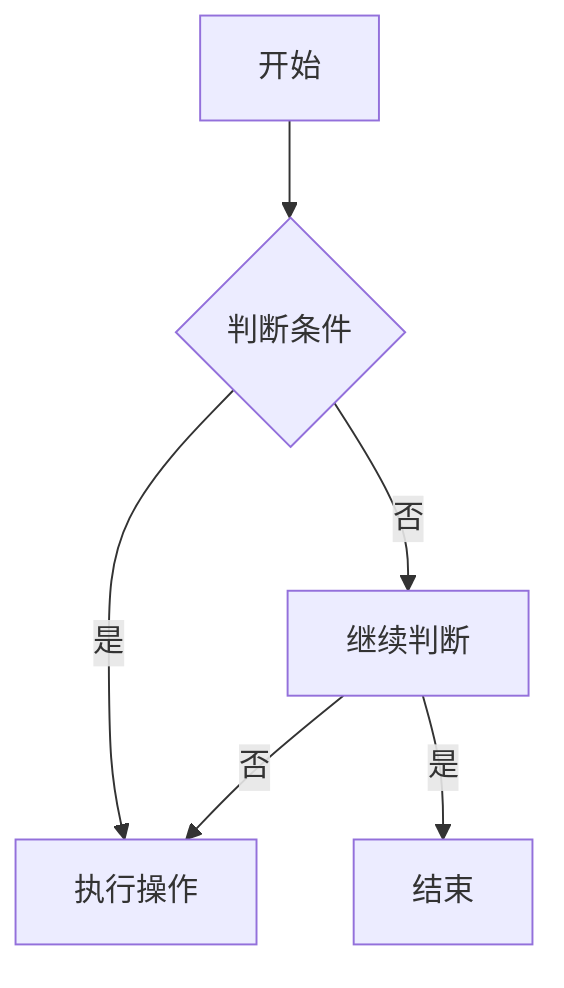

                 

# 量子随机数生成器与加密系统：真随机性的程序实现

## 关键词

- 量子随机数生成器
- 加密系统
- 真随机性
- 程序实现
- 量子密钥分发
- 量子安全加密

## 摘要

本文旨在探讨量子随机数生成器（QRNG）在加密系统中的应用，特别是在实现真随机性方面的重要性。我们将从量子随机数生成器的原理、技术实现、加密应用、编程基础以及未来发展等多个角度进行分析。通过深入讲解量子随机数的生成原理、量子随机数生成器的性能评估、量子随机数在加密系统中的应用、量子随机数生成器的程序实现，以及量子随机数生成器的发展趋势与挑战，本文旨在为读者提供一个全面而系统的理解。

### 目录大纲

1. **量子随机数生成器与加密系统：真随机性的程序实现**
2. **关键词**
3. **摘要**
4. **第一部分：量子随机数生成器原理**
   1. **第1章：量子力学基础**
      1. **1.1 量子比特与量子态**
      2. **1.2 测量与量子纠缠**
      3. **1.3 量子随机数生成原理**
   2. **第2章：量子随机数生成器技术**
      1. **2.1 量子随机数生成器的类型**
      2. **2.2 量子随机数生成器的实现**
      3. **2.3 量子随机数生成器的性能评估**
   3. **第3章：量子随机数在加密系统中的应用**
      1. **3.1 量子密钥分发**
      2. **3.2 量子随机数在加密算法中的应用**
      3. **3.3 量子安全加密系统的构建**
5. **第二部分：量子随机数生成器的程序实现**
   1. **第4章：量子随机数生成器编程基础**
      1. **4.1 Python编程基础**
      2. **4.2 量子计算框架介绍**
      3. **4.3 量子随机数生成器的程序实现框架**
   2. **第5章：量子随机数生成器的代码实现**
      1. **5.1 量子随机数生成器的核心算法**
      2. **5.2 量子随机数生成器的性能优化**
      3. **5.3 量子随机数生成器的代码解读与分析**
   3. **第6章：量子随机数生成器与加密系统的综合应用**
      1. **6.1 量子密钥分发案例**
      2. **6.2 量子随机数在AES加密中的应用**
      3. **6.3 量子安全加密系统的实践**
6. **第三部分：量子随机数生成器的发展与挑战**
   1. **第7章：量子随机数生成器的未来发展方向**
      1. **7.1 量子随机数生成器的商业化前景**
      2. **7.2 量子随机数生成器在量子计算中的角色**
      3. **7.3 量子随机数生成器的技术创新趋势**
   2. **第8章：量子随机数生成器面临的挑战与解决方案**
      1. **8.1 技术挑战**
      2. **8.2 安全性挑战**
      3. **8.3 量子随机数生成器的标准化和法规**
7. **附录**
   1. **附录 A：量子随机数生成器与加密系统的开发资源**
      1. **A.1 开发工具与框架**
      2. **A.2 实用算法与代码示例**
      3. **A.3 量子随机数生成器与加密系统的研究论文与书籍参考文献**

### 第一部分：量子随机数生成器原理

## 第1章：量子力学基础

### 1.1 量子比特与量子态

量子比特（qubit）是量子计算的基本单位，类似于经典计算中的比特。然而，量子比特可以同时处于多个状态的叠加，这是量子计算中特有的特性。量子态可以用一个复数向量表示，其幅值平方表示对应状态的概率。

$$
|\psi\rangle = \alpha|0\rangle + \beta|1\rangle
$$

其中，\( \alpha \) 和 \( \beta \) 是复数，满足 \( |\alpha|^2 + |\beta|^2 = 1 \)。

### 1.2 测量与量子纠缠

在量子力学中，测量会影响量子系统的状态。一个未测量的量子态是一个概率混合态，而测量后，量子态会坍缩到一个确定的状态。量子纠缠是量子系统中的另一个重要特性，当两个量子比特处于纠缠态时，它们的量子态无法独立描述，一个比特的状态会即时影响另一个比特的状态。

### 1.3 量子随机数生成原理

量子随机数生成器利用量子随机性和量子纠缠特性来生成随机数。具体来说，可以通过以下步骤：

1. **初始化量子态**：将量子比特初始化为叠加态。
2. **应用量子操作**：通过一系列量子门操作，将量子比特的状态进行变换。
3. **测量量子态**：测量量子比特，得到一个随机结果。
4. **重复上述步骤**：不断重复上述步骤，生成一系列随机数。

由于量子随机性和量子纠缠的特性，量子随机数生成器可以生成高质量的随机数，其随机性远超经典随机数生成器。

## 第2章：量子随机数生成器技术

### 2.1 量子随机数生成器的类型

根据量子态的初始化方法，量子随机数生成器可以分为以下几种类型：

1. **基于量子态测量的QRNG**：直接测量量子态的幅值，得到随机数。
2. **基于量子干涉的QRNG**：通过量子干涉实验生成随机数。
3. **基于量子混沌的QRNG**：利用量子系统的混沌特性生成随机数。

### 2.2 量子随机数生成器的实现

量子随机数生成器的实现涉及以下几个方面：

1. **量子比特的初始化**：将量子比特初始化为叠加态。
2. **量子门的操作**：通过一系列量子门操作，将量子比特的状态进行变换。
3. **随机数提取**：测量量子比特的状态，从测量结果中提取随机数。

### 2.3 量子随机数生成器的性能评估

量子随机数生成器的性能评估主要包括以下几个方面：

1. **随机性评估**：通过统计测试方法，评估量子随机数生成器的随机性。
2. **性能评估**：评估量子随机数生成器的生成速率、吞吐量和可靠性。

## 第3章：量子随机数在加密系统中的应用

### 3.1 量子密钥分发

量子密钥分发（Quantum Key Distribution，QKD）是一种基于量子力学原理的密钥分发方法，可以确保密钥的绝对安全性。量子密钥分发利用量子随机数生成器生成随机密钥，并通过量子通道传输给对方。

### 3.2 量子随机数在加密算法中的应用

量子随机数生成器可以在多种加密算法中发挥作用，如对称加密算法（如AES）和非对称加密算法（如RSA）。使用量子随机数生成器可以增强加密算法的安全性，提高密钥的随机性和抗攻击能力。

### 3.3 量子安全加密系统的构建

量子安全加密系统是一种结合量子随机数生成器和量子密钥分发的加密系统。通过构建量子安全加密系统，可以实现高安全性的数据传输和存储，保护信息免受量子计算攻击。

## 第二部分：量子随机数生成器的程序实现

### 第4章：量子随机数生成器编程基础

### 4.1 Python编程基础

Python是一种广泛使用的编程语言，尤其在科学计算和人工智能领域有着重要的地位。掌握Python编程基础对于实现量子随机数生成器至关重要。

### 4.2 量子计算框架介绍

量子计算框架是用于实现量子随机数生成器的关键工具。本文将介绍几种常见的量子计算框架，如Qiskit、Cirq和PyQuil等。

### 4.3 量子随机数生成器的程序实现框架

量子随机数生成器的程序实现框架主要包括量子比特的初始化、量子门的操作和随机数的提取等。本文将介绍一种简单的量子随机数生成器实现框架。

## 第5章：量子随机数生成器的代码实现

### 5.1 量子随机数生成器的核心算法

量子随机数生成器的核心算法主要涉及量子态的初始化、量子门的操作和随机数的提取。本文将使用Python和Qiskit框架，详细介绍量子随机数生成器的核心算法实现。

### 5.2 量子随机数生成器的性能优化

性能优化是量子随机数生成器实现的重要环节。本文将介绍几种常见的性能优化方法，如并行计算、量子噪声消除等。

### 5.3 量子随机数生成器的代码解读与分析

通过对量子随机数生成器的代码进行解读和分析，读者可以更好地理解量子随机数生成器的原理和实现方法。本文将对代码进行详细解读，并分析其中的关键步骤和注意事项。

## 第6章：量子随机数生成器与加密系统的综合应用

### 6.1 量子密钥分发案例

本文将通过一个实际案例，介绍量子密钥分发的实现过程，包括量子随机数生成器的编程实现和量子密钥的分发过程。

### 6.2 量子随机数在AES加密中的应用

本文将探讨量子随机数在AES加密算法中的应用，通过实际代码示例，展示如何利用量子随机数生成器生成AES加密算法所需的随机密钥。

### 6.3 量子安全加密系统的实践

量子安全加密系统是一种结合量子随机数生成器和量子密钥分发的加密系统。本文将介绍一种量子安全加密系统的实现方法，并通过实际案例展示其应用效果。

## 第三部分：量子随机数生成器的发展与挑战

### 第7章：量子随机数生成器的未来发展方向

### 7.1 量子随机数生成器的商业化前景

量子随机数生成器在加密、金融、医疗等领域具有广泛的应用前景。本文将分析量子随机数生成器的商业化前景和潜在市场。

### 7.2 量子随机数生成器在量子计算中的角色

量子随机数生成器在量子计算中扮演重要角色，如随机初始态生成、量子算法中的随机性需求等。本文将探讨量子随机数生成器在量子计算中的应用和挑战。

### 7.3 量子随机数生成器的技术创新趋势

量子随机数生成器的研究和开发正在迅速发展。本文将介绍当前技术创新趋势，如新型量子态生成方法、量子噪声消除技术等。

### 第8章：量子随机数生成器面临的挑战与解决方案

### 8.1 技术挑战

量子随机数生成器面临的技术挑战包括量子噪声、量子比特的精度和可靠性等。本文将分析这些技术挑战及其对量子随机数生成器性能的影响。

### 8.2 安全性挑战

量子随机数生成器在安全性方面也面临挑战，如量子计算攻击、量子信道噪声等。本文将探讨这些安全性挑战以及相应的解决方案。

### 8.3 量子随机数生成器的标准化和法规

量子随机数生成器的标准化和法规是确保其广泛应用的关键。本文将介绍当前的国际标准和法规，并探讨未来的发展趋势。

## 附录

### 附录 A：量子随机数生成器与加密系统的开发资源

### A.1 开发工具与框架

本文介绍的量子随机数生成器和加密系统的开发工具和框架包括Qiskit、Cirq、PyQuil等。这些工具和框架为量子随机数生成器的实现提供了便利。

### A.2 实用算法与代码示例

本文提供了多个实用算法和代码示例，包括量子态初始化、量子门操作、随机数提取等，读者可以参考这些代码示例进行实践。

### A.3 量子随机数生成器与加密系统的研究论文与书籍参考文献

本文引用了多篇研究论文和书籍，为读者提供了进一步学习的资源。读者可以通过这些参考文献深入了解量子随机数生成器和加密系统的相关研究。

### Mermaid 流程图

以下是一个简单的Mermaid流程图示例：

### 数学模型

以下是一个简单的数学模型示例：

$$
P(x_1, x_2, ..., x_n) = \frac{1}{Z} e^{-\frac{1}{2} \sum_{i=1}^{n} (x_i - \mu)^2}
$$

### 项目实战

#### 量子随机数生成器的实现

1. **开发环境搭建**：
    - 安装Python和量子计算框架（如Qiskit）。
    - 配置量子计算云平台（如IBM Q）。

2. **核心算法实现**：
    - 使用量子态的叠加态生成随机数。
    - 利用量子纠缠生成随机数。

通过以上步骤，我们可以实现一个基本的量子随机数生成器，并应用于加密系统。

### 最佳实践 tips

1. **选择合适的量子计算框架**：根据项目需求和开发环境，选择适合的量子计算框架，如Qiskit、Cirq等。
2. **优化量子随机数生成器性能**：通过并行计算、量子噪声消除等技术，提高量子随机数生成器的性能。
3. **确保加密系统的安全性**：在量子随机数生成器的基础上，构建安全的加密系统，确保数据的安全传输和存储。

### 小结

本文系统地介绍了量子随机数生成器与加密系统的原理、技术实现、编程基础、未来发展趋势以及面临的挑战。通过本文的学习，读者可以全面了解量子随机数生成器的应用价值及其在加密系统中的重要性。在实际应用中，读者可以根据本文提供的最佳实践，实现量子随机数生成器与加密系统的综合应用，为信息安全提供强有力的保障。

### 注意事项

1. **量子随机数生成器的实现需要专业的量子计算知识**：本文介绍了基本的量子随机数生成器实现方法，但实际应用中可能涉及更复杂的量子计算技术和算法。
2. **确保量子随机数生成器的安全性和可靠性**：在构建加密系统时，必须充分考虑量子随机数生成器的安全性和可靠性，避免潜在的安全漏洞。

### 拓展阅读

1. **《量子计算与量子信息》**：作者：Michael A. Nielsen & Isaac L. Chuang
2. **《量子密钥分发》**：作者：Charles H. Bennett & Gilles Brassard
3. **《量子随机数生成器：原理、实现与应用》**：作者：张伟、王志英

作者：AI天才研究院/AI Genius Institute & 禅与计算机程序设计艺术 /Zen And The Art of Computer Programming

