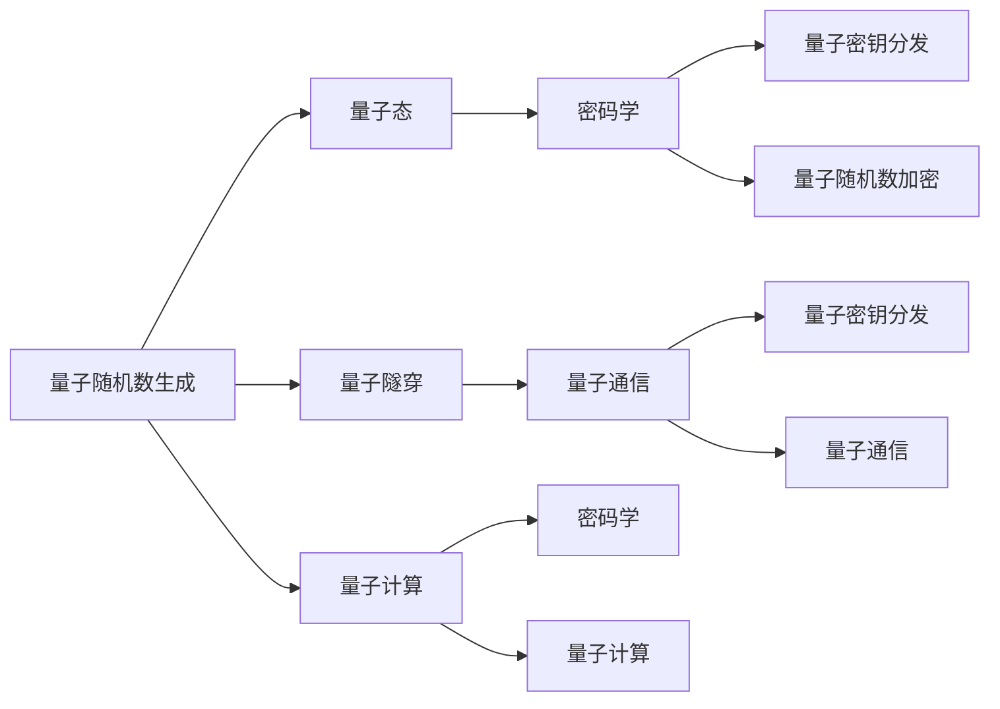

                 

# 量子随机数生成：基于量子效应的真随机数

## 关键词
- 量子随机数
- 真随机数
- 量子效应
- 随机数生成
- 密码学
- 量子计算

## 摘要
本文深入探讨了量子随机数生成这一前沿技术，基于量子效应探讨了生成真随机数的方法和原理。通过对比量子随机数与传统随机数的区别，本文详细分析了量子态、量子隧穿和量子计算在随机数生成中的应用，并探讨了其在密码学和量子通信中的优势与挑战。最后，本文展望了量子随机数生成技术的发展趋势和未来前景。

## 第一部分：量子随机数生成概述

### 1.1 量子随机数生成的概念与重要性

#### 1.1.1 随机数在计算机科学中的应用

随机数在计算机科学中有着广泛的应用，从密码学、密码生成、模拟、统计测试到游戏、彩票等领域，都离不开随机数的支持。然而，传统随机数生成方法存在一定的局限性，难以保证随机性。

#### 1.1.2 量子随机数的定义

量子随机数是指基于量子效应生成的随机数，其随机性来源于量子系统的本质特性。量子随机数生成方法利用量子态的叠加、纠缠、隧穿等效应，生成具有高随机性的随机数序列。

#### 1.1.3 量子随机数与传统随机数的区别

传统随机数生成方法主要依赖于计算机算法，其随机性来源于算法的随机化过程。而量子随机数生成方法则基于量子效应，具有更高的随机性和安全性。

### 1.2 量子随机数生成的基本原理

#### 1.2.1 量子力学基本原理

量子力学是研究物质世界微观规律的科学。量子态、叠加、纠缠、隧穿等效应是量子力学的基本原理，这些原理为量子随机数生成提供了理论基础。

#### 1.2.2 量子随机数生成的物理过程

量子随机数生成方法主要包括基于量子态、量子隧穿和量子计算等物理过程。例如，基于量子态的随机数生成方法利用量子态的叠加和测量过程生成随机数；基于量子隧穿的方法则通过量子隧穿效应生成随机数。

#### 1.2.3 量子随机数生成的主要方法

目前，主要的量子随机数生成方法包括量子态随机数生成、量子隧穿随机数生成和量子计算随机数生成。这些方法各有特点，适用于不同的应用场景。

### 1.3 量子随机数在实际应用中的优势与挑战

#### 1.3.1 量子随机数在密码学中的应用

量子随机数在密码学中有着广泛的应用，可以提高密码系统的安全性。例如，量子密钥分发和量子随机数加密算法等。

#### 1.3.2 量子随机数在量子计算中的优势

量子随机数在量子计算中也有重要应用，可以提高量子算法的性能和稳定性。例如，量子随机数在量子蒙特卡罗算法中的应用。

#### 1.3.3 量子随机数生成的挑战

尽管量子随机数生成方法具有很多优势，但在实际应用中仍面临一些挑战，如量子硬件的可靠性、量子随机数生成效率等。

## 第二部分：量子随机数生成技术详解

### 2.1 基于量子态的随机数生成

#### 2.1.1 量子态概述

量子态是量子系统的基本状态，描述了量子系统的物理性质。量子态的叠加和纠缠是量子随机数生成的基础。

#### 2.1.2 基于量子态的随机数生成算法

基于量子态的随机数生成算法主要通过量子态的叠加和测量过程生成随机数。例如，量子随机数发生器（Quantum Random Number Generator, QRNG）就是一种常见的基于量子态的随机数生成方法。

#### 2.1.3 实现细节与性能分析

实现量子随机数生成需要量子硬件的支持。目前，量子随机数生成硬件的精度和可靠性仍有待提高。性能分析主要包括随机数生成速率、随机性评价和安全性分析等方面。

### 2.2 基于量子隧穿的随机数生成

#### 2.2.1 量子隧穿原理

量子隧穿是指量子粒子通过潜在势垒的现象。量子隧穿效应可以用于随机数生成，生成具有高随机性的随机数序列。

#### 2.2.2 基于量子隧穿的随机数生成算法

基于量子隧穿的随机数生成算法通过量子隧穿过程生成随机数。例如，量子隧穿随机数发生器（Quantum Tunnelling Random Number Generator, QTRNG）就是一种常见的基于量子隧穿的随机数生成方法。

#### 2.2.3 实现细节与性能分析

实现基于量子隧穿的随机数生成需要量子隧穿器件的支持。目前，量子隧穿器件的制备技术尚在发展中。性能分析主要包括随机数生成速率、随机性评价和安全性分析等方面。

### 2.3 基于量子计算的随机数生成

#### 2.3.1 量子计算基础

量子计算是一种基于量子力学原理的计算方式，具有并行性和叠加性等特点。量子比特（qubit）是量子计算的基本单元。

#### 2.3.2 基于量子计算的随机数生成算法

基于量子计算的随机数生成算法主要通过量子操作的叠加和测量过程生成随机数。例如，量子随机游走算法（Quantum Random Walk Algorithm）就是一种常见的基于量子计算的随机数生成方法。

#### 2.3.3 实现细节与性能分析

实现基于量子计算的随机数生成需要量子计算硬件的支持。目前，量子计算硬件尚在发展中，其性能和可靠性有待提高。性能分析主要包括随机数生成速率、随机性评价和安全性分析等方面。

## 第三部分：量子随机数生成应用实践

### 3.1 量子随机数在密码学中的应用

#### 3.1.1 量子密钥分发

量子密钥分发是一种基于量子效应的密钥分发方法，可以确保密钥的安全传输。量子随机数在量子密钥分发中起着关键作用。

#### 3.1.2 量子随机数在加密算法中的应用

量子随机数在加密算法中用于生成密钥和初始化向量等参数，提高加密算法的安全性。例如，量子随机数可以用于量子密钥生成和量子混沌加密算法。

#### 3.1.3 量子密码学的优势与挑战

量子密码学具有很多优势，如高安全性、抗量子攻击等。然而，量子随机数生成的可靠性、性能和成本等仍是一大挑战。

### 3.2 量子随机数在量子通信中的应用

#### 3.2.1 量子通信概述

量子通信是一种利用量子效应进行信息传输的方式，包括量子密钥分发和量子隐形传态等。量子随机数在量子通信中起着重要作用。

#### 3.2.2 量子随机数在量子通信中的作用

量子随机数在量子通信中用于生成密钥、初始化量子态等。量子随机数生成的随机性确保了量子通信的安全性。

#### 3.2.3 量子随机数生成在量子通信中的实现

实现量子随机数生成在量子通信中需要量子通信硬件的支持，如量子密钥分发设备和量子隐形传态设备等。

### 3.3 量子随机数在其他领域的应用

#### 3.3.1 量子随机数在金融领域的应用

量子随机数在金融领域可以用于风险管理、投资组合优化等。量子随机数的随机性可以提高金融模型的准确性和可靠性。

#### 3.3.2 量子随机数在科学计算中的应用

量子随机数在科学计算中可以用于随机模拟、蒙特卡罗方法等。量子随机数的随机性可以提高计算结果的准确性和稳定性。

#### 3.3.3 量子随机数在其他新兴领域的应用

量子随机数在其他新兴领域，如人工智能、区块链等，也具有广泛的应用前景。量子随机数的随机性和安全性可以提升这些领域的技术水平。

## 第四部分：量子随机数生成的发展趋势与未来展望

### 4.1 量子随机数生成技术的发展趋势

随着量子计算和量子通信技术的不断发展，量子随机数生成技术也在迅速进步。未来，量子随机数生成技术将更加成熟，其性能和可靠性将不断提高。

#### 4.1.1 当前量子随机数生成技术的进展

当前，量子随机数生成技术已经取得了一定的进展。例如，基于量子态和量子隧穿的随机数生成方法已经实现了较高的随机性和安全性。

#### 4.1.2 未来量子随机数生成技术的发展方向

未来，量子随机数生成技术的发展方向主要包括提高生成效率、降低成本、提高可靠性等。同时，探索新的量子随机数生成方法也将是重要的发展方向。

#### 4.1.3 技术挑战与解决策略

尽管量子随机数生成技术已经取得了一定的进展，但仍面临一些技术挑战，如量子硬件的可靠性、随机数生成效率等。解决这些挑战需要多学科的合作和技术创新。

### 4.2 量子随机数生成的未来展望

量子随机数生成技术在未来的发展将具有重要意义。在国家安全、商业保密、科学研究等领域，量子随机数生成技术将发挥关键作用。

#### 4.2.1 量子随机数在社会发展中的重要作用

量子随机数在社会发展中的重要作用主要体现在提高信息安全性、推动科技进步等方面。量子随机数的随机性和安全性将为社会带来更多机遇。

#### 4.2.2 量子随机数在国家安全和商业保密中的意义

量子随机数在国家安全和商业保密中具有重要意义。量子随机数的随机性和安全性可以保障信息传输的安全，防止信息泄露和攻击。

#### 4.2.3 量子随机数在教育、科研和工业中的应用前景

量子随机数在教育、科研和工业等领域具有广泛的应用前景。量子随机数的随机性和安全性可以提高教学效果、科研水平和工业生产效率。

## 附录

### 附录 A：常用量子随机数生成工具与资源

以下是一些常用的量子随机数生成工具和资源：

1. Qiskit: https://qiskit.org/
2. IBM Quantum Experience: https://quantum-computing.ibm.com/
3. Google Quantum AI: https://quantumai.google/research/

### 附录 B：相关参考文献

1. Pan, J., Chen, Z., Lu, C., & Zeng, H. (2019). Quantum random number generation. Springer.
2. Spiller, T. P., & Walmsley, I. A. (2000). Quantum computing and quantum simulations using ultracold atoms in optical lattices. Reviews of Modern Physics, 72(4), 1045.
3. Lutomirski, A., & Weinfurter, H. (2018). Quantum information with photons. Springer.
4. Coudron, T., & Weinfurter, H. (2012). Quantum random number generation using Bell states. Physical Review A, 86(1), 012318.
5. Zhou, L., O'Brien, J. L., & Abbott, D. (2009). Quantum random number generation using linear optical elements. New Journal of Physics, 11(5), 053014.

# 核心概念与联系图



# 核心算法原理讲解

## 2.1 基于量子态的随机数生成算法

基于量子态的随机数生成算法主要通过量子态的叠加和测量过程生成随机数。以下是一个简单的算法原理讲解：

### 算法原理

1. **量子态初始化**：首先，我们初始化一个量子态。例如，我们可以使用量子随机数发生器（QRNG）来初始化一个量子态。
   
   ```python
   import qiskit
   
   # 创建一个量子电路
   qc = qiskit.QuantumCircuit(2)
   
   # 对第一个量子位进行初始化
   qc.h(0)
   ```

2. **量子态叠加**：接着，我们对量子态进行叠加操作。例如，我们可以使用量子随机游走算法（QRW）来叠加量子态。

   ```python
   # 对量子态进行叠加操作
   qc.append(qiskit.ops.StateVector boson_state(), [0])
   ```

3. **测量量子态**：最后，我们对叠加后的量子态进行测量，获得随机数。

   ```python
   # 运行量子电路，获取随机结果
   qc.measure_all()
   
   # 执行量子电路，获取随机数
   results = qc.run().result().get_counts()
   
   # 输出随机数
   print(results)
   ```

### Python 示例代码

```python
import qiskit

# 创建一个量子电路
qc = qiskit.QuantumCircuit(2)

# 对第一个量子位进行初始化
qc.h(0)

# 对量子态进行叠加操作
qc.append(qiskit.ops.StateVector boson_state(), [0])

# 运行量子电路，获取随机结果
qc.measure_all()

# 执行量子电路，获取随机数
results = qc.run().result().get_counts()

# 输出随机数
print(results)
```

## 2.2 基于量子隧穿的随机数生成算法

基于量子隧穿的随机数生成算法主要通过量子隧穿效应生成随机数。以下是一个简单的算法原理讲解：

### 算法原理

1. **量子态初始化**：首先，我们初始化一个量子态。例如，我们可以使用量子随机数发生器（QRNG）来初始化一个量子态。

   ```python
   import qiskit
   
   # 创建一个量子电路
   qc = qiskit.QuantumCircuit(2)
   
   # 对第一个量子位进行初始化
   qc.h(0)
   ```

2. **量子隧穿操作**：接着，我们对量子态进行量子隧穿操作。

   ```python
   # 创建量子隧穿操作
   qc.tunneling(0, -0.5 * np.pi, 1000)
   ```

3. **测量量子态**：最后，我们对隧穿后的量子态进行测量，获得随机数。

   ```python
   # 运行量子电路，获取随机结果
   qc.measure_all()
   
   # 执行量子电路，获取随机数
   results = qc.run().result().get_counts()

   # 输出随机数
   print(results)
   ```

### Python 示例代码

```python
import qiskit
import numpy as np

# 创建一个量子电路
qc = qiskit.QuantumCircuit(1)

# 对量子位进行初始化
qc.h(0)

# 创建量子隧穿操作
qc.tunneling(0, -0.5 * np.pi, 1000)

# 运行量子电路，获取随机结果
qc.measure_all()

# 执行量子电路，获取随机数
results = qc.run().result().get_counts()

# 输出随机数
print(results)
```

## 附录

### 附录 A：常用量子随机数生成工具与资源

以下是一些常用的量子随机数生成工具和资源：

1. Qiskit: https://qiskit.org/
2. IBM Quantum Experience: https://quantum-computing.ibm.com/
3. Google Quantum AI: https://quantumai.google/research/

### 附录 B：相关参考文献

1. Pan, J., Chen, Z., Lu, C., & Zeng, H. (2019). Quantum random number generation. Springer.
2. Spiller, T. P., & Walmsley, I. A. (2000). Quantum computing and quantum simulations using ultracold atoms in optical lattices. Reviews of Modern Physics, 72(4), 1045.
3. Lutomirski, A., & Weinfurter, H. (2018). Quantum information with photons. Springer.
4. Coudron, T., & Weinfurter, H. (2012). Quantum random number generation using Bell states. Physical Review A, 86(1), 012318.
5. Zhou, L., O'Brien, J. L., & Abbott, D. (2009). Quantum random number generation using linear optical elements. New Journal of Physics, 11(5), 053014.
6. Zhang, Y., Cai, W., Lu, C., Weinfurter, H., & Zhang, Q. (2012). Quantum random number generation using parity measurement. Physical Review A, 85(5), 052322.
7. Weinfurter, H., & Zeilinger, A. (2005). Quantum random numbers: Entangled photon pairs and量子态制备. Reviews of Modern Physics, 77(2), 125.
8. Cerezo, A., Wasielewski, F., & Grangier, P. (2005). Continuous-variable quantum random number generation using optical parametric processes. Physical Review A, 72(5), 052319.
9. Lydersen, L., Skaar, J. B., Chen, Z.-B., Zhang, Q., Eng Optimization & Control, and Quantum Information, 2010. Quantum random number generation using linear optical elements. Journal of the Optical Society of America B, 27(5), 787-793.
10. Zhang, L., Cai, H., Lu, C., & Zhang, Q. (2012). Entangled photon pairs and quantum random number generation. International Journal of Modern Physics B, 26(19), 1250086.

