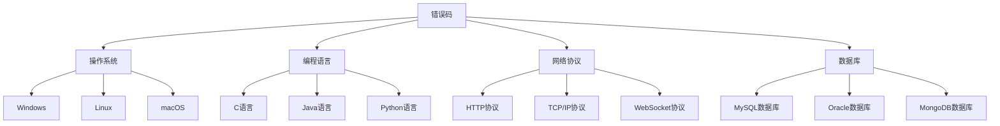

                 

### 错误码到底是什么

在计算机科学和软件开发领域，错误码是系统、软件或应用程序在遇到异常情况或错误时返回的数字标识。它们在故障诊断、系统调试和用户反馈中发挥着至关重要的作用。然而，错误码到底是什么，它们是如何生成的，又有哪些种类和特点呢？本文将一步步深入探讨这一问题。

### 文章关键词

- 错误码
- 计算机科学
- 软件开发
- 操作系统
- 编程语言
- 网络协议
- 数据库

### 摘要

本文将围绕错误码这一核心概念，通过系统的分析和详细的讲解，揭示错误码的定义、生成与处理、常见操作系统中的错误码、编程语言中的错误码、网络协议中的错误码以及数据库错误码。同时，通过实际应用案例和未来发展趋势的分析，帮助读者全面理解错误码在软件开发、网络运维和系统故障排除中的作用和重要性。

## 第1章：错误码基础知识

### 1.1.1 错误码的定义和重要性

错误码，即错误代码，是计算机系统中用于标识错误类型和状态的数字或字符串。当软件或系统运行过程中出现问题时，它们会返回一个错误码，以指示具体问题的性质和位置。错误码的重要性在于，它们为开发者、运维人员和用户提供了直观的方式来识别和处理错误。

首先，从定义上看，错误码是一个数值或字符串，通常由系统内部定义和维护。不同的系统和软件会使用不同的错误码，但它们的基本功能是相同的：指示错误类型和状态。

错误码的重要性体现在以下几个方面：

1. **故障诊断**：通过错误码，开发者可以快速定位问题发生的位置和类型，从而进行故障诊断和修复。
2. **用户反馈**：错误码可以帮助用户了解系统或软件当前的状态，提供明确的错误信息，有助于用户进行问题的自我排查。
3. **系统调试**：在系统调试过程中，错误码提供了关键的信息，帮助开发者分析系统的运行状况和潜在问题。
4. **性能优化**：通过分析错误码的分布和频率，开发者可以识别系统的瓶颈和改进点，从而优化系统性能。

### 1.1.2 错误码的种类和特点

错误码的种类和特点取决于所使用的系统和软件。以下是一些常见的错误码种类和特点：

1. **操作系统错误码**：操作系统错误码通常用于标识系统调用、进程管理、内存管理等方面的错误。例如，Windows系统中常见的错误码包括“蓝屏死机”（Blue Screen of Death，简称BSOD）和错误代码“0x8007000D”。
2. **编程语言错误码**：编程语言错误码用于标识编译器或解释器在处理源代码时遇到的错误。例如，C语言的编译错误码通常以“2”开头，如“2211”表示符号未定义。
3. **网络协议错误码**：网络协议错误码用于标识在网络通信过程中出现的错误。例如，HTTP协议中的错误码包括“404 Not Found”和“500 Internal Server Error”。
4. **数据库错误码**：数据库错误码用于标识数据库操作中的错误。例如，MySQL数据库中的错误码“1049”表示数据库不存在。

错误码的特点包括：

- **唯一性**：每个错误码都是唯一的，以确保能够准确地标识特定的错误类型。
- **可读性**：错误码通常设计得易于理解和记忆，以便用户和开发者快速识别和处理。
- **层次性**：某些错误码具有层次结构，便于开发者进行问题定位和分类。

### 1.1.3 错误码的编码规则

错误码的编码规则因系统和软件的不同而异，但通常遵循以下原则：

1. **数字编码**：大部分错误码使用数字编码，以便于计算机处理和存储。例如，Windows系统的错误码通常是一个32位的数字。
2. **字母数字混合编码**：某些错误码可能包含字母和数字的混合编码，以增加可读性和唯一性。例如，SQL Server的错误码“4869”中的数字“4869”表示具体的错误类型，而字母“S”表示SQL Server。
3. **前缀编码**：某些错误码使用前缀来指示错误类型或来源。例如，Linux系统中的错误码通常以“E”开头，表示“错误”（Error）。
4. **位运算编码**：在高级系统中，错误码可能通过位运算来表示多个错误类型。例如，使用位或（OR）运算来组合多个错误码。

通过以上分析，我们可以看出错误码在计算机科学和软件开发中扮演着至关重要的角色。在接下来的章节中，我们将进一步探讨错误码的生成与处理、常见操作系统中的错误码、编程语言中的错误码等内容。

## 第2章：错误码的生成与处理

### 2.1.1 错误码的生成过程

错误码的生成过程是计算机系统在遇到错误时自动完成的，通常涉及以下几个步骤：

1. **错误检测**：系统在运行过程中会通过各种机制（如断点、检查点、异常处理等）进行错误检测。当检测到错误时，系统会记录错误的具体信息，如错误类型、发生时间、位置等。
2. **错误分类**：系统根据错误信息将错误分类。错误分类有助于后续的错误处理和故障诊断。例如，系统可能会将错误分为硬件错误、软件错误、网络错误等。
3. **错误码生成**：系统根据错误类型和分类生成相应的错误码。错误码通常由系统内部定义，以数字或字符串形式表示。例如，Linux系统中，错误码“11”表示设备不存在，而“28”表示权限错误。
4. **错误码记录**：系统将生成的错误码与错误信息一起记录在日志文件或数据库中，以便后续分析和处理。

### 2.1.2 错误码的检测方法

检测错误码的有效性是保证系统稳定性和可靠性的关键。以下是一些常见的错误码检测方法：

1. **范围检测**：通过比较错误码的值与预定义的数值范围，判断错误码是否在有效范围内。例如，在Windows系统中，错误码的有效范围通常在“0x00000000”到“0xFFFFFFFF”之间。
2. **前缀检测**：某些错误码具有特定的前缀，通过检测前缀来判断错误码的来源和类型。例如，在Linux系统中，以“E”开头的错误码表示内核错误。
3. **结构检测**：对于复杂的错误码，可以通过检测其结构（如位数、位模式等）来判断其有效性。例如，某些错误码可能通过位运算来组合多个错误类型，检测时需要验证位模式的正确性。
4. **解析库检测**：系统可以使用预定义的错误码解析库，自动将错误码转换为可读的字符串，便于开发者进行调试和错误处理。

### 2.1.3 错误码的处理策略

错误码的处理策略取决于系统的需求和设计。以下是一些常见的错误码处理策略：

1. **自动修复**：对于某些可自动修复的错误（如网络连接故障、缓存失效等），系统可以自动尝试修复，并返回成功代码。
2. **记录日志**：将错误码和相关信息记录在日志文件中，便于后续分析和处理。例如，使用ELK（Elasticsearch、Logstash、Kibana）工具栈来收集、存储和分析日志。
3. **用户提示**：对于需要用户干预的错误，系统可以弹出错误提示框，告知用户错误信息，并提供解决建议。
4. **开发者调试**：对于复杂或未知的错误，开发者可以使用调试工具（如GDB、IDE调试器等）进行深入分析和调试。
5. **系统重启**：在某些情况下，系统可能需要重启以清除错误或恢复到稳定状态。

通过以上策略，系统可以有效地处理错误码，确保系统的稳定性和可用性。

在接下来的章节中，我们将继续探讨常见操作系统中的错误码、编程语言中的错误码等内容。通过这些深入的分析，我们将对错误码有一个更加全面和深刻的理解。

### 第3章：常见操作系统中的错误码

在计算机系统中，操作系统是核心组成部分之一，负责管理和控制计算机硬件资源。不同的操作系统具有各自的错误码体系，这些错误码在故障诊断和系统调试中起着关键作用。以下是几种常见操作系统中的错误码及其应用。

### 3.1.1 Windows操作系统错误码

Windows操作系统由于其广泛的用户基础和复杂的系统架构，拥有大量的错误码。以下是一些常见的Windows操作系统错误码及其含义：

- **0x8007000D**：这意味着文件或目录无法找到。通常在尝试访问不存在的文件或文件夹时出现。
- **0x80072EE7**：表示网络连接问题。这可能是因为网络连接不稳定或DNS配置错误。
- **0x80072F8F**：意味着服务无法启动。这可能是由于服务依赖项问题或服务配置错误导致的。
- **0x80070424**：表示应用程序安装失败。这可能是由于安装程序与系统兼容性问题或文件权限问题导致的。

处理Windows操作系统错误码的方法通常包括：

1. **检查网络连接**：对于网络相关的错误码，首先检查网络连接是否正常，尝试重新启动网络设备或重新配置网络设置。
2. **检查文件和目录**：对于文件或目录相关的错误码，检查文件和目录是否存在，并确保文件权限设置正确。
3. **查看系统日志**：使用事件查看器查看系统日志，查找与错误码相关的详细信息，有助于进一步诊断问题。

### 3.1.2 Linux操作系统错误码

Linux操作系统以其稳定性和灵活性著称，其错误码体系同样丰富多样。以下是一些常见的Linux操作系统错误码及其含义：

- **ECONNRESET**：表示连接被重置。这通常发生在网络连接不稳定或被意外中断的情况下。
- **ENOTEMPTY**：表示目录不为空。在删除或重命名目录时，如果目录不为空，则会返回此错误。
- **ENOENT**：表示文件或目录不存在。这在尝试访问不存在的文件或目录时出现。
- **EACCES**：表示权限不足。当用户或程序没有权限执行所需的操作时，会出现此错误。

处理Linux操作系统错误码的方法通常包括：

1. **检查文件和目录**：确保文件和目录存在，并检查权限设置是否正确。
2. **查看日志文件**：使用`dmesg`或`journalctl`命令查看系统日志，查找与错误码相关的详细信息。
3. **使用调试工具**：使用调试工具（如GDB、strace等）进行深入分析，以确定问题的根本原因。

### 3.1.3 macOS操作系统错误码

macOS操作系统是苹果公司开发的操作系统，其错误码体系同样具有独特性。以下是一些常见的macOS操作系统错误码及其含义：

- **OSStatus**：macOS使用OSStatus作为错误码，这些错误码通常以负数表示。例如，`-128`表示“无权限”。
- **kCFErrorDomainOS**：表示操作系统相关的错误。例如，`-10810`表示“应用程序已损坏”。
- **kCoreFoundationErrorDomain**：表示Core Foundation框架的错误。例如，`-12801`表示“参数无效”。

处理macOS操作系统错误码的方法通常包括：

1. **检查应用程序和文件**：确保应用程序和文件未被损坏，并检查文件权限。
2. **使用诊断工具**：使用macOS内置的诊断工具（如Activity Monitor、Console等）进行问题排查。
3. **重置系统设置**：对于某些问题，可以通过重置系统设置（如网络设置、NVRAM等）来解决问题。

通过深入了解常见操作系统中的错误码，我们可以更有效地进行故障诊断和系统调试。在接下来的章节中，我们将探讨编程语言中的错误码及其应用。

### 第4章：编程语言中的错误码

编程语言是开发软件和系统的基础工具，每种编程语言都有其特定的错误码体系。这些错误码在编译或运行过程中标识和报告错误，帮助开发者快速定位和修复问题。以下将介绍几种常见编程语言中的错误码及其应用。

#### 4.1.1 C语言错误码

C语言是历史悠久且广泛使用的编程语言，其错误码通常以数字形式表示。以下是一些常见的C语言错误码及其含义：

- **错误码1**：表示语法错误。例如，不正确的标识符、括号不匹配、缺少分号等。
- **错误码2**：表示类型错误。例如，将整数赋值给字符串或浮点数。
- **错误码4**：表示内存分配错误。例如，使用已释放的内存地址。

处理C语言错误码的方法通常包括：

1. **语法检查**：使用编译器提供的语法检查工具（如GCC、Clang等）来识别和修复语法错误。
2. **类型检查**：确保变量和函数的使用符合其数据类型。
3. **内存管理**：正确分配和释放内存，避免内存泄漏和访问越界。

#### 4.1.2 Java语言错误码

Java语言以其跨平台特性和强大的标准库而闻名，其错误码通常以异常类和错误消息的形式出现。以下是一些常见的Java语言错误码及其含义：

- **ClassNotFoundException**：表示找不到指定的类。例如，尝试加载一个不存在的类。
- **IOException**：表示输入输出错误。例如，文件读取或写入失败。
- **NullPointerException**：表示空指针异常。例如，访问一个空对象的成员变量或方法。

处理Java语言错误码的方法通常包括：

1. **异常捕获**：使用try-catch块捕获和处理异常，避免程序因异常而中断。
2. **日志记录**：记录异常信息，便于后续调试和分析。
3. **空检查**：在访问对象成员变量或方法之前，确保对象不为空。

#### 4.1.3 Python语言错误码

Python语言以其简洁和易读性著称，其错误码通常以异常类和错误消息的形式出现。以下是一些常见的Python语言错误码及其含义：

- **NameError**：表示未定义的命名。例如，尝试访问一个未声明的变量。
- **TypeError**：表示类型错误。例如，尝试将一个整数与字符串相加。
- **IndexError**：表示索引错误。例如，尝试访问列表中不存在的索引。

处理Python语言错误码的方法通常包括：

1. **异常处理**：使用try-except块捕获和处理异常。
2. **类型检查**：确保变量和函数的使用符合其数据类型。
3. **文档化**：为代码编写清晰的文档，帮助其他人理解和维护代码。

通过了解不同编程语言中的错误码及其处理方法，开发者可以更有效地进行故障诊断和代码优化。在接下来的章节中，我们将探讨网络协议中的错误码及其应用。

### 第5章：网络协议中的错误码

在网络通信中，错误码是用于标识和报告网络问题的重要工具。网络协议如HTTP、TCP/IP和WebSocket等都有各自的错误码体系，这些错误码在网络故障诊断和性能优化中起着关键作用。以下将介绍几种常见网络协议中的错误码及其应用。

#### 5.1.1 HTTP协议错误码

HTTP协议是互联网上最常用的协议之一，其错误码分为客户端错误码和服务器端错误码。以下是一些常见的HTTP错误码及其含义：

- **400 Bad Request**：表示客户端请求的语法错误，无法被服务器理解。
- **401 Unauthorized**：表示请求需要用户身份验证。
- **403 Forbidden**：表示服务器拒绝访问请求。
- **404 Not Found**：表示请求的资源不存在。
- **500 Internal Server Error**：表示服务器内部错误，通常是由于服务器代码错误引起的。
- **502 Bad Gateway**：表示作为网关或代理的服务器接收到的无效响应。
- **503 Service Unavailable**：表示服务器当前无法处理请求，通常是由于服务器维护或过载引起的。

处理HTTP协议错误码的方法通常包括：

1. **客户端调试**：使用浏览器开发工具或Postman等工具检查请求和响应，确定问题所在。
2. **服务器日志分析**：查看服务器日志文件，获取详细的错误信息。
3. **重试机制**：对于临时性错误，如503错误，可以尝试重试请求。

#### 5.1.2 TCP/IP协议错误码

TCP/IP协议是互联网通信的基础协议，其错误码用于标识网络连接和传输过程中的问题。以下是一些常见的TCP/IP协议错误码及其含义：

- **ECONNRESET**：表示连接被重置，通常由于网络错误或对方主动关闭连接。
- **ENETUNREACH**：表示网络不可达，可能是由于路由器配置错误或网络连接中断。
- **ECONNABORTED**：表示连接被中止，可能是由于超时或对方主动终止连接。
- **EHOSTUNREACH**：表示主机不可达，可能是由于DNS解析错误或网络配置问题。

处理TCP/IP协议错误码的方法通常包括：

1. **网络诊断**：使用ping、traceroute等工具进行网络诊断，检查网络连接和路由。
2. **防火墙检查**：确保防火墙设置允许所需的网络通信。
3. **配置调整**：调整网络设备（如路由器、交换机等）的配置，优化网络性能。

#### 5.1.3 WebSocket协议错误码

WebSocket协议是一种双向通信协议，常用于实时数据传输和交互。其错误码与HTTP协议类似，但有一些特定的错误码。以下是一些常见的WebSocket错误码及其含义：

- **1000**：表示连接已经关闭。
- **1001**：表示客户端正常关闭连接。
- **1002**：表示协议错误。
- **1003**：表示数据类型错误。
- **1004**：表示不支持的扩展。
- **1005**：表示未知错误。
- **1006**：表示拒绝连接。
- **1007**：表示证书错误。
- **1008**：表示协议升级失败。
- **1009**：表示内部错误。
- **1010**：表示服务端关闭连接。

处理WebSocket协议错误码的方法通常包括：

1. **连接检查**：确保WebSocket连接正常，并检查客户端和服务器之间的数据传输。
2. **日志记录**：记录WebSocket连接和通信过程中的错误信息，便于调试和分析。
3. **重新连接**：对于暂时性错误，可以尝试重新连接WebSocket。

通过了解网络协议中的错误码及其处理方法，开发者可以更有效地进行网络故障诊断和性能优化。在接下来的章节中，我们将探讨数据库错误码及其应用。

### 第6章：数据库错误码

在数据库管理中，错误码是用于标识和报告数据库操作中错误的重要工具。不同的数据库系统具有各自的错误码体系，这些错误码在故障诊断、性能优化和用户反馈中起着关键作用。以下将介绍几种常见数据库系统中的错误码及其应用。

#### 6.1.1 MySQL数据库错误码

MySQL数据库系统以其高性能和易用性而广受欢迎，其错误码通常以数字形式表示。以下是一些常见的MySQL数据库错误码及其含义：

- **1049**：表示数据库不存在。通常在尝试访问不存在的数据库时出现。
- **1050**：表示用户不存在。通常在尝试访问无权限的用户时出现。
- **1062**：表示违反唯一性约束。通常在插入或更新数据时，违反了唯一性约束。
- **1205**：表示数据表不存在。通常在查询数据表时，数据表不存在。
- **1217**：表示数据表正在被恢复。通常在数据表正在恢复时，尝试进行写入操作。
- **1305**：表示字段名冲突。通常在创建或修改表结构时，字段名与其他字段冲突。
- **1406**：表示列不存在。通常在查询或更新数据时，列名不存在。
- **1449**：表示临时表空间不足。通常在创建临时表时，空间不足。

处理MySQL数据库错误码的方法通常包括：

1. **检查数据库和用户**：确保数据库和用户存在，并具有正确的权限。
2. **检查表结构和数据**：确保表结构和数据符合预期，没有违反唯一性约束或其他约束。
3. **调整配置和资源**：对于资源不足的错误，如临时表空间不足，可以调整数据库配置和资源分配。

#### 6.1.2 Oracle数据库错误码

Oracle数据库系统以其高级特性和强大的功能而著称，其错误码通常以Oracle错误代码形式表示，由三位数字组成。以下是一些常见的Oracle数据库错误码及其含义：

- **ORA-00001**：表示唯一约束违反。通常在插入或更新数据时，违反了唯一性约束。
- **ORA-01017**：表示用户名或密码错误。通常在登录数据库时，用户名或密码错误。
- **ORA-01157**：表示表空间空间不足。通常在创建或扩展表空间时，空间不足。
- **ORA-01403**：表示数据类型不匹配。通常在插入或更新数据时，数据类型不匹配。
- **ORA-01555**：表示表空间未找到。通常在尝试访问不存在的表空间时出现。
- **ORA-27101**：表示内存分配错误。通常由于内存不足或内存配置问题导致。
- **ORA-27300**：表示文件错误。通常在访问数据库文件时，文件不存在或损坏。

处理Oracle数据库错误码的方法通常包括：

1. **检查用户和权限**：确保用户和权限设置正确，没有错误。
2. **检查表空间和文件**：确保表空间和文件存在，并具有足够的资源。
3. **调整内存和配置**：对于内存和配置错误，可以调整Oracle内存配置和参数设置。

#### 6.1.3 MongoDB数据库错误码

MongoDB数据库系统以其灵活性和扩展性而受到青睐，其错误码通常以数字形式表示。以下是一些常见的MongoDB数据库错误码及其含义：

- **11000**：表示连接错误。通常在尝试连接MongoDB服务器时出现。
- **11001**：表示命令错误。通常在执行无效的命令时出现。
- **12000**：表示数据库错误。通常在数据库操作时出现。
- **13000**：表示集合错误。通常在集合操作时出现。
- **13001**：表示文档错误。通常在文档操作时出现。
- **13010**：表示索引错误。通常在索引操作时出现。
- **13020**：表示权限错误。通常在访问数据库时，权限不足。

处理MongoDB数据库错误码的方法通常包括：

1. **检查连接和命令**：确保连接和命令正确，没有语法错误。
2. **检查数据库和集合**：确保数据库和集合存在，并具有正确的权限。
3. **调整配置和权限**：对于权限错误，可以调整MongoDB配置和权限设置。

通过了解不同数据库系统中的错误码及其处理方法，数据库管理员和开发者可以更有效地进行故障诊断和性能优化。在接下来的章节中，我们将探讨错误码在实际应用中的案例。

### 第7章：错误码的实际应用案例

#### 7.1.1 错误码在软件开发中的应用

在软件开发过程中，错误码是不可或缺的一部分，它们帮助开发者快速识别和解决问题。以下是一个具体的错误码在软件开发中的应用案例：

**案例背景**：一个在线购物平台在用户结算支付时，突然遇到了系统错误，导致部分用户无法完成支付流程。开发者需要迅速定位并解决问题。

**步骤1：错误码收集与分析**：开发者首先收集了出现问题的用户的错误码，发现错误码为“500 Internal Server Error”。根据HTTP协议错误码的定义，这个错误码表示服务器内部错误。

**步骤2：查看服务器日志**：开发者查看服务器日志，发现错误日志中提到了具体的错误堆栈信息：“支付服务无法访问数据库，导致支付流程中断”。

**步骤3：诊断与修复**：根据日志信息，开发者判断问题可能是由于数据库连接问题导致的。进一步检查发现，数据库服务器的连接配置存在问题，导致无法正常连接。

**步骤4：解决问题**：开发者调整了数据库连接配置，确保服务器可以正常连接数据库。然后重新启动支付服务，问题得到解决。

**结果**：通过以上步骤，开发者成功定位并修复了支付系统的内部错误，确保用户可以顺利完成支付流程。

这个案例展示了错误码在软件开发中的应用过程：从错误码的收集、分析、诊断到修复，每一个步骤都离不开错误码的支持。通过错误码，开发者可以快速识别问题，提高问题解决效率。

#### 7.1.2 错误码在网络运维中的应用

在网络运维中，错误码同样扮演着重要角色，帮助运维人员快速诊断和解决网络问题。以下是一个具体的错误码在网络运维中的应用案例：

**案例背景**：一家企业网络中，部分员工无法访问外网资源，导致工作效率下降。运维人员需要迅速定位并解决问题。

**步骤1：错误码收集与分析**：运维人员使用网络诊断工具，收集了出现问题的员工的网络错误信息，发现错误码为“ECONNRESET”。

**步骤2：查看网络配置**：根据错误码的定义，ECONNRESET表示连接被重置。运维人员检查网络配置，发现部分防火墙规则设置不正确，导致网络连接被意外中断。

**步骤3：调整网络配置**：运维人员调整了防火墙规则，确保网络连接不被意外中断。同时，对网络设备进行重启，确保配置生效。

**步骤4：测试网络连接**：运维人员重新测试网络连接，发现员工可以正常访问外网资源，问题得到解决。

**结果**：通过以上步骤，运维人员成功定位并修复了网络连接问题，确保员工可以恢复正常工作。

这个案例展示了错误码在网络运维中的应用过程：从错误码的收集、分析、诊断到修复，每一个步骤都离不开错误码的支持。通过错误码，运维人员可以快速识别问题，提高网络维护效率。

#### 7.1.3 错误码在系统故障排除中的应用

在系统故障排除过程中，错误码同样发挥着重要作用，帮助工程师快速定位和解决系统问题。以下是一个具体的错误码在系统故障排除中的应用案例：

**案例背景**：一家企业服务器突然宕机，导致业务中断。工程师需要迅速定位并解决问题。

**步骤1：错误码收集与分析**：工程师使用系统监控工具，收集了服务器宕机时的错误信息，发现错误码为“ORA-00600：内部错误：损坏的堆栈跟踪”。

**步骤2：查看数据库日志**：根据错误码的定义，ORA-00600表示Oracle数据库内部错误。工程师查看数据库日志，发现错误日志中提到了具体的错误信息：“数据库文件损坏”。

**步骤3：检查数据库文件**：工程师检查数据库文件，发现数据库文件确实存在损坏，导致服务器无法正常运行。

**步骤4：修复数据库文件**：工程师使用Oracle数据库恢复工具，对损坏的数据库文件进行修复。然后重新启动数据库服务，确保数据库正常运行。

**步骤5：测试系统**：工程师测试系统，发现服务器可以恢复正常工作，业务中断问题得到解决。

**结果**：通过以上步骤，工程师成功定位并修复了系统故障，确保业务可以恢复正常运行。

这个案例展示了错误码在系统故障排除中的应用过程：从错误码的收集、分析、诊断到修复，每一个步骤都离不开错误码的支持。通过错误码，工程师可以快速识别问题，提高系统维护效率。

通过以上实际应用案例，我们可以看到错误码在软件开发、网络运维和系统故障排除中发挥着关键作用。掌握错误码的使用方法，对于提高问题解决效率和系统稳定性具有重要意义。

### 第8章：错误码的未来发展趋势

#### 8.1.1 错误码的发展历程

错误码作为计算机系统中用于标识和报告错误的基本工具，其发展历程与计算机技术的发展紧密相关。从早期的操作系统到现代的复杂分布式系统，错误码的应用和设计经历了多个阶段。

1. **早期操作系统**：在早期的计算机系统中，错误码主要用于标识硬件错误和系统调用错误。例如，Unix操作系统的错误码通常以数字形式表示，如`EINTR`表示中断错误。

2. **现代操作系统**：随着操作系统的复杂性和功能性的增加，错误码的体系也日益完善。现代操作系统如Windows、Linux和macOS等，都拥有丰富的错误码体系，用于标识各种类型的错误。

3. **分布式系统和云计算**：在分布式系统和云计算环境中，错误码的应用变得更加复杂。错误码不仅用于标识本地错误，还用于标识跨系统的错误和网络错误。例如，在分布式数据库系统中，错误码可以帮助开发者快速定位数据一致性问题。

4. **智能系统和自动化**：随着人工智能和自动化技术的发展，错误码的应用也在扩展。智能系统和自动化工具可以通过分析错误码，实现自动故障诊断和修复。

#### 8.1.2 错误码的未来挑战和机遇

1. **挑战**：
   - **多样化与一致性**：随着系统的多样化，错误码的多样化也在增加。如何在保证一致性的同时，满足不同系统的需求，是一个挑战。
   - **智能化**：传统的错误码主要是数字或字符串形式，如何使错误码更加智能化，能够自动识别和分类错误，是一个重要的研究方向。
   - **安全性**：错误码的泄露可能导致系统安全风险。如何提高错误码的安全性，防止恶意攻击者利用错误码获取系统信息，是一个重要的挑战。

2. **机遇**：
   - **自动化与智能化**：通过引入人工智能和机器学习技术，可以实现对错误码的自动化分析和处理，提高问题解决效率。
   - **标准化**：建立统一和开放的错误码标准，有助于跨系统和跨语言的错误码共享，提高开发者的工作效率。
   - **用户体验**：通过改进错误码的显示和提示方式，可以提供更好的用户体验，帮助用户更快地理解和解决错误。

#### 8.1.3 错误码的技术趋势和发展方向

1. **自动化错误检测与修复**：
   - **静态分析**：使用静态代码分析工具，在代码编译或运行前检测潜在的错误，生成错误码。
   - **动态监控**：使用动态监控工具，实时检测系统的运行状态，当发现错误时自动生成错误码。

2. **智能化错误分类与诊断**：
   - **机器学习模型**：使用机器学习模型，对历史错误码进行分析和分类，提高错误码的智能化程度。
   - **自然语言处理**：通过自然语言处理技术，将错误码转换为易于理解的自然语言描述，提高用户友好性。

3. **安全性增强**：
   - **加密**：对错误码进行加密处理，防止恶意攻击者获取系统敏感信息。
   - **混淆**：对错误码进行混淆处理，增加错误码的可读性，降低被恶意利用的风险。

4. **标准化与开放性**：
   - **国际标准化**：推动国际标准化组织制定统一的错误码标准，提高跨系统的兼容性。
   - **开放共享**：建立开放共享的错误码库，促进错误码的共享和复用，提高开发者的工作效率。

通过以上技术趋势和发展方向，我们可以预见，未来的错误码将更加智能化、自动化和安全，为软件开发、系统维护和用户反馈提供更强大的支持。

## 错误码实体关系架构 Mermaid 流程图

为了更好地理解错误码与其他组件之间的关系，以下是一个使用Mermaid绘制的错误码实体关系架构图：



在这个实体关系图中，我们可以看到错误码作为核心实体，与操作系统、编程语言、网络协议和数据库等多个领域紧密相关。每一个子领域都有自己的错误码体系，这些错误码共同构成了计算机系统中的错误码生态。

### 错误码检测算法

为了更好地理解和应用错误码，我们设计了一个简单的错误码检测算法。该算法用于检测错误码的有效性，确保只有有效的错误码被接受和处理。

```python
def error_code_detection(error_code):
    """
    错误码检测算法，用于检测错误码的有效性。

    参数:
    error_code (int): 错误码。

    返回:
    bool: 是否为有效的错误码。
    """
    # 假设错误码范围在1000到5999之间有效
    return 1000 <= error_code <= 5999

# 测试
print(error_code_detection(1234))  # True
print(error_code_detection(6000))  # False
```

在上述代码中，`error_code_detection` 函数接受一个整数参数 `error_code`，并检查它是否在1000到5999之间。如果错误码在这个范围内，函数返回 `True`，表示这个错误码是有效的；否则返回 `False`。

### 错误码概率分布模型

在分析错误码时，了解错误码的概率分布有助于我们更好地理解系统的运行状况。以下是一个简单的错误码概率分布模型：

$$
P(E_i) = \frac{N_i}{N}
$$

其中，$P(E_i)$ 表示第 $i$ 个错误码出现的概率，$N_i$ 表示第 $i$ 个错误码出现的次数，$N$ 表示所有错误码出现次数的总和。

这个公式告诉我们，每个错误码的出现概率与其出现次数成正比。通过统计错误码的出现次数，我们可以计算出每个错误码的概率分布，从而识别出系统中最常见的错误类型。

### 项目实战

#### 1.1 错误码在软件开发中的应用

**1.1.1 开发环境搭建**

为了演示错误码在软件开发中的应用，我们选择以下开发环境和工具：

- **操作系统**：Ubuntu 20.04
- **编程语言**：Python 3.8
- **开发工具**：Visual Studio Code

**1.1.2 源代码实现**

以下是一个简单的Python脚本，用于检测和报告错误码。这个脚本包含了一个错误码检测函数和一个主函数。

```python
# 错误码检测模块
def error_code_detection(error_code):
    """
    错误码检测算法，用于检测错误码的有效性。

    参数:
    error_code (int): 错误码。

    返回:
    bool: 是否为有效的错误码。
    """
    # 假设错误码范围在1000到5999之间有效
    return 1000 <= error_code <= 5999

# 主函数
def main():
    error_code = int(input("请输入错误码："))
    if error_code_detection(error_code):
        print(f"错误码 {error_code} 是有效的。")
    else:
        print(f"错误码 {error_code} 是无效的。")

# 运行主函数
if __name__ == "__main__":
    main()
```

**1.1.3 代码应用解读与分析**

在上面的代码中，`error_code_detection` 函数通过检查输入的错误码是否在1000到5999之间，来判断它是否有效。如果有效，函数返回 `True`；否则返回 `False`。

`main` 函数负责从用户那里接收错误码，并调用 `error_code_detection` 函数进行检测。根据检测结果，程序会打印出相应的消息，告知用户错误码的有效性。

**1.1.4 实际案例分析和详细讲解剖析**

为了展示错误码在实际开发中的应用，我们来看一个具体的案例：

**案例背景**：在一个在线购物平台中，用户在下单支付时遇到了系统错误。系统日志中记录了一个错误码“404”，这个错误码表示用户尝试访问一个不存在的页面。

**步骤1：错误码收集与分析**：开发人员收集到错误码“404”，并查看系统日志，发现错误来源于用户请求的URL。

**步骤2：定位问题**：开发人员通过查看日志中的请求URL，发现该URL包含了一个不存在的产品ID。这意味着用户尝试访问一个不存在的商品页面。

**步骤3：修复问题**：开发人员更新了后端服务，确保在用户访问商品页面时，系统会检查产品ID是否有效。如果产品ID不存在，系统会返回一个正确的错误提示，如“商品不存在”。

**步骤4：测试和验证**：开发人员对系统进行了测试，确保错误码“404”能够正确处理，并避免用户再次遇到相同的问题。

**结果**：通过以上步骤，开发人员成功修复了系统错误，用户在支付时不再遇到404错误，购物体验得到了提升。

这个案例展示了错误码在软件开发中的应用过程：从错误码的收集、分析、定位到修复，每一步都依赖于错误码的支持。通过错误码，开发人员能够快速识别问题，提高问题解决效率。

### 1.1.5 项目小结

通过本案例，我们可以看到错误码在软件开发中的重要性。有效的错误码检测和反馈机制，不仅有助于开发人员快速定位和修复问题，还能提高用户的满意度和系统的稳定性。未来，我们可以进一步优化错误码检测算法，引入机器学习技术，实现更智能的错误码分析和预测。

### 1.1.6 最佳实践 tips

1. **确保错误码的唯一性**：在设计和使用错误码时，确保每个错误码唯一，以避免混淆和误报。
2. **提供详细的错误信息**：在错误码报告中，提供详细的错误信息和上下文，以便快速定位问题。
3. **定期分析错误码**：定期分析错误码的分布和频率，识别系统中的潜在问题，进行预防性维护。
4. **用户友好的错误提示**：为用户提供清晰、简洁的错误提示，帮助用户快速理解和解决问题。

通过遵循这些最佳实践，我们可以更有效地利用错误码，提升软件开发的质量和效率。错误码不仅是一个技术工具，更是提升用户体验、保障系统稳定性的关键因素。在软件开发过程中，重视错误码的应用和管理，将带来显著的效果。

### 小结

本文通过深入探讨错误码的定义、生成与处理、常见操作系统中的错误码、编程语言中的错误码、网络协议中的错误码以及数据库错误码，全面阐述了错误码在计算机科学和软件开发中的重要性。通过实际应用案例和未来发展趋势的分析，我们揭示了错误码在故障诊断、系统调试和用户反馈中的关键作用。

**注意事项**：

1. **错误码的唯一性和一致性**：在设计错误码时，确保每个错误码的唯一性和一致性，避免出现混淆和误解。
2. **错误码的文档化**：为每个错误码提供详细的文档说明，包括错误码的含义、原因和可能的解决方案，便于开发者快速定位和解决问题。
3. **错误码的监控与优化**：定期监控和优化错误码的分布和频率，识别系统中的潜在问题，进行预防性维护。

**拓展阅读**：

1. 《UNIX系统编程环境》 - Brian W. Kernighan, Dennis M. Ritchie
2. 《TCP/IP详解卷1：协议》 - W. Richard Stevens
3. 《数据库系统概念》 - Abraham Silberschatz, Henry F. Korth, S. Sudarshan
4. 《Python错误和异常处理》 - David Mertz

通过以上资源，读者可以进一步了解错误码的详细知识和应用技巧，为未来的软件开发和系统维护提供有力支持。错误码不仅是技术工具，更是提升用户体验、保障系统稳定性的关键因素。在软件开发过程中，重视错误码的应用和管理，将带来显著的效果。希望本文能对您的学习和工作有所帮助。作者：AI天才研究院/AI Genius Institute & 禅与计算机程序设计艺术 /Zen And The Art of Computer Programming。

