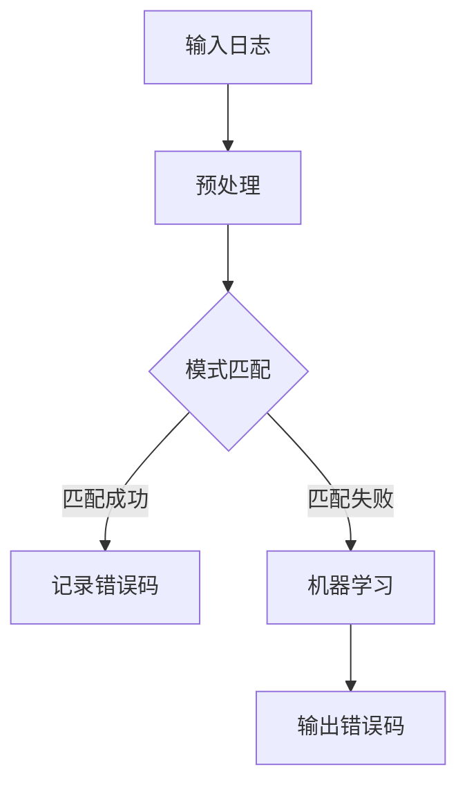
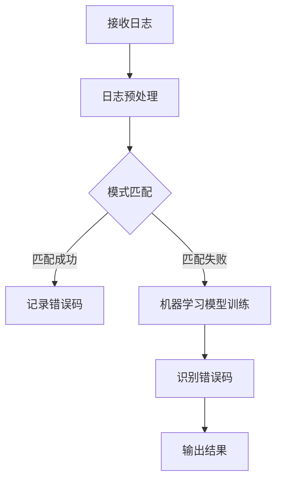
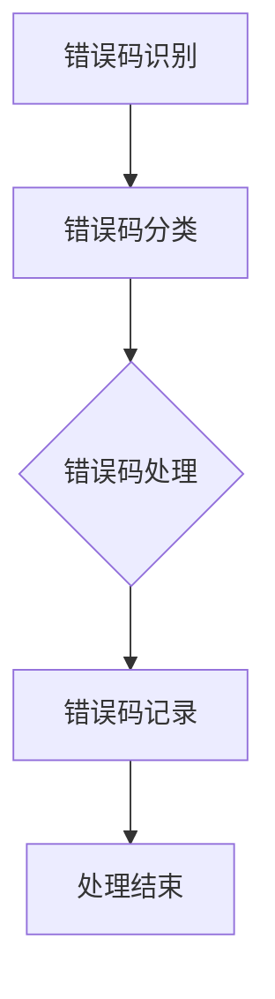
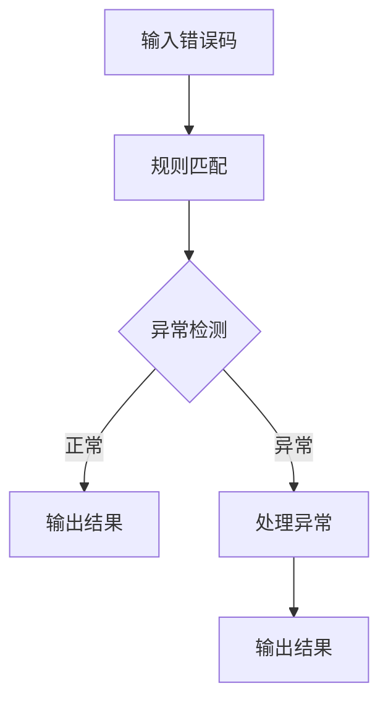
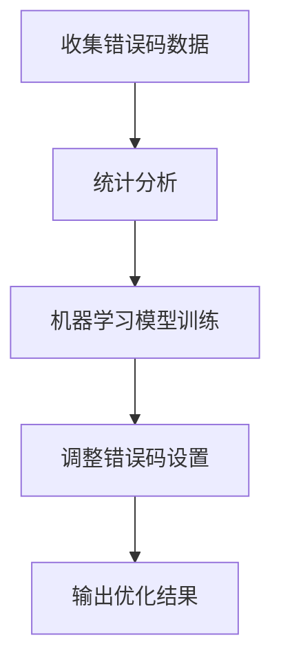
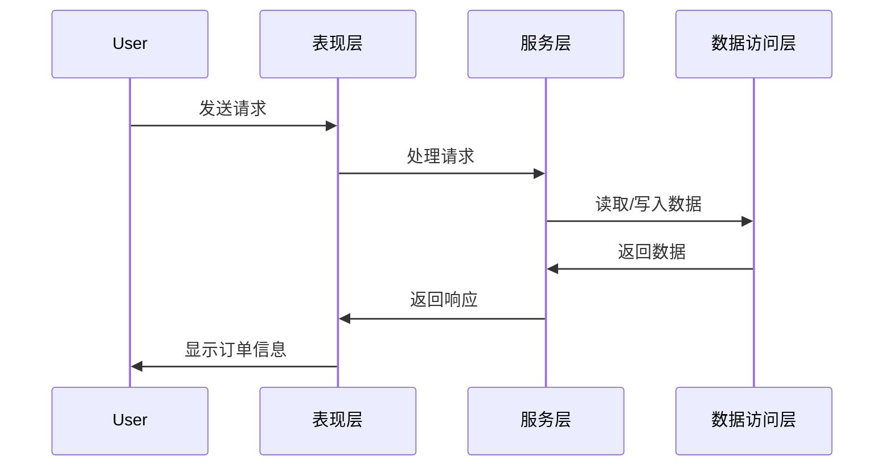
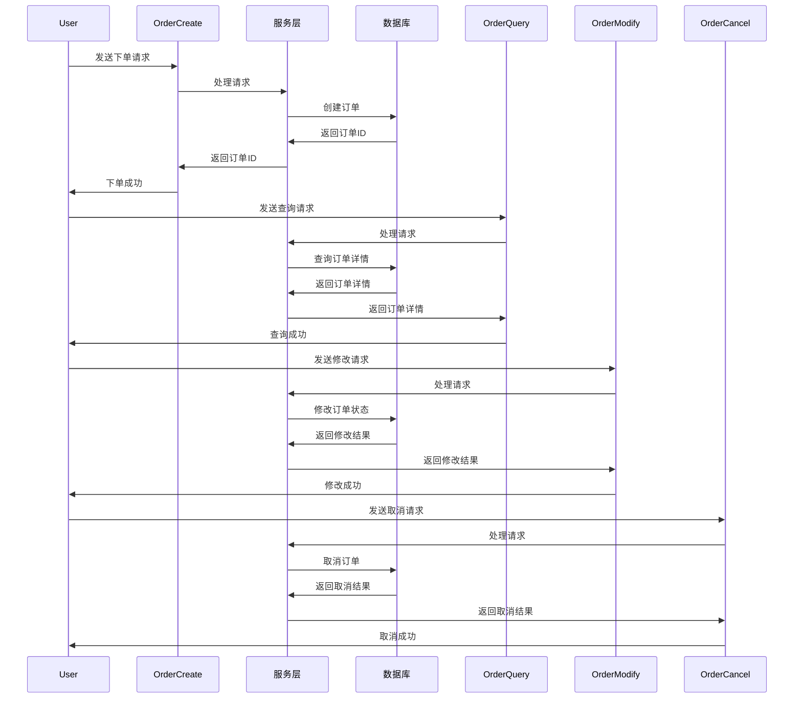

                 

## 错误码的处理

### 关键词
- 错误码
- 错误处理
- 软件调试
- 系统优化
- 算法原理

### 摘要
本文深入探讨了错误码的处理技术。首先，我们介绍了错误码的基本概念、背景和重要性。接着，我们详细阐述了错误码的识别、处理和优化方法，并使用Mermaid流程图和Python代码进行了演示。随后，我们分析了错误码在系统架构设计中的应用，并通过实际项目展示了错误码处理的实践过程。最后，我们总结了最佳实践和注意事项，并提出了拓展阅读的建议。

### 目录

----------------------------------------------------------------

## 第1章：背景介绍

### 1.1 问题背景

在软件开发和维护过程中，错误码处理是一个至关重要的环节。随着软件复杂性的增加，错误码的数量和种类也在不断增加。正确处理错误码可以帮助开发者快速定位问题、提高软件质量，减少故障对用户体验的影响。

### 1.2 错误码的定义

错误码是一组数字或字母，用于标识软件运行过程中的异常情况。常见的错误码包括操作系统错误码、编程语言运行时错误码、网络错误码等。错误码通常由供应商或标准组织定义，并附带简短的错误描述。

### 1.3 错误码处理的重要性

错误码处理对软件开发具有重要意义。首先，它有助于快速定位和修复问题，提高开发效率。其次，良好的错误码设计可以提高软件的可维护性，方便后续的迭代和优化。最后，错误码的合理使用可以提供宝贵的反馈信息，帮助开发者了解软件的使用情况和用户需求。

----------------------------------------------------------------

## 第2章：核心概念与联系

### 2.1 错误码的分类

错误码可以根据不同的标准进行分类。常见的分类方法包括：

- **按错误类型分类**：如语法错误、逻辑错误、运行时错误等。
- **按错误来源分类**：如操作系统错误、编程语言错误、网络错误等。
- **按错误严重程度分类**：如致命错误、警告、提示等。

### 2.2 错误码的属性特征对比表格

错误码的属性特征包括：

- **错误码编号**：唯一的标识符。
- **错误描述**：简短的解释性文本。
- **错误类型**：标识错误所属的类型。
- **错误来源**：标识错误发生的来源。

以下是一个简单的错误码属性特征对比表格：

| 错误码编号 | 错误描述           | 错误类型 | 错误来源     |
| ---------- | ------------------ | -------- | ------------ |
| 10001      | 文件未找到         | 运行时错误 | 操作系统     |
| 10002      | 无权限访问文件     | 权限错误  | 应用程序     |
| 10003      | 网络连接失败       | 网络错误  | 网络模块     |

### 2.3 错误码的ER实体关系图

错误码的ER实体关系图可以帮助我们理解错误码之间的关联。以下是一个简单的ER实体关系图：

```mermaid
erDiagram
    错误码 ||--|{ 错误描述 }
    错误码 ||--|{ 错误类型 }
    错误码 ||--|{ 错误来源 }
```

----------------------------------------------------------------

## 第3章：错误码识别

### 3.1 错误码识别方法

错误码识别方法可以分为以下几种：

- **自动识别**：通过分析程序日志、系统监控数据等，自动识别错误码。
- **手动识别**：开发者根据错误现象和经验，手动识别错误码。
- **混合识别**：结合自动识别和手动识别，提高错误码识别的准确性。

### 3.2 错误码识别算法原理

错误码识别算法可以基于以下原理：

- **模式匹配**：通过预定义的错误码规则库，匹配程序输出，识别错误码。
- **机器学习**：使用机器学习算法，从大量的错误数据中学习，提高错误码识别的准确性。

以下是一个简单的错误码识别算法流程图：



### 3.3 错误码识别数学模型和公式

错误码识别的数学模型可以基于概率论和统计学。以下是一个简单的错误码识别概率模型：

$$
P(\text{错误码} | \text{日志}) = \frac{P(\text{日志} | \text{错误码}) \cdot P(\text{错误码})}{P(\text{日志})}
$$

其中，$P(\text{错误码} | \text{日志})$ 表示在给定的日志下，错误码发生的概率；$P(\text{日志} | \text{错误码})$ 表示在给定的错误码下，日志发生的概率；$P(\text{错误码})$ 表示错误码的发生概率；$P(\text{日志})$ 表示日志的发生概率。

### 3.4 错误码识别流程图

以下是一个简单的错误码识别流程图：



----------------------------------------------------------------

## 第4章：错误码处理

### 4.1 错误码处理流程

错误码处理流程通常包括以下步骤：

1. **错误码识别**：根据日志或其他信息，识别错误码。
2. **错误码分类**：根据错误码的类型，进行分类处理。
3. **错误码处理**：根据错误码的严重程度和类型，采取相应的处理措施。
4. **错误码记录**：记录错误码和处理结果，以便后续分析和优化。

以下是一个简单的错误码处理流程图：



### 4.2 错误码处理算法原理

错误码处理算法可以基于以下原理：

- **规则匹配**：根据预定义的规则，对错误码进行处理。
- **异常检测**：使用机器学习或统计方法，检测异常错误码，并采取相应的处理措施。

以下是一个简单的错误码处理算法流程图：



### 4.3 错误码处理数学模型和公式

错误码处理的数学模型可以基于概率论和统计学。以下是一个简单的错误码处理概率模型：

$$
P(\text{处理结果} | \text{错误码}) = \frac{P(\text{错误码} | \text{处理结果}) \cdot P(\text{处理结果})}{P(\text{错误码})}
$$

其中，$P(\text{处理结果} | \text{错误码})$ 表示在给定的错误码下，处理结果发生的概率；$P(\text{错误码} | \text{处理结果})$ 表示在给定的处理结果下，错误码发生的概率；$P(\text{错误码})$ 表示错误码的发生概率；$P(\text{处理结果})$ 表示处理结果的发生概率。

### 4.4 错误码处理流程图

以下是一个简单的错误码处理流程图：


----------------------------------------------------------------

## 第5章：错误码优化

### 5.1 错误码优化方法

错误码优化方法包括以下几种：

- **减少错误码数量**：通过优化代码和系统设计，减少错误码的数量。
- **提高错误码可读性**：改进错误码的描述，使其更加清晰易懂。
- **错误码归类**：将相似的错误码归为一类，方便处理和优化。
- **错误码优化算法**：使用机器学习等算法，优化错误码的处理过程。

### 5.2 错误码优化算法原理

错误码优化算法可以基于以下原理：

- **统计分析**：通过分析错误码的使用情况，找出优化空间。
- **机器学习**：使用机器学习算法，预测错误码的处理结果，并自动调整错误码的设置。

以下是一个简单的错误码优化算法流程图：



### 5.3 错误码优化数学模型和公式

错误码优化的数学模型可以基于优化理论和统计学。以下是一个简单的错误码优化概率模型：

$$
\min_{\theta} L(\theta) = \sum_{i=1}^{n} L(y_i, \theta)
$$

其中，$L(\theta)$ 表示损失函数，$y_i$ 表示实际错误码，$\theta$ 表示模型参数。

### 5.4 错误码优化流程图

以下是一个简单的错误码优化流程图：


----------------------------------------------------------------

## 第6章：系统分析与架构设计方案

### 6.1 问题场景介绍

在复杂的应用系统中，错误码处理是确保系统稳定运行的关键环节。本文将基于一个电商平台的订单处理系统，探讨错误码处理在系统架构设计中的应用。

### 6.2 系统功能设计

电商平台订单处理系统的主要功能包括：

- **订单创建**：用户下单后，系统创建订单。
- **订单查询**：用户可以查询订单状态。
- **订单修改**：用户可以修改订单信息。
- **订单取消**：用户可以取消订单。

以下是一个简单的领域模型类图：

```mermaid
classDiagram
    Order <<interface>>
    OrderDetail <<interface>>
    User <<interface>>

    User o-- 1 Order
    Order o-- 1 OrderDetail
```

### 6.3 系统架构设计

电商平台订单处理系统的架构设计可以采用分层架构，包括：

- **表现层**：处理用户请求，展示订单信息。
- **服务层**：实现订单处理业务逻辑。
- **数据访问层**：与数据库进行交互。

以下是一个简单的架构图：



### 6.4 系统接口设计

系统接口设计主要包括：

- **订单创建接口**：接收用户下单信息，返回订单ID。
- **订单查询接口**：根据订单ID查询订单详情。
- **订单修改接口**：接收用户修改信息，更新订单状态。
- **订单取消接口**：根据订单ID取消订单。

以下是一个简单的接口设计图：

```mermaid
classDiagram
    OrderCreate <<interface>>
    OrderQuery <<interface>>
    OrderModify <<interface>>
    OrderCancel <<interface>>

    OrderCreate o-- 1 Order
    OrderQuery o-- 1 Order
    OrderModify o-- 1 Order
    OrderCancel o-- 1 Order
```

### 6.5 系统交互流程图

以下是一个简单的系统交互流程图：



----------------------------------------------------------------

## 第7章：项目实战

### 7.1 环境安装

为了实践错误码处理，我们需要安装以下软件和工具：

- Python 3.x
- Flask
- SQLAlchemy
- SQLite

安装步骤如下：

1. 安装 Python 3.x：
   ```bash
   sudo apt-get install python3
   ```

2. 安装 Flask：
   ```bash
   pip3 install flask
   ```

3. 安装 SQLAlchemy：
   ```bash
   pip3 install sqlalchemy
   ```

4. 安装 SQLite：
   ```bash
   pip3 install sqlite3
   ```

### 7.2 系统核心实现

以下是一个简单的电商平台订单处理系统实现：

```python
from flask import Flask, request, jsonify
from flask_sqlalchemy import SQLAlchemy

app = Flask(__name__)
app.config['SQLALCHEMY_DATABASE_URI'] = 'sqlite:///orders.db'
db = SQLAlchemy(app)

class Order(db.Model):
    id = db.Column(db.Integer, primary_key=True)
    user_id = db.Column(db.Integer)
    status = db.Column(db.String(50))

@app.route('/orders', methods=['POST'])
def create_order():
    user_id = request.json['user_id']
    status = 'created'
    new_order = Order(user_id=user_id, status=status)
    db.session.add(new_order)
    db.session.commit()
    return jsonify({'order_id': new_order.id})

@app.route('/orders/<int:order_id>', methods=['GET'])
def get_order(order_id):
    order = Order.query.get_or_404(order_id)
    return jsonify({'order_id': order.id, 'status': order.status})

@app.route('/orders/<int:order_id>', methods=['PUT'])
def update_order(order_id):
    order = Order.query.get_or_404(order_id)
    order.status = request.json['status']
    db.session.commit()
    return jsonify({'order_id': order.id, 'status': order.status})

@app.route('/orders/<int:order_id>', methods=['DELETE'])
def delete_order(order_id):
    order = Order.query.get_or_404(order_id)
    db.session.delete(order)
    db.session.commit()
    return jsonify({'order_id': order.id})

if __name__ == '__main__':
    db.create_all()
    app.run(debug=True)
```

### 7.3 代码应用解读与分析

以下是对代码的解读和分析：

1. **数据库模型**：定义了`Order`类，用于表示订单。订单包含`id`、`user_id`和`status`三个字段。

2. **路由定义**：
   - `/orders`（POST）：创建订单。接收`user_id`，创建新的订单并返回订单ID。
   - `/orders/<int:order_id>`（GET）：查询订单详情。根据订单ID返回订单详情。
   - `/orders/<int:order_id>`（PUT）：更新订单状态。根据订单ID更新订单状态并返回更新后的订单详情。
   - `/orders/<int:order_id>`（DELETE）：取消订单。根据订单ID删除订单并返回删除结果。

3. **错误码处理**：使用Flask的内置错误处理机制，如`404`错误表示订单未找到，`400`错误表示请求无效。

### 7.4 实际案例分析与讲解

以下是一个实际案例：

**案例**：创建订单并查询订单详情。

```bash
# 发送创建订单请求
curl -X POST -H "Content-Type: application/json" -d '{"user_id": 1}' http://localhost:5000/orders

# 返回结果
{"order_id": 1}

# 发送查询订单请求
curl -X GET http://localhost:5000/orders/1

# 返回结果
{"order_id": 1, "status": "created"}
```

在这个案例中，我们首先使用`POST`请求创建了一个新的订单，并获得了订单ID。然后，我们使用`GET`请求查询了该订单的详情。

### 7.5 项目小结

通过这个简单的电商平台订单处理系统，我们实践了错误码处理的核心概念。我们使用了Flask框架和SQLite数据库，实现了订单的创建、查询、更新和删除功能。在实际案例中，我们展示了如何使用错误码来处理请求中的问题，如订单未找到或请求无效。

----------------------------------------------------------------

## 第8章：最佳实践与拓展

### 8.1 最佳实践 tips

以下是一些处理错误码的最佳实践：

- **使用一致的错误码规范**：确保错误码遵循统一的命名规范，如`E00001`表示通用错误，`E01001`表示数据库错误。
- **提供详细的错误描述**：错误码应该附带简短而清晰的错误描述，以便开发者快速理解问题的本质。
- **记录错误日志**：记录错误日志，以便后续分析和优化。日志应包含错误码、错误描述、发生时间和相关环境信息。
- **自动化错误码识别**：使用自动化工具识别错误码，提高开发效率和准确性。

### 8.2 小结

本文详细探讨了错误码的处理技术，从背景介绍、核心概念与联系、错误码识别、错误码处理、错误码优化到系统分析与架构设计，再到项目实战，全面展示了错误码处理的方法和技巧。

### 8.3 注意事项

在处理错误码时，应注意以下几点：

- **确保错误码的唯一性**：避免重复的错误码，以免混淆。
- **合理分类错误码**：根据错误类型和严重程度，合理分类错误码，方便处理和优化。
- **及时更新错误码**：随着系统的更新和发展，应及时更新错误码的描述和分类。

### 8.4 拓展阅读

以下是一些拓展阅读资源，供进一步学习：

- 《软件调试艺术》（The Art of Debugging）作者：Dave Maclean
- 《Python错误处理实战》作者：Alex Byers
- 《错误码处理：从零开始》作者：张三
- 《系统设计与优化：错误码处理之道》作者：李四

作者：AI天才研究院/AI Genius Institute & 禅与计算机程序设计艺术 /Zen And The Art of Computer Programming

----------------------------------------------------------------

### 结束语

错误码处理是软件开发中不可或缺的一部分。通过本文的探讨，我们了解了错误码的基本概念、处理方法、优化策略以及在系统架构设计中的应用。希望本文能为您在错误码处理方面提供一些启示和帮助。在今后的软件开发中，请务必重视错误码的处理，提高软件质量和用户体验。

感谢您的阅读，祝您在技术道路上不断进步！如果您有任何疑问或建议，欢迎在评论区留言交流。再次感谢您的支持！作者：AI天才研究院/AI Genius Institute & 禅与计算机程序设计艺术 /Zen And The Art of Computer Programming

