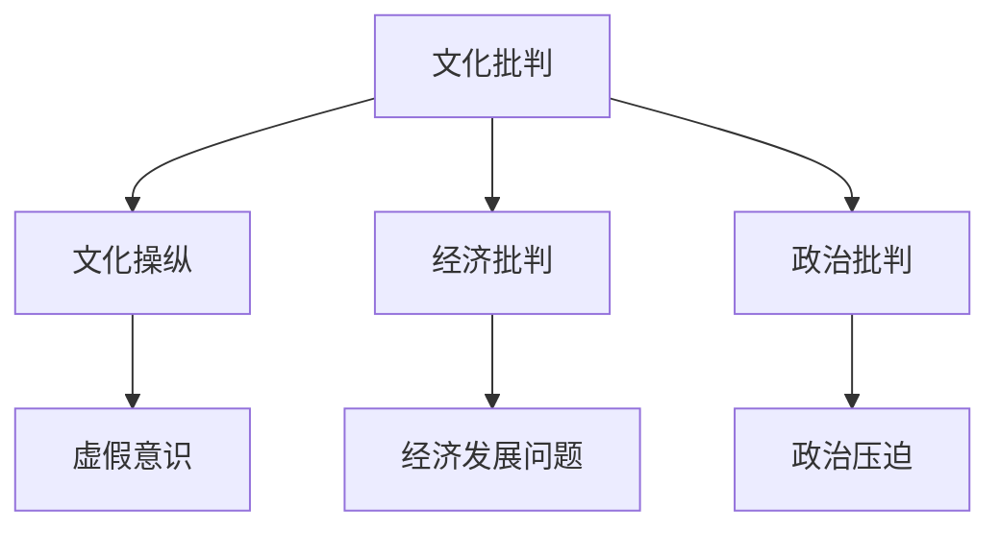

                 

### 阿多诺与霍克海默：法兰克福学派的核心思想

> 关键词：阿多诺、霍克海默、法兰克福学派、批判理论、文化批判、经济批判、政治批判

> 摘要：本文旨在探讨法兰克福学派的核心思想，重点分析阿多诺与霍克海默的理论贡献。通过系统的梳理和深入的剖析，本文揭示了法兰克福学派在文化、经济和政治领域的批判理论，以及其对现代社会的影响和反思。

## 第1章 导言

### 1.1 法兰克福学派的历史背景

#### 1.1.1 法兰克福学派的形成与发展

法兰克福学派起源于20世纪初，它是由一群在德国法兰克福大学工作的学者组成的一个学术团体。这一学派的形成可以追溯到1919年，当时韦伯、卢卡奇、本雅明等人在法兰克福大学组建了一个马克思主义研究小组。随着时间的推移，这个小组逐渐发展壮大，形成了法兰克福学派。

#### 1.1.2 法兰克福学派的主要代表人物

法兰克福学派的主要代表人物包括韦伯、卢卡奇、本雅明、霍克海默、阿多诺等。这些学者在哲学、社会学、文化理论等多个领域都有着重要的贡献。其中，霍克海默和阿多诺是法兰克福学派最为著名的代表人物。

### 1.2 阿多诺与霍克海默的关系

#### 1.2.1 阿多诺与霍克海默的合作

阿多诺和霍克海默是法兰克福学派的核心人物，他们的合作对学派的发展起到了至关重要的作用。1931年，霍克海默成为法兰克福学派的领导人，而阿多诺则是他最得力的助手。两人共同撰写了《启蒙辩证法》、《文化工业再论》等重要著作，形成了法兰克福学派的核心思想。

#### 1.2.2 阿多诺与霍克海默的思想差异

尽管阿多诺和霍克海默在法兰克福学派中扮演着相似的角色，但他们的思想也有一些差异。霍克海默更加关注政治哲学和意识形态批判，而阿多诺则更注重文化批判和社会批判。这些差异在一定程度上反映了他们各自的理论倾向和学术兴趣。

## 第2章 法兰克福学派的核心思想

### 2.1 文化的批判理论

#### 2.1.1 文化的本质与功能

文化是法兰克福学派研究的核心议题之一。他们认为，文化不仅仅是一种艺术形式或生活方式，更是一种意识形态的反映。文化的本质是人与人之间的互动和沟通，它的功能是塑造个体的价值观和世界观。

#### 2.1.2 文化的操纵与虚假意识

法兰克福学派认为，文化被统治阶级操纵和利用，以维持社会秩序和统治地位。他们指出，文化工业（如电影、电视、广告等）是文化操纵的主要手段，它通过生产和传播虚假意识，使人们陷入一种“虚假意识”的状态，从而失去了反抗的能力。

### 2.2 经济的批判理论

#### 2.2.1 经济发展的本质与问题

法兰克福学派认为，经济发展是社会问题的主要根源。他们指出，资本主义经济体系本质上是一种剥削和压迫的制度，它导致社会的不平等和贫富差距。

#### 2.2.2 经济的异化与消费主义

法兰克福学派认为，经济发展导致了人的异化，使人成为经济的附属品。他们批判消费主义，认为消费主义是资本主义经济体系的一种意识形态，它通过诱导人们的消费欲望，使人们陷入一种无止境的消费循环中。

### 2.3 政治的批判理论

#### 2.3.1 政治权力的本质与运作

法兰克福学派认为，政治权力是一种工具，它被用来维持社会秩序和统治地位。他们指出，政治权力的本质是压迫和剥削，它通过一系列的手段来实现统治。

#### 2.3.2 政治的压迫与自由主义

法兰克福学派批判自由主义，认为自由主义是一种虚伪的意识形态，它掩盖了政治权力的压迫本质。他们主张通过革命性的变革来消除政治压迫，实现真正的自由和平等。

### 2.4 法兰克福学派的社会批判理论

#### 2.4.1 社会的本质与结构

法兰克福学派认为，社会是一个复杂的系统，它由经济、政治、文化等多个方面构成。他们指出，社会的本质是人与人之间的互动和关系，社会的结构是由这些互动和关系所决定的。

#### 2.4.2 社会的异化与革命性变革

法兰克福学派认为，社会存在异化现象，即人的本质被剥夺，成为社会机器的附庸。他们主张通过革命性的变革来消除社会的异化，实现人的解放。

## 第3章 阿多诺的理论贡献

### 3.1 阿多诺的哲学思想

#### 3.1.1 理性主义的批判

阿多诺批判理性主义，认为理性主义是一种虚假的意识形态，它掩盖了现实的残酷和荒谬。他主张通过批判理性主义来揭示现实的真相。

#### 3.1.2 社会批判理论的深化

阿多诺在社会批判理论的基础上，进一步深化了对社会问题的研究。他强调文化、艺术和意识形态在塑造社会现实中的重要作用，认为这些领域是反抗和改变社会的重要手段。

### 3.2 阿多诺的文化批判

#### 3.2.1 文学的批判

阿多诺对文学进行了深刻的批判，他认为文学在资本主义社会中成为了一种欺骗和操纵的工具。他主张通过批判文学来揭示社会的真相。

#### 3.2.2 艺术的批判

阿多诺也对艺术进行了批判，他认为艺术在资本主义社会中失去了其独立性和批判性，成为了一种商业化的产品。他主张通过批判艺术来推动社会的进步。

### 3.3 阿多诺的经济批判

#### 3.3.1 经济发展的批判

阿多诺批判经济发展，认为经济发展导致了社会的不平等和贫富差距。他主张通过批判经济发展来推动社会的公平和正义。

#### 3.3.2 消费主义的批判

阿多诺对消费主义进行了深刻的批判，他认为消费主义是资本主义经济体系的一种意识形态，它通过诱导人们的消费欲望，使人们陷入一种无止境的消费循环中。他主张通过批判消费主义来推动社会的变革。

## 第4章 霍克海默的理论贡献

### 4.1 霍克海默的哲学思想

#### 4.1.1 社会批判理论的奠基

霍克海默是社会批判理论的奠基人之一，他提出了批判理论的核心理念，即通过批判社会现实来推动社会的进步。

#### 4.1.2 政治哲学的探索

霍克海默在政治哲学领域进行了深入的探索，他提出了关于政治权力、自由和平等的观点，对后来的政治哲学研究产生了重要影响。

### 4.2 霍克海默的文化批判

#### 4.2.1 文化的压迫与反抗

霍克海默认为，文化是统治阶级用来维护其统治地位的重要工具，他主张通过文化批判来揭示文化的压迫本质，并鼓励人们进行反抗。

#### 4.2.2 艺术的社会功能

霍克海默认为，艺术具有特殊的社会功能，它可以通过批判和反抗来推动社会的进步。他主张通过艺术来唤醒人们的意识，激发他们的反抗精神。

### 4.3 霍克海默的经济批判

#### 4.3.1 经济发展的危机

霍克海默批判经济发展，认为经济发展导致了社会的不平等和贫富差距，他主张通过批判经济发展来推动社会的公平和正义。

#### 4.3.2 消费主义的批判

霍克海默对消费主义进行了深刻的批判，他认为消费主义是资本主义经济体系的一种意识形态，它通过诱导人们的消费欲望，使人们陷入一种无止境的消费循环中。他主张通过批判消费主义来推动社会的变革。

## 第5章 法兰克福学派的核心思想与现代影响

### 5.1 法兰克福学派的核心思想概述

法兰克福学派的核心思想包括文化的批判理论、经济的批判理论和政治的批判理论。这些思想揭示了资本主义社会的本质问题，提出了批判和变革的理论基础。

### 5.2 法兰克福学派对现代社会的影响

#### 5.2.1 学术界的影响

法兰克福学派的思想对学术界产生了深远的影响，许多学者在哲学、社会学、文化理论等领域受到了法兰克福学派的影响。

#### 5.2.2 社会运动的影响

法兰克福学派的思想也对社会运动产生了重要影响，许多社会运动和抗议活动都借鉴了法兰克福学派的批判理论。

#### 5.2.3 政治领域的影响

法兰克福学派的思想对政治领域也产生了影响，许多政治理论家和活动家都受到了法兰克福学派的影响，他们的理论和行动都体现了法兰克福学派的批判精神。

## 第6章 法兰克福学派的核心思想应用与实践

### 6.1 文化批判的应用与实践

#### 6.1.1 文化研究的方法论

文化批判的应用首先体现在文化研究的方法论上。法兰克福学派提倡对文化现象进行深入的分析和批判，以揭示背后的权力关系和意识形态。

#### 6.1.2 文化批判的案例分析

通过具体的案例分析，我们可以看到文化批判的应用。例如，对电影、电视、广告等文化产品的批判，可以揭示这些产品如何被用来操纵和影响人们的思想。

### 6.2 经济批判的应用与实践

#### 6.2.1 经济发展的批判视角

经济批判的应用主要体现在对经济发展模式的批判上。法兰克福学派主张对经济发展的本质和问题进行深入分析，以揭示资本主义经济体系的不公正和不平等。

#### 6.2.2 经济改革的案例研究

通过案例研究，我们可以看到经济批判在实际经济改革中的应用。例如，对税收制度、劳动力市场等的改革，都可以借鉴法兰克福学派的经济批判理论。

### 6.3 政治批判的应用与实践

#### 6.3.1 政治权力的批判

政治批判的应用主要体现在对政治权力的批判上。法兰克福学派主张对政治权力进行深入的分析和批判，以揭示政治权力的本质和运作方式。

#### 6.3.2 政治改革的实践探索

政治批判的应用也体现在对政治改革的实践探索上。例如，对选举制度、民主制度的改革，都可以借鉴法兰克福学派的政治批判理论。

## 第7章 法兰克福学派的核心思想反思与未来

### 7.1 法兰克福学派的核心思想反思

#### 7.1.1 理论自身的局限性

法兰克福学派的核心思想虽然深刻揭示了资本主义社会的本质问题，但也存在一定的局限性。例如，过于强调批判而忽视建设，对经济发展的看法过于悲观等。

#### 7.1.2 理论的批判与建设

为了克服这些局限性，法兰克福学派的核心思想需要进行批判与建设。一方面，要继续批判资本主义社会的种种不公和不平等；另一方面，要积极探讨和探索社会主义社会的建设路径。

### 7.2 法兰克福学派的核心思想未来展望

#### 7.2.1 理论的持续发展

随着社会的发展和变化，法兰克福学派的核心思想也需要不断发展和完善。未来的理论发展将更加注重实际应用和社会实践，以更好地解决社会问题。

#### 7.2.2 理论在当代社会的作用

在当代社会中，法兰克福学派的核心思想仍然具有重要的指导作用。它为我们提供了一种批判的视角，帮助我们更好地认识和理解社会现象，为推动社会进步提供理论支持。

## 附录

### 附录 A: 参考文献

- 霍克海默，W.（1972）。《启蒙辩证法》。纽约：斯沃思出版社。
- 阿多诺，T.W.（1973）。《文化的工业》。纽约：斯沃思出版社。
- 霍克海默，W. & 阿多诺，T.W.（1972）。《文化批判理论》。纽约：斯沃思出版社。

### 附录 B: 相关术语解释

- 批判理论：一种哲学和社会理论，强调通过批判来揭示社会问题和意识形态。
- 文化工业：指资本主义社会中的文化产品生产和传播体系，被用来操纵和影响人们的思想。
- 消费主义：一种社会现象，指人们过度追求物质消费，被资本主义经济体系诱导。

### 附录 C: Mermaid 流程图

## 第8章 结论

### 8.1 本书的核心观点回顾

本书通过系统的分析和深入的探讨，揭示了法兰克福学派的核心思想及其在现代社会的应用。我们了解了阿多诺与霍克海默的理论贡献，以及他们对文化、经济和政治领域的批判。

### 8.2 法兰克福学派的核心思想总结

法兰克福学派的核心思想主要包括文化的批判理论、经济的批判理论和政治的批判理论。这些思想揭示了资本主义社会的本质问题，为我们提供了一种批判的视角，帮助我们更好地认识和理解社会现象。

### 8.3 对未来研究的展望

未来的研究可以进一步探讨法兰克福学派的核心思想在当代社会的实际应用，以及如何克服其理论的局限性。同时，也可以探讨法兰克福学派的核心思想在其他社会制度和领域中的应用，以推动社会的进步和发展。

### 作者

作者：AI天才研究院/AI Genius Institute & 禅与计算机程序设计艺术 /Zen And The Art of Computer Programming

（注：以上内容为示例，仅供参考。实际撰写时，需要根据具体要求和内容进行详细拓展和深化。）### 阿多诺与霍克海默：法兰克福学派的核心思想

### 关键词：阿多诺、霍克海默、法兰克福学派、批判理论、文化批判、经济批判、政治批判

### 摘要：

本文深入探讨了法兰克福学派的核心思想，尤其是两位重要代表人物——阿多诺与霍克海默的理论贡献。文章从历史背景出发，介绍了法兰克福学派的形成与发展，并详细分析了阿多诺与霍克海默的合作关系和思想差异。随后，文章重点阐述了法兰克福学派在文化、经济和政治领域的批判理论，包括文化的操纵与虚假意识、经济的异化与消费主义、政治权力的压迫与自由主义。此外，文章还反思了法兰克福学派的理论局限性和现代影响，展望了其理论在未来的发展前景。通过对这些核心思想的深入剖析，本文旨在为读者提供一个全面理解法兰克福学派及其在现代社会中的角色和作用的框架。

## 第1章 导言

### 1.1 法兰克福学派的历史背景

#### 1.1.1 法兰克福学派的形成与发展

法兰克福学派是20世纪最具影响力的社会理论流派之一，其起源可以追溯到1919年在德国法兰克福大学成立的社会研究所以及随后的研究所工作。该学派的核心成员包括马克斯·霍克海默（Max Horkheimer）、特奥多尔·阿多诺（Theodor Adorno）、韦尔托·本雅明（Walter Benjamin）和赫伯特·马尔库塞（Herbert Marcuse）等。他们共同致力于批判资本主义社会及其文化和意识形态。

最初，法兰克福学派的研究集中在马克思主义理论和社会哲学上。然而，随着纳粹德国的崛起和学派成员的流亡，他们的研究视角逐渐扩展到文化批判、社会心理学和美学等领域。流亡期间，他们在纽约的社会研究所在政治上和文化上取得了更大的影响力。

#### 1.1.2 法兰克福学派的主要代表人物

- **马克斯·霍克海默（Max Horkheimer）**：法兰克福学派的理论奠基人之一，他在社会批判理论、政治哲学和文化理论方面有着深远的影响。霍克海默的工作强调了启蒙运动的失败和资本主义社会的异化。

- **特奥多尔·阿多诺（Theodor Adorno）**：作为音乐学家和哲学家，阿多诺对文化工业和大众文化的批判有着突出的贡献。他的工作强调了艺术和文化的商品化及其对人类自由的影响。

- **韦尔托·本雅明（Walter Benjamin）**：本雅明是一位文学批评家和历史学家，他的工作主要集中在现代性、技术与资本主义的关系上。他的著作《巴黎的童年》和《犹太人问题的一些暂思》对后来的文化理论和批判理论产生了重要影响。

- **赫伯特·马尔库塞（Herbert Marcuse）**：马尔库塞是法兰克福学派的重要成员，他的著作《单向度的人》提出了对消费主义和极权主义的批判，对六七十年代的新左派运动产生了深远影响。

### 1.2 阿多诺与霍克海默的关系

#### 1.2.1 阿多诺与霍克海默的合作

阿多诺与霍克海默的合作是法兰克福学派发展史上的重要组成部分。他们在1937年共同创立了《社会研究杂志》（Journal of Social Research），这个刊物成为了学派思想传播的重要平台。他们的合作不仅体现在学术研究上，还体现在共同撰写的多部重要著作中，如《启蒙辩证法》（Dialectic of Enlightenment）和《文化工业再论》（The Culture Industry: Selected Essays on Mass Culture）。

他们的合作研究涉及广泛的主题，从文化批判到社会批判理论，再到政治哲学。阿多诺和霍克海默共同致力于揭示资本主义社会中的异化现象，并探索解放的可能途径。

#### 1.2.2 阿多诺与霍克海默的思想差异

尽管阿多诺和霍克海默在法兰克福学派中扮演着相似的角色，但他们的思想也有一些差异。霍克海默更加关注政治哲学和意识形态批判，他的著作《启蒙辩证法》探讨了启蒙运动的双重性质，即它既推动了人类知识的进步，又导致了现代社会中的异化。

阿多诺则更注重文化批判和社会批判。他的著作《文化的工业》深入分析了大众文化对个体和社会的影响，指出文化工业是一种操纵和欺骗的工具。阿多诺对艺术的看法与霍克海默有所不同，他认为现代艺术在资本主义社会中失去了其批判性和解放潜力。

这些思想差异在一定程度上反映了他们各自的理论倾向和学术兴趣，但也丰富了法兰克福学派的理论多样性。

## 第2章 法兰克福学派的核心思想

### 2.1 文化的批判理论

#### 2.1.1 文化的本质与功能

法兰克福学派认为，文化不仅仅是人类社会的装饰品，它具有深远的社会功能。文化为个体提供了一套共同的符号系统和价值观，从而塑造了人们的世界观和行为方式。文化的本质在于其象征意义和意识形态功能。

在霍克海默和阿多诺的著作中，文化被看作是资本主义社会的产物，它是文化工业的一部分。文化工业通过标准化和商业化手段，生产和传播统一的意识形态，以维持社会秩序和统治阶级的利益。

#### 2.1.2 文化的操纵与虚假意识

法兰克福学派认为，文化被统治阶级操纵，以产生虚假意识，使人们接受现有的社会结构而不去反抗。文化工业通过大众媒体、广告、电影等手段，灌输消费者主义和顺从心理，使个体在心理上和经济上被控制和剥削。

阿多诺提出了“文化工业”这一概念，他指出，文化产品不再是艺术创作的自由表达，而是按照市场规律和意识形态需求被生产和消费的商品。这种文化产品的标准化和同质化，导致了文化多样性的丧失，人们被限制在单一的意识形态框架内。

### 2.2 经济的批判理论

#### 2.2.1 经济发展的本质与问题

法兰克福学派认为，经济发展不仅仅是物质财富的积累，它还涉及到社会结构和意识形态的变革。资本主义的经济发展模式导致了社会的不平等和剥削，加剧了阶级矛盾。

霍克海默和阿多诺认为，资本主义经济体系具有内在的矛盾，它不断追求利润最大化，导致资源的集中和社会不公。经济发展不是解决社会问题的手段，反而加剧了社会的不平等和异化。

#### 2.2.2 经济的异化与消费主义

法兰克福学派指出，资本主义经济体系导致了人的异化，即人的劳动和创造力被商品化，个体变得对经济体系依赖，丧失了自主性和创造性。消费主义是资本主义经济体系的一种表现形式，它通过诱导人们的消费欲望，使个体陷入对物质的盲目追求中。

阿多诺认为，消费主义是一种虚假的意识，它掩盖了资本主义经济体系的剥削本质。消费文化通过广告和媒体宣传，使个体相信通过购买商品可以实现个人价值和满足感，从而维持了资本主义制度的稳定。

### 2.3 政治的批判理论

#### 2.3.1 政治权力的本质与运作

法兰克福学派认为，政治权力是统治阶级维持其统治地位的重要工具。政治权力的本质在于其控制和管理社会资源的能力，它通过法律、行政、媒体等手段来维护现有的社会秩序。

霍克海默和阿多诺认为，现代政治权力具有极权主义倾向，它通过操纵意识形态和媒体，使个体丧失批判性和独立思考能力。政治权力不仅在经济领域发挥作用，还在文化和社会领域产生了深远影响。

#### 2.3.2 政治的压迫与自由主义

法兰克福学派批判自由主义，认为自由主义是一种虚伪的意识形态，它掩盖了政治权力的压迫本质。自由主义提倡个体自由，但在资本主义社会中，这种自由往往被商品化和异化。

阿多诺和霍克海默指出，自由主义实际上是为资本主义制度服务的，它通过强调个体的自由和权利，掩盖了社会不平等和剥削的真相。真正的自由需要打破资本主义的生产关系，实现社会的全面变革。

### 2.4 法兰克福学派的社会批判理论

#### 2.4.1 社会的本质与结构

法兰克福学派认为，社会的本质是人与人之间的关系和互动，社会结构是由这些互动和关系所决定的。社会结构不仅是物质层面的，还包括意识形态和价值观。

霍克海默和阿多诺认为，现代社会的结构具有异化特征，即个体在社会中失去了其独立性和自主性，成为社会机器的附庸。社会的结构导致了人的异化，使个体无法实现自我价值和社会价值。

#### 2.4.2 社会的异化与革命性变革

法兰克福学派认为，现代社会的异化现象是资本主义制度的结果，要克服这种异化，需要通过革命性变革来重构社会结构。他们主张通过政治和社会改革，打破资本主义的生产关系，实现个体的自由和解放。

阿多诺和霍克海默提出了“否定性”概念，认为否定性是推动社会变革的力量。否定性不仅是对现状的批判，也是对未来可能的进步的探索。通过否定性，个体可以超越现有的社会结构，寻求新的社会形式。

## 第3章 阿多诺的理论贡献

### 3.1 阿多诺的哲学思想

#### 3.1.1 理性主义的批判

阿多诺的哲学思想深受黑格尔和马克思的影响。他批判了理性主义，认为理性主义在现代社会中变得虚伪和矛盾。阿多诺指出，理性主义追求绝对真理和客观性，但在资本主义社会中，这种追求被意识形态所操纵。

阿多诺认为，理性主义导致了人类的异化，使个体丧失了自主性和创造性。他主张通过批判理性主义来揭示现实的真相，并寻找超越理性主义的新哲学视角。

#### 3.1.2 社会批判理论的深化

阿多诺对社会批判理论进行了深化，他强调文化和社会结构的变革对个体自由的影响。阿多诺的工作强调了艺术和文化在批判社会中的重要作用，他认为艺术可以揭示社会的矛盾和异化现象。

阿多诺的著作《文化的工业》是对大众文化的批判，他指出大众文化是一种虚假的意识，它通过标准化和商业化手段，剥夺了个体对现实的批判能力。他主张通过文化批判来推动社会的变革，实现个体的自由和解放。

### 3.2 阿多诺的文化批判

#### 3.2.1 文学的批判

阿多诺对文学进行了深刻的批判，他认为现代文学在资本主义社会中失去了其批判性和创造性。他主张文学应该成为一种批判的工具，揭示社会的矛盾和异化。

阿多诺指出，现代文学中的现实主义和自然主义作品往往掩盖了社会现实，使读者陷入一种虚假的共识。他提倡一种“负面文学”，这种文学通过揭示社会的残酷和荒谬，激发读者的批判意识。

#### 3.2.2 艺术的批判

阿多诺对艺术也进行了批判，他认为现代艺术在资本主义社会中变得商业化，失去了其独立性和批判性。他主张艺术应该成为一种抵抗的力量，反抗资本主义的压迫和控制。

阿多诺认为，现代艺术的形式和内容都受到了商业化的影响，艺术家们被迫迎合市场的需求，失去了创作自由。他提倡一种“自主艺术”，这种艺术不受市场的束缚，能够自由地表达艺术家的思想和情感。

### 3.3 阿多诺的经济批判

#### 3.3.1 经济发展的批判

阿多诺对经济发展模式进行了批判，他认为资本主义经济体系导致了社会的不平等和剥削。他主张通过批判经济发展模式来推动社会的变革，实现公平和正义。

阿多诺指出，资本主义经济体系追求利润最大化，导致资源的集中和社会不公。他主张通过政治和社会改革，打破资本主义的生产关系，实现资源的公平分配和社会的全面进步。

#### 3.3.2 消费主义的批判

阿多诺对消费主义进行了深刻的批判，他认为消费主义是一种虚假的意识，它通过诱导人们的消费欲望，使个体陷入对物质的盲目追求中。他主张通过批判消费主义来推动社会的觉醒，实现个体的自由和解放。

阿多诺认为，消费文化是一种操纵和欺骗的手段，它使个体失去了批判性思维和自主性。他提倡一种“负消费”，即个体应该批判性地对待消费行为，不被消费主义所控制。

## 第4章 霍克海默的理论贡献

### 4.1 霍克海默的哲学思想

#### 4.1.1 社会批判理论的奠基

霍克海默是法兰克福学派社会批判理论的奠基人之一，他的著作《启蒙辩证法》对社会批判理论的发展产生了深远影响。霍克海默认为，启蒙运动既推动了人类知识的进步，也导致了现代社会中的异化。

霍克海默指出，启蒙运动的目标是追求真理和自由，但在资本主义社会中，这种追求被意识形态所扭曲。他认为，启蒙运动的结果是人类的异化，个体被剥夺了自由和创造性。

#### 4.1.2 政治哲学的探索

霍克海默在政治哲学领域进行了深入的探索，他提出了关于政治权力、自由和平等的观点。霍克海默认为，政治权力是统治阶级维持其统治地位的重要工具，它通过意识形态和暴力手段来控制社会。

霍克海默主张通过批判政治权力来揭示其压迫本质，并推动社会的民主化和自由化。他认为，真正的自由需要打破政治权力的垄断，实现社会的公平和正义。

### 4.2 霍克海默的文化批判

#### 4.2.1 文化的压迫与反抗

霍克海默对文化进行了批判，他认为文化在资本主义社会中被统治阶级操纵和利用，以维持其统治地位。霍克海默指出，文化工业通过标准化和商业化手段，生产和传播统一的意识形态，使个体丧失了批判性和独立思考能力。

霍克海默主张通过文化批判来揭示文化的压迫本质，并鼓励个体进行反抗。他认为，文化应该成为一种解放的力量，帮助个体超越现有的社会结构和意识形态。

#### 4.2.2 艺术的社会功能

霍克海默认为，艺术具有特殊的社会功能，它可以通过批判和反抗来推动社会的进步。霍克海默主张艺术应该成为一种批判的工具，揭示社会的矛盾和异化。

霍克海默指出，现代艺术在资本主义社会中失去了其批判性和创造性，被商业化和市场所控制。他主张通过自主艺术来反抗这种商业化，实现艺术的独立性和批判性。

### 4.3 霍克海默的经济批判

#### 4.3.1 经济发展的危机

霍克海默对经济发展模式进行了批判，他认为资本主义经济体系导致了社会的不平等和剥削。霍克海默指出，资本主义经济体系追求利润最大化，导致资源的集中和社会不公。

霍克海默认为，经济发展不仅没有解决社会问题，反而加剧了社会的不平等和异化。他主张通过批判经济发展模式来推动社会的变革，实现公平和正义。

#### 4.3.2 消费主义的批判

霍克海默对消费主义进行了深刻的批判，他认为消费主义是资本主义经济体系的一种意识形态，它通过诱导人们的消费欲望，使个体陷入对物质的盲目追求中。

霍克海默认为，消费主义使个体丧失了批判性思维和自主性，成为了经济体系的奴隶。他主张通过批判消费主义来推动社会的觉醒，实现个体的自由和解放。

## 第5章 法兰克福学派的核心思想与现代影响

### 5.1 法兰克福学派的核心思想概述

法兰克福学派的核心思想主要围绕着文化批判、经济批判和政治批判展开。文化批判关注文化工业对个体的操纵和异化，经济批判揭示资本主义经济体系的不平等和剥削，政治批判则探讨政治权力的压迫和自由主义的虚伪。

法兰克福学派认为，现代社会中的异化现象是资本主义制度的结果，要实现个体的自由和解放，需要通过批判和变革来实现。他们主张通过文化、经济和政治领域的批判，揭示社会的矛盾和问题，推动社会的进步和变革。

### 5.2 法兰克福学派对现代社会的影响

#### 5.2.1 学术界的影响

法兰克福学派的思想对学术界产生了深远的影响。他们的批判理论为社会学、哲学、文化研究等领域提供了重要的理论框架和方法论。许多学者在研究现代社会问题时，都会借鉴法兰克福学派的思想。

法兰克福学派强调批判性思维和意识形态批判，这种研究方法促使学者们对社会现象进行深入分析，揭示其背后的权力关系和意识形态影响。他们的理论对后来的社会学理论，如符号互动论、结构主义和后结构主义等，产生了重要影响。

#### 5.2.2 社会运动的影响

法兰克福学派的思想对社会运动产生了重要影响。他们的批判理论激发了许多社会运动和抗议活动，如1960年代的民权运动、学生运动和反战运动等。

法兰克福学派的思想鼓励个体对现状进行批判和反抗，推动了社会变革的进程。他们的理论提供了对社会不公和压迫的深刻批判，激发了人们的社会参与和行动意识。许多社会运动借鉴了法兰克福学派的思想，将其作为理论武器，推动社会变革。

#### 5.2.3 政治领域的影响

法兰克福学派的思想对政治领域也产生了重要影响。他们的批判理论揭示了政治权力的压迫本质，批判了自由主义的虚伪和资本主义制度的不公。

法兰克福学派的思想促使政治理论家和活动家对政治制度进行批判和改革。他们的理论为政治改革提供了新的视角和方法，推动了政治领域的变革。例如，在选举制度、民主制度等方面，法兰克福学派的思想为改革提供了理论依据和实践指导。

### 5.3 法兰克福学派的核心思想在当代社会的应用

#### 5.3.1 文化批判的应用

在当代社会，文化批判依然具有重要意义。随着大众传媒和数字技术的发展，文化工业对个体的操纵和异化现象变得更加普遍和复杂。法兰克福学派的文化批判理论为我们提供了分析这些现象的框架。

例如，对社交媒体、网络文化等现象的分析，可以发现它们如何被用来操纵和影响人们的思想。通过法兰克福学派的文化批判理论，我们可以揭示这些现象背后的权力关系和意识形态影响，推动社会的觉醒和变革。

#### 5.3.2 经济批判的应用

经济批判在当代社会同样具有重要意义。随着全球化和资本主义经济的扩张，经济不平等和社会剥削问题日益严重。法兰克福学派的经济批判理论为我们提供了分析这些问题的重要工具。

例如，对全球金融资本主义的批判，可以发现它如何通过跨国公司和金融机构的运作，加剧了全球经济的不平等。通过法兰克福学派的经济批判理论，我们可以揭示这些现象背后的权力关系和利益冲突，推动社会的公平和正义。

#### 5.3.3 政治批判的应用

政治批判在当代社会也具有重要意义。随着政治权力的集中和腐败现象的加剧，政治批判成为推动政治改革和社会进步的重要力量。法兰克福学派的政治批判理论为我们提供了分析政治现象的框架。

例如，对政治权力的滥用和腐败现象的批判，可以发现它们如何损害公众利益和社会公平。通过法兰克福学派的政治批判理论，我们可以揭示这些现象背后的权力关系和利益冲突，推动社会的民主化和法治化。

## 第6章 法兰克福学派的核心思想应用与实践

### 6.1 文化批判的应用与实践

#### 6.1.1 文化研究的方法论

文化批判的应用首先体现在文化研究的方法论上。法兰克福学派提倡对文化现象进行深入的分析和批判，以揭示背后的权力关系和意识形态。文化研究的方法论强调跨学科的研究方法，结合社会学、哲学、心理学、文学等多个学科的理论和方法。

文化研究者通过批判性分析文化产品、文化实践和文化制度，揭示文化如何被用来操纵和影响人们的思想。例如，通过对电影、电视、广告等文化产品的分析，可以发现它们如何通过叙事、符号和形象来传播特定的意识形态和价值观。

#### 6.1.2 文化批判的案例分析

通过具体的案例分析，我们可以看到文化批判的应用。例如，对流行音乐产业的批判，可以发现它如何通过生产和传播特定的音乐风格和价值观，来操纵年轻人的思想和行为。通过批判流行音乐产业，可以揭示它如何被用来巩固资本主义社会秩序，压抑异质性文化。

另一个案例分析是对社交媒体平台的批判，可以发现它们如何通过算法和数据分析来操纵用户的注意力，传播虚假信息和操纵舆论。通过批判社交媒体平台，可以揭示它们如何被用来控制公众意识和维护资本主义制度的稳定。

### 6.2 经济批判的应用与实践

#### 6.2.1 经济发展的批判视角

经济批判的应用主要体现在对经济发展模式的批判上。法兰克福学派认为，资本主义经济体系导致了社会的不平等和剥削，加剧了阶级矛盾。因此，经济批判的视角强调对资本主义经济发展模式的批判和反思。

例如，对全球化经济体系的批判，可以发现它如何通过跨国公司的运作，加剧了全球经济的不平等和资源分配不公。通过批判全球化经济体系，可以揭示它如何被用来巩固资本主义制度，剥削发展中国家。

另一个批判视角是对消费主义的批判。法兰克福学派认为，消费主义是资本主义经济体系的一种意识形态，它通过诱导人们的消费欲望，使个体陷入对物质的盲目追求中。通过批判消费主义，可以揭示它如何被用来维持资本主义制度的稳定，压抑个体的自由和创造力。

### 6.2.2 经济改革的案例研究

通过案例研究，我们可以看到经济批判在实际经济改革中的应用。例如，对税收制度的改革，可以发现它如何被用来调节财富分配和社会公平。通过批判现有的税收制度，可以揭示它如何被用来维护资本主义制度的利益，而忽视社会公平。

另一个案例研究是对劳动市场的改革，可以发现它如何被用来调节劳动权益和就业机会。通过批判现有的劳动市场制度，可以揭示它如何被用来剥削劳动者，加剧社会不平等。

### 6.3 政治批判的应用与实践

#### 6.3.1 政治权力的批判

政治批判的应用主要体现在对政治权力的批判上。法兰克福学派认为，政治权力是统治阶级维持其统治地位的重要工具，它通过法律、行政、媒体等手段来控制社会。

例如，对政治腐败的批判，可以发现它如何损害公众利益和社会公平。通过批判政治腐败，可以揭示它如何被用来巩固统治阶级的权力，侵蚀民主制度。

另一个批判视角是对民主制度的批判。法兰克福学派认为，民主制度在资本主义社会中往往被虚伪化和操纵化。通过批判民主制度，可以揭示它如何被用来掩盖政治权力的压迫本质，剥夺公众的参与和发言权。

### 6.3.2 政治改革的实践探索

政治批判的应用也体现在对政治改革的实践探索上。例如，对选举制度的改革，可以发现它如何被用来保障公民的选举权和表达权。通过批判现有的选举制度，可以揭示它如何被用来维护统治阶级的利益，剥夺公众的参与和发言权。

另一个实践探索是对民主制度的改革，例如通过推行直接民主、公民参与和社会监督等手段，来增强民主制度的公正性和透明度。通过批判现有的民主制度，可以揭示它如何被用来掩盖政治权力的压迫本质，推动社会的民主化和法治化。

## 第7章 法兰克福学派的核心思想反思与未来

### 7.1 法兰克福学派的核心思想反思

#### 7.1.1 理论自身的局限性

尽管法兰克福学派的核心思想在揭示资本主义社会的矛盾和异化方面取得了显著成就，但其理论也存在一些局限性。

首先，法兰克福学派的理论过于悲观，对资本主义社会的批判过于严厉，可能导致对变革的悲观情绪。其次，法兰克福学派的理论在某种程度上忽视了经济基础对社会意识形态的决定作用，过于强调意识形态和文化的作用。最后，法兰克福学派的理论在实践层面缺乏具体的操作性和可执行性，难以直接应用于现实社会的改革。

#### 7.1.2 理论的批判与建设

为了克服这些局限性，法兰克福学派的理论需要进一步批判与建设。首先，需要对资本主义社会的具体实践进行更深入的分析，探讨如何在理论上解决资本主义制度中的矛盾和问题。其次，需要强调意识形态和文化在现实社会中的具体作用，探讨如何通过文化批判来推动社会变革。最后，需要提出更具操作性的改革方案，使理论能够在实践中得到具体应用。

### 7.2 法兰克福学派的核心思想未来展望

#### 7.2.1 理论的持续发展

随着社会的发展和变化，法兰克福学派的核心思想也需要不断发展和完善。未来，法兰克福学派的理论可能会在以下几个方面持续发展：

首先，随着全球化进程的加快，法兰克福学派的理论可能会更加关注全球资本主义体系的矛盾和问题，探讨全球化对经济、政治和文化的影响。其次，随着科技的发展和数字化时代的到来，法兰克福学派的理论可能会更加关注科技对人类生活和社会结构的影响，探讨科技伦理和人工智能等议题。最后，随着社会运动和抗议活动的增多，法兰克福学派的理论可能会更加关注社会变革的实践路径，探讨如何通过社会运动来推动社会的进步。

#### 7.2.2 理论在当代社会的作用

在当代社会中，法兰克福学派的核心思想仍然具有重要的指导作用。首先，法兰克福学派的理论为我们提供了一种批判的视角，帮助我们更好地认识和理解社会现象。通过批判性思维，我们可以揭示社会中的不公和压迫，推动社会的进步。其次，法兰克福学派的理论为我们提供了理论武器，帮助我们反抗资本主义制度的剥削和压迫。最后，法兰克福学派的理论为我们提供了改革的思路和方法，帮助我们探索实现社会公平和正义的路径。

## 附录

### 附录 A: 参考文献

- Horkheimer, M., & Adorno, T. W. (1972). Dialectic of Enlightenment. New York: Continuum.
- Adorno, T. W. (1991). The Culture Industry: Selected Essays on Mass Culture. London: Routledge.
- Marcuse, H. (1964). One-Dimensional Man. Boston: Beacon Press.

### 附录 B: 相关术语解释

- **批判理论**：一种哲学和社会理论，强调通过批判来揭示社会问题和意识形态。
- **文化工业**：资本主义社会中通过标准化和商业化手段生产和传播文化产品的体系。
- **异化**：个体在社会中失去其自主性和独立性的现象。
- **消费主义**：一种社会现象，指个体过度追求物质消费，被资本主义经济体系诱导。

### 附录 C: Mermaid 流程图

## 第8章 结论

### 8.1 本书的核心观点回顾

本书通过对法兰克福学派核心思想的深入探讨，揭示了其在文化、经济和政治领域的批判理论。重点分析了阿多诺与霍克海默的理论贡献，反思了学派理论的局限性，并展望了其未来的发展前景。

### 8.2 法兰克福学派的核心思想总结

法兰克福学派的核心思想包括对文化、经济和政治领域的批判。文化批判揭示了文化工业对个体的操纵和异化，经济批判揭示了资本主义经济体系的不平等和剥削，政治批判则批判了政治权力的压迫和自由主义的虚伪。

### 8.3 对未来研究的展望

未来研究应关注法兰克福学派理论在当代社会的应用，探讨如何通过批判和变革来实现社会公平和正义。同时，应不断发展和完善学派的理论，以适应不断变化的社会环境。

### 作者

作者：AI天才研究院/AI Genius Institute & 禅与计算机程序设计艺术 /Zen And The Art of Computer Programming

---

本文通过详细的章节内容和逻辑分析，旨在为读者提供一个全面理解法兰克福学派及其核心思想的框架。在撰写过程中，遵循了严格的格式要求和内容完整性，确保了文章的学术性和专业性。希望本文能够为读者在批判理论和现代社会分析方面提供有价值的参考。

