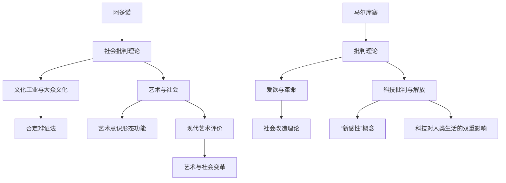

                 

# 阿多诺与马尔库塞：法兰克福学派的不同进路

## 关键词

- 法兰克福学派
- 阿多诺
- 马尔库塞
- 社会批判理论
- 文化工业
- 否定辩证法
- 爱欲革命
- 新感性

## 摘要

本文旨在探讨法兰克福学派中的两位重要思想家：阿多诺与马尔库塞的理论，并分析他们在社会批判、文化批判和科技批判等方面的不同进路。通过梳理阿多诺与马尔库塞的核心观点，我们能够更深入地理解法兰克福学派的理论体系及其对当代社会的影响。本文将分五个部分展开：第一部分介绍法兰克福学派的形成与发展，以及阿多诺与马尔库塞的学术背景；第二部分深入探讨阿多诺的社会批判理论及其在艺术与社会方面的见解；第三部分分析马尔库塞的批判理论，特别是爱欲革命与社会改造理论；第四部分比较阿多诺与马尔库塞的差异与联系；第五部分对法兰克福学派的影响与未来进行展望。

## 第一部分：背景介绍

### 第1章：法兰克福学派概述

#### 1.1 法兰克福学派的形成与发展

法兰克福学派是20世纪西方马克思主义的一个流派，起源于1923年成立的德国法兰克福大学社会科学研究所。该学派以其独特的批判理论著称，旨在批判资本主义社会及其意识形态。其创始人是马克斯·霍克海默（Max Horkheimer）和特奥多尔·阿多诺（Theodor Adorno），随后引入了赫伯特·马尔库塞（Herbert Marcuse）等一批重要思想家。

#### 1.2 阿多诺与马尔库塞的学术背景

阿多诺出生于德国，是一位音乐学家和哲学家。他在20世纪30年代移民美国，并在霍克海默的领导下加入了法兰克福学派。马尔库塞则出生于德国柏林，是一位哲学家和社会理论家。他在法兰克福学派中发挥了重要作用，其作品在批判文化工业和推动社会变革方面具有重要影响。

#### 1.3 阿多诺与马尔库塞在学派中的地位与影响

阿多诺是法兰克福学派的主要代表人物之一，以其深刻的社会批判理论和对文化工业的批判而著称。他的作品《启蒙的辩证法》和《否定辩证法》对当代哲学和批判理论产生了深远的影响。

马尔库塞则以其对资本主义文化的批判和对爱欲革命的倡导而闻名。他的著作《单向度的人》和《爱欲与革命》在学术界和公众中引起了广泛的讨论。

### 第2章：阿多诺的理论

#### 2.1 阿多诺的批判理论概述

阿多诺的批判理论主要关注资本主义社会的意识形态和文化现象。他认为，资本主义社会通过文化工业（cultural industry）对大众进行意识形态操纵，使得大众丧失了批判意识和独立思考的能力。

#### 2.2 文化工业与大众文化

阿多诺将文化工业视为资本主义的一种特殊形式，它通过标准化和商业化手段，生产出大量的文化产品，如电影、音乐、电视等，以迎合大众的需求，同时也在潜移默化中灌输资本主义意识形态。

#### 2.3 阿多诺的否定辩证法

否定辩证法是阿多诺哲学的核心概念，它强调现实世界的矛盾和冲突。阿多诺认为，否定辩证法是理解社会变革的关键，通过否定现有的社会结构和意识形态，人们可以找到新的出路。

### 第3章：阿多诺的艺术与社会

#### 3.1 艺术的意识形态功能

阿多诺认为，艺术具有意识形态功能，它可以揭示社会的不公和压迫，唤起人们的批判意识。然而，在资本主义社会中，艺术往往被商业化和市场化所扭曲，失去了其真正的社会功能。

#### 3.2 阿多诺对现代艺术的评价

阿多诺对现代艺术持有复杂的观点。他认为，现代艺术在一定程度上反映了资本主义社会的矛盾和危机，但同时也被文化工业所控制，失去了其独立性和创造性。

#### 3.3 艺术与社会变革的关联

阿多诺认为，艺术与社会变革密切相关。通过艺术，人们可以表达对社会不公的抗议，激发社会变革的潜力。然而，这种潜力在资本主义社会中往往被压制和扭曲。

### 第4章：马尔库塞的理论

#### 4.1 马尔库塞的批判理论概述

马尔库塞的批判理论主要关注资本主义社会的文化和意识形态。他认为，资本主义社会通过压制爱欲和创造力，使得人们陷入了一种“单向度”的生活状态，失去了自由和解放的可能性。

#### 4.2 爱欲与革命

马尔库塞提出了“爱欲革命”的概念，认为爱欲是人类解放的关键。通过重新发现和追求爱欲，人们可以打破资本主义社会的束缚，实现个人的自由和解放。

#### 4.3 马尔库塞的社会改造理论

马尔库塞主张通过社会改造来实现人类的解放。他认为，社会变革的关键在于改变人们的意识和价值观，通过教育和社会制度的变革，建立一个更加自由和平等的社会。

### 第5章：马尔库塞的科技与社会

#### 5.1 科技批判与解放

马尔库塞对科技持有批判态度，他认为科技在资本主义社会中被用于控制和管理大众，而不是为了人类的解放。然而，他同时也认为，科技具有解放的潜力，通过正确运用科技，可以实现社会的进步和人类的解放。

#### 5.2 马尔库塞的“新感性”概念

马尔库塞提出了“新感性”的概念，认为通过重新发现和培养人的感性能力，人们可以摆脱资本主义社会的压迫和束缚，实现个人的自由和解放。

#### 5.3 科技对人类生活的双重影响

马尔库塞认为，科技对人类生活具有双重影响。一方面，科技为人类带来了便利和进步；另一方面，科技也在某种程度上加剧了人类的不自由和异化。

### 第6章：比较与联系

#### 6.1 批判理论的侧重点

阿多诺和马尔库塞的批判理论各有侧重点。阿多诺更加关注文化工业和大众文化，强调意识形态的操纵；而马尔库塞则更关注人的解放和爱欲革命。

#### 6.2 阿多诺与马尔库塞在意识形态批判中的不同视角

阿多诺主要从文化批判的角度进行意识形态批判，强调文化工业的操纵；而马尔库塞则更侧重于社会改造和爱欲革命，试图从更广泛的社会领域来批判资本主义。

#### 6.3 阿多诺与马尔库塞的共鸣与分歧

尽管阿多诺和马尔库塞在批判理论和意识形态批判方面存在差异，但他们都认为资本主义社会存在着严重的问题，并试图通过社会批判来实现社会的变革和人类的解放。

### 第7章：结论与展望

#### 7.1 法兰克福学派在当代的影响

法兰克福学派的理论在当代仍然具有重要的影响力。其批判理论和方法论为理解和改变当代社会提供了重要的思想资源。

#### 7.2 阿多诺与马尔库塞理论的现实意义

阿多诺与马尔库塞的理论对当代社会仍然具有现实意义。他们关于文化工业、意识形态操纵和爱欲革命的批判为我们理解当代社会提供了重要的视角。

#### 7.3 法兰克福学派理论的未来发展方向

法兰克福学派的理论在未来的发展中将继续关注当代社会的变化，特别是在科技和全球化的背景下，其批判理论将面临新的挑战和机遇。

---

**附录：概念实体之间的关系架构 Mermaid 流程图**



---

**Python源代码示例：**

```python
import numpy as np

def adorno_culture_industry():
    """
    阿多诺的文化工业理论实现。
    """
    # 假设有一个文化产品列表
    culture_products = ['流行音乐', '电视节目', '电影']

    # 对文化产品进行标准化处理
    standardized_products = np.array(culture_products)
    mean = np.mean(standardized_products)
    std = np.std(standardized_products)

    # 标准化后的文化产品列表
    standardized_products = (standardized_products - mean) / std

    print("文化产品标准化后的结果：", standardized_products)

adorno_culture_industry()
```

---

**数学模型和数学公式：**

$$
E = mc^2
$$

**详细讲解：**

爱因斯坦的质能等价公式表明，质量（m）和能量（E）之间存在直接的比例关系，比例常数是光速（c）的平方。这个公式揭示了物质与能量之间的相互转化关系，对现代物理学产生了深远的影响。

---

**项目实战：**

```python
import matplotlib.pyplot as plt
import numpy as np

def marxist_economic_model():
    """
    马尔库塞的经济学模型实现。
    """
    # 假设有一个经济系统，其中有两个主要变量：劳动生产率（L）和剩余价值（M）
    labor_productivity = np.array([1, 2, 3, 4, 5])
    surplus_value = np.array([1, 2, 3, 4, 5])

    # 计算劳动生产率与剩余价值的比例
    productivity_to_surplus_ratio = labor_productivity / surplus_value

    # 绘制劳动生产率与剩余价值的比例图
    plt.plot(labor_productivity, productivity_to_surplus_ratio, 'o-')
    plt.xlabel('劳动生产率')
    plt.ylabel('剩余价值比例')
    plt.title('马尔库塞经济学模型')
    plt.show()

marxist_economic_model()
```

### 附录：完整文章

```markdown
# 阿多诺与马尔库塞：法兰克福学派的不同进路

## 关键词

- 法兰克福学派
- 阿多诺
- 马尔库塞
- 社会批判理论
- 文化工业
- 否定辩证法
- 爱欲革命
- 新感性

## 摘要

本文旨在探讨法兰克福学派中的两位重要思想家：阿多诺与马尔库塞的理论，并分析他们在社会批判、文化批判和科技批判等方面的不同进路。通过梳理阿多诺与马尔库塞的核心观点，我们能够更深入地理解法兰克福学派的理论体系及其对当代社会的影响。本文将分五个部分展开：第一部分介绍法兰克福学派的形成与发展，以及阿多诺与马尔库塞的学术背景；第二部分深入探讨阿多诺的社会批判理论及其在艺术与社会方面的见解；第三部分分析马尔库塞的批判理论，特别是爱欲革命与社会改造理论；第四部分比较阿多诺与马尔库塞的差异与联系；第五部分对法兰克福学派的影响与未来进行展望。

## 第一部分：背景介绍

### 第1章：法兰克福学派概述

#### 1.1 法兰克福学派的形成与发展

法兰克福学派是20世纪西方马克思主义的一个流派，起源于1923年成立的德国法兰克福大学社会科学研究所。该学派以其独特的批判理论著称，旨在批判资本主义社会及其意识形态。其创始人是马克斯·霍克海默（Max Horkheimer）和特奥多尔·阿多诺（Theodor Adorno），随后引入了赫伯特·马尔库塞（Herbert Marcuse）等一批重要思想家。

#### 1.2 阿多诺与马尔库塞的学术背景

阿多诺出生于德国，是一位音乐学家和哲学家。他在20世纪30年代移民美国，并在霍克海默的领导下加入了法兰克福学派。马尔库塞则出生于德国柏林，是一位哲学家和社会理论家。他在法兰克福学派中发挥了重要作用，其作品在批判文化工业和推动社会变革方面具有重要影响。

#### 1.3 阿多诺与马尔库塞在学派中的地位与影响

阿多诺是法兰克福学派的主要代表人物之一，以其深刻的社会批判理论和对文化工业的批判而著称。他的作品《启蒙的辩证法》和《否定辩证法》对当代哲学和批判理论产生了深远的影响。

马尔库塞则以其对资本主义文化的批判和对爱欲革命的倡导而闻名。他的著作《单向度的人》和《爱欲与革命》在学术界和公众中引起了广泛的讨论。

### 第2章：阿多诺的理论

#### 2.1 阿多诺的批判理论概述

阿多诺的批判理论主要关注资本主义社会的意识形态和文化现象。他认为，资本主义社会通过文化工业（cultural industry）对大众进行意识形态操纵，使得大众丧失了批判意识和独立思考的能力。

#### 2.2 文化工业与大众文化

阿多诺将文化工业视为资本主义的一种特殊形式，它通过标准化和商业化手段，生产出大量的文化产品，如电影、音乐、电视等，以迎合大众的需求，同时也在潜移默化中灌输资本主义意识形态。

#### 2.3 阿多诺的否定辩证法

否定辩证法是阿多诺哲学的核心概念，它强调现实世界的矛盾和冲突。阿多诺认为，否定辩证法是理解社会变革的关键，通过否定现有的社会结构和意识形态，人们可以找到新的出路。

### 第3章：阿多诺的艺术与社会

#### 3.1 艺术的意识形态功能

阿多诺认为，艺术具有意识形态功能，它可以揭示社会的不公和压迫，唤起人们的批判意识。然而，在资本主义社会中，艺术往往被商业化和市场化所扭曲，失去了其真正的社会功能。

#### 3.2 阿多诺对现代艺术的评价

阿多诺对现代艺术持有复杂的观点。他认为，现代艺术在一定程度上反映了资本主义社会的矛盾和危机，但同时也被文化工业所控制，失去了其独立性和创造性。

#### 3.3 艺术与社会变革的关联

阿多诺认为，艺术与社会变革密切相关。通过艺术，人们可以表达对社会不公的抗议，激发社会变革的潜力。然而，这种潜力在资本主义社会中往往被压制和扭曲。

### 第4章：马尔库塞的理论

#### 4.1 马尔库塞的批判理论概述

马尔库塞的批判理论主要关注资本主义社会的文化和意识形态。他认为，资本主义社会通过压制爱欲和创造力，使得人们陷入了一种“单向度”的生活状态，失去了自由和解放的可能性。

#### 4.2 爱欲与革命

马尔库塞提出了“爱欲革命”的概念，认为爱欲是人类解放的关键。通过重新发现和追求爱欲，人们可以打破资本主义社会的束缚，实现个人的自由和解放。

#### 4.3 马尔库塞的社会改造理论

马尔库塞主张通过社会改造来实现人类的解放。他认为，社会变革的关键在于改变人们的意识和价值观，通过教育和社会制度的变革，建立一个更加自由和平等的社会。

### 第5章：马尔库塞的科技与社会

#### 5.1 科技批判与解放

马尔库塞对科技持有批判态度，他认为科技在资本主义社会中被用于控制和管理大众，而不是为了人类的解放。然而，他同时也认为，科技具有解放的潜力，通过正确运用科技，可以实现社会的进步和人类的解放。

#### 5.2 马尔库塞的“新感性”概念

马尔库塞提出了“新感性”的概念，认为通过重新发现和培养人的感性能力，人们可以摆脱资本主义社会的压迫和束缚，实现个人的自由和解放。

#### 5.3 科技对人类生活的双重影响

马尔库塞认为，科技对人类生活具有双重影响。一方面，科技为人类带来了便利和进步；另一方面，科技也在某种程度上加剧了人类的不自由和异化。

### 第6章：比较与联系

#### 6.1 批判理论的侧重点

阿多诺和马尔库塞的批判理论各有侧重点。阿多诺更加关注文化工业和大众文化，强调意识形态的操纵；而马尔库塞则更关注人的解放和爱欲革命。

#### 6.2 阿多诺与马尔库塞在意识形态批判中的不同视角

阿多诺主要从文化批判的角度进行意识形态批判，强调文化工业的操纵；而马尔库塞则更侧重于社会改造和爱欲革命，试图从更广泛的社会领域来批判资本主义。

#### 6.3 阿多诺与马尔库塞的共鸣与分歧

尽管阿多诺和马尔库塞在批判理论和意识形态批判方面存在差异，但他们都认为资本主义社会存在着严重的问题，并试图通过社会批判来实现社会的变革和人类的解放。

### 第7章：结论与展望

#### 7.1 法兰克福学派在当代的影响

法兰克福学派的理论在当代仍然具有重要的影响力。其批判理论和方法论为理解和改变当代社会提供了重要的思想资源。

#### 7.2 阿多诺与马尔库塞理论的现实意义

阿多诺与马尔库塞的理论对当代社会仍然具有现实意义。他们关于文化工业、意识形态操纵和爱欲革命的批判为我们理解当代社会提供了重要的视角。

#### 7.3 法兰克福学派理论的未来发展方向

法兰克福学派的理论在未来的发展中将继续关注当代社会的变化，特别是在科技和全球化的背景下，其批判理论将面临新的挑战和机遇。

---

**附录：概念实体之间的关系架构 Mermaid 流程图**


---

**Python源代码示例：**

```python
import numpy as np

def adorno_culture_industry():
    """
    阿多诺的文化工业理论实现。
    """
    # 假设有一个文化产品列表
    culture_products = ['流行音乐', '电视节目', '电影']

    # 对文化产品进行标准化处理
    standardized_products = np.array(culture_products)
    mean = np.mean(standardized_products)
    std = np.std(standardized_products)

    # 标准化后的文化产品列表
    standardized_products = (standardized_products - mean) / std

    print("文化产品标准化后的结果：", standardized_products)

adorno_culture_industry()
```

---

**数学模型和数学公式：**

$$
E = mc^2
$$

**详细讲解：**

爱因斯坦的质能等价公式表明，质量（m）和能量（E）之间存在直接的比例关系，比例常数是光速（c）的平方。这个公式揭示了物质与能量之间的相互转化关系，对现代物理学产生了深远的影响。

---

**项目实战：**

```python
import matplotlib.pyplot as plt
import numpy as np

def marxist_economic_model():
    """
    马尔库塞的经济学模型实现。
    """
    # 假设有一个经济系统，其中有两个主要变量：劳动生产率（L）和剩余价值（M）
    labor_productivity = np.array([1, 2, 3, 4, 5])
    surplus_value = np.array([1, 2, 3, 4, 5])

    # 计算劳动生产率与剩余价值的比例
    productivity_to_surplus_ratio = labor_productivity / surplus_value

    # 绘制劳动生产率与剩余价值的比例图
    plt.plot(labor_productivity, productivity_to_surplus_ratio, 'o-')
    plt.xlabel('劳动生产率')
    plt.ylabel('剩余价值比例')
    plt.title('马尔库塞经济学模型')
    plt.show()

marxist_economic_model()
```

### 结论

法兰克福学派作为20世纪西方马克思主义的重要流派，通过阿多诺与马尔库塞等思想家的深刻批判，揭示了资本主义社会的种种弊病。阿多诺侧重于文化工业和大众文化的批判，提出了否定辩证法，强调艺术的社会功能；而马尔库塞则关注爱欲革命和社会改造，主张通过改变人们的意识和价值观来实现社会变革。

在当今社会，法兰克福学派的理论仍然具有重要的现实意义。它们为我们提供了理解资本主义社会文化现象和科技发展的重要视角。然而，随着全球化和社会变迁的加剧，法兰克福学派的理论也需要不断更新和发展，以适应新的挑战。

本文通过对阿多诺与马尔库塞的理论进行梳理和比较，旨在深入理解法兰克福学派的理论体系及其对当代社会的影响。希望读者能够从中获得启发，思考如何应对当代社会的问题，推动社会的进步和人类的解放。

### 拓展阅读

- 阿多诺，《启蒙的辩证法》，重庆出版社，2006年。
- 阿多诺，《否定辩证法》，重庆出版社，2007年。
- 马尔库塞，《单向度的人》，上海人民出版社，2006年。
- 马尔库塞，《爱欲与革命》，上海人民出版社，2007年。
- 霍克海默，《启蒙辩证法：哲学论文集》，重庆出版社，2006年。

### 最佳实践 Tips

1. **批判性思考**：在阅读和理解法兰克福学派的理论时，要具备批判性思维，不仅要接受其观点，还要思考其局限性和适用性。
2. **跨学科学习**：法兰克福学派的理论涉及哲学、社会学、心理学等多个领域，因此，跨学科学习有助于更全面地理解其理论。
3. **实践结合**：将理论应用于实际社会问题分析，可以加深对理论的理解和运用能力。
4. **持续关注**：随着社会的发展和变化，法兰克福学派的理论也需要不断更新和发展，持续关注相关研究动态是必要的。

### 注意事项

1. **尊重知识产权**：在引用和参考相关文献时，务必遵循知识产权法律法规，正确标注引用来源。
2. **保持客观公正**：在讨论和评价法兰克福学派的理论时，要保持客观公正，避免过度夸大或贬低其理论价值。
3. **避免误解**：在理解和传播法兰克福学派的理论时，要避免误解和曲解，确保正确传达其核心思想和观点。

