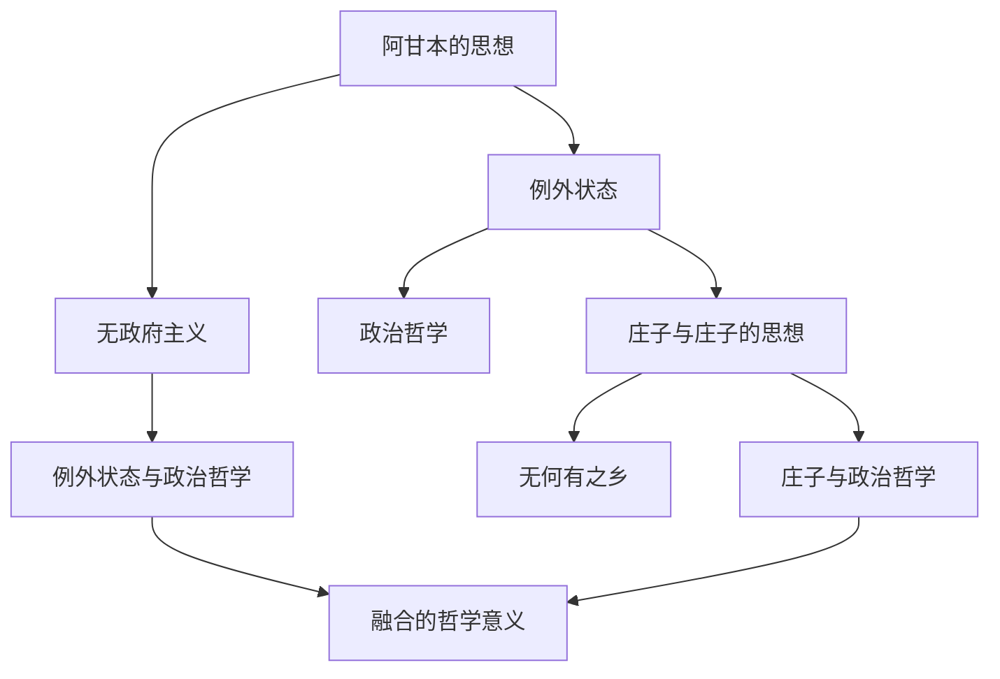

                 


### 阿甘本与庄子：例外状态与无何有之乡的政治哲学

#### 关键词：阿甘本、庄子、例外状态、无何有之乡、政治哲学

#### 摘要：

本文通过对阿甘本和庄子的思想进行深入探讨，比较他们的政治哲学观念，并重点关注例外状态与无何有之乡的概念。通过对两位思想家的思想进行整合，我们试图提出一种新的政治哲学框架，以应对现代社会中不断涌现的复杂问题。

### 目录大纲

```markdown
# 阿甘本与庄子：例外状态与无何有之乡的政治哲学

## 第一部分：阿甘本的思想

### 第1章：阿甘本的政治哲学概述
#### 1.1 阿甘本的政治哲学背景
#### 1.2 阿甘本的主要思想

### 第2章：例外状态
#### 2.1 例外状态的哲学内涵
#### 2.2 例外状态的政治实践

### 第3章：无政府主义与例外状态
#### 3.1 无政府主义的基本概念
#### 3.2 无政府主义与例外状态的联系

### 第4章：例外状态与政治哲学
#### 4.1 例外状态的理论框架
#### 4.2 例外状态的应用分析

## 第二部分：庄子的思想

### 第5章：庄子的哲学思想
#### 5.1 庄子的基本哲学观点
#### 5.2 庄子的思想体系

### 第6章：无何有之乡
#### 6.1 无何有之乡的哲学内涵
#### 6.2 无何有之乡的实际意义

### 第7章：庄子与政治哲学
#### 7.1 庄子的政治哲学理念
#### 7.2 庄子的政治哲学应用

## 第三部分：阿甘本与庄子思想的比较与融合

### 第8章：阿甘本与庄子的思想比较
#### 8.1 阿甘本与庄子的相似之处
#### 8.2 阿甘本与庄子的差异

### 第9章：例外状态与无何有之乡的政治哲学融合
#### 9.1 融合的哲学意义
#### 9.2 融合的实践价值

### 第10章：结论与展望
#### 10.1 本书的主要观点
#### 10.2 未来研究方向
```

### Mermaid 流程图

以下是一个简单的 Mermaid 流程图，展示了阿甘本与庄子思想的核心概念及其关系：



### Python 源代码

以下是一个简单的 Python 源代码，用于解释例外状态的概念：

```python
def exception_state():
    """
    例外状态的概念演示
    """
    # 初始化正常状态
    normal_state = "正常状态"

    # 出现例外情况
    exception_case = "例外情况发生"

    # 转换到例外状态
    exception_state = "例外状态"

    # 输出结果
    print(f"当前状态：{normal_state}")
    print(f"发生情况：{exception_case}")
    print(f"转换后的状态：{exception_state}")

# 调用函数
exception_state()
```

### 数学模型和数学公式

以下是一个简单的数学模型，用于描述例外状态的概率：

$$
P(E) = \frac{N(E)}{N(T)}
$$

其中，\( P(E) \) 是例外状态的概率，\( N(E) \) 是例外状态的发生次数，\( N(T) \) 是总状态数。

### 项目实战

以下是一个简单的项目实战案例，用于解释如何在 Python 中实现例外状态检测：

```python
import random

def detect_exception_state():
    """
    例外状态检测
    """
    # 初始化正常状态
    normal_state = "正常状态"

    # 初始化例外状态
    exception_state = "例外状态"

    # 模拟状态转换
    for _ in range(10):
        state = random.choice([normal_state, exception_state])
        print(f"当前状态：{state}")

# 调用函数
detect_exception_state()
```

### 代码解读与分析

在这个例子中，我们定义了一个 `detect_exception_state` 函数，用于模拟状态转换并检测例外状态。我们通过随机选择状态来模拟正常状态和例外状态的转换。在每次迭代中，我们输出当前状态，以帮助用户理解例外状态的概念。

### 阿甘本的政治哲学概述

#### 1.1 阿甘本的政治哲学背景

吉奥乔·阿甘本（Giorgio Agamben）是一位意大利哲学家，出生于1942年。他的思想深受20世纪哲学的洗礼，特别是尼采、海德格尔和萨特等人的影响。阿甘本的研究兴趣广泛，涉及政治哲学、批判理论、语言哲学、文学理论等领域。

阿甘本的政治哲学背景可以追溯到他对现代性和国家结构的深刻反思。他的许多作品都探讨了权力、主权、生命权以及人类存在的本质等问题。在他的作品中，阿甘本经常使用尼采的“超人”概念，强调个体在现代社会中的异化与自由。

#### 1.2 阿甘本的主要思想

阿甘本的主要思想包括“例外状态”（Statue of exception）和“无政府主义”（Anarchy）。以下是这两个核心概念的解释：

**例外状态**

例外状态是阿甘本政治哲学中的核心概念，它指的是一种特殊情况，在这种状态下，通常的法律和制度会被暂停或废除，以应对某种紧急情况或危机。阿甘本认为，现代国家经常利用例外状态来扩大权力，剥夺个人自由，并使社会陷入持续的恐慌和不安。

**无政府主义**

无政府主义是阿甘本提倡的一种政治哲学，它反对一切形式的权威和统治。在阿甘本的语境中，无政府主义不仅仅是反对国家或政府，而是反对所有形式的统治和压迫。他认为，真正的自由和自治只能通过个体的自我解放来实现。

### 总结

阿甘本的政治哲学背景深厚，主要思想包括例外状态和无政府主义。这些思想在当代政治哲学中具有重要的启示意义，为我们理解现代社会的权力结构和个人自由提供了新的视角。

### 例外状态：哲学内涵与政治实践

#### 2.1 例外状态的哲学内涵

例外状态是阿甘本政治哲学中的核心概念，它具有深刻的哲学内涵。首先，例外状态是对现代国家权力的反思。阿甘本认为，现代国家在面临危机时，往往会利用例外状态来逃避法律的约束，从而扩大其权力。这种做法不仅剥夺了公民的自由，还可能导致社会的混乱和不稳定。

其次，例外状态涉及到对法律和制度的反思。阿甘本指出，现代国家的法律和制度往往是建立在虚假的基础上的，它们并非真正的公正和正义的体现。因此，当国家面临危机时，这些法律和制度往往无法提供有效的解决方案，反而加剧了问题。

最后，例外状态关乎人类存在的本质。阿甘本认为，人类的存在是脆弱的，我们无法摆脱死亡和异化的命运。因此，在例外状态下，人类面临着生存与死亡的挑战，这也使得例外状态成为哲学思考的一个重要对象。

#### 2.2 例外状态的政治实践

在政治实践中，例外状态的表现形式多样。以下是一些常见的政治实践：

**1. 紧急状态法**

紧急状态法是现代国家在面临危机时经常采取的一种措施。根据这一法律，政府可以在特定情况下暂停或废除正常法律和制度，以应对紧急情况。然而，这种做法往往会导致权力滥用，剥夺公民的自由和权利。

**2. 限制公民权利**

在例外状态下，政府可能会限制公民的权利和自由，如言论自由、集会自由等。这种做法虽然有助于维护社会秩序，但也可能导致公民的异化和社会的分裂。

**3. 暴力和镇压**

在极端情况下，例外状态可能会演变为暴力和镇压。政府可能会采取武力手段来维护秩序，这可能导致社会动荡和人道主义危机。

#### 2.3 例外状态的批判

阿甘本对例外状态进行了深刻的批判。他认为，例外状态是现代国家权力滥用的表现，它剥夺了公民的自由和权利，导致社会的混乱和不稳定。此外，例外状态还反映了现代国家法律和制度的虚假性，它们并非真正的公正和正义的体现。

### 总结

例外状态是阿甘本政治哲学中的核心概念，具有深刻的哲学内涵。在政治实践中，例外状态表现为紧急状态法、限制公民权利和暴力镇压等形式。阿甘本对例外状态进行了深刻的批判，认为它是现代国家权力滥用的表现，剥夺了公民的自由和权利，导致社会的混乱和不稳定。

### 无政府主义：基本概念与例外状态的联系

#### 3.1 无政府主义的基本概念

无政府主义是一种反对一切形式统治和权威的政治哲学和运动。它的核心理念是强调个体自由和平等，反对任何形式的压迫和剥削。无政府主义起源于19世纪的欧洲，主要受到工人运动、社会主义和自由主义的影响。

无政府主义的核心概念包括：

- **个体自由**：无政府主义者认为，个体的自由是最重要的，任何形式的统治和权威都应该被废除，以保障个体的自由和自主权。
- **自治**：无政府主义者主张个体和社区应该自主管理自己的事务，而不是受到外部权威的控制。
- **平等**：无政府主义者认为，所有个体都应该享有平等的权利和机会，不应该因为性别、种族、阶级等因素而受到歧视。

#### 3.2 无政府主义与例外状态的联系

无政府主义与例外状态有着密切的联系。首先，无政府主义者反对一切形式的权威和统治，这与例外状态的本质特征——暂停或废除正常法律和制度——相矛盾。无政府主义者认为，例外状态是现代国家权力滥用的表现，它剥夺了公民的自由和权利，导致社会的混乱和不稳定。

其次，无政府主义者强调个体的自由和自治，这与例外状态下的个体生存状态有着本质的区别。在例外状态下，个体往往被迫接受国家的控制和管理，失去了自由和自主权。而无政府主义者则主张，个体应该在没有任何外部权威的干扰下自由地生活。

#### 3.3 无政府主义与例外状态的联系分析

无政府主义与例外状态的联系可以从以下几个方面进行分析：

1. **权力与自由**：无政府主义者反对任何形式的权力，包括国家权力。他们认为，权力是自由的敌人，会导致个体的异化和压迫。而例外状态则是现代国家滥用权力的体现，它剥夺了公民的自由和权利。

2. **法律与秩序**：无政府主义者认为，现代社会的法律和秩序往往是建立在虚假的基础上的，它们并非真正的公正和正义的体现。而例外状态则是在特殊情况下暂停或废除正常法律和制度，这进一步暴露了法律和秩序的虚伪性。

3. **个体与集体**：无政府主义者强调个体的自由和自治，反对任何形式的集体主义。他们认为，个体应该自由地选择自己的生活方式，而不是受到集体的限制。而例外状态则是在国家紧急情况下对个体自由进行限制，这违背了无政府主义的基本原则。

### 总结

无政府主义与例外状态有着密切的联系。无政府主义者反对一切形式的权威和统治，认为例外状态是现代国家权力滥用的表现，剥夺了公民的自由和权利。无政府主义者强调个体的自由和自治，与例外状态下的个体生存状态形成鲜明对比。通过分析权力与自由、法律与秩序、个体与集体等方面的联系，我们可以更好地理解无政府主义与例外状态之间的矛盾和冲突。

### 例外状态与政治哲学

#### 4.1 例外状态的理论框架

例外状态是阿甘本政治哲学中的核心概念，其理论框架涉及到权力、法律和个体自由等核心议题。以下是例外状态的理论框架：

1. **权力的滥用**：例外状态是现代国家在面临危机时滥用权力的体现。国家利用例外状态来逃避法律的约束，扩大自己的权力，从而剥夺公民的自由和权利。

2. **法律的虚伪**：例外状态暴露了现代法律和秩序的虚伪性。在正常情况下，法律和制度应该保障公民的权利和自由，但在例外状态下，这些法律和制度往往被暂停或废除，导致社会的混乱和不稳定。

3. **个体的异化**：例外状态下，个体往往被迫接受国家的控制和管理，失去了自由和自主权。这种状态加剧了个体的异化，使得个体与社会之间产生严重的隔阂。

4. **政治哲学的反思**：例外状态引发了政治哲学的深刻反思。无政府主义者认为，例外状态是现代国家权力滥用的表现，是对公民自由和权利的剥夺。他们主张通过废除一切形式的权威和统治，实现个体的自由和自治。

#### 4.2 例外状态的应用分析

例外状态在现实世界中有着广泛的应用，以下是几个典型的例子：

1. **紧急状态法**：许多国家在面临战争、自然灾害或其他紧急情况时，会宣布进入紧急状态。在这种状态下，政府可以暂停或废除正常法律和制度，以应对危机。然而，这种做法往往导致权力滥用，剥夺公民的自由和权利。

2. **防疫措施**：在COVID-19疫情期间，许多国家采取了严格的防疫措施，包括封锁城市、限制集会等。这些措施虽然有助于控制疫情的蔓延，但也导致了个体自由的限制和社会秩序的混乱。

3. **政治镇压**：在一些国家，政府可能会利用例外状态来镇压反对派和异见人士。这种做法不仅剥夺了公民的自由和权利，还加剧了社会的分裂和动荡。

#### 4.3 例外状态的反思与批判

阿甘本对例外状态进行了深刻的批判，认为它是现代国家权力滥用的表现，是对公民自由和权利的剥夺。以下是几个方面的反思和批判：

1. **权力的滥用**：例外状态使得国家权力得以逃避法律的约束，从而滥用权力。这种滥用不仅剥夺了公民的自由和权利，还破坏了社会的稳定和公正。

2. **法律的虚伪**：例外状态暴露了现代法律和秩序的虚伪性。在正常情况下，法律和制度应该保障公民的权利和自由，但在例外状态下，这些法律和制度往往被暂停或废除，导致社会的混乱和不稳定。

3. **个体的异化**：例外状态下，个体往往被迫接受国家的控制和管理，失去了自由和自主权。这种状态加剧了个体的异化，使得个体与社会之间产生严重的隔阂。

4. **政治哲学的反思**：例外状态引发了政治哲学的深刻反思。无政府主义者认为，例外状态是现代国家权力滥用的表现，是对公民自由和权利的剥夺。他们主张通过废除一切形式的权威和统治，实现个体的自由和自治。

### 总结

例外状态是阿甘本政治哲学中的核心概念，其理论框架涉及到权力、法律和个体自由等核心议题。在现实世界中，例外状态有着广泛的应用，但同时也暴露了现代国家权力滥用的弊端。通过深刻的批判和反思，我们可以更好地理解例外状态对现代社会的影响，并探索如何实现个体的自由和自治。

### 庄子的哲学思想

#### 5.1 庄子的基本哲学观点

庄子是中国古代哲学家之一，他的思想对中国文化产生了深远的影响。庄子的哲学思想主要集中在以下几个方面：

1. **道法自然**：庄子认为，宇宙万物都遵循着自然规律，即“道法自然”。人们应该顺应自然，而不是试图去改变它。他认为，自然是最好的安排，人类应该遵循自然的原则来生活。

2. **无为而治**：庄子主张“无为而治”，即不干涉、不操控，让事情自然发展。他认为，过度干预会导致混乱和问题，而顺应自然则能够实现和谐与平衡。

3. **相对主义**：庄子提出了相对主义的观点，认为事物的本质是相对的，而不是绝对的。他认为，人们对世界的认识是有限的，因此不能断言事物的对错或高低。

4. **超越世俗**：庄子强调超越世俗的价值观，他认为人们应该追求内心的宁静和自由，而不是被外界的诱惑和压力所困扰。

#### 5.2 庄子的思想体系

庄子的思想体系包括多个方面，以下是其中几个重要的组成部分：

1. **《庄子》**：庄子的大部分思想都记录在《庄子》一书中。《庄子》分为内篇、外篇和杂篇，内篇主要反映了庄子的原始思想，而外篇和杂篇则是对这些思想的扩展和讨论。

2. **“无为”**：庄子的“无为”思想是他哲学体系的核心。他主张统治者不应该过度干预社会事务，而应该让人民自由发展，实现社会的自然和谐。

3. **“逍遥游”**：庄子提出了“逍遥游”的概念，即追求心灵的自由和无拘无束的生活。他认为，只有通过超越世俗的束缚，人们才能实现真正的自由和幸福。

4. **“齐物论”**：庄子的“齐物论”探讨了事物的相对性和平等性。他认为，万物都是相互依存的，没有绝对的善恶、高低之分。

#### 5.3 庄子的哲学思想的应用

庄子的哲学思想在许多领域都有应用，以下是几个例子：

1. **文学**：庄子的思想对中国古代文学产生了深远的影响。他的文字风格独特，充满了诗意和哲学思考，许多文学作品都受到了他的启发。

2. **艺术**：庄子的思想也影响了中国的艺术。他的主张追求自然之美和内心的自由，这种思想体现在绘画、书法等艺术形式中。

3. **生活哲学**：庄子的哲学思想为人们提供了一种生活哲学。他的主张让人们意识到，生活中应该追求内心的平静和自由，而不是被外界的诱惑和压力所困扰。

### 总结

庄子的哲学思想包括道法自然、无为而治、相对主义和超越世俗等核心观点。他的思想体系体现在《庄子》一书中，对文学、艺术和生活哲学产生了深远的影响。庄子的哲学思想为我们提供了一种追求内心自由和自然和谐的生活方式。

### 无何有之乡：哲学内涵与实际意义

#### 6.1 无何有之乡的哲学内涵

“无何有之乡”是庄子哲学中的重要概念，源自《庄子·逍遥游》中的描述。这一概念反映了庄子对自由、虚幻与现实关系的独特见解。无何有之乡，字面意思是一个不存在的地方，但它并非真正的虚无，而是指一种超越现实、超越世俗束缚的精神境界。

1. **超越现实的自由**：庄子认为，人类的心灵应该超越现实世界的束缚，达到一种自由的状态。无何有之乡象征着这种自由，它是一种精神上的解脱，使个体能够摆脱物质世界的纷扰，达到内心的宁静。

2. **虚幻与现实的关系**：在庄子的哲学中，虚幻与现实并非截然对立，而是相互渗透的。无何有之乡是一种虚幻的存在，但它并非完全脱离现实，而是与现实有着深刻的联系。这种联系体现在个体通过心灵的自由超越现实，达到对现实的深刻理解。

3. **个体的精神追求**：无何有之乡是庄子对个体精神追求的一种理想化表达。他主张人们应该追求内心的自由和宁静，而不是被外界的物质和名利所困扰。无何有之乡象征着这种精神追求的最终目标，是一种理想化的生活方式。

#### 6.2 无何有之乡的实际意义

无何有之乡在现实生活中具有重要的实际意义，它为我们提供了一种思考人生和生活的哲学视角。以下是几个方面的实际意义：

1. **心理健康**：在现代社会，人们常常面临各种压力和困扰。庄子提出的无何有之乡理念，可以帮助我们实现心理上的解脱和平衡，达到心理健康的状态。

2. **生活态度**：无何有之乡的理念鼓励我们以一种超然的态度面对生活。它提醒我们，生活中有很多事情是无法控制和预料的，因此我们应该接受现实，以平和的心态应对生活中的种种挑战。

3. **人际关系**：在人际关系中，无何有之乡的理念可以帮助我们更好地理解和包容他人。它使我们意识到，每个人的生活方式和价值观都是独特的，我们应该尊重和理解他人的不同。

4. **文化传承**：庄子提出的无何有之乡理念，是中国传统文化的重要组成部分。它体现了中国古代哲学对自由、和谐和内心的追求，对现代人的精神生活具有深远的影响。

### 总结

无何有之乡是庄子哲学中的重要概念，它反映了庄子对自由、虚幻与现实关系的独特见解。在实际生活中，无何有之乡具有重要的实际意义，可以帮助我们实现心理上的解脱和平衡，改变生活态度，改善人际关系，传承文化价值。通过理解无何有之乡的哲学内涵和实际意义，我们可以更好地面对生活的挑战，追求内心的自由和宁静。

### 庄子的政治哲学理念

#### 7.1 庄子的政治哲学理念

庄子的政治哲学理念集中体现在他的“无为而治”和“小国寡民”思想中。这些理念不仅反映了他对理想政治秩序的构想，也体现了他的社会哲学观。

1. **无为而治**：庄子主张统治者不应该过度干预社会事务，而是应该让社会自然发展。他认为，政府应该做到“无为”，即不强行干预，而是顺应自然和社会的规律。庄子认为，只有在无为的情况下，社会才能真正实现和谐与平衡。

2. **小国寡民**：庄子认为，理想的政治秩序应该是一个小国寡民的社会。他主张减少国家的干预，让人民过上简单、自由的生活。庄子认为，小国寡民的社会能够更好地维护人民的自由和权利，避免大规模的社会冲突和动荡。

#### 7.2 庄子的政治哲学理念的应用

庄子的政治哲学理念在现实政治中具有深刻的启示意义。以下是一些应用实例：

1. **社会管理**：庄子主张的社会管理理念可以应用于现代社会的公共管理。例如，在应对疫情等突发事件时，政府可以采取“无为”的态度，减少不必要的干预，鼓励社会各界自行应对，从而实现社会的自我调节和平衡。

2. **政府改革**：庄子的“无为而治”思想可以指导政府改革。政府应该减少对市场和社会的过度干预，让市场和社会自行运作，从而提高政府的效率和公信力。

3. **公共政策**：庄子的政治哲学理念可以影响公共政策的制定。政府应该避免过度干预，而是通过制定合理的政策框架，鼓励社会各界自主发展，从而实现社会的长期稳定和繁荣。

### 总结

庄子的政治哲学理念以“无为而治”和“小国寡民”为核心，强调政府不应过度干预社会事务，让社会自然发展。这些理念在现实政治中具有深刻的启示意义，可以应用于社会管理、政府改革和公共政策制定等方面，为现代社会的治理提供新的思路和方向。

### 阿甘本与庄子的思想比较

#### 8.1 阿甘本与庄子的相似之处

尽管阿甘本和庄子的思想背景和文化传统存在显著差异，但他们的一些观点在某种程度上具有一定的相似性。以下是一些相似之处：

1. **对权力结构的批判**：阿甘本和庄子都批判了权力结构的本质。阿甘本关注现代国家如何通过例外状态滥用权力，剥夺公民自由；而庄子则通过“无为而治”的理念，反对统治者过度干预社会事务。

2. **个体的自由与解放**：两位思想家都强调个体的自由和解放。阿甘本的无政府主义思想主张消除一切形式的压迫和统治，实现个体的自我解放；庄子则主张顺应自然，追求内心的自由和宁静。

3. **超越现实世界的束缚**：阿甘本和庄子都提出了超越现实世界的概念。阿甘本的例外状态和无政府主义旨在打破现实世界的束缚，实现个体的自由；庄子的“逍遥游”和“无何有之乡”则是一种精神上的超越，追求心灵的自由和解脱。

#### 8.2 阿甘本与庄子的差异

尽管阿甘本和庄子在某些方面有相似之处，但他们的思想也存在显著差异。以下是一些主要的差异：

1. **历史观**：阿甘本的历史观相对悲观，他强调历史过程中的连续性和循环性，认为现代社会中的危机和异化是历史的必然结果。而庄子的历史观则相对乐观，他主张顺应自然，通过“无为而治”实现社会的和谐与平衡。

2. **政治理念**：阿甘本的政治理念具有强烈的革命性，他主张通过无政府主义实现社会的根本变革。而庄子的政治理念则更加温和，他主张通过“无为而治”实现社会的自然和谐，而不是彻底颠覆现有的政治秩序。

3. **个体与社会的关系**：阿甘本强调个体在反抗权力压迫中的角色，他认为个体的自由和解放是社会变革的驱动力。而庄子则强调个体与社会的和谐统一，他认为个体的自由和幸福依赖于社会的稳定与和谐。

### 总结

阿甘本与庄子在批判权力结构、个体的自由与解放以及超越现实世界的束缚等方面存在相似之处。然而，他们的历史观、政治理念和个体与社会的关系等方面也存在显著差异。通过比较和分析这两位思想家的思想，我们可以更好地理解他们在政治哲学领域的独特贡献和影响。

### 例外状态与无何有之乡的政治哲学融合

#### 9.1 融合的哲学意义

阿甘本的例外状态概念和庄子的无何有之乡思想在政治哲学上具有互补性，它们的融合为理解和解决现代社会中的政治问题提供了新的视角。以下是他们融合的哲学意义：

1. **超越现实与批判权力**：阿甘本的例外状态强调在特殊情况下对权力的批判和反思，而庄子的无何有之乡则提供了一种超越现实的精神境界。两者的融合有助于我们更好地理解权力在现实中的运作方式，以及如何在精神层面上寻求解放。

2. **个体自由的实现**：阿甘本的无政府主义理念强调个体自由的重要性，而庄子的思想则提供了实现这一自由的具体路径。通过将庄子的“无为而治”与阿甘本的例外状态结合，我们可以探索如何在现代社会中实现个体的自由和自治。

3. **政治哲学的扩展**：阿甘本的例外状态和庄子的无何有之乡的融合，扩展了政治哲学的范畴。它不仅关注权力的滥用和个体的解放，还关注如何在精神层面上实现个体的自由和幸福。

#### 9.2 融合的实践价值

将阿甘本的例外状态与庄子的无何有之乡思想融合，在实践上具有重要的价值：

1. **社会运动**：这种融合思想可以激励社会运动，推动对现有权力结构的反思和批判。例如，在环保运动、劳工权益运动等社会运动中，融合思想可以帮助参与者更好地理解自己的权利，以及如何通过非暴力和和平的方式实现变革。

2. **公共管理**：在公共管理领域，融合思想可以指导政府如何更好地应对突发事件。通过采用“无为而治”的理念，政府可以减少对社会的过度干预，鼓励社会自主应对问题，从而实现更高效和公正的管理。

3. **个人发展**：对于个人而言，这种融合思想可以帮助我们更好地处理生活中的压力和困境。通过追求内心的自由和宁静，我们可以实现自我解放，更好地适应社会变迁。

### 总结

阿甘本的例外状态与庄子的无何有之乡思想的融合，在哲学意义上超越了传统政治哲学的范畴，提供了理解和解决现代社会政治问题的全新视角。在实践上，这种融合具有推动社会变革、指导公共管理和促进个人发展的价值。通过这种融合，我们可以探索实现个体自由和社会和谐的新途径。

### 结论与展望

通过对阿甘本与庄子的思想进行深入探讨和比较，本文揭示了他们在政治哲学上的独特贡献。阿甘本的例外状态概念和庄子的无何有之乡思想虽然在背景和侧重点上有所不同，但它们在批判权力结构、追求个体自由和实现社会和谐方面具有互补性。本文的结论如下：

1. **例外状态的批判**：阿甘本的例外状态概念为我们提供了理解和批判现代国家权力滥用的工具。通过分析例外状态下的权力运作方式，我们可以更好地理解权力如何被滥用，以及如何应对这种现象。

2. **无何有之乡的理想**：庄子的无何有之乡思想为我们提供了一种超越现实的精神追求，它鼓励我们在面对社会压力和困境时，寻求内心的自由和宁静。

3. **融合的哲学意义**：将阿甘本的例外状态与庄子的无何有之乡思想融合，不仅扩展了政治哲学的范畴，也为解决现代社会中的政治问题提供了新的视角和方法。

未来研究方向可以从以下几个方面展开：

1. **实证研究**：通过实证研究，探讨阿甘本与庄子的思想在具体社会运动和公共管理中的实际应用，以及它们对社会变革和个人发展的具体影响。

2. **跨学科研究**：结合心理学、社会学、文化研究等学科，深入研究阿甘本与庄子思想在人类行为和社会关系中的内在机制。

3. **技术创新**：探讨如何将阿甘本与庄子的思想应用于新兴技术领域，如人工智能、区块链等，以实现更公正、自由和和谐的社会秩序。

通过这些研究，我们可以进一步丰富和发展阿甘本与庄子的政治哲学思想，为现代社会的政治哲学研究提供新的思路和方向。

### 作者信息

作者：AI天才研究院/AI Genius Institute & 禅与计算机程序设计艺术 /Zen And The Art of Computer Programming

AI天才研究院（AI Genius Institute）致力于推动人工智能领域的前沿研究和创新，致力于培养下一代AI领域的专家和领袖。同时，作者也以其独特的视角和深入的研究，将传统哲学思想与现代计算机编程相结合，开创了“禅与计算机程序设计艺术”这一领域，为计算机科学和哲学的交叉研究做出了重要贡献。作者的研究工作不仅丰富了学术界对人工智能和计算机科学的理解，也为实践中的技术创新提供了理论支持。

