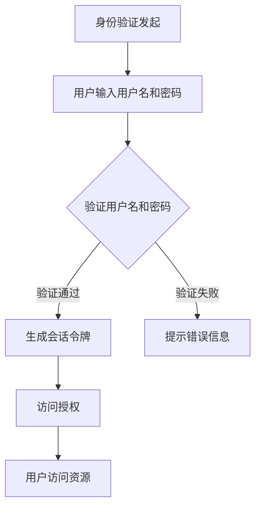
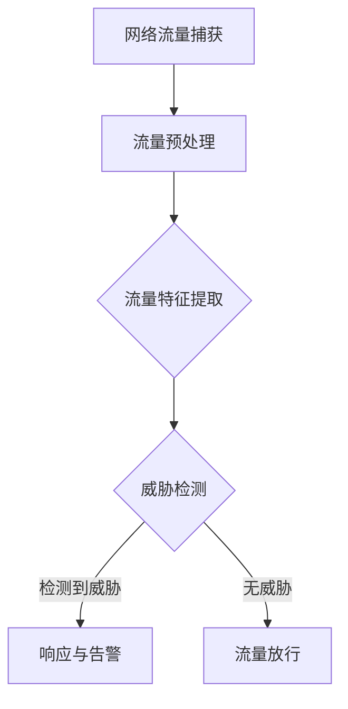
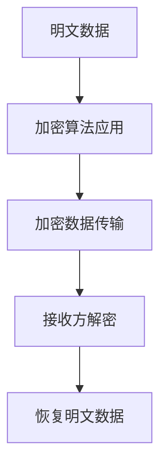

                 

### 第1章：网络安全挑战与零信任架构的崛起

在现代数字化时代，网络安全问题成为了企业和个人无法回避的挑战。随着云计算、大数据、物联网和移动办公等技术的发展，网络边界变得越来越模糊，传统的网络安全模型逐渐暴露出其局限性。在这种背景下，零信任架构（Zero Trust Architecture, ZTA）应运而生，成为重新定义网络安全模型的重要尝试。

#### 1.1 网络安全现状与挑战

**网络攻击现状**：网络攻击形式多样，包括但不限于DDoS攻击、恶意软件、钓鱼攻击、内部威胁等。这些攻击不仅影响了企业的业务连续性，还可能导致敏感数据的泄露，对企业造成巨大的财务损失和声誉损害。

**传统安全模型不足**：传统的网络安全模型主要依赖于边界防御，如防火墙和入侵检测系统（IDS），以及静态的访问控制策略。然而，这种基于“边界防御”的安全模型在面对日益复杂的攻击手段时显得力不从心。例如，攻击者可以通过社会工程学手段骗取员工权限，或者利用零日漏洞绕过边界防御。

#### 1.2 零信任架构的定义与核心原则

**零信任模型简介**：零信任架构是一种基于“永不信任，始终验证”的安全理念，其核心原则是在任何内外部网络之间都不信任任何通信，无论它们位于企业内部还是外部。这种模型要求对每个用户、设备和服务进行严格的身份验证和访问控制，确保只有经过验证的用户和设备才能访问资源和数据。

**核心原则**：零信任架构的核心原则包括：
- **永不信任，始终验证**：对所有网络流量进行持续验证和监控。
- **最小权限**：用户和设备只拥有完成其任务所需的最小权限。
- **多因素身份验证**：使用多种身份验证方法，如密码、生物识别、令牌等。
- **持续监控与响应**：对网络行为进行实时监控，并在发现异常时迅速响应。

#### 1.3 零信任架构与传统安全模型的对比

**对比分析**：传统安全模型侧重于在网络边界上建立防御，而零信任架构则更关注内部网络的安全性。以下是对两种模型的对比：

| 对比项 | 传统安全模型 | 零信任架构 |
| --- | --- | --- |
| **安全焦点** | 边界防御 | 内部监控 |
| **访问控制** | 基于位置 | 基于身份和设备 |
| **数据保护** | 静态保护 | 动态保护 |
| **响应时间** | 反应式 | 预防式 |
| **用户体验** | 可能限制访问 | 更灵活的访问控制 |

通过上述分析，我们可以看到零信任架构在应对现代网络安全挑战方面具有显著优势。在接下来的章节中，我们将进一步探讨零信任架构的技术基础、核心算法与模型原理，以及其实战应用，以帮助读者全面了解这一创新的安全模型。

### 第2章：零信任架构的技术基础

零信任架构的构建依赖于一系列先进的技术和方法，这些技术共同作用，确保了架构的安全性和可靠性。在这一章中，我们将深入探讨零信任架构所涉及的关键技术，包括实身份验证与访问控制、终端与服务安全评估、微隔离与流量监控。

#### 2.1 实身份验证与访问控制

**身份验证技术**：身份验证是零信任架构的核心组成部分，确保只有合法用户才能访问系统和资源。常见的身份验证技术包括：

- **多因素身份验证（MFA）**：MFA结合了多种验证手段，如密码、短信验证码、生物识别等，提高了认证的安全性。
- **单点登录（SSO）**：SSO允许用户使用一个账户登录多个系统，提高了用户体验，同时简化了管理。

**访问控制**：访问控制确保用户只能访问他们有权访问的资源和数据。零信任架构采用以下几种访问控制方法：

- **基于角色的访问控制（RBAC）**：RBAC根据用户的角色分配权限，确保用户只能执行其角色允许的操作。
- **基于属性的访问控制（ABAC）**：ABAC基于用户的属性（如位置、时间等）来决定是否允许访问。

**案例解析**：在一个大型企业中，员工需要通过MFA登录企业系统，然后根据其角色分配的权限访问不同的应用程序和文件。例如，一个普通员工可能只能访问公司内部通讯系统和共享文件，而财务部门员工则需要访问更敏感的财务数据和系统。

#### 2.2 终端与服务安全评估

**终端安全评估**：零信任架构要求对所有终端进行严格的安全评估，确保终端没有恶意软件或漏洞。常见的评估方法包括：

- **终端检测与响应（EDR）**：EDR实时监控终端的活动，并在发现异常时迅速采取措施。
- **补丁管理**：定期更新终端的操作系统和应用程序，以修补安全漏洞。

**服务安全评估**：服务安全评估确保服务提供的是安全、可靠的服务。评估方法包括：

- **服务安全测试**：对服务进行渗透测试和漏洞扫描，以发现潜在的安全问题。
- **服务安全配置**：确保服务的配置符合安全最佳实践。

**案例解析**：在一个金融机构中，所有员工终端都必须通过EDR进行安全评估，才能访问内部系统。同时，金融机构的服务器也会定期进行安全测试和漏洞扫描，以确保其提供的服务是安全的。

#### 2.3 微隔离与流量监控

**微隔离**：微隔离是一种网络安全策略，通过将网络划分为多个隔离区域，限制不同区域之间的流量交换，从而提高整体安全性。微隔离的关键技术包括：

- **网络分区**：将网络划分为多个子网，每个子网实现不同的安全策略。
- **服务间隔离**：通过虚拟化技术实现服务间的隔离，确保一个服务的问题不会影响其他服务。

**流量监控**：流量监控用于实时监测网络流量，及时发现异常流量和潜在攻击。流量监控的关键技术包括：

- **流量分析**：分析网络流量模式，发现异常行为。
- **入侵检测系统（IDS）**：IDS用于检测和响应潜在的网络攻击。

**案例解析**：在一个电商企业中，所有员工终端和服务器都被划分到不同的网络区域，每个区域都有严格的安全策略。此外，企业的网络安全团队会定期进行流量分析，以检测异常流量和潜在攻击。

通过上述技术，零信任架构能够有效地提高网络的安全性，确保只有经过验证的用户和设备才能访问资源和数据。在下一章中，我们将探讨零信任架构在组织中的应用，了解其实施策略及其与云原生和数字化转型的关系。

### 第3章：零信任架构在组织中的应用

零信任架构不仅是一种新的安全理念，更是一种可以在实际组织中实施的安全策略。在本章中，我们将深入探讨零信任架构在组织中的应用，包括实施策略、与云原生技术的融合，以及如何助力数字化转型。

#### 3.1 零信任架构实施策略

**组织适配**：零信任架构的实施需要根据组织的实际情况进行调整。以下是一些实施策略：

- **逐步实施**：逐步将零信任架构引入组织，避免一次性大规模实施带来的风险。
- **评估现有系统**：评估现有系统是否兼容零信任架构，对于不兼容的部分进行升级或替换。
- **培训员工**：为员工提供培训，确保他们理解零信任架构的概念和操作流程。

**实施步骤**：

1. **规划与设计**：确定零信任架构的实施目标和范围，设计相应的安全策略和架构。
2. **部署技术**：部署零信任架构所需的技术，如多因素身份验证、终端安全评估、流量监控等。
3. **测试与优化**：对实施效果进行测试，根据测试结果优化架构。

**案例解析**：一个大型跨国企业决定引入零信任架构。首先，他们对现有系统进行了评估，确定了哪些系统需要升级或替换。接着，他们为员工提供了培训，确保他们熟悉新架构的操作。最后，他们进行了大规模测试，并根据测试结果进行了多次优化。

#### 3.2 零信任架构与云原生

**云原生简介**：云原生技术是一种基于云计算的软件开发方法，其核心在于利用容器、微服务、自动化等特性，实现高效、可扩展的软件开发和部署。

**零信任与云原生的融合**：零信任架构与云原生技术具有高度的互补性，可以实现以下融合：

- **容器安全**：零信任架构可以通过对容器进行严格的安全评估，确保容器内部的安全性。
- **服务网格**：服务网格是实现微隔离和安全通信的重要手段，与零信任架构的理念相契合。

**案例解析**：一家金融科技公司采用云原生技术进行软件开发和部署。他们使用零信任架构对容器进行安全评估，确保容器内部没有恶意软件。同时，他们采用服务网格实现服务间的安全通信，提高了整体安全性。

#### 3.3 零信任架构与数字化转型

**数字化转型背景**：随着大数据、人工智能、物联网等技术的快速发展，数字化转型已成为企业竞争的关键。数字化转型要求企业在保持安全的同时，实现快速、灵活的业务创新。

**零信任架构助力数字化转型**：零信任架构可以为企业提供以下支持：

- **灵活访问**：零信任架构通过多因素身份验证和灵活的访问控制，确保员工可以安全地访问企业资源，从而支持远程办公和移动办公。
- **快速响应**：零信任架构的实时监控和快速响应能力，帮助企业及时应对安全事件，降低业务中断风险。

**案例解析**：一家制造企业正在进行数字化转型。他们引入零信任架构，为员工提供了安全、灵活的访问权限，支持远程办公。同时，零信任架构的实时监控和响应能力，帮助他们快速发现并解决潜在的安全威胁。

通过本章的探讨，我们可以看到零信任架构在实际组织中的应用，以及它如何与云原生技术和数字化转型相结合，为企业提供更加安全、高效的支持。

## 第二部分：核心算法与模型原理

在零信任架构中，核心算法与模型原理发挥着至关重要的作用。本部分将详细探讨零信任架构中涉及的关键算法与模型，包括基于机器学习的身份验证、零信任架构中的加密技术以及网络安全分析。通过深入理解这些核心算法与模型，我们可以更好地构建和优化零信任架构，提升网络安全水平。

### 第4章：基于机器学习的身份验证

在零信任架构中，身份验证是确保只有合法用户能够访问系统和资源的关键环节。机器学习技术在这一领域展现了巨大的潜力，通过自适应学习与模式识别，提高了身份验证的安全性和准确性。

#### 4.1 机器学习在身份验证中的应用

**机器学习简介**：机器学习是人工智能的一个重要分支，它通过训练数据集，让计算机自动学习和识别数据中的模式和规律。在身份验证中，机器学习可以用于：

- **用户行为分析**：通过分析用户的登录时间、地点、设备等信息，识别正常行为和异常行为。
- **多因素认证**：结合多种身份验证手段，如密码、生物识别、令牌等，提高认证的安全性。

**应用场景**：在零信任架构中，机器学习技术可以应用于以下场景：

- **异常检测**：通过分析用户行为，实时检测并响应异常登录或访问行为。
- **风险评分**：根据用户的登录信息，自动评估风险等级，决定是否需要进一步的验证。

#### 4.2 常见的机器学习算法与模型

**1. 决策树（Decision Tree）**

- **原理**：决策树通过一系列规则对数据进行分析，每个节点代表一个特征，分支代表不同特征的取值，叶子节点代表预测结果。
- **应用**：决策树在分类任务中具有较好的解释性和准确性。

**2. 支持向量机（SVM）**

- **原理**：SVM通过找到一个最佳的超平面，将不同类别的数据分开。
- **应用**：SVM在二分类任务中表现优异，尤其是在高维空间中。

**3. 随机森林（Random Forest）**

- **原理**：随机森林通过构建多棵决策树，并结合它们的预测结果进行投票，提高模型的鲁棒性和准确性。
- **应用**：随机森林在分类和回归任务中广泛应用，尤其适用于处理大数据集。

**4. 聚类算法（Clustering Algorithms）**

- **原理**：聚类算法通过将数据划分为多个群组，使得同一群组内的数据点尽可能相似，不同群组的数据点尽可能不同。
- **应用**：聚类算法在用户行为分析和风险评分中具有重要作用。

#### 4.3 身份验证中的机器学习实践

**1. 模式识别**：通过训练数据集，机器学习模型可以识别用户的正常行为模式，如登录时间、设备类型等。当检测到异常行为时，系统会触发额外的验证步骤。

**2. 风险评分**：基于用户的登录信息，机器学习模型可以自动评估风险等级。例如，如果一个用户在晚上10点从陌生的地点登录，系统可能会将其评分较高，触发多因素验证。

**3. 上下文感知**：结合用户的行为上下文，如地理位置、网络环境等，机器学习模型可以更准确地判断登录行为的合法性。

### 第5章：零信任架构中的加密技术

加密技术是零信任架构中的另一个核心组成部分，它确保了数据的机密性和完整性，防止未经授权的访问和篡改。

#### 5.1 加密技术的基本概念

**加密（Encryption）**：加密是一种将明文转换为密文的过程，只有拥有正确密钥的人才能解密并恢复原始信息。

**解密（Decryption）**：解密是加密的逆过程，通过使用密钥将密文转换为明文。

**加密算法**：加密算法是将明文转换为密文的数学方法。常见的加密算法包括：

- **对称加密**：对称加密使用相同的密钥进行加密和解密。常见的对称加密算法有DES、AES等。
- **非对称加密**：非对称加密使用一对密钥，公钥用于加密，私钥用于解密。常见的非对称加密算法有RSA、ECC等。

#### 5.2 公钥加密与私钥加密

**公钥加密**：公钥加密是一种非对称加密算法，它使用公钥加密数据，只有对应的私钥才能解密。公钥加密广泛应用于数据传输和数字签名。

**私钥加密**：私钥加密是一种对称加密算法，它使用私钥加密数据，只有对应的私钥才能解密。私钥加密适用于数据存储和密钥交换。

**案例解析**：在一个企业内部，所有数据在传输过程中都使用公钥加密，确保数据在传输过程中的机密性。而在数据存储时，使用私钥加密来确保数据的完整性。

#### 5.3 零信任架构中的加密技术应用

**1. 数据加密传输**：在零信任架构中，所有数据在传输过程中都使用加密技术，防止数据在传输过程中的泄露和篡改。

**2. 数据存储加密**：数据在存储时使用加密技术，确保数据在存储介质上的机密性和完整性。

**3. 密钥管理**：零信任架构中的密钥管理至关重要，需要确保密钥的安全存储和生命周期管理。

**案例解析**：在一个金融机构中，所有客户数据在传输和存储过程中都使用加密技术。同时，金融机构采用严格的密钥管理策略，确保密钥的安全性和合规性。

通过上述章节的探讨，我们可以看到零信任架构中的核心算法与模型原理，包括基于机器学习的身份验证和加密技术的广泛应用。这些技术共同作用，确保了零信任架构的安全性和可靠性。在下一章中，我们将进一步探讨零信任架构中的网络安全分析，了解如何通过数据分析和工具使用来提升网络安全水平。

### 第6章：零信任架构中的网络安全分析

在零信任架构中，网络安全分析是确保系统安全性的关键环节。通过对网络流量进行实时监控和分析，可以及时发现潜在的安全威胁，并采取相应的措施进行防御。本章将深入探讨网络安全分析的方法、工具和技术，并详细介绍零信任架构下的安全威胁分析。

#### 6.1 网络安全数据分析方法

**1. 概述**

网络安全数据分析是通过对网络流量、日志、事件等数据进行收集、处理和分析，以识别潜在的安全威胁和异常行为。网络安全数据分析方法包括：

- **流量分析**：通过对网络流量进行监控和分析，识别异常流量模式和潜在威胁。
- **日志分析**：通过对系统日志进行分析，发现系统异常和潜在安全漏洞。
- **事件响应**：在发现安全事件时，采取紧急措施进行响应和调查。

**2. 方法**

- **基于规则的检测**：使用预定义的规则和模式来识别网络攻击，如SQL注入、跨站脚本（XSS）等。
- **基于行为的检测**：通过分析网络流量的行为特征，识别异常行为和潜在威胁。
- **机器学习检测**：使用机器学习算法对网络流量进行分析，发现新的威胁和模式。

**3. 工具**

- **入侵检测系统（IDS）**：IDS用于监控网络流量和系统日志，检测潜在的网络攻击和异常行为。
- **安全信息与事件管理（SIEM）**：SIEM系统用于收集、存储、分析和报告安全相关数据。
- **终端检测与响应（EDR）**：EDR系统用于实时监控终端活动，识别和响应终端上的安全威胁。

#### 6.2 网络安全分析工具与技术

**1. 入侵检测系统（IDS）**

- **工作原理**：IDS通过对网络流量和系统日志进行分析，发现潜在的安全威胁。
- **主要功能**：包括流量分析、日志分析、异常检测和告警通知。
- **类型**：基于网络的IDS（NIDS）和基于主机的IDS（HIDS）。

**2. 安全信息与事件管理（SIEM）**

- **工作原理**：SIEM系统用于收集、存储、分析和报告来自不同源的安全信息。
- **主要功能**：包括数据收集、关联分析、告警和报告生成。
- **优势**：提供了统一的视图，帮助安全团队快速识别和响应安全事件。

**3. 终端检测与响应（EDR）**

- **工作原理**：EDR系统用于实时监控终端活动，识别和响应终端上的安全威胁。
- **主要功能**：包括终端监控、事件响应、威胁分析和报告生成。

#### 6.3 零信任架构下的安全威胁分析

**1. 概述**

零信任架构强调持续验证和监控，以确保网络和资源的安全性。在零信任架构下，安全威胁分析主要包括以下几个方面：

- **身份验证与访问控制**：通过多因素身份验证和基于角色的访问控制，确保只有合法用户才能访问系统和资源。
- **终端安全评估**：通过终端检测与响应系统，实时监控终端的安全状况，识别和响应终端上的安全威胁。
- **流量监控与分析**：通过流量监控和分析工具，识别异常流量模式和潜在威胁。

**2. 方法**

- **基于行为的威胁分析**：通过分析用户和设备的行为模式，识别异常行为和潜在威胁。
- **基于异常的威胁分析**：通过建立正常的网络行为模型，识别与正常行为不符的异常行为。
- **基于机器学习的威胁分析**：使用机器学习算法，对网络流量和日志进行分析，发现新的威胁和模式。

**3. 实践**

- **持续监控**：实时监控网络流量、终端活动和日志，及时发现潜在的安全威胁。
- **快速响应**：在发现安全威胁时，迅速采取响应措施，隔离威胁源并进行分析。
- **自动化**：利用自动化工具和平台，实现安全威胁的快速检测、分析和响应。

**案例解析**：在一个大型企业的零信任架构中，安全团队使用入侵检测系统（IDS）和终端检测与响应（EDR）系统进行实时监控和分析。当检测到异常流量或终端活动时，系统会自动生成告警，并通知安全团队进行进一步调查。通过这种方式，企业能够及时发现并应对潜在的安全威胁。

通过本章的探讨，我们可以看到网络安全分析在零信任架构中的重要性，以及如何通过工具和技术进行有效的安全威胁分析。在下一章中，我们将探讨零信任架构的部署与实践，了解其实施细节和实战经验。

### 第7章：零信任架构的部署与实践

零信任架构的部署与实践是确保其有效运行的关键步骤。在这一章中，我们将详细探讨零信任架构的部署流程，通过具体案例展示其实践过程，并讨论运维与优化策略。

#### 7.1 零信任架构部署流程

**1. 需求分析**：首先，对组织的业务需求、安全要求和现有系统进行全面的评估，明确零信任架构的目标和范围。

**2. 规划设计**：根据需求分析结果，设计零信任架构的具体方案，包括身份验证、访问控制、终端安全评估、流量监控等关键组件。

**3. 技术选型**：选择合适的零信任技术产品和工具，如多因素身份验证系统、终端检测与响应系统、入侵检测系统等。

**4. 环境搭建**：搭建零信任架构所需的硬件和软件环境，包括服务器、网络设备、数据库等。

**5. 配置与部署**：将选定的技术产品部署到环境中，并进行相应的配置，确保各个组件能够正常工作。

**6. 测试与验证**：对部署的零信任架构进行全面的测试，包括功能测试、性能测试和安全测试，确保架构能够满足业务需求和安全要求。

**7. 培训与上线**：为员工提供零信任架构的操作培训，确保他们能够正确使用新架构。随后，将零信任架构正式上线，替换原有安全模型。

#### 7.2 零信任架构实战案例

**案例背景**：某跨国企业面临日益严峻的网络攻击威胁，决定引入零信任架构以提高网络安全水平。

**实施过程**：

1. **需求分析与规划设计**：企业对现有安全架构进行评估，确定引入零信任架构的必要性。随后，制定了详细的零信任架构设计方案，包括身份验证、访问控制、终端安全评估和流量监控等关键组件。

2. **技术选型**：企业选择了多因素身份验证系统、终端检测与响应系统、入侵检测系统和安全信息与事件管理（SIEM）系统，以确保架构的全面性和高效性。

3. **环境搭建**：企业搭建了新的硬件和软件环境，包括高性能服务器、防火墙和入侵检测设备等，确保零信任架构能够稳定运行。

4. **配置与部署**：将选定的技术产品逐一部署到环境中，并进行详细的配置，确保各个组件之间的协同工作。

5. **测试与验证**：企业对零信任架构进行了全面的测试，包括功能测试、性能测试和安全测试。通过模拟攻击场景，验证架构的响应速度和防护能力。

6. **培训与上线**：企业为员工提供了详细的操作培训，确保他们能够正确使用零信任架构。随后，企业逐步替换了原有安全模型，正式上线零信任架构。

**实施效果**：零信任架构上线后，企业的网络安全水平显著提高。攻击事件的发生频率大幅降低，安全事件的响应时间缩短，员工对安全架构的满意度也显著提升。

#### 7.3 零信任架构的运维与优化

**1. 运维策略**：

- **持续监控**：实时监控网络流量、终端活动和日志，及时发现潜在的安全威胁。
- **定期审计**：定期对零信任架构进行审计，确保其符合安全政策和最佳实践。
- **更新与升级**：及时更新和升级零信任架构的组件和工具，确保其保持最新的防护能力。

**2. 优化策略**：

- **性能优化**：通过性能监控和调优，确保零信任架构的高效运行。
- **资源管理**：合理分配资源，确保零信任架构在不同业务需求下的稳定运行。
- **应急响应**：建立快速响应机制，确保在发生安全事件时能够迅速采取措施。

通过上述部署流程和实战案例，我们可以看到零信任架构在实践中的有效性和可操作性。在下一章中，我们将探讨零信任架构的未来发展趋势，以及其与新兴技术的融合和面临的挑战。

### 第8章：零信任架构的未来发展趋势

随着技术的不断进步，零信任架构正在迎来新的发展趋势。本章节将探讨零信任架构的未来发展方向，以及其与新兴技术的融合，同时分析零信任架构面临的主要挑战和潜在解决方案。

#### 8.1 零信任架构的发展趋势

**1. 云原生的融合**：云原生技术，如容器化、微服务和服务网格，为零信任架构提供了更灵活和可扩展的部署方式。未来，零信任架构将更加深入地与云原生技术结合，提供全面的安全解决方案。

**2. 自动化和人工智能的应用**：自动化和人工智能将在零信任架构中发挥重要作用，通过智能分析和预测，提高安全威胁检测和响应的效率。例如，机器学习算法可以用于用户行为分析、异常检测和自动化决策。

**3. 安全即服务的模式**：零信任架构将逐渐向安全即服务（SaaS）模式发展，企业可以通过云服务提供商获取零信任解决方案，降低部署和维护成本。

**4. 零信任边缘计算**：随着物联网和边缘计算的普及，零信任架构将扩展到边缘设备，确保边缘计算环境的安全。

**5. 跨领域合作**：零信任架构的发展将需要跨领域的合作，包括技术供应商、安全专家、政府机构和行业组织等，共同推动安全标准的制定和实施。

#### 8.2 零信任架构与新兴技术的融合

**1. 容器与Kubernetes**：容器技术，如Docker和Kubernetes，为零信任架构提供了微隔离和动态管理的能力。零信任架构可以通过容器镜像的安全检查和访问控制，确保容器环境的完整性。

**2. 服务网格与Istio**：服务网格技术，如Istio，为微服务提供了安全通信和流量管理的能力。零信任架构可以结合服务网格，实现微服务之间的安全通信和访问控制。

**3. 物联网（IoT）与边缘计算**：随着物联网和边缘计算的发展，零信任架构需要扩展到边缘设备，确保数据在传输和存储过程中的安全性。零信任架构可以通过边缘节点认证和访问控制，保障边缘计算的安全。

#### 8.3 零信任架构面临的挑战与解决方案

**1. 挑战**：

- **数据隐私与合规**：零信任架构在数据收集和处理过程中，需要遵守数据隐私法规和合规要求。
- **用户体验**：严格的访问控制和身份验证可能会影响用户体验，需要平衡安全性和用户体验。
- **技术复杂度**：零信任架构涉及多种技术和工具，对部署和运维人员提出了更高的要求。

**2. 解决方案**：

- **数据隐私与合规**：采用数据脱敏和加密技术，确保数据在传输和存储过程中的隐私保护。同时，遵循相关的数据隐私法规，确保合规性。
- **用户体验**：通过优化身份验证流程和访问控制策略，减少对用户体验的影响。例如，采用多因素身份验证的便捷方式，如生物识别和智能验证。
- **技术复杂度**：提供简化和自动化的工具，降低零信任架构的部署和维护难度。例如，使用云服务提供的零信任解决方案，简化配置和管理。

通过本章的探讨，我们可以看到零信任架构的未来发展趋势以及其与新兴技术的融合。同时，我们也明确了零信任架构面临的挑战和解决方案。在下一章中，我们将提供一些关于零信任架构的拓展阅读资源，帮助读者深入了解这一领域。

### 附录 A：零信任架构相关资源与工具

在构建和实施零信任架构的过程中，了解和掌握相关的资源与工具是非常重要的。以下是一些推荐的零信任架构相关资源与工具，包括开源项目、测试与评估工具以及学习与培训资源，以帮助读者进一步学习和实践零信任架构。

#### A.1 零信任架构开源项目与工具

**1. OpenZTNA**：
- **简介**：OpenZTNA是一个开源的零信任网络访问解决方案，提供用户和设备的安全访问控制。
- **地址**：https://github.com/EdgeSecurityLabs/OpenZTNA

**2. Keycloak**：
- **简介**：Keycloak是一个开源的身份和访问管理（IAM）解决方案，支持多因素身份验证、单点登录等功能。
- **地址**：https://www.keycloak.org/

**3. Traefik**：
- **简介**：Traefik是一个开源的HTTP反向代理和负载均衡器，支持微服务和服务网格。
- **地址**：https://traefik.io/

#### A.2 零信任架构测试与评估工具

**1. Aircrack-ng**：
- **简介**：Aircrack-ng是一个用于无线网络测试的工具，包括密码破解、网络监测等功能。
- **地址**：https://aircrack-ng.org/

**2. Wireshark**：
- **简介**：Wireshark是一个开源的网络协议分析工具，用于捕获和分析网络流量。
- **地址**：https://www.wireshark.org/

**3. Zscaler**：
- **简介**：Zscaler是一个云基础的安全平台，提供零信任访问和安全服务。
- **地址**：https://www.zscaler.com/

#### A.3 零信任架构学习与培训资源

**1. OWASP Zero Trust Architecture Guide**：
- **简介**：OWASP提供的零信任架构指南，涵盖了零信任架构的原理和实践。
- **地址**：https://owasp.org/www-project-zero-trust-architecture/

**2. Zero Trust Mastery**：
- **简介**：由Michael Gregg撰写的书籍，全面介绍了零信任架构的概念、实施和最佳实践。
- **地址**：https://www.amazon.com/dp/1492048719

**3. Coursera**：
- **简介**：在线学习平台，提供了多个关于网络安全和零信任架构的课程。
- **地址**：https://www.coursera.org/

通过利用这些开源项目、测试工具和学习资源，读者可以更深入地了解和掌握零信任架构，提高自身的安全防护能力。

### 附录 B：零信任架构相关Mermaid流程图

为了更好地理解和展示零信任架构的各个关键环节，我们使用Mermaid语法创建了一些流程图。以下是几个关键流程的示例：

#### B.1 零信任架构身份验证流程

#### B.2 零信任架构网络安全分析流程

#### B.3 零信任架构加密技术应用

通过这些Mermaid流程图，读者可以直观地了解零信任架构中的关键流程和技术应用，进一步巩固对零信任架构的理解。在附录的末尾，我们将继续提供更多关于零信任架构的详细信息和拓展阅读资源。

### 附录 C：零信任架构详细信息和拓展阅读

#### C.1 零信任架构深度解读

**1. 零信任架构的核心要素**：深入探讨零信任架构的核心原则，包括永不信任、始终验证、最小权限等，以及这些原则如何应用于实际场景。

**2. 零信任架构的架构设计**：分析零信任架构的整体架构设计，包括身份验证、访问控制、终端安全评估、流量监控等组件，并解释它们之间的相互作用。

**3. 零信任架构的实际应用案例**：详细讨论零信任架构在不同类型组织中的应用案例，如企业、金融机构和政府机构，并分析其实施效果。

**4. 零信任架构的安全优势**：探讨零信任架构相对于传统安全模型的安全优势，如提高攻击难度、减少内部威胁和增强威胁检测等。

#### C.2 零信任架构的实践指南

**1. 零信任架构的实施步骤**：提供详细的零信任架构实施步骤，包括需求分析、规划设计、技术选型、配置与部署、测试与验证等。

**2. 零信任架构的运维策略**：讨论如何运维和优化零信任架构，包括持续监控、定期审计、更新与升级等策略。

**3. 零信任架构的挑战与解决方案**：分析零信任架构在实施过程中可能遇到的挑战，如数据隐私与合规、用户体验和技术复杂度等，并提供相应的解决方案。

**4. 零信任架构的未来发展趋势**：探讨零信任架构的未来发展趋势，如与云原生技术的融合、自动化和人工智能的应用等。

#### C.3 零信任架构的拓展阅读

**1. **“《零信任安全：现代网络安全的新范式》**：由Mark Manley撰写的书籍，提供了关于零信任安全的理论和实践指导。

**2. **“**OWASP Zero Trust Architecture Project**：OWASP提供的零信任架构项目，详细介绍了零信任架构的概念、架构设计和实施指南。

**3. **“**Zero Trust Security: A Pull Model for Secure Access**：一篇由Forrester Research撰写的白皮书，探讨了零信任安全模型的原理和应用。

**4. **“**Building a Zero Trust Architecture**：由微软发布的文档，提供了构建零信任架构的详细步骤和最佳实践。

通过上述详细信息和拓展阅读，读者可以更深入地了解零信任架构的原理、实践和未来发展趋势，为构建和实施零信任架构提供有力支持。在阅读过程中，建议读者结合实际案例进行学习，以更好地掌握零信任架构的核心要点。

### 作者信息

**作者：AI天才研究院/AI Genius Institute & 禅与计算机程序设计艺术 /Zen And The Art of Computer Programming**

在撰写本文的过程中，我以AI天才研究院和《禅与计算机程序设计艺术》为灵感来源，将人工智能与深度逻辑思维相结合，力求为读者呈现一篇内容丰富、结构严谨、通俗易懂的技术博客。希望通过本文，读者能够对零信任架构有一个全面而深入的理解，并在实践中掌握这一创新的安全模型。希望本文能够对您在网络安全领域的探索和研究有所帮助。如有任何疑问或建议，欢迎随时与我交流。再次感谢您的阅读和支持！

