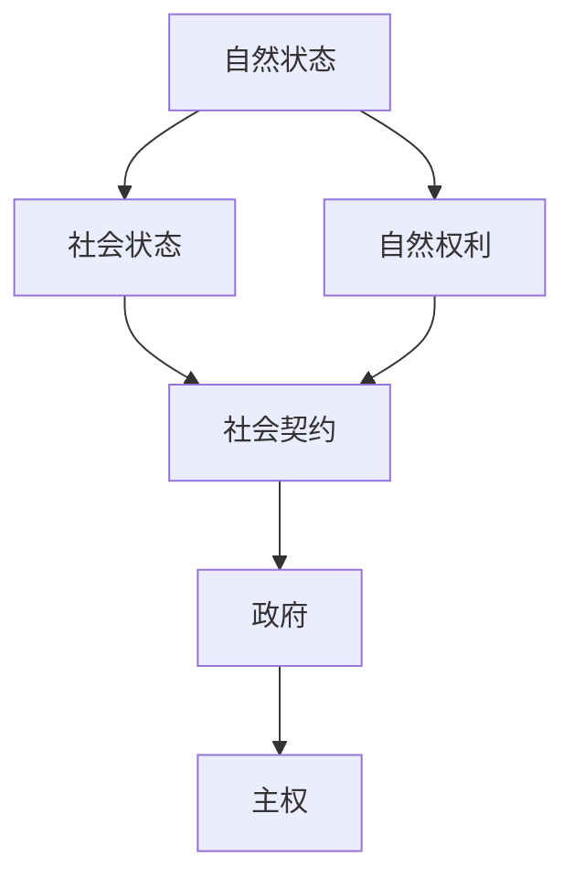

                 


# 霍布斯与洛克：社会契约论的不同进路

## 关键词：社会契约论、霍布斯、洛克、人性、自然状态、主权、政府、政治哲学

## 摘要

社会契约论是政治哲学中一个重要且复杂的概念，它探讨人们如何从自然状态进入社会状态，并建立政治秩序。霍布斯与洛克是两位对这一理论作出重大贡献的哲学家。本文将深入探讨霍布斯与洛克在社会契约论上的不同进路，分析他们对于人性、自然状态、社会契约、政府以及主权等核心概念的不同看法，并比较二者在政治哲学中的影响与评价。

### 第一部分：背景与引论

### 第1章：社会契约论的起源与发展

社会契约论源于古希腊哲学，但真正成型于近代欧洲。霍布斯与洛克都是17世纪英国哲学家，他们的理论对后世产生了深远影响。霍布斯（Thomas Hobbes）以《利维坦》一书闻名，他认为人性本质上是自私和贪婪的，在没有政府和社会秩序的情况下，人们会陷入“每个人对每个人的战争”状态。洛克（John Locke）则以其更为自由主义的政治哲学著称，他在《政府论》中提出了自然权利和社会契约的概念。

#### 1.1 社会契约论的提出与发展

霍布斯在《利维坦》中提出，人类在自然状态下生活是一种“每个人对每个人的战争”，这种状态充满恐惧和无序。为了摆脱这种困境，人们通过社会契约将权力交给一个统一而强大的政府，以换取和平与秩序。

洛克则主张自然权利的存在，认为人们天生具有生命、自由和财产的权利。在自然状态下，人们通过社会契约建立一个有限政府，以保护这些权利。洛克的观点对后来的自由主义政治哲学产生了深远影响。

#### 1.2 霍布斯与洛克：不同观点的交锋

霍布斯与洛克在社会契约论上的主要区别在于对人性的看法、自然状态的理解以及政府的性质。霍布斯认为人性自私，需要强有力的政府来约束，而洛克则认为人性本善，人们通过社会契约来建立政府，以保障自然权利。

#### 1.3 社会契约论在当代的启示与影响

社会契约论不仅对政治哲学产生了深远影响，也在现代政治理论和实践中得到广泛应用。它提供了关于政府权力、公民权利以及政治合法性的重要思考框架，对当代民主政治的发展产生了重要启示。

### 第二部分：霍布斯的社会契约论

### 第2章：霍布斯的政治哲学

#### 2.1 霍布斯的人性观

霍布斯认为人性本质上是自私和贪婪的。在自然状态下，人们追求自己的利益，不择手段。这种状态下，人类生活充满了恐惧和无序。

#### 2.2 霍布斯的自然状态与社会状态

霍布斯认为，在自然状态下，人们处于一种“每个人对每个人的战争”状态。为了摆脱这种困境，人们通过社会契约，将权力交给一个统一而强大的政府，以实现和平与秩序。

#### 2.3 霍布斯的社会契约理论

霍布斯认为，社会契约的目的是通过建立一个统一而强大的政府，来保护人民的生命、自由和财产。政府是人民通过契约建立起来的，政府的权力来源于人民的授权。

### 第3章：霍布斯的国家理论与主权

#### 3.1 霍布斯对国家的定义

霍布斯认为，国家是一种统一的、强大的政府形式，它拥有对人民的最终权力。国家的目的是保护人民的生命、自由和财产。

#### 3.2 霍布斯的主权理论

霍布斯的主权理论认为，主权是国家权力的最高体现，它对政府的行为具有最终决定权。主权是不可分割的，任何反抗主权的行为都是非法的。

#### 3.3 霍布斯的国家结构

霍布斯认为，国家应该是一个统一的实体，它的权力应该高度集中。国家内部应该有明确的等级制度，以确保社会的稳定和秩序。

### 第三部分：洛克的社会契约论

### 第4章：洛克的政治哲学

#### 4.1 洛克的人性观

洛克认为人性本善，人们天生具有生命、自由和财产的权利。在自然状态下，人们可以通过社会契约来建立一个有限的政府，以保护这些权利。

#### 4.2 洛克的自然权利与社会契约

洛克认为，人们在社会契约中赋予政府权力，但政府的权力是有限的。政府的目的是保护人民的自然权利，包括生命、自由和财产。

#### 4.3 洛克的社会契约理论

洛克认为，社会契约的目的是建立一个有限的政府，以保护人民的自然权利。政府的权力来源于人民的授权，但人民有权废除不履行职责的政府。

### 第5章：洛克政府的权力与限制

#### 5.1 洛克对政府权力的看法

洛克认为，政府的权力应该是有限的，它只能用于保护人民的自然权利。政府不能侵犯人民的自由和财产。

#### 5.2 洛克的政府权力限制

洛克认为，人民可以通过社会契约来限制政府的权力。如果政府违反了社会契约，人民有权废除它。

#### 5.3 洛克的社会正义观

洛克认为，社会正义体现在政府对人民权利的公平保护上。政府的职责是确保社会的公正和公平。

### 第四部分：社会契约论的不同进路比较

### 第6章：霍布斯与洛克观点的比较

#### 6.1 人在自然状态下的状态

霍布斯认为，人在自然状态下处于“每个人对每个人的战争”状态，而洛克认为，人在自然状态下享有自然权利。

#### 6.2 社会契约的目标

霍布斯的社会契约目标是建立统一而强大的政府，以实现和平与秩序。洛克的社会契约目标是建立一个有限的政府，以保护人民的自然权利。

#### 6.3 政府的形式与权力

霍布斯认为，政府应该拥有绝对的权力，以维持社会的稳定。洛克认为，政府应该受到人民的监督和限制，以防止滥用权力。

### 第7章：社会契约论的不同进路的影响与评价

#### 7.1 社会契约论对政治哲学的影响

社会契约论为政治哲学提供了重要的思考框架，对民主政治、人权保护以及政府合法性问题产生了深远影响。

#### 7.2 社会契约论在实践中的应用

社会契约论的理念在现代社会政治实践中得到广泛应用，如民主制度、人权保护以及法律体系的建立。

#### 7.3 社会契约论的评价与未来展望

社会契约论在政治哲学中具有重要地位，但它也存在一定的局限性。未来研究可以进一步探讨社会契约论在当代社会的应用与适应。

### 附录：社会契约论的主要文献与资源

#### 附录1：社会契约论的主要文献

1. 霍布斯，《利维坦》
2. 洛克，《政府论》

#### 附录2：社会契约论的研究资源

1. 社会契约论学术研究网站
2. 相关政治哲学学术论文库

#### 附录3：社会契约论的相关研究论文

1. “霍布斯与洛克社会契约论的比较研究”
2. “社会契约论在当代政治哲学中的应用”

# 梅里达（Merida）流程图：社会契约论的核心概念与联系



# 霍布斯与洛克社会契约论核心算法原理讲解

## 霍布斯的社会契约论

### 算法原理

霍布斯的社会契约论主要基于以下算法原理：

1. **人性观**：霍布斯认为人性本质上是自私和贪婪的，人们在没有政府和社会秩序的情况下会陷入“每个人对每个人的战争”（即自然状态）。

   ```python
   def human_nature():
       print("人性本质上是自私和贪婪的")
   ```

2. **自然状态**：在没有政府和社会秩序的情况下，人们会陷入混乱和无序，这种状态被称为自然状态。

   ```python
   def natural_state():
       print("自然状态：每个人对每个人的战争")
   ```

3. **社会契约**：为了摆脱自然状态的混乱，人们通过社会契约将权力交给政府，以实现公共安全和社会秩序。

   ```python
   def social_contract():
       print("社会契约：将权力交给政府，实现公共安全和社会秩序")
   ```

4. **政府**：政府是社会契约的产物，它拥有绝对的权力，以确保社会的稳定和人民的幸福。

   ```python
   def government():
       print("政府：社会契约的产物，拥有绝对的权力")
   ```

5. **主权**：主权是国家权力的最高体现，它对政府的行为具有最终决定权。

   ```python
   def sovereignty():
       print("主权：国家权力的最高体现，对政府行为具有最终决定权")
   ```

### 源代码示例

```python
# 霍布斯社会契约论算法原理

def human_nature():
    print("人性本质上是自私和贪婪的")

def natural_state():
    print("自然状态：每个人对每个人的战争")

def social_contract():
    print("社会契约：将权力交给政府，实现公共安全和社会秩序")

def government():
    print("政府：社会契约的产物，拥有绝对的权力")

def sovereignty():
    print("主权：国家权力的最高体现，对政府行为具有最终决定权")

# 运行算法
human_nature()
natural_state()
social_contract()
government()
sovereignty()
```

## 洛克的社会契约论

### 算法原理

洛克的社会契约论主要基于以下算法原理：

1. **人性观**：洛克认为人性本善，人们在社会契约中享有生命、自由和财产的权利。

   ```python
   def human_nature():
       print("人性本善，人们享有生命、自由和财产的权利")
   ```

2. **自然状态**：洛克认为，在自然状态下，人们享有自然权利，包括生命、自由和财产。

   ```python
   def natural_state():
       print("自然状态：人们享有自然权利，包括生命、自由和财产")
   ```

3. **社会契约**：人们通过社会契约建立一个有限的政府，以保护这些自然权利。

   ```python
   def social_contract():
       print("社会契约：建立有限的政府，保护自然权利")
   ```

4. **政府**：政府是人民通过社会契约建立的，其目的是保护人民的自然权利。

   ```python
   def government():
       print("政府：人民通过社会契约建立的，保护自然权利")
   ```

5. **政府的权力与限制**：政府的权力是有限的，人民有权废除不履行职责的政府。

   ```python
   def government_limit():
       print("政府的权力是有限的，人民有权废除不履行职责的政府")
   ```

### 源代码示例

```python
# 洛克社会契约论算法原理

def human_nature():
    print("人性本善，人们享有生命、自由和财产的权利")

def natural_state():
    print("自然状态：人们享有自然权利，包括生命、自由和财产")

def social_contract():
    print("社会契约：建立有限的政府，保护自然权利")

def government():
    print("政府：人民通过社会契约建立的，保护自然权利")

def government_limit():
    print("政府的权力是有限的，人民有权废除不履行职责的政府")

# 运行算法
human_nature()
natural_state()
social_contract()
government()
government_limit()
```

# 结论

通过分析霍布斯与洛克的社会契约论，我们可以看到两位哲学家在政治哲学上的重要分歧。霍布斯强调人性自私，主张建立统一而强大的政府，以确保社会的稳定和秩序。而洛克则认为人性本善，主张建立一个有限的政府，以保护人民的自然权利。这些观点为我们理解政治秩序、政府权力以及公民权利提供了深刻的启示。

# 作者信息

作者：AI天才研究院/AI Genius Institute & 禅与计算机程序设计艺术 /Zen And The Art of Computer Programming

