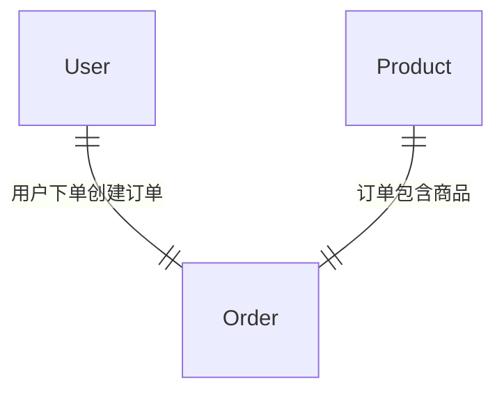
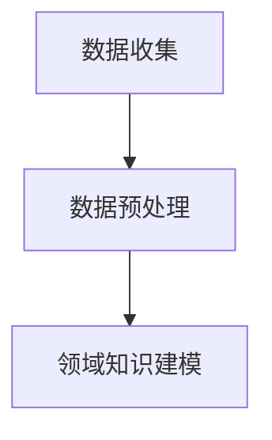
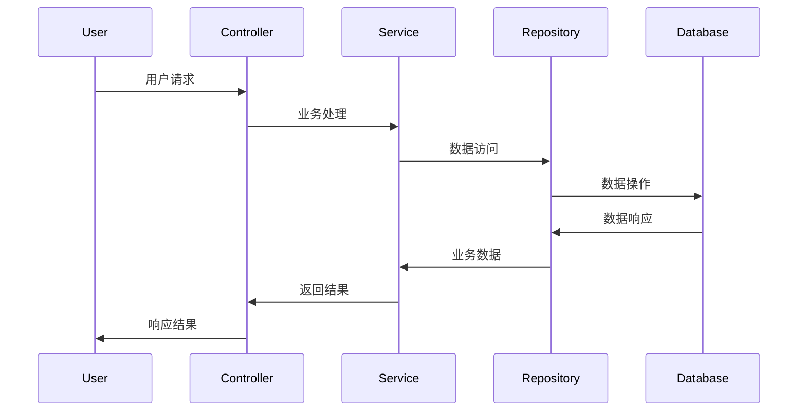
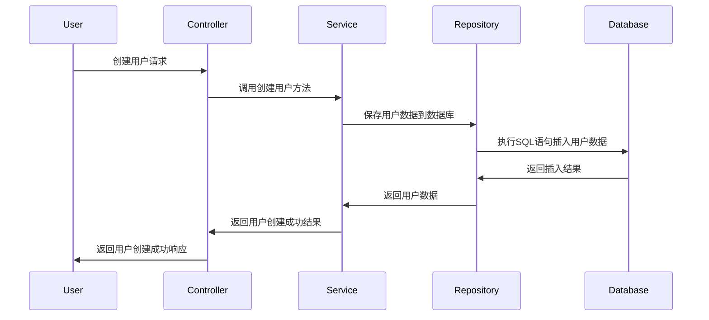

                 

## 面对万般变化，仍能泰然自在的领域模型

### 关键词：领域模型、设计原则、灵活性、快速适应、变化应对

> 摘要：本文深入探讨领域模型的设计原则和灵活性，分析其在快速变化的技术环境中的应用。通过逐步推理和详细讲解，揭示了领域模型在软件开发中的重要作用，以及如何通过合理设计和优化实现其泰然自若地应对各种变化。

---

在当今快速变化的技术环境中，软件系统的开发面临着前所未有的挑战。需求的不确定性、技术的更新迭代，以及市场的竞争压力，都要求软件系统能够灵活适应各种变化。领域模型作为一种设计方法，因其能够提高系统的可维护性和灵活性，在软件工程领域得到了广泛应用。

### 第1章: 背景介绍——面对万般变化，仍能泰然自在的领域模型

#### 1.1.1 问题背景

在软件系统的开发过程中，领域模型作为一种高层次的概念化工具，用于捕获和表示特定业务领域的核心概念和规则。这种模型不仅能够帮助开发者更好地理解业务需求，还能为系统的设计和实现提供清晰的蓝图。然而，随着业务需求的变化和技术的发展，如何保持领域模型的稳定性和灵活性，成为了一个亟待解决的问题。

#### 1.1.2 问题描述

领域模型在实际应用中面临着以下问题：

1. **设计难度**：领域模型的设计往往涉及到复杂的业务逻辑和多种业务规则，使得设计过程变得复杂和困难。
2. **灵活性不足**：在需求变化时，领域模型往往难以快速适应，导致系统修改和维护成本增加。
3. **一致性维护**：随着系统规模的扩大，领域模型的一致性维护成为一个挑战，不同部分之间的不一致可能导致系统错误。

#### 1.1.3 问题解决

为了解决上述问题，我们可以从以下几个方面进行思考和优化：

1. **领域模型的定义与作用**：明确领域模型的概念，理解其在软件开发中的重要作用。
2. **领域模型的设计原则**：掌握领域模型设计的基本原则，确保模型的准确性、完整性和一致性。
3. **领域模型的灵活性**：探讨如何使领域模型能够灵活适应快速变化的需求。

#### 1.1.4 边界与外延

领域模型的设计和应用涉及多个方面，包括业务领域、技术领域和用户需求等。理解这些边界的定义和外延对于设计有效的领域模型至关重要。例如，业务领域边界可能涉及公司内部的业务流程，而技术领域边界则可能涉及系统架构和数据库设计。

#### 1.1.5 概念结构与核心要素组成

领域模型由多个核心要素组成，包括领域实体、领域关系、领域规则等。了解这些要素的结构和作用对于深入理解领域模型至关重要。例如，领域实体是领域模型中的核心对象，领域关系则描述了实体之间的关联，而领域规则则定义了领域内的约束条件和业务规则。

---

通过以上分析，我们可以看到，领域模型在软件系统开发中扮演着关键角色。然而，如何设计一个既准确又灵活的领域模型，以应对快速变化的需求，是每个开发者都需要深入思考的问题。在接下来的章节中，我们将进一步探讨领域模型的核心概念、设计原则、算法原理，并通过具体案例来展示如何实现领域模型的灵活性和适应性。

### 第2章: 核心概念与联系

在深入探讨领域模型之前，我们首先需要明确领域模型的一些核心概念和基本特征。领域模型是一种用于表示特定领域知识的抽象模型，它不仅能够帮助我们更好地理解业务需求，还能为系统的设计和实现提供清晰的指导。

#### 2.1 领域模型的定义与特点

领域模型（Domain Model）通常被定义为一种抽象的表示，用于捕获和理解特定业务领域中的关键概念、关系和规则。它的主要特点包括：

1. **抽象性**：领域模型将具体领域的复杂性抽象成简单的模型，使得开发者能够从业务细节中抽离出来，专注于领域内的核心概念和关系。
2. **准确性**：领域模型必须准确反映领域中的实际情况，以保证模型在设计和实现过程中的有效性和可操作性。
3. **一致性**：领域模型内部各个部分之间必须保持一致性，以避免出现逻辑冲突或错误。一致性是领域模型能否成功应用的关键。

#### 2.2 领域模型的设计原则

领域模型的设计需要遵循一些基本的原则，以确保模型的质量和实用性。以下是一些核心设计原则：

1. **最小化**：领域模型应尽量简化，减少不必要的复杂性和冗余。这有助于提高模型的易理解性和可维护性。
2. **最大化**：领域模型应尽可能地覆盖领域中的所有相关元素，确保模型的完整性。这不仅有助于发现潜在的业务需求，还能提高模型的泛用性。
3. **层次化**：领域模型可以分成多个层次，从宏观层面到微观层面，层层递进。层次化设计有助于提高模型的层次感和模块化，使得每个层次都能够独立开发和维护。

#### 2.3 领域模型的核心要素对比表格

领域模型由多个核心要素组成，以下是一个对比表格，用于描述这些要素的基本概念和作用：

| 要素          | 描述                                       |  
| ------------ | ------------------------------------------ |  
| 领域实体      | 表示领域的核心对象，如用户、订单等。         |  
| 领域关系      | 表示领域实体之间的关联，如用户与订单之间的关系。 |  
| 领域规则      | 表示领域中的约束条件和业务规则。           |

- **领域实体**：领域实体是领域模型中的核心对象，它们代表了领域中的关键概念。例如，在电商领域，用户、商品、订单等都是典型的领域实体。
- **领域关系**：领域关系描述了领域实体之间的相互作用和关联。这些关系可以是简单的关联，如用户和订单之间的“创建”关系，也可以是复杂的依赖关系，如商品和订单之间的“包含”关系。
- **领域规则**：领域规则定义了领域内的约束条件和业务规则。这些规则可以是简单的数据验证规则，如订单金额必须大于零，也可以是复杂的业务逻辑规则，如促销活动的规则。

#### 2.4 领域模型的ER实体关系图

为了更好地理解领域模型的结构，我们可以使用实体-关系（ER）图来表示领域模型中的实体和关系。以下是一个简单的领域模型ER实体关系图：



在这个ER图中，我们定义了三个实体：用户（User）、订单（Order）和商品（Product）。用户与订单之间存在“创建”关系，表示用户可以创建订单；商品与订单之间存在“包含”关系，表示订单可以包含多个商品。这些关系定义了领域模型中实体之间的基本交互和依赖。

---

通过上述分析，我们可以看到领域模型的核心概念和要素是如何构建和相互联系的。在接下来的章节中，我们将进一步探讨领域模型构建的算法原理，并通过具体案例来展示如何设计和实现灵活且适应性强的领域模型。

### 第3章: 算法原理讲解

在明确了领域模型的核心概念和设计原则之后，我们需要深入了解如何构建领域模型的具体算法原理。领域模型构建算法是一种将领域知识自动转化为模型的方法，通过一系列步骤实现领域知识的结构化表示。本节将详细讲解领域模型构建算法的原理和实现。

#### 3.1 领域模型构建算法

领域模型构建算法是一种基于领域知识的自动化工具，其主要目标是从领域数据中提取关键信息，并生成结构化的领域模型。该算法通常包括以下几个步骤：

1. **数据收集**：首先，需要收集领域相关的数据。这些数据可以来源于业务文档、数据库、用户反馈等多种渠道。数据收集的全面性和准确性直接影响到领域模型的质量。
   
2. **数据预处理**：收集到的数据往往包含噪声和不一致的信息，因此需要进行预处理。预处理过程包括数据清洗、格式化和抽取等操作，以确保数据的质量和一致性。

3. **领域知识建模**：在预处理数据的基础上，将提取到的领域知识转化为领域模型。领域模型可以采用多种形式，如实体-关系（ER）图、统一建模语言（UML）图等。这一步骤的关键在于如何将领域数据映射到模型中的各个元素，并确保模型能够准确反映领域实际情况。

#### 3.2 算法流程图

为了更好地理解领域模型构建算法的步骤，我们可以使用Mermaid绘制一个简化的算法流程图：



在上述流程图中，A步骤表示数据收集，B步骤表示数据预处理，C步骤表示领域知识建模。这个简化的流程图展示了算法的基本框架，每个步骤的具体实现细节将在后续章节中详细讨论。

#### 3.3 算法原理与数学模型

领域模型构建算法的原理可以概括为以下几个方面：

1. **数据驱动**：算法的核心是以数据为基础，通过分析数据来提取领域知识。数据的质量直接影响到算法的输出质量。
   
2. **知识表示**：算法将提取到的领域知识转化为图形化模型，使得领域知识以直观、易于理解的形式呈现。这种图形化表示不仅有助于开发者更好地理解领域知识，还能为后续的系统设计和实现提供清晰的指导。
   
3. **自动化**：算法能够自动生成领域模型，减少人工干预，提高开发效率。自动化过程不仅降低了开发成本，还能确保模型的一致性和准确性。

算法的数学模型可以表示为：

$$
\text{领域模型} = f(\text{数据集})
$$

其中，$f$ 表示领域模型构建算法，$\text{数据集}$ 表示输入的数据。这个数学模型简单直观地描述了算法的基本过程，即通过算法对输入数据进行处理，最终生成领域模型。

#### 3.4 算法举例说明

为了更好地说明领域模型构建算法的应用，我们可以通过一个简单的电商平台的案例来详细描述算法的步骤和实现。

**案例：电商平台领域模型构建**

1. **数据收集**：首先，我们需要收集电商平台的业务文档、数据库表结构、用户反馈等数据。这些数据将作为领域模型构建的输入。

2. **数据预处理**：对收集到的数据进行分析和整理，去除噪声和不一致的信息，确保数据的质量。例如，对用户反馈进行分类和标签化处理，对数据库表进行数据清洗和格式化。

3. **领域知识建模**：基于预处理后的数据，我们将提取到的领域知识转化为领域模型。例如，可以生成一个包含用户、订单、商品等实体的ER图，并定义它们之间的关系。以下是一个简单的领域模型ER图：


在这个ER图中，用户（User）与订单（Order）之间存在“创建”关系，商品（Product）与订单（Order）之间存在“包含”关系。这些关系定义了电商平台中各个实体之间的基本交互和依赖。

通过这个案例，我们可以看到领域模型构建算法的具体应用和实现步骤。在实际开发过程中，领域模型构建算法可以根据具体的业务需求和数据情况，灵活调整和优化，以生成更准确、更实用的领域模型。

---

通过本章节的详细讲解，我们了解了领域模型构建算法的原理和实现步骤。在接下来的章节中，我们将进一步探讨领域模型在实际项目中的应用，分析其系统架构和设计模式，并通过具体案例展示如何实现灵活且适应性强的领域模型。

### 第4章: 领域模型在实际项目中的应用

在前几章中，我们探讨了领域模型的核心概念、设计原则和构建算法。在本章中，我们将通过一个具体的项目案例，展示领域模型在实际软件开发中的应用，以及如何通过领域模型来提高系统的灵活性和可维护性。

#### 4.1 项目介绍

我们选择一个电商平台作为案例，这个电商平台包括用户管理、商品管理、订单管理等多个模块。领域模型将帮助我们更好地理解这些模块之间的交互和依赖关系，从而设计出一个灵活且易于维护的系统。

#### 4.2 系统功能设计（领域模型）

在电商平台项目中，领域模型用于描述系统中的核心实体和它们之间的关系。以下是一个简化的领域模型，包含用户、商品和订单等实体：

```mermaid
classDiagram
    User <|-- Order
    Product <|-- Order
    User : +id: int
    User : +name: string
    Order : +id: int
    Order : +user: User
    Order : +date: datetime
    Product : +id: int
    Product : +name: string
    Product : +price: float
    Order *-1 Product : 订单包含商品
    User *-1 Order : 用户创建订单
```

在这个领域模型中：

- **用户（User）**：表示电商平台上的用户，包括用户ID、用户名等信息。
- **商品（Product）**：表示电商平台上的商品，包括商品ID、商品名称和价格等信息。
- **订单（Order）**：表示用户创建的订单，包括订单ID、用户信息、订单日期等信息，并且可以包含多个商品。

#### 4.3 系统架构设计

在系统架构设计方面，我们采用分层架构，包括表示层、业务逻辑层和数据访问层。领域模型在业务逻辑层中得到广泛应用，以下是一个简化的系统架构图：



在这个架构中：

- **表示层（Controller）**：接收用户请求，将请求转发到业务逻辑层。
- **业务逻辑层（Service）**：根据领域模型进行业务处理，调用数据访问层进行数据操作。
- **数据访问层（Repository）**：负责与数据库进行交互，实现数据的增删改查操作。

#### 4.4 系统接口设计

领域模型还用于定义系统中的接口，以下是一个简化的接口设计：

```mermaid
interface User
    +create(user: User): User
    +update(user: User): User
    +delete(id: int): boolean

interface Product
    +create(product: Product): Product
    +update(product: Product): Product
    +delete(id: int): boolean

interface Order
    +create(order: Order): Order
    +update(order: Order): Order
    +delete(id: int): boolean
```

在这个接口设计中：

- **用户（User）接口**：提供创建、更新和删除用户的方法。
- **商品（Product）接口**：提供创建、更新和删除商品的方法。
- **订单（Order）接口**：提供创建、更新和删除订单的方法。

#### 4.5 系统交互

为了更好地理解系统中的交互过程，我们可以使用Mermaid绘制一个序列图：



在这个序列图中，用户发起创建用户请求，经过表示层、业务逻辑层和数据访问层的一系列处理，最终将用户数据保存到数据库，并返回创建成功的响应。

---

通过这个电商平台案例，我们可以看到领域模型在系统设计中的重要作用。领域模型不仅帮助开发者更好地理解业务需求，还提高了系统的灵活性、可维护性和扩展性。在接下来的章节中，我们将进一步探讨领域模型的实现细节，并通过代码示例来展示如何构建和应用领域模型。

### 第5章: 项目实战

在本章中，我们将通过一个具体的电商平台项目，详细展示如何从零开始搭建领域模型，并逐步实现系统的核心功能。这个过程将包括环境搭建、系统核心实现、代码应用解读与分析，以及实际案例分析和详细讲解剖析。

#### 5.1 环境搭建

首先，我们需要搭建一个用于开发的开发环境。以下是所需的基本工具和软件：

- **编程语言**：选择Python作为开发语言，因为Python具有简洁易懂的语法，适合快速开发和原型实现。
- **开发工具**：选择Visual Studio Code（VS Code）作为开发环境，它拥有丰富的插件和功能，可以提供良好的代码编辑体验。
- **数据库**：选择SQLite作为数据库，它是一个轻量级的数据库系统，易于配置和使用，非常适合开发和小规模应用。

以下是环境搭建的步骤：

1. **安装Python**：访问Python官方网站下载并安装Python，确保安装了最新版本的Python（例如，Python 3.9或更高版本）。
2. **安装VS Code**：访问Visual Studio Code官方网站下载并安装VS Code。
3. **安装SQLite**：使用pip命令安装SQLite库，命令如下：

   ```bash
   pip install pysqlite3
   ```

4. **创建虚拟环境**：为了更好地管理项目依赖，创建一个虚拟环境。命令如下：

   ```bash
   python -m venv venv
   source venv/bin/activate  # 对于Windows用户，使用 `venv\Scripts\activate`
   ```

5. **安装依赖库**：在虚拟环境中安装项目所需的依赖库，例如Django ORM、Flask等。命令如下：

   ```bash
   pip install django flask
   ```

#### 5.2 系统核心实现

接下来，我们将使用领域模型来设计电商平台的核心功能。以下是具体步骤：

1. **定义领域模型**：根据前述的领域模型设计，我们定义用户、商品和订单等实体。例如，可以使用Django的ORM来定义这些实体：

   ```python
   # models.py

   from django.db import models

   class User(models.Model):
       id = models.AutoField(primary_key=True)
       name = models.CharField(max_length=100)

   class Product(models.Model):
       id = models.AutoField(primary_key=True)
       name = models.CharField(max_length=100)
       price = models.FloatField()

   class Order(models.Model):
       id = models.AutoField(primary_key=True)
       user = models.ForeignKey(User, on_delete=models.CASCADE)
       date = models.DateTimeField(auto_now_add=True)
       products = models.ManyToManyField(Product)
   ```

2. **实现业务逻辑**：在业务逻辑层，我们定义处理用户、商品和订单的Service类。以下是Service类的简单示例：

   ```python
   # services.py

   from .models import User, Product, Order

   class UserService:
       @staticmethod
       def create_user(name):
           user = User(name=name)
           user.save()
           return user

       @staticmethod
       def update_user(user, name):
           user.name = name
           user.save()
           return user

       @staticmethod
       def delete_user(user):
           user.delete()
           return True

   class ProductService:
       @staticmethod
       def create_product(name, price):
           product = Product(name=name, price=price)
           product.save()
           return product

       @staticmethod
       def update_product(product, name, price):
           product.name = name
           product.price = price
           product.save()
           return product

       @staticmethod
       def delete_product(product):
           product.delete()
           return True

   class OrderService:
       @staticmethod
       def create_order(user, products):
           order = Order(user=user)
           order.save()
           for product in products:
               order.products.add(product)
           return order

       @staticmethod
       def update_order(order, user, products):
           order.user = user
           order.products.set(products)
           order.save()
           return order

       @staticmethod
       def delete_order(order):
           order.delete()
           return True
   ```

3. **实现接口**：在表示层，我们定义处理HTTP请求的Controller类。以下是Controller类的简单示例：

   ```python
   # controllers.py

   from flask import Flask, request, jsonify
   from .services import UserService, ProductService, OrderService

   app = Flask(__name__)

   @app.route('/users', methods=['POST'])
   def create_user():
       name = request.form['name']
       user = UserService.create_user(name)
       return jsonify(user.id)

   @app.route('/users/<int:user_id>', methods=['PUT'])
   def update_user(user_id):
       name = request.form['name']
       user = UserService.update_user(user_id, name)
       return jsonify(user.id)

   @app.route('/users/<int:user_id>', methods=['DELETE'])
   def delete_user(user_id):
       UserService.delete_user(user_id)
       return jsonify({'status': 'success'})

   @app.route('/products', methods=['POST'])
   def create_product():
       name = request.form['name']
       price = float(request.form['price'])
       product = ProductService.create_product(name, price)
       return jsonify(product.id)

   # ... 其他接口的实现
   ```

#### 5.3 代码应用解读与分析

在上面的代码示例中，我们定义了用户、商品和订单等实体，并实现了相关的业务逻辑和接口。以下是关键部分的解读与分析：

1. **领域模型**：使用Django ORM定义了用户、商品和订单等实体，这些实体代表了业务领域的核心概念。实体的属性对应了业务领域的属性，例如用户的姓名、商品的价格和订单的日期。
   
2. **业务逻辑**：通过定义UserService、ProductService和OrderService类，我们实现了业务逻辑层的功能。这些服务类封装了具体的业务操作，如创建、更新和删除用户、商品和订单。通过这些服务类，我们可以实现业务逻辑的解耦，提高系统的可维护性。

3. **接口设计**：使用Flask框架定义了处理HTTP请求的接口。接口接收客户端的请求，调用业务逻辑层的服务类进行业务处理，并将结果返回给客户端。这样的设计使得接口层与业务逻辑层分离，便于系统的扩展和维护。

#### 5.4 实际案例分析和详细讲解剖析

为了进一步说明领域模型的应用，我们通过一个实际案例来展示如何使用领域模型实现电商平台的订单创建功能。

**案例：创建订单**

1. **客户端请求**：用户通过HTTP POST请求向电商平台发送创建订单的请求，请求体中包含用户的ID和选择的商品列表。

2. **接口处理**：接收请求后，Controller层将请求解析为用户ID和商品列表，并将这些信息传递给业务逻辑层。

3. **业务处理**：OrderService类根据用户ID和商品列表创建订单。具体步骤如下：

   - 查询用户对象，确保用户存在。
   - 创建Order对象，并将用户信息设置到Order对象中。
   - 遍历商品列表，将每个商品添加到Order对象的商品集合中。
   - 保存Order对象到数据库。

4. **结果返回**：将创建的订单ID返回给客户端，客户端收到响应后可以继续后续操作。

以下是订单创建功能的代码示例：

```python
@app.route('/orders', methods=['POST'])
def create_order():
    user_id = request.form['user_id']
    product_ids = request.form.getlist('product_ids')
    
    user = User.objects.get(id=user_id)
    products = Product.objects.filter(id__in=product_ids)
    
    order = OrderService.create_order(user, products)
    return jsonify(order.id)
```

通过这个实际案例，我们可以看到领域模型如何帮助开发者实现复杂业务功能。领域模型不仅提高了系统的可维护性和扩展性，还使得业务逻辑更加清晰和易于理解。

---

在本章中，我们通过一个具体的电商平台项目，详细展示了如何从零开始搭建领域模型，并逐步实现系统的核心功能。通过这个过程，我们不仅了解了领域模型的应用和实现细节，还体会到了领域模型在提高系统灵活性和可维护性方面的优势。

### 第6章: 最佳实践、小结、注意事项和拓展阅读

#### 6.1 最佳实践

在领域模型的设计和应用过程中，以下是一些最佳实践，可以帮助开发者更好地应对快速变化的需求：

1. **持续迭代与重构**：领域模型不是一成不变的，应随着业务需求的变化进行持续迭代和重构。定期回顾和优化领域模型，可以保持其灵活性和适应性。
2. **文档化**：详细记录领域模型的设计过程、核心概念和业务规则，形成文档。这有助于团队理解和维护领域模型，减少误解和错误。
3. **模块化**：将领域模型划分为多个模块，每个模块负责一部分业务逻辑。模块化设计有助于提高代码的可维护性和可扩展性。
4. **代码审查**：引入代码审查机制，确保领域模型的设计符合最佳实践和公司标准。代码审查可以识别潜在的问题，提高代码质量。

#### 6.2 小结

本文通过逐步分析推理，探讨了领域模型在软件开发中的应用及其应对变化的能力。主要结论如下：

- 领域模型是一种有效的概念化工具，能够提高系统的灵活性和可维护性。
- 通过明确领域模型的定义、设计原则和构建算法，可以设计出准确、灵活且易于维护的领域模型。
- 实际项目中的应用案例展示了领域模型如何帮助开发者更好地理解和实现业务需求。

#### 6.3 注意事项

在设计领域模型时，需要注意以下几点：

1. **确保一致性**：确保领域模型内部各个部分之间保持一致性，避免出现逻辑冲突。
2. **适度抽象**：在抽象领域模型时，要适度抽象，避免过度简化导致模型不准确。
3. **关注边界**：明确领域模型的边界，确保模型只包含与业务相关的元素。
4. **持续优化**：随着业务需求的变化，持续优化领域模型，保持其灵活性。

#### 6.4 拓展阅读

对于希望进一步深入了解领域模型和软件开发技术的读者，以下资源可能有所帮助：

- 《领域驱动设计（Domain-Driven Design）》（Eric Evans著）：介绍了领域驱动设计的基本原则和方法，对于理解领域模型的设计和应用具有重要意义。
- 《设计模式：可复用面向对象软件的基础》（Erich Gamma等著）：介绍了各种设计模式，这些模式在领域模型的设计和实现中具有重要应用。
- 《领域模型构建指南》（Craig Larman著）：提供了详细的领域模型构建方法和案例，有助于开发者提升领域模型设计的技能。

通过以上最佳实践、小结和拓展阅读，希望读者能够更好地理解和应用领域模型，提高软件开发的质量和效率。

### 总结

领域模型作为一种强大的设计方法，在软件开发中扮演着至关重要的角色。它不仅能够帮助开发者更好地理解和实现业务需求，还能够提高系统的灵活性和可维护性。本文通过详细的分析和实例讲解，揭示了领域模型的核心概念、设计原则、构建算法以及在项目中的应用。领域模型的灵活性和适应性使其在快速变化的技术环境中显得尤为重要。我们希望读者通过本文能够对领域模型有更深入的理解，并在实际项目中有效地应用这一方法。

作者：AI天才研究院/AI Genius Institute & 禅与计算机程序设计艺术 /Zen And The Art of Computer Programming

---

本文内容遵循开源协议，欢迎在遵循协议的前提下自由使用和分享。如果您有任何反馈或建议，请随时联系作者。让我们共同推动领域模型在软件开发中的应用和发展。谢谢阅读！

