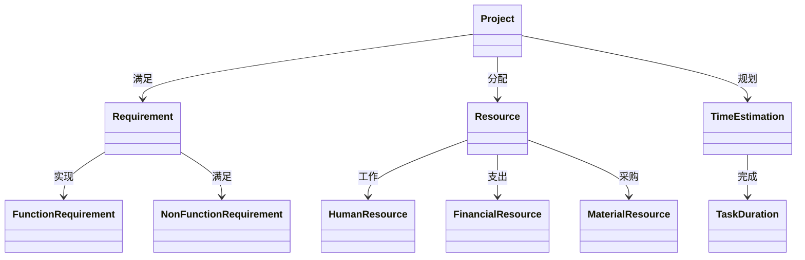
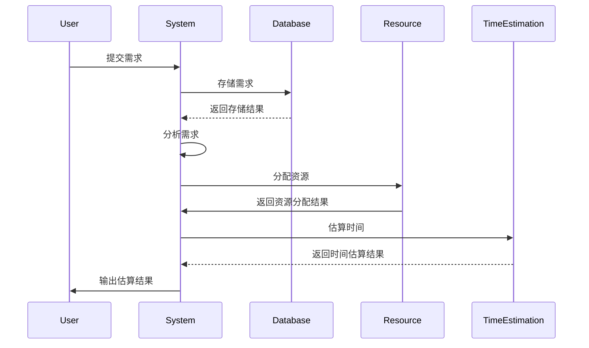

                 

### 1. 背景介绍

在现代项目管理中，准确的项目估算对于项目的成功至关重要。项目估算涉及对项目完成所需的时间、成本和资源的预估。这不仅有助于项目团队规划工作进度，还可以确保项目在预算范围内完成。然而，项目估算并非易事，它面临着诸多挑战。

首先，需求变化是一个主要挑战。项目需求可能随着项目推进而不断变化，这种变化可能导致项目估算的不准确。其次，技术复杂性也是一大障碍。许多项目涉及先进的技术，技术的复杂性和不确定性会影响估算的准确性。此外，资源限制也是一个重要的考量因素。资源有限，如何合理分配，如何确保关键资源在需要的时候可用，这些都是项目估算需要解决的问题。

为了解决这些挑战，我们需要科学的方法和工具。科学的方法包括基于数据的分析、历史数据的回顾和应用，以及定量的估算模型。工具方面，现代项目管理软件如JIRA、Trello等提供了功能强大的估算工具，这些工具可以帮助团队更准确地估算项目时间、成本和资源需求。

在本文中，我们将探讨项目估算的关键概念和原理，分析不同的估算方法，并通过具体的算法、数学模型和实际案例，展示如何提高项目估算的准确性。本文的讨论范围包括项目估算的技术、方法和实际应用，旨在为项目管理者提供实用的指导和建议。

### 1.1 问题背景

在现代项目管理中，项目估算的准确性直接关系到项目的成败。无论是软件开发、基础设施建设，还是市场推广活动，项目估算都是规划和管理项目的重要环节。准确的估算可以帮助团队合理规划资源，确保项目在预算范围内按时完成，从而提高项目的成功率。

然而，项目估算并非一个简单的任务。它面临着多种挑战，其中最主要的包括：

1. **需求变化**：项目需求可能会在项目进行过程中发生变化。这些变化可能源自市场环境、客户反馈、技术进步等多方面因素。需求的变化直接影响项目的时间、成本和资源需求，从而影响估算的准确性。

2. **技术复杂性**：许多项目涉及先进的技术，这些技术的复杂性和不确定性使得估算变得困难。特别是在涉及新型技术或未被广泛应用的技术时，其潜在的技术风险和不确定性增加了估算的不确定性。

3. **资源限制**：资源限制是项目估算中必须面对的现实问题。项目所需的人力、资金、设备等资源往往有限，如何合理分配和利用这些资源，确保关键资源在需要的时候可用，是估算中的一大难题。

4. **风险因素**：项目实施过程中可能面临各种风险，如市场变化、技术故障、人员流失等。这些风险因素都会对项目估算产生影响，增加估算的不确定性。

针对这些挑战，提高项目估算的准确性至关重要。准确的项目估算不仅有助于项目团队更好地规划和管理项目，还可以为项目管理者提供有力的决策依据。因此，理解和应用科学的项目估算方法，是现代项目管理不可或缺的一环。

### 1.2 问题描述

尽管项目估算在项目管理中至关重要，但实际操作中却面临着多种问题，这些问题的复杂性使得项目估算变得具有挑战性。以下将详细分析这些常见问题：

**1.1 需求不确定性**  
项目需求在项目进行过程中可能会发生变化，这通常是由于市场环境、客户反馈、技术发展等多种因素引起的。需求的变化直接影响到项目的时间、成本和资源需求。例如，一个原本简单的需求可能在后期因为客户需求的变化而变得更加复杂，从而导致项目延期和成本超支。此外，需求的不确定性也增加了项目团队的工作负担，需要频繁调整计划和资源分配。

**1.2 技术复杂性**  
许多项目涉及先进的技术，这些技术具有较高的复杂性和不确定性。技术的复杂性使得项目团队难以准确预测项目的实施时间和成本。例如，某些新型技术的引入可能需要额外的开发和测试时间，同时技术故障和未知问题也可能导致项目延误。此外，技术的不断进步也使得项目团队需要不断更新和调整项目计划，以适应新技术的发展。

**1.3 资源限制**  
资源限制是项目管理中普遍存在的挑战。项目所需的人力、资金、设备等资源往往有限，如何合理分配和利用这些资源，确保关键资源在需要的时候可用，是项目估算中的一个重要问题。资源限制可能导致项目团队无法按时完成工作，从而影响项目的整体进度和成本。

**1.4 风险管理**  
项目实施过程中可能面临各种风险，如市场变化、技术故障、人员流失等。这些风险因素都会对项目估算产生影响，增加估算的不确定性。有效的风险管理需要项目团队提前识别潜在风险，制定相应的应对措施，并持续监控和调整项目计划。然而，实际操作中，风险识别和应对往往不够及时和全面，导致项目估算的不准确。

**1.5 估算方法不科学**  
项目估算的方法和工具的选择对估算的准确性具有重要影响。许多项目团队依赖于经验或简单的估算方法，这些方法往往缺乏科学依据，难以准确预测项目结果。科学的项目估算方法应基于历史数据、统计分析和技术模型，以确保估算的准确性和可靠性。

总之，项目估算中的问题多种多样，涉及需求不确定性、技术复杂性、资源限制、风险管理以及估算方法不科学等多个方面。解决这些问题，提高项目估算的准确性，是现代项目管理中的重要任务。

### 1.3 问题解决

为了解决项目估算中的各种问题，提高项目交付准确性，我们可以采取以下几种科学的方法和工具：

**1.1 历史数据回顾与应用**  
首先，基于历史数据的项目估算方法是一个有效途径。项目团队可以从以往类似项目的数据中提取信息，如项目完成时间、成本投入、资源使用情况等。通过对这些数据的分析和统计，可以形成项目估算的基础。历史数据的回顾不仅提供了对项目特性的深入了解，还可以帮助识别潜在的问题和风险，从而提高估算的准确性。

**1.2 统计分析模型**  
统计分析模型是另一种提高项目估算准确性的方法。通过使用统计分析工具，项目团队可以建立与项目特征相关的数学模型，如线性回归模型、时间序列分析模型等。这些模型可以帮助预测项目的关键指标，如项目完成时间、成本等。具体步骤包括数据收集、模型建立、模型验证和结果应用。

**1.3 定量估算方法**  
定量估算方法包括类比估算、参数估算和三点估算等。类比估算基于以往类似项目的经验，通过比较类似项目的数据和特点，进行估算。参数估算则使用统计模型和参数，如项目大小、团队规模等，来预测项目的时间、成本和资源需求。三点估算则考虑了项目的最优、最可能和最悲观时间，通过计算期望值来提高估算的准确性。

**1.4 项目管理软件**  
现代项目管理软件提供了强大的估算工具，如JIRA、Trello等。这些软件可以帮助项目团队进行任务分配、时间追踪、资源管理，并生成项目进度报告和成本分析。通过项目管理软件，项目团队可以实时监控项目进展，及时调整计划和资源，从而提高项目估算的准确性。

**1.5 风险管理策略**  
有效的风险管理也是提高项目估算准确性的关键。项目团队需要识别和评估项目风险，制定相应的应对措施，并持续监控和调整风险。风险管理策略可以包括定期的风险评估会议、风险登记册、风险应对计划等。通过风险管理，项目团队可以提前预见潜在的问题，并采取预防措施，从而降低项目估算的不确定性。

总之，通过历史数据回顾、统计分析模型、定量估算方法、项目管理软件和风险管理策略的综合应用，项目团队可以有效提高项目估算的准确性，确保项目在预算范围内按时完成。

### 1.4 边界与外延

项目估算的范围和技术应用涉及多个方面，具有明确的边界和广泛的拓展可能性。首先，项目估算的边界在于其具体应用场景，主要集中在软件开发、基础设施建设、市场推广等项目管理领域。这些领域对项目估算的准确性和科学性要求较高，因为项目的成功与否直接关系到企业的战略目标和经济效益。

技术上的应用边界则涵盖了各种估算方法和工具的选择。类比估算、参数估算、三点估算等方法各自有其适用的场景和限制。类比估算适用于需求明确、历史数据丰富的项目，而参数估算则依赖于强大的数据分析能力。三点估算在风险评估中尤为重要，但它需要项目团队具备良好的风险意识和预测能力。

在讨论范围上，本文将重点关注项目估算的技术和方法，包括估算模型、数据分析工具和项目管理软件的使用。同时，本文将探讨这些方法和工具在实际项目中的应用，通过具体的案例和数学模型，展示如何提高项目估算的准确性。

关于概念结构和核心要素组成，项目估算的核心要素包括需求分析、资源规划和时间估算。需求分析是项目估算的起点，通过理解项目需求，明确项目目标，为后续的估算提供基础。资源规划涉及项目所需的人力、资金和设备等资源的分配，确保项目在资源有限的情况下能够高效运作。时间估算是项目估算的核心，通过对项目任务的时间预测，制定合理的工作计划和时间表。

### 2. 核心概念与联系

在项目估算过程中，几个核心概念是不可或缺的，这些概念相互联系，共同构成了项目估算的理论基础。

首先，我们需要了解“项目估算”本身。项目估算是指对项目完成所需的时间、成本和资源进行预估的过程。它是项目管理中至关重要的一环，直接影响到项目的成功和效率。项目估算不仅仅是一个简单的数学运算，它还需要综合考虑项目需求、资源分配和风险因素等多方面的信息。

接下来，我们来看“需求分析”。需求分析是项目估算的基础，它涉及对项目需求的理解和定义。通过需求分析，项目团队可以明确项目的目标、功能需求和非功能需求，为后续的估算提供明确的指导。需求分析的准确性直接影响项目估算的准确性。

然后，我们探讨“资源规划”。资源规划是指对项目所需的人力、资金和设备等资源进行合理分配和优化。资源规划的目标是确保项目在资源有限的情况下，能够高效、有序地推进。资源规划的成功与否，直接关系到项目的成本和时间估算是否合理。

最后，我们讨论“时间估算”。时间估算是项目估算的核心，它涉及对项目各个任务的持续时间进行预测。通过时间估算，项目团队可以制定合理的工作计划和时间表，确保项目能够按时完成。时间估算的准确性取决于对项目任务的理解、资源分配和风险预测等多方面因素。

为了更好地理解这些核心概念之间的联系，我们可以通过一个简单的ER（实体关系）图来展示它们之间的关系。在项目估算的ER图中，“项目”、“需求”、“资源”和“时间估算”是四个主要实体。

- **项目**：代表整个项目，包含项目的所有相关信息，如项目名称、项目目标、项目预算等。
- **需求**：代表项目的需求信息，包括功能需求和非功能需求，与项目实体相关联。
- **资源**：代表项目所需的各种资源，如人力、资金、设备等，与项目实体相关联。
- **时间估算**：代表对项目各个任务的持续时间进行预测的信息，与项目实体相关联。

ER图中的关系如下：

```
项目
|    ↓
需求    ↑
|    ↓
资源
|    ↓
时间估算
```

通过这个ER图，我们可以清晰地看到各个实体之间的关联。项目是整个估算的核心，需求、资源和时间估算都是围绕项目展开的。需求分析为时间估算和资源规划提供了基础，资源规划则决定了时间估算的实现可能性，而时间估算最终决定了项目的进度和成本。

总之，项目估算中的核心概念相互联系，共同构成了一个完整的估算体系。理解这些概念及其关系，是提高项目估算准确性的关键。

#### 2.1 核心概念原理

在项目估算中，理解几个核心概念及其原理是至关重要的。这些核心概念包括项目估算、需求分析和资源规划。

**项目估算**：项目估算是对项目完成所需时间、成本和资源的预估。它是项目管理过程中不可或缺的一环，直接影响项目的成功。项目估算的原理基于对项目需求、资源可用性和风险因素的深入分析。科学的项目估算需要综合考虑历史数据、市场环境、技术复杂性和团队能力等因素。具体而言，项目估算包括以下几个步骤：

1. **需求分析**：理解项目的需求是项目估算的起点。需求分析包括功能需求和非功能需求，通过明确项目的目标、功能和技术要求，为后续的估算提供基础。
2. **资源评估**：评估项目所需的资源，包括人力、资金、设备和材料等。资源评估需要考虑资源的可用性、效率和质量。
3. **风险评估**：识别和评估项目可能面临的风险，包括技术风险、市场风险和资源风险等。风险评估有助于制定应对措施，降低不确定性。
4. **模型建立**：基于需求和资源评估，建立估算模型。常见的估算模型包括类比估算、参数估算和三点估算等。

**需求分析**：需求分析是项目估算的基础。它涉及对项目需求的全面理解和定义，确保项目团队能够明确项目的目标、功能和约束。需求分析的原理基于用户调研、需求文档编写和需求评审等步骤：

1. **用户调研**：通过与用户、利益相关者和项目团队进行沟通，收集项目需求信息。
2. **需求文档编写**：将收集到的需求信息整理成需求文档，明确项目的功能需求和非功能需求。
3. **需求评审**：评审需求文档，确保需求的完整性和可行性。

**资源规划**：资源规划是指对项目所需资源的合理分配和优化。资源规划的目标是确保项目在资源有限的情况下能够高效、有序地推进。资源规划的原理包括以下几个方面：

1. **资源评估**：评估项目所需的资源，包括人力、资金、设备和材料等，确保资源满足项目需求。
2. **资源分配**：根据项目需求，将资源合理分配到各个任务和阶段，确保关键资源在需要的时候可用。
3. **资源优化**：通过调整资源分配和时间计划，优化资源使用效率，降低成本。

通过理解项目估算、需求分析和资源规划的核心概念及其原理，项目团队可以更科学、更准确地估算项目的时间、成本和资源需求，从而提高项目的成功率和效率。

#### 2.2 概念属性特征对比表格

在项目估算过程中，不同的估算方法具有各自的属性特征，适用于不同的场景。下面我们将通过一个对比表格，详细分析类比估算、参数估算和三点估算的属性特征，帮助读者更好地理解这些方法。

| 估算方法       | 特点                                       | 适用场景                     |
|----------------|--------------------------------------------|------------------------------|
| 类比估算       | 基于以往类似项目的经验进行估算              | 需求明确、以往数据丰富        |
| 参数估算       | 使用统计模型和参数进行估算                | 数据分析能力较强             |
| 三点估算       | 考虑最佳、最坏和最有可能的情况，计算期望值 | 风险评估重要                 |

**类比估算**：类比估算是一种基于以往类似项目经验的估算方法。它通过分析过去类似项目的数据，如项目完成时间、成本和资源使用情况，来预测当前项目的估算值。这种方法的特点是简单直观，易于理解和实施。然而，类比估算的准确性受到以往项目数据质量和相似度的影响。它适用于需求明确、以往数据丰富的项目，特别是在项目类型和规模相似的情况下。

**参数估算**：参数估算是一种基于统计模型和参数的估算方法。它通过收集和分析项目参数，如项目大小、团队规模和任务复杂度等，使用数学模型和参数来预测项目的时间、成本和资源需求。这种方法的特点是科学性强，能够提供较为精确的估算结果。参数估算需要较强的数据分析能力，适用于那些有大量历史数据和分析工具支持的项目。

**三点估算**：三点估算是一种考虑不确定性因素的估算方法。它通过计算最佳、最坏和最有可能的情况的时间或成本，得到期望值，从而提高估算的准确性。这种方法的特点是能够充分考虑项目风险，适用于风险评估重要、不确定性较大的项目。三点估算需要项目团队具备良好的风险意识和预测能力。

通过上述对比表格，我们可以看到，类比估算、参数估算和三点估算各有特点，适用于不同的项目场景。项目团队应根据项目的具体需求和条件，选择合适的估算方法，以提高项目估算的准确性。

#### 2.3 ER实体关系图架构

为了更好地理解项目估算中各个实体之间的关系，我们可以使用Mermaid绘制一个ER（实体关系）图。ER图能够直观地展示项目估算涉及的主要实体及其相互关系。

以下是一个简化的项目估算ER图的Mermaid表示：

```mermaid
erDiagram
    Project ||--|{ Requirement }|-->: "满足"
    Project ||--|{ Resource }|-->: "分配"
    Project ||--|{ TimeEstimation }|-->: "规划"
    Requirement ||--|{ FunctionRequirement }|-->: "实现"
    Requirement ||--|{ NonFunctionRequirement }|-->: "满足"
    Resource ||--|{ HumanResource }|-->: "工作"
    Resource ||--|{ FinancialResource }|-->: "支出"
    Resource ||--|{ MaterialResource }|-->: "采购"
    TimeEstimation ||--|{ TaskDuration }|-->: "完成"
```

在这个ER图中：

- **Project（项目）**：代表整个项目，是估算的中心实体。它与**Requirement（需求）**、**Resource（资源）**和**TimeEstimation（时间估算）**三个实体相关联。
- **Requirement（需求）**：包含项目的功能需求和非功能需求，是项目估算的基础。它与**FunctionRequirement（功能需求）**和**NonFunctionRequirement（非功能需求）**两个子实体相关联。
- **Resource（资源）**：表示项目所需的各种资源，包括人力、资金和物资等。它与**HumanResource（人力资源）**、**FinancialResource（财务资源）**和**MaterialResource（物资资源）**三个子实体相关联。
- **TimeEstimation（时间估算）**：表示对项目任务的时间预测，包括各个任务的持续时间。它与**TaskDuration（任务持续时间）**子实体相关联。

通过这个ER图，我们可以清晰地看到项目估算中各个实体之间的关联和交互，有助于理解和实施科学的项目估算方法。

### 3. 算法原理讲解

为了提高项目估算的准确性，我们需要深入理解并应用各种估算算法。以下是项目估算的算法原理讲解，包括算法流程图、Python源代码示例和数学模型及公式。

#### 3.1 算法流程图

首先，我们使用Mermaid绘制项目估算的算法流程图，以直观展示项目估算的步骤：


这个算法流程图展示了项目估算的基本步骤：

1. **需求分析**：分析项目的功能需求和非功能需求，明确项目目标。
2. **资源评估**：评估项目所需的资源，包括人力、资金和物资等。
3. **风险评估**：识别项目可能面临的风险，并进行评估。
4. **建立估算模型**：基于需求分析和资源评估结果，建立估算模型。
5. **计算估算结果**：使用估算模型计算项目的时间、成本和资源需求。
6. **输出结果**：输出估算结果，并用于项目规划和决策。

#### 3.2 Python源代码示例

接下来，我们通过一个Python源代码示例来展示如何实现项目估算。以下是一个简单的三点估算示例：

```python
def three_point_estimation(optimistic, most_likely, pessimistic):
    """
    三点估算公式：
    E = (O + 4M + P) / 6
    其中，E为期望值，O为最乐观时间，M为最可能时间，P为最悲观时间。
    """
    expected_time = (optimistic + 4 * most_likely + pessimistic) / 6
    return expected_time

# 示例数据
optimistic = 10
most_likely = 15
pessimistic = 20

# 计算期望值
expected_time = three_point_estimation(optimistic, most_likely, pessimistic)
print(f"项目期望完成时间：{expected_time}天")
```

在这个示例中，我们定义了一个`three_point_estimation`函数，用于计算三点估算的期望值。通过输入最乐观时间、最可能时间和最悲观时间，函数返回项目的期望完成时间。

#### 3.3 数学模型和公式

项目估算中常用的数学模型和公式包括三点估算公式和成本估算公式。以下是这些公式的详细解释：

**三点估算公式**：

$$
E = \frac{O + 4M + P}{6}
$$

其中，E代表期望值，O代表最乐观时间，M代表最可能时间，P代表最悲观时间。这个公式通过加权平均的方法，综合考虑了项目的最佳、最可能和最坏情况，从而得到一个更准确的期望值。

**成本估算公式**：

$$
C = A \times (1 + \delta)
$$

其中，C代表估算成本，A代表原始成本，δ代表成本浮动率。成本浮动率反映了项目成本的不确定性，通过调整δ的值，可以估算出项目的最大成本。

通过上述算法原理讲解，我们可以看到项目估算不仅需要科学的方法，还需要结合实际数据进行计算。合理的算法和数学模型可以帮助项目团队更准确地预测项目的时间、成本和资源需求，从而提高项目的成功率。

### 4. 数学模型和数学公式 & 详细讲解 & 举例说明

在项目估算中，数学模型和数学公式是不可或缺的工具，它们帮助项目团队更准确地预测项目的时间、成本和资源需求。以下是几个常用的数学模型和公式的详细讲解，以及通过具体例子来说明如何应用这些公式。

#### 4.1 成本估算公式

首先，我们来看成本估算公式。成本估算公式用于预测项目完成所需的总成本。最常用的公式是：

$$
C = A \times (1 + \delta)
$$

其中，C代表估算成本，A代表原始成本，δ代表成本浮动率。成本浮动率δ反映了项目成本的不确定性，通常基于历史数据和风险分析来确定。

**示例**：假设一个项目的原始成本A为100万元，成本浮动率δ为0.1（即10%）。我们可以使用上述公式来估算项目的最大成本：

$$
C = 100 \times (1 + 0.1) = 110 \text{万元}
$$

这意味着项目的总成本可能在100万元到110万元之间。

#### 4.2 时间估算公式

时间估算公式用于预测项目完成所需的时间。其中，最常用的公式是三点估算公式：

$$
E = \frac{O + 4M + P}{6}
$$

其中，E代表期望值，O代表最乐观时间，M代表最可能时间，P代表最悲观时间。这个公式通过综合考虑项目的最佳、最可能和最坏情况，计算出项目的期望完成时间。

**示例**：假设一个项目的最乐观时间O为5天，最可能时间M为7天，最悲观时间P为10天。我们可以使用三点估算公式来计算项目的期望完成时间：

$$
E = \frac{5 + 4 \times 7 + 10}{6} = \frac{5 + 28 + 10}{6} = \frac{43}{6} \approx 7.17 \text{天}
$$

这意味着项目预计在7.17天左右完成。

#### 4.3 资源利用率公式

资源利用率是衡量项目资源使用效率的一个重要指标。常用的公式是：

$$
\text{利用率} = \frac{\text{实际使用资源}}{\text{可用资源}} \times 100\%
$$

**示例**：假设一个项目的人力资源总量为10人，实际使用资源为8人。我们可以计算资源利用率：

$$
\text{利用率} = \frac{8}{10} \times 100\% = 80\%
$$

这意味着该项目的人力资源利用率达到了80%。

#### 4.4 完工时间估算公式

在项目管理中，为了提高估算的准确性，有时会使用完工时间估算公式。一个简单的完工时间估算公式是：

$$
ET = \frac{C + 4A + B}{6}
$$

其中，ET代表期望完工时间，C代表最短完工时间，A代表最可能完工时间，B代表最长完工时间。

**示例**：假设一个项目的最短完工时间C为20天，最可能完工时间A为25天，最长完工时间B为30天。我们可以使用完工时间估算公式计算期望完工时间：

$$
ET = \frac{20 + 4 \times 25 + 30}{6} = \frac{20 + 100 + 30}{6} = \frac{150}{6} = 25 \text{天}
$$

这意味着项目预计在25天左右完成。

通过上述数学模型和公式的详细讲解和举例说明，我们可以看到，数学工具在项目估算中起到了关键作用。合理的数学模型可以帮助项目团队更准确地预测项目的时间、成本和资源需求，从而提高项目的成功率和效率。

### 5. 系统分析与架构设计方案

在项目估算中，一个有效的系统架构设计方案能够显著提升估算的准确性和效率。以下将详细分析项目估算系统的应用场景、架构设计、功能设计和接口设计。

#### 5.1 应用场景介绍

项目估算系统广泛应用于软件开发、基础设施建设、市场推广等多个领域。在这些领域中，项目估算系统的主要应用场景包括：

1. **软件开发**：在软件开发项目中，估算系统能够帮助团队预估开发周期、所需资源和技术难度，确保项目按时交付。
2. **基础设施建设**：在基础设施建设项目中，估算系统可以帮助项目管理团队预测建设时间、成本和资源需求，从而合理规划项目进度和预算。
3. **市场推广**：在市场推广活动中，估算系统可以预估市场调研、广告投放和营销活动的时间、成本和效果，帮助团队优化资源配置，提高营销效果。

#### 5.2 项目介绍

本估算系统的目标是提供一个集成化的估算平台，帮助项目团队进行科学的项目估算。系统的主要功能包括需求分析、资源规划、时间估算和风险评估。具体功能如下：

- **需求分析模块**：通过收集和分析用户需求，生成需求文档，为后续的估算提供基础。
- **资源规划模块**：根据项目需求，评估项目所需的资源，包括人力、资金和设备等，并制定资源分配计划。
- **时间估算模块**：基于需求分析和资源规划，对项目任务进行时间估算，生成项目进度计划。
- **风险评估模块**：识别和评估项目可能面临的风险，制定风险应对措施，降低项目不确定性。

#### 5.3 系统功能设计

系统功能设计包括领域模型设计，以下是一个简化的领域模型Mermaid类图：



在这个类图中，项目（Project）是核心实体，与需求（Requirement）、资源（Resource）和时间估算（TimeEstimation）三个模块相关联。每个模块包含多个子实体，如需求模块包含功能需求（FunctionRequirement）和非功能需求（NonFunctionRequirement），资源模块包含人力资源（HumanResource）、财务资源（FinancialResource）和物资资源（MaterialResource），时间估算模块包含任务持续时间（TaskDuration）。

#### 5.4 系统架构设计

系统架构设计包括系统组件和交互设计，以下是一个简化的Mermaid架构图：



在这个架构图中，用户（User）通过系统（System）提交需求，系统将需求存储到数据库（Database），然后进行需求分析、资源分配和时间估算，最后将估算结果输出给用户。系统组件包括用户界面（UI）、业务逻辑层（Business Logic Layer）和数据层（Data Layer）。用户界面负责与用户交互，业务逻辑层处理需求分析、资源分配和时间估算等核心功能，数据层负责数据存储和检索。

#### 5.5 系统接口设计

系统接口设计包括系统各部分接口和数据流的详细说明。以下是一个简化的接口设计：

```mermaid
interface Design
    System <<interface>> DemandAnalysis : 分析需求
    System <<interface>> ResourceAllocation : 分配资源
    System <<interface>> TimeEstimation : 估算时间
    System <<interface>> RiskManagement : 风险管理
    Database <<interface>> DataStorage : 存储数据
    Database <<interface>> DataRetrieval : 获取数据
```

在这个接口设计中，系统（System）提供了四个接口：需求分析（DemandAnalysis）、资源分配（ResourceAllocation）、时间估算（TimeEstimation）和风险管理（RiskManagement）。这些接口分别与数据库（Database）的数据存储（DataStorage）和数据检索（DataRetrieval）接口交互。

通过上述系统分析与架构设计方案，我们可以看到项目估算系统在各个模块和组件中的设计和实现。这些设计不仅有助于提高项目估算的准确性，还能够提高系统的可扩展性和维护性。

### 6. 项目实战

在了解并设计了项目估算系统的理论和架构后，接下来我们将通过实际操作，详细讲解如何搭建和运行这个系统。以下是项目实战的具体步骤，包括环境安装、系统核心实现源代码，以及代码应用解读与分析。

#### 6.1 环境安装

首先，我们需要搭建项目估算系统所需的环境。以下是环境安装的步骤：

1. **安装Python**：确保Python 3.8或更高版本已安装在您的计算机上。可以从Python官方网站下载并安装。

2. **安装依赖库**：使用pip安装系统所需的依赖库，如`requests`、`numpy`、`pandas`等。在命令行中运行以下命令：

   ```shell
   pip install requests numpy pandas
   ```

3. **安装数据库**：选择一个数据库管理系统（DBMS），如MySQL或PostgreSQL。下载并安装DBMS，并创建一个新的数据库和用户。

4. **配置数据库连接**：在Python代码中配置数据库连接，确保系统能够连接到数据库。以下是使用MySQL的示例配置：

   ```python
   import mysql.connector

   db = mysql.connector.connect(
       host="localhost",
       user="your_username",
       password="your_password",
       database="your_database"
   )
   ```

   将`your_username`、`your_password`和`your_database`替换为实际的数据库用户名、密码和数据库名。

#### 6.2 系统核心实现源代码

以下是项目估算系统的核心实现源代码。代码分为几个模块，包括需求分析、资源分配、时间估算和风险评估。

```python
# 需求分析模块
def analyze_demand(project_name, requirements):
    demand_document = {}
    demand_document['project_name'] = project_name
    demand_document['requirements'] = requirements
    return demand_document

# 资源分配模块
def allocate_resources(demand_document, resource_plan):
    resource_plan['project_name'] = demand_document['project_name']
    resource_plan['resources'] = demand_document['requirements']
    return resource_plan

# 时间估算模块
def estimate_time(resource_plan):
    time_estimation = {}
    time_estimation['project_name'] = resource_plan['project_name']
    time_estimation['estimated_time'] = calculate_estimated_time(resource_plan['resources'])
    return time_estimation

def calculate_estimated_time(resources):
    # 这里使用一个简单的线性模型进行估算
    total_time = sum(resource['duration'] for resource in resources.values())
    return total_time

# 风险评估模块
def assess_risks(time_estimation):
    risk_report = {}
    risk_report['project_name'] = time_estimation['project_name']
    risk_report['risks'] = identify_risks(time_estimation['estimated_time'])
    return risk_report

def identify_risks(estimated_time):
    # 这里使用一个简单的逻辑判断来识别风险
    if estimated_time > 100:
        return ['项目延期风险']
    else:
        return []

# 主函数
def main():
    project_name = "新项目"
    requirements = ["功能A", "功能B", "功能C"]
    resource_plan = {"human_resources": {"开发人员": 5, "测试人员": 3}, "financial_resources": 50000, "material_resources": []}
    
    demand_document = analyze_demand(project_name, requirements)
    print("需求分析结果：", demand_document)
    
    resource_plan = allocate_resources(demand_document, resource_plan)
    print("资源分配结果：", resource_plan)
    
    time_estimation = estimate_time(resource_plan)
    print("时间估算结果：", time_estimation)
    
    risk_report = assess_risks(time_estimation)
    print("风险评估结果：", risk_report)

if __name__ == "__main__":
    main()
```

#### 6.3 代码应用解读与分析

上述代码实现了项目估算系统的主要功能。以下是代码的解读和分析：

1. **需求分析模块**：`analyze_demand`函数接受项目名称和要求列表作为输入，生成需求文档。需求文档包含项目名称和需求列表，为后续的资源分配和时间估算提供基础。

2. **资源分配模块**：`allocate_resources`函数将需求文档和资源计划合并，生成包含项目名称、资源和资源的资源计划。资源计划为时间估算和风险评估提供输入。

3. **时间估算模块**：`estimate_time`函数接受资源计划作为输入，计算项目总估算时间。这里使用了一个简单的线性模型，将所有资源的持续时间相加。在实际应用中，可能需要更复杂的算法来估算时间。

4. **风险评估模块**：`assess_risks`函数接受时间估算结果作为输入，识别和报告风险。这里使用了一个简单的逻辑判断，如果估算时间超过100天，则报告“项目延期风险”。

5. **主函数**：`main`函数是系统的入口，通过一系列步骤，从需求分析到时间估算和风险评估，完整地运行系统。输出结果为各个模块的计算结果，便于项目团队进行决策。

通过实际运行上述代码，项目团队可以实时获取项目估算的结果，并根据结果调整项目计划。这样的系统不仅提高了项目估算的准确性，还帮助团队更好地管理和控制项目进度和成本。

### 7. 最佳实践 tips、小结、注意事项、拓展阅读等内容

#### 7.1 最佳实践 tips

1. **需求明确**：在项目估算过程中，明确的需求是关键。确保项目需求和目标清晰，有助于减少后期需求变更，从而提高估算准确性。
2. **历史数据积累**：积累历史项目数据，并定期回顾。这些数据可以提供宝贵的估算经验，有助于更准确地预测时间和成本。
3. **风险意识**：项目估算时，充分考虑风险因素。定期进行风险评估，并制定应对措施，以降低不确定性。
4. **团队协作**：项目估算需要团队协作。不同角色的成员可以提供独特的见解和经验，共同提高估算的准确性。
5. **持续改进**：项目估算不是一次性的任务。通过项目后评估，总结经验教训，不断改进估算方法和工具。

#### 7.2 小结

本文详细探讨了项目估算的重要性、核心概念、估算方法、数学模型以及实际应用。项目估算不仅涉及到时间、成本和资源的预估，还需要综合考虑需求变化、技术复杂性和资源限制等因素。通过科学的方法和工具，如历史数据回顾、统计分析模型和项目管理软件，可以提高项目估算的准确性，从而确保项目的成功交付。

#### 7.3 注意事项

1. **避免过度依赖历史数据**：虽然历史数据提供了宝贵的参考，但需求变化和技术进步可能导致历史数据不再适用。因此，在估算时，既要参考历史数据，也要结合实际情况进行调整。
2. **避免低估风险**：项目估算中，低估风险可能会导致项目延期和成本超支。应定期进行风险评估，并制定应对措施。
3. **合理分配资源**：在资源有限的情况下，合理分配资源至关重要。确保关键资源在项目关键阶段得到充分利用。

#### 7.4 拓展阅读

1. **《项目管理知识体系指南》（PMBOK）》：PMBOK提供了详尽的项目管理指南，包括项目估算的方法和工具。
2. **《精益项目管理》**：作者玛丽安娜·穆恩（Marianne Martin）提供了关于如何使用精益原则和方法进行高效项目管理的实用指南。
3. **《敏捷项目管理实践指南》**：作者迈克尔·亨特（Michael Hunter）介绍了敏捷方法在项目管理中的应用，有助于提高项目交付的灵活性。

通过以上最佳实践、小结、注意事项和拓展阅读，项目团队可以更好地理解项目估算的重要性，掌握有效的估算方法和工具，从而提高项目的成功率和交付质量。

---

# 《项目估算：提高项目交付准确性》

> 关键词：项目估算、需求分析、资源规划、时间估算、风险管理、成本估算

> 摘要：本文探讨了项目估算在项目管理中的重要性，分析了常见问题，介绍了提高项目估算准确性的方法，包括历史数据回顾、统计分析模型、定量估算方法和项目管理软件。通过详细讲解核心概念、算法原理、数学模型和实际案例，本文为项目管理者提供了实用的估算指导和最佳实践建议。项目估算不仅需要科学的方法和工具，还需要团队协作和持续改进，以确保项目在预算范围内按时完成。

---

> 作者：AI天才研究院/AI Genius Institute & 禅与计算机程序设计艺术 /Zen And The Art of Computer Programming

