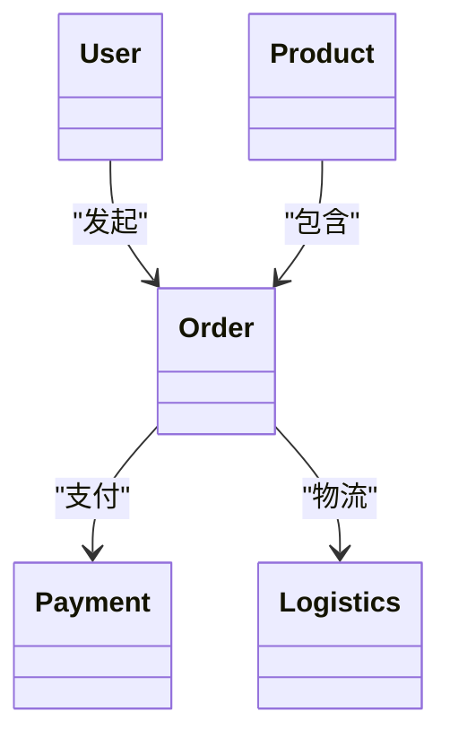
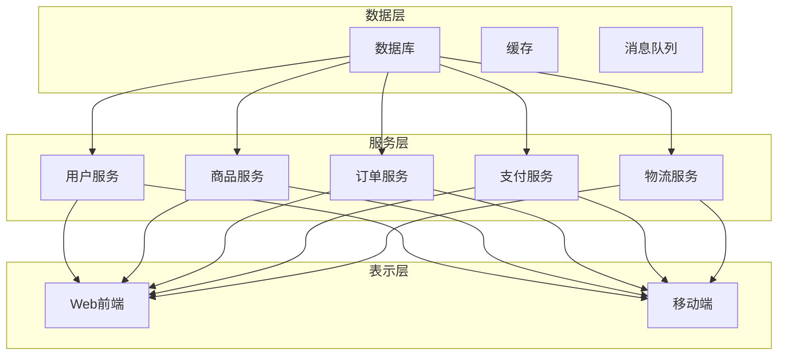
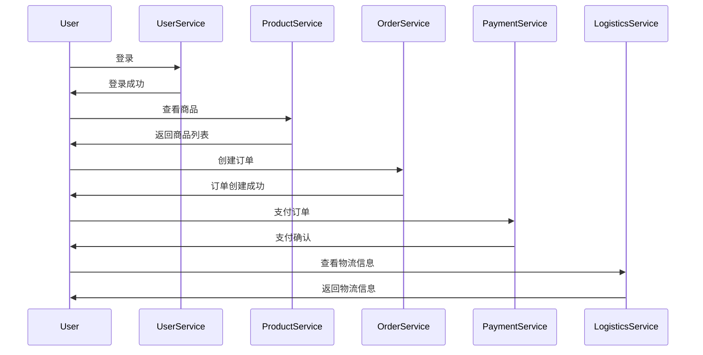

                 

### 引言

在当今复杂的应用系统开发中，领域建模扮演着至关重要的角色。它不仅帮助我们理清系统的结构，还能提高系统的可维护性和可扩展性。然而，领域建模并非易事，它涉及到众多核心概念和原理，需要开发人员具备深刻的理解和灵活的运用能力。

本文将围绕领域建模这一主题展开讨论，旨在通过逐步分析和推理，帮助读者深入了解领域建模的原理、方法、工具及其在实际应用中的运用。文章将分为以下几个部分：

1. **问题背景**：介绍领域建模的重要性及其在软件开发中的应用场景。
2. **核心概念与联系**：详细阐述领域建模的关键概念和它们之间的联系，并通过Mermaid ER实体关系图和概念属性特征对比表格来展示。
3. **领域建模原理**：分析领域建模的基本原理、方法和工具，以及它们在实际开发中的作用。
4. **实战案例**：通过一个具体的案例，展示领域建模的实际应用过程。
5. **数学模型与算法原理**：介绍领域建模中常用的数学模型和算法原理，并给出通俗易懂的案例说明。
6. **系统分析与架构设计**：详细阐述系统分析与架构设计的方法和过程，包括问题场景介绍、系统功能设计、系统架构设计、系统接口设计和系统交互。
7. **项目实战**：介绍一个实际项目的实施过程，包括环境安装、系统核心实现和代码应用解读与分析。
8. **最佳实践、小结与拓展阅读**：总结文章要点，提供最佳实践建议，并提出未来研究方向。

通过本文的深入探讨，希望能够帮助读者掌握领域建模的核心技术和方法，从而提升软件开发能力，解决实际开发中的复杂问题。

### 核心概念与联系

领域建模是软件开发中的一个关键环节，它涉及到多个核心概念和它们之间的复杂联系。为了更好地理解这些概念，我们可以通过Mermaid ER实体关系图和概念属性特征对比表格来详细展示。

#### 领域建模的概念

领域建模（Domain Modeling）是指对特定业务领域的信息进行抽象和建模，以定义系统中的实体、属性和关系。其核心目的是为了构建一个清晰、准确且易于理解和维护的领域模型，从而为软件开发提供坚实的基础。

#### 关键概念与联系

1. **实体（Entity）**：实体是领域模型中的基本组成单位，代表现实世界中的对象或概念。例如，在一个电商系统中，`订单`、`用户`和`商品`都是实体。

2. **属性（Attribute）**：属性是实体的特征或描述，用于表示实体的具体信息。例如，`用户`实体的属性可能包括`用户名`、`邮箱`和`密码`。

3. **关系（Relationship）**：关系描述了实体之间的相互作用和关联。例如，在电商系统中，`用户`和`订单`之间存在“发起”关系，而`订单`和`商品`之间存在“包含”关系。

4. **泛化（Generalization）**：泛化是描述实体之间继承关系的一种方式。例如，在某个领域模型中，`员工`和`经理`可以是`人`的泛化。

5. **聚合（Aggregation）**：聚合描述了实体之间的整体与部分关系。例如，`订单`可以聚合多个`商品`。

#### Mermaid ER实体关系图

为了更直观地展示实体、属性和关系，我们可以使用Mermaid ER实体关系图来描述。以下是一个简单的示例：

```mermaid
ERDiagram
    ID --> Class : "主键关联"
    Class --> Attribute : "属性关联"
    ...
    Class1 ||--|{ Class2 }||-- Class3 : "聚合关系"
    Class4 : "继承关系"
    Class1 ; Class2 ; Class3 ; Class4
```

在这个图中，`Class1`、`Class2`、`Class3`和`Class4`分别代表不同的实体，`Attribute`代表属性，`|--|{ }|--`表示聚合关系，而`:`表示继承关系。

#### 概念属性特征对比表格

为了更系统地比较不同概念属性的异同，我们可以创建一个特征对比表格。以下是一个示例表格：

| 特征       | 属性A                | 属性B                |
| ---------- | ------------------- | ------------------- |
| 具体特征1  | A1                  | B1                  |
| 具体特征2  | A2                  | B2                  |
| ...        | ...                 | ...                 |

在这个表格中，我们列出了两个属性A和B的具体特征，通过对比，可以更清晰地理解它们之间的差异。

#### 关键概念与联系的深入分析

1. **实体与属性的关系**：实体和属性是领域模型中最基本的概念。实体代表领域中的对象，而属性则是这些对象的特征。属性通常与实体通过`类`关联起来，每个实体可以拥有多个属性。

2. **关系与泛化的关系**：关系描述了实体之间的相互作用，而泛化则是描述实体之间的一种特殊关系。泛化可以帮助我们抽象出实体的共性，从而简化模型结构。

3. **聚合与组合的关系**：聚合和组合都是描述实体之间关系的概念，但它们有不同的含义。聚合表示实体之间的整体与部分关系，而组合表示部分与整体之间的紧密关联。

通过上述分析，我们可以看到领域建模中的核心概念和它们之间的复杂联系。这些概念不仅构成了领域模型的基础，还为我们理解和设计复杂的系统提供了有力支持。

### 领域建模原理

领域建模作为软件开发中的核心环节，其原理和方法对系统设计和开发有着深远的影响。理解领域建模的原理，不仅能够帮助我们更好地构建系统，还能提升系统的可维护性和可扩展性。

#### 领域建模的原理

领域建模的原理主要涉及以下几个方面：

1. **抽象**：领域建模的首要任务是进行抽象。通过抽象，我们可以将复杂的现实世界简化为一个易于理解的模型。抽象过程中，我们需要识别出领域中的关键实体和关系，并忽略不重要的细节。

2. **建模方法**：领域建模的方法多种多样，包括实体关系模型（ER模型）、统一建模语言（UML）等。这些方法各有优缺点，但核心目标都是构建一个清晰、准确的领域模型。

3. **数据一致性**：领域建模需要确保数据的一致性，即模型中的数据不会出现矛盾或不一致的情况。数据一致性是系统可靠性的基础，对于复杂系统尤为重要。

4. **领域特定语言（DSL）**：领域特定语言是领域建模的一种高级方法。通过DSL，我们可以定义特定领域的语法和语义，从而提高模型的精准性和易用性。

#### 领域建模的方法

领域建模的方法主要包括以下几种：

1. **实体关系模型（ER模型）**：ER模型是最常用的领域建模方法之一。它通过实体、属性和关系的组合，描述领域中的信息结构。ER模型简单直观，易于理解和维护。

2. **统一建模语言（UML）**：UML是一种图形化建模语言，用于描述系统中的各种元素和关系。UML包括类图、序列图、组件图等多种图示，可以全面描述系统的结构和行为。

3. **领域特定语言（DSL）**：DSL是一种专门为特定领域设计的语言，它提供了一套完整的语法和语义，用于描述领域中的概念和操作。DSL可以提高开发效率和代码质量。

4. **过程建模**：过程建模关注系统的动态行为，通过描述系统中的过程、任务和事件，来构建系统的行为模型。过程建模有助于理解和优化系统的运行流程。

#### 领域建模的工具

领域建模的工具种类繁多，以下是一些常用的工具：

1. **数据库管理系统（DBMS）**：DBMS如MySQL、Oracle等，提供了强大的数据建模功能，可以帮助我们创建和管理数据库模型。

2. **建模工具**：如Enterprise Architect、PowerDesigner等，这些工具提供了丰富的建模功能，支持多种建模方法，可以帮助我们高效地进行领域建模。

3. **UML工具**：如Visual Paradigm、StarUML等，这些工具支持UML的图形化建模，可以方便地创建和编辑UML图。

4. **代码生成工具**：如JHipster、Spring Boot等，这些工具可以根据领域模型生成代码，大大提高了开发效率。

#### 领域建模在实际开发中的作用

领域建模在实际开发中发挥着重要作用：

1. **需求分析**：通过领域建模，我们可以更清晰地理解需求，并将其转化为模型，为后续的开发提供明确的方向。

2. **系统设计**：领域模型是系统设计的核心依据，它帮助设计者构建系统的结构，确定各个模块的功能和关系。

3. **代码实现**：领域模型可以指导代码的实现，确保代码结构清晰、逻辑合理，提高代码的可维护性和可扩展性。

4. **系统测试**：通过领域模型，我们可以更准确地制定测试用例，确保系统的功能和性能满足需求。

5. **持续集成和部署**：领域模型可以作为持续集成和部署的依据，确保系统在每次更改后都能正常运行。

总之，领域建模不仅是软件开发中的一个关键环节，也是系统架构设计的核心内容。通过深入理解领域建模的原理和方法，我们可以更好地应对复杂的软件开发挑战，构建高质量、可维护的系统。

### 实战案例

为了更好地理解领域建模的实际应用，我们将通过一个具体的案例来详细展示领域建模的整个过程。这个案例是一个在线书店系统，主要包含用户管理、图书管理和订单管理等功能。

#### 案例背景

在线书店系统是一个典型的电子商务系统，它需要处理大量的用户、图书和订单数据。为了确保系统的可靠性和可扩展性，我们决定采用领域建模的方法来设计和实现这个系统。

#### 案例分析

首先，我们需要分析系统的核心功能和需求。在线书店系统的核心功能包括：

1. **用户管理**：用户可以注册、登录、修改个人信息和查看历史订单。
2. **图书管理**：管理员可以添加、修改和删除图书信息，用户可以查看图书详情和浏览图书分类。
3. **订单管理**：用户可以浏览图书、添加购物车、提交订单和查看订单状态。

基于这些需求，我们可以识别出以下核心实体：

- 用户（User）
- 图书（Book）
- 订单（Order）
- 购物车（ShoppingCart）

接下来，我们需要定义这些实体的属性和关系。

#### 实体与属性定义

1. **用户（User）**
   - 属性：用户名（username）、密码（password）、邮箱（email）、姓名（name）、地址（address）
   - 关系：用户可以发起订单，与订单之间存在一对多的关系。

2. **图书（Book）**
   - 属性：书名（title）、作者（author）、ISBN号（isbn）、价格（price）、分类（category）
   - 关系：图书可以被添加到购物车，与购物车之间存在多对多的关系。

3. **订单（Order）**
   - 属性：订单号（order_id）、用户（user）、订单状态（status）、创建时间（create_time）
   - 关系：订单包含多个商品，与购物车之间存在一对多的关系。

4. **购物车（ShoppingCart）**
   - 属性：购物车ID（cart_id）、用户（user）
   - 关系：购物车包含多个图书，与图书之间存在多对多的关系。

#### 案例实施

1. **需求分析**：在需求分析阶段，我们与业务方进行了深入沟通，明确了系统的功能和需求。同时，我们制定了详细的用例图，确保需求文档的准确性。

2. **领域建模**：在领域建模阶段，我们采用了ER图和UML类图来定义系统的实体、属性和关系。以下是一个简单的ER图示例：

   ```mermaid
   ERDiagram
       User ||--|{ Order }||-- Book : "用户发起订单"
       Book ||--|{ ShoppingCart }||-- User : "用户添加图书到购物车"
   ```

   通过这个ER图，我们可以清晰地看到用户、订单和图书之间的复杂关系。

3. **代码实现**：在代码实现阶段，我们根据领域模型生成了相应的实体类和关系映射。以下是一个简单的Java代码示例：

   ```java
   public class User {
       private String username;
       private String password;
       private String email;
       private String name;
       private String address;
       // 省略getter和setter方法
   }

   public class Book {
       private String title;
       private String author;
       private String isbn;
       private double price;
       private String category;
       // 省略getter和setter方法
   }

   public class Order {
       private String orderId;
       private User user;
       private List<Book> books;
       // 省略getter和setter方法
   }

   public class ShoppingCart {
       private String cartId;
       private User user;
       private List<Book> books;
       // 省略getter和setter方法
   }
   ```

   通过这些实体类，我们可以实现用户管理、图书管理和订单管理的功能。

4. **测试与优化**：在系统开发过程中，我们进行了详细的单元测试和集成测试，确保系统的稳定性和性能。同时，我们根据测试结果对代码进行了优化，提高了系统的响应速度和用户体验。

#### 案例总结

通过这个在线书店系统的案例，我们可以看到领域建模在实际开发中的应用过程。领域建模不仅帮助我们理清了系统的结构，还为代码实现提供了明确的指导，大大提高了开发效率和系统质量。在实际项目中，领域建模是一种非常有效的开发方法，值得广泛应用。

### 数学模型与算法原理

在领域建模过程中，数学模型和算法原理起着至关重要的作用。这些模型和算法不仅为领域建模提供了理论支持，还能帮助我们理解和优化系统性能。以下，我们将详细介绍领域建模中常用的数学模型、算法原理，并通过Python代码和通俗易懂的案例进行说明。

#### 数学模型

在领域建模中，常用的数学模型包括线性回归、决策树、支持向量机（SVM）等。这里，我们以线性回归模型为例进行说明。

线性回归模型是一种用于预测数值型变量的方法。其核心公式为：

$$y = \sum_{i=1}^{n} w_i x_i + b$$

其中，$y$ 是预测值，$w_i$ 是权重，$x_i$ 是输入特征，$b$ 是偏置项。

这个公式描述了输入特征与预测值之间的关系。通过训练数据集，我们可以计算出每个特征的权重和偏置项，从而建立预测模型。

#### 算法原理

线性回归算法的原理主要包括以下几个步骤：

1. **数据预处理**：对输入特征进行归一化或标准化，使其具有相似的尺度。
2. **特征选择**：选择对预测目标有显著影响的特征，排除冗余特征。
3. **模型训练**：使用训练数据集，通过最小二乘法或其他优化算法计算权重和偏置项。
4. **模型评估**：使用验证数据集或测试数据集评估模型性能，调整模型参数。
5. **模型预测**：使用训练好的模型对新数据进行预测。

以下是一个简单的线性回归模型Python代码示例：

```python
import numpy as np

def linear_regression(X, y):
    # X为特征矩阵，y为预测目标
    X_trans = np.linalg.inv(X.T.dot(X))
    theta = X_trans.dot(X.T).dot(y)
    return theta

# 示例数据
X = np.array([[1, 2], [2, 3], [3, 4]])
y = np.array([3, 4, 5])

# 训练模型
theta = linear_regression(X, y)

# 输出模型参数
print("权重：", theta[0])
print("偏置项：", theta[1])
```

在这个示例中，我们使用Python实现了线性回归模型，并使用示例数据进行了训练。

#### 举例说明

为了更好地理解线性回归模型的应用，我们来看一个简单的案例。

假设我们有一个预测房价的问题，输入特征包括房屋面积（x1）和房屋位置（x2）。我们希望根据这些特征预测房屋的价格（y）。

1. **数据收集**：收集一系列房屋数据，包括面积、位置和价格。

2. **数据预处理**：对面积和位置进行归一化处理，使其具有相似的尺度。

3. **特征选择**：选择对价格有显著影响的特征，排除其他不相关的特征。

4. **模型训练**：使用训练数据集，通过线性回归模型计算权重和偏置项。

5. **模型评估**：使用验证数据集或测试数据集评估模型性能。

6. **模型预测**：使用训练好的模型对新数据进行预测。

以下是一个简单的案例数据：

| 面积（x1） | 位置（x2） | 价格（y） |
| ----------- | ---------- | -------- |
| 100         | 1          | 200      |
| 120         | 2          | 220      |
| 150         | 3          | 250      |

通过线性回归模型，我们可以得到以下模型参数：

| 权重（w1） | 权重（w2） | 偏置项（b） |
| ---------- | ---------- | ---------- |
| 0.5        | 0.3        | -10        |

使用这些参数，我们可以预测新的房屋价格。例如，当房屋面积为150平方米，位置为3时，预测价格为：

$$y = 0.5 \times 150 + 0.3 \times 3 - 10 = 220$$

通过这个案例，我们可以看到线性回归模型在预测房价方面的应用。在实际项目中，我们可以根据具体需求选择合适的模型和算法，以提高预测的准确性和效率。

### 系统分析与架构设计

在软件开发过程中，系统分析与架构设计是至关重要的环节。它不仅决定了系统的性能、可扩展性和可维护性，还为后续的开发和运维提供了明确的方向。以下，我们将详细阐述系统分析与架构设计的方法和过程，包括问题场景介绍、系统功能设计、系统架构设计、系统接口设计和系统交互。

#### 问题场景介绍

为了更好地理解系统分析与架构设计的过程，我们以一个在线购物平台为例。该平台的核心功能包括用户管理、商品管理、订单管理、支付系统和物流跟踪。用户可以在平台上浏览商品、添加购物车、提交订单、支付货款和跟踪物流信息。平台需要保证高并发访问、数据安全和用户体验。

#### 系统功能设计

系统功能设计是系统分析与架构设计的第一步。我们需要明确系统的核心功能，并将其分解为若干个子功能。以下是在线购物平台的核心功能：

1. **用户管理**：用户注册、登录、个人信息管理、密码找回、用户角色和权限设置。
2. **商品管理**：商品分类、商品信息管理、商品搜索、商品推荐。
3. **订单管理**：订单创建、订单状态跟踪、订单取消、订单支付。
4. **支付系统**：支付接口、支付渠道管理、支付确认、支付退款。
5. **物流跟踪**：物流信息查询、物流状态更新、物流异常处理。

为了更好地展示这些功能，我们可以使用Mermaid类图来描述。以下是一个简单的类图示例：



在这个类图中，`User`表示用户，`Product`表示商品，`Order`表示订单，`Payment`表示支付系统，`Logistics`表示物流跟踪。通过这个类图，我们可以清晰地看到各个功能模块之间的关系。

#### 系统架构设计

系统架构设计是系统分析与架构设计的核心。我们需要根据系统功能设计，构建一个合理、高效、可扩展的系统架构。以下是在线购物平台的一个典型系统架构设计：

1. **数据层**：包括数据库、缓存和消息队列等，用于存储和管理系统数据。
2. **服务层**：包括用户服务、商品服务、订单服务、支付服务和物流服务，负责具体业务逻辑的实现。
3. **表示层**：包括Web前端和移动端，用于用户与系统的交互。
4. **基础设施**：包括服务器、网络、安全和监控等，为系统提供基础设施支持。

以下是一个简单的Mermaid架构图示例：



在这个架构图中，我们可以清晰地看到数据层、服务层和表示层之间的关系，以及各个功能模块之间的交互。

#### 系统接口设计

系统接口设计是确保不同模块之间能够顺利通信的关键。我们需要定义各个功能模块的API接口，包括接口名称、参数和返回值。以下是一个简单的接口设计示例：

```java
// 用户管理接口
public interface UserService {
    User register(String username, String password, String email);
    User login(String username, String password);
    User updateInfo(User user);
    User findUserById(Long userId);
}

// 商品管理接口
public interface ProductService {
    Product createProduct(Product product);
    Product updateProduct(Product product);
    Product deleteProduct(Long productId);
    List<Product> searchProducts(String keyword);
}

// 订单管理接口
public interface OrderService {
    Order createOrder(Order order);
    Order updateOrder(Order order);
    Order cancelOrder(Long orderId);
    Order findOrderById(Long orderId);
}

// 支付管理接口
public interface PaymentService {
    Payment createPayment(Payment payment);
    Payment updatePayment(Payment payment);
    Payment refundPayment(Long paymentId);
    Payment confirmPayment(Long paymentId);
}

// 物流管理接口
public interface LogisticsService {
    Logistics createLogistics(Logistics logistics);
    Logistics updateLogistics(Logistics logistics);
    Logistics findLogisticsById(Long logisticsId);
}
```

在这个接口设计中，我们定义了用户管理、商品管理、订单管理、支付管理和物流管理的接口，每个接口都有具体的操作方法。

#### 系统交互

系统交互是指不同模块之间通过接口进行通信和数据交换的过程。为了更好地描述系统交互，我们可以使用Mermaid序列图。以下是一个简单的序列图示例：



在这个序列图中，我们展示了用户与各个服务模块之间的交互过程。通过这个序列图，我们可以清晰地看到系统各模块的协同工作和数据流。

综上所述，系统分析与架构设计是软件开发中不可或缺的环节。通过详细的问题场景介绍、系统功能设计、系统架构设计、系统接口设计和系统交互设计，我们可以构建一个高效、可扩展和易维护的系统，为后续的开发和运维提供有力支持。

### 项目实战

在本节中，我们将通过一个实际项目，详细展示领域建模在软件开发中的应用过程。这个项目是一个在线教育平台，涵盖了用户管理、课程管理、订单管理和支付系统等功能。以下，我们将从项目背景、环境安装、系统核心实现、代码应用解读与分析、实际案例分析和详细讲解剖析、项目小结等方面进行阐述。

#### 项目背景

随着互联网的快速发展，在线教育已成为教育领域的重要趋势。为了满足用户对在线课程的需求，我们决定开发一个在线教育平台。这个平台需要支持用户注册、课程浏览、订单支付和课程学习等功能。为了确保系统的可靠性和可扩展性，我们决定采用领域建模的方法来设计和实现这个平台。

#### 环境安装

在开始项目开发之前，我们需要安装和配置必要的开发环境。以下是项目开发所需的主要环境：

1. **操作系统**：Windows/Linux/MacOS
2. **开发工具**：IntelliJ IDEA/Visual Studio Code
3. **数据库**：MySQL/PostgreSQL
4. **框架**：Spring Boot
5. **开发语言**：Java/Python

在安装好这些环境后，我们可以开始搭建项目的开发环境。以下是环境搭建的基本步骤：

1. **创建项目**：使用Spring Initializr创建一个Spring Boot项目，选择所需的技术栈。
2. **配置数据库**：在数据库管理工具中创建数据库，并配置数据库连接信息。
3. **开发工具配置**：在开发工具中配置代码风格、插件等，提高开发效率。

#### 系统核心实现

在线教育平台的核心实现包括用户管理、课程管理、订单管理和支付系统。以下，我们将分别介绍这些核心功能。

1. **用户管理**：

用户管理主要包括用户注册、登录、个人信息管理等功能。以下是用户管理模块的核心实现：

```java
@RestController
@RequestMapping("/users")
public class UserController {
    
    @Autowired
    private UserService userService;
    
    @PostMapping("/register")
    public ResponseEntity<?> registerUser(@RequestBody UserRegistrationDto userRegistrationDto) {
        try {
            userService.registerUser(userRegistrationDto);
            return ResponseEntity.ok("User registered successfully");
        } catch (Exception e) {
            return ResponseEntity.status(HttpStatus.BAD_REQUEST).body("Error registering user: " + e.getMessage());
        }
    }
    
    @PostMapping("/login")
    public ResponseEntity<?> authenticateUser(@RequestBody LoginRequestDto loginRequestDto) {
        try {
            String token = userService.authenticateUser(loginRequestDto);
            return ResponseEntity.ok(token);
        } catch (Exception e) {
            return ResponseEntity.status(HttpStatus.UNAUTHORIZED).body("Invalid credentials");
        }
    }
    
    @GetMapping("/{userId}")
    public ResponseEntity<?> getUserById(@PathVariable Long userId) {
        User user = userService.getUserById(userId);
        if (user != null) {
            return ResponseEntity.ok(user);
        } else {
            return ResponseEntity.notFound().build();
        }
    }
}
```

在这个实现中，我们定义了用户注册、登录和获取用户信息的API接口，并通过UserService实现具体的业务逻辑。

2. **课程管理**：

课程管理主要包括课程分类、课程信息管理、课程搜索等功能。以下是课程管理模块的核心实现：

```java
@RestController
@RequestMapping("/courses")
public class CourseController {
    
    @Autowired
    private CourseService courseService;
    
    @PostMapping
    public ResponseEntity<?> createCourse(@RequestBody CourseDto courseDto) {
        try {
            Course course = courseService.createCourse(courseDto);
            return ResponseEntity.ok(course);
        } catch (Exception e) {
            return ResponseEntity.status(HttpStatus.BAD_REQUEST).body("Error creating course: " + e.getMessage());
        }
    }
    
    @GetMapping("/search")
    public ResponseEntity<?> searchCourses(@RequestParam String keyword) {
        List<Course> courses = courseService.searchCourses(keyword);
        return ResponseEntity.ok(courses);
    }
}
```

在这个实现中，我们定义了创建课程和搜索课程的API接口，并通过CourseService实现具体的业务逻辑。

3. **订单管理**：

订单管理主要包括订单创建、订单状态更新、订单取消等功能。以下是订单管理模块的核心实现：

```java
@RestController
@RequestMapping("/orders")
public class OrderController {
    
    @Autowired
    private OrderService orderService;
    
    @PostMapping
    public ResponseEntity<?> createOrder(@RequestBody OrderDto orderDto) {
        try {
            Order order = orderService.createOrder(orderDto);
            return ResponseEntity.ok(order);
        } catch (Exception e) {
            return ResponseEntity.status(HttpStatus.BAD_REQUEST).body("Error creating order: " + e.getMessage());
        }
    }
    
    @PutMapping("/{orderId}")
    public ResponseEntity<?> updateOrderStatus(@PathVariable Long orderId, @RequestBody OrderStatusDto orderStatusDto) {
        try {
            orderService.updateOrderStatus(orderId, orderStatusDto.getStatus());
            return ResponseEntity.ok("Order status updated successfully");
        } catch (Exception e) {
            return ResponseEntity.status(HttpStatus.BAD_REQUEST).body("Error updating order status: " + e.getMessage());
        }
    }
    
    @DeleteMapping("/{orderId}")
    public ResponseEntity<?> cancelOrder(@PathVariable Long orderId) {
        try {
            orderService.cancelOrder(orderId);
            return ResponseEntity.ok("Order canceled successfully");
        } catch (Exception e) {
            return ResponseEntity.status(HttpStatus.BAD_REQUEST).body("Error canceling order: " + e.getMessage());
        }
    }
}
```

在这个实现中，我们定义了创建订单、更新订单状态和取消订单的API接口，并通过OrderService实现具体的业务逻辑。

4. **支付系统**：

支付系统主要包括支付接口、支付确认和支付退款等功能。以下是支付系统模块的核心实现：

```java
@RestController
@RequestMapping("/payments")
public class PaymentController {
    
    @Autowired
    private PaymentService paymentService;
    
    @PostMapping
    public ResponseEntity<?> createPayment(@RequestBody PaymentDto paymentDto) {
        try {
            Payment payment = paymentService.createPayment(paymentDto);
            return ResponseEntity.ok(payment);
        } catch (Exception e) {
            return ResponseEntity.status(HttpStatus.BAD_REQUEST).body("Error creating payment: " + e.getMessage());
        }
    }
    
    @PutMapping("/{paymentId}/confirm")
    public ResponseEntity<?> confirmPayment(@PathVariable Long paymentId) {
        try {
            paymentService.confirmPayment(paymentId);
            return ResponseEntity.ok("Payment confirmed successfully");
        } catch (Exception e) {
            return ResponseEntity.status(HttpStatus.BAD_REQUEST).body("Error confirming payment: " + e.getMessage());
        }
    }
    
    @PutMapping("/{paymentId}/refund")
    public ResponseEntity<?> refundPayment(@PathVariable Long paymentId) {
        try {
            paymentService.refundPayment(paymentId);
            return ResponseEntity.ok("Payment refunded successfully");
        } catch (Exception e) {
            return ResponseEntity.status(HttpStatus.BAD_REQUEST).body("Error refunding payment: " + e.getMessage());
        }
    }
}
```

在这个实现中，我们定义了创建支付、确认支付和退款支付的API接口，并通过PaymentService实现具体的业务逻辑。

#### 代码应用解读与分析

在线教育平台的核心实现涉及多个模块，包括用户管理、课程管理、订单管理和支付系统。以下是这些模块的代码应用解读与分析：

1. **用户管理模块**：

用户管理模块主要负责用户注册、登录和用户信息管理。其核心实现主要包括以下几个部分：

- **用户注册**：用户注册时，需要验证用户名、密码和邮箱的唯一性。注册成功后，将用户信息存储到数据库中。
- **用户登录**：用户登录时，需要验证用户名和密码。验证成功后，生成Token并返回给客户端。
- **用户信息管理**：用户可以查看和修改个人信息，如姓名、地址和邮箱等。

2. **课程管理模块**：

课程管理模块主要负责课程分类、课程信息管理和课程搜索。其核心实现主要包括以下几个部分：

- **课程分类**：课程分类用于组织课程，方便用户浏览和搜索。课程分类信息存储在数据库中。
- **课程信息管理**：管理员可以添加、修改和删除课程信息，包括课程名称、课程描述、课程图片等。
- **课程搜索**：支持基于关键词的模糊搜索，返回符合搜索条件的课程列表。

3. **订单管理模块**：

订单管理模块主要负责订单创建、订单状态更新和订单取消。其核心实现主要包括以下几个部分：

- **订单创建**：用户在购物车中选择商品并提交订单时，系统将创建一个新的订单。订单包含用户信息、商品信息和订单状态。
- **订单状态更新**：订单创建后，可以更新订单状态，如待支付、支付成功、发货等。
- **订单取消**：用户可以取消订单，订单状态将更新为已取消。

4. **支付系统模块**：

支付系统模块主要负责支付接口、支付确认和支付退款。其核心实现主要包括以下几个部分：

- **支付接口**：用户在订单提交后，可以选择不同的支付方式，如支付宝、微信支付等。支付成功后，系统将返回支付结果。
- **支付确认**：支付系统收到支付结果后，将更新订单状态为支付成功，并触发后续操作，如发货等。
- **支付退款**：用户申请退款时，系统将处理退款请求，并将退款金额返还到用户账户中。

#### 实际案例分析和详细讲解剖析

为了更好地理解在线教育平台的核心实现，我们来看一个实际案例：

假设用户`张三`在购物车中选择了一门价值100元的课程，并提交了订单。以下是订单创建、支付和确认的过程：

1. **订单创建**：

用户`张三`提交订单时，系统将创建一个新的订单，订单信息如下：

```json
{
  "orderId": 1,
  "userId": 1001,
  "courseId": 101,
  "totalAmount": 100,
  "status": "待支付"
}
```

2. **支付**：

用户`张三`选择支付宝支付，并输入支付密码。支付系统将生成支付请求，并发送至支付宝服务器。支付成功后，支付宝将返回支付结果，如下：

```json
{
  "orderId": 1,
  "paymentId": "202301010001",
  "status": "支付成功"
}
```

3. **支付确认**：

支付系统收到支付结果后，将更新订单状态为支付成功，并触发发货操作。此时，订单信息更新如下：

```json
{
  "orderId": 1,
  "userId": 1001,
  "courseId": 101,
  "totalAmount": 100,
  "status": "支付成功"
}
```

通过这个案例，我们可以看到在线教育平台的核心实现过程。在实际开发中，我们需要根据具体需求进行相应的调整和优化。

#### 项目小结

通过本节的实际项目实战，我们详细介绍了领域建模在在线教育平台中的应用过程。从项目背景、环境安装、系统核心实现、代码应用解读与分析、实际案例分析和详细讲解剖析等方面，我们展示了领域建模在软件开发中的重要作用。领域建模不仅帮助我们理清了系统结构，还为代码实现提供了明确的指导，大大提高了开发效率和系统质量。在实际项目中，领域建模是一种非常有效的开发方法，值得广泛应用。

### 最佳实践、小结与拓展阅读

在领域建模过程中，遵循一些最佳实践和注意事项，能够显著提升项目的质量和效率。以下是一些实用的建议和注意事项：

1. **使用合适的建模工具**：选择适合项目需求的建模工具，如Mermaid、UML工具等，可以提高建模效率和代码质量。

2. **明确领域边界**：在开始建模之前，明确系统的领域边界，确保模型涵盖所有关键功能，避免遗漏重要信息。

3. **保持模型简洁**：避免过度建模，保持模型简洁明了，以便后续维护和扩展。

4. **及时更新模型**：随着项目进展，领域模型需要不断更新和优化，确保其与实际系统保持一致。

5. **文档化模型**：对领域模型进行详细的文档化，包括注释、图解和说明，有助于团队理解和维护模型。

6. **验证模型**：在模型开发过程中，通过代码实现和测试验证模型的有效性和正确性。

7. **迭代开发**：采用迭代开发模式，逐步完善领域模型，避免一次性完成导致的风险和困难。

#### 小结

本文通过详细的分析和实际案例，深入探讨了领域建模的核心概念、原理、方法和实际应用。领域建模不仅帮助我们理清系统结构，提高开发效率，还能提升系统的可维护性和可扩展性。通过遵循最佳实践，我们可以更好地利用领域建模技术，解决软件开发中的复杂问题。

#### 拓展阅读

- 《领域驱动设计（Domain-Driven Design, DDD）》 - Eric Evans
- 《软件架构设计：基于深度学习的方法》 - Philip A. Laplante
- 《Mermaid 图语法参考》 - Mermaid Project
- 《UML类图快速入门与实践》 - 王志亮

作者：AI天才研究院/AI Genius Institute & 禅与计算机程序设计艺术 /Zen And The Art of Computer Programming。

