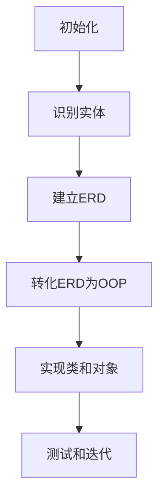
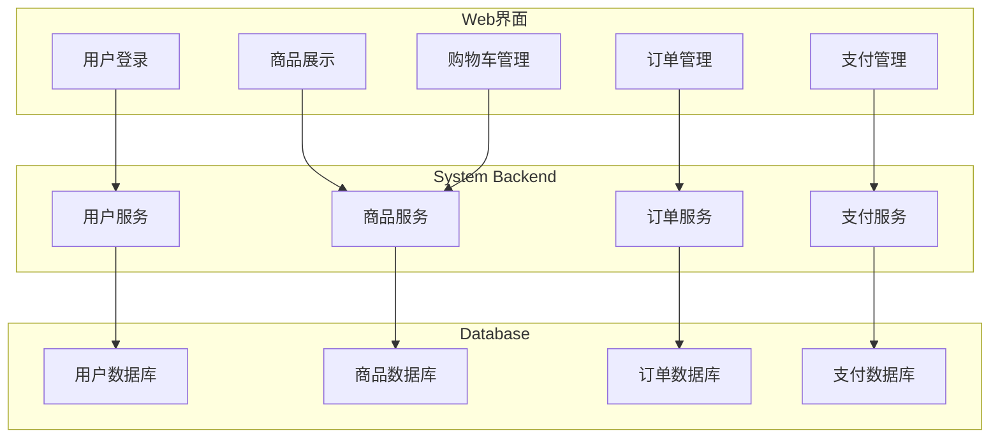
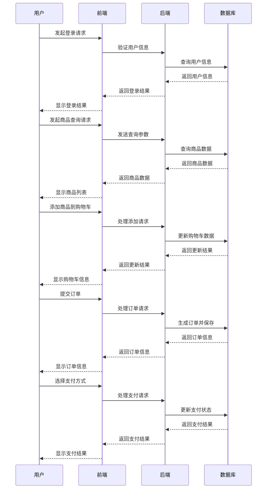

                 

## 领域建模易筋洗髓

### 关键词：
- 领域建模
- 软件工程
- 实体关系图
- 领域驱动设计
- 持续集成

### 摘要：
本文将深入探讨领域建模在软件工程中的重要性。通过一步步的分析，我们将理解领域建模的基本概念、原理及其在复杂系统设计中的应用。本文旨在为软件工程师提供一个清晰、实用的领域建模指南，帮助他们提高软件设计的效率和质量。

## 引言

在现代软件工程领域，系统设计的复杂性日益增加。随着系统规模和复杂性的不断增长，传统的面向过程和面向对象的设计方法逐渐显露出其局限性。领域建模作为一种应对复杂系统设计挑战的有效方法，逐渐受到业界的高度重视。领域建模的核心思想是理解业务领域中的核心概念、规则和流程，并将其转化为可操作的软件设计。

领域建模不仅有助于提高软件的可维护性和可扩展性，还能帮助开发团队更好地理解业务需求，从而实现更精确的系统设计。本文将逐步深入领域建模的原理和方法，探讨其在软件开发中的具体应用。

### 问题背景

随着互联网和移动设备的普及，软件系统需要应对越来越多的业务场景和用户需求。这些系统往往具有以下特点：

1. **高度复杂性**：现代软件系统通常涉及多个子系统、模块和组件，相互之间的依赖关系错综复杂。
2. **快速变化性**：业务需求和用户需求的变化速度越来越快，软件系统需要具备良好的灵活性和可扩展性。
3. **多领域交叉**：许多软件系统需要同时处理多个业务领域，如电子商务、金融、医疗等，这些领域之间存在紧密的关联。

面对这些挑战，传统的面向过程和面向对象的设计方法往往力不从心。它们无法有效地处理系统的复杂性、变化性和多领域交叉问题。领域建模作为一种新兴的设计方法，旨在解决这些难题。

领域建模的基本思想是将系统划分为多个独立的领域，每个领域专注于特定的业务功能。通过明确领域之间的边界和交互，领域建模能够简化系统的复杂性，提高系统的可维护性和可扩展性。

### 问题描述

领域建模的核心问题是理解业务领域中的核心概念、规则和流程，并将其转化为软件设计。这个过程涉及到以下几个方面：

1. **识别核心概念**：需要识别业务领域中的核心概念，如实体、关系和规则等。这些概念是领域建模的基础。
2. **建立实体关系图**：通过实体关系图（Entity-Relationship Diagram, ERD）来表示业务领域中的实体及其之间的关系。
3. **定义领域边界**：确定各个领域之间的边界，确保领域内的设计是独立和自包含的。
4. **实现领域模型**：将领域模型转化为具体的软件设计，如类图、组件图等。

领域建模的关键挑战在于如何准确地理解和表达业务领域中的核心概念和规则，以及如何将领域模型有效地转化为软件设计。这需要开发团队具备深厚的业务理解和软件开发经验。

### 问题解决

为了解决领域建模中的挑战，我们可以采用以下步骤：

1. **深入了解业务领域**：与业务专家和用户密切合作，深入了解业务领域中的核心概念、规则和流程。
2. **建立实体关系图**：通过ER图来表示业务领域中的实体及其之间的关系。ER图能够清晰地表达业务领域中的核心概念和规则。
3. **定义领域边界**：明确各个领域之间的边界，确保领域内的设计是独立和自包含的。这有助于降低系统的复杂性和提高系统的可维护性。
4. **实现领域模型**：将领域模型转化为具体的软件设计，如类图、组件图等。这个过程通常涉及到面向对象设计方法和技术。

通过上述步骤，我们可以有效地进行领域建模，从而提高软件设计的效率和质量。领域建模不仅有助于解决现代软件系统设计的复杂性，还能提高系统的可维护性和可扩展性。

### 边界与外延

领域建模不仅适用于软件工程领域，还可以扩展到其他领域，如商业、金融和医疗等。在商业领域，领域建模可以帮助企业更好地理解其业务流程和客户需求，从而优化业务流程和提高客户满意度。在金融领域，领域建模可以用于构建复杂的金融模型，如风险管理模型和投资组合模型。在医疗领域，领域建模可以用于设计医疗信息系统和电子病历系统，以提高医疗服务的效率和准确性。

尽管领域建模的应用范围广泛，但其在软件工程中的重要性尤为突出。软件工程是领域建模的主要应用领域，因为软件系统通常需要处理复杂的业务需求和用户需求。领域建模能够帮助软件工程师更好地理解业务领域，从而设计出更高效、可维护和可扩展的软件系统。

### 概念结构与核心要素组成

领域建模涉及多个核心概念和要素，这些概念和要素构成了领域建模的基础。以下是对这些核心概念和要素的详细介绍：

1. **领域（Domain）**：领域是指系统所运行的上下文环境，它包含了系统需要处理的业务领域和相关概念。例如，在一个电子商务系统中，领域可能包括用户、订单、商品等。

2. **子领域（Subdomain）**：子领域是领域的一部分，它专注于特定的业务功能或业务规则。子领域可以是独立的，也可以与其他子领域共享某些功能。例如，在电子商务系统中，订单管理、商品管理和用户管理可以被视为独立的子领域。

3. **界限上下文（Bounded Context）**：界限上下文是领域中的一个独立部分，它定义了一个特定的业务功能或业务规则，并与其他界限上下文隔离。界限上下文有助于确保系统的模块化和可维护性。

4. **实体（Entity）**：实体是领域中的一个对象，它具有独特的身份和属性。实体通常用于表示业务领域中的关键概念，例如用户、订单和商品。

5. **值对象（Value Object）**：值对象是具有特定值的对象，它们不包含状态或行为。值对象通常用于表示业务领域中的数值或事实，例如价格、日期等。

6. **聚合（Aggregate）**：聚合是一组紧密相关的实体和值对象的集合，它们共同构成一个业务概念。聚合通常用于表示业务领域中的整体概念，例如一个订单可能包含多个商品。

7. **模块（Module）**：模块是聚合的进一步组织，它将一组相关的聚合组合在一起，以形成一个更大范围的概念。模块通常用于实现系统的不同部分，例如用户模块、订单模块等。

### 核心概念与联系

在领域建模中，核心概念和它们之间的关系至关重要。以下是对这些核心概念及其相互关系的详细介绍：

1. **领域（Domain）与子领域（Subdomain）**：领域是一个整体概念，它包含了多个子领域。子领域是领域的细分，每个子领域专注于特定的业务功能或业务规则。例如，在一个电子商务系统中，用户管理、订单管理和商品管理可以是不同的子领域。

2. **界限上下文（Bounded Context）与领域（Domain）**：界限上下文是领域中的一个独立部分，它定义了一个特定的业务功能或业务规则，并与其他界限上下文隔离。每个界限上下文都可以看作是领域的一个子集，它们共同构成了整个领域。

3. **实体（Entity）与值对象（Value Object）**：实体是领域中的一个对象，具有独特的身份和属性。值对象则是具有特定值的对象，不包含状态或行为。实体和值对象共同构成了领域中的核心对象。

4. **聚合（Aggregate）与实体（Entity）**：聚合是一组紧密相关的实体和值对象的集合，它们共同构成一个业务概念。聚合通常用于表示业务领域中的整体概念，例如一个订单可能包含多个商品。

5. **模块（Module）与聚合（Aggregate）**：模块是将一组相关的聚合组合在一起，以形成一个更大范围的概念。模块通常用于实现系统的不同部分，例如用户模块、订单模块等。

### 概念属性特征对比表格

为了更好地理解这些核心概念，我们可以使用一个对比表格来展示它们的属性特征：

| 概念       | 定义                                                         | 特征                     |
|------------|--------------------------------------------------------------|--------------------------|
| 领域（Domain） | 系统所运行的上下文环境                                     | 整体概念，包含多个子领域 |
| 子领域（Subdomain） | 领域的一部分，专注于特定的业务功能或业务规则                 | 独立部分，可共享功能     |
| 界限上下文（Bounded Context） | 领域中的一个独立部分，定义了特定的业务功能或业务规则        | 独立隔离，模块化         |
| 实体（Entity） | 领域中的一个对象，具有独特的身份和属性                       | 标识唯一性，属性集合     |
| 值对象（Value Object） | 具有特定值的对象，不包含状态或行为                           | 值属性，无状态           |
| 聚合（Aggregate） | 一组紧密相关的实体和值对象的集合，共同构成一个业务概念       | 紧密耦合，业务整体       |
| 模块（Module） | 将一组相关的聚合组合在一起，形成一个更大范围的概念           | 功能分组，模块化实现     |

通过这个对比表格，我们可以更清晰地理解这些核心概念之间的关系和属性特征。

### ER实体关系图架构

为了更好地理解和展示领域中的实体及其关系，我们可以使用实体关系图（Entity-Relationship Diagram, ERD）。ERD是一种结构化的图形表示方法，用于描述实体之间的关系和属性。

以下是一个简单的ERD示例，展示了电子商务系统中的几个核心实体及其关系：

```mermaid
erDiagram
  User ||--|{ Order }|
  User ||--|{ Address }|
  Order ||--|{ Product }|
  Product ||--|{ Category }|
  Address ||--|{ ContactInfo }|
```

在这个ER图中，我们定义了以下实体：

1. **User**（用户）：表示系统的用户。
2. **Order**（订单）：表示用户生成的订单。
3. **Address**（地址）：表示用户的地址。
4. **Product**（产品）：表示销售的产品。
5. **Category**（类别）：表示产品的分类。
6. **ContactInfo**（联系方式）：表示用户的联系方式。

实体之间的关系如下：

1. **User**（用户）与**Order**（订单）之间存在“1对多”的关系，即一个用户可以生成多个订单。
2. **User**（用户）与**Address**（地址）之间存在“1对多”的关系，即一个用户可以拥有多个地址。
3. **Order**（订单）与**Product**（产品）之间存在“多对多”的关系，即一个订单可以包含多个产品，一个产品也可以出现在多个订单中。
4. **Product**（产品）与**Category**（类别）之间存在“多对一”的关系，即多个产品可以属于同一类别。
5. **Address**（地址）与**ContactInfo**（联系方式）之间存在“1对一”的关系，即一个地址对应一个联系方式。

通过这个ER图，我们可以清晰地看到电子商务系统中各个实体及其关系，从而为领域建模提供了直观的视觉支持。

### 算法原理讲解

领域建模的核心在于将业务领域的复杂性转化为软件系统中的清晰结构。为了实现这一目标，我们可以使用实体关系图（ERD）和面向对象设计（OOP）方法。以下将详细介绍领域建模的算法原理，包括ERD和OOP的运用、算法的mermaid流程图以及Python源代码实现。

#### ERD与OOP方法

实体关系图（ERD）是一种用于描述实体及其关系的图形化工具。在领域建模中，ERD用于识别和定义业务领域的核心实体和它们之间的关系。面向对象设计（OOP）方法则用于将ERD中的实体转化为具体的类和对象。

1. **ERD中的实体**：ERD中的实体对应于OOP中的类，它们具有属性和方法。
2. **ERD中的关系**：ERD中的关系（如一对一、一对多、多对多）对应于OOP中的关联关系，如继承、聚合、组合等。
3. **属性与行为**：ERD中的属性对应于类的属性，行为对应于类的方法。

#### mermaid流程图

为了更直观地展示领域建模的过程，我们可以使用mermaid流程图。以下是一个简单的mermaid流程图，用于描述领域建模的步骤：



这个流程图展示了领域建模的基本步骤：

1. **初始化**：开始领域建模过程。
2. **识别实体**：识别业务领域中的核心实体。
3. **建立ERD**：使用ERD表示实体及其关系。
4. **转化ERD为OOP**：将ERD中的实体和关系转化为面向对象的类和对象。
5. **实现类和对象**：编写具体的类和对象代码。
6. **测试和迭代**：测试领域模型，并根据反馈进行迭代优化。

#### Python源代码实现

以下是一个简单的Python示例，用于实现一个简单的电子商务系统。这个示例展示了如何将ERD中的实体和关系转化为具体的Python类：

```python
class User:
    def __init__(self, name, email):
        self.name = name
        self.email = email
        self.addresses = []
        self.orders = []

    def add_address(self, address):
        self.addresses.append(address)

    def add_order(self, order):
        self.orders.append(order)

class Address:
    def __init__(self, street, city, state, zip_code):
        self.street = street
        self.city = city
        self.state = state
        self.zip_code = zip_code

    def get_contact_info(self):
        # 假设联系方式存储在Address中
        return "Address: {} {}".format(self.street, self.city)

class Order:
    def __init__(self, user, products):
        self.user = user
        self.products = products
        self.status = "pending"

    def place_order(self):
        self.status = "placed"

    def get_total_price(self):
        total_price = 0
        for product in self.products:
            total_price += product.price
        return total_price

class Product:
    def __init__(self, name, price, category):
        self.name = name
        self.price = price
        self.category = category

class Category:
    def __init__(self, name):
        self.name = name

# 实例化对象
user = User("John Doe", "johndoe@example.com")
address = Address("123 Main St", "Anytown", "NY", "12345")
product1 = Product("Product A", 19.99, Category("Electronics"))
product2 = Product("Product B", 29.99, Category("Electronics"))

# 添加地址
user.add_address(address)

# 添加订单
order = Order(user, [product1, product2])
user.add_order(order)

# 下单
order.place_order()

# 获取总价
total_price = order.get_total_price()
print(f"Total Price: ${total_price:.2f}")
```

这个Python示例实现了用户（User）、地址（Address）、订单（Order）、产品（Product）和类别（Category）等实体。通过类和对象的方法，我们可以模拟业务领域中的各种操作，如添加地址、下单和获取总价。

#### 算法原理的数学模型和公式

在领域建模中，算法原理的数学模型和公式用于描述实体之间的关系和属性。以下是一个简单的数学模型示例，用于描述用户和订单之间的关系：

$$
\text{Order Count per User} = \sum_{i=1}^{n} \text{Order}_i
$$

其中，\( n \) 表示用户数量，\( \text{Order}_i \) 表示第 \( i \) 个用户的订单数量。

这个公式表示每个用户的订单数量之和。通过这个公式，我们可以计算系统中的订单总数，并分析用户的行为模式。

#### 举例说明

为了更好地理解领域建模的算法原理，我们可以通过一个具体的例子来说明：

假设我们有一个电子商务系统，其中包含以下数据：

1. **用户**：John、Jane、Mike。
2. **订单**：
   - John：订单1（产品1、产品2）、订单2（产品3）。
   - Jane：订单1（产品1、产品2）。
   - Mike：订单1（产品1）。

根据上述数学模型，我们可以计算每个用户的订单数量：

- John：\( \text{Order Count} = 2 + 1 = 3 \)
- Jane：\( \text{Order Count} = 1 \)
- Mike：\( \text{Order Count} = 1 \)

系统的总订单数量为 \( 3 + 1 + 1 = 5 \)。

通过这个例子，我们可以看到领域建模如何帮助我们理解和分析业务数据，从而优化系统设计。

### 系统分析与架构设计方案

在深入探讨领域建模的实际应用之前，我们需要先了解项目背景、系统功能设计、系统架构设计以及系统接口设计和系统交互。

#### 项目背景

假设我们要开发一个电子商务系统，该系统需要处理用户、订单、商品和支付等核心业务功能。这个项目的主要目标是构建一个功能完善、易于扩展和高效稳定的电子商务平台。

#### 项目介绍

项目名称：E-Commerce Platform

项目目标：
- 实现用户注册、登录、管理功能。
- 支持商品展示、分类、搜索和购物车功能。
- 实现订单管理，包括生成订单、管理订单状态、生成支付链接等。
- 支持支付网关集成，实现支付功能。

#### 系统功能设计

系统功能设计是领域建模的关键步骤，它帮助我们理解业务领域中的核心功能。以下是E-Commerce Platform的主要功能模块：

1. **用户管理**：用户注册、登录、信息修改、密码找回等。
2. **商品管理**：商品展示、分类、搜索、商品详情页面等。
3. **购物车**：添加商品、删除商品、修改商品数量等。
4. **订单管理**：生成订单、管理订单状态、订单详情页面等。
5. **支付管理**：支付链接生成、支付结果处理等。
6. **权限管理**：后台管理、数据权限设置等。

#### 系统架构设计

系统架构设计是领域建模的重要环节，它帮助我们定义系统的模块、组件和它们之间的交互。以下是E-Commerce Platform的系统架构设计：

1. **前端**：使用React框架构建用户界面，实现商品展示、购物车、订单管理等用户功能。
2. **后端**：使用Spring Boot框架实现业务逻辑处理，包括用户管理、商品管理、订单管理和支付管理等。
3. **数据库**：使用MySQL数据库存储用户、商品、订单等数据。
4. **支付网关**：集成支付宝、微信支付等第三方支付网关，实现支付功能。

#### 系统架构设计mermaid架构图

以下是一个简单的mermaid架构图，展示了E-Commerce Platform的系统架构：



这个架构图清晰地展示了前端、后端、数据库以及各个服务之间的交互关系。

#### 系统接口设计和系统交互

系统接口设计和系统交互是领域建模的关键环节，它帮助我们定义系统中的API接口和交互流程。以下是E-Commerce Platform的主要接口和交互流程：

1. **用户登录**：用户通过用户名和密码登录系统，后端验证用户信息并返回登录结果。
2. **商品查询**：用户通过商品名称、类别等查询条件查询商品列表，后端根据查询条件返回符合条件的商品数据。
3. **购物车管理**：用户可以添加商品到购物车、删除商品、修改商品数量等，后端处理用户请求并更新购物车数据。
4. **订单生成**：用户在购物车中选择商品并提交订单，后端生成订单并返回订单信息。
5. **支付处理**：用户选择支付方式并提交支付请求，后端处理支付请求并返回支付结果。

以下是系统交互的mermaid序列图：



通过这个序列图，我们可以清晰地看到用户与系统之间的交互流程。

### 项目实战

#### 环境安装

在开始实现电子商务系统之前，我们需要安装必要的开发环境和依赖项。以下是环境安装的步骤：

1. **安装Java**：下载并安装Java Development Kit（JDK），版本要求为Java 8或更高版本。
2. **安装MySQL**：下载并安装MySQL数据库服务器，版本要求为MySQL 5.7或更高版本。
3. **安装Maven**：下载并安装Apache Maven，版本要求为3.6.3或更高版本。
4. **安装Spring Boot CLI**：通过命令行安装Spring Boot CLI，命令为`spring boot install --stack trace`。
5. **安装前端工具**：安装Node.js和npm，版本要求分别为Node.js 12.x和npm 6.x。然后通过npm安装React和相关的开发依赖。

#### 系统核心实现源代码

以下是一个简单的用户管理模块的源代码，展示了用户注册、登录和用户信息管理的实现：

**User.java**（用户实体类）

```java
import javax.persistence.*;

@Entity
@Table(name = "users")
public class User {

    @Id
    @GeneratedValue(strategy = GenerationType.IDENTITY)
    private Long id;

    @Column(nullable = false, unique = true)
    private String email;

    @Column(nullable = false)
    private String password;

    @Column(nullable = false)
    private String name;

    // 构造方法、getter和setter省略
}
```

**UserService.java**（用户服务类）

```java
import org.springframework.beans.factory.annotation.Autowired;
import org.springframework.security.crypto.password.PasswordEncoder;
import org.springframework.stereotype.Service;

@Service
public class UserService {

    @Autowired
    private UserRepository userRepository;

    @Autowired
    private PasswordEncoder passwordEncoder;

    public User registerUser(User user) {
        user.setPassword(passwordEncoder.encode(user.getPassword()));
        return userRepository.save(user);
    }

    public User loginUser(String email, String password) {
        User user = userRepository.findByEmail(email);
        if (user != null && passwordEncoder.matches(password, user.getPassword())) {
            return user;
        }
        return null;
    }

    // 其他用户管理方法省略
}
```

**UserController.java**（用户控制器类）

```java
import org.springframework.beans.factory.annotation.Autowired;
import org.springframework.http.ResponseEntity;
import org.springframework.web.bind.annotation.*;

@RestController
@RequestMapping("/users")
public class UserController {

    @Autowired
    private UserService userService;

    @PostMapping("/register")
    public ResponseEntity<?> registerUser(@RequestBody User user) {
        User registeredUser = userService.registerUser(user);
        if (registeredUser != null) {
            return ResponseEntity.ok("User registered successfully");
        }
        return ResponseEntity.badRequest().body("Error registering user");
    }

    @PostMapping("/login")
    public ResponseEntity<?> loginUser(@RequestParam String email, @RequestParam String password) {
        User user = userService.loginUser(email, password);
        if (user != null) {
            return ResponseEntity.ok("Login successful");
        }
        return ResponseEntity.badRequest().body("Invalid credentials");
    }

    // 其他用户接口方法省略
}
```

#### 代码应用解读与分析

上述代码展示了用户管理模块的核心实现，包括用户注册、登录和用户信息管理。

- **User.java**：这是一个简单的用户实体类，包含用户ID、邮箱、密码和姓名等属性。通过`@Entity`和`@Table`注解，我们将其映射到数据库中的用户表。
- **UserService.java**：这是一个用户服务类，用于处理用户注册和登录的业务逻辑。在注册方法中，我们使用Spring Security的密码编码器对用户密码进行加密存储。在登录方法中，我们验证用户邮箱和密码是否匹配。
- **UserController.java**：这是一个用户控制器类，用于接收前端发送的注册和登录请求，并调用UserService进行业务处理。通过Spring MVC的注解，我们实现了RESTful风格的接口。

#### 实际案例分析和详细讲解剖析

为了更好地理解用户管理模块的实际应用，我们可以分析一个具体的案例。

**案例**：用户John通过前端界面注册并登录系统。

1. **注册过程**：
   - 用户John在注册页面输入邮箱、密码和姓名。
   - 前端将用户数据发送到后端注册接口。
   - 后端调用UserService中的`registerUser`方法，对用户数据进行处理，包括密码加密和保存到数据库。

2. **登录过程**：
   - 用户John在登录页面输入邮箱和密码。
   - 前端将用户数据发送到后端登录接口。
   - 后端调用UserService中的`loginUser`方法，验证用户邮箱和密码是否匹配。如果匹配，返回登录成功消息。

通过这个案例，我们可以看到用户管理模块如何实现用户注册和登录功能。用户数据在前后端之间通过RESTful接口进行传递和处理，后端服务负责业务逻辑处理和数据存储。

#### 项目小结

通过本篇博客，我们深入探讨了领域建模的核心概念、原理和方法。从项目背景、系统功能设计、系统架构设计到实际项目实施，我们逐步展示了领域建模在软件开发中的应用。

领域建模不仅有助于提高软件系统的可维护性和可扩展性，还能帮助开发团队更好地理解业务需求，从而实现更精确的系统设计。通过实际案例的分析和详细讲解，我们了解了领域建模的具体实现过程和技巧。

在未来的软件开发过程中，领域建模将继续发挥重要作用。我们鼓励读者在实际项目中应用领域建模方法，以提高软件开发的效率和质量。

### 最佳实践 tips

在领域建模过程中，以下最佳实践可以帮助您提高项目的效率和质量：

1. **需求梳理**：在开始建模之前，确保对业务需求有深入理解。与业务专家和用户密切合作，确保需求分析的准确性和完整性。
2. **持续迭代**：领域建模是一个迭代过程。在模型初步完成后，持续进行测试和优化，根据实际反馈进行调整。
3. **文档化**：详细记录领域模型的设计文档，包括实体、关系和业务规则。这有助于团队成员之间的沟通和协作。
4. **培训与交流**：对团队成员进行领域建模方法的培训，提高团队的整体建模能力。定期组织内部交流，分享建模经验和技巧。
5. **工具使用**：利用专业工具（如ERD软件、UML建模工具等）辅助领域建模，提高建模效率和质量。

### 小结

本文通过深入探讨领域建模的基本概念、原理和方法，展示了其在现代软件工程中的重要性。通过实际案例分析和详细讲解，我们了解了领域建模的具体实现过程和技巧。

领域建模不仅有助于提高软件系统的可维护性和可扩展性，还能帮助开发团队更好地理解业务需求，从而实现更精确的系统设计。在未来的软件开发过程中，领域建模将继续发挥重要作用。

### 注意事项

在领域建模过程中，需要注意以下几点：

1. **明确领域边界**：确保领域模型中的边界清晰，避免领域交叉导致模型复杂化。
2. **合理划分实体**：根据业务需求合理划分实体，避免实体过多或过少。
3. **关注实体关系**：仔细分析实体之间的关系，确保关系的合理性和完整性。
4. **遵循领域驱动设计原则**：遵循领域驱动设计（Domain-Driven Design, DDD）原则，确保模型的可维护性和可扩展性。
5. **迭代优化**：持续进行模型测试和优化，根据实际反馈进行调整。

### 拓展阅读

- 《领域驱动设计》（Eric Evans著）：这是一本关于领域驱动设计的经典著作，详细介绍了DDD的原则和实践。
- 《软件工程：实践者的研究方法》（Roger S. Pressman著）：这本书涵盖了软件工程的各个方面，包括需求分析、设计、实现、测试和维护等。
- 《领域建模：面向对象的软件工程方法》（Frank Buschmann等著）：这本书提供了关于领域建模的深入见解，包括实体关系图、领域模型等。

通过阅读这些资料，您可以进一步了解领域建模的理论和实践，提高您的软件开发技能。作者：AI天才研究院/AI Genius Institute & 禅与计算机程序设计艺术 /Zen And The Art of Computer Programming。

