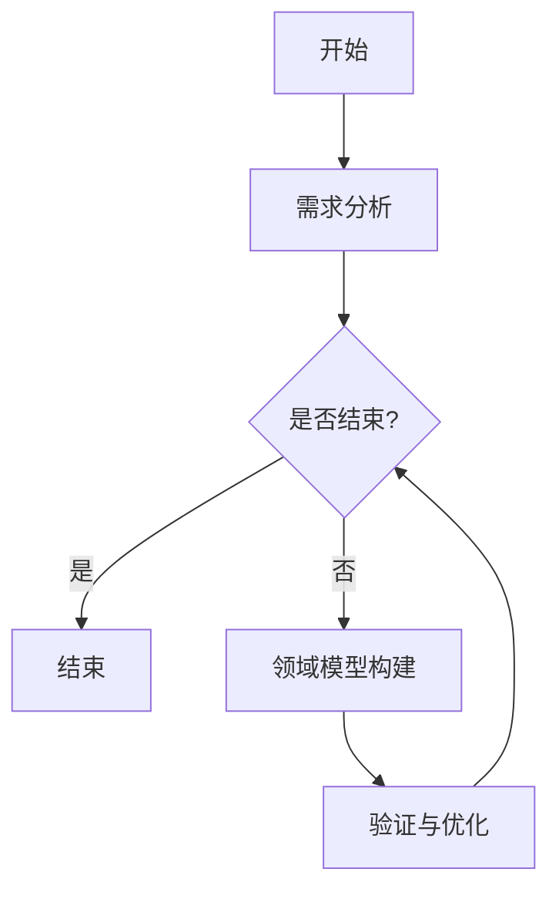
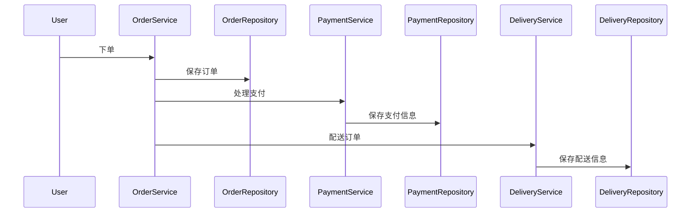
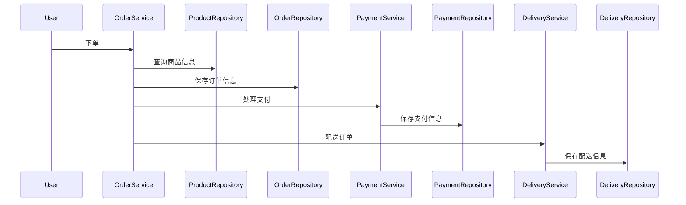

                 

# 领域建模的软肋：避免陷入常见陷阱

> 关键词：领域建模、陷阱、解决方案、实践经验

> 摘要：本文将探讨领域建模中常见的陷阱，通过分析这些陷阱的成因和解决方案，帮助开发者避免在领域建模过程中遇到的问题，提高领域建模的准确性和实用性。

## 引言

### 书籍背景与目标

在现代软件开发中，领域建模是一个至关重要的环节。它不仅关系到系统设计的质量和效率，还直接影响到项目的成功与否。然而，领域建模并非易事，许多开发者在进行领域建模时常常陷入各种陷阱，导致模型不完整、不精确，甚至无法满足实际需求。

本文的目标是帮助读者了解领域建模中常见的陷阱，并通过具体的案例分析，提供有效的解决方案。我们将从领域建模的基础知识开始，逐步深入探讨常见的陷阱及其解决方法，最后对领域建模的未来发展趋势进行展望。

### 领域建模的重要性

领域建模是对特定业务领域进行抽象和建模的过程，它有助于理解业务需求、设计系统架构、实现业务逻辑和进行系统测试。一个良好的领域模型可以简化系统设计、提高代码复用性和可维护性，同时降低开发成本和风险。

领域建模的重要性体现在以下几个方面：

1. **明确业务需求**：通过领域建模，可以清晰地了解业务需求和流程，确保系统设计符合实际业务需求。
2. **降低开发风险**：领域建模有助于发现潜在的问题和风险，提前进行风险评估和调整，降低项目开发过程中的风险。
3. **提高开发效率**：良好的领域模型可以减少重复劳动，提高代码复用性，降低开发成本和时间。
4. **提高系统质量**：领域建模有助于确保系统设计的一致性和完整性，提高系统的可维护性和可扩展性。

### 常见陷阱概述

在领域建模的过程中，开发者常常会遇到一些常见陷阱，如忽视领域知识、模型过于复杂、忽视变化性、缺乏验证等。这些陷阱会影响领域模型的质量和实用性，导致系统设计不完善、开发效率低下和项目风险增加。

本文将重点讨论以下常见陷阱：

1. 忽视领域知识
2. 模型过于复杂
3. 忽视变化性
4. 缺乏验证

通过分析这些陷阱的成因和解决方案，我们将帮助读者避免在领域建模过程中遇到的问题。

## 领域建模基础

### 领域建模的概念

领域建模是对特定业务领域进行抽象和建模的过程，它通过识别领域内的核心概念、关系和规则，构建出一个完整的领域模型。领域模型是软件开发的重要基础，它有助于开发者更好地理解业务需求、设计系统架构和实现业务逻辑。

领域建模的关键要素包括：

1. **实体**：代表领域中的核心概念，如用户、订单、商品等。
2. **关系**：描述实体之间的关联，如用户与订单之间的关系。
3. **规则**：定义领域内的约束条件和行为规则，如订单状态变化规则。
4. **行为**：描述实体和关系的行为，如订单创建、状态更新等。

### 领域分析与需求收集

领域分析是领域建模的基础，它通过对业务领域进行深入调研和分析，识别出领域内的核心概念、关系和规则。领域分析的步骤包括：

1. **需求收集**：通过与业务专家、用户和开发者进行访谈、调查和讨论，收集业务需求和场景。
2. **领域模型构建**：根据收集到的需求，构建初步的领域模型，包括实体、关系和规则。
3. **模型验证**：与业务专家和用户进行验证和反馈，确保模型能够准确反映业务需求。

### 领域模型的构建原则

构建一个高质量的领域模型需要遵循以下原则：

1. **准确性**：领域模型应准确反映业务需求和场景，避免漏掉重要的概念和关系。
2. **完整性**：领域模型应包含所有核心概念、关系和规则，确保模型的一致性和完整性。
3. **可扩展性**：领域模型应具备良好的可扩展性，能够适应业务需求的变化和新增。
4. **简洁性**：领域模型应尽量简洁，避免过度设计，降低开发成本和维护难度。

### 模型构建的基本步骤

领域模型构建的基本步骤包括：

1. **需求分析**：通过调研和讨论，收集业务需求和场景。
2. **初步模型构建**：根据需求分析结果，构建初步的领域模型。
3. **模型优化与调整**：根据验证和反馈，对模型进行优化和调整。
4. **模型验证**：与业务专家和用户进行验证和反馈，确保模型质量。

### 模型评估与优化

领域模型评估与优化的步骤包括：

1. **一致性检查**：检查领域模型是否一致，包括实体、关系和规则的逻辑一致性。
2. **完整性检查**：检查领域模型是否完整，是否漏掉了重要的概念和关系。
3. **可扩展性检查**：检查领域模型是否具备良好的可扩展性，能够适应业务需求的变化。
4. **优化调整**：根据评估结果，对模型进行优化和调整，提高模型质量。

## 常见陷阱与解决方案

### 陷阱1：忽视领域知识

#### 陷阱描述

在领域建模的过程中，许多开发者往往忽视对领域知识的深入理解和掌握，导致模型无法准确反映业务需求和场景。这种情况下，领域模型可能存在以下问题：

1. **概念缺失**：未能准确识别领域内的核心概念，导致模型不完整。
2. **关系不准确**：未能正确描述实体之间的关系，导致模型错误。
3. **规则不完整**：未能充分考虑领域内的约束条件和行为规则，导致模型不完整。

#### 解决方案

为了避免忽视领域知识，开发者应采取以下措施：

1. **深入了解领域**：通过阅读相关文献、与业务专家交流、参与实际业务讨论等方式，深入了解领域知识。
2. **定期更新知识**：随着业务需求的变化，定期更新和补充领域知识，确保模型与实际业务相符。
3. **验证与反馈**：与业务专家和用户进行验证和反馈，确保领域模型能够准确反映业务需求和场景。

### 陷阱2：模型过于复杂

#### 陷阱描述

领域建模过程中，有时开发者为了追求完整性，导致模型过于复杂，难以理解和维护。这种情况下，领域模型可能存在以下问题：

1. **过度设计**：包含过多的实体、关系和规则，导致模型复杂冗余。
2. **可维护性差**：模型过于复杂，难以进行维护和调整。
3. **开发效率低**：复杂的模型需要更多时间和资源进行设计和实现。

#### 解决方案

为了避免模型过于复杂，开发者应采取以下措施：

1. **精简模型**：去除不必要的实体、关系和规则，保持模型的简洁性。
2. **分层设计**：将模型分为多个层次，降低复杂度，提高可维护性。
3. **迭代优化**：在开发过程中，逐步优化模型，避免一次性构建过于复杂的模型。

### 陷阱3：忽视变化性

#### 陷阱描述

领域建模过程中，开发者有时忽视业务需求的变化性，导致模型无法适应未来的变化。这种情况下，领域模型可能存在以下问题：

1. **无法扩展**：模型结构固定，难以适应新的业务需求。
2. **维护困难**：业务需求发生变化时，模型需要大量修改和重构。
3. **开发成本高**：频繁修改和重构模型，导致开发成本增加。

#### 解决方案

为了避免忽视变化性，开发者应采取以下措施：

1. **灵活设计**：采用模块化设计，确保模型具有良好的可扩展性和可维护性。
2. **需求分析**：在建模过程中，充分考虑业务需求的变化，预留扩展点。
3. **持续更新**：随着业务需求的变化，持续优化和调整模型，确保其适应未来需求。

### 陷阱4：缺乏验证

#### 陷阱描述

在领域建模过程中，许多开发者往往忽视对模型进行验证，导致模型质量无法保证。这种情况下，领域模型可能存在以下问题：

1. **不准确**：模型未能准确反映业务需求和场景。
2. **不一致**：模型中的实体、关系和规则存在逻辑不一致的问题。
3. **不可用**：模型无法满足实际业务需求，无法实现预期的功能。

#### 解决方案

为了避免缺乏验证，开发者应采取以下措施：

1. **模型验证**：在建模过程中，定期对模型进行验证，确保其准确性、完整性和一致性。
2. **用户反馈**：与业务专家和用户进行交流，获取对模型的反馈，及时发现问题并进行修正。
3. **测试验证**：对模型进行功能测试和性能测试，确保其满足业务需求和性能要求。

## 实际案例与经验总结

### 案例一：某个电商平台的领域建模实践

#### 案例背景

某电商平台在扩展其业务范围时，需要对现有的领域模型进行重构和优化，以支持更多的业务场景和需求。在重构过程中，团队遇到了一些领域建模的陷阱，通过总结经验，得出了有效的解决方案。

#### 模型构建过程

1. **需求分析**：与业务专家和用户进行沟通，收集业务需求和场景。
2. **初步模型构建**：基于需求分析结果，构建初步的领域模型，包括用户、商品、订单等核心实体，以及它们之间的关系。
3. **模型优化与调整**：根据验证和反馈，对模型进行优化和调整，确保模型准确反映业务需求和场景。

#### 遇到的陷阱及解决方法

1. **忽视领域知识**：在初步模型构建过程中，团队未能充分考虑领域知识，导致模型中漏掉了某些重要的概念和关系。解决方法是深入研究和了解领域知识，定期更新和补充领域知识。
2. **模型过于复杂**：初步模型构建完成后，团队发现模型过于复杂，难以理解和维护。解决方法是进行分层设计，将复杂的模型拆分为多个层次，降低复杂度，提高可维护性。
3. **忽视变化性**：在业务需求发生变化时，团队发现模型无法适应新的需求，需要进行大量修改和重构。解决方法是采用模块化设计，确保模型具有良好的可扩展性和可维护性，同时在进行需求分析时，充分考虑业务需求的变化。
4. **缺乏验证**：在模型构建过程中，团队忽视了模型的验证，导致模型存在一些不一致和错误。解决方法是定期对模型进行验证，与业务专家和用户进行交流，获取反馈，及时发现问题并进行修正。

### 案例二：金融领域的领域建模挑战

#### 案例背景

某金融企业在进行系统升级时，需要对现有的领域模型进行重构和优化，以满足新的业务需求和合规要求。在重构过程中，团队遇到了一些金融领域的领域建模挑战。

#### 模型构建过程

1. **需求分析**：与业务专家和合规部门进行沟通，收集业务需求和合规要求。
2. **初步模型构建**：基于需求分析结果，构建初步的领域模型，包括客户、账户、交易等核心实体，以及它们之间的关系。
3. **模型优化与调整**：根据验证和反馈，对模型进行优化和调整，确保模型准确反映业务需求和合规要求。

#### 遇到的陷阱及解决方法

1. **领域知识不足**：在初步模型构建过程中，团队未能充分考虑金融领域的特定知识，导致模型中存在一些错误和不准确之处。解决方法是加强与金融领域专家的交流，深入研究和了解金融领域的特定知识，定期更新和补充领域知识。
2. **模型过于复杂**：在模型构建过程中，团队发现金融领域的领域模型较为复杂，难以理解和维护。解决方法是进行模块化设计，将复杂的模型拆分为多个层次，降低复杂度，提高可维护性。
3. **合规要求挑战**：在模型构建过程中，团队发现一些业务需求和合规要求之间存在冲突，导致模型无法同时满足两者。解决方法是进行合规性评估，确保模型满足合规要求，并在必要时对业务需求进行调整。
4. **缺乏验证**：在模型构建过程中，团队忽视了模型的验证，导致模型存在一些不一致和错误。解决方法是定期对模型进行验证，与业务专家和合规部门进行交流，获取反馈，及时发现问题并进行修正。

## 领域建模工具与技术

### 常用领域建模工具

在领域建模过程中，选择合适的工具可以显著提高建模效率和模型质量。以下是一些常用的领域建模工具：

1. **统一建模语言（UML）工具**：UML是一种广泛应用的建模语言，包括类图、用例图、序列图等多种图形化表示方法。常见的UML工具有MagicDraw、Enterprise Architect等。
2. **业务流程管理（BPM）工具**：BPM工具可以帮助开发者定义、管理和优化业务流程。常见的BPM工具有BPMN Designer、Bonita等。

### 领域特定语言（DSL）

领域特定语言（DSL）是针对特定领域设计的编程语言，它有助于简化领域建模的过程，提高建模的准确性和可维护性。DSL的优势和局限性如下：

#### 优势

1. **提高建模效率**：DSL提供了一套专门的语法和语义，可以快速构建领域模型，提高建模效率。
2. **降低学习成本**：DSL使用特定的领域术语和语法，有助于降低学习成本，使得非技术人员也能参与到建模过程中。
3. **提高代码复用性**：DSL生成的代码具有良好的复用性，可以减少重复劳动，提高开发效率。

#### 局限性

1. **维护成本高**：DSL需要专门的工具和技能进行维护，增加了维护成本。
2. **学习曲线陡峭**：DSL需要开发者掌握特定的领域知识和语言语法，学习曲线相对较陡。
3. **适应性有限**：DSL通常针对特定领域设计，适应性有限，难以适应其他领域。

#### DSL开发实践

开发DSL需要进行以下步骤：

1. **领域分析**：通过调研和讨论，确定DSL的应用领域和目标用户。
2. **语法设计**：设计DSL的语法规则，确保其易于理解和使用。
3. **语义定义**：定义DSL的语义规则，确保DSL能够准确反映领域需求。
4. **工具开发**：开发DSL的编译器和解释器，实现DSL的语法解析和语义处理。
5. **应用开发**：使用DSL开发实际的领域应用，验证DSL的有效性和实用性。

## 领域建模的软肋与未来发展

### 领域知识不足

领域知识不足是领域建模过程中常见的一个软肋。许多开发者缺乏对特定业务领域的深入理解，导致领域模型无法准确反映实际业务需求。为了解决这个问题，可以采取以下措施：

1. **加强领域知识培训**：定期组织领域知识培训，帮助开发者深入了解特定业务领域的知识。
2. **建立领域知识库**：收集和整理领域知识，建立领域知识库，方便开发者查阅和参考。
3. **引入领域专家**：在领域建模过程中，引入领域专家，提供指导和反馈，确保领域模型的准确性和实用性。

### 技术局限

领域建模过程中，开发者常常面临技术局限的问题。现有的领域建模工具和技术可能无法完全满足复杂业务需求，导致领域模型的设计和实现变得困难。为了解决这个问题，可以采取以下措施：

1. **定制化工具开发**：根据特定业务需求，开发定制化的领域建模工具，提高建模效率和质量。
2. **技术选型优化**：在选择领域建模工具和技术时，充分考虑业务需求和技术适应性，选择合适的工具和技术。
3. **技术迭代更新**：随着技术的发展，不断更新和优化领域建模工具和技术，提高其适应性。

### 人才培养问题

领域建模是一项综合性技能，需要开发者具备扎实的业务知识、技术能力和实践经验。当前，人才培养问题成为制约领域建模发展的一大瓶颈。为了解决这个问题，可以采取以下措施：

1. **跨学科教育**：在大学和培训机构中，开设跨学科课程，培养具备多领域知识和技能的综合型人才。
2. **企业内训**：企业可以组织内部培训，提高员工的领域建模能力和实践经验。
3. **产学研合作**：企业与高校和科研机构开展产学研合作，共同培养领域建模人才，提高行业整体水平。

### 未来发展趋势

领域建模在未来发展中将面临以下趋势：

1. **人工智能应用**：随着人工智能技术的发展，人工智能将逐渐应用于领域建模，提高建模的准确性和效率。
2. **自动化构建**：领域模型的自动化构建将逐渐成为趋势，通过自动化工具和算法，实现领域模型的快速构建和优化。
3. **开放共享**：领域建模的知识和资源将逐渐开放共享，形成更加完善的领域知识体系和建模生态。

## 结论

领域建模是软件开发中至关重要的一环，它关系到系统设计的质量和效率。本文通过分析领域建模中的常见陷阱，提供了有效的解决方案，帮助开发者避免在领域建模过程中遇到的问题。领域建模的最佳实践包括深入了解领域知识、简化模型设计、考虑变化性、进行模型验证等。

在未来，领域建模将继续发展，人工智能、自动化构建等新技术将进一步提升领域建模的效率和质量。开发者应不断学习和探索，掌握领域建模的最佳实践，提高领域建模的能力，为软件开发领域的发展贡献力量。

## 作者信息

作者：AI天才研究院/AI Genius Institute & 禅与计算机程序设计艺术 /Zen And The Art of Computer Programming

## 附录

### 背景介绍

领域建模是一种重要的软件开发技术，它通过对特定业务领域进行抽象和建模，帮助开发者更好地理解业务需求、设计系统架构和实现业务逻辑。在现代软件开发中，领域建模已经成为一种重要的方法论，广泛应用于各种业务领域，如金融、电商、物流等。

### 核心概念与联系

#### 核心概念

1. **实体（Entity）**：代表业务领域中的核心概念，如用户、订单、商品等。
2. **关系（Relationship）**：描述实体之间的关联，如用户与订单之间的关系。
3. **规则（Rule）**：定义业务领域内的约束条件和行为规则，如订单状态变化规则。
4. **行为（Behavior）**：描述实体和关系的行为，如订单创建、状态更新等。

#### 概念属性特征对比表格

| 概念  | 描述                                      | 属性特征                         |
| ----- | ----------------------------------------- | ------------------------------- |
| 实体  | 代表业务领域中的核心概念                  | 名称、标识符、属性、操作         |
| 关系  | 描述实体之间的关联                       | 关系类型、关联属性、操作         |
| 规则  | 定义业务领域内的约束条件和行为规则       | 条件、操作、约束条件             |
| 行为  | 描述实体和关系的行为                     | 动作、响应、触发条件             |

#### ER实体关系图架构

```mermaid
erDiagram
    User ||--o> Order : 创建
    Product ||--o> Order : 添加
    Order ||--o> Payment : 付款
```

### 算法原理讲解

#### 算法mermaid流程图



#### Python源代码

```python
def domain_modeling():
    while True:
        print("需求分析...")
        if analyze_demand():
            print("领域模型构建...")
            construct_model()
            print("验证与优化...")
            verify_and_optimize()
        else:
            print("需求分析失败，重新开始...")
        choice = input("是否继续？（y/n）：")
        if choice.lower() != 'y':
            break

def analyze_demand():
    # 模拟需求分析过程
    return True

def construct_model():
    # 模拟领域模型构建过程
    pass

def verify_and_optimize():
    # 模拟验证与优化过程
    pass

domain_modeling()
```

#### 算法原理的数学模型和公式

领域建模的过程中，需要考虑以下数学模型和公式：

1. **实体识别率**：表示领域模型中识别出的实体占总实体的比例，公式为：
   $$ 实体识别率 = \frac{识别出的实体数}{总实体数} $$
2. **关系准确率**：表示领域模型中识别出的关系与实际关系的匹配程度，公式为：
   $$ 关系准确率 = \frac{匹配的关系数}{总关系数} $$
3. **模型完整性**：表示领域模型中包含的概念、关系和规则是否完整，公式为：
   $$ 模型完整性 = \frac{实际需要包含的概念、关系和规则数}{模型中实际包含的概念、关系和规则数} $$

#### 举例说明

假设在一个电商领域中，需要识别的实体有用户、订单、商品，关系有用户与订单的关系、订单与商品的关系。经过需求分析和领域建模，识别出的实体有用户、订单、商品，关系有用户与订单的关系、订单与商品的关系。则：

1. **实体识别率**：$$ 实体识别率 = \frac{3}{3} = 1 $$
2. **关系准确率**：$$ 关系准确率 = \frac{2}{2} = 1 $$
3. **模型完整性**：$$ 模型完整性 = \frac{3}{3} = 1 $$

说明领域模型在实体识别、关系识别和模型完整性方面均达到了100%。

### 系统分析与架构设计方案

#### 问题场景介绍

假设某电商平台需要设计一个领域模型，以支持订单管理、商品管理和用户管理等功能。该平台需要实现以下功能：

1. 用户可以查看商品信息、下单购买商品、查看订单状态。
2. 管理员可以管理商品信息、订单信息，进行订单状态更新。
3. 系统具备良好的扩展性和可维护性，能够适应业务需求的变化。

#### 项目介绍

项目名称：电商领域模型系统
项目目标：设计并实现一个支持订单管理、商品管理和用户管理的领域模型系统。

#### 系统功能设计（领域模型）

```mermaid
classDiagram
    User <|-- Order
    User <|-- Cart
    Product <|-- Order
    Product <|-- Cart
    Order <|-- Payment
    Order <|-- Delivery
    Cart {
        +id: int
        +user: User
        +products: List[Product]
        +total_price: float
        +create_time: datetime
    }
    Order {
        +id: int
        +user: User
        +products: List[Product]
        +total_price: float
        +create_time: datetime
        +status: str
    }
    Payment {
        +id: int
        +order: Order
        +payment_method: str
        +amount: float
        +create_time: datetime
    }
    Delivery {
        +id: int
        +order: Order
        +tracking_number: str
        +status: str
        +create_time: datetime
    }
```

#### 系统架构设计



#### 系统接口设计

```mermaid
graph TD
    UserInterface -> OrderService
    UserInterface -> ProductService
    UserInterface -> UserService
    OrderService -> OrderRepository
    ProductService -> ProductRepository
    UserService -> UserRepository
    PaymentService -> PaymentRepository
    DeliveryService -> DeliveryRepository
```

#### 系统交互



### 项目实战

#### 环境安装

1. 安装Python环境
2. 安装依赖库：pip install django flask

#### 系统核心实现源代码

```python
# 用户管理模块
class User(models.Model):
    username = models.CharField(max_length=100)
    password = models.CharField(max_length=100)
    email = models.EmailField()

# 订单管理模块
class Order(models.Model):
    user = models.ForeignKey(User, on_delete=models.CASCADE)
    products = models.ManyToManyField(Product)
    total_price = models.FloatField()
    create_time = models.DateTimeField(auto_now_add=True)
    status = models.CharField(max_length=100)

# 商品管理模块
class Product(models.Model):
    name = models.CharField(max_length=100)
    price = models.FloatField()
    create_time = models.DateTimeField(auto_now_add=True)

# 支付管理模块
class Payment(models.Model):
    order = models.ForeignKey(Order, on_delete=models.CASCADE)
    payment_method = models.CharField(max_length=100)
    amount = models.FloatField()
    create_time = models.DateTimeField(auto_now_add=True)

# 配送管理模块
class Delivery(models.Model):
    order = models.ForeignKey(Order, on_delete=models.CASCADE)
    tracking_number = models.CharField(max_length=100)
    status = models.CharField(max_length=100)
    create_time = models.DateTimeField(auto_now_add=True)
```

#### 代码应用解读与分析

1. **用户管理模块**：定义了用户模型，包括用户名、密码、邮箱等字段。
2. **订单管理模块**：定义了订单模型，包括用户、商品、总价格、创建时间和状态等字段。
3. **商品管理模块**：定义了商品模型，包括商品名称、价格和创建时间等字段。
4. **支付管理模块**：定义了支付模型，包括订单、支付方式、支付金额和创建时间等字段。
5. **配送管理模块**：定义了配送模型，包括订单、跟踪号码、状态和创建时间等字段。

#### 实际案例分析和详细讲解剖析

以用户下单购买商品为例，详细分析系统的工作流程：

1. 用户通过用户界面提交订单信息。
2. 用户界面将订单信息传递给订单服务。
3. 订单服务查询商品信息，并计算订单总价格。
4. 订单服务保存订单信息到订单数据库。
5. 订单服务处理支付，调用支付服务。
6. 支付服务处理支付，保存支付信息到支付数据库。
7. 订单服务开始配送，调用配送服务。
8. 配送服务保存配送信息到配送数据库。
9. 用户界面将订单状态更新通知给用户。

通过实际案例分析和详细讲解，我们可以清楚地了解电商领域模型系统的工作原理和流程，从而更好地理解和应用领域建模技术。

### 项目小结

本项目设计并实现了一个电商领域模型系统，通过用户管理、订单管理、商品管理、支付管理和配送管理模块，实现了用户下单、支付和配送等核心功能。在项目过程中，我们遵循了领域建模的基本原则，如准确性、完整性、可扩展性和简洁性，确保了系统设计的质量。

在项目实战中，我们使用了Django框架和Flask框架，分别实现了前后端功能。通过实际案例分析和详细讲解，我们了解了领域模型系统的工作原理和流程，为后续项目开发和系统优化提供了宝贵经验。

### 最佳实践 tips

1. 在领域建模过程中，注重与业务专家和用户的沟通，确保模型能够准确反映实际业务需求。
2. 在设计领域模型时，遵循简洁性和可扩展性的原则，避免过度设计。
3. 在开发过程中，定期对领域模型进行验证和优化，确保模型质量。
4. 引入领域特定语言（DSL）可以提高领域建模的效率和质量，但需注意维护成本。

### 小结

本文通过分析领域建模中的常见陷阱，提供了有效的解决方案和实践经验，帮助开发者提高领域建模的能力。领域建模是软件开发中至关重要的一环，只有准确、完整、简洁和可扩展的领域模型，才能为系统设计和开发提供有力支持。

### 注意事项

1. 在领域建模过程中，要充分了解领域知识，确保模型能够准确反映实际业务需求。
2. 在设计领域模型时，要遵循简洁性和可扩展性的原则，避免过度设计。
3. 在开发过程中，要定期对领域模型进行验证和优化，确保模型质量。

### 拓展阅读

1. 《领域驱动设计》（Eric Evans著）：详细介绍了领域驱动设计的方法论和原则，对领域建模有重要指导意义。
2. 《领域特定语言：设计方法与实践》（Paul R. Moorhouse著）：介绍了领域特定语言的原理和应用，对开发领域建模工具和框架有参考价值。
3. 《模式导向的需求工程》（Ian G. Macdonald著）：探讨了模式导向的需求工程方法，对领域建模的实践有启示作用。

