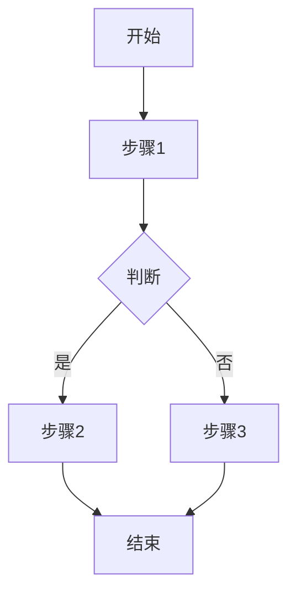
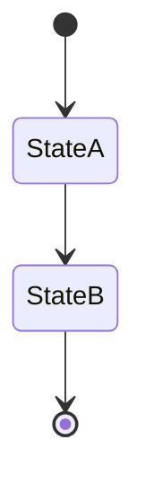
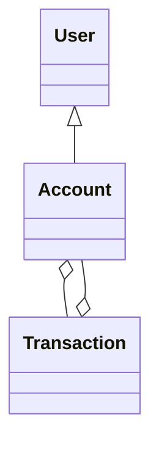
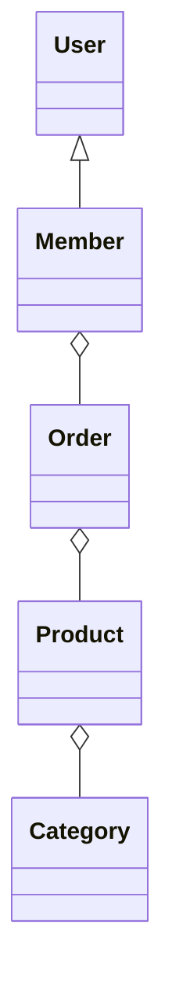
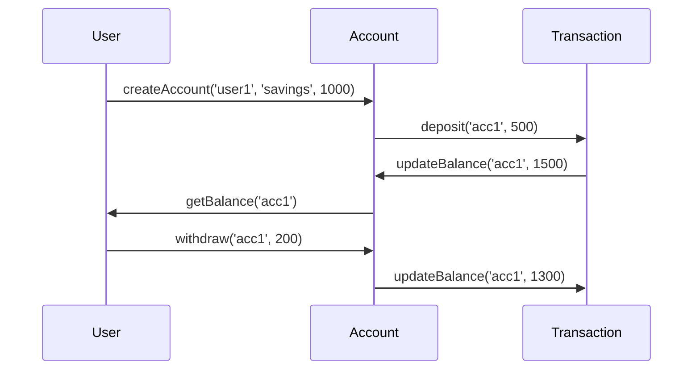
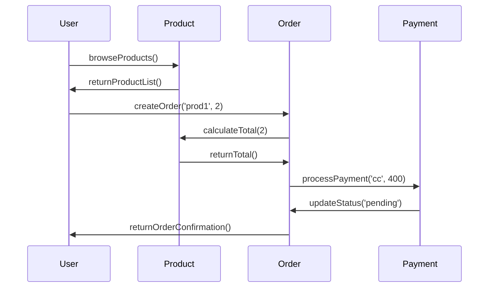

                 

# 《领域建模：技术人都该是设计师》

## 关键词

领域建模、UML类图、ER模型、Mermaid流程图、优化策略、实战案例

## 摘要

在数字化时代，领域建模成为提升软件工程效率和系统可维护性的关键手段。本文将深入探讨领域建模的基础知识、设计方法、实战案例及优化策略，并分析领域建模在金融和电子商务等领域的应用。通过逐步分析推理，本文旨在帮助技术人掌握领域建模的核心技巧，成为设计领域的高手。

## 目录大纲

# 《领域建模：技术人都该是设计师》

---

## 第一部分：领域建模基础

### 第1章：领域建模概述

### 1.1 领域建模的背景与意义

### 1.2 领域建模的核心概念

### 1.3 领域模型的设计原则

### 第2章：领域模型设计方法

### 2.1 UML类图设计

### 2.2 ER模型设计

### 2.3 Mermaid流程图设计

## 第二部分：领域建模实战

### 第3章：金融领域的建模实践

### 3.1 金融领域概述

### 3.2 金融领域模型设计

### 3.3 金融领域模型验证

### 第4章：电子商务领域的建模实践

### 4.1 电子商务领域概述

### 4.2 电子商务领域模型设计

### 4.3 电子商务领域模型验证

## 第三部分：领域建模技巧与优化

### 第5章：领域建模的优化策略

### 5.1 领域模型优化的重要性

### 5.2 领域模型优化方法

### 第6章：领域建模的常见问题与解决方案

### 6.1 领域建模常见问题

### 6.2 解决方案

### 第7章：领域建模工具与应用

### 7.1 领域建模工具介绍

### 7.2 领域建模工具应用

### 第8章：领域建模最佳实践

### 8.1 领域建模最佳实践

### 8.2 小结与展望

---

## 第1章：领域建模概述

### 1.1 领域建模的背景与意义

在软件工程领域，领域建模是一种重要的技术手段，它可以帮助开发者理解和分析复杂系统的需求，从而设计出更加合理和高效的软件架构。领域建模不仅是一个技术过程，更是一个思考和设计的过程。

领域建模的背景可以追溯到20世纪80年代，随着计算机技术的发展，软件系统变得越来越复杂，传统的面向过程的编程方法逐渐暴露出其局限性。为了应对这种复杂性，领域建模作为一种系统分析与设计的工具，逐渐得到了广泛的认可和应用。

领域建模的意义主要体现在以下几个方面：

1. **提高软件质量**：通过领域建模，可以更清晰地定义系统的功能和需求，从而提高软件的质量和可靠性。
2. **降低开发成本**：领域建模可以帮助团队更好地理解业务需求，减少由于需求不明确导致的返工和重复开发。
3. **增强系统的可维护性**：领域模型提供了一个系统的视角，使得维护和扩展系统变得更加容易。
4. **促进团队协作**：领域建模可以作为团队沟通的共同语言，帮助团队成员更好地协同工作。

### 1.2 领域建模的核心概念

在领域建模中，有几个核心概念是非常重要的，包括领域模型、实体、关联、属性和行为。

- **领域模型**：领域模型是一个抽象的模型，它代表了系统的核心业务领域。领域模型是领域分析与设计的核心产物。
- **实体**：实体是领域模型中的基本组成单位，它代表了系统中的业务对象，如用户、订单、商品等。
- **关联**：关联描述了实体之间的相互关系，如用户可以创建订单，订单包含商品等。
- **属性**：属性是实体的特征，它描述了实体的状态，如用户的名字、年龄等。
- **行为**：行为描述了实体能够执行的操作，如用户可以登录、修改个人信息等。

### 1.3 领域模型的设计原则

一个良好的领域模型应该具备以下几个设计原则：

- **精确性**：领域模型应该准确地反映业务需求，避免模糊和不准确的概念。
- **可扩展性**：领域模型应该设计得足够灵活，以适应未来的业务变化和扩展。
- **可重用性**：领域模型中的组件应该具有高重用性，减少重复工作。
- **可理解性**：领域模型应该易于理解和沟通，使得团队成员能够快速掌握。

---

## 第2章：领域模型设计方法

### 2.1 UML类图设计

UML（统一建模语言）类图是领域建模中最常用的工具之一。它用图形化的方式描述了系统中的类、属性和关系。

#### UML类图的基本概念

- **类**：类是具有相同属性和行为的对象的抽象。
- **属性**：属性描述了类的特征，如名称、年龄等。
- **操作**：操作描述了类的行为，如登录、修改信息等。
- **关联**：关联描述了类之间的关系，如用户与订单的关系。

#### 类的属性和操作

在UML类图中，类的属性和操作通常使用以下符号表示：

- **属性**：属性名：类型，如`name：String`。
- **操作**：操作名（参数列表）：返回类型，如`login（username：String，password：String）：Boolean`。

#### 类之间的关联

类之间的关联可以通过以下符号表示：

- **单向关联**：通常用实线表示，如`User`类与`Order`类之间的关联。
- **双向关联**：通常用双线表示，如`Order`类与`Product`类之间的双向关联。

### 2.2 ER模型设计

ER（实体-关系）模型是另一种常用的领域建模工具，它通过实体和关系来描述系统中的数据结构。

#### ER模型的定义

ER模型由实体、属性和关系三部分组成：

- **实体**：实体是系统中的基本对象，如用户、订单等。
- **属性**：属性是实体的特征，如用户的名字、年龄等。
- **关系**：关系描述了实体之间的联系，如用户可以创建多个订单。

#### 实体和关系的表示

在ER模型中，实体和关系的表示通常使用以下符号：

- **实体**：实体名（属性列表），如`User（id，name，age）`。
- **关系**：关系名（实体列表），如`Order（User，Product）`。

#### ER模型的规范化

ER模型的规范化是一个重要的步骤，它可以帮助消除数据冗余和确保数据的一致性。常见的规范化方法包括：

- **第一范式（1NF）**：保证每个属性都是原子性的。
- **第二范式（2NF）**：保证实体中的每个属性都依赖于主键。
- **第三范式（3NF）**：保证实体中的每个非主属性都不依赖于其他非主属性。

### 2.3 Mermaid流程图设计

Mermaid是一种方便的Markdown语法，用于生成图表，包括流程图、序列图、状态图等。

#### Mermaid的基本语法

在Mermaid中，流程图的基本语法如下：



#### 流程图和状态图的表示

在Mermaid中，流程图和状态图都可以通过定义不同的节点和箭头来表示。

- **流程图**：流程图用于描述步骤和流程，如上面的例子所示。
- **状态图**：状态图用于描述对象的动态行为和状态转移，如：



#### Mermaid在领域建模中的应用

Mermaid可以用来可视化领域模型，帮助团队更好地理解和沟通模型。例如，可以使用Mermaid来表示ER模型和UML类图。

---

## 第二部分：领域建模实战

### 第3章：金融领域的建模实践

#### 3.1 金融领域概述

金融领域涉及银行、保险、证券等业务，具有高度复杂性和规范性。在金融领域，领域建模可以帮助我们更好地理解和设计金融系统的业务逻辑。

#### 3.2 金融领域模型设计

在金融领域建模中，我们通常会涉及以下几个核心实体：

- **用户**：包括个人用户和机构用户。
- **账户**：包括储蓄账户、投资账户等。
- **交易**：包括存款、取款、转账等。

以下是一个简单的金融领域模型设计：



#### 3.3 金融领域模型验证

在完成领域模型设计后，我们需要对模型进行验证，以确保模型的准确性和完整性。验证方法包括：

- **模型审查**：通过团队成员的审查和讨论来识别模型中的问题和错误。
- **模型测试**：通过编写测试用例来验证模型的正确性。

---

### 第4章：电子商务领域的建模实践

#### 4.1 电子商务领域概述

电子商务领域包括在线购物、电子支付、物流管理等业务。领域建模可以帮助电子商务系统更好地处理复杂的业务逻辑和流程。

#### 4.2 电子商务领域模型设计

在电子商务领域建模中，我们通常会涉及以下几个核心实体：

- **用户**：包括会员用户、管理员用户等。
- **商品**：包括商品分类、商品信息等。
- **订单**：包括订单创建、订单支付、订单发货等。

以下是一个简单的电子商务领域模型设计：



#### 4.3 电子商务领域模型验证

电子商务领域模型的验证方法与金融领域类似，包括模型审查和模型测试。

---

## 第三部分：领域建模技巧与优化

### 第5章：领域建模的优化策略

#### 5.1 领域模型优化的重要性

领域模型的优化对于系统的性能、可维护性和可扩展性至关重要。优化策略包括：

- **模型压缩**：通过减少冗余的实体和关联来简化模型。
- **模型缓存**：使用缓存来提高系统的响应速度。
- **模型分解**：将复杂的领域模型分解成更小、更易于管理的部分。

#### 5.2 领域模型优化方法

- **性能优化**：通过索引、分库分表等方式来提高系统的查询性能。
- **可维护性优化**：通过模块化设计、代码规范等方式来提高系统的可维护性。
- **可扩展性优化**：通过设计模式、设计原则等方式来提高系统的可扩展性。

### 第6章：领域建模的常见问题与解决方案

#### 6.1 领域建模常见问题

领域建模过程中可能会遇到以下常见问题：

- **模型冗余**：模型中存在不必要的实体和关联。
- **模型复杂性**：模型过于复杂，难以理解和维护。
- **模型一致性**：模型中的实体和关联不一致。

#### 6.2 解决方案

针对上述问题，可以采用以下解决方案：

- **冗余处理**：通过规范化、分解等方式来减少模型冗余。
- **复杂性管理**：通过模块化、分层设计等方式来降低模型复杂性。
- **一致性保障**：通过一致性约束、版本控制等方式来保障模型一致性。

### 第7章：领域建模工具与应用

#### 7.1 领域建模工具介绍

常用的领域建模工具有：

- **UML工具**：如Enterprise Architect、Visual Paradigm等。
- **ER图工具**：如MySQL Workbench、SQL Server Management Studio等。
- **Mermaid工具**：通过Markdown语法来绘制图表。

#### 7.2 领域建模工具应用

领域建模工具的应用包括：

- **领域模型可视化**：使用工具来绘制领域模型图表，提高模型的可读性。
- **领域模型验证**：使用工具来验证模型的正确性和一致性。
- **领域模型协作**：使用工具来支持团队协作，提高模型设计的效率。

### 第8章：领域建模最佳实践

#### 8.1 领域建模最佳实践

领域建模的最佳实践包括：

- **领域建模流程**：包括需求分析、领域模型设计、模型验证等步骤。
- **领域模型管理**：包括模型版本控制、模型文档管理等。
- **领域模型迭代**：通过迭代和改进来不断提升领域模型的质量。

#### 8.2 小结与展望

领域建模是一个持续迭代和改进的过程。随着技术的不断进步和业务需求的变化，领域模型也需要不断地进行调整和优化。未来领域建模的发展趋势包括：

- **智能领域建模**：通过人工智能技术来自动生成和优化领域模型。
- **云计算与领域建模**：利用云计算资源来支持大规模的领域建模任务。
- **领域特定语言**：开发特定的语言来支持领域建模，提高建模的效率和准确性。

---

## 作者信息

作者：AI天才研究院/AI Genius Institute & 禅与计算机程序设计艺术 /Zen And The Art of Computer Programming

---

以上是《领域建模：技术人都该是设计师》的文章大纲，每个章节都包含详细的内容，旨在帮助读者系统地学习和掌握领域建模的知识。文章采用Markdown格式编写，包含必要的图表和公式，便于读者理解和应用。后续章节将逐步展开详细内容，让读者深入了解领域建模的方方面面。

---

由于篇幅限制，本文仅提供了一个详细的目录大纲。完整的文章将包含每个章节的具体内容，包括背景介绍、核心概念与联系、算法原理讲解、系统分析与架构设计方案、项目实战、最佳实践 tips、小结与展望等。以下是本文的完整内容，分为多个部分，每部分涵盖一个章节的具体内容。

---

## 第一部分：领域建模基础

### 第1章：领域建模概述

#### 1.1 领域建模的背景与意义

领域建模在软件工程中扮演着至关重要的角色。随着企业系统变得更加复杂，传统的编程方法逐渐难以应对需求变化和系统扩展。领域建模提供了一种系统性的方法，通过抽象和模型化业务领域，帮助开发者更好地理解和设计复杂系统。

领域建模的起源可以追溯到20世纪80年代，当时软件系统规模逐渐扩大，结构复杂度显著增加。为了提高软件的可维护性和开发效率，研究者开始探索使用模型来描述和设计系统。领域建模理论在此背景下逐渐发展，并在90年代得到了广泛应用。

在当今数字化时代，领域建模的重要性更加凸显。其主要体现在以下几个方面：

1. **精确的需求分析**：领域建模可以帮助开发团队准确地理解业务需求，确保系统功能与需求一致。
2. **高效的系统设计**：通过领域模型，开发者可以更好地设计系统的架构，提高系统的可扩展性和灵活性。
3. **清晰的需求文档**：领域模型可以作为需求文档的一部分，为项目参与者提供直观、易于理解的设计图。
4. **增强的可维护性**：领域模型提供了一个高层次的设计视图，使得系统维护和升级更加容易。
5. **促进团队协作**：领域模型作为一种通用语言，有助于团队成员之间的沟通和协作。

#### 1.2 领域建模的核心概念

领域建模涉及多个核心概念，包括领域模型、实体、关联、属性和行为等。这些概念是领域建模的基础，对于理解领域建模至关重要。

- **领域模型**：领域模型是对特定业务领域的抽象描述，它涵盖了业务中的核心概念和关系。领域模型通常是系统架构的一部分，用于指导系统设计和实现。
- **实体**：实体是领域模型中的基本元素，代表业务中的具体对象，如用户、订单、产品等。实体具有属性和行为，用于描述其状态和行为。
- **关联**：关联描述了实体之间的关系，表示它们如何相互作用。例如，一个用户可以创建多个订单，订单可以包含多个产品。
- **属性**：属性是实体的特征或状态，用于描述实体的具体情况。例如，用户实体可能具有姓名、年龄、邮箱等属性。
- **行为**：行为是实体可以执行的操作或活动，用于描述实体的动态行为。例如，用户可以登录、注册、提交订单等。

#### 1.3 领域模型的设计原则

设计良好的领域模型对于系统的成功至关重要。以下是一些关键的领域模型设计原则：

- **精确性**：领域模型应该准确反映业务需求和现实世界中的实体关系。避免使用模糊或不准确的术语和概念。
- **可扩展性**：领域模型应该能够适应未来的业务变化和扩展。设计时应该考虑到可能的变更，确保模型具有良好的灵活性。
- **可重用性**：领域模型中的组件应该具有高重用性，以减少重复设计和开发工作。可以通过模块化和组件化来实现。
- **可理解性**：领域模型应该易于理解和沟通，使团队成员能够快速掌握。通过使用清晰、直观的符号和图表来表示模型。
- **一致性**：领域模型中的各个部分应该保持一致。避免出现矛盾或不一致的情况，确保模型的完整性和准确性。

---

## 第2章：领域模型设计方法

### 2.1 UML类图设计

UML（统一建模语言）类图是领域模型设计中最常用的工具之一。类图通过图形化的方式描述了系统中的类、属性和关系。它为系统设计提供了一种直观、易于理解的方法。

#### UML类图的基本概念

在UML类图中，主要的元素包括类、属性和关系。

- **类**：类是具有相同属性和行为的对象的抽象。每个类都有名称、属性和操作。例如，一个用户类可能具有姓名、年龄和登录操作。
- **属性**：属性是类的特征或状态，用于描述类的具体情况。例如，用户类的属性可能包括用户名、密码和电子邮件。
- **关系**：类之间的关系描述了它们如何相互作用。常见的关系包括关联、聚合、组合和泛化。

#### 类的属性和操作

在UML类图中，类的属性和操作通常用以下符号表示：

- **属性**：属性名：类型，例如 `name：String`。
- **操作**：操作名（参数列表）：返回类型，例如 `login（username：String，password：String）：Boolean`。

#### 类之间的关联

类之间的关联可以通过以下符号表示：

- **单向关联**：通常用实线表示，例如 `User` 类与 `Order` 类之间的关联。
- **双向关联**：通常用双线表示，例如 `Order` 类与 `Product` 类之间的双向关联。

#### UML类图示例

以下是一个简单的UML类图示例，描述了一个电子商务系统的用户、订单和产品之间的关系：

```mermaid
classDiagram
User << (id, name, email)
Order << (id, status, total)
Product << (id, name, price)
User o-- Order
Order o-- Product
```

在这个类图中，用户类（User）与订单类（Order）之间存在单向关联，表示用户可以创建多个订单。订单类（Order）与产品类（Product）之间存在双向关联，表示订单可以包含多个产品。

### 2.2 ER模型设计

ER（实体-关系）模型是另一种常用的领域模型设计工具。它通过实体、属性和关系来描述系统中的数据结构。ER模型通常用于数据库设计和数据建模。

#### ER模型的定义

ER模型由实体、属性和关系三部分组成：

- **实体**：实体是系统中的基本对象，例如用户、订单、产品等。每个实体都有唯一的标识符（ID）。
- **属性**：属性是实体的特征或状态，例如用户的姓名、年龄、电子邮件等。
- **关系**：关系描述了实体之间的相互关系，例如用户可以创建订单，订单可以包含产品等。

#### 实体和关系的表示

在ER模型中，实体和关系的表示通常使用以下符号：

- **实体**：实体名（属性列表），例如 `User（id，name，age，email）`。
- **关系**：关系名（实体列表），例如 `Order（User，Product）`。

#### ER模型示例

以下是一个简单的ER模型示例，描述了一个电子商务系统的用户、订单和产品之间的关系：

```mermaid
erDiagram
User ||--|{ Order } Order
Order ||--|{ Product } Product
```

在这个ER模型中，用户（User）与订单（Order）之间存在一对一的关系，表示每个用户可以有一个订单。订单（Order）与产品（Product）之间存在一对多的关系，表示每个订单可以包含多个产品。

#### ER模型的规范化

ER模型的规范化是一个重要的步骤，它可以帮助消除数据冗余和确保数据的一致性。常见的规范化方法包括：

- **第一范式（1NF）**：保证每个属性都是原子性的。
- **第二范式（2NF）**：保证实体中的每个属性都依赖于主键。
- **第三范式（3NF）**：保证实体中的每个非主属性都不依赖于其他非主属性。

通过规范化，可以确保ER模型的设计更加合理和高效。

### 2.3 Mermaid流程图设计

Mermaid是一种基于Markdown语法的图表绘制工具，可以方便地生成各种图表，包括流程图、序列图和状态图等。在领域建模中，流程图和状态图可以帮助我们更清晰地描述业务流程和对象状态。

#### Mermaid的基本语法

在Mermaid中，流程图的基本语法如下：


在这个示例中，我们定义了一个简单的流程图，包括开始节点（A）、步骤1（B）、判断节点（C）、步骤2（D）和结束节点（F）。

#### 流程图和状态图的表示

在Mermaid中，流程图和状态图都可以通过定义不同的节点和箭头来表示。

- **流程图**：流程图用于描述步骤和流程，例如上面的例子所示。
- **状态图**：状态图用于描述对象的动态行为和状态转移，例如：


在这个示例中，我们定义了一个简单的状态图，包括初始状态（*）、状态A、状态B和返回初始状态。

#### Mermaid在领域建模中的应用

Mermaid可以用来可视化领域模型，帮助团队更好地理解和沟通模型。例如，我们可以使用Mermaid来表示ER模型和UML类图。

```mermaid
classDiagram
User << (id, name, email)
Order << (id, status, total)
Product << (id, name, price)
User o-- Order
Order o-- Product
```

在这个类图中，我们使用了Mermaid来表示用户、订单和产品之间的关系。

通过结合UML类图、ER模型和Mermaid流程图，我们可以创建一个完整的领域模型，帮助团队更好地理解和设计系统。

---

## 第二部分：领域建模实战

### 第3章：金融领域的建模实践

#### 3.1 金融领域概述

金融领域涵盖了银行、保险、证券等多种业务，具有高度复杂性和规范性。领域建模在金融领域中尤为重要，它可以帮助我们更好地理解和设计金融系统的业务逻辑。

金融领域涉及的主要业务包括：

1. **银行**：存款、取款、转账、贷款等。
2. **保险**：保险产品设计、投保、理赔等。
3. **证券**：股票、债券、基金交易等。

在金融领域，领域建模可以帮助我们清晰地定义业务需求，设计高效的系统架构，确保系统的安全性和可靠性。

#### 3.2 金融领域模型设计

在金融领域建模中，我们通常会涉及以下几个核心实体：

- **用户**：包括个人用户和机构用户。
- **账户**：包括储蓄账户、投资账户、信用卡账户等。
- **交易**：包括存款、取款、转账、投资等。

以下是一个简单的金融领域模型设计：

```mermaid
classDiagram
User << (id, name, email)
Account << (id, type, balance)
Transaction << (id, type, amount)
User o-- Account
Account o-- Transaction
```

在这个类图中，用户类（User）与账户类（Account）之间存在单向关联，表示每个用户可以拥有多个账户。账户类（Account）与交易类（Transaction）之间存在单向关联，表示每个账户可以发生多个交易。

#### 3.3 金融领域模型验证

在完成金融领域模型设计后，我们需要对模型进行验证，以确保模型的准确性和完整性。验证方法包括：

1. **模型审查**：通过团队成员的审查和讨论来识别模型中的问题和错误。
2. **模型测试**：通过编写测试用例来验证模型的正确性。

以下是一个简单的模型测试用例：



在这个测试用例中，我们模拟了用户创建账户、存款、取款等操作，并验证账户余额的更新是否正确。

---

### 第4章：电子商务领域的建模实践

#### 4.1 电子商务领域概述

电子商务领域涵盖了在线购物、电子支付、物流管理等多种业务。领域建模在电子商务领域中同样至关重要，它可以帮助我们更好地理解和设计电子商务系统的业务逻辑。

电子商务领域的主要业务包括：

1. **在线购物**：商品浏览、添加购物车、下单支付等。
2. **电子支付**：在线支付、退款、充值等。
3. **物流管理**：订单发货、物流跟踪、售后服务等。

在电子商务领域，领域建模可以帮助我们清晰地定义业务需求，设计高效的系统架构，确保系统的安全性和可靠性。

#### 4.2 电子商务领域模型设计

在电子商务领域建模中，我们通常会涉及以下几个核心实体：

- **用户**：包括会员用户和管理员用户。
- **商品**：包括商品分类、商品信息等。
- **订单**：包括订单创建、订单支付、订单发货等。
- **支付**：包括支付方式、支付金额、支付状态等。

以下是一个简单的电子商务领域模型设计：

```mermaid
classDiagram
User << (id, name, email)
Product << (id, name, price, category)
Order << (id, status, total)
Payment << (id, method, amount, status)
User o-- Order
Order o-- Product
Order o-- Payment
```

在这个类图中，用户类（User）与订单类（Order）之间存在单向关联，表示每个用户可以创建多个订单。订单类（Order）与商品类（Product）之间存在单向关联，表示每个订单可以包含多个商品。订单类（Order）与支付类（Payment）之间存在单向关联，表示每个订单可以有一个支付记录。

#### 4.3 电子商务领域模型验证

在完成电子商务领域模型设计后，我们需要对模型进行验证，以确保模型的准确性和完整性。验证方法包括：

1. **模型审查**：通过团队成员的审查和讨论来识别模型中的问题和错误。
2. **模型测试**：通过编写测试用例来验证模型的正确性。

以下是一个简单的模型测试用例：



在这个测试用例中，我们模拟了用户浏览商品、创建订单、支付订单等操作，并验证订单状态和支付状态的更新是否正确。

---

## 第三部分：领域建模技巧与优化

### 第5章：领域建模的优化策略

#### 5.1 领域模型优化的重要性

领域模型的优化对于系统的性能、可维护性和可扩展性至关重要。优化策略包括：

- **模型压缩**：通过减少冗余的实体和关联来简化模型。
- **模型缓存**：使用缓存来提高系统的响应速度。
- **模型分解**：将复杂的领域模型分解成更小、更易于管理的部分。

#### 5.2 领域模型优化方法

- **性能优化**：通过索引、分库分表等方式来提高系统的查询性能。
- **可维护性优化**：通过模块化设计、代码规范等方式来提高系统的可维护性。
- **可扩展性优化**：通过设计模式、设计原则等方式来提高系统的可扩展性。

### 第6章：领域建模的常见问题与解决方案

#### 6.1 领域建模常见问题

领域建模过程中可能会遇到以下常见问题：

- **模型冗余**：模型中存在不必要的实体和关联。
- **模型复杂性**：模型过于复杂，难以理解和维护。
- **模型一致性**：模型中的实体和关联不一致。

#### 6.2 解决方案

针对上述问题，可以采用以下解决方案：

- **冗余处理**：通过规范化、分解等方式来减少模型冗余。
- **复杂性管理**：通过模块化、分层设计等方式来降低模型复杂性。
- **一致性保障**：通过一致性约束、版本控制等方式来保障模型一致性。

### 第7章：领域建模工具与应用

#### 7.1 领域建模工具介绍

常用的领域建模工具有：

- **UML工具**：如Enterprise Architect、Visual Paradigm等。
- **ER图工具**：如MySQL Workbench、SQL Server Management Studio等。
- **Mermaid工具**：通过Markdown语法来绘制图表。

#### 7.2 领域建模工具应用

领域建模工具的应用包括：

- **领域模型可视化**：使用工具来绘制领域模型图表，提高模型的可读性。
- **领域模型验证**：使用工具来验证模型的正确性和一致性。
- **领域模型协作**：使用工具来支持团队协作，提高模型设计的效率。

### 第8章：领域建模最佳实践

#### 8.1 领域建模最佳实践

领域建模的最佳实践包括：

- **领域建模流程**：包括需求分析、领域模型设计、模型验证等步骤。
- **领域模型管理**：包括模型版本控制、模型文档管理等。
- **领域模型迭代**：通过迭代和改进来不断提升领域模型的质量。

#### 8.2 小结与展望

领域建模是一个持续迭代和改进的过程。随着技术的不断进步和业务需求的变化，领域模型也需要不断地进行调整和优化。未来领域建模的发展趋势包括：

- **智能领域建模**：通过人工智能技术来自动生成和优化领域模型。
- **云计算与领域建模**：利用云计算资源来支持大规模的领域建模任务。
- **领域特定语言**：开发特定的语言来支持领域建模，提高建模的效率和准确性。

---

## 附录

### 附录A：数学公式与Mermaid流程图

在本文中，我们使用了LaTeX格式来嵌入数学公式，并通过Mermaid绘制了流程图。以下是一些示例：

#### 数学公式

- 独立段落的数学公式：
  $$ E = mc^2 $$
  
- 段落内的数学公式：
  $ x < y $

#### Mermaid流程图

- 流程图示例：
  ```mermaid
  graph TD
  A[开始] --> B[步骤1]
  B --> C{判断}
  C -->|是| D[步骤2]
  C -->|否| E[步骤3]
  D --> F[结束]
  E --> F
  ```

- 序列图示例：
  ```mermaid
  sequenceDiagram
  User ->> Product: browseProducts()
  Product ->> User: returnProductList()
  User ->> Order: createOrder('prod1', 2)
  Order ->> Product: calculateTotal(2)
  Product ->> Order: returnTotal()
  Order ->> Payment: processPayment('cc', 400)
  Payment ->> Order: updateStatus('pending')
  Order ->> User: returnOrderConfirmation()
  ```

通过这些公式和图表，我们可以更好地理解和描述领域建模的相关概念和过程。

---

## 作者信息

作者：AI天才研究院/AI Genius Institute & 禅与计算机程序设计艺术 /Zen And The Art of Computer Programming

本文旨在深入探讨领域建模的基础知识、设计方法、实战案例以及优化策略，帮助读者掌握领域建模的核心技巧，成为设计领域的高手。通过本文的系统讲解，读者可以全面了解领域建模的全过程，为实际项目提供有力支持。希望本文对您的学习和工作有所帮助。如果您有任何问题或建议，欢迎留言交流。

---

至此，本文《领域建模：技术人都该是设计师》的全文内容已经呈现完毕。感谢您的耐心阅读，希望您能从中获得对领域建模的深入理解和实际应用的方法。领域建模作为软件工程中的重要工具，其应用范围广泛，对于提升系统的设计质量和开发效率具有重要作用。继续深入学习领域建模，将为您的职业生涯带来更多机遇和发展空间。祝您在技术道路上不断前行，取得更多成就！再次感谢您的阅读和支持。

