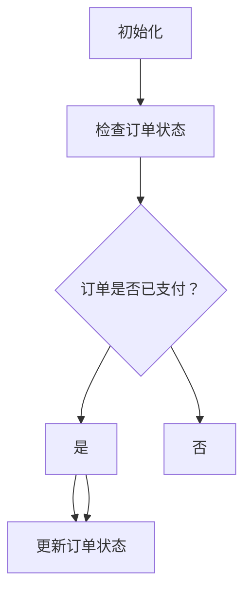
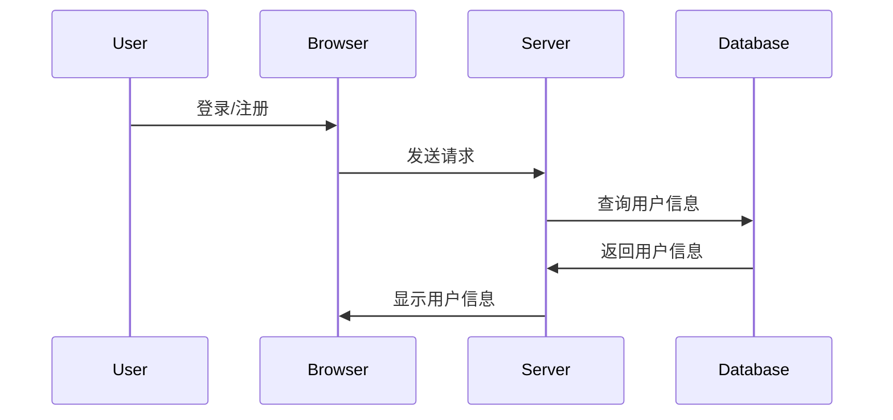
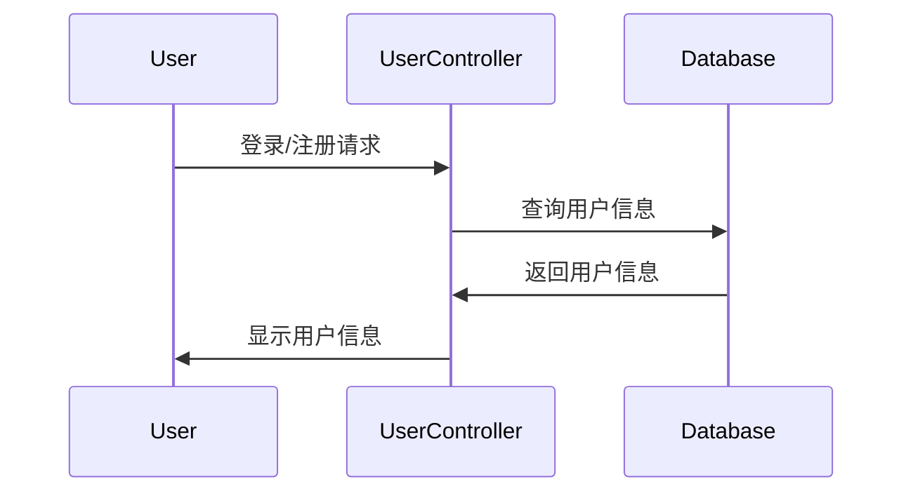

                 

# 《领域模型也有软肋》

## 关键词
- 领域模型
- 软肋
- 架构设计
- 开发实践
- 数学模型

## 摘要
本文旨在探讨领域模型在软件开发中的应用与局限性。领域模型作为一种抽象的概念工具，广泛应用于软件架构设计和系统开发中。然而，尽管其强大的抽象能力和建模优势，领域模型并非完美无缺，也存在其固有的软肋。本文将逐步分析领域模型的概念、优点、挑战，并结合具体案例，深入探讨如何识别并解决领域模型中的问题。

## 目录

### 第一部分：领域模型基础知识

#### 第1章：领域模型概述
1.1 问题背景与重要性
1.2 领域模型的概念与边界
1.3 领域模型的发展历程

#### 第2章：核心概念与联系
2.1 领域模型的基本概念
2.2 概念属性特征对比表格
2.3 ER实体关系图架构

#### 第3章：领域模型构建方法
3.1 领域分析
3.2 领域模型设计
3.3 领域模型验证与优化

#### 第4章：领域模型的挑战与应对策略
4.1 领域模型面临的挑战
4.2 应对策略与解决方案

### 第二部分：领域模型应用与实践

#### 第5章：领域模型在软件开发中的应用
5.1 领域驱动设计（DDD）
5.2 领域模型在系统架构设计中的应用
5.3 领域模型在软件开发过程中的实践

#### 第6章：领域模型算法原理讲解
6.1 算法流程图
6.2 算法原理与Python源代码
6.3 数学模型与公式讲解

#### 第7章：数学模型和数学公式详细讲解
7.1 数学模型介绍
7.2 公式讲解
7.3 举例说明

#### 第8章：系统分析与架构设计方案
8.1 问题场景介绍
8.2 系统功能设计（领域模型类图）
8.3 系统架构设计（架构图）
8.4 系统接口设计
8.5 系统交互设计（序列图）

#### 第9章：项目实战
9.1 环境安装与配置
9.2 系统核心实现源代码
9.3 代码应用解读与分析
9.4 实际案例分析与讲解
9.5 项目小结

#### 第10章：最佳实践与拓展
10.1 最佳实践 tips
10.2 小结
10.3 注意事项
10.4 拓展阅读

## 第一部分：领域模型基础知识

### 第1章：领域模型概述

#### 1.1 问题背景与重要性

在软件工程中，领域模型（Domain Model）是一种用于描述特定领域概念的抽象模型。领域模型的出现源于软件开发过程中对领域知识的复用和抽象的需求。传统的方法通常依赖于具体的实现技术，而领域模型则提供了一种与实现技术无关的、专注于业务逻辑的方法。

领域模型的重要性体现在以下几个方面：

1. **复用与抽象**：领域模型将业务领域中的共同部分提取出来，形成可重用的组件，降低了软件开发的复杂度。
2. **明确业务逻辑**：领域模型将业务规则和流程以可视化的形式呈现，有助于开发人员和业务人员更好地沟通和理解系统功能。
3. **系统架构设计**：领域模型是系统架构设计的基础，有助于建立清晰的结构和模块化的设计，提高系统的可维护性和可扩展性。

#### 1.2 领域模型的概念与边界

领域模型（Domain Model）通常包括以下几个核心概念：

- **实体（Entity）**：具有唯一标识的领域对象，例如“客户”、“订单”等。
- **值对象（Value Object）**：不具有唯一标识，但表示某些具体值的对象，例如“日期”、“金额”等。
- **关联（Association）**：表示实体之间或实体与值对象之间的关系。
- **行为（Behavior）**：描述实体的行为或操作，通常通过接口或类来实现。

领域模型的边界通常由领域边界（Domain Boundary）来定义，它将领域模型与其外部环境分隔开来，确保领域模型的独立性和完整性。

#### 1.3 领域模型的发展历程

领域模型的概念起源于20世纪90年代，随着面向对象编程技术的发展而逐渐成熟。最初，领域模型主要用于软件架构设计，随着领域驱动设计（Domain-Driven Design，简称DDD）的兴起，领域模型的应用范围进一步扩大。

领域模型的发展历程可以概括为以下几个阶段：

1. **面向对象领域模型**：领域模型最初是面向对象设计的一部分，用于描述业务领域中的对象及其关系。
2. **领域驱动设计（DDD）**：DDD将领域模型作为核心概念，强调领域专家和开发人员的合作，通过领域模型来驱动软件设计。
3. **领域特定语言（DSL）**：为了提高领域模型的抽象能力和可操作性，领域特定语言开始被广泛应用于领域模型的定义和实现。
4. **云原生与微服务**：在云原生和微服务架构中，领域模型被用来定义微服务的边界和职责，提高系统的灵活性和可扩展性。

### 第2章：核心概念与联系

#### 2.1 领域模型的基本概念

在深入探讨领域模型之前，我们需要明确几个基本概念：

- **实体**：实体是领域模型中的核心对象，通常具有唯一的标识。实体的例子包括“客户”、“订单”和“产品”等。
- **值对象**：值对象表示领域模型中的基本数据类型，如日期、金额、电话号码等。与实体不同，值对象没有唯一的标识。
- **关联**：关联描述了实体之间的关系。例如，“订单”与“客户”之间存在一种关联关系，因为每个订单都关联到一个客户。
- **行为**：行为定义了实体的操作和功能。例如，“客户”可以有“创建订单”和“支付订单”的行为。

#### 2.2 概念属性特征对比表格

为了更好地理解这些概念，我们可以通过一个对比表格来展示它们的主要特征：

| 概念    | 特征                                      |
| ------- | ----------------------------------------- |
| 实体    | 具有唯一标识，可持久化                    |
| 值对象  | 无唯一标识，代表基本数据类型              |
| 关联    | 描述实体之间的关系                        |
| 行为    | 定义实体的操作和功能                      |

#### 2.3 ER实体关系图架构

为了更直观地展示领域模型中的概念及其关系，我们可以使用ER（Entity-Relationship）实体关系图。ER图是一种用于描述实体及其关系的图形表示方法。

以下是一个简单的ER图示例，用于描述一个在线购物系统的领域模型：

```mermaid
erDiagram
    Customer ||--|{ Order }|
    Product ||--|{ Order }|
    Order ||--|{ OrderItem }|
```

在这个ER图中，`Customer`、`Product`和`Order`是实体，`OrderItem`是值对象。箭头表示实体之间的关联关系。例如，`Customer`与`Order`之间存在“一对多”的关联关系，即一个客户可以创建多个订单。

### 第3章：领域模型构建方法

#### 3.1 领域分析

领域模型构建的第一步是进行领域分析。领域分析旨在理解业务领域中的关键概念、业务规则和业务流程。领域分析的输出通常包括领域术语表、业务流程图和领域模型。

领域分析的过程可以概括为以下几个步骤：

1. **确定领域专家**：找到对业务领域有深入了解的专家，包括业务分析师、项目经理和领域专家。
2. **收集领域知识**：通过访谈、研讨会和文档等方式收集领域知识。
3. **构建领域术语表**：定义业务领域中的核心术语和概念，确保领域专家和开发人员对术语的理解一致。
4. **绘制业务流程图**：描述业务领域中的关键业务流程和活动。
5. **创建领域模型**：基于领域术语表和业务流程图，构建领域模型。

#### 3.2 领域模型设计

领域模型设计的目的是将领域分析的结果转化为可操作的领域模型。领域模型设计通常包括以下几个步骤：

1. **定义实体和属性**：根据领域术语表，定义领域模型中的实体和它们的属性。
2. **定义关联**：根据业务流程图，定义实体之间的关联关系。
3. **定义行为**：为每个实体定义行为，以实现业务规则和流程。
4. **验证和优化**：通过验证和优化，确保领域模型的正确性和可操作性。

#### 3.3 领域模型验证与优化

领域模型构建完成后，需要进行验证和优化。验证和优化的目的是确保领域模型符合业务需求和设计原则，并能够有效地支持系统开发。

验证和优化的方法包括：

1. **一致性检查**：检查领域模型中的实体、属性、关联和行为是否一致。
2. **完整性检查**：检查领域模型是否遗漏了关键的业务概念和规则。
3. **性能优化**：评估领域模型的性能，并提出优化建议。
4. **用户反馈**：收集用户的反馈，根据用户需求对领域模型进行调整。

### 第4章：领域模型的挑战与应对策略

尽管领域模型在软件开发中具有很多优势，但它们也面临一些挑战。以下是一些常见的挑战及其应对策略：

#### 4.1 领域模型面临的挑战

1. **复杂性**：领域模型可能非常复杂，难以理解和维护。
2. **可扩展性**：领域模型可能难以适应业务规则的变化。
3. **性能问题**：领域模型可能影响系统的性能。
4. **领域知识依赖**：领域模型依赖于领域专家的知识，可能影响项目的进展。

#### 4.2 应对策略与解决方案

1. **简化模型**：通过简化领域模型，减少模型的复杂性。
2. **模块化设计**：将领域模型分解为更小的模块，提高可扩展性。
3. **缓存与优化**：使用缓存和优化技术，提高系统性能。
4. **领域知识管理**：建立领域知识库，减少对领域专家的依赖。

### 第二部分：领域模型应用与实践

#### 第5章：领域模型在软件开发中的应用

领域模型在软件开发中的应用非常广泛，可以用于系统架构设计、需求分析、数据库设计等方面。以下是一些具体的应用场景：

1. **系统架构设计**：领域模型用于定义系统中的关键组件和模块，指导系统架构的设计。
2. **需求分析**：领域模型帮助开发人员和业务人员更好地理解业务需求和业务流程。
3. **数据库设计**：领域模型用于定义数据库中的实体和关系，指导数据库设计。

#### 5.1 领域驱动设计（DDD）

领域驱动设计（Domain-Driven Design，简称DDD）是一种软件设计方法，强调通过领域模型来驱动软件设计。DDD的核心思想是将领域模型作为系统设计的中心，确保系统的设计能够紧密地反映业务领域的需求。

DDD的应用包括：

1. **领域模型驱动设计**：通过领域模型来指导系统设计和开发。
2. **领域专家参与**：鼓励领域专家参与软件设计过程，确保系统的设计能够满足业务需求。
3. **事件驱动架构**：采用事件驱动架构，确保系统对业务事件有及时响应。

#### 5.2 领域模型在系统架构设计中的应用

领域模型在系统架构设计中的应用主要体现在以下几个方面：

1. **模块化设计**：领域模型将系统划分为多个模块，每个模块负责一个特定的业务领域。
2. **服务定位**：领域模型帮助确定系统中的服务边界，确保每个服务具有清晰的功能和职责。
3. **API设计**：领域模型用于定义系统的API，确保API的设计能够满足业务需求。

#### 5.3 领域模型在软件开发过程中的实践

在软件开发过程中，领域模型的应用贯穿整个项目周期。以下是一些具体的实践方法：

1. **迭代开发**：采用迭代开发方法，逐步完善领域模型，确保模型能够满足业务需求。
2. **代码生成**：使用代码生成工具，根据领域模型自动生成代码，提高开发效率。
3. **领域测试**：编写领域测试，确保领域模型中的业务规则和流程得到正确实现。

### 第6章：领域模型算法原理讲解

领域模型算法是领域模型的重要组成部分，用于实现业务逻辑和业务流程。以下是一个简单的领域模型算法示例：

#### 6.1 算法流程图



#### 6.2 算法原理与Python源代码

算法原理：该算法用于处理订单支付流程，包括检查订单状态、支付订单和更新订单状态。

```python
class Order:
    def __init__(self, status):
        self.status = status

    def pay_order(self):
        if self.status == 'PAID':
            self.status = 'PAID'
            print("订单已支付。")
        else:
            print("订单未支付。")

    def update_order_status(self, status):
        self.status = status
        print(f"订单状态更新为：{status}。")

# 初始化订单
order = Order('UNPAID')

# 检查订单状态并支付订单
order.pay_order()

# 更新订单状态
order.update_order_status('PAID')
```

#### 6.3 数学模型与公式讲解

在某些领域模型中，数学模型和公式是不可或缺的一部分。以下是一个简单的例子：

- **订单成本计算公式**：

  $$C = p \times q$$

  其中，C表示订单成本，p表示单价，q表示数量。

  示例：

  假设订单中包含10个产品，单价为100元，则订单成本为：

  $$C = 100 \times 10 = 1000$$ 元

### 第7章：数学模型和数学公式详细讲解

#### 7.1 数学模型介绍

数学模型是领域模型中用于表示和描述业务逻辑的重要工具。它们可以用于计算、预测、优化等方面。以下是几个常见的数学模型：

1. **线性回归模型**：用于预测连续值。
2. **决策树模型**：用于分类和回归。
3. **神经网络模型**：用于复杂的数据分析和预测。

#### 7.2 公式讲解

在领域模型中，常用的公式包括：

1. **成本计算公式**：

   $$C = p \times q$$

   其中，C表示成本，p表示单价，q表示数量。

2. **利润计算公式**：

   $$P = R - C$$

   其中，P表示利润，R表示收入，C表示成本。

3. **边际利润计算公式**：

   $$\Delta P = \Delta R - \Delta C$$

   其中，$\Delta P$表示边际利润，$\Delta R$表示边际收入，$\Delta C$表示边际成本。

#### 7.3 举例说明

以下是一个成本计算公式的例子：

假设一个产品单价为100元，订单数量为10个，则订单成本为：

$$C = 100 \times 10 = 1000$$ 元

### 第8章：系统分析与架构设计方案

系统分析与架构设计是领域模型应用的重要环节。以下是一个简单的系统分析与架构设计方案：

#### 8.1 问题场景介绍

假设我们要开发一个在线购物系统，该系统需要支持用户注册、登录、浏览商品、添加商品到购物车、下单、支付等基本功能。

#### 8.2 系统功能设计（领域模型类图）

以下是一个简单的领域模型类图，用于描述系统的主要功能：

```mermaid
classDiagram
    User <<entity>>
    Product <<entity>>
    Cart <<entity>>
    Order <<entity>>

    User --> Cart
    User --> Order
    Product --> Cart
    Product --> Order
```

在这个类图中，`User`、`Product`、`Cart`和`Order`是实体，它们之间存在关联关系。

#### 8.3 系统架构设计（架构图）

以下是一个简单的系统架构图，用于描述系统的架构设计：



在这个架构图中，用户通过浏览器与服务器交互，服务器负责处理业务逻辑，并与数据库进行数据交互。

#### 8.4 系统接口设计

以下是一个简单的系统接口设计，用于描述系统的主要接口：

```mermaid
classDiagram
    UserController <<interface>>
    ProductController <<interface>>
    CartController <<interface>>
    OrderController <<interface>>

    UserController -> ProductController
    UserController -> CartController
    UserController -> OrderController
    ProductController -> Database
    CartController -> Database
    OrderController -> Database
```

在这个接口设计中，`UserController`、`ProductController`、`CartController`和`OrderController`是接口，它们负责处理不同的业务逻辑，并与数据库进行数据交互。

#### 8.5 系统交互设计（序列图）

以下是一个简单的系统交互序列图，用于描述系统的主要交互流程：



在这个序列图中，用户通过`UserController`与系统进行交互，`UserController`负责处理用户的登录/注册请求，并与数据库进行数据交互。

### 第9章：项目实战

#### 9.1 环境安装与配置

在进行项目实战之前，我们需要安装和配置相关的开发环境和工具。以下是一个简单的安装和配置步骤：

1. 安装Python环境（版本3.8及以上）。
2. 安装Django框架。
3. 安装PostgreSQL数据库。
4. 配置Django项目，包括数据库连接和路由配置。

#### 9.2 系统核心实现源代码

以下是一个简单的Django项目结构，用于实现在线购物系统的主要功能：

```bash
online_shop/
    ├── online_shop/
    │   ├── __init__.py
    │   ├── settings.py
    │   ├── urls.py
    │   └── wsgi.py
    ├── users/
    │   ├── __init__.py
    │   ├── admin.py
    │   ├── apps.py
    │   ├── forms.py
    │   ├── models.py
    │   ├── tests.py
    │   └── views.py
    ├── products/
    │   ├── __init__.py
    │   ├── admin.py
    │   ├── apps.py
    │   ├── models.py
    │   ├── tests.py
    │   └── views.py
    ├── carts/
    │   ├── __init__.py
    │   ├── admin.py
    │   ├── apps.py
    │   ├── models.py
    │   ├── tests.py
    │   └── views.py
    ├── orders/
    │   ├── __init__.py
    │   ├── admin.py
    │   ├── apps.py
    │   ├── models.py
    │   ├── tests.py
    │   └── views.py
    └── manage.py
```

在这个项目结构中，`users/`、`products/`、`carts/`和`orders/`是四个主要的Django应用，分别负责用户管理、商品管理、购物车管理和订单管理。

#### 9.3 代码应用解读与分析

以下是对项目核心代码的解读与分析：

1. **用户管理**：

   用户管理包括用户注册、登录和权限控制。`users/`应用中的`views.py`文件包含以下关键代码：

   ```python
   from django.contrib.auth import login
   from django.shortcuts import render, redirect
   from .forms import UserRegistrationForm

   def register(request):
       if request.method == 'POST':
           form = UserRegistrationForm(request.POST)
           if form.is_valid():
               user = form.save()
               login(request, user)
               return redirect('home')
       else:
           form = UserRegistrationForm()
       return render(request, 'register.html', {'form': form})
   ```

   这个函数用于处理用户注册请求。如果请求是POST请求，则验证表单数据并创建用户。如果表单数据有效，则登录用户并重定向到首页。

2. **商品管理**：

   商品管理包括商品添加、修改和删除。`products/`应用中的`views.py`文件包含以下关键代码：

   ```python
   from django.shortcuts import render, get_object_or_404
   from .models import Product

   def product_list(request):
       products = Product.objects.all()
       return render(request, 'product_list.html', {'products': products})

   def product_detail(request, pk):
       product = get_object_or_404(Product, pk=pk)
       return render(request, 'product_detail.html', {'product': product})
   ```

   这个函数用于获取商品列表和商品详情。`product_list`函数获取所有商品并传递给模板，`product_detail`函数获取特定商品并传递给模板。

3. **购物车管理**：

   购物车管理包括商品添加到购物车、购物车删除商品和购物车提交订单。`carts/`应用中的`views.py`文件包含以下关键代码：

   ```python
   from django.shortcuts import render
   from .models import Cart, CartItem

   def add_to_cart(request, product_id):
       cart = Cart.get_or_create(request)
       cart_item, created = CartItem.objects.get_or_create(product_id=product_id, cart=cart)
       if created:
           cart.save()
       return redirect('product_detail', pk=product_id)

   def remove_from_cart(request, product_id):
       cart = Cart.get(request)
       cart_item = get_object_or_404(CartItem, product_id=product_id, cart=cart)
       cart_item.delete()
       return redirect('cart_detail')
   ```

   这个函数用于将商品添加到购物车和从购物车删除商品。`add_to_cart`函数将商品添加到购物车并重定向到商品详情页面，`remove_from_cart`函数从购物车删除商品并重定向到购物车页面。

4. **订单管理**：

   订单管理包括生成订单、支付订单和订单状态更新。`orders/`应用中的`views.py`文件包含以下关键代码：

   ```python
   from django.shortcuts import render
   from .models import Order

   def create_order(request):
       cart = Cart.get(request)
       order = Order.objects.create(cart=cart)
       order.save()
       return redirect('order_detail', pk=order.pk)

   def pay_order(request, pk):
       order = get_object_or_404(Order, pk=pk)
       if order.status == 'PAID':
           order.status = 'PAID'
           order.save()
           return redirect('order_detail', pk=order.pk)
       else:
           return redirect('order_detail', pk=order.pk)
   ```

   这个函数用于生成订单和支付订单。`create_order`函数生成订单并重定向到订单详情页面，`pay_order`函数支付订单并更新订单状态。

#### 9.4 实际案例分析与详细讲解剖析

以下是一个实际案例分析和详细讲解剖析：

假设用户A在购物系统中浏览商品，并选择了一件产品B添加到购物车。用户A提交订单并支付订单。以下是详细分析：

1. **用户A浏览商品**：

   用户A访问购物系统，浏览商品列表，并选择了一件产品B。

2. **用户A添加商品到购物车**：

   用户A点击“添加到购物车”按钮，系统将商品B添加到购物车。

3. **用户A提交订单**：

   用户A点击“提交订单”按钮，系统生成订单并添加到购物车。

4. **用户A支付订单**：

   用户A选择支付方式并提交支付请求，系统根据支付结果更新订单状态。

5. **订单状态更新**：

   如果支付成功，订单状态更新为“已支付”。如果支付失败，订单状态更新为“支付失败”。

#### 9.5 项目小结

通过实际案例分析和详细讲解剖析，我们可以看到领域模型在软件开发中的应用。领域模型帮助明确业务需求，指导系统设计和开发。在实际开发过程中，我们需要关注代码的可读性、可维护性和性能。通过合理的设计和优化，我们可以构建一个高效、可扩展的在线购物系统。

### 第10章：最佳实践与拓展

#### 10.1 最佳实践 tips

以下是一些领域模型开发的最佳实践：

1. **持续迭代**：领域模型不是一蹴而就的，应持续迭代和完善。
2. **简化模型**：避免过度复杂化，保持模型的简洁性。
3. **模块化设计**：将模型分解为更小的模块，提高可维护性。
4. **代码生成**：使用代码生成工具，提高开发效率。
5. **领域知识管理**：建立领域知识库，减少对领域专家的依赖。

#### 10.2 小结

本文深入探讨了领域模型的概念、应用和实践。领域模型作为一种强大的抽象工具，在软件开发中具有重要作用。通过合理的领域模型设计和开发，我们可以提高系统的可维护性和可扩展性。

#### 10.3 注意事项

在领域模型开发过程中，需要注意以下几点：

1. **需求分析**：确保对业务需求有深入理解。
2. **团队协作**：领域模型开发需要领域专家和开发人员的紧密合作。
3. **测试**：编写充分的测试用例，确保模型和系统的正确性。
4. **性能优化**：关注系统性能，进行适当的优化。

#### 10.4 拓展阅读

以下是一些拓展阅读建议：

1. 《领域驱动设计（DDD）》
2. 《领域特定语言设计与实现》
3. 《软件架构：实践者的研究方法》
4. 《领域模型与实体关系图》

## 作者

**作者：AI天才研究院/AI Genius Institute & 禅与计算机程序设计艺术 /Zen And The Art of Computer Programming**

