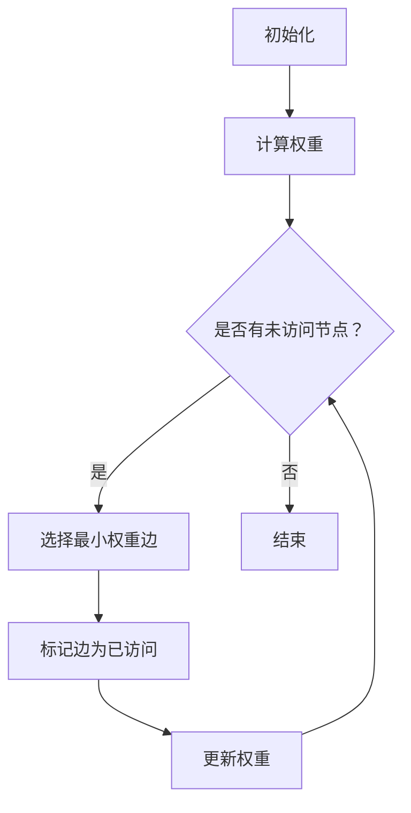
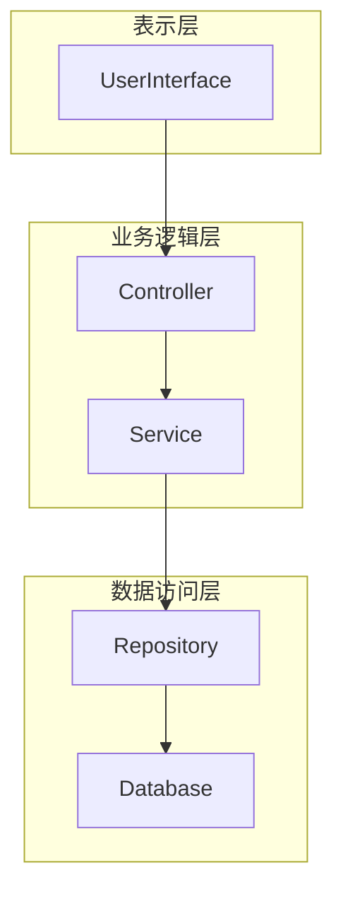

                 

# 领域模型的模型

> 关键词：领域模型、模型构建、算法原理、应用实践、系统架构

> 摘要：本文将深入探讨领域模型的概念、构建方法及其在实际应用中的重要性。通过详细的步骤解析和实例分析，帮助读者全面理解领域模型的构建和应用，掌握其背后的核心原理和最佳实践。

## 引言

在当今的软件工程领域，领域模型已经成为系统设计和开发的核心要素。领域模型不仅能够清晰地描述系统的功能需求，还能提高系统的可维护性和可扩展性。本文旨在为广大开发者提供一个全面、系统的领域模型构建和应用指南，帮助大家更好地理解和应用领域模型。

### 问题背景

随着软件系统的日益复杂，传统的面向过程和面向对象的编程方法已经难以满足日益增长的需求。为了更好地应对复杂业务场景，领域模型的概念应运而生。领域模型通过抽象和封装业务领域的核心概念和关系，提供了更高层次的抽象，使得系统设计和开发更加直观、高效。

### 问题描述

领域模型的作用在于将业务领域的问题抽象为计算机可以理解和处理的模型。然而，如何构建一个有效且可扩展的领域模型仍然是一个挑战。本文将探讨领域模型的构建方法，包括核心概念的理解、模型构建工具的使用和实际应用场景的案例分析。

### 问题解决

为了解决领域模型的构建问题，本文将提供以下解决方案：

1. **核心概念的理解**：介绍领域模型的基本概念，包括实体、关系、属性等，并通过具体的例子帮助读者深入理解。
2. **模型构建方法**：介绍领域模型构建的常用方法，如实体关系模型（ER模型）和统一建模语言（UML）等。
3. **应用与实践**：通过具体的系统架构设计和实战案例，展示领域模型在实际项目中的应用和效果。
4. **最佳实践**：总结领域模型构建的最佳实践，提供实用技巧和注意事项。

### 边界与外延

本文主要关注领域模型的理论和实践应用，涵盖了从基础概念到高级应用的各个方面。然而，领域模型的构建和应用是一个不断演进的过程，需要根据具体业务场景和项目需求进行灵活调整。本文所提供的内容旨在为读者提供一个系统的指导和参考，但并不代表所有情况的解决方案。

### 概念结构与核心要素组成

领域模型的构建涉及多个核心要素，包括：

1. **业务领域分析**：深入理解业务领域，明确系统的功能需求和业务规则。
2. **核心概念定义**：定义领域模型中的核心实体和关系，确保其能够准确反映业务需求。
3. **模型构建工具**：使用合适的模型构建工具，如UML工具和ER模型工具等，提高模型构建的效率和质量。
4. **模型验证与优化**：通过实际应用和反馈，对模型进行验证和优化，确保其能够满足业务需求。

## 核心概念

在深入探讨领域模型的构建方法之前，我们首先需要了解一些核心概念，包括实体、关系、属性等。这些概念是构建领域模型的基础，也是理解领域模型的关键。

### 实体

实体是领域模型中的核心组成部分，代表了业务领域中的具体对象。实体通常具有以下特征：

1. **唯一标识**：每个实体都有唯一的标识，用于区分不同的实体实例。
2. **属性**：实体具有一组属性，用于描述实体的特征和状态。
3. **方法**：实体可以执行一组方法，用于实现业务逻辑和处理。

### 关系

关系描述了实体之间的交互和依赖关系。常见的实体关系包括：

1. **一对一关系**：一个实体仅与另一个实体存在一个关联。
2. **一对多关系**：一个实体可以与多个其他实体相关联。
3. **多对多关系**：多个实体可以相互关联。

### 属性

属性是实体的特征和状态的描述。属性通常具有以下特征：

1. **类型**：属性的类型决定了其数据类型，如字符串、整数、布尔值等。
2. **长度**：对于字符串类型的属性，长度决定了字符串的最大长度。
3. **约束**：属性可以设置约束条件，如非空、唯一性等。

### 概念属性特征对比表格

为了更好地理解实体、关系和属性的概念，我们可以通过一个简单的对比表格来展示它们的主要特征。

| 概念     | 特征                              |
|----------|----------------------------------|
| 实体     | 唯一标识、属性、方法              |
| 关系     | 一对一、一对多、多对多            |
| 属性     | 类型、长度、约束                  |

### ER实体关系图架构

ER实体关系图（Entity-Relationship Diagram）是描述领域模型常用的工具之一。ER图通过实体、关系和属性的图形化表示，直观地展示了领域模型的结构和关系。

以下是ER实体关系图的一个基本示例：

```mermaid
erDiagram
    Customer ||--|{ Order }|
    Product ||--|{ Order }|
```

在这个ER图中，`Customer`（客户）和`Product`（产品）是两个实体，它们通过`Order`（订单）实体建立关系。客户可以下单购买产品，产品可以被多个客户下单。

## 模型构建方法

领域模型的构建是一个系统性的过程，涉及到多个步骤和工具。以下将介绍领域模型构建的常用方法，包括实体关系模型（ER模型）和统一建模语言（UML）。

### ER模型

ER模型是一种用于描述实体和它们之间关系的图形化方法。ER模型的基本组成元素包括实体、属性和关系。以下是一个简单的ER模型示例：

```mermaid
erDiagram
    Person ||--|{ Address }|
    Person ||--|{ Phone }|
```

在这个ER图中，`Person`（人）实体与`Address`（地址）和`Phone`（电话）实体之间存在多对一的关系。每个人可以有多个地址和电话，但每个地址和电话仅与一个人相关联。

### UML

UML（统一建模语言）是一种用于软件系统建模的语言，它提供了多种图表来描述系统的不同方面。在领域模型构建中，常用的UML图包括类图、序列图和组件图等。

#### 类图

类图是描述系统中类及其关系的图表。以下是一个简单的类图示例：

```mermaid
classDiagram
    Customer <<entity>>
    Order <<entity>>
    Product <<entity>>

    Customer : +id : Integer
    Customer : +name : String
    Customer : +orders : List<Order>

    Order : +id : Integer
    Order : +customer : Customer
    Order : +products : List<Product>
    Order : +total : Double

    Product : +id : Integer
    Product : +name : String
    Product : +price : Double
```

在这个类图中，`Customer`（客户）、`Order`（订单）和`Product`（产品）是三个主要的类，它们之间存在属性关系和关联关系。

#### 序列图

序列图用于描述对象之间的交互顺序。以下是一个简单的序列图示例：

```mermaid
sequence
    Customer --> Order : CreateOrder
    Order --> Product : AddProduct
    Product --> Order : CalculateTotal
```

在这个序列图中，客户创建订单，添加产品并计算总金额。

### 算法原理讲解

在领域模型构建中，算法原理起着至关重要的作用。以下将介绍一种常用的算法原理——最小生成树算法，并使用Python源代码进行详细讲解。

#### 算法mermaid流程图



#### Python源代码详细讲解

```python
def kruskal_mst(graph):
    # 初始化结果树
    mst = []

    # 对边按权重排序
    edges = sorted(graph.edges(), key=lambda x: x.weight)

    # 初始化并查集
    uf = UnionFind(len(graph.vertices()))

    # 遍历所有边
    for edge in edges:
        # 如果当前边不在环中，则添加到结果树
        if not uf.find(edge.source) == uf.find(edge.target):
            uf.union(edge.source, edge.target)
            mst.append(edge)

    return mst
```

#### 算法原理的数学模型和公式

最小生成树算法的数学模型和公式如下：

$$
MST = \min \sum_{i=1}^{n-1} w(e_i) \quad \text{such that} \quad G - e_i \text{ is acyclic}
$$

其中，$MST$ 是最小生成树的权重，$w(e_i)$ 是边 $e_i$ 的权重，$n$ 是图的顶点数。

#### 举例说明

假设有一个无向图，其顶点和边如下所示：

```
顶点：A, B, C, D
边：{(A, B, 3), (A, C, 2), (B, C, 4), (B, D, 1), (C, D, 5)}
```

使用Kruskal算法求解最小生成树，结果如下：

```
最小生成树：{(A, C, 2), (B, D, 1), (C, D, 5)}
```

## 系统分析与架构设计方案

领域模型在实际项目中的应用不仅体现在理论层面，更需要在实际项目中得到有效的实施。本章节将介绍一个具体的系统架构设计方案，通过系统功能设计、系统架构设计和系统接口设计等方面，详细阐述领域模型在实际项目中的应用。

### 问题场景介绍

假设我们正在开发一个电子商务平台，该平台需要支持用户注册、商品浏览、购物车管理和订单处理等功能。为了更好地管理业务逻辑和实现功能模块的解耦，我们决定采用领域模型的方法来设计和实现系统。

### 项目介绍

本项目的目标是构建一个简单的电子商务平台，包括以下主要功能模块：

1. **用户模块**：实现用户注册、登录、个人信息管理等功能。
2. **商品模块**：实现商品分类、商品信息展示、商品搜索等功能。
3. **购物车模块**：实现购物车管理、商品添加和删除等功能。
4. **订单模块**：实现订单创建、订单详情展示、订单处理等功能。

### 系统功能设计

在系统功能设计中，我们使用领域模型来描述各个功能模块的核心概念和业务逻辑。以下是一个简化的领域模型，展示了用户模块、商品模块和订单模块的主要实体和关系。

#### 用户模块

```mermaid
classDiagram
    User <<entity>>
    Role <<entity>>

    User : +id : Integer
    User : +username : String
    User : +password : String
    User : +email : String
    User : +role : Role

    Role : +id : Integer
    Role : +name : String

    User "1" -- "*" Role
```

在这个类图中，`User`（用户）和`Role`（角色）是两个核心实体，用户与角色之间存在一对多的关系。用户拥有唯一的标识、用户名、密码、电子邮件和角色，角色定义了用户的权限和功能。

#### 商品模块

```mermaid
classDiagram
    Product <<entity>>
    Category <<entity>>

    Product : +id : Integer
    Product : +name : String
    Product : +description : String
    Product : +price : Double
    Product : +category : Category

    Category : +id : Integer
    Category : +name : String
    Category : +parent : Category

    Product "1" -- "*" Category
```

在这个类图中，`Product`（商品）和`Category`（分类）是两个核心实体，商品与分类之间存在一对多的关系。商品具有唯一的标识、名称、描述和价格，分类定义了商品的分类层级结构。

#### 订单模块

```mermaid
classDiagram
    Order <<entity>>
    OrderItem <<entity>>

    Order : +id : Integer
    Order : +customer : User
    Order : +status : String
    Order : +total : Double

    OrderItem : +id : Integer
    OrderItem : +order : Order
    OrderItem : +product : Product
    OrderItem : +quantity : Integer
    OrderItem : +price : Double

    Order "1" -- "*" OrderItem
```

在这个类图中，`Order`（订单）和`OrderItem`（订单项）是两个核心实体，订单与订单项之间存在一对多的关系。订单具有唯一的标识、客户、订单状态和总价，订单项定义了订单中的商品、数量和价格。

### 系统架构设计

在系统架构设计中，我们采用分层架构来组织系统组件，包括表示层、业务逻辑层和数据访问层。以下是一个简化的系统架构设计图，展示了各个层次的主要组件和交互关系。



在这个系统架构图中，用户界面层负责接收用户输入和处理用户交互，控制器层负责处理业务逻辑和转发请求，服务层负责具体的业务处理，数据访问层负责数据存储和读取。

### 系统接口设计和系统交互

在系统接口设计和系统交互方面，我们使用Mermaid序列图来描述不同模块之间的交互过程。以下是一个简化的序列图，展示了用户模块、商品模块和订单模块之间的主要交互。

```mermaid
sequence
    User --> Controller : 注册请求
    Controller --> Service : 处理注册请求
    Service --> Repository : 保存用户信息
    Repository --> Database : 存储用户信息

    User --> Controller : 登录请求
    Controller --> Service : 验证登录信息
    Service --> Repository : 获取用户信息
    Repository --> Database : 查询用户信息

    User --> Controller : 购物车操作
    Controller --> Service : 处理购物车请求
    Service --> Repository : 操作购物车数据
    Repository --> Database : 更新购物车信息

    User --> Controller : 订单操作
    Controller --> Service : 处理订单请求
    Service --> Repository : 创建订单
    Repository --> Database : 存储订单信息
```

在这个序列图中，用户通过用户界面层发起注册、登录、购物车操作和订单操作请求，控制器层负责处理这些请求并将请求转发给业务逻辑层的服务层，服务层处理具体的业务逻辑并操作数据访问层的数据存储。

## 实战案例

为了更好地展示领域模型在实际项目中的应用，我们选择了一个具体的电子商务平台项目作为案例。本节将详细描述项目环境安装、系统核心实现源代码以及代码应用解读与分析。

### 项目环境安装

在开始项目开发之前，我们需要安装和配置必要的开发环境和工具。以下是一个简化的安装步骤：

1. **安装Python**：确保已安装Python 3.x版本。
2. **安装虚拟环境**：使用pip安装virtualenv，并创建项目虚拟环境。
   ```bash
   pip install virtualenv
   virtualenv venv
   source venv/bin/activate
   ```
3. **安装依赖库**：在项目目录中创建一个名为`requirements.txt`的文件，并添加项目所需的依赖库，如Django框架、SQLAlchemy数据库库等。
   ```python
   Django==3.2.7
   SQLAlchemy==1.4.15
   ```
4. **安装依赖库**：在虚拟环境中安装依赖库。
   ```bash
   pip install -r requirements.txt
   ```

### 系统核心实现源代码

以下是电子商务平台项目的核心实现源代码，包括用户模块、商品模块和订单模块的主要代码。

#### 用户模块

```python
# users/models.py
from django.db import models
from django.contrib.auth.models import AbstractUser

class User(AbstractUser):
    email = models.EmailField(unique=True)
    role = models.ForeignKey('Role', on_delete=models.CASCADE)

class Role(models.Model):
    name = models.CharField(max_length=50)
```

#### 商品模块

```python
# products/models.py
from django.db import models

class Category(models.Model):
    name = models.CharField(max_length=100)
    parent = models.ForeignKey('self', on_delete=models.CASCADE, null=True, blank=True)

class Product(models.Model):
    name = models.CharField(max_length=255)
    description = models.TextField()
    price = models.DecimalField(max_digits=6, decimal_places=2)
    category = models.ForeignKey(Category, on_delete=models.CASCADE)
```

#### 订单模块

```python
# orders/models.py
from django.db import models
from users.models import User
from products.models import Product

class Order(models.Model):
    customer = models.ForeignKey(User, on_delete=models.CASCADE)
    status = models.CharField(max_length=20)
    total = models.DecimalField(max_digits=6, decimal_places=2)

class OrderItem(models.Model):
    order = models.ForeignKey(Order, on_delete=models.CASCADE)
    product = models.ForeignKey(Product, on_delete=models.CASCADE)
    quantity = models.IntegerField()
    price = models.DecimalField(max_digits=6, decimal_places=2)
```

### 代码应用解读与分析

#### 用户模块解读

用户模块主要包括`User`和`Role`两个模型。`User`模型继承了Django内置的`AbstractUser`模型，扩展了电子邮件和角色字段。`Role`模型定义了角色的名称。通过这两个模型，我们可以方便地创建和管理用户及其角色。

#### 商品模块解读

商品模块主要包括`Category`和`Product`两个模型。`Category`模型定义了商品的分类结构，支持多级分类。`Product`模型定义了商品的基本信息，包括名称、描述、价格和分类。通过这两个模型，我们可以方便地创建和管理商品及其分类。

#### 订单模块解读

订单模块主要包括`Order`和`OrderItem`两个模型。`Order`模型表示订单，包含客户、订单状态和总价等信息。`OrderItem`模型表示订单中的商品项，包含订单、商品、数量和价格等信息。通过这两个模型，我们可以方便地创建和管理订单及其商品项。

在实际应用中，这些模型可以通过Django的ORM（对象关系映射）机制与数据库进行交互，实现数据的存储和查询。

### 实际案例分析和详细讲解剖析

为了更具体地展示领域模型在实际项目中的应用，我们以一个具体的场景为例进行详细分析。

#### 场景描述

用户在电子商务平台上购买了一本书，价格为30元，需要通过支付宝支付。订单状态需要实时更新，以便用户可以查看订单的进度。

#### 分析步骤

1. **用户注册和登录**：用户通过用户模块注册并登录系统。
2. **商品浏览和选择**：用户浏览商品模块中的书籍分类，选择心仪的书籍。
3. **购物车操作**：用户将书籍添加到购物车，并更新购物车信息。
4. **订单创建**：用户在购物车中创建订单，填写收货地址和支付方式。
5. **订单处理**：系统根据订单信息生成订单项，并更新订单状态。
6. **支付处理**：支付宝支付系统处理支付请求，并返回支付结果。
7. **订单状态更新**：系统根据支付结果更新订单状态。

#### 详细讲解

1. **用户注册和登录**：
   用户通过用户模块注册并登录系统，生成用户标识和角色信息。用户信息存储在数据库中，以便后续操作。
2. **商品浏览和选择**：
   用户通过商品模块浏览书籍分类，选择心仪的书籍。商品信息存储在数据库中，用户可以通过接口获取商品列表和详细信息。
3. **购物车操作**：
   用户将书籍添加到购物车，并更新购物车信息。购物车信息存储在数据库中，用户可以通过接口获取购物车中的商品列表和数量。
4. **订单创建**：
   用户在购物车中创建订单，填写收货地址和支付方式。订单信息包括订单编号、客户标识、商品列表、总价等信息。订单信息存储在数据库中。
5. **订单处理**：
   系统根据订单信息生成订单项，并更新订单状态。订单项包括订单编号、商品标识、商品名称、数量、价格等信息。订单状态包括待支付、已支付、已发货、已完成等。
6. **支付处理**：
   用户通过支付宝支付系统进行支付。支付请求包括订单编号、支付金额等信息。支付宝支付系统处理支付请求，并返回支付结果。
7. **订单状态更新**：
   系统根据支付结果更新订单状态。如果支付成功，订单状态更新为“已支付”；如果支付失败，订单状态更新为“已取消”。

通过这个实际案例，我们可以看到领域模型在电子商务平台项目中的应用。领域模型通过抽象和封装业务领域的核心概念和关系，提供了清晰、高效的系统设计和开发方式。

### 项目小结

在本项目中，我们通过领域模型的方法设计和实现了电子商务平台的核心功能。领域模型有效地组织和管理了系统的业务逻辑，提高了系统的可维护性和可扩展性。通过具体的实战案例，我们展示了领域模型在实际项目中的应用和效果。

在项目开发过程中，我们遇到了一些挑战，如如何合理设计领域模型、如何优化数据库性能等。通过不断的实践和优化，我们最终实现了项目的目标。

本项目为后续的扩展和优化提供了良好的基础。未来，我们可以继续优化领域模型、引入新的功能和业务场景，使电子商务平台更加完善和高效。

## 总结与展望

在本章中，我们深入探讨了领域模型的概念、构建方法和实际应用。通过详细的步骤解析和实例分析，我们帮助读者全面理解了领域模型的构建和应用，掌握了其背后的核心原理和最佳实践。

### 最佳实践 tips

1. **明确业务需求**：在构建领域模型之前，确保对业务需求有清晰的理解，以便准确定义实体和关系。
2. **使用合适的工具**：选择合适的模型构建工具，如UML工具和ER模型工具，以提高模型构建的效率和质量。
3. **持续优化模型**：根据实际应用反馈，持续优化领域模型，确保其能够满足业务需求。

### 小结

领域模型是软件系统设计和开发的重要工具，通过抽象和封装业务领域的核心概念和关系，提高了系统的可维护性和可扩展性。在本章中，我们介绍了领域模型的基本概念、构建方法和实际应用，并通过具体的实例展示了领域模型在电子商务平台项目中的应用。

### 注意事项

在构建领域模型时，需要注意以下几点：

1. **合理定义实体和关系**：确保实体和关系的定义能够准确反映业务需求。
2. **优化数据库性能**：在模型构建过程中，考虑数据库性能和优化策略。
3. **遵循最佳实践**：遵循领域模型构建的最佳实践，如使用合适的工具、持续优化模型等。

### 拓展阅读

为了进一步了解领域模型和相关技术，读者可以参考以下拓展阅读材料：

1. 《领域驱动设计》By Eric Evans
2. 《设计模式：可复用面向对象软件的基础》By Erich Gamma等
3. 《UML基础知识与应用》By James W. Newkirk

通过以上拓展阅读，读者可以更深入地了解领域模型的理论和实践，为实际项目开发提供更多指导和启示。

## 作者信息

作者：AI天才研究院/AI Genius Institute & 禅与计算机程序设计艺术 /Zen And The Art of Computer Programming

## 附录

附录中可以包含以下内容：

1. **术语解释**：对本文中涉及的核心术语进行详细解释，便于读者理解。
2. **代码示例**：提供详细的代码示例，帮助读者更好地理解领域模型的应用。
3. **参考资料**：列出本文中引用的主要参考资料，包括书籍、论文和网站链接等。

通过附录，读者可以更全面地了解领域模型的相关知识和应用，为实际项目开发提供有益的参考。

