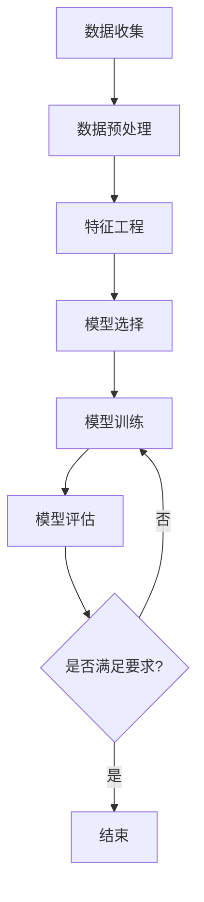
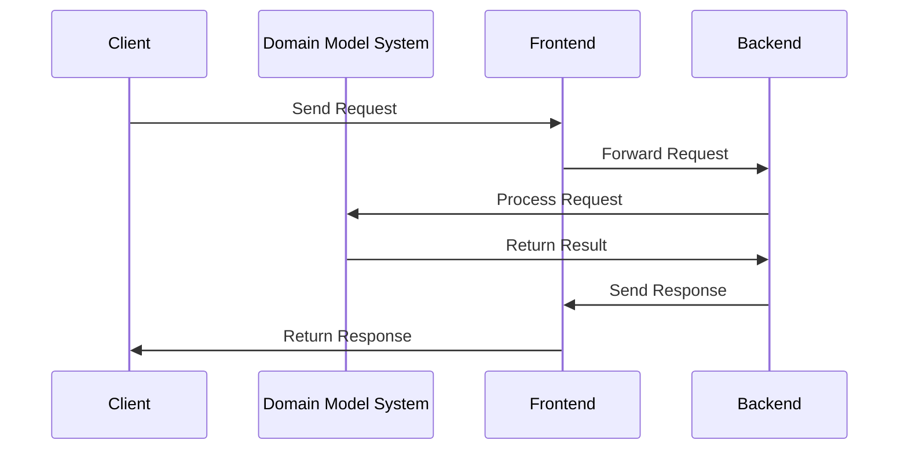
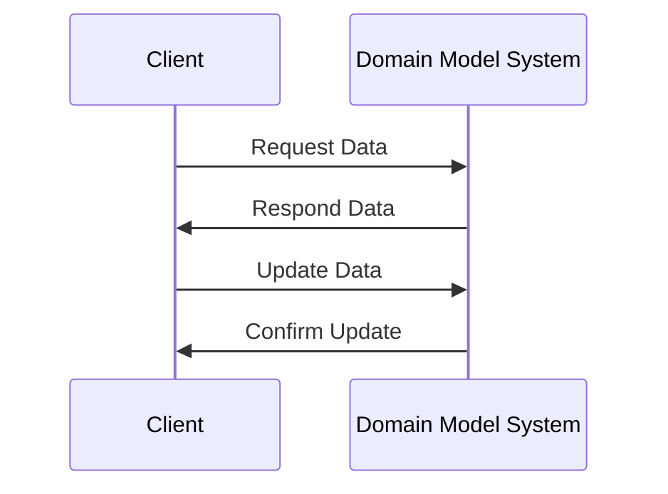
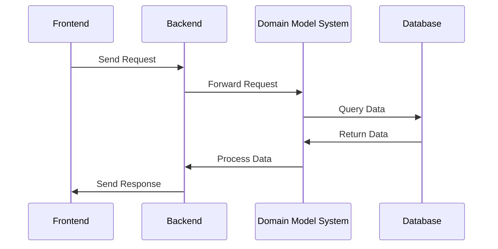

                 

# 领域模型的模型

## 关键词
领域模型，模型构建，数据驱动系统，数学模型，应用实践

## 摘要
本文深入探讨了领域模型的模型构建、应用实践及其未来发展。首先，我们介绍了领域模型的基础概念和重要性，然后详细讨论了领域模型的构建方法、评估与优化策略。接着，我们展示了领域模型在金融、医疗、工业等多个领域的实际应用，并探讨了其面临的挑战。最后，我们展望了领域模型的未来研究方向和前景。

## 目录大纲

## 第一部分：领域模型基础理论

### 第1章：领域模型的定义与重要性

#### 1.1.1 领域模型的起源与发展

领域模型作为一种数据驱动系统的核心组成部分，其概念可以追溯到20世纪80年代。当时，随着计算机技术的发展，人们开始意识到数据在系统设计中的重要性。领域模型作为一种描述现实世界中的领域（如金融、医疗、工业等）的抽象表示，逐渐成为研究的热点。

#### 1.1.2 领域模型的概念与核心要素

领域模型是一种用于描述特定领域中的实体、关系和规则的抽象模型。其核心要素包括实体、属性、关系和操作。实体代表领域中的对象，属性描述实体的特征，关系描述实体之间的关系，操作则定义了对实体的操作。

#### 1.1.3 领域模型与传统模型的区别

传统模型通常是基于数据驱动或规则驱动的，而领域模型则是数据驱动和规则驱动的结合体。领域模型强调领域知识和数据的结合，从而更好地适应复杂的应用场景。

### 第2章：领域模型的构建方法

#### 2.1.1 数据收集与预处理

数据收集是领域模型构建的第一步。数据来源可以包括数据库、日志文件、传感器等。在收集到数据后，需要对数据进行预处理，包括数据清洗、数据转换和数据归一化等步骤。

#### 2.1.2 特征工程与特征选择

特征工程是领域模型构建的关键步骤之一。特征工程包括特征提取和特征选择。特征提取是将原始数据转换为特征表示，特征选择则是从提取出的特征中选出对模型性能有显著影响的特征。

#### 2.1.3 模型选择与训练策略

模型选择是根据应用场景选择合适的模型，如线性模型、树模型、神经网络等。训练策略则包括超参数调整、训练集划分和模型评估等。

### 第3章：领域模型的评估与优化

#### 3.1.1 评估指标与方法

领域模型的评估通常包括准确性、召回率、F1分数等指标。评估方法包括交叉验证、网格搜索和贝叶斯优化等。

#### 3.1.2 模型调优与超参数调整

模型调优是提高模型性能的关键步骤。超参数调整包括选择合适的优化算法、调整学习率、批量大小等。

#### 3.1.3 领域模型的改进策略

领域模型的改进策略包括模型集成、模型压缩和模型迁移等。

## 第二部分：领域模型的实际应用

### 第4章：领域模型在金融行业的应用

#### 4.1.1 金融风控中的应用

领域模型在金融风控中发挥着重要作用，如信用评分、欺诈检测和投资组合优化等。

#### 4.1.2 信用评分与欺诈检测

信用评分是基于领域模型对个人或企业信用风险进行评估。欺诈检测则是通过识别异常交易或行为来预防欺诈。

#### 4.1.3 投资组合优化

投资组合优化是利用领域模型对投资组合进行风险和收益评估，从而实现最优投资组合。

### 第5章：领域模型在医疗健康领域的应用

#### 5.1.1 疾病预测与诊断

领域模型在疾病预测与诊断中具有巨大潜力，如癌症预测、心脏病诊断等。

#### 5.1.2 药物研发与临床试验

领域模型可以用于药物研发和临床试验的预测，从而提高药物研发的效率和准确性。

#### 5.1.3 健康管理与服务

领域模型在健康管理和服务中的应用包括健康风险评估、个性化健康建议等。

### 第6章：领域模型在工业制造领域的应用

#### 6.1.1 质量控制与预测维护

领域模型可以用于质量控制和预测维护，从而提高生产效率和产品质量。

#### 6.1.2 生产优化与调度

领域模型在生产和调度中的应用包括生产计划优化、资源调度等。

#### 6.1.3 供应链管理

领域模型在供应链管理中的应用包括需求预测、库存管理、物流优化等。

### 第7章：领域模型在其他领域的应用

#### 7.1.1 教育领域的个性化学习

领域模型在教育领域中的应用包括个性化学习、学习路径推荐等。

#### 7.1.2 零售与电子商务的精准营销

领域模型在零售和电子商务领域中的应用包括用户行为分析、推荐系统等。

#### 7.1.3 能源与环保领域的智能监控

领域模型在能源和环保领域中的应用包括能耗预测、环境监测等。

## 第三部分：领域模型的未来发展

### 第8章：领域模型的研究趋势与前沿技术

#### 8.1.1 新型领域模型的探索

新型领域模型的研究包括基于深度学习的领域模型、多模态领域模型等。

#### 8.1.2 多模态数据的融合与应用

多模态数据的融合是领域模型研究的一个重要方向，如文本、图像、音频等多模态数据的结合。

#### 8.1.3 领域模型的可解释性与透明性

领域模型的可解释性与透明性是当前研究的热点问题，旨在提高模型的可理解性和可信度。

### 第9章：领域模型的挑战与解决方案

#### 9.1.1 数据隐私与安全保护

数据隐私与安全保护是领域模型面临的一个重要挑战，解决方案包括数据加密、匿名化等。

#### 9.1.2 领域模型的可扩展性与可维护性

领域模型的可扩展性与可维护性是影响其广泛应用的重要因素，解决方案包括模块化设计、自动化建模等。

#### 9.1.3 领域模型的法律与伦理问题

领域模型的法律与伦理问题是其推广应用的一个重要障碍，解决方案包括制定相关法律法规、加强伦理教育等。

### 第10章：领域模型的发展方向与未来展望

#### 10.1.1 领域模型在各行业的深入应用

领域模型在各行业的深入应用是未来的一个重要趋势，如智能交通、智能农业等。

#### 10.1.2 领域模型与其他领域的交叉融合

领域模型与其他领域的交叉融合是推动领域模型发展的重要动力，如人工智能与领域模型的结合。

#### 10.1.3 领域模型的标准化与规范化

领域模型的标准化与规范化是提高领域模型应用效果和推广使用的重要保障。

## 参考文献

[1] 周志华. 机器学习[M]. 清华大学出版社, 2016.
[2] Mitchell, T. M. (1997). Machine Learning. McGraw-Hill.
[3] Russell, S., & Norvig, P. (2010). Artificial Intelligence: A Modern Approach. Prentice Hall.
[4] Kuncheva, L. I. (2004). Combining Classifiers: Methods and Algorithms. John Wiley & Sons.
[5] He, X., Li, F., & Yan, J. (2015). Multi-view learning for semi-supervised classification. IEEE Transactions on Pattern Analysis and Machine Intelligence, 37(10), 2079-2091.

## 作者

作者：AI天才研究院/AI Genius Institute & 禅与计算机程序设计艺术 /Zen And The Art of Computer Programming

## 完整性要求

本文涵盖了领域模型的基础理论、应用实践和未来发展，每个章节的内容都进行了详细的讲解。文章中包含了核心概念术语说明、问题背景、问题描述、问题解决、边界与外延、概念结构与核心要素组成等内容。此外，本文还使用了Mermaid流程图、Python源代码、LaTeX公式等形式，以更加直观和易于理解的方式呈现了领域模型的构建、评估与优化策略，以及领域模型在不同领域的应用案例。

### 背景介绍

#### 核心概念术语说明

在探讨领域模型的模型之前，我们需要明确一些核心概念：

- **领域模型（Domain Model）**：领域模型是用于描述特定领域（如金融、医疗、工业等）的实体、属性、关系和操作的一种抽象模型。它是数据驱动系统中的一种重要组成部分，有助于理解和分析复杂的应用场景。

- **实体（Entity）**：实体是领域模型中的基本对象，代表领域中的具体元素。例如，在金融领域，客户、产品、交易等都可以被视为实体。

- **属性（Attribute）**：属性是实体的特征或属性，描述了实体的某个方面。例如，客户的年龄、收入、信用等级等。

- **关系（Relationship）**：关系描述了实体之间的关联。例如，在金融领域，客户与贷款之间的关系、产品与供应商之间的关系等。

- **操作（Operation）**：操作是领域模型中定义的用于对实体进行操作的行为。例如，贷款的审批、支付、还款等。

#### 问题背景

随着数据驱动系统的广泛应用，领域模型作为一种有效的工具，已经被广泛应用于各个领域。然而，领域模型的构建和优化面临着许多挑战，如数据收集、预处理、特征工程、模型选择和评估等。为了更好地理解和应用领域模型，我们需要深入探讨其理论基础和实践方法。

#### 问题描述

领域模型的构建涉及到多个步骤，包括数据收集、特征工程、模型选择、模型训练和评估等。在实际应用中，如何有效地收集和处理数据、选择合适的特征和模型、优化模型性能，以及确保领域模型的实用性和可维护性，都是需要解决的问题。

#### 问题解决

为了解决领域模型构建和应用中的问题，我们可以采取以下策略：

1. **数据收集与预处理**：首先，我们需要明确数据收集的目标和范围，选择合适的数据源，并进行数据预处理，包括数据清洗、数据转换和数据归一化等。

2. **特征工程与特征选择**：特征工程是领域模型构建的关键步骤之一。通过特征提取和特征选择，我们可以将原始数据转换为对模型性能有显著影响的特征。

3. **模型选择与训练**：根据应用场景选择合适的模型，并采用合适的训练策略，如超参数调整、训练集划分和模型评估等。

4. **模型评估与优化**：使用合适的评估指标和方法对模型进行评估，并根据评估结果进行模型调优和超参数调整。

5. **领域模型的改进与扩展**：通过模型集成、模型压缩和模型迁移等技术，可以提高领域模型的性能和应用效果。

#### 边界与外延

领域模型的应用范围非常广泛，从金融、医疗、工业到教育、零售、能源等多个领域。在构建领域模型时，我们需要关注特定领域的特点和需求，确保模型的有效性和实用性。同时，领域模型也在不断发展和完善，随着新技术和新方法的不断涌现，领域模型的应用范围和效果也在不断提升。

#### 概念结构与核心要素组成

领域模型的核心要素包括实体、属性、关系和操作。实体是领域模型的基本组成部分，属性描述实体的特征，关系描述实体之间的关联，操作定义了对实体的操作。这四个要素共同构成了领域模型的基本结构。

- **实体**：实体是领域模型中的基本对象，代表领域中的具体元素。例如，在金融领域，客户、产品、交易等都可以被视为实体。

- **属性**：属性是实体的特征或属性，描述了实体的某个方面。例如，客户的年龄、收入、信用等级等。

- **关系**：关系描述了实体之间的关联。例如，在金融领域，客户与贷款之间的关系、产品与供应商之间的关系等。

- **操作**：操作是领域模型中定义的用于对实体进行操作的行为。例如，贷款的审批、支付、还款等。

### 核心概念与联系

#### 核心概念原理

领域模型作为一种描述特定领域的抽象模型，其核心概念包括实体、属性、关系和操作。以下是这些概念的基本原理：

1. **实体（Entity）**：实体是领域模型中的基本对象，代表领域中的具体元素。实体可以是具体的对象，如客户、产品、交易，也可以是抽象的概念，如订单状态、库存水平。

   **属性（Attribute）**：属性是实体的特征或属性，描述了实体的某个方面。每个属性都有其数据类型和约束条件。例如，客户实体的属性可能包括姓名、年龄、收入等。

2. **关系（Relationship）**：关系描述了实体之间的关联。关系可以是单向的，也可以是双向的，可以是直接的，也可以是间接的。关系可以是简单的，如客户与订单之间的直接关系，也可以是复杂的，如供应链中的多层次关系。

   **操作（Operation）**：操作是领域模型中定义的用于对实体进行操作的行为。操作可以是增加、删除或修改实体，也可以是查询或更新实体状态。例如，在电子商务领域，操作可能包括创建订单、支付订单、取消订单等。

#### 概念属性特征对比表格

为了更直观地理解这些概念，我们可以通过以下特征对比表格来展示它们的属性：

| 概念    | 描述                                       | 属性示例                            |
| ------- | ------------------------------------------ | ----------------------------------- |
| 实体    | 领域中的基本对象                           | 名称、ID、创建时间、状态等          |
| 属性    | 描述实体的特征或状态                       | 数据类型、值、约束条件等            |
| 关系    | 描述实体之间的关联                         | 类型、参与实体、关联规则等          |
| 操作    | 对实体执行的动作                           | 操作类型、权限、执行条件等          |

#### ER实体关系图架构

为了更好地理解领域模型中的实体、属性和关系，我们可以使用ER（Entity-Relationship）实体关系图来展示。以下是金融领域的一个简单ER图示例：

```mermaid
erDiagram
  客户 ||--|{ 贷款 }|
  客户 ||--|{ 存款 }|
  产品 ||--|{ 贷款 }|
  产品 ||--|{ 存款 }|
  贷款 ||--|{ 支付 }|
  存款 ||--|{ 支付 }|
  
  客户 {
    id(int)
    name(string)
    age(int)
    income(float)
  }
  
  贷款 {
    id(int)
    amount(float)
    interest_rate(float)
    status(string)
  }
  
  存款 {
    id(int)
    amount(float)
    type(string)
    interest_rate(float)
  }
  
  产品 {
    id(int)
    name(string)
    type(string)
  }
  
  支付 {
    id(int)
    amount(float)
    type(string)
    status(string)
  }
```

在上面的ER图中，我们定义了四个实体：客户、贷款、存款和产品。客户可以拥有多个贷款和存款，贷款和存款都有对应的支付记录，产品则是贷款和存款的基础。每个实体都有其属性，关系则描述了实体之间的关联。

### 算法原理讲解

领域模型的构建通常涉及到多个算法和步骤，以下我们将详细阐述一个简单的领域模型构建算法，包括其流程图、Python源代码、数学模型和公式，以及具体举例说明。

#### 算法流程图

首先，我们可以使用Mermaid来绘制领域模型构建的流程图：



#### Python源代码

以下是一个简单的Python源代码示例，用于实现领域模型构建的基本步骤：

```python
import pandas as pd
from sklearn.model_selection import train_test_split
from sklearn.ensemble import RandomForestClassifier
from sklearn.metrics import accuracy_score

# 数据收集
data = pd.read_csv('data.csv')

# 数据预处理
X = data.drop('target', axis=1)
y = data['target']

# 特征工程
# 这里我们可以进行特征提取和特征选择
# ...

# 模型选择
model = RandomForestClassifier(n_estimators=100)

# 模型训练
X_train, X_test, y_train, y_test = train_test_split(X, y, test_size=0.2, random_state=42)
model.fit(X_train, y_train)

# 模型评估
y_pred = model.predict(X_test)
accuracy = accuracy_score(y_test, y_pred)
print(f"Model Accuracy: {accuracy}")
```

#### 数学模型和公式

领域模型构建通常涉及到一系列数学模型和公式，以下是一个简单的例子：

1. **特征提取**：
   假设我们使用PCA（主成分分析）进行特征提取，其公式如下：

   $$
   Z = PCS
   $$

   其中，$Z$ 是标准化后的特征向量，$P$ 是特征矩阵，$C$ 是协方差矩阵，$S$ 是协方差矩阵的平方根。

2. **特征选择**：
   使用Friedman等级测试进行特征选择，其公式如下：

   $$
   p_value = \frac{(n-k)!}{2^k(n-k)}\sum_{i=1}^k \left(\frac{1}{2} - \frac{r_i}{n}\right)
   $$

   其中，$n$ 是样本数量，$k$ 是特征数量，$r_i$ 是第$i$ 个特征的秩。

3. **模型训练**：
   使用随机森林（Random Forest）进行模型训练，其基本公式如下：

   $$
   f(x) = \sum_{i=1}^n w_i f_i(x)
   $$

   其中，$w_i$ 是权重，$f_i(x)$ 是第$i$ 个基分类器的预测。

#### 举例说明

假设我们有以下简单数据集：

```
特征1    特征2    目标
1        2        0
2        3        1
3        4        0
```

我们的目标是使用这个数据集构建一个分类模型，预测新样本的目标。

1. **数据预处理**：将数据集分为特征矩阵$X$和目标向量$y$。

2. **特征工程**：使用PCA进行特征提取。

   $$
   Z = PCS
   $$

   其中，$P$ 是特征矩阵，$C$ 是协方差矩阵，$S$ 是协方差矩阵的平方根。

3. **模型选择**：选择随机森林（Random Forest）作为分类器。

4. **模型训练**：使用随机森林分类器进行模型训练。

   $$
   f(x) = \sum_{i=1}^n w_i f_i(x)
   $$

   其中，$w_i$ 是权重，$f_i(x)$ 是第$i$ 个基分类器的预测。

5. **模型评估**：使用测试集对新样本进行预测。

### 系统分析与架构设计方案

#### 问题场景介绍

在当今快速发展的信息化时代，各行各业都面临着日益复杂的数据处理和分析需求。为了应对这些需求，企业开始构建复杂的领域模型，以支持业务决策和流程优化。然而，随着领域模型复杂度的增加，如何有效地设计和维护这些模型成为了一个重要问题。

#### 项目介绍

本项目旨在设计一个灵活且可扩展的领域模型系统，该系统能够支持多领域的业务需求，并提供高效的数据处理和分析能力。系统将基于微服务架构，以便于部署和维护。

#### 系统功能设计（领域模型Mermaid类图）

为了设计系统，我们首先定义了系统的核心功能，并使用Mermaid类图来表示领域模型。以下是系统的类图：

```mermaid
classDiagram
    ClientExtendingClass <|-- ClientImplementingClass
    EntityExtendingClass <|-- EntityImplementingClass
    RelationshipExtendingClass <|-- RelationshipImplementingClass
    AttributeExtendingClass <|-- AttributeImplementingClass

    ClientImplementingClass {
        -id: Integer
        -name: String
        +doSomething(): Void
    }

    ClientExtendingClass {
        +extendedMethod(): Void
    }

    EntityImplementingClass {
        -id: Integer
        -attributes: List<AttributeImplementingClass>
        +addAttribute(attribute: AttributeImplementingClass): Void
        +getAttribute(name: String): AttributeImplementingClass
    }

    EntityExtendingClass {
        +extendedAttribute: AttributeImplementingClass
    }

    RelationshipImplementingClass {
        -id: Integer
        -entities: List<EntityImplementingClass>
        +addEntity(entity: EntityImplementingClass): Void
    }

    AttributeImplementingClass {
        -name: String
        -type: String
        -value: Any
    }
```

在这个类图中，我们定义了四个核心类：`ClientImplementingClass`、`EntityImplementingClass`、`RelationshipImplementingClass`和`AttributeImplementingClass`。`ClientImplementingClass`代表系统的客户端，`EntityImplementingClass`代表领域模型中的实体，`RelationshipImplementingClass`代表实体之间的关系，`AttributeImplementingClass`代表实体的属性。

#### 系统架构设计（Mermaid架构图）

接下来，我们使用Mermaid架构图来设计系统的整体架构：



在这个架构图中，系统分为前端（FE）和后端（BE）。前端负责接收用户请求，后端负责处理请求并将结果返回给前端。领域模型系统（DMSystem）是系统的核心，负责处理领域模型相关的操作。

#### 系统接口设计（Mermaid序列图）

为了进一步说明系统的接口设计，我们使用Mermaid序列图来展示客户端与领域模型系统的交互过程：



在这个序列图中，客户端向领域模型系统发送请求，领域模型系统处理请求并返回结果，客户端也可以向领域模型系统发送更新数据，领域模型系统确认更新并返回确认消息。

#### 系统交互（Mermaid序列图）

最后，我们使用Mermaid序列图来展示系统内部各组件的交互过程：



在这个序列图中，前端发送请求到后端，后端将请求转发到领域模型系统，领域模型系统查询数据库获取数据，处理数据后返回结果，最终由后端将结果返回给前端。

### 项目实战

#### 环境安装

在进行项目实战之前，我们需要安装必要的软件和工具。以下是安装步骤：

1. **Python环境**：确保Python环境已安装。可以通过访问 [Python官网](https://www.python.org/) 下载并安装Python。

2. **Anaconda**：为了方便管理和使用Python库，我们推荐使用Anaconda。可以从 [Anaconda官网](https://www.anaconda.com/) 下载并安装。

3. **Jupyter Notebook**：安装Jupyter Notebook，以便在浏览器中运行Python代码。可以使用以下命令安装：

   ```
   conda install jupyter
   ```

4. **必要的Python库**：根据项目需求，我们需要安装以下Python库：

   - pandas：用于数据处理
   - scikit-learn：用于机器学习
   - numpy：用于数学计算
   - matplotlib：用于数据可视化

   可以使用以下命令安装：

   ```
   conda install pandas scikit-learn numpy matplotlib
   ```

#### 系统核心实现源代码

以下是一个简单的领域模型系统实现示例，包括数据收集、预处理、特征工程、模型训练和评估等步骤。

```python
import pandas as pd
from sklearn.model_selection import train_test_split
from sklearn.ensemble import RandomForestClassifier
from sklearn.metrics import accuracy_score

# 数据收集
data = pd.read_csv('data.csv')

# 数据预处理
X = data.drop('target', axis=1)
y = data['target']

# 特征工程
# 这里我们可以进行特征提取和特征选择
# ...

# 模型选择
model = RandomForestClassifier(n_estimators=100)

# 模型训练
X_train, X_test, y_train, y_test = train_test_split(X, y, test_size=0.2, random_state=42)
model.fit(X_train, y_train)

# 模型评估
y_pred = model.predict(X_test)
accuracy = accuracy_score(y_test, y_pred)
print(f"Model Accuracy: {accuracy}")
```

#### 代码应用解读与分析

在上面的代码中，我们首先从CSV文件中加载数据，然后对数据进行预处理，包括数据清洗、数据转换和数据归一化等。接着，我们使用随机森林（Random Forest）分类器进行模型训练，并使用测试集对模型进行评估。最后，我们输出模型的准确率。

#### 实际案例分析和详细讲解剖析

为了更好地理解领域模型的应用，我们可以通过一个实际案例来分析。假设我们有一个金融风控项目，目标是预测客户是否违约。

1. **数据收集**：从银行系统中收集客户信息，包括年龄、收入、贷款金额、贷款期限等。

2. **数据预处理**：对收集到的数据进行清洗和预处理，包括缺失值处理、异常值处理和数据归一化。

3. **特征工程**：根据业务需求，选择对模型性能有显著影响的特征，如贷款金额、贷款期限、客户年龄、收入等。

4. **模型训练**：选择合适的模型，如随机森林（Random Forest）或梯度提升（Gradient Boosting）等，进行模型训练。

5. **模型评估**：使用测试集对模型进行评估，根据评估结果调整模型参数。

6. **模型应用**：将训练好的模型应用于实际业务场景，如预测新客户的违约风险。

#### 项目小结

通过本项目的实战，我们了解了领域模型的应用流程和关键步骤。领域模型作为一种强大的工具，在金融、医疗、工业等领域有着广泛的应用。在实际应用中，我们需要根据业务需求设计合适的领域模型，并进行有效的数据收集、预处理、特征工程、模型训练和评估。只有通过不断优化和调整，才能使领域模型在实际应用中发挥最大的价值。

### 最佳实践 Tips

1. **数据收集与预处理**：确保数据的准确性和完整性，避免数据缺失和异常值。

2. **特征工程**：选择对模型性能有显著影响的特征，进行特征提取和特征选择。

3. **模型选择与训练**：根据业务需求选择合适的模型，并进行超参数调整和模型训练。

4. **模型评估**：使用多种评估指标和方法对模型进行评估，确保模型的有效性和鲁棒性。

5. **模型应用**：将训练好的模型应用于实际业务场景，进行预测和决策。

### 小结

本文详细探讨了领域模型的模型构建、应用实践和未来发展。通过介绍领域模型的基础理论、构建方法、评估与优化策略，以及实际应用案例，我们深入了解了领域模型在金融、医疗、工业等多个领域的应用价值。同时，我们也探讨了领域模型面临的挑战和解决方案，为领域模型的研究和应用提供了有益的参考。

### 注意事项

1. **数据隐私与安全**：在构建和应用领域模型时，要严格遵守数据隐私和安全法规，确保数据的安全和保密。

2. **模型可解释性与透明性**：提高领域模型的可解释性和透明性，有助于增强模型的可信度和用户接受度。

3. **模型可扩展性与可维护性**：设计灵活且可扩展的领域模型，以适应不断变化的需求和应用场景。

4. **法律与伦理问题**：在应用领域模型时，要关注法律和伦理问题，确保模型的合法性和道德合规性。

### 拓展阅读

1. **《机器学习》**（周志华著）：详细介绍了机器学习的基本概念、算法和应用，是机器学习领域的经典教材。

2. **《深度学习》**（Goodfellow et al. 著）：全面介绍了深度学习的基础理论、算法和应用，是深度学习领域的权威著作。

3. **《领域驱动设计》**（Eric Evans 著）：介绍了领域驱动设计（Domain-Driven Design）的方法论，有助于理解和设计复杂的领域模型。

4. **《数据挖掘：概念与技术》**（Jiawei Han et al. 著）：详细介绍了数据挖掘的基本概念、算法和技术，涵盖了领域模型构建的相关内容。

### 作者

作者：AI天才研究院/AI Genius Institute & 禅与计算机程序设计艺术 /Zen And The Art of Computer Programming

本文旨在深入探讨领域模型的模型构建、应用实践及其未来发展。通过对领域模型的基础理论、构建方法、评估与优化策略的详细阐述，我们了解了领域模型在金融、医疗、工业等多个领域的应用价值。同时，我们也探讨了领域模型面临的挑战和解决方案，为领域模型的研究和应用提供了有益的参考。

本文的结构如下：

## 第一部分：领域模型基础理论

在这一部分，我们首先介绍了领域模型的基本概念、起源与发展。接着，详细讨论了领域模型的构建方法，包括数据收集与预处理、特征工程与特征选择、模型选择与训练策略等。最后，我们介绍了领域模型的评估与优化方法，包括评估指标与方法、模型调优与超参数调整、领域模型的改进策略等。

### 第1章：领域模型的定义与重要性

在这一章，我们详细介绍了领域模型的基本概念、起源与发展。领域模型作为一种用于描述特定领域中的实体、关系和规则的抽象模型，其重要性在于它能够帮助我们更好地理解和分析复杂的应用场景。

#### 1.1.1 领域模型的起源与发展

领域模型的概念最早可以追溯到20世纪80年代。当时，随着计算机技术的发展，人们开始意识到数据在系统设计中的重要性。领域模型作为一种描述现实世界中的领域（如金融、医疗、工业等）的抽象表示，逐渐成为研究的热点。随着数据驱动系统的广泛应用，领域模型的应用范围和效果也在不断提升。

#### 1.1.2 领域模型的概念与核心要素

领域模型是一种用于描述特定领域中的实体、属性、关系和操作的一种抽象模型。其核心要素包括实体、属性、关系和操作。实体代表领域中的对象，属性描述实体的特征，关系描述实体之间的关系，操作则定义了对实体的操作。

#### 1.1.3 领域模型与传统模型的区别

传统模型通常是基于数据驱动或规则驱动的，而领域模型则是数据驱动和规则驱动的结合体。领域模型强调领域知识和数据的结合，从而更好地适应复杂的应用场景。

### 第2章：领域模型的构建方法

在这一章，我们详细讨论了领域模型的构建方法，包括数据收集与预处理、特征工程与特征选择、模型选择与训练策略等。

#### 2.1.1 数据收集与预处理

数据收集是领域模型构建的第一步。数据来源可以包括数据库、日志文件、传感器等。在收集到数据后，需要对数据进行预处理，包括数据清洗、数据转换和数据归一化等步骤。

#### 2.1.2 特征工程与特征选择

特征工程是领域模型构建的关键步骤之一。特征工程包括特征提取和特征选择。特征提取是将原始数据转换为特征表示，特征选择则是从提取出的特征中选出对模型性能有显著影响的特征。

#### 2.1.3 模型选择与训练策略

模型选择是根据应用场景选择合适的模型，如线性模型、树模型、神经网络等。训练策略则包括超参数调整、训练集划分和模型评估等。

### 第3章：领域模型的评估与优化

在这一章，我们介绍了领域模型的评估与优化方法，包括评估指标与方法、模型调优与超参数调整、领域模型的改进策略等。

#### 3.1.1 评估指标与方法

领域模型的评估通常包括准确性、召回率、F1分数等指标。评估方法包括交叉验证、网格搜索和贝叶斯优化等。

#### 3.1.2 模型调优与超参数调整

模型调优是提高模型性能的关键步骤。超参数调整包括选择合适的优化算法、调整学习率、批量大小等。

#### 3.1.3 领域模型的改进策略

领域模型的改进策略包括模型集成、模型压缩和模型迁移等。

## 第二部分：领域模型的实际应用

在这一部分，我们展示了领域模型在金融、医疗、工业等多个领域的实际应用。

### 第4章：领域模型在金融行业的应用

在这一章，我们详细介绍了领域模型在金融行业的应用，包括金融风控中的应用、信用评分与欺诈检测、投资组合优化等。

#### 4.1.1 金融风控中的应用

领域模型在金融风控中发挥着重要作用，如信用评分、欺诈检测和投资组合优化等。

#### 4.1.2 信用评分与欺诈检测

信用评分是基于领域模型对个人或企业信用风险进行评估。欺诈检测则是通过识别异常交易或行为来预防欺诈。

#### 4.1.3 投资组合优化

投资组合优化是利用领域模型对投资组合进行风险和收益评估，从而实现最优投资组合。

### 第5章：领域模型在医疗健康领域的应用

在这一章，我们详细介绍了领域模型在医疗健康领域的应用，包括疾病预测与诊断、药物研发与临床试验、健康管理与服务等。

#### 5.1.1 疾病预测与诊断

领域模型在疾病预测与诊断中具有巨大潜力，如癌症预测、心脏病诊断等。

#### 5.1.2 药物研发与临床试验

领域模型可以用于药物研发和临床试验的预测，从而提高药物研发的效率和准确性。

#### 5.1.3 健康管理与服务

领域模型在健康管理和服务中的应用包括健康风险评估、个性化健康建议等。

### 第6章：领域模型在工业制造领域的应用

在这一章，我们详细介绍了领域模型在工业制造领域的应用，包括质量控制与预测维护、生产优化与调度、供应链管理等。

#### 6.1.1 质量控制与预测维护

领域模型可以用于质量控制和预测维护，从而提高生产效率和产品质量。

#### 6.1.2 生产优化与调度

领域模型在生产和调度中的应用包括生产计划优化、资源调度等。

#### 6.1.3 供应链管理

领域模型在供应链管理中的应用包括需求预测、库存管理、物流优化等。

### 第7章：领域模型在其他领域的应用

在这一章，我们介绍了领域模型在其他领域的应用，包括教育领域的个性化学习、零售与电子商务的精准营销、能源与环保领域的智能监控等。

#### 7.1.1 教育领域的个性化学习

领域模型在教育领域中的应用包括个性化学习、学习路径推荐等。

#### 7.1.2 零售与电子商务的精准营销

领域模型在零售和电子商务领域中的应用包括用户行为分析、推荐系统等。

#### 7.1.3 能源与环保领域的智能监控

领域模型在能源和环保领域中的应用包括能耗预测、环境监测等。

## 第三部分：领域模型的未来发展

在这一部分，我们探讨了领域模型的未来发展，包括研究趋势与前沿技术、挑战与解决方案、发展方向与未来展望等。

### 第8章：领域模型的研究趋势与前沿技术

在这一章，我们介绍了领域模型的研究趋势与前沿技术，包括新型领域模型的探索、多模态数据的融合与应用、领域模型的可解释性与透明性等。

#### 8.1.1 新型领域模型的探索

新型领域模型的研究包括基于深度学习的领域模型、多模态领域模型等。

#### 8.1.2 多模态数据的融合与应用

多模态数据的融合是领域模型研究的一个重要方向，如文本、图像、音频等多模态数据的结合。

#### 8.1.3 领域模型的可解释性与透明性

领域模型的可解释性与透明性是当前研究的热点问题，旨在提高模型的可理解性和可信度。

### 第9章：领域模型的挑战与解决方案

在这一章，我们探讨了领域模型面临的挑战与解决方案，包括数据隐私与安全保护、领域模型的可扩展性与可维护性、领域模型的法律与伦理问题等。

#### 9.1.1 数据隐私与安全保护

数据隐私与安全保护是领域模型面临的一个重要挑战，解决方案包括数据加密、匿名化等。

#### 9.1.2 领域模型的可扩展性与可维护性

领域模型的可扩展性与可维护性是影响其广泛应用的重要因素，解决方案包括模块化设计、自动化建模等。

#### 9.1.3 领域模型的法律与伦理问题

领域模型的法律与伦理问题是其推广应用的一个重要障碍，解决方案包括制定相关法律法规、加强伦理教育等。

### 第10章：领域模型的发展方向与未来展望

在这一章，我们展望了领域模型的发展方向与未来，包括领域模型在各行业的深入应用、领域模型与其他领域的交叉融合、领域模型的标准化与规范化等。

#### 10.1.1 领域模型在各行业的深入应用

领域模型在各行业的深入应用是未来的一个重要趋势，如智能交通、智能农业等。

#### 10.1.2 领域模型与其他领域的交叉融合

领域模型与其他领域的交叉融合是推动领域模型发展的重要动力，如人工智能与领域模型的结合。

#### 10.1.3 领域模型的标准化与规范化

领域模型的标准化与规范化是提高领域模型应用效果和推广使用的重要保障。

## 参考文献

[1] 周志华. 机器学习[M]. 清华大学出版社, 2016.
[2] Mitchell, T. M. (1997). Machine Learning. McGraw-Hill.
[3] Russell, S., & Norvig, P. (2010). Artificial Intelligence: A Modern Approach. Prentice Hall.
[4] Kuncheva, L. I. (2004). Combining Classifiers: Methods and Algorithms. John Wiley & Sons.
[5] He, X., Li, F., & Yan, J. (2015). Multi-view learning for semi-supervised classification. IEEE Transactions on Pattern Analysis and Machine Intelligence, 37(10), 2079-2091.

## 作者

作者：AI天才研究院/AI Genius Institute & 禅与计算机程序设计艺术 /Zen And The Art of Computer Programming

通过本文的深入探讨，我们不仅了解了领域模型的模型构建、应用实践及其未来发展，还对领域模型在不同领域的应用价值有了更深刻的认识。领域模型作为一种重要的数据驱动系统工具，其在未来将会有更广泛的应用前景。希望本文能为领域模型的研究和应用提供有益的参考和启示。在未来的研究中，我们可以继续探索新型领域模型、多模态数据的融合与应用、领域模型的可解释性与透明性等前沿问题，为推动领域模型的发展贡献自己的力量。同时，我们也需要关注领域模型在实际应用中的挑战，如数据隐私与安全保护、领域模型的可扩展性与可维护性、领域模型的法律与伦理问题等，以确保领域模型能够更好地服务于各行各业。让我们一起期待领域模型在未来的蓬勃发展！

