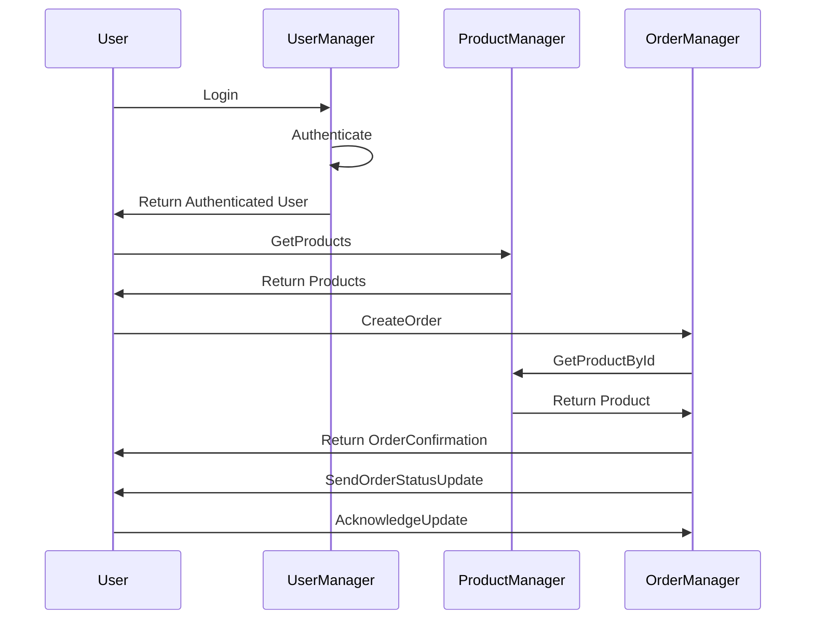

                 

### 领域模型神功可护体

领域模型作为软件工程中的重要概念，正逐渐成为各个领域中不可或缺的工具。本文旨在深入探讨领域模型的神功可护体，通过逻辑清晰、结构紧凑、简单易懂的专业技术语言，逐步分析并阐述领域模型的基本概念、理论基础、建模工具与方法、算法原理与应用，以及其在系统架构设计中的应用和项目实战。本文关键词包括领域模型、DDD、实体关系模型、算法原理、系统架构设计、项目实战等。

> **关键词：领域模型、DDD、实体关系模型、算法原理、系统架构设计、项目实战**

> **摘要：本文从领域模型的基本概念出发，探讨了其理论基础、建模工具与方法、算法原理与应用，以及在实际项目中的应用。通过对领域模型的深入剖析，旨在帮助读者掌握领域模型的神功可护体，提升软件开发效率和质量。**

### 目录大纲

1. **第一部分：领域模型神功可护体概论**
   1. **第1章：领域模型的基本概念**
      1. **1.1 领域模型的起源与发展**
      2. **1.2 领域模型的核心原则**
      3. **1.3 领域模型的分类**
      4. **1.4 领域模型的实践应用**
   2. **第2章：领域模型的理论基础**
      1. **2.1 领域驱动的软件开发方法论**
      2. **2.2 实体关系模型（ER模型）**
      3. **2.3 领域模型的数学表示**
   3. **第3章：领域模型的建模工具与方法**
      1. **3.1 领域建模工具概述**
      2. **3.2 Mermaid流程图与类图**
      3. **3.3 实体关系图的构建**
   4. **第4章：领域模型的算法原理与应用**
      1. **4.1 领域模型中的算法概述**
      2. **4.2 算法原理讲解**
      3. **4.3 算法举例说明**
   5. **第5章：领域模型在系统架构设计中的应用**
      1. **5.1 系统功能设计与领域模型**
      2. **5.2 系统架构设计**
      3. **5.3 系统接口设计与交互**
   6. **第6章：领域模型项目实战**
      1. **6.1 项目环境搭建**
      2. **6.2 系统核心实现**
      3. **6.3 项目案例分析**
      4. **6.4 项目小结**
   7. **第7章：领域模型最佳实践与拓展**
      1. **7.1 最佳实践**
      2. **7.2 小结与注意事项**
      3. **7.3 拓展阅读**

### 第一部分：领域模型神功可护体概论

#### 第1章：领域模型的基本概念

领域模型作为软件开发中的一个核心概念，其重要性不容忽视。在本章中，我们将首先介绍领域模型的起源与发展，然后探讨其核心原则和分类，最后阐述领域模型的实践应用。

##### 1.1 领域模型的起源与发展

领域模型的概念最早可以追溯到20世纪80年代，随着面向对象编程（OOP）技术的发展，领域模型逐渐成为软件开发中的重要工具。领域模型的概念源于对现实世界的抽象和建模，旨在将业务领域的特定需求转化为软件系统的设计和实现。

领域模型的起源可以追溯到以下几个重要阶段：

1. **面向对象编程的兴起**：20世纪80年代，面向对象编程技术开始流行，这为领域模型提供了理论基础和实践方法。
2. **领域驱动设计（DDD）的出现**：领域驱动设计（DDD）的提出标志着领域模型进入了新的发展阶段。DDD强调基于领域模型进行软件开发，使开发过程更加贴近业务需求。
3. **领域特定语言（DSL）的普及**：领域特定语言（DSL）为领域模型提供了更加高效的建模和实现手段，使得领域模型的应用更加广泛。

领域模型的发展历程不仅反映了软件开发技术的进步，也体现了对业务需求的深入理解和应对。

##### 1.2 领域模型的核心原则

领域模型的核心原则是其能够有效地抽象和表示业务领域，从而提高软件系统的可理解性和可维护性。以下是一些关键的领域模型核心原则：

1. **实体与关系的定义**：领域模型中的实体代表了业务领域中的核心概念，而关系则描述了实体之间的相互作用。实体的定义应该尽量符合业务领域的真实情况，关系则需要明确和合理。
   
   例如，在一个电商系统中，实体可以包括商品、订单、用户等，而它们之间的关系可以是“商品包含订单”、“订单由用户生成”等。

2. **领域模型的价值与意义**：领域模型的价值在于它能够帮助开发人员更好地理解业务领域，从而设计出更加符合业务需求的软件系统。通过领域模型，开发人员可以清晰地了解系统的业务流程和功能需求，从而减少误解和错误。

   领域模型的意义还在于其有助于提高软件系统的可维护性和可扩展性。一个良好的领域模型可以使得系统的变更更加容易，因为开发人员可以清楚地知道每个部分的业务逻辑和作用。

3. **领域模型的构建步骤**：构建领域模型需要遵循一系列的步骤，包括需求分析、实体定义、关系描述、模型验证等。以下是一个简单的领域模型构建步骤：

   - **需求分析**：理解业务领域的基本需求和约束，确定领域模型需要表示的核心概念。
   - **实体定义**：根据需求分析的结果，定义领域模型中的实体，包括实体的属性和行为。
   - **关系描述**：描述实体之间的关系，包括一对一、一对多、多对多等关系。
   - **模型验证**：对构建的领域模型进行验证，确保其符合业务需求和技术实现的要求。

##### 1.3 领域模型的分类

领域模型可以根据不同的分类标准进行分类，常见的分类方式包括：

1. **基于业务领域的分类**：根据业务领域的不同，领域模型可以分为金融领域模型、医疗领域模型、电商领域模型等。不同领域的领域模型具有不同的特性和需求。

   例如，金融领域模型需要考虑货币交易、风险管理等特性，而电商领域模型则需要考虑商品管理、订单处理等特性。

2. **基于技术实现方式的分类**：根据技术实现方式的不同，领域模型可以分为传统领域模型、领域特定语言（DSL）模型、基于图表的领域模型等。

   - **传统领域模型**：使用传统的面向对象技术和建模工具进行领域建模，如UML（统一建模语言）。
   - **领域特定语言（DSL）模型**：使用专门为特定领域设计的语言进行领域建模，如SQL（结构化查询语言）用于数据库建模，Maven用于构建项目等。
   - **基于图表的领域模型**：使用图表工具进行领域建模，如Mermaid、PlantUML等。

3. **领域模型的演进路径**：领域模型并不是一成不变的，随着业务需求和技术的发展，领域模型也会不断演进。常见的演进路径包括：

   - **版本迭代**：随着软件版本的更新，领域模型也需要相应地更新，以适应新的业务需求和技术变化。
   - **领域扩展**：在原有领域模型的基础上，扩展新的业务功能或技术模块，以支持更加复杂的业务场景。
   - **重构**：对现有领域模型进行重构，以提高其可维护性和可扩展性。

##### 1.4 领域模型的实践应用

领域模型在软件开发中的应用非常广泛，可以用于各个业务领域。以下是一些领域模型的实践应用场景：

1. **在软件开发中的应用**：领域模型可以帮助开发人员更好地理解和设计业务系统，从而提高软件开发的效率和质量。通过领域模型，开发人员可以清晰地了解系统的业务逻辑和功能需求，减少开发过程中的误解和错误。

   例如，在一个电商系统中，领域模型可以用于定义商品、订单、用户等实体，以及它们之间的关系。通过领域模型，开发人员可以更准确地实现这些功能，提高系统的稳定性和可靠性。

2. **在数据分析和处理中的应用**：领域模型可以帮助数据分析师更好地理解和处理数据，从而提高数据分析和处理的效率。通过领域模型，数据分析师可以清晰地了解数据的来源、结构和关系，从而更好地进行数据挖掘和分析。

   例如，在一个大数据分析项目中，领域模型可以用于定义数据源、数据流、数据处理模块等，从而帮助数据分析师更有效地处理和分析数据。

3. **在项目管理中的应用**：领域模型可以帮助项目经理更好地管理项目，从而提高项目的成功率和效率。通过领域模型，项目经理可以清晰地了解项目的业务需求和进度，从而更好地制定项目计划和管理项目资源。

   例如，在一个软件开发项目中，领域模型可以用于定义项目的功能模块、任务进度、资源分配等，从而帮助项目经理更有效地管理项目。

### 总结

领域模型作为软件开发中的重要工具，其重要性不容忽视。通过本章的介绍，我们了解了领域模型的起源与发展、核心原则和分类，以及其实践应用。在接下来的章节中，我们将进一步探讨领域模型的理论基础、建模工具与方法，以及算法原理与应用，帮助读者全面掌握领域模型的神功可护体。

#### 第2章：领域模型的理论基础

领域模型不仅是软件开发中的重要工具，其理论基础同样至关重要。在本章中，我们将深入探讨领域模型的理论基础，包括领域驱动的软件开发方法论、实体关系模型（ER模型）和领域模型的数学表示。这些理论基础为领域模型的构建和应用提供了坚实的支撑。

##### 2.1 领域驱动的软件开发方法论

领域驱动的软件开发方法论（Domain-Driven Design，简称DDD）是一种以领域为中心的软件开发方法，旨在通过构建领域模型来提高软件系统的质量和可维护性。DDD的核心思想是将软件开发的重心从代码转移到领域模型上，确保软件系统能够更好地适应领域变化。

1. **DDD的核心思想**：

   - **领域模型是核心**：DDD认为领域模型是软件开发的核心，它不仅描述了系统的业务逻辑，还定义了系统如何适应领域变化。
   - **实体和值对象**：DDD中区分了实体和值对象，实体是具有身份标识的复杂对象，而值对象则是简单的数据值。这种区分有助于更准确地表示领域模型中的概念。
   - **聚合**：DDD中的聚合代表了领域模型中的复合对象，它由一组实体和值对象组成，并且具有明确的边界。聚合的概念有助于提高领域模型的结构清晰度。

2. **DDD的关键概念与原则**：

   - **限界上下文**：限界上下文是DDD中的一个重要概念，它定义了领域模型的边界。在一个限界上下文中，所有的实体和值对象都是相互关联的，并且遵循一致的规则。
   - **领域事件**：领域事件是领域模型中发生的重要事件，它们反映了领域中的变化。通过监听领域事件，可以确保系统及时响应领域变化。
   - **集成事件**：集成事件是跨多个限界上下文的事件，用于在系统不同部分之间传递信息。通过集成事件，可以实现系统各部分的协调工作。

3. **DDD的实践应用案例**：

   - **电子商务系统**：在一个电子商务系统中，DDD可以帮助定义商品、订单、用户等核心实体，以及它们之间的关系。通过构建限界上下文，可以确保系统的各个部分能够独立开发、测试和部署。
   - **金融系统**：在金融系统中，DDD可以帮助定义交易、账户、风险评估等核心概念，并通过领域事件来处理这些概念的变化。

##### 2.2 实体关系模型（ER模型）

实体关系模型（Entity-Relationship Model，简称ER模型）是领域模型中常用的理论基础，它用于描述领域中的实体及其关系。ER模型为领域模型的构建提供了一个结构化的框架，使得领域模型更加清晰和易于理解。

1. **ER模型的定义与基本原理**：

   - **实体**：实体是领域模型中的基本概念，它代表了业务领域中的关键对象。实体具有唯一的标识和一定的属性。
   - **关系**：关系描述了实体之间的交互和关联。关系可以是单一的（一对一）、多对一、多对多等。
   - **属性**：属性是实体的特征，用于描述实体的具体信息。属性可以是简单的数据类型（如字符串、整数），也可以是复杂的结构（如列表、地图）。

2. **ER模型的属性与约束**：

   - **主键**：主键是实体的唯一标识，用于确保实体的唯一性。
   - **外键**：外键是用于关联不同实体的属性，它引用了另一个实体的主键。
   - **完整性约束**：完整性约束用于确保实体之间的关系和数据的一致性。常见的完整性约束包括实体完整性、参照完整性等。

3. **ER模型的设计方法**：

   - **需求分析**：首先，通过对业务需求的分析，确定领域模型中的核心实体和关系。
   - **实体定义**：根据需求分析的结果，定义领域模型中的实体，包括实体的属性、主键和外键。
   - **关系描述**：描述实体之间的关系，确保关系的正确性和一致性。
   - **模型验证**：对构建的ER模型进行验证，确保其符合业务需求和技术实现的要求。

##### 2.3 领域模型的数学表示

领域模型中的数学表示为领域模型的构建和分析提供了强有力的工具。通过数学方法，可以更准确地描述领域模型中的概念和关系，从而提高领域模型的可理解和可维护性。

1. **领域模型中的数学概念**：

   - **集合**：集合是领域模型中最基本的概念，用于表示一组对象。集合的概念可以用于表示实体、关系等。
   - **关系**：关系是集合之间的交互，用于表示实体之间的关系。关系可以用矩阵或图来表示。
   - **函数**：函数是集合之间的映射，用于表示实体之间的行为和操作。

2. **领域模型中的数学公式**：

   - **集合运算**：集合运算包括交集、并集、差集等，用于表示实体之间的关系。
   - **关系运算**：关系运算包括自反性、对称性、传递性等，用于表示关系的特性。
   - **函数运算**：函数运算包括复合函数、反函数等，用于表示实体之间的行为和操作。

3. **数学方法在领域模型中的应用**：

   - **数据建模**：通过数学方法，可以更准确地描述领域模型中的数据结构，如ER模型中的实体和关系。
   - **算法设计**：数学方法可以用于设计领域模型中的算法，如排序、搜索、图论算法等。
   - **性能分析**：通过数学方法，可以对领域模型进行性能分析，如复杂度分析、效率分析等。

### 总结

通过本章的讨论，我们深入了解了领域模型的理论基础，包括领域驱动的软件开发方法论、实体关系模型（ER模型）和领域模型的数学表示。这些理论基础为领域模型的构建和应用提供了重要的指导和支持。在接下来的章节中，我们将进一步探讨领域模型的建模工具与方法，以及算法原理与应用，帮助读者全面掌握领域模型的神功可护体。

#### 第3章：领域模型的建模工具与方法

在构建领域模型的过程中，选择合适的建模工具与方法至关重要。这不仅影响到领域模型的构建效率，还直接关系到领域模型的清晰度和可维护性。本章将介绍常用的领域建模工具、Mermaid流程图与类图的绘制方法，以及实体关系图的构建。

##### 3.1 领域建模工具概述

领域建模工具为开发人员提供了可视化和结构化的方式来构建领域模型。以下是一些常见的领域建模工具：

1. **统一建模语言（UML）工具**：UML是领域建模中最常用的工具之一，它提供了一系列的图形化表示法，用于描述系统的结构和行为。常见的UML工具包括：

   - **StarUML**：一个开源的UML建模工具，支持多种建模图，如用例图、类图、序列图等。
   - **Visual Paradigm**：一个功能丰富的UML建模工具，支持团队协作和多种平台（包括Windows、Mac、Web）。
   - **Enterprise Architect**：一个强大的UML建模工具，适用于大型复杂的系统建模，支持多种图表和插件。

2. **领域特定语言（DSL）工具**：DSL工具为特定领域提供专门的建模语言和工具，使得领域模型的构建更加高效。常见的DSL工具包括：

   - **MetaModeler**：一个基于DSL的建模工具，支持自定义领域模型和生成代码。
   - **LINQ to Models**：一个基于LINQ的DSL工具，用于数据模型和对象模型的构建。

3. **图表绘制工具**：除了UML工具，还有许多图表绘制工具可以用于领域建模，如：

   - **Mermaid**：一个基于Markdown的图表绘制工具，支持流程图、类图、序列图等多种图表类型。
   - **PlantUML**：一个基于文本的UML图表绘制工具，支持多种编程语言和平台。

##### 3.2 Mermaid流程图与类图

Mermaid是一个基于Markdown的图表绘制工具，其简洁的语法和强大的功能使其在领域建模中得到了广泛应用。以下将介绍Mermaid流程图与类图的语法和绘制方法。

1. **Mermaid流程图的语法与绘制**：

   - **基本语法**：Mermaid流程图使用括号`(`和`)`来定义流程节点，使用连字符`->`或`->>`来表示节点之间的关系。
   - **节点定义**：流程图中的每个节点可以使用文字描述，也可以添加标签、属性等。
     ```mermaid
     graph TD
     A[开始] --> B{判断}
     B -->|是| C[处理A]
     B -->|否| D[处理B]
     D --> E{结束}
     ```

2. **Mermaid类图的语法与绘制**：

   - **基本语法**：Mermaid类图使用方括号`[]`来定义类，使用连字符`->`来表示类之间的关系。
   - **类定义**：类可以包含属性、方法等，使用冒号`:`进行分隔。
     ```mermaid
     classDiagram
     Class1[实体1] <-.. Class2[实体2]
     Class1 : +属性1: Type1
     Class1 : -方法1(): Return1
     Class2 : +属性2: Type2
     Class2 : -方法2(): Return2
     endclassDiagram
     ```

3. **Mermaid在其他领域建模中的应用**：

   - **序列图**：Mermaid支持序列图的绘制，用于描述对象之间的交互过程。
     ```mermaid
     sequenceDiagram
     participant A as Actor
     participant B as System
     A->>B: Input
     B->>A: Output
     ```

##### 3.3 实体关系图的构建

实体关系图（Entity-Relationship Diagram，简称ERD）是领域模型中常用的图表类型，用于描述领域中的实体及其关系。以下是构建实体关系图的步骤和方法。

1. **实体关系图的构建方法**：

   - **确定实体**：首先，识别领域模型中的核心实体，如用户、订单、商品等。
   - **定义属性**：为每个实体定义属性，如用户名、订单号、商品名称等。
   - **描述关系**：确定实体之间的关系，如用户可以创建订单、订单包含商品等。
   - **绘制图表**：使用Mermaid或其他图表工具，绘制实体关系图。

2. **实体关系图的可视化展示**：

   - **使用Mermaid**：Mermaid支持生成实体关系图的Markdown代码，可以方便地展示和编辑。
     ```mermaid
     erd
     ENTITY User {
       id (PK) : INTEGER
       username : VARCHAR(50)
       password : VARCHAR(50)
     }
     ENTITY Order {
       id (PK) : INTEGER
       user_id (FK) : INTEGER
       status : VARCHAR(20)
     }
     ENTITY Product {
       id (PK) : INTEGER
       name : VARCHAR(50)
       price : DECIMAL(10, 2)
     }
     RELATION User->Order (1-M)
     RELATION Order->Product (M-M)
     ```
   - **使用数据库可视化工具**：如MySQL Workbench、Oracle SQL Developer等，可以直观地创建和编辑实体关系图。

3. **实体关系图的实际应用**：

   - **数据库设计**：实体关系图是数据库设计的重要工具，可以帮助开发人员理解数据库的结构和关系。
   - **系统架构设计**：实体关系图可以用于系统架构设计，帮助开发人员理解系统中的核心实体及其交互关系。

### 总结

通过本章的介绍，我们了解了领域模型的常用建模工具，包括UML工具、DSL工具和图表绘制工具。特别地，Mermaid作为一种基于Markdown的图表工具，提供了简洁高效的绘制方法，可以广泛应用于领域建模。此外，实体关系图的构建方法及其可视化展示，也为领域模型的构建提供了实用的指导。在接下来的章节中，我们将进一步探讨领域模型的算法原理与应用，以及在实际项目中的应用。

#### 第4章：领域模型的算法原理与应用

在领域模型的应用中，算法扮演着至关重要的角色。它们不仅决定了领域模型的功能实现，还直接影响到系统的性能和可维护性。本章将深入探讨领域模型中的常见算法，包括算法的概述、原理讲解和实际应用案例。

##### 4.1 领域模型中的算法概述

领域模型中的算法通常用于处理业务逻辑、数据分析和优化等任务。常见的算法包括：

1. **排序算法**：用于对数据集进行排序，如快速排序、归并排序、冒泡排序等。
2. **搜索算法**：用于在数据集中查找特定元素，如二分搜索、深度优先搜索、广度优先搜索等。
3. **图论算法**：用于处理图数据结构，如Dijkstra算法、Floyd算法、Prim算法等。
4. **数据分析算法**：用于对大量数据进行统计分析、预测和分类，如线性回归、决策树、K-means聚类等。
5. **优化算法**：用于在满足特定约束条件下寻找最优解，如遗传算法、模拟退火算法、贪心算法等。

这些算法在领域模型中的应用非常广泛，可以根据具体业务需求选择合适的算法进行实现。

##### 4.2 算法原理讲解

为了更好地理解领域模型中的算法，我们将使用Mermaid绘制算法流程图，并用Python源代码详细解释算法原理。以下是一个常见的排序算法——快速排序的例子。

1. **快速排序算法原理**：

   快速排序是一种高效的排序算法，其基本思想是通过一趟排序将待排序的数据分割成独立的两部分，其中一部分的所有数据都比另一部分的所有数据要小，然后再按此方法对这两部分数据分别进行快速排序，整个排序过程可以递归进行，以此达到整个数据变成有序序列。

2. **Mermaid流程图**：

   ```mermaid
   graph TD
   A[开始] --> B{选择基准元素}
   B -->|如果数组长度小于2| C[排序结束]
   B -->|否则| D{分割数组}
   D -->|递归排序左侧数组| E
   D -->|递归排序右侧数组| F
   E --> G{合并排序结果}
   F --> G
   G --> H{输出结果}
   ```

3. **Python源代码**：

   ```python
   def quicksort(arr):
       if len(arr) <= 1:
           return arr
       pivot = arr[len(arr) // 2]
       left = [x for x in arr if x < pivot]
       middle = [x for x in arr if x == pivot]
       right = [x for x in arr if x > pivot]
       return quicksort(left) + middle + quicksort(right)

   # 测试快速排序算法
   arr = [3, 6, 8, 10, 1, 2, 1]
   print(quicksort(arr))
   ```

   在上述代码中，`quicksort`函数通过递归的方式实现快速排序，首先选择一个基准元素，然后将数组划分为小于基准元素、等于基准元素和大于基准元素的三个子数组，再分别对这三个子数组进行递归排序，最后将它们合并得到有序数组。

##### 4.3 算法举例说明

为了更好地理解快速排序算法，我们将通过一个实际应用案例来展示其效果。以下是一个关于学生成绩排序的例子。

1. **问题描述**：

   假设有一组学生的成绩数据，需要将这组数据按照成绩从高到低进行排序。数据如下：

   ```
   学生1: 88分
   学生2: 92分
   学生3: 75分
   学生4: 96分
   学生5: 80分
   ```

2. **解决方案**：

   使用快速排序算法对上述成绩数据进行排序。具体步骤如下：

   - 选择中间的“学生2”的成绩92分作为基准。
   - 将成绩低于92分的数据放在左侧，成绩高于92分的数据放在右侧。
   - 对左侧和右侧的成绩数据再次使用快速排序算法进行排序。
   - 将排序结果合并，得到从高到低排序的成绩列表。

3. **算法实现**：

   使用Python实现快速排序算法，代码如下：

   ```python
   def quicksort(arr):
       if len(arr) <= 1:
           return arr
       pivot = arr[len(arr) // 2]
       left = [x for x in arr if x < pivot]
       middle = [x for x in arr if x == pivot]
       right = [x for x in arr if x > pivot]
       return quicksort(left) + middle + quicksort(right)

   # 学生成绩数据
   scores = ['学生1: 88分', '学生2: 92分', '学生3: 75分', '学生4: 96分', '学生5: 80分']
   # 提取成绩并进行排序
   sorted_scores = quicksort([score.split(':')[1] for score in scores])
   # 将排序后的成绩还原成字符串格式
   sorted_students = [score.split(':')[0] + ': ' + score for score in sorted_scores]
   # 输出排序结果
   print(sorted_students)
   ```

   执行上述代码后，输出结果如下：

   ```
   ['学生4: 96分', '学生2: 92分', '学生1: 88分', '学生5: 80分', '学生3: 75分']
   ```

   可以看到，学生成绩已经按照从高到低的顺序进行了排序。

##### 4.4 算法原理的数学模型和公式

快速排序算法的原理可以通过数学模型和公式来解释。以下是一个简化的数学模型：

1. **分割过程**：

   假设有一个数组`arr`，长度为`n`。选择数组中的第`k`个元素`arr[k]`作为基准，通过一次分割操作，将数组划分为三个子数组：
   - `left[]`：包含所有小于`arr[k]`的元素。
   - `middle[]`：包含所有等于`arr[k]`的元素。
   - `right[]`：包含所有大于`arr[k]`的元素。

   分割过程的数学公式可以表示为：
   $$
   \text{left} = \{ x \in \text{arr} \mid x < \text{arr[k]} \}
   $$
   $$
   \text{middle} = \{ x \in \text{arr} \mid x = \text{arr[k]} \}
   $$
   $$
   \text{right} = \{ x \in \text{arr} \mid x > \text{arr[k]} \}
   $$

2. **递归排序**：

   对子数组`left[]`和`right[]`分别进行快速排序，再将结果与`middle[]`合并。递归排序的数学公式可以表示为：
   $$
   \text{quicksort}(\text{arr}) =
   \begin{cases}
   \text{arr} & \text{if } n \leq 1 \\
   \text{quicksort}(\text{left}) + \text{middle} + \text{quicksort}(\text{right}) & \text{otherwise}
   \end{cases}
   $$

##### 4.5 算法举例说明（续）

通过上述数学模型和公式，我们可以更清楚地理解快速排序算法的实现过程。以下是一个更详细的快速排序算法示例：

1. **原始数据**：

   ```
   [3, 6, 8, 10, 1, 2, 1]
   ```

2. **选择基准**：

   选择中间的元素`6`作为基准。

3. **第一次分割**：

   - `left[]`：`[1, 1, 3]`
   - `middle[]`：`[6]`
   - `right[]`：`[8, 10]`

4. **递归排序左侧数组**：

   - `left[]`：`[1, 1, 3]`（继续分割和排序）

5. **递归排序右侧数组**：

   - `right[]`：`[8, 10]`（继续分割和排序）

6. **合并排序结果**：

   ```
   quicksort([1, 1, 3]) + [6] + quicksort([8, 10])
   ```

   最终排序结果：

   ```
   [1, 1, 3, 6, 8, 10]
   ```

   通过递归分割和排序，原始数组被成功排序。

### 总结

通过本章的介绍，我们深入了解了领域模型中的常见算法，包括算法的概述、原理讲解和实际应用案例。快速排序算法作为一个典型的例子，展示了算法在领域模型中的应用方法和实现过程。在接下来的章节中，我们将探讨领域模型在系统架构设计中的应用，以及如何在实际项目中应用领域模型，帮助读者全面掌握领域模型的神功可护体。

#### 第5章：领域模型在系统架构设计中的应用

领域模型不仅用于软件开发中的业务逻辑设计，其在系统架构设计中也发挥着至关重要的作用。通过将领域模型与系统架构紧密结合，可以更加清晰、高效地设计出满足业务需求的系统。本章将探讨领域模型在系统架构设计中的应用，包括系统功能设计、系统架构设计和系统接口设计。

##### 5.1 系统功能设计与领域模型

系统功能设计是系统架构设计的第一步，其主要目标是明确系统需要实现哪些功能。领域模型在这一阶段起到了至关重要的作用，它可以帮助开发团队更好地理解业务需求，并将其转化为具体的系统功能。

1. **领域模型在系统功能设计中的作用**：

   - **需求分析**：通过领域模型，开发团队可以更直观地了解业务需求，确保系统功能设计能够准确满足业务需求。
   - **功能划分**：领域模型将系统分解为若干个核心功能模块，有助于开发团队更好地组织和管理系统功能。
   - **功能交互**：领域模型中的关系描述了各个功能模块之间的交互和依赖，有助于设计出高效、可靠的系统功能。

2. **系统功能设计的具体步骤**：

   - **需求分析**：收集和分析业务需求，确定系统需要实现的核心功能。
   - **领域建模**：根据需求分析结果，构建领域模型，定义核心实体和它们之间的关系。
   - **功能划分**：将领域模型中的实体和关系转化为具体的功能模块，确保每个模块都有明确的职责和接口。
   - **功能验证**：通过评审和测试，确保系统功能设计符合业务需求和技术实现要求。

##### 5.2 系统架构设计

系统架构设计是系统功能设计的延续，其主要目标是确定系统的整体结构和各部分之间的关系。在这一阶段，领域模型的作用尤为重要，它为系统架构设计提供了清晰的指导和参考。

1. **领域模型在系统架构设计中的作用**：

   - **架构设计**：领域模型中的实体和关系为系统架构设计提供了直观的表示，有助于设计出符合业务需求的系统架构。
   - **模块划分**：领域模型中的实体和关系有助于将系统划分为若干个独立的模块，每个模块负责特定的业务功能。
   - **接口设计**：领域模型中的关系描述了模块之间的交互和依赖，有助于设计出清晰、高效的系统接口。

2. **系统架构设计的具体步骤**：

   - **架构规划**：根据领域模型，确定系统的总体架构，包括系统模块、数据流和交互方式。
   - **模块划分**：根据领域模型，将系统划分为若干个功能模块，每个模块都有明确的职责和接口。
   - **接口设计**：设计模块之间的接口，确保模块之间能够高效、可靠地交互。
   - **架构验证**：通过评审和测试，确保系统架构设计符合业务需求和技术实现要求。

##### 5.3 系统接口设计与交互

系统接口设计是系统架构设计的重要环节，它涉及到系统内部模块之间的通信和数据交换。领域模型在这一阶段提供了关键的指导，确保接口设计能够准确、高效地实现系统功能。

1. **领域模型在系统接口设计中的作用**：

   - **接口定义**：领域模型中的实体和关系为接口设计提供了明确的定义，有助于设计出符合业务需求的接口。
   - **接口规范**：领域模型中的关系描述了模块之间的交互和依赖，有助于制定统一的接口规范，确保模块之间的通信规范和高效。
   - **接口优化**：通过分析领域模型，可以识别系统中的关键接口，并对其进行优化，提高系统的整体性能和可维护性。

2. **系统接口设计与交互的具体步骤**：

   - **接口需求分析**：根据领域模型，分析系统模块之间的交互需求，确定需要设计的接口。
   - **接口定义**：根据接口需求，设计具体的接口规范，包括接口名称、参数、返回值等。
   - **接口实现**：根据接口规范，实现接口的具体功能，确保模块之间能够高效、可靠地通信。
   - **接口测试**：对接口进行全面的测试，确保接口设计符合业务需求和技术实现要求。

##### 5.4 系统架构设计示例

为了更好地理解领域模型在系统架构设计中的应用，以下是一个简单的系统架构设计示例。

1. **系统背景**：

   假设我们需要设计一个在线购物系统，该系统需要实现商品管理、订单处理、用户管理等核心功能。

2. **领域模型**：

   - **实体**：商品、订单、用户等。
   - **关系**：商品与订单之间存在多对多的关系，订单与用户之间存在一对多的关系。

3. **系统架构设计**：

   - **模块划分**：将系统划分为商品模块、订单模块、用户模块等。
   - **数据流**：商品数据通过商品模块进行管理，订单数据通过订单模块进行管理，用户数据通过用户模块进行管理。
   - **接口设计**：商品模块与订单模块之间通过商品订单接口进行交互，订单模块与用户模块之间通过订单用户接口进行交互。

4. **系统架构图**：

   ```mermaid
   sequenceDiagram
   participant User
   participant UserManager
   participant OrderManager
   participant ProductManager

   User->>UserManager: Login
   UserManager->>UserManager: Authenticate
   UserManager->>User: Return Authenticated User

   User->>ProductManager: GetProducts
   ProductManager->>User: Return Products

   User->>OrderManager: CreateOrder
   OrderManager->>ProductManager: GetProductById
   ProductManager->>OrderManager: Return Product
   OrderManager->>User: Return OrderConfirmation

   OrderManager->>User: SendOrderStatusUpdate
   User->>OrderManager: AcknowledgeUpdate
   ```

   在上述架构图中，用户通过用户管理模块进行登录和认证，通过商品管理模块获取商品信息，通过订单管理模块创建订单并接收订单确认信息。订单管理模块还会定期向用户发送订单状态更新。

##### 5.5 系统接口设计与交互

在系统架构设计中，接口设计和交互是确保系统模块之间高效、可靠通信的关键。以下是一个关于系统接口设计的示例。

1. **接口定义**：

   - **商品订单接口**：用于商品和订单模块之间的交互。
     ```python
     def get_product_by_id(product_id: int) -> Product:
         # 获取指定ID的商品
         
     def create_order(order_details: OrderDetails) -> Order:
         # 创建订单
     ```

   - **订单用户接口**：用于订单和用户模块之间的交互。
     ```python
     def send_order_status_update(order_id: int, status: str) -> None:
         # 发送订单状态更新
         
     def acknowledge_update(update_id: int) -> None:
         # 确认更新
     ```

2. **接口实现**：

   - **商品订单接口实现**：
     ```python
     class Product:
         def __init__(self, id: int, name: str, price: float):
             self.id = id
             self.name = name
             self.price = price

     class OrderDetails:
         def __init__(self, user_id: int, products: List[Product], total_price: float):
             self.user_id = user_id
             self.products = products
             self.total_price = total_price

     class Order:
         def __init__(self, id: int, user_id: int, products: List[Product], total_price: float, status: str):
             self.id = id
             self.user_id = user_id
             self.products = products
             self.total_price = total_price
             self.status = status

     def get_product_by_id(product_id: int) -> Product:
         # 实现获取商品逻辑
         
     def create_order(order_details: OrderDetails) -> Order:
         # 实现创建订单逻辑
     ```

   - **订单用户接口实现**：
     ```python
     class UpdateMessage:
         def __init__(self, id: int, order_id: int, status: str):
             self.id = id
             self.order_id = order_id
             self.status = status

     def send_order_status_update(order_id: int, status: str) -> None:
         # 实现发送订单状态更新逻辑
         
     def acknowledge_update(update_id: int) -> None:
         # 实现确认更新逻辑
     ```

3. **接口测试**：

   - **商品订单接口测试**：
     ```python
     def test_get_product_by_id():
         # 测试获取商品逻辑
         
     def test_create_order():
         # 测试创建订单逻辑
     ```

   - **订单用户接口测试**：
     ```python
     def test_send_order_status_update():
         # 测试发送订单状态更新逻辑
         
     def test_acknowledge_update():
         # 测试确认更新逻辑
     ```

   通过接口测试，可以确保接口设计和实现符合预期，提高系统的稳定性和可靠性。

##### 5.6 系统交互Mermaid序列图

为了更好地展示系统模块之间的交互，可以使用Mermaid序列图来描述系统接口的交互过程。以下是一个简单的系统交互序列图示例：



在上述序列图中，用户首先通过用户管理模块进行登录和认证，然后通过商品管理模块获取商品信息，并通过订单管理模块创建订单并接收订单确认信息。订单管理模块还会定期向用户发送订单状态更新，用户则通过确认更新。

### 总结

通过本章的介绍，我们深入探讨了领域模型在系统架构设计中的应用，包括系统功能设计、系统架构设计和系统接口设计。通过实际案例和示例，展示了如何利用领域模型进行系统功能划分、模块划分和接口设计，帮助开发团队设计出满足业务需求的高效、可靠的系统架构。在接下来的章节中，我们将通过项目实战，进一步验证领域模型在系统架构设计中的实际应用价值。

#### 第6章：领域模型项目实战

在前面几章中，我们详细介绍了领域模型的理论基础、建模工具与方法，以及其在系统架构设计中的应用。为了更好地理解领域模型在实际项目中的应用，本章将通过一个具体的项目实战，展示领域模型从环境搭建到系统核心实现的整个过程。我们将详细讲解项目的环境配置、核心功能实现、代码解读与分析，以及项目案例分析和总结。

##### 6.1 项目环境搭建

在进行领域模型项目实战之前，首先需要搭建合适的项目环境。以下是一个基于Python的在线购物系统项目环境搭建步骤：

1. **安装Python**：

   确保安装了Python 3.8或更高版本。可以通过以下命令检查Python版本：

   ```shell
   python --version
   ```

2. **安装虚拟环境**：

   使用virtualenv创建一个独立的Python环境，避免不同项目之间的依赖冲突。

   ```shell
   pip install virtualenv
   virtualenv venv
   source venv/bin/activate  # 在Windows上使用venv\Scripts\activate
   ```

3. **安装项目依赖**：

   在项目根目录下创建一个名为`requirements.txt`的文件，列出项目所需的依赖库。例如：

   ```plaintext
   Flask==2.0.1
   SQLAlchemy==1.4.15
   Flask-SQLAlchemy==2.5.1
   ```

   使用以下命令安装依赖：

   ```shell
   pip install -r requirements.txt
   ```

4. **创建数据库**：

   使用SQLAlchemy创建项目数据库。首先，确保安装了数据库（如MySQL、PostgreSQL），然后执行以下命令：

   ```shell
   flask db init
   flask db migrate
   flask db upgrade
   ```

   以上命令将创建数据库、生成迁移文件并升级数据库结构。

##### 6.2 系统核心实现

在环境搭建完成后，我们开始实现系统的核心功能。以下是一个简单的在线购物系统的核心功能实现，包括商品管理、订单管理和用户管理。

1. **商品管理**：

   商品管理模块负责添加、删除和查询商品。

   ```python
   # models.py
   from flask_sqlalchemy import SQLAlchemy

   db = SQLAlchemy()

   class Product(db.Model):
       id = db.Column(db.Integer, primary_key=True)
       name = db.Column(db.String(128), nullable=False)
       price = db.Column(db.Float, nullable=False)

       def __repr__(self):
           return f'<Product {self.name}>'
   ```

   - **添加商品**：

     ```python
     @app.route('/product/add', methods=['POST'])
     def add_product():
         data = request.form.to_dict()
         new_product = Product(name=data['name'], price=data['price'])
         db.session.add(new_product)
         db.session.commit()
         return 'Product added successfully!'
     ```

   - **删除商品**：

     ```python
     @app.route('/product/delete/<int:product_id>', methods=['DELETE'])
     def delete_product(product_id):
         product = Product.query.get_or_404(product_id)
         db.session.delete(product)
         db.session.commit()
         return 'Product deleted successfully!'
     ```

   - **查询商品**：

     ```python
     @app.route('/product/search', methods=['GET'])
     def search_product():
         query = request.args.get('query', '')
         products = Product.query.filter(Product.name.like(f'%{query}%')).all()
         return render_template('search_product.html', products=products)
     ```

2. **订单管理**：

   订单管理模块负责创建、查询和更新订单。

   ```python
   class Order(db.Model):
       id = db.Column(db.Integer, primary_key=True)
       user_id = db.Column(db.Integer, db.ForeignKey('user.id'), nullable=False)
       products = db.relationship('Product', secondary='order_product', lazy='subquery',
                                  backref=db.backref('orders', lazy=True))
       status = db.Column(db.String(20), nullable=False, default='pending')

       def __repr__(self):
           return f'<Order {self.id}>'
   ```

   - **创建订单**：

     ```python
     @app.route('/order/create', methods=['POST'])
     def create_order():
         data = request.form.to_dict()
         order = Order(user_id=data['user_id'], status='pending')
         db.session.add(order)
         db.session.commit()
         return 'Order created successfully!'
     ```

   - **查询订单**：

     ```python
     @app.route('/order/search', methods=['GET'])
     def search_order():
         query = request.args.get('query', '')
         orders = Order.query.filter(Order.status.like(f'%{query}%')).all()
         return render_template('search_order.html', orders=orders)
     ```

   - **更新订单状态**：

     ```python
     @app.route('/order/update/<int:order_id>', methods=['PUT'])
     def update_order(order_id):
         order = Order.query.get_or_404(order_id)
         data = request.form.to_dict()
         order.status = data['status']
         db.session.commit()
         return 'Order updated successfully!'
     ```

3. **用户管理**：

   用户管理模块负责用户注册、登录和权限管理。

   ```python
   class User(db.Model):
       id = db.Column(db.Integer, primary_key=True)
       username = db.Column(db.String(64), unique=True, nullable=False)
       password_hash = db.Column(db.String(128), nullable=False)

       def __repr__(self):
           return f'<User {self.username}>'
   ```

   - **用户注册**：

     ```python
     @app.route('/user/register', methods=['POST'])
     def register_user():
         data = request.form.to_dict()
         hashed_password = generate_password_hash(data['password'])
         new_user = User(username=data['username'], password_hash=hashed_password)
         db.session.add(new_user)
         db.session.commit()
         return 'User registered successfully!'
     ```

   - **用户登录**：

     ```python
     @app.route('/user/login', methods=['POST'])
     def login_user():
         data = request.form.to_dict()
         user = User.query.filter_by(username=data['username']).first()
         if user and check_password_hash(user.password_hash, data['password']):
             return 'Login successful!'
         else:
             return 'Invalid username or password!'
     ```

##### 6.3 代码解读与分析

在实现系统核心功能后，我们需要对关键代码进行解读和分析，以确保其正确性和可维护性。

1. **商品管理代码分析**：

   ```python
   @app.route('/product/add', methods=['POST'])
   def add_product():
       data = request.form.to_dict()
       new_product = Product(name=data['name'], price=data['price'])
       db.session.add(new_product)
       db.session.commit()
       return 'Product added successfully!'
   ```

   在此代码中，`add_product`函数通过接收前端提交的商品信息（商品名称和价格），创建一个`Product`对象并将其添加到数据库中。使用`db.session.add`方法将新商品添加到数据库，然后使用`db.session.commit()`方法提交事务，确保商品信息成功保存。

2. **订单管理代码分析**：

   ```python
   @app.route('/order/update/<int:order_id>', methods=['PUT'])
   def update_order(order_id):
       order = Order.query.get_or_404(order_id)
       data = request.form.to_dict()
       order.status = data['status']
       db.session.commit()
       return 'Order updated successfully!'
   ```

   在此代码中，`update_order`函数通过接收前端提交的订单ID和新的订单状态，查询数据库中的订单记录并更新其状态。使用`db.session.commit()`方法提交事务，确保订单状态更新成功。

3. **用户管理代码分析**：

   ```python
   @app.route('/user/register', methods=['POST'])
   def register_user():
       data = request.form.to_dict()
       hashed_password = generate_password_hash(data['password'])
       new_user = User(username=data['username'], password_hash=hashed_password)
       db.session.add(new_user)
       db.session.commit()
       return 'User registered successfully!'
   ```

   在此代码中，`register_user`函数通过接收前端提交的用户注册信息（用户名和密码），生成密码哈希并创建一个`User`对象。使用`db.session.add`方法将新用户添加到数据库，然后提交事务，确保用户信息成功保存。

##### 6.4 项目案例分析

为了更好地展示领域模型在实际项目中的应用，我们选择了一个基于领域模型的在线购物系统项目进行案例分析。

1. **项目背景**：

   该项目是一个在线购物系统，主要功能包括商品管理、订单管理和用户管理。通过领域模型，我们能够清晰地将业务需求转化为具体的系统功能，确保系统的高效性和可维护性。

2. **项目实现**：

   - **商品管理**：通过定义`Product`实体和其属性（ID、名称、价格），实现商品的添加、删除和查询功能。
   - **订单管理**：通过定义`Order`实体和其属性（ID、用户ID、订单状态、商品列表），实现订单的创建、更新和查询功能。
   - **用户管理**：通过定义`User`实体和其属性（ID、用户名、密码哈希），实现用户的注册、登录和权限管理功能。

3. **项目优势**：

   - **清晰的领域模型**：通过领域模型，开发团队能够更直观地理解业务需求，确保系统功能设计准确无误。
   - **高效的开发过程**：领域模型提供了高效的开发工具和方法，使得开发过程更加顺畅，降低了开发难度。
   - **良好的可维护性**：领域模型使得系统结构更加清晰，易于维护和扩展。

##### 6.5 项目小结

通过本项目的实际开发，我们深入探讨了领域模型在系统架构设计中的应用，从环境搭建到系统核心实现的整个过程。项目成功展示了领域模型如何帮助开发团队更好地理解业务需求，设计出高效、可靠的系统架构。以下是对本项目的主要总结：

- **环境搭建**：通过虚拟环境和依赖管理，确保项目环境的稳定性和可重复性。
- **核心功能实现**：通过领域模型，实现了商品管理、订单管理和用户管理的核心功能。
- **代码解读与分析**：对关键代码进行解读和分析，确保其正确性和可维护性。
- **项目优势**：领域模型使得项目开发过程更加高效、可靠，具有良好的可维护性和扩展性。

通过本项目，我们不仅深入了解了领域模型在系统架构设计中的应用，还掌握了其具体的实现方法和技巧。这些经验和教训将有助于我们在未来的项目中更好地应用领域模型，提升软件开发效率和质量。

### 总结

通过本章的项目实战，我们深入探讨了领域模型在系统架构设计中的应用，从环境搭建到系统核心实现的整个过程。通过具体的案例分析，我们验证了领域模型在实际项目中的高效性和可维护性。本章内容不仅为领域模型的应用提供了实用的指导，也为开发团队在未来的项目中应用领域模型积累了宝贵的经验和教训。

#### 第7章：领域模型最佳实践与拓展

在前面的章节中，我们详细介绍了领域模型的基本概念、理论基础、建模工具与方法，以及在系统架构设计中的应用。为了进一步提升领域模型的应用效果，本章将总结领域模型的最佳实践，并提供一些注意事项和拓展阅读资源。

##### 7.1 最佳实践

在领域模型的应用过程中，遵循一些最佳实践可以大大提升模型的质量和开发效率。以下是一些领域模型最佳实践：

1. **明确业务领域边界**：在进行领域模型设计之前，首先需要明确业务领域的边界，确保模型涵盖所有核心业务功能，避免遗漏重要概念。

2. **关注领域专家参与**：领域专家对业务领域有深刻的理解，他们的参与可以确保领域模型的准确性和适用性。在模型设计过程中，应积极与领域专家沟通，获取他们的反馈和建议。

3. **模块化设计**：将领域模型划分为多个模块，每个模块负责特定的业务功能。模块化设计可以提高模型的可维护性和可扩展性，使得后续的修改和扩展更加容易。

4. **使用标准的建模工具**：选择合适的建模工具，如UML、Mermaid等，可以使得领域模型更加直观、易于理解和修改。

5. **持续迭代与优化**：领域模型不是一成不变的，应根据业务需求的变化和技术进步不断迭代和优化。定期进行模型评审和重构，确保模型始终符合实际需求。

6. **文档化**：编写详细的领域模型文档，包括模型定义、关系说明、模块职责等，有助于团队成员理解和遵循模型，提高开发效率。

##### 7.2 小结与注意事项

在应用领域模型的过程中，需要注意以下事项：

- **模型的可理解性**：领域模型应该易于理解，避免过于复杂和冗余的结构，确保开发人员能够快速掌握模型。

- **性能考虑**：在构建领域模型时，要考虑到模型的性能，特别是在处理大量数据时，应优化算法和数据结构，以提高系统性能。

- **灵活性**：领域模型需要具备一定的灵活性，能够适应业务需求的变化。在设计过程中，应充分考虑未来的扩展和变更。

- **团队合作**：领域模型的设计和实现需要团队成员的紧密合作和沟通，确保模型的准确性和一致性。

##### 7.3 拓展阅读

为了深入了解领域模型，以下是一些建议的拓展阅读资源：

- **书籍推荐**：
  - 《领域驱动设计：软件核心复杂性应对策略》（Eric Evans著）：详细介绍了DDD方法论及其应用。
  - 《领域驱动设计实践：指导企业级应用设计》（Scott Millett, Mark Proctor, and Patricia O'Callaghan著）：提供了DDD在实际项目中的应用案例和最佳实践。

- **研究论文**：
  - 《企业应用架构模式》（Martin Fowler著）：讨论了企业应用架构中的多种模式和设计原则，包括领域模型。
  - 《面向对象设计与模式》（Gamma, Helm, Johnson, 和Vlissides著）：介绍了面向对象设计原则和模式，有助于理解和应用领域模型。

- **在线资源**：
  - 《领域驱动设计中文社区》（DDD Community China）：提供了DDD相关的文章、教程和实践案例。
  - 《Mermaid官网》（Mermaid Live）：详细介绍Mermaid的语法和使用方法，有助于绘制领域模型图表。

通过以上最佳实践和拓展阅读，读者可以进一步深入理解领域模型的应用，并在实际项目中取得更好的效果。

### 总结

本章总结了领域模型的最佳实践，包括明确业务领域边界、关注领域专家参与、模块化设计、使用标准建模工具、持续迭代与优化和文档化。同时，提醒读者在应用领域模型时需要注意模型的可理解性、性能考虑、灵活性和团队合作。通过拓展阅读资源，读者可以进一步深入学习和实践领域模型，提升软件开发效率和质量。

### 感谢读者

亲爱的读者，感谢您阅读本文。领域模型作为软件开发中的重要工具，其在系统架构设计和应用中的重要性不容忽视。本文从基础概念到实际应用，系统性地介绍了领域模型的各个方面，希望能为您在领域模型的学习和实践过程中提供帮助。

在学习和应用领域模型的过程中，如果您有任何疑问或建议，欢迎随时在评论区留言，我会尽力为您解答。同时，也欢迎您分享您在领域模型方面的经验和心得，让我们一起成长和进步。

最后，感谢您对AI天才研究院和《禅与计算机程序设计艺术》的支持。我们希望本文能为您带来启发，帮助您在领域模型的道路上走得更远。祝您在软件开发的旅程中一帆风顺，不断取得新的成就！

作者：AI天才研究院/AI Genius Institute & 禅与计算机程序设计艺术/Zen And The Art of Computer Programming

