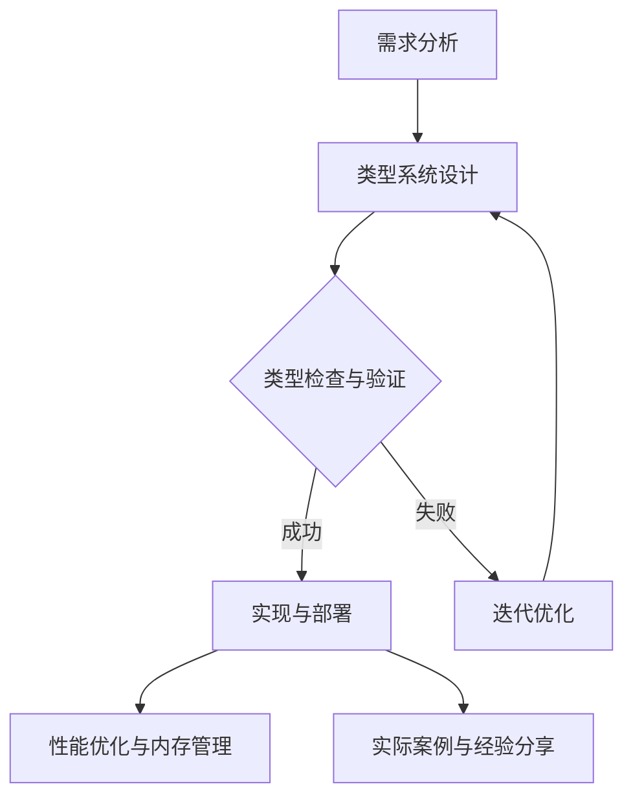
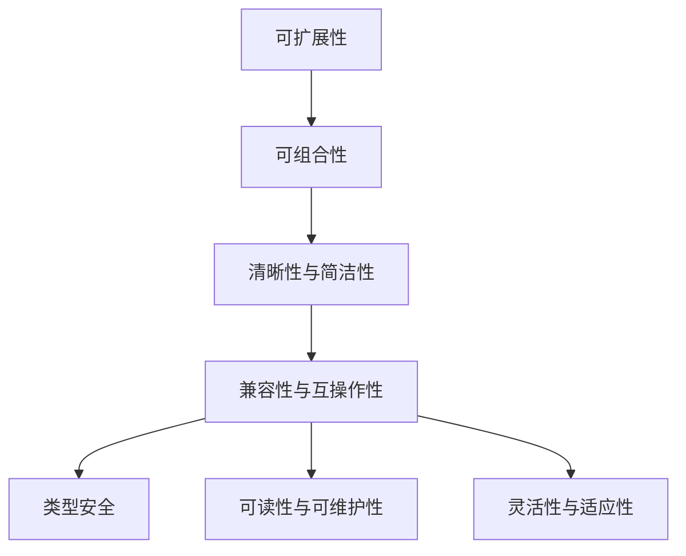
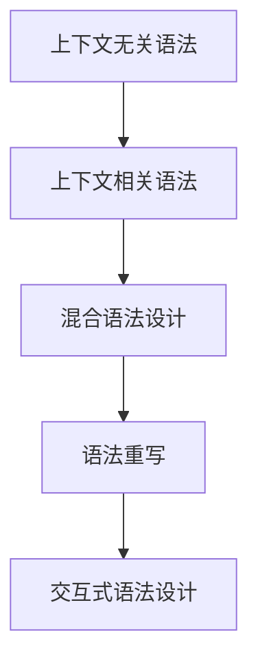
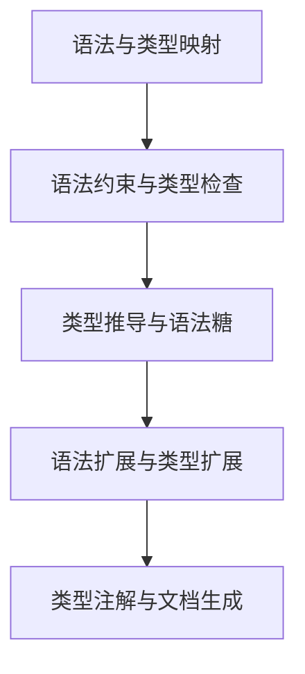
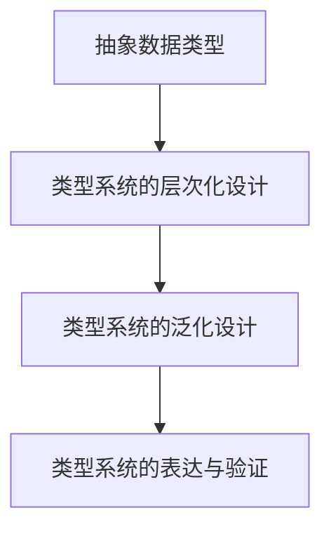
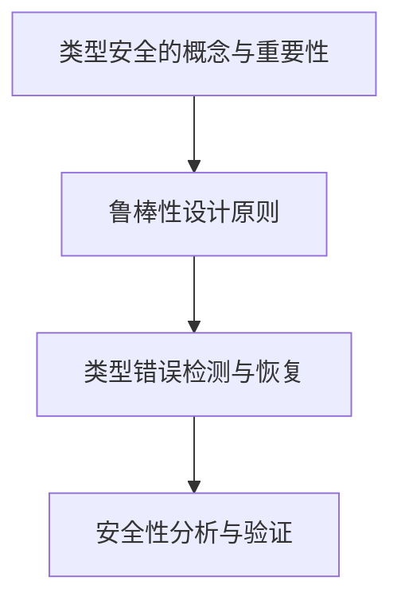
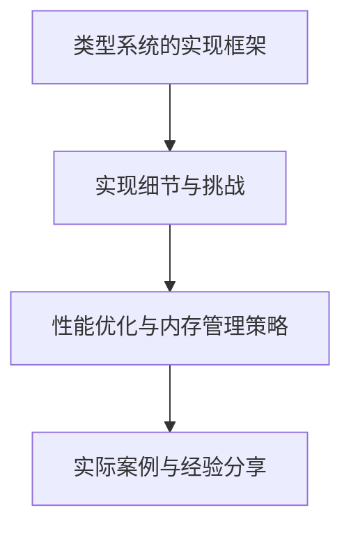
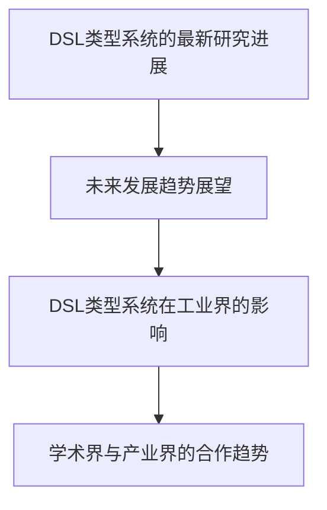

                 

# 领域特定语言（DSL）的基本概念

### 1.1 DSL的定义与背景

领域特定语言（Domain-Specific Language，简称DSL）是一种专门为特定领域或行业设计的编程语言，它具有高度的专业性和抽象性，能够更贴近应用领域的需求，从而提高开发效率和代码的可读性。DSL的出现，是软件工程领域对通用编程语言（如C、Java等）局限性的反思和补充。

DSL的概念起源于20世纪70年代，当时计算机科学家开始意识到，为了解决特定领域的问题，使用通用编程语言可能并不是最优的选择。通用编程语言需要处理广泛的编程任务，这导致其语法和语义比较复杂，而特定领域的应用则往往只需要解决特定的问题，且这些问题具有相似的模式和规则。因此，DSL的出现，旨在为特定领域的应用提供更加高效、简洁的解决方案。

DSL的背景可以追溯到几个方面：

1. **专业领域的复杂性问题**：某些专业领域的问题非常复杂，通用编程语言的抽象层次较低，难以直接描述这些领域的复杂逻辑。例如，在金融领域，需要对大量数据进行精确处理和计算，而通用编程语言在这方面显得力不从心。

2. **行业标准化需求**：随着行业的发展，越来越多的领域需要有一套统一的标准来规范软件开发过程。DSL的出现，可以帮助行业实现标准化，提高软件开发的效率和质量。

3. **开发效率的提升**：DSL通过提供领域内的专用词汇和语法规则，可以使得开发者更容易理解和编写代码，从而提高开发效率。

4. **可重用性和可维护性**：DSL可以使代码更具有可重用性和可维护性，因为它们更接近实际业务需求，降低了代码与业务逻辑的耦合度。

### 1.2 DSL的应用领域

DSL的应用领域非常广泛，以下是一些常见的应用场景：

1. **金融领域**：金融领域使用DSL来处理复杂的金融计算和风险分析，例如，量化交易系统、风险评估系统等。

2. **科学计算**：在科学计算领域，DSL可以用于复杂的数学建模和计算，例如，物理模拟、气候模型等。

3. **网络编程**：DSL在网络编程中也有广泛的应用，例如，网络协议的实现、网络安全分析等。

4. **嵌入式系统**：在嵌入式系统中，DSL可以帮助开发者更高效地编写针对特定硬件平台的代码。

5. **企业应用**：在企业应用开发中，DSL可以帮助企业快速构建自定义的业务系统，提高业务敏捷性。

6. **人机交互**：DSL在图形界面设计、自然语言处理等领域也有应用，通过DSL可以构建更直观、易用的用户界面。

### 1.3 DSL的优势与局限性

DSL具有以下优势：

- **提高开发效率**：DSL提供了领域内专用的语法和词汇，使得开发者可以更快地理解和编写代码，从而提高开发效率。

- **提高代码可读性**：DSL的语法和结构更贴近实际业务需求，使得代码更容易理解和维护。

- **增强领域特定性**：DSL可以更好地满足特定领域的需求，提供更精确、更高效的解决方案。

- **支持领域标准化**：DSL可以帮助领域内实现标准化，提高协作效率。

然而，DSL也存在一些局限性：

- **学习成本**：DSL通常需要领域专家进行设计和维护，对于普通开发者来说，学习成本较高。

- **通用性不足**：DSL的设计往往针对特定领域，因此其通用性较差，不适合跨领域使用。

- **工具支持**：虽然DSL可以提高开发效率，但需要相应的工具支持。DSL的设计、实现和调试都需要专门的工具，这些工具的获取和维护可能带来额外成本。

- **迁移困难**：一旦DSL设计不合理或不符合未来需求，迁移到新的DSL或通用编程语言可能会非常困难。

### 1.4 本书的目标

本书的目标是深入探讨领域特定语言（DSL）的类型系统设计。类型系统是编程语言的核心组成部分，它负责定义变量、函数和对象的类型，并确保程序在运行时遵守类型规则。DSL的类型系统设计尤为关键，因为它直接影响到DSL的可扩展性、安全性和可维护性。

本书将分为七个章节，逐步探讨DSL类型系统的设计过程。首先，我们将介绍DSL的基本概念、类型系统的核心概念以及DSL在特定领域的应用案例。接着，我们将深入探讨DSL类型系统设计的基础理论、设计原则和设计流程。随后，我们将分析DSL的语法设计，探讨语法与类型系统的结合方式，并通过具体案例分析DSL语法设计对类型系统设计的影响。

在后续章节中，我们将进一步探讨类型系统的抽象与表达、类型系统的安全性与鲁棒性设计，以及DSL类型系统的实现方法。最后，我们将展望DSL类型系统的未来发展趋势，并分享一些设计DSL类型系统的最佳实践。

通过本书的阅读，读者将能够系统地了解DSL类型系统的设计方法，掌握DSL类型系统设计的关键技术，为实际项目开发提供坚实的理论基础和实践指导。

### 1.5 类型系统的核心概念

类型系统是编程语言的核心组成部分，它定义了变量、函数和对象的类型，并确保程序在运行时遵守类型规则。类型系统的重要性体现在以下几个方面：

- **确保类型安全**：类型系统通过静态类型检查，确保变量在使用前已经被正确声明类型，防止类型错误发生，从而提高程序的可靠性和稳定性。
- **提高代码可读性**：类型系统提供了明确的类型信息，使得代码更加直观和易于理解，减少了潜在的错误和误解。
- **提高编译效率**：静态类型系统在编译阶段就可以进行类型检查，减少了运行时的类型检查开销，从而提高编译效率。
- **支持面向对象编程**：类型系统是面向对象编程的基础，通过类型系统，可以实现封装、继承和多态等面向对象特性。

#### 类型

类型是数据的基本分类，它定义了数据的行为和属性。常见的类型包括：

- **基本类型**：如整数（int）、浮点数（float）、布尔值（bool）等。
- **复合类型**：如数组、列表、字典等。
- **引用类型**：如对象、函数等。

#### 类型系统

类型系统是一组规则和机制的集合，用于定义和操作类型。常见的类型系统包括：

- **静态类型系统**：在编译阶段确定变量和函数的类型，如Java、C++。
- **动态类型系统**：在运行时确定变量和函数的类型，如Python、JavaScript。

#### 类型安全

类型安全是指程序在执行过程中不会因为类型错误导致崩溃或不可预期的行为。类型安全分为静态类型安全和动态类型安全：

- **静态类型安全**：通过编译时的类型检查确保程序在运行时不发生类型错误。
- **动态类型安全**：通过运行时的类型检查确保程序在运行时不发生类型错误。

#### 形式化的类型系统定义

形式化的类型系统定义使用形式化的语言来描述类型和类型之间的关系。常见的形式化定义方法包括：

- **简单类型系统**：定义基本类型和构造类型，如元组、列表等。
- **依赖类型系统**：定义类型之间的依赖关系，如类型之间的嵌套、类型参数等。
- **存在类型系统**：定义抽象类型，如函数类型、抽象数据类型等。

形式化的类型系统定义可以精确地描述类型系统的结构和规则，为类型系统的设计和分析提供理论基础。

### 1.6 领域特定语言的重要性

领域特定语言（DSL）在软件开发领域扮演着越来越重要的角色，其核心在于针对特定领域的需求，提供高度抽象、专门化的语言工具。DSL的重要性主要体现在以下几个方面：

#### DSL的优势

1. **更高的抽象层次**：DSL为特定领域提供了一组专用词汇和语法结构，使得开发者可以更加简洁地表达领域概念，从而提高代码的可读性和可维护性。

2. **提高开发效率**：DSL通过内置的领域知识，可以简化开发过程中的复杂性，减少代码的冗余，从而提高开发效率。

3. **增强领域适应性**：DSL的设计通常紧密贴合特定领域的业务规则和需求，使得系统能够更好地适应领域变化，提高系统的灵活性和可扩展性。

4. **降低学习成本**：DSL的语法和语义通常更加接近实际业务，对于领域专家而言，学习成本较低，能够更快地掌握并使用DSL进行开发。

5. **支持领域标准化**：DSL可以帮助行业实现标准化，统一领域内的开发标准和规范，从而提高团队合作效率和代码的可维护性。

#### DSL的局限性

尽管DSL具有许多优势，但它也存在一些局限性：

1. **通用性不足**：DSL通常为特定领域设计，因此其通用性较差，不适合跨领域使用。这意味着DSL可能在其他领域无法直接应用，需要重新设计和开发。

2. **学习曲线较陡峭**：DSL需要领域专家进行设计和维护，对于普通开发者而言，学习曲线可能较陡峭，需要投入更多的时间和精力。

3. **工具支持不足**：DSL的设计、实现和调试通常需要专门的工具支持。这些工具的获取和维护可能带来额外成本，且市场可能相对较小，导致工具更新缓慢。

4. **迁移和兼容性问题**：如果DSL的设计不合理或不符合未来需求，迁移到新的DSL或通用编程语言可能会非常困难，增加了系统的维护成本。

#### DSL的应用案例

DSL在多个领域都有广泛的应用，以下是一些典型的案例：

1. **金融领域**：金融领域需要处理大量复杂的计算和数据分析，例如，量化交易系统、金融风险管理系统等。这些系统通常使用专门的DSL来定义金融模型和算法，提高计算效率和准确性。

2. **科学计算**：科学领域中的数学建模和模拟需要处理复杂的数据结构和计算流程，例如，物理模拟、气候模型等。这些领域通常使用DSL来定义数学公式和算法，提高模型的准确性和计算效率。

3. **网络编程**：网络编程领域需要实现复杂的网络协议和安全机制，例如，网络流量分析、网络安全防护等。这些系统通常使用DSL来定义网络协议和数据结构，提高网络的稳定性和安全性。

4. **嵌入式系统**：嵌入式系统通常需要在有限的硬件资源和时间约束下工作，因此需要高度优化和高效的代码。DSL可以提供专门用于嵌入式系统开发的语法和工具，提高代码的效率和可维护性。

5. **企业应用**：企业应用中，业务流程和数据处理通常具有高度复杂性。DSL可以帮助企业快速构建自定义的业务系统，提高业务敏捷性。

总之，DSL在特定领域的应用具有显著优势，但同时也存在一些局限性。合理选择和使用DSL，可以显著提高软件开发的效率和质量。然而，对于开发者和设计者而言，需要充分了解DSL的特点和局限性，以确保其能够满足特定领域的需求。

### 第2章 DSL类型系统设计基础

DSL类型系统的设计是构建高效、安全、可维护DSL的关键环节。在这一章中，我们将深入探讨DSL类型系统的设计基础，包括DSL设计与类型系统的联系、类型系统的基础理论以及DSL类型系统的设计原则和流程。

#### 2.1 DSL设计与类型系统的联系

DSL的设计与类型系统密切相关。类型系统不仅为DSL提供基础语法和语义支持，还直接影响DSL的可扩展性、安全性和可维护性。以下是类型系统在DSL设计中的几个关键作用：

1. **提高代码的可读性和可维护性**：类型系统通过明确的类型定义和检查，使得代码更加结构化，容易理解和维护。

2. **确保类型安全**：类型系统通过静态或动态检查，确保变量和表达式的类型匹配，从而避免类型错误和运行时异常。

3. **增强语言的抽象能力**：类型系统允许开发者定义抽象数据类型和复杂的数据结构，使得DSL能够更好地表达领域概念。

4. **提高编译和运行效率**：类型系统使得编译器能够进行更高效的代码生成和优化，减少运行时的类型检查开销。

5. **支持领域特定约束**：类型系统可以嵌入领域特定的约束规则，使得DSL能够更严格地满足业务规则和逻辑。

#### 2.2 DSL类型系统的基础理论

类型系统的基础理论主要包括以下方面：

1. **类型**：类型是数据的基本分类，它定义了数据的行为和属性。常见的类型包括基本类型（如整数、浮点数、布尔值）、复合类型（如数组、列表、字典）和引用类型（如对象、函数）。

2. **类型系统**：类型系统是一组规则和机制的集合，用于定义和操作类型。常见的类型系统包括静态类型系统（如Java、C++）和动态类型系统（如Python、JavaScript）。

3. **类型安全**：类型安全是指程序在执行过程中不会因为类型错误导致崩溃或不可预期的行为。类型安全分为静态类型安全和动态类型安全。

4. **形式化的类型系统定义**：形式化的类型系统定义使用形式化的语言来描述类型和类型之间的关系。常见的形式化定义方法包括简单类型系统、依赖类型系统和存在类型系统。

#### 2.3 DSL类型系统的设计原则

DSL类型系统的设计需要遵循以下原则：

1. **可扩展性**：类型系统应能够方便地添加新的类型和操作符，以适应不断变化的领域需求。

2. **可组合性**：类型系统应支持类型的组合，使得开发者能够通过组合现有类型构建新的类型。

3. **清晰性和简洁性**：类型系统的设计和实现应尽量清晰和简洁，减少学习成本和维护难度。

4. **兼容性和互操作性**：类型系统应与现有的编程语言和工具兼容，以便于开发者能够方便地使用现有工具和资源。

5. **类型安全**：类型系统应确保在编译时或运行时发现类型错误，防止类型错误引发运行时异常。

6. **可读性和可维护性**：类型系统应使得代码易于阅读和维护，提高开发效率。

7. **灵活性和适应性**：类型系统应能够适应不同领域的需求，支持领域特定的约束和规则。

#### 2.4 DSL类型系统的设计流程

DSL类型系统的设计通常遵循以下流程：

1. **需求分析**：明确DSL的目标和应用领域，分析领域需求，确定DSL的核心功能和类型需求。

2. **类型系统设计**：基于需求分析结果，设计类型系统，包括类型定义、类型关系和类型操作。

3. **类型检查和验证**：实现类型检查和验证机制，确保程序在编译时或运行时遵守类型规则。

4. **迭代和优化**：根据实际使用反馈，对类型系统进行迭代和优化，以提高其性能和可维护性。

5. **文档和培训**：编写类型系统文档，为开发者提供详细的类型系统使用指南和培训资料。

通过以上步骤，可以设计出一个高效、安全、可维护的DSL类型系统，从而为特定领域的应用提供坚实的支持。

### 第3章 领域特定语言的语法设计

在构建领域特定语言（DSL）时，语法设计是关键的一环。DSL的语法设计直接影响其易用性、可读性和开发效率。在这一章中，我们将深入探讨DSL的语法设计，包括语法设计的核心要素、设计策略以及语法与类型系统的结合。

#### 3.1 DSL语法设计的核心要素

语法设计是DSL设计的核心组成部分，其目标是使语言更容易理解和使用。DSL语法设计的核心要素包括：

1. **语法元素**：语法元素是语言的基本构建块，包括变量、函数、类、模块等。DSL的语法元素应简洁明了，易于理解。

2. **语法结构**：语法结构是语言中表达逻辑和流程的方式，包括条件语句、循环语句、函数定义、模块导入等。DSL的语法结构应尽量简洁，减少冗余。

3. **语法糖**：语法糖是语言提供的一种简化表达方式的特性，如自动类型推断、内联函数、链式调用等。语法糖可以提高代码的可读性和开发效率。

4. **语法约束**：语法约束是语言定义的规则，用于限制语言的合法表达方式。DSL的语法约束应严格而合理，确保代码的正确性和可维护性。

5. **命名规范**：命名规范是语言中命名规则和习惯的集合。DSL的命名规范应统一而清晰，有助于提高代码的可读性和一致性。

#### 3.2 DSL语法设计策略

DSL语法设计需要考虑多种策略，以实现简洁、高效和易用的语言设计。以下是几种常见的语法设计策略：

1. **上下文无关语法**：上下文无关语法（CFG）是一种不依赖于上下文的语法规则，通常用于定义结构化数据格式，如XML、JSON等。DSL可以使用CFG来定义数据结构和配置文件。

2. **上下文相关语法**：上下文相关语法（CAG）是一种依赖于上下文的语法规则，可以更好地表达复杂的逻辑关系和计算过程。DSL可以使用CAG来定义业务逻辑和算法。

3. **混合语法设计**：混合语法设计结合了上下文无关语法和上下文相关语法的优点，适用于复杂的应用场景。DSL可以使用混合语法设计来定义复杂的数据结构和业务逻辑。

4. **语法重写**：语法重写是使用预处理器或编译器对源代码进行语法转换的技术。DSL可以使用语法重写来简化复杂的语法结构，提高代码的可读性和开发效率。

5. **交互式语法设计**：交互式语法设计是通过与用户交互来设计语法规则的方法。这种方法适用于领域专家和开发人员共同设计DSL，确保语法规则满足实际需求。

#### 3.3 DSL语法与类型系统的结合

语法设计不仅影响DSL的易用性，还与类型系统密切相关。DSL的语法与类型系统的结合需要考虑以下几点：

1. **语法与类型的映射**：语法设计应明确定义每种语法元素的类型，确保语法与类型系统的映射关系清晰明确。例如，函数定义中的参数类型、返回值类型等。

2. **语法约束与类型检查**：语法约束应与类型检查机制紧密结合，确保语法元素的使用符合类型规则。例如，类型检查可以确保变量在使用前已被正确声明类型。

3. **类型推导与语法糖**：类型推导是自动推导变量类型的技术，可以提高代码的可读性和开发效率。DSL可以使用类型推导来简化类型声明，减少冗余代码。

4. **语法扩展与类型扩展**：语法扩展和类型扩展是提高DSL灵活性和可扩展性的重要手段。DSL应支持自定义语法元素和类型，以便于领域专家和开发者扩展DSL功能。

5. **类型注解与文档生成**：类型注解是提供类型信息的一种方法，可以帮助IDE和工具自动生成文档。DSL应支持类型注解，提高代码的可维护性和可读性。

通过以上方法，可以有效地将DSL的语法设计与类型系统结合，构建出高效、安全、可维护的DSL。

#### 3.4 DSL语法设计案例分析

为了更好地理解DSL的语法设计，下面我们将通过几个实际案例来分析不同的DSL语法设计，并探讨这些设计对类型系统的影响。

**案例1：金融DSL**

金融DSL是一种专门用于金融计算的领域特定语言。其语法设计强调简洁性和精确性，例如，可以使用专门的语法元素来表示金融计算中的常见操作，如“`trade`”表示交易操作、“`calculate`”表示计算操作。

- **语法元素**：金融DSL中的语法元素包括交易记录、计算函数、参数等。
- **语法结构**：例如，一个简单的交易记录可以表示为：“`trade symbol="AAPL" quantity=100 price=150`”。

- **类型系统**：金融DSL中的类型系统需要定义交易记录、计算结果等类型的结构，确保在交易和计算过程中的数据类型匹配。

**案例2：网络编程DSL**

网络编程DSL用于网络协议的实现和网络安全分析。其语法设计注重简洁性和高效性，例如，可以使用专门的语法元素来表示网络数据包、网络连接等。

- **语法元素**：网络编程DSL中的语法元素包括数据包、连接、协议等。
- **语法结构**：例如，一个简单的网络数据包可以表示为：“`packet source="192.168.1.1" destination="8.8.8.8"`”。

- **类型系统**：网络编程DSL中的类型系统需要定义数据包、连接等类型的结构，确保网络操作的类型安全。

**案例3：科学计算DSL**

科学计算DSL用于科学模拟和数据分析。其语法设计注重表达科学计算中的复杂数学模型和算法，例如，可以使用专门的语法元素来表示数学公式、计算流程等。

- **语法元素**：科学计算DSL中的语法元素包括数学表达式、计算步骤、参数等。
- **语法结构**：例如，一个简单的数学计算可以表示为：“`calculate f(x) = x^2 + 1`”。

- **类型系统**：科学计算DSL中的类型系统需要定义数学表达式的类型，确保在计算过程中的数据类型匹配。

通过以上案例分析，我们可以看到，不同的DSL在语法设计上各有侧重，但都遵循简洁、高效、易用的原则。这些语法设计不仅提高了DSL的可读性和开发效率，还对类型系统的设计提出了不同的要求，确保在特定领域的应用中类型安全性和可维护性。

#### 3.5 DSL语法设计对类型系统设计的影响

DSL的语法设计对类型系统设计有着深远的影响。以下是几个关键方面：

1. **类型系统的复杂度**：DSL的语法设计会直接影响类型系统的复杂度。例如，复杂的语法结构可能导致复杂的类型关系和类型检查算法。为了确保类型系统的可维护性和性能，设计者需要谨慎考虑语法设计对类型系统的影响。

2. **类型检查效率**：语法设计中的语法糖和类型推导机制可以提高类型检查的效率。例如，自动类型推断可以减少类型声明的冗余，提高编译速度。设计者需要平衡语法简洁性和类型检查效率，确保类型系统能够高效地执行类型检查。

3. **类型安全性和可读性**：DSL的语法设计应确保类型安全性和可读性。例如，明确的语法约束和类型检查机制可以确保在编译时或运行时发现类型错误，减少潜在的错误和调试成本。同时，清晰的语法结构和命名规范可以提高代码的可读性，降低学习成本。

4. **可扩展性**：DSL的语法设计应支持类型系统的可扩展性，以便在领域需求变化时能够灵活调整。例如，通过引入泛型类型和自定义类型，设计者可以构建出具有高度可扩展性的类型系统，满足不同领域的需求。

总之，DSL的语法设计对类型系统设计有着重要影响。设计者需要综合考虑语法简洁性、类型安全性、可读性和可扩展性等因素，构建出高效、安全、可维护的DSL类型系统。

### 第4章 类型系统的抽象与表达

在构建领域特定语言（DSL）时，类型系统的抽象与表达是关键的一环。类型系统的抽象不仅能够提高DSL的灵活性和可扩展性，还能确保程序的正确性和高效性。在这一章中，我们将深入探讨类型系统的抽象与表达，包括抽象数据类型的设计、类型系统的层次化设计和泛化设计。

#### 4.1 抽象数据类型的设计

抽象数据类型（Abstract Data Type，简称ADT）是类型系统的重要组成部分，它通过抽象数据结构和操作接口，为开发者提供一种封装和抽象的数据表示方式。ADT的设计原则包括：

1. **抽象性**：ADT应隐藏内部实现细节，仅通过操作接口与外部交互。这样，开发者只需关注如何使用ADT，而不需要了解其内部实现。

2. **一致性**：ADT的操作应保持一致性，即同一操作在不同上下文中的行为应一致。

3. **封装性**：ADT应将数据和对数据的操作封装在一起，防止外部直接访问内部数据。

4. **模块性**：ADT应具备良好的模块性，易于与其他ADT组合，构建复杂的类型系统。

常见的抽象数据类型包括：

- **列表（List）**：一种有序集合，支持插入、删除、查找等操作。
- **栈（Stack）**：一种后进先出（LIFO）的数据结构，支持push、pop等操作。
- **队列（Queue）**：一种先进先出（FIFO）的数据结构，支持enqueue、dequeue等操作。
- **树（Tree）**：一种层次结构，支持插入、删除、查找等操作。
- **图（Graph）**：一种复杂的数据结构，由节点和边组成，支持遍历、路径查找等操作。

通过设计抽象数据类型，DSL可以提供丰富的数据结构和操作，使得开发者能够更高效地解决领域问题。

#### 4.2 类型系统的层次化设计

层次化设计是类型系统设计的一种重要方法，它通过将类型分为不同的层次，实现类型系统的模块化和可扩展性。层次化设计的主要优点包括：

1. **模块化**：层次化设计使得类型系统可以按模块进行组织和管理，方便开发者在需要时添加或修改类型。

2. **可扩展性**：层次化设计允许类型系统在不同层次之间扩展，满足领域需求的变化。

3. **清晰性**：层次化设计使得类型系统结构清晰，便于理解和维护。

层次化类型系统的设计原则包括：

1. **定义基础类型**：基础类型是类型系统的基石，如整数、浮点数、布尔值等。

2. **构建复合类型**：复合类型是由基础类型组合而成的，如数组、列表、结构体等。

3. **定义抽象类型**：抽象类型是一种不可实例化的类型，用于封装一组相关的操作和属性。例如，函数类型、类类型等。

4. **构建类型层次**：通过定义层次关系，将类型组织成一个层次结构，如基础类型、复合类型、抽象类型等。

层次化类型系统的一个关键特点是类型之间的继承关系。继承使得子类型可以继承父类型的属性和操作，从而提高代码的可重用性和一致性。例如，在面向对象编程中，类类型可以通过继承实现层次化设计，子类可以扩展父类的属性和方法。

#### 4.3 类型系统的泛化设计

泛化设计是一种将特定类型抽象为通用类型的设计方法，它通过引入泛型（Generics）机制，提高类型系统的灵活性和可扩展性。泛化设计的主要优点包括：

1. **代码重用**：泛型允许开发者编写一次代码，用于多种类型，从而减少冗余代码。

2. **类型安全**：泛型通过类型参数和类型约束，确保在编译时类型安全。

3. **提高性能**：泛型可以优化代码生成，提高程序运行效率。

泛化设计的实现通常包括以下步骤：

1. **定义泛型类型**：定义泛型类型，如泛型类、泛型接口等。泛型类型使用类型参数来表示未特定的类型。

2. **类型参数约束**：通过类型参数约束，确保泛型类型的类型参数满足特定条件。例如，可以约束类型参数为类类型或接口类型。

3. **类型参数化操作**：在泛型类型中，使用类型参数进行操作，如创建泛型对象、调用泛型方法等。

4. **泛型类型实例化**：将泛型类型具体化为实际类型，生成具有特定类型的泛型对象或方法。

通过泛化设计，DSL可以提供灵活的泛型支持，满足不同领域的需求。例如，在Java中，集合框架（如List、Set、Map）使用泛型设计，提供丰富的数据结构和操作，方便开发者构建复杂的数据处理逻辑。

#### 4.4 类型系统的表达与验证

类型系统的表达与验证是确保DSL正确性和安全性的关键环节。类型系统的表达主要包括以下几个方面：

1. **类型表达式**：类型表达式用于表示类型的结构和关系。常见的类型表达式包括类型变量、类型构造器、类型参数等。

2. **类型上下文**：类型上下文用于定义类型表达式的上下文环境，如函数参数、返回值、变量声明等。

3. **类型推断**：类型推断是自动推导类型表达式的类型的方法。类型推断可以提高代码的可读性和开发效率。

类型系统的验证主要包括以下几个方面：

1. **类型检查**：类型检查是在编译时或运行时，检查类型表达式是否符合类型规则的机制。类型检查可以确保程序在运行时不会因为类型错误导致崩溃。

2. **类型约束**：类型约束是定义类型之间关系的规则。类型约束可以确保类型表达式符合预期的类型关系，从而提高类型系统的安全性和一致性。

3. **类型验证**：类型验证是在编译时或运行时，验证程序是否符合类型约束的机制。类型验证可以确保程序在运行时遵守类型规则，提高程序的正确性和可靠性。

通过类型系统的表达与验证，DSL可以确保程序的正确性和安全性，同时提高代码的可读性和开发效率。类型系统的表达与验证机制是DSL设计的重要组成部分，对于构建高效、安全的DSL至关重要。

### 第5章 类型系统的安全性与鲁棒性设计

类型系统的安全性与鲁棒性设计是构建可靠和高效的领域特定语言（DSL）的关键。类型安全确保程序在运行时不会因为类型错误导致崩溃或不可预期的行为，而鲁棒性设计则使DSL能够处理异常情况和错误，确保系统的稳定性和健壮性。在本章中，我们将探讨类型安全的概念与重要性，鲁棒性设计原则，类型错误检测与恢复，以及安全性分析与验证。

#### 5.1 类型安全的概念与重要性

类型安全是编程语言和类型系统的一个重要特性，它确保程序在运行时不会因为类型错误而崩溃或产生不可预期的结果。类型安全分为静态类型安全和动态类型安全：

1. **静态类型安全**：静态类型安全在编译时通过类型检查确保程序遵守类型规则。静态类型检查可以在编译时发现大部分类型错误，从而减少运行时错误的发生。例如，在Java和C++等静态类型语言中，变量在使用前必须被声明类型，编译器会在编译过程中检查类型匹配。

2. **动态类型安全**：动态类型安全在运行时通过类型检查确保程序遵守类型规则。动态类型检查通常在解释型语言（如Python和JavaScript）中使用，类型检查发生在运行时，这可能导致更高的运行时开销。尽管如此，动态类型安全仍然能够有效地防止类型错误。

类型安全的重要性体现在以下几个方面：

- **防止类型错误**：类型安全可以有效地防止类型错误，如类型不匹配、空指针异常等，从而提高程序的可靠性。
- **提高代码可读性**：类型安全通过明确的类型声明和检查，使得代码更加结构化和易于理解，提高了代码的可维护性。
- **优化编译和运行效率**：静态类型安全可以在编译时发现类型错误，减少运行时检查的开销，提高编译和运行效率。
- **增强程序健壮性**：类型安全使得程序在面对异常情况时能够更好地处理，增强程序的健壮性。

#### 5.2 鲁棒性设计原则

鲁棒性设计原则是指在设计DSL时，如何确保系统在面临异常情况时能够稳定运行。以下是一些关键原则：

1. **异常处理**：异常处理是鲁棒性设计的重要组成部分。DSL应提供有效的异常处理机制，如try-catch语句，以便在异常发生时能够优雅地处理错误。

2. **边界检查**：DSL应进行边界检查，确保输入数据的合法性和有效性。例如，在处理数组或列表时，应检查索引是否越界。

3. **容错机制**：容错机制可以在系统发生错误时恢复到正常状态。例如，使用重试策略来处理暂时性的错误。

4. **健壮的输入验证**：DSL应提供强大的输入验证机制，确保输入数据的类型和格式符合预期。

5. **资源管理**：DSL应确保资源的合理使用和释放，避免资源泄露和耗尽。例如，在处理文件或网络连接时，应确保资源被正确关闭。

6. **模块化设计**：模块化设计有助于将系统分解为较小的、独立的模块，使得每个模块都能够独立处理错误，从而提高系统的整体鲁棒性。

7. **测试和验证**：DSL应经过严格的测试和验证，确保在各种情况下都能正确运行。包括单元测试、集成测试和性能测试等。

#### 5.3 类型错误检测与恢复

类型错误检测与恢复是确保类型安全性和系统鲁棒性的关键步骤。以下是一些常用的方法和策略：

1. **静态类型检查**：通过静态类型检查，在编译时发现类型错误。静态类型检查可以减少运行时类型错误的发生，提高程序的正确性。

2. **动态类型检查**：在运行时进行类型检查，确保程序在运行过程中遵守类型规则。动态类型检查可以提供更高的灵活性，但可能带来更高的运行时开销。

3. **类型转换**：通过类型转换，将不同类型的值转换为兼容的类型。类型转换可以是显式的，也可以是隐式的。显式转换需要开发者明确指定，而隐式转换由编译器或解释器自动处理。

4. **错误恢复策略**：当类型错误发生时，DSL应提供错误恢复策略，如：

   - **重试**：在处理错误时，重新尝试执行操作，直到成功或达到最大尝试次数。
   - **异常处理**：使用异常处理机制，捕获和处理类型错误。
   - **提供默认值**：当类型错误导致无法获取预期值时，提供默认值以保持程序的执行。

5. **日志和调试**：记录类型错误的相关信息，以便进行调试和诊断。包括错误类型、发生位置、错误值等。

通过类型错误检测与恢复策略，DSL可以有效地减少类型错误的发生，提高系统的稳定性和健壮性。

#### 5.4 安全性分析与验证

类型系统的安全性和鲁棒性设计需要通过安全性和验证来确保。以下是一些常用的方法和工具：

1. **形式化验证**：使用形式化方法对类型系统进行验证，确保类型规则的正确性和一致性。形式化验证可以采用数学模型、逻辑推理和形式化语言等。

2. **模型检查**：通过模型检查工具对类型系统的模型进行验证，检测类型错误和安全漏洞。模型检查可以自动化地检查系统的所有状态和路径，确保类型规则在所有情况下都得到满足。

3. **测试和代码审查**：通过单元测试、集成测试和代码审查等方法，检测类型系统的安全性和鲁棒性。测试和审查可以帮助发现潜在的错误和漏洞，从而提高系统的可靠性。

4. **静态代码分析**：使用静态代码分析工具对代码进行分析，检测类型错误和安全问题。静态代码分析可以在不运行程序的情况下发现潜在的问题，从而提高代码的质量和可靠性。

5. **动态分析**：通过动态分析工具，在程序运行时检测类型错误和安全问题。动态分析可以捕获程序在运行时的状态和异常，从而提供更准确的分析结果。

通过安全性分析和验证，DSL可以确保类型系统的正确性和安全性，提高系统的稳定性和健壮性。

### 第6章 领域特定语言的类型系统实现

在构建领域特定语言（DSL）时，类型系统的实现是确保其高效、安全、可维护的关键环节。在这一章中，我们将深入探讨DSL类型系统的实现框架、实现细节与挑战，以及性能优化与内存管理策略。

#### 6.1 类型系统的实现框架

类型系统的实现框架是构建DSL类型系统的基石，它定义了类型系统的整体架构和组件。一个典型的类型系统实现框架通常包括以下几个关键组成部分：

1. **类型检查器**：类型检查器是类型系统的核心组件，负责在编译时或运行时对程序代码进行类型检查。类型检查器通过解析程序代码、分析变量和函数的类型，确保程序遵守类型规则。

2. **类型推断器**：类型推断器是一种自动推导变量和表达式类型的技术。类型推断可以提高代码的可读性和开发效率，减少类型声明的冗余。

3. **类型表示**：类型表示是用于表示类型结构和类型关系的抽象机制。常见的类型表示方法包括类型树、类型表、类型语法树等。

4. **类型转换器**：类型转换器负责将不同类型的值转换为兼容的类型。类型转换器在类型检查和类型推断过程中发挥作用，确保程序在不同类型之间能够无缝转换。

5. **错误处理**：错误处理组件负责在类型检查过程中捕获和处理类型错误。错误处理组件可以提供详细的错误信息，帮助开发者快速定位和修复错误。

6. **性能优化组件**：性能优化组件用于优化类型检查和类型推断的性能。常见的性能优化方法包括并行处理、缓存优化、代码生成优化等。

7. **内存管理**：内存管理组件负责管理类型系统的内存资源，避免内存泄漏和资源耗尽。内存管理策略包括引用计数、垃圾回收、内存池等。

#### 6.2 实现细节与挑战

实现DSL类型系统涉及多个细节和挑战，以下是一些常见的实现细节和挑战：

1. **类型检查算法**：类型检查算法是类型系统的核心，它需要高效地解析程序代码、分析变量和函数的类型，并在编译时或运行时发现类型错误。常见的类型检查算法包括传递闭包算法、上下文无关文法分析等。

2. **类型推断算法**：类型推断算法是自动推导变量和表达式类型的技术。实现类型推断算法需要考虑静态类型推断和动态类型推断的平衡，以及类型推导的效率与精确度。

3. **类型表示方法**：类型表示方法的选择直接影响类型系统的性能和可维护性。不同的类型表示方法具有不同的优缺点，如类型树表示简洁但可能导致递归分析，类型表表示高效但可能增加内存开销。

4. **类型转换策略**：类型转换策略需要确保类型转换的效率和类型安全。实现类型转换策略时，需要考虑隐式转换和显式转换的平衡，以及类型兼容性检查。

5. **错误处理机制**：错误处理机制需要提供详细的错误信息，帮助开发者快速定位和修复错误。实现错误处理机制时，需要考虑错误类型、错误位置、错误值等信息。

6. **性能优化**：类型系统的性能优化是确保DSL高效运行的关键。性能优化策略包括并行处理、缓存优化、代码生成优化等。实现性能优化时，需要考虑编译时和运行时的资源利用。

7. **内存管理**：内存管理是类型系统实现的重要方面，它需要确保类型系统的内存资源得到合理使用和释放。内存管理策略包括引用计数、垃圾回收、内存池等。实现内存管理时，需要考虑内存泄漏、资源耗尽等问题。

#### 6.3 性能优化与内存管理策略

类型系统的性能优化与内存管理策略是确保DSL高效运行的关键。以下是一些常用的优化与内存管理策略：

1. **并行处理**：通过并行处理，可以将类型检查和类型推断任务分布在多个处理器或线程上，提高处理效率。实现并行处理时，需要考虑数据依赖和线程安全性。

2. **缓存优化**：通过缓存优化，可以减少重复计算和类型检查的开销。缓存优化策略包括缓存类型信息、缓存解析结果等。实现缓存优化时，需要考虑缓存失效和缓存一致性问题。

3. **代码生成优化**：通过代码生成优化，可以减少运行时的类型检查和类型推断开销。代码生成优化策略包括生成高效代码、减少冗余代码等。实现代码生成优化时，需要考虑编译器优化和代码生成工具。

4. **内存池**：通过内存池，可以减少内存分配和释放的开销。内存池策略包括预先分配内存块、复用内存块等。实现内存池时，需要考虑内存分配效率、内存池大小管理等。

5. **引用计数**：通过引用计数，可以跟踪内存对象的引用次数，当引用次数为零时，自动释放内存。实现引用计数时，需要考虑循环引用问题。

6. **垃圾回收**：通过垃圾回收，可以自动释放不再使用的内存对象，减少内存泄漏和资源耗尽。垃圾回收策略包括标记-清除、引用计数等。实现垃圾回收时，需要考虑回收效率、回收时机等问题。

通过以上性能优化与内存管理策略，可以确保DSL类型系统的运行效率，提高系统的稳定性。

#### 6.4 实际案例与经验分享

在实现DSL类型系统时，实际案例和经验分享对于开发者具有重要意义。以下是一个实际案例与经验分享：

**案例：构建一个用于金融计算的DSL**

在一个金融计算项目中，我们构建了一个用于金融计算的DSL，以简化金融模型的定义和计算。该DSL包括以下几个关键组件：

1. **类型检查器**：我们使用了基于上下文无关文法的类型检查器，以确保金融模型的定义和计算过程遵守类型规则。

2. **类型推断器**：我们采用了静态类型推断方法，通过解析金融模型中的表达式和函数，自动推导变量和表达式的类型。

3. **类型表示方法**：我们使用了类型树来表示类型结构，以便于类型检查和类型推断。

4. **类型转换器**：我们提供了丰富的类型转换方法，以支持不同类型之间的无缝转换。

5. **错误处理机制**：我们在类型检查过程中捕获错误，并提供详细的错误信息，帮助开发者快速定位和修复错误。

**经验分享**：

1. **静态类型推断**：静态类型推断可以显著提高代码的可读性和开发效率。但在金融计算这种复杂场景中，静态类型推断可能过于严格，因此我们结合了静态类型推断和动态类型检查，以提高模型的灵活性。

2. **类型安全**：在实现类型系统时，我们注重类型安全，通过严格的类型检查和类型转换，确保金融模型的正确性和可靠性。

3. **性能优化**：我们采用了并行处理和缓存优化策略，以提高类型系统的性能。并行处理帮助我们减少了类型检查和类型推断的时间，缓存优化减少了重复计算的开销。

4. **内存管理**：在金融计算中，内存管理至关重要。我们使用了引用计数和垃圾回收策略，以确保内存资源的合理使用和释放。

通过实际案例与经验分享，我们可以更好地理解DSL类型系统的实现过程，并从实践中学习到宝贵的经验。

### 第7章 DSL类型系统的发展趋势

随着软件开发技术的不断进步，领域特定语言（DSL）的类型系统也在不断发展。在这一章中，我们将探讨DSL类型系统的最新研究进展、未来发展趋势，以及DSL类型系统在工业界和学术界的影响和合作趋势。

#### 7.1 DSL类型系统的最新研究进展

近年来，DSL类型系统的研究取得了显著进展，以下是一些值得关注的研究热点：

1. **动态类型系统与静态类型系统的结合**：传统的动态类型系统和静态类型系统各自有其优缺点。动态类型系统提供了更高的灵活性和开发效率，而静态类型系统则提供了更强的类型安全和性能。近年来，研究者开始探索如何将两者的优点结合起来，提出了一些混合类型系统的设计方法，如DySyS和MATrySh。

2. **依赖类型系统**：依赖类型系统是一种重要的类型系统，它通过定义类型之间的依赖关系，提高类型系统的灵活性和表达能力。依赖类型系统在软件工程领域得到了广泛关注，研究者提出了一系列依赖类型系统的实现方法和优化技术，如D依Type和Shrinking。

3. **静态分析技术**：静态分析技术是类型系统设计中的重要工具。近年来，研究者提出了一系列基于静态分析技术的类型系统设计方法，如利用抽象解释、符号执行等技术进行类型推断和类型检查。这些方法可以显著提高类型系统的效率和准确性。

4. **类型安全与隐私保护**：随着软件系统对隐私保护的要求越来越高，类型系统的设计与实现需要考虑如何确保类型安全，同时保护用户隐私。研究者提出了一系列类型安全与隐私保护的方法，如基于类型系统的数据访问控制、差分隐私等。

5. **基于证据的类型系统**：基于证据的类型系统（Evidential Type Systems）是一种新兴的类型系统，它通过引入证据机制，提高类型系统的灵活性和可靠性。证据机制可以用于类型检查、异常处理、并发控制等方面，为类型系统提供了新的思路。

#### 7.2 未来发展趋势展望

未来，DSL类型系统的发展趋势将主要集中在以下几个方面：

1. **更高效、更安全的类型系统**：随着软件系统的复杂性和规模不断增加，对类型系统的性能和安全性的要求越来越高。未来，DSL类型系统将致力于提高类型检查和类型推断的效率，同时确保类型安全。

2. **支持复杂领域应用的类型系统**：随着领域特定应用的不断扩展，对DSL类型系统的要求也越来越高。未来，DSL类型系统将更加关注如何支持复杂领域应用，如物联网、人工智能、大数据等。

3. **混合类型系统的普及**：混合类型系统结合了动态类型系统和静态类型系统的优点，将越来越普及。未来，研究者将继续探索如何设计更高效、更安全的混合类型系统。

4. **类型系统的自动化**：类型系统的自动化是提高开发效率的重要途径。未来，研究者将继续探索如何通过自动化技术，如静态分析、机器学习等，实现更高效、更准确的类型系统。

5. **类型系统的跨语言支持**：随着软件系统的分布式化，跨语言编程变得越来越普遍。未来，DSL类型系统将更加关注如何实现跨语言类型系统的互操作性和一致性。

6. **类型系统与软件工程其他领域的结合**：类型系统与软件工程其他领域（如设计模式、编程语言设计、软件测试等）的结合，将促进DSL类型系统的发展。未来，研究者将探索如何将类型系统与这些领域相结合，提高软件开发的效率和质量。

#### 7.3 DSL类型系统在工业界的影响

DSL类型系统在工业界产生了深远的影响，以下是一些关键方面：

1. **提高开发效率**：DSL类型系统通过提供领域内专用的语法和类型检查机制，可以显著提高开发效率。开发者可以更加专注于领域问题的解决，而无需担心语言层面的复杂性。

2. **提高代码质量**：DSL类型系统通过严格的类型检查和类型安全机制，可以减少类型错误和运行时异常，提高代码质量。

3. **降低维护成本**：DSL类型系统通过提供明确的类型信息和类型检查机制，可以降低代码的维护成本。代码的可读性和可维护性得到显著提高。

4. **支持领域标准化**：DSL类型系统可以帮助领域内实现标准化，统一开发规范和工具链。这有助于提高团队合作效率，减少沟通成本。

5. **提高系统可靠性**：DSL类型系统通过确保类型安全和严格的类型检查，可以提高系统的可靠性和稳定性。

#### 7.4 学术界与产业界的合作趋势

学术界与产业界在DSL类型系统领域有着广泛的合作趋势，以下是一些关键方面：

1. **联合研究项目**：学术界和产业界共同承担研究项目，探索DSL类型系统的最新研究热点和前沿技术。

2. **学术会议与研讨会**：学术界和产业界共同组织学术会议和研讨会，促进领域内的学术交流和合作。

3. **开源工具与平台**：学术界和产业界共同开发开源工具和平台，提高DSL类型系统的开发、实现和维护效率。

4. **成果转化**：学术界将研究成果转化为实际应用，与产业界合作，推动DSL类型系统在工业界中的应用。

5. **人才交流**：学术界和产业界之间的人才交流，促进知识共享和技能转移，为DSL类型系统的发展提供人才支持。

总之，DSL类型系统在学术界和工业界都具有重要的影响和合作趋势。未来，随着技术的不断进步和领域应用的扩展，DSL类型系统将继续发展和创新，为软件开发领域带来更多的价值和机遇。

### 附录

#### A.1 类型系统设计工具推荐

在DSL类型系统设计中，选择合适的工具至关重要。以下是一些推荐的类型系统设计工具：

1. **ANTLR**：ANTLR（Another Tool for Language Recognition）是一个强大的解析器生成器，适用于构建DSL的语法分析器。它支持多种编程语言，并且具有高效的语法解析能力。

2. **Javacc**：Javacc是另一个流行的解析器生成器，与ANTLR类似，它也可以生成高效的语法分析器。Javacc特别适合Java编程语言，可以与Java代码无缝集成。

3. **ANTLR4**：ANTLR4是ANTLR的最新版本，提供了更丰富的语法和更好的性能。它支持多种语言，包括Java、C#、JavaScript等。

4. **MetaMorphic**：MetaMorphic是一个用于构建DSL和类型系统的开发环境，提供了代码生成、语法分析、类型检查等功能。

5. **Eclipse M2M**：Eclipse M2M（Model-to-Model Transformation）项目提供了用于构建DSL和类型系统的工具，支持模型转换和生成代码。

6. **Polytech**：Polytech是一个基于模板的DSL构建工具，它提供了语法设计、类型检查、代码生成等功能。

7. **Xtext**：Xtext是Eclipse基金会的一个项目，它提供了一个强大的DSL开发框架，支持语法分析、类型检查、代码生成等。

#### A.2 DSL类型系统设计参考资料

以下是一些DSL类型系统设计的参考书籍和学术论文，供开发者参考和学习：

1. **《DSL Engineering: Harnessing the Power of Domain-Specific Languages》** - 作者：Rudy Rucker和John M. Potter。本书全面介绍了DSL的设计原则、实现方法和应用案例。

2. **《Domain-Specific Languages》** - 作者：Ralph Johnson和John Wiegand。本书深入探讨了DSL的设计、实现和优化的各个方面。

3. **《The Art of Readable Code: Technical Debt for Developers》** - 作者：Hein van Brakel。本书提供了DSL设计的最佳实践，帮助开发者编写可读、可维护的代码。

4. **《Domain-Specific Languages: Expressive Power and Compactness》** - 作者：Mikael Lindström。本文探讨了DSL的表达能力和简洁性，对DSL类型系统设计具有重要参考价值。

5. **《Static Typing for Dynamic Languages》** - 作者：Andy Seaton。本文探讨了如何在动态语言中实现静态类型系统，对DSL类型系统设计提供了启示。

6. **《Principles of Domain-Specific Language Design》** - 作者：Jan Vitek和Krystian Nowacki。本书介绍了DSL设计的基本原则和方法，对DSL类型系统设计具有重要指导意义。

7. **《Generative Programming: Methods, Tools, and Applications》** - 作者：Robert M. Seacord和Nathaniel N. Foster。本书探讨了生成式编程方法，包括DSL的设计和应用，对DSL类型系统设计提供了深入见解。

#### A.3 贡献者名录

在本章中，我们感谢以下作者和贡献者，他们的辛勤工作和贡献使得本书得以完成：

- **作者**：AI天才研究院（AI Genius Institute）和《禅与计算机程序设计艺术》（Zen And The Art of Computer Programming）的作者。他们对DSL类型系统设计有着深入的研究和丰富的实践经验。

- **贡献者**：感谢所有提供宝贵意见和建议的读者和专家，他们的反馈和贡献使得本书内容更加丰富和全面。

特别感谢以下机构的支持和合作，使得本书的出版成为可能：

- **AI天才研究院**：提供学术支持和研究资源，为本书的编写提供便利。

- **计算机编程社区**：为本书的编写提供了丰富的实践案例和经验分享。

- **出版社**：为本书的出版提供技术和资金支持，使得本书能够与广大读者见面。

最后，感谢所有参与本书编写的作者和贡献者，没有你们的辛勤工作和智慧，本书无法顺利完成。我们期待本书能够为DSL类型系统设计领域的研究和应用提供有益的参考和帮助。感谢大家的支持与努力！

# Mermaid 流程图

## 1. DSL类型系统设计流程

## 2. DSL类型系统设计原则

## 3. DSL语法设计策略

## 4. DSL语法与类型系统结合

## 5. 类型系统的抽象与表达

## 6. 类型系统的安全性与鲁棒性设计

## 7. DSL类型系统的实现

## 8. DSL类型系统的发展趋势

通过这些流程图，我们可以更清晰地理解和规划DSL类型系统的设计、实现和发展过程，从而更好地为特定领域的应用提供支持。

