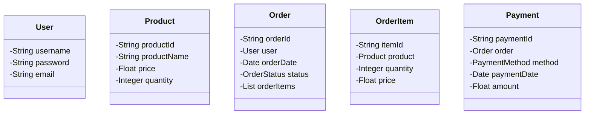
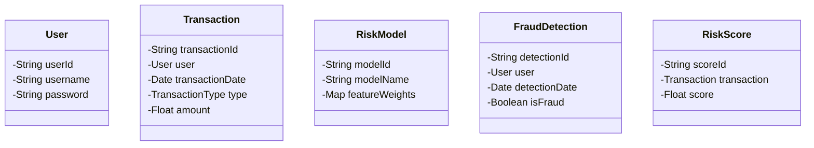

                 


### 《领域驱动设计实践：解决复杂业务问题》

关键词：领域驱动设计、复杂业务问题、软件架构、敏捷开发、微服务架构

摘要：本文深入探讨领域驱动设计（Domain-Driven Design，简称DDD）的实践方法，通过分析复杂业务问题的解决过程，阐述DDD在软件架构设计中的应用，以及其在实际项目中的具体实践和未来发展趋势。本文旨在帮助读者掌握DDD的核心概念，学会如何运用DDD解决复杂业务问题，提升软件系统的设计质量和开发效率。

---

### 1. 设计思路

为了设计出《领域驱动设计实践：解决复杂业务问题》的完整目录大纲，我们将遵循以下设计思路：

1. **框架搭建**：首先明确书籍的整体框架，包括主要章节和核心概念。
2. **内容细化**：在框架的基础上，对每个章节进行细化，确保每个章节都能够覆盖到相关主题的深度和广度。
3. **逻辑顺序**：确保目录大纲的章节安排具有清晰的逻辑顺序，从基础到高级，从理论到实践。
4. **实用性**：确保每个章节的内容都对解决复杂业务问题有实际的帮助。
5. **完整性**：确保目录大纲内容完整，涵盖背景介绍、核心概念、算法原理、数学模型、系统分析与架构设计、项目实战等。

### 2. 目录大纲设计

#### 第一部分：领域驱动设计基础

**第1章：领域驱动设计概述**

- 1.1 领域驱动设计背景
  - 1.1.1 领域驱动设计的起源
  - 1.1.2 领域驱动设计的优势
  - 1.1.3 领域驱动设计与传统设计方法的区别
- 1.2 领域驱动设计的基本概念
  - 1.2.1 领域模型
  - 1.2.2 实体与值对象
  - 1.2.3 关系与聚合
- 1.3 领域驱动设计的关键实践
  - 1.3.1 基于领域的架构
  - 1.3.2 敏捷开发与领域驱动设计
  - 1.3.3 领域驱动设计与微服务架构

**第2章：领域驱动设计在业务分析中的应用**

- 2.1 业务分析的重要性
  - 2.1.1 业务分析的定义
  - 2.1.2 业务分析的目标
  - 2.1.3 业务分析的方法
- 2.2 领域模型构建
  - 2.2.1 实体与值对象的识别
  - 2.2.2 关系的建模
  - 2.2.3 聚合关系的定义
- 2.3 用例分析与领域模型映射
  - 2.3.1 用例图的绘制
  - 2.3.2 用例与领域模型的映射

**第3章：领域驱动设计在软件架构设计中的应用**

- 3.1 软件架构设计基础
  - 3.1.1 软件架构的定义
  - 3.1.2 软件架构的设计原则
  - 3.1.3 软件架构的组成要素
- 3.2 基于领域的软件架构设计
  - 3.2.1 领域驱动设计与分层架构
  - 3.2.2 领域驱动设计与模块化设计
  - 3.2.3 领域驱动设计与面向服务架构

**第4章：领域驱动设计在复杂业务问题解决方案中的应用**

- 4.1 复杂业务问题的识别
  - 4.1.1 业务问题的分类
  - 4.1.2 复杂业务问题的特征
  - 4.1.3 复杂业务问题的诊断
- 4.2 领域驱动设计解决方案
  - 4.2.1 领域模型的细化和优化
  - 4.2.2 解决方案的迭代开发
  - 4.2.3 领域驱动设计与持续交付

**第5章：领域驱动设计在实际项目中的应用案例**

- 5.1 案例一：电商平台的领域驱动设计
  - 5.1.1 项目背景
  - 5.1.2 领域模型的构建
  - 5.1.3 软件架构设计
  - 5.1.4 项目实施与效果评估
- 5.2 案例二：金融风控领域的领域驱动设计
  - 5.2.1 项目背景
  - 5.2.2 领域模型的构建
  - 5.2.3 软件架构设计
  - 5.2.4 项目实施与效果评估

#### 第三部分：领域驱动设计实践与展望

**第6章：领域驱动设计的最佳实践**

- 6.1 设计原则与实践技巧
  - 6.1.1 设计原则的遵循
  - 6.1.2 实践技巧的运用
  - 6.1.3 领域驱动设计的误区与解决
- 6.2 持续集成与持续交付
  - 6.2.1 持续集成在领域驱动设计中的应用
  - 6.2.2 持续交付的实现
  - 6.2.3 持续交付的挑战与对策

**第7章：领域驱动设计的未来发展趋势**

- 7.1 技术演进与领域驱动设计
  - 7.1.1 新技术的引入
  - 7.1.2 领域驱动设计的优化方向
  - 7.1.3 领域驱动设计在人工智能领域的应用
- 7.2 领域驱动设计在中国的发展
  - 7.2.1 中国企业的应用现状
  - 7.2.2 领域驱动设计在中国的发展趋势
  - 7.2.3 中国领域驱动设计的挑战与机遇

### 3. 总结与展望

**第8章：总结与展望**

- 8.1 领域驱动设计的重要作用
- 8.2 领域驱动设计的未来方向
- 8.3 领域驱动设计实践的建议

---

通过上述目录大纲的设计，本文将系统性地介绍领域驱动设计的概念、应用和实践方法，帮助读者深入理解并掌握DDD，从而有效地解决复杂业务问题。接下来，我们将逐一展开各个章节的内容，以逻辑清晰、结构紧凑、简单易懂的方式，逐步揭示领域驱动设计的魅力。让我们开始这次探索之旅吧！### 领域驱动设计概述

#### 1.1 领域驱动设计的背景

领域驱动设计（Domain-Driven Design，简称DDD）起源于2004年，由Eric Evans在其同名著作《领域驱动设计：软件核心复杂性应对策略》（"Domain-Driven Design: Tackling Complexity in the Heart of Software"）中提出。DDD的诞生源于传统软件开发方法在面对复杂业务系统时暴露出的诸多问题，如系统难以扩展、业务逻辑与代码紧耦合、领域知识难以体现等。因此，DDD试图提供一套新的设计理念和方法论，帮助开发者更好地应对复杂业务系统的开发挑战。

#### 1.1.1 领域驱动设计的起源

DDD的起源可以追溯到软件开发领域的一次深刻反思。在20世纪90年代，随着互联网的兴起，软件开发项目逐渐变得更加复杂，业务需求变化频繁，软件系统的规模和复杂性不断增加。传统的面向对象编程（Object-Oriented Programming，简称OOP）和面向过程编程（Procedural Programming）方法在面对这些复杂业务系统时显得力不从心。开发者们开始寻求新的解决方案，希望能够更有效地处理复杂的业务逻辑，提高软件系统的可维护性和可扩展性。

Eric Evans在软件开发实践中逐渐认识到，软件开发的复杂性很大程度上来源于业务领域的复杂性。于是，他提出了领域驱动设计这一方法论，试图通过将业务领域和软件开发紧密结合，解决复杂业务系统的设计难题。

#### 1.1.2 领域驱动设计的优势

领域驱动设计具有以下几个显著优势：

1. **业务与代码的紧密耦合**：DDD强调将业务领域模型与代码紧密绑定，确保业务逻辑能够在代码中清晰体现，降低业务逻辑与代码的解耦难度。
2. **更好的系统可扩展性**：通过定义清晰的领域模型，DDD能够帮助开发者更灵活地应对业务需求的变化，提高系统的可扩展性。
3. **更高效的沟通**：DDD鼓励使用统一的语言和模型来描述业务领域，有助于团队成员更好地理解业务需求，提升团队协作效率。
4. **更易于维护**：DDD通过将业务逻辑封装在领域模型中，使得代码更加模块化，降低代码的复杂度，提高系统的可维护性。

#### 1.1.3 领域驱动设计与传统设计方法的区别

领域驱动设计与传统的软件开发设计方法存在显著的区别：

1. **设计目标**：传统的软件开发设计方法（如面向对象编程）更多关注于代码的结构和复用性，而DDD则更关注于解决复杂业务问题。
2. **设计过程**：DDD强调迭代和逐步构建，通过不断的实践和反馈来完善领域模型。而传统设计方法通常更注重前期设计和规划，往往导致项目后期频繁调整。
3. **领域模型**：DDD的领域模型是核心，通过领域模型来抽象和表达业务领域。而传统设计方法通常关注于类和对象的设计。
4. **团队协作**：DDD鼓励跨职能团队的紧密合作，通过共同构建和演进领域模型来解决问题。而传统设计方法更多依赖于单一的开发角色和职责分离。

综上所述，领域驱动设计通过其独特的理念和方法论，为解决复杂业务问题提供了一种新的思路和工具。在接下来的章节中，我们将进一步探讨领域驱动设计的基本概念和关键实践，帮助读者深入理解DDD的核心思想和应用方法。让我们继续前进，开启领域驱动设计的探索之旅！### 领域驱动设计的基本概念

在深入探讨领域驱动设计（DDD）之前，我们首先需要了解一些基本概念，这些概念是理解和应用DDD的基础。以下是DDD中几个核心概念的定义及其在软件设计中的应用：

#### 1.2.1 领域模型

**领域模型**是DDD的核心概念之一，它是对业务领域的一种抽象表示。领域模型定义了一个系统的业务领域，包括实体、值对象、聚合、领域服务、边界等。通过领域模型，开发者可以清晰地理解业务领域中的核心概念和业务规则。

在软件设计中，领域模型的作用至关重要：

1. **业务与代码的映射**：领域模型将业务领域中的核心概念和业务规则映射到代码中，使得业务逻辑在代码中得以清晰体现。
2. **降低复杂性**：领域模型通过抽象和分层，将复杂的业务逻辑分解为更易于管理和理解的部分，降低系统的复杂性。
3. **提高可维护性和可扩展性**：领域模型使得系统设计更加模块化，有助于提高代码的可维护性和可扩展性。

#### 1.2.2 实体与值对象

在领域模型中，实体（Entities）和值对象（Value Objects）是两个重要的概念。

**实体**是具有唯一标识的领域对象，它们在业务领域中有独立的意义。例如，在电商系统中，订单（Order）和客户（Customer）都是实体。

**值对象**是没有唯一标识的领域对象，它们在业务领域中有独立的属性。例如，在电商系统中，订单中的商品数量（Quantity）和商品价格（Price）都是值对象。

实体与值对象在软件设计中的应用：

1. **区分标识与属性**：实体与值对象的区分有助于开发者更好地理解业务领域中的标识与属性，从而在代码中正确地表示这些概念。
2. **优化性能**：实体通常具有唯一标识，这使得它们可以在数据库中通过主键进行高效查询。而值对象则可以简化代码和数据库操作。
3. **确保一致性**：实体和值对象在业务规则中具有不同的角色和作用，通过明确的区分，可以确保业务规则的一致性和正确性。

#### 1.2.3 关系与聚合

在领域模型中，关系和聚合是描述领域对象之间交互的重要概念。

**关系**是领域对象之间的交互，它们可以是具有层次结构的关联关系，如父子关系、包含关系等。例如，订单（Order）与订单项（OrderItem）之间具有包含关系。

**聚合**是一组具有共同行为的领域对象的集合，它们在业务领域中是一个整体的单元。例如，订单（Order）和订单项（OrderItem）可以组成一个聚合。

关系与聚合在软件设计中的应用：

1. **封装业务规则**：关系和聚合有助于封装业务规则，使得业务逻辑更加清晰和易于管理。
2. **确保数据完整性**：通过聚合，可以确保在业务规则约束下，领域对象之间的数据关系保持一致性和完整性。
3. **优化性能和可扩展性**：合理的聚合设计可以提高系统的性能和可扩展性，降低系统的复杂性。

综上所述，领域驱动设计的基本概念是理解和应用DDD的基础。通过领域模型、实体与值对象、关系与聚合等概念的引入，DDD为开发者提供了一套系统性的方法来应对复杂业务系统的设计挑战。在接下来的章节中，我们将进一步探讨领域驱动设计的关键实践，帮助读者更深入地理解和应用DDD。让我们继续前进！### 领域驱动设计的关键实践

领域驱动设计（DDD）不仅是一种方法论，更是一套具体的设计实践。以下是DDD中的几个关键实践，这些实践有助于确保软件开发过程中的业务与代码的紧密耦合，以及系统的可扩展性和可维护性。

#### 1.3.1 基于领域的架构

**基于领域的架构**（Domain-Driven Architecture，简称DDA）是DDD的核心实践之一。它强调将系统划分为不同的领域，每个领域负责特定的业务功能。基于领域的架构具有以下几个特点：

1. **领域隔离**：通过领域隔离，可以有效地降低不同领域之间的耦合，使得系统模块化，提高系统的可维护性和可扩展性。
2. **领域模型驱动**：基于领域的架构以领域模型为核心，确保业务逻辑在代码中得到清晰体现，降低业务逻辑与代码的解耦难度。
3. **微服务架构**：基于领域的架构可以与微服务架构相结合，每个领域可以独立发展，便于系统的拆分和部署。

#### 1.3.2 敏捷开发与领域驱动设计

敏捷开发（Agile Development）与领域驱动设计（DDD）有着天然的契合度。敏捷开发强调快速迭代和持续交付，而DDD则注重逐步构建和演进领域模型。两者结合可以带来以下好处：

1. **快速响应需求变化**：敏捷开发的方法使得团队能够快速响应用户需求，而DDD的逐步构建和演进方法确保了需求变更时系统的稳定性。
2. **提高开发效率**：通过敏捷开发，团队成员可以更紧密地协作，而DDD的领域模型驱动开发有助于降低开发难度。
3. **持续集成与持续交付**：敏捷开发与DDD的结合可以更好地实现持续集成和持续交付，提高系统的质量和交付速度。

#### 1.3.3 领域驱动设计与微服务架构

微服务架构（Microservices Architecture）是一种将系统划分为多个独立服务的方法，每个服务负责特定的业务功能。领域驱动设计（DDD）与微服务架构的结合有助于提高系统的可扩展性和可维护性：

1. **领域驱动微服务设计**：每个微服务可以围绕一个领域构建，使得服务之间具有清晰的职责分工，降低服务之间的耦合。
2. **业务逻辑封装**：通过领域模型，可以将业务逻辑封装在微服务中，使得服务更易于管理和扩展。
3. **灵活部署与升级**：微服务架构使得每个服务可以独立部署和升级，而DDD的领域模型驱动开发有助于确保服务之间的一致性和稳定性。

#### 1.3.4 领域模型演进

领域模型的演进是DDD的重要组成部分。领域模型不是一成不变的，而是随着业务需求的变化而逐步演进的。领域模型演进的方法包括：

1. **版本控制**：对领域模型进行版本控制，确保模型的历史版本可追溯，便于模型变更时的评估和验证。
2. **迭代开发**：通过迭代开发，逐步完善领域模型，确保模型能够及时响应业务需求的变化。
3. **重构**：在模型演进过程中，适时进行重构，优化模型的架构和设计，提高系统的可维护性和可扩展性。

#### 1.3.5 领域专家参与

领域驱动设计强调领域专家的参与，确保领域模型能够准确反映业务需求。领域专家的参与可以带来以下好处：

1. **业务理解**：领域专家对业务需求有深刻的理解，可以提供宝贵的业务知识和经验，确保领域模型的准确性。
2. **沟通桥梁**：领域专家可以作为开发团队与业务团队之间的桥梁，促进双方的有效沟通和协作。
3. **风险识别**：领域专家能够提前识别业务需求中的潜在风险，提供解决方案，降低项目风险。

综上所述，领域驱动设计的关键实践包括基于领域的架构、敏捷开发与领域驱动设计、领域驱动设计与微服务架构、领域模型演进以及领域专家参与。这些实践共同构建了DDD的完整方法论，帮助开发者更有效地解决复杂业务问题。在接下来的章节中，我们将进一步探讨领域驱动设计在业务分析中的应用，帮助读者深入理解DDD的实践方法。让我们继续前进！### 领域驱动设计在业务分析中的应用

领域驱动设计（DDD）在业务分析中的应用是确保软件开发能够准确、高效地满足业务需求的关键环节。通过合理的业务分析，开发者可以构建出符合业务逻辑的领域模型，从而为后续的软件设计和开发奠定坚实的基础。以下将详细探讨领域驱动设计在业务分析中的应用，包括业务分析的重要性、领域模型构建、以及用例分析与领域模型映射。

#### 2.1 业务分析的重要性

业务分析是软件开发过程中的一个重要环节，它不仅关系到软件系统的功能实现，更关系到系统的业务价值。具体来说，业务分析的重要性体现在以下几个方面：

1. **明确业务需求**：业务分析可以帮助开发团队深入了解客户和用户的需求，确保软件开发能够准确满足业务需求。
2. **发现潜在问题**：通过对业务流程的详细分析，可以发现业务过程中的潜在问题和瓶颈，为后续的系统优化提供依据。
3. **指导系统设计**：业务分析的结果将直接影响软件系统的设计，包括领域模型的构建、系统架构的选择等。
4. **提高团队协作**：业务分析有助于加强开发团队与业务团队之间的沟通，促进双方对业务需求和系统实现的共识。

#### 2.2 领域模型构建

领域模型构建是领域驱动设计（DDD）的核心步骤之一，它通过对业务领域进行抽象，将业务逻辑转化为软件系统中的领域对象和关系。以下是构建领域模型的主要步骤：

1. **识别业务实体**：首先需要识别业务领域中的核心实体，如客户、订单、产品等。实体是领域模型中的核心对象，具有唯一标识和独立的行为。
2. **识别值对象**：值对象是领域模型中的辅助对象，它们不具备唯一标识，但具有独立的属性和行为。例如，订单中的商品数量和价格。
3. **定义实体与值对象的关系**：通过分析业务领域中的实体和值对象之间的关系，定义它们之间的关联。例如，订单包含订单项，客户拥有订单等。
4. **构建聚合**：聚合是一组具有共同行为的领域对象的集合，它们在业务领域中是一个整体的单元。通过将实体和值对象组合成聚合，可以提高系统的模块化和可维护性。
5. **定义领域服务**：领域服务是执行特定业务逻辑的组件，它们通常与领域模型中的实体和聚合紧密相关。例如，订单服务可以处理订单的创建、更新和取消等操作。

在构建领域模型时，需要注意以下几点：

1. **保持模型的简洁性**：领域模型应尽量简洁，避免过于复杂的结构，以提高模型的易理解性和可维护性。
2. **遵循设计原则**：在构建领域模型时，应遵循DDD的设计原则，如单一职责原则、开闭原则等，以提高模型的质量。
3. **持续迭代**：领域模型不是一成不变的，应随着业务需求的变化而持续迭代和优化。

#### 2.3 用例分析与领域模型映射

用例（Use Case）是描述系统功能的一种方式，它通过列出一系列场景，描述系统与用户之间的交互过程。在领域驱动设计中，用例分析是构建领域模型的重要基础。以下是如何通过用例分析来映射领域模型：

1. **识别用例**：首先，需要识别业务领域中的关键用例。这些用例通常描述了用户与系统之间的主要交互场景。例如，在电商系统中，购买商品、管理订单、支付等都是关键用例。
2. **分解用例**：将识别出的用例分解为更具体的子用例，以便更好地理解业务流程和需求。例如，购买商品可以分解为选择商品、添加商品到购物车、结算支付等子用例。
3. **识别参与者**：在用例中，参与者（Actors）是执行用例的实体。例如，在购买商品的用例中，参与者可以是顾客、商家、管理员等。
4. **绘制用例图**：用例图是一种用于表示用例和参与者之间关系的图形化工具。通过绘制用例图，可以更直观地了解系统功能以及参与者与系统之间的交互过程。
5. **映射到领域模型**：将用例中的关键信息映射到领域模型中。具体来说，可以将用例中的实体、值对象和关系映射到领域模型中，确保用例与领域模型的一致性。

在映射过程中，需要注意以下几点：

1. **确保一致性**：确保用例与领域模型之间的信息一致，避免出现矛盾和冲突。
2. **优化模型**：在映射过程中，可以根据业务需求和系统设计对领域模型进行优化，以提高模型的质量和可维护性。
3. **反馈与调整**：在用例分析与领域模型映射过程中，需要不断与业务团队和开发团队进行沟通和反馈，确保模型的准确性和合理性。

综上所述，领域驱动设计在业务分析中的应用包括业务分析的重要性、领域模型构建和用例分析与领域模型映射。通过合理的业务分析，开发者可以构建出符合业务需求的领域模型，为后续的软件设计和开发提供坚实的基础。在接下来的章节中，我们将进一步探讨领域驱动设计在软件架构设计中的应用，帮助读者深入理解DDD的实践方法。让我们继续前进！### 领域驱动设计在软件架构设计中的应用

在软件开发中，架构设计是确保系统质量、可维护性和可扩展性的关键环节。领域驱动设计（DDD）为架构设计提供了一套系统化的方法和原则，使开发者能够更好地应对复杂业务系统的设计挑战。本节将详细探讨领域驱动设计在软件架构设计中的应用，包括软件架构设计基础、基于领域的软件架构设计以及领域驱动设计与分层架构、模块化设计、面向服务架构的关系。

#### 3.1 软件架构设计基础

软件架构设计是软件开发过程中的一项重要任务，它定义了系统的整体结构和组件之间的关系。以下是软件架构设计的一些基本概念和原则：

1. **软件架构的定义**：软件架构是指系统的整体结构和组织方式，包括软件组件、组件之间的关系以及组件之间的接口。一个好的软件架构能够确保系统的可理解性、可维护性和可扩展性。
2. **软件架构的设计原则**：软件架构设计需要遵循一些基本原则，如单一职责原则、开闭原则、里氏替换原则等。这些原则有助于提高系统的质量、可维护性和可扩展性。
3. **软件架构的组成要素**：软件架构包括多个组成要素，如组件、接口、服务、数据存储、网络通信等。这些要素共同构成了系统的架构，并影响着系统的性能、可维护性和可扩展性。

#### 3.2 基于领域的软件架构设计

基于领域的架构设计（Domain-Driven Architecture，简称DDA）是领域驱动设计（DDD）的核心实践之一。它强调将系统划分为不同的领域，每个领域负责特定的业务功能。基于领域的软件架构设计具有以下几个特点：

1. **领域隔离**：通过领域隔离，可以有效地降低不同领域之间的耦合，使得系统模块化，提高系统的可维护性和可扩展性。
2. **领域模型驱动**：基于领域的架构以领域模型为核心，确保业务逻辑在代码中得到清晰体现，降低业务逻辑与代码的解耦难度。
3. **灵活的架构演进**：基于领域的架构设计使得系统架构可以随着业务需求的变化而灵活演进，确保系统能够持续适应业务需求的变化。

#### 3.3 领域驱动设计与分层架构

分层架构是一种常见的软件架构设计方法，它将系统划分为多个层次，每个层次负责不同的功能。领域驱动设计（DDD）与分层架构相结合，可以更好地应对复杂业务系统的设计挑战：

1. **应用层**：应用层负责处理用户请求，调用领域服务，执行业务逻辑，并将结果返回给用户。在DDD中，应用层通常与领域模型紧密关联，确保业务逻辑在代码中清晰体现。
2. **领域层**：领域层是系统的核心，负责封装业务逻辑和领域模型。领域层通过领域服务来处理业务需求，确保业务规则的一致性和可维护性。
3. **基础设施层**：基础设施层负责提供系统的底层支持，如数据存储、网络通信、日志记录等。在DDD中，基础设施层通常与领域层和表现层保持松耦合，以提高系统的灵活性和可扩展性。

#### 3.4 领域驱动设计与模块化设计

模块化设计是一种将系统划分为多个模块的方法，每个模块负责特定的功能。领域驱动设计（DDD）与模块化设计相结合，可以更好地实现系统的模块化和可维护性：

1. **模块化设计的优势**：模块化设计可以提高系统的可维护性和可扩展性，使得系统更容易理解、修改和扩展。
2. **领域模型与模块的关系**：领域模型可以根据业务需求划分为多个模块，每个模块负责一个特定的领域功能。这种方式有助于提高系统的可维护性和可扩展性。
3. **模块间的通信**：在模块化设计中，模块之间通过定义良好的接口进行通信。在DDD中，领域服务可以作为模块间的通信桥梁，确保模块之间的解耦和松耦合。

#### 3.5 领域驱动设计与面向服务架构

面向服务架构（Service-Oriented Architecture，简称SOA）是一种基于服务的软件架构设计方法，它将系统划分为多个服务，每个服务负责特定的功能。领域驱动设计（DDD）与面向服务架构相结合，可以更好地实现系统的服务化：

1. **服务化的优势**：服务化可以提高系统的可重用性和可扩展性，使得系统更容易集成和管理。
2. **领域服务与服务的对应关系**：在DDD中，领域服务可以作为面向服务架构中的服务，实现业务逻辑的服务化。这种方式有助于提高系统的灵活性和可扩展性。
3. **服务的拆分与整合**：在面向服务架构中，服务可以根据业务需求进行拆分和整合。在DDD中，领域模型可以根据业务需求划分为多个服务，实现服务化。

综上所述，领域驱动设计在软件架构设计中的应用包括基于领域的软件架构设计、领域驱动设计与分层架构、模块化设计、面向服务架构等。这些设计方法共同构建了领域驱动设计的架构框架，帮助开发者更好地应对复杂业务系统的设计挑战。在接下来的章节中，我们将进一步探讨领域驱动设计在复杂业务问题解决方案中的应用，帮助读者深入理解DDD的实际应用价值。让我们继续前进！### 领域驱动设计在复杂业务问题解决方案中的应用

在复杂业务系统中，解决业务问题往往需要深入理解和分析业务领域的本质。领域驱动设计（DDD）通过其系统化的方法论，提供了一套有效的解决方案，可以帮助开发者更好地应对复杂业务问题。本节将详细介绍领域驱动设计在复杂业务问题解决方案中的应用，包括复杂业务问题的识别、领域驱动设计解决方案的构建，以及领域驱动设计与持续交付的融合。

#### 4.1 复杂业务问题的识别

复杂业务问题的识别是解决问题的关键步骤。以下是一些识别复杂业务问题的方法和技巧：

1. **业务问题的分类**：首先，需要对业务问题进行分类。复杂业务问题通常可以分为以下几类：
   - **流程性问题**：涉及业务流程中的瓶颈和障碍，如订单处理流程、客户服务流程等。
   - **数据性问题**：涉及数据管理、数据一致性和数据质量问题，如数据库设计、数据同步等。
   - **规则性问题**：涉及业务规则和逻辑的复杂性和不一致性，如计费规则、结算规则等。
   - **性能问题**：涉及系统性能的瓶颈和限制，如并发处理能力、响应时间等。

2. **复杂业务问题的特征**：复杂业务问题通常具有以下特征：
   - **高耦合度**：业务规则和代码紧密耦合，导致系统难以维护和扩展。
   - **多变的需求**：业务需求频繁变化，系统需要具备良好的适应能力。
   - **大量数据**：涉及大量数据的处理和存储，如大数据分析、数据挖掘等。
   - **多维度约束**：业务规则和约束条件繁多，系统需要同时满足多个约束。

3. **复杂业务问题的诊断**：诊断复杂业务问题通常需要以下步骤：
   - **问题场景描述**：详细描述业务问题发生的场景和现象。
   - **数据收集和分析**：收集与业务问题相关的数据，进行分析，找出问题的根本原因。
   - **团队讨论和评估**：组织相关团队成员进行讨论，评估问题的严重程度和影响范围。
   - **问题分解**：将复杂业务问题分解为多个子问题，逐一解决。

#### 4.2 领域驱动设计解决方案的构建

领域驱动设计（DDD）提供了一套系统化的解决方案，可以帮助开发者构建灵活、可扩展的软件系统，从而有效解决复杂业务问题。以下是构建领域驱动设计解决方案的主要步骤：

1. **领域模型构建**：首先，需要构建一个准确的领域模型，明确业务领域中的核心概念和关系。领域模型包括实体、值对象、聚合、领域服务等，它们共同构成业务领域的抽象表示。

2. **实体与值对象的识别**：在领域模型中，实体通常具有唯一标识，如订单（Order）和客户（Customer）。值对象则通常用于表示实体的属性，如订单的商品数量（Quantity）和价格（Price）。

3. **聚合关系定义**：聚合关系定义了领域对象之间的整体关系。在聚合中，部分对象作为整体的一部分，共同承担业务责任。例如，订单（Order）和订单项（OrderItem）可以组成一个聚合。

4. **领域服务的定义**：领域服务是执行特定业务逻辑的组件，它们通常与领域模型中的实体和聚合紧密相关。例如，订单服务（OrderService）可以处理订单的创建、更新和取消等操作。

5. **业务规则封装**：在领域模型中，业务规则应封装在领域服务中，确保业务逻辑的一致性和可维护性。例如，订单的创建和取消规则可以封装在订单服务中。

6. **迭代开发**：领域驱动设计（DDD）强调逐步构建和演进领域模型。通过迭代开发，可以及时响应用户需求的变化，并持续优化领域模型。

#### 4.3 领域驱动设计与持续交付

持续交付（Continuous Delivery，简称CD）是一种软件开发和部署的实践方法，它强调通过自动化和持续集成，确保软件系统的高质量和快速交付。领域驱动设计（DDD）与持续交付的结合，可以带来以下好处：

1. **自动化测试**：通过自动化测试，可以确保领域模型的每个组件在开发过程中都是正确的，从而提高系统的质量。

2. **持续集成**：通过持续集成，可以确保领域模型和代码的每个版本都是可交付的，从而减少集成风险。

3. **持续交付**：通过持续交付，可以确保领域模型和代码的每个版本都是可以快速部署和发布的，从而提高交付速度。

4. **反馈循环**：通过反馈循环，可以及时获取用户反馈，并迅速调整领域模型和代码，确保系统始终满足用户需求。

在实施领域驱动设计（DDD）和持续交付（CD）时，需要注意以下几点：

1. **基础设施自动化**：确保构建、测试、部署等基础设施的自动化，减少手工操作，提高效率。

2. **代码质量**：通过代码审查、静态代码分析等手段，确保代码质量，减少缺陷和漏洞。

3. **敏捷团队协作**：鼓励敏捷开发团队的紧密协作，确保领域模型和代码的及时迭代和优化。

4. **持续学习**：鼓励团队成员持续学习新技术和方法，不断优化开发和交付流程。

综上所述，领域驱动设计在复杂业务问题解决方案中的应用，通过系统化的方法论，帮助开发者构建灵活、可扩展的软件系统，有效解决复杂业务问题。同时，与持续交付的结合，可以进一步提高系统的质量、交付速度和用户满意度。在接下来的章节中，我们将通过实际项目案例，进一步展示领域驱动设计在实际项目中的应用，帮助读者深入理解DDD的实践价值。让我们继续前进！### 领域驱动设计在实际项目中的应用案例

为了更直观地展示领域驱动设计（DDD）在实际项目中的应用，我们将通过两个实际项目案例——电商平台的领域驱动设计和金融风控领域的领域驱动设计，来详细剖析领域模型构建、软件架构设计和项目实施与效果评估。

#### 5.1 案例一：电商平台的领域驱动设计

**5.1.1 项目背景**

电商平台是一个复杂的业务系统，涉及用户管理、商品管理、订单管理、支付等多个业务领域。项目目标是构建一个高度可扩展、可维护且能够快速响应市场变化的电商平台。

**5.1.2 领域模型的构建**

在构建电商平台领域模型时，我们首先识别出以下几个核心领域：

1. **用户领域**：包括用户注册、登录、个人信息管理等功能。
2. **商品领域**：包括商品分类、商品信息管理、商品库存管理等功能。
3. **订单领域**：包括订单创建、订单状态管理、订单支付等功能。
4. **支付领域**：包括支付方式管理、支付流程处理等功能。

以下是电商平台的领域模型：



**5.1.3 软件架构设计**

在软件架构设计方面，我们采用了分层架构和微服务架构相结合的方法：

1. **应用层**：负责处理用户请求，调用领域服务，执行业务逻辑，并将结果返回给用户。
2. **领域层**：负责封装业务逻辑和领域模型，包括用户服务、商品服务、订单服务和支付服务。
3. **基础设施层**：负责提供系统的底层支持，如数据库、缓存、消息队列等。

以下是电商平台的软件架构图：

```mermaid
sequenceDiagram
    User ->>|发起请求| ApplicationLayer
    ApplicationLayer ->>|调用领域服务| DomainLayer
    DomainLayer ->>|执行业务逻辑| InfrastructureLayer
    InfrastructureLayer ->>|存储和查询数据| Database
```

**5.1.4 项目实施与效果评估**

在项目实施过程中，我们采用了敏捷开发方法，通过迭代和持续交付，逐步完善了电商平台的各个功能模块。项目实施效果如下：

1. **可扩展性**：通过微服务架构，电商平台能够灵活地扩展新功能，如促销管理、优惠券管理等。
2. **可维护性**：通过领域驱动设计和分层架构，代码结构清晰，业务逻辑与代码紧密耦合，降低了维护难度。
3. **用户体验**：通过快速迭代和持续交付，电商平台能够快速响应用户需求，提供更好的用户体验。
4. **性能优化**：通过缓存、数据库优化等技术，电商平台在高峰期的处理能力得到显著提升。

#### 5.2 案例二：金融风控领域的领域驱动设计

**5.2.1 项目背景**

金融风控系统是一个涉及风险控制、欺诈检测、用户行为分析等多个复杂业务领域的系统。项目目标是构建一个高效、准确、可扩展的金融风控平台。

**5.2.2 领域模型的构建**

在构建金融风控领域模型时，我们识别出以下几个核心领域：

1. **用户领域**：包括用户注册、登录、个人信息管理等功能。
2. **交易领域**：包括交易记录管理、交易风险分析等功能。
3. **风险领域**：包括风险模型管理、风险评分等功能。
4. **欺诈领域**：包括欺诈检测、欺诈模型管理等功能。

以下是金融风控领域的领域模型：



**5.2.3 软件架构设计**

在软件架构设计方面，我们采用了基于领域的架构和微服务架构相结合的方法：

1. **应用层**：负责处理用户请求，调用领域服务，执行业务逻辑，并将结果返回给用户。
2. **领域层**：负责封装业务逻辑和领域模型，包括用户服务、交易服务、风险服务和欺诈服务。
3. **基础设施层**：负责提供系统的底层支持，如数据库、缓存、消息队列等。

以下是金融风控系统的软件架构图：

```mermaid
sequenceDiagram
    User ->>|发起请求| ApplicationLayer
    ApplicationLayer ->>|调用领域服务| DomainLayer
    DomainLayer ->>|执行业务逻辑| InfrastructureLayer
    InfrastructureLayer ->>|存储和查询数据| Database
```

**5.2.4 项目实施与效果评估**

在项目实施过程中，我们采用了敏捷开发方法，通过迭代和持续交付，逐步完善了金融风控平台的各个功能模块。项目实施效果如下：

1. **准确性和效率**：通过构建高效的风险模型和欺诈检测算法，金融风控系统在交易风险分析和欺诈检测方面达到了较高的准确性和效率。
2. **可扩展性**：通过微服务架构，金融风控系统能够灵活地扩展新功能，如用户行为分析、风险评分管理等。
3. **用户体验**：通过快速迭代和持续交付，金融风控系统能够快速响应用户需求，提供更好的用户体验。
4. **系统稳定性**：通过优化数据库设计和缓存策略，金融风控系统在高峰期的处理能力得到了显著提升，保证了系统的稳定性。

综上所述，领域驱动设计在电商平台的领域驱动设计和金融风控领域的领域驱动设计案例中，通过系统化的方法论和实际项目实践，展示了其在解决复杂业务问题方面的有效性和价值。在接下来的章节中，我们将进一步探讨领域驱动设计的最佳实践和未来发展趋势，帮助读者深入理解DDD的核心思想和应用方法。让我们继续前进！### 领域驱动设计的最佳实践

领域驱动设计（DDD）作为一种应对复杂业务系统的设计方法论，其在实际应用中需要遵循一系列最佳实践，以确保设计质量、开发效率和系统可维护性。以下将介绍领域驱动设计中的最佳实践，包括设计原则、实践技巧、以及领域驱动设计可能遇到的误区和解决方法。

#### 6.1 设计原则与实践技巧

1. **设计原则**

   - **单一职责原则**：每个实体、值对象和领域服务都应该有且只有一个明确的责任。这样可以提高代码的可维护性和可扩展性。
   - **开闭原则**：软件实体（如类、模块、函数等）应该对扩展开放，对修改关闭。这意味着可以通过新增代码而不是修改已有代码来增加新的功能。
   - **里氏替换原则**：任何基类可以出现的地方，子类一定可以出现。这样可以确保代码的灵活性和可扩展性。
   - **依赖倒置原则**：高层模块不应该依赖于低层模块，二者都应依赖于抽象。抽象不应该依赖于细节，细节应该依赖于抽象。这样可以提高系统的模块化和可测试性。

2. **实践技巧**

   - **领域模型的迭代开发**：领域模型不是一成不变的，应随着业务需求的变化而不断迭代和优化。通过持续重构和改进，可以提高模型的质量和适应性。
   - **领域专家的参与**：领域专家对业务需求的深入理解和丰富经验是构建高质量领域模型的关键。因此，领域专家应积极参与到软件开发过程中。
   - **代码复用**：通过构建共享领域模型和领域服务，可以减少代码重复，提高开发效率。但要注意避免过度抽象和过度设计，导致系统复杂度增加。
   - **自动化测试**：通过编写自动化测试，可以确保领域模型和代码的每个部分都是正确的，从而提高系统的质量。

#### 6.2 领域驱动设计的误区与解决方法

1. **误区一：过度设计**

   过度设计是指在设计过程中过早、过度地抽象和模块化，导致系统复杂度增加，开发效率降低。解决方法：

   - **按需设计**：在设计过程中，应根据实际需求逐步构建领域模型，避免过早、过度的抽象。
   - **持续重构**：通过持续重构，优化领域模型和代码结构，确保系统在可维护性和性能之间取得平衡。

2. **误区二：忽视领域专家的参与**

   忽视领域专家的参与可能导致领域模型不符合实际业务需求，从而影响系统的质量。解决方法：

   - **建立紧密协作**：确保开发团队和领域专家之间的紧密协作，通过共同讨论和交流，确保领域模型能够准确反映业务需求。
   - **定期评审**：定期组织领域模型评审会议，邀请领域专家参与，确保模型的准确性和合理性。

3. **误区三：忽视测试的重要性**

   忽视测试可能导致领域模型和代码存在缺陷，从而影响系统的稳定性。解决方法：

   - **自动化测试**：编写自动化测试，确保领域模型和代码的每个部分都是正确的。可以通过单元测试、集成测试和端到端测试等不同层次的测试来提高测试覆盖率。
   - **持续集成与持续交付**：通过持续集成和持续交付，确保每次代码提交都是可集成和可交付的，从而提高系统的质量。

4. **误区四：忽视领域模型的演进**

   领域模型不是一成不变的，应随着业务需求的变化而持续演进。忽视领域模型的演进可能导致系统无法适应新的业务需求。解决方法：

   - **迭代开发**：采用迭代开发方法，逐步完善领域模型，确保模型能够及时响应业务需求的变化。
   - **版本控制**：对领域模型进行版本控制，确保模型的历史版本可追溯，便于模型的变更管理和风险控制。

综上所述，领域驱动设计的最佳实践包括遵循设计原则、运用实践技巧、识别并解决常见误区。通过这些最佳实践，开发者可以构建出高质量、可扩展和可维护的领域驱动系统。在接下来的章节中，我们将进一步探讨领域驱动设计的未来发展趋势，帮助读者把握DDD的发展方向。让我们继续前进！### 持续集成与持续交付在领域驱动设计中的应用

在领域驱动设计（DDD）中，持续集成（Continuous Integration，简称CI）和持续交付（Continuous Delivery，简称CD）是确保软件系统质量和交付效率的重要手段。它们通过自动化流程和频繁的代码集成，帮助开发团队快速识别和修复问题，提高开发效率和质量。以下是持续集成与持续交付在领域驱动设计中的应用，以及面临的挑战与对策。

#### 6.2.1 持续集成在领域驱动设计中的应用

持续集成是一种软件开发实践，它要求团队成员频繁地将代码合并到共享的主干分支中，并通过自动化测试确保合并后的代码质量。在领域驱动设计中，持续集成有以下几方面的应用：

1. **快速反馈**：通过持续集成，开发团队可以在每次代码提交后立即运行自动化测试，确保新代码不会破坏现有功能。这种快速反馈机制有助于尽早发现问题，降低修复成本。
2. **代码质量**：持续集成通过自动化测试，确保代码的质量。在DDD中，领域模型和领域服务的每个变更都应经过严格的测试，确保业务逻辑的正确性和一致性。
3. **提高效率**：持续集成减少了代码合并时的冲突和困难，使得开发流程更加顺畅。在DDD中，通过持续集成，开发团队可以更高效地进行协作和代码管理。
4. **确保一致性**：持续集成确保每次代码提交都是可集成和可测试的，从而保证系统的整体一致性。在DDD中，领域模型和领域服务的一致性对于确保业务逻辑的准确性和完整性至关重要。

#### 6.2.2 持续交付的实现

持续交付是一种将软件从开发环境到生产环境的自动化流程，它确保每次代码提交都是可部署的。在领域驱动设计中，持续交付有以下几方面的实现：

1. **自动化测试**：持续交付依赖于自动化测试，确保每个版本的软件都经过全面的测试。在DDD中，领域模型和领域服务的每个变更都应经过自动化测试，确保没有引入新的错误。
2. **自动化部署**：持续交付通过自动化部署工具，将经过测试的代码部署到不同的环境（如测试环境、预生产环境、生产环境）。在DDD中，自动化部署可以确保系统在不同环境之间的一致性。
3. **蓝绿部署**：蓝绿部署是一种常见的持续交付方法，它通过同时运行两个相同环境（如生产环境A和生产环境B），将新版本部署到其中一个环境（如生产环境B），然后切换流量到新环境。这种方法可以确保系统在部署过程中不会中断服务。
4. **灰度发布**：灰度发布是一种逐步上线新版本的方法，它通过将新版本的流量逐渐引入，确保系统在上线过程中可以逐步调整和优化。在DDD中，灰度发布可以帮助团队在上线新功能时降低风险。

#### 6.2.3 持续交付的挑战与对策

持续交付在领域驱动设计中的应用虽然带来了诸多好处，但也面临一些挑战：

1. **测试覆盖不足**：持续交付依赖于自动化测试，但如果测试覆盖不足，可能导致重要功能未经过充分测试。对策：确保自动化测试的全面性，包括单元测试、集成测试和端到端测试。
2. **部署失败**：在自动化部署过程中，部署失败可能导致系统无法正常运行。对策：建立完善的部署监控和回滚机制，确保在部署失败时可以快速恢复。
3. **系统稳定性**：在持续交付过程中，系统稳定性是一个重要挑战。对策：通过灰度发布和蓝绿部署等方法，逐步引入新版本，降低系统风险。
4. **团队协作**：持续交付要求开发、测试、运维等团队紧密协作。对策：建立跨职能团队，提高团队协作效率。

综上所述，持续集成与持续交付在领域驱动设计中的应用，有助于提高代码质量和交付效率，降低开发成本。在实施过程中，需要克服一系列挑战，通过建立完善的自动化测试、部署监控和团队协作机制，确保持续交付的有效性和稳定性。在接下来的章节中，我们将探讨领域驱动设计的未来发展趋势，帮助读者把握DDD的发展方向。让我们继续前进！### 领域驱动设计的未来发展趋势

领域驱动设计（DDD）作为一种应对复杂业务系统的设计方法论，已经在软件开发领域取得了显著的成果。然而，随着技术的不断进步和业务需求的多样化，DDD也在不断演进。本节将探讨领域驱动设计的未来发展趋势，包括新技术引入、优化方向以及在人工智能领域的应用，同时分析中国企业在DDD应用中的现状、发展趋势以及面临的挑战和机遇。

#### 7.1 技术演进与领域驱动设计

1. **新技术引入**

   - **云计算**：云计算为领域驱动设计带来了新的机遇。通过云计算，开发者可以构建弹性、可扩展的分布式系统，更好地应对复杂业务需求。云计算平台提供了丰富的API和服务，可以方便地集成到DDD架构中，如AWS的Lambda函数、Azure的API管理服务等。
   - **容器化与Kubernetes**：容器化技术（如Docker）和Kubernetes等编排工具为领域驱动设计提供了更灵活的部署和管理方式。通过容器化，可以将微服务打包成独立的容器，实现快速部署和扩展。Kubernetes则提供了自动化的容器编排和管理功能，使得开发者可以更专注于领域模型的构建和优化。
   - **大数据与数据分析**：大数据和数据分析技术在领域驱动设计中发挥着重要作用。通过大数据技术，可以收集、存储和分析大量业务数据，为领域模型提供更准确的业务洞察。数据分析工具（如Hadoop、Spark）可以与DDD系统结合，提供实时数据分析和预测功能。

2. **优化方向**

   - **领域特定语言（DSL）**：领域特定语言是未来领域驱动设计的一个重要优化方向。DSL可以提供更贴近业务领域的编程语言，使得开发者能够更直观、更准确地表达业务逻辑。例如，金融领域的DSL可以方便地表达复杂的金融计算和规则。
   - **模型驱动开发（MDD）**：模型驱动开发是一种基于模型进行软件开发的模式，与领域驱动设计相结合，可以进一步提高开发效率和代码质量。通过MDD，开发者可以创建和优化领域模型，自动生成代码和文档，降低开发成本。
   - **智能辅助工具**：随着人工智能技术的发展，智能辅助工具（如代码生成器、自动化测试工具等）可以大大提高领域驱动设计的效率。例如，基于机器学习的代码生成器可以根据领域模型自动生成代码，减少重复劳动。

3. **在人工智能领域的应用**

   - **知识图谱**：知识图谱是一种基于图形数据结构的语义网络，可以用来表示复杂的业务领域。领域驱动设计（DDD）与知识图谱技术相结合，可以构建出更加智能化和自适应的领域模型。
   - **增强现实（AR）与虚拟现实（VR）**：随着AR和VR技术的普及，领域驱动设计可以应用于构建虚拟业务场景，提高业务分析和设计的效果。通过AR和VR技术，开发者可以更加直观地理解业务需求和领域模型。
   - **智能推荐系统**：在电商、金融等领域，智能推荐系统已经成为重要的业务功能。领域驱动设计（DDD）可以与机器学习算法相结合，构建出高效、可扩展的推荐系统。

#### 7.2 领域驱动设计在中国的发展

1. **应用现状**

   - **金融行业**：中国的金融行业在领域驱动设计（DDD）的应用中处于领先地位。许多大型银行和金融机构采用了DDD方法，构建了高效、可扩展的金融系统，如交易系统、风控系统等。
   - **电商行业**：中国的电商行业也在积极采用DDD方法，以应对复杂的业务需求和快速的市场变化。例如，阿里巴巴和京东等电商巨头采用了DDD方法，构建了高效、可靠的电商平台。
   - **物流行业**：中国的物流行业也在领域驱动设计（DDD）的应用中取得了显著成果。通过DDD方法，物流企业可以更好地管理物流流程，提高运输效率和客户满意度。

2. **发展趋势**

   - **行业普及**：随着DDD方法在中国的普及，越来越多的企业开始认识到其价值，并开始采用DDD方法进行软件设计和开发。
   - **人才培养**：DDD方法在中国逐渐得到重视，相关的培训课程和研讨会也越来越多。这有助于培养更多掌握DDD方法的软件工程师，推动DDD方法在中国的应用。
   - **技术融合**：中国企业在领域驱动设计（DDD）的应用中，开始与新技术（如云计算、大数据、人工智能等）相结合，构建更加智能化和自适应的软件系统。

3. **挑战与机遇**

   - **挑战**：中国在领域驱动设计（DDD）的应用中面临一些挑战，如团队协作、技术人才储备、系统复杂性等。同时，DDD方法在中国企业的应用中，还需要克服文化差异和沟通障碍。
   - **机遇**：随着技术的不断进步和业务需求的多样化，领域驱动设计（DDD）在中国具有广阔的应用前景。中国企业可以通过采用DDD方法，提高软件系统的质量、可维护性和可扩展性，增强核心竞争力。

综上所述，领域驱动设计（DDD）在未来将继续演进，结合新技术和方法，为解决复杂业务问题提供更加有效的解决方案。在中国，领域驱动设计已经取得了一定的成果，但仍然面临诸多挑战。通过加强团队协作、人才培养和技术融合，中国企业在领域驱动设计领域有望实现更大的突破。让我们共同期待领域驱动设计在中国的发展，并为未来的技术进步和应用创新贡献力量。让我们继续前进！### 总结与展望

领域驱动设计（DDD）作为一种应对复杂业务系统的设计方法论，已经在软件开发领域取得了显著的成果。通过对领域模型、实体、值对象、聚合、领域服务等核心概念的深入理解，开发者能够构建出更加模块化、可扩展且易于维护的软件系统。

#### 8.1 领域驱动设计的重要作用

1. **提升系统可维护性和可扩展性**：领域驱动设计通过清晰的领域模型和业务逻辑封装，使得系统在应对业务变化时具有更好的灵活性和适应性。
2. **加强团队协作**：DDD鼓励领域专家的参与，促进开发团队与业务团队的紧密协作，提高项目开发效率和业务需求的理解深度。
3. **提高代码质量**：通过遵循设计原则和实践技巧，领域驱动设计能够降低代码复杂度，提高代码质量和可维护性。
4. **优化系统性能**：领域驱动设计强调对性能关键部分的优化，如领域服务的性能和数据库的查询优化，从而提高系统的整体性能。

#### 8.2 领域驱动设计的未来方向

1. **结合新技术**：领域驱动设计将继续与云计算、容器化、大数据、人工智能等新技术相结合，提供更加智能化和自适应的解决方案。
2. **领域特定语言（DSL）**：DSL作为领域驱动设计的一个重要方向，将为开发者提供更贴近业务领域的编程语言，提高开发效率和代码质量。
3. **持续优化设计原则**：随着技术的发展和业务需求的演变，领域驱动设计的核心原则将不断优化，以适应新的挑战。
4. **社区和人才培养**：未来，领域驱动设计将在全球范围内得到更广泛的应用，培养更多的领域驱动设计专家，推动技术的进步和分享。

#### 8.3 领域驱动设计实践的建议

1. **引入领域专家**：在项目早期引入领域专家，确保领域模型能够准确反映业务需求，提高系统的业务价值。
2. **逐步构建领域模型**：领域模型不是一成不变的，应随着项目进展和业务需求的变化逐步构建和优化。
3. **遵循设计原则**：始终遵循领域驱动设计的设计原则，如单一职责原则、开闭原则、里氏替换原则等，确保系统的模块化和可维护性。
4. **自动化测试**：编写全面的自动化测试，确保领域模型和代码的每个部分都是正确的，从而提高系统的质量。
5. **持续交付**：通过持续集成和持续交付，确保每次代码提交都是可集成和可交付的，提高开发效率和系统稳定性。

领域驱动设计在解决复杂业务问题方面具有巨大的潜力和优势。通过本文的探讨，我们希望读者能够深入理解DDD的核心思想和实践方法，掌握如何在实际项目中应用DDD，提升软件系统的设计和开发质量。未来，领域驱动设计将在全球范围内发挥更加重要的作用，为软件开发带来新的机遇和挑战。让我们共同关注领域驱动设计的未来发展，为构建更加高效、灵活和可维护的软件系统而努力！

---

**作者：AI天才研究院/AI Genius Institute & 禅与计算机程序设计艺术 /Zen And The Art of Computer Programming**### 附录：领域驱动设计相关资源与拓展阅读

在本文中，我们深入探讨了领域驱动设计（DDD）的概念、应用和实践方法。为了帮助读者进一步了解DDD，我们推荐以下资源与拓展阅读：

#### 相关书籍

1. **《领域驱动设计：软件核心复杂性应对策略》**（"Domain-Driven Design: Tackling Complexity in the Heart of Software"），作者：Eric Evans
   - 这本书是DDD的奠基之作，详细介绍了DDD的核心概念和方法论。

2. **《领域驱动设计实战》**（"Domain-Driven Design: From Prompt to Code"），作者：Stuart Halloway
   - 本书通过实际案例，展示了如何将DDD应用到实际项目中。

3. **《领域驱动设计与C#实现》**（"Implementing Domain-Driven Design"），作者：Mark Seemann
   - 本书通过C#语言，深入探讨了DDD在实际开发中的具体应用。

#### 视频教程

1. **Udemy的《领域驱动设计（DDD）基础与实践》**课程
   - 这门课程涵盖了DDD的基础知识和实际应用，适合初学者。

2. **Pluralsight的《领域驱动设计：构建模块化软件》**课程
   - 该课程讲解了如何使用DDD构建高度模块化的软件系统。

3. **YouTube上的DDD系列讲座**
   - 搜索“Domain-Driven Design”可以找到一系列高质量的DDD讲座视频。

#### 在线社区与论坛

1. **DDD社区论坛**（http://www.dddcortex.com/）
   - 这是一个关于DDD的在线社区，可以找到许多关于DDD的讨论和资源。

2. **Stack Overflow**（https://stackoverflow.com/）
   - 在Stack Overflow上搜索“Domain-Driven Design”，可以找到许多关于DDD的问答和解决方法。

3. **Reddit上的/r/DomainDrivenDesign**（https://www.reddit.com/r/DomainDrivenDesign/）
   - 这是一个Reddit论坛，讨论DDD相关的话题。

#### 实践指南与工具

1. **《领域驱动设计指南》**（"Domain-Driven Design Guide"），作者：Mark Richards
   - 这是一本电子书，提供了DDD的详细指南和实用技巧。

2. **DDDKata**（http://ddd-kata.com/）
   - DDDKata是一个在线教程，通过实际案例演示DDD的应用。

3. **NServiceBus**（https://docs.particular.net/nservicebus/what-is-nservicebus）
   - NServiceBus是一个支持DDD的异步消息传递框架。

通过上述资源与拓展阅读，读者可以进一步深入了解领域驱动设计，掌握更多的实践技巧和方法，提升在软件开发中的实际应用能力。希望这些资源对您的学习和实践有所帮助！

