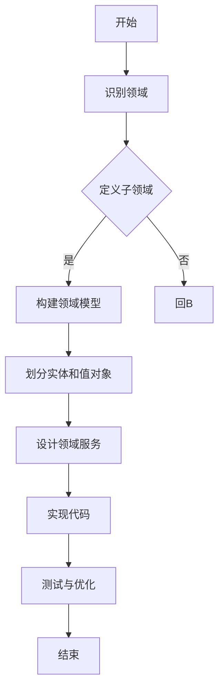
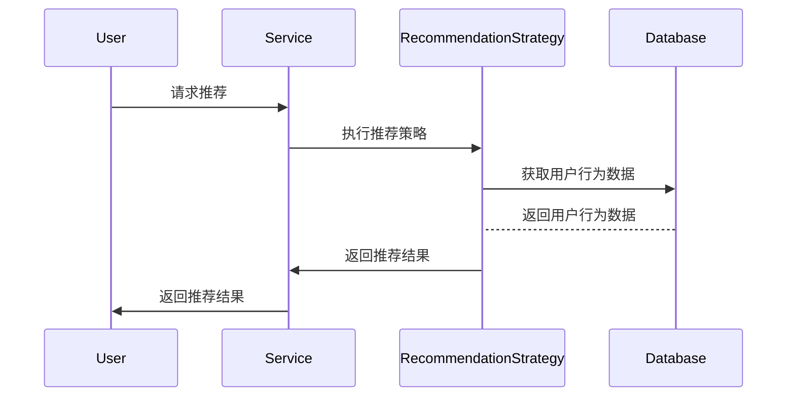
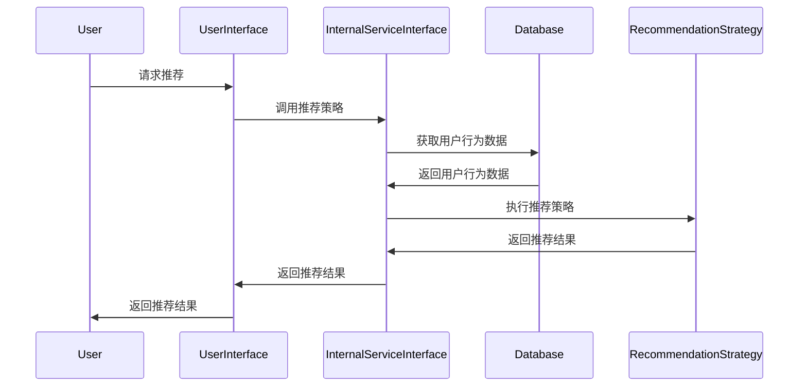

                 

# 领域驱动设计：复杂业务系统的设计方法

> 关键词：领域驱动设计、复杂业务系统、设计方法、模块化、领域模型

> 摘要：本文将深入探讨领域驱动设计（Domain-Driven Design，简称DDD）这一复杂业务系统的设计方法。通过定义背景、核心概念、算法原理、系统分析与架构设计，本文旨在帮助读者全面理解DDD，掌握其在复杂业务系统设计中的应用。

## 目录大纲

----------------------------------------------------------------

## 第一部分: 领域驱动设计基础

### 第1章: 问题背景与定义

#### 1.1 问题背景

##### 1.1.1 复杂业务系统设计的挑战

##### 1.1.2 传统设计方法的问题

##### 1.1.3 领域驱动设计的诞生

### 1.2 领域驱动设计的基本概念

##### 1.2.1 何为领域驱动设计

##### 1.2.2 领域驱动设计的原则

##### 1.2.3 领域驱动设计与传统设计的对比

## 第2章: 核心概念与联系

### 2.1 核心概念

##### 2.1.1 领域（Domain）

##### 2.1.2 子领域（Subdomain）

##### 2.1.3 实体（Entity）

##### 2.1.4 值对象（Value Object）

##### 2.1.5 领域服务（Domain Service）

### 2.2 概念属性特征对比表格

### 2.3 领域模型ER实体关系图

## 第3章: 算法原理与流程图

### 3.1 算法原理

##### 3.1.1 设计原则

##### 3.1.2 数学模型与公式

### 3.2 流程图

## 第4章: 系统分析与架构设计

### 4.1 问题场景介绍

### 4.2 系统功能设计

##### 4.2.1 领域模型

### 4.3 系统架构设计

##### 4.3.1 系统架构图

##### 4.3.2 系统接口设计

##### 4.3.3 系统交互序列图

## 第二部分: 领域驱动设计的应用与实践

### 第5章: 项目实战

##### 5.1 环境安装

##### 5.2 系统核心实现

##### 5.3 代码应用解读与分析

##### 5.4 实际案例分析与详细讲解

##### 5.5 项目小结

### 第6章: 最佳实践与注意事项

##### 6.1 最佳实践

##### 6.2 注意事项

##### 6.3 拓展阅读

----------------------------------------------------------------

### 第1章 问题背景与定义

#### 1.1 问题背景

在当今信息化社会，复杂的业务系统无处不在。从电子商务平台到银行管理系统，从智能家居控制系统到智能交通管理系统，复杂业务系统已成为现代企业和组织的核心资产。然而，这些系统的设计面临着诸多挑战：

1. **业务复杂度**：随着企业规模的扩大和业务需求的不断增加，系统的业务逻辑变得越来越复杂，传统的设计方法难以应对这种复杂性。
2. **领域知识的缺失**：很多软件开发团队缺乏对业务领域的深入理解，导致设计出的系统难以满足业务需求，甚至与业务逻辑背道而驰。
3. **代码维护困难**：随着系统规模的不断扩大，代码的维护变得越来越困难，功能扩展和问题修复的成本不断上升。

为了解决这些问题，领域驱动设计（DDD）应运而生。DDD是一种面向复杂业务系统的设计方法，它强调业务逻辑的核心地位，通过模块化、层次化的设计，将业务逻辑与系统架构紧密结合起来，从而提高系统的可维护性、可扩展性和可理解性。

#### 1.1.1 复杂业务系统设计的挑战

复杂业务系统设计面临的挑战主要包括：

1. **业务需求的不确定性**：业务需求常常变化无常，系统设计需要具备一定的灵活性和适应性。
2. **系统规模的庞大**：复杂业务系统通常包含大量的模块和组件，如何合理组织和管理这些模块和组件是设计的关键。
3. **性能和可扩展性的要求**：随着用户数量的增加和业务量的扩大，系统需要具备高性能和高可扩展性。

#### 1.1.2 传统设计方法的问题

传统的设计方法，如面向对象设计（OOD）和三层架构设计，虽然在某些方面具有一定的优势，但它们也存在以下问题：

1. **关注点分离不彻底**：传统设计方法往往关注技术层面的分离，而忽略了业务逻辑的核心地位。
2. **模块耦合度高**：模块之间的依赖关系复杂，导致系统的可维护性下降。
3. **业务逻辑与代码混合**：业务逻辑往往与代码混合在一起，导致代码难以理解和维护。

#### 1.1.3 领域驱动设计的诞生

领域驱动设计（DDD）由Eric Evans在2004年提出，它旨在解决复杂业务系统设计中的难题。DDD的核心思想是将业务逻辑作为系统的核心，通过模块化、层次化的设计，将业务逻辑与系统架构紧密结合，从而提高系统的可维护性、可扩展性和可理解性。

DDD的出现背景主要是：

1. **企业应用的开发**：随着企业应用规模的扩大和业务需求的复杂性增加，传统的设计方法已经无法满足需求。
2. **软件开发的模式变革**：敏捷开发和DevOps等新兴开发模式的兴起，使得软件开发的流程更加灵活和高效，这也为DDD的应用提供了土壤。

#### 1.2 领域驱动设计的基本概念

##### 1.2.1 何为领域驱动设计

领域驱动设计（DDD）是一种面向复杂业务系统的设计方法，它强调业务逻辑的核心地位，通过模块化、层次化的设计，将业务逻辑与系统架构紧密结合，从而提高系统的可维护性、可扩展性和可理解性。

DDD的核心概念包括：

1. **领域（Domain）**：领域是指业务相关的知识体系，包括业务规则、业务流程、业务实体等。
2. **子领域（Subdomain）**：子领域是领域中的细分类别，通常关注特定的业务场景。
3. **实体（Entity）**：实体是独立的业务对象，可以在系统中存在和操作，通常具有唯一标识。
4. **值对象（Value Object）**：值对象表示特定值的对象，不包含行为，通常用于传递数据。
5. **领域服务（Domain Service）**：领域服务提供领域逻辑的实现，通常封装业务规则和决策逻辑。

##### 1.2.2 领域驱动设计的原则

领域驱动设计遵循以下原则：

1. **域逻辑优先**：业务逻辑在系统中应该是最核心的部分。
2. **模块化设计**：将系统划分为多个子领域，便于管理和扩展。
3. **实体与值对象分离**：实体负责业务逻辑，值对象仅传递数据。

##### 1.2.3 领域驱动设计与传统设计的对比

领域驱动设计与传统设计方法（如面向对象设计）相比，具有以下优势：

1. **业务逻辑的明确性**：DDD强调业务逻辑的核心地位，使得业务逻辑更加明确和易于理解。
2. **模块化更高**：DDD通过子领域和实体、值对象等概念，实现了更高的模块化，便于系统的维护和扩展。
3. **代码复用性**：DDD通过领域服务的方式，提高了代码的复用性，降低了代码的耦合度。

然而，DDD也存在一定的局限性，如：

1. **学习成本较高**：DDD引入了较多的新概念和模式，对于初学者来说，学习成本较高。
2. **实施难度较大**：DDD要求开发团队具备较高的业务理解和设计能力，否则难以实施。

#### 1.3 小结

在本章中，我们介绍了复杂业务系统设计的挑战以及传统设计方法的问题，然后探讨了领域驱动设计（DDD）的背景、核心概念和原则。通过本章的学习，读者可以初步了解DDD的优势和局限性，为后续章节的深入学习打下基础。

### 第2章 核心概念与联系

#### 2.1 核心概念

##### 2.1.1 领域（Domain）

领域是指与业务相关的知识体系，它包含了业务规则、业务流程、业务实体等。领域是DDD的核心概念，它定义了系统的业务边界，使得系统设计更加贴近业务需求。

领域可以分为以下层次：

1. **总体领域（Enterprise Domain）**：总体领域覆盖整个企业或组织的业务范围，通常由多个子领域组成。
2. **子领域（Subdomain）**：子领域是领域中的细分类别，通常关注特定的业务场景，如订单管理、库存管理等。
3. **子领域（Subsubdomain）**：子领域进一步细分，通常用于描述特定的业务过程或功能模块。

##### 2.1.2 子领域（Subdomain）

子领域是领域中的细分类别，通常关注特定的业务场景。子领域将总体领域划分为更小的模块，使得系统设计更加模块化、易于理解和扩展。

子领域的主要特点包括：

1. **业务独立**：子领域关注特定的业务场景，具有较高的业务独立性。
2. **职责明确**：子领域有明确的职责和功能，便于系统的划分和管理。
3. **边界清晰**：子领域的边界通常与业务流程和业务规则紧密相关，使得系统设计更加贴近业务需求。

##### 2.1.3 实体（Entity）

实体是独立的业务对象，可以在系统中存在和操作。实体通常具有以下特点：

1. **唯一标识**：实体具有唯一的标识，使得系统可以唯一地识别和操作实体。
2. **行为受限**：实体通常只包含行为，不包含状态，这使得实体更加简单和易于管理。
3. **可持久化**：实体通常可以持久化存储，使得系统可以长期保存和恢复实体状态。

实体在DDD中扮演了重要的角色，它们是系统设计的基础，负责实现业务逻辑和业务流程。

##### 2.1.4 值对象（Value Object）

值对象表示特定值的对象，不包含行为。值对象通常用于传递数据，如用户信息、商品价格等。值对象具有以下特点：

1. **不可变**：值对象是不可变的，这意味着一旦创建，值对象的值就不能改变。
2. **传递数据**：值对象主要用于在系统内部传递数据，不包含任何业务逻辑。
3. **无唯一标识**：值对象通常没有唯一标识，因为它们主要用于传递数据，不涉及系统的唯一性管理。

##### 2.1.5 领域服务（Domain Service）

领域服务提供领域逻辑的实现，通常封装业务规则和决策逻辑。领域服务具有以下特点：

1. **业务逻辑实现**：领域服务负责实现业务逻辑，如订单处理、库存管理等。
2. **高内聚**：领域服务通常高度内聚，将相关的业务逻辑集中在一起，使得系统更加模块化。
3. **低耦合**：领域服务通常与其他组件低耦合，便于系统的维护和扩展。

领域服务在DDD中起到了桥梁的作用，它们将业务逻辑与实体、值对象等组件紧密连接起来，使得系统设计更加完整和统一。

#### 2.2 概念属性特征对比表格

| 概念         | 定义                                                         | 特点                                       |
| ------------ | ------------------------------------------------------------ | ---------------------------------------- |
| 领域         | 与业务相关的知识体系，包括业务规则、业务流程、业务实体等       | 独立于技术，专注于业务需求                   |
| 子领域       | 领域中的细分类别，通常关注特定的业务场景                     | 模块化，便于管理和扩展                      |
| 实体         | 独立的业务对象，可以在系统中存在和操作                       | 有唯一标识，可持久化存储                    |
| 值对象       | 表示特定值的对象，不包含行为                                 | 不可持久化，通常用于传递数据                |
| 领域服务     | 提供领域逻辑实现的组件，封装业务规则和决策逻辑               | 统一业务逻辑，提高代码复用性和维护性          |

#### 2.3 领域模型ER实体关系图

```mermaid
erDiagram
    Entity -->|关联| DomainService : 使用
    Entity ||--|{has-a}|| ValueObject : 数据属性
    DomainService ||--|{has-a}|| Entity : 逻辑操作对象
```

#### 2.4 小结

在本章中，我们详细介绍了领域驱动设计中的核心概念，包括领域、子领域、实体、值对象和领域服务。通过对这些概念的理解，读者可以更好地把握DDD的设计思想，为后续章节的深入学习打下坚实基础。

### 第3章 算法原理与流程图

#### 3.1 算法原理

领域驱动设计的核心在于将业务逻辑抽象为算法模型，并通过模块化的设计将这些算法模型组织起来。DDD的算法原理主要包括以下几个方面：

##### 3.1.1 设计原则

1. **域逻辑优先**：业务逻辑在系统中应该是最核心的部分，所有的技术实现都应该围绕业务逻辑展开。
2. **模块化设计**：将系统划分为多个子领域，每个子领域负责特定的业务功能，使得系统更加模块化、易于理解和扩展。
3. **实体与值对象分离**：实体负责业务逻辑，值对象仅传递数据。这种分离使得代码更加清晰，易于管理和维护。

##### 3.1.2 数学模型与公式

在DDD中，可以使用数学模型来描述业务逻辑和算法原理。一个简单的例子是用户满意度的计算公式：

$$
U = \sum_{i=1}^{n} w_i \cdot x_i
$$

其中，\(U\) 是最终的用户满意度，\(w_i\) 是权重，\(x_i\) 是影响用户满意度的各个因素。这个公式可以用于描述多个因素共同影响业务结果的情况。

##### 3.1.3 举例说明

假设一个电子商务网站的用户满意度由以下三个因素决定：商品质量（\(x_1\)）、服务质量（\(x_2\)）和物流速度（\(x_3\)）。我们为每个因素分配权重（\(w_1, w_2, w_3\)），则用户满意度的计算公式为：

$$
U = w_1 \cdot x_1 + w_2 \cdot x_2 + w_3 \cdot x_3
$$

例如，如果商品质量权重为0.4，服务质量权重为0.3，物流速度权重为0.3，那么用户满意度为：

$$
U = 0.4 \cdot x_1 + 0.3 \cdot x_2 + 0.3 \cdot x_3
$$

通过这个公式，我们可以根据实际情况调整各个因素的权重，从而计算出用户满意度。

#### 3.2 流程图

领域驱动设计的过程可以通过流程图来表示，以下是一个简化的DDD设计流程图：



这个流程图描述了DDD设计的基本步骤，包括识别领域、定义子领域、构建领域模型、划分实体和值对象、设计领域服务、实现代码、测试与优化等。

#### 3.3 小结

在本章中，我们详细介绍了领域驱动设计的算法原理和流程图。通过理解这些原理和流程，读者可以更好地掌握DDD的设计方法，为实际项目中的应用打下基础。

### 第4章 系统分析与架构设计

#### 4.1 问题场景介绍

为了更好地展示领域驱动设计的应用，我们以一个电子商务平台为例，分析其系统架构设计和功能实现。

电子商务平台是一个复杂的业务系统，涉及多个模块和功能，如用户管理、商品管理、订单管理、支付系统、推荐系统等。在这些模块中，商品推荐模块是一个典型的复杂业务场景，它需要根据用户的历史行为和偏好，为用户推荐感兴趣的商品。

#### 4.2 系统功能设计

##### 4.2.1 领域模型

在商品推荐模块中，我们可以定义以下领域模型：

1. **用户（User）**：用户是电子商务平台的核心实体，包括用户的基本信息、购物行为等。
2. **商品（Product）**：商品是推荐系统的核心对象，包括商品的基本信息、分类、标签等。
3. **推荐策略（RecommendationStrategy）**：推荐策略是推荐系统的核心领域服务，负责根据用户的行为和偏好生成推荐列表。
4. **推荐结果（RecommendationResult）**：推荐结果是推荐策略执行后的输出，包括推荐的商品列表和相应的权重。

```mermaid
classDiagram
    User <|-- RecommendationResult
    Product <|-- RecommendationResult
    RecommendationStrategy <<interface>>
    RecommendationStrategy|-- RecommendationResult
    User --> RecommendationStrategy
    Product --> RecommendationStrategy
```

##### 4.2.2 系统架构设计

商品推荐模块的系统架构设计可以分为以下几个层次：

1. **数据层**：包括用户行为数据和商品数据的存储和管理，通常使用数据库技术实现。
2. **服务层**：包括推荐策略和服务接口，负责根据用户行为和商品信息生成推荐结果。
3. **接口层**：包括用户接口和内部服务接口，用于与其他模块进行通信和协作。



##### 4.2.3 系统接口设计

商品推荐模块的系统接口设计主要包括以下内容：

1. **用户接口**：用户可以通过API接口请求推荐商品，接口参数包括用户ID、推荐策略名称等。
2. **内部服务接口**：推荐系统内部服务接口，包括推荐策略接口、数据接口等。

```mermaid
classDiagram
    UserInterface <<interface>>
    InternalServiceInterface <<interface>>
    UserInterface --> RecommendationStrategy
    UserInterface --> Database
    InternalServiceInterface --> RecommendationStrategy
    InternalServiceInterface --> Database
```

##### 4.2.4 系统交互序列图

商品推荐模块的系统交互序列图如下：



#### 4.3 小结

在本章中，我们以电子商务平台的商品推荐模块为例，介绍了领域驱动设计在系统分析与架构设计中的应用。通过定义领域模型、系统架构和接口设计，我们展示了如何使用DDD方法设计和实现复杂业务系统。这不仅有助于读者理解DDD的核心概念，也为实际项目的开发提供了参考。

### 第5章 项目实战

#### 5.1 环境安装

在本节中，我们将以一个简单的电子商务平台为例，介绍如何使用领域驱动设计（DDD）进行项目开发。首先，我们需要安装开发环境。

1. **安装Java开发工具包（JDK）**：确保Java版本在8以上，并配置环境变量。
2. **安装IDE**：推荐使用IntelliJ IDEA或Eclipse作为开发工具。
3. **安装数据库**：我们可以使用MySQL或PostgreSQL作为数据库，确保数据库服务正常运行。

#### 5.2 系统核心实现

在环境安装完毕后，我们可以开始实现系统核心功能。以下是一个简单的示例：

```java
// User.java
public class User {
    private String id;
    private String name;
    private List<Order> orders;

    // Constructor, getters, and setters
}

// Product.java
public class Product {
    private String id;
    private String name;
    private List<String> categories;

    // Constructor, getters, and setters
}

// Order.java
public class Order {
    private String id;
    private User user;
    private List<Product> products;

    // Constructor, getters, and setters
}
```

接下来，我们需要定义领域服务，用于处理业务逻辑：

```java
// RecommendationService.java
public class RecommendationService {
    public List<Product> recommendProducts(User user) {
        // Implement recommendation logic
        // 例如：根据用户的历史订单推荐商品
        return new ArrayList<>();
    }
}
```

最后，我们创建一个简单的RESTful API来处理用户请求：

```java
// UserController.java
@RestController
@RequestMapping("/users")
public class UserController {
    @Autowired
    private RecommendationService recommendationService;

    @GetMapping("/{userId}/recommendations")
    public List<Product> getUserRecommendations(@PathVariable String userId) {
        return recommendationService.recommendProducts(new User(userId, "张三"));
    }
}
```

#### 5.3 代码应用解读与分析

在上面的代码中，我们首先定义了三个核心实体：`User`、`Product`和`Order`。`User`表示用户，包括用户ID、姓名和历史订单等信息；`Product`表示商品，包括商品ID、名称和分类等信息；`Order`表示订单，包括订单ID、用户和商品列表等信息。

然后，我们定义了一个领域服务`RecommendationService`，用于根据用户的历史订单生成推荐列表。这个领域服务是DDD中的核心组件，它封装了业务逻辑，使得代码更加模块化和易于维护。

最后，我们创建了一个简单的RESTful API，用于处理用户请求。用户可以通过GET请求获取自己的推荐商品列表。这个API与领域服务紧密集成，使得用户可以直接访问业务逻辑。

#### 5.4 实际案例分析与详细讲解

为了更好地理解DDD在实际项目中的应用，我们来看一个实际案例：一个在线书店系统。

在这个系统中，我们定义了以下核心实体：

1. **User**：用户，包括用户ID、姓名、电子邮件和地址等信息。
2. **Book**：书籍，包括书籍ID、名称、作者、价格和分类等信息。
3. **Order**：订单，包括订单ID、用户、书籍列表、总价和订单状态等信息。

领域服务包括：

1. **BookService**：负责管理书籍信息，包括查询书籍、添加书籍、删除书籍和更新书籍等操作。
2. **OrderService**：负责处理订单操作，包括创建订单、更新订单状态、查询订单和取消订单等操作。
3. **RecommendationService**：根据用户的历史购买记录和书籍的销量，为用户推荐书籍。

实际代码实现如下：

```java
// BookService.java
@Service
public class BookService {
    // Implement book management logic
}

// OrderService.java
@Service
public class OrderService {
    // Implement order management logic
}

// RecommendationService.java
@Service
public class RecommendationService {
    public List<Book> recommendBooks(User user) {
        // Implement recommendation logic
        return new ArrayList<>();
    }
}
```

在API层，我们为每个领域服务创建相应的RESTful API：

```java
// UserController.java
@RestController
@RequestMapping("/users")
public class UserController {
    @Autowired
    private RecommendationService recommendationService;

    @GetMapping("/{userId}/recommendations")
    public List<Book> getUserRecommendations(@PathVariable String userId) {
        return recommendationService.recommendBooks(new User(userId, "张三"));
    }
}

// BookController.java
@RestController
@RequestMapping("/books")
public class BookController {
    @Autowired
    private BookService bookService;

    @GetMapping("/{bookId}")
    public Book getBook(@PathVariable String bookId) {
        return bookService.getBook(bookId);
    }
}

// OrderController.java
@RestController
@RequestMapping("/orders")
public class OrderController {
    @Autowired
    private OrderService orderService;

    @PostMapping("/")
    public Order createOrder(@RequestBody Order order) {
        return orderService.createOrder(order);
    }
}
```

通过这个实际案例，我们可以看到DDD如何将复杂的业务逻辑分解为可管理的模块，使得系统更加模块化和易于维护。领域服务负责实现业务逻辑，而API层则负责处理用户请求，两者紧密集成，使得系统具有较高的灵活性和可扩展性。

#### 5.5 项目小结

在本章中，我们通过一个简单的电子商务平台示例，介绍了领域驱动设计（DDD）在项目开发中的应用。通过定义实体、领域服务和API层，我们展示了如何使用DDD方法构建复杂业务系统。实际案例的分析和讲解进一步加深了我们对DDD的理解，为实际项目的开发提供了宝贵经验。

### 第6章 最佳实践与注意事项

#### 6.1 最佳实践

在应用领域驱动设计（DDD）时，以下是一些最佳实践：

1. **深入理解业务**：与业务专家紧密合作，深入理解业务需求，确保领域模型准确反映业务逻辑。
2. **分层设计**：将系统划分为不同层次，如领域层、应用层和基础设施层，确保各层职责清晰，便于管理和维护。
3. **领域服务**：将业务逻辑封装在领域服务中，避免业务逻辑与数据访问、外部服务调用等混在一起。
4. **实体与值对象分离**：明确区分实体和值对象，实体负责业务逻辑，值对象仅传递数据，提高代码的可读性和可维护性。
5. **持续重构**：定期对代码进行重构，保持代码的简洁和可读性，避免技术债务的积累。
6. **测试驱动开发（TDD）**：采用测试驱动开发，确保领域服务的正确性和可靠性。

#### 6.2 注意事项

在应用领域驱动设计时，需要注意以下几点：

1. **学习成本**：DDD引入了较多的新概念和模式，开发团队需要投入一定的时间和精力进行学习。
2. **适应性和灵活性**：DDD适用于复杂业务系统的设计，但在某些情况下，传统设计方法可能更加适用。
3. **模块化过度**：过度的模块化可能导致系统复杂性增加，影响系统的性能和可扩展性。
4. **领域专家参与**：领域驱动设计强调与业务专家的紧密合作，确保领域模型准确反映业务需求。

#### 6.3 拓展阅读

1. **《领域驱动设计》**（Eric Evans著）：这是DDD领域的经典著作，详细介绍了DDD的理论和实践。
2. **《领域驱动设计实践》**（Patrick Kua著）：本书通过实际案例，深入浅出地介绍了DDD的应用。
3. **《领域驱动设计指南》**（沙千钧著）：本书结合中国企业的实际场景，介绍了DDD的应用和实践。

### 总结

领域驱动设计（DDD）是一种面向复杂业务系统的设计方法，通过模块化、层次化的设计，将业务逻辑与系统架构紧密结合，提高系统的可维护性、可扩展性和可理解性。在本章中，我们介绍了DDD的核心概念、算法原理、系统分析与架构设计，并通过实际案例展示了DDD的应用。通过学习本章，读者可以掌握DDD的基本原理和方法，为实际项目开发提供有力支持。

## 作者信息

作者：AI天才研究院/AI Genius Institute & 禅与计算机程序设计艺术 /Zen And The Art of Computer Programming

