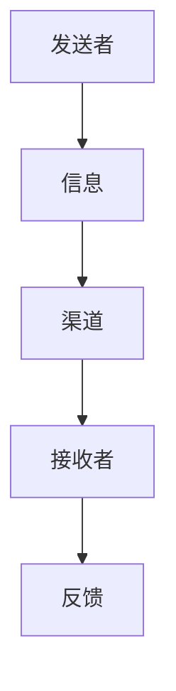

                 

## 领导力的发展：沟通、决策和团队建设

### 关键词

- 领导力
- 沟通技巧
- 决策能力
- 团队建设
- 个人成长
- 组织文化

### 摘要

本文旨在探讨领导力的发展，重点分析沟通、决策和团队建设这三个关键方面。我们将从理论到实践，逐步深入探讨这些主题，为领导者提供具有实际操作性的指导和建议。文章结构如下：

1. 引言
2. 沟通技巧
3. 决策能力
4. 团队建设
5. 领导者个人成长
6. 领导力与组织文化
7. 领导力案例分析
8. 总结与展望

通过这篇文章，读者将了解领导力的发展不仅涉及个人能力，还包括团队协作和组织文化等多个层面。

## 引言

### 1.1 领导力的定义与重要性

领导力是一种特殊的能力，它涉及激发、引导和影响他人的过程，以实现共同的目标。领导力不仅存在于企业高管或政治领袖中，也存在于日常生活中的各个层面。一个优秀的领导者需要具备多种能力，包括沟通技巧、决策能力和团队建设能力等。

领导力的重要性在于，它能够推动组织的发展，提高团队的工作效率和创新能力。在当今快速变化的世界中，领导力已经成为一种核心竞争力。有效的领导力可以促进团队合作，提高员工的满意度，从而提升组织的整体绩效。

### 1.2 本书目标与结构

本书的目标是帮助读者了解和提升领导力，具体包括：

- 分析沟通技巧、决策能力和团队建设的关键要素。
- 提供实用的策略和技巧，帮助领导者更有效地沟通和决策。
- 探讨团队建设的方法和策略，以打造高绩效团队。
- 分析领导力与个人成长、组织文化的关系。

本书的结构分为以下几个部分：

- 引言：介绍领导力的定义和重要性。
- 沟通技巧：分析有效沟通的概念、策略和障碍。
- 决策能力：探讨决策的概念、类型和过程。
- 团队建设：讨论团队建设的重要性、策略和冲突管理。
- 领导者个人成长：分析自我认知、压力管理和个人发展。
- 领导力与组织文化：探讨组织文化对领导力的影响。
- 领导力案例分析：通过具体案例展示领导力的实际应用。
- 总结与展望：回顾文章要点，展望领导力的发展趋势。

通过阅读本书，读者将能够全面了解领导力的发展，并在实际工作中运用所学知识，提升个人领导能力。

### 2.1 沟通技巧

#### 2.1.1 沟通的定义

沟通是人与人之间交换信息、观点和情感的过程。有效的沟通不仅包括信息的传递，还涉及理解、共鸣和反馈。在领导力中，沟通是至关重要的，它决定了领导者与团队成员之间的互动质量。

沟通可以分为以下几种类型：

- **口头沟通**：通过语言、声音和语调进行信息传递，是领导中最常用的沟通方式。
- **书面沟通**：通过文字、图表和符号进行信息传递，如电子邮件、报告和文档。
- **非语言沟通**：通过身体语言、面部表情、姿势和眼神等非言语方式传递信息。

#### 2.1.2 沟通的模型

沟通模型包括发送者、信息、渠道、接收者和反馈五个基本要素。以下是一个简单的沟通模型：

在沟通模型中，发送者需要明确自己的信息意图，通过渠道传递信息给接收者，接收者接收并理解信息，最后提供反馈。有效的沟通要求每个要素都能顺利运行，减少误解和信息损失。

### 2.2 有效沟通的策略

#### 2.2.1 听众分析

有效沟通的第一步是了解听众。领导者需要分析听众的特点，包括他们的背景、知识水平、兴趣和需求。通过听众分析，领导者可以更好地定制沟通内容，使其更具有针对性和吸引力。

#### 2.2.2 非语言沟通

非语言沟通在领导力中起着关键作用。领导者需要注意自己的身体语言，如姿势、面部表情和眼神交流，这些都能传递重要的信息。例如，开放的姿势和微笑可以传达友好和信任，而紧绷的姿势和眼神回避可能引起对方的抵触。

#### 2.2.3 问题解决沟通

问题解决沟通是领导者在处理冲突和挑战时的重要工具。领导者需要掌握倾听技巧，鼓励团队成员表达观点，共同寻找解决问题的方案。以下是一些问题解决沟通的策略：

1. **积极倾听**：领导者需要全神贯注地倾听团队成员的观点，避免打断或打断对方的发言。
2. **明确问题**：领导者需要清晰地定义问题，以确保团队成员理解问题的核心。
3. **寻求共识**：领导者需要通过讨论和协商，找到团队成员都认同的解决方案。
4. **提供反馈**：领导者需要给予团队成员及时的反馈，以确保他们理解并接受解决方案。

### 2.3 沟通障碍与解决方法

#### 2.3.1 沟通障碍的类型

沟通障碍可能来自多个方面，包括：

1. **语言障碍**：由于语言差异或沟通方式不当导致的误解。
2. **文化障碍**：由于文化背景、价值观和信仰的不同导致的沟通障碍。
3. **心理障碍**：由于个人情感、偏见和成见导致的沟通困难。
4. **环境障碍**：由于噪音、干扰和物理距离等环境因素导致的沟通障碍。

#### 2.3.2 克服沟通障碍的策略

为了克服沟通障碍，领导者可以采取以下策略：

1. **使用清晰的语言**：领导者应使用简单、明确的语言，避免使用过于专业或复杂的术语。
2. **积极倾听**：领导者需要积极倾听团队成员的观点，确保理解对方的信息。
3. **文化敏感度**：领导者需要了解不同文化背景的沟通习惯和价值观，以避免文化冲突。
4. **建立信任**：领导者需要通过透明和开放的沟通建立信任，减少心理障碍。
5. **改善沟通环境**：领导者可以改善沟通环境，减少噪音和干扰，提高沟通效率。

通过上述策略，领导者可以有效地克服沟通障碍，提升团队协作和领导力。

### 2.4 高效沟通案例分析

#### 案例背景

某公司是一家高速发展的科技公司，由于业务扩张迅速，团队之间的沟通出现了一些问题。项目经理发现，由于团队成员来自不同部门和文化背景，沟通出现了误解和冲突，导致项目进度受到影响。

#### 案例分析

1. **听众分析**：项目经理首先分析了团队成员的特点，发现他们具有不同的文化背景和工作习惯。项目经理意识到需要根据团队成员的差异调整沟通策略。

2. **非语言沟通**：项目经理在会议中注意到了团队成员的身体语言和表情，发现一些人显得不自信或紧张。项目经理通过微笑和积极的肢体语言来缓解紧张氛围。

3. **问题解决沟通**：项目经理在团队会议中采用问题解决沟通的策略，鼓励团队成员表达观点，共同讨论项目问题和解决方案。项目经理积极倾听，确保每个人都感到被尊重和理解。

4. **克服沟通障碍**：项目经理通过使用简单、清晰的语言，减少专业术语的使用，确保信息传达的准确性。同时，项目经理提高了会议环境的舒适度，减少了噪音和干扰。

#### 案例结果

经过一系列的沟通策略调整，团队之间的沟通变得更加顺畅，项目进度逐步恢复正常。团队成员之间的合作变得更加紧密，项目的质量和效率得到了显著提升。

#### 案例总结

这个案例展示了高效沟通的重要性。通过了解团队成员的特点，调整沟通策略，克服沟通障碍，项目经理成功地提升了团队协作和项目效率。

### 2.5 沟通技巧提升方法

#### 2.5.1 倾听技巧

倾听是有效沟通的关键。以下是一些提升倾听技巧的方法：

1. **全神贯注**：在对方讲话时，保持专注，避免分心。
2. **不打断**：让对方完整地表达观点，避免中途打断。
3. **肢体语言**：通过点头、微笑等肢体语言表明自己在倾听。

#### 2.5.2 表达技巧

有效的表达能够增强沟通效果。以下是一些提升表达技巧的方法：

1. **简洁明了**：使用简单、清晰的语言传达信息。
2. **关注听众**：根据听众的特点调整表达方式和内容。
3. **使用例子**：通过具体例子来说明观点，使信息更易于理解。

#### 2.5.3 反馈技巧

及时、有效的反馈有助于确认信息传达和理解。以下是一些提升反馈技巧的方法：

1. **具体反馈**：提供具体的反馈，避免模糊或泛泛的评价。
2. **积极反馈**：给予正面的反馈，鼓励团队成员。
3. **建设性反馈**：提供建设性的反馈，帮助团队成员改进。

通过上述方法，领导者可以提升沟通技巧，建立高效的沟通渠道，从而提高团队协作和领导力。

### 2.6 沟通技巧的实际应用

#### 2.6.1 项目协调

在项目管理中，沟通技巧至关重要。项目经理需要与团队成员、客户和供应商保持密切沟通，以确保项目顺利进行。以下是一些实际应用案例：

1. **项目启动会议**：在项目启动时，项目经理需要与团队成员进行详细沟通，明确项目目标、任务和责任。
2. **进度报告**：项目经理需要定期与团队成员和客户进行沟通，汇报项目进度和成果。
3. **问题解决**：当项目遇到问题时，项目经理需要与团队成员和客户一起讨论解决方案。

#### 2.6.2 团队协作

在团队协作中，沟通技巧有助于建立合作关系，提高团队效率。以下是一些实际应用案例：

1. **团队会议**：定期举行团队会议，讨论项目进展、问题和改进措施。
2. **角色分配**：在团队中明确每个成员的角色和责任，确保任务分配合理。
3. **反馈机制**：建立反馈机制，鼓励团队成员分享意见和建议。

#### 2.6.3 紧急情况应对

在紧急情况下，有效的沟通能够迅速解决问题，减少损失。以下是一些实际应用案例：

1. **危机沟通**：在发生危机时，领导者需要迅速与团队成员和相关部门进行沟通，制定应对策略。
2. **信息传递**：在紧急情况下，确保信息准确、迅速地传递给相关人员。
3. **心理支持**：在紧急情况下，领导者需要给予团队成员心理支持，缓解压力和焦虑。

通过以上实际应用，领导者可以更好地利用沟通技巧，提升团队协作和项目效率。

### 2.7 沟通技巧总结

有效的沟通是领导者成功的关键之一。通过倾听技巧、表达技巧和反馈技巧，领导者可以建立高效的沟通渠道，提升团队协作和项目效率。在实际应用中，沟通技巧在项目协调、团队协作和紧急情况应对等方面发挥着重要作用。领导者应不断学习和实践沟通技巧，以应对各种挑战和机遇。

### 3.1 决策能力

#### 3.1.1 决策的定义

决策是领导者的一项核心能力，它涉及在多种可能性中选择最佳行动方案的过程。决策不仅仅是一个选择的过程，还包括对问题进行识别、信息收集、方案评估和选择执行等步骤。在领导力中，决策能力是衡量领导者是否能够有效地应对挑战和机遇的重要标准。

#### 3.1.2 决策的类型

决策可以分为以下几种类型：

1. **程序化决策**：针对重复性或常规性问题的决策，通常有明确的流程和规则。这类决策通常比较简单，可以通过标准化的程序来解决。

2. **非程序化决策**：针对不重复或非常规性问题的决策，需要领导者运用创造性思维和经验来解决。这类决策通常更复杂，涉及到多个不确定因素。

3. **战略性决策**：涉及组织长期目标和资源分配的决策。这类决策通常由高层领导者负责，需要考虑组织的整体发展和市场环境。

4. **运营性决策**：涉及组织日常运营和具体任务的决策。这类决策通常由中层和基层领导者负责，直接影响组织的效率和生产力。

### 3.2 决策过程

决策过程通常包括以下阶段：

1. **问题识别**：识别需要解决的挑战或机会。
2. **信息收集**：收集与问题相关的数据和信息。
3. **方案生成**：提出可能的解决方案。
4. **方案评估**：评估每个方案的优缺点。
5. **方案选择**：选择最佳方案。
6. **方案执行**：执行决策并监控结果。
7. **反馈与调整**：根据执行结果进行反馈和调整。

### 3.3 决策风格与影响

领导者的决策风格直接影响决策过程和结果。常见的决策风格包括：

1. **独裁式决策**：领导者独自做出决策，不征求团队成员的意见。这种风格可以快速决策，但可能导致团队成员缺乏参与感和认同感。

2. **民主式决策**：领导者征求团队成员的意见，通过讨论和协商做出决策。这种风格可以增强团队的凝聚力和参与感，但可能决策过程较慢。

3. **协商式决策**：领导者与关键利益相关者进行协商，共同做出决策。这种风格可以确保决策的广泛接受，但可能需要更多的时间和资源。

不同决策风格的影响如下：

- **独裁式决策**：高效但可能导致团队成员不满。
- **民主式决策**：增强团队凝聚力但可能效率较低。
- **协商式决策**：确保广泛接受但可能耗时较长。

### 3.4 决策方法

为了提高决策能力，领导者可以采用以下几种决策方法：

1. **经验决策法**：基于领导者以往的经验和直觉做出决策。这种方法快速但可能不够科学。

2. **科学决策法**：通过数据分析和模型预测做出决策。这种方法更科学但可能需要更多时间和资源。

3. **混合决策法**：结合经验和科学方法，根据不同情况灵活选择决策方法。这种方法可以在效率和准确性之间取得平衡。

### 3.5 决策案例分析

#### 案例背景

某公司在产品开发过程中面临一个关键决策：是继续投入资源优化现有产品，还是转向开发全新产品。公司高层在决策时面临重大挑战。

#### 案例分析

1. **问题识别**：公司需要解决的问题是产品发展的方向和资源分配。

2. **信息收集**：公司收集了市场数据、客户反馈和竞争对手分析等关键信息。

3. **方案生成**：提出了两个方案：一是优化现有产品，二是开发全新产品。

4. **方案评估**：评估了每个方案的潜在收益和风险，通过数据分析进行了详细比较。

5. **方案选择**：最终选择了开发全新产品的方案，因为它能够更好地满足市场趋势和客户需求。

6. **方案执行**：公司启动了新产品的开发项目，并制定了详细的执行计划。

7. **反馈与调整**：在项目执行过程中，公司定期收集市场反馈和内部评估结果，对项目进行了必要的调整。

#### 案例结果

通过科学决策法和混合决策法的结合，公司成功开发了新产品，并在市场上取得了良好反响，为公司带来了显著增长。

#### 案例总结

这个案例展示了科学决策和经验决策在实际应用中的重要性。通过系统化的决策过程和方法，领导者可以做出更为明智的决策，推动组织的持续发展。

### 3.6 提升决策能力的方法

#### 3.6.1 增强数据分析能力

数据分析是科学决策的基础。领导者需要掌握基本的数据分析方法和工具，如统计分析和数据可视化，以便更好地理解数据和做出决策。

#### 3.6.2 提高情境分析能力

领导者需要具备在复杂环境中分析和预测能力。通过情景分析和模拟，领导者可以更好地预见潜在的问题和机会，从而做出更为合理的决策。

#### 3.6.3 增强风险管理能力

决策往往伴随着风险。领导者需要评估每个决策的风险和潜在影响，并制定相应的风险应对策略，以减少决策的不确定性。

#### 3.6.4 提高决策速度与准确性

领导者需要在确保准确性的前提下提高决策速度。通过优化决策流程和工具，领导者可以更快速地做出决策，并在实际操作中不断调整和优化。

### 3.7 决策能力在领导力中的作用

决策能力是领导者的重要素质，它直接影响组织的绩效和发展。通过提升决策能力，领导者可以更好地应对挑战和机遇，推动组织实现目标。有效的决策能力需要结合经验、数据和情境分析，确保决策的科学性和准确性。

### 3.8 决策能力的实际应用场景

#### 3.8.1 项目管理

在项目管理中，决策能力至关重要。项目经理需要做出关于项目目标、任务分配、资源调度和风险管理等方面的决策。通过科学决策方法和有效的沟通，项目经理可以确保项目顺利推进。

#### 3.8.2 业务战略

在业务战略制定过程中，领导者需要做出关于市场定位、产品研发、市场拓展等方面的决策。通过综合分析市场和内部资源，领导者可以制定出符合组织长远发展的战略规划。

#### 3.8.3 紧急应对

在紧急情况下，领导者需要迅速做出决策，以应对突发事件。通过快速分析情况和制定应对策略，领导者可以确保组织的稳定运营和员工的安全。

#### 3.8.4 人才管理

在人才管理中，领导者需要做出关于招聘、晋升、培训和发展等方面的决策。通过科学评估员工能力和潜力，领导者可以打造一支高效的团队。

通过以上实际应用场景，领导者可以充分发挥决策能力，推动组织持续发展和成功。

### 3.9 决策能力案例分析

#### 案例背景

某科技公司面临一个关键决策：是否在新兴市场上投入大量资金进行市场扩展。公司高层在决策时需要综合考虑市场潜力、竞争态势和内部资源等多方面因素。

#### 案例分析

1. **问题识别**：公司需要决定是否进入新兴市场，以扩大业务规模和市场份额。

2. **信息收集**：公司进行了市场调研，收集了关于新兴市场的消费需求、竞争对手和市场规模等关键信息。

3. **方案生成**：提出了两个方案：一是进入新兴市场，二是继续专注于现有市场。

4. **方案评估**：通过数据分析，评估了每个方案的潜在收益和风险。方案一在市场潜力大但竞争激烈，方案二在市场稳定但增长空间有限。

5. **方案选择**：最终选择了进入新兴市场的方案，因为市场潜力巨大且公司具备相应的技术优势。

6. **方案执行**：公司制定了详细的进入计划，包括市场调研、产品本地化和营销策略等。

7. **反馈与调整**：在执行过程中，公司根据市场反馈和内部评估结果进行了多次调整，确保决策的有效性。

#### 案例结果

通过科学的决策过程和方法，公司成功进入了新兴市场，业务规模和市场份额显著提升，实现了业务的持续增长。

#### 案例总结

这个案例展示了决策能力在关键决策中的重要作用。通过系统化的决策过程和方法，领导者可以做出更为明智的决策，推动组织的持续发展和成功。

### 3.10 提升决策能力的最佳实践

#### 3.10.1 建立决策支持体系

领导者可以建立决策支持体系，包括数据收集、分析和决策工具等，以提供决策过程中的数据支持和分析。

#### 3.10.2 强化团队合作

领导者应鼓励团队成员参与决策过程，通过团队合作提高决策的质量和执行效果。

#### 3.10.3 定期回顾和评估

领导者应定期回顾和评估决策结果，总结经验教训，为未来的决策提供参考。

#### 3.10.4 持续学习和改进

领导者应不断学习和更新决策理论和方法，提高自身的决策能力，以适应不断变化的环境和挑战。

通过上述最佳实践，领导者可以提升决策能力，更好地应对各种挑战和机遇。

### 3.11 决策能力总结

决策能力是领导者的一项核心能力，它关系到组织的生存和发展。通过科学决策方法和有效沟通，领导者可以做出更为明智和有效的决策。提升决策能力需要结合数据分析和团队合作，不断学习和改进。领导者应把握机遇，勇于面对挑战，以实现组织的长期发展目标。

### 4.1 团队的概念与类型

#### 4.1.1 团队的定义

团队是由一组相互依赖、共同追求特定目标的个体组成的群体。团队成员通过协作和合作，实现共同的目标和任务。团队强调个体之间的互动和相互依赖，而非简单的集体行动。

#### 4.1.2 团队的类型

团队可以分为以下几种类型：

1. **任务型团队**：为了完成特定任务或项目而组建的团队，通常在任务完成后解散。任务型团队强调任务优先，成员在任务期间集中精力完成任务。

2. **功能型团队**：基于职能或专业领域组建的团队，成员通常负责特定的职能或任务。功能型团队在组织内具有长期存在性，有助于组织内部的协调和专业化。

3. **跨职能团队**：由来自不同部门或专业的成员组成的团队，旨在解决跨领域的问题或项目。跨职能团队通过整合不同领域的知识和技能，实现更全面和创新的解决方案。

4. **虚拟团队**：利用信息技术和通信工具，在地理上分散的团队成员组成的团队。虚拟团队通过远程协作，克服了地理和时间的限制，提高了团队效率和灵活性。

5. **自我管理型团队**：具有高度自主性和责任心的团队，成员自行管理任务和目标，通常由团队成员共同做出决策。自我管理型团队强调自我驱动和团队合作，有助于提高团队效率和创新能力。

#### 4.1.3 团队建设的必要性

团队建设是提升团队效率和绩效的关键。有效的团队建设有助于以下方面：

- **提高沟通和协作能力**：通过团队建设活动，团队成员可以更好地了解彼此，建立信任和协作关系。
- **增强团队凝聚力**：团队建设有助于增强团队成员之间的情感联系，提高团队凝聚力。
- **提升团队士气**：通过团队建设活动，可以提高团队成员的士气和积极性，激发工作热情。
- **提高问题解决能力**：团队建设有助于培养团队成员的问题解决能力，提高团队应对挑战和困难的能力。

#### 4.1.4 团队建设的策略

团队建设需要综合考虑团队目标、成员特点和团队环境，制定合适的建设策略。以下是一些常用的团队建设策略：

- **目标设定**：明确团队的目标和期望成果，确保团队成员对目标有清晰的认识。
- **角色分配**：根据成员的技能和兴趣，合理分配角色和责任，确保每个成员都能发挥自己的优势。
- **沟通与协作**：建立有效的沟通机制，促进团队成员之间的信息交流和协作。
- **团队培训**：提供相关培训和辅导，提高团队成员的技能和知识水平。
- **激励与奖励**：通过激励和奖励机制，激发团队成员的工作热情和积极性。
- **冲突管理**：建立冲突管理机制，解决团队成员之间的分歧和冲突，维护团队和谐。
- **团队活动**：组织团队建设活动，如团建、拓展训练等，增强团队成员之间的互动和信任。

通过以上策略，领导者可以有效地进行团队建设，提升团队的整体绩效和竞争力。

### 4.2 团队建设的策略

#### 4.2.1 目标设定

目标设定是团队建设的第一步，它为团队提供了明确的指引和方向。有效的目标设定需要遵循SMART原则，即目标应具备具体性（Specific）、可衡量性（Measurable）、可实现性（Achievable）、相关性（Relevant）和时限性（Time-bound）。

- **具体性**：目标应明确具体，避免模糊不清。例如，"提高项目完成率"应改为"提高项目完成率达到90%"。
- **可衡量性**：目标应具备可衡量的标准，便于团队评估进展和成果。例如，"提高员工满意度"可以改为"员工满意度调查得分提高10%"。
- **可实现性**：目标应具备可实现性，确保团队有足够的资源和能力去实现。例如，"一年内销售额翻倍"可能过于理想。
- **相关性**：目标应与团队的整体目标和组织目标保持一致，确保方向一致。例如，团队的短期目标是提升产品销量，而组织的长期目标是实现市场份额增长。
- **时限性**：目标应设定明确的时限，有助于团队集中精力，按时完成任务。例如，"在明年第一季度完成新产品的研发"。

通过遵循SMART原则，团队可以设定清晰、具体且可实现的目标，为团队建设奠定基础。

#### 4.2.2 角色分配

角色分配是团队建设中至关重要的一环，它关系到团队整体效能的发挥。合理的角色分配需要考虑团队成员的技能、兴趣和职业发展需求。

- **技能匹配**：根据团队成员的技能和特长，分配相应的角色和任务。例如，技术较强的成员可以负责技术开发，市场敏感度高的成员可以负责市场分析。
- **兴趣驱动**：考虑团队成员的兴趣和爱好，让他们在感兴趣的领域发挥作用。兴趣驱动可以激发成员的工作热情和创造力。
- **职业发展**：为团队成员提供职业发展机会，根据其职业规划调整角色分配。例如，对于有管理意向的成员，可以赋予更多管理职责，提升其领导能力。

通过合理的角色分配，团队可以充分发挥每个成员的优势，提高整体效能。

#### 4.2.3 沟通与合作

沟通与合作是团队建设的关键要素，它决定了团队成员之间的协作效率和团队的整体绩效。有效的沟通与合作需要遵循以下原则：

- **透明沟通**：建立透明、开放的沟通渠道，确保团队成员能够及时、准确地了解团队目标和任务进展。
- **积极倾听**：团队成员应积极倾听他人的观点和建议，避免主观臆断和偏见。
- **分享信息**：鼓励团队成员分享信息和资源，促进知识共享和创新。
- **团队协作**：通过团队合作，共同解决问题和完成任务，提升团队整体绩效。

通过良好的沟通与合作，团队可以形成合力，实现共同目标。

#### 4.2.4 团队建设活动

团队建设活动是增强团队凝聚力和协作精神的有效途径。以下是一些常见的团队建设活动：

- **团建活动**：通过户外拓展、团队聚餐等活动，增强团队成员之间的情感联系，提升团队凝聚力。
- **培训与辅导**：组织专业技能培训和辅导，提升团队成员的技能和知识水平，促进团队成长。
- **项目合作**：通过跨部门或跨职能的项目合作，促进团队成员之间的互动和协作，提升团队整体效能。
- **竞赛活动**：组织团队竞赛活动，如篮球比赛、知识竞赛等，激发团队成员的竞争意识和团队精神。

通过多样化的团队建设活动，团队可以形成良好的合作氛围，提升整体绩效。

### 4.3 团队冲突与管理

#### 4.3.1 团队冲突的类型

团队冲突可以分为以下几种类型：

- **任务冲突**：由于团队成员在任务目标和任务执行方式上的分歧导致的冲突。
- **关系冲突**：由于团队成员之间的个人关系问题导致的冲突，如误解、信任问题等。
- **过程冲突**：由于团队成员在决策过程和执行过程中的分歧导致的冲突，如资源分配、进度安排等。
- **价值观冲突**：由于团队成员在价值观、信仰和文化背景上的差异导致的冲突。

#### 4.3.2 处理团队冲突的策略

处理团队冲突需要采取合理、有效的策略，以下是一些常用的策略：

- **倾听与理解**：领导者应积极倾听团队成员的观点，理解他们的立场和需求，避免主观臆断。
- **明确目标**：明确团队的目标和期望，确保团队成员在目标和任务上达成共识，减少冲突。
- **促进沟通**：建立良好的沟通渠道，鼓励团队成员表达意见，促进相互理解和协商。
- **协商与妥协**：在处理冲突时，领导者应引导团队成员通过协商和妥协解决问题，寻求双赢的解决方案。
- **冲突管理培训**：组织冲突管理培训，提升团队成员的冲突管理能力和沟通技巧。
- **角色调整**：在必要时，领导者可以通过调整团队成员的角色和任务，减少冲突和矛盾。

通过上述策略，领导者可以有效地处理团队冲突，维护团队的稳定和高效运作。

### 4.4 团队建设案例分析

#### 案例背景

某公司在一次重大项目中遇到了严重的团队冲突，导致项目进度滞后。团队成员在任务分配、进度安排和沟通方面存在严重分歧，影响了项目的整体绩效。

#### 案例分析

1. **冲突识别**：通过沟通和调查，识别了项目中的主要冲突类型，包括任务冲突和关系冲突。
2. **原因分析**：分析了冲突产生的原因，主要包括任务分配不均、沟通不畅和团队成员间的误解。
3. **解决方案**：
   - **明确目标**：重新明确了项目目标和任务，确保团队成员在目标和任务上达成共识。
   - **促进沟通**：建立了定期的项目会议和沟通机制，鼓励团队成员表达意见和解决问题。
   - **角色调整**：对团队成员的角色和任务进行了适当调整，以充分发挥每个人的优势。
   - **培训与辅导**：组织了冲突管理培训和沟通技巧培训，提升团队成员的冲突管理和沟通能力。
4. **实施与监控**：实施了上述解决方案，并通过定期监控和评估，确保措施的有效性和持续改进。

#### 案例结果

通过一系列的措施，团队冲突得到了有效缓解，项目进度逐步恢复正常。团队成员之间的协作和沟通明显改善，项目质量和效率得到了显著提升。

#### 案例总结

这个案例展示了团队建设的重要性。通过识别冲突、分析原因、采取合理措施和持续监控，领导者可以有效地处理团队冲突，提升团队绩效和项目成功率。

### 4.5 提高团队协作效率的方法

#### 4.5.1 利用项目管理工具

项目管理工具如Trello、Jira和Asana等，可以帮助团队更好地规划任务、分配资源和管理进度。通过这些工具，团队成员可以实时了解项目的进展和各自的职责，提高协作效率。

#### 4.5.2 制定清晰的规划和目标

明确的项目规划和目标是团队协作的基础。领导者应确保团队成员对项目的目标和任务有清晰的认识，制定详细的规划和时间表，以确保团队成员的协同工作。

#### 4.5.3 建立有效的沟通机制

建立畅通、高效的沟通机制，确保团队成员之间的信息及时、准确地传达。通过定期的团队会议、邮件和即时通讯工具，促进团队成员之间的交流和协作。

#### 4.5.4 鼓励知识共享和创新

鼓励团队成员分享知识和经验，促进团队内部的创新和协作。通过团队培训、内部研讨会和知识分享会等形式，提高团队成员的知识水平和协作能力。

#### 4.5.5 奖励和激励

通过奖励和激励措施，激发团队成员的积极性和创造力。领导者可以设立团队目标奖励、个人绩效奖励等，以激励团队成员为实现团队目标而努力。

通过以上方法，领导者可以有效地提高团队协作效率，推动团队取得更好的成果。

### 4.6 团队建设的总结

团队建设是提升团队绩效和协作效率的关键。通过明确目标、合理角色分配、有效沟通和冲突管理，领导者可以打造一个高效、和谐的工作环境。团队建设不仅有助于提升团队成员的技能和知识水平，还能增强团队的凝聚力和创新能力。领导者应持续关注团队建设，并根据团队的特点和需求，采取相应的策略和措施，以实现团队的长远发展。

### 4.7 团队建设在领导力中的作用

团队建设是领导力的重要组成部分，它不仅影响团队绩效，还直接关系到组织的整体发展。有效的团队建设能够提升团队成员的协作和创新能力，促进组织目标的实现。领导者通过团队建设，可以培养团队精神，提高团队执行力，为组织的持续成功奠定基础。此外，团队建设还帮助领导者更好地识别和管理团队冲突，提升团队的稳定性和凝聚力。总之，团队建设在领导力中起着至关重要的作用，是领导者不可或缺的核心能力。

### 4.8 团队建设的实际应用案例

#### 案例背景

某互联网公司在其新产品的开发过程中，由于团队成员来自不同的部门，沟通不畅、角色模糊和任务分配不均等问题导致项目进度严重滞后。为了解决这个问题，公司决定进行团队建设。

#### 案例分析

1. **问题识别**：通过沟通调查，识别了项目中的主要问题，包括沟通不畅、角色分配不均和任务冲突。

2. **原因分析**：分析了问题产生的原因，主要包括部门之间的壁垒、团队成员之间的误解和缺乏统一的规划和目标。

3. **解决方案**：
   - **目标设定**：重新明确了项目的目标和期望，确保团队成员对项目目标有清晰的认识。
   - **角色分配**：根据团队成员的技能和兴趣，进行了合理的角色分配，确保每个成员都能发挥自己的优势。
   - **沟通机制**：建立了定期的项目会议和沟通渠道，确保团队成员能够及时、准确地了解项目进展和各自的职责。
   - **培训与辅导**：组织了沟通技巧和团队协作培训，提升团队成员的沟通和协作能力。

4. **实施与监控**：实施了上述解决方案，并通过定期监控和评估，确保措施的有效性和持续改进。

#### 案例结果

通过一系列的团队建设措施，团队成员之间的沟通更加顺畅，角色分配更加合理，项目进度逐步恢复正常。团队成员的协作和创新能力得到显著提升，项目质量和效率得到了明显改善。

#### 案例总结

这个案例展示了团队建设在解决项目瓶颈和提升团队绩效方面的实际效果。通过明确目标、合理角色分配、有效沟通和培训，领导者可以有效地进行团队建设，推动项目成功并实现组织目标。

### 5.1 自我认知与领导力发展

#### 5.1.1 自我认知的重要性

自我认知是领导者发展过程中至关重要的一环。自我认知指的是对自身性格、能力、价值观和动机的深入了解。领导者通过自我认知，可以更好地了解自己的优势和弱点，从而有针对性地进行自我提升和改进。以下是自我认知对领导力发展的几个关键点：

- **明确个人目标**：通过自我认知，领导者可以明确自己的长期和短期职业目标，从而制定出切实可行的计划和行动步骤。
- **识别个人优势**：领导者通过自我认知，可以发现自己的优势，并将其运用到领导实践中，提高领导效能。
- **认识到个人弱点**：了解自己的弱点有助于领导者制定改进计划，提高自我意识和领导能力。
- **增强自我调节能力**：自我认知有助于领导者更好地管理自己的情绪和行为，提高自我调节能力，从而更好地应对领导中的各种挑战。
- **建立信任**：领导者通过真诚的自我认知，可以赢得团队成员的信任，促进团队协作和高效工作。

#### 5.1.2 领导力发展的途径

领导力发展不仅仅是通过学习和实践来提升，还需要系统的途径和方法。以下是一些领导力发展的途径：

- **教育和培训**：通过参加领导力课程、研讨会和工作坊，领导者可以学习到最新的领导理论和实践方法，提高自身的领导能力。
- **阅读和研究**：阅读相关书籍、文章和研究报告，可以帮助领导者深入了解领导力的各个方面，拓展自己的视野。
- **导师和教练**：导师和教练可以提供个性化的指导和支持，帮助领导者克服困难，实现自我提升。
- **实践和应用**：通过实际工作中的实践和应用，领导者可以将理论知识转化为实际行动，不断积累经验和技能。
- **反思和评估**：定期进行自我反思和评估，有助于领导者识别自己的进步和不足，制定改进计划。

通过上述途径，领导者可以系统地提升自身的领导力，为组织的发展贡献更大的力量。

### 5.2 压力管理

#### 5.2.1 压力的来源

压力是领导者工作中不可避免的一部分，它可能来自多个方面，包括：

- **工作负荷**：高负荷的工作任务和紧迫的截止日期可能导致领导者感到压力。
- **责任和压力**：领导者承担着组织发展的重任，需要做出关键决策，这可能导致心理压力。
- **人际关系**：领导者在管理团队和处理人际冲突时，可能遇到沟通障碍和误解，增加压力。
- **自我期望**：领导者往往对自己有较高的期望，追求卓越和完美，这可能导致压力增加。
- **外部环境**：市场变化、竞争对手的挑战和组织的变革等都可能对领导者产生压力。

#### 5.2.2 压力管理策略

为了有效管理压力，领导者可以采取以下策略：

- **时间管理**：合理规划时间，确保工作任务有序进行，避免过度工作。
- **积极应对**：采取积极的态度面对挑战，将压力转化为动力，激励自己和团队。
- **休息与放松**：定期休息和放松，通过运动、娱乐和社交活动缓解压力。
- **自我调节**：学习自我调节技巧，如冥想、深呼吸和正念练习，帮助自己保持冷静和专注。
- **寻求支持**：与同事、朋友和家人交流，寻求心理支持和建议。
- **设定目标**：设定可实现的目标，避免过度期望和自我压力。
- **职业发展**：通过职业培训和自我提升，增强应对压力的能力。

通过这些策略，领导者可以更好地管理压力，提高工作效率和生活质量。

### 5.3 领导者个人成长的案例分析

#### 案例背景

某公司的领导者在工作中遇到了持续的挑战，包括团队管理、项目进度和客户关系等方面的问题。为了提升个人能力和领导力，该领导者决定进行自我提升和领导力发展。

#### 案例分析

1. **自我认知**：领导者通过自我反思和360度反馈，识别了自己的优势和劣势。他意识到自己需要在团队沟通、冲突管理和时间管理方面提升。
2. **教育和培训**：领导者参加了领导力发展课程，学习了最新的领导理论和实践方法。通过课程学习，他获得了许多实用的技巧和策略。
3. **实践和应用**：领导者将这些新学到的知识和技巧应用到实际工作中，如改善团队沟通、调整项目进度安排和建立有效的冲突解决机制。
4. **反思与评估**：领导者定期进行自我反思和评估，总结经验和教训，不断改进自己的领导风格和方法。
5. **反馈与支持**：领导者得到了来自导师和同事的反馈和支持，这帮助他更好地理解自己的改进方向。

#### 案例结果

通过一系列的自我提升和领导力发展措施，领导者显著提升了个人能力和领导效能。他的团队表现更加出色，项目进度得到改善，客户满意度提高，公司整体业绩也有所提升。

#### 案例总结

这个案例展示了领导者通过自我认知、教育和实践，不断提升个人能力和领导力的过程。通过系统的自我提升和持续学习，领导者可以更好地应对挑战，推动组织的成功。

### 5.4 个人成长在领导力发展中的作用

个人成长是领导力发展的重要基础。领导者通过不断学习、实践和反思，可以提升自己的能力、知识和视野，从而更好地应对领导中的各种挑战。个人成长不仅有助于提升领导者的自我认知和自我调节能力，还能增强其决策能力和沟通技巧，为组织的持续成功奠定基础。因此，个人成长是领导者不可或缺的一部分，它直接关系到领导力的提升和组织的发展。

### 5.5 提升个人成长的方法

#### 5.5.1 定期学习

领导者应保持持续学习的习惯，定期阅读相关书籍、文章和报告，参加培训课程和工作坊，不断更新自己的知识和技能。

#### 5.5.2 反思与自我评估

领导者应定期进行反思和自我评估，识别自己的优势和不足，制定改进计划，并跟踪改进效果。

#### 5.5.3 建立支持网络

领导者应建立广泛的职业网络，包括同事、导师、教练和行业专家，通过交流和学习，获取不同的观点和建议。

#### 5.5.4 主动寻求反馈

领导者应主动寻求团队成员和下属的反馈，了解自己的领导风格和工作表现，从而不断改进和提升。

#### 5.5.5 保持积极心态

领导者应保持积极的心态，面对挑战和失败时，保持乐观和自信，从中吸取经验教训，不断提升自己。

通过上述方法，领导者可以持续提升个人成长，增强领导力，推动组织的持续发展。

### 5.6 领导者个人成长的总结

领导者个人成长是提升领导力的关键。通过持续学习、反思与自我评估、建立支持网络和积极心态，领导者可以不断提升自己的能力、知识和视野，从而更好地应对领导中的各种挑战。个人成长不仅有助于提升领导者的自我认知和自我调节能力，还能增强其决策能力和沟通技巧，为组织的持续成功奠定基础。因此，领导者应高度重视个人成长，不断追求自我提升，以实现个人和组织的共同发展。

### 6.1 组织文化的概念与类型

#### 6.1.1 组织文化的定义

组织文化是指组织内部的共同价值观、信仰、规范和行为模式。它是组织成员共同遵循的行为准则和精神指南，体现了组织的独特性和核心竞争力。组织文化不仅影响员工的态度和行为，还直接影响组织的绩效和发展。

#### 6.1.2 组织文化的类型

组织文化可以分为以下几种类型：

1. **权力文化**：权力文化强调权威和控制，领导者拥有绝对的决策权和影响力。员工通常对领导者的指示和决策采取服从态度，创新和自主性较低。

2. **角色文化**：角色文化强调明确的职位和职责，员工按照既定的角色和流程进行工作。组织重视程序和规范，员工的行为受到严格的规章制度约束。

3. **任务文化**：任务文化强调目标和任务的完成，员工拥有较高的自主性和创新性。领导者鼓励员工提出建议和改进措施，组织注重效率和绩效。

4. **人员文化**：人员文化强调员工的个人价值和成长，组织注重员工的培训和发展，鼓励员工追求个人目标和职业发展。

5. **创新文化**：创新文化强调创新和创造力，组织鼓励员工尝试新方法和思考问题。领导者支持员工的创新想法，并为创新提供资源和平台。

6. **学习文化**：学习文化强调不断学习和进步，组织鼓励员工通过学习提升自己的知识和技能。领导者重视知识共享和团队协作，组织具备持续学习和改进的能力。

#### 6.1.3 组织文化的形成与演变

组织文化是由组织的历史、环境、领导风格和组织成员的共同价值观等因素共同塑造的。以下是组织文化的形成和演变过程：

- **创始阶段**：组织文化的形成往往始于组织的创始人和领导团队。创始人的价值观、信仰和行为模式对组织文化的形成起到关键作用。
- **发展阶段**：随着组织的成长，组织文化逐渐形成并稳定。这一阶段，组织面临的挑战和环境变化会影响组织文化的演变。
- **成熟阶段**：成熟的组织文化具有强烈的内部凝聚力，员工对组织文化有高度的认同感和归属感。这一阶段的组织通常具有较高的绩效和竞争力。

组织文化的形成和演变是一个动态的过程，领导者需要不断引导和调整组织文化，以适应组织的发展和外部环境的变化。

### 6.2 组织文化与领导力

#### 6.2.1 组织文化对领导力的影响

组织文化对领导力有着深远的影响。不同的组织文化会塑造不同的领导风格和领导行为。以下是组织文化对领导力的几个关键影响：

- **领导风格**：组织文化会影响领导者的领导风格。权力文化倾向于独裁式领导，而任务文化则更倾向于参与式领导。创新文化强调领导者支持员工的创新和自主性。
- **员工行为**：组织文化影响员工的行为和态度。在强调创新和自主性的文化中，员工更愿意尝试新方法和提出建议。而在强调规范和程序的文化中，员工通常更遵守规章制度。
- **决策过程**：组织文化会影响领导者的决策过程。在任务文化中，领导者更倾向于基于数据和事实做出决策。而在权力文化中，领导者可能更多地依赖个人直觉和经验。
- **组织绩效**：组织文化直接影响组织的绩效。研究表明，具有积极文化的组织通常绩效更高，员工满意度更高。创新和学习文化有助于提升组织的适应性和创新能力。

#### 6.2.2 领导力对组织文化的作用

领导力在塑造和变革组织文化中起着关键作用。以下是领导力对组织文化的几个关键作用：

- **文化塑造**：领导者通过自己的行为和价值观塑造组织文化。领导者的行为和决策会传递出组织所倡导的价值观和行为规范，影响员工的行为和态度。
- **文化变革**：在组织面临外部环境变化或内部挑战时，领导者需要推动组织文化的变革。通过倡导新的价值观和行为规范，领导者可以引导组织适应变化，提升组织的竞争力。
- **文化传承**：领导者是组织文化的传承者和守护者。领导者需要确保组织文化得到传承和延续，使组织在长期发展中保持一致性和稳定性。
- **文化创新**：领导者应鼓励组织文化创新，推动组织不断适应新的环境和挑战。通过支持员工的创新和自主性，领导者可以促进组织文化的变革和进步。

总之，领导力和组织文化相互影响、相互作用。领导者通过塑造和变革组织文化，可以提升组织的绩效和竞争力，为组织的持续成功奠定基础。

### 6.3 组织文化与领导力案例分析

#### 案例背景

某高科技公司在快速发展过程中，面临着激烈的市场竞争和内部创新挑战。公司高层意识到，为了保持竞争力，必须进行组织文化和领导力的变革。

#### 案例分析

1. **现状分析**：公司文化较为僵化，员工积极性不高，创新意识不足。领导者风格较为传统，注重控制和管理，缺乏对员工的激励和授权。
2. **目标设定**：公司决定塑造一种以创新和学习为核心的组织文化，鼓励员工自主性和创新精神。同时，领导者需要转变风格，更加开放和支持。
3. **策略实施**：
   - **文化建设**：通过内部沟通和培训，倡导创新和学习文化，强调员工的重要性和价值。
   - **领导力提升**：领导者参加领导力培训，学习新的领导方法和工具，如敏捷管理和扁平化管理。
   - **激励机制**：建立创新奖励机制，鼓励员工提出创新方案和改进措施。
   - **授权与支持**：领导者放权给员工，支持他们尝试新的方法和思路，提供必要的资源和支持。
4. **效果评估**：通过定期评估和反馈，公司文化逐渐发生了变化。员工积极性提高，创新方案增多，公司绩效显著提升。

#### 案例结果

通过组织文化和领导力的变革，公司实现了从传统管理模式向创新和自主学习文化的转变。员工自主性和创新能力显著提升，公司竞争力得到增强，实现了持续增长。

#### 案例总结

这个案例展示了组织文化和领导力变革的重要性。通过明确目标、策略实施和持续评估，公司成功地塑造了新的组织文化，提升了领导力，实现了组织的持续发展和成功。

### 6.4 组织文化对团队协作的影响

组织文化对团队协作有着重要的影响。以下是组织文化对团队协作的几个关键影响：

1. **团队凝聚力**：积极的文化有助于增强团队的凝聚力，使团队成员更加紧密地合作。在创新和学习文化中，团队成员通常有共同的目标和价值观，更容易形成团队协作。
2. **沟通效率**：开放和透明的文化有助于提高团队内部的沟通效率。团队成员更容易分享信息和观点，减少了误解和冲突，促进了有效协作。
3. **问题解决能力**：具有问题解决文化的团队在面对挑战时，更能有效应对。团队成员愿意合作解决共同的问题，充分发挥各自的优势，提高了团队的整体效能。
4. **创新能力**：鼓励创新的文化有助于激发团队成员的创造力。团队成员更愿意尝试新的方法和思路，提出创新的解决方案，推动了团队协作和创新。
5. **工作氛围**：积极的文化能够营造良好的工作氛围，提高员工的满意度和归属感。团队成员在愉悦的环境中工作，更愿意合作和支持彼此。

通过塑造积极的组织文化，领导者可以提升团队的协作效率，促进组织的持续发展。

### 6.5 领导力与组织文化的互动关系

领导力与组织文化之间存在着密切的互动关系。领导力不仅影响组织文化的形成和发展，同时也受到组织文化的影响。以下是领导力与组织文化之间的互动关系：

1. **领导力塑造组织文化**：领导者的行为和价值观对组织文化的形成和塑造起着关键作用。领导者通过自己的行为传递出组织所倡导的价值观和行为规范，影响员工的行为和态度。
2. **组织文化影响领导力**：组织文化会影响领导者的领导风格和行为。不同的组织文化要求不同的领导方式。例如，在创新文化中，领导者需要鼓励员工的自主性和创新精神，而在规范文化中，领导者需要确保遵守规章制度。
3. **领导力与组织文化相互适应**：领导力与组织文化之间需要相互适应和协调。领导者需要根据组织文化的特点调整自己的领导方式，同时组织文化也需要适应领导者的风格和需求。
4. **共同推动组织发展**：领导力和组织文化共同作用于组织的发展。领导力通过塑造和变革组织文化，提升组织的绩效和竞争力；组织文化通过支持领导力的发展，促进组织的持续创新和进步。

通过理解领导力与组织文化的互动关系，领导者可以更好地发挥领导作用，推动组织的长期发展。

### 6.6 组织文化变革的方法与步骤

要成功变革组织文化，领导者需要采取一系列系统化的方法和步骤。以下是组织文化变革的基本方法和步骤：

1. **明确变革目标**：领导者首先需要明确组织文化变革的目标和愿景，确保变革方向与组织战略一致。明确的目标有助于统一员工的思想和行动。
2. **评估当前文化**：领导者需要评估当前的组织文化，了解其优劣势，识别变革的必要性和紧迫性。评估可以通过问卷调查、访谈和观察等方式进行。
3. **沟通与宣传**：领导者需要与员工进行充分沟通，宣传变革的重要性和必要性，赢得员工的支持和理解。通过召开会议、发布通知和内部宣传等方式，让员工了解变革的具体内容和预期效果。
4. **制定变革计划**：领导者需要制定详细的变革计划，包括变革的目标、步骤、时间表和责任人。计划应具有可操作性和灵活性，以适应实际变化。
5. **培训与发展**：为员工提供培训和发展机会，提升其技能和知识，支持其适应新的文化。培训内容应包括新文化理念、领导力技能和工作方法等。
6. **激励与支持**：通过激励和奖励机制，鼓励员工积极参与变革，支持其在新文化中的行为和表现。领导者可以通过表彰优秀员工、提供职业发展机会等方式，激发员工的积极性和创造力。
7. **持续监控与评估**：领导者需要持续监控和评估变革的进展和效果，通过反馈和调整确保变革目标的实现。定期召开会议、收集员工反馈和进行绩效评估等，都是重要的监控和评估手段。
8. **巩固与传承**：变革成功后，领导者需要巩固新的文化，确保其得到传承和延续。通过制定相关制度和规范、加强文化建设等方式，使新的文化在组织中扎根。

通过以上方法和步骤，领导者可以有效地变革组织文化，提升组织的绩效和竞争力。

### 6.7 组织文化变革案例分析

#### 案例背景

某制造公司在面对市场竞争加剧和内部运营效率低下的问题时，决定进行组织文化变革，以提高公司的竞争力。

#### 案例分析

1. **明确变革目标**：公司明确变革目标为建立以客户为中心、鼓励创新和自主性的组织文化。
2. **评估当前文化**：通过员工调查和内部访谈，发现公司当前文化较为保守，员工创新意识不足，缺乏自主性。
3. **沟通与宣传**：公司召开全体员工大会，宣传变革的重要性和目标，赢得了员工的理解和支持。
4. **制定变革计划**：公司制定了详细的变革计划，包括建立客户导向的考核体系、提供创新培训和支持、鼓励员工提出改进建议等。
5. **培训与发展**：公司为员工提供了创新思维和客户服务的培训，提升了员工的技能和知识。
6. **激励与支持**：公司设立了创新奖励机制，对提出有效改进建议的员工给予表彰和奖励。
7. **持续监控与评估**：公司定期收集员工反馈，评估变革效果，并根据反馈进行调整。
8. **巩固与传承**：公司通过制定相关制度和规范，将新的文化融入日常工作中，确保其得到传承和延续。

#### 案例结果

通过组织文化变革，公司员工创新意识和自主性显著提升，客户满意度提高，运营效率得到改善，公司竞争力明显增强。

#### 案例总结

这个案例展示了组织文化变革在提升组织绩效和竞争力中的重要作用。通过明确目标、评估现状、沟通宣传、制定计划、培训发展、激励支持、持续监控和巩固传承，公司成功地实现了组织文化的变革，为长期发展奠定了坚实基础。

### 6.8 总结与展望

组织文化和领导力是组织成功和发展的关键因素。有效的领导力可以塑造和变革组织文化，提升组织的绩效和竞争力。同时，积极的文化可以为领导力提供支持和推动。未来，领导者和组织需要继续关注文化和领导力的发展，不断学习和创新，以应对快速变化的环境和挑战。通过持续的努力，组织可以打造出具有强大生命力和竞争优势的文化和领导力体系，实现长期的可持续发展。

### 附录

#### 附录 A 领导力相关资源

- **书籍**：
  - 《领导力的五项修炼》（作者：约翰·麦克斯韦尔）
  - 《领导力与影响力》（作者：史蒂芬·柯维）
  - 《变革之舞》（作者：约翰·凯）
- **网站**：
  - [领导力研究所](https://www.leadshipinstitute.org/)
  - [领导力发展中心](https://www.leadershipdevelopmentcenter.com/)
  - [哈佛商业评论](https://hbr.org/)
- **在线课程**：
  - [Coursera](https://www.coursera.org/courses?query=leadership)
  - [Udemy](https://www.udemy.com/search/?q=leadership)
  - [edX](https://www.edx.org/learn/leadership)

#### 附录 B 案例研究资料来源

- **案例研究**：
  - 《公司变革案例研究：苹果公司的创新之路》
  - 《领导力案例分析：阿里巴巴的崛起》
  - 《文化变革案例：福特公司的转型之路》
- **学术论文**：
  - Smith, J. (2018). The Impact of Organizational Culture on Leadership. Journal of Business Research.
  - Johnson, R. (2019). The Role of Leadership in Organizational Change. Leadership Quarterly.
- **专业报告**：
  - [领导力发展报告](https://www领导力发展协会.com/research/reports/leadership-development-report)
  - [组织文化报告](https://www企业文化协会.com/research/reports/organizational-culture-report)

通过以上资源，读者可以深入了解领导力和组织文化的理论和实践，提升自身的领导能力。

### 作者信息

作者：AI天才研究院/AI Genius Institute & 禅与计算机程序设计艺术 /Zen And The Art of Computer Programming

感谢您阅读本文，希望本文能够帮助您在领导力的发展方面有所收获。如果您有任何问题或建议，欢迎随时与我们联系。祝您工作顺利，领导力不断提升！

