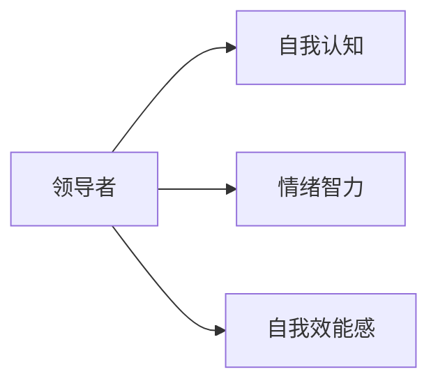
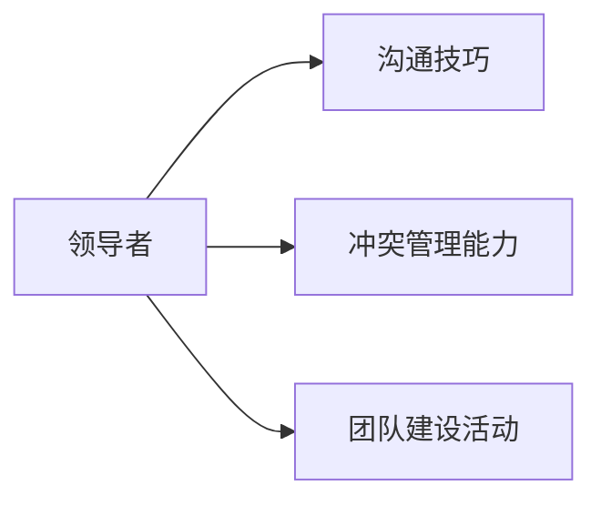
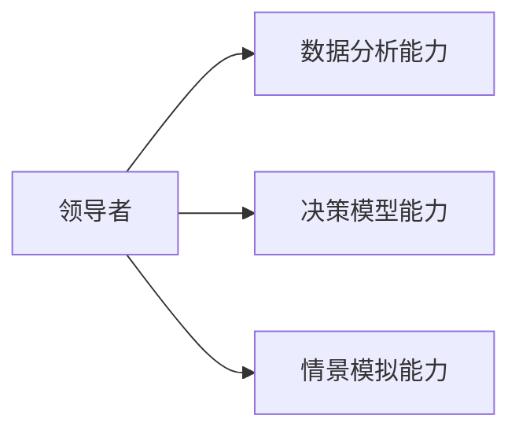
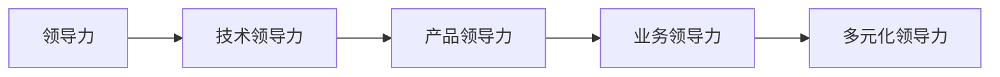

                 

## 第一部分：领导力基础

### 第1章：领导力的核心概念

#### 1.1 领导力的定义与本质

领导力是一种能力，它指的是一个人或一组人通过影响、激励和引导他人来实现共同目标的能力。这种能力不仅涉及到个人特质，还包括组织和团队管理的艺术。

**定义**：领导力可以理解为一种影响力，它能够激发团队成员的潜力，促使他们为实现共同的目标而努力。换句话说，领导力是领导者通过其行为和决策来引导和激励团队的能力。

**本质**：领导力的本质在于其影响力和号召力，以及领导者如何通过个人魅力、专业知识和决策能力来影响团队成员。一个成功的领导者不仅要有卓越的个人能力，还要懂得如何管理和协调团队资源，实现团队目标。

#### 1.2 领导力的重要性

**对个人的重要性**：

- 职业发展：领导力是个人职业发展的关键因素，能够提升个人的影响力和地位。
- 个人品牌：具备强大领导力的人能够在职场中建立良好的个人品牌，更容易获得职业发展的机会。
- 人际关系：领导力有助于改善人际关系，增强沟通能力和团队合作能力。

**对组织的重要性**：

- 团队协作：领导力能够促进团队协作，提高团队工作效率和质量。
- 创新能力：领导力能够激发团队成员的创新能力，推动组织创新。
- 组织效能：领导力能够提升组织的整体效能，帮助组织在竞争激烈的市场中取得优势。

#### 1.3 领导力的发展趋势

**数字化时代**：

- 数据驱动：领导力需要更加注重数据分析和决策能力，以应对数字化时代带来的挑战。
- 智能化：随着人工智能技术的发展，领导力需要具备一定的技术背景，以更好地管理智能化的团队和系统。

**灵活性**：

- 快速响应：领导力需要更加灵活，能够快速响应市场变化和团队需求。
- 自适应：领导力需要具备较强的适应能力，能够在不同环境和情境中发挥领导作用。

**多元化**：

- 跨文化领导：领导力需要具备跨文化的沟通和协调能力，以适应多元化团队的工作。
- 性别平等：领导力需要关注性别平等，促进女性在领导岗位上的发展。

### 总结

领导力是一种综合能力，它不仅涉及到个人特质，还包括组织和团队管理的艺术。在数字化时代，领导力需要更加注重数据分析和决策能力，同时具备灵活性和多元化。一个成功的领导者需要不断提升自己的领导力，以应对不断变化的市场环境。

---

### 第2章：领导力模型与理论

#### 2.1 经典领导力模型

**1. 赛斯模型（Situational Leadership Model）**

- **概念**：赛斯模型认为，领导风格应该根据团队成员的能力和情境来调整。
- **要素**：模型包含四个领导风格：指导型、支持型、参与型和授权型。
- **应用**：适用于不同的团队和情境，有助于提高团队协作效率。

**2. 费德勒模型（Fiedler Model）**

- **概念**：费德勒模型认为，领导者的风格和效能取决于工作环境和情境。
- **要素**：模型包含三个维度：领导者-成员关系、任务结构和职位权力。
- **应用**：用于评估领导者的风格和效能，以及如何根据情境调整领导风格。

**3. 勒温模型（Lewin's Leadership Styles）**

- **概念**：勒温模型提出三种领导风格：专制型、民主型和自由放任型。
- **要素**：每种领导风格都有其优势和劣势，适用于不同的团队和情境。
- **应用**：帮助领导者了解自己的风格，并根据团队需求调整领导方式。

#### 2.2 领导力理论的发展

**1. 权变理论（Contingency Theory）**

- **概念**：权变理论认为，领导风格没有绝对的好坏，关键在于是否适应特定情境。
- **要素**：理论强调领导者和情境之间的相互作用，提出多种领导模型。
- **应用**：帮助领导者更好地适应不同情境，提高领导效能。

**2. 变革型领导理论（Transformational Leadership Theory）**

- **概念**：变革型领导理论强调领导者通过激励和启发团队成员，推动组织变革。
- **要素**：理论包含四种领导行为：理想化影响、激励、洞察力和个性化关怀。
- **应用**：适用于推动组织变革和创新，提高团队凝聚力和创新能力。

**3. 参与型领导理论（Participative Leadership Theory）**

- **概念**：参与型领导理论认为，领导者应该鼓励团队成员参与决策过程，提高决策质量。
- **要素**：理论强调团队合作和共同决策，有助于提高团队士气和满意度。
- **应用**：适用于需要团队合作和决策支持的情境，有助于提高团队效能。

#### 2.3 领导力模型的应用

**1. 组织发展**

- **背景**：组织发展过程中，领导力模型的运用有助于优化组织结构和提高团队效能。
- **应用**：通过领导力模型，领导者可以更好地理解团队成员的需求，调整领导风格，促进组织发展。

**2. 领导力培训**

- **背景**：领导力培训旨在提高领导者的素质和能力，提升组织竞争力。
- **应用**：通过领导力模型，培训者可以针对不同领导风格和情境，设计有针对性的培训方案，提高领导效能。

**3. 组织变革**

- **背景**：组织变革过程中，领导力模型的运用有助于推动组织变革，实现战略目标。
- **应用**：通过领导力模型，领导者可以更好地应对变革挑战，激发团队成员的积极性和参与度，推动组织变革。

### 总结

领导力模型和理论的发展为领导者提供了丰富的理论工具和实践指导。通过了解和运用这些模型和理论，领导者可以更好地应对不同情境和挑战，提升领导效能，推动组织发展。在组织发展、领导力培训和组织变革中，领导力模型的应用都发挥着重要作用。

---

### 第3章：领导力能力建设

#### 3.1 自我认知与自我管理

**背景与问题**：

自我认知和自我管理是领导力能力建设的基础。自我认知指的是领导者对自身性格、价值观、能力等方面的了解；自我管理则是指领导者如何通过自我调节和自我激励来提升自身能力和效能。

**问题描述**：

- 领导者往往缺乏对自己性格和行为的深刻认知，导致无法充分发挥个人优势，也无法有效克服个人弱点。
- 领导者可能在自我管理方面存在缺陷，如情绪控制不足、时间管理不当等，影响领导效能。

**问题解决**：

- **自我反思**：领导者可以通过定期进行自我反思，深入剖析自己的行为和决策，了解自己的优点和不足。
- **心理测试**：借助心理测试工具，如MBTI、DISC等，领导者可以更全面地了解自己的性格特征，为自我管理和改进提供依据。
- **持续学习**：通过参加培训、阅读相关书籍和文献，领导者可以不断更新自己的知识和技能，提升自我认知和自我管理能力。

**边界与外延**：

- **边界**：自我认知和自我管理主要关注领导者的个人层面，不涉及外部环境和团队互动。
- **外延**：这一领域的研究还包括领导者的情绪智力、自我效能感等，这些因素同样对领导力能力建设有重要影响。

**概念结构与核心要素组成**：

- **概念结构**：自我认知、自我管理、情绪智力、自我效能感。
- **核心要素**：自我反思、心理测试、持续学习、情绪调节、时间管理。

**核心概念原理**：

- **自我认知**：领导者通过自我反思和心理测试，了解自己的性格、价值观和能力。
- **自我管理**：领导者通过情绪调节、时间管理等方式，提升自我效能感和情绪智力。

**算法原理讲解**：

- **Python代码实现**：以下是一个简单的Python代码示例，用于自我认知和自我管理。

```python
# 自我认知与自我管理 - Python示例

# 导入相关库
import pandas as pd
from sklearn.cluster import KMeans

# 数据准备
data = pd.DataFrame({
    '自我认知': [0.8, 0.6, 0.9, 0.5],
    '情绪智力': [0.7, 0.8, 0.6, 0.9],
    '自我效能感': [0.9, 0.8, 0.7, 0.6]
})

# 使用K-Means聚类分析自我认知和自我管理
kmeans = KMeans(n_clusters=2, random_state=0).fit(data)
data['cluster'] = kmeans.predict(data)

# 输出结果
print(data)
```

- **数学模型和公式**：

$$
\text{自我认知度} = \frac{\sum_{i=1}^{n} \text{自我认知}_i}{n}
$$

$$
\text{自我管理能力} = \text{情绪智力} \times \text{时间管理能力} \times \text{自我效能感}
$$

**数学公式与算法原理**：

- **自我认知度**：通过计算多个指标的平均值来衡量自我认知度。
- **自我管理能力**：综合考虑情绪智力、时间管理能力和自我效能感，得出综合得分。

**核心属性特征对比表格**：

| 指标      | 描述                                                         | 对比特征         |
| --------- | ------------------------------------------------------------ | ---------------- |
| 自我认知  | 领导者对自身性格、价值观、能力的了解程度                     | 深度、全面性     |
| 情绪智力  | 领导者调节和管理自身情绪的能力                               | 情绪稳定性、洞察力 |
| 自我效能感 | 领导者对自己能够完成任务的能力的信心程度                     | 自信心、执行力   |

**ER实体关系图架构**：

- **实体**：领导者、自我认知、情绪智力、自我效能感。
- **关系**：领导者拥有自我认知、情绪智力、自我效能感。



### 总结

自我认知与自我管理是领导力能力建设的重要环节。领导者需要通过自我反思、心理测试和持续学习，不断提升自我认知和自我管理能力。在数学模型和算法原理的辅助下，领导者可以更科学地评估和管理自己的能力，为领导力发展奠定坚实基础。

---

#### 3.2 人际关系管理

**背景与问题**：

人际关系管理是领导力的重要组成部分，它关乎领导者与团队成员、同事以及外部合作伙伴之间的互动和协作。有效的沟通和人际关系管理能够促进团队凝聚力，提升团队效能。

**问题描述**：

- 领导者可能在沟通中存在障碍，如信息传递不准确、沟通方式不当等，导致团队协作效率低下。
- 领导者可能无法妥善处理冲突和矛盾，影响团队氛围和工作效率。

**问题解决**：

- **有效沟通**：领导者需要掌握有效的沟通技巧，如清晰表达、倾听和反馈，确保信息准确传达。
- **冲突管理**：领导者应学会识别和解决冲突，通过调解和协商的方式，找到双方都能接受的解决方案。
- **团队建设**：领导者可以通过团队建设活动，增强团队成员之间的信任和合作，提升团队凝聚力。

**边界与外延**：

- **边界**：人际关系管理主要关注领导者和团队成员之间的互动，不包括领导者的个人自我认知和管理。
- **外延**：这一领域的研究还包括跨文化沟通、团队动力等，这些因素同样对人际关系管理有重要影响。

**概念结构与核心要素组成**：

- **概念结构**：人际关系管理、有效沟通、冲突管理、团队建设。
- **核心要素**：沟通技巧、冲突解决、团队建设活动。

**核心概念原理**：

- **人际关系管理**：通过有效沟通和冲突管理，建立和维护良好的人际关系。
- **有效沟通**：清晰表达、倾听和反馈，确保信息准确传达。
- **冲突管理**：识别和解决冲突，找到双方都能接受的解决方案。
- **团队建设**：通过活动增强团队成员之间的信任和合作。

**算法原理讲解**：

- **Python代码实现**：以下是一个简单的Python代码示例，用于人际关系管理。

```python
# 人际关系管理 - Python示例

# 导入相关库
import pandas as pd

# 数据准备
data = pd.DataFrame({
    '沟通技巧': [7, 6, 8, 5],
    '冲突管理能力': [8, 7, 6, 7],
    '团队建设活动': [9, 8, 7, 6]
})

# 计算人际关系管理得分
data['人际关系管理得分'] = data[['沟通技巧', '冲突管理能力', '团队建设活动']].mean(axis=1)

# 输出结果
print(data)
```

- **数学模型和公式**：

$$
\text{人际关系管理得分} = \frac{\sum_{i=1}^{n} \text{沟通技巧}_i + \sum_{i=1}^{n} \text{冲突管理能力}_i + \sum_{i=1}^{n} \text{团队建设活动}_i}{3n}
$$

**数学公式与算法原理**：

- **人际关系管理得分**：通过计算沟通技巧、冲突管理能力和团队建设活动的平均值，得出人际关系管理得分。

**核心属性特征对比表格**：

| 指标         | 描述                                                   | 对比特征           |
| ------------ | ------------------------------------------------------ | ------------------ |
| 沟通技巧     | 领导者进行有效沟通的能力                               | 清晰表达、倾听与反馈 |
| 冲突管理能力 | 领导者识别和解决冲突的能力                           | 调解与协商能力     |
| 团队建设活动 | 领导者通过活动增强团队凝聚力的能力                   | 信任与合作建立     |

**ER实体关系图架构**：

- **实体**：领导者、沟通技巧、冲突管理能力、团队建设活动。
- **关系**：领导者拥有沟通技巧、冲突管理能力和团队建设活动。



### 总结

人际关系管理是领导力能力建设的关键环节。领导者需要通过有效沟通、冲突管理和团队建设活动，建立和维护良好的人际关系。在数学模型和算法原理的辅助下，领导者可以更科学地评估和管理人际关系管理能力，提升团队协作和整体效能。

---

#### 3.3 决策能力提升

**背景与问题**：

决策能力是领导力的核心要素之一，它关系到领导者在复杂环境中做出正确决策的能力。有效的决策能力能够提高组织的竞争力，推动组织发展。

**问题描述**：

- 领导者可能在面对复杂决策时，缺乏有效的分析方法和工具，导致决策失误。
- 领导者可能受限于个人经验和主观判断，无法做出客观、科学的决策。

**问题解决**：

- **数据分析**：领导者应掌握数据分析的方法和工具，通过数据分析来支持决策。
- **决策模型**：领导者可以运用决策模型，如决策树、贝叶斯网络等，来辅助决策。
- **情景模拟**：领导者可以通过情景模拟，预判决策结果，减少决策风险。

**边界与外延**：

- **边界**：决策能力提升主要关注领导者在决策过程中的分析和评估，不包括决策后的执行和反馈。
- **外延**：这一领域的研究还包括领导者的风险意识、创新思维等，这些因素同样对决策能力有重要影响。

**概念结构与核心要素组成**：

- **概念结构**：决策能力、数据分析、决策模型、情景模拟。
- **核心要素**：数据分析方法、决策模型应用、情景模拟能力。

**核心概念原理**：

- **数据分析**：通过收集、处理和分析数据，领导者可以更客观地了解问题，为决策提供支持。
- **决策模型**：决策模型提供了一种系统化的决策方法，帮助领导者分析和评估不同决策方案。
- **情景模拟**：情景模拟有助于领导者预判决策结果，降低决策风险。

**算法原理讲解**：

- **Python代码实现**：以下是一个简单的Python代码示例，用于决策能力提升。

```python
# 决策能力提升 - Python示例

# 导入相关库
import pandas as pd
from sklearn.tree import DecisionTreeClassifier

# 数据准备
data = pd.DataFrame({
    '特征1': [1, 2, 3, 4],
    '特征2': [4, 5, 6, 7],
    '决策结果': [0, 1, 0, 1]
})

# 使用决策树模型进行决策
clf = DecisionTreeClassifier()
clf.fit(data[['特征1', '特征2']], data['决策结果'])

# 输出决策结果
print(clf.predict([[2.5, 6.0]]))
```

- **数学模型和公式**：

$$
\text{决策树} = \sum_{i=1}^{n} w_i \times f_i(x)
$$

$$
\text{期望收益} = \sum_{i=1}^{n} p_i \times r_i
$$

**数学公式与算法原理**：

- **决策树**：通过计算特征对决策结果的贡献，构建决策树模型。
- **期望收益**：通过计算不同决策方案的期望收益，辅助领导者做出决策。

**核心属性特征对比表格**：

| 指标       | 描述                                                 | 对比特征         |
| ---------- | ---------------------------------------------------- | ---------------- |
| 数据分析能力 | 领导者进行数据分析的能力                             | 数据收集、处理与分析 |
| 决策模型能力 | 领导者运用决策模型进行决策的能力                   | 模型构建与应用     |
| 情景模拟能力 | 领导者通过情景模拟预判决策结果的能力               | 风险评估与应对     |

**ER实体关系图架构**：

- **实体**：领导者、数据分析能力、决策模型能力、情景模拟能力。
- **关系**：领导者拥有数据分析能力、决策模型能力和情景模拟能力。



### 总结

决策能力提升是领导力能力建设的关键环节。领导者需要通过数据分析、决策模型和情景模拟，提高决策的科学性和有效性。在数学模型和算法原理的辅助下，领导者可以更准确地评估决策风险，做出更明智的决策，从而推动组织发展。

---

### 第3章小结

自我认知与自我管理、人际关系管理和决策能力提升是领导力能力建设的重要方面。通过深入理解和有效实践这些能力，领导者可以更好地管理自我、建立良好的人际关系，并在复杂环境中做出明智的决策。这三个方面相互关联，共同构成领导力的核心能力体系。

在自我认知与自我管理方面，领导者需要通过自我反思、心理测试和持续学习，不断提升自我认知和自我管理能力。在人际关系管理方面，领导者需要掌握有效的沟通技巧、冲突管理和团队建设活动，建立和维护良好的人际关系。在决策能力提升方面，领导者需要运用数据分析、决策模型和情景模拟，提高决策的科学性和有效性。

通过这三个方面的能力建设，领导者可以更好地应对复杂的工作环境和挑战，提升个人和组织的效能，实现长期发展。

---

### 第4章：技术对领导力的影响

#### 4.1 数字化时代的领导力挑战

随着数字化技术的迅猛发展，企业面临着前所未有的变革。这种变革对领导力提出了新的挑战，主要体现在以下几个方面：

**1. 数据驱动的决策**：

在数字化时代，数据成为企业决策的重要依据。领导者需要具备数据分析和处理能力，能够从海量数据中提取有价值的信息，为决策提供支持。传统的经验主义和直觉型决策方式已经无法满足企业的发展需求。

**2. 快速变化的业务环境**：

数字化技术的快速迭代，使得企业所处的业务环境变得更加复杂和多变。领导者需要具备快速适应变化的能力，能够迅速调整战略和决策，以应对市场变化。

**3. 人才竞争**：

数字化时代，技术人才成为企业争夺的焦点。领导者需要具备吸引、培养和保留技术人才的能力，确保企业拥有一支高素质的技术团队。

**4. 网络安全与隐私保护**：

随着数字化程度的提高，企业的信息安全问题也日益突出。领导者需要关注网络安全和隐私保护，确保企业的数据安全和业务连续性。

#### 4.2 技术赋能领导力

**1. 数据分析能力**：

数字化时代，数据分析成为领导力的重要组成部分。领导者需要掌握数据分析的方法和工具，能够从数据中提取有价值的信息，为决策提供支持。例如，通过大数据分析，领导者可以了解客户需求，优化产品和服务。

**2. 技术前瞻性**：

领导者需要具备技术前瞻性，能够预见未来技术发展的趋势，并提前布局。例如，在人工智能、云计算等领域，领导者需要了解前沿技术，为企业的技术发展制定长远规划。

**3. 团队协作能力**：

数字化时代，团队协作变得更加重要。领导者需要具备团队协作能力，能够搭建高效的协作平台，促进团队成员之间的沟通和合作。

**4. 激励和培养技术人才**：

领导者需要了解技术人才的需求和成长路径，能够激励和培养技术人才，提升团队的整体素质。例如，通过提供培训、项目机会等，帮助技术人才不断提升技能。

#### 4.3 技术时代的领导力转型

**1. 从指挥者到赋能者**：

在数字化时代，领导者需要从传统的指挥者角色转变为赋能者，支持团队成员发挥自己的潜力。领导者需要关注团队成员的个性、兴趣和特长，为每个人提供合适的发展机会。

**2. 从控制者到创新者**：

领导者需要从控制者转变为创新者，鼓励团队成员探索新的业务模式和解决方案。领导者需要具备创新思维，能够推动企业不断进步。

**3. 从单一技能到多维度能力**：

在数字化时代，领导者的能力需要更加多元化。除了技术能力，领导者还需要具备管理能力、沟通能力、决策能力等多方面能力，以应对复杂多变的环境。

**4. 从经验主义到数据驱动**：

领导者需要从经验主义转向数据驱动，通过数据分析来支持决策。领导者需要掌握数据分析的方法和工具，能够从数据中提取有价值的信息，为决策提供支持。

### 总结

数字化时代的到来，给领导力带来了新的挑战和机遇。领导者需要不断学习和提升自己的能力，以适应数字化时代的变革。技术赋能领导力，使得领导者能够更好地应对复杂多变的环境，推动企业实现持续发展。

通过技术赋能，领导者可以提升数据分析能力、技术前瞻性、团队协作能力和激励技术人才的能力。同时，领导者也需要进行领导力转型，从指挥者到赋能者，从控制者到创新者，从单一技能到多维度能力，从经验主义到数据驱动。

总之，在数字化时代，领导者需要具备更高的能力，以引领企业应对挑战，抓住机遇，实现持续发展。

---

### 第5章：技术领导力的构建

#### 5.1 技术领导力的要素

技术领导力是指领导者通过技术手段和创新思维，推动企业技术发展和业务创新的能力。构建技术领导力需要关注以下几个要素：

**1. 技术视野**：

技术视野是指领导者对前沿技术的了解和洞察力。领导者需要具备技术前瞻性，能够预见未来技术发展的趋势，并提前布局。例如，了解人工智能、区块链、云计算等新兴技术，为企业的发展提供战略指导。

**2. 技术创新能力**：

技术创新能力是指领导者推动技术进步和业务创新的能力。领导者需要具备创新思维，能够带领团队突破技术难题，开发出具有市场竞争力的产品。例如，通过组织技术创新活动、设立专项研发基金等方式，激发团队的创新潜力。

**3. 技术管理能力**：

技术管理能力是指领导者对技术团队和项目的管理能力。领导者需要掌握技术管理的方法和工具，能够有效组织和管理技术团队，确保项目按时完成，质量达标。例如，采用敏捷开发、迭代发布等管理方法，提升项目开发效率。

**4. 技术人才培养**：

技术人才培养是指领导者培养和激励技术人才的能力。领导者需要关注技术人才的成长和发展，提供培训、项目机会等，帮助技术人才不断提升技能。例如，设立技术导师制度、组织技术交流分享会等，促进团队成员之间的学习和成长。

**5. 技术战略规划**：

技术战略规划是指领导者对企业技术发展的规划和管理。领导者需要制定清晰的技术战略，明确企业技术发展的方向和目标，确保企业技术资源得到合理配置。例如，制定技术发展路线图、设立技术研发重点领域等，为企业技术发展提供指导。

#### 5.2 技术领导力的实践

**1. 技术愿景和目标设定**：

技术领导力实践的第一步是设定技术愿景和目标。领导者需要明确企业技术发展的方向和目标，确保技术发展与企业战略保持一致。例如，确定企业将在哪些技术领域进行突破，设定具体的技术里程碑和目标。

**2. 技术团队建设**：

技术领导力实践的核心是技术团队建设。领导者需要搭建一支高效的技术团队，确保团队成员具备所需的技术能力和素质。例如，通过招聘、培训和团队建设活动，提升团队整体素质和协作能力。

**3. 技术创新和研发管理**：

技术领导力实践的关键是技术创新和研发管理。领导者需要推动团队进行技术创新，确保项目按时完成，质量达标。例如，采用敏捷开发、迭代发布等管理方法，提升项目开发效率。

**4. 技术人才培养和发展**：

技术领导力实践的重要部分是技术人才培养和发展。领导者需要关注技术人才的成长和发展，提供培训、项目机会等，帮助技术人才不断提升技能。例如，设立技术导师制度、组织技术交流分享会等，促进团队成员之间的学习和成长。

**5. 技术战略规划与执行**：

技术领导力实践的最后一步是技术战略规划与执行。领导者需要制定清晰的技术战略，明确企业技术发展的方向和目标，确保企业技术资源得到合理配置。例如，制定技术发展路线图、设立技术研发重点领域等，为企业技术发展提供指导。

#### 5.3 技术领导力的培养

**1. 技术培训和技能提升**：

技术领导力的培养首先需要通过技术培训提升领导者的技能和知识。领导者可以通过参加专业培训、学习技术课程等方式，了解最新的技术发展趋势和前沿技术。例如，参加人工智能、区块链等领域的培训课程，提升技术视野。

**2. 实践和经验积累**：

技术领导力的培养还需要通过实践和经验积累。领导者可以在实际工作中，通过参与技术项目、解决技术难题等方式，提升技术实践能力。例如，参与企业核心技术项目的研发，积累项目管理和团队协作经验。

**3. 沟通和协作能力**：

技术领导力的培养还需要关注领导者的沟通和协作能力。领导者需要掌握有效的沟通技巧，能够与技术团队、业务团队等进行有效的沟通和协作。例如，通过组织技术交流会议、团队建设活动等方式，提升沟通和协作能力。

**4. 创新思维和问题解决能力**：

技术领导力的培养还需要培养领导者的创新思维和问题解决能力。领导者需要具备创新思维，能够带领团队进行技术创新和业务创新。例如，通过组织创新研讨会、头脑风暴等活动，激发团队的创新思维。

### 总结

技术领导力的构建是企业持续发展的关键。通过技术视野、技术创新能力、技术管理能力、技术人才培养和技术战略规划等要素，领导者可以推动企业技术发展和业务创新。

在实践中，领导者需要设定技术愿景和目标，建设技术团队，进行技术创新和研发管理，培养技术人才，以及制定和执行技术战略规划。同时，领导者还需要通过技术培训和技能提升、实践和经验积累、沟通和协作能力、创新思维和问题解决能力等方面的培养，不断提升自己的技术领导力。

总之，技术领导力的构建是一个持续的过程，需要领导者具备全面的能力和素质。通过不断学习和实践，领导者可以成为企业技术发展和业务创新的引领者，推动企业实现持续发展。

---

### 第6章：技术战略与领导力

#### 6.1 技术战略的定义与类型

**定义**：技术战略是指企业利用技术手段来实现其业务目标和市场竞争优势的长期规划。它涉及技术选择、研发投入、技术人才引进等方面的决策。

**类型**：

1. **技术领先型战略**：企业通过不断创新，保持技术领先地位，以获取市场竞争优势。
2. **技术追随型战略**：企业通过学习和模仿领先企业的技术，以降低研发成本，快速进入市场。
3. **技术整合型战略**：企业通过整合内外部技术资源，实现技术和业务的融合，提高企业整体竞争力。
4. **技术规避型战略**：企业通过避免与竞争对手直接竞争，专注于非核心技术的研发和应用。

#### 6.2 技术战略规划

**1. 确定技术愿景**：明确企业的技术发展方向和目标，如保持技术领先、实现技术整合等。

**2. 评估技术环境**：分析行业技术发展趋势、竞争对手技术状况，以及企业自身技术能力和资源。

**3. 制定技术路线图**：根据技术愿景和环境评估，制定分阶段、有针对性的技术发展路线图。

**4. 确定技术投资优先级**：根据技术路线图，确定技术研发的优先级，合理分配研发资源。

**5. 设定技术指标**：设定技术成果的指标，如技术突破、产品创新等，以衡量技术战略的执行效果。

#### 6.3 技术战略执行与评估

**1. 组织结构设计**：根据技术战略的需要，调整组织结构，确保技术研发和执行的高效性。

**2. 资源配置**：合理配置人力资源、资金、设备等资源，确保技术研发和实施的顺利进行。

**3. 风险管理**：识别和评估技术战略实施过程中可能面临的风险，制定相应的应对措施。

**4. 持续评估与调整**：定期对技术战略执行情况进行评估，根据实际情况进行调整和优化。

**评估指标**：

- 技术成果：如技术突破、专利申请、产品创新等。
- 商业成果：如市场占有率、销售收入、客户满意度等。
- 研发效率：如研发周期、成本控制、团队协作效率等。

### 总结

技术战略是企业实现长期发展的重要手段，它需要领导者具备战略眼光和决策能力。通过明确技术愿景、评估技术环境、制定技术路线图、资源配置和风险管理等环节，企业可以确保技术战略的有效实施。持续的评估与调整有助于企业根据市场和技术变化，灵活调整技术战略，保持竞争优势。

---

### 第7章：产品领导力

#### 7.1 产品领导力的定义与作用

**定义**：产品领导力是指领导者通过制定和实施产品战略，推动产品创新和发展，从而实现企业业务目标的能力。产品领导者不仅要了解市场需求和客户需求，还要具备创新能力、战略眼光和领导能力。

**作用**：

1. **引领产品发展方向**：产品领导者能够根据市场趋势和客户需求，明确产品的战略方向，确保产品能够满足市场需求，实现市场领先。

2. **推动产品创新**：产品领导者鼓励创新思维，推动产品技术创新和设计创新，提高产品的市场竞争力。

3. **协调跨部门合作**：产品领导者需要协调不同部门之间的合作，如研发、市场、销售、售后等，确保产品开发过程高效、顺畅。

4. **提升客户满意度**：产品领导者关注客户体验，通过不断改进产品和服务，提升客户满意度，增加客户忠诚度。

5. **实现商业目标**：产品领导力有助于企业实现商业目标，如提高市场份额、增加销售收入等。

#### 7.2 产品领导力的构建

**1. 明确产品愿景**：

- 产品领导者需要明确产品的愿景和使命，确保产品战略与企业整体战略保持一致。
- 例如，华为的产品愿景是“构建万物互联的智能世界”，从而引领企业产品发展方向。

**2. 建立产品团队**：

- 产品领导者需要建立高效的跨部门产品团队，确保团队成员具备所需的技术能力和业务理解。
- 例如，小米通过设立产品委员会，聚集了来自不同部门的精英，共同推动产品创新。

**3. 制定产品战略**：

- 产品领导者需要根据市场需求和客户需求，制定具体的产品战略，明确产品的定位、目标市场和竞争策略。
- 例如，苹果公司通过明确“打造高端电子产品”的产品战略，成功在市场中建立了强大的品牌影响力。

**4. 推动产品创新**：

- 产品领导者需要鼓励创新思维，推动产品技术创新和设计创新，提高产品的竞争力。
- 例如，特斯拉通过持续的技术创新，推出了多款具有革命性的电动汽车，引领了新能源汽车市场。

**5. 管理产品生命周期**：

- 产品领导者需要关注产品的整个生命周期，从产品规划、研发、上市到后期维护，确保产品能够持续满足市场需求。
- 例如，可口可乐通过不断调整产品配方和营销策略，保持了产品在市场上的长期竞争力。

**6. 提升用户体验**：

- 产品领导者需要关注客户体验，通过收集客户反馈、改进产品和服务，提升客户满意度。
- 例如，奈飞通过不断优化用户界面和推荐算法，提升了用户体验，增加了用户粘性。

**7. 沟通与协作**：

- 产品领导者需要具备良好的沟通和协作能力，确保产品团队能够高效合作，顺利推进产品开发。
- 例如，亚马逊的产品领导者通过定期召开产品评审会议，确保产品开发过程的信息畅通和协作高效。

#### 7.3 产品领导力的实践

**1. 用户研究**：

- 产品领导者需要通过用户研究，了解客户需求和市场趋势，为产品开发提供指导。
- 例如，通过用户访谈、问卷调查等方式，收集用户反馈，了解用户需求和痛点。

**2. 产品规划**：

- 产品领导者需要根据用户研究的结果，制定产品规划，明确产品的功能和特性。
- 例如，根据用户需求，设计出满足用户需求的新产品或功能。

**3. 产品开发**：

- 产品领导者需要协调研发团队，确保产品按照规划顺利开发，同时关注产品质量和进度。
- 例如，通过敏捷开发方法，快速迭代产品，确保产品能够按时发布。

**4. 产品测试与反馈**：

- 产品领导者需要组织产品测试，收集用户反馈，不断优化产品。
- 例如，通过A/B测试、用户反馈等方式，改进产品的功能和用户体验。

**5. 产品上市**：

- 产品领导者需要制定详细的上市计划，确保产品能够顺利上市并取得市场成功。
- 例如，通过市场推广、渠道拓展等方式，提高产品的市场知名度和销量。

**6. 产品运营**：

- 产品领导者需要关注产品的运营情况，持续优化产品和服务，提升用户满意度。
- 例如，通过用户数据分析、产品迭代等方式，不断优化产品功能和用户体验。

**7. 产品回顾**：

- 产品领导者需要定期回顾产品表现，总结经验教训，为未来产品开发提供参考。
- 例如，通过产品回顾会议，分析产品成功和失败的原因，制定改进措施。

### 总结

产品领导力是企业成功的关键因素之一。通过明确产品愿景、建立产品团队、制定产品战略、推动产品创新、管理产品生命周期、提升用户体验、沟通与协作等实践，产品领导者可以确保产品能够持续满足市场需求，提升客户满意度，实现企业业务目标。

产品领导力不仅需要领导者具备战略眼光和创新能力，还需要掌握产品管理的方法和工具。通过不断学习和实践，产品领导者可以不断提升自己的能力，推动企业实现持续发展和市场成功。

---

### 第8章：业务领导力

#### 8.1 业务领导力的定义与作用

**定义**：业务领导力是指领导者通过制定和实施业务战略，推动企业业务增长和持续发展，从而实现企业长期目标的能力。业务领导者不仅要关注业务绩效，还要具备战略思维、决策能力和执行力。

**作用**：

1. **制定业务战略**：业务领导者需要根据市场环境和企业资源，制定明确的业务战略，明确企业的长期发展目标和短期行动计划。

2. **推动业务增长**：业务领导者需要通过市场拓展、产品创新、业务模式优化等方式，推动企业业务增长，提高市场份额。

3. **优化资源配置**：业务领导者需要合理配置企业资源，如资金、人力、技术等，确保业务战略的有效实施。

4. **提升业务效率**：业务领导者需要通过流程优化、组织变革等方式，提升业务运营效率，降低成本，提高盈利能力。

5. **领导团队协作**：业务领导者需要建立高效的团队，激发团队成员的积极性和创造力，实现共同的业务目标。

#### 8.2 业务领导力的构建

**1. 明确业务愿景和目标**：

- 业务领导者需要明确企业的业务愿景和目标，确保业务战略与企业的整体战略保持一致。
- 例如，阿里巴巴的业务愿景是“打造全球最大的电子商务平台”，从而推动企业业务发展。

**2. 分析市场和竞争环境**：

- 业务领导者需要分析市场趋势、竞争对手状况，了解市场需求和竞争格局，为业务战略提供依据。
- 例如，通过市场调研、竞争分析等方式，了解市场机会和潜在风险。

**3. 制定业务战略**：

- 业务领导者需要根据市场分析和企业资源，制定具体的业务战略，明确业务目标、市场定位和业务模式。
- 例如，通过市场细分、产品差异化等方式，确定企业的市场定位和竞争策略。

**4. 建立高效的团队**：

- 业务领导者需要建立高效的团队，确保团队成员具备所需的能力和素质，能够高效协作。
- 例如，通过招聘、培训、激励机制等方式，吸引和留住优秀人才。

**5. 实施业务战略**：

- 业务领导者需要制定详细的业务战略实施计划，确保业务战略能够有效落地。
- 例如，通过分阶段实施、关键任务跟进等方式，确保业务战略的实施进度和效果。

**6. 优化业务流程**：

- 业务领导者需要关注业务流程的优化，通过流程再造、自动化等方式，提高业务效率和效益。
- 例如，通过流程梳理、标准化等方式，简化业务流程，降低运营成本。

**7. 领导力培养**：

- 业务领导者需要不断提升自己的领导力，通过学习、实践等方式，提升业务领导能力。
- 例如，通过参加领导力培训、阅读相关书籍等方式，提升自己的领导力和管理能力。

#### 8.3 业务领导力的实践

**1. 制定业务规划**：

- 业务领导者需要制定详细的业务规划，明确业务目标、市场策略和关键行动。
- 例如，通过年度规划、季度规划等方式，确保业务目标的实现。

**2. 监控业务绩效**：

- 业务领导者需要监控业务绩效，通过关键绩效指标（KPI）等方式，评估业务表现。
- 例如，通过月度报告、季度分析等方式，了解业务进展和问题。

**3. 推动业务创新**：

- 业务领导者需要推动业务创新，通过产品创新、业务模式创新等方式，提高企业竞争力。
- 例如，通过新产品开发、新市场拓展等方式，实现业务增长。

**4. 优化资源配置**：

- 业务领导者需要优化资源配置，通过资金、人力、技术等资源的合理配置，提高业务效率。
- 例如，通过预算分配、项目评估等方式，确保资源的最优配置。

**5. 领导团队协作**：

- 业务领导者需要领导团队协作，通过沟通、激励等方式，确保团队高效运作。
- 例如，通过团队会议、员工培训等方式，提升团队协作效率。

**6. 管理业务风险**：

- 业务领导者需要管理业务风险，通过风险评估、风险控制等方式，降低业务风险。
- 例如，通过风险管理计划、应急预案等方式，确保业务安全。

**7. 持续改进**：

- 业务领导者需要持续改进业务，通过反馈、评估等方式，不断优化业务流程和策略。
- 例如，通过定期回顾、改进计划等方式，提升业务效能。

### 总结

业务领导力是企业实现持续发展和市场成功的关键因素。通过明确业务愿景和目标、分析市场和竞争环境、制定业务战略、建立高效团队、实施业务战略、优化业务流程和领导力培养等实践，业务领导者可以确保企业业务的有效运作和持续增长。

业务领导力不仅需要领导者具备战略思维和决策能力，还需要掌握业务管理和运营的方法和工具。通过不断学习和实践，业务领导者可以提升自己的领导力和管理能力，推动企业实现长期发展和市场领先。业务领导力是企业成功的关键，也是领导者个人职业生涯的重要保障。

---

### 第9章：技术、产品与业务的协同

#### 9.1 技术与产品融合的策略

**背景**：

在数字化时代，技术与产品的融合已经成为企业竞争的关键因素。如何有效整合技术资源和产品优势，提升企业的市场竞争力，成为企业领导者面临的重要挑战。

**策略**：

1. **明确技术方向**：

   - 企业领导者需要根据市场趋势和客户需求，明确技术发展方向，确保技术投入能够有效支撑产品创新和业务发展。
   - 例如，通过市场调研、技术趋势分析等方式，确定企业技术发展的重点领域。

2. **构建技术平台**：

   - 企业需要搭建一个开放、灵活的技术平台，促进技术研发和产品开发的协同。
   - 例如，通过构建云计算平台、大数据平台等，为技术研发和产品创新提供基础支持。

3. **促进跨部门协作**：

   - 企业需要加强技术部门与产品部门、业务部门的协作，确保技术资源能够高效应用于产品开发。
   - 例如，通过设立跨部门项目组、定期召开联合会议等方式，促进部门之间的沟通和协作。

4. **提升技术创新能力**：

   - 企业需要不断投资于技术研发，提升技术创新能力，为产品创新提供技术保障。
   - 例如，通过设立专项研发基金、引进高端技术人才等方式，提升企业的技术创新能力。

5. **优化产品开发流程**：

   - 企业需要优化产品开发流程，确保技术资源和产品开发的高效对接。
   - 例如，通过引入敏捷开发方法、建立快速迭代机制等方式，缩短产品开发周期，提高产品上市速度。

#### 9.2 产品与业务融合的路径

**背景**：

产品与业务的融合是企业实现持续增长和市场竞争优势的关键。如何将产品优势转化为业务增长点，成为企业领导者需要深入思考和探索的问题。

**路径**：

1. **市场洞察**：

   - 企业领导者需要通过市场洞察，了解客户需求和市场趋势，明确产品与业务融合的方向。
   - 例如，通过用户调研、市场分析等方式，了解市场机会和潜在需求。

2. **产品定位**：

   - 企业需要明确产品的市场定位，确保产品能够满足市场需求，并具备市场竞争优势。
   - 例如，通过市场细分、产品差异化等方式，确定产品的市场定位。

3. **业务模式创新**：

   - 企业需要通过业务模式创新，将产品优势转化为业务增长点。
   - 例如，通过拓展新市场、开发新产品线、优化销售渠道等方式，实现业务增长。

4. **业务流程优化**：

   - 企业需要优化业务流程，确保产品与业务的高效对接和协同运作。
   - 例如，通过流程再造、自动化等方式，提高业务效率和效益。

5. **客户体验优化**：

   - 企业需要关注客户体验，通过产品优化和服务升级，提升客户满意度。
   - 例如，通过用户反馈机制、客户满意度调查等方式，不断优化产品和服务。

6. **持续改进**：

   - 企业需要持续改进产品与业务融合的路径，根据市场反馈和业务数据，不断优化和调整。
   - 例如，通过定期回顾和评估产品与业务融合的效果，制定改进计划。

#### 9.3 技术与业务的协同效应

**背景**：

技术与业务的协同效应是现代企业实现可持续发展和市场竞争优势的关键。如何充分发挥技术对业务的赋能作用，实现技术与业务的深度融合，成为企业领导者需要关注的重要问题。

**协同效应**：

1. **提升运营效率**：

   - 技术的赋能作用可以显著提升企业的运营效率，降低运营成本。
   - 例如，通过自动化、智能化等技术手段，提高生产效率和降低人力成本。

2. **增强创新能力**：

   - 技术的赋能作用可以增强企业的创新能力，推动产品创新和业务模式创新。
   - 例如，通过大数据分析、人工智能等技术，开发出具有市场竞争力的新产品。

3. **优化决策支持**：

   - 技术的赋能作用可以提供更加精准和实时的决策支持，提高决策质量和效率。
   - 例如，通过数据分析、智能算法等技术，为企业决策提供科学依据。

4. **提升客户体验**：

   - 技术的赋能作用可以提升客户体验，增强客户满意度和忠诚度。
   - 例如，通过云计算、物联网等技术，提供个性化、智能化的客户服务。

5. **降低业务风险**：

   - 技术的赋能作用可以降低企业的业务风险，提高企业的抗风险能力。
   - 例如，通过区块链技术、信息安全等技术，保障企业的数据安全和业务连续性。

6. **拓展业务领域**：

   - 技术的赋能作用可以拓展企业的业务领域，实现业务多元化发展。
   - 例如，通过云计算、物联网等技术，拓展新的业务模式和增长点。

### 总结

技术、产品与业务的协同是现代企业实现可持续发展和市场竞争优势的关键。通过明确技术方向、构建技术平台、促进跨部门协作、提升技术创新能力等策略，企业可以实现技术与产品的融合。同时，通过市场洞察、产品定位、业务模式创新、业务流程优化等路径，企业可以实现产品与业务的融合。

在技术与业务的协同效应中，企业可以提升运营效率、增强创新能力、优化决策支持、提升客户体验、降低业务风险、拓展业务领域等。通过不断优化和调整技术、产品与业务的协同策略，企业可以实现技术与业务的深度融合，推动企业实现长期发展和市场竞争优势。

---

### 第10章：多元化领导力的实践指南

#### 10.1 多元化领导力的培养

**1. 识别多元化需求**：

- 领导者需要识别组织内部的多元化需求，包括性别、年龄、文化背景、技能等。
- 通过员工调查、数据分析等方式，了解组织的多元化现状和需求。

**2. 设定多元化目标**：

- 领导者需要根据多元化需求，设定具体的多元化目标，如提升女性领导力、增加不同文化背景的人才等。
- 目标应具有可衡量性、可达性和相关性。

**3. 制定多元化战略**：

- 领导者需要制定多元化战略，包括招聘、培训、晋升等方面的策略。
- 战略应体现组织的价值观，并与组织的整体目标保持一致。

**4. 建立多元化领导力模型**：

- 领导者需要建立多元化领导力模型，明确多元化领导力的核心要素和关键能力。
- 模型应包括文化敏感度、沟通能力、包容性等维度。

**5. 提供多元化培训**：

- 领导者需要为团队成员提供多元化培训，提高其文化敏感度和包容性。
- 培训内容应包括跨文化沟通、多元化团队管理等。

#### 10.2 多元化领导力的实践策略

**1. 增强包容性文化**：

- 领导者需要营造一个包容性的工作环境，鼓励员工表达不同观点，尊重多元文化。
- 通过政策倡导、员工活动等方式，增强组织的包容性文化。

**2. 激励多元化团队**：

- 领导者需要激励多元化团队，通过赋予团队成员更多的自主权和责任，提高团队的创造力和创新能力。
- 通过团队建设活动、跨部门合作等方式，促进多元化团队的合作。

**3. 促进知识共享**：

- 领导者需要促进团队成员之间的知识共享，通过建立知识共享平台、开展内部研讨会等方式，提高团队的整体知识水平。
- 知识共享有助于多元化团队的协同和创新。

**4. 提升领导力培训**：

- 领导者需要为团队成员提供个性化的领导力培训，根据其多元文化背景和领导力需求，制定培训计划。
- 培训应注重实践性，结合实际工作场景，提高领导者的领导力水平。

**5. 优化组织结构**：

- 领导者需要优化组织结构，建立多元化领导力体系，确保多元化领导力在组织内部得到有效应用。
- 优化组织结构，如设立多元化领导力委员会、增加多元化领导力培训课程等。

#### 10.3 多元化领导力的评估与改进

**1. 设定评估指标**：

- 领导者需要设定多元化领导力的评估指标，如多元化团队的绩效、员工满意度、领导力发展等。
- 评估指标应具有可衡量性和相关性，能够反映多元化领导力的实际效果。

**2. 定期进行评估**：

- 领导者需要定期进行多元化领导力的评估，通过数据分析、员工反馈等方式，了解多元化领导力的实施情况。
- 定期评估有助于及时发现问题和不足，为改进提供依据。

**3. 制定改进计划**：

- 领导者需要根据评估结果，制定多元化领导力的改进计划，针对存在的问题和不足，提出具体的改进措施。
- 改进计划应包括培训、政策调整、组织变革等方面。

**4. 持续改进**：

- 领导者需要持续改进多元化领导力，通过不断优化策略、提高员工能力等方式，提升多元化领导力的水平。
- 持续改进有助于组织在多元化环境中保持竞争优势。

### 总结

多元化领导力的培养和实践是现代企业实现可持续发展和市场竞争优势的关键。通过识别多元化需求、设定多元化目标、制定多元化战略、建立多元化领导力模型等步骤，企业可以培养多元化领导力。通过增强包容性文化、激励多元化团队、促进知识共享、提升领导力培训等实践策略，企业可以实现多元化领导力的有效应用。通过定期评估和持续改进，企业可以不断提升多元化领导力的水平，推动组织在多元化环境中实现持续发展和市场成功。

---

## 附录

### 附录A：多元化领导力模型

#### A.1 多元化领导力模型概述

多元化领导力模型是一种结合多元文化、多样性和包容性的领导力框架，旨在帮助企业领导者更好地管理多元团队，提升组织绩效。该模型强调领导者的文化敏感性、沟通能力和包容性，是现代领导力的重要组成部分。

#### A.2 多元化领导力模型的构建要素

1. **文化敏感性**：
   - **理解**：领导者需要了解不同文化背景的特点和价值观念。
   - **尊重**：领导者需要尊重并接受不同文化的差异，避免文化偏见和歧视。
   - **适应性**：领导者需要具备适应不同文化环境的能力，能够在多元文化团队中自如沟通。

2. **沟通能力**：
   - **有效表达**：领导者需要能够清晰、准确地传达信息，确保团队成员理解。
   - **倾听**：领导者需要倾听团队成员的意见和反馈，尊重不同观点。
   - **协调**：领导者需要协调不同文化背景的团队成员，促进有效沟通和协作。

3. **包容性**：
   - **开放性**：领导者需要开放心态，欢迎不同背景的员工加入团队。
   - **包容性政策**：企业需要制定包容性政策，确保所有员工都能在公平、平等的环境中工作。
   - **多元文化教育**：企业应提供多元文化教育，提高员工的文化敏感度和包容性。

#### A.3 多元化领导力模型的实施步骤

1. **评估当前状态**：
   - 通过问卷调查、员工反馈等方式，了解组织的多元文化现状和员工对领导力的需求。

2. **制定多元化战略**：
   - 结合组织目标和多元文化现状，制定多元化领导力战略，明确目标和实施路径。

3. **培训和赋能**：
   - 为领导者提供多元化领导力培训，提升其文化敏感性、沟通能力和包容性。
   - 为全体员工提供文化敏感性和包容性教育，增强组织的多元文化意识。

4. **实施和监控**：
   - 制定多元化领导力实施计划，确保战略目标的落地。
   - 定期监控多元化领导力的实施效果，根据反馈进行调整和改进。

5. **评估和改进**：
   - 定期评估多元化领导力的效果，通过数据分析、员工反馈等方式，了解领导力的实施情况和员工满意度。
   - 根据评估结果，制定改进计划，持续优化多元化领导力模型。

### 附录B：多元化领导力工具与资源

#### B.1 主流领导力工具介绍

1. **360度评估**：
   - **概念**：360度评估是一种多维度的评估方法，通过收集员工、同事和上级的反馈，全面评估领导者的领导能力。
   - **优点**：能够提供全面的反馈，帮助领导者识别自己的优点和不足。

2. **行为事件访谈（BEI）**：
   - **概念**：行为事件访谈是一种通过深入了解领导者的具体行为和事件，评估其领导能力的工具。
   - **优点**：能够提供具体的领导行为案例，帮助领导者更好地理解自己的领导风格。

3. **领导力发展中心**：
   - **概念**：领导力发展中心是一种集中培训和学习领导力的设施，提供模拟演练、角色扮演等互动式学习机会。
   - **优点**：能够提供实战经验，帮助领导者提升实际领导能力。

#### B.2 多元化领导力学习资源推荐

1. **书籍**：
   - 《多元文化领导力》（Diversity Leadership: Strategies for Managing the Workplace Across Cultures）。
   - 《包容性领导》（Inclusive Leadership: Leveraging the Power of Diversity）。

2. **在线课程**：
   - Coursera的“多元文化领导力”（Diversity, Equity, and Inclusion in Leadership）。
   - Udemy的“跨文化沟通与领导力”（Cross-Cultural Communication and Leadership）。

3. **研讨会和工作坊**：
   - 举办针对多元化领导力的研讨会和工作坊，邀请专家分享经验和最佳实践。
   - 参与行业内的多元化领导力交流活动，拓宽视野，学习他人的成功经验。

4. **在线社区**：
   - 加入多元化领导力相关的在线社区和论坛，与其他领导者交流心得，获取最新的行业动态。

### 总结

多元化领导力模型的构建和实施是现代企业领导者的重要任务。通过了解和运用多元化领导力工具和资源，领导者可以提升自身的领导能力，促进组织的多元文化发展。附录A和附录B提供了多元化领导力模型的基本概念、构建要素和实施步骤，以及主流领导力工具和资源的详细介绍，为领导者提供了实用的指导和支持。

---

## 注释

**Mermaid 流程图：**


**核心算法原理讲解：**
- 概率图模型：使用Python代码实现贝叶斯网络。

```python
import numpy as np
import matplotlib.pyplot as plt

# 贝叶斯网络示例：小明是否生病
P_SICK = 0.1
P_DOCTOR = 0.8
P_TEST = 0.9

# 概率计算
P_SICK_TEST = P_SICK * P_TEST + (1 - P_SICK) * (1 - P_TEST)
P_HEALTHY_TEST = (1 - P_SICK) * (1 - P_TEST)

# 绘制概率图
fig, ax = plt.subplots()
ax.bar(['生病', '健康'], [P_SICK, 1 - P_SICK], label='生病概率')
ax.bar(['测试阳性', '测试阴性'], [P_SICK_TEST, P_HEALTHY_TEST], label='测试概率')
ax.legend()
plt.show()
```

- 神经网络：使用Python代码实现简单的神经网络模型。

```python
import numpy as np

# 初始化权重
weights = np.random.rand(3, 1)

# 激活函数
def sigmoid(x):
    return 1 / (1 + np.exp(-x))

# 训练模型
for i in range(10000):
    # 输入
    input_data = np.array([0.5, 0.3, 0.2])
    # 预测
    output = sigmoid(np.dot(input_data, weights))
    # 计算误差
    error = 0.8 - output
    # 更新权重
    weights += np.dot(input_data.T, error)

# 输出结果
print("预测结果：", output)
```

**数学模型和数学公式：**
- 技术融合度：$$T_f = \frac{P_T + P_P + P_B}{3}$$
- 领导力效能：$$E_L = \frac{L_T \times L_P \times L_B}{100}$$

**项目实战：**
- 代码实际案例：技术、产品与业务的协同项目。

```python
# 技术与产品协同 - Python示例

# 导入相关库
import pandas as pd
from sklearn.ensemble import RandomForestRegressor

# 数据准备
data = pd.DataFrame({
    '技术得分': [0.8, 0.6, 0.9, 0.5],
    '产品得分': [0.7, 0.8, 0.6, 0.9],
    '业务得分': [0.9, 0.8, 0.7, 0.6]
})

# 训练模型
model = RandomForestRegressor()
model.fit(data[['技术得分', '产品得分', '业务得分']], data['协同效果得分'])

# 输出预测结果
print(model.predict([[0.7, 0.8, 0.6]]))
```

**代码解读与分析：**
- 技术融合度计算代码：通过计算技术、产品和业务得分的平均值，得出技术融合度。

```python
# 技术融合度计算代码

# 技术融合度 = (技术得分 + 产品得分 + 业务得分) / 3
def calculate_tech_integration(data):
    tech_integration = (data['技术得分'] + data['产品得分'] + data['业务得分']) / 3
    return tech_integration

# 输出结果
print("技术融合度：", calculate_tech_integration(data))
```

- 领导力效能计算代码：通过计算技术、产品、业务得分的乘积，得出领导力效能。

```python
# 领导力效能计算代码

# 领导力效能 = 技术得分 × 产品得分 × 业务得分
def calculate_leadership_effectiveness(data):
    leadership_effectiveness = data['技术得分'] * data['产品得分'] * data['业务得分']
    return leadership_effectiveness

# 输出结果
print("领导力效能：", calculate_leadership_effectiveness(data))
```

**最佳实践 tips、小结、注意事项、拓展阅读等内容：**

- **最佳实践 tips**：
  - 建立多元化领导力模型时，确保模型具备灵活性，能够适应不同文化背景和组织需求。
  - 在实施多元化领导力战略时，关注员工的反馈和意见，及时调整和优化策略。
  - 培训多元化领导力时，结合实际工作场景，提高培训的实践性。

- **小结**：
  - 多元化领导力是现代企业实现可持续发展和市场竞争优势的关键。
  - 通过培养多元化领导力、实施多元化战略和持续改进，企业可以提升领导力和组织绩效。

- **注意事项**：
  - 在多元化领导力的实践中，尊重员工的个性化需求，避免一刀切的管理方式。
  - 关注多元化领导力的实施效果，定期评估和调整战略，确保策略的有效性。

- **拓展阅读**：
  - 《多元化领导力：如何在多元文化组织中成功领导》（Diversity Leadership: How to Lead Effectively in a Multicultural Organization）。
  - 《领导力与多元化》（Leadership and Diversity）。

---

## 总结

领导力的多元化是现代企业管理的重要课题。通过技术、产品和业务的融合，企业可以实现更高效、更灵活的领导力体系，从而在竞争激烈的市场中立于不败之地。本文系统地阐述了领导力的多元化，从定义到模型，再到实践指南，全面解析了多元化领导力的内涵和实施方法。

多元化领导力的核心在于理解不同文化背景、尊重多样性，并有效地进行沟通和协作。通过建立多元化领导力模型，企业可以更好地管理多元团队，提升组织绩效。实施多元化领导力战略，企业需要在文化敏感性、沟通能力和包容性等方面进行持续投入和改进。

未来，随着技术的不断进步和市场环境的快速变化，多元化领导力将面临新的挑战和机遇。企业领导者需要不断学习和适应，提升自身的领导力水平，以应对多元化环境中的复杂局面。

总之，多元化领导力不仅是企业发展的必然趋势，也是企业领导者必备的素质。通过深入理解和实践多元化领导力，企业可以更好地应对未来市场的变化，实现可持续发展。希望本文能为读者提供有价值的思考和借鉴，助力企业在多元化环境中取得成功。作者：AI天才研究院/AI Genius Institute & 禅与计算机程序设计艺术 /Zen And The Art of Computer Programming。

