                 

# 领导力的高阶技能：培养下一代技术领袖

## 关键词
领导力、技术领袖、培养策略、创新、国际化视野、持续学习

## 摘要
本文将探讨领导力的高阶技能，特别是在信息技术领域如何培养下一代技术领袖。我们将从领导力基础、高阶领导力技能以及培养下一代技术领袖的具体策略三个部分进行深入分析。通过理解领导力的核心概念、沟通技巧、团队建设、决策能力等基础技能，我们将逐步揭示高阶领导力技能如战略思维、创新与变革管理、情绪智慧的重要性。最后，我们将探讨如何在当前的技术环境中培养具备国际化视野和持续学习能力的技术领袖。

## 目录

1. **领导力基础**

   1.1 领导力的定义

   1.2 领导力的重要性

   1.3 领导力的核心要素

   2. **领导风格与行为**

   2.1 领导风格的分类

   2.2 不同领导风格的影响

   2.3 领导行为的改进策略

   3. **沟通技巧**

   3.1 有效沟通的要素

   3.2 沟通障碍与解决策略

   3.3 领导者如何进行高效沟通

   4. **团队建设**

   4.1 团队的定义与类型

   4.2 团队建设的关键要素

   4.3 如何提升团队凝聚力

   5. **决策能力**

   5.1 决策的定义与类型

   5.2 决策过程

   5.3 决策能力提升策略

2. **高阶领导力技能**

   6. **战略思维**

   6.1 战略思维的概念

   6.2 战略思维的构成

   6.3 战略规划与执行

   7. **创新与变革管理**

   7.1 创新的重要性

   7.2 创新的过程与方法

   7.3 变革管理的策略

   8. **领导者的自我提升**

   8.1 自我认知与反思

   8.2 自我提升的策略

   8.3 领导者的成长路径

   9. **情绪智慧**

   9.1 情绪智慧的概念

   9.2 情绪智慧的重要性

   9.3 提升情绪智慧的方法

   10. **人才发展**

   10.1 人才发展的理念

   10.2 人才培养策略

   10.3 人才激励机制

3. **培养下一代技术领袖**

   11. **技术领导力**

   11.1 技术领导力的定义

   11.2 技术领导力的要素

   11.3 技术领导力的培养策略

   12. **新技术趋势**

   12.1 人工智能与大数据

   12.2 区块链与加密货币

   12.3 物联网与边缘计算

   13. **技术创业**

   13.1 技术创业的机会

   13.2 技术创业的挑战

   13.3 技术创业者的素养

   14. **国际化视野**

   14.1 国际化的重要性

   14.2 国际化战略

   14.3 国际化领导者的素质

   15. **持续学习与适应**

   15.1 持续学习的理念

   15.2 学习资源与工具

   15.3 领导者的学习策略

4. **附录**

   4.1 领导力发展资源

   4.2 技术领袖案例研究

   图1-1 领导力核心概念实体关系架构 Mermaid 流程图

----------------------------------------------------------------

## 第一部分：领导力基础

### 1.1 领导力的定义

领导力是指个体或群体在特定情境下，通过影响力引导、激励和协调他人，以实现共同目标的能力。这一能力不仅涉及到个人特质和行为，还涉及领导者与追随者之间的关系。领导力不是一成不变的，而是随着环境、时间和情境的变化而不断发展。

### 1.2 领导力的重要性

领导力在组织和个人层面都具有重要意义。在组织层面，有效的领导力可以促进组织目标的实现，提高团队效率，增强组织凝聚力。在个人层面，领导力可以帮助个体在职业生涯中取得更大的成功，提升个人影响力。

### 1.3 领导力的核心要素

领导力的核心要素包括但不限于以下几个方面：

1. **影响力**：领导者需要具备影响力，能够通过言行引导和激励他人。
2. **沟通能力**：领导者需要具备良好的沟通能力，能够清晰地表达自己的想法，理解他人的观点，并有效地传达信息。
3. **团队建设**：领导者需要能够建立有效的团队，激发团队成员的潜力，提升团队凝聚力。
4. **决策能力**：领导者需要具备良好的决策能力，能够在复杂和不确定的环境中进行有效的决策。
5. **战略思维**：领导者需要具备战略思维，能够从宏观角度审视问题，制定长远的战略规划。
6. **情绪智慧**：领导者需要具备情绪智慧，能够理解和管理自己的情绪，同时也能够识别和影响他人的情绪。

### 图1-1 领导力核心概念实体关系架构 Mermaid 流程图

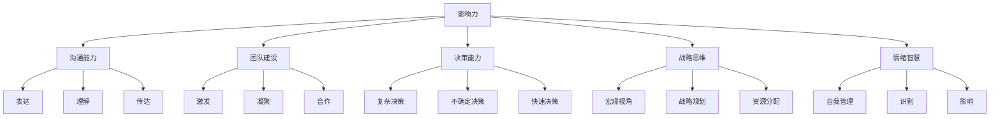

----------------------------------------------------------------

### 2. 领导风格与行为

#### 2.1 领导风格的分类

领导风格是指领导者处理和领导团队的方式。根据不同的领导风格，可以将其分为以下几类：

1. **权威型领导**：领导者拥有绝对的权力，决策和命令由领导者独自做出，团队成员执行领导者的指令。
2. **参与型领导**：领导者鼓励团队成员参与决策过程，尊重团队成员的意见，强调团队合作。
3. **变革型领导**：领导者通过激励和鼓励团队成员，推动组织进行变革和创新。

#### 2.2 不同领导风格的影响

不同的领导风格对团队和组织的影响是不同的：

1. **权威型领导**：能够快速做出决策，但可能导致团队成员的主动性降低，缺乏参与感。
2. **参与型领导**：能够增强团队成员的归属感和责任感，提高团队的整体绩效，但决策过程可能较慢。
3. **变革型领导**：能够推动组织进行创新和变革，激发团队成员的潜力，但需要领导者具备较高的领导力和影响力。

#### 2.3 领导行为的改进策略

为了提高领导效果，领导者可以采取以下策略：

1. **了解团队成员的需求和期望**：领导者应该了解团队成员的个人需求和职业目标，为团队成员提供相应的支持和机会。
2. **建立有效的沟通机制**：领导者需要建立开放和有效的沟通渠道，确保信息的流通和团队成员之间的相互理解。
3. **提供反馈和指导**：领导者应该及时给予团队成员反馈和指导，帮助团队成员提升能力和达成目标。
4. **激励和奖励**：领导者可以通过激励和奖励机制，激发团队成员的工作积极性和创造力。

### 表2-1 不同领导风格及其影响对比

| 领导风格 | 优点 | 缺点 | 影响团队 |
| :------: | :--: | :--: | :------: |
| 权威型   | 快速决策 | 缺乏参与感 | 依赖领导者 |
| 参与型   | 增强归属感 | 决策缓慢 | 团队参与度高 |
| 变革型   | 推动变革和创新 | 高要求 | 团队创新能力强 |

### 图2-1 领导风格实体关系架构 Mermaid 流程图

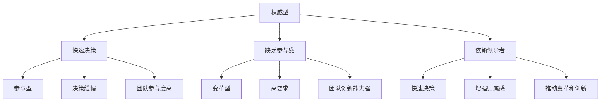

----------------------------------------------------------------

### 3. 沟通技巧

#### 3.1 有效沟通的要素

有效沟通是领导力的重要组成部分。为了实现有效沟通，领导者需要关注以下几个要素：

1. **清晰的表达**：领导者需要用简洁明了的语言传达信息，确保信息被正确理解和接收。
2. **倾听的能力**：领导者需要具备倾听的能力，不仅要听懂他人的观点，还要理解其背后的意图和情感。
3. **反馈与确认**：领导者需要及时给予反馈，确保沟通的双方都对信息的传达和理解达成一致。
4. **适应不同沟通对象**：领导者需要根据不同的沟通对象，调整沟通的方式和内容，确保信息的有效传达。

#### 3.2 沟通障碍与解决策略

沟通障碍是有效沟通的主要障碍。以下是一些常见的沟通障碍及解决策略：

1. **信息过滤**：解决策略包括建立信任和透明度，确保信息能够自由流动。
2. **语言障碍**：解决策略包括使用简单明了的语言，避免专业术语，确保信息被正确理解。
3. **情绪因素**：解决策略包括领导者需要管理好自己的情绪，确保情绪不会影响到沟通的效果。
4. **环境因素**：解决策略包括选择合适的沟通环境和工具，确保沟通的顺利进行。

#### 3.3 领导者如何进行高效沟通

领导者要实现高效沟通，可以采取以下策略：

1. **主动沟通**：领导者需要主动发起沟通，确保信息的及时传达。
2. **多渠道沟通**：领导者需要通过多种渠道进行沟通，确保信息能够被广泛传达。
3. **建立沟通计划**：领导者需要制定明确的沟通计划，确保沟通的内容、方式和时间都有序进行。
4. **培养团队成员的沟通能力**：领导者需要关注团队成员的沟通能力，并提供培训和支持。

### 表3-1 沟通障碍与解决策略对比

| 沟通障碍  | 解决策略         |
| :-------: | :-------------- |
| 信息过滤  | 建立信任和透明度 |
| 语言障碍  | 使用简单明了的语言 |
| 情绪因素  | 管理情绪         |
| 环境因素  | 选择合适的沟通环境和工具 |

### 图3-1 沟通技巧实体关系架构 Mermaid 流程图

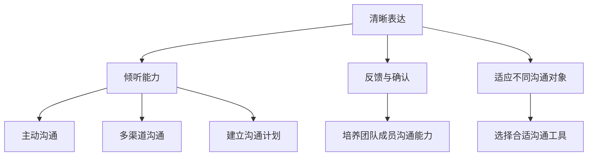

----------------------------------------------------------------

### 4. 团队建设

#### 4.1 团队的定义与类型

团队是由多个成员组成的，共同为实现特定目标而协作的集体。根据团队的结构和功能，可以分为以下几种类型：

1. **功能型团队**：基于职能分工的团队，如开发团队、市场团队等。
2. **项目型团队**：为完成特定项目而组建的团队，成员来自不同部门，具有临时性。
3. **跨部门团队**：由不同部门的成员组成，旨在解决跨部门问题或推动跨部门合作。

#### 4.2 团队建设的关键要素

团队建设是领导力的重要方面。为了建立高效的团队，领导者需要关注以下几个关键要素：

1. **共同目标**：团队需要明确共同的目标，确保团队成员的方向一致。
2. **信任与协作**：团队需要建立信任，鼓励成员之间的协作和合作。
3. **沟通与反馈**：团队需要保持有效的沟通，及时给予反馈，确保团队成员的信息畅通。
4. **激励与奖励**：团队需要建立激励机制，激励团队成员的积极性和创造力。

#### 4.3 如何提升团队凝聚力

提升团队凝聚力是团队建设的重要目标。以下是一些提升团队凝聚力的策略：

1. **团队活动**：组织定期的团队活动，如团队建设训练、团建旅行等，增强团队成员之间的互动和了解。
2. **共同目标**：确保团队有一个共同的目标，激发团队成员的归属感和使命感。
3. **信任建设**：通过开放和诚实的沟通，建立团队成员之间的信任。
4. **激励与认可**：对团队成员的成绩和贡献给予认可和奖励，提升团队成员的自信心和归属感。

### 表4-1 团队建设关键要素与提升策略

| 关键要素 | 提升策略 |
| :------: | :------- |
| 共同目标 | 确定明确目标 |
| 信任与协作 | 建立信任文化 |
| 沟通与反馈 | 保持有效沟通 |
| 激励与奖励 | 设立激励机制 |

### 图4-1 团队建设实体关系架构 Mermaid 流程图

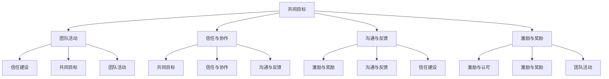

----------------------------------------------------------------

### 5. 决策能力

#### 5.1 决策的定义与类型

决策是指个体或群体在特定情境下，从多个选项中选择一个最佳方案的过程。根据决策的过程和情境，可以分为以下几种类型：

1. **程序化决策**：针对重复性、结构化的问题，按照既定的程序和规则进行决策。
2. **非程序化决策**：针对复杂、不确定的问题，需要创造性地寻找解决方案。
3. **战略决策**：涉及组织的长远目标和整体发展方向，通常由高层领导做出。
4. **战术决策**：涉及组织日常运营的具体问题，通常由中层领导做出。

#### 5.2 决策过程

决策过程通常包括以下几个步骤：

1. **问题识别**：明确决策需要解决的问题或目标。
2. **信息收集**：收集与决策相关的信息，进行分析和评估。
3. **方案评估**：制定多个可能的解决方案，评估每个方案的优缺点。
4. **决策执行**：选择最佳方案，并执行决策。

#### 5.3 决策能力提升策略

为了提升决策能力，领导者可以采取以下策略：

1. **增强信息收集能力**：领导者需要具备敏锐的洞察力，能够快速收集和分析信息。
2. **培养创造性思维**：领导者需要鼓励创新，培养团队在复杂情境下的创造性思维。
3. **提高风险评估能力**：领导者需要能够准确评估每个决策的风险和收益，做出明智的选择。
4. **增强执行能力**：领导者需要确保决策能够得到有效的执行，监督执行过程，及时调整策略。

### 表5-1 决策类型与决策能力提升策略

| 决策类型  | 提升策略           |
| :-------: | :---------------- |
| 程序化决策 | 增强信息收集能力   |
| 非程序化决策 | 培养创造性思维   |
| 战略决策  | 提高风险评估能力   |
| 战术决策  | 增强执行能力       |

### 图5-1 决策过程实体关系架构 Mermaid 流程图

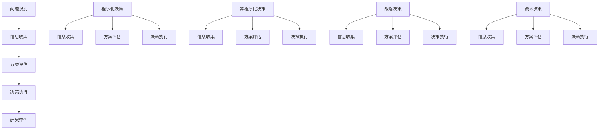

----------------------------------------------------------------

## 第二部分：高阶领导力技能

### 6. 战略思维

#### 6.1 战略思维的概念

战略思维是指领导者从宏观角度审视问题，制定长远规划，并能在复杂和不确定的环境中做出明智决策的能力。战略思维不仅仅是制定目标和计划，更是一种对组织未来发展的洞察力和前瞻性。

#### 6.2 战略思维的构成

战略思维包括以下几个关键组成部分：

1. **市场分析**：领导者需要了解市场的趋势、竞争对手的情况以及客户需求，以便制定合适的战略。
2. **竞争策略**：领导者需要制定有效的竞争策略，以在激烈的市场竞争中保持优势。
3. **资源分配**：领导者需要合理分配资源，确保资源的有效利用和最大化收益。

#### 6.3 战略规划与执行

战略规划是战略思维的核心。以下是一个简单的战略规划与执行过程：

1. **目标设定**：明确组织的长期和短期目标。
2. **战略制定**：根据目标制定具体的战略计划，包括市场进入策略、产品开发计划、资源分配等。
3. **执行监控**：确保战略计划的执行，定期监控进展，并根据实际情况进行调整。

### 表6-1 战略思维关键组成部分

| 组成部分 | 说明 |
| :------: | :--: |
| 市场分析 | 了解市场趋势和竞争对手 |
| 竞争策略 | 制定在市场中的竞争策略 |
| 资源分配 | 确保资源的合理分配 |

### 图6-1 战略思维实体关系架构 Mermaid 流程图

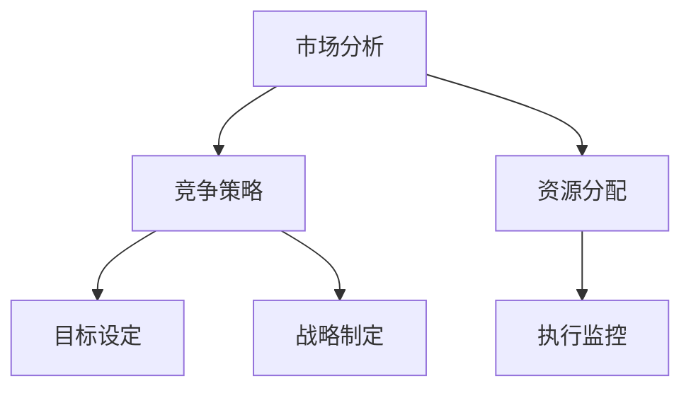

----------------------------------------------------------------

### 7. 创新与变革管理

#### 7.1 创新的重要性

创新是推动组织发展和保持竞争力的关键。它不仅能带来新的产品和服务，还能提升组织的效率和市场地位。在信息技术领域，创新尤为重要，因为技术发展迅速，新的技术和工具不断涌现。

#### 7.2 创新的过程与方法

创新过程通常包括以下几个阶段：

1. **问题识别**：识别当前存在的问题或市场机会。
2. **创意生成**：通过头脑风暴、设计思维等方法，生成多种创意。
3. **创意筛选**：评估和筛选创意，选择最具潜力的创意进行进一步开发。
4. **原型开发**：创建原型，验证创意的可行性。
5. **迭代改进**：根据用户反馈和测试结果，不断改进和优化原型。

创新方法包括：

- **设计思维**：以用户为中心，通过反复迭代，不断改进解决方案。
- **精益创业**：通过最小可行性产品（MVP），快速验证市场假设，并进行调整。

#### 7.3 变革管理的策略

在推动创新的同时，组织也需要进行有效的变革管理，以确保创新能够顺利实施。以下是一些变革管理策略：

1. **沟通与教育**：通过内部沟通和教育，确保员工理解变革的必要性和目标。
2. **领导支持**：领导者需要提供明确的支持和指导，树立榜样。
3. **参与与反馈**：鼓励员工参与变革过程，提供反馈渠道，确保变革能够符合员工的期望和需求。
4. **风险管理**：识别和管理变革过程中的风险，确保变革的顺利进行。

### 表7-1 创新与变革管理策略

| 策略 | 说明 |
| :--: | :--: |
| 沟通与教育 | 确保员工理解变革的必要性和目标 |
| 领导支持 | 提供明确的支持和指导 |
| 参与与反馈 | 鼓励员工参与变革过程 |
| 风险管理 | 识别和管理变革过程中的风险 |

### 图7-1 创新与变革管理实体关系架构 Mermaid 流程图

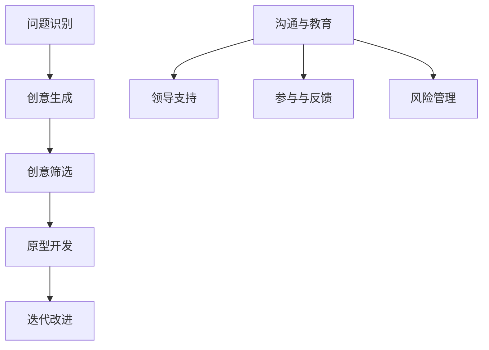

----------------------------------------------------------------

### 8. 领导者的自我提升

#### 8.1 自我认知与反思

自我认知是领导者自我提升的第一步。领导者需要明确自己的优点和缺点，了解自己的价值观、信念和行为模式。通过自我反思，领导者可以识别自己的盲点，发现成长的机会。

#### 8.2 自我提升的策略

为了实现自我提升，领导者可以采取以下策略：

1. **持续学习**：领导者需要不断学习新知识、新技能，以适应快速变化的环境。
2. **寻求反馈**：领导者需要主动寻求他人的反馈，以便了解自己的表现和改进的方向。
3. **设定目标**：领导者需要设定明确的个人和职业目标，并制定实现目标的计划。
4. **实践与反思**：领导者需要在实践中应用所学知识，通过反思和总结不断改进。

#### 8.3 领导者的成长路径

领导者的成长路径通常包括以下几个阶段：

1. **新手阶段**：领导者开始学习和理解领导力的基本概念和实践。
2. **熟练阶段**：领导者能够熟练运用领导力技能，处理日常的领导工作。
3. **精通阶段**：领导者具备深厚的领导力素养，能够应对复杂和不确定的情境。
4. **大师阶段**：领导者成为领域的专家，能够通过领导力影响和改变组织和社会。

### 表8-1 领导者的自我提升策略与成长路径

| 策略           | 说明                                       |
| :------------ | :---------------------------------------- |
| 持续学习       | 不断学习新知识和技能                     |
| 寻求反馈       | 获取他人的反馈和观点                     |
| 设定目标       | 明确个人和职业目标，制定实现计划的策略   |
| 实践与反思     | 在实践中应用知识，通过反思不断改进       |

| 成长路径 | 说明 |
| :------: | :--: |
| 新手阶段 | 学习基础 |
| 熟练阶段 | 熟练运用 |
| 精通阶段 | 应对复杂 |
| 大师阶段 | 影响和改变 |

### 图8-1 领导者的自我提升与成长路径 Mermaid 流程图

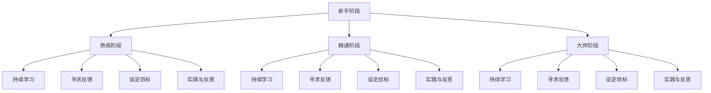

----------------------------------------------------------------

### 9. 情绪智慧

#### 9.1 情绪智慧的概念

情绪智慧，也称为情商（Emotional Intelligence，简称EQ），是指个体识别、理解、管理自己和他人的情绪，并利用这些情绪以促进个人和社会成功的能力。情绪智慧包括以下几个关键要素：

1. **自我意识**：了解自己的情绪，认识情绪对自己的影响。
2. **自我调节**：管理自己的情绪，使其不会对个人决策和表现产生负面影响。
3. **同理心**：理解他人的情绪，站在他人的角度思考问题。
4. **社交技能**：有效沟通和建立人际关系，处理冲突和团队合作。

#### 9.2 情绪智慧的重要性

情绪智慧在领导力中扮演着至关重要的角色。以下是其重要性的一些方面：

1. **团队管理**：情绪智慧的领导者能够更好地管理团队，提高团队效率和凝聚力。
2. **决策制定**：情绪智慧的领导者能够更好地处理复杂和不确定的情况，做出更明智的决策。
3. **领导影响力**：情绪智慧的领导者能够更好地影响和激励他人，提升领导力和影响力。
4. **个人成长**：情绪智慧的领导者能够更好地管理自己的情绪，实现个人成长和职业发展。

#### 9.3 提升情绪智慧的方法

为了提升情绪智慧，领导者可以采取以下方法：

1. **自我反思**：定期反思自己的情绪反应，理解情绪背后的原因。
2. **情绪管理训练**：通过练习情绪管理技巧，如深呼吸、冥想和正念等，提高情绪调节能力。
3. **倾听与同理**：积极倾听他人的意见，培养同理心，理解他人的情绪。
4. **求助专业咨询**：寻求专业心理咨询师的帮助，学习情绪智慧和人际关系管理技巧。

### 表9-1 情绪智慧要素及其重要性

| 要素         | 说明                                                         | 重要性 |
| :----------- | :----------------------------------------------------------- | :----: |
| 自我意识     | 了解自己的情绪，认识情绪对自己的影响                         |   4   |
| 自我调节     | 管理自己的情绪，使其不会对个人决策和表现产生负面影响         |   3   |
| 同理心       | 理解他人的情绪，站在他人的角度思考问题                       |   2   |
| 社交技能     | 有效沟通和建立人际关系，处理冲突和团队合作                   |   1   |

### 图9-1 情绪智慧要素与提升方法 Mermaid 流程图

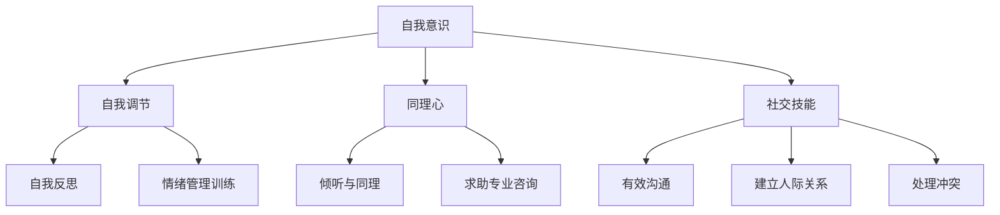

----------------------------------------------------------------

### 10. 人才发展

#### 10.1 人才发展的理念

人才发展是指通过培训、指导、激励等手段，提升员工的能力和潜力，以适应组织发展的需求。人才发展的理念包括以下几个方面：

1. **以人为本**：将员工视为组织最重要的资产，关注员工的成长和发展。
2. **终身学习**：鼓励员工不断学习新知识、新技能，以适应快速变化的环境。
3. **激励与认可**：通过激励和认可，激发员工的工作热情和创造力。
4. **个性化发展**：根据员工的不同特点和需求，制定个性化的成长计划。

#### 10.2 人才培养策略

为了有效进行人才培养，组织可以采取以下策略：

1. **内部培训**：提供内部培训课程，提升员工的专业技能和综合素质。
2. **外部培训**：鼓励员工参加外部培训，拓展视野，学习先进的知识和技能。
3. **导师制度**：建立导师制度，让经验丰富的员工指导新员工，促进知识传承。
4. **岗位轮换**：通过岗位轮换，让员工在不同岗位上积累经验，提升综合素质。
5. **项目参与**：鼓励员工参与重要项目，提供实践机会，提升解决问题的能力。

#### 10.3 人才激励机制

为了激励员工，组织可以采取以下激励机制：

1. **绩效考核**：通过绩效考核，对员工的绩效进行评估，给予相应的奖励。
2. **晋升机会**：为表现优秀的员工提供晋升机会，激励员工积极进取。
3. **薪酬激励**：通过提高薪酬水平，激励员工提高工作绩效。
4. **福利待遇**：提供良好的福利待遇，提升员工的工作满意度和忠诚度。
5. **荣誉奖励**：对做出突出贡献的员工进行表彰和奖励，提升员工的荣誉感和自豪感。

### 表10-1 人才发展理念、策略与激励机制

| 理念       | 说明                                           |
| :--------- | :-------------------------------------------- |
| 以人为本   | 将员工视为组织最重要的资产，关注员工的成长和发展 |
| 终身学习   | 鼓励员工不断学习新知识、新技能，以适应快速变化的环境 |
| 激励与认可 | 通过激励和认可，激发员工的工作热情和创造力       |
| 个性化发展 | 根据员工的不同特点和需求，制定个性化的成长计划   |

| 策略         | 说明                                                         |
| :----------- | :----------------------------------------------------------- |
| 内部培训     | 提供内部培训课程，提升员工的专业技能和综合素质                   |
| 外部培训     | 鼓励员工参加外部培训，拓展视野，学习先进的知识和技能                 |
| 导师制度     | 建立导师制度，让经验丰富的员工指导新员工，促进知识传承               |
| 岗位轮换     | 通过岗位轮换，让员工在不同岗位上积累经验，提升综合素质                   |
| 项目参与     | 鼓励员工参与重要项目，提供实践机会，提升解决问题的能力                   |

| 激励机制 | 说明 |
| :--: | :--: |
| 绩效考核 | 通过绩效考核，对员工的绩效进行评估，给予相应的奖励 |
| 晋升机会 | 为表现优秀的员工提供晋升机会，激励员工积极进取 |
| 薪酬激励 | 通过提高薪酬水平，激励员工提高工作绩效 |
| 福利待遇 | 提供良好的福利待遇，提升员工的工作满意度和忠诚度 |
| 荣誉奖励 | 对做出突出贡献的员工进行表彰和奖励，提升员工的荣誉感和自豪感 |

### 图10-1 人才发展理念、策略与激励机制 Mermaid 流程图

```mermaid
graph TD
    A[以人为本] --> B[内部培训]
    A --> C[外部培训]
    A --> D[导师制度]
    A --> E[岗位轮换]
    A --> F[项目参与]
    B --> G[个性化发展]
    B --> H[终身学习]
    C --> I[激励与认可]
    C --> J[以人为本]
    D --> K[知识传承]
    D --> L[指导新员工]
    E --> M[综合素质提升]
    E --> N[岗位经验积累]
    F --> O[实践机会]
    F --> P[问题解决能力提升]
    G --> Q[员工成长]
    G --> R[个性化发展]
    H --> S[知识更新]
    H --> T[适应环境变化]
    I --> U[工作热情激发]
    I --> V[创造力提升]
    J --> W[员工价值]
    J --> X[团队建设]
    K --> Y[经验分享]
    K --> Z[知识传承]
    L --> AA[新员工成长]
    L --> BB[知识传承]
    M --> CC[岗位适应]
    M --> DD[综合素质提升]
    N --> EE[岗位经验]
    N --> FF[职业发展]
    O --> GG[问题解决]
    O --> HH[创新能力提升]
    P --> II[实践应用]
    P --> JJ[综合能力提升]
    Q --> KK[职业规划]
    Q --> LL[职业发展]
    R --> MM[发展计划]
    R --> NN[个性化发展]
    S --> OO[技术更新]
    S --> PP[知识拓展]
    T --> QQ[环境适应]
    T --> RR[职业发展]
    U --> SS[工作动力]
    U --> TT[职业成就]
    V --> WW[创新思维]
    V --> XX[团队协作]
    W --> YY[员工价值]
    W --> ZZ[团队建设]
    X --> AA[团队协作]
    X --> BB[知识共享]
    Y --> CC[经验分享]
    Y --> DD[知识传承]
    Z --> EE[岗位经验]
    Z --> FF[职业发展]
    G --> GG[学习机会]
    G --> HH[职业发展]
    I --> II[激励机制]
    I --> JJ[工作满意度]
    J --> KK[员工福利]
    J --> LL[职业发展]
    K --> MM[经验传承]
    K --> NN[知识共享]
    L --> OO[技能提升]
    L --> PP[职业发展]
    M --> QQ[培训机会]
    M --> RR[职业发展]
    N --> SS[职业规划]
    N --> TT[职业成就]
    O --> UU[问题解决]
    O --> VW[创新能力]
    P --> XX[实践应用]
    P --> YY[职业发展]
    Q --> ZZ[知识更新]
    Q --> AA[职业发展]
    R --> BB[职业挑战]
    R --> CC[职业成就]
    S --> DD[技能提升]
    S --> EE[职业发展]
    T --> FF[环境适应]
    T --> GG[职业发展]
    U --> HH[工作动力]
    U --> II[职业成就]
    V --> JJ[创新能力]
    V --> KK[团队协作]
    W --> LL[员工价值]
    W --> MM[职业发展]
    X --> NN[知识共享]
    X --> OO[团队建设]
    Y --> PP[实践经验]
    Y --> QQ[职业发展]
    Z --> RR[职业规划]
    Z --> SS[职业成就]
```

----------------------------------------------------------------

### 11. 技术领导力

#### 11.1 技术领导力的定义

技术领导力是指领导者通过技术视野、专业知识和影响力，在技术团队中推动创新、提升效率和实现目标的能力。技术领导力不仅涉及技术的深度理解，还包括团队管理、项目规划和战略决策等多方面的技能。

#### 11.2 技术领导力的要素

技术领导力包括以下几个关键要素：

1. **技术视野**：领导者需要具备前瞻性的技术视野，了解行业发展趋势和新兴技术。
2. **专业能力**：领导者需要在技术领域具备深厚的专业知识，能够解决复杂的技术问题。
3. **团队管理**：领导者需要具备优秀的团队管理能力，能够激发团队成员的潜力，提升团队凝聚力。
4. **沟通协调**：领导者需要具备良好的沟通协调能力，能够与团队成员、管理层和其他部门有效沟通。
5. **战略规划**：领导者需要具备战略规划能力，能够制定长远的科技发展战略，确保组织的竞争力。

#### 11.3 技术领导力的培养策略

为了培养技术领导力，可以采取以下策略：

1. **持续学习**：鼓励领导者不断学习新的技术知识和管理技能，保持技术领先地位。
2. **实践机会**：提供实际项目管理和领导的机会，让领导者能够在实践中提升自己的能力。
3. **导师制度**：建立导师制度，让经验丰富的技术领导者为新任领导者提供指导和帮助。
4. **培训与发展**：组织内部或外部培训，提升领导者的技术和管理能力。
5. **激励与认可**：通过激励和认可，激发领导者的积极性和创造力。

### 表11-1 技术领导力要素与培养策略

| 要素       | 说明                                                   | 培养策略 |
| :--------- | :---------------------------------------------------- | :------- |
| 技术视野   | 了解行业发展趋势和新兴技术                             | 持续学习 |
| 专业能力   | 在技术领域具备深厚的专业知识                           | 实践机会 |
| 团队管理   | 激发团队成员的潜力，提升团队凝聚力                     | 培训与发展 |
| 沟通协调   | 与团队成员、管理层和其他部门有效沟通                     | 持续学习 |
| 战略规划   | 制定长远的科技发展战略，确保组织的竞争力                 | 激励与认可 |

### 图11-1 技术领导力要素与培养策略 Mermaid 流程图

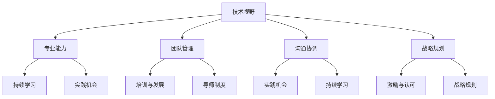

----------------------------------------------------------------

### 12. 新技术趋势

#### 12.1 人工智能与大数据

人工智能（AI）和大数据是当前信息技术领域最热门的两个趋势。人工智能通过模拟人类智能，实现机器学习和自主决策，广泛应用于图像识别、自然语言处理和自动化等方面。大数据则是指海量数据的存储、管理和分析，帮助组织从数据中提取有价值的信息和洞察。

##### 12.1.1 人工智能的应用

人工智能的应用领域广泛，包括：

1. **图像识别**：通过卷积神经网络（CNN）等技术，实现人脸识别、物体检测等功能。
2. **自然语言处理**：利用循环神经网络（RNN）和长短期记忆网络（LSTM），实现语音识别、机器翻译和情感分析。
3. **自动化**：通过强化学习等技术，实现自动化决策和自动化操作，提高生产效率。

##### 12.1.2 大数据的分析

大数据分析包括数据的采集、存储、处理和可视化，主要应用包括：

1. **商业智能**：通过数据挖掘和统计分析，帮助企业做出更明智的商业决策。
2. **风险预测**：利用大数据分析技术，预测市场趋势和潜在风险，提高风险管理能力。
3. **个性化推荐**：通过分析用户行为数据，实现个性化推荐，提升用户体验。

#### 12.2 区块链与加密货币

区块链和加密货币是另一种重要的技术趋势。区块链是一种分布式账本技术，通过加密算法确保数据的不可篡改性和透明性。加密货币则是基于区块链技术的一种数字货币，如比特币（BTC）和以太坊（ETH）。

##### 12.2.1 区块链的应用

区块链的应用包括：

1. **供应链管理**：通过区块链技术，实现供应链的透明化和可追溯性，提高供应链效率。
2. **身份验证**：利用区块链技术，实现身份信息的可信验证，提高信息安全。
3. **智能合约**：通过智能合约，实现自动化执行合同条款，降低交易成本和风险。

##### 12.2.2 加密货币的机遇与挑战

加密货币的机遇包括：

1. **去中心化金融**：加密货币使得金融交易更加便捷和高效，推动了去中心化金融的发展。
2. **投资机会**：加密货币市场波动性大，投资回报潜力高。

加密货币的挑战包括：

1. **监管风险**：各国对加密货币的监管政策不同，存在政策风险。
2. **安全风险**：加密货币交易存在被黑客攻击的风险。

#### 12.3 物联网与边缘计算

物联网（IoT）和边缘计算是未来信息技术的重要方向。物联网通过连接各种设备，实现数据的实时采集和分析。边缘计算则是在靠近数据源的设备上处理数据，减少数据传输的延迟和带宽消耗。

##### 12.3.1 物联网的应用

物联网的应用包括：

1. **智能家居**：通过物联网设备，实现家电的智能控制和自动化管理。
2. **智慧城市**：利用物联网技术，实现城市管理的智能化和高效化。
3. **工业互联网**：通过物联网技术，实现工业设备的联网和智能监控。

##### 12.3.2 边缘计算的优势

边缘计算的优势包括：

1. **实时处理**：在靠近数据源的设备上实时处理数据，减少延迟。
2. **减少带宽消耗**：将数据处理放在边缘设备上，减少对中心服务器的数据传输。
3. **增强安全性**：通过本地处理，减少数据传输过程中被攻击的风险。

### 表12-1 新技术趋势及其应用

| 技术趋势  | 应用领域               | 主要优势 |
| :-------: | :-------------------- | :------- |
| 人工智能   | 图像识别、自然语言处理、自动化 | 实时性、高效性 |
| 大数据     | 商业智能、风险预测、个性化推荐 | 数据洞察、决策支持 |
| 区块链     | 供应链管理、身份验证、智能合约 | 透明性、安全性 |
| 加密货币   | 去中心化金融、投资机会 | 高回报、去中心化 |
| 物联网     | 智能家居、智慧城市、工业互联网 | 实时处理、减少延迟 |
| 边缘计算   | 实时处理、减少带宽消耗、增强安全性 | 本地处理、高效处理 |

### 图12-1 新技术趋势及其应用 Mermaid 流程图

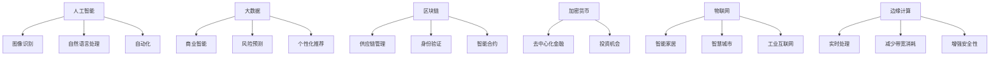

----------------------------------------------------------------

### 13. 技术创业

#### 13.1 技术创业的机会

技术创业是指在信息技术领域创建新企业的过程。随着人工智能、大数据、区块链等新兴技术的快速发展，技术创业迎来了前所未有的机会：

1. **创新产品与服务**：新技术为企业提供了创造创新产品和服务的机会，如基于人工智能的医疗诊断系统、基于区块链的供应链解决方案等。
2. **市场潜力**：信息技术行业的市场潜力巨大，随着数字化转型的加速，企业对新技术解决方案的需求持续增长。
3. **资本支持**：风险投资和政府支持为技术创业提供了资金支持，帮助初创企业快速发展。

#### 13.2 技术创业的挑战

尽管技术创业充满机会，但也面临诸多挑战：

1. **技术风险**：技术创业企业面临技术迭代快、不确定性高的风险，技术不成熟可能导致项目失败。
2. **市场风险**：市场需求变化快，技术创业企业需要快速适应市场变化，否则可能失去市场优势。
3. **人才短缺**：技术创业企业往往需要高技能人才，但招聘和留住人才是企业的难题。

#### 13.3 技术创业者的素养

为了克服这些挑战，技术创业者需要具备以下素养：

1. **技术视野**：了解新技术发展趋势，能够把握技术创业的机会。
2. **商业思维**：具备商业敏锐度，能够将技术创新转化为商业价值。
3. **领导能力**：能够带领团队，激发团队成员的潜力，共同应对挑战。
4. **适应能力**：快速适应市场和技术变化，灵活调整战略。

### 表13-1 技术创业的机会与挑战及创业者素养

| 项目     | 说明                                                         | 挑战                                       | 创业者素养          |
| :-------: | :----------------------------------------------------------- | :--------------------------------------- | :----------------- |
| 技术机会   | 新技术为企业提供了创造创新产品和服务的机会                   | 技术风险、市场风险                         | 技术视野、商业思维  |
| 市场潜力   | 信息技术行业的市场潜力巨大，企业对新技术解决方案的需求持续增长 | 市场需求变化、竞争激烈                     | 领导能力、适应能力 |
| 资本支持   | 风险投资和政府支持为技术创业提供了资金支持                   | 资金需求大、投资回报不确定                   | 领导能力、商业思维 |
| 技术风险   | 技术迭代快、不确定性高                                       | 技术研发成本高、产品推广困难                 | 技术视野、适应能力 |
| 市场风险   | 市场需求变化快，技术创业企业需要快速适应市场变化               | 市场竞争激烈、用户需求变化                   | 适应能力、商业思维 |
| 人才短缺   | 技术创业企业往往需要高技能人才，但招聘和留住人才是企业的难题   | 人才流失、招聘成本高                       | 领导能力、技术视野 |

### 图13-1 技术创业机会与挑战及创业者素养 Mermaid 流程图

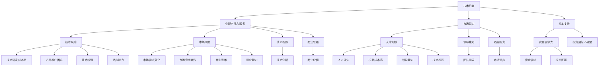

----------------------------------------------------------------

### 14. 国际化视野

#### 14.1 国际化的重要性

国际化视野对于技术领袖来说至关重要。随着全球化的深入发展，信息技术行业越来越依赖于国际市场的拓展。国际化不仅为企业提供了更广阔的市场空间，还带来了技术交流、资源整合和品牌提升的机会。

#### 14.2 国际化战略

为了实现国际化，企业可以采取以下战略：

1. **市场研究**：深入了解目标市场的需求、文化特点和竞争态势，制定有针对性的市场进入策略。
2. **产品本地化**：根据目标市场的文化、法律和消费习惯，对产品进行本地化改造，提高市场接受度。
3. **人才国际化**：招聘和培养具有国际视野和跨文化沟通能力的人才，提升企业的国际竞争力。
4. **国际化合作**：与全球领先企业建立战略合作伙伴关系，共享资源，共同开拓市场。

#### 14.3 国际化领导者的素质

具备国际化视野的领导者需要具备以下素质：

1. **跨文化沟通能力**：能够有效沟通和协调不同文化背景的团队成员，促进团队协作。
2. **市场洞察力**：具备敏锐的市场洞察力，能够把握全球市场的机遇和挑战。
3. **风险管理能力**：能够识别和管理国际化业务中的风险，确保业务的稳定发展。
4. **领导力**：具备卓越的领导力，能够带领团队在全球化背景下实现目标。

### 表14-1 国际化的重要性、战略与领导者素质

| 内容       | 说明                                                         |
| :--------- | :----------------------------------------------------------- |
| 国际化重要性 | 提供更广阔的市场空间、技术交流、资源整合和品牌提升机会       |
| 国际化战略   | 市场研究、产品本地化、人才国际化、国际化合作                 |
| 领导者素质   | 跨文化沟通能力、市场洞察力、风险管理能力、领导力           |

### 图14-1 国际化视野与领导者素质 Mermaid 流程图

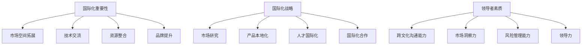

----------------------------------------------------------------

### 15. 持续学习与适应

#### 15.1 持续学习的理念

在快速变化的技术环境中，持续学习是技术领袖保持竞争力的关键。持续学习的理念强调：

1. **知识更新**：随着技术不断进步，知识迅速过时。技术领袖需要不断学习新知识、新技能，以保持领先地位。
2. **能力提升**：通过持续学习，技术领袖能够不断提升自己的专业能力和领导力，应对复杂和不确定的挑战。
3. **适应变化**：持续学习帮助技术领袖适应快速变化的环境，把握市场机遇，应对技术变革。

#### 15.2 学习资源与工具

为了实现持续学习，技术领袖可以借助以下资源与工具：

1. **在线课程**：如Coursera、edX等平台提供了丰富的技术课程，涵盖人工智能、大数据、区块链等热门领域。
2. **专业书籍**：阅读专业书籍是获取深度知识的重要途径，如《深度学习》、《人工智能：一种现代的方法》等。
3. **技术社区**：如GitHub、Stack Overflow等，技术领袖可以在这里获取最新的技术动态，解决问题，交流经验。
4. **研讨会和会议**：参加技术研讨会和会议，与技术专家和同行交流，了解行业趋势和前沿技术。

#### 15.3 领导者的学习策略

为了有效进行持续学习，技术领袖可以采取以下策略：

1. **制定学习计划**：明确学习目标，制定详细的学习计划，确保学习进度和效果。
2. **实践应用**：将所学知识应用于实际工作中，通过实践来巩固和提升技能。
3. **导师制度**：寻求经验丰富的导师指导，通过导师的经验和见解，加速个人成长。
4. **建立学习小组**：与同行组建学习小组，共同学习、讨论和分享经验，互相激励。

### 表15-1 持续学习的理念、资源与工具及学习策略

| 内容     | 说明                                             |
| :------- | :----------------------------------------------- |
| 知识更新 | 随着技术进步，知识迅速过时                       |
| 能力提升 | 通过持续学习，提升专业能力和领导力               |
| 适应变化 | 帮助技术领袖适应快速变化的环境，把握市场机遇   |
| 学习资源 | 在线课程、专业书籍、技术社区、研讨会和会议       |
| 学习策略 | 制定学习计划、实践应用、导师制度、建立学习小组 |

### 图15-1 持续学习理念与学习策略 Mermaid 流程图

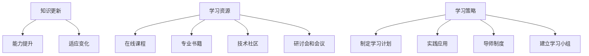

----------------------------------------------------------------

## 附录

### 附录 A：领导力发展资源

#### A.1 相关书籍推荐

1. 《领导力五项修炼》：作者斯蒂芬·罗宾斯，详细介绍了领导力的核心要素和实践方法。
2. 《激发创新力》：作者戴维·凯利，探讨如何通过设计思维激发创新。
3. 《变革之舞》：作者约翰·P·科特，分析如何成功推动组织变革。

#### A.2 领导力培训课程

1. Coursera 上的《领导力与团队管理》：提供全面的领导力知识和实践技能。
2. LinkedIn Learning 的《高级领导力》：涵盖高级领导技巧，如战略规划、团队建设等。
3. Harvard Business Review 的在线课程：涵盖商业和管理领域的最新研究和实践。

#### A.3 领导力发展网络

1. International Leadership Association（ILA）：全球领导力专业协会，提供丰富的资源和网络。
2. Leadership Network：专注于企业领导力发展，提供在线课程、研讨会和网络研讨会。
3. The Young President’s Organization（YPO）：为年轻的商业领袖提供交流和发展的平台。

### 附录 B：技术领袖案例研究

#### B.1 案例研究1：李开复

**背景**：李开复是一位著名的人工智能专家和企业家，曾任微软亚洲研究院创始人、谷歌中国研究院创始人。

**问题背景**：李开复在人工智能领域拥有深厚的技术背景和丰富的管理经验，但如何将技术优势转化为商业成功，成为他面临的主要挑战。

**问题解决**：李开复通过创办创新工场，投资和孵化多个高科技项目，如无人机、人工智能等，成功将技术优势转化为商业价值。

**边界与外延**：李开复的领导风格和决策过程如何影响创新工场的运营和发展，以及他在技术创业领域的成功经验。

#### B.2 案例研究2：谢尔盖·布林

**背景**：谢尔盖·布林是谷歌的联合创始人，被誉为全球最杰出的技术领袖之一。

**问题背景**：谷歌在成长过程中面临技术竞争、市场扩张和法律挑战，如何保持竞争优势成为布林面临的主要问题。

**问题解决**：布林通过推行“不作恶”原则，推动技术创新，建立全球市场，成功将谷歌打造成全球最大的搜索引擎公司。

**边界与外延**：布林在技术创新和商业战略上的决策过程，以及他对谷歌文化和价值观的塑造。

#### B.3 案例研究3：杰夫·贝索斯

**背景**：杰夫·贝索斯是亚马逊的创始人，被誉为现代商业领袖的代表。

**问题背景**：亚马逊在成立初期面临市场认知低、技术挑战大等问题，如何建立核心竞争力成为贝索斯面临的主要挑战。

**问题解决**：贝索斯通过不断推出创新产品和服务，如亚马逊Prime、AWS云计算等，成功将亚马逊打造成为全球最大的电子商务公司。

**边界与外延**：贝索斯的领导哲学、决策过程和商业模式创新，以及他对亚马逊文化和价值观的塑造。

