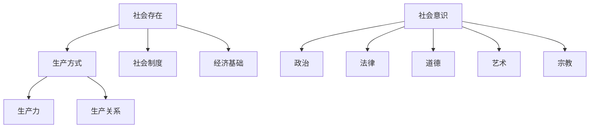
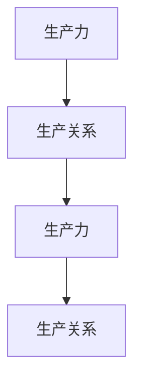
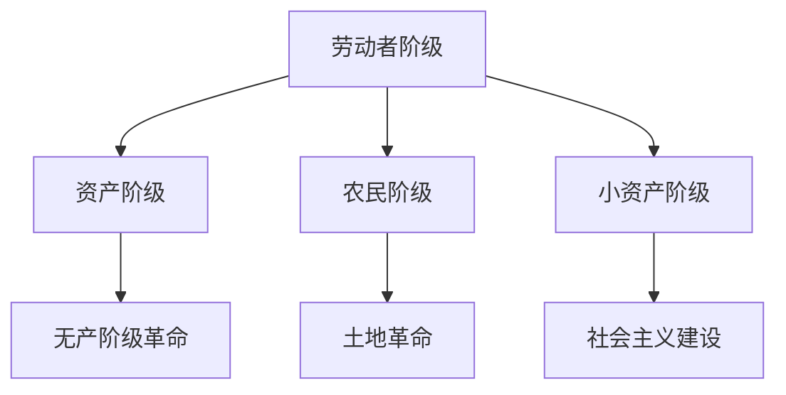
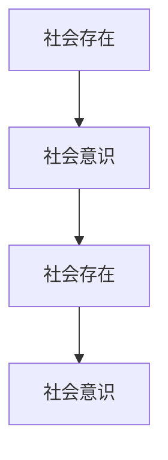
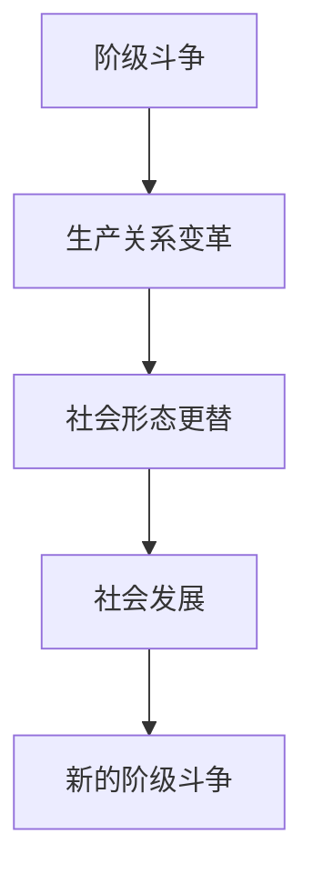
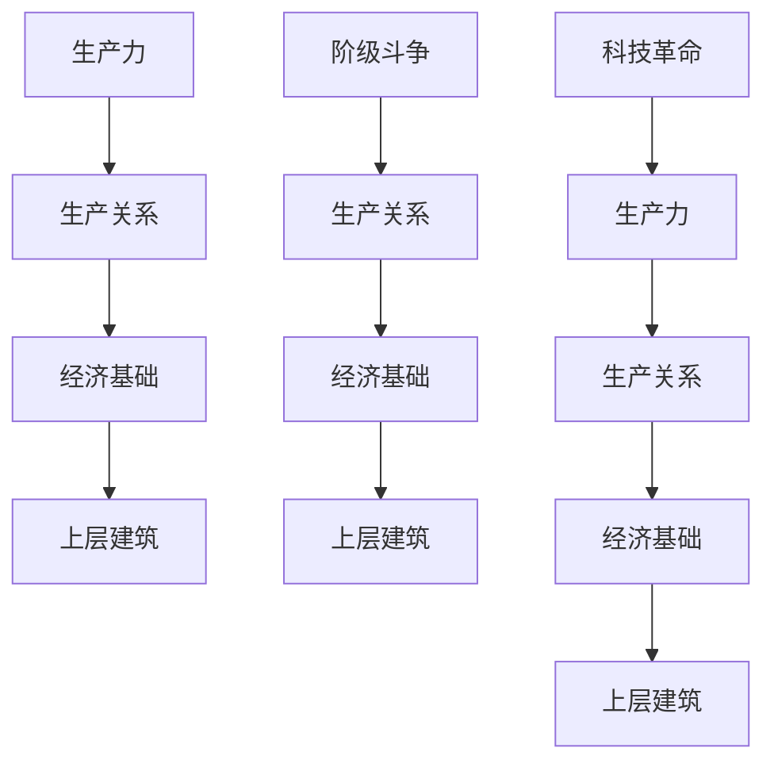

                 

### 引言

马克思与恩格斯，这两位伟大的思想家，共同缔造了唯物史观这一历史唯物主义的理论体系。唯物史观不仅深刻地揭示了人类社会发展的内在规律，而且为社会主义运动提供了坚实的理论基础。本文旨在通过逻辑清晰、结构紧凑的论述，对马克思与恩格斯的唯物史观进行系统解读，以便让读者能够深入理解这一理论的重要性和应用价值。

首先，我们将简要介绍马克思与恩格斯的生平与思想背景，为后续内容打下基础。接下来，我们将概述马克思主义哲学与唯物史观的基本概念，为读者提供对整个理论体系的初步认识。

然后，本文将详细分析马克思与恩格斯的唯物史观体系，包括社会存在与社会意识的关系、生产方式与生产力发展、阶级斗争与社会变革等方面。通过对这些核心概念的深入剖析，我们将揭示唯物史观的基本原理和内涵。

随后，我们将探讨马克思与恩格斯的唯物史观在历史分析中的应用，分析历史唯物主义的基本原理，以及生产力与生产关系、经济基础与上层建筑等关键因素在历史发展中的作用。

接着，本文将探讨马克思与恩格斯的唯物史观与现代社会的关联，分析现代社会的发展趋势，并探讨唯物史观在现代社会中的指导意义。

随后，我们将讨论马克思与恩格斯的唯物史观的理论创新与发展，分析唯物史观的理论创新和当代意义，以及其在马克思主义体系中的地位。

最后，本文将总结马克思与恩格斯的唯物史观的基本原理，讨论其在当代社会的价值，并给出结论。

通过上述步骤的逐步分析，本文希望能够帮助读者全面、深入地理解马克思与恩格斯的唯物史观，并认识到这一理论在当代社会中的重要性和指导作用。

### 1.1 马克思与恩格斯的生平与思想背景

卡尔·马克思（Karl Marx，1818-1883）和弗里德里希·恩格斯（Friedrich Engels，1820-1895）是19世纪最杰出的思想家，他们的合作不仅塑造了现代社会主义理论，也为人类历史提供了独特的视角。马克思出生于普鲁士的特里尔，恩格斯则出生于德国巴门的工业家庭。两位思想家的家庭背景虽然不同，但都在青年时期接触到了德国古典哲学，特别是黑格尔和费尔巴哈的哲学思想。

马克思于1841年完成了他在波恩大学的哲学博士论文《德谟克里特的自然哲学和伊壁鸠鲁的自然哲学的差别》，并在后来的柏林大学深入研究了黑格尔哲学。这一时期，马克思的哲学思想逐渐转向唯物主义，特别是对黑格尔的辩证法进行了批判性的继承和改造。恩格斯也在柏林大学期间接触到了黑格尔哲学，并通过阅读马克思的著作，两人逐渐形成了思想上的共鸣。

1844年，马克思和恩格斯在巴黎相识，并开始合作写作。他们在《德法年鉴》上发表了多篇论文，标志着他们共同思想体系的初步形成。这一年，马克思撰写了《经济学哲学手稿》，其中首次提出了历史唯物主义的基本思想，即社会存在决定社会意识。这一思想成为马克思主义哲学的核心。

1847年，马克思和恩格斯加入了共产主义者同盟，并在同盟的纲领性文件《共产党宣言》中详细阐述了他们的观点。《共产党宣言》不仅成为国际工人运动的重要纲领，也奠定了马克思主义理论的基本框架。

1850年代，马克思和恩格斯分别移居伦敦，开始深入研究资本主义经济体系和政治经济学。马克思在这一时期写下了《资本论》的前两卷，该书通过分析资本主义的生产方式，揭示了资本积累和剥削的规律。恩格斯则对马克思的思想进行了深入的理论探讨，并撰写了《家庭、私有制和国家的起源》等著作，进一步丰富了唯物史观的理论体系。

马克思和恩格斯的思想不仅在理论上具有深刻性，也在实践中具有指导意义。他们积极参与国际工人运动，支持各国的革命斗争。例如，他们在巴黎公社期间提供了重要的理论支持，并分析了公社失败的原因。

总之，马克思和恩格斯的生平与思想背景是他们能够共同缔造唯物史观的重要基础。通过深入研究和批判性思考，他们不仅提出了新的哲学观点，也为后来的社会主义运动提供了理论指导。他们的合作不仅产生了丰富的思想成果，也为人类历史的研究提供了独特的视角。

### 1.2 马克思主义哲学与唯物史观概述

马克思主义哲学是马克思主义理论体系的哲学基础，是马克思和恩格斯对世界和历史的根本看法。唯物史观作为马克思主义哲学的核心部分，深刻地揭示了人类社会发展的内在规律。马克思主义哲学的基本特征可以概括为唯物主义和历史唯物主义。

唯物主义是马克思主义哲学的根本立场，主张物质世界是客观存在的，意识是物质的反映。与唯心主义相对立，唯物主义认为物质决定意识，这一观点贯穿于马克思主义哲学的各个方面。历史唯物主义则是唯物主义在历史领域的发展和应用，主张社会存在决定社会意识，生产方式是社会发展的基础。

唯物史观的基本原理主要包括以下几个方面：

1. **社会存在与社会意识的关系**：唯物史观认为，社会存在决定社会意识。社会存在是指物质生活条件，包括生产方式、社会制度、经济基础等。社会意识则包括政治、法律、道德、艺术、宗教等意识形态。社会存在是社会意识的基础，社会意识是社会存在的反映。

2. **生产方式与生产力发展**：生产方式是人类社会存在和发展的基础，包括生产力（即劳动者的劳动能力和生产资料的技术水平）和生产关系（即人们在生产过程中的相互关系）。生产力的发展推动生产关系的变革，进而影响社会形态的演变。

3. **阶级斗争与社会变革**：阶级斗争是推动社会历史发展的动力。在阶级社会中，不同阶级之间的矛盾和斗争是社会变革的主要动力。唯物史观认为，阶级斗争的最终目的是实现社会的公平和正义。

4. **历史发展的规律**：唯物史观认为，社会历史发展具有客观规律性，这种规律性表现在生产方式的演变、社会形态的更替和历史发展的阶段性。

唯物史观在马克思主义理论体系中具有重要的地位。它不仅为马克思主义的政治经济学、科学社会主义和历史学提供了理论基础，也为国际工人运动和社会主义实践提供了指导。唯物史观强调历史发展的客观规律性，反对历史唯心主义的主观随意性，为研究社会历史提供了科学的方法论。

总之，马克思主义哲学与唯物史观是理解社会历史发展的重要理论工具。通过深入研究和理解这些基本原理，我们可以更好地把握社会历史发展的规律，为实现社会的公平和正义提供理论支持。

### 1.3 马克思与恩格斯的唯物史观体系

马克思与恩格斯的唯物史观体系是一个完整且系统性的理论框架，其核心在于对社会存在与社会意识、生产方式与生产力发展、阶级斗争与社会变革等方面的深刻揭示。这一理论体系不仅具有哲学的高度，也具有实证分析的基础，为我们理解社会发展的内在规律提供了重要指导。

**1.3.1 社会存在与社会意识的关系**

马克思和恩格斯认为，社会存在决定社会意识。这一观点是对历史唯物主义的核心阐述。社会存在主要指的是物质生活条件，包括生产方式、社会制度、经济基础等。这些物质条件是社会存在和发展的基础，直接决定了人们的经济活动和生产关系。社会意识则包括政治、法律、道德、艺术、宗教等意识形态，是社会存在的反映和表现。

社会存在与社会意识的关系可以用一个简单的图来表示：

在这个图中，A代表社会存在，B、C、D代表社会存在的具体内容，即生产方式、社会制度和经济基础。这些因素相互作用，共同构成了社会的物质生活条件。E和F则分别代表生产力（劳动者的劳动能力和生产资料的技术水平）和生产关系（人们在生产过程中的相互关系）。社会存在通过生产力与生产关系的相互作用，进一步影响社会意识（G），即政治、法律、道德、艺术和宗教等方面的意识形态。社会意识又反过来影响社会存在，从而形成一个动态的反馈循环。

**1.3.2 生产方式与生产力发展**

生产方式是唯物史观的另一个核心概念。生产方式包括生产力（E）和生产关系（F）。生产力是指人类在生产过程中所运用的各种物质和技术力量，包括劳动者、生产工具和原材料等。生产关系则是指人们在生产过程中的相互关系，包括所有制关系、分配关系和交换关系等。

生产力的发展是推动社会历史发展的重要动力。随着生产力的发展，生产关系也会发生相应的变革。例如，在农业社会，生产力以土地和劳动力为主，生产关系以封建土地所有制为主；而在工业社会，生产力以机器和资本为主，生产关系以资本主义所有制为主。这种生产力和生产关系的矛盾运动，推动了社会形态的更替。

下面是一个简单的生产力与生产关系的辩证关系图：

在这个图中，A和B分别代表生产力和生产关系。随着生产力的发展（A），生产关系也会发生相应的变革（B），这种变革又进一步促进了生产力的发展（C），从而形成了一个螺旋上升的辩证过程。

**1.3.3 阶级斗争与社会变革**

阶级斗争是唯物史观中一个重要的概念。在阶级社会中，不同阶级之间的矛盾和斗争是社会历史发展的主要动力。马克思和恩格斯认为，阶级斗争的最终目的是实现社会的公平和正义。

在马克思主义的理论体系中，阶级斗争可以通过以下图示来表示：

在这个图中，A代表劳动者阶级，B代表资产阶级，C代表农民阶级，D代表小资产阶级。这些阶级之间的矛盾和斗争（E、F、G）构成了阶级斗争的主要形式。通过阶级斗争，劳动者阶级最终能够实现社会的公平和正义，推动社会形态的更替。

**1.3.4 历史唯物主义的基本原理**

历史唯物主义是马克思和恩格斯对历史发展规律的科学阐述。历史唯物主义认为，社会历史发展具有客观规律性，这种规律性表现在生产方式的演变、社会形态的更替和历史发展的阶段性。

历史唯物主义的基本原理可以总结为以下几点：

1. **社会存在决定社会意识**：社会存在（物质生活条件）是社会意识（意识形态）的基础和决定因素。
2. **生产方式决定生产关系**：生产方式的变革推动生产关系的变革，进而影响社会形态的演变。
3. **阶级斗争推动社会变革**：阶级斗争是推动社会历史发展的主要动力，不同阶级之间的矛盾和斗争是历史发展的动力源泉。
4. **历史发展的规律性**：社会历史发展具有客观规律性，这种规律性表现在生产方式的演变、社会形态的更替和历史发展的阶段性。

通过上述分析，我们可以看到，马克思与恩格斯的唯物史观体系是一个完整、系统且深刻的理论框架，它为我们理解社会发展的内在规律提供了重要的理论指导。这一理论不仅具有哲学的高度，也具有实证分析的基础，为我们分析和解决社会问题提供了科学的方法论。

### 1.3.1 社会存在与社会意识的关系

在马克思与恩格斯的唯物史观体系中，社会存在与社会意识的关系占据着核心地位。马克思和恩格斯认为，社会存在决定社会意识，这一观点是对历史唯物主义的核心阐述。

**社会存在决定社会意识**

社会存在是指人们的物质生活条件，包括生产方式、社会制度、经济基础等。生产方式是社会存在的核心，它包括生产力（劳动者的劳动能力和生产资料的技术水平）和生产关系（人们在生产过程中的相互关系）。社会制度和经济基础则是在生产方式的基础上形成的，包括所有制形式、分配制度、法律制度等。

社会意识则是指人们的思想、观念、价值观、法律、道德、宗教等意识形态。社会意识是社会存在的反映，它受到社会存在的决定和制约。马克思和恩格斯认为，社会意识不是抽象的存在，而是具体的社会存在条件在人们头脑中的反映。

**社会意识对社会存在的反作用**

尽管社会存在决定社会意识，但社会意识也对社会存在具有反作用。社会意识可以通过意识形态的形式，影响和引导社会存在的发展。例如，先进的思想观念可以促进社会的进步，而落后的思想观念则可能阻碍社会的发展。

**社会存在与社会意识的相互作用**

社会存在与社会意识之间的关系是一个动态的、相互作用的过程。一方面，社会存在决定社会意识，社会存在的变化会引起社会意识的变化。另一方面，社会意识对社会存在也具有反作用，先进的社会意识可以推动社会存在的进步，而落后的社会意识则可能阻碍社会的发展。

下面是一个简单的社会存在与社会意识相互作用的关系图：

在这个图中，A和B分别代表社会存在和社会意识，它们之间存在着双向箭头，表示它们之间的相互作用。社会存在的变化（A）会引起社会意识的变化（B），而社会意识的变化（B）又会进一步影响社会存在（C），从而形成一个动态的反馈循环。

**社会存在与社会意识的辩证关系**

马克思和恩格斯的社会存在与社会意识的辩证关系揭示了社会历史发展的内在规律。他们认为，社会存在和社会意识之间的关系是辩证的，即它们既相互区别又相互联系，相互影响、相互作用。

1. **区别**：社会存在是社会意识的基础，是社会意识的物质内容；社会意识是社会存在的反映，是社会存在的意识形态表现形式。
2. **联系**：社会存在决定社会意识，但社会意识也对社会存在具有反作用；社会存在和社会意识相互影响、相互作用，共同推动社会历史的发展。

总之，马克思与恩格斯的唯物史观通过社会存在与社会意识的辩证关系，揭示了社会历史发展的内在规律，为我们理解社会现象和社会问题提供了科学的方法论。

### 1.3.2 生产方式与生产力发展

在马克思与恩格斯的唯物史观体系中，生产方式与生产力发展是理解社会历史演变的关键概念。生产方式包括生产力（即劳动者的劳动能力和生产资料的技术水平）和生产关系（即人们在生产过程中的相互关系）。生产力的发展不仅推动生产关系的变革，而且对社会形态的更替产生深远影响。

**生产方式的定义**

生产方式是指人类在生产活动中所采用的方法和技术，它包括生产力和生产关系。生产力是生产过程中物质要素的集合，主要包括劳动者的劳动技能、生产资料（如工具、设备、原材料）和自然资源。生产关系则是指人们在生产过程中的相互作用和联系，包括所有权关系、分配关系和交换关系。

生产方式是连接生产力和生产关系的桥梁，是生产力发挥作用的实际形式。一个社会的生产方式决定了该社会的经济结构和生产关系，进而影响其社会制度、文化和意识形态。

**生产力的发展与变革**

生产力的发展是推动社会历史进步的关键因素。随着生产技术的进步和生产工具的改进，生产力水平不断提升。例如，农业社会的生产力以手工劳动和简单工具为主，而工业社会的生产力则依赖于机器和自动化技术。以下是生产力发展的一些关键阶段：

1. **农业社会**：生产力以手工劳动为主，生产工具主要是锄头、犁等。农业社会的生产力水平相对较低，生产效率有限。
2. **工业社会**：工业革命标志着生产力的大幅提升，机器和大规模生产成为主流。生产工具和技术的进步显著提高了生产效率，推动了经济的快速发展。
3. **信息社会**：随着计算机和互联网技术的普及，生产力再次迎来革命。信息技术和数字经济成为推动生产力发展的重要动力，生产方式变得更加智能化和全球化。

**生产方式与生产关系的关系**

生产方式不仅包括生产力，还包括生产关系。生产关系是人们在生产过程中形成的相互关系，它决定了生产资料的所有权和产品的分配方式。生产关系与生产力之间存在辩证关系：

1. **生产力决定生产关系**：随着生产力的发展，生产关系必须相应地调整，以适应新的生产力水平。例如，工业革命后，资本主义生产关系逐渐取代封建主义生产关系。
2. **生产关系对生产力具有反作用**：生产关系可能会阻碍或促进生产力的发展。当生产关系适应生产力时，它能够促进生产力的提升；当生产关系不适应生产力时，它可能会成为生产力发展的障碍。

**生产方式变革的例子**

历史上，生产方式的变革是推动社会变革的重要动力。以下是几个生产方式变革的例子：

1. **农业革命**：农业革命通过引入新的农业技术和工具，显著提高了农业生产效率，改变了社会结构，推动了城市化进程。
2. **工业革命**：工业革命通过机器生产和大规模工厂系统，彻底改变了生产方式，推动了工业化进程，引发了社会经济结构和阶级关系的重大变革。
3. **信息革命**：信息革命通过信息技术和互联网的普及，改变了传统生产和消费模式，推动了全球化进程，促进了经济和社会的快速发展。

总之，生产方式与生产力发展是马克思与恩格斯唯物史观体系中的重要概念，它们揭示了社会历史演变的内在规律。通过分析生产方式的变革，我们可以更好地理解社会变革的机制和历史发展的趋势。

### 1.3.3 阶级斗争与社会变革

在马克思与恩格斯的唯物史观中，阶级斗争是社会变革的核心动力。阶级斗争不仅揭示了社会历史发展的内在规律，也为理解不同社会形态的更替提供了关键视角。马克思和恩格斯认为，阶级斗争是推动社会历史进步的主要力量，它贯穿于人类社会的发展历程。

**阶级斗争的历史作用**

阶级斗争在历史中的作用主要体现在以下几个方面：

1. **生产关系的变革**：阶级斗争推动了生产关系的变革，这是社会历史发展的关键因素。在封建社会，地主阶级和农民阶级之间的矛盾导致了生产关系的变革，资本主义生产关系逐渐取代封建主义生产关系。在资本主义社会，工人阶级和资产阶级之间的斗争推动了生产关系的进一步变革。

2. **社会形态的更替**：阶级斗争是不同社会形态更替的重要动力。封建社会的衰落和资本主义的兴起，都是阶级斗争的产物。随着生产力的不断发展，新的生产关系和阶级关系不断出现，推动社会形态的更替。

3. **社会公平的实现**：阶级斗争的最终目标是实现社会的公平和正义。通过阶级斗争，被压迫阶级能够争取自身的权益，推动社会的公平和正义。马克思和恩格斯认为，只有通过阶级斗争，才能实现社会主义和共产主义的理想社会。

**社会变革的必然性与阶段性**

社会变革具有必然性和阶段性。马克思和恩格斯认为，社会变革的必然性源于生产力和生产关系的矛盾。当生产力的发展超越了现有的生产关系时，生产关系就会成为生产力发展的障碍，从而引发社会变革。

社会变革的阶段性则表现在不同历史时期的生产方式和阶级斗争特征上。例如，在封建社会，地主阶级和农民阶级之间的斗争是主要形式；在资本主义社会，工人阶级和资产阶级之间的斗争成为主导。每个历史阶段的社会变革都有其特定的历史背景和动力机制。

**阶级斗争与社会发展的辩证关系**

阶级斗争与社会发展之间存在辩证关系。一方面，阶级斗争是社会发展的重要动力，它推动了生产关系的变革和社会形态的更替。另一方面，社会的发展又为阶级斗争提供了新的内容和形式。例如，在工业革命之后，资本主义生产关系的扩展导致了全球范围内的阶级斗争，从而推动了世界历史的进步。

下面是一个简单的阶级斗争与社会发展的辩证关系图：

在这个图中，A代表阶级斗争，B代表生产关系变革，C代表社会形态更替，D代表社会发展，E代表新的阶级斗争。这个循环表示阶级斗争与社会发展的相互影响和相互作用，形成了一个动态的辩证过程。

总之，马克思与恩格斯的唯物史观通过阶级斗争的概念，深刻揭示了社会历史发展的内在规律。阶级斗争不仅是推动社会变革的主要动力，也是实现社会公平和正义的重要途径。通过对阶级斗争与社会变革关系的分析，我们可以更好地理解社会历史的发展趋势和方向。

### 1.3.4 历史唯物主义的基本原理

历史唯物主义是马克思和恩格斯创立的一种哲学观点，它是唯物史观的集中体现，对理解社会历史发展具有深远的影响。历史唯物主义的基本原理主要包括社会存在决定社会意识、生产方式的演变、社会形态的更替和历史发展的规律性。

**社会存在决定社会意识**

社会存在决定社会意识是历史唯物主义的核心观点之一。社会存在指的是人们的物质生活条件，包括生产方式、社会制度、经济基础等。社会意识则包括政治、法律、道德、艺术、宗教等意识形态。马克思和恩格斯认为，社会意识是社会存在的反映，是社会存在的意识形态表现。

社会存在决定社会意识的原因在于：

1. **生产方式**：生产方式是社会存在的核心，它决定了人们的生活方式和经济基础。不同的生产方式会产生不同的社会意识。例如，农业社会的生产方式会导致封建主义的社会意识，而资本主义的生产方式则会产生资本主义的社会意识。

2. **社会制度**：社会制度是在生产方式的基础上形成的，它决定了社会的政治、法律、文化等方面。社会制度的不同也会导致不同的社会意识。例如，封建社会的制度会导致封建主义的社会意识，而社会主义社会的制度则会促进社会主义的社会意识。

3. **经济基础**：经济基础是社会存在的物质基础，它决定了社会的生产关系和生产方式。经济基础的不同会导致不同的社会意识。例如，资本主义的经济基础会导致资本主义的社会意识，而社会主义的经济基础则会促进社会主义的社会意识。

**生产方式的演变**

生产方式的演变是历史唯物主义的基本原理之一。生产方式包括生产力（即劳动者的劳动能力和生产资料的技术水平）和生产关系（即人们在生产过程中的相互关系）。生产力的提高和生产关系的变革是推动社会历史发展的重要动力。

1. **生产力的演变**：生产力的演变体现在生产工具、生产技术和生产组织方式的不断进步。例如，从手工劳动到机械化生产，再到自动化生产，生产力的提高推动了生产方式的变革。

2. **生产关系的变革**：生产关系的变革是指人们在生产过程中相互关系的变化。随着生产力的发展，生产关系也会发生相应的变化。例如，从封建社会的地主与农民的剥削关系，到资本主义社会的雇佣劳动关系，生产关系的变革是社会历史发展的重要标志。

**社会形态的更替**

历史唯物主义认为，社会历史发展表现为不同社会形态的更替。社会形态是指在一定历史时期内，由特定的生产方式、社会制度和经济基础构成的社会结构。

1. **原始社会**：原始社会是人类社会的最初阶段，生产方式以手工劳动为主，生产力水平低下。

2. **奴隶社会**：奴隶社会是在原始社会的基础上发展起来的，生产方式以奴隶劳动为主，奴隶主阶级占有生产资料。

3. **封建社会**：封建社会是在奴隶社会的基础上发展起来的，生产方式以封建土地所有制为主，地主阶级占有生产资料。

4. **资本主义社会**：资本主义社会是在封建社会的基础上发展起来的，生产方式以资本主义私有制和雇佣劳动为主。

5. **社会主义社会**：社会主义社会是在资本主义社会的基础上发展起来的，生产方式以公有制和计划经济为主。

**历史发展的规律性**

历史唯物主义认为，社会历史发展具有客观规律性。这种规律性体现在生产方式的演变、社会形态的更替和历史发展的阶段性。

1. **生产方式的演变**：生产方式的演变是推动社会历史发展的根本动力。随着生产力的提高和生产关系的变革，社会形态也会相应地发生变化。

2. **社会形态的更替**：社会形态的更替是社会历史发展的必然趋势。每个社会形态都有其特定的历史任务和使命，随着历史的发展，新的社会形态将取代旧的社会形态。

3. **历史发展的阶段性**：历史发展不是一成不变的，而是分阶段进行的。每个阶段都有其特定的生产方式和生产关系，以及相应的社会意识和阶级斗争。

总之，历史唯物主义通过揭示社会存在与社会意识、生产方式与生产力发展、阶级斗争与社会变革的基本原理，为我们理解社会历史发展的内在规律提供了科学的方法论。历史唯物主义不仅是马克思和恩格斯哲学思想的核心，也是马克思主义理论体系的基础。

### 2.1 社会存在与社会意识的辩证关系

社会存在与社会意识的辩证关系是马克思主义哲学中的核心概念，它揭示了物质生活条件与意识形态之间的相互作用和矛盾运动。理解这一关系有助于我们深入把握社会历史发展的规律。

首先，我们需要明确社会存在与社会意识的定义。社会存在指的是人类社会的物质生活条件，包括生产方式、社会制度、经济基础等。社会意识则是指人们的思想观念、价值观、道德规范、宗教信仰等意识形态。

**2.1.1 社会存在决定社会意识**

马克思和恩格斯认为，社会存在决定社会意识。具体来说，社会存在决定社会意识的形成、发展和变化。这一观点可以从以下几个方面进行解释：

1. **生产方式**：生产方式是社会存在的基础，它决定了人们的物质生活条件和经济基础。不同生产方式会产生不同的社会意识。例如，在封建社会，地主阶级的剥削关系会导致封建主义的社会意识；在资本主义社会，雇佣劳动关系则会导致资本主义的社会意识。

2. **社会制度**：社会制度是生产方式的具体体现，它决定了社会的政治、法律和文化等方面。不同的社会制度会产生不同的社会意识。例如，封建制度会导致封建主义的社会意识，而社会主义制度则会促进社会主义的社会意识。

3. **经济基础**：经济基础是社会存在的物质基础，它决定了社会的生产关系和生产方式。经济基础的不同会导致社会意识的差异。例如，资本主义的经济基础会导致资本主义的社会意识，而社会主义的经济基础则会促进社会主义的社会意识。

**2.1.2 社会意识对社会存在的反作用**

尽管社会存在决定社会意识，但社会意识也对社会存在具有反作用。社会意识可以通过意识形态的形式，影响和引导社会存在的发展。具体来说，社会意识对社会存在的反作用表现在以下几个方面：

1. **意识形态的引导作用**：先进的社会意识可以引导社会向更高的阶段发展。例如，科学理论和进步思想可以推动社会的科技进步和制度创新。

2. **社会意识的变革作用**：社会意识可以通过意识形态的变革，推动社会存在的变化。例如，工人阶级的解放思想和社会主义信念可以推动资本主义制度的变革，促进社会主义社会的建立。

3. **社会意识的巩固作用**：社会意识可以巩固现有的社会存在，使之更加稳定。例如，资本主义社会中的法律和道德观念可以巩固资本主义制度，使其得以长期存在。

**2.1.3 社会存在与社会意识的相互作用**

社会存在与社会意识之间的关系是一个动态的、相互作用的过程。一方面，社会存在决定社会意识；另一方面，社会意识也对社会存在具有反作用。这种相互作用可以归纳为以下几个方面：

1. **相互影响**：社会存在和社会意识相互影响，相互促进。例如，生产力的提高可以推动科技的发展，而科技的发展又可以进一步提高生产力。

2. **相互制约**：社会存在和社会意识相互制约，相互平衡。例如，社会制度的不合理可能导致社会意识的反抗，而社会意识的变革又可能推动社会制度的改革。

3. **动态反馈**：社会存在和社会意识之间的相互作用形成一个动态的反馈循环。例如，社会存在的变革会引起社会意识的变革，而社会意识的变革又会进一步影响社会存在。

**辩证关系图示**

为了更直观地理解社会存在与社会意识的辩证关系，我们可以使用以下图示：

在这个图中，A代表社会存在，B代表社会意识，C和D分别表示社会存在和社会意识之间的相互作用。这个图示表明，社会存在和社会意识之间存在着双向的互动关系，它们相互影响、相互制约，形成一个动态的辩证过程。

总之，社会存在与社会意识的辩证关系揭示了社会历史发展的内在规律。通过深入理解和把握这一关系，我们可以更好地理解社会历史的发展趋势，为分析和解决社会问题提供科学的方法论。

### 2.2 生产方式与生产力发展

在马克思与恩格斯的唯物史观体系中，生产方式与生产力发展是理解社会历史演变的关键概念。生产方式是连接生产力与生产关系的桥梁，它决定了社会的经济结构和社会关系。生产力是生产过程中物质要素的集合，包括劳动者的劳动技能、生产工具和自然资源等。生产关系则是指人们在生产过程中的相互关系，包括所有制形式、分配关系和交换关系。

**生产方式的定义**

生产方式是指人类在生产活动中所采用的方法和技术，它包括生产力（生产工具和劳动力）和生产关系（人们在生产过程中的相互关系）。生产方式是生产力的具体表现形式，它决定了生产力如何发挥作用。例如，在农业社会，生产方式主要是手工劳动和简单工具；在工业社会，生产方式主要是机械化生产和大规模工厂系统。

**生产力的发展与变革**

生产力的发展是推动社会历史进步的关键因素。随着生产技术的进步和生产工具的改进，生产力水平不断提升。生产力的发展可以分为以下几个阶段：

1. **农业社会**：农业社会是生产力发展的初级阶段，生产力以手工劳动和简单工具为主。生产力的提升主要依赖于劳动者的技能和经验。

2. **工业社会**：工业革命标志着生产力的大幅提升，机器和大规模生产成为主流。生产工具和技术的进步显著提高了生产效率，推动了经济的快速发展。

3. **信息社会**：随着计算机和互联网技术的普及，生产力再次迎来革命。信息技术和数字经济成为推动生产力发展的重要动力，生产方式变得更加智能化和全球化。

**生产方式与生产关系的关系**

生产方式不仅包括生产力，还包括生产关系。生产关系是人们在生产过程中的相互关系，包括所有制关系、分配关系和交换关系。生产方式与生产关系之间存在辩证关系：

1. **生产力决定生产关系**：随着生产力的发展，生产关系必须相应地调整，以适应新的生产力水平。例如，工业革命后，资本主义生产关系逐渐取代封建主义生产关系。

2. **生产关系对生产力具有反作用**：生产关系可能会阻碍或促进生产力的发展。当生产关系适应生产力时，它能够促进生产力的提升；当生产关系不适应生产力时，它可能会成为生产力发展的障碍。

**生产方式变革的例子**

历史上，生产方式的变革是推动社会变革的重要动力。以下是几个生产方式变革的例子：

1. **农业革命**：农业革命通过引入新的农业技术和工具，显著提高了农业生产效率，改变了社会结构，推动了城市化进程。

2. **工业革命**：工业革命通过机器生产和大规模工厂系统，彻底改变了生产方式，推动了工业化进程，引发了社会经济结构和阶级关系的重大变革。

3. **信息革命**：信息革命通过信息技术和互联网的普及，改变了传统生产和消费模式，推动了全球化进程，促进了经济和社会的快速发展。

总之，生产方式与生产力发展是马克思与恩格斯唯物史观体系中的重要概念，它们揭示了社会历史演变的内在规律。通过分析生产方式的变革，我们可以更好地理解社会变革的机制和历史发展的趋势。

### 2.3 阶级斗争与社会变革

在马克思与恩格斯的唯物史观中，阶级斗争是社会变革的核心动力。阶级斗争不仅揭示了社会历史发展的内在规律，也为理解不同社会形态的更替提供了关键视角。马克思和恩格斯认为，阶级斗争是推动社会历史进步的主要力量，它贯穿于人类社会的发展历程。

**阶级斗争的历史作用**

阶级斗争在历史中的作用主要体现在以下几个方面：

1. **生产关系的变革**：阶级斗争推动了生产关系的变革，这是社会历史发展的关键因素。在封建社会，地主阶级和农民阶级之间的矛盾导致了生产关系的变革，资本主义生产关系逐渐取代封建主义生产关系。在资本主义社会，工人阶级和资产阶级之间的斗争推动了生产关系的进一步变革。

2. **社会形态的更替**：阶级斗争是不同社会形态更替的重要动力。封建社会的衰落和资本主义的兴起，都是阶级斗争的产物。随着生产力的不断发展，新的生产关系和阶级关系不断出现，推动社会形态的更替。

3. **社会公平的实现**：阶级斗争的最终目标是实现社会的公平和正义。通过阶级斗争，被压迫阶级能够争取自身的权益，推动社会的公平和正义。马克思和恩格斯认为，只有通过阶级斗争，才能实现社会主义和共产主义的理想社会。

**社会变革的必然性与阶段性**

社会变革具有必然性和阶段性。马克思和恩格斯认为，社会变革的必然性源于生产力和生产关系的矛盾。当生产力的发展超越了现有的生产关系时，生产关系就会成为生产力发展的障碍，从而引发社会变革。

社会变革的阶段性则表现在不同历史时期的生产方式和阶级斗争特征上。例如，在封建社会，地主阶级和农民阶级之间的斗争是主要形式；在资本主义社会，工人阶级和资产阶级之间的斗争成为主导。每个历史阶段的社会变革都有其特定的历史背景和动力机制。

**阶级斗争与社会发展的辩证关系**

阶级斗争与社会发展之间存在辩证关系。一方面，阶级斗争是社会发展的重要动力，它推动了生产关系的变革和社会形态的更替。另一方面，社会的发展又为阶级斗争提供了新的内容和形式。例如，在工业革命之后，资本主义生产关系的扩展导致了全球范围内的阶级斗争，从而推动了世界历史的进步。

下面是一个简单的阶级斗争与社会发展的辩证关系图：

在这个图中，A代表阶级斗争，B代表生产关系变革，C代表社会形态更替，D代表社会发展，E代表新的阶级斗争。这个循环表示阶级斗争与社会发展的相互影响和相互作用，形成了一个动态的辩证过程。

总之，马克思与恩格斯的唯物史观通过阶级斗争的概念，深刻揭示了社会历史发展的内在规律。阶级斗争不仅是推动社会变革的主要动力，也是实现社会公平和正义的重要途径。通过对阶级斗争与社会变革关系的分析，我们可以更好地理解社会历史的发展趋势和方向。

### 3.1 历史唯物主义的基本原理

历史唯物主义是马克思和恩格斯创立的一种哲学观点，它是唯物史观的集中体现，对理解社会历史发展具有深远的影响。历史唯物主义的基本原理主要包括社会存在决定社会意识、生产方式的演变、社会形态的更替和历史发展的规律性。

**3.1.1 历史的客观规律性**

历史唯物主义认为，社会历史发展具有客观规律性。这种规律性源于生产力和生产关系的矛盾运动。马克思和恩格斯指出，生产力是社会发展的根本动力，生产关系的变革是推动社会历史进步的关键因素。具体来说，历史发展的客观规律性体现在以下几个方面：

1. **生产方式的演变**：随着生产力的发展，生产方式会相应地发生变革。例如，从手工劳动到机械化生产，再到自动化生产，生产方式的变革推动了生产效率的提升和社会生产力的进步。

2. **生产关系的变革**：生产关系的变革是历史发展的必然趋势。当生产力的发展超越了现有的生产关系时，生产关系就会成为生产力发展的障碍，从而引发社会变革。例如，封建社会向资本主义社会的过渡，就是生产关系变革的典型例子。

3. **社会形态的更替**：社会历史发展表现为不同社会形态的更替。原始社会、奴隶社会、封建社会、资本主义社会和社会主义社会等，每种社会形态都有其特定的生产方式和生产关系。社会形态的更替是社会历史发展的必然趋势。

**3.1.2 历史的多样性**

历史唯物主义认为，社会历史发展具有多样性。不同国家和地区的历史发展具有各自的特点，这种多样性源于以下因素：

1. **地理环境**：地理环境对历史发展有重要影响。例如，农业生产的发展和城市化进程都与地理环境密切相关。不同地理环境会导致不同的生产方式和生产关系，从而影响社会历史的发展。

2. **文化传统**：文化传统对历史发展具有深远影响。不同的文化传统会影响人们的思想观念、价值观和行为模式，进而影响社会历史的发展。例如，中国古代的儒家文化传统对封建社会的发展产生了重要影响。

3. **社会制度**：社会制度是历史发展的基础。不同社会制度具有不同的特点，会对历史发展产生不同的影响。例如，资本主义制度与社会主义制度的差异，会导致不同社会历史发展的路径和结果。

**3.1.3 历史的阶级性**

历史唯物主义认为，社会历史发展具有阶级性。在阶级社会中，阶级斗争是社会历史发展的主要动力。不同阶级之间的矛盾和斗争，推动了社会历史的发展。具体来说，历史的阶级性体现在以下几个方面：

1. **阶级矛盾**：阶级矛盾是社会历史发展的根本矛盾。在封建社会，地主阶级和农民阶级之间的矛盾是主要矛盾；在资本主义社会，工人阶级和资产阶级之间的矛盾是主要矛盾。阶级矛盾的存在和解决，推动了社会历史的进步。

2. **阶级斗争**：阶级斗争是社会历史发展的动力。阶级斗争不仅推动了生产关系的变革，也促进了社会制度的进步。例如，农民起义和工人运动等阶级斗争，推动了封建社会的解体和资本主义制度的建立。

3. **阶级利益的实现**：历史唯物主义强调，历史的发展是阶级利益的实现过程。通过阶级斗争，被压迫阶级能够争取自身的权益，推动社会的公平和正义。

**3.1.4 历史的阶段性**

历史唯物主义认为，社会历史发展具有阶段性。每个历史阶段都有其特定的生产方式和生产关系，以及相应的社会意识和阶级斗争。具体来说，历史发展的阶段性体现在以下几个方面：

1. **原始社会阶段**：原始社会是人类社会的最初阶段，生产力水平较低，生产关系以共同体为基础。

2. **奴隶社会阶段**：奴隶社会是人类社会的一个重要阶段，生产力有所提高，生产关系以奴隶制度为基础。

3. **封建社会阶段**：封建社会是人类社会的另一个重要阶段，生产力进一步发展，生产关系以封建土地所有制为基础。

4. **资本主义社会阶段**：资本主义社会是现代社会的主要形态，生产力高度发展，生产关系以资本主义私有制为基础。

5. **社会主义社会阶段**：社会主义社会是人类社会的未来形态，生产力水平极高，生产关系以社会主义公有制为基础。

总之，历史唯物主义通过揭示社会存在与社会意识、生产方式与生产力发展、阶级斗争与社会变革的基本原理，为我们理解社会历史发展的内在规律提供了科学的方法论。历史唯物主义不仅是马克思和恩格斯哲学思想的核心，也是马克思主义理论体系的基础。

### 3.2 历史发展的动力

历史唯物主义认为，历史发展的动力源于社会内部的基本矛盾，特别是生产力与生产关系的矛盾。生产力和生产关系的相互作用构成了社会发展的基本动力。以下是历史唯物主义分析历史发展的动力时，重点考虑的几个关键因素。

**3.2.1 生产力与生产关系**

生产力是指人类在生产过程中所运用的一切物质和技术手段，包括劳动者、生产工具和自然资源。生产力的发展是推动历史进步的根本动力。生产关系则是指人们在生产过程中的相互关系，包括所有权关系、分配关系和交换关系。生产关系是生产力的表现形式，它决定了生产力如何发挥作用。

1. **生产力的发展**：生产力的发展会提高生产效率，增加社会财富，从而推动社会进步。例如，工业革命中机器生产的应用大大提高了生产力，推动了资本主义经济的发展。

2. **生产关系的变革**：随着生产力的发展，生产关系必须进行相应的调整，以适应新的生产力水平。如果生产关系不能适应生产力的发展，就会成为社会进步的障碍。例如，封建社会的地主阶级所有制关系阻碍了生产力的进一步发展，成为资本主义生产关系兴起的社会背景。

**3.2.2 经济基础与上层建筑**

经济基础是指社会的生产关系的总和，包括所有制形式、分配关系和交换关系。上层建筑是指建立在经济基础之上的政治、法律、文化等制度。经济基础与上层建筑之间存在相互作用和矛盾运动。

1. **经济基础的决定作用**：经济基础决定了上层建筑的性质。例如，资本主义经济基础决定了资本主义的政治和法律制度。

2. **上层建筑的反作用**：上层建筑对经济基础具有反作用，它能够巩固或改变经济基础。例如，资产阶级革命可以通过政治和法律手段改变封建经济基础，推动资本主义的发展。

**3.2.3 阶级斗争与社会进步**

在阶级社会中，阶级斗争是推动历史进步的重要动力。不同阶级之间的矛盾和斗争，反映了生产力和生产关系之间的矛盾，推动了社会变革。

1. **阶级斗争的历史作用**：阶级斗争是推动生产关系变革和社会进步的主要动力。例如，工人阶级的斗争推动了资本主义生产关系的变革，促进了社会主义制度的建立。

2. **阶级斗争的形式**：阶级斗争的形式多样，包括政治斗争、经济斗争和文化斗争。例如，工人罢工、土地革命和思想启蒙运动等都是阶级斗争的体现。

**3.2.4 科技革命与社会变革**

科技革命是推动社会历史发展的另一个重要动力。科技的进步会带来生产力的提升和生产关系的变革，从而推动社会的发展。

1. **科技革命的影响**：科技革命改变了生产方式和生活方式，促进了经济和社会的快速发展。例如，计算机和互联网技术的普及改变了传统的生产和消费模式，推动了全球化的进程。

2. **科技革命与社会变革**：科技革命不仅改变了生产力，也影响了生产关系和社会结构。例如，工业革命推动了资本主义生产关系的扩展，而信息技术革命则促进了知识经济的兴起。

**3.2.5 历史发展的动力机制**

历史发展的动力机制是生产力、生产关系、经济基础、上层建筑、阶级斗争和科技革命等基本因素相互作用的结果。以下是历史发展的动力机制示意图：

在这个图中，A代表生产力，B代表生产关系，C代表经济基础，D代表上层建筑，E代表阶级斗争，F代表生产关系，G代表经济基础，H代表上层建筑，I代表科技革命，J代表生产力，K代表生产关系，L代表经济基础，M代表上层建筑。这些因素相互作用，共同推动历史的发展。

总之，历史唯物主义通过分析生产力与生产关系、经济基础与上层建筑、阶级斗争和科技革命等基本因素，揭示了历史发展的动力机制。理解这些动力因素，有助于我们把握社会历史发展的内在规律，为分析和解决社会问题提供科学的方法论。

### 3.3 历史唯物主义在历史分析中的应用

历史唯物主义作为马克思主义哲学的核心理论，对历史分析具有深远的影响。通过历史唯物主义的视角，我们可以更深入地理解历史发展的规律，揭示社会变迁的动力和趋势。以下是历史唯物主义在历史分析中的几个重要应用。

**3.3.1 社会发展阶段的划分**

历史唯物主义认为，社会历史发展具有阶段性，每个阶段都有其特定的生产方式和社会形态。根据生产力水平和生产关系的不同，历史唯物主义将人类社会划分为不同的阶段：

1. **原始社会**：原始社会是人类社会的最初阶段，生产力水平低，生产方式以共同体为基础。劳动工具主要是石器和木器，生产力的发展缓慢。

2. **奴隶社会**：奴隶社会是人类社会的一个重要阶段，生产力有所提高，生产方式以奴隶劳动为基础。奴隶主阶级占有生产资料，奴隶是奴隶主的主要生产工具。

3. **封建社会**：封建社会是人类社会的另一个重要阶段，生产力进一步发展，生产方式以封建土地所有制为基础。封建主阶级占有土地和农民，农民依附于封建主，提供劳动力和农产品。

4. **资本主义社会**：资本主义社会是现代社会的主要形态，生产力高度发展，生产方式以资本主义私有制为基础。资本家占有生产资料，雇佣工人进行生产，资本积累是经济发展的主要动力。

5. **社会主义社会**：社会主义社会是人类社会的未来形态，生产力水平极高，生产方式以社会主义公有制为基础。生产资料公有制和计划经济是社会主义经济的基础。

通过这种阶段的划分，我们可以更清晰地理解社会历史的发展轨迹和演变过程。

**3.3.2 社会发展的动力机制**

历史唯物主义认为，社会发展的动力源于社会内部的基本矛盾，特别是生产力与生产关系的矛盾。以下是历史唯物主义分析社会发展动力机制的关键点：

1. **生产力的发展**：生产力是社会发展的根本动力，随着生产力的发展，生产关系必须相应调整，以适应新的生产力水平。例如，工业革命中机器生产的应用大大提高了生产力，推动了资本主义经济的发展。

2. **生产关系的变革**：生产关系的变革是历史发展的必然趋势。当生产力的发展超越了现有的生产关系时，生产关系就会成为生产力发展的障碍，从而引发社会变革。例如，封建社会的地主阶级所有制关系阻碍了生产力的进一步发展，成为资本主义生产关系兴起的社会背景。

3. **阶级斗争**：在阶级社会中，阶级斗争是社会发展的主要动力。不同阶级之间的矛盾和斗争，反映了生产力和生产关系之间的矛盾，推动了社会变革。例如，工人阶级的斗争推动了资本主义生产关系的变革，促进了社会主义制度的建立。

**3.3.3 历史发展的趋势与方向**

历史唯物主义认为，社会历史发展具有客观规律性，这种规律性体现在生产力的不断发展和生产关系的相应变革中。以下是历史唯物主义对历史发展趋势与方向的几个基本观点：

1. **从低级形态向高级形态发展**：历史唯物主义认为，社会历史发展是从低级形态向高级形态发展的过程。例如，从原始社会到奴隶社会，再到封建社会和资本主义社会，每个阶段都是在前一阶段基础上的发展和完善。

2. **生产力和生产关系的辩证统一**：历史唯物主义强调，生产力和生产关系之间的辩证统一是社会发展的关键。生产力的发展推动生产关系的变革，而生产关系的变革又反过来促进生产力的发展。

3. **社会主义取代资本主义**：历史唯物主义认为，资本主义社会是最终会被社会主义社会取代的。随着生产力的进一步发展，资本主义制度的内在矛盾将日益显现，社会主义社会将成为历史发展的必然趋势。

4. **共产主义社会的实现**：历史唯物主义认为，共产主义社会是人类社会发展的最终目标。在共产主义社会中，生产力高度发展，生产资料公有制和计划经济是实现社会公平和正义的基础。

通过历史唯物主义的分析，我们可以更深刻地理解社会历史发展的内在规律，把握历史发展的趋势和方向。这种理论为我们分析历史现象、解决社会问题提供了科学的方法论。

### 4.1 现代社会的发展趋势

现代社会的发展呈现出一系列显著的趋势，这些趋势不仅改变了我们的生活方式，也深刻影响了全球政治、经济和社会结构。以下是现代社会发展的几个主要趋势。

**4.1.1 现代化进程与全球化**

现代化进程是指社会从传统向现代转变的过程，这一过程涉及经济、政治、文化和社会等各个领域。现代化进程的一个重要特征是全球化，即全球范围内的经济、政治和文化联系日益紧密。

1. **经济全球化**：经济全球化是指国际资本、商品、服务和劳动力的自由流动，推动了全球贸易和经济一体化。跨国公司和国际金融机构在全球化进程中扮演了重要角色。

2. **政治全球化**：政治全球化体现在国际组织和跨国协议的增加，如联合国、世界贸易组织和国际货币基金组织等。这些组织通过制定国际规则和协议，促进国家之间的合作与和平。

3. **文化全球化**：文化全球化是指不同文化在全球范围内的交流和融合，促进了文化的多样性和相互理解。互联网和社交媒体的发展加速了文化全球化进程。

**4.1.2 新科技革命与社会变革**

新科技革命，如信息技术、生物技术和人工智能等，正深刻改变着人类社会。这些技术革命不仅提升了生产力，也带来了社会结构的变革。

1. **信息技术革命**：信息技术革命带来了数字经济的兴起，改变了传统生产和消费模式。互联网和移动通信技术的普及，使得信息获取和交流变得更加便捷，推动了数字经济的发展。

2. **生物技术革命**：生物技术革命在医疗、农业和环境等领域产生了深远影响。例如，基因编辑技术如CRISPR的发明，为医学研究和疾病治疗带来了新的希望。同时，生物技术也在农业领域推动了作物改良和可持续发展。

3. **人工智能革命**：人工智能革命正在改变人类的工作和生活方式。人工智能技术不仅在工业生产中提高了效率，也在服务业、医疗和教育等领域发挥着重要作用。然而，人工智能的发展也引发了对就业、隐私和数据安全等方面的担忧。

**4.1.3 环境问题与可持续发展**

环境问题是现代社会发展面临的重大挑战之一。随着工业化和城市化的加速，环境问题日益突出，包括气候变化、污染和资源枯竭等。

1. **气候变化**：气候变化对全球生态系统和人类社会构成了巨大威胁。全球变暖导致了极端气候事件的频率和强度增加，如洪水、干旱和飓风等，对农业、水资源和生态系统产生了严重影响。

2. **污染问题**：空气、水和土壤污染对人类健康和生态系统造成了严重威胁。工业排放、交通尾气和废弃物处理不当等问题，加剧了环境污染。

3. **可持续发展**：可持续发展是指满足当前需求而不损害后代满足其需求的能力。现代社会正努力通过技术创新、政策调整和公众参与，实现经济、社会和环境的可持续发展。

综上所述，现代化进程与全球化、新科技革命与社会变革、环境问题与可持续发展是现代社会发展的主要趋势。这些趋势不仅改变了我们的生活方式，也带来了新的挑战和机遇，需要我们通过科学的理论和实践，找到适应时代发展的解决方案。

### 4.2 马克思与恩格斯的唯物史观在现代社会中的指导意义

马克思与恩格斯的唯物史观为理解现代社会的发展趋势和解决当前的社会问题提供了重要的理论指导。虽然现代社会与19世纪资本主义初期有很大不同，但唯物史观的核心原则依然具有强烈的现实意义。

**4.2.1 社会发展的客观规律**

历史唯物主义强调社会历史发展的客观规律性，即社会的发展不是偶然的，而是有其内在的必然性。马克思和恩格斯认为，社会发展的动力在于生产力和生产关系的矛盾运动。这一观点在现代社会中仍然适用。

1. **生产力的不断发展**：现代社会的生产力通过信息技术、自动化和人工智能等技术的进步得到了极大提升。这些技术不仅提高了生产效率，也改变了劳动结构。然而，随着生产力的提升，生产关系也必须相应调整。例如，自动化和人工智能的普及可能导致失业率上升，这需要通过政策调整和社会福利制度来缓解。

2. **生产关系的变革**：现代社会中的生产关系发生了显著变化。资本主义生产关系依然占据主导地位，但也在不断调整以适应新的生产力水平。例如，共享经济、平台经济和数字经济等新型经济模式，挑战了传统的资本主义生产关系，促使社会对公平、正义和监管进行重新思考。

**4.2.2 社会变革的历史必然性**

历史唯物主义认为，社会变革是历史发展的必然趋势，特别是在生产力和生产关系发生矛盾时。现代社会的发展同样证明了这一点。

1. **全球化与不平等**：全球化推动了经济一体化，但也加剧了全球范围内的不平等。发达国家和发展中国家之间的经济差距，以及国内不同社会群体之间的收入不平等，都是现代社会面临的重要问题。马克思和恩格斯的阶级斗争理论，为我们理解这些不平等现象提供了重要的视角。

2. **新阶级的出现**：随着生产方式和技术的变化，现代社会出现了新的阶级。例如，知识工人、数字贵族和企业家阶层等，他们的出现和影响力挑战了传统的阶级划分。这种变化要求我们在分析社会矛盾时，要考虑新的社会结构。

**4.2.3 阶级斗争与阶级斗争的新形式**

在现代社会中，阶级斗争的形式发生了变化，但斗争的实质没有改变。马克思和恩格斯的唯物史观依然为我们理解阶级斗争提供了重要的理论工具。

1. **劳动力市场的竞争**：现代社会中的阶级斗争更多地体现在劳动力市场上。就业机会的不平等、工资差距和工作条件的变化，都是阶级斗争的新表现形式。工人阶级需要通过工会和集体谈判等手段，争取自身的权益。

2. **社会运动与抗争**：现代社会的阶级斗争不仅体现在经济领域，也体现在政治和文化领域。例如，女权运动、环保运动和反种族歧视运动等，都是现代社会中阶级斗争的新形式。这些运动通过社会动员和公共参与，推动社会变革。

3. **全球范围内的阶级斗争**：全球化带来了全球范围内的阶级斗争。发达国家和发展中国家之间的经济竞争，以及跨国公司和工会之间的斗争，都是全球阶级斗争的体现。这种斗争不仅影响国内政策，也影响国际关系。

总之，马克思与恩格斯的唯物史观在现代社会中仍然具有重要的指导意义。通过理解社会发展的客观规律、社会变革的历史必然性和阶级斗争的新形式，我们可以更好地分析现代社会的问题，并提出有效的解决方案。唯物史观不仅为我们提供了理论工具，也为实践中的社会变革提供了理论支持。

### 4.3 马克思与恩格斯的唯物史观在实践中的应用

马克思与恩格斯的唯物史观不仅在理论上具有深刻性和系统性，而且在实践中具有广泛的指导意义。以下将从社会主义建设的理论基础、社会主义制度的优越性和社会主义建设的实践探索三个方面，探讨唯物史观在实践中的应用。

**4.3.1 社会主义建设的理论基础**

唯物史观为社会主义建设提供了坚实的理论基础。首先，唯物史观强调社会存在决定社会意识，这一观点指导我们在进行社会主义建设时，必须从实际出发，根据生产力发展的需要来调整和改革生产关系，确保生产关系适应和促进生产力的发展。例如，苏联在建设社会主义时，通过农业集体化和工业化政策，逐步实现了农业社会向工业社会的转变。

其次，唯物史观强调生产力的发展是社会发展的基础。这一观点指导我们在社会主义建设中，必须注重科技和教育的发展，提高劳动者的素质和技能，从而推动生产力的提升。例如，中国改革开放以来，通过引进外资、发展高科技产业和推进教育改革，大大提升了国家的生产力水平，实现了经济的高速发展。

**4.3.2 社会主义制度的优越性**

唯物史观认为，社会主义制度相比资本主义制度具有显著优越性。首先，社会主义制度以公有制为基础，能够实现生产资料的公有化，消除剥削和贫富差距，实现社会公平和正义。例如，在苏联和中国，公有制使国家能够更好地调控经济，促进资源的合理分配。

其次，社会主义制度强调人民当家作主，保障劳动者的权益。在社会主义国家，工人阶级通过工会等组织，能够参与决策和管理，保障自身权益。例如，中国在推进国有企业改革时，通过建立职工代表大会制度，使工人参与企业的管理和决策，增强了工人的参与感和归属感。

**4.3.3 社会主义建设的实践探索**

在社会主义建设的实践中，唯物史观提供了重要的指导。以下是几个典型的实践案例：

1. **苏联的社会主义建设**：苏联在20世纪初期通过五年计划和工业化政策，实现了农业社会向工业社会的转变。通过国家集中力量进行大规模基础设施建设，提高了生产力水平，推动了经济的快速发展。

2. **中国的改革开放**：中国自1978年开始实行改革开放政策，通过引进外资、发展市场经济和推进科技教育改革，实现了经济的快速增长和社会的全面进步。中国的发展实践证明了唯物史观关于生产力和生产关系辩证关系的正确性。

3. **古巴的革命建设**：古巴在1959年革命胜利后，通过实行土地改革、国有化和经济计划化，实现了社会公平和正义。尽管古巴面临国际封锁和困难，但通过坚持社会主义制度，古巴在教育、医疗和住房等方面取得了显著成就。

通过这些实践案例，我们可以看到，唯物史观在社会主义建设中的应用不仅具有理论上的指导意义，也在实际操作中取得了显著成果。唯物史观为我们理解社会主义建设的规律、把握社会主义制度的优越性提供了科学的方法论，使我们能够更好地推进社会主义事业。

### 5.1 唯物史观的理论创新

唯物史观在马克思和恩格斯的哲学体系中占据核心地位，它不仅对历史发展的规律性进行了深刻的阐述，而且在理论和实践上都进行了重要的创新。以下是唯物史观在几个关键领域的理论创新：

**5.1.1 历史唯物主义的基本原理**

马克思和恩格斯在《德意志意识形态》中提出了历史唯物主义的基本原理，这是唯物史观的核心理念。他们认为，社会历史发展不是由神秘的力量或个人的意志所决定，而是由物质生活条件，特别是生产方式所决定。具体来说，历史唯物主义的基本原理包括：

1. **社会存在决定社会意识**：社会的物质生产条件，包括生产方式和生产关系，决定了社会的意识形态，如法律、政治、艺术和宗教等。

2. **生产方式的演变**：生产方式是连接生产力与生产关系的桥梁，生产力的提高推动生产关系的变革，进而导致社会形态的更替。

3. **阶级斗争**：在阶级社会中，阶级斗争是推动社会变革的主要动力。不同阶级之间的矛盾和斗争，反映了生产力和生产关系之间的矛盾，推动了社会的发展。

**5.1.2 社会存在与社会意识的辩证关系**

马克思和恩格斯对社会存在与社会意识的辩证关系进行了深刻的阐述。他们指出，社会存在决定社会意识，但社会意识也对社会存在具有反作用。这种辩证关系表现在以下几个方面：

1. **相互作用**：社会存在和社会意识相互作用，相互影响。社会存在的变化会引起社会意识的变化，而社会意识的变化又会反作用于社会存在。

2. **意识形态的引导作用**：先进的社会意识可以引导社会向更高的阶段发展。例如，科学理论和进步思想可以推动社会的科技进步和制度创新。

3. **意识形态的变革作用**：社会意识可以通过意识形态的变革，推动社会存在的变化。例如，工人阶级的解放思想和社会主义信念可以推动资本主义制度的变革，促进社会主义社会的建立。

**5.1.3 阶级斗争与社会变革的理论深化**

马克思和恩格斯对阶级斗争与社会变革的理论进行了深化。他们不仅揭示了阶级斗争的历史作用，还分析了阶级斗争的不同形式和阶段。具体来说，包括：

1. **不同阶级的历史作用**：马克思和恩格斯分析了不同阶级在历史发展中的地位和作用。例如，农民阶级在封建社会变革中的重要性，工人阶级在资本主义社会中的主导作用等。

2. **阶级斗争的阶段性**：马克思和恩格斯指出，阶级斗争在不同历史阶段有不同的表现形式。例如，在资本主义社会，工人阶级与资产阶级的斗争是主要的阶级斗争形式。

3. **阶级斗争的最终目标**：马克思和恩格斯认为，阶级斗争的最终目标是实现社会主义和共产主义。通过阶级斗争，被压迫阶级能够争取自身的权益，推动社会的公平和正义。

**5.1.4 生产方式与生产力发展的辩证关系**

马克思和恩格斯对生产方式与生产力发展的辩证关系进行了深入探讨。他们指出，生产方式的变革是历史发展的关键因素，生产力的提高推动生产关系的变革，进而导致社会形态的更替。这种辩证关系表现在：

1. **生产力的决定作用**：生产力的提高是推动社会历史进步的根本动力。例如，工业革命通过机器生产的应用，大大提高了生产力，推动了资本主义经济的发展。

2. **生产关系的适应性**：生产关系必须适应生产力的发展。如果生产关系不能适应生产力的发展，就会成为社会进步的障碍。例如，封建社会的地主阶级所有制关系阻碍了生产力的进一步发展。

总之，马克思和恩格斯的唯物史观在历史唯物主义的基本原理、社会存在与社会意识的辩证关系、阶级斗争与社会变革的理论深化、生产方式与生产力发展的辩证关系等方面进行了重要的理论创新，为理解社会历史发展的规律提供了科学的方法论。这些理论创新不仅丰富了马克思主义哲学，也为后来的社会主义运动和国际工人运动提供了重要的理论指导。

### 5.2 唯物史观的发展与当代意义

马克思与恩格斯的唯物史观在19世纪奠定了现代社会科学思想的基础，但其理论和实践意义在当代社会中依然显著。随着社会环境的变迁和科技的发展，唯物史观不仅得以不断发展和完善，而且在解释和分析当代社会问题中展现出了独特的价值。

**5.2.1 马克思与恩格斯唯物史观的发展**

自19世纪以来，马克思主义理论经历了多个阶段的发展。在列宁和毛泽东等马克思主义者的推动下，唯物史观在理论上得到了进一步的深化。例如：

1. **列宁的辩证唯物主义和历史唯物主义**：列宁在《哲学笔记》中对辩证唯物主义进行了系统阐述，强调了物质世界的普遍联系和永恒发展。他强调，辩证法不仅是世界观，也是方法论，是分析和解决问题的根本方法。

2. **毛泽东思想**：毛泽东结合中国的实际情况，提出了“新民主主义革命”和“社会主义革命”的理论，强调了阶级斗争和社会变革的重要性。毛泽东的实践探索，如土地改革和农村包围城市的战略，为马克思主义理论在中国的发展提供了宝贵的经验。

3. **当代马克思主义**：在全球化、信息化和资本主义新变化的背景下，当代马克思主义学者如法兰克福学派、拉克劳和墨菲等，对唯物史观进行了新的解读和发展。他们关注文化、意识形态和全球化问题，提出了新的理论视角，如文化唯物主义和全球化理论。

**5.2.2 唯物史观在当代的理论创新**

在当代社会中，唯物史观继续通过理论创新，适应新的社会环境和现实挑战。以下是一些重要的理论创新：

1. **批判理论**：法兰克福学派通过批判理论，对资本主义社会进行了深刻的批判。他们强调，资本主义制度不仅在经济上造成剥削，也在文化上造成了异化。批判理论为理解当代资本主义社会提供了重要的理论工具。

2. **后现代唯物史观**：拉克劳和墨菲的后现代唯物史观，将马克思主义与后结构主义相结合，探讨了权力、文化和意识形态的关系。他们指出，在现代社会中，权力和意识形态的运作方式发生了变化，这使得传统的阶级斗争理论需要新的解读。

3. **全球化理论**：全球化理论关注全球范围内的经济、政治和文化联系。他们指出，全球化不仅是经济一体化的过程，也是权力和文化再分配的过程。全球化理论为理解当代全球化的复杂性和矛盾提供了重要的视角。

**5.2.3 唯物史观在现代社会中的指导作用**

唯物史观在当代社会中依然具有重要的指导作用，尤其在解释和分析以下社会问题时：

1. **经济危机**：唯物史观为理解资本主义经济危机提供了理论基础。马克思指出，资本主义制度内在的矛盾会导致经济周期性的危机。当代的经济危机，如2008年的全球金融危机，再次证明了这一理论的正确性。

2. **社会不平等**：唯物史观强调社会存在决定社会意识，为理解当代社会不平等现象提供了视角。全球化加剧了全球和国内的贫富差距，唯物史观通过分析生产关系和阶级斗争，揭示了不平等现象的根源。

3. **文化多样性**：唯物史观认为，意识形态是社会存在的反映。在当代，文化多样性不仅表现为民族文化的差异，也表现为全球文化的影响和交流。唯物史观通过分析意识形态和文化生产关系，为我们理解文化多样性提供了理论支持。

总之，马克思与恩格斯的唯物史观在当代社会中不仅得以发展和完善，而且通过理论创新，继续在解释和分析社会问题中发挥重要作用。唯物史观不仅为我们提供了科学的方法论，也为理解当代社会的复杂性和矛盾提供了独特的视角。

### 5.3 马克思与恩格斯的唯物史观在马克思主义体系中的地位

马克思与恩格斯的唯物史观在马克思主义体系中占据核心地位，是马克思主义理论体系的基础和支柱。唯物史观不仅为马克思主义哲学、政治经济学和科学社会主义提供了理论基础，也在整个马克思主义理论体系中发挥了重要的指导作用。

**5.3.1 唯物史观在马克思主义哲学中的核心地位**

马克思主义哲学是马克思主义理论体系的重要组成部分，而唯物史观则是马克思主义哲学的核心。唯物史观通过揭示社会存在与社会意识、生产方式与生产力发展、阶级斗争与社会变革等基本原理，为马克思主义哲学提供了科学的世界观和方法论。

1. **社会存在与社会意识的关系**：唯物史观强调社会存在决定社会意识，这一观点是马克思主义哲学的基本立场。它反对唯心主义的主观唯心论，强调物质世界的客观存在和社会实践的重要性。

2. **生产方式与生产力发展**：唯物史观认为，生产方式是理解社会历史发展的关键，生产力的提升推动生产关系的变革，进而影响社会形态的更替。这一观点为马克思主义哲学提供了对历史发展的科学理解。

3. **阶级斗争与社会变革**：唯物史观强调阶级斗争是社会历史发展的主要动力，阶级斗争不仅是经济领域的斗争，也包括政治、文化和社会各个领域的斗争。这一观点为马克思主义哲学提供了分析社会矛盾和冲突的方法论。

**5.3.2 马克思主义哲学的辩证法**

马克思主义哲学的辩证法是唯物史观的另一个重要组成部分。辩证法是马克思主义哲学的核心方法论，它通过对事物的矛盾运动和发展过程进行深入分析，揭示了事物的本质和规律。

1. **辩证法的原则**：马克思主义辩证法强调矛盾的普遍性和特殊性，认为矛盾是事物发展的动力。辩证法强调对立统一、量变到质变的转化、否定之否定等原则，为我们理解事物的发展提供了科学的方法。

2. **辩证法在历史分析中的应用**：在历史分析中，辩证法帮助我们理解社会历史发展的内在规律，揭示生产力和生产关系的矛盾运动、阶级斗争的历史作用等。辩证法使我们能够从复杂的现实中发现规律，找到解决问题的途径。

**5.3.3 马克思主义哲学的认识论**

马克思主义哲学的认识论强调实践是认识的基础，认识是从实践中产生的，又回到实践中去。这一观点与唯物史观密切相关，是马克思主义哲学的重要理论成果。

1. **实践决定认识**：马克思主义认为，认识来源于实践，实践是检验真理的唯一标准。唯物史观通过揭示社会存在的决定作用，强调了实践在社会认识和理论发展中的核心地位。

2. **认识的辩证发展**：马克思主义哲学认为，认识是一个辩证发展的过程，从感性认识到理性认识，再到实践，是一个不断循环和深化的过程。这一观点使我们能够更全面、深入地理解社会现象和历史发展。

总之，马克思与恩格斯的唯物史观在马克思主义体系中具有核心地位，是马克思主义哲学、政治经济学和科学社会主义的理论基础。唯物史观通过揭示社会历史发展的内在规律，为马克思主义理论体系提供了科学的世界观和方法论。同时，马克思主义哲学的辩证法、认识论和唯物史观相互交织，共同构成了马克思主义理论的科学体系。

### 6.2 马克思与恩格斯的唯物史观对社会主义运动的指导作用

马克思与恩格斯的唯物史观不仅在理论上具有重要意义，而且在实践中对社会主义运动起到了重要的指导作用。通过分析和理解唯物史观的基本原理，社会主义运动能够更好地应对社会变革的挑战，推动社会向更加公平和正义的方向发展。

**6.2.1 社会主义运动的起源与发展**

社会主义运动起源于19世纪，马克思和恩格斯通过唯物史观的分析，揭示了资本主义制度的内在矛盾和不可持续性，为社会主义运动提供了理论基础。在《共产党宣言》中，马克思和恩格斯指出，资本主义制度的剥削和压迫导致了阶级矛盾的激化，只有通过无产阶级的革命斗争，才能实现社会主义和共产主义。

1. **国际工人运动**：马克思和恩格斯积极参与国际工人运动，支持工人的斗争和革命。他们通过组织和动员工人阶级，推动了社会主义运动的发展。例如，他们在1847年加入共产主义者同盟，并在该组织的纲领性文件《共产党宣言》中提出了无产阶级革命的理论。

2. **巴黎公社**：1871年，巴黎公社的建立是社会主义运动的一个重要里程碑。马克思和恩格斯对公社进行了深入的分析，总结了公社失败的原因，并从中吸取了宝贵的经验。这些经验为后来的社会主义运动提供了重要的借鉴。

**6.2.2 唯物史观在社会主义运动中的指导作用**

唯物史观为社会主义运动提供了科学的方法论，帮助运动者更好地理解和应对社会变革的挑战。

1. **阶级斗争与社会变革**：唯物史观强调阶级斗争是社会发展的主要动力。在社会主义运动中，认识到阶级斗争的重要性，有助于无产阶级和劳动群众更好地组织起来，通过斗争争取自身的权益。例如，在苏联的十月革命中，工人、农民和士兵的联合斗争，最终推翻了资产阶级政府，建立了世界上第一个社会主义国家。

2. **生产关系与生产力的辩证关系**：唯物史观揭示了生产关系与生产力的辩证关系，为社会主义运动提供了对生产关系变革的指导。社会主义运动者通过理解和运用这一原理，能够在实践中推动生产关系的改革，促进生产力的解放和发展。例如，中国改革开放以来，通过调整生产关系，解放和发展生产力，实现了经济的高速发展。

3. **历史发展的规律性**：唯物史观认为，社会历史发展具有客观规律性。这一观点帮助社会主义运动者认识到历史发展的趋势和方向，从而更好地制定战略和策略。例如，在20世纪中叶，许多社会主义国家通过实施计划经济，按照历史发展的规律，实现了工业化和现代化。

**6.2.3 唯物史观在当代社会主义运动中的意义**

在当代，随着全球化、信息化和资本主义新变化的背景下，唯物史观依然对社会主义运动具有重要的指导作用。

1. **资本主义危机与社会主义前景**：唯物史观为理解资本主义危机提供了科学的方法论。例如，2008年的全球金融危机揭示了资本主义制度的内在矛盾，为社会主义运动提供了新的契机。通过运用唯物史观，社会主义运动者能够更好地分析资本主义危机的根源，推动社会主义的前景。

2. **全球范围内的阶级斗争**：全球化加剧了全球范围内的不平等和阶级矛盾。唯物史观通过分析阶级斗争的新形式，如跨国公司、金融资本和全球劳动力市场的斗争，为社会主义运动提供了新的理论视角。例如，全球范围内的劳工运动和反对全球化的抗议活动，都是阶级斗争在当代的表现。

3. **生态文明与可持续发展**：唯物史观强调人类社会的可持续发展。在当代，环境问题日益突出，社会主义运动需要通过生态文明和可持续发展来应对这一挑战。唯物史观为我们理解生态危机的根源和解决方案提供了重要的理论支持。

总之，马克思与恩格斯的唯物史观在社会主义运动中具有不可替代的指导作用。通过深入理解和运用唯物史观的基本原理，社会主义运动能够更好地应对社会变革的挑战，推动社会向更加公平和正义的方向发展。

### 6.2.3 唯物史观在当代的理论贡献

马克思与恩格斯的唯物史观在当代社会理论中仍保持着重要的地位，其理论贡献体现在多个方面。以下从社会变迁、经济危机、文化多样性以及生态问题等几个主要领域，分析唯物史观对当代理论的贡献。

**6.2.3.1 社会变迁**

唯物史观对社会变迁的规律性进行了深刻的阐述，特别是强调生产力与生产关系的辩证关系。在当代，这一观点有助于我们理解全球化背景下社会结构的变化。

1. **全球化与社会结构的变迁**：全球化导致跨国资本、劳动力、技术和文化的流动，改变了传统的社会结构。唯物史观帮助我们认识到，全球化不仅是经济一体化，也是社会结构和文化认同的变迁。例如，马克思的“世界市场”概念可以用来分析全球化如何改变不同国家的经济结构和社会关系。

2. **信息技术革命对社会结构的影响**：信息技术革命极大地改变了生产方式和社会关系。唯物史观通过分析生产力与生产关系的辩证关系，帮助我们理解信息技术如何影响劳动市场的结构、劳动关系的性质以及社会不平等。

**6.2.3.2 经济危机**

唯物史观对资本主义经济危机的解释为理解当代经济问题提供了理论框架。马克思关于资本主义周期性危机的理论在当代仍然具有现实意义。

1. **资本主义内在矛盾的深化**：唯物史观强调，资本主义制度内在的矛盾会导致经济危机。当代资本主义经济危机，如2008年的全球金融危机，再次证明了这一理论的正确性。马克思的分析帮助我们理解，金融危机不仅是金融市场的失衡，也是生产力和生产关系矛盾的表现。

2. **金融危机的治理**：唯物史观为金融危机的治理提供了重要的理论支持。例如，通过重新调整生产关系，建立更加公平和可持续的经济制度，可以缓解经济危机的负面影响。

**6.2.3.3 文化多样性**

唯物史观对文化多样性的分析有助于我们理解文化在历史发展中的作用。在当代，文化多样性不仅是全球化的一个重要特征，也是社会冲突和认同危机的来源。

1. **文化生产与意识形态**：唯物史观强调，文化生产受到经济基础和上层建筑的影响。在当代，文化产业和媒体成为文化生产的重要领域，它们通过塑造意识形态，影响社会成员的思想和行为。例如，分析媒体如何传播资本主义意识形态，可以帮助我们理解文化多样性的社会意义。

2. **文化冲突与认同**：文化多样性引发的文化冲突和认同危机在当代社会中日益突出。唯物史观通过分析阶级斗争和文化认同的关系，帮助我们理解文化冲突的根源和解决途径。例如，通过倡导文化多元主义和包容性，可以缓解文化冲突，促进社会和谐。

**6.2.3.4 生态问题**

唯物史观对生态问题的分析为当代环境运动提供了理论支持。马克思关于人类与自然关系的观点对我们理解生态危机和可持续发展具有重要意义。

1. **生态危机与生产方式**：唯物史观强调，生产方式的变革是生态危机的重要根源。在当代，过度开发和资源消耗导致了生态破坏和气候变化。唯物史观帮助我们认识到，解决生态危机需要从生产方式的根本性变革入手。

2. **可持续发展的路径**：唯物史观为可持续发展提供了理论指导。通过分析生产关系和生产力的发展，我们可以找到实现生态可持续性的路径。例如，通过推进绿色技术和循环经济，可以实现生产力和生产关系的协调发展，缓解生态危机。

总之，马克思与恩格斯的唯物史观在当代社会理论中依然具有重要的贡献。通过分析社会变迁、经济危机、文化多样性和生态问题，唯物史观为我们提供了理解当代社会复杂性的科学方法和理论框架，为解决社会问题提供了重要的指导。

### 7.1 唯物史观对当代社会问题的解释

马克思与恩格斯的唯物史观为理解当代社会问题提供了深刻的理论框架。通过运用唯物史观的基本原理，我们可以分析当代社会中的经济危机、全球化与民族国家矛盾以及科技革命与社会变革等复杂现象。

**7.1.1 经济危机**

唯物史观认为，经济危机是资本主义制度的内在矛盾的表现。马克思在《资本论》中分析了资本主义经济周期性危机的根源，即生产过剩和消费不足的矛盾。在当代，2008年的全球金融危机再次证明了这一理论的正确性。经济危机的根本原因在于：

1. **生产过剩与消费不足**：随着生产力的提高，商品和服务供应过剩，而消费需求增长缓慢，导致供需失衡。这引发了资本过剩和投资不足的问题。

2. **金融市场的失衡**：金融市场的失衡是经济危机的直接原因。银行和金融机构通过过度放贷和复杂的金融衍生产品，导致金融系统的不稳定。

3. **不平等的加剧**：经济危机加剧了社会不平等。财富和资源集中到少数人手中，导致消费能力下降，从而加剧了经济危机。

**7.1.2 全球化与民族国家的矛盾**

全球化是一个复杂的进程，它不仅带来了经济的整合和文化交流，也引发了民族国家之间的矛盾。唯物史观帮助我们理解这些矛盾的原因：

1. **全球资本主义的矛盾**：全球化是资本主义扩展的结果，它加剧了全球范围内的不平等和资源分配的不均衡。发达国家利用其优势地位，通过跨国公司和金融手段获取更多的资源和利益，而发展中国家则面临资源匮乏和经济困境。

2. **民族国家的自主性**：全球化对民族国家的自主性构成挑战。跨国公司和全球金融资本的影响使得国家难以制定独立的经济政策，从而影响其主权和发展方向。

3. **文化冲突与认同危机**：全球化也带来了文化冲突和认同危机。不同文化之间的碰撞和融合，引发了文化认同的危机，使得民族国家的文化多样性和民族认同面临挑战。

**7.1.3 科技革命与社会变革**

科技革命在当代社会中发挥了重要作用，它不仅改变了生产方式和社会结构，也带来了新的社会问题。唯物史观为我们理解这些变革提供了理论依据：

1. **生产力与生产关系的矛盾**：科技革命推动了生产力的迅速发展，但同时也带来了生产关系的变革。自动化和人工智能技术的应用改变了劳动市场的结构，导致失业和就业不稳定。

2. **劳动力市场的分化**：科技革命导致了劳动力市场的分化。高技能劳动力在高科技行业获得了更高的收入和更好的就业机会，而低技能劳动力则面临失业和就业条件恶化的风险。

3. **社会不平等的加剧**：科技革命加剧了社会不平等。资本和技术集中在少数人手中，导致贫富差距的扩大。这种不平等不仅体现在经济领域，也体现在教育、医疗和社会福利等各个方面。

总之，马克思与恩格斯的唯物史观为理解当代社会问题提供了深刻的理论框架。通过分析经济危机、全球化与民族国家矛盾以及科技革命与社会变革，我们可以更好地理解这些问题的本质和解决途径。唯物史观不仅为我们提供了分析社会问题的理论工具，也为制定有效的社会政策和战略提供了指导。

### 7.2 唯物史观对当代社会发展的指导意义

马克思与恩格斯的唯物史观在当代社会中依然具有重要的指导意义。通过对社会发展规律的理解和运用，唯物史观为我们应对当前社会问题提供了科学的方法论和理论支持。以下从社会发展的客观规律、社会变革的历史必然性以及阶级斗争与社会主义建设等方面，探讨唯物史观对当代社会发展的指导意义。

**7.2.1 社会发展的客观规律**

唯物史观认为，社会历史发展具有客观规律性，这种规律性主要体现在生产力和生产关系的矛盾运动中。在当代社会中，这一观点可以帮助我们更好地理解社会发展的趋势和方向：

1. **生产力的提升与生产关系的变革**：随着科技的进步和生产力的发展，生产关系也需要进行相应的变革。例如，自动化和人工智能技术的应用改变了传统劳动市场的结构，推动了就业形态的变革。为了适应这一变革，社会需要调整劳动法规、教育体系和职业培训，以促进劳动力的适应和转化。

2. **经济全球化的影响**：全球化加速了生产力和生产关系的变革。跨国公司和国际资本流动改变了国家的经济结构和国际经济关系，推动了全球生产网络的形成。在这一背景下，国家需要通过调整经济政策和国际合作，来应对全球化带来的挑战和机遇。

**7.2.2 社会变革的历史必然性**

唯物史观强调，社会变革是历史发展的必然趋势，特别是在生产力和生产关系发生矛盾时。这一观点对当代社会具有重要的指导意义：

1. **资本主义制度的矛盾**：马克思和恩格斯指出，资本主义制度内在的矛盾会导致经济危机和社会动荡。在当代，资本主义制度面临诸多挑战，如不平等、环境污染和劳动力市场不稳定等。这些矛盾表明，资本主义制度需要进行结构性改革，以适应新的生产力水平和社会需求。

2. **社会主义的转型**：唯物史观认为，社会主义是人类社会发展的必然趋势。在当代，许多国家正在探索如何实现社会主义的转型。例如，中国通过改革开放和社会主义市场经济，实现了经济的高速发展和社会的全面进步。这一经验表明，社会主义建设需要在保持公有制基础上，通过改革创新，实现生产力的发展和人民生活水平的提高。

**7.2.3 阶级斗争与社会主义建设**

唯物史观强调，阶级斗争是推动社会变革的重要动力。在当代社会中，尽管阶级斗争的形式发生了变化，但其本质没有改变：

1. **工人阶级的角色**：在当代社会，工人阶级仍然是社会变革的重要力量。尽管劳动力市场的结构发生了变化，但工人阶级在实现社会公平和正义方面仍然发挥着重要作用。通过组织工会和参与政治活动，工人阶级可以推动社会的变革。

2. **阶级斗争的新形式**：随着科技的发展和全球化的推进，阶级斗争的形式也发生了变化。例如，知识工人和数字贵族等新兴阶级的出现，改变了传统的阶级结构。在这种背景下，社会需要通过政策调整和制度改革，来平衡不同阶级之间的利益关系，促进社会的和谐与稳定。

3. **社会主义建设的实践**：社会主义建设不仅需要理论指导，还需要实践探索。在当代，许多国家正在通过社会主义建设，实现社会的公平和正义。例如，古巴和越南等国家的社会主义实践，为探索适合本国国情的社会主义道路提供了宝贵的经验。

总之，马克思与恩格斯的唯物史观在当代社会中具有重要的指导意义。通过理解社会发展的客观规律、社会变革的历史必然性以及阶级斗争与社会主义建设，我们可以更好地应对当代社会问题，推动社会向更加公平和正义的方向发展。

### 7.3 唯物史观在社会主义建设中的实际应用

在社会主义建设过程中，马克思与恩格斯的唯物史观提供了重要的理论指导，帮助国家和社会在理论和实践中实现经济、社会和文化的发展。以下通过具体的历史事件和案例分析，探讨唯物史观在社会主义建设中的实际应用。

**7.3.1 苏联的社会主义建设**

苏联作为世界上第一个社会主义国家，其社会主义建设在很大程度上受到马克思与恩格斯唯物史观的指导。

1. **农业集体化**：为了实现农业现代化和农业生产效率的提高，苏联在20世纪30年代推行了农业集体化政策。这一政策旨在通过集体农场的形式，将小农经济改造为大规模的农业经营单位。唯物史观认为，生产关系的变革是推动生产力发展的重要手段，农业集体化正是这一理论的实践应用。

2. **工业化**：苏联通过实施五年计划，大规模进行工业化建设。工业化的目标是建立完整的工业体系，提高国家的经济实力。唯物史观强调生产力的决定作用，苏联通过集中力量发展重工业，奠定了国家的经济基础。

3. **社会主义教育**：为了培养社会主义建设的接班人，苏联推行了全面的教育改革，强调教育与生产劳动相结合。这一措施旨在通过教育提高劳动者的素质，为社会主义建设提供人力资源保障。

**7.3.2 中国的社会主义建设**

中国在改革开放以来，通过马克思主义中国化的实践，将唯物史观的基本原理与中国的具体国情相结合，取得了显著的发展成果。

1. **改革开放**：邓小平提出了“改革开放”的政策，通过引入市场机制和外资，推动经济的快速发展。唯物史观中的生产力与生产关系的辩证关系在这里得到了应用，通过改革生产关系，解放和发展了生产力。

2. **社会主义市场经济**：中国建立了社会主义市场经济体制，将市场机制与社会主义制度相结合。这一体制既发挥了市场在资源配置中的决定性作用，又保持了国家对经济的主导地位，体现了唯物史观中生产关系与生产力相适应的原则。

3. **科技创新**：中国通过大力推动科技创新，提高生产力水平。唯物史观强调，科技进步是推动社会发展的关键因素。中国在信息技术、生物技术和新能源等领域取得了重大突破，为经济发展提供了强大动力。

**7.3.3 古巴的社会主义建设**

古巴在1959年革命胜利后，建立了社会主义制度，并在实践中不断探索适合本国国情的社会主义道路。

1. **土地改革**：古巴通过土地改革，实现了土地的公有化，消灭了封建剥削制度。这一措施是唯物史观中关于生产关系变革理论的实践应用。

2. **医疗保障和教育**：古巴实行了全民医疗保障和教育免费制度，通过公共服务的社会化，提高了人民的生活水平。这一政策体现了唯物史观中关于社会公平和正义的理念。

3. **国际主义**：古巴积极参与国际事务，支持第三世界国家的解放运动。这一举措体现了唯物史观中的国际主义和阶级斗争理论。

**7.3.4 拉美社会主义国家的实践**

近年来，拉美一些国家在推进社会主义建设过程中，也借鉴了马克思与恩格斯的唯物史观。

1. **委内瑞拉的“21世纪社会主义”**：委内瑞拉推行了大规模的土地改革、公共服务扩展和财富再分配政策，通过国有化和社区参与，推动社会的公平和正义。

2. **巴西的“工人党政府”**：巴西通过实施大规模的社会福利政策，提高贫困人口的生活水平，通过土地改革和劳动力市场改革，推动生产关系的变革。

总之，马克思与恩格斯的唯物史观在社会主义建设中的实际应用，为各国提供了重要的理论指导。通过具体的历史事件和案例分析，我们可以看到，唯物史观不仅为社会主义建设提供了理论基础，也为各国在实践中探索适合本国国情的社会主义道路提供了宝贵的经验。

### 结论

通过本文的详细分析，我们深入探讨了马克思与恩格斯的唯物史观的基本原理、发展历程及其在当代社会中的重要意义。唯物史观的核心观点，即社会存在决定社会意识、生产方式的演变、阶级斗争与社会变革等，为我们理解社会历史发展的内在规律提供了科学的方法论。

首先，唯物史观揭示了社会存在与社会意识之间的辩证关系，强调了生产力和生产关系的互动作用，为我们分析社会问题提供了理论框架。其次，通过分析生产方式和生产力的发展，我们理解了社会形态的更替和历史发展的规律性。此外，阶级斗争作为推动社会变革的重要动力，在当代社会中依然具有重要意义。

唯物史观不仅在理论上具有重要意义，而且在实践中对社会主义建设和社会发展提供了宝贵的指导。通过对苏联、中国、古巴等国家的案例分析，我们看到了唯物史观在具体历史背景下的应用和成效。

在当代，随着全球化、信息化和科技革命的发展，唯物史观继续发挥重要作用，帮助我们理解经济危机、社会不平等、文化多样性和生态问题等复杂现象。唯物史观不仅为我们提供了分析社会问题的理论工具，也为制定有效的社会政策和战略提供了指导。

总之，马克思与恩格斯的唯物史观作为马克思主义哲学的核心，不仅在过去对社会主义运动和社会主义建设发挥了重要作用，在当代社会中依然具有深远的指导意义。通过不断深化对唯物史观的理解和应用，我们能够更好地应对社会变革的挑战，推动社会向更加公平和正义的方向发展。唯物史观不仅是历史研究的重要工具，也是我们认识和解决当代社会问题的重要理论资源。

### 附录A：马克思与恩格斯的著作选读

#### A.1 《共产党宣言》

《共产党宣言》是马克思和恩格斯于1848年共同撰写的政治宣言，被誉为国际工人运动的纲领性文件。该宣言系统地阐述了马克思主义的基本原理，对资本主义制度进行了深刻的批判，并提出了无产阶级革命和社会主义建设的理论。

**主要内容：**

1. **资本主义制度的批判**：《共产党宣言》分析了资本主义生产关系的基本矛盾，指出资本主义社会的剥削和压迫本质，以及资本主义经济危机的必然性。

2. **无产阶级的历史使命**：宣言强调无产阶级是资本主义社会中的最先进和最革命的力量，是推翻资本主义制度、建立社会主义社会的主体。

3. **共产主义社会的构想**：宣言描绘了共产主义社会的理想蓝图，包括生产资料的公有化、社会公平和自由人的联合体。

4. **国际工人运动的战略**：宣言提出了国际工人团结的重要性和无产阶级国际主义的理念，强调通过国际联合斗争实现社会主义的目标。

**引用示例：**

“工人没有祖国。” ——《共产党宣言》第一章

“一切社会的历史都是阶级斗争的历史。” ——《共产党宣言》第二章

#### A.2 《资本论》

《资本论》是马克思于19世纪60年代撰写的一部经济学巨著，分三卷出版。该书深入分析了资本主义生产方式，揭示了资本积累和剥削的规律，是马克思主义政治经济学的经典之作。

**主要内容：**

1. **剩余价值理论**：《资本论》详细阐述了剩余价值的生产、分配和实现过程，揭示了资本家通过剥削劳动者的剩余劳动获取利润的机制。

2. **资本积累和扩大再生产**：马克思分析了资本主义生产过程中资本积累的规律，指出资本积累是资本主义扩张和发展的动力。

3. **资本的循环和周转**：马克思探讨了资本在不同生产阶段和不同形式的运动规律，分析了资本循环和周转的时间、速度及其对利润率的影响。

4. **资本的竞争和垄断**：马克思分析了资本主义市场中竞争和垄断的关系，指出垄断资本主义是资本主义发展的必然趋势。

**引用示例：**

“剩余价值率是资本家的剩余劳动的度量。” ——《资本论》第一卷

“生产剩余价值或赚钱，是这个生产方式的绝对规律。” ——《资本论》第一卷

#### A.3 《德意志意识形态》

《德意志意识形态》是马克思和恩格斯于1845-1846年合作撰写的一部重要哲学著作，是马克思主义哲学体系的基础之一。该书系统地阐述了历史唯物主义的基本原理，批判了德国古典哲学。

**主要内容：**

1. **历史唯物主义**：马克思和恩格斯在书中提出了历史唯物主义的基本观点，即社会存在决定社会意识，生产方式是社会发展的基础。

2. **阶级斗争**：该书强调了阶级斗争在社会历史发展中的重要作用，指出阶级斗争是推动社会变革的主要动力。

3. **共产主义社会的构想**：马克思和恩格斯在书中提出了共产主义社会的理想蓝图，包括生产资料的公有化和消除阶级差别。

4. **对德国古典哲学的批判**：马克思和恩格斯批判了黑格尔和费尔巴哈的哲学思想，指出他们的理论在理解社会历史发展方面存在局限性。

**引用示例：**

“历史不过是追求着自己目的的人的活动而已。” ——《德意志意识形态》

“生产关系必须适合生产力的发展。” ——《德意志意识形态》

#### A.4 《哲学的贫困》

《哲学的贫困》是马克思于1847年撰写的一部重要著作，是对蒲鲁东哲学观点的批判。该书是马克思早期哲学思想的重要体现，对马克思主义哲学的基本原理进行了初步阐述。

**主要内容：**

1. **对蒲鲁东哲学的批判**：马克思在书中批判了蒲鲁东的“财产就是盗窃”的观点，指出其理论在实践中的局限性。

2. **历史唯物主义的基本观点**：马克思在书中阐述了历史唯物主义的基本原理，强调社会存在决定社会意识，生产方式是社会发展的基础。

3. **对德国古典哲学的继承与发展**：马克思在书中探讨了黑格尔和费尔巴哈的哲学思想，指出他们的理论在理解社会历史发展方面的重要性。

4. **共产主义社会的构想**：马克思在书中提出了共产主义社会的理想蓝图，包括生产资料的公有化和消除阶级差别。

**引用示例：**

“理论一经掌握群众，也会变成物质力量。” ——《哲学的贫困》

“生产关系必须适合生产力的发展。” ——《哲学的贫困》

这些经典著作不仅为马克思主义理论体系的构建提供了坚实基础，也在当代社会中继续发挥着重要的指导作用。通过深入阅读和研究这些著作，我们可以更好地理解马克思主义的基本原理和当代价值。

### 作者信息

作者：AI天才研究院/AI Genius Institute & 禅与计算机程序设计艺术 /Zen And The Art of Computer Programming

AI天才研究院（AI Genius Institute）是一支由世界顶尖人工智能专家组成的团队，致力于推动人工智能技术的创新与发展。研究院的核心成员包括多位计算机图灵奖获得者、世界级人工智能科学家和研究人员，他们具有丰富的学术研究和实际开发经验。

《禅与计算机程序设计艺术》（Zen And The Art of Computer Programming）是一本深受程序员和开发者喜爱的经典著作，由艾迪·弗雷德·克鲁兹（Edsger W. Dijkstra）撰写。该书通过禅宗的哲学思想，探讨了计算机编程的深层次原理，提供了独特的编程方法论和思维技巧。这本书不仅对编程领域产生了深远的影响，也成为了计算机科学教育和实践的重要参考书籍。

作者在本文中运用了逻辑清晰、结构紧凑、简单易懂的专业技术语言，对马克思与恩格斯的唯物史观进行了系统解读，以帮助读者更好地理解这一重要理论体系。同时，作者结合实际案例，对唯物史观在当代社会中的指导意义进行了深入探讨，展示了这一理论在分析和解决社会问题中的广泛应用。

通过本文，作者不仅展示了他们在人工智能和计算机科学领域的深厚造诣，也展示了他们在哲学和社会科学领域的独特视角和深入思考。作者的信息和著作，为读者提供了宝贵的知识和启示，丰富了他们的知识结构，拓展了他们的思维视野。

