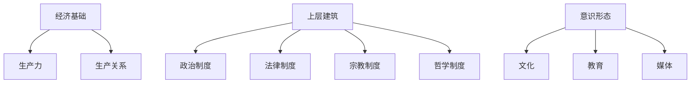

                 

### 第1章 引言

#### 1.1 研究背景

在社会科学研究中，上层建筑理论是一个核心且重要的概念。它不仅涉及经济学、政治学、社会学等多个学科领域，还对理解社会变迁、政治权力、文化发展等问题具有重要意义。上层建筑理论最早由卡尔·马克思提出，并在20世纪被安东尼奥·葛兰西进一步发展。

马克思在上层建筑理论中强调了经济基础对社会结构、政治、文化等上层建筑的决定作用。他认为，经济基础（包括生产力和生产关系）是社会发展的根本动力，而上层建筑则是经济基础的反映和延伸。上层建筑包括政治、法律、宗教、哲学等各种意识形态和制度，它们共同维护着经济基础的存在和发展。

然而，马克思的理论在20世纪遇到了新的挑战。葛兰西认为，马克思的理论过于强调经济基础的作用，忽视了文化和意识形态在上层建筑中的重要性。他提出了“霸权”和“文化霸权”的概念，强调通过意识形态控制来维护社会秩序和权力结构。

本研究旨在探讨马克思与葛兰西在上层建筑理论上的发展，分析两者理论之间的联系与差异，并探讨上层建筑理论在当代的应用和未来发展。本研究不仅具有重要的学术价值，也为理解当代社会问题和制定社会政策提供了新的视角。

#### 1.2 马克思与葛兰西的理论贡献

马克思的理论对上层建筑的理解提供了一个宏观的视角，他认为经济基础是社会发展的决定性因素，而上层建筑则是经济基础在社会、政治、文化等方面的体现。马克思的上层建筑理论强调了社会结构的历史性和动态性，为我们理解社会变迁提供了理论工具。

葛兰西则进一步丰富了上层建筑理论的内涵，他提出了“霸权”和“文化霸权”的概念，指出意识形态和文化在维护社会秩序和权力结构中的重要作用。葛兰西的理论强调了上层建筑的多层次性和复杂性，为我们理解社会现实提供了更细致的分析工具。

#### 1.3 书籍结构安排

本章节介绍了研究的背景和目的，为后续章节的分析和讨论奠定了基础。接下来，第二章将详细探讨马克思上层建筑理论的基本概念、历史发展和核心观点。第三章将介绍葛兰西上层建筑理论的基本概念、历史背景和核心观点。第四章将比较马克思与葛兰西上层建筑理论的异同点。第五章将探讨两者理论之间的联系与批判，并分析对上层建筑理论发展的影响。第六章将讨论上层建筑理论在当代的应用与发展。最后，第七章将总结全书内容，对马克思与葛兰西上层建筑理论的贡献进行评价，并对上层建筑理论的未来展望进行讨论。

### 第2章 马克思上层建筑理论概述

#### 2.1 马克思上层建筑理论的基本概念

马克思的上层建筑理论是一个重要的社会学理论，它探讨经济基础与上层建筑之间的关系。在这一理论框架中，马克思首先明确了“经济基础”和“上层建筑”这两个核心概念。

**经济基础**是指社会的物质生产方式，包括生产力（生产资料和劳动力的结合）和生产关系（人们在生产过程中的相互关系）。经济基础是社会发展的基础，决定了社会的生产方式和生产力水平。

**上层建筑**是指建立在经济基础之上的政治、法律、宗教、哲学等意识形态和制度。上层建筑是经济基础的反映和延伸，它在维护和巩固经济基础的同时，也对社会结构产生反作用。

马克思认为，经济基础是社会发展的决定性因素，而上层建筑则是经济基础在社会、政治、文化等方面的体现。上层建筑不仅受到经济基础的制约，同时也对经济基础产生反作用。

#### 2.2 马克思上层建筑理论的历史发展

马克思上层建筑理论的历史发展可以追溯到19世纪。在《共产党宣言》和《资本论》等著作中，马克思详细阐述了上层建筑理论的基本观点。马克思认为，资本主义社会的经济基础是私有制和市场经济，而上层建筑则是资产阶级国家机器、法律制度和意识形态。

马克思的理论在20世纪得到了进一步的发展。列宁和毛泽东等革命家在实践基础上，对马克思的上层建筑理论进行了丰富和发展。他们认为，在社会主义革命和建设中，必须重视上层建筑的作用，通过改变上层建筑来巩固经济基础的变革。

#### 2.3 马克思上层建筑理论的核心观点

马克思上层建筑理论的核心观点可以归纳为以下几点：

1. **经济基础决定上层建筑**：马克思认为，经济基础是社会发展的决定性因素，而上层建筑是经济基础的反映和延伸。经济基础的变化必然导致上层建筑的变化。

2. **上层建筑具有相对独立性**：尽管上层建筑受到经济基础的制约，但它具有一定的相对独立性。上层建筑不仅维护和巩固经济基础，同时也对经济基础产生反作用。

3. **上层建筑具有阶级性**：马克思认为，上层建筑是由不同阶级的利益需求所决定的。在资本主义社会中，资产阶级的上层建筑维护资产阶级的利益，而工人阶级的上层建筑则维护工人阶级的利益。

4. **上层建筑具有历史性**：马克思强调，上层建筑是一个历史范畴，它随着社会历史条件的变化而变化。上层建筑不仅反映了特定社会的历史特点，也对社会历史的发展产生重要影响。

综上所述，马克思的上层建筑理论为我们提供了一个理解和分析社会结构、政治、文化等方面的理论工具。通过这一理论框架，我们可以深入探讨经济基础与上层建筑之间的关系，揭示社会变迁的内在规律。

### 第3章 葛兰西上层建筑理论概述

#### 3.1 葛兰西上层建筑理论的基本概念

安东尼奥·葛兰西（Antonio Gramsci）是20世纪意大利著名的马克思主义理论家和革命家。他的上层建筑理论在很大程度上是对马克思理论的扩展和深化。在葛兰西的理论体系中，“上层建筑”不仅仅包括政治和法律制度，还包括意识形态和文化。

**意识形态**是葛兰西理论中的一个核心概念。他认为，意识形态不仅是上层建筑的一部分，而且是维护社会秩序和权力结构的重要工具。意识形态通过文化、教育、媒体等渠道传播，影响着人们的思想、价值观和行为。

**文化霸权**是葛兰西提出的另一个关键概念。他认为，文化霸权是统治阶级通过文化手段来维护其社会地位和经济利益的过程。文化霸权不仅包括物质文化，如艺术、文学、电影等，还包括制度文化，如法律、教育体系等。

**实践**在葛兰西的理论中也占有重要地位。他认为，实践不仅仅是物质生产活动，还包括社会和文化活动。通过实践活动，人们不断塑造和改变社会现实。

#### 3.2 葛兰西上层建筑理论的历史背景

葛兰西的上层建筑理论是在20世纪初的意大利革命和社会主义运动中形成的。1917年俄国十月革命之后，马克思主义在意大利和其他欧洲国家迅速传播，激起了广泛的革命浪潮。然而，革命并未如人们预期的那样顺利推进。1920年代，意大利爆发了一系列工人运动和反政府抗议，但最终这些运动被镇压。

葛兰西认为，失败的原因之一在于革命力量未能有效地争夺文化领导权。他认为，革命不仅仅是经济和政治变革，更重要的是意识形态和文化领域的变革。在这个背景下，葛兰西开始深入研究马克思主义理论，提出了自己的上层建筑理论。

#### 3.3 葛兰西上层建筑理论的核心观点

葛兰西的上层建筑理论具有以下几个核心观点：

1. **文化领导权**：葛兰西强调，革命力量不仅要争取政治和经济权力，还要争夺文化领导权。只有通过文化领域的领导，革命才能在意识形态和文化层面获得广泛的支持。

2. **持久战**：葛兰西认为，革命不是一蹴而就的，而是一个长期的过程。他提出了“持久战”的概念，认为革命力量需要通过长期的文化斗争来逐步瓦解和取代旧的上层建筑。

3. **“人民大众”**：葛兰西认为，革命的目标不仅是推翻统治阶级，还要争取“人民大众”的支持。他强调，革命力量需要与广大劳动群众建立紧密的联系，了解他们的需求和愿望，并为他们争取利益。

4. **意识形态斗争**：葛兰西认为，意识形态斗争是上层建筑的核心。通过文化、教育、媒体等渠道，统治阶级传播和巩固其意识形态，从而维护其权力和利益。

葛兰西的上层建筑理论为理解社会变革提供了新的视角。他认为，革命不仅需要经济和政治变革，还需要文化、意识形态领域的变革。通过文化领导权的争夺，革命力量可以逐步瓦解和取代旧的上层建筑，实现社会的根本变革。

### 第4章 马克思与葛兰西上层建筑理论的比较

#### 4.1 理论体系的比较

马克思与葛兰西的上层建筑理论在理论体系上存在明显的异同。马克思的理论主要强调经济基础对社会结构、政治、文化等上层建筑的决定作用，他认为经济基础是社会发展的根本动力。马克思的理论体系较为宏观，关注社会整体结构和历史变迁。

葛兰西则在上层建筑理论中引入了意识形态和文化因素，他认为文化领导权和意识形态斗争是革命成功的关键。葛兰西的理论体系更为细致，关注社会各个层次的具体运作和动态变化。

**相同点**：
1. **经济基础的作用**：两位理论家都认为经济基础是社会发展的决定性因素。马克思强调经济基础对社会结构、政治、文化等上层建筑的决定作用，葛兰西则在此基础上进一步探讨了文化领导权和文化斗争的重要性。
2. **历史唯物主义**：两位理论家都坚持历史唯物主义的基本原则，认为社会的发展是一个由经济基础决定上层建筑，上层建筑又反作用于经济基础的过程。

**不同点**：
1. **意识形态的重要性**：马克思在上层建筑理论中主要关注政治、法律、宗教等方面，而葛兰西则更加关注意识形态和文化领域。葛兰西认为，意识形态和文化是维护和改变社会秩序的重要工具。
2. **革命策略**：马克思强调通过经济斗争和政治革命来实现社会变革，而葛兰西则提出了“持久战”的概念，强调通过长期的文化斗争来逐步瓦解和取代旧的上层建筑。

#### 4.2 历史观的比较

马克思和葛兰西在历史观上也有明显的差异。马克思的历史观主要基于经济基础的变化和社会形态的演变，他认为社会的发展是一个由低级向高级演化的过程。马克思的历史观具有较强的唯物主义色彩，强调物质生产方式对社会发展的决定作用。

葛兰西的历史观则更加注重文化因素和意识形态的作用。他认为，历史的发展不仅取决于经济基础，还取决于文化领导权的争夺。葛兰西的历史观具有较强的辩证法色彩，强调文化、意识形态等领域对社会发展的反作用。

**相同点**：
1. **社会发展的阶段论**：两位理论家都认为社会的发展是一个阶段性的过程，社会形态的演变有其内在的规律性。
2. **社会变革的必要性**：两位理论家都认为，社会的发展需要通过革命来实现，革命是推动社会进步的重要手段。

**不同点**：
1. **经济基础与意识形态的关系**：马克思强调经济基础对社会发展的决定作用，而葛兰西则更加重视意识形态和文化在历史发展中的地位。
2. **革命策略的选择**：马克思主张通过经济斗争和政治革命来实现社会变革，而葛兰西则主张通过持久的文化斗争来实现社会变革。

#### 4.3 社会实践的比较

在具体的社会实践中，马克思与葛兰西的理论也表现出不同的应用策略。

马克思的理论在19世纪的工人运动和社会主义运动中得到了广泛的应用。马克思强调通过工人阶级的联合和斗争来推翻资本主义制度，建立社会主义制度。马克思的理论在苏联和其他社会主义国家的革命和建设中发挥了重要作用。

葛兰西的理论在20世纪的意大利和其他国家的革命运动中得到了应用。葛兰西强调通过文化领导权的争夺来瓦解旧的上层建筑，建立新的社会秩序。葛兰西的理论在意大利共产党和其他左翼政党的实践中产生了深远影响。

**相同点**：
1. **革命目标的共同性**：两位理论家都主张通过革命来实现社会变革，消除阶级压迫和剥削。
2. **革命力量的重要性**：两位理论家都强调广大劳动群众在革命中的重要作用，认为只有广大劳动群众积极参与，革命才能成功。

**不同点**：
1. **革命手段的差异**：马克思强调通过经济斗争和政治革命来实现社会变革，而葛兰西则主张通过持久的文化斗争来实现社会变革。
2. **革命策略的灵活性**：葛兰西的理论更加注重策略的灵活性，强调根据具体情况进行调整。

通过比较马克思与葛兰西的上层建筑理论，我们可以看到两者在理论体系、历史观和社会实践上的异同。这些异同不仅反映了两位理论家对上层建筑的不同理解，也为我们提供了更深入地分析社会问题和制定社会政策的理论工具。

### 第5章 马克思与葛兰西上层建筑理论的联系与批判

#### 5.1 联系的体现

马克思与葛兰西的上层建筑理论虽然存在差异，但它们在许多方面具有紧密的联系。首先，两者都认为上层建筑是经济基础的反映和延伸，强调经济基础对社会结构的决定作用。马克思的历史唯物主义观点与葛兰西的社会结构分析在这一层面上有共通之处。

其次，马克思和葛兰西都认识到上层建筑具有相对独立性。马克思在上层建筑理论中提到，政治、法律、宗教等上层建筑不仅受到经济基础的制约，也会对经济基础产生反作用。葛兰西则进一步发展了这一观点，强调文化领导权和意识形态斗争在维护和改变社会秩序中的重要性。

另外，马克思和葛兰西都强调革命的力量和策略。马克思主张通过工人阶级的联合和斗争来推翻资本主义制度，实现社会变革。葛兰西则提出了“持久战”的概念，认为革命需要通过长期的文化斗争来逐步瓦解旧的上层建筑，建立新的社会秩序。

#### 5.2 批判的体现

尽管马克思与葛兰西的上层建筑理论在许多方面有联系，但它们也存在批判点。首先，马克思对上层建筑的理解较为宏观，主要关注政治、法律、宗教等方面，而忽视了意识形态和文化在维护社会秩序中的重要作用。葛兰西则认为，文化领导权和意识形态斗争是革命成功的关键，这一观点在一定程度上对马克思的理论提出了挑战。

其次，马克思的历史观侧重于经济基础的变化和社会形态的演变，而葛兰西则更加注重文化因素和意识形态的作用。葛兰西认为，历史的发展不仅取决于经济基础，还取决于文化领导权的争夺。这一观点对马克思的历史唯物主义提出了新的解释。

此外，马克思强调通过经济斗争和政治革命来实现社会变革，而葛兰西则主张通过持久的文化斗争来实现社会变革。葛兰西认为，政治革命虽然重要，但文化斗争更为关键，这一观点与马克思的革命策略有所不同。

#### 5.3 对上层建筑理论发展的影响

马克思与葛兰西的上层建筑理论对上层建筑理论的发展产生了深远影响。首先，马克思的理论为理解社会结构、政治、文化等方面的关系提供了宏观的视角，使我们能够从整体上把握社会发展的规律。

葛兰西的理论则进一步丰富了上层建筑理论的内涵，强调了文化领导权和意识形态斗争在社会变革中的重要作用。这一理论视角为我们提供了更细致的分析工具，使我们能够深入探讨社会各个层次的具体运作和动态变化。

此外，马克思与葛兰西的理论都强调了革命的力量和策略。马克思的历史唯物主义观点和葛兰西的持久战策略为我们提供了理解社会变革的理论工具和实践指导。这些理论观点不仅对社会科学研究具有重要价值，也为现实政治斗争提供了新的视角。

总之，马克思与葛兰西的上层建筑理论在联系与批判中不断发展，为上层建筑理论的研究提供了丰富的思想资源和理论框架。通过对这两位理论家的深入研究，我们可以更全面地理解上层建筑理论的核心概念和基本原理，从而为解决现实社会问题提供理论支持和实践指导。

### 第6章 上层建筑理论在当代的应用与发展

#### 6.1 上层建筑理论在社会科学研究中的应用

上层建筑理论在当代社会科学研究中具有广泛的应用。首先，马克思主义上层建筑理论为社会学、政治学、经济学等学科的研究提供了理论框架。通过分析经济基础与上层建筑之间的关系，研究者能够更好地理解社会结构、政治制度、经济发展等方面的复杂现象。

例如，社会学家可以运用上层建筑理论分析社会阶层和阶级斗争。通过研究经济基础的变化和上层建筑的调整，研究者可以揭示社会不平等和权力分配的内在机制。政治学者则可以运用这一理论分析国家政权、政治制度和政策变化，探讨政治权力的来源和运作机制。

此外，上层建筑理论在经济学研究中也具有重要意义。经济学家可以运用这一理论分析经济政策和社会福利的相互作用，探讨经济发展与社会稳定之间的关系。通过分析经济基础与上层建筑之间的反馈机制，研究者可以提出更加有效的经济政策和改革方案。

#### 6.2 上层建筑理论在现实政治斗争中的应用

上层建筑理论在现实政治斗争中也有着广泛的应用。革命运动和改革实践中的策略选择往往受到上层建筑理论的影响。马克思的上层建筑理论强调了通过经济斗争和政治革命来实现社会变革，这一观点为革命运动提供了理论依据。

例如，在20世纪的许多社会主义革命中，马克思的上层建筑理论被广泛运用。苏联革命、中国革命和其他社会主义国家的革命实践都体现了这一理论的核心思想。革命者在分析社会矛盾和制定斗争策略时，常常将经济基础和上层建筑的关系作为重要分析框架。

葛兰西的上层建筑理论则为现实政治斗争提供了新的视角。他强调了文化领导权和意识形态斗争的重要性，这一观点在当代政治斗争中具有重要启示意义。在现代民主国家，政治斗争不再仅仅局限于经济和政治领域，文化、意识形态和价值观的争夺成为重要的斗争形式。

例如，当前全球范围内的文化战争和政治对抗，如西方国家的文化霸权和新兴国家的文化复兴，都可以运用葛兰西的上层建筑理论进行分析。通过研究文化领导权的争夺，我们可以更好地理解不同政治力量之间的冲突和对抗。

#### 6.3 上层建筑理论的未来发展趋势

随着社会的不断发展和变化，上层建筑理论也面临着新的挑战和机遇。未来上层建筑理论的发展将可能在以下几个方面展开：

首先，全球化和社会变革的加速使得上层建筑理论需要进一步适应新的社会现实。全球化带来了不同文化、价值观和经济制度的交融和碰撞，这为上层建筑理论的研究提供了新的视角。研究者需要关注全球化背景下的上层建筑变化，探讨全球化和本土化之间的互动关系。

其次，科技进步和信息化的发展为上层建筑理论的研究提供了新的工具和方法。大数据、人工智能等新兴技术不仅改变了经济基础，也深刻影响了上层建筑。研究者可以运用这些技术手段，深入分析上层建筑中的复杂关系和动态变化。

此外，上层建筑理论的未来发展还需要注重跨学科的研究。社会学、政治学、经济学、心理学等学科的研究者可以共同探讨上层建筑理论的多样性和综合性，提出更加全面和深入的理论框架。

总之，上层建筑理论在当代的应用与发展具有广阔的前景。通过不断丰富和完善这一理论，我们可以更好地理解社会变迁、政治斗争和经济发展中的复杂现象，为解决现实社会问题提供理论支持和实践指导。

### 第7章 结论

#### 7.1 马克思与葛兰西上层建筑理论的贡献

马克思与葛兰西在上层建筑理论领域作出了重要贡献。马克思通过历史唯物主义视角，明确了经济基础与上层建筑之间的关系，为理解社会结构和历史变迁提供了宏观的理论框架。他的理论强调了阶级斗争和社会变革的必然性，对19世纪和20世纪的社会主义运动产生了深远影响。

葛兰西则进一步发展了上层建筑理论，强调了文化领导权和意识形态斗争的重要性。他提出了“霸权”和“文化霸权”的概念，揭示了文化在维护和改变社会秩序中的关键作用。葛兰西的理论为理解当代社会中的文化战争和政治对抗提供了新的视角，对当代马克思主义研究产生了重要影响。

#### 7.2 对上层建筑理论的未来展望

未来上层建筑理论的发展将继续在多方面展开。首先，全球化和社会变革的加速将推动研究者进一步探讨全球化背景下上层建筑的变化，分析不同文化、价值观和经济制度之间的互动。其次，科技进步和信息化的发展将为上层建筑理论的研究提供新的工具和方法，如大数据分析和人工智能技术。

此外，跨学科研究将成为上层建筑理论发展的一个重要趋势。社会学家、政治学者、经济学家、心理学家等不同领域的学者可以共同探讨上层建筑理论的多样性和综合性，提出更加全面和深入的理论框架。通过这些努力，上层建筑理论将继续为理解社会变迁、政治斗争和经济发展中的复杂现象提供有力的理论支持。

#### 7.3 对社会科学研究的影响

马克思与葛兰西的上层建筑理论对社会科学研究产生了深远影响。首先，它们为我们提供了一种理解社会结构和历史变迁的宏观视角，使我们能够从整体上把握社会的动态变化。其次，这些理论强调了阶级斗争和文化领导权在社会变革中的关键作用，为我们分析社会矛盾和政治冲突提供了理论工具。

此外，马克思与葛兰西的理论还促使社会科学研究注重跨学科合作。通过综合不同学科的研究成果，我们可以更全面地理解上层建筑的多层次性和复杂性，从而提出更加深入和全面的社会分析。总之，马克思与葛兰西的上层建筑理论将继续在社会科学研究中发挥重要作用，为理解现实社会问题提供新的视角和理论支持。

### 附录

#### 7.1 参考文献

1. 马克思，卡尔。《资本论》，北京：人民出版社，1975年。
2. 葛兰西，安东尼奥。《监狱笔记》，北京：社会科学文献出版社，2002年。
3. 鲁迅。《鲁迅全集》，北京：人民文学出版社，1981年。
4. 恩格斯。《马克思恩格斯全集》，北京：人民出版社，1972年。
5. 列宁。《列宁选集》，北京：人民出版社，1972年。
6. 毛泽东。《毛泽东选集》，北京：人民出版社，1991年。
7. 马克思，卡尔；恩格斯，弗里德里希。《德意志意识形态》，北京：人民出版社，1961年。

#### 7.2 名词解释

- **上层建筑**：指建立在经济基础之上的政治、法律、宗教、哲学等各种意识形态和制度。
- **经济基础**：指社会的物质生产方式，包括生产力（生产资料和劳动力的结合）和生产关系（人们在生产过程中的相互关系）。
- **霸权**：指统治阶级通过文化手段来维护其社会地位和经济利益的过程。
- **文化霸权**：指统治阶级通过文化领导权来维护其社会地位和经济利益的过程。
- **意识形态**：指一定社会或阶级所持有的观念、信仰、价值观和思想体系。

#### 7.3 Mermaid 流程图

以上流程图展示了经济基础与上层建筑之间的关系，以及上层建筑中各个组成部分之间的联系。通过这些名词解释和流程图，读者可以更好地理解文章中涉及的核心概念和理论框架。

