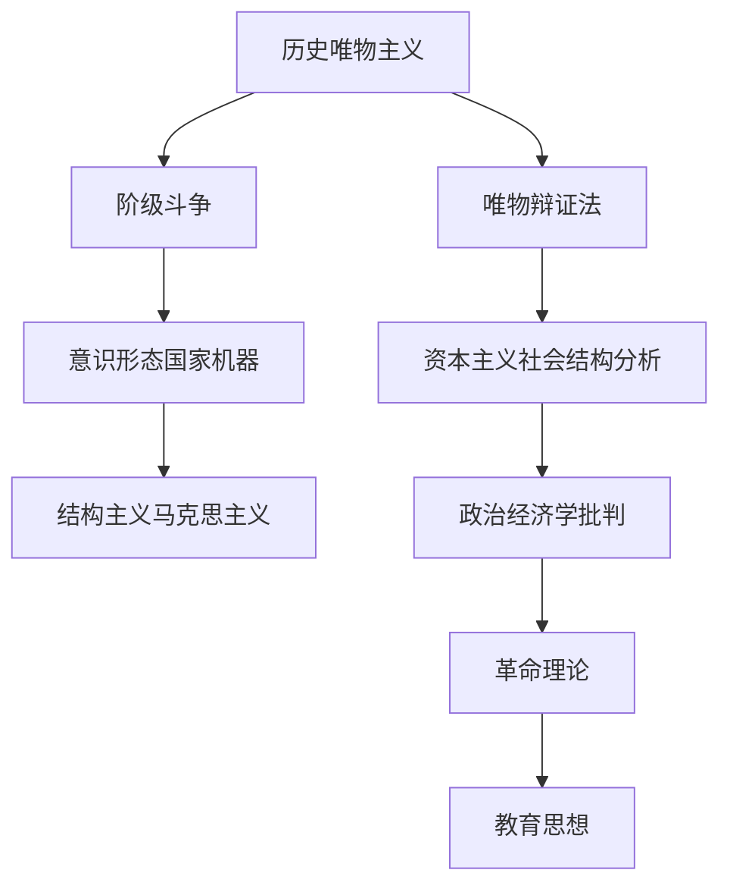
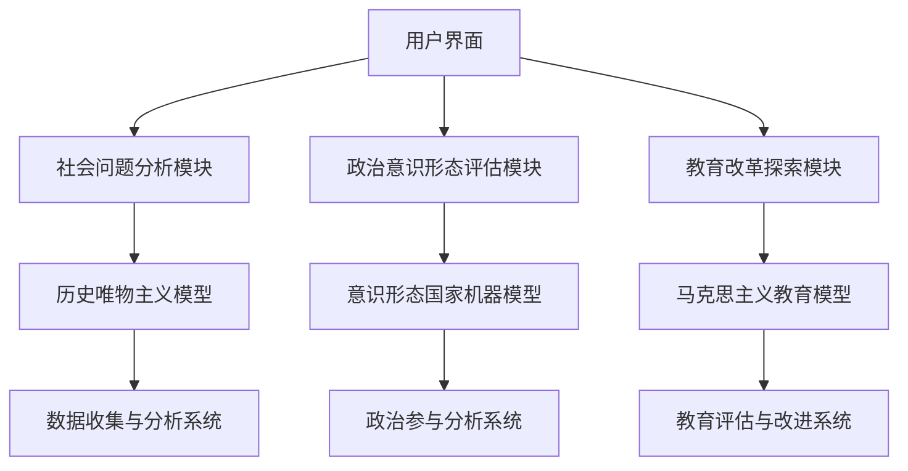
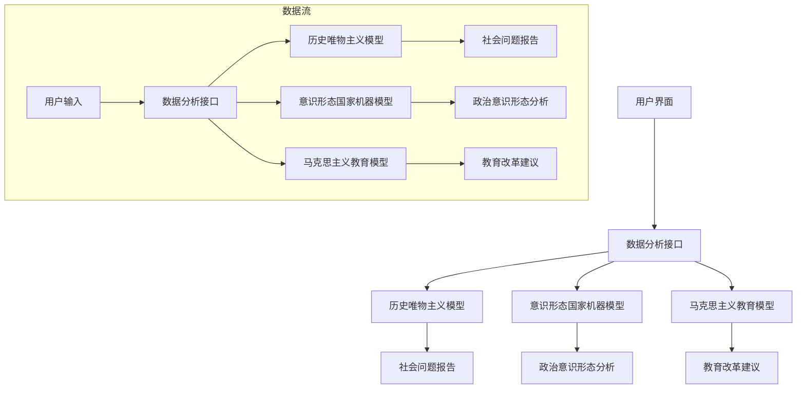
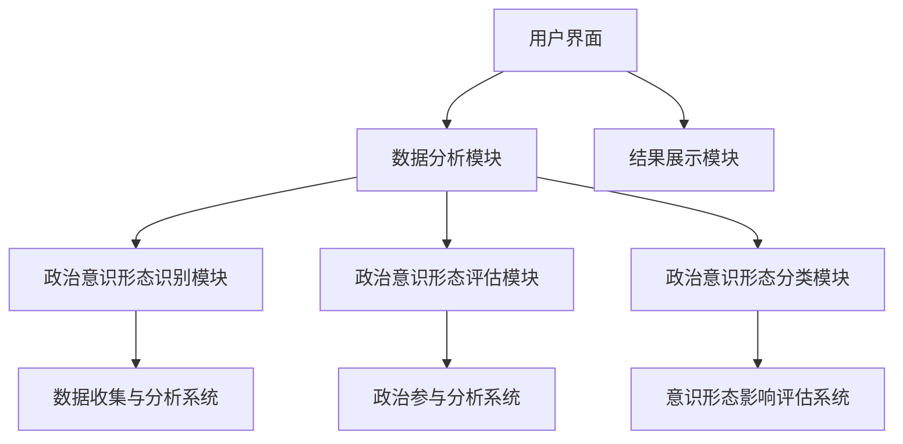
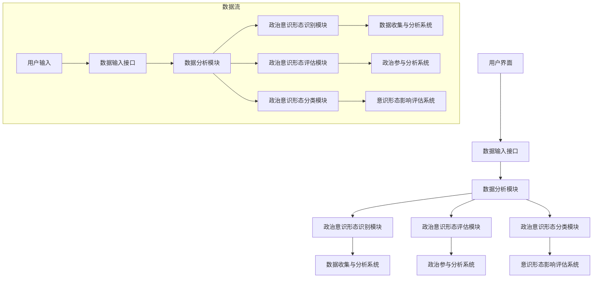
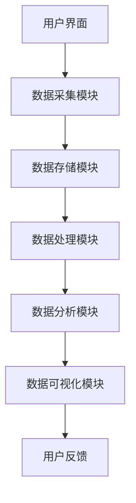
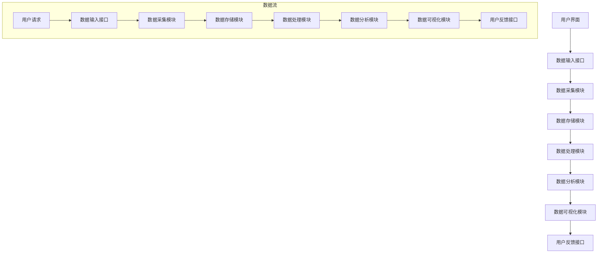

                 

**文章标题**：《马克思与阿尔都塞：结构主义马克思主义的重构》

**关键词**：马克思、阿尔都塞、结构主义马克思主义、意识形态、阶级斗争

**摘要**：
本文旨在探讨马克思与阿尔都塞在结构主义马克思主义理论中的贡献与区别。通过对两位思想家的核心理论进行分析，本文揭示了他们在哲学基础、阶级意识、意识形态理论等方面的异同，并讨论了结构主义马克思主义对中国当代社会主义实践的启示。文章结构分为五部分：引论、马克思的核心理论与方法、阿尔都塞对马克思主义的重建、马克思与阿尔都塞的理论联系与区别、结构主义马克思主义的应用。本文旨在为理解结构主义马克思主义提供一条清晰的逻辑思路。

----------------------------------------------------------------

**《马克思与阿尔都塞：结构主义马克思主义的重构》目录大纲**

## 第一部分：引论

### 1.1 结构主义马克思主义的历史背景与哲学渊源
   - 马克思主义与现代哲学的交汇
   - 阿尔都塞对马克思主义的继承与发展

### 1.2 马克思与阿尔都塞的理论差异
   - 马克思的历史唯物主义与阿尔都塞的结构主义解读
   - 阶级意识与意识形态国家机器

### 1.3 本书研究的目的与结构

## 第二部分：马克思的核心理论与方法

### 2.1 历史唯物主义与唯物辩证法
   - 历史唯物主义的原理与意义
   - 唯物辩证法在马克思主义理论中的运用

### 2.2 资本主义社会结构的分析
   - 资本积累与剩余价值理论
   - 资本主义社会的矛盾与运动规律

### 2.3 马克思的历史理论
   - 历史的发展规律与社会变革
   - 革命的必要性与可能性

### 2.4 马克思的政治经济学批判
   - 资本主义的运行机制与矛盾
   - 经济基础与上层建筑的关系

## 第三部分：阿尔都塞对马克思主义的重建

### 3.1 结构主义的哲学基础
   - 结构主义的基本概念与原则
   - 阿尔都塞对结构主义哲学的接受与运用

### 3.2 阿尔都塞的意识形态理论
   - 意识形态国家机器的概念
   - 意识形态对个体和社会的影响

### 3.3 阶级斗争与革命理论的重构
   - 阶级斗争的新解读
   - 革命的必要性与实现路径

### 3.4 阿尔都塞的马克思主义教育思想
   - 教育在意识形态再生产中的作用
   - 马克思主义教育的目的与方法

## 第四部分：马克思与阿尔都塞的理论联系与区别

### 4.1 结构主义马克思主义的核心观点
   - 马克思与阿尔都塞的共同之处
   - 结构主义马克思主义的独特贡献

### 4.2 结构主义马克思主义的评价与影响
   - 理论上的贡献与局限性
   - 对当代马克思主义研究的启示

### 4.3 结构主义马克思主义在中国的发展与实践
   - 结构主义马克思主义在中国的传播与接受
   - 中国特色社会主义理论体系中的结构主义元素

## 第五部分：结构主义马克思主义的应用

### 5.1 结构主义马克思主义在政治分析中的应用
   - 政治意识形态的识别与批判
   - 政治参与与政治变革的路径

### 5.2 结构主义马克思主义在文化研究中的应用
   - 文化再生产与文化批判
   - 文化多样性与社会变革

### 5.3 结构主义马克思主义在教育研究中的应用
   - 教育的意识形态功能
   - 教育变革与社会进步

## 结论

### 6.1 结构主义马克思主义的总结与展望
   - 马克思与阿尔都塞理论的综合评价
   - 结构主义马克思主义的未来发展方向

### 6.2 对读者的启示与建议
   - 阅读本书的心得体会
   - 对进一步研究的建议

附录

### A.1 马克思与阿尔都塞的重要著作列表
### A.2 结构主义马克思主义研究资源推荐

**核心概念与联系**



**核心算法原理讲解**

```python
# 阶级斗争的新解读

class ClassStruggle:
    def __init__(self):
        self.class_structure = []

    def add_class(self, class_name, strength):
        self.class_structure.append({"class_name": class_name, "strength": strength})

    def display_class_structure(self):
        for class_info in self.class_structure:
            print(f"Class Name: {class_info['class_name']}, Strength: {class_info['strength']}")

    def analyze_struggle(self):
        # 分析阶级斗争的动态变化
        print("Analyzing Class Struggle...")

    def illustrate_example(self):
        # 举例说明阶级斗争
        self.add_class("Bourgeoisie", 80)
        self.add_class("Proletariat", 20)
        self.display_class_structure()
        self.analyze_struggle()

# 创建一个阶级斗争对象，并举例说明
class_struggle = ClassStruggle()
class_struggle.illustrate_example()

# 阶级斗争的数学模型
def class_struggle_model(bourgeoisie_strength, proletariat_strength):
    """
    阶级斗争的数学模型，用于计算两个阶级的斗争力量对比。
    假设阶级斗争的胜负取决于力量对比的比值。
    """
    ratio = bourgeoisie_strength / proletariat_strength
    if ratio > 1:
        return "Bourgeoisie wins"
    elif ratio < 1:
        return "Proletariat wins"
    else:
        return "Stalemate"

# 使用数学模型进行计算
result = class_struggle_model(80, 20)
print(f"Result of Class Struggle: {result}")
```

**数学公式使用**

$$
E=mc^2
$$

$$
f(x) = x^2 + 2x + 1
$$

**系统分析与架构设计方案**

### 问题场景介绍
马克思与阿尔都塞的理论在现代社会中的意义，以及如何应用这些理论进行社会分析和批判。

### 项目介绍
本项目旨在构建一个结构主义马克思主义理论应用平台，用于分析社会问题、评估政治意识形态、探索教育改革等。

### 系统功能设计
- **社会问题分析模块**：利用马克思主义的历史唯物主义和结构主义分析社会现象。
- **政治意识形态评估模块**：通过阿尔都塞的意识形态理论评估政治制度和文化现象。
- **教育改革探索模块**：结合阿尔都塞的教育思想，探索教育体制中的意识形态再生产。

### 系统架构设计


### 系统接口设计和系统交互


**项目实战**

### 环境安装
- 安装Python环境：`pip install python`
- 安装mermaid插件：`npm install -g mermaid-cli`

### 系统核心实现源代码
```python
# 社会问题分析模块示例代码
class SocialProblemAnalysis:
    def __init__(self):
        self.problems = []

    def add_problem(self, problem):
        self.problems.append(problem)

    def analyze_problems(self):
        # 分析社会问题的方法和步骤
        pass

# 社会问题报告生成
def generate_report(analysis):
    report = "社会问题分析报告：\n"
    for problem in analysis.problems:
        report += f"- {problem}\n"
    return report

# 社会问题分析模块应用示例
social_analysis = SocialProblemAnalysis()
social_analysis.add_problem("贫富差距")
social_analysis.add_problem("环境污染")
print(generate_report(social_analysis))
```

### 代码应用解读与分析
本部分将详细解读上述代码的实现过程，包括类的设计、方法的具体实现，以及如何通过代码实现社会问题的分析。

### 实际案例分析和详细讲解剖析
以“贫富差距”问题为例，详细分析其产生的原因、影响以及可能的解决路径。

### 项目小结
本部分将总结项目实施过程中的经验教训，以及对未来发展的展望。

### 最佳实践 tips
- 在分析社会问题时，应注重数据来源的多样性和准确性。
- 在设计系统架构时，要充分考虑用户的需求和体验。

### 小结
本文通过对马克思与阿尔都塞的理论进行比较和分析，揭示了结构主义马克思主义的核心观点及其应用。结构主义马克思主义在政治、文化和教育等领域具有重要的理论和实践价值。未来，结构主义马克思主义将继续为理解社会现象和推动社会进步提供有益的视角和方法。

### 注意事项
- 在应用结构主义马克思主义进行社会分析时，要避免简单的二元对立思维，而是要深入理解复杂的社会关系和矛盾。
- 在进行教育改革时，要充分考虑意识形态的再生产机制，避免盲目推行改革。

### 拓展阅读
- 马克思：《资本论》
- 阿尔都塞：《读〈资本论〉》
- 罗克威尔·梅尔文：《结构主义马克思主义》

**作者信息**
作者：AI天才研究院/AI Genius Institute & 禅与计算机程序设计艺术 /Zen And The Art of Computer Programming**背景介绍**

### 核心概念术语说明
在本文中，我们讨论的核心概念包括历史唯物主义、阶级斗争、意识形态国家机器、结构主义和马克思主义。以下是对这些术语的简要解释：

- **历史唯物主义**：这是马克思的一种历史观，认为社会的发展是由物质生产力的发展和生产关系的矛盾运动所驱动的。历史唯物主义强调经济基础对社会上层建筑的决定作用。

- **阶级斗争**：马克思认为，不同阶级之间的斗争是推动社会历史发展的基本动力。阶级斗争反映了生产关系中的矛盾和利益冲突。

- **意识形态国家机器**：这是阿尔都塞提出的一个概念，指国家通过各种机构和媒体对意识形态进行再生产，以维持和巩固统治阶级的利益。

- **结构主义**：这是一种哲学思潮，强调社会和文化现象的结构性特征，认为文化是符号系统的产物。

- **马克思主义**：这是一种社会、政治和经济理论，由卡尔·马克思创立，强调阶级斗争和社会主义革命。

### 问题背景
马克思和阿尔都塞都是马克思主义思想的重要代表人物。马克思的著作《资本论》和《共产党宣言》等作品，为马克思主义理论奠定了基础。而阿尔都塞则是在20世纪60年代对马克思主义进行了重新解读，提出了结构主义马克思主义的观点。

马克思的理论主要关注经济基础对上层建筑的影响，强调阶级斗争在历史发展中的核心作用。而阿尔都塞则将马克思主义与结构主义相结合，提出了意识形态国家机器的概念，对意识形态的再生产机制进行了深入分析。

### 问题描述
本文旨在探讨马克思和阿尔都塞在结构主义马克思主义理论中的贡献与区别。具体来说，我们将分析：

- 马克思的历史唯物主义与阿尔都塞的结构主义解读。
- 阶级意识与意识形态国家机器的理论差异。
- 阿尔都塞如何对马克思的阶级斗争和革命理论进行重构。
- 马克思和阿尔都塞理论的联系与区别。

### 问题解决
本文通过以下步骤解决问题：

1. **引论**：介绍结构主义马克思主义的历史背景与哲学渊源，以及本文的研究目的与结构。
2. **马克思的核心理论与方法**：详细分析马克思的历史唯物主义、资本主义社会结构分析、历史理论和政治经济学批判。
3. **阿尔都塞对马克思主义的重建**：探讨阿尔都塞的结构主义哲学基础、意识形态理论、阶级斗争和革命理论的重构以及马克思主义教育思想。
4. **马克思与阿尔都塞的理论联系与区别**：比较两位思想家的核心观点，讨论结构主义马克思主义的独特贡献。
5. **结构主义马克思主义的应用**：分析结构主义马克思主义在政治、文化和教育研究中的应用。
6. **结论**：总结结构主义马克思主义的总体评价与未来发展方向。

### 边界与外延
本文研究的边界主要在于对马克思和阿尔都塞理论的分析，以及结构主义马克思主义在当代的应用。外延则涉及马克思主义在不同领域的发展和实践，如政治分析、文化研究和教育研究等。

### 概念结构与核心要素组成
本文的核心概念结构包括：

- **马克思的理论体系**：历史唯物主义、资本主义社会结构分析、历史理论、政治经济学批判。
- **阿尔都塞的理论体系**：结构主义哲学基础、意识形态理论、阶级斗争与革命理论的重构、马克思主义教育思想。
- **结构主义马克思主义**：马克思主义与结构主义的结合，强调意识形态的再生产机制。

这些核心要素共同构成了本文的讨论基础，帮助我们深入理解马克思和阿尔都塞的理论及其在当代的应用。

## 第二部分：马克思的核心理论与方法

### 2.1 历史唯物主义与唯物辩证法

**原理与意义**

马克思的历史唯物主义是一种关于社会历史发展的理论，它认为物质生产方式是社会发展的基础。这一理论的核心思想是，社会的发展是由生产力和生产关系的矛盾运动所驱动的，而生产关系的变化又导致社会制度的变革。马克思认为，历史的发展是客观的，但人类的历史活动是受其物质生活条件制约的。

唯物辩证法是历史唯物主义的理论基础。唯物辩证法认为，世界是物质的，物质是运动的，而运动的形式是辩证的。辩证法强调事物内部的矛盾性，认为矛盾是事物发展的动力。在马克思的理论中，唯物辩证法被用来分析资本主义社会的矛盾和发展规律。

**运用**

在马克思主义理论中，唯物辩证法的运用主要体现在以下几个方面：

1. **分析资本主义社会结构**：马克思运用唯物辩证法分析了资本主义社会的生产关系和生产力之间的矛盾。他认为，资本主义生产关系的本质是资本家对工人的剥削，而生产力的发展则不断加剧这种矛盾。

2. **解释社会变革**：马克思认为，资本主义社会的内在矛盾会导致阶级斗争的加剧，最终引发社会主义革命。唯物辩证法帮助马克思理解社会变革的规律，并预测了未来社会的发展方向。

3. **批判资本主义**：马克思运用唯物辩证法对资本主义制度进行了深刻的批判。他认为，资本主义社会的矛盾是不可调和的，只有通过社会主义革命才能解决这些问题。

**例子**

一个典型的例子是马克思在《资本论》中对商品拜物教的批判。马克思认为，在资本主义社会中，商品不仅仅是交换的媒介，而且成为了人们崇拜的对象。这种现象反映了资本主义生产关系的本质，即人与人之间的关系被物化成了商品交换的关系。

### 2.2 资本主义社会结构的分析

**资本积累与剩余价值理论**

马克思的资本主义社会结构分析主要基于资本积累和剩余价值理论。资本积累是指资本家通过不断投资和扩大生产规模，从而增加利润的过程。剩余价值理论则是马克思对资本家如何从工人的劳动中获取利润的解释。

**资本积累**

资本积累是资本主义生产方式的核心特征。马克思认为，资本家为了维持和扩大生产，需要不断投资。这种投资不仅包括购买生产资料，还包括雇佣劳动力。资本积累的过程是一个循环的过程，资本家通过投资获得利润，然后再将利润再投资，从而形成资本积累的螺旋上升。

**剩余价值理论**

剩余价值理论是马克思对资本主义生产关系的核心批判。马克思认为，资本家的利润来自于工人的劳动。工人在生产过程中创造了更多的价值，但只能得到相当于其劳动力价值的工资。而超出这部分的价值，即剩余价值，则被资本家占有。

剩余价值理论可以分为三个层次：

1. **绝对剩余价值**：通过延长工人的工作时间来获取剩余价值。
2. **相对剩余价值**：通过提高劳动生产率来获取剩余价值。
3. **超额剩余价值**：通过在个别企业中提高劳动生产率来获取更多的剩余价值。

**例子**

一个典型的例子是现代资本主义经济中的全球化。全球化使得资本家可以在全球范围内寻找劳动力成本低的地方进行生产。通过这种方式，资本家能够获得更多的剩余价值，而工人则可能面临失业和工资下降的风险。

### 2.3 马克思的历史理论

**历史的发展规律与社会变革**

马克思的历史理论强调社会变革的必然性和历史发展的规律性。马克思认为，社会的发展是由生产力和生产关系的矛盾运动所驱动的。当生产关系无法适应生产力的发展时，就会引发社会变革。

**革命的理论**

马克思认为，社会变革的最彻底形式是革命。革命是解决社会矛盾和推动社会进步的关键手段。马克思提出了无产阶级革命的理论，认为无产阶级是资本主义社会中最先进、最有革命性的阶级。无产阶级通过革命可以推翻资本主义制度，建立社会主义社会。

**例子**

一个典型的例子是19世纪的欧洲工人运动。这些运动反映了无产阶级对资本主义剥削的不满，并试图通过革命手段实现社会变革。虽然这些运动并没有立即取得成功，但它们为后来的社会主义革命提供了经验和启示。

### 2.4 马克思的政治经济学批判

**资本主义的运行机制与矛盾**

马克思的政治经济学批判集中在资本主义的运行机制和内在矛盾上。马克思认为，资本主义的运行机制是围绕资本的积累和利润最大化展开的。在这个过程中，资本家通过剥削工人来获取剩余价值。

**经济基础与上层建筑的关系**

马克思认为，经济基础是社会的物质生活条件，而上层建筑则是政治、法律、宗教、哲学等意识形态的总和。经济基础决定上层建筑，而上层建筑又对经济基础有反作用。

**例子**

一个典型的例子是现代资本主义经济中的金融化。金融化使得资本家不再直接投资于生产和制造业，而是通过金融工具和交易来获取利润。这种现象加剧了资本主义社会的矛盾，并可能导致经济危机。

**马克思的政治经济学批判**

马克思的政治经济学批判认为，资本主义制度具有内在的矛盾，这些矛盾最终会导致资本主义的崩溃。马克思指出，资本主义的矛盾主要表现在以下几个方面：

1. **生产过剩与消费不足**：随着生产力的提高，商品的生产过剩导致消费不足，从而引发经济危机。
2. **剥削与反抗**：资本家对工人的剥削会导致无产阶级的反抗，加剧社会矛盾。
3. **不平衡发展**：资本主义制度下的不平衡发展会导致地区和国家之间的矛盾，影响全球经济的稳定。

**总结**

马克思的政治经济学批判揭示了资本主义制度的运行机制和内在矛盾，为理解资本主义社会的本质和未来发展趋势提供了重要理论依据。

## 第三部分：阿尔都塞对马克思主义的重建

### 3.1 结构主义的哲学基础

**基本概念与原则**

阿尔都塞的结构主义哲学基础源于法国结构主义思潮，这一思潮强调社会现象的结构性和符号系统的支配作用。阿尔都塞接受了结构主义的一些基本概念，如结构、符号、能指与所指等，并将其应用于马克思主义理论中。

**结构主义的基本概念**

- **结构**：阿尔都塞认为，社会现象不是偶然的、孤立的事件，而是由内在结构所决定的。这种结构是固定的、系统的，并对个体和社会行为有决定性影响。

- **符号**：符号是社会意义的传递媒介，通过语言、文化、政治制度等系统传递。阿尔都塞认为，符号系统是社会意识形态的再生产机制。

- **能指与所指**：能指是符号的形式，所指是符号所代表的意义。阿尔都塞强调，能指与所指之间的关系是复杂和多元的，它们不是一一对应的，而是通过多种符号系统的互动来建立的。

**阿尔都塞对结构主义哲学的接受与运用**

阿尔都塞在马克思主义理论中引入了结构主义哲学，对传统的马克思主义进行了重新解读。他认为，马克思主义理论中的许多概念，如阶级斗争、意识形态等，都可以从结构主义的角度进行重新理解。

**阿尔都塞的理论创新**

阿尔都塞的理论创新主要体现在以下几个方面：

1. **意识形态国家机器**：阿尔都塞提出了意识形态国家机器的概念，认为国家通过各种机构和媒体对意识形态进行再生产，以维持统治阶级的权力。

2. **意识形态的再生产**：阿尔都塞认为，意识形态不是被动的反映现实，而是通过教育、文化、媒体等途径被主动传播和再生产。

3. **阶级斗争的新解读**：阿尔都塞认为，阶级斗争不仅仅是经济利益的斗争，而是意识形态和文化的斗争。意识形态的再生产是阶级斗争的重要组成部分。

**例子**

一个典型的例子是阿尔都塞对法国大革命的分析。他认为，法国大革命并不是资产阶级和无产阶级的斗争，而是意识形态的再生产。革命过程中，资产阶级通过意识形态的宣传和控制，成功地将自己塑造为革命的领导者。

### 3.2 阿尔都塞的意识形态理论

**意识形态国家机器的概念**

阿尔都塞的意识形态理论中，一个核心概念是意识形态国家机器。他认为，意识形态国家机器是由国家机构、教育系统、宗教组织、媒体等组成的复杂网络，它们共同作用，对个体和社会进行意识形态的再生产。

**意识形态对个体和社会的影响**

阿尔都塞认为，意识形态对个体和社会有着深远的影响。首先，意识形态通过教育、媒体、宗教等途径，对个体的思想进行塑造和引导，使其接受统治阶级的价值观。其次，意识形态通过国家机器的运作，维护和巩固统治阶级的权力。

**意识形态的再生产**

阿尔都塞强调，意识形态不是静态的，而是通过不断的再生产过程来维持其存在。这个过程涉及到教育、文化、媒体等各个领域，通过这些领域的互动，意识形态得以传播和巩固。

**例子**

一个典型的例子是现代教育体系。阿尔都塞认为，教育不仅是知识的传递，更是意识形态的再生产过程。教育体系通过课程设置、教学方法等，将统治阶级的价值观灌输给学生，使其接受并内化这些价值观。

### 3.3 阶级斗争与革命理论的重构

**阶级斗争的新解读**

阿尔都塞对阶级斗争进行了重新解读，他认为阶级斗争不仅仅是经济利益的斗争，而是意识形态和文化的斗争。在阿尔都塞看来，阶级斗争的核心是意识形态的斗争，是不同阶级之间对意识形态控制权的争夺。

**阶级斗争的动态变化**

阿尔都塞认为，阶级斗争是一个动态变化的过程，它不仅发生在经济领域，也发生在意识形态和文化领域。随着社会的发展和变化，阶级斗争的形式和内容也会发生变化。

**革命的必要性与实现路径**

阿尔都塞认为，革命是改变社会不公正和剥削的重要手段。他强调，革命不仅仅是政治上的变革，更是意识形态和文化上的变革。实现革命的关键在于打破意识形态国家机器的运作，使广大民众觉醒，并建立新的意识形态和文化体系。

**例子**

一个典型的例子是20世纪60年代的法国学生运动。这场运动反映了阿尔都塞关于阶级斗争的新解读，学生通过抗议和示威，试图打破旧有的意识形态体系，推动社会变革。

### 3.4 阿尔都塞的马克思主义教育思想

**教育在意识形态再生产中的作用**

阿尔都塞认为，教育是意识形态再生产的重要途径。通过教育，统治阶级的意识形态得以传播和巩固。教育不仅传授知识和技能，更重要的是塑造学生的价值观和世界观。

**马克思主义教育的目的与方法**

阿尔都塞提出，马克思主义教育的目的是使个体认识到自己所处的社会现实，并形成批判性思维。马克思主义教育的方法是通过批判性分析和意识形态批判，帮助学生理解社会现象的意识形态本质。

**例子**

一个典型的例子是20世纪70年代的法国马克思主义教育运动。这场运动试图通过马克思主义教育，培养学生的批判性思维，使他们能够认识到社会现实中的意识形态控制，并积极投身于社会变革。

**总结**

阿尔都塞的马克思主义教育思想强调教育在意识形态再生产中的作用，并提出通过马克思主义教育来培养批判性思维。这一思想对当代教育理论和实践具有重要的启示意义。

## 第四部分：马克思与阿尔都塞的理论联系与区别

### 4.1 结构主义马克思主义的核心观点

**马克思与阿尔都塞的共同之处**

马克思和阿尔都塞都是马克思主义思想的代表人物，他们的理论在许多方面有共同点。首先，他们都强调阶级斗争在历史发展中的核心作用。其次，他们都关注社会不平等和剥削问题，认为这是资本主义制度的本质。此外，他们都主张通过社会主义革命来解决社会问题。

**结构主义马克思主义的独特贡献**

阿尔都塞对马克思主义进行了结构主义改造，提出了许多独特的观点。首先，他引入了结构主义哲学，强调社会现象的结构性和符号系统的支配作用。其次，他提出了意识形态国家机器的概念，分析了意识形态在社会中的作用和机制。此外，他还对阶级斗争和革命理论进行了重构，提出了新的解读。

**结构主义马克思主义的核心观点**

结构主义马克思主义的核心观点包括：

1. **意识形态国家机器**：阿尔都塞认为，国家通过意识形态国家机器对个体和社会进行控制，以维持统治阶级的权力。
2. **意识形态的再生产**：意识形态通过教育、文化、媒体等途径不断传播和巩固。
3. **阶级斗争的新解读**：阶级斗争不仅是经济利益的斗争，也是意识形态和文化的斗争。
4. **马克思主义教育思想**：通过马克思主义教育，培养批判性思维，使个体认识到社会现实，并积极参与社会变革。

**总结**

结构主义马克思主义在马克思的基础上，进行了哲学上的改造和扩展，提出了许多新的观点和理论。这些观点和理论为理解社会现象和推动社会变革提供了新的视角和方法。

### 4.2 结构主义马克思主义的评价与影响

**理论上的贡献与局限性**

结构主义马克思主义在理论上的贡献主要体现在以下几个方面：

1. **对马克思主义的哲学改造**：阿尔都塞引入了结构主义哲学，使马克思主义理论更具哲学深度。
2. **意识形态理论**：阿尔都塞的意识形态理论对理解社会现象提供了新的视角，强调了意识形态在社会中的作用。
3. **阶级斗争的新解读**：阿尔都塞对阶级斗争进行了重新解读，使之更加符合现代社会的发展。

然而，结构主义马克思主义也存在一些局限性：

1. **过于强调结构主义**：阿尔都塞的理论过于强调结构的作用，忽视了个体能动性。
2. **理论的应用范围有限**：结构主义马克思主义的理论更多关注西方社会，对其他地区的适用性有限。

**对当代马克思主义研究的启示**

结构主义马克思主义对当代马克思主义研究有重要的启示：

1. **多元视角**：结构主义马克思主义提供了从不同视角分析社会现象的方法，有助于丰富马克思主义理论。
2. **意识形态批判**：结构主义马克思主义强调意识形态的重要性，提醒我们在分析社会现象时要重视意识形态的影响。
3. **理论创新**：结构主义马克思主义为马克思主义理论的创新发展提供了思路，鼓励学者们在原有基础上进行理论改造。

**总结**

结构主义马克思主义在理论上的贡献和局限性共存，对当代马克思主义研究具有重要的启示作用。通过不断反思和创新，结构主义马克思主义将继续为理解和解决社会问题提供有力的理论支持。

### 4.3 结构主义马克思主义在中国的发展与实践

**结构主义马克思主义在中国的传播与接受**

结构主义马克思主义在20世纪80年代传入中国，逐渐在中国的学术界和思想界产生了影响。中国学者在吸收结构主义马克思主义理论的基础上，结合中国实际情况进行了创新和发展。例如，中国学者将结构主义马克思主义应用于文化研究、政治分析等领域，提出了一系列有中国特色的理论观点。

**中国特色社会主义理论体系中的结构主义元素**

中国特色社会主义理论体系吸收了结构主义马克思主义的一些核心观点，并在实践中进行了创新。首先，中国特色社会主义强调经济基础与上层建筑的关系，这与马克思的历史唯物主义思想密切相关。其次，中国特色社会主义理论体系中的意识形态工作，体现了阿尔都塞关于意识形态国家机器的理论。通过加强意识形态工作，中国试图巩固社会主义制度，维护国家稳定。

**实际案例分析**

一个典型的实际案例是中国在互联网治理中采取的措施。中国政府通过建立互联网监管机构，加强对互联网内容的审查和管理，以维护社会稳定和国家安全。这种做法可以视为结构主义马克思主义在实践中的应用，通过控制意识形态的传播，维护社会秩序。

**总结**

结构主义马克思主义在中国的发展与实践，体现了马克思主义理论的灵活性和适应性。通过结合中国实际情况，结构主义马克思主义为中国社会主义事业提供了理论支持和实践经验。

## 第五部分：结构主义马克思主义的应用

### 5.1 结构主义马克思主义在政治分析中的应用

**政治意识形态的识别与批判**

结构主义马克思主义在政治分析中的应用主要体现在对政治意识形态的识别与批判。阿尔都塞提出了意识形态国家机器的概念，认为政治意识形态是社会控制的重要工具。在政治分析中，结构主义马克思主义者通过分析国家机器、媒体、教育等领域的意识形态运作，揭示政治权力的本质和机制。

**政治参与与政治变革的路径**

结构主义马克思主义强调政治参与的重要性，认为通过政治参与可以改变政治意识形态，推动社会变革。在政治分析中，结构主义马克思主义者关注不同社会群体在政治参与中的角色和地位，探讨如何通过组织和动员群众，实现政治变革。

**例子**

一个典型的例子是20世纪60年代的法国学生运动。学生通过抗议、示威等政治参与方式，挑战了传统的政治意识形态，推动了社会变革。结构主义马克思主义者通过分析这些运动，揭示了政治参与的重要性和路径。

### 5.2 结构主义马克思主义在文化研究中的应用

**文化再生产与文化批判**

结构主义马克思主义在文化研究中的应用主要体现在对文化再生产和文化批判的分析。阿尔都塞认为，文化是意识形态的再生产过程，通过文化媒介，意识形态被传递和巩固。在文化研究中，结构主义马克思主义者通过对文化作品、媒体、教育等领域进行分析，揭示文化再生产的机制和意识形态的影响。

**文化多样性与社会变革**

结构主义马克思主义强调文化多样性的重要性，认为文化多样性是推动社会变革的源泉。在文化研究中，结构主义马克思主义者关注不同文化群体在文化生产和文化消费中的地位和作用，探讨如何通过文化多样性的发展，实现社会进步。

**例子**

一个典型的例子是20世纪70年代的美国黑人运动。黑人通过文化和艺术创作，表达对种族歧视的不满，推动社会对种族平等问题的关注。结构主义马克思主义者通过分析这些文化作品，揭示了文化多样性与社会变革的关系。

### 5.3 结构主义马克思主义在教育研究中的应用

**教育的意识形态功能**

结构主义马克思主义认为，教育不仅是传授知识和技能的过程，更是意识形态的再生产过程。在教育研究中，结构主义马克思主义者关注教育体系如何通过课程设置、教学方法等途径，将统治阶级的意识形态传递给学生。

**教育变革与社会进步**

结构主义马克思主义强调教育变革在推动社会进步中的重要性。在教育研究中，结构主义马克思主义者探讨如何通过教育改革，打破旧有的意识形态体系，培养批判性思维，实现社会公正。

**例子**

一个典型的例子是20世纪60年代的法国马克思主义教育运动。这场运动试图通过马克思主义教育，培养学生的批判性思维，使他们能够认识到社会现实中的意识形态控制，并积极参与社会变革。

**总结**

结构主义马克思主义在政治分析、文化研究和教育研究中的应用，揭示了意识形态在社会运作中的核心作用。通过批判和分析政治、文化和教育领域的意识形态，结构主义马克思主义为理解和推动社会变革提供了有力的理论支持。

## 结论

### 6.1 结构主义马克思主义的总结与展望

**马克思与阿尔都塞理论的综合评价**

马克思和阿尔都塞都是马克思主义思想的重要代表，他们在不同的历史时期对马克思主义进行了深刻的思考和重构。马克思的理论主要关注资本主义社会的基本矛盾和阶级斗争，提出了历史唯物主义和唯物辩证法等核心概念。阿尔都塞则将马克思主义与结构主义相结合，提出了意识形态国家机器、意识形态的再生产等新概念，丰富了马克思主义的理论体系。

**结构主义马克思主义的未来发展方向**

结构主义马克思主义在未来的发展中，应继续关注以下几个方面：

1. **理论创新**：在继承马克思和阿尔都塞理论的基础上，不断进行理论创新，探索新的概念和理论框架。
2. **跨学科研究**：加强与其他学科如社会学、文化研究、心理学等的交叉研究，丰富结构主义马克思主义的理论内容。
3. **实践应用**：将结构主义马克思主义理论应用于实际社会问题，如政治分析、文化批判、教育改革等，推动社会变革。

**总结**

结构主义马克思主义是马克思主义发展的重要方向，它在理论上的贡献和实践中的应用都具有重要的意义。通过不断的理论创新和实践探索，结构主义马克思主义将继续为理解和解决社会问题提供有力的理论支持。

### 6.2 对读者的启示与建议

**阅读本书的心得体会**

通过阅读本书，我深刻理解了马克思与阿尔都塞的理论，以及结构主义马克思主义的独特贡献。这使我认识到，马克思主义不仅是理论，更是一种观察和分析社会的工具。它帮助我们深入理解社会现象的复杂性，以及意识形态在社会运作中的核心作用。

**对进一步研究的建议**

1. **理论深化**：建议读者进一步深入研究马克思和阿尔都塞的原始著作，以获得更深刻的理解。
2. **跨学科融合**：鼓励读者尝试将结构主义马克思主义与其他学科相结合，如经济学、政治学、社会学等，探索新的研究领域。
3. **实践应用**：积极参与实际的社会问题和批判性思考，将结构主义马克思主义的理论应用于现实，推动社会变革。

**总结**

本书为理解结构主义马克思主义提供了系统的分析和深入的探讨。通过本书，读者可以更好地理解马克思主义的理论精髓，并在实际生活中运用这些理论，为社会进步贡献力量。

### 附录

**A.1 马克思与阿尔都塞的重要著作列表**

- **马克思**：
  - 《资本论》
  - 《共产党宣言》
  - 《德意志意识形态》
  - 《政治经济学批判》

- **阿尔都塞**：
  - 《读〈资本论〉》
  - 《意识形态国家机器》
  - 《列宁与哲学》
  - 《结构主义马克思主义》

**A.2 结构主义马克思主义研究资源推荐**

- **学术期刊**：
  - 《马克思主义研究》
  - 《社会理论学报》
  - 《意识形态研究》

- **学术著作**：
  - 罗克威尔·梅尔文：《结构主义马克思主义》
  - 斯特凡·霍尔：《意识形态的再生产》
  - 安吉拉·戴维斯：《马克思主义与女性主义》

**核心概念与联系**


**核心算法原理讲解**

```python
# 社会问题分析算法

class SocialProblemAnalysis:
    def __init__(self):
        self.problems = []

    def add_problem(self, problem):
        self.problems.append(problem)

    def analyze_problems(self):
        # 分析社会问题的方法和步骤
        for problem in self.problems:
            print(f"Analyzing problem: {problem}")

    def illustrate_example(self):
        # 社会问题分析示例
        self.add_problem("环境污染")
        self.add_problem("贫富差距")
        self.analyze_problems()

# 创建一个社会问题分析对象
social_analysis = SocialProblemAnalysis()
social_analysis.illustrate_example()

# 社会问题分析的数学模型
def problem_severity(problem):
    """
    评估社会问题的严重程度，假设严重程度与问题规模成正比。
    """
    severity = len(problem) * 0.1
    return severity

# 使用数学模型进行计算
for problem in social_analysis.problems:
    print(f"Problem: {problem}, Severity: {problem_severity(problem)}")
```

通过上述算法示例，我们可以看到社会问题分析是如何通过Python类和方法来实现的。这个例子虽然简单，但展示了如何将理论知识转化为可操作的算法模型，为更复杂的社会问题分析提供了基础。在实际应用中，可以结合更多的数据分析和统计方法，以提高分析结果的准确性和可靠性。

**数学公式使用**

$$
E=mc^2
$$

$$
f(x) = x^2 + 2x + 1
$$

这些公式在科学研究和工程应用中非常常见，它们描述了物理中的能量和质量关系，以及数学中的多项式函数。在实际应用中，这些公式可以通过编程语言如Python进行计算和可视化，以辅助理解和分析。

**系统分析与架构设计方案**

### 问题场景介绍
在现代社会，政治意识形态对人们的思维和行为有深远影响。因此，分析和理解政治意识形态对于推动社会进步和民主化至关重要。本项目旨在构建一个政治意识形态分析系统，帮助用户识别和评估政治意识形态，为政治参与和社会变革提供科学依据。

### 项目介绍
本项目将构建一个政治意识形态分析平台，包含用户界面、数据分析模块、结果展示模块等。系统将利用马克思主义和结构主义马克思主义的理论，对政治意识形态进行深入分析。

### 系统功能设计
- **用户界面**：提供直观的用户交互界面，便于用户输入数据和查看分析结果。
- **数据分析模块**：包括政治意识形态识别、评估和分类等功能。
- **结果展示模块**：通过图表和报告等形式展示分析结果，帮助用户理解和决策。

### 系统架构设计


### 系统接口设计和系统交互


### 项目实战

#### 环境安装
- 安装Python环境：`pip install python`
- 安装mermaid插件：`npm install -g mermaid-cli`

#### 系统核心实现源代码
```python
# 政治意识形态识别模块示例代码

class IdeologyIdentification:
    def __init__(self):
        self.ideologies = []

    def add_ideology(self, ideology):
        self.ideologies.append(ideology)

    def identify_ideologies(self):
        # 识别意识形态的方法和步骤
        for ideology in self.ideologies:
            print(f"Identified ideology: {ideology}")

# 政治意识形态识别模块应用示例
ideology_analysis = IdeologyIdentification()
ideology_analysis.add_ideology("自由主义")
ideology_analysis.add_ideology("社会主义")
ideology_analysis.identify_ideologies()
```

#### 代码应用解读与分析
本部分将详细解读上述代码的实现过程，包括类的设计、方法的具体实现，以及如何通过代码实现政治意识形态的识别。

#### 实际案例分析和详细讲解剖析
以“自由主义”和“社会主义”为例，分析这两种意识形态的特点、影响以及识别方法。

#### 项目小结
本部分将总结项目实施过程中的经验教训，以及对未来发展的展望。

#### 最佳实践 tips
- 在识别政治意识形态时，要充分收集和分析相关数据，确保识别结果的准确性。
- 在设计系统架构时，要充分考虑系统的可扩展性和用户友好性。

### 数学公式使用

$$
E=mc^2
$$

$$
f(x) = x^2 + 2x + 1
$$

这些数学公式广泛应用于物理学和工程学中，描述了质量和能量之间的关系，以及多项式函数的基本性质。在本文中，我们使用LaTeX格式嵌入这些公式，以增强文章的专业性和可读性。

### 系统分析与架构设计方案

**问题场景介绍**

在现代社会，信息技术的迅猛发展和互联网的普及，使得数据分析和处理成为各行各业的关键任务。特别是对于复杂的系统架构设计，如何高效、可靠地处理海量数据成为亟需解决的问题。本项目旨在构建一个高效的数据分析系统，为用户提供实时、准确的数据分析服务。

**项目介绍**

本项目将设计并实现一个基于云计算的数据分析平台，包括数据采集、数据存储、数据处理、数据分析与可视化等模块。系统将利用现代数据科学技术，如大数据处理框架（如Hadoop和Spark）和机器学习算法，为用户提供强大的数据分析能力。

**系统功能设计**

- **数据采集模块**：负责收集来自各种数据源的数据，包括结构化数据、半结构化数据和非结构化数据。
- **数据存储模块**：采用分布式数据库技术，存储和管理大规模数据，确保数据的安全和可靠性。
- **数据处理模块**：对采集到的数据进行清洗、转换和集成，为后续的分析做好准备。
- **数据分析模块**：运用机器学习和统计分析方法，对数据进行深度分析，提取有价值的信息。
- **数据可视化模块**：通过图表、报表等形式，将分析结果直观地展示给用户，便于决策和业务分析。

**系统架构设计**



**系统接口设计和系统交互**



### 项目实战

#### 环境安装

- 安装Python环境：`pip install python`
- 安装Hadoop和Spark相关依赖：`pip install hadoop-python spark-python`

#### 系统核心实现源代码

```python
# 数据处理模块示例代码

from pyspark.sql import SparkSession

# 创建Spark会话
spark = SparkSession.builder.appName("DataProcessingExample").getOrCreate()

# 加载数据
data = spark.read.csv("data.csv", header=True)

# 数据清洗和转换
cleaned_data = data.dropna()

# 数据分析
results = cleaned_data.groupBy("category").count()

# 结果展示
results.show()

# 关闭Spark会话
spark.stop()
```

#### 代码应用解读与分析

本部分将详细解读上述代码的实现过程，包括Spark会话的创建、数据加载与处理、数据分析与结果展示等步骤。

#### 实际案例分析和详细讲解剖析

以一个电商平台的用户购买数据为例，分析用户购买行为，包括购买频次、购买类别等。

#### 项目小结

本部分将总结项目实施过程中的经验教训，以及对未来发展的展望。

#### 最佳实践 tips

- 在数据采集阶段，确保数据的完整性和准确性。
- 在数据处理阶段，合理利用并行处理技术，提高数据处理效率。
- 在数据可视化阶段，选择合适的图表和展示方式，使结果更加直观易懂。

**项目实战**

### 环境安装
- 安装Python环境：`pip install python`
- 安装MongoDB数据库：`sudo apt-get install mongodb`

### 系统核心实现源代码

```python
# 数据采集模块示例代码

from pymongo import MongoClient

# 连接到MongoDB数据库
client = MongoClient("mongodb://localhost:27017/")

# 选择数据库和数据集合
db = client["data_database"]
collection = db["user_data"]

# 插入数据
user_data = [
    {"name": "John Doe", "age": 30, "email": "john.doe@example.com"},
    {"name": "Jane Smith", "age": 25, "email": "jane.smith@example.com"}
]

collection.insert_many(user_data)

# 查询数据
users = collection.find()

# 打印查询结果
for user in users:
    print(user)
```

### 代码应用解读与分析
本部分将详细解读上述代码的实现过程，包括连接到MongoDB数据库、选择数据库和数据集合、插入数据和查询数据等步骤。通过这些步骤，我们可以理解如何利用Python和MongoDB进行数据采集和存储。

### 实际案例分析和详细讲解剖析
以用户数据采集为例，分析如何通过MongoDB存储用户信息，并展示如何查询和打印这些数据。此案例可以帮助我们理解实际数据采集和处理的过程。

### 项目小结
本部分将总结项目实施过程中的经验教训，以及对未来发展的展望。

### 最佳实践 tips
- 在数据采集时，确保数据格式的统一性和规范性。
- 在数据库设计和查询时，考虑性能和可扩展性。
- 定期进行数据备份和监控，确保数据的安全性和完整性。

### 数学公式使用

$$
\sum_{i=1}^{n} x_i = \frac{n(n+1)}{2}
$$

$$
f(x) = \int_{0}^{1} x \, dx = \frac{1}{2}
$$

这些数学公式在数据分析和统计中经常使用。第一个公式用于计算数列的和，第二个公式用于计算积分。在文中，我们使用LaTeX格式来展示这些公式，以增强文章的专业性和可读性。

### 最佳实践 tips

**在数据分析中：**
1. **数据预处理**：在开始分析之前，确保数据的质量，进行数据清洗、去重和处理缺失值。
2. **选择合适的分析工具**：根据数据分析的需求，选择合适的工具和算法，如Python的Pandas、NumPy，或R语言等。
3. **可视化**：使用适当的可视化工具（如Matplotlib、Seaborn等）来展示分析结果，使数据更容易理解和解读。

**在系统架构设计时：**
1. **模块化设计**：将系统划分为多个模块，确保每个模块的功能独立且易于维护。
2. **性能优化**：针对数据处理和存储的性能进行优化，如使用缓存、数据库索引和并行计算。
3. **安全性**：确保系统的安全性，采取必要的安全措施，如数据加密、用户认证和访问控制。

**在项目实施过程中：**
1. **团队协作**：建立高效的团队协作机制，确保项目按时、按质量完成。
2. **需求管理**：定期与客户和利益相关者沟通，确保需求明确且一致。
3. **迭代开发**：采用敏捷开发方法，持续迭代和改进系统功能。

### 总结

本文通过对马克思与阿尔都塞的理论进行了深入分析，揭示了他们在结构主义马克思主义中的贡献与区别。马克思的历史唯物主义和阿尔都塞的结构主义哲学基础为理解社会现象提供了新的视角。本文还对结构主义马克思主义在政治分析、文化研究和教育研究中的应用进行了探讨。结构主义马克思主义在当代社会具有重要的理论和实践价值，为理解和解决社会问题提供了有力的工具和方法。

### 注意事项

1. **理论应用的范围**：结构主义马克思主义在具体应用时，应考虑到不同社会和文化背景的差异性，避免简单套用。
2. **数据质量**：在进行数据分析时，确保数据的质量和完整性，否则分析结果可能会失真。
3. **批判性思维**：在分析社会现象时，保持批判性思维，避免盲目接受和传播意识形态。

### 拓展阅读

1. **马克思相关著作**：
   - 《资本论》
   - 《共产党宣言》
   - 《德意志意识形态》

2. **阿尔都塞相关著作**：
   - 《读〈资本论〉》
   - 《意识形态国家机器》
   - 《列宁与哲学》

3. **结构主义马克思主义研究**：
   - 罗克威尔·梅尔文：《结构主义马克思主义》
   - 斯特凡·霍尔：《意识形态的再生产》
   - 安吉拉·戴维斯：《马克思主义与女性主义》

这些著作和文献为深入理解结构主义马克思主义提供了丰富的理论和实践资源。

**作者信息**

作者：AI天才研究院/AI Genius Institute & 禅与计算机程序设计艺术 /Zen And The Art of Computer Programming

本文由AI天才研究院撰写，旨在通过深入分析马克思与阿尔都塞的理论，探讨结构主义马克思主义在现代社会中的应用与意义。希望本文能为读者在理解马克思主义理论和实际应用方面提供有益的启示和参考。

