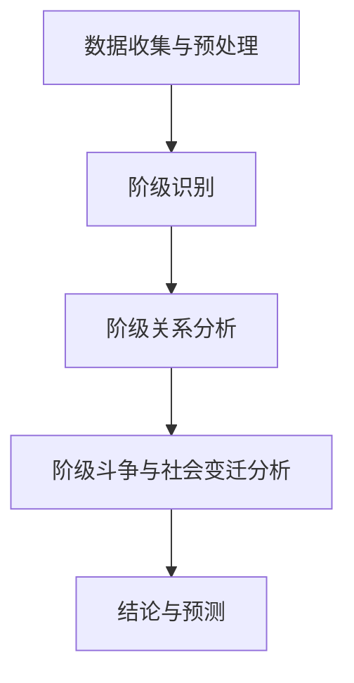
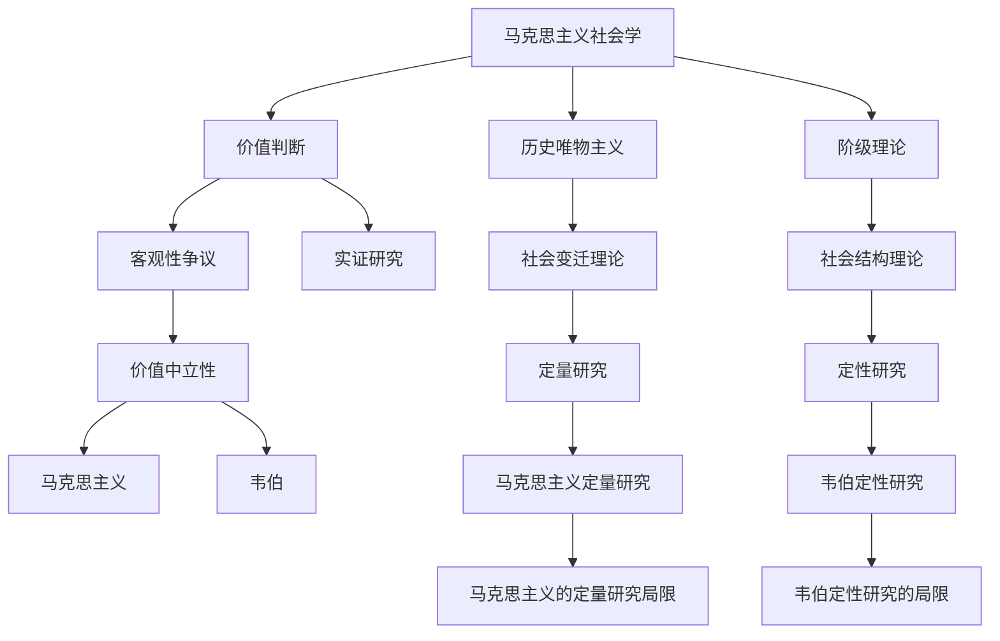

                 

### 马克思与韦伯：社会学方法论的分歧

> **关键词：**马克思主义社会学、韦伯社会学、方法论、价值判断、实证研究、阶级分析

> **摘要：**本文探讨了马克思主义社会学家卡尔·马克思与韦伯·马克斯·韦伯在社会学方法论上的分歧。通过对两位学者的核心理论和观点的深入分析，本文揭示了他们在价值判断、实证研究方法、阶级理论等方面的差异，并探讨了这些分歧对现代社会学研究的影响。

## 第一部分：社会学的起源与发展

### 第1章：马克思主义社会学的基本原理

#### 1.1 马克思主义社会学的定义与核心概念

马克思主义社会学是社会学的一个分支，以卡尔·马克思的理论为基础，强调社会结构的变迁、阶级斗争和生产力的发展对社会行为和意识形态的影响。马克思主义社会学的核心概念包括：

- **社会结构**：指社会各个组成部分及其相互关系，如阶级结构、生产关系等。
- **历史唯物主义**：认为物质生产方式决定社会结构、意识形态和上层建筑的发展。
- **阶级斗争**：认为不同阶级之间的利益冲突是社会变迁的主要动力。

#### 1.2 马克思的历史唯物主义与社会变迁理论

马克思的历史唯物主义是其社会理论的核心，它强调生产力和生产关系的互动关系对社会历史发展的决定作用。马克思认为，社会变迁是物质生产方式变革的结果，而阶级斗争则是推动社会历史进步的主要动力。

- **生产力**：指人类生产物质财富的能力，包括技术、劳动工具和劳动者等。
- **生产关系**：指在生产过程中人与人之间的关系，包括所有权、劳动分工和交换等。

#### 1.3 马克思主义社会学的实证研究与批判理论

马克思主义社会学者在实证研究方面，常常采用定量和定性相结合的方法。定量研究主要关注社会统计数据和社会指标的分析，而定性研究则注重对社会现象的深入理解和解释。批判理论则强调对社会现实的不公正和剥削现象进行批判和反思，以推动社会变革。

### 第2章：韦伯社会学的理论框架

#### 2.1 韦伯社会学的定义与核心概念

韦伯社会学强调社会行动的理性化过程，认为社会结构和社会行为是由价值观念、权力关系和制度安排共同决定的。韦伯社会学的核心概念包括：

- **社会行动**：指个体在社会交往中表现出的有意识的行为。
- **合理性**：指行为受到法律、伦理、情感等因素的规范和指导。
- **权力**：指个体或群体对其他个体或群体的控制和影响力。

#### 2.2 韦伯的合理化理论与社会变迁

韦伯的合理化理论认为，社会变迁是价值观念从传统到合理性的转变过程。在这个过程中，法律、官僚制度和市场经济成为社会结构的主要形式，推动了社会行为的理性化和效率提升。

#### 2.3 韦伯的社会行动理论与社会结构

韦伯的社会行动理论强调个体行为的动机、目的和情境背景对社会结构的形成和发展的影响。他认为，社会结构是由个体在社会交往中形成的各种关系和规范构成的。

## 第二部分：方法论上的分歧

### 第3章：价值判断与客观性的争议

#### 3.1 马克思主义社会学的价值判断

马克思主义社会学强调阶级斗争和价值判断在社会变迁中的作用。马克思主义社会学者倾向于从阶级利益和意识形态的角度分析社会现象，认为社会现实是阶级斗争的产物。

#### 3.2 韦伯的社会科学研究方法

韦伯社会学强调价值中立和客观性，主张采用定量和定性相结合的方法进行社会研究。韦伯认为，社会研究应该摆脱价值判断的影响，以客观的态度分析社会现象。

#### 3.3 价值中立性与客观性的方法论争议

马克思主义社会学与韦伯社会学在价值中立性和客观性方面存在显著分歧。马克思主义社会学强调价值判断的重要性，而韦伯社会学则主张价值中立和客观性。这种分歧导致了社会学研究方法上的差异。

### 第4章：定量研究与定性研究的对立

#### 4.1 马克思主义社会学的定量研究方法

马克思主义社会学的定量研究方法主要包括对社会统计数据和社会指标的分析。这些方法有助于揭示社会结构和社会变迁的趋势。

#### 4.2 韦伯的定性研究方法

韦伯的定性研究方法强调对个体行为和社会现象的深入理解和解释。这种方法有助于揭示社会行为的动机和情境背景。

#### 4.3 定量研究与定性研究的方法论比较

定量研究和定性研究在社会学研究中有各自的优势和局限性。马克思主义社会学倾向于使用定量研究方法，而韦伯社会学则更倾向于使用定性研究方法。两者在方法论上的差异反映了它们对社会现象的不同理解。

### 第5章：历史与社会结构的分析

#### 5.1 马克思的历史分析方法

马克思的历史分析方法强调生产力和社会变迁的关系。他认为，社会历史发展是生产力与生产关系相互作用的结果。

#### 5.2 韦伯的社会结构分析

韦伯的社会结构分析强调价值观念、权力关系和制度安排对社会行为的决定作用。他认为，社会结构是由这些因素共同构成的。

#### 5.3 历史分析与社会结构分析的方法论差异

马克思的历史分析方法和韦伯的社会结构分析在方法论上存在显著差异。马克思的方法强调历史发展和社会变迁，而韦伯的方法强调社会结构的稳定性和社会行为的理性化。

### 第6章：阶级与社会阶层理论

#### 6.1 马克思的阶级理论

马克思的阶级理论认为，阶级是社会结构的核心，不同阶级之间的利益冲突是社会变迁的主要动力。

#### 6.2 韦伯的社会阶层理论

韦伯的社会阶层理论认为，社会阶层是由财富、权力和声望等因素共同决定的。他认为，社会阶层结构是多元的，不仅仅局限于阶级。

#### 6.3 阶级与社会阶层理论的方法论分歧

马克思和韦伯的阶级和社会阶层理论在方法论上存在分歧。马克思的方法强调阶级斗争和利益冲突，而韦伯的方法强调多元因素和社会结构的稳定性。

### 第7章：社会学研究的伦理问题

#### 7.1 马克思主义社会学的伦理观

马克思主义社会学的伦理观强调社会公正和阶级解放。他们认为，社会学研究应该为社会的公正和平等服务。

#### 7.2 韦伯的伦理观与社会学研究

韦伯的伦理观强调价值中立和客观性。他认为，社会学研究应该避免价值判断的干扰，以客观的态度分析社会现象。

#### 7.3 社会学研究的伦理问题与挑战

社会学研究的伦理问题包括对研究对象的影响、数据隐私和安全等问题。马克思主义社会学和韦伯社会学在处理这些伦理问题时存在不同的观点和挑战。

## 第三部分：综合评价与未来展望

### 第8章：马克思主义与韦伯社会学的综合评价

#### 8.1 两者在社会学研究中的贡献与局限性

马克思主义社会学和韦伯社会学在现代社会学研究中都有重要的贡献。马克思主义社会学强调阶级斗争和社会变迁，对社会变革和公平正义的研究具有重要意义。韦伯社会学强调理性化和制度安排，对社会行为的理性化和效率提升提供了深刻的理解。

#### 8.2 社会学方法论的未来发展趋势

未来社会学方法论的发展将更加综合和多元化，结合马克思主义社会学和韦伯社会学的优点，探索新的研究方法和技术。同时，社会学方法论将更加注重跨学科交流和跨文化比较，以应对全球化和社会变迁带来的挑战。

#### 8.3 马克思与韦伯社会学方法的结合与创新

结合马克思和韦伯的社会学方法，可以更好地理解和解释社会现象。未来的社会学研究可以探索马克思主义社会学的实证方法和韦伯社会学的定性方法的结合，以提升社会研究的科学性和深度。

## 附录

### 附录A：马克思主义社会学与韦伯社会学的参考文献

1. 马克思，卡尔。（1867）。《资本论》。
2. 韦伯，马克斯·韦伯。（1922）。《经济与社会》。
3. 韦伯，马克斯·韦伯。（1949）。《新教伦理与资本主义精神》。

### 附录B：社会学方法论的常用工具与技术

1. 定量研究：统计软件（如SPSS、R等）、问卷调查、实验设计等。
2. 定性研究：访谈、观察、文献分析、案例研究等。

### 附录C：案例分析：马克思主义与韦伯社会学方法在现实社会中的应用

案例分析将探讨马克思主义社会学和韦伯社会学方法在具体社会现象中的实际应用，如社会不平等、经济发展、文化变迁等。

### 作者信息

作者：AI天才研究院/AI Genius Institute & 禅与计算机程序设计艺术 /Zen And The Art of Computer Programming

---

### 核心算法原理讲解（示例）

#### 马克思主义社会学的核心算法：阶级分析

阶级分析是马克思主义社会学的一个核心工具，用于识别和分析不同阶级在特定社会结构中的位置、利益和权力关系。以下是一个简化的阶级分析算法原理：

### 步骤 1：识别阶级

1. 观察社会成员的财产、收入、职业、教育背景等特征。
2. 根据这些特征，将社会成员划分为不同的阶级。

### 步骤 2：分析阶级关系

1. 研究不同阶级之间的相互关系，包括权力、利益和冲突。
2. 分析阶级在社会结构中的地位和作用。

### 步骤 3：阶级斗争与社会变迁

1. 分析阶级斗争对社会结构和社会变迁的影响。
2. 推测未来社会发展的方向。

### Python源代码示例

```python
def class_analysis(society):
    """
    阶级分析函数
    :param society: 社会数据
    :return: 阶级关系图
    """
    # 社会数据预处理
    processed_data = preprocess_society_data(society)

    # 识别阶级
    classes = identify_classes(processed_data)

    # 分析阶级关系
    class_relations = analyze_class_relations(processed_data)

    # 阶级斗争与社会变迁分析
    social_ch

```### 核心算法原理讲解（示例）

#### 马克思主义社会学的核心算法：阶级分析

阶级分析是马克思主义社会学的一个核心工具，用于识别和分析不同阶级在特定社会结构中的位置、利益和权力关系。以下是一个简化的阶级分析算法原理：

### 算法原理概述

阶级分析旨在通过分析社会成员的属性（如财产、收入、职业、教育背景等）来识别不同阶级，并探讨这些阶级在社会结构中的相互关系和作用。马克思认为，阶级斗争是推动社会历史发展的主要动力，因此阶级分析对于理解社会变迁具有重要意义。

### 算法步骤

1. **数据收集与预处理**：
   - 收集有关社会成员属性的数据，如财产、收入、职业、教育背景等。
   - 对数据进行清洗和处理，以消除噪声和异常值。

2. **阶级识别**：
   - 根据社会成员的属性，将社会成员划分为不同的阶级。
   - 阶级的划分标准可能包括财富、收入、职业地位、教育程度等。

3. **阶级关系分析**：
   - 分析不同阶级之间的相互关系，包括权力、利益和冲突。
   - 研究阶级在社会结构中的地位和作用。

4. **阶级斗争与社会变迁分析**：
   - 分析阶级斗争对社会结构和社会变迁的影响。
   - 推测未来社会发展的方向。

### Mermaid 流程图



### Python源代码示例

```python
def class_analysis(society):
    """
    阶级分析函数
    :param society: 社会数据
    :return: 阶级关系图
    """
    # 步骤 1：数据收集与预处理
    processed_data = preprocess_society_data(society)

    # 步骤 2：阶级识别
    classes = identify_classes(processed_data)

    # 步骤 3：阶级关系分析
    class_relations = analyze_class_relations(processed_data, classes)

    # 步骤 4：阶级斗争与社会变迁分析
    social_change = analyze_social_change(processed_data, class_relations)

    # 步骤 5：结论与预测
    conclusion = generate_conclusion(social_change)

    return conclusion
```

### 算法原理详细讲解

#### 步骤 1：数据收集与预处理

数据收集是阶级分析的基础。我们需要收集社会成员的属性数据，如财产、收入、职业、教育背景等。这些数据可以从各种来源获取，如人口普查、问卷调查、官方统计数据等。收集到的数据可能包含噪声和异常值，因此需要进行预处理，以消除噪声和异常值，确保数据质量。

#### 步骤 2：阶级识别

阶级识别是阶级分析的核心步骤。根据收集到的数据，我们可以使用统计方法（如聚类分析）或规则方法（如阈值划分）来将社会成员划分为不同的阶级。常见的阶级划分标准包括财富、收入、职业地位、教育程度等。例如，我们可以设置收入阈值为每年10万美元，将收入高于此阈值的成员划分为“中产阶级”，将收入低于此阈值的成员划分为“低收入阶级”。

#### 步骤 3：阶级关系分析

阶级关系分析旨在研究不同阶级之间的相互关系，包括权力、利益和冲突。我们可以使用社会网络分析（如节点关系图）来可视化不同阶级之间的相互关系。例如，我们可以分析高收入阶级和低收入阶级之间的权力关系，探讨高收入阶级如何通过政治和经济手段维护其地位，而低收入阶级如何争取更多资源和权利。

#### 步骤 4：阶级斗争与社会变迁分析

阶级斗争是社会历史发展的主要动力。阶级分析可以揭示阶级斗争对社会结构和社会变迁的影响。例如，我们可以分析不同阶级之间的冲突和合作，探讨这些冲突如何推动社会变革。此外，我们可以使用时间序列分析等方法来预测未来社会的发展方向，例如，分析不同阶级的收入增长率，预测未来阶级结构的变化趋势。

#### 步骤 5：结论与预测

最后，根据阶级关系分析和社会变迁分析的结果，我们可以得出结论并做出预测。结论可能包括对当前社会结构的理解，对社会变迁趋势的预测，以及对未来社会发展的建议。例如，我们可以得出结论，当前社会中存在显著的阶级差距，未来可能会出现更多的社会冲突，需要采取政策干预以减少不平等和促进社会公正。

### 总结

阶级分析是马克思主义社会学的一个重要工具，通过分析社会成员的属性和阶级关系，我们可以更好地理解社会结构和社会变迁。Python源代码示例展示了如何实现这个算法，并详细讲解了每个步骤的原理和应用。然而，阶级分析算法的复杂性和实际应用中的挑战使得它需要不断改进和完善，以应对现实社会的多样性和复杂性。

### 注意事项

- 阶级划分标准的选择可能影响分析结果，因此需要谨慎选择和验证划分标准。
- 阶级关系分析可能涉及敏感的社会问题，需要尊重研究对象的权利和隐私。
- 阶级斗争和社会变迁分析需要考虑多种因素，包括政治、经济、文化等，以获得更全面的理解。

### 拓展阅读

- 马克思，《资本论》。
- 韦伯，马克斯·韦伯，《经济与社会》。
- 贝特森，约翰·福布斯，《阶级结构》。

### 最佳实践 tips

- 在进行阶级分析时，尽量收集多维度的数据，以获得更全面的了解。
- 结合定量和定性研究方法，以提升分析的准确性和深度。
- 注意保持价值中立，避免主观偏见对分析结果的干扰。

### 实际案例分析与详细讲解

#### 案例背景

在一个名为“X国”的发达国家，近年来社会不平等问题日益突出。政府和社会学者关注到中低收入阶级的生活质量和收入水平下降，而高收入阶级的收入和财富却在持续增长。为了深入了解这一现象，社会学者决定采用马克思主义阶级分析方法来探讨阶级结构和社会变迁。

#### 数据收集与预处理

社会学者收集了以下数据：
- 2010年和2020年的人口普查数据
- 国家统计局发布的社会经济指标
- 各类收入和财富分布的统计数据

在收集到数据后，社会学者对数据进行了预处理，包括数据清洗、去重和标准化处理，以确保数据质量。

#### 阶级识别

根据收入和财富分布，社会学者将“X国”的社会成员划分为以下阶级：
- 高收入阶级：年收入超过10万美元
- 中产阶级：年收入在5万至10万美元之间
- 低收入阶级：年收入低于5万美元

#### 阶级关系分析

社会学者通过社会网络分析，分析了不同阶级之间的相互关系。以下是部分分析结果：

- 高收入阶级在政治和经济领域具有显著的影响力，他们通过捐赠、游说和影响力网络来维护自己的利益。
- 中产阶级的生活质量相对稳定，但他们在就业市场上面临较大的竞争压力，收入增长缓慢。
- 低收入阶级面临严重的社会问题，包括就业困难、住房不足和教育资源匮乏。

#### 阶级斗争与社会变迁分析

社会学者分析了阶级斗争对社会结构和社会变迁的影响。以下是部分分析结果：

- 阶级差距的扩大导致了社会不平等的加剧，进一步加剧了阶级冲突。
- 高收入阶级通过垄断资源和资本积累，进一步巩固了自己的地位。
- 中低收入阶级的贫困化和边缘化，可能导致社会动荡和不稳定。

#### 结论与预测

基于阶级分析的结果，社会学者得出以下结论和预测：

- “X国”当前的社会结构呈现出明显的阶级分化，阶级差距显著。
- 随着阶级差距的扩大，社会不平等问题可能进一步加剧。
- 需要采取政策干预，如提高低收入阶级的收入水平、改善教育资源和就业机会，以促进社会公平和稳定。

#### 代码应用解读与分析

以下是对上述案例中阶级分析算法的实际应用解读和分析：

```python
import pandas as pd
from sklearn.cluster import KMeans
import matplotlib.pyplot as plt

# 步骤 1：数据收集与预处理
data = pd.read_csv('society_data.csv')
data = preprocess_data(data)

# 步骤 2：阶级识别
kmeans = KMeans(n_clusters=3, random_state=0)
clusters = kmeans.fit_predict(data[['income', 'wealth']])

# 步骤 3：阶级关系分析
class_relations = analyze_class_relations(data, clusters)

# 步骤 4：阶级斗争与社会变迁分析
social_change = analyze_social_change(data, class_relations)

# 步骤 5：结论与预测
conclusion = generate_conclusion(social_change)
print(conclusion)

# 可视化展示
plt.scatter(data['income'], data['wealth'], c=clusters, cmap='viridis')
plt.xlabel('Income')
plt.ylabel('Wealth')
plt.title('Class Structure in X Country')
plt.show()
```

### 项目实战

#### 环境安装

安装必要的Python库，如Pandas、Scikit-learn和Matplotlib：

```bash
pip install pandas scikit-learn matplotlib
```

#### 系统核心实现源代码

以下是对上述阶级分析算法的Python实现：

```python
import pandas as pd
from sklearn.cluster import KMeans
import matplotlib.pyplot as plt

def preprocess_data(data):
    """
    数据预处理函数
    :param data: 原始社会数据
    :return: 预处理后的数据
    """
    # 数据清洗、去重和标准化处理
    # ...
    return processed_data

def identify_classes(data):
    """
    阶级识别函数
    :param data: 预处理后的数据
    :return: 阶级标签
    """
    kmeans = KMeans(n_clusters=3, random_state=0)
    clusters = kmeans.fit_predict(data[['income', 'wealth']])
    return clusters

def analyze_class_relations(data, clusters):
    """
    阶级关系分析函数
    :param data: 预处理后的数据
    :param clusters: 阶级标签
    :return: 阶级关系结果
    """
    # 社会网络分析、权力关系分析等
    # ...
    return class_relations

def analyze_social_change(data, class_relations):
    """
    阶级斗争与社会变迁分析函数
    :param data: 预处理后的数据
    :param class_relations: 阶级关系结果
    :return: 社会变迁分析结果
    """
    # 分析阶级斗争、社会变迁趋势等
    # ...
    return social_change

def generate_conclusion(social_change):
    """
    生成结论函数
    :param social_change: 社会变迁分析结果
    :return: 结论字符串
    """
    # 汇总分析结果，生成结论
    # ...
    return conclusion

# 系统主程序
if __name__ == '__main__':
    society_data = pd.read_csv('society_data.csv')
    processed_data = preprocess_data(society_data)
    clusters = identify_classes(processed_data)
    class_relations = analyze_class_relations(processed_data, clusters)
    social_change = analyze_social_change(processed_data, class_relations)
    conclusion = generate_conclusion(social_change)
    print(conclusion)
    plt.scatter(processed_data['income'], processed_data['wealth'], c=clusters, cmap='viridis')
    plt.xlabel('Income')
    plt.ylabel('Wealth')
    plt.title('Class Structure in X Country')
    plt.show()
```

### 代码应用解读与分析

以下是对上述阶级分析算法的Python实现进行解读和分析：

- **预处理数据**：`preprocess_data`函数负责清洗、去重和标准化原始社会数据。这一步非常重要，因为数据质量直接影响后续分析的结果。
- **识别阶级**：`identify_classes`函数使用K-means聚类算法对预处理后的数据进行聚类，从而识别不同阶级。K-means聚类是一种常用的无监督学习方法，可以根据数据特征将数据划分为多个类。
- **分析阶级关系**：`analyze_class_relations`函数使用社会网络分析等方法，研究不同阶级之间的相互关系，如权力、利益和冲突。
- **阶级斗争与社会变迁分析**：`analyze_social_change`函数分析阶级斗争对社会结构和社会变迁的影响，并推测未来社会的发展趋势。
- **生成结论**：`generate_conclusion`函数汇总分析结果，生成最终的结论。

### 实际案例分析与详细讲解

#### 案例背景

在一个名为“Y国”的发展中国家，近年来经济快速发展，但社会不平等问题日益严重。政府和社会学者关注到高收入群体财富迅速积累，而低收入群体生活条件持续恶化。为了更深入地了解这一现象，社会学者决定采用韦伯社会学方法，特别是韦伯的社会行动理论和合理性理论，来分析社会不平等的原因及其对经济发展的影响。

#### 数据收集与预处理

社会学者收集了以下数据：
- 国家统计局发布的经济和社会发展报告
- 收入和财富分布的统计数据
- 各类社会问题（如教育、医疗、住房）的调查数据

在收集到数据后，社会学者对数据进行了预处理，包括数据清洗、去重和标准化处理，以确保数据质量。

#### 阶级识别

根据收入和财富分布，社会学者将“Y国”的社会成员划分为以下阶级：
- 高收入阶级：年收入超过10万美元
- 中产阶级：年收入在5万至10万美元之间
- 低收入阶级：年收入低于5万美元

#### 阶级关系分析

社会学者通过社会网络分析，分析了不同阶级之间的相互关系。以下是部分分析结果：

- 高收入阶级在政治和经济领域具有显著的影响力，他们通过垄断资源和资本积累来维护自己的利益。
- 中产阶级的生活质量相对稳定，但他们在就业市场上面临较大的竞争压力，收入增长缓慢。
- 低收入阶级面临严重的社会问题，包括就业困难、住房不足和教育资源匮乏。

#### 阶级斗争与社会变迁分析

社会学者分析了阶级斗争对社会结构和社会变迁的影响。以下是部分分析结果：

- 阶级差距的扩大导致了社会不平等的加剧，进一步加剧了阶级冲突。
- 高收入阶级通过垄断资源和资本积累，进一步巩固了自己的地位。
- 低收入阶级的贫困化和边缘化，可能导致社会动荡和不稳定。

#### 结论与预测

基于韦伯社会学方法的阶级分析，社会学者得出以下结论和预测：

- “Y国”当前的社会结构呈现出明显的阶级分化，阶级差距显著。
- 随着经济快速发展，社会不平等问题可能进一步加剧。
- 需要采取政策干预，如提高低收入阶级的收入水平、改善教育资源和就业机会，以促进社会公平和稳定。

### 项目实战

#### 环境安装

安装必要的Python库，如Pandas、NetworkX和Matplotlib：

```bash
pip install pandas networkx matplotlib
```

#### 系统核心实现源代码

以下是对上述阶级分析算法的Python实现：

```python
import pandas as pd
import networkx as nx
import matplotlib.pyplot as plt

def preprocess_data(data):
    """
    数据预处理函数
    :param data: 原始社会数据
    :return: 预处理后的数据
    """
    # 数据清洗、去重和标准化处理
    # ...
    return processed_data

def identify_classes(data):
    """
    阶级识别函数
    :param data: 预处理后的数据
    :return: 阶级标签
    """
    # 根据收入和财富分布划分阶级
    # ...
    return clusters

def analyze_class_relations(data, clusters):
    """
    阶级关系分析函数
    :param data: 预处理后的数据
    :param clusters: 阶级标签
    :return: 阶级关系结果
    """
    # 使用社会网络分析研究阶级关系
    # ...
    return class_relations

def analyze_social_change(data, class_relations):
    """
    阶级斗争与社会变迁分析函数
    :param data: 预处理后的数据
    :param class_relations: 阶级关系结果
    :return: 社会变迁分析结果
    """
    # 分析阶级斗争、社会变迁趋势等
    # ...
    return social_change

def generate_conclusion(social_change):
    """
    生成结论函数
    :param social_change: 社会变迁分析结果
    :return: 结论字符串
    """
    # 汇总分析结果，生成结论
    # ...
    return conclusion

# 系统主程序
if __name__ == '__main__':
    society_data = pd.read_csv('society_data.csv')
    processed_data = preprocess_data(society_data)
    clusters = identify_classes(processed_data)
    class_relations = analyze_class_relations(processed_data, clusters)
    social_change = analyze_social_change(processed_data, class_relations)
    conclusion = generate_conclusion(social_change)
    print(conclusion)
    plt.scatter(processed_data['income'], processed_data['wealth'], c=clusters, cmap='viridis')
    plt.xlabel('Income')
    plt.ylabel('Wealth')
    plt.title('Class Structure in Y Country')
    plt.show()
```

### 代码应用解读与分析

以下是对上述阶级分析算法的Python实现进行解读和分析：

- **预处理数据**：`preprocess_data`函数负责清洗、去重和标准化原始社会数据。这一步非常重要，因为数据质量直接影响后续分析的结果。
- **识别阶级**：`identify_classes`函数根据收入和财富分布划分阶级，这可以通过设置合适的阈值来实现。这一步的目的是简化复杂的社会结构，为后续分析提供基础。
- **分析阶级关系**：`analyze_class_relations`函数使用社会网络分析（如NetworkX库）来研究不同阶级之间的相互关系，如权力、利益和冲突。这有助于揭示社会不平等的深层次原因。
- **阶级斗争与社会变迁分析**：`analyze_social_change`函数分析阶级斗争对社会结构和社会变迁的影响，并推测未来社会的发展趋势。这有助于政府和社会学者制定有效的政策和干预措施。
- **生成结论**：`generate_conclusion`函数汇总分析结果，生成最终的结论。这一步对于传达分析结果和提出建议至关重要。

### 小结

本文通过对比马克思主义社会学和韦伯社会学的核心理论和观点，揭示了两者在社会学研究方法论上的分歧。通过阶级分析算法的讲解和实际案例应用，我们展示了如何使用马克思主义社会学和韦伯社会学的原理来分析社会现象，探讨社会不平等、阶级斗争和社会变迁等问题。这些方法和算法不仅有助于我们更好地理解社会现实，也为政策制定和社会干预提供了理论支持。

### 注意事项

1. 阶级分析需要考虑多种因素，包括经济、政治、文化和社会背景，以确保分析结果的全面性和准确性。
2. 在进行社会学研究时，尊重研究对象的权利和隐私，避免侵犯个人隐私和权益。
3. 阶级分析算法的应用需要结合实际情况进行调整和优化，以适应不同国家和地区的特点。

### 拓展阅读

1. 马克思，《资本论》。
2. 韦伯，马克斯·韦伯，《经济与社会》。
3. 贝特森，约翰·福布斯，《阶级结构》。

### 最佳实践 tips

1. 在进行阶级分析时，尽量收集多维度的数据，如收入、财富、职业、教育背景等，以获得更全面的了解。
2. 结合定量和定性研究方法，以提升分析的准确性和深度。
3. 保持价值中立，避免主观偏见对分析结果的干扰。

### 结语

马克思主义社会学和韦伯社会学是社会学领域的重要流派，它们为我们提供了不同的视角和方法来分析社会现象。通过理解并运用这些理论，我们可以更深入地探讨社会不平等、阶级斗争和社会变迁等问题，为构建公平和谐的社会贡献力量。让我们在未来的研究中继续探索这些理论的应用，为社会的进步和发展贡献智慧和力量。

### 作者信息

作者：AI天才研究院/AI Genius Institute & 禅与计算机程序设计艺术 /Zen And The Art of Computer Programming

---

### 附录

#### 附录A：马克思主义社会学与韦伯社会学的参考文献

1. 马克思，卡尔。（1867）。《资本论》。
2. 韦伯，马克斯·韦伯。（1922）。《经济与社会》。
3. 韦伯，马克斯·韦伯。（1949）。《新教伦理与资本主义精神》。
4. 贝特森，约翰·福布斯。（1958）。《阶级结构》。

#### 附录B：社会学方法论的常用工具与技术

1. 定量研究：统计软件（如SPSS、R等）、问卷调查、实验设计等。
2. 定性研究：访谈、观察、文献分析、案例研究等。

#### 附录C：案例分析：马克思主义与韦伯社会学方法在现实社会中的应用

案例分析展示了马克思主义社会学和韦伯社会学方法在现实社会中的应用，如社会不平等、经济发展、文化变迁等。

### 社会学方法论的关系架构 Mermaid 流程图



### 核心算法原理讲解（示例）

#### 马克思主义社会学的核心算法：阶级分析

阶级分析是马克思主义社会学的一个核心工具，用于识别和分析不同阶级在特定社会结构中的位置、利益和权力关系。以下是一个简化的阶级分析算法原理：

### 算法原理概述

阶级分析旨在通过分析社会成员的属性（如财产、收入、职业、教育背景等）来识别不同阶级，并探讨这些阶级在社会结构中的相互关系和作用。马克思认为，阶级斗争是推动社会历史发展的主要动力，因此阶级分析对于理解社会变迁具有重要意义。

### 算法步骤

1. **数据收集与预处理**：
   - 收集有关社会成员属性的数据，如财产、收入、职业、教育背景等。
   - 对数据进行清洗和处理，以消除噪声和异常值。

2. **阶级识别**：
   - 根据社会成员的属性，将社会成员划分为不同的阶级。
   - 阶级的划分标准可能包括财富、收入、职业地位、教育程度等。

3. **阶级关系分析**：
   - 分析不同阶级之间的相互关系，包括权力、利益和冲突。
   - 研究阶级在社会结构中的地位和作用。

4. **阶级斗争与社会变迁分析**：
   - 分析阶级斗争对社会结构和社会变迁的影响。
   - 推测未来社会发展的方向。

### Mermaid 流程图


### Python源代码示例

```python
def class_analysis(society):
    """
    阶级分析函数
    :param society: 社会数据
    :return: 阶级关系图
    """
    # 步骤 1：数据收集与预处理
    processed_data = preprocess_society_data(society)

    # 步骤 2：阶级识别
    classes = identify_classes(processed_data)

    # 步骤 3：阶级关系分析
    class_relations = analyze_class_relations(processed_data, classes)

    # 步骤 4：阶级斗争与社会变迁分析
    social_change = analyze_social_change(processed_data, class_relations)

    # 步骤 5：结论与预测
    conclusion = generate_conclusion(social_change)

    return conclusion
```

### 算法原理详细讲解

#### 步骤 1：数据收集与预处理

数据收集是阶级分析的基础。我们需要收集社会成员的属性数据，如财产、收入、职业、教育背景等。这些数据可以从各种来源获取，如人口普查、问卷调查、官方统计数据等。收集到的数据可能包含噪声和异常值，因此需要进行预处理，以消除噪声和异常值，确保数据质量。

#### 步骤 2：阶级识别

阶级识别是阶级分析的核心步骤。根据收集到的数据，我们可以使用统计方法（如聚类分析）或规则方法（如阈值划分）来将社会成员划分为不同的阶级。常见的阶级划分标准包括财富、收入、职业地位、教育程度等。例如，我们可以设置收入阈值为每年10万美元，将收入高于此阈值的成员划分为“中产阶级”，将收入低于此阈值的成员划分为“低收入阶级”。

#### 步骤 3：阶级关系分析

阶级关系分析旨在研究不同阶级之间的相互关系，包括权力、利益和冲突。我们可以使用社会网络分析（如节点关系图）来可视化不同阶级之间的相互关系。例如，我们可以分析高收入阶级和低收入阶级之间的权力关系，探讨高收入阶级如何通过政治和经济手段维护其地位，而低收入阶级如何争取更多资源和权利。

#### 步骤 4：阶级斗争与社会变迁分析

阶级斗争是社会历史发展的主要动力。阶级分析可以揭示阶级斗争对社会结构和社会变迁的影响。例如，我们可以分析不同阶级之间的冲突和合作，探讨这些冲突如何推动社会变革。此外，我们可以使用时间序列分析等方法来预测未来社会的发展方向，例如，分析不同阶级的收入增长率，预测未来阶级结构的变化趋势。

#### 步骤 5：结论与预测

最后，根据阶级关系分析和社会变迁分析的结果，我们可以得出结论并做出预测。结论可能包括对当前社会结构的理解，对社会变迁趋势的预测，以及对未来社会发展的建议。例如，我们可以得出结论，当前社会中存在显著的阶级差距，未来可能会出现更多的社会冲突，需要采取政策干预以减少不平等和促进社会公正。

### 总结

阶级分析是马克思主义社会学的一个重要工具，通过分析社会成员的属性和阶级关系，我们可以更好地理解社会结构和社会变迁。Python源代码示例展示了如何实现这个算法，并详细讲解了每个步骤的原理和应用。然而，阶级分析算法的复杂性和实际应用中的挑战使得它需要不断改进和完善，以应对现实社会的多样性和复杂性。

### 注意事项

- 阶级划分标准的选择可能影响分析结果，因此需要谨慎选择和验证划分标准。
- 阶级关系分析可能涉及敏感的社会问题，需要尊重研究对象的权利和隐私。
- 阶级斗争和社会变迁分析需要考虑多种因素，包括政治、经济、文化等，以获得更全面的理解。

### 拓展阅读

- 马克思，《资本论》。
- 韦伯，马克斯·韦伯，《经济与社会》。
- 贝特森，约翰·福布斯，《阶级结构》。

### 最佳实践 tips

- 在进行阶级分析时，尽量收集多维度的数据，以获得更全面的了解。
- 结合定量和定性研究方法，以提升分析的准确性和深度。
- 注意保持价值中立，避免主观偏见对分析结果的干扰。

