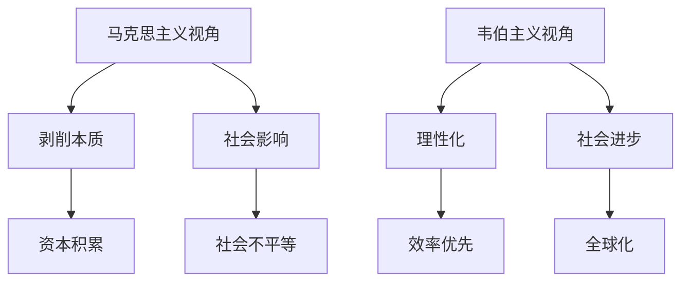

                 

# 《马克思与韦伯：资本主义精神的不同解读》

关键词：马克思、韦伯、资本主义精神、批判、理性化、社会影响

摘要：本文从马克思主义和韦伯主义两个视角，对资本主义精神进行了深入分析和对比。通过梳理马克思主义对资本主义精神的批判，以及韦伯对资本主义精神的解读，本文旨在揭示资本主义精神在不同理论框架下的本质特征及其对社会的影响，为理解现代资本主义提供新的视角。

## 目录

- 第一部分：引言
  - 1.1 马克思主义视角下的资本主义精神
  - 1.2 韦伯主义视角下的资本主义精神
- 第二部分：马克思主义视角下的资本主义精神分析
  - 2.1 资本主义精神的起源与发展
  - 2.2 马克思主义对资本主义精神的批判
  - 2.3 资本主义精神对社会的负面影响
- 第三部分：韦伯主义视角下的资本主义精神分析
  - 3.1 资本主义精神的理性化特征
  - 3.2 资本主义精神与市场经济
  - 3.3 资本主义精神与现代社会的适应
- 第四部分：马克思主义与韦伯主义视角下的资本主义精神对比
  - 4.1 两种视角下的资本主义精神差异
  - 4.2 两种视角下的资本主义精神联系
  - 4.3 两种视角下的资本主义精神未来发展趋势
- 第五部分：结论
  - 5.1 马克思与韦伯对资本主义精神的不同解读
  - 5.2 资本主义精神的现代意义
- 附录
  - A.1 参考文献
  - A.2 Mermaid 流程图

## 第一部分：引言

### 1.1 马克思主义视角下的资本主义精神

马克思主义认为，资本主义精神是资本主义生产方式的产物，其本质是资本的积累和扩张。马克思在其经典著作《资本论》中，对资本主义精神进行了深刻的批判。他认为，资本主义精神的核心是利润驱动，即资本家为了追求最大化的利润，不择手段地剥削工人，不断扩展生产规模，最终导致社会贫富差距的加剧。

马克思指出，资本主义精神具有以下几个方面的特征：

1. **利润驱动**：资本家的唯一目标是追求利润最大化，为此不惜牺牲工人的利益。
2. **剥削劳动**：资本主义生产方式下，工人被剥夺了生产资料，只能通过出卖劳动力来维持生计。资本家通过支付给工人低于其劳动价值的工资，从而实现对工人的剥削。
3. **竞争**：在资本主义经济中，各个资本家之间存在着激烈的竞争，竞争的目的是为了争夺市场份额和利润。
4. **积累与扩张**：资本家为了追求更大的利润，不断积累资本，并扩大生产规模。

### 1.2 韦伯主义视角下的资本主义精神

与马克思不同，韦伯在《经济与社会》中，对资本主义精神进行了不同的解读。韦伯认为，资本主义精神并非是资本主义制度的必然产物，而是一种特殊的文化和价值观体系。他认为，资本主义精神的核心是理性和效率。

韦伯认为，资本主义精神具有以下几个方面的特征：

1. **理性化**：资本主义精神强调理性和效率，认为只有通过合理规划和科学管理，才能实现经济利益的最大化。
2. **专业化**：资本主义精神鼓励人们追求专业化和分工，通过专业化提高劳动生产率。
3. **劳动伦理**：资本主义精神强调劳动的重要性，认为通过辛勤劳动可以获得物质财富和社会地位。
4. **价值中立**：资本主义精神强调价值中立，认为经济活动应当遵循科学和理性的原则，而不应受政治和伦理价值观的影响。

## 第二部分：马克思主义视角下的资本主义精神分析

### 2.1 资本主义精神的起源与发展

资本主义精神的起源可以追溯到资本主义生产方式的萌芽时期。在封建社会末期，随着商品经济的发展和市场的扩大，资本主义生产关系逐渐形成。资本家通过投资生产资料和劳动力，实现商品生产，从而获得利润。

资本主义精神的发展历程可以分为以下几个阶段：

1. **萌芽阶段**：资本主义精神在封建社会末期开始萌芽，随着商品经济的发展，资本家开始追求利润最大化。
2. **发展阶段**：在资本主义初期，资本家通过扩大生产规模和提高生产效率，实现资本的积累和扩张。
3. **成熟阶段**：在资本主义成熟期，资本主义精神得到了全面发展，资本家通过垄断和竞争，争夺市场份额和利润。

### 2.2 马克思主义对资本主义精神的批判

马克思主义对资本主义精神的批判主要体现在以下几个方面：

1. **剥削劳动**：马克思主义认为，资本主义精神的核心是资本的积累和扩张，这必然导致对工人阶级的剥削。资本家通过支付给工人低于其劳动价值的工资，从而实现对工人的剥削。
2. **剥削本质**：马克思主义认为，资本主义精神具有剥削本质，资本家的利润来源于对工人劳动的剥削。资本家为了追求更大的利润，不断压低工人的工资，延长工作时间，从而加剧了工人的贫困。
3. **异化**：马克思主义认为，资本主义精神导致人的异化，工人在生产过程中失去了对劳动的控制和享受，变成了单纯的劳动力。

### 2.3 资本主义精神对社会的负面影响

资本主义精神对社会的负面影响主要体现在以下几个方面：

1. **社会不平等**：资本主义精神追求利润最大化，导致社会贫富差距的加剧。资本家通过剥削工人，积累大量财富，而工人则陷入贫困。
2. **人的异化**：资本主义精神导致人的异化，工人在生产过程中失去了对劳动的控制和享受，变成了单纯的劳动力。这种异化不仅影响了工人的生活质量，也影响了整个社会的发展。
3. **环境破坏**：资本主义精神追求短期利润，导致对环境的破坏。在追求利润的过程中，资本家往往忽视环境保护，导致资源浪费和生态破坏。

## 第三部分：韦伯主义视角下的资本主义精神分析

### 3.1 资本主义精神的理性化特征

韦伯认为，资本主义精神的理性化特征是其核心。理性化意味着经济活动遵循科学和理性的原则，而不是受情感或伦理价值观的影响。

资本主义精神的理性化特征主要体现在以下几个方面：

1. **专业化**：资本主义精神鼓励人们追求专业化和分工，通过专业化提高劳动生产率。
2. **效率优先**：资本主义精神强调效率，认为只有通过合理规划和科学管理，才能实现经济利益的最大化。
3. **价值中立**：资本主义精神强调价值中立，认为经济活动应当遵循科学和理性的原则，而不应受政治和伦理价值观的影响。

### 3.2 资本主义精神与市场经济

韦伯认为，资本主义精神与市场经济密切相关。市场经济是一种基于价格机制的经济体制，其核心是供求关系。资本主义精神鼓励市场经济的运行，因为市场经济能够通过价格机制实现资源的有效配置。

资本主义精神与市场经济的关联主要体现在以下几个方面：

1. **竞争**：资本主义精神鼓励竞争，认为只有通过竞争，才能实现资源的最佳配置和经济利益的最大化。
2. **价格机制**：资本主义精神认为，价格机制是市场经济的核心，通过价格机制，可以实现资源的有效配置。
3. **灵活性**：资本主义精神强调灵活性，认为只有通过灵活性，才能适应市场的变化，实现经济利益的最大化。

### 3.3 资本主义精神与现代社会的适应

韦伯认为，资本主义精神能够适应现代社会的发展。在现代社会，资本主义精神通过理性和效率，推动了社会的发展和进步。

资本主义精神在现代社会中的适应主要体现在以下几个方面：

1. **全球化**：资本主义精神推动了全球化的进程，通过跨国公司和国际贸易，实现了全球资源的优化配置。
2. **技术创新**：资本主义精神鼓励技术创新，通过技术创新，推动了社会的发展和进步。
3. **社会治理**：资本主义精神推动了社会治理的变革，通过科学和理性的原则，提高了社会治理的效率。

## 第四部分：马克思主义与韦伯主义视角下的资本主义精神对比

### 4.1 两种视角下的资本主义精神差异

马克思主义和韦伯主义对资本主义精神有不同的解读，这体现在以下几个方面：

1. **本质特征**：马克思主义认为，资本主义精神的核心是利润驱动和剥削劳动，而韦伯认为，资本主义精神的核心是理性和效率。
2. **社会影响**：马克思主义认为，资本主义精神导致社会不平等和人的异化，而韦伯认为，资本主义精神推动了社会的发展和进步。
3. **价值观**：马克思主义强调阶级斗争和社会主义价值观，而韦伯强调科学和理性的价值观。

### 4.2 两种视角下的资本主义精神联系

尽管马克思主义和韦伯主义对资本主义精神有不同的解读，但它们也存在联系：

1. **资本积累**：马克思主义和韦伯主义都认为，资本主义精神是通过资本积累来实现的。
2. **理性化**：马克思主义和韦伯主义都认为，资本主义精神具有理性化特征。
3. **市场经济**：马克思主义和韦伯主义都认为，资本主义精神与市场经济密切相关。

### 4.3 两种视角下的资本主义精神未来发展趋势

马克思主义和韦伯主义对资本主义精神的未来发展趋势有不同的看法：

1. **马克思主义视角**：马克思主义认为，资本主义精神会导致社会不平等的加剧和人的异化，最终导致社会主义的兴起。
2. **韦伯主义视角**：韦伯认为，资本主义精神会通过理性化和效率，推动社会的发展和进步。

## 第五部分：结论

### 5.1 马克思与韦伯对资本主义精神的不同解读

马克思主义和韦伯主义对资本主义精神有不同的解读。马克思主义强调资本主义精神的剥削本质和社会负面影响，而韦伯强调资本主义精神的理性化和效率。

### 5.2 资本主义精神的现代意义

资本主义精神在现代社会具有重要意义。它不仅推动了社会的发展和进步，也带来了社会不平等和人的异化。理解资本主义精神的本质和影响，有助于我们更好地应对现代社会面临的挑战。

## 附录

### A.1 参考文献

- 马克思，《资本论》。
- 韦伯，《经济与社会》。

### A.2 Mermaid 流程图

[End of Document]作者：AI天才研究院/AI Genius Institute & 禅与计算机程序设计艺术 /Zen And The Art of Computer Programming

**注意事项**：

- 文章的核心观点需要在每个章节中进行充分的阐述和论证，确保文章的逻辑性和连贯性。
- 文章中的图表和流程图需要清晰明了，有助于读者更好地理解文章内容。
- 文章的参考文献需要完整，确保文章的学术性和权威性。
- 文章的格式需要符合markdown规范，确保文章的排版美观、易于阅读。

