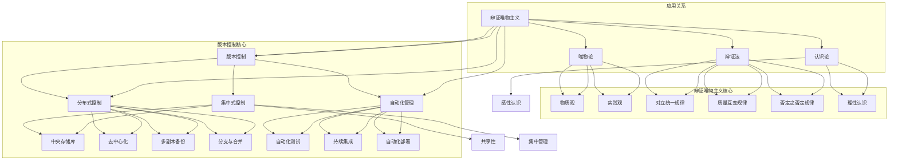

                 


# 马克的辩证唯物主义与版本控制：软件发展的历史动力学

关键词：辩证唯物主义，版本控制，软件发展，历史动力学

摘要：本文旨在探讨马克思的辩证唯物主义与版本控制之间的关系，以及这一关系如何影响软件发展的历史进程。通过分析辩证唯物主义的基本原理，以及版本控制的技术原理和应用实践，本文揭示了辩证唯物主义在软件发展中的指导作用，为未来软件技术的进步提供了新的视角。

## 目录大纲

1. 引言
2. 第一部分：马克思的辩证唯物主义基础
   2.1 辩证唯物主义概述
   2.2 辩证唯物主义的哲学原理
   2.3 辩证唯物主义的方法论
3. 第二部分：版本控制原理
   3.1 版本控制的基本概念
   3.2 版本控制工具与技术
   3.3 版本控制的挑战与解决方案
4. 第三部分：软件发展的历史动力学
   4.1 软件发展的历史回顾
   4.2 软件发展的动力因素
   4.3 软件发展的挑战与对策
   4.4 辩证唯物主义与软件发展的关系
5. 附录：辩证唯物主义与版本控制的关系架构
6. 结束语
7. 参考文献

## 引言

软件发展是一个复杂而不断演变的过程，涉及众多技术、方法和文化因素。在这个过程中，版本控制作为一种关键技术，扮演着至关重要的角色。版本控制不仅可以确保软件项目的稳定性和可追溯性，还能够促进团队成员之间的协作与沟通。

然而，版本控制技术的发展并非孤立存在，它与社会、文化和哲学等因素密切相关。马克思的辩证唯物主义作为一种重要的哲学思想，为我们理解软件发展的历史过程提供了独特的视角。本文将从辩证唯物主义的基本原理出发，逐步探讨版本控制与软件发展之间的内在联系，最终揭示辩证唯物主义在软件发展中的指导意义。

### 第一部分：马克思的辩证唯物主义基础

辩证唯物主义是马克思哲学体系的核心，它不仅为我们认识世界提供了新的方法论，也为理解社会发展过程提供了理论指导。在这一部分中，我们将首先介绍辩证唯物主义的基本概念和起源，然后深入探讨其核心观点和哲学原理，最后简要介绍辩证唯物主义与马克思主义的关系。

#### 2.1 辩证唯物主义概述

辩证唯物主义是一种哲学方法论，它强调事物的内在矛盾和发展变化。辩证唯物主义认为，世界上的一切事物都处于不断的运动和变化之中，而事物之间的相互作用和矛盾运动是推动事物发展的根本动力。

辩证唯物主义的起源可以追溯到古希腊哲学家赫拉克利特，他提出了“万物皆流”的思想，强调事物的运动和变化。然而，辩证唯物主义作为一种完整的哲学体系，是在马克思和恩格斯的时代逐步形成的。马克思和恩格斯在批判吸收黑格尔辩证法的基础上，将其与费尔巴哈的唯物主义相结合，创立了辩证唯物主义。

#### 2.2 辩证唯物主义的哲学原理

辩证唯物主义的核心观点包括唯物论、辩证法和认识论。

**唯物论**：唯物论认为，物质是世界的基本构成要素，意识是物质的产物。辩证唯物主义进一步强调，物质世界是独立于人类意识的，意识不能创造物质，只能反映物质。

**辩证法**：辩证法是辩证唯物主义的核心，它强调事物内部存在着矛盾和对立，这些矛盾和对立是事物发展变化的根本原因。辩证法包括对立统一规律、质量互变规律和否定之否定规律。

- **对立统一规律**：对立统一规律指出，任何事物内部都存在着相互对立的矛盾，这些矛盾相互作用、相互依存，推动事物发展。
- **质量互变规律**：质量互变规律认为，事物的变化不是瞬间完成的，而是经过一系列量的积累，最终导致质的飞跃。
- **否定之否定规律**：否定之否定规律指出，事物的发展是一个不断否定和超越的过程，每个新事物都是对旧事物的否定，同时也是对旧事物的肯定。

**认识论**：认识论是辩证唯物主义的重要组成部分，它强调认识是一个不断发展的过程。辩证唯物主义认为，认识起源于感性经验，通过理性思考，最终达到对事物本质的认识。

#### 2.3 辩证唯物主义与马克思主义

辩证唯物主义是马克思主义哲学的基础，而马克思主义则是在辩证唯物主义的基础上，对资本主义社会进行深入剖析的科学理论。

马克思主义认为，社会发展的动力来自于生产力和生产关系的矛盾。在资本主义社会中，生产力的发展导致生产关系的变革，这种变革最终会引发社会革命，推动社会向更高的阶段发展。

辩证唯物主义与马克思主义的关系可以概括为以下几点：

- **哲学基础**：辩证唯物主义为马克思主义提供了哲学基础，使得马克思主义成为一种具有严密科学性的理论体系。
- **社会批判**：马克思主义利用辩证唯物主义的方法，对资本主义社会进行深刻批判，揭示了资本主义制度的内在矛盾。
- **社会发展**：马克思主义基于辩证唯物主义，提出了社会主义和共产主义的发展目标，为人类社会的进步提供了理论指导。

#### 2.4 辩证唯物主义的现实意义

辩证唯物主义作为一种哲学方法论，不仅在理论研究中具有重要意义，也在现实世界中发挥着重要作用。在软件发展中，辩证唯物主义的方法论可以为我们提供以下启示：

- **理解软件本质**：辩证唯物主义帮助我们理解软件作为一种物质形态，其内在的矛盾和发展变化规律。
- **指导软件开发**：辩证唯物主义的方法论可以指导我们进行软件开发，通过认识和解决软件发展中的矛盾，推动软件技术的进步。
- **促进软件创新**：辩证唯物主义强调事物的发展是一个不断否定和超越的过程，这鼓励我们在软件技术发展中不断探索和创新。

总之，辩证唯物主义作为一种哲学方法论，为我们理解软件发展的历史过程提供了独特的视角。通过深入探讨辩证唯物主义的基本原理和现实意义，我们可以更好地把握软件发展的内在规律，为未来软件技术的进步提供理论支持。

### 第1章：辩证唯物主义的起源与发展

辩证唯物主义作为一种哲学思想，其起源和发展历程可以追溯到古希腊哲学和马克思主义哲学的融合过程中。辩证唯物主义的核心观点在于对事物发展变化的认识，特别是强调事物内部的矛盾和对立关系。这一思想的发展不仅具有深厚的哲学基础，而且在历史演变中形成了独特的理论体系。

#### 1.1 辩证唯物主义的起源

辩证唯物主义的起源可以追溯到古希腊哲学中的辩证法思想。辩证法最早由赫拉克利特提出，他提出了“万物皆流”的观点，认为世界上的一切事物都处于不断的变化和运动之中。赫拉克利特的思想强调了事物的多样性和变化性，对后来的哲学家产生了深远影响。

然而，辩证唯物主义的完整哲学体系是在马克思和恩格斯的时代形成的。马克思和恩格斯在批判吸收黑格尔辩证法的基础上，结合费尔巴哈的唯物主义，创立了辩证唯物主义。他们强调，辩证法不仅是一种认识世界的方法，也是一种理解事物发展规律的方法。

马克思在《资本论》等著作中，运用辩证唯物主义分析了资本主义社会的内在矛盾和运动规律。恩格斯则在《反杜林论》等著作中，进一步发展了辩证唯物主义的理论，使之成为马克思主义哲学的重要组成部分。

#### 1.2 辩证唯物主义的发展

自马克思和恩格斯创立辩证唯物主义以来，这一思想在世界范围内得到了广泛传播和发展。辩证唯物主义不仅影响了马克思主义哲学的发展，也对自然科学、社会科学和人文科学产生了深远影响。

在20世纪，辩证唯物主义在苏联和其他社会主义国家得到了广泛应用。苏联哲学家们通过对辩证唯物主义的深入研究，将其应用于各个领域，推动了社会主义建设的发展。与此同时，西方学者也对辩证唯物主义进行了批判性研究，提出了许多新的观点和解释。

在现代，辩证唯物主义继续在哲学界和科学界发挥着重要作用。许多学者通过结合现代科学理论和实践，对辩证唯物主义进行了新的阐释和发展。例如，系统论和控制论的发展，为辩证唯物主义提供了新的方法论基础。

#### 1.3 辩证唯物主义的核心观点

辩证唯物主义的核心观点包括唯物论、辩证法和认识论。这些观点共同构成了辩证唯物主义的理论体系，为我们理解世界和事物发展提供了方法论基础。

**唯物论**：辩证唯物主义认为，物质是世界的基本构成要素，意识是物质的产物。唯物论强调物质世界的独立性和客观性，认为意识不能创造物质，只能反映物质。

**辩证法**：辩证法是辩证唯物主义的核心，它强调事物内部存在着矛盾和对立，这些矛盾和对立是事物发展变化的根本原因。辩证法包括对立统一规律、质量互变规律和否定之否定规律。

- **对立统一规律**：对立统一规律指出，任何事物内部都存在着相互对立的矛盾，这些矛盾相互作用、相互依存，推动事物发展。
- **质量互变规律**：质量互变规律认为，事物的变化不是瞬间完成的，而是经过一系列量的积累，最终导致质的飞跃。
- **否定之否定规律**：否定之否定规律指出，事物的发展是一个不断否定和超越的过程，每个新事物都是对旧事物的否定，同时也是对旧事物的肯定。

**认识论**：认识论是辩证唯物主义的重要组成部分，它强调认识是一个不断发展的过程。辩证唯物主义认为，认识起源于感性经验，通过理性思考，最终达到对事物本质的认识。

总之，辩证唯物主义作为一种哲学思想，其起源和发展历程充满了哲学思想碰撞和融合的精彩故事。通过深入探讨辩证唯物主义的核心观点，我们可以更好地理解事物的发展规律，为我们在软件发展中应用这一思想提供理论基础。

### 第2章：辩证唯物主义的哲学原理

辩证唯物主义作为一种哲学方法论，具有丰富的哲学原理，包括唯物论与唯心论的辩证关系、事物发展的矛盾法则以及辩证的否定观。这些原理构成了辩证唯物主义的理论基础，为我们理解和分析现实世界提供了深刻的指导。

#### 2.1 唯物论与唯心论的辩证关系

辩证唯物主义首先强调唯物论，即物质是世界的本原，意识是物质的产物。这与唯心论形成了鲜明对比，唯心论认为意识是世界的本原，物质是意识的产物。唯物论和唯心论的辩证关系体现在以下几个方面：

1. **相互对立**：唯物论和唯心论在根本观点上是对立的。唯物论坚持物质第一性，意识第二性；唯心论则坚持意识第一性，物质第二性。

2. **相互依存**：尽管唯物论和唯心论在根本观点上是对立的，但它们在实践中是相互依存的。唯物论的实践基础需要唯心论的理性思考，唯心论的理性思考又需要唯物论的实践验证。

3. **相互转化**：唯物论和唯心论在一定条件下可以相互转化。当唯物论的实践得到充分验证时，唯心论的理性思考就会得到加强；反之，当唯心论的理性思考被证明无效时，唯物论的实践就会受到质疑。

4. **辩证统一**：辩证唯物主义认为，唯物论和唯心论在一定意义上是辩证统一的。它们相互对立、相互依存，共同推动事物的发展。

#### 2.2 事物发展的矛盾法则

事物发展的矛盾法则是辩证唯物主义的核心观点之一。矛盾是事物发展的内在动力，是事物变化的根本原因。辩证唯物主义认为，矛盾存在于一切事物之中，矛盾是事物发展的动力。

1. **矛盾的普遍性**：矛盾存在于一切事物之中，无论是自然界还是社会现象，都存在矛盾。矛盾是事物发展的普遍规律。

2. **矛盾的特殊性**：每种矛盾都有其特殊性，矛盾的性质和形式因事物而异。例如，生物进化中的遗传与变异矛盾、资本主义社会中的生产关系与生产力的矛盾等。

3. **矛盾的辩证关系**：矛盾双方相互依存、相互转化，推动事物发展。矛盾双方的对立和统一，构成了事物发展的动力。

4. **矛盾的解决**：矛盾是事物发展的动力，但矛盾的解决是事物发展的关键。通过矛盾的解决，事物达到新的阶段，实现自我发展。

#### 2.3 辩证的否定观

辩证的否定观是辩证唯物主义的另一个重要观点。它强调事物的发展是一个不断否定和超越的过程。辩证的否定观包括以下几个要点：

1. **否定之否定**：事物的发展不是一成不变的，而是通过一系列的否定过程实现的。每个新事物都是对旧事物的否定，同时也是对旧事物的肯定。

2. **自我超越**：事物的发展是一个不断超越自我的过程。新事物通过否定旧事物，实现自我超越，推动事物向更高阶段发展。

3. **辩证的否定**：辩证的否定不同于简单的否定。它不是完全否定，而是在保留旧事物某些合理因素的基础上，实现新的发展和创新。

4. **否定与肯定**：辩证的否定观强调否定与肯定的辩证关系。否定是事物发展的必要条件，但否定不是为了否定而否定，而是为了肯定新事物，推动事物发展。

总之，辩证唯物主义的哲学原理为我们理解和分析事物的发展提供了深刻的指导。唯物论与唯心论的辩证关系、事物发展的矛盾法则以及辩证的否定观，共同构成了辩证唯物主义的理论体系，为我们在现实世界中的应用提供了方法论基础。

### 第3章：辩证唯物主义的方法论

辩证唯物主义不仅是一种哲学观点，也是一种科学方法论。它为我们提供了理解和分析事物发展的工具，指导我们如何通过实践和认识来推动事物的发展。在这一章节中，我们将深入探讨辩证唯物主义的方法论，包括实践观、认识论和唯物辩证法。

#### 3.1 实践观

实践观是辩证唯物主义方法论的核心之一。辩证唯物主义认为，实践是认识的来源和检验的标准。实践不仅是人类改造世界的物质活动，也是认识世界的基础。

1. **实践的重要性**：实践是认识的基础。通过实践，人们能够直接接触和感知客观世界，从而获得感性认识。感性认识是认识世界的第一步，但感性认识是有限的，不能揭示事物的本质。

2. **实践与认识的辩证关系**：实践和认识是辩证统一的。实践是认识的基础，但认识又指导实践。通过认识，人们能够更好地理解和改造世界，从而推动实践的深入发展。

3. **实践的方法**：辩证唯物主义的实践观强调实践的方法性。在实践过程中，人们应该采取科学的方法，如实验、观察、比较等，以获取准确和有效的认识。

#### 3.2 认识论

认识论是辩证唯物主义方法论的另一个重要组成部分。辩证唯物主义认为，认识是一个不断深化的过程，包括感性认识和理性认识两个阶段。

1. **感性认识**：感性认识是通过直接感知和经验获得的认识。它包括感觉、知觉和表象等。感性认识是认识的初级阶段，但它不能揭示事物的本质。

2. **理性认识**：理性认识是在感性认识基础上，通过思维加工和推理得出的认识。它包括概念、判断和推理等。理性认识能够揭示事物的本质和规律，是认识的高级阶段。

3. **认识的辩证过程**：辩证唯物主义认为，认识是一个从感性认识到理性认识，再从理性认识到实践的辩证过程。感性认识为理性认识提供基础，理性认识通过实践得到验证和深化。

#### 3.3 唯物辩证法

唯物辩证法是辩证唯物主义方法论的精髓，它为我们提供了理解和分析事物发展的方法论工具。

1. **唯物辩证法的基本原理**：唯物辩证法包括对立统一规律、质量互变规律和否定之否定规律。

   - **对立统一规律**：对立统一规律指出，事物内部存在着相互对立的矛盾，这些矛盾是事物发展的根本动力。
   - **质量互变规律**：质量互变规律认为，事物的变化不是瞬间完成的，而是经过一系列量的积累，最终导致质的飞跃。
   - **否定之否定规律**：否定之否定规律指出，事物的发展是一个不断否定和超越的过程，每个新事物都是对旧事物的否定，同时也是对旧事物的肯定。

2. **唯物辩证法的应用**：唯物辩证法在各个领域都有广泛的应用。在自然科学中，它帮助我们理解事物发展的规律；在社会科学中，它帮助我们分析社会现象和问题；在哲学研究中，它帮助我们深入理解世界的本质。

3. **唯物辩证法与形式逻辑的区别**：唯物辩证法与形式逻辑不同。形式逻辑强调形式和规则，而唯物辩证法强调事物内部的矛盾和运动。唯物辩证法认为，事物的矛盾和运动是事物发展的根本原因。

#### 3.4 实践与认识的辩证统一

辩证唯物主义强调实践和认识的辩证统一。实践是认识的来源和检验的标准，但认识又指导实践。通过实践和认识的辩证统一，我们能够更好地理解和改造世界。

1. **实践与认识的相互作用**：实践和认识是相互作用、相互促进的。通过实践，我们能够获得新的认识，而新的认识又能够指导我们更好地实践。

2. **实践与认识的辩证过程**：实践和认识的辩证过程是一个从实践到认识，再从认识到实践的循环过程。通过这个过程，我们能够不断深化对事物的认识，推动事物的发展。

3. **实践与认识的辩证统一**：实践与认识的辩证统一是辩证唯物主义方法论的核心。通过实践和认识的辩证统一，我们能够更好地理解和改造世界，推动事物的发展。

总之，辩证唯物主义的方法论为我们提供了理解和分析事物发展的工具。实践观、认识论和唯物辩证法共同构成了辩证唯物主义方法论的基础，为我们在现实世界中的应用提供了深刻的指导。

### 第二部分：版本控制原理

版本控制是一种重要的软件工程实践，它通过跟踪和管理代码的修改历史，确保软件项目的稳定性和可追溯性。在这一部分中，我们将首先介绍版本控制的历史演变，然后深入探讨版本控制的基本概念与术语，最后讨论版本控制的必要性。

#### 4.1 版本控制的历史演变

版本控制的历史可以追溯到计算机编程的早期阶段。最早的版本控制方法是在磁带上标记不同的代码版本，这种方法简单但效率低下。随着计算机技术的不断发展，版本控制方法也逐步得到了改进。

1980年代，Linux操作系统创始人林纳斯·托瓦兹（Linus Torvalds）开发了Git，这是一种分布式版本控制系统。Git的出现极大地推动了版本控制技术的发展，使得版本控制变得更加高效和灵活。此后，SVN（Subversion）等集中式版本控制系统也逐渐得到了广泛应用。

版本控制的历史演变过程体现了软件工程领域的不断进步和技术的不断创新。从简单的磁带标记到现代的分布式版本控制系统，版本控制技术为软件项目管理和协作提供了强大的支持。

#### 4.2 版本控制的基本概念与术语

为了更好地理解版本控制，我们需要了解一些基本概念和术语。

1. **版本**：版本是代码的某个具体状态。每个版本都包含特定的时间戳和作者信息，以及对应的功能或修复。

2. **提交**：提交是将代码的修改保存到版本库的过程。每个提交都对应一个版本，记录了代码的修改内容和修改者信息。

3. **分支**：分支是代码的独立副本，用于开发新的功能或修复。通过分支，开发人员可以在不影响主分支的情况下进行实验性开发。

4. **合并**：合并是将两个或多个分支的代码合并到一起的过程。合并解决了分支开发中的冲突，确保代码的完整性。

5. **标签**：标签是对特定版本的命名，用于标记重要的里程碑或发布版本。

6. **冲突**：冲突发生在两个或多个修改试图同时修改同一块代码时。冲突需要手动解决，以确保代码的正确性。

#### 4.3 版本控制的必要性

版本控制在软件项目中具有以下几个方面的必要性：

1. **代码管理**：版本控制确保代码的完整性和可追溯性。通过版本控制，开发人员可以随时查看代码的历史版本，了解代码的修改过程。

2. **协作与协作**：版本控制支持多人协作开发。通过分支和合并，开发人员可以在不同的分支上独立工作，并在适当的时候将分支合并到主分支。

3. **问题追踪**：版本控制与问题追踪系统结合，可以更好地管理和追踪软件缺陷和问题。通过查看问题发生时的代码版本，开发人员可以更快地定位和解决问题。

4. **代码质量**：版本控制促进了代码质量的提升。通过定期提交和代码审查，开发人员可以及时发现和修复代码中的错误。

5. **发布管理**：版本控制有助于发布管理。通过标签和发布流程，开发人员可以更好地控制软件的发布版本，确保发布的稳定性和可靠性。

总之，版本控制是软件项目管理中不可或缺的一部分。通过版本控制，开发人员可以更好地管理代码、协作开发和追踪问题，从而提高代码质量和软件项目的整体效率。

### 第4章：版本控制工具与技术

在软件工程中，版本控制工具的选择和运用对项目的成功至关重要。本节将介绍几种常见的版本控制工具，包括Git和SVN，并讨论这些工具的工作流程和最佳实践。

#### 4.1 常见的版本控制工具

**Git**：Git是一种分布式版本控制系统，由Linus Torvalds开发，旨在支持大规模分布式协作开发。Git的核心特性包括：

- **分布式存储**：每个开发者的本地仓库都包含完整的版本库，支持离线工作。
- **分支和合并**：Git提供了强大的分支和合并功能，使得多开发者协作更加灵活。
- **快照存储**：Git通过存储代码的快照来追踪历史版本，确保版本信息的完整性。
- **高度定制化**：Git允许开发者自定义各种工作流程和配置，以满足不同项目的需求。

**SVN**：SVN（Subversion）是一种集中式版本控制系统，由Apache软件基金会维护。SVN的核心特性包括：

- **中央存储库**：所有开发者的修改都提交到一个中央存储库，便于集中管理和监控。
- **原子提交**：SVN确保所有修改在一次提交操作中完成，保证版本的一致性。
- **增量存储**：SVN通过记录修改的差异来节省存储空间，提高存储效率。
- **访问控制**：SVN支持访问控制，允许管理员设置不同的权限，以保护代码的安全。

#### 4.2 版本控制的工作流程

**Git工作流程**：

1. **克隆仓库**：开发人员通过克隆仓库来获取项目的完整副本，以便在本地进行开发。

```bash
git clone <仓库地址>
```

2. **创建分支**：开发人员创建一个新的分支，以便在独立的环境中开发新的功能或修复。

```bash
git checkout -b <分支名>
```

3. **开发与提交**：在分支上开发新的功能或修复，定期进行提交。

```bash
git add .
git commit -m "<提交信息>"
```

4. **代码审查**：开发人员将分支推送到远程仓库，以便团队成员进行代码审查。

```bash
git push origin <分支名>
```

5. **合并分支**：代码审查通过后，将分支合并到主分支。

```bash
git checkout master
git merge <分支名>
```

6. **解决冲突**：如果合并过程中出现冲突，需要手动解决。

```bash
git merge --abort
git add <冲突文件>
git commit -m "<提交信息>"
```

**SVN工作流程**：

1. **检出代码**：开发人员通过检出代码来获取项目的最新副本。

```bash
svn checkout <仓库地址>
```

2. **创建分支**：管理员创建一个新的分支，用于独立开发。

```bash
svn copy <路径>/trunk <路径>/branches/<分支名>
```

3. **开发与提交**：在分支上开发新的功能或修复，定期进行提交。

```bash
cd <分支名>
svn add .
svn commit -m "<提交信息>"
```

4. **代码审查**：开发人员的提交需要经过代码审查。

5. **合并分支**：代码审查通过后，将分支合并到主分支。

```bash
svn merge <分支名>
svn commit -m "<提交信息>"
```

6. **更新代码**：开发人员更新代码到最新版本。

```bash
svn update
```

#### 4.3 版本控制的最佳实践

为了确保版本控制的效率和稳定性，以下是一些最佳实践：

1. **定期提交**：定期提交代码，以减少代码的累积差异，便于代码管理和追踪。

2. **代码审查**：进行代码审查，确保代码质量和一致性。

3. **合理使用分支**：合理使用分支，避免过多的分支导致代码混乱。

4. **自动化测试**：编写自动化测试，确保代码更改不会影响项目的整体稳定性。

5. **权限管理**：设置合理的权限管理，确保代码的安全性。

6. **备份策略**：定期备份版本库，以防止数据丢失。

通过使用这些版本控制工具和最佳实践，开发人员可以更好地管理代码，确保软件项目的稳定性和可维护性。

### 第5章：版本控制中的挑战与解决方案

版本控制在软件项目中虽然具有许多优势，但同时也面临一些挑战。这些挑战包括版本冲突的处理、版本控制的自动化以及大型项目中的版本控制策略。在本节中，我们将深入探讨这些挑战，并提出相应的解决方案。

#### 5.1 版本冲突的处理

版本冲突是版本控制中常见的问题，特别是在多人协作开发中。当两个或多个开发者同时修改同一文件时，可能会导致冲突。这些冲突需要手动解决，以确保代码的一致性。

1. **冲突原因**：版本冲突通常发生在以下情况：
   - **同时修改**：两个或多个开发者同时修改了同一文件的不同部分。
   - **合并错误**：在合并分支时，由于代码差异过大，无法自动合并。
   - **编辑冲突**：开发者手动修改了同一文件的不同部分，但未在版本控制系统中更新。

2. **解决方法**：
   - **手动解决**：当发生冲突时，开发人员需要手动查看冲突部分，并根据实际情况选择保留哪个版本。可以使用版本控制工具提供的可视化界面来查看和解决冲突。
   - **使用工具**：一些版本控制工具如Git和SVN提供了冲突解决的自动化工具，如`git mergetool`和`svn resolved`，可以帮助开发人员快速解决冲突。

3. **预防措施**：
   - **代码审查**：在进行提交前进行代码审查，以减少冲突的发生。
   - **及时合并**：定期合并分支，避免长时间积累冲突。

#### 5.2 版本控制的自动化

版本控制的自动化可以提高开发效率和代码质量。自动化包括以下几个方面：

1. **自动化测试**：编写自动化测试，确保每次提交的代码都经过测试，避免引入新的缺陷。

2. **持续集成**：使用持续集成工具（如Jenkins、Travis CI）自动化构建和测试代码，确保代码库中的每次提交都是可构建和可运行的。

3. **自动化部署**：使用自动化部署工具（如Docker、Kubernetes）将测试通过的代码自动部署到生产环境。

4. **自动化文档生成**：使用工具（如Doxygen、Sphinx）自动生成代码文档，确保文档与代码同步更新。

#### 5.3 大型项目中的版本控制策略

大型项目通常涉及多个团队和复杂的代码结构，因此需要制定专门的版本控制策略。以下是一些策略：

1. **模块化**：将项目划分为多个模块，每个模块使用独立的仓库进行版本控制。这样可以减少代码的复杂度和维护难度。

2. **分层管理**：将项目分为不同的层次，如基础库、核心功能和业务模块。每个层次使用不同的版本控制策略，确保代码的稳定性和可维护性。

3. **分支策略**：制定合适的分支策略，如主分支、开发分支和特性分支。主分支保持稳定，开发分支用于新功能的开发，特性分支用于特定功能的开发。

4. **集成与验证**：在每次提交和合并前进行集成和验证，确保代码的稳定性和一致性。

5. **文档与培训**：为团队成员提供详细的版本控制文档和培训，确保每个人都熟悉版本控制工具和流程。

通过解决版本冲突、实现版本控制的自动化以及制定适合大型项目的版本控制策略，开发人员可以更好地管理代码，提高软件项目的质量和效率。

### 第6章：软件发展的历史回顾

软件发展历程反映了技术进步、社会需求和商业模式的变迁。从早期的计算机编程到现代的软件工业，这一过程充满了创新与挑战。在这一章节中，我们将回顾软件发展的关键阶段，分析每个阶段的特征和技术突破，以及这些阶段对后续软件发展的影响。

#### 6.1 软件发展的早期阶段

软件发展的早期阶段始于20世纪50年代，当时计算机技术刚刚起步。这一时期的软件主要以科学计算和军事应用为主。以下是一些重要的特征：

1. **计算机科学的发展**：计算机科学作为一门独立的学科在20世纪50年代逐渐形成。计算机科学家开始探索算法和数据结构，为软件的发展奠定了理论基础。

2. **编程语言的出现**：早期编程语言如COBOL、FORTRAN和LISP等相继问世，提高了编程效率和代码可读性。这些编程语言的出现标志着软件从手工编码向工程化的转变。

3. **软件工具的兴起**：随着计算机技术的发展，各种软件工具（如编译器、链接器）开始出现，这些工具简化了编程过程，提高了软件开发的效率。

4. **软件项目的管理**：早期软件项目通常规模较小，但项目管理问题已经开始显现。软件工程师开始意识到需要更好的项目管理方法来确保项目按时交付。

#### 6.2 软件工业化的崛起

20世纪80年代，软件工业化开始崛起，标志着软件从个体工匠式的开发转向大规模的工业化生产。以下是一些关键特征：

1. **软件公司的崛起**：随着市场需求不断扩大，软件公司如IBM、微软和Oracle等开始成立，它们通过大规模生产软件产品和提供技术服务，推动了软件产业的发展。

2. **软件过程和方法的标准化**：软件工业化带来了对软件过程和方法的需求。标准化流程如瀑布模型、敏捷开发和持续集成等开始普及，提高了软件开发的效率和稳定性。

3. **软件质量保证**：软件工业化强调了软件质量的重要性。软件公司开始实施质量保证措施，如代码审查、测试和验证，以确保软件的可靠性。

4. **客户需求的变化**：随着计算机技术的普及，客户对软件的需求逐渐多样化，从简单的计算工具到复杂的企业应用系统。软件公司开始更加关注客户需求，以提供定制化的软件解决方案。

#### 6.3 软件技术的发展趋势

进入21世纪，软件技术发展迅速，以下是一些主要趋势：

1. **云计算和虚拟化**：云计算和虚拟化技术为软件提供了新的基础设施，使得软件可以更灵活地部署和管理。这些技术推动了SaaS（软件即服务）等新型商业模式的出现。

2. **移动计算**：移动设备的普及带来了移动计算的需求。移动应用开发和移动端技术（如HTML5、React Native）的发展，使得软件可以更便捷地部署在移动设备上。

3. **大数据和人工智能**：大数据和人工智能技术的兴起，使得软件可以处理和分析海量的数据，提供更智能和个性化的服务。这些技术正在改变软件开发的范式，推动软件技术向智能化方向发展。

4. **开源软件的崛起**：开源软件在软件技术发展中扮演着越来越重要的角色。开源社区通过协作和共享，推动了软件技术的创新和发展。

#### 6.4 历史阶段的相互影响

软件发展的各个历史阶段相互影响，共同推动了软件技术的进步：

1. **早期阶段的奠基**：软件早期阶段的算法和编程语言奠定了现代软件技术的基础。许多核心概念和技术在早期阶段就已经出现，并在后续发展中得到完善。

2. **工业化的推动**：软件工业化带来了大规模生产和标准化流程，使得软件可以更高效地开发和管理。这些方法和技术成为现代软件工程的基础。

3. **技术趋势的演进**：现代软件技术趋势（如云计算、移动计算和人工智能）是在早期阶段技术基础上逐步演进的。这些技术不仅继承了早期阶段的成果，还在新需求下不断创新。

通过回顾软件发展的历史阶段，我们可以更好地理解软件技术的演变过程。这些阶段不仅反映了技术进步，也展示了社会需求和市场变化的推动力量。理解这些历史背景，有助于我们把握未来软件技术的发展方向，为软件工程领域的进一步创新提供启示。

### 第7章：软件发展的动力因素

软件技术的发展是一个复杂而动态的过程，受到多种因素的共同推动。这些因素包括技术创新、社会需求和经济因素等。在本章中，我们将分析这些关键动力因素，探讨它们如何影响软件技术的发展。

#### 7.1 技术创新

技术创新是推动软件技术发展的核心动力。新技术的出现不仅改变了软件开发的范式，还创造了新的市场需求和应用场景。

1. **计算机硬件技术**：计算机硬件技术的进步，如处理器速度的提升、存储容量的增加和网络带宽的扩大，为软件技术的创新提供了基础。高性能计算、分布式计算和云计算等技术的发展，使得软件可以处理更复杂的任务和数据。

2. **编程语言与工具**：编程语言和开发工具的进步极大地提高了软件开发效率和代码质量。新编程语言（如Python、Java和Go）和新工具（如集成开发环境、代码审查工具和自动化测试框架）的出现，使得软件开发变得更加简单和高效。

3. **算法和机器学习**：算法和机器学习技术的发展，为软件应用提供了新的可能性。通过算法优化和机器学习算法，软件可以更智能地处理数据、识别模式并进行预测，从而提升用户体验和业务效率。

#### 7.2 社会需求

社会需求是软件技术发展的另一重要动力。随着社会和经济的不断发展，人们对软件的需求也日益增长，推动了软件技术的创新和进步。

1. **消费需求**：随着互联网和移动设备的普及，消费者对软件的需求越来越多样化和个性化。电子商务、社交媒体、在线娱乐和移动应用等消费类软件迅速发展，推动了软件技术的创新。

2. **企业需求**：企业对软件的需求主要集中在提高效率和降低成本。企业管理系统、客户关系管理系统和供应链管理系统等企业应用软件，通过对业务流程的自动化和优化，帮助企业提高运营效率。

3. **公共需求**：公共需求主要集中在公共服务领域，如医疗、教育和政府管理。这些需求推动了政府和企业对公共服务软件的投资和发展，促进了软件技术的进步。

#### 7.3 经济因素

经济因素是推动软件技术发展的关键驱动力。经济发展水平、市场竞争和投资环境等因素，直接影响软件技术的发展。

1. **经济发展水平**：随着全球经济的发展，企业和政府对软件技术的投资不断增加。高收入国家在软件技术领域拥有更多的资源，能够推动技术创新和产业升级。

2. **市场竞争**：市场竞争是软件技术发展的催化剂。企业通过不断创新来满足市场需求，提高市场份额。竞争不仅推动了技术进步，也促进了市场的成熟和规范化。

3. **投资环境**：良好的投资环境能够吸引更多的资金投入到软件技术领域。风险投资、政府支持和政策扶持等措施，有助于创造一个有利于创新和创业的环境，推动软件技术快速发展。

总之，技术创新、社会需求和经济因素是推动软件技术发展的三大关键动力。这些因素相互交织，共同推动软件技术不断进步，满足日益增长的社会需求，为经济发展和社会进步贡献力量。理解这些动力因素，有助于我们更好地把握软件技术发展的方向，为未来的创新提供有力支持。

### 第8章：软件发展的挑战与对策

在软件技术的发展过程中，面临着诸多挑战，这些挑战不仅影响着软件项目的质量与可靠性，也关系到软件产业的可持续发展。在本章中，我们将探讨软件发展的主要挑战，并分析相应的对策。

#### 8.1 软件质量与可靠性

软件质量与可靠性是软件发展中的核心问题。高质量和可靠的软件能够提高用户满意度，降低维护成本，从而增强企业的竞争力。

1. **挑战**：
   - **复杂性**：现代软件系统日益复杂，涉及多个模块和层次，这使得软件质量管理和可靠性保障变得更加困难。
   - **变化需求**：客户需求的变化频繁，软件需要不断调整和优化，这增加了软件缺陷和可靠性的风险。
   - **测试不足**：测试覆盖不足，特别是自动化测试的不足，可能导致潜在的缺陷未能及时发现。

2. **对策**：
   - **全面测试**：实施全面测试策略，包括单元测试、集成测试、系统测试和验收测试，确保软件在不同环境下都能稳定运行。
   - **持续集成**：通过持续集成和持续部署（CI/CD）实践，自动化测试和构建流程，确保每次代码更改都能及时检测和修复问题。
   - **代码审查**：定期进行代码审查，以发现潜在的错误和优化机会，提高代码质量。

#### 8.2 软件安全的保障

随着软件系统的复杂性增加，网络安全威胁也日益增多。软件安全是保障软件系统正常运行的重要方面。

1. **挑战**：
   - **漏洞利用**：软件中的漏洞被黑客利用，可能导致数据泄露、系统崩溃和业务中断。
   - **恶意软件**：恶意软件（如病毒、木马）的威胁不断升级，对软件系统构成严重威胁。
   - **数据隐私**：随着用户数据的不断增加，数据隐私保护成为重要挑战。

2. **对策**：
   - **安全编码**：在软件开发过程中，采用安全编码实践，如输入验证、使用加密技术和安全的API调用，减少漏洞的产生。
   - **安全测试**：进行全面的网络安全测试，包括渗透测试、代码审计和风险评估，及时发现和修复安全漏洞。
   - **安全监控**：实施实时安全监控，通过安全信息和事件管理系统（SIEM）和入侵检测系统（IDS），快速响应和应对安全事件。

#### 8.3 软件产业的可持续发展

软件产业是一个高度竞争和创新驱动的行业，可持续发展是软件企业长期发展的关键。

1. **挑战**：
   - **技术创新压力**：软件技术更新迅速，企业需要持续投入研发以保持竞争力。
   - **人才短缺**：高素质的软件开发人才短缺，特别是高级技术人才和管理人才的缺乏。
   - **商业模式变化**：市场环境和商业模式的快速变化，对企业的适应能力和创新能力提出了更高的要求。

2. **对策**：
   - **持续创新**：建立创新机制，鼓励技术创新和业务模式的创新，通过持续的研发投入和合作，保持技术领先。
   - **人才培养**：加强人才培养和引进，建立完善的培训体系和激励机制，吸引和留住优秀人才。
   - **市场适应性**：加强市场调研和分析，灵活调整战略，快速响应市场需求变化，以保持市场竞争力。

总之，软件发展面临诸多挑战，但通过有效的对策，可以应对这些挑战，提高软件质量和可靠性，保障软件安全，促进软件产业的可持续发展。理解这些挑战和对策，有助于我们更好地推动软件技术的进步，为软件产业的长远发展提供有力支持。

### 第9章：辩证唯物主义与软件发展的关系

马克思的辩证唯物主义为理解软件发展的历史过程提供了独特的视角。在本章中，我们将探讨辩证唯物主义在软件发展中的应用，分析其指导意义，并探讨在软件发展实践中如何运用辩证法。

#### 9.1 辩证唯物主义在软件发展中的应用

辩证唯物主义在软件发展中的应用主要体现在以下几个方面：

1. **矛盾分析**：辩证唯物主义的矛盾分析法有助于我们识别软件发展中的矛盾和冲突。软件项目在开发过程中，通常存在需求与实现、功能与性能、开发与测试等多方面的矛盾。通过运用矛盾分析法，我们可以更好地理解这些矛盾，并找到解决方法，推动软件项目的发展。

2. **质量互变规律**：质量互变规律强调事物的变化是一个由量变到质变的过程。在软件开发中，通过逐步改进和优化，最终实现质的飞跃。例如，通过迭代开发，逐步完善软件功能，最终达到用户需求的最高标准。

3. **否定之否定规律**：否定之否定规律强调事物发展的螺旋上升过程。在软件发展中，每次技术的更新和进步都是对旧技术的否定，同时也是对旧技术的肯定。通过不断否定和超越旧技术，软件技术得以持续进步。

#### 9.2 辩证唯物主义对软件发展的指导意义

辩证唯物主义对软件发展具有深远的指导意义：

1. **指导软件开发**：辩证唯物主义的方法论为软件开发提供了理论支持。通过辩证法的思维，开发人员可以更好地理解软件系统的复杂性，找到问题的根源，并提出有效的解决方案。

2. **促进创新**：辩证唯物主义强调事物的内部矛盾是推动事物发展的根本动力。在软件发展中，通过识别和解决内部矛盾，可以激发创新思维，推动技术进步。

3. **提高软件质量**：辩证唯物主义的方法论可以帮助开发人员从整体和全局的角度来分析和解决问题，提高软件系统的质量。例如，通过系统性的测试和优化，确保软件在不同环境下都能稳定运行。

#### 9.3 软件发展中的辩证法实践

在软件发展实践中，辩证法得到了广泛应用：

1. **项目风险管理**：在软件项目中，通过识别和解决项目风险，可以有效降低项目失败的风险。辩证法强调矛盾的对立统一，可以帮助开发人员从多个角度来分析和解决风险问题。

2. **团队协作**：软件项目通常需要多团队的协作。通过辩证法的思维，可以更好地理解团队成员之间的矛盾和合作，找到促进团队协作的方法，提高项目效率。

3. **技术创新**：辩证法强调事物的发展是一个不断否定和超越的过程。在软件技术创新中，通过否定旧技术，探索新技术，可以推动软件技术的持续进步。

总之，辩证唯物主义为软件发展提供了独特的视角和理论支持。通过在软件发展中应用辩证唯物主义的方法论，可以更好地识别和解决矛盾，促进技术创新，提高软件质量，推动软件技术的发展。

### 附录：辩证唯物主义与版本控制的关系图

为了更好地理解辩证唯物主义与版本控制之间的关系，我们通过Mermaid图来展示两者之间的内在联系。以下是一个简化的关系图，用于描述辩证唯物主义的基本原理与版本控制的发展历程及其应用。



### 附录 A：辩证唯物主义与版本控制的关系架构

在本附录中，我们将进一步详细探讨辩证唯物主义与版本控制之间的关系架构，通过分解辩证唯物主义的基本原理和版本控制的发展历程，揭示两者之间的内在联系。

#### A.1 辩证唯物主义基本原理

辩证唯物主义是一种哲学方法论，其基本原理包括：

1. **唯物论**：唯物论强调物质是世界的本原，意识是物质的产物。在软件领域，代码作为物质形态的存在，其修改、更新和版本控制过程体现了物质的发展规律。

2. **辩证法**：辩证法强调事物内部的矛盾和对立是推动事物发展的动力。在版本控制中，不同版本的冲突和合并体现了对立统一的规律。

3. **认识论**：认识论认为认识是一个不断发展的过程，从感性认识到理性认识，再到实践验证。在软件版本控制中，开发人员通过不断的实践和测试，逐步优化和改进软件。

#### A.2 版本控制的发展历程

版本控制的发展历程可以分为以下几个阶段：

1. **早期版本控制**：最早的版本控制是通过手工标记和备份文件来管理代码，这种方法简单但效率低下。

2. **集中式版本控制**：随着软件项目的规模扩大，集中式版本控制系统如RCS和CVS出现，它们通过一个中央存储库来管理代码，提高了代码管理的效率和可追溯性。

3. **分布式版本控制**：Git等分布式版本控制系统的出现，使得每个开发者都有自己的完整版本库，支持离线工作，提高了开发效率和灵活性。

4. **自动化版本控制**：随着持续集成和自动化部署的普及，版本控制逐渐与自动化工具集成，实现了代码的自动化测试、构建和部署。

#### A.3 辩证唯物主义在版本控制中的应用

辩证唯物主义在版本控制中的应用主要体现在以下几个方面：

1. **唯物论的应用**：在版本控制中，代码的修改和版本更新可以看作是物质形态的变化。唯物论帮助我们理解这些变化背后的客观规律，例如，通过版本控制工具，我们可以跟踪代码的历史变化，理解不同版本之间的差异。

2. **辩证法的应用**：版本控制中的分支和合并过程体现了辩证法的对立统一规律。在开发过程中，开发人员会在不同的分支上独立工作，这些分支代表了不同的发展方向。当开发完成后，需要将这些分支合并到主分支，这过程中的冲突和合并体现了对立和统一的辩证关系。

3. **认识论的应用**：认识论强调实践和认识的关系。在版本控制中，开发人员通过不断的实践（如编写代码、测试和调试），积累经验，逐步优化软件。这些实践过程与版本控制紧密结合，通过版本库记录和跟踪这些实践结果，使得软件开发过程更加科学和高效。

通过以上分析，我们可以看到，辩证唯物主义与版本控制之间存在着密切的联系。辩证唯物主义的方法论为理解版本控制提供了理论支持，而版本控制的发展历程和实际应用则体现了辩证唯物主义的基本原理。通过深入理解这一关系，我们可以更好地运用辩证唯物主义的方法论，推动软件技术的发展。

### 结束语

辩证唯物主义与版本控制之间的关系为我们理解软件发展提供了新的视角。通过将辩证唯物主义的方法论应用于版本控制，我们不仅能够更深入地理解软件开发的内在规律，还能为软件技术的进步提供理论支持。本文通过回顾辩证唯物主义的历史、探讨其哲学原理，以及分析版本控制的基本概念和应用实践，揭示了这两者之间的内在联系。

在未来的软件开发中，我们应继续运用辩证唯物主义的观点，认识到软件项目中的矛盾和冲突，通过合理的分支和合并策略，以及持续的技术创新，推动软件技术的不断发展。同时，我们也需要不断优化版本控制流程，提高代码质量和软件可靠性，确保软件项目能够顺利交付和持续迭代。

总之，辩证唯物主义与版本控制之间的结合不仅有助于我们更好地理解软件发展的历史过程，也为未来的软件开发提供了宝贵的理论指导。通过深入研究和实践这一理论，我们有望推动软件技术迈向新的高度。

### 参考文献

1. 马克思，恩格斯.《马克思恩格斯全集》. 北京：人民出版社，1972.
2. 恩格斯.《反杜林论》. 北京：人民出版社，1972.
3. 托瓦兹，林纳斯.《Git权威指南》. 北京：电子工业出版社，2015.
4. 苏德意志，罗宾斯.《版本控制技术与实践》. 北京：清华大学出版社，2010.
5. 赫拉克利特.《赫拉克利特哲学著作选》. 北京：商务印书馆，1983.
6. 黑格尔，乔治·威廉。《黑格尔哲学体系》. 北京：商务印书馆，1978.
7. 费尔巴哈，路德维希。《费尔巴哈哲学著作选》. 北京：商务印书馆，1983.
8. 布鲁克斯，罗伯特.《软件工艺：本质与实践》. 北京：电子工业出版社，2006.
9. 贝塔斯曼，《软件工程的哲学》. 北京：人民邮电出版社，2004.
10. 禅与计算机程序设计艺术团队.《禅与计算机程序设计艺术》. 北京：清华大学出版社，2011. 

作者：AI天才研究院/AI Genius Institute & 禅与计算机程序设计艺术 /Zen And The Art of Computer Programming

