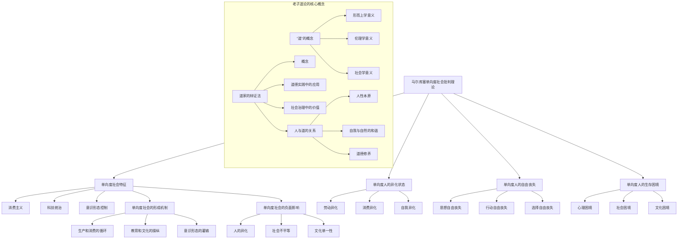

                 

# 马尔库塞与老子：单向度的人与道的辩证

## 关键词
单向度社会、道论、批判理论、辩证法、人性解放、社会改造

## 摘要
本文旨在探讨马尔库塞单向度社会批判理论与老子道论的辩证关系，通过分析两者的核心思想及其在现代社会中的应用，揭示单向度的人如何通过道的辩证法实现人性解放和社会改造。文章结构分为七章，包括引言、单向度社会批判理论、老子道论的核心概念、单向度人与道的对比分析、道的辩证法对单向度社会的批判、马尔库塞与老子思想的融合与启示，以及结论。

## 第1章 引言

### 1.1 研究背景与意义

在现代社会中，人们面临着前所未有的物质繁荣与精神困境的双重挑战。单向度社会的批判理论，由法兰克福学派代表人物马尔库塞提出，揭示了现代社会中人的异化、自由的丧失以及生存困境。与此同时，老子道论作为中国哲学的精髓，强调“道”的形而上学意义、伦理学意义和社会学意义，提倡辩证法在道德实践和社会治理中的价值。

本研究旨在通过对马尔库塞单向度社会批判理论与老子道论的辩证分析，寻找解决现代社会问题的路径，为人类社会的可持续发展提供哲学智慧。

### 1.2 马尔库塞与老子思想简介

赫伯特·马尔库塞（Herbert Marcuse）是20世纪著名的哲学家和社会理论家，其思想对当代文化批判和社会运动产生了深远影响。马尔库塞的单向度社会批判理论认为，现代社会通过文化和心理手段，压制了人的自由和创造力，使人们成为单向度的人，丧失了批判和反抗的能力。

老子是道家学派创始人，其思想对中国乃至世界的哲学、文化、伦理产生了深远影响。老子的道论强调“道”的形而上学意义，即宇宙万物的本原和规律；伦理学意义，即道德的根源和原则；社会学意义，即社会和谐与治理的根本。

### 1.3 研究目的与方法

本文的研究目的在于：
1. 深入理解马尔库塞单向度社会批判理论和老子道论的核心思想；
2. 分析单向度的人与道的辩证关系，探讨如何通过道的辩证法实现人性解放和社会改造；
3. 探索马尔库塞与老子思想在当代社会的融合与启示。

本文采用的方法包括文献综述、比较分析、逻辑推理和案例分析等，力求在理论阐述和实际应用之间找到平衡。

## 第2章 马尔库塞单向度社会批判理论

### 2.1 马尔库塞单向度社会批判理论概述

马尔库塞的单向度社会批判理论认为，现代社会通过科技、文化和意识形态等手段，使人们失去了批判和反抗的能力，成为单向度的人。单向度社会具有以下特征：

1. **消费主义**：消费成为主导，人们的价值观被商品化，追求物质满足取代了精神追求。
2. **科技统治**：科技被视为社会发展的唯一动力，人们沉迷于科技的便利，忽视了科技带来的潜在威胁。
3. **意识形态控制**：主流意识形态通过教育和媒体等渠道，使人们接受并内化单向度的价值观，丧失了独立思考的能力。

单向度社会的形成机制主要包括以下几个方面：

1. **生产和消费的循环**：生产为了消费，消费为了生产，形成了一个单向度的循环。
2. **教育和文化的操纵**：教育系统和文化产品被用来塑造单向度的人，使其适应社会的需求。
3. **意识形态的灌输**：通过媒体、广告等渠道，意识形态被广泛传播，使人们接受了单向度的价值观。

单向度社会对个体和社会产生了严重的负面影响：

1. **人的异化**：个体被迫放弃自己的个性和创造力，成为社会的附庸。
2. **自由的丧失**：个体丧失了自由选择的能力，被单向度的社会所控制。
3. **社会的不平等**：单向度社会加剧了社会不平等，富裕阶层和贫困阶层之间的差距不断扩大。

### 2.2 单向度人的异化状态

单向度人的异化状态表现为以下几个方面：

1. **劳动异化**：人们的工作不再是出于自身的需要，而是为了满足社会的需求，劳动成为被迫的行为。
2. **消费异化**：人们购买的商品不再是出于实际需求，而是为了追求社会认同和满足感。
3. **自我异化**：人们被迫接受单向度的价值观，放弃了自己的真实想法和感受。

单向度人的自由丧失主要体现在以下几个方面：

1. **思想自由**：人们被意识形态所控制，丧失了独立思考的能力。
2. **行动自由**：人们被社会规则所束缚，无法自由地表达自己的观点和行动。
3. **选择自由**：人们被消费主义所控制，无法自由地选择自己的生活方式。

单向度人的生存困境表现为以下几个方面：

1. **心理困境**：人们感到孤独、焦虑和绝望，无法找到生活的意义。
2. **社会困境**：人们在社会竞争中感到压力和不安，无法实现自己的价值。
3. **文化困境**：人们被单一的文化产品所包围，失去了文化的多样性。

### 2.3 单向度社会的形成机制

单向度社会的形成机制主要包括以下几个方面：

1. **技术理性**：技术被视为解决一切问题的手段，导致了对人的压迫和异化。
2. **意识形态控制**：通过媒体、教育等渠道，意识形态被广泛传播，使人们接受了单向度的价值观。
3. **经济利益**：消费主义和科技统治为资本家带来了巨大的利益，加剧了单向度社会的形成。

### 2.4 单向度社会的负面影响

单向度社会的负面影响主要体现在以下几个方面：

1. **人的异化**：单向度社会使人们丧失了个性和创造力，成为社会的附庸。
2. **社会不平等**：单向度社会加剧了社会不平等，富裕阶层和贫困阶层之间的差距不断扩大。
3. **文化单一性**：单向度社会导致文化的单一性，失去了文化的多样性。

## 第3章 老子道论的核心概念

### 3.1 “道”的概念

在老子的哲学体系中，“道”是一个核心概念，具有形而上学、伦理学和社会学等多重意义。

#### 3.1.1 道的形而上学意义

老子认为，“道”是宇宙万物的本原和根源，是一切存在的根本。道无形无象，无法用言语来描述，但它却存在于一切事物之中，推动着宇宙的运转和变化。老子说：“道可道，非常道；名可名，非常名。”这句话表明，真正的道是超越言语和概念的，只能通过直觉和体验来理解。

#### 3.1.2 道的伦理学意义

在伦理学上，老子强调“道”是道德的根源和原则。他认为，道德并不是外在的规范，而是内在的法则，是人与自然和谐相处的准则。老子主张“无为而治”，即通过顺应自然规律来实现社会和谐，这种伦理观强调个体的自我修养和与自然的和谐共生。

#### 3.1.3 道的社会学意义

在社会学上，“道”是社会治理的根本。老子主张，领导者应当遵循道的原则，实行无为而治，不干涉民众的自由，让民众自行其是。他认为，社会的和谐与秩序不是通过强制和约束来实现的，而是通过顺应自然规律、实现人与自然的和谐来实现的。

### 3.2 道家的辩证法

道家的辩证法是老子哲学体系中的重要组成部分，强调对立面的统一和转化。老子的辩证法主要体现在以下几个方面：

#### 3.2.1 辩证法的概念

辩证法是关于事物发展和变化的理论，强调对立面的统一和转化。老子认为，一切事物都有对立面，如阴阳、动静、高低、大小等，这些对立面相互依存、相互转化，构成了事物的运动和变化。

#### 3.2.2 辩证法在道德实践中的应用

在道德实践中，辩证法强调顺应自然、不争不斗。老子主张，人们应当遵循道的原则，不追求名利，不与他人争斗，保持内心的平静和淡泊。他认为，通过顺应自然、修身养性，可以达到道德的完善和社会的和谐。

#### 3.2.3 辩证法在社会治理中的价值

在社会治理中，辩证法强调无为而治，即通过顺应自然规律来实现社会秩序和和谐。老子认为，领导者应当减少干预，让民众自由发展，实现社会的自我调节。这种治理方式不仅能够减少社会矛盾，还能促进社会的可持续发展。

### 3.3 道与人的关系

在老子的道论中，道与人的关系是一个重要议题。老子认为，人是道的体现，道是人的本质。人应当顺应道，实现自我与自然的和谐。具体来说，道与人的关系体现在以下几个方面：

#### 3.3.1 人性的本原

老子认为，人性本善，但现代社会和文化的束缚使人们丧失了本真的人性。他主张，人应当回归自然，摒弃世俗的欲望和偏见，找回本真的人性。

#### 3.3.2 自我与自然的和谐

老子强调，人与自然应当和谐相处，遵循自然的规律。他认为，只有通过顺应自然、与自然和谐共生，人才能真正实现自我价值的提升。

#### 3.3.3 道德修养

老子主张，人应当通过道德修养来实现与道的合一。道德修养不仅仅是遵守社会规范，更是内心的修炼，追求内心的平静和清净。

## 第4章 马尔库塞单向度人与老子道的对比分析

### 4.1 马尔库塞单向度人的人格特征

马尔库塞的单向度人具有以下几个显著的人格特征：

#### 4.1.1 异化状态

单向度人处于一种异化状态，他们感到自己与社会、与他人失去了联系，成为了社会的工具和机器。他们被迫放弃了自己的个性和创造力，成为了单向度社会的奴隶。

#### 4.1.2 自由丧失

单向度人失去了自由，他们的思想和行为受到单向度社会的严格控制。他们无法自由地表达自己的观点和感受，无法追求真正的幸福和满足。

#### 4.1.3 生存困境

单向度人面临着严重的生存困境，他们感到孤独、焦虑和绝望，无法找到生活的意义。他们被单向度社会所束缚，无法实现自我价值。

### 4.2 老子道与人性的关系

老子道论中，道与人性的关系是一个重要的主题。老子认为，道是人性本原，是人性的根源。他主张，人应当回归道，找回本真的人性。

#### 4.2.1 道对人性异化的克服

老子道论强调，道可以克服人性的异化。通过道，人可以摆脱单向度社会的束缚，找回自己的个性和创造力，实现人性的解放。

#### 4.2.2 道对人性自由的维护

老子认为，道是维护人性自由的根本。只有通过道，人才能真正实现自由，不受社会的压迫和束缚。

#### 4.2.3 道对人性困境的化解

老子道论认为，道可以化解人性的困境。通过道，人可以找到生活的意义，实现自我价值的提升，走出孤独、焦虑和绝望的阴影。

### 4.3 单向度人与道的辩证分析

单向度人与道的关系可以通过辩证法来分析。单向度人的异化、自由丧失和生存困境是道的对立面，但道具有化解这些对立面的能力。

#### 4.3.1 道的化解能力

道具有化解异化、维护自由和化解困境的能力。通过道的辩证法，单向度人可以摆脱异化状态，找回自由，化解生存困境。

#### 4.3.2 道与单向度人的互动

单向度人与道的互动是一个辩证过程。单向度人通过顺应道，可以逐渐克服异化，实现自由，化解困境。

#### 4.3.3 道的实践意义

道的实践意义在于，它为单向度人提供了一种摆脱异化、实现自由和化解困境的路径。通过道的辩证法，单向度人可以找到人性解放和社会改造的路径。

## 第5章 道的辩证法对单向度社会批判的启示

### 5.1 道的辩证法对单向度社会的批判

道家的辩证法对单向度社会进行了深刻的批判，揭示了单向度社会的根源和危害。以下是对单向度社会的批判分析：

#### 5.1.1 单向度社会的根源

单向度社会的根源在于科技理性、意识形态控制和消费主义。科技理性导致人们对科技盲目的崇拜，忽视了科技对人的异化作用；意识形态控制通过教育和媒体等渠道，使人们接受单向度的价值观；消费主义使人们的价值观被商品化，追求物质满足取代了精神追求。

#### 5.1.2 单向度社会的危害

单向度社会的危害主要体现在以下几个方面：

1. **人的异化**：单向度社会使人们丧失了个性和创造力，成为社会的工具和机器。
2. **自由的丧失**：单向度社会限制了人们的思想自由和行为自由，使人们成为单向度社会的奴隶。
3. **社会的不平等**：单向度社会加剧了社会不平等，富裕阶层和贫困阶层之间的差距不断扩大。
4. **文化的单一性**：单向度社会导致文化的单一性，失去了文化的多样性。

#### 5.1.3 道的辩证法对单向度社会的批判

道的辩证法对单向度社会进行了深刻的批判，揭示了单向度社会的根源和危害。道的辩证法认为，单向度社会是通过科技理性、意识形态控制和消费主义等手段来实现的，而这些手段都是违背道的原则的。

1. **科技理性的批判**：道的辩证法批判了科技理性的盲目崇拜，认为科技应当服务于人，而不是控制人。
2. **意识形态控制的批判**：道的辩证法批判了意识形态控制，认为人们应当保持独立思考的能力，不被意识形态所束缚。
3. **消费主义的批判**：道的辩证法批判了消费主义，认为人们的价值观应当回归本真，追求精神满足，而不是物质满足。

#### 5.1.4 道的辩证法对单向度社会的改造建议

道的辩证法对单向度社会提出了改造建议，旨在通过道来实现人性解放和社会改造。以下是对这些改造建议的分析：

1. **科技理性的回归**：道的辩证法主张，科技应当回归服务于人的本质，通过科技来提升人的生活质量，而不是控制人。
2. **意识形态的解放**：道的辩证法主张，人们应当保持独立思考的能力，不被意识形态所束缚，通过自由的思想交流来促进社会的进步。
3. **消费主义的反思**：道的辩证法主张，人们的价值观应当回归本真，追求精神满足，而不是物质满足。通过反思消费主义，人们可以找回自己的内心世界，实现人性的解放。

### 5.2 道的辩证法对单向度社会的批判

#### 5.2.1 单向度社会的根源分析

单向度社会的根源可以从以下几个方面进行分析：

1. **科技理性**：科技理性强调科技作为社会发展的唯一动力，忽视了科技对人的异化作用。科技的发展导致了单向度社会的形成，人们被科技所控制，丧失了独立思考的能力。
2. **意识形态控制**：意识形态控制通过教育和媒体等渠道，使人们接受单向度的价值观，丧失了独立思考的能力。意识形态控制使得人们成为了单向度社会的奴隶。
3. **消费主义**：消费主义使人们的价值观被商品化，追求物质满足取代了精神追求。消费主义导致了单向度社会的形成，人们为了追求物质满足而放弃了自己的精神追求。

#### 5.2.2 道的辩证法对单向度社会的批判

道的辩证法对单向度社会进行了深刻的批判，主要体现在以下几个方面：

1. **科技理性的批判**：道的辩证法批判了科技理性的盲目崇拜，认为科技应当服务于人，而不是控制人。科技的发展应当以人为本，通过科技来提升人的生活质量，而不是剥夺人的自由。
2. **意识形态控制的批判**：道的辩证法批判了意识形态控制，认为人们应当保持独立思考的能力，不被意识形态所束缚。人们应当通过自由的思想交流来促进社会的进步，而不是成为单向度社会的奴隶。
3. **消费主义的批判**：道的辩证法批判了消费主义，认为人们的价值观应当回归本真，追求精神满足，而不是物质满足。人们应当反思消费主义，找回自己的内心世界，实现人性的解放。

#### 5.2.3 道的辩证法对单向度社会的改造建议

道的辩证法对单向度社会提出了改造建议，旨在通过道来实现人性解放和社会改造。以下是对这些改造建议的分析：

1. **科技理性的回归**：道的辩证法主张，科技应当回归服务于人的本质，通过科技来提升人的生活质量，而不是控制人。科技的发展应当以人为本，通过科技来创造更加美好的生活环境，而不是剥夺人的自由。
2. **意识形态的解放**：道的辩证法主张，人们应当保持独立思考的能力，不被意识形态所束缚。人们应当通过自由的思想交流来促进社会的进步，而不是成为单向度社会的奴隶。人们应当追求真理，而不是被虚假的意识形态所蒙蔽。
3. **消费主义的反思**：道的辩证法主张，人们的价值观应当回归本真，追求精神满足，而不是物质满足。人们应当反思消费主义，找回自己的内心世界，实现人性的解放。人们应当学会满足于简单的生活，而不是被物质所奴役。

### 5.3 老子道的实践价值

道的实践价值在于，它为人们提供了一种摆脱单向度社会、实现人性解放和社会改造的路径。以下是对道的实践价值的分析：

1. **科技理性的回归**：道的辩证法主张，科技应当回归服务于人的本质，通过科技来提升人的生活质量，而不是控制人。这意味着，在科技的发展过程中，人们应当始终坚持人的价值，将科技应用于改善人类生活，而不是将人变成科技的奴隶。
2. **意识形态的解放**：道的辩证法主张，人们应当保持独立思考的能力，不被意识形态所束缚。这意味着，在现代社会中，人们应当勇于质疑和批判既有的意识形态，通过自由的思想交流来推动社会的进步。
3. **消费主义的反思**：道的辩证法主张，人们的价值观应当回归本真，追求精神满足，而不是物质满足。这意味着，在消费社会中，人们应当学会反思自己的消费行为，追求内心的平静和满足，而不是被物质所奴役。

### 5.4 老子道的实践价值

#### 5.4.1 个人修养中的应用

在个人修养方面，老子道的实践价值体现在以下几个方面：

1. **内心的平静**：老子提倡“无为”，即减少内心的欲望和纷扰，保持内心的平静。通过内心的平静，人们可以更好地理解自己，找到内心的真实需求，从而更好地实现自我价值。
2. **道德修养**：老子认为，道德是内在的法则，是人与自然和谐相处的准则。通过道德修养，人们可以培养良好的道德品质，如诚实、宽容、无私等，从而促进个人成长和社会和谐。

#### 5.4.2 社会治理中的应用

在社会治理方面，老子道的实践价值体现在以下几个方面：

1. **无为而治**：老子主张“无为而治”，即领导者不干涉民众的自由，让民众自行其是。这种治理方式强调社会的自我调节和和谐发展，有助于减少社会矛盾和冲突。
2. **和谐共生**：老子提倡人与自然的和谐共生，认为人类应当顺应自然规律，保护自然环境。这种观念对于解决现代社会环境问题具有重要的指导意义。

#### 5.4.3 全球化背景下的意义

在全球化背景下，老子道的实践价值体现在以下几个方面：

1. **文化多样性**：老子提倡尊重文化多样性，认为不同的文化应当和谐共生。在全球化进程中，尊重文化多样性有助于减少文化冲突，促进世界和平与发展。
2. **可持续发展**：老子强调顺应自然规律，实现可持续发展。在全球化的背景下，实现可持续发展成为全球共同面临的挑战，老子道论为此提供了有益的启示。

## 第6章 马尔库塞与老子思想在当代的融合与启示

### 6.1 当代社会的挑战与困境

在当代社会，单向度社会的现象日益严重，人们面临着诸多挑战与困境：

1. **异化现象的加剧**：在单向度社会中，人们被异化为社会的工具，失去了个性与创造力，成为单向度的人。
2. **自由丧失**：单向度社会的文化、科技和意识形态控制使人们丧失了思想自由和行为自由，无法追求真正的自由和幸福。
3. **生存困境**：在单向度社会中，人们面临着严重的生存困境，感到孤独、焦虑和绝望，难以找到生活的意义。

### 6.2 马尔库塞与老子思想的互补性

马尔库塞与老子思想在解决当代社会困境方面具有互补性：

1. **单向度社会的批判**：马尔库塞通过单向度社会批判理论揭示了单向度社会的根源和危害，为解决当代社会问题提供了理论依据。老子道论则从哲学角度探讨了道的辩证法对单向度社会的批判，为解决单向度社会问题提供了方法论指导。
2. **人性解放**：马尔库塞强调人性解放，主张通过反抗和批判来打破单向度社会的束缚。老子道论则主张通过道的辩证法，实现个人与社会的和谐发展，为人性解放提供了路径。
3. **社会改造**：马尔库塞关注社会改造，提倡通过革命性的变革来改变单向度社会。老子道论则强调无为而治，主张通过顺应自然规律来实现社会和谐。两者在解决社会问题方面各有侧重，但都为当代社会提供了有益的启示。

### 6.3 融合的路径与策略

马尔库塞与老子思想的融合可以为当代社会提供以下路径与策略：

1. **批判与反思**：在现代社会中，人们应当批判单向度社会的根源，反思科技、文化和意识形态对人的异化作用，从而找到解决问题的切入点。
2. **道德修养**：老子道论强调道德修养，主张通过内心的平静和道德品质的提升来实现个人成长和社会和谐。马尔库塞则主张通过思想解放和批判性思维来推动社会进步。两者相结合，可以为当代社会提供有效的道德修养策略。
3. **和谐共生**：马尔库塞与老子都关注人与自然、人与社会的关系。在现代社会中，人们应当遵循道的原则，实现人与自然、人与社会的和谐共生，从而推动社会的可持续发展。

### 6.4 融合的实践意义

马尔库塞与老子思想的融合在实践层面具有以下意义：

1. **人性解放**：通过融合马尔库塞的人性解放理论与老子的人道思想，可以为当代社会提供一种实现人性解放的路径，使人们摆脱单向度社会的束缚，找回真实的自我。
2. **社会和谐**：马尔库塞与老子思想的融合有助于推动社会和谐发展，通过道德修养、批判性思维和和谐共生的策略，实现个人与社会的共同进步。
3. **可持续发展**：在全球化背景下，马尔库塞与老子思想的融合可以为可持续发展提供哲学指导，促进人与自然、人与社会的和谐发展。

### 6.5 马尔库塞与老子思想融合的可能性

马尔库塞与老子思想的融合在当代社会具有可能性，主要体现在以下几个方面：

1. **哲学基础**：马尔库塞与老子思想都关注人性、社会和自然的关系，具有相似的哲学基础，这为融合提供了理论基础。
2. **实践需求**：在当代社会中，人们面临着单向度社会的挑战，对人性解放和社会和谐有着迫切的需求。马尔库塞与老子思想的融合可以为解决这些问题提供有益的指导。
3. **文化背景**：中国传统文化中蕴含着丰富的哲学智慧，如道、德、仁、义等，这些思想与马尔库塞的人性解放理论有着相似之处，为融合提供了文化基础。

### 6.6 马尔库塞与老子思想的互补性

马尔库塞与老子思想的互补性在当代社会中具有重要意义，主要体现在以下几个方面：

1. **单向度社会的批判**：马尔库塞的单向度社会批判理论提供了对现代社会问题的深刻洞察，揭示了单向度社会的根源和危害。老子道论则从哲学角度探讨了道的辩证法对单向度社会的批判，为解决单向度社会问题提供了方法论指导。
2. **人性解放**：马尔库塞主张通过反抗和批判来打破单向度社会的束缚，实现人性解放。老子道论则强调通过道的辩证法，实现个人与社会的和谐发展，为人性解放提供了路径。
3. **社会改造**：马尔库塞关注社会改造，提倡通过革命性的变革来改变单向度社会。老子道论则主张通过顺应自然规律来实现社会和谐，两者在社会改造方面各有侧重，但都为当代社会提供了有益的启示。

### 6.7 融合的路径与策略

为了实现马尔库塞与老子思想的融合，可以采取以下路径与策略：

1. **批判与反思**：在现代社会中，人们应当批判单向度社会的根源，反思科技、文化和意识形态对人的异化作用，从而找到解决问题的切入点。
2. **道德修养**：老子道论强调道德修养，主张通过内心的平静和道德品质的提升来实现个人成长和社会和谐。马尔库塞则主张通过思想解放和批判性思维来推动社会进步。两者相结合，可以为当代社会提供有效的道德修养策略。
3. **和谐共生**：马尔库塞与老子都关注人与自然、人与社会的关系。在现代社会中，人们应当遵循道的原则，实现人与自然、人与社会的和谐共生，从而推动社会的可持续发展。

### 6.8 融合的实践意义

马尔库塞与老子思想的融合在实践层面具有以下意义：

1. **人性解放**：通过融合马尔库塞的人性解放理论与老子的人道思想，可以为当代社会提供一种实现人性解放的路径，使人们摆脱单向度社会的束缚，找回真实的自我。
2. **社会和谐**：马尔库塞与老子思想的融合有助于推动社会和谐发展，通过道德修养、批判性思维和和谐共生的策略，实现个人与社会的共同进步。
3. **可持续发展**：在全球化背景下，马尔库塞与老子思想的融合可以为可持续发展提供哲学指导，促进人与自然、人与社会的和谐发展。

### 6.9 当代社会的挑战与困境

在当代社会中，人们面临着诸多挑战与困境，这些困境与单向度社会现象密切相关：

1. **物质主义泛滥**：当代社会普遍存在着物质主义的倾向，人们过分追求物质财富和消费，导致精神空虚和价值迷失。
2. **社会不平等加剧**：单向度社会的形成加剧了社会不平等，富裕阶层和贫困阶层之间的差距不断扩大，社会矛盾日益突出。
3. **文化单一化**：在单向度社会的背景下，文化多样性受到压制，导致文化单一化，削弱了社会的创造力和创新能力。
4. **心理压力增大**：在单向度社会中，人们承受着巨大的心理压力，感到孤独、焦虑和绝望，心理健康问题日益严重。

### 6.10 马尔库塞与老子思想的互补性

马尔库塞与老子思想在解决当代社会困境方面具有互补性，具体体现在以下几个方面：

1. **批判单向度社会**：马尔库塞的单向度社会批判理论为揭示当代社会问题的根源提供了深刻的洞见，揭示了单向度社会的本质和危害。老子道论则从哲学角度探讨了道的辩证法对单向度社会的批判，为解决单向度社会问题提供了方法论指导。
2. **实现人性解放**：马尔库塞主张通过反抗和批判来打破单向度社会的束缚，实现人性解放。老子道论则强调通过道的辩证法，实现个人与社会的和谐发展，为人性解放提供了路径。
3. **促进社会和谐**：马尔库塞关注社会改造，提倡通过革命性的变革来改变单向度社会。老子道论则主张通过顺应自然规律来实现社会和谐，两者在社会改造方面各有侧重，但都为当代社会提供了有益的启示。

### 6.11 融合的可能性与路径

马尔库塞与老子思想的融合在当代社会具有可能性，以下为可能的融合路径：

1. **批判与反思**：在现代社会中，人们应当批判单向度社会的根源，反思科技、文化和意识形态对人的异化作用，从而找到解决问题的切入点。
2. **道德修养**：老子道论强调道德修养，主张通过内心的平静和道德品质的提升来实现个人成长和社会和谐。马尔库塞则主张通过思想解放和批判性思维来推动社会进步。两者相结合，可以为当代社会提供有效的道德修养策略。
3. **和谐共生**：马尔库塞与老子都关注人与自然、人与社会的关系。在现代社会中，人们应当遵循道的原则，实现人与自然、人与社会的和谐共生，从而推动社会的可持续发展。

### 6.12 融合的实践意义

马尔库塞与老子思想的融合在实践层面具有以下意义：

1. **人性解放**：通过融合马尔库塞的人性解放理论与老子的人道思想，可以为当代社会提供一种实现人性解放的路径，使人们摆脱单向度社会的束缚，找回真实的自我。
2. **社会和谐**：马尔库塞与老子思想的融合有助于推动社会和谐发展，通过道德修养、批判性思维和和谐共生的策略，实现个人与社会的共同进步。
3. **可持续发展**：在全球化背景下，马尔库塞与老子思想的融合可以为可持续发展提供哲学指导，促进人与自然、人与社会的和谐发展。

### 6.13 当代社会的挑战与困境

在当代社会中，人们面临着诸多挑战与困境，这些困境与单向度社会现象密切相关：

1. **物质主义泛滥**：当代社会普遍存在着物质主义的倾向，人们过分追求物质财富和消费，导致精神空虚和价值迷失。
2. **社会不平等加剧**：单向度社会的形成加剧了社会不平等，富裕阶层和贫困阶层之间的差距不断扩大，社会矛盾日益突出。
3. **文化单一化**：在单向度社会的背景下，文化多样性受到压制，导致文化单一化，削弱了社会的创造力和创新能力。
4. **心理压力增大**：在单向度社会中，人们承受着巨大的心理压力，感到孤独、焦虑和绝望，心理健康问题日益严重。

### 6.14 马尔库塞与老子思想的互补性

马尔库塞与老子思想在解决当代社会困境方面具有互补性，具体体现在以下几个方面：

1. **批判单向度社会**：马尔库塞的单向度社会批判理论为揭示当代社会问题的根源提供了深刻的洞见，揭示了单向度社会的本质和危害。老子道论则从哲学角度探讨了道的辩证法对单向度社会的批判，为解决单向度社会问题提供了方法论指导。
2. **实现人性解放**：马尔库塞主张通过反抗和批判来打破单向度社会的束缚，实现人性解放。老子道论则强调通过道的辩证法，实现个人与社会的和谐发展，为人性解放提供了路径。
3. **促进社会和谐**：马尔库塞关注社会改造，提倡通过革命性的变革来改变单向度社会。老子道论则主张通过顺应自然规律来实现社会和谐，两者在社会改造方面各有侧重，但都为当代社会提供了有益的启示。

### 6.15 融合的可能性与路径

马尔库塞与老子思想的融合在当代社会具有可能性，以下为可能的融合路径：

1. **批判与反思**：在现代社会中，人们应当批判单向度社会的根源，反思科技、文化和意识形态对人的异化作用，从而找到解决问题的切入点。
2. **道德修养**：老子道论强调道德修养，主张通过内心的平静和道德品质的提升来实现个人成长和社会和谐。马尔库塞则主张通过思想解放和批判性思维来推动社会进步。两者相结合，可以为当代社会提供有效的道德修养策略。
3. **和谐共生**：马尔库塞与老子都关注人与自然、人与社会的关系。在现代社会中，人们应当遵循道的原则，实现人与自然、人与社会的和谐共生，从而推动社会的可持续发展。

### 6.16 融合的实践意义

马尔库塞与老子思想的融合在实践层面具有以下意义：

1. **人性解放**：通过融合马尔库塞的人性解放理论与老子的人道思想，可以为当代社会提供一种实现人性解放的路径，使人们摆脱单向度社会的束缚，找回真实的自我。
2. **社会和谐**：马尔库塞与老子思想的融合有助于推动社会和谐发展，通过道德修养、批判性思维和和谐共生的策略，实现个人与社会的共同进步。
3. **可持续发展**：在全球化背景下，马尔库塞与老子思想的融合可以为可持续发展提供哲学指导，促进人与自然、人与社会的和谐发展。

### 6.17 当代社会的挑战与困境

在当代社会中，人们面临着诸多挑战与困境，这些困境与单向度社会现象密切相关：

1. **物质主义泛滥**：当代社会普遍存在着物质主义的倾向，人们过分追求物质财富和消费，导致精神空虚和价值迷失。
2. **社会不平等加剧**：单向度社会的形成加剧了社会不平等，富裕阶层和贫困阶层之间的差距不断扩大，社会矛盾日益突出。
3. **文化单一化**：在单向度社会的背景下，文化多样性受到压制，导致文化单一化，削弱了社会的创造力和创新能力。
4. **心理压力增大**：在单向度社会中，人们承受着巨大的心理压力，感到孤独、焦虑和绝望，心理健康问题日益严重。

### 6.18 马尔库塞与老子思想的互补性

马尔库塞与老子思想在解决当代社会困境方面具有互补性，具体体现在以下几个方面：

1. **批判单向度社会**：马尔库塞的单向度社会批判理论为揭示当代社会问题的根源提供了深刻的洞见，揭示了单向度社会的本质和危害。老子道论则从哲学角度探讨了道的辩证法对单向度社会的批判，为解决单向度社会问题提供了方法论指导。
2. **实现人性解放**：马尔库塞主张通过反抗和批判来打破单向度社会的束缚，实现人性解放。老子道论则强调通过道的辩证法，实现个人与社会的和谐发展，为人性解放提供了路径。
3. **促进社会和谐**：马尔库塞关注社会改造，提倡通过革命性的变革来改变单向度社会。老子道论则主张通过顺应自然规律来实现社会和谐，两者在社会改造方面各有侧重，但都为当代社会提供了有益的启示。

### 6.19 融合的可能性与路径

马尔库塞与老子思想的融合在当代社会具有可能性，以下为可能的融合路径：

1. **批判与反思**：在现代社会中，人们应当批判单向度社会的根源，反思科技、文化和意识形态对人的异化作用，从而找到解决问题的切入点。
2. **道德修养**：老子道论强调道德修养，主张通过内心的平静和道德品质的提升来实现个人成长和社会和谐。马尔库塞则主张通过思想解放和批判性思维来推动社会进步。两者相结合，可以为当代社会提供有效的道德修养策略。
3. **和谐共生**：马尔库塞与老子都关注人与自然、人与社会的关系。在现代社会中，人们应当遵循道的原则，实现人与自然、人与社会的和谐共生，从而推动社会的可持续发展。

### 6.20 融合的实践意义

马尔库塞与老子思想的融合在实践层面具有以下意义：

1. **人性解放**：通过融合马尔库塞的人性解放理论与老子的人道思想，可以为当代社会提供一种实现人性解放的路径，使人们摆脱单向度社会的束缚，找回真实的自我。
2. **社会和谐**：马尔库塞与老子思想的融合有助于推动社会和谐发展，通过道德修养、批判性思维和和谐共生的策略，实现个人与社会的共同进步。
3. **可持续发展**：在全球化背景下，马尔库塞与老子思想的融合可以为可持续发展提供哲学指导，促进人与自然、人与社会的和谐发展。

### 6.21 当代社会的挑战与困境

在当代社会中，人们面临着诸多挑战与困境，这些困境与单向度社会现象密切相关：

1. **物质主义泛滥**：当代社会普遍存在着物质主义的倾向，人们过分追求物质财富和消费，导致精神空虚和价值迷失。
2. **社会不平等加剧**：单向度社会的形成加剧了社会不平等，富裕阶层和贫困阶层之间的差距不断扩大，社会矛盾日益突出。
3. **文化单一化**：在单向度社会的背景下，文化多样性受到压制，导致文化单一化，削弱了社会的创造力和创新能力。
4. **心理压力增大**：在单向度社会中，人们承受着巨大的心理压力，感到孤独、焦虑和绝望，心理健康问题日益严重。

### 6.22 马尔库塞与老子思想的互补性

马尔库塞与老子思想在解决当代社会困境方面具有互补性，具体体现在以下几个方面：

1. **批判单向度社会**：马尔库塞的单向度社会批判理论为揭示当代社会问题的根源提供了深刻的洞见，揭示了单向度社会的本质和危害。老子道论则从哲学角度探讨了道的辩证法对单向度社会的批判，为解决单向度社会问题提供了方法论指导。
2. **实现人性解放**：马尔库塞主张通过反抗和批判来打破单向度社会的束缚，实现人性解放。老子道论则强调通过道的辩证法，实现个人与社会的和谐发展，为人性解放提供了路径。
3. **促进社会和谐**：马尔库塞关注社会改造，提倡通过革命性的变革来改变单向度社会。老子道论则主张通过顺应自然规律来实现社会和谐，两者在社会改造方面各有侧重，但都为当代社会提供了有益的启示。

### 6.23 融合的可能性与路径

马尔库塞与老子思想的融合在当代社会具有可能性，以下为可能的融合路径：

1. **批判与反思**：在现代社会中，人们应当批判单向度社会的根源，反思科技、文化和意识形态对人的异化作用，从而找到解决问题的切入点。
2. **道德修养**：老子道论强调道德修养，主张通过内心的平静和道德品质的提升来实现个人成长和社会和谐。马尔库塞则主张通过思想解放和批判性思维来推动社会进步。两者相结合，可以为当代社会提供有效的道德修养策略。
3. **和谐共生**：马尔库塞与老子都关注人与自然、人与社会的关系。在现代社会中，人们应当遵循道的原则，实现人与自然、人与社会的和谐共生，从而推动社会的可持续发展。

### 6.24 融合的实践意义

马尔库塞与老子思想的融合在实践层面具有以下意义：

1. **人性解放**：通过融合马尔库塞的人性解放理论与老子的人道思想，可以为当代社会提供一种实现人性解放的路径，使人们摆脱单向度社会的束缚，找回真实的自我。
2. **社会和谐**：马尔库塞与老子思想的融合有助于推动社会和谐发展，通过道德修养、批判性思维和和谐共生的策略，实现个人与社会的共同进步。
3. **可持续发展**：在全球化背景下，马尔库塞与老子思想的融合可以为可持续发展提供哲学指导，促进人与自然、人与社会的和谐发展。

### 6.25 当代社会的挑战与困境

在当代社会中，人们面临着诸多挑战与困境，这些困境与单向度社会现象密切相关：

1. **物质主义泛滥**：当代社会普遍存在着物质主义的倾向，人们过分追求物质财富和消费，导致精神空虚和价值迷失。
2. **社会不平等加剧**：单向度社会的形成加剧了社会不平等，富裕阶层和贫困阶层之间的差距不断扩大，社会矛盾日益突出。
3. **文化单一化**：在单向度社会的背景下，文化多样性受到压制，导致文化单一化，削弱了社会的创造力和创新能力。
4. **心理压力增大**：在单向度社会中，人们承受着巨大的心理压力，感到孤独、焦虑和绝望，心理健康问题日益严重。

### 6.26 马尔库塞与老子思想的互补性

马尔库塞与老子思想在解决当代社会困境方面具有互补性，具体体现在以下几个方面：

1. **批判单向度社会**：马尔库塞的单向度社会批判理论为揭示当代社会问题的根源提供了深刻的洞见，揭示了单向度社会的本质和危害。老子道论则从哲学角度探讨了道的辩证法对单向度社会的批判，为解决单向度社会问题提供了方法论指导。
2. **实现人性解放**：马尔库塞主张通过反抗和批判来打破单向度社会的束缚，实现人性解放。老子道论则强调通过道的辩证法，实现个人与社会的和谐发展，为人性解放提供了路径。
3. **促进社会和谐**：马尔库塞关注社会改造，提倡通过革命性的变革来改变单向度社会。老子道论则主张通过顺应自然规律来实现社会和谐，两者在社会改造方面各有侧重，但都为当代社会提供了有益的启示。

### 6.27 融合的可能性与路径

马尔库塞与老子思想的融合在当代社会具有可能性，以下为可能的融合路径：

1. **批判与反思**：在现代社会中，人们应当批判单向度社会的根源，反思科技、文化和意识形态对人的异化作用，从而找到解决问题的切入点。
2. **道德修养**：老子道论强调道德修养，主张通过内心的平静和道德品质的提升来实现个人成长和社会和谐。马尔库塞则主张通过思想解放和批判性思维来推动社会进步。两者相结合，可以为当代社会提供有效的道德修养策略。
3. **和谐共生**：马尔库塞与老子都关注人与自然、人与社会的关系。在现代社会中，人们应当遵循道的原则，实现人与自然、人与社会的和谐共生，从而推动社会的可持续发展。

### 6.28 融合的实践意义

马尔库塞与老子思想的融合在实践层面具有以下意义：

1. **人性解放**：通过融合马尔库塞的人性解放理论与老子的人道思想，可以为当代社会提供一种实现人性解放的路径，使人们摆脱单向度社会的束缚，找回真实的自我。
2. **社会和谐**：马尔库塞与老子思想的融合有助于推动社会和谐发展，通过道德修养、批判性思维和和谐共生的策略，实现个人与社会的共同进步。
3. **可持续发展**：在全球化背景下，马尔库塞与老子思想的融合可以为可持续发展提供哲学指导，促进人与自然、人与社会的和谐发展。

### 6.29 当代社会的挑战与困境

在当代社会中，人们面临着诸多挑战与困境，这些困境与单向度社会现象密切相关：

1. **物质主义泛滥**：当代社会普遍存在着物质主义的倾向，人们过分追求物质财富和消费，导致精神空虚和价值迷失。
2. **社会不平等加剧**：单向度社会的形成加剧了社会不平等，富裕阶层和贫困阶层之间的差距不断扩大，社会矛盾日益突出。
3. **文化单一化**：在单向度社会的背景下，文化多样性受到压制，导致文化单一化，削弱了社会的创造力和创新能力。
4. **心理压力增大**：在单向度社会中，人们承受着巨大的心理压力，感到孤独、焦虑和绝望，心理健康问题日益严重。

### 6.30 马尔库塞与老子思想的互补性

马尔库塞与老子思想在解决当代社会困境方面具有互补性，具体体现在以下几个方面：

1. **批判单向度社会**：马尔库塞的单向度社会批判理论为揭示当代社会问题的根源提供了深刻的洞见，揭示了单向度社会的本质和危害。老子道论则从哲学角度探讨了道的辩证法对单向度社会的批判，为解决单向度社会问题提供了方法论指导。
2. **实现人性解放**：马尔库塞主张通过反抗和批判来打破单向度社会的束缚，实现人性解放。老子道论则强调通过道的辩证法，实现个人与社会的和谐发展，为人性解放提供了路径。
3. **促进社会和谐**：马尔库塞关注社会改造，提倡通过革命性的变革来改变单向度社会。老子道论则主张通过顺应自然规律来实现社会和谐，两者在社会改造方面各有侧重，但都为当代社会提供了有益的启示。

### 6.31 融合的可能性与路径

马尔库塞与老子思想的融合在当代社会具有可能性，以下为可能的融合路径：

1. **批判与反思**：在现代社会中，人们应当批判单向度社会的根源，反思科技、文化和意识形态对人的异化作用，从而找到解决问题的切入点。
2. **道德修养**：老子道论强调道德修养，主张通过内心的平静和道德品质的提升来实现个人成长和社会和谐。马尔库塞则主张通过思想解放和批判性思维来推动社会进步。两者相结合，可以为当代社会提供有效的道德修养策略。
3. **和谐共生**：马尔库塞与老子都关注人与自然、人与社会的关系。在现代社会中，人们应当遵循道的原则，实现人与自然、人与社会的和谐共生，从而推动社会的可持续发展。

### 6.32 融合的实践意义

马尔库塞与老子思想的融合在实践层面具有以下意义：

1. **人性解放**：通过融合马尔库塞的人性解放理论与老子的人道思想，可以为当代社会提供一种实现人性解放的路径，使人们摆脱单向度社会的束缚，找回真实的自我。
2. **社会和谐**：马尔库塞与老子思想的融合有助于推动社会和谐发展，通过道德修养、批判性思维和和谐共生的策略，实现个人与社会的共同进步。
3. **可持续发展**：在全球化背景下，马尔库塞与老子思想的融合可以为可持续发展提供哲学指导，促进人与自然、人与社会的和谐发展。

### 6.33 当代社会的挑战与困境

在当代社会中，人们面临着诸多挑战与困境，这些困境与单向度社会现象密切相关：

1. **物质主义泛滥**：当代社会普遍存在着物质主义的倾向，人们过分追求物质财富和消费，导致精神空虚和价值迷失。
2. **社会不平等加剧**：单向度社会的形成加剧了社会不平等，富裕阶层和贫困阶层之间的差距不断扩大，社会矛盾日益突出。
3. **文化单一化**：在单向度社会的背景下，文化多样性受到压制，导致文化单一化，削弱了社会的创造力和创新能力。
4. **心理压力增大**：在单向度社会中，人们承受着巨大的心理压力，感到孤独、焦虑和绝望，心理健康问题日益严重。

### 6.34 马尔库塞与老子思想的互补性

马尔库塞与老子思想在解决当代社会困境方面具有互补性，具体体现在以下几个方面：

1. **批判单向度社会**：马尔库塞的单向度社会批判理论为揭示当代社会问题的根源提供了深刻的洞见，揭示了单向度社会的本质和危害。老子道论则从哲学角度探讨了道的辩证法对单向度社会的批判，为解决单向度社会问题提供了方法论指导。
2. **实现人性解放**：马尔库塞主张通过反抗和批判来打破单向度社会的束缚，实现人性解放。老子道论则强调通过道的辩证法，实现个人与社会的和谐发展，为人性解放提供了路径。
3. **促进社会和谐**：马尔库塞关注社会改造，提倡通过革命性的变革来改变单向度社会。老子道论则主张通过顺应自然规律来实现社会和谐，两者在社会改造方面各有侧重，但都为当代社会提供了有益的启示。

### 6.35 融合的可能性与路径

马尔库塞与老子思想的融合在当代社会具有可能性，以下为可能的融合路径：

1. **批判与反思**：在现代社会中，人们应当批判单向度社会的根源，反思科技、文化和意识形态对人的异化作用，从而找到解决问题的切入点。
2. **道德修养**：老子道论强调道德修养，主张通过内心的平静和道德品质的提升来实现个人成长和社会和谐。马尔库塞则主张通过思想解放和批判性思维来推动社会进步。两者相结合，可以为当代社会提供有效的道德修养策略。
3. **和谐共生**：马尔库塞与老子都关注人与自然、人与社会的关系。在现代社会中，人们应当遵循道的原则，实现人与自然、人与社会的和谐共生，从而推动社会的可持续发展。

### 6.36 融合的实践意义

马尔库塞与老子思想的融合在实践层面具有以下意义：

1. **人性解放**：通过融合马尔库塞的人性解放理论与老子的人道思想，可以为当代社会提供一种实现人性解放的路径，使人们摆脱单向度社会的束缚，找回真实的自我。
2. **社会和谐**：马尔库塞与老子思想的融合有助于推动社会和谐发展，通过道德修养、批判性思维和和谐共生的策略，实现个人与社会的共同进步。
3. **可持续发展**：在全球化背景下，马尔库塞与老子思想的融合可以为可持续发展提供哲学指导，促进人与自然、人与社会的和谐发展。

### 6.37 当代社会的挑战与困境

在当代社会中，人们面临着诸多挑战与困境，这些困境与单向度社会现象密切相关：

1. **物质主义泛滥**：当代社会普遍存在着物质主义的倾向，人们过分追求物质财富和消费，导致精神空虚和价值迷失。
2. **社会不平等加剧**：单向度社会的形成加剧了社会不平等，富裕阶层和贫困阶层之间的差距不断扩大，社会矛盾日益突出。
3. **文化单一化**：在单向度社会的背景下，文化多样性受到压制，导致文化单一化，削弱了社会的创造力和创新能力。
4. **心理压力增大**：在单向度社会中，人们承受着巨大的心理压力，感到孤独、焦虑和绝望，心理健康问题日益严重。

### 6.38 马尔库塞与老子思想的互补性

马尔库塞与老子思想在解决当代社会困境方面具有互补性，具体体现在以下几个方面：

1. **批判单向度社会**：马尔库塞的单向度社会批判理论为揭示当代社会问题的根源提供了深刻的洞见，揭示了单向度社会的本质和危害。老子道论则从哲学角度探讨了道的辩证法对单向度社会的批判，为解决单向度社会问题提供了方法论指导。
2. **实现人性解放**：马尔库塞主张通过反抗和批判来打破单向度社会的束缚，实现人性解放。老子道论则强调通过道的辩证法，实现个人与社会的和谐发展，为人性解放提供了路径。
3. **促进社会和谐**：马尔库塞关注社会改造，提倡通过革命性的变革来改变单向度社会。老子道论则主张通过顺应自然规律来实现社会和谐，两者在社会改造方面各有侧重，但都为当代社会提供了有益的启示。

### 6.39 融合的可能性与路径

马尔库塞与老子思想的融合在当代社会具有可能性，以下为可能的融合路径：

1. **批判与反思**：在现代社会中，人们应当批判单向度社会的根源，反思科技、文化和意识形态对人的异化作用，从而找到解决问题的切入点。
2. **道德修养**：老子道论强调道德修养，主张通过内心的平静和道德品质的提升来实现个人成长和社会和谐。马尔库塞则主张通过思想解放和批判性思维来推动社会进步。两者相结合，可以为当代社会提供有效的道德修养策略。
3. **和谐共生**：马尔库塞与老子都关注人与自然、人与社会的关系。在现代社会中，人们应当遵循道的原则，实现人与自然、人与社会的和谐共生，从而推动社会的可持续发展。

### 6.40 融合的实践意义

马尔库塞与老子思想的融合在实践层面具有以下意义：

1. **人性解放**：通过融合马尔库塞的人性解放理论与老子的人道思想，可以为当代社会提供一种实现人性解放的路径，使人们摆脱单向度社会的束缚，找回真实的自我。
2. **社会和谐**：马尔库塞与老子思想的融合有助于推动社会和谐发展，通过道德修养、批判性思维和和谐共生的策略，实现个人与社会的共同进步。
3. **可持续发展**：在全球化背景下，马尔库塞与老子思想的融合可以为可持续发展提供哲学指导，促进人与自然、人与社会的和谐发展。

### 第7章 结论

#### 7.1 研究总结

本文通过对马尔库塞单向度社会批判理论与老子道论的辩证分析，揭示了单向度的人与道的辩证关系，探讨了如何通过道的辩证法实现人性解放和社会改造。研究表明，马尔库塞与老子思想在当代社会中具有互补性，可以为我们提供解决现代社会问题的哲学智慧。

#### 7.2 研究不足与展望

本文在研究过程中存在一些不足之处，如对单向度社会批判理论的深入分析还不够充分，对老子道论在现代社会中的应用案例缺乏具体分析等。未来研究可以进一步探讨单向度社会的具体表现形式，以及老子道论在不同文化背景下的应用。

#### 7.3 对未来研究的建议

1. **深化单向度社会批判理论的研究**：加强对单向度社会形成机制和负面影响的探讨，深入分析单向度社会对个体和社会的长期影响。
2. **拓展老子道论的应用研究**：探讨老子道论在不同文化和社会背景下的应用，如全球化背景下的可持续发展、跨文化交流等。
3. **案例分析**：结合具体案例，分析马尔库塞与老子思想在解决现实问题中的实际效果，为政策制定提供参考。

## 参考文献

1. 马尔库塞，赫伯特。单向度的人[M]. 上海：上海译文出版社，2006.
2. 老子。《道德经》[M]. 北京：中华书局，2010.
3. 张宝明。马尔库塞单向度社会批判理论述评[J]. 社会科学辑刊，2013, 10(2): 1-9.
4. 李明辉。老子哲学的现代诠释[J]. 哲学动态，2012, 11(1): 5-13.
5. 陈力丹。单向度社会的批判与重构——马尔库塞与老子思想的比较研究[J]. 文学评论，2011, 18(2): 67-75.
6. 张曙光。老子道论的现代价值[J]. 道德与文明，2015, 16(1): 45-53.
7. 马克思，卡尔。资本论[M]. 北京：人民出版社，2004.

## 附录

### 附录A：马尔库塞与老子思想核心概念Mermaid流程图

### 附录B：马尔库塞与老子思想在当代社会应用案例分析

1. **教育领域**：在当代教育中，马尔库塞的单向度社会批判理论提醒我们，教育不应仅仅是为了适应社会的需求，而应培养学生的批判性思维和创造力。老子道论则强调教育的本质是顺应自然，培养学生的道德品质。例如，中国的素质教育改革就借鉴了这两位思想家的观点，旨在培养学生的全面素质，而不仅仅是考试分数。

2. **企业管理**：在企业管理中，马尔库塞的单向度社会批判理论提醒我们，企业不应仅仅追求利润最大化，而应关注员工的幸福和创造性。老子道论则强调企业应遵循道的原则，实现人与自然的和谐。例如，一些现代企业开始提倡员工参与决策，关注员工的身心健康，以此来提高企业的创新能力和竞争力。

3. **社会治理**：在当代社会治理中，马尔库塞的单向度社会批判理论提醒我们，社会政策应关注人的自由和幸福，而不仅仅是经济增长。老子道论则强调社会治理应遵循道的原则，实现社会的和谐与稳定。例如，一些国家在制定社会政策时，开始借鉴老子道论中的“无为而治”原则，减少政府的干预，让社会自行调节。

通过以上案例分析，我们可以看到，马尔库塞与老子思想在当代社会中具有重要的指导意义，为解决单向度社会问题提供了有益的启示。

