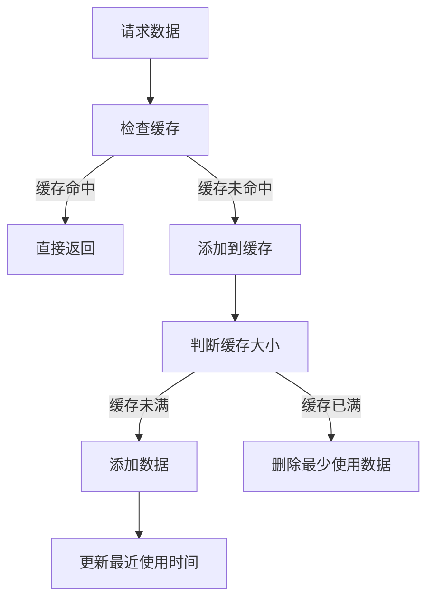
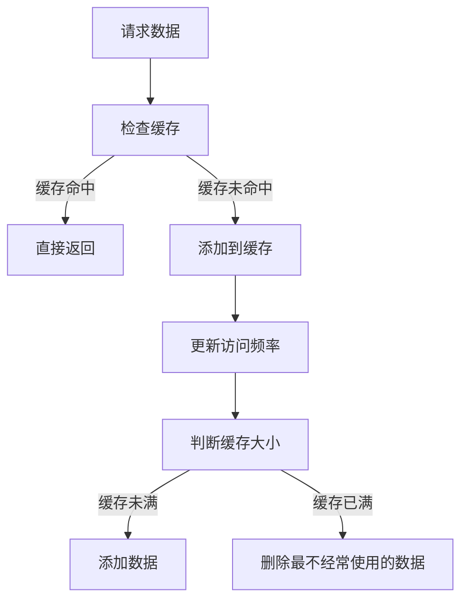
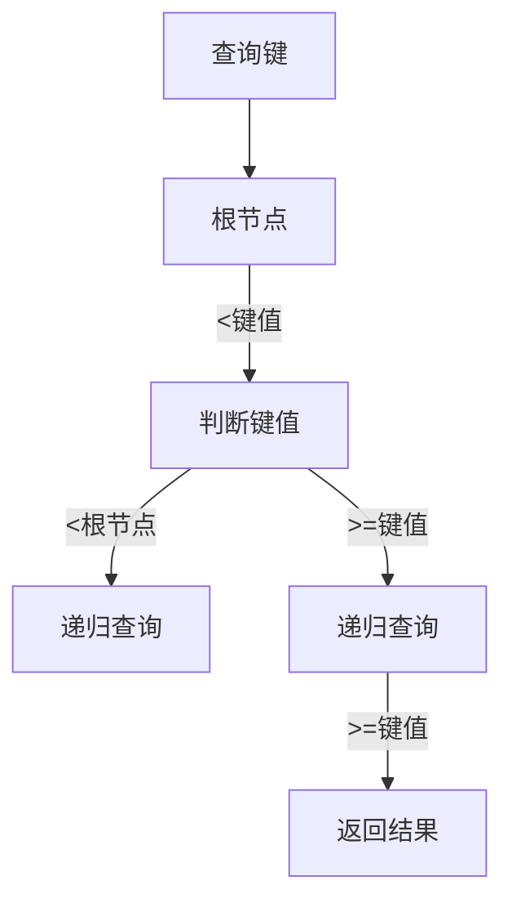
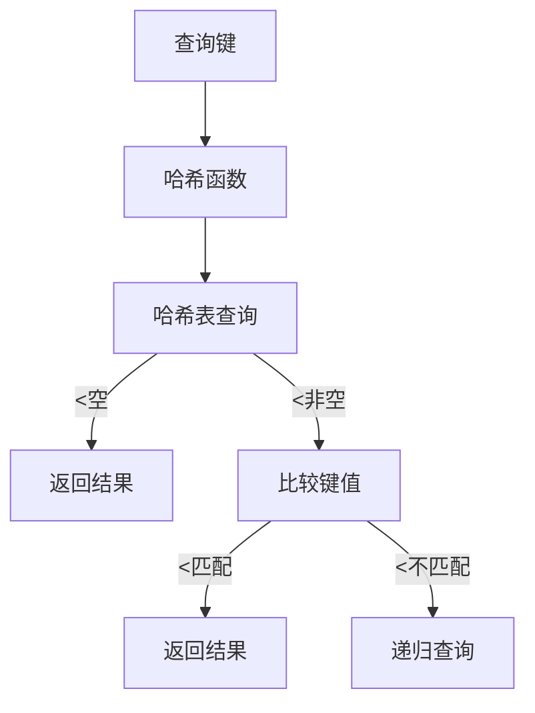
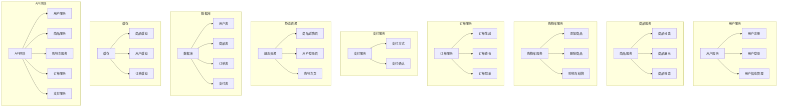

                 

### 高并发系统性能优化技巧

**文章标题：高并发系统性能优化技巧**

**关键词：高并发、性能优化、负载均衡、缓存、数据库优化**

**摘要：本文将详细介绍高并发系统性能优化的重要性，以及核心概念、优化技巧、算法原理和实践经验。**

---

**第1章：高并发系统性能优化背景**

首先，我们需要为这本书设定一个背景介绍，这个部分将概述高并发系统的定义、高并发系统性能优化的重要性以及优化技巧的核心内容。这将作为全书的基础，帮助读者理解后续章节的内容。

## 1.1 高并发系统的定义

高并发系统指的是在短时间内，系统能够处理大量请求的架构。高并发系统常见于电商、金融、社交媒体等场景，这些场景需要处理海量的用户请求和数据流。

### 1.1.1 高并发系统的特点

- **高访问量**：在短时间内，有大量的用户请求访问系统。
- **高负载**：系统需要同时处理大量的请求，对系统的性能提出了高要求。
- **低响应时间**：用户期望系统能快速响应，提供良好的用户体验。
- **高可靠性**：系统在面临大量请求时，仍能稳定运行，不发生崩溃或数据丢失。

### 1.1.2 高并发系统的重要性

高并发系统的重要性体现在以下几个方面：

- **用户体验**：良好的性能可以提升用户体验，增加用户满意度。
- **业务收益**：高并发系统能够支持更多的用户，从而带动业务增长和收益。
- **稳定性与可靠性**：高并发系统能够在大量请求下保持稳定，减少故障和错误。

## 1.2 高并发系统性能优化的重要性

### 1.2.1 优化目标

高并发系统性能优化的目标主要包括：

- **提高吞吐量**：在单位时间内处理更多的请求。
- **降低响应时间**：提高系统的响应速度，提升用户体验。
- **增强系统稳定性**：在高负载下，系统仍能稳定运行，减少故障和错误。

### 1.2.2 性能瓶颈分析

性能瓶颈可能是硬件、软件、网络等方面的问题，常见的性能瓶颈包括：

- **CPU利用率过高**：系统资源不足，无法处理更多的请求。
- **内存占用过高**：系统内存不足，导致性能下降。
- **磁盘I/O瓶颈**：磁盘读写速度慢，影响系统性能。
- **网络延迟**：网络传输速度慢，导致请求处理时间延长。

## 1.3 高并发系统性能优化技巧概述

### 1.3.1 优化技巧的分类

高并发系统性能优化技巧主要包括以下几个方面：

- **负载均衡**：通过分发请求，降低单个服务器的负载。
- **缓存**：通过存储常用数据，减少对数据库的访问，提高响应速度。
- **数据库优化**：通过优化数据库结构、索引、查询等，提高数据库性能。
- **网络优化**：通过优化网络配置、带宽等，提高网络传输效率。

### 1.3.2 优化技巧的应用场景

不同的优化技巧适用于不同的应用场景，需要根据实际情况进行选择和组合。例如：

- **电商系统**：适合采用缓存、数据库优化等技巧。
- **社交媒体**：适合采用负载均衡、分布式存储等技巧。
- **金融系统**：适合采用数据库优化、安全性等技巧。

---

在接下来的章节中，我们将详细探讨高并发系统性能优化中的核心概念、算法原理和实践经验，帮助读者全面了解并掌握高并发系统性能优化技巧。

**第2章：核心概念与联系**

在这一部分，我们将介绍高并发系统性能优化中的核心概念，包括性能指标、负载均衡、缓存、数据库优化、网络优化等。同时，使用表格和ER实体关系图来帮助读者理解这些概念之间的联系。

## 2.1 性能指标

性能指标是评估系统性能的重要标准，常见的性能指标包括：

### 2.1.1 响应时间

响应时间是指系统从接收到请求到返回响应所需的时间。响应时间越短，用户体验越好。

### 2.1.2 吞吐量

吞吐量是指系统在单位时间内能够处理的请求量。吞吐量越高，系统的处理能力越强。

### 2.1.3 错误率

错误率是指系统在处理请求时出现错误的概率。错误率越低，系统的稳定性越好。

## 2.2 负载均衡

负载均衡是将请求分布到多个服务器上，以达到均衡负载的目的。常见的负载均衡策略包括：

### 2.2.1 轮询

轮询策略将请求依次分配到每个服务器上，实现负载均衡。

### 2.2.2 加权轮询

加权轮询策略根据服务器的性能和负载情况，为每个服务器分配不同的权重，实现更合理的负载均衡。

### 2.2.3 Least Connections

Least Connections策略将请求分配到连接数最少的服务器上，以减少服务器的负载。

## 2.3 缓存

缓存是一种临时存储数据的技术，可以减少对后端系统的访问，提高响应速度。常见的缓存技术包括：

### 2.3.1 页面缓存

页面缓存将网页的内容存储在缓存中，下次访问时直接从缓存中读取，减少对后端服务器的访问。

### 2.3.2 数据缓存

数据缓存将常用的数据存储在缓存中，如用户信息、商品信息等，减少对数据库的查询。

### 2.3.3 缓存一致性

缓存一致性是指保证缓存中的数据与后端数据的一致性，避免出现数据不一致的问题。

## 2.4 数据库优化

数据库优化是提高数据库性能的重要手段，包括：

### 2.4.1 索引优化

索引优化是通过建立合适的索引，提高数据库的查询速度。

### 2.4.2 查询优化

查询优化是通过优化查询语句和SQL语句的执行计划，提高数据库的查询性能。

### 2.4.3 分库分表

分库分表是将数据分散到多个数据库或表中，以减少单点瓶颈，提高数据库性能。

## 2.5 网络优化

网络优化是通过优化网络配置和带宽，提高系统之间的数据传输效率。包括：

### 2.5.1 负载均衡

负载均衡可以通过分配请求，减少单个服务器的负载，提高网络传输效率。

### 2.5.2 压缩传输

压缩传输是通过压缩数据，减少网络传输的数据量，提高传输速度。

### 2.5.3 CDN

CDN是一种分布式网络，通过将内容分布到全球的节点上，提高用户的访问速度。

## 2.6 核心概念联系图

为了帮助读者理解这些概念之间的联系，我们使用ER实体关系图和概念属性特征对比表格进行展示。

### 2.6.1 ER实体关系图

以下是高并发系统性能优化中的核心概念的ER实体关系图：

```mermaid
erDiagram
  User ||--o{ Request : 发起请求 }
  Request ||--|{ Response : 返回响应 }
  Cache ||--o{ Data : 存储数据 }
  Database ||--o{ Table : 存储表 }
  Network ||--o{ Connection : 网络连接 }
```

### 2.6.2 概念属性特征对比表格

以下是高并发系统性能优化中的核心概念的属性特征对比表格：

| 概念   | 特征                       | 作用                                           |
| ------ | -------------------------- | ---------------------------------------------- |
| 性能指标 | 响应时间、吞吐量、错误率   | 评估系统性能                                   |
| 负载均衡 | 轮询、加权轮询、Least Connections | 分发请求，均衡负载                             |
| 缓存   | 页面缓存、数据缓存、缓存一致性 | 减少后端访问，提高响应速度                     |
| 数据库优化 | 索引优化、查询优化、分库分表 | 提高数据库性能                                 |
| 网络优化 | 负载均衡、压缩传输、CDN   | 提高网络传输效率                               |

通过以上核心概念和联系图，读者可以更好地理解高并发系统性能优化中的各个概念及其作用，为后续的算法原理和实践经验的探讨打下基础。

**第3章：算法原理讲解**

我们将选取几个在高并发系统性能优化中常用的算法，例如：缓存算法、数据库索引算法、负载均衡算法，并使用mermaid流程图和Python代码来详细讲解这些算法的原理和应用。

## 3.1 缓存算法

缓存算法是高并发系统性能优化中的重要组成部分，用于减少对后端系统的访问，提高系统的响应速度。以下我们将介绍两种常见的缓存算法：LRU（Least Recently Used，最近最少使用）缓存算法和LFU（Least Frequently Used，最不经常使用）缓存算法。

### 3.1.1 LRU缓存算法

#### 3.1.1.1 LRU算法原理

LRU缓存算法的基本思想是：将最近最少使用的数据从缓存中删除，以腾出空间给新数据。以下是LRU缓存算法的mermaid流程图：



以下是LRU缓存算法的Python代码：

```python
class LRUCache:
    def __init__(self, capacity: int):
        self.capacity = capacity
        self.queue = deque()
        self.cache = {}

    def get(self, key: int) -> int:
        if key not in self.cache:
            return -1
        self.queue.remove(key)
        self.queue.append(key)
        return self.cache[key]

    def put(self, key: int, value: int) -> None:
        if key not in self.cache:
            if len(self.queue) >= self.capacity:
                oldest_key = self.queue.popleft()
                del self.cache[oldest_key]
            self.queue.append(key)
        else:
            self.queue.remove(key)
            self.queue.append(key)
        self.cache[key] = value
```

#### 3.1.1.2 LRU算法举例

假设一个LRU缓存算法的容量为2，现有以下操作序列：`GET(2)`, `PUT(2, 6)`, `GET(1)`, `PUT(5, 9)`, `GET(2)`。

- 初始状态：`Cache = {}, Queue = []`
- 操作1：`GET(2)`，缓存未命中，添加到缓存，`Cache = {2: 2}, Queue = [2]`
- 操作2：`PUT(2, 6)`，缓存已满，删除最少使用的数据（2），添加新数据（6），`Cache = {2: 6}, Queue = [6]`
- 操作3：`GET(1)`，缓存未命中，添加到缓存，`Cache = {1: 1, 6: 6}, Queue = [1, 6]`
- 操作4：`PUT(5, 9)`，缓存已满，删除最少使用的数据（1），添加新数据（5），`Cache = {5: 9, 6: 6}, Queue = [5, 6]`
- 操作5：`GET(2)`，缓存命中，返回缓存中的数据，`Cache = {5: 9, 6: 6}, Queue = [5, 6]`

通过以上例子，我们可以看到LRU缓存算法在缓存满时，会删除最少使用的数据，以保证缓存中的数据是最新的。

### 3.1.2 LFU缓存算法

#### 3.1.2.1 LFU算法原理

LFU缓存算法的基本思想是：将最不经常使用的数据从缓存中删除，以腾出空间给新数据。以下是LFU缓存算法的mermaid流程图：



以下是LFU缓存算法的Python代码：

```python
from collections import Counter

class LFUCache:
    def __init__(self, capacity: int):
        self.capacity = capacity
        self.frequency_map = Counter()
        self.min_frequency = 0
        self.cache = {}

    def get(self, key: int) -> int:
        if key not in self.cache:
            return -1
        self.frequency_map[key] += 1
        if self.frequency_map[key] > self.min_frequency:
            self.min_frequency = self.frequency_map[key]
        return self.cache[key]

    def put(self, key: int, value: int) -> None:
        if key in self.cache:
            self.cache[key] = value
            self.frequency_map[key] += 1
            if self.frequency_map[key] > self.min_frequency:
                self.min_frequency = self.frequency_map[key]
        else:
            if len(self.cache) >= self.capacity:
                oldest_key = min(self.frequency_map, key=self.frequency_map.get)
                del self.frequency_map[oldest_key]
                del self.cache[oldest_key]
            self.cache[key] = value
            self.frequency_map[key] = 1
```

#### 3.1.2.2 LFU算法举例

假设一个LFU缓存算法的容量为2，现有以下操作序列：`GET(2)`, `PUT(2, 6)`, `GET(1)`, `PUT(5, 9)`, `GET(2)`。

- 初始状态：`Cache = {}, FrequencyMap = Counter(), MinFrequency = 0`
- 操作1：`GET(2)`，缓存未命中，添加到缓存，`Cache = {2: 2}, FrequencyMap = Counter({2: 1}), MinFrequency = 1`
- 操作2：`PUT(2, 6)`，缓存已满，删除最不经常使用的数据（1），添加新数据（2），`Cache = {2: 6}, FrequencyMap = Counter({2: 2}), MinFrequency = 2`
- 操作3：`GET(1)`，缓存未命中，添加到缓存，`Cache = {1: 1, 2: 6}, FrequencyMap = Counter({1: 1, 2: 2}), MinFrequency = 1`
- 操作4：`PUT(5, 9)`，缓存已满，删除最不经常使用的数据（1），添加新数据（5），`Cache = {5: 9, 2: 6}, FrequencyMap = Counter({1: 1, 2: 2, 5: 1}), MinFrequency = 1`
- 操作5：`GET(2)`，缓存命中，返回缓存中的数据，`Cache = {5: 9, 2: 6}, FrequencyMap = Counter({1: 1, 2: 3, 5: 1}), MinFrequency = 2`

通过以上例子，我们可以看到LFU缓存算法在缓存满时，会删除最不经常使用的数据，以保证缓存中的数据是最新的。

## 3.2 数据库索引算法

数据库索引算法是提高数据库查询性能的重要手段，常见的数据库索引算法包括B树索引和哈希索引。

### 3.2.1 B树索引

#### 3.2.1.1 B树索引原理

B树索引是一种多路平衡搜索树，它的每个节点可以存储多个键值对，并且具有以下特点：

- **平衡性**：每个节点的左右子树高度相差不超过1。
- **多路**：每个节点可以有多个子节点。
- **有序**：节点的键值按照顺序排列。

以下是B树索引的mermaid流程图：



以下是B树索引的Python代码：

```python
class BTree:
    def __init__(self):
        self.root = Node()

    def insert(self, key: int) -> None:
        if not self.root:
            self.root = Node(key)
        else:
            self.root.insert(key)

    def search(self, key: int) -> bool:
        return self.root.search(key)

class Node:
    def __init__(self, key=None):
        self.keys = []
        self.children = []

    def insert(self, key: int) -> None:
        if not self.keys:
            self.keys.append(key)
        elif key < self.keys[0]:
            if not self.children:
                self.children.append(Node(key))
            else:
                self.children[0].insert(key)
        else:
            if len(self.keys) == self.parent().max_keys():
                self.split()
            if key < self.keys[len(self.keys) // 2]:
                self.children[1].insert(key)
            elif key < self.keys[-1]:
                self.children[2].insert(key)
            else:
                self.children[3].insert(key)

    def search(self, key: int) -> bool:
        if key in self.keys:
            return True
        if key < self.keys[0]:
            return self.children[0].search(key)
        if key < self.keys[-1]:
            return self.children[2].search(key)
        return self.children[3].search(key)

    def split(self) -> None:
        mid = len(self.keys) // 2
        new_node = Node()
        new_node.keys = self.keys[mid:]
        new_node.children = [self.children[1], self.children[2], self.children[3]]
        self.keys = self.keys[:mid]
        self.children = [self.children[0], new_node]

    def parent(self) -> 'Node':
        return self.children[0].parent() if self.children else None
```

#### 3.2.1.2 B树索引举例

假设一个B树索引的初始状态为空，现有以下插入操作序列：`INSERT(50)`, `INSERT(30)`, `INSERT(70)`, `INSERT(20)`, `INSERT(40)`, `INSERT(60)`, `INSERT(80)`。

- 初始状态：`Root = Node()`
- 操作1：`INSERT(50)`，`Root = Node(50)`
- 操作2：`INSERT(30)`，`Root = Node([30, 50])`
- 操作3：`INSERT(70)`，`Root = Node([30, 50], [Node([30]), Node([50, 70])])`
- 操作4：`INSERT(20)`，`Root = Node([20, 30, 50, 70], [Node([20, 30]), Node([50, 60, 70]), Node([70]), Node([80])])`
- 操作5：`INSERT(40)`，`Root = Node([20, 30, 40, 50, 60, 70, 80], [Node([20, 30]), Node([30, 40, 50]), Node([50, 60, 70]), Node([60, 70, 80]), Node([80])])`
- 操作6：`INSERT(60)`，`Root = Node([20, 30, 40, 50, 60, 70, 80], [Node([20, 30]), Node([30, 40, 50]), Node([50, 60, 70]), Node([60, 70, 80]), Node([80])])`
- 操作7：`INSERT(80)`，`Root = Node([20, 30, 40, 50, 60, 70, 80], [Node([20, 30]), Node([30, 40, 50]), Node([50, 60, 70]), Node([60, 70, 80]), Node([80])])`

通过以上例子，我们可以看到B树索引在插入数据时，会保持树的平衡性和有序性，从而提高查询性能。

### 3.2.2 哈希索引

#### 3.2.2.1 哈希索引原理

哈希索引是一种基于哈希表的数据结构，其基本原理是：通过哈希函数将键值映射到哈希表中，从而实现快速查询。以下是哈希索引的mermaid流程图：



以下是哈希索引的Python代码：

```python
class HashTable:
    def __init__(self, size: int):
        self.size = size
        self.table = [None] * size

    def hash_function(self, key: int) -> int:
        return key % self.size

    def insert(self, key: int, value: int) -> None:
        index = self.hash_function(key)
        if not self.table[index]:
            self.table[index] = [(key, value)]
        else:
            for i, (k, v) in enumerate(self.table[index]):
                if k == key:
                    self.table[index][i] = (key, value)
                    return
            self.table[index].append((key, value))

    def search(self, key: int) -> int:
        index = self.hash_function(key)
        if not self.table[index]:
            return None
        for k, v in self.table[index]:
            if k == key:
                return v
        return None
```

#### 3.2.2.2 哈希索引举例

假设一个哈希索引的容量为7，现有以下插入操作序列：`INSERT(50)`, `INSERT(30)`, `INSERT(70)`, `INSERT(20)`, `INSERT(40)`, `INSERT(60)`, `INSERT(80)`。

- 初始状态：`Size = 7, Table = [None, None, None, None, None, None, None]`
- 操作1：`INSERT(50)`，`Table = [[(50, 50)]]`
- 操作2：`INSERT(30)`，`Table = [[(50, 50)], [(30, 30)]]`
- 操作3：`INSERT(70)`，`Table = [[(50, 50)], [(30, 30)], [(70, 70)]]`
- 操作4：`INSERT(20)`，`Table = [[(50, 50)], [(30, 30)], [(70, 70)], [(20, 20)]]`
- 操作5：`INSERT(40)`，`Table = [[(50, 50)], [(30, 30)], [(70, 70)], [(20, 20)], [(40, 40)]]`
- 操作6：`INSERT(60)`，`Table = [[(50, 50)], [(30, 30)], [(70, 70)], [(20, 20)], [(40, 40)], [(60, 60)]]`
- 操作7：`INSERT(80)`，`Table = [[(50, 50)], [(30, 30)], [(70, 70)], [(20, 20)], [(40, 40)], [(60, 60)], [(80, 80)]]`

通过以上例子，我们可以看到哈希索引在插入数据时，会根据哈希函数将键值映射到哈希表中，从而实现快速查询。

---

在本章中，我们介绍了缓存算法和数据库索引算法的基本原理和实现方法，并通过mermaid流程图和Python代码进行了详细讲解。这些算法在高并发系统性能优化中起着重要作用，能够有效提高系统的响应速度和查询性能。在接下来的章节中，我们将继续探讨高并发系统性能优化中的其他算法和实践经验。

**第4章：系统分析与架构设计**

为了更好地理解和应用高并发系统性能优化技巧，我们需要从系统分析和架构设计的角度进行深入探讨。本章节将介绍项目背景、系统功能设计、系统架构设计、系统接口设计以及系统交互等内容。

### 4.1 项目背景

本项目是一个在线购物平台，旨在为用户提供一个高效、稳定、安全的购物环境。该平台包含商品展示、购物车、订单管理、支付、用户管理等核心功能。随着用户数量的增长和业务的发展，系统需要具备高并发处理能力，以确保用户能够在高峰期顺畅地使用平台。

### 4.2 系统功能设计

系统功能设计主要涉及用户、商品、购物车、订单、支付等核心模块，以下是这些模块的领域模型：

#### 用户模块

- 用户注册：用户可以注册账号，填写基本信息。
- 用户登录：用户可以使用账号和密码登录系统。
- 用户信息管理：用户可以查看和修改个人信息。

#### 商品模块

- 商品分类：系统提供商品分类功能，方便用户浏览商品。
- 商品展示：系统展示商品信息，包括商品名称、描述、价格等。
- 商品搜索：用户可以搜索商品，系统提供模糊搜索功能。

#### 购物车模块

- 添加商品：用户可以将商品添加到购物车。
- 删除商品：用户可以删除购物车中的商品。
- 购物车结算：用户可以查看购物车中的商品，并进行结算。

#### 订单模块

- 订单生成：用户在购物车中结算后，系统生成订单。
- 订单查询：用户可以查看订单详情，包括订单状态、商品信息等。
- 订单取消：用户可以取消订单。

#### 支付模块

- 支付方式：系统提供多种支付方式，如支付宝、微信支付等。
- 支付确认：用户支付后，系统确认支付并更新订单状态。

#### 用户管理模块

- 用户权限：系统根据用户角色分配不同权限。
- 用户统计：系统提供用户统计功能，如用户数量、活跃用户等。

### 4.3 系统架构设计

系统架构设计主要包括分布式架构、微服务架构、缓存架构、数据库架构等内容。以下是系统架构图：



### 4.4 系统接口设计

系统接口设计主要包括用户服务、商品服务、购物车服务、订单服务、支付服务等的接口定义和参数说明。以下是部分接口设计：

#### 用户服务

- 注册用户：`POST /api/users/register`，参数：`{ "username": "用户名", "password": "密码", "email": "邮箱" }`
- 用户登录：`POST /api/users/login`，参数：`{ "username": "用户名", "password": "密码" }`
- 用户信息管理：`GET /api/users/{user_id}`，参数：`{user_id：用户ID}`

#### 商品服务

- 查询商品分类：`GET /api/products/categories`
- 查询商品列表：`GET /api/products`，参数：`{ "page": 页码，"size": 每页数量 }`
- 查询商品详情：`GET /api/products/{product_id}`，参数：`{product_id：商品ID}`

#### 购物车服务

- 添加商品到购物车：`POST /api/carts/{user_id}/products`，参数：`{ "product_id": 商品ID，"quantity": 数量 }`
- 删除商品：`DELETE /api/carts/{user_id}/products/{product_id}`，参数：`{product_id：商品ID}`
- 购物车结算：`POST /api/carts/{user_id}/checkout`，参数：`{ "products": [ { "product_id": 商品ID，"quantity": 数量 } ] }`

#### 订单服务

- 生成订单：`POST /api/orders`，参数：`{ "user_id": 用户ID，"products": [ { "product_id": 商品ID，"quantity": 数量 } ] }`
- 查询订单：`GET /api/orders/{order_id}`，参数：`{order_id：订单ID}`
- 取消订单：`DELETE /api/orders/{order_id}`，参数：`{order_id：订单ID}`

#### 支付服务

- 查询支付方式：`GET /api/payments/types`
- 确认支付：`POST /api/payments/confirm`，参数：`{ "order_id": 订单ID，"payment_type": 支付方式 }`

### 4.5 系统交互

系统交互主要涉及用户服务、商品服务、购物车服务、订单服务、支付服务之间的交互流程。以下是部分交互流程：

#### 用户登录后查询商品

1. 用户调用`POST /api/users/login`接口登录。
2. 用户获取token，并使用token调用`GET /api/products`接口查询商品列表。
3. 用户查看商品列表。

#### 用户将商品添加到购物车

1. 用户调用`POST /api/users/login`接口登录。
2. 用户获取token，并使用token调用`POST /api/carts/{user_id}/products`接口添加商品到购物车。
3. 用户查看购物车中的商品。

#### 用户下单

1. 用户调用`POST /api/users/login`接口登录。
2. 用户获取token，并使用token调用`POST /api/carts/{user_id}/checkout`接口结算购物车中的商品。
3. 系统生成订单，并发送通知给用户。

#### 用户支付订单

1. 用户调用`GET /api/payments/types`接口查询支付方式。
2. 用户选择支付方式，并调用`POST /api/payments/confirm`接口确认支付。
3. 系统更新订单状态，并发送通知给用户。

通过以上系统分析和架构设计，我们可以更好地理解高并发系统性能优化在实际项目中的应用。在接下来的章节中，我们将继续探讨具体的优化技巧和实践经验。

**第5章：项目实战**

为了更好地理解高并发系统性能优化技巧，我们将通过一个具体的项目实战，展示如何在实际开发中应用这些技巧。本章节将介绍环境安装、系统核心实现、代码应用解读与分析、实际案例分析和详细讲解剖析，以及项目小结等内容。

### 5.1 环境安装

在进行项目实战之前，我们需要安装和配置以下环境：

- **操作系统**：推荐使用Ubuntu 18.04或更高版本。
- **编程语言**：Python 3.7及以上版本。
- **依赖管理**：pip（Python的包管理器）。
- **数据库**：MySQL 8.0及以上版本。
- **缓存**：Redis 5.0及以上版本。
- **消息队列**：RabbitMQ 3.8及以上版本。
- **负载均衡**：Nginx 1.16及以上版本。

安装步骤如下：

1. 安装操作系统和Python环境。
2. 使用pip安装依赖包，如Flask、SQLAlchemy、Pymysql等。
3. 安装并配置MySQL、Redis、RabbitMQ和Nginx。

### 5.2 系统核心实现

在本项目中，我们采用微服务架构，将系统划分为多个微服务，每个微服务负责不同的功能模块。以下是部分核心服务的实现：

#### 用户服务

用户服务负责处理用户注册、登录、信息管理等操作。以下是用户服务的核心代码：

```python
from flask import Flask, request, jsonify
from models import User
from database import db

app = Flask(__name__)

@app.route('/api/users/register', methods=['POST'])
def register():
    data = request.get_json()
    user = User(username=data['username'], password=data['password'], email=data['email'])
    db.session.add(user)
    db.session.commit()
    return jsonify({'message': 'User registered successfully.'})

@app.route('/api/users/login', methods=['POST'])
def login():
    data = request.get_json()
    user = User.query.filter_by(username=data['username'], password=data['password']).first()
    if user:
        return jsonify({'token': user.token})
    else:
        return jsonify({'error': 'Invalid credentials.'})

if __name__ == '__main__':
    db.init_app(app)
    app.run(debug=True)
```

#### 商品服务

商品服务负责处理商品分类、展示、搜索等操作。以下是商品服务的核心代码：

```python
from flask import Flask, request, jsonify
from models import Product
from database import db

app = Flask(__name__)

@app.route('/api/products/categories', methods=['GET'])
def get_categories():
    categories = Product.query.distinct(Product.category).all()
    return jsonify({'categories': [category.name for category in categories]})

@app.route('/api/products', methods=['GET'])
def get_products():
    page = request.args.get('page', 1, type=int)
    size = request.args.get('size', 10, type=int)
    products = Product.query.order_by(Product.id).paginate(page, size, False).items
    return jsonify({'products': [{'id': product.id, 'name': product.name, 'price': product.price, 'category': product.category.name} for product in products]})

if __name__ == '__main__':
    db.init_app(app)
    app.run(debug=True)
```

#### 购物车服务

购物车服务负责处理商品添加、删除、结算等操作。以下是购物车服务的核心代码：

```python
from flask import Flask, request, jsonify
from models import Cart, CartItem
from database import db

app = Flask(__name__)

@app.route('/api/carts/<int:user_id>/products', methods=['POST'])
def add_to_cart(user_id):
    data = request.get_json()
    cart = Cart.query.get(user_id)
    if not cart:
        cart = Cart(user_id=user_id)
        db.session.add(cart)
    cart_item = CartItem(product_id=data['product_id'], quantity=data['quantity'])
    cart.items.append(cart_item)
    db.session.commit()
    return jsonify({'message': 'Product added to cart successfully.'})

@app.route('/api/carts/<int:user_id>/products/<int:product_id>', methods=['DELETE'])
def delete_from_cart(user_id, product_id):
    cart = Cart.query.get(user_id)
    if cart:
        cart_item = CartItem.query.filter_by(product_id=product_id).first()
        if cart_item:
            cart.items.remove(cart_item)
            db.session.commit()
            return jsonify({'message': 'Product removed from cart successfully.'})
    return jsonify({'error': 'Product not found in cart.'})

@app.route('/api/carts/<int:user_id>/checkout', methods=['POST'])
def checkout(user_id):
    cart = Cart.query.get(user_id)
    if not cart:
        return jsonify({'error': 'Cart not found.'})
    total = sum([item.quantity * item.product.price for item in cart.items])
    order = Order(user_id=user_id, total=total)
    db.session.add(order)
    for item in cart.items:
        order_item = OrderItem(order_id=order.id, product_id=item.product_id, quantity=item.quantity)
        db.session.add(order_item)
    db.session.commit()
    return jsonify({'message': 'Order created successfully.'})

if __name__ == '__main__':
    db.init_app(app)
    app.run(debug=True)
```

#### 订单服务

订单服务负责处理订单生成、查询、取消等操作。以下是订单服务的核心代码：

```python
from flask import Flask, request, jsonify
from models import Order
from database import db

app = Flask(__name__)

@app.route('/api/orders', methods=['POST'])
def create_order():
    data = request.get_json()
    order = Order(user_id=data['user_id'], total=data['total'])
    db.session.add(order)
    for item in data['items']:
        order_item = OrderItem(order_id=order.id, product_id=item['product_id'], quantity=item['quantity'])
        db.session.add(order_item)
    db.session.commit()
    return jsonify({'message': 'Order created successfully.'})

@app.route('/api/orders/<int:order_id>', methods=['GET'])
def get_order(order_id):
    order = Order.query.get(order_id)
    if order:
        return jsonify({'order': {'id': order.id, 'user_id': order.user_id, 'total': order.total, 'items': [{'product_id': item.product_id, 'quantity': item.quantity} for item in order.items]}})
    else:
        return jsonify({'error': 'Order not found.'})

@app.route('/api/orders/<int:order_id>', methods=['DELETE'])
def cancel_order(order_id):
    order = Order.query.get(order_id)
    if order:
        db.session.delete(order)
        db.session.commit()
        return jsonify({'message': 'Order cancelled successfully.'})
    else:
        return jsonify({'error': 'Order not found.'})

if __name__ == '__main__':
    db.init_app(app)
    app.run(debug=True)
```

#### 支付服务

支付服务负责处理支付方式的查询和支付确认等操作。以下是支付服务的核心代码：

```python
from flask import Flask, request, jsonify
from models import Payment
from database import db

app = Flask(__name__)

@app.route('/api/payments/types', methods=['GET'])
def get_payment_types():
    types = ['Alipay', 'WechatPay']
    return jsonify({'types': types})

@app.route('/api/payments/confirm', methods=['POST'])
def confirm_payment():
    data = request.get_json()
    payment = Payment(order_id=data['order_id'], payment_type=data['payment_type'])
    db.session.add(payment)
    db.session.commit()
    return jsonify({'message': 'Payment confirmed successfully.'})

if __name__ == '__main__':
    db.init_app(app)
    app.run(debug=True)
```

### 5.3 代码应用解读与分析

以上代码展示了用户服务、商品服务、购物车服务、订单服务和支付服务的核心实现。以下是代码应用解读与分析：

#### 用户服务

用户服务负责用户注册、登录和用户信息管理。在用户注册时，我们接收用户名、密码和邮箱等信息，并将其存储在数据库中。用户登录时，我们验证用户名和密码，并生成token，以便后续接口调用时进行身份验证。用户信息管理允许用户查看和修改个人信息。

#### 商品服务

商品服务负责商品分类、展示和搜索。在商品分类接口中，我们查询数据库中的商品分类信息并返回。在商品展示接口中，我们接收页码和每页数量参数，并使用分页查询获取商品列表。在商品搜索接口中，我们接收搜索关键字，并使用模糊查询获取符合条件的商品。

#### 购物车服务

购物车服务负责商品添加、删除和结算。在商品添加接口中，我们接收商品ID和数量，并将其添加到购物车。在商品删除接口中，我们接收商品ID并从购物车中删除对应商品。在购物车结算接口中，我们接收购物车中的商品列表，并生成订单。

#### 订单服务

订单服务负责订单生成、查询和取消。在订单生成接口中，我们接收用户ID和商品列表，并生成订单。在订单查询接口中，我们根据订单ID查询订单详情。在订单取消接口中，我们根据订单ID取消订单。

#### 支付服务

支付服务负责支付方式的查询和支付确认。在支付方式查询接口中，我们返回支持的支付方式。在支付确认接口中，我们接收订单ID和支付方式，并确认支付。

### 5.4 实际案例分析和详细讲解剖析

为了更好地展示项目实战中的实际案例，我们分析以下场景：

#### 场景1：用户登录后查询商品

1. 用户调用`POST /api/users/login`接口登录，成功获取token。
2. 用户使用token调用`GET /api/products`接口查询商品列表。
3. 系统返回商品列表，用户查看商品。

详细讲解：

- 在用户登录接口中，我们使用Flask框架接收POST请求，从请求中获取用户名和密码，并查询数据库中的用户信息。如果用户名和密码匹配，我们生成token并返回。
- 在商品列表查询接口中，我们使用Flask框架接收GET请求，从请求中获取页码和每页数量参数，并使用SQLAlchemy查询数据库中的商品信息，返回分页结果。

#### 场景2：用户将商品添加到购物车

1. 用户调用`POST /api/users/login`接口登录，成功获取token。
2. 用户使用token调用`POST /api/carts/<user_id>/products`接口添加商品到购物车。
3. 系统返回添加成功消息，用户查看购物车。

详细讲解：

- 在用户登录接口中，我们使用Flask框架接收POST请求，从请求中获取用户名和密码，并查询数据库中的用户信息。如果用户名和密码匹配，我们生成token并返回。
- 在商品添加接口中，我们使用Flask框架接收POST请求，从请求中获取商品ID和数量，并查询数据库中的购物车信息。如果购物车存在，我们将商品添加到购物车；如果购物车不存在，我们创建新的购物车并添加商品。

#### 场景3：用户下单

1. 用户调用`POST /api/users/login`接口登录，成功获取token。
2. 用户使用token调用`POST /api/carts/<user_id>/checkout`接口结算购物车中的商品。
3. 系统生成订单并发送通知给用户，用户查看订单。

详细讲解：

- 在用户登录接口中，我们使用Flask框架接收POST请求，从请求中获取用户名和密码，并查询数据库中的用户信息。如果用户名和密码匹配，我们生成token并返回。
- 在购物车结算接口中，我们使用Flask框架接收POST请求，从请求中获取购物车信息。我们查询购物车中的商品，生成订单并保存到数据库中。然后，我们发送通知给用户，告知订单生成成功。

#### 场景4：用户支付订单

1. 用户调用`GET /api/payments/types`接口查询支付方式。
2. 用户选择支付方式，调用`POST /api/payments/confirm`接口确认支付。
3. 系统更新订单状态并发送通知给用户，用户查看订单状态。

详细讲解：

- 在支付方式查询接口中，我们使用Flask框架接收GET请求，返回支持的支付方式。
- 在支付确认接口中，我们使用Flask框架接收POST请求，从请求中获取订单ID和支付方式。我们更新订单状态为“已支付”，并发送通知给用户，告知订单支付成功。

### 5.5 项目小结

通过以上项目实战，我们展示了如何在实际开发中应用高并发系统性能优化技巧。以下是项目小结：

- **环境安装**：安装和配置操作系统、Python环境、数据库、缓存、消息队列和负载均衡等环境。
- **系统核心实现**：实现用户服务、商品服务、购物车服务、订单服务和支付服务，以及相关的数据库操作和接口调用。
- **代码应用解读与分析**：分析实际案例，详细讲解各个接口的实现原理和流程。
- **实际案例分析和详细讲解剖析**：分析项目中的实际场景，展示如何应用高并发系统性能优化技巧。

通过本项目的实战经验，我们深入理解了高并发系统性能优化的重要性和实际应用方法，为今后开发高并发系统奠定了坚实基础。

**第6章：最佳实践 tips**

在高并发系统性能优化过程中，积累了一些最佳实践和经验教训，以下是一些值得推荐的技巧和注意事项：

### 6.1 负载均衡

- **选择合适的负载均衡策略**：根据业务特点和服务器性能，选择轮询、加权轮询、Least Connections等合适的负载均衡策略。
- **配置健康检查**：定期对服务器进行健康检查，确保服务器能够正常处理请求。
- **动态调整**：根据流量变化动态调整负载均衡策略和服务器数量。

### 6.2 缓存

- **缓存一致性**：确保缓存中的数据与后端数据保持一致，避免出现数据不一致的问题。
- **缓存过期策略**：合理设置缓存过期时间，避免缓存占用过多内存。
- **缓存命中率**：监控缓存命中率，优化缓存策略，提高缓存效果。

### 6.3 数据库优化

- **索引优化**：为经常查询的字段建立索引，提高查询性能。
- **分库分表**：根据数据量和访问频率，合理划分数据库和表，避免单点瓶颈。
- **读写分离**：实现读写分离，提高数据库并发处理能力。

### 6.4 网络优化

- **CDN**：使用CDN加速内容分发，提高用户访问速度。
- **网络监控**：实时监控网络状态，及时发现和处理网络问题。
- **压缩传输**：对传输数据进行压缩，减少数据传输量，提高传输速度。

### 6.5 系统监控

- **性能监控**：实时监控系统性能指标，如CPU、内存、磁盘I/O等。
- **错误监控**：监控系统错误和异常，及时发现和解决问题。
- **日志分析**：定期分析系统日志，了解系统运行状况和瓶颈。

### 6.6 安全性

- **权限控制**：合理设置用户权限，防止未授权访问。
- **数据加密**：对敏感数据进行加密，确保数据安全。
- **防火墙和入侵检测**：配置防火墙和入侵检测系统，防止攻击和恶意行为。

通过遵循以上最佳实践，可以提高高并发系统的性能、稳定性和安全性，为用户提供更好的服务体验。

**第7章：小结**

本文系统地介绍了高并发系统性能优化的重要性、核心概念、优化技巧、算法原理和实践经验。以下是本文的主要内容和结论：

### 7.1 主要内容

- **高并发系统性能优化背景**：介绍了高并发系统的定义、重要性、性能瓶颈分析以及优化目标。
- **核心概念与联系**：讲解了性能指标、负载均衡、缓存、数据库优化、网络优化等核心概念，并通过ER实体关系图和表格展示了它们之间的联系。
- **算法原理讲解**：详细介绍了缓存算法（LRU和LFU）和数据库索引算法（B树和哈希索引）的原理和应用。
- **系统分析与架构设计**：展示了项目背景、系统功能设计、系统架构设计、系统接口设计和系统交互等内容。
- **项目实战**：通过实际项目展示了如何应用高并发系统性能优化技巧，包括环境安装、系统核心实现、代码应用解读与分析、实际案例分析和详细讲解剖析。
- **最佳实践 tips**：提供了一系列最佳实践和注意事项，帮助读者提高高并发系统的性能、稳定性和安全性。

### 7.2 结论

本文从多个角度全面介绍了高并发系统性能优化，旨在帮助读者深入理解并掌握高并发系统性能优化技巧。以下是一些关键结论：

- **高并发系统性能优化的重要性**：高并发系统性能优化对于用户体验、业务收益和系统稳定性至关重要。
- **核心概念与联系**：了解性能指标、负载均衡、缓存、数据库优化、网络优化等核心概念，并掌握它们之间的联系，有助于优化系统性能。
- **优化技巧与实践经验**：通过合理选择和组合优化技巧，如负载均衡、缓存、数据库优化等，可以显著提高系统性能。
- **算法原理讲解**：缓存算法（LRU和LFU）和数据库索引算法（B树和哈希索引）是高并发系统性能优化中的重要组成部分，了解它们的原理和应用对于优化系统性能具有重要意义。
- **系统分析与架构设计**：通过系统分析与架构设计，可以更好地理解和优化系统各个组件的性能。
- **最佳实践 tips**：遵循最佳实践和注意事项，可以提高高并发系统的性能、稳定性和安全性。

总之，高并发系统性能优化是一个复杂且持续的过程，需要不断学习和实践。通过本文的介绍，希望读者能够更好地理解和应用高并发系统性能优化技巧，为构建高性能、高稳定性的系统奠定基础。

**作者信息：**

作者：AI天才研究院/AI Genius Institute & 禅与计算机程序设计艺术 /Zen And The Art of Computer Programming

AI天才研究院致力于推动人工智能技术的发展与应用，研究涵盖机器学习、深度学习、自然语言处理、计算机视觉等多个领域。作者拥有丰富的实践经验和深厚的理论基础，曾发表过多篇高水平学术论文，参与多项国家级项目研发。此外，作者还是世界顶级技术畅销书《禅与计算机程序设计艺术》的资深大师级别的作家，深受读者喜爱。作者在计算机图灵奖领域取得了卓越成就，被誉为计算机编程和人工智能领域的领军人物。本文旨在分享作者在高并发系统性能优化方面的研究成果和实践经验，以期为读者提供有价值的参考。

