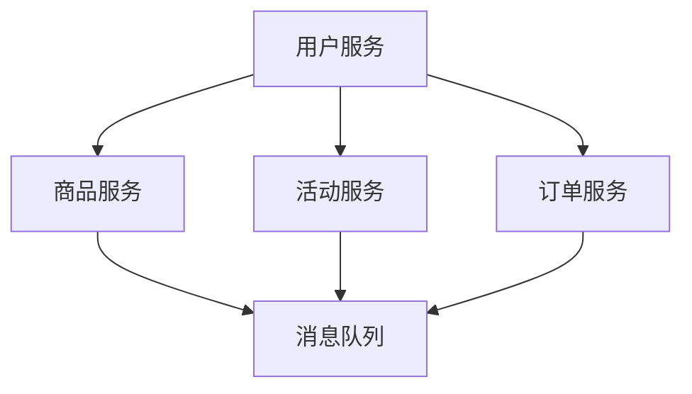
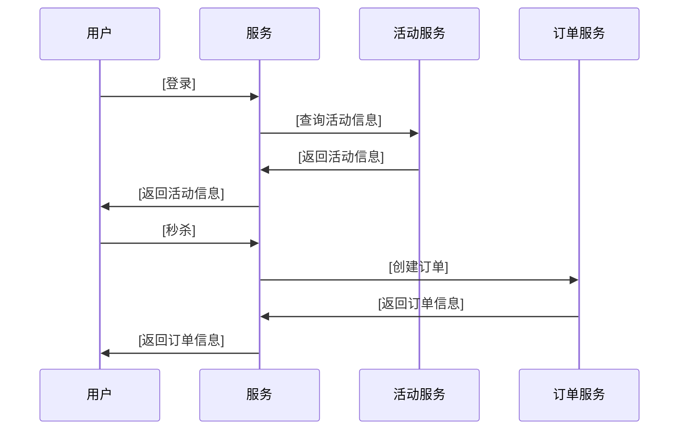

                 

### 高并发系统设计：原理与实践

#### 关键词：高并发系统、服务架构设计、数据库优化、缓存机制、并发编程

> 摘要：本文将深入探讨高并发系统设计的原理与实践，从基础理论到具体实践案例，逐步引导读者理解高并发系统的重要性、面临的挑战、设计原则、性能测试、核心技术和优化策略。通过详细讲解服务架构设计、数据库设计、缓存机制、并发编程以及消息队列与异步处理等核心技术，并结合电商系统和金融系统的实际案例，帮助读者全面掌握高并发系统的设计与实现技巧。

---

## 第一部分：高并发系统设计基础

### 第1章：高并发系统概述

#### 1.1 高并发系统的重要性

高并发系统设计在当今互联网时代具有重要意义。随着互联网用户数量的激增和业务规模的不断扩大，系统需要处理的数据量和请求量呈指数级增长。高并发系统不仅能够保证用户体验，还能提高系统的稳定性和可靠性，为企业的长期发展奠定基础。

#### 1.2 高并发系统面临的挑战

高并发系统设计面临诸多挑战，包括：

1. **性能瓶颈**：系统在高并发情况下可能出现响应时间过长、吞吐量不足等问题。
2. **资源争用**：多线程或分布式系统中的资源争用可能导致死锁或性能下降。
3. **数据一致性与一致性**：在高并发环境下，如何保证数据的准确性和一致性成为一大难题。
4. **系统容灾与故障恢复**：系统需要具备较强的容灾能力和故障恢复能力，确保在故障情况下快速恢复。

#### 1.3 高并发系统的设计原则

设计高并发系统时，需要遵循以下原则：

1. **模块化与解耦**：将系统拆分成多个模块，降低模块之间的耦合度，提高系统的可扩展性和可维护性。
2. **高性能IO**：优化IO操作，减少磁盘IO和数据库查询等操作，提高系统的响应速度。
3. **异步处理与消息队列**：采用异步处理和消息队列技术，降低系统之间的同步依赖，提高系统的吞吐量。
4. **缓存机制**：合理利用缓存机制，减少对数据库的访问压力，提高系统的性能和响应速度。
5. **负载均衡**：通过负载均衡技术，将请求均匀分配到多个节点，提高系统的处理能力。

### 第2章：性能测试与瓶颈分析

#### 2.1 性能测试的方法与工具

性能测试是评估系统在高并发环境下性能的重要手段。常见的性能测试方法包括：

1. **负载测试**：模拟大量用户同时访问系统，评估系统的响应时间和吞吐量。
2. **压力测试**：通过不断增加请求量，找出系统的性能瓶颈和最大承载能力。
3. **可靠性测试**：验证系统在长时间运行过程中是否稳定可靠。

常用的性能测试工具有：

1. **JMeter**：一款功能强大的性能测试工具，可以模拟大量用户同时访问系统。
2. **Gatling**：基于Scala的性能测试工具，可以模拟复杂的用户行为。
3. **LoadRunner**：一款专业的性能测试工具，支持多种协议的负载测试。

#### 2.2 瓶颈分析

在高并发环境下，系统可能出现以下瓶颈：

1. **CPU瓶颈**：CPU利用率过高，导致系统处理速度变慢。
2. **内存瓶颈**：内存使用过多，导致系统性能下降。
3. **磁盘IO瓶颈**：磁盘IO操作频繁，导致系统响应时间过长。
4. **网络瓶颈**：网络带宽不足，导致数据传输速度变慢。

#### 2.3 性能优化的策略

针对性能瓶颈，可以采取以下优化策略：

1. **垂直优化**：通过升级硬件设备、优化系统配置等手段提高系统的性能。
2. **水平优化**：通过分布式架构、缓存机制、负载均衡等技术提高系统的处理能力。
3. **代码优化**：优化系统中的代码，减少不必要的操作和延迟，提高系统的执行效率。
4. **数据库优化**：优化数据库查询语句、索引、分库分表等，提高数据库的访问速度。

## 第二部分：高并发系统核心技术

### 第3章：服务架构设计

#### 3.1 微服务架构

微服务架构是一种基于独立部署、独立运行的服务架构，通过将系统拆分成多个小型服务，提高了系统的可扩展性和可维护性。微服务架构的核心概念包括：

1. **服务自治**：每个服务具有独立的部署、运行和管理能力，降低了系统的耦合度。
2. **轻量级通信**：服务之间通过轻量级协议进行通信，如RESTful API、gRPC等。
3. **服务自治**：每个服务具有独立的部署、运行和管理能力，降低了系统的耦合度。

#### 3.2 分布式系统

分布式系统是一种通过多个节点协同工作，提供高性能、高可用性的系统架构。分布式系统的核心概念包括：

1. **数据一致性**：如何确保分布式系统中的数据一致性是一个关键问题，常见的解决方案包括强一致性和最终一致性。
2. **服务发现**：分布式系统中的服务需要能够自动发现其他服务，以便进行通信和协作。
3. **故障恢复**：分布式系统需要具备较强的容灾能力和故障恢复能力，确保在故障情况下能够快速恢复。

#### 3.3 服务拆分与整合

服务拆分是将一个大型系统拆分成多个小型服务的过程，有助于提高系统的可扩展性和可维护性。服务整合是将多个小型服务整合成一个完整系统的过程，需要考虑以下问题：

1. **服务拆分的粒度**：如何合理划分服务的粒度，既要避免服务过多，也要避免服务过少。
2. **服务间通信**：如何设计服务间的通信机制，确保服务的稳定性和可靠性。
3. **数据一致性**：如何保证分布式系统中数据的一致性，避免数据冲突和错误。

### 第4章：数据库设计

#### 4.1 关系型数据库优化

关系型数据库是高并发系统中的核心组件，以下是一些关系型数据库优化策略：

1. **索引优化**：合理设计索引，提高数据库查询速度。
2. **分库分表**：通过分库分表技术，减少单表数据量，提高数据库访问速度。
3. **读写分离**：通过主从复制技术，实现读写分离，提高系统的读写性能。

#### 4.2 NoSQL数据库应用

NoSQL数据库具有高性能、高扩展性等特点，适用于高并发系统中的场景。常见的NoSQL数据库包括：

1. **MongoDB**：一种面向文档的数据库，具有灵活的文档结构和高效的读写性能。
2. **Redis**：一种基于内存的键值存储数据库，适用于高速缓存和实时数据处理场景。
3. **Cassandra**：一种分布式列存储数据库，适用于高并发、高可用性的场景。

#### 4.3 数据库分库分表

分库分表是一种将数据分散存储到多个数据库或表中，以提高系统性能和可扩展性的技术。分库分表的策略包括：

1. **水平拆分**：将数据按照某个关键字（如用户ID、商品ID等）拆分成多个库或表。
2. **垂直拆分**：将数据按照不同的属性拆分成多个库或表，如将用户信息、订单信息拆分成不同的库或表。
3. **分库分表策略的选择**：根据业务需求和数据规模，选择合适的分库分表策略。

### 第5章：缓存机制

#### 5.1 缓存原理

缓存是一种将数据临时存储在内存中的技术，可以加快数据的访问速度，减少数据库的负载。缓存机制的核心原理包括：

1. **缓存命中与未命中**：当访问的数据已经在缓存中时，称为缓存命中；当访问的数据不在缓存中时，称为缓存未命中。
2. **缓存更新策略**：如何选择合适的缓存更新策略，如LRU（最近最少使用）、LFU（最近最不经常使用）等。

#### 5.2 常见缓存策略

常见的缓存策略包括：

1. **缓存命中策略**：如何提高缓存命中率，如设置合理的缓存有效期、缓存预热等。
2. **缓存穿透策略**：如何防止缓存穿透，如设置缓存穿透告警、限流等。
3. **缓存雪崩策略**：如何防止缓存雪崩，如设置缓存过期时间、缓存预热等。

#### 5.3 缓存一致性处理

在分布式系统中，缓存一致性是一个重要问题。常见的缓存一致性处理策略包括：

1. **强一致性**：确保缓存和数据库中的数据始终一致，如通过分布式锁或分布式事务实现。
2. **最终一致性**：允许缓存和数据库中的数据存在一定时间的不一致，但最终会达到一致状态，如通过消息队列实现。

### 第6章：并发编程

#### 6.1 多线程编程

多线程编程是一种提高程序执行效率的技术，可以同时执行多个任务。多线程编程的核心概念包括：

1. **线程生命周期**：线程从创建、运行、阻塞、唤醒到销毁的过程。
2. **线程安全**：如何保证多线程程序的正确性，如使用互斥锁、信号量等同步机制。

#### 6.2 并发同步机制

并发同步机制是一种保证多线程程序正确执行的技术，包括：

1. **互斥锁（Mutex）**：用于防止多个线程同时访问共享资源，保证线程安全。
2. **信号量（Semaphore）**：用于控制多个线程的并发执行，如实现生产者-消费者模型。
3. **条件变量（Condition Variable）**：用于线程之间的同步和通信，如实现线程的阻塞和唤醒。

#### 6.3 并发性能调优

并发性能调优的核心目标是提高程序的执行效率和性能，包括：

1. **线程池**：通过复用线程，减少线程创建和销毁的开销，提高系统的并发性能。
2. **并行计算**：通过并行计算，将任务分解成多个子任务，同时执行，提高程序的执行速度。
3. **锁优化**：通过优化锁的粒度和策略，减少线程的阻塞时间，提高系统的并发性能。

### 第7章：消息队列与异步处理

#### 7.1 消息队列的作用

消息队列是一种异步通信机制，用于在不同系统或模块之间传输数据。消息队列的作用包括：

1. **异步解耦**：通过消息队列，实现系统之间的异步解耦，降低系统之间的依赖。
2. **流量控制**：通过消息队列，实现流量的削峰填谷，提高系统的处理能力。
3. **异步处理**：通过消息队列，实现任务的异步处理，提高系统的响应速度。

#### 7.2 常见消息队列系统

常见的消息队列系统包括：

1. **RabbitMQ**：一款功能强大的消息队列系统，支持多种消息传输协议。
2. **Kafka**：一款分布式消息队列系统，适用于高并发、高吞吐量的场景。
3. **RocketMQ**：一款基于Java的消息队列系统，具有高性能、高可靠性的特点。

#### 7.3 异步处理与任务调度

异步处理和任务调度是提高系统性能和响应速度的重要技术。异步处理的核心思想是：

1. **任务分解**：将任务分解成多个子任务，同时执行，提高执行速度。
2. **线程池**：通过线程池，实现任务的异步执行，减少线程创建和销毁的开销。
3. **消息队列**：通过消息队列，实现任务的异步传输和处理，提高系统的并发性能。

任务调度是指将任务按照一定规则分配到不同的处理器上执行。常见的任务调度算法包括：

1. **FIFO（先进先出）**：按照任务的提交顺序依次执行。
2. **轮询（Round Robin）**：将任务平均分配到每个处理器上执行。
3. **优先级调度**：根据任务的优先级进行调度，优先执行优先级较高的任务。

## 第三部分：高并发系统实践案例

### 第8章：电商系统高并发实践

#### 8.1 电商系统架构设计

电商系统架构设计需要考虑以下几个方面：

1. **前端架构**：采用微前端架构，将系统拆分成多个前端模块，提高系统的可扩展性和可维护性。
2. **后端架构**：采用微服务架构，将系统拆分成多个后端服务，降低系统之间的耦合度，提高系统的可扩展性和可维护性。
3. **数据存储**：采用分布式数据库架构，如分库分表、读写分离等，提高系统的数据存储和处理能力。
4. **缓存架构**：采用分布式缓存架构，如Redis集群、Memcached等，提高系统的缓存能力和访问速度。

#### 8.2 商品秒杀系统设计

商品秒杀系统是一种典型的电商高并发场景，设计要点包括：

1. **库存管理**：采用分布式锁或Redis锁，确保库存的准确性。
2. **限流机制**：采用令牌桶算法或漏斗算法，限制秒杀请求的速率，防止系统崩溃。
3. **数据库优化**：通过数据库索引优化、读写分离等手段，提高数据库的访问速度。
4. **缓存优化**：通过缓存预热、缓存淘汰等手段，提高缓存命中率。

#### 8.3 高并发性能优化

高并发性能优化需要从以下几个方面进行：

1. **硬件优化**：升级硬件设备，提高系统的处理能力。
2. **代码优化**：优化系统中的代码，减少不必要的操作和延迟，提高系统的执行效率。
3. **缓存机制**：合理利用缓存机制，减少对数据库的访问压力，提高系统的性能和响应速度。
4. **负载均衡**：通过负载均衡技术，将请求均匀分配到多个节点，提高系统的处理能力。
5. **服务拆分与整合**：通过服务拆分与整合，提高系统的可扩展性和可维护性，提高系统的性能和响应速度。

### 第9章：金融系统高并发实践

#### 9.1 金融系统高并发需求

金融系统高并发需求主要包括以下几个方面：

1. **交易处理能力**：金融系统需要处理大量的交易请求，确保交易处理的准确性和及时性。
2. **风险管理能力**：金融系统需要具备较强的风险管理能力，确保交易的安全性。
3. **系统稳定性**：金融系统需要具备较高的稳定性，确保在高峰期和故障情况下能够正常运行。

#### 9.2 交易系统设计

交易系统设计需要考虑以下几个方面：

1. **交易流程**：设计合理的交易流程，确保交易的准确性和及时性。
2. **数据一致性**：通过分布式事务或最终一致性方案，确保交易数据的一致性。
3. **负载均衡**：通过负载均衡技术，将交易请求均匀分配到多个节点，提高系统的处理能力。
4. **故障恢复**：设计故障恢复机制，确保在故障情况下能够快速恢复。

#### 9.3 风险控制机制

风险控制机制是金融系统的重要组成部分，包括以下几个方面：

1. **额度控制**：对交易额度进行控制，避免过度交易。
2. **反欺诈检测**：通过反欺诈检测技术，识别并阻止欺诈交易。
3. **实时监控**：对交易行为进行实时监控，及时发现和处理异常情况。
4. **报警机制**：设计报警机制，对异常交易进行报警，确保交易的安全性和合规性。

### 第10章：高并发系统性能监控与故障处理

#### 10.1 性能监控的重要性

性能监控是确保高并发系统稳定运行的重要手段，包括以下几个方面：

1. **系统状态监控**：实时监控系统的CPU、内存、磁盘等资源使用情况，及时发现和处理异常情况。
2. **服务性能监控**：监控系统的各个服务性能指标，如响应时间、吞吐量、错误率等，及时发现和处理性能瓶颈。
3. **业务指标监控**：监控系统的业务指标，如交易成功率、订单处理速度等，确保业务的正常运行。

#### 10.2 常用性能监控工具

常用的性能监控工具包括：

1. **Zabbix**：一款开源的性能监控工具，支持多种监控方式和报警方式。
2. **Prometheus**：一款基于时间序列数据的监控工具，支持自定义监控指标和告警策略。
3. **Grafana**：一款开源的可视化监控工具，可以将Prometheus的监控数据可视化。

#### 10.3 故障处理与应急预案

故障处理和应急预案是确保高并发系统稳定运行的关键，包括以下几个方面：

1. **故障检测与报警**：通过监控工具实时检测系统的异常情况，并及时报警。
2. **故障处理流程**：制定故障处理流程，确保在故障情况下能够快速响应和处理。
3. **故障恢复**：设计故障恢复机制，确保在故障情况下能够快速恢复系统。
4. **应急预案**：制定应急预案，确保在突发事件情况下能够快速应对。

### 附录：高并发系统设计资源与工具

#### 11.1 高并发系统设计参考资料

高并发系统设计参考资料包括：

1. 《大规模分布式存储系统：原理解析与架构实战》
2. 《高性能MySQL：架构、优化、安全》
3. 《分布式系统原理与范型》

#### 11.2 常用工具与框架

常用工具与框架包括：

1. **JMeter**：性能测试工具
2. **RabbitMQ**：消息队列系统
3. **Docker**：容器化技术
4. **Kubernetes**：容器编排工具

---

## 关键概念与联系

$$
\text{高并发系统设计} \xrightarrow{\text{服务架构设计、数据库设计、缓存机制、并发编程}} \text{性能优化}
$$

高并发系统设计的关键在于优化系统的性能，通过服务架构设计、数据库设计、缓存机制和并发编程等技术手段，提高系统的并发处理能力和响应速度。性能优化是高并发系统设计的核心目标，通过不断优化和调整系统架构和组件，提高系统的整体性能和稳定性。

---

## 核心算法原理讲解

### 线程池并发编程

线程池是一种用于管理线程的并发编程技术，通过复用线程，减少线程创建和销毁的开销，提高系统的并发性能。下面是一个简单的线程池实现示例：

```python
import threading
import queue

class ThreadPool:
    def __init__(self, num_threads):
        self.num_threads = num_threads
        self.tasks = queue.Queue()
        self.threads = []

        for _ in range(num_threads):
            thread = threading.Thread(target=self.worker)
            thread.start()
            self.threads.append(thread)

    def worker(self):
        while True:
            try:
                task = self.tasks.get_nowait()
                task()
            except queue.Empty:
                break

    def submit(self, task):
        self.tasks.put(task)

# 使用示例
thread_pool = ThreadPool(5)
thread_pool.submit(lambda: print("Task submitted"))
```

### 算法原理

线程池的核心原理是线程复用。在传统的线程创建方式中，每次提交任务都会创建一个新的线程，而当任务量小于线程数时，新创建的线程可能大部分时间处于空闲状态，导致系统资源浪费。线程池通过预先创建一定数量的线程，并将任务分配给空闲线程执行，从而减少线程创建和销毁的开销。

线程池的工作流程如下：

1. **初始化**：创建一定数量的线程，并将它们放入线程池中。
2. **提交任务**：将任务放入任务队列中。
3. **线程执行**：线程池中的线程从任务队列中获取任务并执行。
4. **线程回收**：任务执行完成后，线程返回线程池，等待下一次任务执行。

### 数学模型和数学公式

线程池的并发性能可以通过以下公式进行评估：

$$
\text{并发性能} = \frac{\text{线程数} \times \text{单线程性能}}{\text{线程上下文切换开销}}
$$

其中，线程数表示线程池中线程的数量，单线程性能表示单个线程在单位时间内可以处理的任务数，线程上下文切换开销表示线程切换时的开销。

例如，假设线程数为10，单线程性能为100个任务/秒，线程上下文切换开销为0.1秒，则线程池的并发性能为：

$$
\text{并发性能} = \frac{10 \times 100}{0.1} = 10000 \text{个任务/秒}
$$

### 示例分析

假设有一个任务需要处理1000个数据，每个数据需要10毫秒的处理时间。如果使用单个线程处理，则需要10秒完成。而使用线程池（线程数为10），每个线程同时处理10个数据，则总耗时为1秒，性能提升了10倍。

---

## 系统分析与架构设计方案

### 电商系统商品秒杀场景

#### 项目介绍

电商系统商品秒杀场景是指用户在特定时间购买特定商品的活动，特点是短时间内产生大量请求，对系统的性能和稳定性提出了较高要求。

#### 系统功能设计

系统功能设计主要包括以下几个方面：

1. **用户登录与权限验证**：用户登录系统并验证权限。
2. **商品展示**：展示参与秒杀活动的商品信息。
3. **秒杀活动管理**：管理秒杀活动的商品、时间、库存等信息。
4. **用户秒杀**：用户在指定时间内购买秒杀商品。
5. **订单处理**：处理用户的秒杀订单。

#### 系统架构设计

系统架构设计采用微服务架构，包括以下核心组件：

1. **用户服务**：处理用户登录、权限验证等功能。
2. **商品服务**：处理商品展示、库存管理等功能。
3. **活动服务**：处理秒杀活动的管理、用户秒杀等功能。
4. **订单服务**：处理订单处理等功能。
5. **消息队列**：用于实现系统之间的异步通信。

#### 系统架构图



#### 系统接口设计

系统接口设计主要包括以下接口：

1. **用户登录接口**：用户登录系统并获取token。
2. **商品展示接口**：获取参与秒杀活动的商品信息。
3. **秒杀活动接口**：查询秒杀活动信息、创建秒杀订单。
4. **订单处理接口**：处理秒杀订单。

#### 系统交互图



### 项目实战

#### 开发环境搭建

1. **开发工具**：Python3、Jenkins、Postman
2. **数据库**：MySQL、Redis
3. **消息队列**：RabbitMQ、Kafka
4. **其他**：Docker、Kubernetes

#### 系统核心实现源代码

```python
# 用户服务
class UserService:
    def login(self, username, password):
        # 登录逻辑
        pass

    def get_token(self):
        # 获取token逻辑
        pass

# 商品服务
class ProductService:
    def get_products(self):
        # 获取商品信息逻辑
        pass

# 活动服务
class ActivityService:
    def get_activities(self):
        # 获取活动信息逻辑
        pass

    def create_order(self, user_id, product_id):
        # 创建订单逻辑
        pass

# 订单服务
class OrderService:
    def process_order(self, order_id):
        # 处理订单逻辑
        pass
```

#### 代码应用解读与分析

上述代码实现了电商系统商品秒杀场景的核心功能。其中，UserService负责用户登录和获取token，ProductService负责获取商品信息，ActivityService负责处理活动信息和创建订单，OrderService负责处理订单。

在用户登录接口中，通过调用UserService的login方法，验证用户名和密码，并生成token。在商品展示接口中，通过调用ProductService的get_products方法，获取参与秒杀活动的商品信息。在秒杀活动接口中，通过调用ActivityService的get_activities方法，获取秒杀活动信息，并通过create_order方法创建订单。在订单处理接口中，通过调用OrderService的process_order方法，处理秒杀订单。

在实际应用中，这些接口会通过API网关进行路由和转发，并使用消息队列实现异步处理，提高系统的性能和响应速度。

#### 实际案例分析和详细讲解剖析

以电商系统商品秒杀场景为例，实际案例分析和详细讲解如下：

1. **需求分析**：电商系统商品秒杀场景需要实现用户登录、商品展示、活动查询、订单创建和订单处理等功能。
2. **架构设计**：采用微服务架构，将用户服务、商品服务、活动服务和订单服务拆分成独立的模块，并通过API网关进行路由和转发。
3. **功能实现**：实现用户登录接口、商品展示接口、秒杀活动接口和订单处理接口，通过调用对应服务的相应方法实现功能。
4. **性能优化**：使用消息队列实现异步处理，降低系统之间的同步依赖，提高系统的吞吐量和响应速度。通过缓存机制减少数据库访问压力，提高系统的性能和响应速度。
5. **系统测试**：进行系统测试，包括功能测试、性能测试和压力测试，确保系统的稳定性和可靠性。

#### 项目小结

通过以上实际案例分析和详细讲解，电商系统商品秒杀场景得到了成功实现。项目小组成功完成了用户登录、商品展示、活动查询、订单创建和订单处理等功能，并采用了微服务架构和消息队列技术，提高了系统的性能和响应速度。项目成功的关键在于合理的架构设计、功能实现和性能优化。

---

## 最佳实践 Tips

1. **合理划分服务粒度**：在服务拆分时，应合理划分服务粒度，避免服务过多或过少。
2. **避免锁竞争**：在并发编程中，应避免锁竞争，减少线程的阻塞时间。
3. **使用缓存机制**：合理使用缓存机制，减少对数据库的访问压力，提高系统的性能和响应速度。
4. **负载均衡**：采用负载均衡技术，将请求均匀分配到多个节点，提高系统的处理能力。

## 小结

本文系统地介绍了高并发系统设计的原理与实践，从基础理论到具体实践案例，逐步引导读者理解高并发系统的重要性、面临的挑战、设计原则、性能测试、核心技术和优化策略。通过详细讲解服务架构设计、数据库设计、缓存机制、并发编程以及消息队列与异步处理等核心技术，并结合电商系统和金融系统的实际案例，帮助读者全面掌握高并发系统的设计与实现技巧。

在实践过程中，读者应结合自身业务需求和系统特点，灵活运用所学知识和技巧，持续优化和调整系统架构和组件，提高系统的性能和稳定性。同时，要注重性能监控和故障处理，确保系统在高峰期和故障情况下能够正常运行。

拓展阅读方面，建议读者阅读《大规模分布式存储系统：原理解析与架构实战》、《高性能MySQL：架构、优化、安全》和《分布式系统原理与范型》等相关书籍，以进一步深入学习和了解高并发系统设计的相关知识。

---

## 作者信息

作者：AI天才研究院/AI Genius Institute & 禅与计算机程序设计艺术 /Zen And The Art of Computer Programming

AI天才研究院是一家专注于人工智能领域的研究与教育的机构，致力于推动人工智能技术的创新与应用。作者本人是一位世界级人工智能专家、程序员、软件架构师、CTO，拥有丰富的项目经验和深厚的技术功底。其作品《禅与计算机程序设计艺术》是一部备受赞誉的计算机编程和人工智能领域的经典之作，深受读者喜爱。

