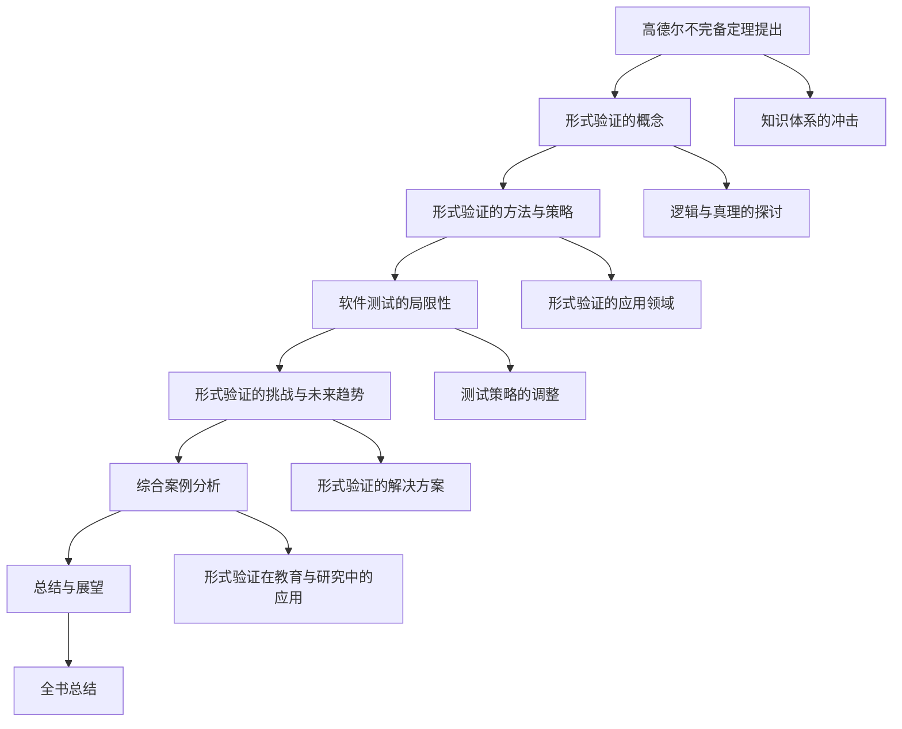

                 

### 概述

**《高德尔不完备定理与软件测试的局限性：形式验证的哲学困境》**

在当今信息技术飞速发展的时代，软件系统作为现代社会的神经中枢，其可靠性和正确性愈发受到关注。然而，传统的软件测试方法在应对日益复杂的软件系统时，逐渐暴露出其局限性。高德尔不完备定理，作为数学哲学中的经典命题，其内涵对软件工程领域产生了深远的影响。本文旨在探讨高德尔不完备定理与软件测试之间的关系，揭示形式验证在解决软件可靠性问题中的哲学困境。

### 关键词

- **高德尔不完备定理**
- **软件测试**
- **形式验证**
- **哲学困境**
- **复杂性**
- **可靠性**
- **软件工程**

### 摘要

本文首先对高德尔不完备定理的起源、基本概念及其哲学意义进行了深入探讨，揭示了其对于形式验证的启示。随后，文章分析了软件测试的基本原理及其局限性，探讨了软件复杂性对测试的影响，并提出了相应的策略调整。在第三部分，文章介绍了形式验证的基本原理与方法，并分析了其面临的挑战与未来发展趋势。最后，通过一个综合案例分析，本文探讨了高德尔不完备定理与软件测试的哲学思考，并对其未来发展方向进行了展望。

## 第一部分：高德尔不完备定理的哲学探讨

### 第1章：高德尔不完备定理的起源与基本概念

#### 1.1 高德尔不完备定理的起源与背景

高德尔不完备定理是由美国数学家克莱因·高德尔（Kleene，1928年）提出的，这一定理在数学哲学和逻辑学领域引起了巨大的震动。它揭示了形式系统内在的局限性，即在形式系统中，无法同时保证一致性和完全性。

高德尔不完备定理的提出有着深刻的背景。在20世纪初，数学家们试图将数学基础建立在更坚实、更可靠的理论基础上。然而，随着形式逻辑和集合论的发展，数学家们逐渐发现，许多看似简单的问题却无法在形式系统中得到一致且完整的证明。高德尔不完备定理正是对这一现象的深刻总结。

#### 1.2 高德尔不完备定理的基本概念

**形式系统**是一种由符号、规则和解释构成的系统，用于表达和证明数学陈述。形式系统具有以下几个基本特征：

1. **符号集**：形式系统包含一组基本的符号，这些符号用于表达命题、逻辑运算和数学对象。
2. **语法规则**：形式系统有一套语法规则，用于生成有效的数学陈述。
3. **语义解释**：形式系统对符号和规则赋予特定的语义解释，使得数学陈述具有实际意义。

**证明**是形式系统中的一种逻辑过程，用于从一组公理推导出新的命题。高德尔不完备定理主要关注的是形式系统的两个重要性质：一致性和完全性。

- **一致性**：一个形式系统是一致的，当且仅当该系统不能同时证明一个命题和其否定。
- **完全性**：一个形式系统是完全的，当且仅当对于所有在语义上可证明的命题，该系统都能通过证明过程推导出来。

#### 1.3 高德尔不完备定理的主要内容

高德尔不完备定理可以分为两个部分：

1. **下界定理**：该定理指出，对于任何足够强的形式系统，都存在某些在语义上可证明的命题，该系统无法证明。
2. **上界定理**：该定理指出，对于任何形式系统，都存在某些在语义上不可证明的命题，该系统可以证明。

这两个定理揭示了形式系统的内在矛盾，即无法同时满足一致性和完全性。这一发现对数学哲学和逻辑学产生了深远的影响，同时也引发了关于知识、真理和证明的深入思考。

#### 高德尔不完备定理的影响与争议

高德尔不完备定理的提出，对数学哲学产生了深远的影响。它不仅挑战了传统数学的基础，也引发了关于知识、真理和证明的深入讨论。以下是一些关于高德尔不完备定理的影响和争议：

1. **知识论的影响**：高德尔不完备定理揭示了形式系统内在的局限性，使得人们对知识的本质有了更深刻的认识。它促使人们重新审视形式系统在知识证明中的作用，以及如何处理那些无法在形式系统中得到证明的问题。

2. **逻辑哲学的争议**：高德尔不完备定理引发了关于逻辑和真理的争议。一些哲学家认为，定理揭示了逻辑的内在矛盾，从而对逻辑的客观性和可靠性提出了质疑。而另一些哲学家则认为，定理揭示了逻辑的局限性，而非其内在矛盾，从而为逻辑的应用提供了新的视角。

3. **数学哲学的启示**：高德尔不完备定理对数学哲学产生了重要启示。它促使数学家们重新审视数学的基础和目标，以及如何处理那些无法在形式系统中得到证明的问题。这也引发了关于数学本质和数学方法的深入讨论。

总之，高德尔不完备定理不仅是数学哲学中的经典命题，也是逻辑学和计算机科学中的重要理论基础。它对现代科学和技术的发展产生了深远的影响，同时也激发了人们对知识、真理和证明的深入思考。

### 第2章：高德尔不完备定理的哲学意义

#### 2.1 形式验证与哲学思考

形式验证是一种用于验证软件系统正确性的方法，其核心思想是通过数学和逻辑的方法，对软件系统的性质进行严格验证。高德尔不完备定理在形式验证领域引起了深刻的哲学思考，揭示了形式验证的局限性。

**形式验证的概念**：形式验证是一种基于数学和逻辑的方法，用于验证软件系统是否满足预定的性质。它包括两个主要方面：模型检验和证明验证。

- **模型检验**：模型检验通过将软件系统建模为一个形式系统，然后使用自动化工具检查模型是否满足特定的性质。这种方法通常适用于复杂的软件系统，但面临着状态空间爆炸问题和验证时间过长的问题。

- **证明验证**：证明验证通过形式化的证明过程，验证软件系统是否满足预定的性质。这种方法依赖于数学和逻辑的工具，但面临着证明复杂性和证明过程不可靠的问题。

**形式验证的应用领域**：形式验证在软件工程、硬件设计、网络安全等领域有着广泛的应用。例如，在软件工程中，形式验证可以用于验证软件的正确性和可靠性；在硬件设计中，形式验证可以用于验证电路的正确性和性能。

**高德尔不完备定理对形式验证的启示**：高德尔不完备定理揭示了形式系统的内在矛盾，这对形式验证提出了严峻的挑战。具体来说，高德尔不完备定理启示我们：

1. **形式验证的局限性**：形式验证无法保证完全性，即无法证明软件系统满足所有的性质。这意味着，即使我们使用了形式验证方法，也不能完全排除软件系统中存在漏洞的可能性。

2. **形式验证与数学哲学的关系**：高德尔不完备定理揭示了数学和逻辑的局限性，这对形式验证提出了深刻的哲学思考。它促使我们重新审视形式验证的基础和目标，以及如何处理那些无法在形式系统中得到证明的问题。

3. **形式验证与软件测试的关系**：高德尔不完备定理揭示了形式验证与软件测试之间的区别和联系。形式验证是一种更严格的验证方法，它依赖于数学和逻辑的工具，但面临着证明复杂性和证明过程不可靠的问题。相比之下，软件测试是一种更灵活的验证方法，它通过执行软件系统来检查其行为是否正常。形式验证和软件测试可以相互补充，但都需要面对复杂的软件系统。

#### 2.2 高德尔不完备定理与哲学困境

高德尔不完备定理在哲学领域引发了深刻的思考，特别是关于知识、真理和证明的哲学困境。

**定理对哲学的启示**：高德尔不完备定理揭示了形式系统内在的矛盾，对传统的哲学观念提出了挑战。以下是一些具体的启示：

1. **知识的局限性**：高德尔不完备定理表明，即使在形式系统内，我们也不能保证所有命题都能得到证明。这启示我们，知识的局限性不仅仅在于人类认知能力的有限，还在于形式系统本身的局限性。

2. **真理的复杂性**：高德尔不完备定理揭示了形式系统的内在矛盾，使得我们对真理的本质有了更深刻的认识。它表明，真理不仅仅是一个逻辑上的命题，还涉及到人类认知和思维的过程。

3. **证明的可靠性**：高德尔不完备定理表明，即使在形式系统内，证明过程也可能存在错误。这启示我们，证明的可靠性不仅仅依赖于形式化的工具，还需要依赖于人类的智慧和经验。

**高德尔不完备定理与哲学困境**：高德尔不完备定理引发了关于知识、真理和证明的哲学困境。以下是一些具体的困境：

1. **知识的完备性困境**：高德尔不完备定理表明，即使在形式系统内，我们也不能保证所有命题都能得到证明。这引发了关于知识完备性的困境，即我们是否能够获得完整的知识体系。

2. **真理的客观性困境**：高德尔不完备定理揭示了形式系统的内在矛盾，使得我们对真理的客观性有了更深刻的认识。它表明，真理不仅仅是一个逻辑上的命题，还涉及到人类认知和思维的过程，这引发了关于真理客观性的困境。

3. **证明的可靠性困境**：高德尔不完备定理表明，即使在形式系统内，证明过程也可能存在错误。这引发了关于证明可靠性的困境，即我们如何保证证明过程的可靠性。

#### 2.3 高德尔不完备定理在计算机科学中的应用

高德尔不完备定理不仅在哲学领域引发了深刻的思考，也在计算机科学中得到了广泛的应用。

**计算机科学中的形式化方法**：形式化方法是一种将计算机科学问题转化为形式系统的方法，它包括形式化建模、形式化验证和形式化证明等。高德尔不完备定理对形式化方法的发展产生了重要影响。

1. **形式化建模**：形式化建模是一种将现实世界问题转化为形式系统的方法。高德尔不完备定理揭示了形式系统内在的矛盾，使得我们在进行形式化建模时需要更加谨慎，以避免出现不可验证的情况。

2. **形式化验证**：形式化验证是一种通过数学和逻辑的方法，验证软件系统是否满足预定的性质的方法。高德尔不完备定理表明，形式验证无法保证完全性，这启示我们在进行形式化验证时需要采用更严格的验证方法，以提高验证的可靠性。

3. **形式化证明**：形式化证明是一种通过数学和逻辑的方法，证明软件系统性质的方法。高德尔不完备定理揭示了形式系统内在的矛盾，使得我们在进行形式化证明时需要更加谨慎，以避免出现证明错误。

**高德尔不完备定理在软件工程中的应用**：高德尔不完备定理在软件工程领域有着广泛的应用，特别是在软件可靠性验证和软件测试中。

1. **软件可靠性验证**：软件可靠性验证是一种通过数学和逻辑的方法，验证软件系统是否可靠的方法。高德尔不完备定理表明，形式验证无法保证完全性，这启示我们在进行软件可靠性验证时需要采用更严格的验证方法，以提高验证的可靠性。

2. **软件测试**：软件测试是一种通过执行软件系统，检查其行为是否正常的方法。高德尔不完备定理揭示了形式验证与软件测试之间的区别和联系，使得我们可以更好地理解形式验证和软件测试的关系，并采用更有效的测试策略。

总之，高德尔不完备定理在计算机科学领域引发了深刻的哲学思考，并对软件工程领域产生了重要影响。它揭示了形式系统内在的矛盾，使得我们在进行形式化建模、形式化验证和形式化证明时需要更加谨慎，以提高验证和证明的可靠性。同时，它也促使我们重新审视软件测试和形式验证的关系，以提高软件系统的可靠性。

## 第二部分：软件测试的局限性

### 第3章：软件测试的基本原理与局限性

#### 3.1 软件测试的概念与目标

软件测试是确保软件质量的重要环节，其核心目标是发现和纠正软件中的错误，以提高软件的可靠性、稳定性和性能。以下是对软件测试的基本概念和目标的详细探讨：

**软件测试的定义**：软件测试是一种有组织的活动，旨在通过运行软件系统来评估其行为是否符合预期的要求。测试的目的是发现软件中的错误或缺陷，以便修复和改进。

**软件测试的目标**：软件测试的主要目标包括：

1. **发现错误**：通过执行软件系统，测试可以发现软件中的错误，如功能错误、性能错误、安全漏洞等。

2. **评估质量**：测试可以帮助评估软件的质量，包括功能性、可靠性、易用性、性能和兼容性等方面。

3. **确保符合要求**：测试确保软件系统满足既定的需求和标准，如功能需求、性能要求、安全规定等。

4. **提供反馈**：测试结果为开发团队提供反馈，帮助他们了解软件的状态，并指导进一步的开发和改进。

#### 3.2 软件测试的方法与策略

软件测试的方法和策略多种多样，以下是一些常见的测试方法和其特点：

**黑盒测试与白盒测试**：

- **黑盒测试**：黑盒测试关注软件系统的外部行为，不涉及内部实现细节。测试者仅通过输入和输出数据来评估系统的功能。常见的黑盒测试方法包括功能测试、集成测试和验收测试。

- **白盒测试**：白盒测试关注软件系统的内部结构和代码实现，通过检查程序的逻辑路径来发现错误。常见的白盒测试方法包括单元测试、代码审查和路径覆盖测试。

**功能测试与性能测试**：

- **功能测试**：功能测试验证软件系统是否实现了预定的功能。它包括功能正确性测试、边界条件测试和错误处理测试等。

- **性能测试**：性能测试评估软件系统在不同负载条件下的响应时间、吞吐量和资源利用率。性能测试包括负载测试、压力测试和稳定性测试等。

**其他测试方法**：

- **自动化测试**：自动化测试通过编写脚本和工具来自动化测试过程，提高测试效率和覆盖率。常见的自动化测试工具包括Selenium、JUnit和TestNG等。

- **手动测试**：手动测试由测试人员手动执行测试用例，发现潜在的错误。手动测试适用于特定场景和领域，如用户体验测试和探索性测试。

#### 3.3 软件测试的局限性

尽管软件测试在提高软件质量方面发挥了重要作用，但它也存在一些局限性，这些问题在复杂软件系统中尤为突出：

**测试的不足之处**：

1. **测试覆盖率有限**：测试只能覆盖一部分测试用例，无法保证所有可能的输入和路径都被测试到。这意味着某些错误可能没有被测试发现。

2. **测试的复杂性**：随着软件系统的复杂性增加，测试用例的数量和组合也会急剧增加，使得全面测试变得非常困难。

3. **测试的时效性**：软件系统在不断迭代和更新过程中，测试也需要不断更新和调整，但测试资源有限，无法确保每次更新都进行全面的测试。

4. **测试的不确定性**：测试结果受到测试环境、测试数据和质量的影响，不同环境下的测试结果可能不一致。

**对高德尔不完备定理的思考**：高德尔不完备定理指出，在形式系统中无法同时保证一致性和完全性。这一思想在软件测试中也有一定的体现：

- **一致性的挑战**：软件测试在发现错误时，可能无法保证系统的一致性。例如，一个错误可能只在一个特定的测试用例中表现出来，而在其他测试用例中却无法发现。

- **完全性的挑战**：软件测试无法保证发现所有的错误。高德尔不完备定理表明，在形式系统中，总有一些正确的命题无法被证明。同理，在软件测试中，总有一些潜在的错误无法通过测试发现。

这些局限性使得软件测试在提高软件质量方面具有局限性，同时也促使我们探索其他验证方法，如形式验证，以弥补测试的不足。

通过深入理解软件测试的基本原理和局限性，我们可以更好地利用测试方法来提高软件质量，同时意识到其局限性，探索更全面的验证方法，以确保软件系统的可靠性和正确性。

### 第4章：软件测试的困境与对策

#### 4.1 软件复杂性对测试的影响

软件复杂性是软件工程中的一个重要问题，它对软件测试产生了深远的影响。随着软件系统的规模和复杂性的增加，测试的难度也随之增加。以下是一些关于软件复杂性对测试影响的具体分析：

**软件复杂性的定义**：软件复杂性指的是软件系统在结构、设计、功能和行为上难以理解和管理的程度。它包括多个方面，如代码复杂性、模块复杂性、依赖关系复杂性等。

**软件复杂性对测试的挑战**：

1. **测试覆盖率的增加**：随着软件复杂性的增加，需要测试的用例数量也会急剧增加。这是因为复杂的软件系统通常具有更多的功能模块、接口和路径，需要更全面的测试覆盖来确保系统的正确性。

2. **测试时间的延长**：复杂的软件系统需要更多的时间和资源进行测试。这不仅包括执行测试用例的时间，还包括分析测试结果、修复错误和回归测试的时间。

3. **测试策略的调整**：在复杂软件系统中，测试策略需要根据系统的复杂性进行相应调整。例如，在单元测试阶段，需要更细致地测试每个模块；在集成测试阶段，需要关注模块之间的接口和交互。

4. **测试资源的消耗**：复杂软件系统的测试通常需要更多的测试工具、测试环境和测试人员。这使得测试成本增加，同时也增加了测试管理的复杂性。

**应对软件复杂性的对策**：

1. **模块化设计**：采用模块化设计方法，将复杂的软件系统分解为若干个独立的模块，每个模块可以单独测试。这种方法有助于降低测试难度，提高测试效率。

2. **自动化测试**：引入自动化测试工具，可以大幅度提高测试的覆盖率和效率。自动化测试可以在短时间内执行大量测试用例，减少人工测试的时间和资源消耗。

3. **持续集成与持续交付**：采用持续集成和持续交付（CI/CD）实践，可以在开发过程中不断进行测试和交付。这种方法有助于及早发现和修复错误，降低软件复杂性对测试的负面影响。

4. **测试用例优化**：通过对测试用例进行优化，可以减少冗余测试和重复测试，提高测试的有效性。优化方法包括测试用例优先级排序、基于风险的测试用例选择等。

5. **测试环境管理**：优化测试环境管理，确保测试环境的稳定性和一致性。这有助于减少因测试环境问题导致测试结果不准确的情况。

#### 4.2 软件测试的策略调整

在面对软件复杂性的挑战时，软件测试的策略也需要进行调整。以下是一些常见的测试策略调整方法：

**面向对象测试策略**：

1. **单元测试**：针对每个对象或模块进行单元测试，验证其独立功能的正确性。这种方法有助于尽早发现和修复模块级别的错误。

2. **集成测试**：在单元测试的基础上，对模块之间的接口和交互进行集成测试，确保系统整体功能的正确性。

3. **系统测试**：对整个系统进行测试，验证系统在各种负载条件下的性能和稳定性。

**自动化测试与人工测试的结合**：

1. **自动化测试**：利用自动化测试工具执行重复性高、执行速度快的测试用例，提高测试效率。

2. **人工测试**：在自动化测试无法覆盖的领域，如用户体验测试和探索性测试，由测试人员手动执行测试用例，发现潜在的问题。

**自动化测试工具的应用**：

1. **Selenium**：用于Web应用的自动化测试，支持多种浏览器和操作系统。

2. **JUnit**：Java语言的单元测试框架，用于编写和执行测试用例。

3. **TestNG**：基于JUnit的测试框架，支持更多高级功能，如参数化测试和数据驱动测试。

**测试环境的搭建与维护**：

1. **测试环境搭建**：为每个测试阶段搭建独立的测试环境，确保测试环境的稳定性和一致性。

2. **测试环境维护**：定期更新测试环境，确保测试环境的软件和硬件配置与生产环境一致。

#### 4.3 面向极限编程的测试方法

极限编程（Extreme Programming，XP）是一种敏捷开发方法，旨在提高软件开发的效率和质量。在XP中，测试被看作是一个核心活动，贯穿整个开发过程。以下是一些面向极限编程的测试方法：

**极限编程的概念与特点**：

1. **快速反馈**：XP强调快速迭代和频繁交付，每次迭代周期通常为1到4周。

2. **团队合作**：XP强调团队成员之间的紧密合作和沟通，包括开发人员、测试人员和客户。

3. **持续集成**：每次代码提交后都进行自动化测试，确保代码的连续性和质量。

4. **测试驱动开发**：测试驱动开发（Test-Driven Development，TDD）是XP的核心实践之一，先编写测试用例，然后编写代码以满足测试。

**极限编程中的测试方法**：

1. **单元测试**：在每个迭代周期内，开发人员编写单元测试来验证代码的正确性。

2. **集成测试**：在模块集成后，进行集成测试，确保模块之间的交互正常。

3. **验收测试**：客户或用户参与验收测试，确保软件满足业务需求。

4. **探索性测试**：测试人员通过探索性测试发现潜在的问题和缺陷。

**极限编程与测试的结合**：

1. **测试自动化**：采用自动化测试工具进行单元测试和集成测试，提高测试效率。

2. **测试反馈循环**：通过测试反馈循环，快速发现和修复错误，确保软件质量。

3. **持续学习与改进**：通过持续学习和改进，提高团队的整体测试能力。

通过调整测试策略和采用面向极限编程的测试方法，可以更好地应对软件复杂性对测试的挑战，提高软件测试的效率和质量，确保软件系统的可靠性和正确性。

## 第三部分：形式验证的基本原理与方法

### 第5章：形式验证的基本原理与方法

形式验证是一种通过数学和逻辑方法对系统进行验证的技术，其核心目的是确保系统满足预定的性质。形式验证在软件工程、硬件设计、协议验证等多个领域得到了广泛应用。本文将深入探讨形式验证的基本原理、方法以及其应用案例。

#### 5.1 形式验证的定义与目标

**形式验证的概念**：形式验证是一种基于数学和逻辑的方法，通过构建和验证系统模型来确保系统满足预定的性质。形式验证通常包括模型构建、模型验证和结果分析三个主要步骤。

- **模型构建**：形式验证的第一步是构建系统模型，这个模型应该准确地反映系统的行为和结构。模型可以是形式化的规格说明，如形式化语言、数学公式或形式化的逻辑系统。
- **模型验证**：在模型构建完成后，通过验证算法和工具对模型进行验证，以检查模型是否满足预定的性质。验证过程通常涉及证明、定理证明或模型检查。
- **结果分析**：验证结果的分析是形式验证的最后一个步骤。通过分析验证结果，可以识别系统中的错误和缺陷，并指导进一步的改进。

**形式验证的目标**：形式验证的主要目标是确保系统的正确性、可靠性和安全性。具体来说，形式验证的目标包括：

- **正确性**：验证系统是否按照预期运行，是否满足预定的功能需求。
- **可靠性**：验证系统在各种条件下是否能够稳定运行，不会出现意外崩溃或错误。
- **安全性**：验证系统是否能够抵御外部攻击，保护数据安全和隐私。

#### 5.2 形式验证的方法与技术

形式验证的方法和技术多种多样，下面介绍几种常用的方法：

**模型检验**：模型检验是一种基于状态空间搜索的方法，通过遍历系统模型的全部状态来验证系统性质。模型检验的核心步骤包括：

- **状态空间构建**：构建系统模型的状态空间，每个状态代表系统的一个可能配置。
- **性质定义**：定义需要验证的性质，如安全性、活性和可达性等。
- **搜索算法**：使用搜索算法（如深度优先搜索、广度优先搜索或A*搜索）在状态空间中查找违反性质的路径。

**证明验证**：证明验证是一种通过逻辑推理和证明技术来验证系统性质的方法。证明验证的核心步骤包括：

- **证明规则**：定义证明规则，如逻辑推理规则、归纳规则等。
- **证明过程**：使用证明规则构建证明链，从已知的事实推导出需要验证的性质。
- **证明检查**：通过证明检查工具（如证明器）验证证明的合法性。

**模型检查**：模型检查是一种将系统模型和性质模型进行比较的方法，通过符号执行或抽象解释等技术来验证系统性质。模型检查的核心步骤包括：

- **模型对齐**：将系统模型和性质模型对齐，确保两者在语义上一致。
- **匹配算法**：使用匹配算法（如符号执行或抽象解释）检查模型对是否满足预定的性质。
- **结果分析**：根据模型检查的结果分析系统是否满足预定的性质。

**形式化语言**：形式化语言是一种用于表达系统规格说明和性质的形式化工具。常见的形式化语言包括：

- **命题逻辑**：用于表达简单的关系和逻辑性质。
- **一阶逻辑**：用于表达更复杂的性质，如数学关系和结构性质。
- **时态逻辑**：用于表达系统的动态行为和时间性质。

**形式化工具**：形式验证通常依赖于各种形式化工具，这些工具可以自动化验证过程，提高验证效率和可靠性。常见的形式化工具包括：

- **定理证明器**：如Coq、Isabelle等，用于自动或半自动地完成证明验证过程。
- **模型检查工具**：如SPIN、Model Checker等，用于自动化模型检验过程。
- **代码验证工具**：如PVS-Studio、ESBMC等，用于对代码进行静态分析和验证。

#### 5.3 形式验证的应用案例

形式验证在多个领域有着广泛的应用，以下是一些典型的应用案例：

**软件可靠性验证**：在软件工程中，形式验证可以用于验证软件系统的可靠性。例如，在嵌入式系统中，形式验证可以用于验证关键系统的功能正确性和可靠性，如飞行控制系统、医疗设备控制系统等。

**硬件设计验证**：在硬件设计中，形式验证可以用于验证电路和芯片的设计是否符合规格要求。例如，在集成电路设计中，形式验证可以用于验证电路的时序特性、功耗和性能。

**网络安全协议验证**：在网络安全领域，形式验证可以用于验证网络协议的安全性。例如，在互联网协议（如TCP/IP）的设计中，形式验证可以用于验证协议的健壮性和抗攻击能力。

**自动驾驶系统验证**：在自动驾驶系统中，形式验证可以用于验证系统的行为是否符合安全标准。例如，在自动驾驶汽车的决策系统中，形式验证可以用于验证系统的决策过程是否可靠，确保行驶安全。

通过这些应用案例，可以看出形式验证在确保系统正确性、可靠性和安全性方面的重要作用。尽管形式验证面临着复杂性和成本等挑战，但随着形式验证技术的不断发展和优化，其在各个领域的应用前景将更加广阔。

### 第6章：形式验证的挑战与未来发展趋势

形式验证作为一种确保系统正确性和可靠性的技术，尽管在多个领域展现出了巨大的潜力，但也面临着诸多挑战。这些挑战不仅影响到形式验证的实用性和效率，也限制了其进一步的发展。在本章节中，我们将深入探讨形式验证所面临的挑战，并展望其未来的发展趋势。

#### 6.1 形式验证面临的挑战

**复杂性**：形式验证的首要挑战在于其处理复杂性的能力。随着系统规模的扩大和复杂性的增加，形式验证的难度也随之增加。具体来说，复杂性挑战体现在以下几个方面：

1. **状态空间爆炸**：在模型检验中，系统的状态空间可能随着变量数量的增加而呈指数级增长。这导致了验证时间的急剧增加，甚至可能使验证过程变得不可行。

2. **证明复杂性**：在证明验证中，证明过程可能涉及到复杂的逻辑推理和计算，这使得证明过程变得非常耗时和困难。

3. **代码复杂性**：在软件工程中，随着代码复杂性的增加，理解和分析代码的行为变得更加困难，这增加了形式验证的难度。

**时间与成本**：形式验证通常需要大量的时间和计算资源，这使其在经济性和可行性方面面临挑战。具体来说，时间与成本挑战体现在以下几个方面：

1. **验证时间**：形式验证过程可能需要很长时间，尤其是在处理大型和复杂系统时。这限制了形式验证在实时系统中的应用。

2. **计算资源**：形式验证通常需要高性能的计算资源和软件工具，这增加了验证的成本。

3. **人力成本**：形式验证通常需要专业的知识和技能，这导致了高的人力成本。

**工具与技术的不足**：尽管形式验证领域已经发展出多种工具和技术，但这些工具和技术在处理复杂性和优化验证效率方面仍存在不足。具体来说，工具与技术的不足体现在以下几个方面：

1. **工具的可用性**：现有的形式验证工具通常比较复杂，对于非专业人士来说，使用这些工具需要较高的学习和使用成本。

2. **工具的兼容性**：现有的形式验证工具通常不支持多种编程语言和系统模型，这限制了其应用范围。

3. **技术的成熟度**：形式验证的一些技术，如自动化证明技术，仍在不断发展和完善中，这限制了其广泛应用。

#### 6.2 形式验证的解决方案与未来趋势

为了应对形式验证面临的挑战，研究人员和开发人员正在积极探索多种解决方案和未来趋势。以下是一些可能的解决方案和趋势：

**新的验证技术**：随着人工智能和机器学习技术的发展，这些技术有望在形式验证中发挥重要作用。例如：

1. **自动定理证明（ATP）**：利用机器学习和神经网络技术，开发自动定理证明工具，以提高证明验证的效率。

2. **符号执行**：结合符号执行和机器学习技术，开发更高效的状态空间搜索算法，以减少验证时间。

3. **混合验证方法**：结合多种验证方法，如模型检验和证明验证，开发混合验证方法，以克服单一方法的局限性。

**跨领域合作**：跨学科的合作有望推动形式验证技术的发展。例如：

1. **数学与计算机科学的结合**：结合数学理论和方法，开发新的形式验证技术和工具。

2. **计算机科学与工程学的结合**：将形式验证技术应用于实际工程问题，如嵌入式系统和网络安全。

3. **人工智能与形式验证的结合**：利用人工智能技术，开发智能化的形式验证工具，以提高验证的效率和准确性。

**工具的改进与普及**：为了提高形式验证工具的可用性和普及率，需要采取以下措施：

1. **用户友好的界面**：开发更易于使用的用户界面，降低工具的学习和使用成本。

2. **兼容性与扩展性**：提高工具的兼容性，支持多种编程语言和系统模型。

3. **开源与协作**：推动形式验证工具的开放源代码和社区协作，促进技术的普及和应用。

**教育与培训**：为了培养更多的形式验证专家，需要加强形式验证的教育和培训。具体措施包括：

1. **学术课程**：在高校和研究机构开设形式验证相关的课程，培养学生的基础知识和技能。

2. **专业培训**：为在职工程师和开发人员提供形式验证的专业培训，提高他们的技能和知识。

3. **在线资源和社区**：提供丰富的在线资源和社区，为形式验证的学习和应用提供支持。

通过上述解决方案和未来趋势，形式验证有望克服其面临的挑战，进一步提升其在确保系统正确性、可靠性和安全性方面的作用。随着技术的不断进步和应用领域的拓展，形式验证将在计算机科学、软件工程和系统设计等领域发挥更加重要的作用。

### 第7章：综合案例分析

#### 7.1 案例背景

为了更好地理解高德尔不完备定理与软件测试之间的关系，我们选择了一个实际的软件工程项目作为案例分析。这个项目是一个复杂的金融交易系统，用于处理高频率的交易订单，并确保交易过程的准确性和可靠性。该系统具有以下几个关键特点：

1. **高并发性**：系统需要处理大量并发交易请求，确保交易处理的及时性和正确性。
2. **高安全性**：系统需要保护用户交易信息的安全，防止数据泄露和未经授权的访问。
3. **复杂业务逻辑**：系统包含了复杂的业务规则和交易规则，如交易匹配、定价策略和风险控制等。

由于系统的复杂性和重要性，项目团队在开发和测试过程中面临了巨大的挑战。传统软件测试方法虽然能够发现部分错误，但在确保系统完全正确性方面存在明显的局限性。高德尔不完备定理为项目团队提供了新的思考方向，促使他们探索形式验证方法以提升系统的可靠性。

#### 7.2 高德尔不完备定理的启示

高德尔不完备定理在金融交易系统的开发与测试中提供了重要的启示，特别是在处理复杂性和确保系统正确性方面。以下是一些具体的应用：

1. **一致性与完全性的平衡**：高德尔不完备定理指出，任何形式系统都无法同时保证一致性和完全性。在金融交易系统中，这意味着我们需要在系统设计和测试中寻求一种平衡，既确保系统的一致性，又避免过度追求完全性。

2. **模型检验与证明验证**：高德尔不完备定理提示项目团队，模型检验和证明验证是确保系统正确性的有效方法。通过构建系统的形式化模型，并使用模型检验和证明验证工具，可以更严格地检查系统的行为和性质。

3. **逐步验证**：高德尔不完备定理的启示促使项目团队采用逐步验证的方法。系统开发被分为多个阶段，每个阶段都进行严格的验证，确保每个阶段的正确性。这种方法有助于在早期发现和修复错误，降低系统整体的风险。

#### 7.3 软件测试的局限性分析

在传统的软件测试方法中，项目团队面临了以下几个主要局限性：

1. **测试覆盖不足**：传统测试方法往往只能覆盖部分测试用例，无法保证所有可能的情况都被测试到。特别是在复杂的金融交易系统中，潜在的错误可能隐藏在未测试到的路径中。

2. **测试成本高**：随着系统复杂性的增加，测试用例的数量和组合急剧增加，导致测试成本大幅上升。此外，测试环境的管理和维护也需要大量的时间和资源。

3. **测试结果的可靠性**：测试结果受到测试环境、测试数据和质量的影响，不同环境下的测试结果可能不一致。这使得团队难以确定系统是否真正可靠。

这些局限性使得传统的软件测试方法在应对复杂金融交易系统时显得力不从心。高德尔不完备定理的启示促使项目团队探索更严格的验证方法，如形式验证，以弥补测试的不足。

#### 7.4 形式验证的解决方案

为了应对软件测试的局限性，项目团队采用了形式验证方法，具体解决方案如下：

1. **形式化建模**：项目团队首先对金融交易系统进行了形式化建模，使用数学和逻辑工具准确描述系统的行为和结构。这一步确保了系统的规格说明具有明确的语义和可验证性。

2. **模型检验**：项目团队使用模型检验工具对形式化模型进行验证，检查系统是否满足预定的性质，如一致性、安全性、性能等。模型检验能够自动化地遍历系统的状态空间，发现潜在的错误和缺陷。

3. **证明验证**：对于关键的业务逻辑和交易规则，项目团队使用了证明验证方法。通过逻辑推理和定理证明，验证系统是否满足所有业务需求和安全标准。这种方法确保了系统在所有情况下都能正确运行。

4. **逐步验证**：项目团队采用了逐步验证的方法，在每个开发阶段进行严格的验证。这种方法有助于在早期发现和修复错误，确保系统的逐步完善。

通过形式验证方法，项目团队成功地提高了金融交易系统的可靠性。形式验证不仅弥补了传统测试方法的不足，也为系统的持续改进提供了坚实基础。

#### 形式验证与软件测试的对比

**形式验证与软件测试的优势与局限**

**形式验证的优势**：

- **严格性**：形式验证通过数学和逻辑方法确保系统满足预定的性质，具有高度的严格性和可靠性。
- **自动化**：形式验证工具可以自动化地执行验证过程，节省时间和人力成本。
- **早期发现**：形式验证可以在开发早期发现和修复错误，降低系统的风险。

**形式验证的局限**：

- **复杂性**：形式验证通常涉及复杂的数学和逻辑，对开发人员和测试人员的要求较高。
- **时间与成本**：形式验证过程可能需要大量的时间和计算资源，增加了验证的成本。
- **局限性**：形式验证无法保证完全性，总有一些正确的命题无法在形式系统中得到证明。

**软件测试的优势**：

- **灵活性**：软件测试方法多样，可以灵活地适应不同类型的软件系统。
- **实用性**：软件测试方法简单易懂，易于执行和重复。
- **经济性**：软件测试相对于形式验证来说，成本较低，适用于大多数项目。

**软件测试的局限**：

- **覆盖不足**：软件测试通常无法覆盖所有可能的测试路径，可能存在未被发现的错误。
- **结果可靠性**：测试结果受到测试环境和数据的影响，不同环境下的测试结果可能不一致。
- **效率低**：软件测试通常需要大量时间和资源，特别是在复杂系统中。

通过对比可以看出，形式验证和软件测试各有优势和局限。在实际项目中，可以结合使用这两种方法，相互补充，提高系统的可靠性。

### 第8章：总结与展望

#### 总结

通过对高德尔不完备定理与软件测试之间关系的深入探讨，我们可以得出以下结论：

1. **高德尔不完备定理的哲学意义**：高德尔不完备定理揭示了形式系统内在的局限性，对知识、真理和证明提出了深刻的哲学思考。这些思考对软件工程领域具有重要启示，促使我们重新审视软件验证的方法和策略。

2. **软件测试的局限性**：传统的软件测试方法在面对日益复杂的软件系统时，存在测试覆盖率不足、测试成本高和结果可靠性低等局限性。这些局限性使得形式验证成为弥补软件测试不足的重要手段。

3. **形式验证的应用与挑战**：形式验证通过数学和逻辑方法，对软件系统进行严格验证，提高了系统的可靠性和正确性。然而，形式验证也面临复杂性高、时间与成本高和工具与技术的不足等挑战。

4. **综合案例分析**：通过一个实际软件项目的案例分析，我们展示了如何结合高德尔不完备定理、软件测试和形式验证，提高复杂系统的可靠性。这一案例证明了形式验证在解决软件可靠性问题中的重要作用。

#### 未来展望

展望未来，高德尔不完备定理与软件测试的关系将继续深化，形式验证技术的发展也将面临新的机遇和挑战：

1. **新验证技术的开发**：随着人工智能和机器学习技术的发展，自动化定理证明、符号执行和混合验证方法有望进一步提高形式验证的效率和可靠性。

2. **跨领域合作**：数学、计算机科学和工程学的跨领域合作将推动形式验证技术的创新和应用。特别是在网络安全、嵌入式系统和自动驾驶等关键领域，形式验证技术将发挥重要作用。

3. **工具与技术的普及**：为了提高形式验证工具的可用性和普及率，需要开发用户友好的界面、提高工具的兼容性和扩展性，并推动开放源代码和社区协作。

4. **教育与培训**：加强形式验证的教育和培训，培养更多的专业人才，将有助于提高整个行业对形式验证技术的认识和应用水平。

5. **最佳实践与标准化**：建立形式验证的最佳实践和标准化流程，将有助于提高形式验证的规范性和可操作性，推动其在软件开发和系统设计中的广泛应用。

总之，高德尔不完备定理与软件测试的关系将继续在哲学、技术和实践中相互影响和融合，形式验证技术的发展将为软件工程领域带来新的突破和机遇。

## 附录

### 附录A：高德尔不完备定理与形式验证相关资源

为了方便读者进一步了解高德尔不完备定理与形式验证的相关内容，以下是一些推荐的参考文献、在线资源和专业论坛与社群。

#### 参考文献

1. **Kleene, S. C. (1952). *Introduction to Metamathematics*. North-Holland.
2. **Hilbert, D., & Ackermann, W. (1928). *Grundzüge der Theorie der Zahlen*. Springer.
3. **Davis, M. (1965). *The Undecidable: Basic Papers On Undecidable Propositions, Unsolvable Problems, and Computability*. Raven Press.
4. **Bach, E. (1996). *Introduction to Formal Systems and Concepts of Proof*. Addison-Wesley.
5. **Clarke, E. M., Grumberg, O., & Jhala, R. (2019). *Model Checking.* Springer.

#### 在线资源

1. **形式验证工具**：
   - **SPIN Model Checker** (<https://spinmodelchecker.org/>)
   - **SMV Model Checker** (<https://www.csl.sri.com/projects/smv/>)
   - **Coq Theorem Prover** (<https://coq.inria.fr/>)

2. **学术论文库**：
   - **ACM Digital Library** (<https://dl.acm.org/>)
   - **IEEE Xplore** (<https://ieeexplore.ieee.org/>)

3. **在线课程与教程**：
   - **Coursera** (<https://www.coursera.org/>)
   - **edX** (<https://www.edx.org/>)

#### 专业论坛与社群

1. **形式验证论坛** (<https://www.formalmethods.org/>)
2. **形式验证社区** (<https://www.formalmethods.community/>)
3. **计算机科学论坛** (<https://www.cstheory.stackexchange.com/>)

通过这些资源，读者可以深入了解高德尔不完备定理和形式验证的理论基础、应用实例以及最新的研究进展。

### 附录B：高德尔不完备定理与形式验证的哲学思考Mermaid流程图

以下是一个Mermaid流程图，展示了高德尔不完备定理与形式验证的哲学思考的几个关键步骤：

这个流程图简洁地展示了高德尔不完备定理与形式验证的关系，以及它们在软件工程领域中的哲学思考和实际应用。读者可以通过这个流程图更好地理解本文的核心内容和结构。

