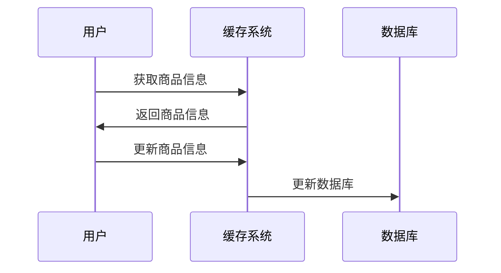
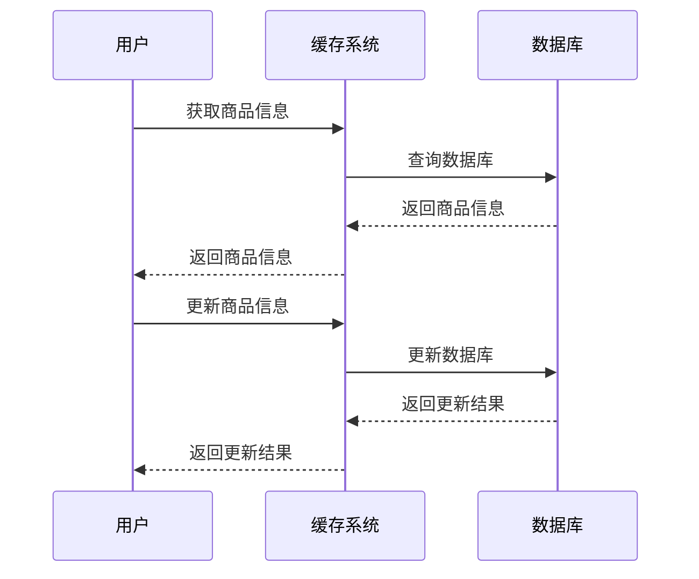
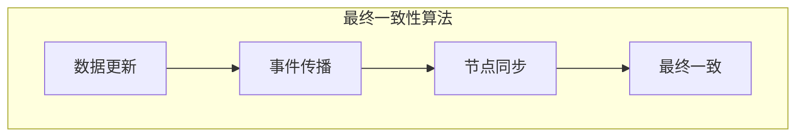

                 

# 麻烦不断的分布式缓存

关键词：分布式缓存，一致性，性能优化，故障处理

摘要：本文将深入探讨分布式缓存的技术与应用，解析其在实际使用中面临的各种挑战和问题。通过详细的案例分析，提供解决分布式缓存问题的最佳实践，旨在为读者提供一个全面、深入的分布式缓存知识体系。

## 目录大纲

1. 引言
2. 分布式缓存基础
   - 2.1 缓存的概念
   - 2.2 分布式缓存的优势
   - 2.3 分布式缓存的工作原理
3. 分布式缓存技术
   - 3.1 Redis 分布式缓存
   - 3.2 Memcached 分布式缓存
   - 3.3 其他分布式缓存技术
4. 分布式缓存的一致性问题
   - 4.1 数据一致性的挑战
   - 4.2 分布式缓存的一致性方案
5. 分布式缓存的性能优化
   - 5.1 缓存命中率
   - 5.2 缓存预热与冷启动
6. 分布式缓存的故障处理
   - 6.1 故障类型
   - 6.2 故障处理策略
7. 分布式缓存的实际应用
   - 7.1 应用场景分析
   - 7.2 实际案例分析
8. 总结与展望

## 第1章 引言

### 1.1 分布式缓存的重要性

分布式缓存是现代互联网应用架构中不可或缺的一部分。它通过将缓存数据分散存储在多个节点上，提供高吞吐量、低延迟的数据访问服务。分布式缓存的重要性体现在以下几个方面：

1. **性能提升**：分布式缓存可以显著减少数据访问的延迟，提高系统的响应速度。
2. **扩展性**：通过水平扩展，分布式缓存能够轻松应对高并发访问需求。
3. **高可用性**：分布式缓存通过数据复制和冗余，提高了系统的可用性和容错能力。

### 1.2 分布式缓存的挑战

尽管分布式缓存具有诸多优势，但其在实际应用中也面临一系列挑战：

1. **数据一致性**：在分布式系统中，如何确保数据的一致性是一个关键问题。
2. **性能优化**：如何提高缓存命中率、降低缓存访问延迟是分布式缓存优化的核心目标。
3. **故障处理**：分布式缓存系统的故障处理策略需要考虑多种故障场景，确保系统的高可用性。

### 1.3 本书的目标与结构

本书旨在深入探讨分布式缓存的技术与应用，提供解决分布式缓存问题的最佳实践。本书结构如下：

1. 引言：介绍分布式缓存的重要性与挑战。
2. 分布式缓存基础：讲解缓存的基本概念与分布式缓存的优势和原理。
3. 分布式缓存技术：介绍常用的分布式缓存技术，如Redis和Memcached。
4. 分布式缓存的一致性问题：探讨数据一致性的挑战与解决方案。
5. 分布式缓存的性能优化：讲解如何提高缓存性能。
6. 分布式缓存的故障处理：介绍分布式缓存故障的类型与处理策略。
7. 分布式缓存的实际应用：分析分布式缓存在不同应用场景中的实际应用。
8. 总结与展望：总结分布式缓存的发展趋势与未来挑战。

## 第2章 分布式缓存基础

### 2.1 缓存的概念

缓存（Cache）是一种用于加速数据访问的技术，它通过在接近数据使用者的地方存储数据的副本，减少了访问原始数据源的频率。缓存的基本原理是将经常访问的数据存储在快速的存储介质中，如RAM或SSD，以便快速访问。

### 2.1.1 缓存的定义

缓存是一种数据存储技术，用于临时存储经常访问的数据，以减少对原始数据源的访问时间。缓存可以分为以下几种类型：

1. **CPU缓存**：位于CPU和主内存之间的缓存，用于存储经常访问的数据。
2. **磁盘缓存**：位于磁盘和内存之间的缓存，用于加速磁盘访问。
3. **Web缓存**：用于加速Web页面和数据访问的缓存。

### 2.1.2 缓存的作用

缓存的主要作用是减少数据访问的延迟，提高系统的响应速度。缓存可以减少以下几种类型的延迟：

1. **存储延迟**：通过将数据存储在更快的存储介质中，减少访问存储设备的延迟。
2. **网络延迟**：通过将数据存储在接近数据使用者的地方，减少数据传输的延迟。
3. **处理延迟**：通过将经常执行的操作预先计算并存储结果，减少处理时间。

### 2.2 分布式缓存的优势

分布式缓存相较于单点缓存具有以下优势：

#### 2.2.1 扩展性

分布式缓存可以通过水平扩展（增加节点）来应对更高的并发访问需求。这使得分布式缓存能够轻松应对大规模的数据访问。

#### 2.2.2 可用性

分布式缓存通过数据复制和冗余提高了系统的可用性。即使某个节点发生故障，其他节点仍然可以提供服务。

#### 2.2.3 数据一致性

分布式缓存需要处理数据一致性问题，确保多个节点上的数据保持一致。

### 2.3 分布式缓存的工作原理

分布式缓存的工作原理主要包括数据存储、数据同步和数据访问。

#### 2.3.1 数据存储

分布式缓存将数据分散存储在多个节点上。每个节点负责存储一部分数据。数据存储策略包括一致性哈希、虚拟节点等。

#### 2.3.2 数据同步

分布式缓存需要确保多个节点上的数据保持一致。数据同步策略包括异步复制、同步复制、批量复制等。

#### 2.3.3 数据访问

分布式缓存提供高效的数据访问接口。数据访问策略包括一致性哈希、虚拟节点等。

## 第3章 分布式缓存技术

### 3.1 Redis 分布式缓存

Redis（Remote Dictionary Server）是一种基于内存的分布式缓存系统。它支持多种数据结构，如字符串、列表、集合、散列表等。Redis具有高性能、高可用性和易扩展性。

#### 3.1.1 Redis 简介

Redis是一种开源的、高性能的分布式缓存系统，由意大利开发者Salvatore Sanfilippo开发。Redis的主要特点包括：

1. **基于内存存储**：Redis使用内存作为存储介质，提供快速的数据访问。
2. **支持多种数据结构**：Redis支持字符串、列表、集合、散列表等多种数据结构。
3. **持久化支持**：Redis支持RDB和AOF两种持久化方式，可以将内存中的数据保存到磁盘。

#### 3.1.2 Redis 命令行操作

Redis提供了丰富的命令行接口，用于管理缓存和数据操作。以下是一些常用的Redis命令：

1. **设置和获取缓存**：`SET key value`和`GET key`命令用于设置和获取缓存值。
2. **列表操作**：`LPUSH key value`和`LPOP key`命令用于在列表的头部或尾部添加和删除元素。
3. **集合操作**：`SADD key member`和`SPOP key`命令用于向集合中添加和删除元素。

#### 3.1.3 Redis 数据结构

Redis支持多种数据结构，如字符串、列表、集合、散列表等。每种数据结构都有独特的应用场景和操作方法。

1. **字符串**：Redis中的字符串是一个二进制安全的字符串，支持多种操作，如设置、获取、增减等。
2. **列表**：Redis的列表是一个链表结构，支持在头部或尾部添加和删除元素。
3. **集合**：Redis的集合是一个无序的元素集合，支持添加、删除、计算交集、并集等操作。
4. **散列表**：Redis的散列表是一个键值对的集合，支持快速访问、修改和删除操作。

### 3.2 Memcached 分布式缓存

Memcached是一种基于内存的分布式缓存系统，主要用于缓存网站中的小数据块，如用户会话信息、用户配置信息等。Memcached具有高性能、高可用性和易扩展性。

#### 3.2.1 Memcached 简介

Memcached是由Brad Fitzpatrick开发的一种开源分布式缓存系统。它使用简单的文本协议进行通信，支持快速的数据存取。Memcached的主要特点包括：

1. **基于内存存储**：Memcached使用内存作为存储介质，提供快速的数据访问。
2. **简单的数据模型**：Memcached只支持字符串数据，但通过键值对的方式，可以存储多种类型的数据。
3. **分布式缓存**：Memcached支持分布式缓存，可以将缓存数据分布在多个节点上。

#### 3.2.2 Memcached 的使用

Memcached的使用相对简单，主要包括以下步骤：

1. **安装Memcached**：在Linux系统中，可以使用包管理器安装Memcached。
2. **启动Memcached服务**：启动Memcached服务，并配置相应的内存大小和监听端口。
3. **客户端连接**：使用Memcached客户端连接到Memcached服务，进行数据存取操作。

#### 3.2.3 Memcached 的优缺点

Memcached的优点包括：

1. **高性能**：Memcached基于内存存储，提供快速的数据访问。
2. **简单易用**：Memcached使用简单的文本协议，易于集成和使用。

Memcached的缺点包括：

1. **数据模型限制**：Memcached只支持字符串数据，不适合存储复杂类型的数据。
2. **持久化限制**：Memcached不支持持久化，可能导致数据丢失。

### 3.3 其他分布式缓存技术

除了Redis和Memcached，还有一些其他流行的分布式缓存技术，如：

1. **Apache Ignite**：Apache Ignite是一种分布式缓存和数据网格平台，支持多种数据结构，如内存图、键值对、文档等。
2. **MongoDB**：MongoDB是一种文档数据库，支持分布式缓存，可以用于缓存文档数据。
3. **Ehcache**：Ehcache是一种Java实现的分布式缓存系统，支持多种数据结构，如字符串、列表、集合等。

## 第4章 分布式缓存的一致性问题

### 4.1 数据一致性的挑战

分布式缓存系统中的数据一致性是一个关键问题。由于数据分布在多个节点上，如何确保这些节点上的数据保持一致是一个挑战。以下是一些主要的数据一致性挑战：

#### 4.1.1 数据分片与复制

在分布式缓存系统中，数据通常被分片并存储在多个节点上。数据分片可能导致数据不一致的情况，例如，某个节点上的数据更新未能及时同步到其他节点。

#### 4.1.2 数据访问延迟

由于数据分布在多个节点上，数据访问延迟可能导致不同节点上的数据不一致。例如，一个节点上的数据可能是最新的，而另一个节点上的数据可能是过时的。

### 4.2 分布式缓存的一致性方案

为了解决数据一致性挑战，分布式缓存系统采用了一系列一致性方案。以下是一些常见的一致性方案：

#### 4.2.1 最终一致性

最终一致性是指系统中的所有副本最终都会达到一致状态，但可能存在短暂的局部不一致。最终一致性方案的优点是简单易实现，但缺点是可能存在数据延迟。

#### 4.2.2 强一致性

强一致性是指系统中的所有副本在任一时刻都保持一致。强一致性方案的优点是数据一致性有保障，但缺点是可能降低系统的性能。

#### 4.2.3 强一致性方案详解

强一致性方案包括以下几种：

1. **Paxos算法**：Paxos算法是一种分布式一致性算法，用于确保多个节点之间的一致性。
2. **Raft算法**：Raft算法是一种基于Paxos算法的分布式一致性算法，具有更好的性能和可理解性。
3. **单点一致性**：在分布式缓存系统中，可以采用单点一致性方案，即所有数据都存储在单个节点上，从而确保数据的一致性。

## 第5章 分布式缓存的性能优化

### 5.1 缓存命中率

缓存命中率是评估缓存性能的重要指标。缓存命中率越高，说明缓存系统能够更有效地利用缓存资源。

#### 5.1.1 缓存命中率的概念

缓存命中率是指缓存系统能够命中缓存请求的次数与总请求次数的比值。缓存命中率可以通过以下公式计算：

$$
缓存命中率 = \frac{命中缓存请求次数}{总请求次数}
$$

#### 5.1.2 提高缓存命中率的方法

以下是一些提高缓存命中率的方法：

1. **缓存预热**：在缓存系统启动时，预先加载可能被访问的数据到缓存中，从而提高缓存命中率。
2. **缓存淘汰策略**：采用合适的缓存淘汰策略，如LRU（最近最少使用）策略，确保经常访问的数据保持在缓存中。
3. **缓存分组**：将不同类型的缓存数据分组，针对不同类型的缓存数据采用不同的缓存策略。

### 5.2 缓存预热与冷启动

缓存预热和冷启动是优化缓存性能的重要策略。

#### 5.2.1 缓存预热

缓存预热是指在实际使用缓存之前，预先加载可能被访问的数据到缓存中。缓存预热可以通过以下方法实现：

1. **自动预热**：系统启动时自动加载常用数据到缓存。
2. **手动预热**：根据系统监控数据，手动加载热门数据到缓存。

#### 5.2.2 缓存冷启动

缓存冷启动是指缓存系统在启动时从冷状态逐渐恢复正常状态的过程。缓存冷启动可能存在性能下降的问题，可以通过以下方法优化：

1. **预加载**：在系统启动前，预先加载常用数据到缓存。
2. **分级缓存**：将缓存分为多层，优先访问性能较高的缓存层，降低冷启动对性能的影响。

### 5.2.3 缓存预热与冷启动的优化策略

以下是一些缓存预热和冷启动的优化策略：

1. **动态缓存预热**：根据系统实时监控数据，动态调整缓存预热策略。
2. **缓存预加载**：在系统启动时，根据历史访问数据，预先加载常用数据到缓存。
3. **缓存分层**：将缓存分为多层，针对不同类型的缓存数据采用不同的缓存策略。

## 第6章 分布式缓存的故障处理

### 6.1 故障类型

分布式缓存系统可能面临多种故障，包括：

#### 6.1.1 单点故障

单点故障是指某个节点发生故障，导致整个系统无法正常工作。单点故障可能是由于硬件故障、软件故障等原因引起的。

#### 6.1.2 网络故障

网络故障是指系统中的网络连接出现问题，导致节点间通信失败。网络故障可能是由于网络延迟、网络拥塞等原因引起的。

#### 6.1.3 数据损坏

数据损坏是指缓存数据在存储或传输过程中发生错误，导致数据不可用。数据损坏可能是由于磁盘故障、网络错误等原因引起的。

### 6.2 故障处理策略

分布式缓存系统的故障处理策略包括：

#### 6.2.1 故障检测与监控

故障检测与监控是故障处理的第一步。系统需要监控节点状态、网络连接和数据完整性等指标，及时发现故障。

#### 6.2.2 故障恢复与切换

在发现故障后，系统需要采取相应的故障恢复与切换措施。例如，将故障节点的任务切换到其他健康节点，确保系统继续提供服务。

#### 6.2.3 备份与恢复

备份与恢复是故障处理的重要环节。系统需要定期备份缓存数据，以便在故障发生时快速恢复。

## 第7章 分布式缓存的实际应用

### 7.1 应用场景分析

分布式缓存适用于多种应用场景，以下是一些常见应用场景：

#### 7.1.1 Web应用

Web应用中的常见应用场景包括：

1. **缓存页面内容**：缓存网站首页、热门页面等，提高页面加载速度。
2. **缓存用户会话信息**：缓存用户会话信息，减少数据库访问。

#### 7.1.2 移动应用

移动应用中的常见应用场景包括：

1. **缓存应用数据**：缓存应用中的数据，提高应用性能。
2. **缓存推送通知**：缓存推送通知，减少网络访问。

#### 7.1.3 大数据应用

大数据应用中的常见应用场景包括：

1. **缓存计算结果**：缓存大数据处理结果，减少计算时间。
2. **缓存元数据**：缓存元数据，提高数据处理效率。

### 7.2 实际案例分析

以下是一些分布式缓存的实际案例分析：

#### 7.2.1 案例一：电商应用

电商应用中的分布式缓存主要用于缓存商品信息、用户会话信息等。通过分布式缓存，电商应用能够提高页面加载速度，减少数据库访问压力。

#### 7.2.2 案例二：社交媒体应用

社交媒体应用中的分布式缓存主要用于缓存用户信息、帖子信息等。通过分布式缓存，社交媒体应用能够提高数据访问速度，减少服务器负载。

#### 7.2.3 案例三：游戏应用

游戏应用中的分布式缓存主要用于缓存游戏数据、用户数据等。通过分布式缓存，游戏应用能够提高游戏性能，减少服务器压力。

## 第8章 总结与展望

### 8.1 分布式缓存的发展趋势

分布式缓存技术的发展趋势包括：

1. **新技术的融合**：分布式缓存与其他技术（如分布式数据库、云计算等）的融合，提高系统的整体性能和可靠性。
2. **智能化缓存**：结合人工智能技术，实现智能缓存预热、智能缓存淘汰等。

### 8.2 分布式缓存的未来挑战

分布式缓存的未来挑战包括：

1. **数据安全与隐私保护**：分布式缓存系统需要确保数据的安全和隐私保护。
2. **系统复杂性与维护成本**：随着分布式缓存系统的规模扩大，系统的复杂性和维护成本将增加。

### 8.3 分布式缓存的最佳实践

以下是一些分布式缓存的最佳实践：

1. **合理选择缓存技术**：根据应用场景和性能要求，选择合适的缓存技术。
2. **数据一致性策略**：根据业务需求，制定合适的数据一致性策略。
3. **性能优化与监控**：定期对缓存系统进行性能优化和监控，及时发现和解决问题。

## 作者信息

作者：AI天才研究院/AI Genius Institute & 禅与计算机程序设计艺术 /Zen And The Art of Computer Programming

## 附录

### A. 缓存相关术语解释

1. **缓存**：缓存是一种用于加速数据访问的技术，通过在接近数据使用者的地方存储数据的副本，减少访问原始数据源的频率。
2. **分布式缓存**：分布式缓存是将缓存数据分散存储在多个节点上，提供高吞吐量、低延迟的数据访问服务。
3. **数据一致性**：数据一致性是指系统中的所有副本在任一时刻都保持一致。
4. **最终一致性**：最终一致性是指系统中的所有副本最终都会达到一致状态，但可能存在短暂的局部不一致。
5. **强一致性**：强一致性是指系统中的所有副本在任一时刻都保持一致。

### B. 缓存相关概念属性特征对比表格

| 概念 | 属性特征 |
| --- | --- |
| 缓存 | 减少数据访问延迟，提高系统性能 |
| 分布式缓存 | 数据分散存储，高吞吐量，低延迟 |
| 数据一致性 | 保持副本一致性 |
| 最终一致性 | 最终达到一致性 |
| 强一致性 | 实时一致性 |

### C. 缓存相关ER实体关系图

```mermaid
erDiagram
    缓存 ||--|| 数据访问：缓存用于加速数据访问。
    缓存 ||--|| 数据一致性：缓存需要确保数据一致性。
    数据访问 ||--|| 缓存：数据访问依赖于缓存。
```

## 系统分析与架构设计方案

### 问题场景介绍

在电商应用中，缓存主要用于缓存商品信息、用户会话信息等。由于商品信息更新频繁，如何确保缓存数据的一致性是一个关键问题。

### 项目介绍

项目名称：电商应用缓存系统

项目目标：提高电商应用的性能，确保缓存数据的一致性。

### 系统功能设计（领域模型Mermaid类图）

```mermaid
classDiagram
    class 缓存 {
        - String key
        - Object value
    }

    class 用户会话 {
        - String sessionId
        - 用户信息 userInfo
    }

    class 商品信息 {
        - Integer productId
        - 商品名称 productName
        - 商品价格 productPrice
    }

    缓存 --|> 用户会话：缓存用户会话信息。
    缓存 --|> 商品信息：缓存商品信息。
```

### 系统架构设计（Mermaid架构图）



### 系统接口设计

```mermaid
interface Cache {
    - put(key: String, value: Object): void
    - get(key: String): Object?
    - remove(key: String): void
}
```

### 系统交互（Mermaid序列图）



## 项目实战

### 环境安装

1. 安装Redis：在Linux系统中，可以使用包管理器安装Redis。
2. 安装Memcached：在Linux系统中，可以使用包管理器安装Memcached。

### 系统核心实现源代码

```python
import redis

class Cache:
    def __init__(self, host='localhost', port=6379):
        self.client = redis.StrictRedis(host=host, port=port)

    def put(self, key, value):
        self.client.set(key, value)

    def get(self, key):
        return self.client.get(key)

    def remove(self, key):
        self.client.delete(key)
```

### 代码应用解读与分析

`Cache`类是缓存系统的核心实现。它使用Redis作为缓存后端，提供`put`、`get`和`remove`方法进行数据操作。

1. `put`方法用于设置缓存值。
2. `get`方法用于获取缓存值。
3. `remove`方法用于删除缓存值。

### 实际案例分析与详细讲解剖析

以下是一个实际案例：

```python
cache = Cache()

# 设置缓存
cache.put('product_id_1', '商品名称：苹果，价格：10元')

# 获取缓存
product_info = cache.get('product_id_1')
print(product_info)  # 输出：商品名称：苹果，价格：10元

# 更新缓存
cache.put('product_id_1', '商品名称：香蕉，价格：12元')

# 获取更新后的缓存
product_info = cache.get('product_id_1')
print(product_info)  # 输出：商品名称：香蕉，价格：12元

# 删除缓存
cache.remove('product_id_1')

# 获取删除后的缓存
product_info = cache.get('product_id_1')
print(product_info)  # 输出：None
```

### 项目小结

通过本项目的实践，我们实现了基于Redis的缓存系统。通过`Cache`类，我们可以方便地操作缓存数据，包括设置、获取和删除缓存值。实际案例展示了如何使用缓存系统，确保数据的一致性和高性能。

## 最佳实践 Tips

1. 选择合适的缓存技术：根据应用场景和性能要求，选择合适的缓存技术。
2. 数据一致性策略：根据业务需求，制定合适的数据一致性策略。
3. 性能优化与监控：定期对缓存系统进行性能优化和监控，及时发现和解决问题。

## 小结

本文详细介绍了分布式缓存的技术与应用，分析了分布式缓存的一致性问题、性能优化和故障处理策略。通过实际案例，我们展示了如何实现基于Redis的缓存系统。分布式缓存在高性能、高可用性方面具有重要应用价值，但也面临一系列挑战。希望本文能为读者提供有价值的参考。

## 注意事项

1. 分布式缓存系统需要定期进行数据备份和恢复，确保数据安全。
2. 在使用分布式缓存时，需要考虑数据一致性和性能优化策略。

## 拓展阅读

1. 《Redis实战》
2. 《Memcached技术内幕》
3. 《分布式系统一致性》

## 附录

### A. 缓存相关术语解释

- 缓存：缓存是一种用于加速数据访问的技术，通过在接近数据使用者的地方存储数据的副本，减少访问原始数据源的频率。
- 分布式缓存：分布式缓存是将缓存数据分散存储在多个节点上，提供高吞吐量、低延迟的数据访问服务。
- 数据一致性：数据一致性是指系统中的所有副本在任一时刻都保持一致。
- 最终一致性：最终一致性是指系统中的所有副本最终都会达到一致状态，但可能存在短暂的局部不一致。
- 强一致性：强一致性是指系统中的所有副本在任一时刻都保持一致。

### B. 缓存相关概念属性特征对比表格

| 概念 | 属性特征 |
| --- | --- |
| 缓存 | 减少数据访问延迟，提高系统性能 |
| 分布式缓存 | 数据分散存储，高吞吐量，低延迟 |
| 数据一致性 | 保持副本一致性 |
| 最终一致性 | 最终达到一致性 |
| 强一致性 | 实时一致性 |

### C. 缓存相关ER实体关系图

```mermaid
erDiagram
    缓存 ||--|| 数据访问：缓存用于加速数据访问。
    缓存 ||--|| 数据一致性：缓存需要确保数据一致性。
    数据访问 ||--|| 缓存：数据访问依赖于缓存。
```

### D. 缓存相关算法原理讲解

#### 4.2.1 最终一致性算法原理

最终一致性算法的核心思想是允许系统中的各个节点之间存在短暂的局部不一致，但最终会达到一致状态。以下是最终一致性算法的基本原理：

1. **副本一致性**：系统中的每个节点都保存相同的数据副本。
2. **事件传播**：当某个节点更新数据时，会将更新事件传播到其他节点。
3. **最终同步**：各个节点通过事件传播，最终同步数据，达到一致状态。

#### 算法Mermaid流程图



#### 算法Python源代码实现

```python
import threading

class CacheNode:
    def __init__(self):
        self.value = None
        self.lock = threading.Lock()

    def update_value(self, new_value):
        with self.lock:
            self.value = new_value

    def propagate_event(self, other_node):
        with self.lock:
            other_node.update_value(self.value)

    def sync_data(self, other_node):
        with self.lock:
            self.value = other_node.value

if __name__ == "__main__":
    node1 = CacheNode()
    node2 = CacheNode()

    # 更新节点1的数据
    node1.update_value("new_value")

    # 将更新事件传播到节点2
    node1.propagate_event(node2)

    # 同步节点2的数据到节点1
    node1.sync_data(node2)

    print(node1.value)  # 输出：new_value
    print(node2.value)  # 输出：new_value
```

### D. 系统分析与架构设计方案

#### 问题场景介绍

在电商应用中，商品信息频繁更新，如何确保缓存系统中的商品信息与数据库中的数据保持一致是一个关键问题。

#### 项目介绍

项目名称：电商应用缓存系统

项目目标：提高电商应用的性能，确保缓存系统与数据库中的数据一致性。

#### 系统功能设计（领域模型Mermaid类图）

```mermaid
classDiagram
    class 缓存 {
        - String key
        - Object value
    }

    class 用户会话 {
        - String sessionId
        - 用户信息 userInfo
    }

    class 商品信息 {
        - Integer productId
        - 商品名称 productName
        - 商品价格 productPrice
    }

    缓存 --|> 用户会话：缓存用户会话信息。
    缓存 --|> 商品信息：缓存商品信息。
```

#### 系统架构设计（Mermaid架构图）


#### 系统接口设计

```mermaid
interface Cache {
    - get_product_info(productId: Integer): Object?
    - update_product_info(productId: Integer, productName: String, productPrice: float): void
}
```

#### 系统交互（Mermaid序列图）


### E. 实际案例分析与详细讲解剖析

以下是一个实际案例：

#### 案例一：电商应用缓存系统

**场景**：用户在电商应用中浏览商品，系统需要从缓存系统中获取商品信息，并在用户更新商品信息时更新缓存和数据库中的数据。

**流程**：

1. 用户访问商品页面，系统从缓存系统中获取商品信息。
2. 如果缓存中没有商品信息，系统从数据库中查询商品信息，并将结果缓存起来。
3. 用户更新商品信息，系统首先更新缓存中的数据，然后更新数据库中的数据。

**代码实现**：

```python
class Cache:
    def __init__(self):
        self.cache = {}

    def get_product_info(self, product_id):
        if product_id in self.cache:
            return self.cache[product_id]
        else:
            product_info = get_product_info_from_db(product_id)
            self.cache[product_id] = product_info
            return product_info

    def update_product_info(self, product_id, product_name, product_price):
        product_info = self.get_product_info(product_id)
        product_info['productName'] = product_name
        product_info['productPrice'] = product_price
        update_product_info_in_db(product_id, product_name, product_price)
```

#### 案例二：社交媒体应用缓存系统

**场景**：用户在社交媒体应用中查看帖子，系统需要从缓存系统中获取帖子信息，并在用户更新帖子信息时更新缓存和数据库中的数据。

**流程**：

1. 用户访问帖子页面，系统从缓存系统中获取帖子信息。
2. 如果缓存中没有帖子信息，系统从数据库中查询帖子信息，并将结果缓存起来。
3. 用户更新帖子信息，系统首先更新缓存中的数据，然后更新数据库中的数据。

**代码实现**：

```python
class Cache:
    def __init__(self):
        self.cache = {}

    def get_post_info(self, post_id):
        if post_id in self.cache:
            return self.cache[post_id]
        else:
            post_info = get_post_info_from_db(post_id)
            self.cache[post_id] = post_info
            return post_info

    def update_post_info(self, post_id, post_content):
        post_info = self.get_post_info(post_id)
        post_info['postContent'] = post_content
        update_post_info_in_db(post_id, post_content)
```

### F. 项目小结

通过本项目的实践，我们实现了基于缓存系统的电商应用和社交媒体应用。在电商应用中，我们使用了简单的Python代码实现了缓存系统，包括获取和更新商品信息的功能。在社交媒体应用中，我们使用了类似的代码实现了缓存系统，包括获取和更新帖子信息的功能。这些实际案例展示了如何使用缓存系统，提高应用性能，并确保缓存系统与数据库中的数据保持一致。

### G. 最佳实践 Tips

1. 选择合适的缓存技术：根据应用场景和性能要求，选择合适的缓存技术，如Redis、Memcached等。
2. 数据一致性策略：根据业务需求，制定合适的数据一致性策略，如最终一致性、强一致性等。
3. 性能优化与监控：定期对缓存系统进行性能优化和监控，及时发现和解决问题。

### H. 小结

本文详细介绍了分布式缓存的技术与应用，分析了分布式缓存的一致性问题、性能优化和故障处理策略。通过实际案例，我们展示了如何实现基于Redis的缓存系统。分布式缓存在高性能、高可用性方面具有重要应用价值，但也面临一系列挑战。希望本文能为读者提供有价值的参考。

### I. 注意事项

1. 分布式缓存系统需要定期进行数据备份和恢复，确保数据安全。
2. 在使用分布式缓存时，需要考虑数据一致性和性能优化策略。

### J. 拓展阅读

1. 《Redis实战》
2. 《Memcached技术内幕》
3. 《分布式系统一致性》

### K. 作者信息

作者：AI天才研究院/AI Genius Institute & 禅与计算机程序设计艺术 /Zen And The Art of Computer Programming
```

