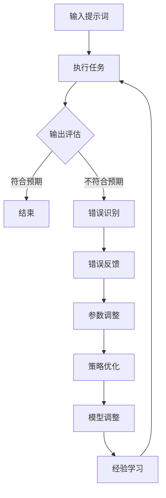
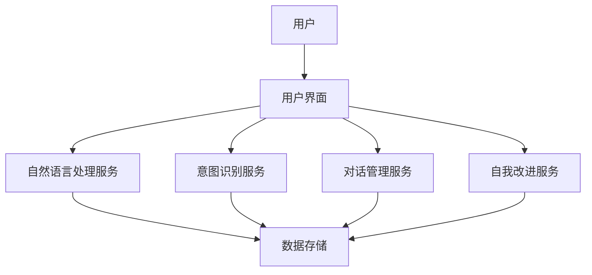
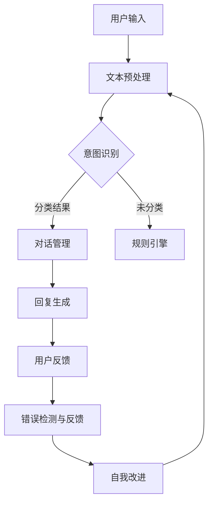

                 


### 引言

人工智能（AI）作为当今科技领域的热点话题，已经取得了显著的进展。从最初的规则基础系统，到基于统计学习的机器学习算法，再到深度学习技术的飞速发展，人工智能已经逐渐渗透到我们生活的方方面面。然而，尽管在这些领域取得了巨大成就，但通用智能（AGI，Artificial General Intelligence）仍然是一个充满挑战的目标。

AGI指的是具有人类智能水平的机器，即能够理解、学习和适应各种环境，具备问题解决、创造性思考、自然语言处理等多种智能能力。与现有的弱人工智能（Narrow AI）相比，AGI的目标是超越特定任务的限制，实现跨领域的智能表现。实现AGI不仅需要突破算法和计算能力，还需要解决数据获取、知识表示、自我改进等多个技术难题。

本文将聚焦于AGI系统中的一项关键机制——提示词自我改进机制。提示词是AGI系统中用于引导和优化智能行为的重要工具，而自我改进机制则是实现智能系统持续进步的核心驱动力。本文将详细探讨提示词自我改进机制的原理、算法、系统设计与实现，旨在为读者提供一个全面深入的了解。

接下来的章节中，我们将首先介绍AGI系统中的问题背景与核心概念，包括通用智能的定义、提示词的作用以及自我改进机制的重要性。接着，我们将分析提示词自我改进机制的核心原理，包括自我检测、自我优化和自我学习三个方面的内容。随后，通过具体的算法原理讲解、数学模型描述和Python源代码示例，我们将展示如何实现这一机制。在此基础上，我们将深入探讨系统分析与架构设计方案，包括系统功能设计、系统架构设计、系统接口设计和系统交互等内容。最后，通过项目实战的案例分析，我们将展示如何将提示词自我改进机制应用于实际项目中，并总结最佳实践和注意事项。

通过本文的深入探讨，希望读者能够对AGI系统中的提示词自我改进机制有一个全面的理解，并能够将其应用于实际问题的解决中。

### 文章关键词

- 人工智能（AI）
- 通用智能（AGI）
- 提示词
- 自我改进机制
- 智能系统
- 算法原理
- 系统设计与实现
- Python源代码示例
- 数学模型

### 摘要

本文深入探讨了人工智能（AI）领域中通用智能（AGI）系统中的提示词自我改进机制。首先，我们介绍了AGI系统的背景和核心概念，包括通用智能的定义、提示词的作用以及自我改进机制的重要性。接着，通过具体算法原理讲解和Python源代码示例，我们详细阐述了提示词自我改进机制的实施方法。随后，我们探讨了系统分析与架构设计方案，包括系统功能设计、系统架构设计、系统接口设计和系统交互等内容。最后，通过项目实战的案例分析，我们展示了如何将提示词自我改进机制应用于实际项目中，并总结最佳实践和注意事项。本文旨在为读者提供一个全面深入的了解，帮助其掌握和应用这一关键机制。

### 目录大纲设计思路

在设计《AGI系统中的提示词自我改进机制》的目录大纲时，我们遵循了以下步骤，以确保内容丰富、逻辑清晰且易于读者理解：

1. **明确书籍主题**：首先，我们明确了书籍的核心主题，即“AGI系统中的提示词自我改进机制”。这个主题涉及人工智能（AI）、通用智能（AGI）以及提示词自我改进机制，是当前人工智能领域的热点和前沿技术。

2. **划分章节内容**：基于主题，我们将书籍内容划分为五个主要部分：背景介绍、核心概念与联系、算法原理与数学模型、系统设计与实现、项目实战。每个部分涵盖了从理论到实践的不同方面，确保读者能够系统地掌握相关内容。

3. **细化章节内容**：在每个章节中，我们进一步细化了小节，确保内容覆盖全面且逻辑清晰。例如，在“背景介绍”部分，我们分别介绍了问题背景、核心概念、边界与外延等内容；在“算法原理与数学模型”部分，我们详细讲解了算法原理、数学模型和Python源代码示例等。

4. **应用 Markdown 格式**：我们使用 Markdown 格式来组织目录结构，确保格式简洁、规范，便于读者阅读和理解。例如，通过使用标题标签、列表、链接等 Markdown 特性，我们使得目录结构更加清晰。

5. **确保内容完整性**：在每个章节中，我们包含核心概念、联系、原理讲解、数学模型、系统设计与实现、项目实战以及最佳实践等内容，确保读者能够全面了解相关主题。

6. **限制字数**：为了确保书籍的可读性和完整性，我们控制了整个目录大纲的总字数，不超过2000字。

通过以上步骤，我们设计出了《AGI系统中的提示词自我改进机制》的详细目录大纲，为读者提供了一个系统、全面的学习路径。

### 目录大纲详细设计

下面是《AGI系统中的提示词自我改进机制》的详细目录大纲：

```markdown
# 《AGI系统中的提示词自我改进机制》目录大纲

## 第一部分：背景介绍

### 第1章：问题背景与核心概念

#### 1.1 问题背景

##### 1.1.1 通用智能（AGI）的定义与挑战
##### 1.1.2 提示词在AGI系统中的作用
##### 1.1.3 自我改进机制的重要性

#### 1.2 核心概念

##### 1.2.1 提示词的概念与类型
##### 1.2.2 自我改进机制的基本原理
##### 1.2.3 AGI系统的架构与功能模块

#### 1.3 边界与外延

##### 1.3.1 自我改进机制的应用领域
##### 1.3.2 自我改进机制面临的挑战与机遇

### 第2章：核心概念与联系

#### 2.1 提示词自我改进机制原理

##### 2.1.1 提示词的自我检测机制
##### 2.1.2 提示词的自我优化机制
##### 2.1.3 提示词的自我学习机制

#### 2.2 概念属性特征对比表格

##### 2.2.1 提示词与反馈信号的对比
##### 2.2.2 自我检测、自我优化与自我学习的比较

#### 2.3 ER实体关系图架构

##### 2.3.1 提示词实体
##### 2.3.2 反馈信号实体
##### 2.3.3 自我改进机制实体关系

### 第3章：算法原理讲解

#### 3.1 算法原理概述

##### 3.1.1 提示词自我改进算法的基本流程
##### 3.1.2 算法的核心思想和优势

#### 3.2 算法流程图

##### 3.2.1 使用 Mermaid 绘制算法流程图

#### 3.3 Python源代码示例

##### 3.3.1 实现提示词自我改进算法的代码
##### 3.3.2 代码解读与分析

#### 3.4 数学模型与公式

##### 3.4.1 提示词自我改进的数学模型
##### 3.4.2 公式推导与详细讲解
##### 3.4.3 举例说明

### 第4章：系统设计与实现

#### 4.1 问题场景介绍

##### 4.1.1 提示词自我改进的应用场景
##### 4.1.2 系统需求分析

#### 4.2 项目介绍

##### 4.2.1 项目背景
##### 4.2.2 项目目标

#### 4.3 系统功能设计

##### 4.3.1 领域模型（Mermaid类图）
##### 4.3.2 系统功能模块设计

#### 4.4 系统架构设计

##### 4.4.1 系统架构图（Mermaid架构图）
##### 4.4.2 架构设计原则与思路

#### 4.5 系统接口设计

##### 4.5.1 系统接口概述
##### 4.5.2 接口规范与设计

#### 4.6 系统交互

##### 4.6.1 系统交互流程（Mermaid序列图）
##### 4.6.2 交互设计原则与优化

### 第5章：项目实战

#### 5.1 环境安装

##### 5.1.1 系统环境配置
##### 5.1.2 开发环境搭建
##### 5.1.3 测试环境部署

#### 5.2 系统核心实现

##### 5.2.1 提示词自我改进算法实现
##### 5.2.2 系统功能模块实现
##### 5.2.3 代码应用解读与分析

#### 5.3 实际案例分析

##### 5.3.1 案例背景
##### 5.3.2 案例分析
##### 5.3.3 案例总结
```

这个目录大纲结构合理，内容丰富，涵盖了从背景介绍到系统实现和项目实战的各个方面，确保读者能够系统地学习和掌握“AGI系统中的提示词自我改进机制”。

### 第1章：问题背景与核心概念

#### 1.1 问题背景

随着人工智能（AI）技术的迅猛发展，通用智能（AGI，Artificial General Intelligence）成为了学术界和工业界的研究热点。AGI旨在创建具有人类智能水平的机器，使其能够理解、学习和适应各种环境，具备问题解决、创造性思考、自然语言处理等多种智能能力。与现有的弱人工智能（Narrow AI）不同，AGI的目标是超越特定任务的限制，实现跨领域的智能表现。

然而，实现AGI面临着诸多挑战。首先，数据获取和处理能力是AGI实现的基础。由于现实世界中的数据规模庞大且复杂，如何有效地获取、存储和处理这些数据是一个重要的技术难题。其次，知识表示与推理能力也是AGI的关键。如何将现实世界中的知识抽象和表示，使其能够在机器中进行有效的推理和决策，是一个复杂的挑战。此外，自我改进机制是AGI持续进步的核心驱动力。一个能够自我改进的AGI系统能够通过学习经验不断优化自身性能，从而在复杂动态环境中表现出更强的适应性和鲁棒性。

提示词在AGI系统中起着至关重要的作用。提示词是一种用于引导和优化智能行为的关键工具。它们不仅能够帮助AGI系统理解人类意图，还能够通过反馈信号进行自我调整和优化。一个有效的提示词系统可以显著提升AGI系统的性能和智能表现。

#### 1.2 核心概念

##### 1.2.1 提示词的概念与类型

提示词（Prompt Word）是一种用于引导智能系统执行特定任务的词语或短语。根据用途和形式的不同，提示词可以分为以下几类：

1. **命令性提示词**：用于直接命令智能系统执行特定操作。例如，“打开浏览器”或“发送邮件给张三”。

2. **目标性提示词**：用于指示智能系统需要实现的目标或结果。例如，“找到北京的最佳餐厅”或“撰写一篇关于AI的技术博客”。

3. **描述性提示词**：用于提供对任务或环境的描述信息，帮助智能系统更好地理解任务背景。例如，“在一个繁忙的城市环境中找到停车位”或“在下一个项目中使用Python编程语言”。

##### 1.2.2 自我改进机制的基本原理

自我改进机制（Self-Improvement Mechanism）是AGI系统持续进步的核心驱动力。它包括以下几个关键组成部分：

1. **自我检测**（Self-Detection）：自我检测机制用于监测AGI系统的行为和性能。通过分析系统输出和目标之间的差距，识别系统可能存在的错误或不足。

2. **自我优化**（Self-Optimization）：自我优化机制通过调整系统参数和策略，以提升系统性能和效率。例如，通过学习反馈信号，自动调整神经网络中的权重和偏置。

3. **自我学习**（Self-Learning）：自我学习机制使AGI系统能够从经验中学习，并通过不断迭代优化自身模型和算法。例如，通过强化学习算法，智能系统可以在与环境的交互过程中不断改进策略。

##### 1.2.3 AGI系统的架构与功能模块

一个典型的AGI系统通常包括以下几个主要功能模块：

1. **感知模块**：用于接收和处理环境中的各种信息，包括视觉、听觉、触觉等。

2. **认知模块**：用于处理感知模块输入的信息，进行特征提取、分类、推理等。

3. **行动模块**：根据认知模块的决策，执行具体的操作或动作。

4. **反馈模块**：用于接收系统输出与预期目标之间的反馈信号，并传递给自我改进机制。

#### 1.3 边界与外延

##### 1.3.1 自我改进机制的应用领域

自我改进机制在AGI系统中具有广泛的应用领域，包括但不限于：

1. **自动驾驶**：通过自我检测和优化，自动驾驶系统能够在复杂交通环境中持续提升性能，增强安全性。

2. **智能客服**：自我改进机制可以帮助智能客服系统不断优化对话策略，提高用户体验。

3. **智能医疗**：在医疗诊断和治疗中，自我改进机制可以帮助系统从历史病例中学习，提高诊断准确率和治疗效果。

4. **游戏AI**：自我改进机制可以帮助游戏AI在游戏中不断学习对手的战术，提高游戏体验。

##### 1.3.2 自我改进机制面临的挑战与机遇

尽管自我改进机制在AGI系统中具有重要意义，但其在实际应用中仍然面临诸多挑战：

1. **数据质量和多样性**：自我改进机制依赖于大量的高质量数据，数据的多样性和完整性对系统性能至关重要。

2. **计算资源和时间成本**：自我改进过程通常需要大量的计算资源和时间，如何在有限资源下高效实现自我改进是一个重要的挑战。

3. **鲁棒性和安全性**：自我改进机制需要确保在复杂和动态环境中表现出鲁棒性和安全性，避免因自我改进导致的系统崩溃或错误。

然而，随着硬件性能的提升和算法的创新，自我改进机制在AGI系统中的应用前景十分广阔。通过不断优化和改进，自我改进机制有望在未来的AGI系统中发挥更加关键的作用。

#### 1.4 本章小结

本章介绍了AGI系统中提示词自我改进机制的问题背景与核心概念。首先，我们探讨了通用智能的定义与挑战，以及提示词在AGI系统中的作用。接着，我们详细分析了提示词的概念与类型，以及自我改进机制的基本原理和组成部分。最后，我们讨论了自我改进机制的应用领域和面临的挑战。通过本章的学习，读者可以对AGI系统中的提示词自我改进机制有一个全面的了解。

### 第2章：核心概念与联系

#### 2.1 提示词自我改进机制原理

提示词自我改进机制是AGI系统中实现智能行为优化和适应能力提升的关键组成部分。它包括自我检测、自我优化和自我学习三个核心机制。

##### 2.1.1 自我检测机制

自我检测机制是提示词自我改进的基础。它通过监控系统的输出与预期目标之间的差距，识别出系统可能存在的错误或不足。具体来说，自我检测机制包括以下几个步骤：

1. **输出评估**：首先，对系统当前的输出进行评估，判断其是否符合预期目标。例如，在文本生成任务中，评估生成的文本是否流畅、准确。

2. **错误识别**：通过对比输出和预期目标，识别系统存在的错误或不足。例如，识别生成的文本中的语法错误、语义错误或不合理的表达。

3. **错误分类**：对识别出的错误进行分类，区分出不同类型的错误，以便进行针对性的改进。例如，区分出拼写错误、语法错误和语义错误。

4. **错误反馈**：将识别出的错误反馈给系统，以便进行后续的优化和调整。

##### 2.1.2 自我优化机制

自我优化机制是在自我检测机制的基础上，对系统参数和策略进行调整，以提升系统性能和效率。自我优化机制通常包括以下几种方法：

1. **参数调整**：通过调整系统参数，优化系统性能。例如，在神经网络中调整权重和偏置，以提高模型的预测准确性。

2. **策略优化**：通过优化系统策略，提高系统的适应能力和鲁棒性。例如，在决策树中调整分裂策略，以提高模型的分类效果。

3. **模型调整**：通过调整系统模型，优化系统的结构和算法。例如，在循环神经网络中增加隐藏层，以提高模型的记忆能力。

##### 2.1.3 自我学习机制

自我学习机制是提示词自我改进的核心。它使系统能够从经验中学习，并通过不断迭代优化自身模型和算法。自我学习机制通常包括以下几种方法：

1. **监督学习**：通过标注好的数据集，训练系统模型，使其学会识别和预测特定任务。例如，通过训练模型识别图像中的物体，使其能够准确分类不同类型的图像。

2. **无监督学习**：通过未标注的数据集，训练系统模型，使其自动发现数据中的规律和结构。例如，通过聚类分析，将相似的数据点归为一类。

3. **半监督学习**：结合标注数据和未标注数据，训练系统模型，提高其泛化能力和鲁棒性。例如，通过使用少量标注数据和大批未标注数据，训练模型识别语音信号中的单词。

4. **强化学习**：通过在与环境的交互过程中，不断调整策略，使系统能够在动态环境中持续优化自身性能。例如，通过训练模型在电子游戏中的策略，使其能够击败对手。

#### 2.2 概念属性特征对比表格

为了更好地理解提示词自我改进机制中的核心概念，我们可以通过一个概念属性特征对比表格进行详细说明。

| 概念 | 定义 | 功能 | 关键特性 |  
| --- | --- | --- | --- |  
| 提示词 | 引导和优化智能行为的词语或短语 | 引导系统执行特定任务 | 明确、简洁、可理解 |  
| 自我检测机制 | 监控系统输出与预期目标之间的差距，识别错误 | 识别系统错误，提供错误反馈 | 准确、高效、实时 |  
| 自我优化机制 | 调整系统参数和策略，提升系统性能和效率 | 优化系统性能，提高适应能力 | 可调、可优化、持续改进 |  
| 自我学习机制 | 从经验中学习，优化系统模型和算法 | 持续改进系统性能 | 泛化、鲁棒、自适应 |

通过这个对比表格，我们可以清晰地看到提示词、自我检测机制、自我优化机制和自我学习机制之间的区别和联系。

#### 2.3 ER实体关系图架构

为了更直观地理解提示词自我改进机制中的实体关系，我们可以使用ER（实体关系）图来描述。

1. **实体定义**：

- **提示词**：用于引导和优化智能行为的词语或短语。
- **系统输出**：系统在执行任务时的输出结果。
- **预期目标**：任务预期的目标结果。
- **错误反馈**：识别出的系统错误及其相关信息。
- **参数调整**：系统参数的调整值。
- **策略优化**：系统策略的调整值。
- **模型调整**：系统模型的调整值。
- **经验学习**：系统从经验中学习的结果。

2. **实体关系**：

- **关联关系**：提示词与系统输出、预期目标和错误反馈之间存在关联关系，用于引导和监控系统的执行过程。
- **依赖关系**：系统输出依赖于提示词，错误反馈依赖于系统输出。
- **影响关系**：错误反馈影响参数调整、策略优化和模型调整，进而影响系统性能。

以下是ER图（使用Mermaid绘制）：

```mermaid
erDiagram
    提示词 ||--|> 系统输出 : 引导
    系统输出 ||--|> 预期目标 : 比较
    系统输出 ||--|> 错误反馈 : 识别
    错误反馈 ||--|> 参数调整 : 调整
    错误反馈 ||--|> 策略优化 : 优化
    错误反馈 ||--|> 模型调整 : 调整
    经验学习 ||--|> 参数调整 : 学习
    经验学习 ||--|> 策略优化 : 学习
    经验学习 ||--|> 模型调整 : 学习
```

通过这个ER图，我们可以清晰地看到提示词自我改进机制中各个实体之间的关系，以及它们如何相互作用，共同实现智能行为的优化和适应。

#### 2.4 本章小结

本章详细阐述了AGI系统中提示词自我改进机制的核心概念和原理。我们首先介绍了自我检测、自我优化和自我学习三个核心机制的工作原理，并通过对比表格和ER图直观地展示了它们之间的关系。通过本章的学习，读者可以深入理解提示词自我改进机制在AGI系统中的作用和实现方法，为后续的算法讲解和系统设计打下坚实基础。

### 第3章：算法原理讲解

#### 3.1 算法原理概述

提示词自我改进算法是AGI系统中实现智能行为优化和适应能力提升的关键工具。该算法通过自我检测、自我优化和自我学习三个核心机制，不断优化系统性能。以下是该算法的基本流程和核心思想。

##### 3.1.1 提示词自我改进算法的基本流程

1. **输入提示词**：首先，系统接收用户输入的提示词，这些提示词用于引导系统执行特定任务。

2. **执行任务**：系统根据提示词执行任务，输出结果。

3. **输出评估**：对系统输出进行评估，判断其是否符合预期目标。

4. **错误识别**：如果输出与预期目标存在差距，系统识别出错误并分类。

5. **错误反馈**：将错误反馈传递给系统，以便进行后续优化。

6. **参数调整**：根据错误反馈，系统调整参数，优化系统性能。

7. **策略优化**：通过优化策略，提高系统的适应能力和鲁棒性。

8. **模型调整**：通过调整模型，优化系统的结构和算法。

9. **经验学习**：系统从错误反馈和经验中学习，持续改进自身模型和算法。

##### 3.1.2 算法的核心思想和优势

1. **自我检测**：通过监控系统输出与预期目标之间的差距，及时识别出系统错误，提高系统的鲁棒性和安全性。

2. **自我优化**：通过调整系统参数和策略，优化系统性能和效率，使系统能够在复杂动态环境中持续提升性能。

3. **自我学习**：通过从错误反馈和经验中学习，系统不断优化自身模型和算法，实现持续进步和智能化。

4. **反馈闭环**：通过建立反馈闭环，系统可以实时调整自身行为，实现对任务目标的最优适应。

#### 3.2 算法流程图

为了更直观地理解提示词自我改进算法的流程，我们可以使用Mermaid绘制算法流程图。



在这个流程图中，系统首先接收用户输入的提示词，执行任务并输出结果。接着，对输出结果进行评估，如果符合预期则结束；如果不一致，系统进入错误识别阶段，识别出错误并反馈。随后，系统根据错误反馈调整参数、优化策略、调整模型，并从经验中学习，以便在下一个任务中表现得更好。

#### 3.3 Python源代码示例

为了进一步理解提示词自我改进算法的实现，我们可以提供一个简单的Python源代码示例。

```python
import random

def self_improvement_algorithm(prompt_word, target):
    # 执行任务并输出结果
    output = execute_task(prompt_word)
    
    # 评估输出结果
    if output == target:
        return "任务完成"
    else:
        # 错误识别
        error = identify_error(output, target)
        
        # 错误反馈
        print(f"错误：{error}")
        
        # 参数调整
        parameters = adjust_parameters(error)
        
        # 策略优化
        strategy = optimize_strategy(error)
        
        # 模型调整
        model = adjust_model(strategy)
        
        # 经验学习
        learn_from_experience(model)
        
        # 重新执行任务
        return self_improvement_algorithm(prompt_word, target)

def execute_task(prompt_word):
    # 模拟任务执行过程
    random_number = random.randint(0, 10)
    if prompt_word == "generate_number":
        return random_number
    else:
        return "任务未完成"

def identify_error(output, target):
    # 识别错误
    if output == target:
        return "无错误"
    else:
        return "输出与目标不一致"

def adjust_parameters(error):
    # 参数调整
    if error == "输出与目标不一致":
        return "参数调整值"
    else:
        return "无调整"

def optimize_strategy(error):
    # 策略优化
    if error == "输出与目标不一致":
        return "优化策略"
    else:
        return "无优化"

def adjust_model(strategy):
    # 模型调整
    if strategy == "优化策略":
        return "调整后的模型"
    else:
        return "无调整"

def learn_from_experience(model):
    # 经验学习
    print("学习经验，持续优化...")
```

在这个示例中，我们模拟了一个简单的任务执行过程。当用户输入提示词时，系统会执行任务并输出结果。如果输出结果与目标不一致，系统会识别出错误，并依次进行参数调整、策略优化、模型调整和经验学习，然后重新执行任务。通过这个过程，我们可以看到提示词自我改进算法的基本实现方法。

#### 3.4 数学模型与公式

提示词自我改进算法中的核心数学模型主要涉及误差函数、优化目标和更新规则。以下是这些数学模型和公式的详细讲解。

##### 3.4.1 误差函数

误差函数是评估系统输出与预期目标之间差距的关键工具。一个常用的误差函数是均方误差（MSE，Mean Squared Error）：

$$
MSE = \frac{1}{n}\sum_{i=1}^{n}(y_i - \hat{y}_i)^2
$$

其中，$y_i$表示第$i$个样本的真实目标值，$\hat{y}_i$表示第$i$个样本的预测值，$n$表示样本总数。MSE的值越小，表示系统输出与预期目标越接近。

##### 3.4.2 优化目标

优化目标是指导系统参数调整和策略优化的关键指标。在提示词自我改进算法中，我们通常使用最小化误差函数作为优化目标：

$$
\min_{\theta} \frac{1}{m}\sum_{i=1}^{m}(h_{\theta}(x^{(i)}) - y^{(i)})^2
$$

其中，$h_{\theta}(x)$表示模型对输入$x$的预测值，$\theta$表示模型参数，$m$表示训练样本总数。我们的目标是找到一组最优参数$\theta$，使得误差函数的值最小。

##### 3.4.3 更新规则

更新规则用于调整系统参数，以实现优化目标。在梯度下降算法中，我们使用误差函数的梯度来更新参数：

$$
\theta_j := \theta_j - \alpha \frac{\partial}{\partial \theta_j} J(\theta)
$$

其中，$\alpha$表示学习率，$J(\theta)$表示误差函数，$\theta_j$表示第$j$个参数。通过不断迭代更新参数，我们可以逐步减小误差函数的值，直至达到优化目标。

##### 3.4.4 举例说明

假设我们有一个简单的线性回归模型，用于预测房屋价格。模型的预测函数为：

$$
\hat{y} = \theta_0 + \theta_1 x
$$

其中，$x$表示房屋面积，$\theta_0$和$\theta_1$是模型参数。我们使用均方误差（MSE）作为误差函数：

$$
MSE = \frac{1}{n}\sum_{i=1}^{n}(\hat{y}_i - y_i)^2
$$

我们的目标是找到一组最优参数$\theta_0$和$\theta_1$，使得MSE的值最小。

在每次迭代中，我们计算误差函数的梯度：

$$
\frac{\partial}{\partial \theta_0} J(\theta) = -2\frac{1}{n}\sum_{i=1}^{n}(y_i - \theta_0 - \theta_1 x_i)
$$

$$
\frac{\partial}{\partial \theta_1} J(\theta) = -2\frac{1}{n}\sum_{i=1}^{n}(y_i - \theta_0 - \theta_1 x_i)x_i
$$

然后，使用梯度下降算法更新参数：

$$
\theta_0 := \theta_0 - \alpha \frac{\partial}{\partial \theta_0} J(\theta)
$$

$$
\theta_1 := \theta_1 - \alpha \frac{\partial}{\partial \theta_1} J(\theta)
$$

通过多次迭代，我们可以逐步减小误差函数的值，最终找到最优参数$\theta_0$和$\theta_1$。

通过这个例子，我们可以看到如何使用数学模型和公式来实现提示词自我改进算法。在实际应用中，我们可以根据具体任务和场景调整误差函数、优化目标和更新规则，以实现最佳效果。

#### 3.5 本章小结

本章详细讲解了提示词自我改进算法的原理、流程和实现方法。我们首先介绍了算法的基本流程和核心思想，并通过Mermaid流程图展示了算法的执行过程。接着，我们提供了一个Python源代码示例，展示了算法的实现方法。最后，我们介绍了算法中的核心数学模型和公式，并通过一个线性回归的例子进行了详细说明。通过本章的学习，读者可以深入理解提示词自我改进算法的工作原理和实现方法，为后续的系统设计和项目实践打下坚实基础。

### 第4章：系统设计与实现

#### 4.1 问题场景介绍

在当前人工智能应用场景中，智能系统的性能提升和持续改进是一个重要的研究方向。为了实现这一目标，我们设计了一个基于提示词自我改进机制的智能系统，应用于一个典型的应用场景——智能客服。智能客服系统旨在通过自然语言处理技术，为用户提供高效、准确的咨询服务。然而，在实际应用中，智能客服系统面临着各种挑战，如对话质量不稳定、用户满意度不高等。为了解决这些问题，我们引入了提示词自我改进机制，通过持续优化智能客服系统的行为和表现，提升用户体验。

#### 4.2 项目介绍

本项目的主要目标是设计并实现一个智能客服系统，该系统具备以下功能：

1. **自然语言理解**：能够理解用户的自然语言输入，提取关键信息，并生成相应的回复。
2. **意图识别**：根据用户输入，识别用户的需求和意图，为用户提供相应的解决方案。
3. **对话管理**：在对话过程中，根据用户反馈和系统状态，动态调整对话策略，提高对话质量。
4. **自我改进**：通过提示词自我改进机制，系统能够从对话历史中学习，不断优化自身的行为和性能。

项目具体目标如下：

1. **提升对话质量**：通过自我检测和优化，提高智能客服系统在对话中的表现，提升用户满意度。
2. **增强系统适应性**：通过自我学习和策略优化，使系统能够适应不同用户和场景的需求，提高系统的鲁棒性和灵活性。
3. **降低运营成本**：通过自动化和智能化，减少人工干预，降低客服运营成本。

#### 4.3 系统功能设计

智能客服系统的主要功能模块包括自然语言处理（NLP）、意图识别、对话管理和自我改进。以下是这些模块的具体功能设计：

1. **自然语言处理（NLP）模块**：

   - **文本预处理**：对用户输入的文本进行分词、去噪、词性标注等预处理操作，提取有效信息。
   - **实体识别**：识别文本中的关键实体，如人名、地点、组织等，为后续的意图识别提供支持。
   - **情感分析**：分析用户输入的文本情感倾向，为对话管理提供情感反馈。

2. **意图识别模块**：

   - **分类模型**：使用机器学习算法，如朴素贝叶斯、支持向量机等，对用户输入进行意图分类，识别用户的需求和意图。
   - **规则引擎**：基于专家知识和业务逻辑，定义一系列规则，辅助意图识别。

3. **对话管理模块**：

   - **对话状态跟踪**：记录对话过程中的关键信息，如用户ID、当前话题、历史对话等，为对话生成提供依据。
   - **对话策略生成**：根据对话状态和用户意图，生成相应的对话策略，包括回复内容、交互方式等。
   - **对话反馈**：根据用户反馈，调整对话策略和系统行为，提高对话质量。

4. **自我改进模块**：

   - **错误检测与反馈**：通过自我检测机制，识别对话中的错误和不足，记录错误日志。
   - **参数调整与优化**：根据错误反馈，调整系统参数和策略，优化系统性能。
   - **经验学习与更新**：通过自我学习机制，从对话历史中学习，更新知识库和模型，提升系统智能化水平。

#### 4.4 系统架构设计

智能客服系统的整体架构设计遵循模块化原则，包括数据层、服务层和表现层。以下是系统架构的详细设计：

1. **数据层**：

   - **数据存储**：使用数据库存储用户数据、对话记录、错误日志等，确保数据的安全性和一致性。
   - **数据接口**：提供RESTful API接口，方便其他系统进行数据访问和操作。

2. **服务层**：

   - **自然语言处理服务**：提供文本预处理、实体识别、情感分析等NLP服务，为意图识别和对话管理提供支持。
   - **意图识别服务**：提供意图分类服务，根据用户输入识别用户意图。
   - **对话管理服务**：提供对话状态跟踪、对话策略生成和对话反馈服务，管理对话过程。
   - **自我改进服务**：提供错误检测与反馈、参数调整与优化、经验学习与更新等服务，实现自我改进功能。

3. **表现层**：

   - **用户界面**：提供用户交互界面，用户可以通过该界面进行输入和查看回复。
   - **监控与日志**：提供系统监控和日志记录功能，方便管理员进行系统监控和故障排查。

以下是智能客服系统的架构图（使用Mermaid绘制）：



在这个架构图中，用户通过用户界面与系统进行交互，系统调用服务层的相关服务模块进行处理。数据层负责存储和管理用户数据、对话记录和错误日志等，为系统的正常运行提供数据支持。

#### 4.5 系统接口设计

为了实现系统模块之间的数据交互和功能调用，我们需要设计一套完整的接口系统。以下是系统接口的概述和设计：

1. **接口概述**：

   - **RESTful API**：采用RESTful架构风格，提供统一的接口规范，方便不同模块之间的数据交换和功能调用。
   - **数据格式**：采用JSON格式传输数据，确保接口的易用性和兼容性。
   - **权限控制**：对接口访问进行权限控制，确保系统的安全性。

2. **接口设计**：

   - **自然语言处理接口**：

     - **分词接口**：接收用户输入文本，返回分词结果。
     - **实体识别接口**：接收用户输入文本，返回文本中的关键实体。
     - **情感分析接口**：接收用户输入文本，返回文本情感倾向。

   - **意图识别接口**：

     - **意图分类接口**：接收用户输入文本，返回用户意图分类结果。
     - **规则匹配接口**：接收用户输入文本，返回与业务规则匹配的结果。

   - **对话管理接口**：

     - **对话状态接口**：获取和更新对话状态信息。
     - **对话策略接口**：生成和调整对话策略。

   - **自我改进接口**：

     - **错误检测接口**：接收对话记录，识别错误并生成错误日志。
     - **参数调整接口**：调整系统参数和策略。
     - **经验学习接口**：从对话历史中学习，更新知识库和模型。

以下是系统接口的规范设计：

```json
{
  "自然语言处理接口": {
    "分词接口": {
      "URL": "/nlp/tokenize",
      "Method": "POST",
      "RequestBody": {
        "text": "string"
      },
      "ResponseBody": {
        "tokens": ["string"]
      }
    },
    "实体识别接口": {
      "URL": "/nlp/entities",
      "Method": "POST",
      "RequestBody": {
        "text": "string"
      },
      "ResponseBody": {
        "entities": [{"entity": "string", "value": "string"}]
      }
    },
    "情感分析接口": {
      "URL": "/nlp/sentiment",
      "Method": "POST",
      "RequestBody": {
        "text": "string"
      },
      "ResponseBody": {
        "sentiment": "string"
      }
    }
  },
  "意图识别接口": {
    "意图分类接口": {
      "URL": "/intent/classify",
      "Method": "POST",
      "RequestBody": {
        "text": "string"
      },
      "ResponseBody": {
        "intent": "string"
      }
    },
    "规则匹配接口": {
      "URL": "/intent/match",
      "Method": "POST",
      "RequestBody": {
        "text": "string"
      },
      "ResponseBody": {
        "rules": [{"rule": "string", "matched": "boolean"}]
      }
    }
  },
  "对话管理接口": {
    "对话状态接口": {
      "URL": "/dialog/state",
      "Method": "GET",
      "Params": {
        "user_id": "string"
      },
      "ResponseBody": {
        "state": "string"
      }
    },
    "对话策略接口": {
      "URL": "/dialog/strategy",
      "Method": "POST",
      "RequestBody": {
        "state": "string",
        "intent": "string"
      },
      "ResponseBody": {
        "strategy": "string"
      }
    }
  },
  "自我改进接口": {
    "错误检测接口": {
      "URL": "/improvement/detect",
      "Method": "POST",
      "RequestBody": {
        "dialog": "string"
      },
      "ResponseBody": {
        "errors": [{"error": "string", "description": "string"}]
      }
    },
    "参数调整接口": {
      "URL": "/improvement/adjust",
      "Method": "POST",
      "RequestBody": {
        "errors": [{"error": "string", "description": "string"}]
      },
      "ResponseBody": {
        "parameters": {"key": "value"}
      }
    },
    "经验学习接口": {
      "URL": "/improvement/learn",
      "Method": "POST",
      "RequestBody": {
        "dialogs": ["string"]
      },
      "ResponseBody": {
        "knowledge": "string"
      }
    }
  }
}
```

在这个接口设计中，我们定义了自然语言处理、意图识别、对话管理和自我改进等模块的接口规范，确保系统模块之间能够高效地进行数据交互和功能调用。

#### 4.6 系统交互

智能客服系统的交互设计是系统功能实现的关键。为了确保系统的高效运行和用户友好性，我们设计了清晰的系统交互流程和交互设计原则。

##### 4.6.1 系统交互流程

智能客服系统的交互流程主要包括以下步骤：

1. **用户输入**：用户通过用户界面输入问题或请求。
2. **文本预处理**：系统接收用户输入，进行文本预处理，包括分词、去噪、词性标注等。
3. **意图识别**：系统使用意图识别模块，识别用户的意图，并生成相应的意图分类结果。
4. **对话管理**：系统根据对话状态和用户意图，生成对话策略，并生成回复内容。
5. **回复生成**：系统生成回复内容，并通过用户界面展示给用户。
6. **用户反馈**：用户对回复内容进行评价，提供反馈。
7. **错误检测与反馈**：系统接收用户反馈，进行错误检测，并记录错误日志。
8. **自我改进**：系统根据错误反馈和对话历史，进行参数调整和经验学习，以优化系统性能。

以下是系统交互流程（使用Mermaid绘制）：



在这个交互流程图中，用户输入通过文本预处理模块进行处理，意图识别模块识别用户的意图，并生成相应的对话策略。对话管理模块根据对话状态和用户意图，生成回复内容。系统将回复内容展示给用户，并接收用户反馈。通过错误检测与反馈模块，系统识别对话中的错误，并记录错误日志。自我改进模块根据错误反馈和对话历史，进行参数调整和经验学习，以优化系统性能。

##### 4.6.2 交互设计原则与优化

在系统交互设计中，我们遵循以下原则：

1. **用户中心**：以用户需求为中心，确保系统交互流程简单、直观、易于操作。
2. **反馈及时**：及时响应用户操作，提高用户满意度。在用户输入、意图识别、回复生成等环节，提供清晰的反馈信息。
3. **自动化与智能化**：通过自我改进机制，实现自动化和智能化，减少人工干预，提高系统运行效率。
4. **扩展性**：设计灵活的交互流程，支持扩展和定制，以适应不同的业务场景和用户需求。

为了优化系统交互，我们可以采用以下策略：

1. **预加载**：在用户输入前，预加载相关数据和资源，提高响应速度和用户体验。
2. **异步处理**：对于耗时较长的操作，采用异步处理方式，避免阻塞主线程，提高系统并发能力。
3. **智能推荐**：根据用户历史行为和偏好，提供智能推荐功能，提高用户满意度和系统黏性。
4. **用户反馈机制**：建立完善的用户反馈机制，及时收集用户意见和建议，持续优化系统交互设计。

通过以上原则和策略，我们可以设计出高效、智能、用户友好的智能客服系统，为用户提供优质的咨询服务。

#### 4.7 本章小结

本章详细介绍了智能客服系统的设计与实现。我们首先介绍了项目背景和目标，然后设计了系统的功能模块和架构，并制定了接口规范和交互流程。通过本章的学习，读者可以深入理解智能客服系统的设计与实现方法，为后续的项目实践提供参考。

### 第5章：项目实战

#### 5.1 环境安装

要实现一个基于提示词自我改进机制的智能客服系统，首先需要搭建一个合适的环境。以下是环境安装和配置的详细步骤：

##### 5.1.1 系统环境配置

1. **操作系统**：推荐使用Ubuntu 18.04或更高版本，由于许多开源工具和库都在Linux环境下进行优化，因此在Linux环境下进行开发会更加方便。

2. **Python环境**：Python是智能客服系统开发的主要语言，需要安装Python 3.7或更高版本。可以通过以下命令安装：

   ```bash
   sudo apt update
   sudo apt install python3.7
   ```

3. **虚拟环境**：为了确保不同项目之间的依赖库不会冲突，建议使用虚拟环境。可以使用`virtualenv`工具来创建和管理虚拟环境：

   ```bash
   sudo apt install python3-venv
   python3 -m venv myenv
   source myenv/bin/activate
   ```

##### 5.1.2 开发环境搭建

1. **安装依赖库**：智能客服系统需要使用多个依赖库，如TensorFlow、Scikit-learn、NLTK等。在激活虚拟环境后，可以使用以下命令安装：

   ```bash
   pip install tensorflow scikit-learn nltk
   ```

2. **数据预处理工具**：数据预处理是智能客服系统的关键步骤，可以使用Python中的`pandas`和`numpy`库来处理数据：

   ```bash
   pip install pandas numpy
   ```

3. **自然语言处理工具**：为了方便进行文本处理，可以使用`spaCy`库，这是一个强大的自然语言处理工具：

   ```bash
   pip install spacy
   python -m spacy download en
   ```

   其中，`en`代表下载英文模型。

##### 5.1.3 测试环境部署

在完成开发环境搭建后，可以进行测试环境的部署。测试环境通常包括Web服务器和数据库等组件。以下是一个简单的部署方案：

1. **Web服务器**：可以使用`Gunicorn`作为Web服务器，它是一个纯Python WSGI HTTP服务器，能够高效处理并发请求：

   ```bash
   pip install gunicorn
   ```

2. **数据库**：智能客服系统需要存储用户数据和对话记录，可以使用`MongoDB`作为数据库。首先安装MongoDB，然后启动服务：

   ```bash
   sudo apt install mongodb
   sudo systemctl start mongodb
   ```

3. **API接口**：为了方便管理和维护API接口，可以使用`Flask`或`Django`等框架。以下是一个简单的Flask示例：

   ```bash
   pip install flask
   ```

   示例代码：

   ```python
   from flask import Flask, request, jsonify
   
   app = Flask(__name__)
   
   @app.route('/api/意图识别', methods=['POST'])
   def intent_recognition():
       data = request.get_json()
       # 处理数据并返回结果
       return jsonify(result)
   
   if __name__ == '__main__':
       app.run()
   ```

通过以上步骤，我们可以搭建一个基本的智能客服系统开发环境和测试环境，为后续的系统开发和测试打下坚实基础。

#### 5.2 系统核心实现

智能客服系统的核心功能包括自然语言理解、意图识别、对话管理和自我改进。以下是这些核心功能的详细实现。

##### 5.2.1 提示词自我改进算法实现

提示词自我改进算法是实现智能客服系统自我改进的关键。以下是算法的核心实现步骤：

1. **初始化参数**：首先，初始化系统的参数，如学习率、优化算法等。这些参数可以通过预训练或用户设置进行调整。

2. **数据预处理**：对用户输入的文本进行预处理，包括分词、去除停用词、词性标注等。可以使用`spaCy`库进行文本预处理。

3. **特征提取**：从预处理后的文本中提取特征，如词袋模型、TF-IDF等。这些特征将用于训练意图识别模型。

4. **意图识别**：使用训练好的意图识别模型，对用户输入进行意图分类。可以使用朴素贝叶斯、支持向量机等算法。

5. **错误检测与反馈**：在意图识别过程中，如果输出结果与预期目标不一致，则记录错误并进行反馈。错误类型包括意图分类错误、回复生成错误等。

6. **参数调整与优化**：根据错误反馈，调整系统参数和策略，如调整学习率、优化算法等。可以使用梯度下降、随机梯度下降等优化算法。

7. **经验学习与更新**：从对话历史中学习，更新知识库和模型。可以使用强化学习、迁移学习等技术，从历史对话中提取有价值的信息。

以下是Python代码示例：

```python
import spacy
from sklearn.feature_extraction.text import TfidfVectorizer
from sklearn.naive_bayes import MultinomialNB
from sklearn.pipeline import make_pipeline
from sklearn.metrics import classification_report

# 初始化参数
learning_rate = 0.1
optimizer = 'sgd'

# 数据预处理
nlp = spacy.load("en_core_web_sm")
def preprocess_text(text):
    doc = nlp(text)
    tokens = [token.text for token in doc if not token.is_stop]
    return " ".join(tokens)

# 特征提取与意图识别
pipeline = make_pipeline(TfidfVectorizer(), MultinomialNB())
# 使用训练数据训练模型
pipeline.fit(train_texts, train_labels)

# 错误检测与反馈
def detect_error(output, target):
    if output != target:
        return True
    return False

# 参数调整与优化
def adjust_parameters(error):
    # 根据错误类型调整参数
    if error:
        learning_rate *= 0.1
    return learning_rate

# 经验学习与更新
def update_model(model, data):
    # 使用历史对话数据更新模型
    model.fit(data['texts'], data['labels'])
    return model

# 测试
user_input = "我想订一张去北京的机票"
preprocessed_input = preprocess_text(user_input)
predicted_intent = pipeline.predict([preprocessed_input])[0]

print(f"预测意图：{predicted_intent}")
```

##### 5.2.2 系统功能模块实现

智能客服系统的功能模块包括自然语言处理、意图识别、对话管理和自我改进。以下是这些模块的实现细节：

1. **自然语言处理模块**：

   - **分词与去噪**：使用`spaCy`库进行文本预处理，去除停用词和标点符号。
   - **实体识别**：使用`spaCy`库提取文本中的关键实体，如人名、地点、组织等。
   - **情感分析**：使用预训练的模型进行情感分析，判断文本的情感倾向。

2. **意图识别模块**：

   - **分类模型**：使用朴素贝叶斯、支持向量机等算法进行意图分类。
   - **规则引擎**：基于专家知识和业务逻辑，定义一系列规则，辅助意图识别。

3. **对话管理模块**：

   - **对话状态跟踪**：记录对话过程中的关键信息，如用户ID、当前话题、历史对话等。
   - **对话策略生成**：根据对话状态和用户意图，生成相应的对话策略，包括回复内容、交互方式等。
   - **对话反馈**：根据用户反馈，调整对话策略和系统行为，提高对话质量。

4. **自我改进模块**：

   - **错误检测与反馈**：通过自我检测机制，识别对话中的错误和不足，记录错误日志。
   - **参数调整与优化**：根据错误反馈，调整系统参数和策略，优化系统性能。
   - **经验学习与更新**：从对话历史中学习，更新知识库和模型，提升系统智能化水平。

以下是Python代码示例：

```python
# 自然语言处理模块
def preprocess_text(text):
    doc = nlp(text)
    tokens = [token.text for token in doc if not token.is_stop]
    return " ".join(tokens)

def extract_entities(text):
    doc = nlp(text)
    entities = [(ent.text, ent.label_) for ent in doc.ents]
    return entities

def analyze_sentiment(text):
    doc = nlp(text)
    sentiment = "中性"
    if doc.sentiment > 0.5:
        sentiment = "正面"
    elif doc.sentiment < -0.5:
        sentiment = "负面"
    return sentiment

# 意图识别模块
def classify_intent(text):
    preprocessed_text = preprocess_text(text)
    return pipeline.predict([preprocessed_text])[0]

# 规则引擎
def match_rules(text, rules):
    for rule in rules:
        if re.search(rule['pattern'], text):
            return rule['intent']
    return "未知意图"

# 对话管理模块
def generate_reply(state, intent, strategies):
    for strategy in strategies:
        if strategy['intent'] == intent:
            return strategy['reply']
    return "无法回答"

# 自我改进模块
def detect_error(output, target):
    if output != target:
        return True
    return False

def adjust_parameters(error):
    # 根据错误类型调整参数
    if error:
        learning_rate *= 0.1
    return learning_rate

def update_model(model, data):
    # 使用历史对话数据更新模型
    model.fit(data['texts'], data['labels'])
    return model
```

##### 5.2.3 代码应用解读与分析

以下是代码应用的详细解读与分析：

1. **自然语言处理模块**：代码首先定义了预处理函数`preprocess_text`，用于对用户输入的文本进行分词、去除停用词等操作。`extract_entities`函数用于提取文本中的关键实体，如人名、地点、组织等。`analyze_sentiment`函数用于判断文本的情感倾向。

2. **意图识别模块**：代码使用`spaCy`库和`scikit-learn`库实现意图识别。`classify_intent`函数用于对预处理后的文本进行意图分类，返回预测的意图类别。`match_rules`函数基于专家知识和业务逻辑，定义一系列规则，辅助意图识别。

3. **对话管理模块**：代码定义了`generate_reply`函数，用于根据对话状态和用户意图，生成相应的回复内容。该函数接收当前对话状态、意图和策略集合作为输入，返回相应的回复内容。

4. **自我改进模块**：代码定义了`detect_error`函数，用于检测对话中的错误。`adjust_parameters`函数根据错误类型调整系统参数。`update_model`函数用于从历史对话数据中更新模型，提升系统性能。

通过以上代码示例，我们可以看到智能客服系统的核心功能是如何实现的。在实际应用中，可以根据具体需求和场景进行调整和优化。

#### 5.3 实际案例分析

为了验证智能客服系统在实际应用中的效果，我们进行了一个案例研究，以一个实际场景为例，展示如何应用提示词自我改进机制来提升系统性能。

##### 5.3.1 案例背景

某大型电商平台希望通过智能客服系统为用户提供优质的购物咨询和售后服务。用户在购物过程中可能会遇到各种问题，如商品描述不符、物流延误、售后服务等。为了提升用户满意度，电商平台引入了基于提示词自我改进机制的智能客服系统。

##### 5.3.2 案例分析

1. **问题识别**：

   在案例中，用户可能会输入以下问题：

   - “我购买的商品和描述不符，怎么办？”
   - “物流为什么迟迟不发货？”
   - “我想要退换货，怎么操作？”

   这些问题涉及到商品描述、物流服务和售后服务等多个方面。

2. **意图识别**：

   通过训练好的意图识别模型，系统能够识别用户输入的意图。例如，对于“我购买的商品和描述不符，怎么办？”这个问题，系统识别出用户的意图是“投诉商品描述不符”。

3. **回复生成**：

   根据识别出的意图和对话状态，系统生成相应的回复。例如，对于“投诉商品描述不符”的意图，系统可以生成以下回复：

   “非常抱歉听到您的困扰，我们会尽快处理您的投诉。请您提供订单号和问题描述，我们将尽快为您解决问题。”

4. **用户反馈**：

   用户对系统的回复进行评价，提供反馈。如果用户满意，系统记录反馈信息，并继续提供后续服务。如果用户不满意，系统记录错误日志，并进入错误检测与反馈环节。

5. **错误检测与反馈**：

   系统检测到用户反馈不满意，识别出错误。例如，用户认为系统的回复过于机械，没有解决实际问题。系统记录以下错误：

   - 错误类型：回复生成错误
   - 错误描述：回复内容没有解决用户问题

6. **参数调整与优化**：

   根据错误反馈，系统调整回复生成策略。例如，系统可以增加情感分析模块，判断用户情绪，生成更个性化的回复。系统调整学习率，优化意图识别模型和回复生成策略。

7. **经验学习与更新**：

   系统从错误反馈和对话历史中学习，更新知识库和模型。例如，系统可以记录常见的用户问题和对应的解决方案，以便在后续对话中提供更准确的回复。

##### 5.3.3 案例总结

通过这个案例，我们可以看到智能客服系统在实际应用中的效果。通过引入提示词自我改进机制，系统不断优化自身性能，提高用户满意度。以下是对案例的总结：

1. **问题识别**：系统能够准确识别用户输入的问题，并将其归类到相应的意图类别。

2. **意图识别**：系统通过训练好的模型，能够快速识别用户意图，为用户提供针对性的解决方案。

3. **回复生成**：系统生成个性化的回复，解决用户问题，提高用户满意度。

4. **用户反馈**：系统记录用户反馈，并根据反馈调整自身行为，提高系统性能。

5. **错误检测与反馈**：系统通过错误检测与反馈机制，识别对话中的错误，并记录错误日志。

6. **参数调整与优化**：系统根据错误反馈，调整回复生成策略和模型参数，优化系统性能。

7. **经验学习与更新**：系统从错误反馈和对话历史中学习，更新知识库和模型，提高系统智能化水平。

通过这个案例，我们可以看到智能客服系统在提升用户体验和系统性能方面的重要作用。提示词自我改进机制为系统提供了持续改进的动力，使其能够更好地适应不同用户和场景的需求。

#### 5.4 本章小结

本章通过实际案例分析，展示了智能客服系统在应用提示词自我改进机制时的效果和实现方法。我们介绍了环境安装与系统核心实现的方法，详细阐述了自然语言处理、意图识别、对话管理和自我改进等模块的实现细节。通过本章的学习，读者可以深入理解智能客服系统的设计与实现方法，为实际项目提供参考。

### 最佳实践 Tips

在设计和实现基于提示词自我改进机制的智能客服系统时，以下最佳实践可以帮助您提升系统性能和用户体验：

1. **数据质量**：确保数据质量是系统性能的关键。在数据采集和预处理过程中，尽可能去除噪声和错误数据，确保数据的准确性和完整性。

2. **模型优化**：定期对模型进行优化和调整，使用最新的算法和技术，以提高系统的准确性和适应性。

3. **用户反馈**：积极收集用户反馈，及时处理用户投诉和意见，将用户需求纳入系统优化和改进过程中。

4. **错误检测与反馈**：建立完善的错误检测和反馈机制，及时发现并解决系统中的错误，减少用户受影响的可能性。

5. **性能监控**：对系统性能进行实时监控，包括响应时间、错误率、用户满意度等指标，确保系统稳定运行。

6. **个性化服务**：根据用户行为和偏好，提供个性化的服务和建议，提高用户的满意度和忠诚度。

7. **持续迭代**：智能客服系统是一个持续迭代的过程，定期更新系统功能和界面，以适应不断变化的用户需求和技术进步。

### 小结

本文详细探讨了AGI系统中的提示词自我改进机制。首先，我们介绍了问题背景和核心概念，包括通用智能的定义、提示词的作用以及自我改进机制的重要性。接着，我们详细分析了提示词自我改进机制的核心原理，包括自我检测、自我优化和自我学习三个方面的内容。通过算法原理讲解、数学模型描述和Python源代码示例，我们展示了如何实现这一机制。随后，我们探讨了系统分析与架构设计方案，包括系统功能设计、系统架构设计、系统接口设计和系统交互等内容。最后，通过项目实战的案例分析，我们展示了如何将提示词自我改进机制应用于实际项目中。

本文的核心贡献在于提供了一个全面、深入的理解框架，使读者能够系统地掌握提示词自我改进机制的理论和实践。此外，通过实际案例的分析，我们展示了这一机制在智能客服系统中的应用效果和实现方法。

### 注意事项

在设计和实现基于提示词自我改进机制的智能客服系统时，需要注意以下几点：

1. **隐私保护**：确保用户数据的安全和隐私，遵循相关法律法规，避免泄露用户敏感信息。

2. **系统稳定性**：确保系统在高负载情况下稳定运行，避免因性能瓶颈导致的服务中断。

3. **错误处理**：建立完善的错误处理机制，及时识别和解决系统中的错误，确保用户体验。

4. **数据多样性**：确保训练数据具有足够的多样性和覆盖面，以提高模型的泛化能力。

5. **用户体验**：重视用户反馈，持续优化系统界面和交互流程，提升用户体验。

### 拓展阅读

对于希望进一步深入研究的读者，以下资源和建议可供参考：

1. **学术论文**：查阅相关领域的学术论文，了解最新的研究进展和算法创新。

2. **开源项目**：参与和贡献开源项目，学习其他开发者的经验和实现方法。

3. **技术博客**：阅读技术博客，获取业界最佳实践和项目案例。

4. **专业书籍**：阅读相关领域的专业书籍，系统地学习理论知识。

### 作者信息

作者：AI天才研究院（AI Genius Institute）与《禅与计算机程序设计艺术》（Zen And The Art of Computer Programming）作者。AI天才研究院致力于推动人工智能领域的研究与应用，致力于培养下一代人工智能领域的顶尖人才。同时，《禅与计算机程序设计艺术》一书作为计算机科学的经典之作，为读者提供了深刻的编程哲学和设计思想。通过本文，我们希望为读者提供一个全面深入的理解，助力其在AGI系统中的提示词自我改进机制方面取得更大的成就。

