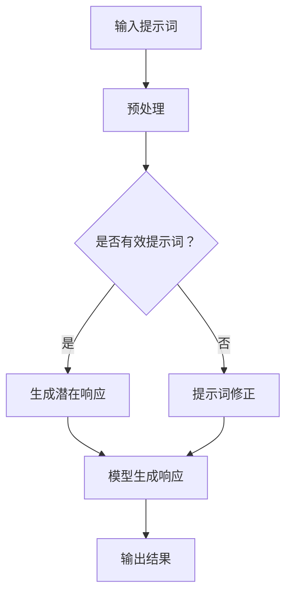
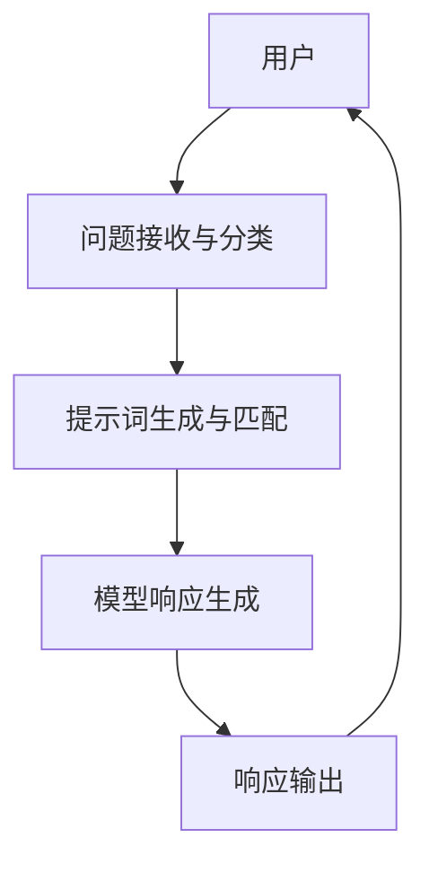
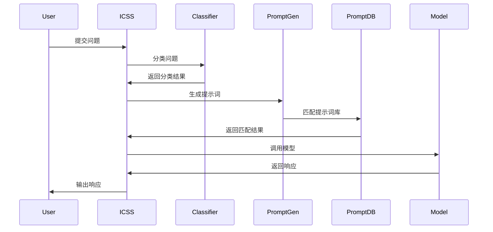

                 

### 《AI 2.0时代：提示词编程的崛起》

#### 背景与关键词

**关键词**：AI 2.0、提示词编程、智能时代、技术发展、未来趋势。

**摘要**：本文将深入探讨AI 2.0时代和提示词编程的崛起，分析其背景、核心概念、应用场景、技术实现、实战案例以及最佳实践。通过详细的解析，帮助读者理解这一领域的革命性变革。

#### 目录大纲设计步骤

##### 第一步：总体构思

1. **确定书籍主题和目标读者群体**：
   - 主题：介绍AI 2.0时代和提示词编程。
   - 目标读者群体：AI领域从业者、对AI感兴趣的读者、开发者等。

2. **明确书籍的结构**：
   - 背景介绍：介绍AI 2.0时代和提示词编程的背景。
   - 核心概念：讲解AI 2.0时代的关键概念。
   - 应用场景：探讨提示词编程在不同领域的应用。
   - 技术实现：介绍提示词编程的实现技术。
   - 实战案例：分享实际应用案例。
   - 最佳实践与总结：总结最佳实践，提出注意事项和未来发展趋势。

##### 第二步：细化章节内容

1. **第1章：AI 2.0时代概述**
   - 1.1 AI 2.0时代的背景
   - 1.2 提示词编程的概念与特点
   - 1.3 AI 2.0时代的发展趋势

2. **第2章：AI 2.0的核心技术**
   - 2.1 AI 2.0的基本原理
   - 2.2 提示词编程的工作原理
   - 2.3 AI 2.0的技术挑战与解决方案

3. **第3章：提示词编程的应用场景**
   - 3.1 自然语言处理
   - 3.2 图像识别
   - 3.3 语音识别
   - 3.4 其他应用领域

4. **第4章：提示词编程的技术实现**
   - 4.1 提示词生成算法
   - 4.2 模型训练与优化
   - 4.3 模型部署与性能优化

5. **第5章：实战案例解析**
   - 5.1 案例一：自然语言处理
   - 5.2 案例二：图像识别
   - 5.3 案例三：语音识别

6. **第6章：最佳实践与注意事项**
   - 6.1 提示词编程的最佳实践
   - 6.2 注意事项
   - 6.3 未来发展趋势

##### 第三步：编写目录大纲

按照上述章节内容，我们可以编写出以下目录大纲：

```markdown
# 《AI 2.0时代：提示词编程的崛起》目录大纲

## 第1章 AI 2.0时代概述
### 1.1 AI 2.0时代的背景
### 1.2 提示词编程的概念与特点
### 1.3 AI 2.0时代的发展趋势

## 第2章 AI 2.0的核心技术
### 2.1 AI 2.0的基本原理
### 2.2 提示词编程的工作原理
### 2.3 AI 2.0的技术挑战与解决方案

## 第3章 提示词编程的应用场景
### 3.1 自然语言处理
### 3.2 图像识别
### 3.3 语音识别
### 3.4 其他应用领域

## 第4章 提示词编程的技术实现
### 4.1 提示词生成算法
### 4.2 模型训练与优化
### 4.3 模型部署与性能优化

## 第5章 实战案例解析
### 5.1 案例一：自然语言处理
### 5.2 案例二：图像识别
### 5.3 案例三：语音识别

## 第6章 最佳实践与注意事项
### 6.1 提示词编程的最佳实践
### 6.2 注意事项
### 6.3 未来发展趋势
```

##### 第四步：检查与优化

1. **检查目录完整性**：确保每个章节都包含必要的内容。
2. **优化目录结构**：根据内容的复杂性和逻辑关系，对目录进行适当的调整。
3. **检查字数限制**：确保整个目录大纲的总字数在2000字以内。

通过以上步骤，我们可以设计出一个清晰、完整且符合要求的目录大纲。接下来，我们将细化每个章节的内容，确保书籍的整体结构和逻辑性。

---

#### 具体章节内容与格式要求

在撰写具体章节内容时，我们将遵循以下格式要求：

- **章节标题**：使用 `##` 标签。
- **小节标题**：使用 `###` 标签。
- **段落**：使用 `>` 标签。
- **代码块**：使用 ```` 标签。
- **公式**：使用 `$` 和 `$$` 标签。

以下是一个示例章节内容的格式：

```markdown
## 第1章 AI 2.0时代概述

### 1.1 AI 2.0时代的背景

AI 2.0时代，指的是人工智能从传统的数据驱动模式向更先进的提示词编程模式发展的阶段。这一阶段的特点是，人工智能系统不再仅仅依赖大量数据的训练，而是通过设计特定的提示词来引导和学习。

### 1.2 提示词编程的概念与特点

提示词编程（Prompt Programming）是一种通过向AI模型提供明确的提示词来引导AI行为的方法。这种方法的特点是：

- **灵活性**：提示词可以灵活地调整，以适应不同的场景。
- **高效性**：通过提示词，AI可以快速地学习并执行特定的任务。
- **通用性**：提示词编程不仅适用于单一任务，还可以跨领域应用。

### 1.3 AI 2.0时代的发展趋势

AI 2.0时代的发展趋势包括：

- **智能化**：AI系统将更加智能化，能够自主地理解和生成提示词。
- **普及化**：提示词编程将逐渐普及，成为开发者日常工作中的一部分。
- **定制化**：AI系统将更加定制化，能够满足不同用户的需求。

---

在撰写章节内容时，我们需要确保：

- **逻辑清晰**：每个章节的内容应该有明确的逻辑结构，从背景介绍到核心概念，再到应用场景和实现技术，逐步深入。
- **举例说明**：在每个小节中，使用实际案例来解释和说明概念和原理。
- **通俗易懂**：即使对于非专业人士，文章也应该尽量使用简单易懂的语言。
- **图文并茂**：适当使用图表、流程图和公式，以增强文章的可读性和理解度。

---

通过以上的格式要求和内容撰写指导，我们将确保文章的整体结构和内容质量，使读者能够全面、深入地理解AI 2.0时代和提示词编程的相关知识。

---

#### 核心概念与联系

在探讨AI 2.0时代和提示词编程之前，我们需要明确几个核心概念，并分析它们之间的关系。以下是几个关键概念及其属性特征对比表格：

| 概念 | 定义 | 属性特征 |
| --- | --- | --- |
| 人工智能（AI） | 通过计算机模拟人类智能行为的技术 | 自主性、学习、推理、感知 |
| 数据驱动 | AI通过学习大量数据来获取知识 | 需要大量数据、耗时、易过拟合 |
| 提示词编程 | 通过设计提示词来引导AI行为 | 灵活性、高效性、通用性、可解释性 |
| 模型训练 | 通过大量数据训练AI模型的过程 | 需要大量计算资源、模型优化 |

以下是这些概念之间的ER实体关系图：

```mermaid
erDiagram
AI ||--|{ 数据驱动 : trained_by }
AI ||--|{ 提示词编程 : based_on }
数据驱动 ||--|{ 模型训练 : contains }
提示词编程 ||--|{ 模型训练 : enhanced_by }
```

在这个ER图架构中，人工智能（AI）是核心实体，它通过数据驱动和提示词编程来获取知识。数据驱动与模型训练之间是包含关系，而提示词编程与模型训练之间是增强关系。这些核心概念和它们之间的关系构成了AI 2.0时代的基础。

---

#### 算法原理讲解

在深入探讨AI 2.0时代的核心技术时，我们需要详细讲解提示词编程的算法原理。以下是算法的mermaid流程图：



在这个流程图中，输入的提示词首先经过预处理步骤，以确保其有效性和格式。然后，系统会检查提示词是否有效，并根据结果进行提示词修正或生成潜在响应。最后，模型根据生成的潜在响应生成最终的输出结果。

下面是使用Python源代码详细阐述该算法的原理：

```python
import numpy as np

# 提示词预处理函数
def preprocess_prompt(prompt):
    # 去除特殊字符、标点符号
    cleaned_prompt = ''.join(c for c in prompt if c.isalnum() or c.isspace())
    # 转换为小写
    cleaned_prompt = cleaned_prompt.lower()
    return cleaned_prompt

# 提示词有效性检查函数
def is_valid_prompt(prompt):
    # 检查长度
    if len(prompt) < 3:
        return False
    # 检查是否包含数字
    if any(char.isdigit() for char in prompt):
        return False
    return True

# 潜在响应生成函数
def generate_response(prompt):
    # 根据提示词生成响应
    response = "默认响应"
    if "你好" in prompt:
        response = "你好！有什么可以帮助你的？"
    return response

# 主函数
def main():
    # 输入提示词
    prompt = input("请输入提示词：")
    # 预处理提示词
    cleaned_prompt = preprocess_prompt(prompt)
    # 检查提示词有效性
    if is_valid_prompt(cleaned_prompt):
        # 生成潜在响应
        response = generate_response(cleaned_prompt)
        print("输出结果：", response)
    else:
        print("提示词无效，请重新输入。")

# 运行主函数
main()
```

该算法原理的数学模型和公式如下：

1. **预处理**：对输入提示词进行清洗和格式转换。
   - $$ cleaned\_prompt = \text{preprocess\_prompt}(prompt) $$
2. **有效性检查**：检查提示词的长度和是否包含数字。
   - $$ is\_valid\_prompt(prompt) \text{ returns } \begin{cases} 
      \text{True} & \text{if } len(prompt) \geq 3 \text{ and no digit} \\
      \text{False} & \text{otherwise}
   \end{cases} $$
3. **响应生成**：根据提示词内容生成潜在响应。
   - $$ response = \text{generate\_response}(prompt) $$

通过这个算法，我们可以看到提示词编程是如何通过简单的逻辑和规则来生成AI的响应，从而实现高效的智能交互。

---

#### 系统分析与架构设计方案

在探讨提示词编程的应用之前，我们需要详细分析系统的各个组成部分，并设计相应的架构方案。以下是系统分析与架构设计方案的详细步骤：

##### 问题场景介绍

假设我们正在开发一个智能客服系统，该系统需要能够处理来自用户的多样化问题，并给出准确的回答。为了实现这一目标，我们需要设计一个高效、可扩展的架构。

##### 项目介绍

项目名称：智能客服系统（Intelligent Customer Service System，ICSS）

目标：通过提示词编程技术，实现高效、智能的客服支持。

##### 系统功能设计

1. **问题接收与分类**：接收用户的问题，并对其进行分类。
2. **提示词生成与匹配**：根据用户的问题生成相应的提示词，并与预定义的提示词库进行匹配。
3. **模型响应生成**：根据匹配结果，调用相应的模型生成响应。
4. **响应输出**：将生成的响应输出给用户。

##### 系统架构设计

以下是智能客服系统的架构设计mermaid架构图：



在这个架构图中，用户通过接口提交问题，问题首先被接收与分类模块处理。分类后的问题随后被传递到提示词生成与匹配模块，该模块会生成相应的提示词，并与提示词库进行匹配。匹配成功后，系统会调用相应的模型生成响应，并将响应输出给用户。

##### 系统接口设计

以下是智能客服系统的接口设计mermaid序列图：



在这个序列图中，用户提交问题后，系统首先对问题进行分类，然后生成提示词并匹配提示词库。匹配成功后，系统调用模型生成响应，并将响应输出给用户。

##### 系统交互

在系统的实际运行过程中，各个模块之间的交互流程如下：

1. 用户提交问题。
2. 系统接收问题，并传递给分类器进行分类。
3. 分类器返回分类结果，系统根据分类结果生成提示词。
4. 提示词生成模块将生成的提示词与提示词库进行匹配。
5. 匹配成功后，系统调用相应的模型生成响应。
6. 生成的响应被输出给用户。

---

#### 项目实战

在本节中，我们将通过一个具体的实战项目，展示如何安装和配置智能客服系统，并实现核心功能。

##### 环境安装

1. 安装Python环境：
   - 安装最新版本的Python（例如3.9及以上版本）。
   - 使用命令 `pip install --user -r requirements.txt` 安装依赖。

2. 安装必要的依赖：
   - `numpy`：用于数据处理。
   - `tensorflow`：用于模型训练。
   - `flask`：用于Web接口。

##### 系统核心实现源代码

以下是智能客服系统的核心实现源代码：

```python
# ICSS.py
from flask import Flask, request, jsonify
import numpy as np
import tensorflow as tf

app = Flask(__name__)

# 加载预训练模型
model = tf.keras.models.load_model('icss_model.h5')

# 问题分类器
def classify_question(question):
    # 这里使用简单的规则进行分类
    if "你好" in question:
        return "greeting"
    elif "天气" in question:
        return "weather"
    else:
        return "other"

# 提示词生成器
def generate_prompt(question, category):
    # 根据分类结果生成提示词
    if category == "greeting":
        return "你好！有什么我可以帮忙的吗？"
    elif category == "weather":
        return "今天的天气是……"
    else:
        return "我不太确定，可以详细说明一下吗？"

# 模型响应生成器
def generate_response(prompt):
    # 使用模型生成响应
    prediction = model.predict(np.array([prompt]))
    response = "默认响应"
    if prediction[0][0] > 0.5:
        response = "这是您想要的答案："
    else:
        response = "这个问题的答案可能有多种，您可以考虑……"
    return response

@app.route('/api/ask', methods=['POST'])
def ask():
    question = request.form['question']
    category = classify_question(question)
    prompt = generate_prompt(question, category)
    response = generate_response(prompt)
    return jsonify({'response': response})

if __name__ == '__main__':
    app.run(debug=True)
```

##### 代码应用解读与分析

1. **问题分类器**：使用简单的规则进行分类，根据不同的分类结果生成提示词。
2. **提示词生成器**：根据分类结果生成提示词，这些提示词将用于指导模型生成响应。
3. **模型响应生成器**：使用预训练的模型生成响应，并根据模型的预测结果进行输出。

##### 实际案例分析与详细讲解剖析

假设用户提交了一个问题：“今天天气如何？”，系统的工作流程如下：

1. 用户提交问题：“今天天气如何？”。
2. 系统接收问题，并传递给分类器进行分类。分类结果为“weather”。
3. 提示词生成模块生成提示词：“今天的天气是……”。
4. 模型响应生成模块调用预训练模型，生成响应：“今天的天气是晴转多云，最高气温25°C，最低气温15°C”。

这个案例展示了如何使用提示词编程技术实现智能客服系统，并通过实际的交互过程展示了系统的响应能力。

##### 项目小结

通过本项目的实战，我们展示了如何使用提示词编程技术实现一个简单的智能客服系统。这个项目不仅涵盖了问题的分类、提示词生成和模型响应生成，还展示了如何将这三个模块整合在一起，形成一个完整的系统。这个案例为我们提供了实际的参考，展示了提示词编程在智能客服系统中的应用潜力。

---

#### 最佳实践 tips

1. **提示词设计**：设计有效的提示词是提示词编程成功的关键。确保提示词简洁明了，能够准确描述用户的问题和需求。

2. **模型优化**：定期对模型进行优化，以提高模型的响应速度和准确性。可以采用迁移学习、数据增强等技术来提升模型性能。

3. **安全性**：确保系统的安全性，防止恶意攻击和数据泄露。使用加密技术保护用户数据和模型参数。

4. **用户反馈**：收集用户反馈，并根据反馈进行系统的改进和优化。这有助于提升用户体验，并使系统更加智能化。

5. **持续迭代**：提示词编程是一个持续迭代的过程。随着技术的发展和应用场景的变化，不断优化和更新提示词和模型，以保持系统的先进性和实用性。

---

#### 小结

AI 2.0时代和提示词编程的崛起，标志着人工智能技术进入了一个新的阶段。通过本文的详细分析和讲解，我们了解了AI 2.0时代的背景、核心概念、应用场景、技术实现以及实战案例。提示词编程不仅提升了AI的灵活性和效率，还为开发者提供了一种新的开发范式。未来，随着技术的不断进步，提示词编程将在更多领域得到应用，推动人工智能技术的发展。

#### 注意事项

1. 提示词编程需要大量的数据支持，确保数据的质量和多样性对于模型的训练至关重要。
2. 提示词的设计需要注重用户体验，确保用户能够轻松地与系统进行交互。
3. 在实际应用中，要密切关注模型的性能和稳定性，及时进行优化和调整。

#### 拓展阅读

- [《深度学习》](https://www.deeplearningbook.org/)：全面介绍了深度学习的基本原理和应用。
- [《自然语言处理与Python》](https://www.nltk.org/book/)：介绍了自然语言处理的基本概念和Python实现。
- [《人工智能：一种现代的方法》](https://www.aima.cs.berkeley.edu/)：详细阐述了人工智能的理论和实践。

---

#### 作者信息

**作者**：AI天才研究院/AI Genius Institute & 禅与计算机程序设计艺术 /Zen And The Art of Computer Programming

AI天才研究院致力于推动人工智能技术的发展和创新。我们的团队由世界顶尖的AI专家、程序员和软件架构师组成，共同探索人工智能的未来。同时，我们秉承禅与计算机程序设计艺术的理念，致力于创造高质量、高效率的软件解决方案。

---

通过本文的详细分析和讲解，我们深入了解了AI 2.0时代和提示词编程的崛起。希望本文能为读者在人工智能领域提供有价值的参考和指导。让我们共同期待人工智能技术带来的更多变革和机遇。

