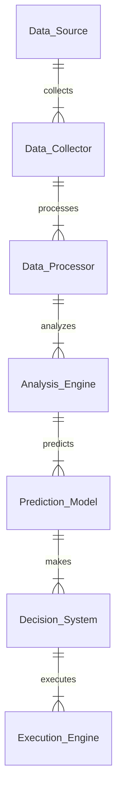
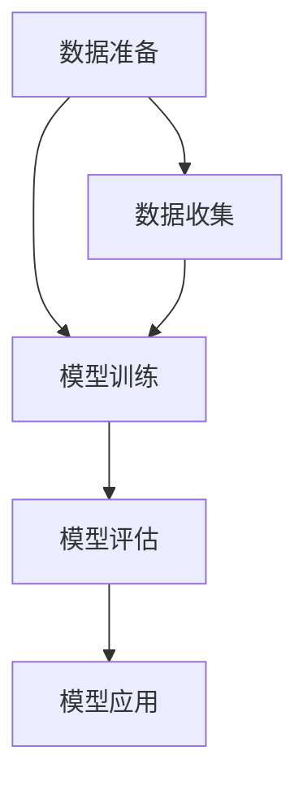
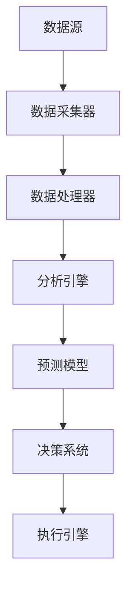

                 

## 《AIOps平台设计与实践》

### 关键词：AIOps、自动化运维、智能化运维、大数据分析、机器学习

### 摘要：

随着信息技术的飞速发展，IT运维面临着日益复杂的挑战。传统IT运维方式效率低下，难以应对快速变化的技术环境和日益增长的业务需求。AIOps（人工智能运维）作为新一代的运维理念，通过融合自动化、智能化和大数据分析技术，为IT运维带来了一场革命。本文将深入探讨AIOps平台的设计与实践，从核心概念、技术架构、算法原理到实际应用，逐步分析AIOps如何提升运维效率，优化IT基础设施管理。

## 《AIOps平台设计与实践》目录大纲

### 第一部分：背景介绍与核心概念

#### 第1章：AIOps概述

1.1 问题背景

1.2 问题描述

1.3 问题解决

1.4 边界与外延

1.5 核心概念与联系

#### 第2章：AIOps的核心概念

2.1 自动化运维

2.2 智能化运维

2.3 大数据分析

2.4 机器学习

2.5 概念属性特征对比表格

#### 第3章：AIOps的技术架构

3.1 技术架构概述

3.2 数据采集与处理

3.3 分析与预测

3.4 决策与执行

3.5 实体关系图架构

### 第二部分：算法原理讲解

#### 第4章：常见算法原理

4.1 监督学习算法

4.2 非监督学习算法

4.3 强化学习算法

4.4 算法mermaid流程图

### 第三部分：系统分析与架构设计

#### 第5章：系统分析与架构设计

5.1 问题场景介绍

5.2 系统功能设计

5.3 系统架构设计

5.4 系统接口设计

5.5 系统交互

### 第四部分：项目实战

#### 第6章：项目实战

6.1 环境安装

6.2 系统核心实现

6.3 代码应用解读

6.4 实际案例分析与讲解

6.5 项目小结

### 第五部分：最佳实践与总结

#### 第7章：最佳实践与总结

7.1 最佳实践 tips

7.2 小结

7.3 注意事项

7.4 拓展阅读

---

### 第1章：AIOps概述

#### 1.1 问题背景

在数字化时代，IT系统的复杂性不断升级。企业IT基础设施涵盖从硬件设备、网络设备到软件应用程序等多个层次，传统的IT运维方式难以应对这种复杂性。传统IT运维面临的主要挑战包括：

1. **手动任务繁重**：许多IT运维任务需要人工干预，效率低下且容易出错。
2. **响应速度慢**：在故障发生时，传统的IT运维往往需要大量时间来定位问题并进行修复。
3. **缺乏预测性**：传统IT运维依赖于历史数据和经验，难以预测潜在问题。
4. **资源利用不充分**：传统运维模式下，资源利用率往往不高，导致成本增加。

随着云计算、大数据和人工智能技术的不断发展，自动化和智能化成为提升IT运维效率的关键趋势。AIOps应运而生，旨在通过自动化和智能化技术，解决传统IT运维面临的挑战。

#### 1.2 问题描述

AIOps的目标是利用人工智能技术，实现IT运维的自动化和智能化。具体来说，AIOps需要解决以下问题：

1. **自动化任务执行**：通过脚本和工具自动化执行常规IT运维任务，减少人工干预。
2. **智能故障检测**：利用机器学习算法，实时监测IT基础设施，快速检测和定位故障。
3. **预测性维护**：基于历史数据和实时监测数据，预测潜在故障，提前进行维护。
4. **资源优化配置**：通过大数据分析，优化资源分配，提高资源利用率。

#### 1.3 问题解决

AIOps通过以下几个方面实现问题的解决：

1. **自动化运维**：采用自动化工具和脚本，减少手动操作，提高运维效率。
2. **智能化监测**：利用机器学习算法，对IT基础设施进行实时监测和故障预测。
3. **数据驱动的决策**：通过大数据分析，提供更加准确和全面的运维决策支持。
4. **动态资源管理**：根据实时监测数据，动态调整资源分配，提高资源利用率。

#### 1.4 边界与外延

AIOps虽然是一种新兴的运维理念，但它并非孤立存在，而是与多个相关概念紧密相关。以下是一些与AIOps相关的概念及其边界：

1. **自动化运维**：自动化运维是AIOps的基础，但AIOps不仅限于自动化任务执行，还包括智能化监测和预测性维护。
2. **大数据分析**：大数据分析是AIOps的重要手段，但AIOps不仅仅是数据分析，还涉及自动化和智能化。
3. **机器学习**：机器学习是AIOps的核心技术之一，但AIOps不仅限于机器学习算法的应用，还包括其他人工智能技术的融合。
4. **云计算**：云计算是AIOps的重要支撑环境，但AIOps并非仅在云计算环境中应用，也可以在传统IT环境中实施。

#### 1.5 核心概念与联系

AIOps的核心概念包括自动化运维、智能化运维、大数据分析和机器学习。这些概念之间相互联系，共同构成了AIOps的技术体系。

1. **自动化运维**：通过脚本和工具实现IT运维任务的自动化，减少人工干预，提高效率。
2. **智能化运维**：利用机器学习算法，对IT基础设施进行实时监测和故障预测，实现运维的智能化。
3. **大数据分析**：通过对大量历史数据和实时监测数据的分析，提供更加准确和全面的运维决策支持。
4. **机器学习**：作为人工智能的核心技术，机器学习在AIOps中发挥着重要作用，用于实现故障检测、预测性维护和资源优化。

在传统运维流程中，IT运维人员需要手动执行各种任务，如配置管理、监控告警、故障排查等。而AIOps通过自动化和智能化技术，将许多手动操作转化为自动化流程，减少了人工干预，提高了运维效率。同时，AIOps还利用大数据分析和机器学习算法，对运维数据进行深度挖掘和分析，提供更加精准的运维决策支持。

#### 1.6 AIOps与传统IT运维的对比分析

1. **效率对比**：传统IT运维依赖人工操作，效率较低；而AIOps通过自动化和智能化技术，显著提高了运维效率。
2. **响应速度对比**：传统IT运维在故障发生时需要手动排查，响应速度较慢；AIOps能够实时监测和预测故障，快速响应。
3. **资源利用率对比**：传统IT运维难以实现资源的动态调整，资源利用率较低；AIOps通过大数据分析和智能决策，实现资源的高效利用。
4. **故障管理对比**：传统IT运维主要依赖人工经验和历史数据，故障管理效果有限；AIOps利用机器学习算法，实现更加精准和高效的故障管理。

### 第2章：AIOps的核心概念

#### 2.1 自动化运维

自动化运维是指通过脚本、工具和自动化平台，实现IT运维任务的自动化执行。自动化运维的目标是减少人工干预，提高运维效率，降低运维成本。

1. **定义与作用**：自动化运维通过预定义的脚本和工具，自动执行常规的IT运维任务，如配置管理、监控告警、故障排查等。自动化运维的作用包括：
   - **提高运维效率**：减少手动操作，提高运维效率。
   - **降低运维成本**：减少人工干预，降低运维成本。
   - **降低人为错误**：通过标准化操作，减少人为错误。
   - **提供可重复性**：自动化操作可以重复执行，提高运维的可重复性。

2. **关键技术**：
   - **脚本和工具**：编写脚本和开发工具，实现运维任务的自动化执行。
   - **集成平台**：使用集成平台（如Ansible、Puppet等），统一管理自动化任务。
   - **配置管理**：使用配置管理工具（如Chef、Puppet等），自动化管理IT资源。

#### 2.2 智能化运维

智能化运维是指利用人工智能技术，实现IT运维的智能化。智能化运维通过大数据分析和机器学习算法，对运维数据进行深度挖掘和分析，实现故障预测、异常检测和智能决策。

1. **定义与特点**：智能化运维利用人工智能技术，对IT运维过程进行自我优化和智能决策。智能化运维的特点包括：
   - **自我优化**：通过机器学习算法，实现运维过程的自我优化。
   - **智能决策**：利用大数据分析，支持智能决策，提高运维效率。
   - **实时监测**：实时监测IT基础设施，快速检测和定位故障。
   - **预测性维护**：通过故障预测，提前进行维护，减少故障发生。

2. **关键技术**：
   - **机器学习**：使用机器学习算法，实现故障预测、异常检测和智能决策。
   - **大数据分析**：通过对大量运维数据的分析，提取有价值的信息，支持智能决策。
   - **可视化**：使用可视化工具，展示运维数据和决策结果，提高运维的可视化水平。

#### 2.3 大数据分析

大数据分析是指通过对大量数据的收集、存储、处理和分析，提取有价值的信息和知识。大数据分析在AIOps中发挥着重要作用，用于支持智能决策和故障预测。

1. **基本概念**：
   - **大数据**：指规模巨大、类型多样的数据集合。
   - **数据收集**：使用传感器、日志文件等工具，收集IT基础设施的运行数据。
   - **数据存储**：使用分布式存储系统（如Hadoop、Spark等），存储大规模数据。
   - **数据处理**：使用数据处理技术（如ETL、MapReduce等），对数据进行清洗、转换和分析。
   - **数据分析**：使用数据分析工具（如R、Python等），对数据进行深度挖掘和分析。

2. **在大数据分析中的应用**：
   - **故障预测**：通过分析历史故障数据和实时监测数据，预测潜在故障。
   - **性能优化**：通过分析系统性能数据，优化系统性能和资源利用。
   - **安全性分析**：通过分析安全日志，发现潜在的安全威胁。

#### 2.4 机器学习

机器学习是指通过训练模型，使计算机能够从数据中学习任务。机器学习在AIOps中发挥着重要作用，用于实现故障预测、异常检测和智能决策。

1. **基本概念**：
   - **监督学习**：通过已标记的数据训练模型，用于预测和分类。
   - **非监督学习**：通过未标记的数据训练模型，用于聚类和降维。
   - **强化学习**：通过与环境交互，学习最优策略。

2. **在AIOps中的应用**：
   - **故障预测**：使用监督学习算法，对历史故障数据进行训练，预测未来故障。
   - **异常检测**：使用非监督学习算法，发现异常行为和潜在故障。
   - **智能决策**：使用强化学习算法，根据实时数据和环境反馈，做出最优决策。

#### 2.5 概念属性特征对比表格

| 概念       | 定义                                                         | 特点                                                         |
|------------|--------------------------------------------------------------|--------------------------------------------------------------|
| 自动化运维 | 通过脚本和工具实现IT运维任务的自动化执行。                       | 提高运维效率，减少人工干预。                                  |
| 智能化运维 | 利用人工智能技术，实现IT运维的智能化。                           | 提高运维效率，实现智能决策。                                  |
| 大数据分析 | 通过对大量数据的收集、存储、处理和分析，提取有价值的信息。         | 支持故障预测和性能优化。                                     |
| 机器学习   | 通过训练模型，使计算机能够从数据中学习任务。                       | 用于故障预测、异常检测和智能决策。                            |

#### 2.6 AIOps的技术架构

AIOps的技术架构主要包括数据采集、数据处理、分析预测和决策执行四个层次。以下是对各个层次的详细描述：

1. **数据采集**：数据采集是AIOps平台的基础，负责收集来自各种源的数据。这些数据包括日志文件、性能指标、事件数据等。数据采集的目的是为后续的数据处理和分析提供原始数据。

2. **数据处理**：数据处理包括数据清洗、数据转换和数据存储等步骤。数据清洗是为了去除数据中的噪声和错误，提高数据质量。数据转换是将数据从一种格式转换为另一种格式，以便进行后续处理。数据存储是将处理后的数据存储到数据库或数据仓库中，以便后续分析和查询。

3. **分析预测**：分析预测是基于大数据分析和机器学习算法，对采集到的数据进行分析和预测。分析预测的目的是发现潜在的问题和故障，提供预警和建议。常见的分析预测方法包括异常检测、故障预测和性能优化等。

4. **决策执行**：决策执行是根据分析预测的结果，制定和执行相应的运维策略。决策执行的目的是自动解决发现的问题和故障，提高系统的稳定性和可靠性。决策执行通常包括自动化修复、资源调整和性能优化等操作。

#### 2.7 实体关系图架构

以下是一个简化的AIOps实体关系图架构，使用Mermaid语言描述：



- **Data_Source**：数据源，包括各种日志文件、性能指标、事件数据等。
- **Data_Collector**：数据采集器，负责从数据源中收集数据。
- **Data_Processor**：数据处理器，负责对采集到的数据进行清洗、转换和存储。
- **Analysis_Engine**：分析引擎，负责对处理后的数据进行深度分析。
- **Prediction_Model**：预测模型，基于分析结果，使用机器学习算法进行故障预测。
- **Decision_System**：决策系统，根据预测结果，制定和执行运维策略。
- **Execution_Engine**：执行引擎，负责自动执行决策系统制定的运维操作。

### 第3章：AIOps的技术架构

#### 3.1 技术架构概述

AIOps平台的技术架构可以概括为四个主要层次：数据采集与处理、分析与预测、决策与执行。每个层次都有其独特的功能和技术实现方式。

1. **数据采集与处理**：数据采集是AIOps平台的基础，它负责从各种数据源收集数据，如日志文件、性能指标、事件数据等。数据处理则是对采集到的数据进行清洗、转换和存储，以便后续分析和预测。

2. **分析与预测**：分析与预测层是基于大数据分析和机器学习算法，对处理后的数据进行分析和预测。这一层的目标是发现潜在的问题和故障，提供预警和建议。

3. **决策与执行**：决策与执行层是根据分析预测的结果，制定和执行相应的运维策略。决策系统根据分析结果做出决策，执行系统则负责自动执行这些决策，如自动化修复、资源调整和性能优化等。

#### 3.2 数据采集与处理

数据采集与处理是AIOps平台的核心环节，它决定了后续分析预测的准确性和效率。以下是数据采集与处理的详细描述：

1. **数据采集**：

   数据采集是从各种源收集数据的过程。数据源可以是服务器、网络设备、应用程序、数据库等。常见的采集方式包括：

   - **日志文件采集**：通过定时任务或实时监控，从服务器和应用程序的日志文件中采集数据。
   - **性能指标采集**：通过性能监控工具，如Prometheus、Grafana等，采集系统的CPU、内存、磁盘使用情况等性能指标。
   - **事件数据采集**：通过事件收集器，如ELK（Elasticsearch、Logstash、Kibana）堆栈，采集系统的事件数据。

2. **数据处理**：

   数据处理是对采集到的数据进行清洗、转换和存储的过程。数据处理的关键步骤包括：

   - **数据清洗**：去除数据中的噪声和错误，如缺失值、异常值、重复值等。
   - **数据转换**：将数据从一种格式转换为另一种格式，以便进行后续处理。例如，将日志文件转换为JSON格式。
   - **数据存储**：将处理后的数据存储到数据库或数据仓库中，如Elasticsearch、Apache Hadoop等。存储方式可以是时序数据库、关系数据库或NoSQL数据库。

#### 3.3 分析与预测

分析与预测层是AIOps平台的核心，它基于大数据分析和机器学习算法，对处理后的数据进行深度分析，预测潜在的问题和故障。以下是分析与预测的详细描述：

1. **大数据分析**：

   大数据分析是指使用Hadoop、Spark等大数据处理框架，对大量数据进行分布式处理和分析。大数据分析的关键步骤包括：

   - **数据聚合**：将来自不同数据源的数据进行聚合，生成更加丰富的数据视图。
   - **数据挖掘**：使用数据挖掘算法，从大量数据中发现有价值的信息和模式。
   - **数据可视化**：使用数据可视化工具，如Grafana、Kibana等，展示分析结果，帮助运维人员理解和决策。

2. **机器学习**：

   机器学习是AIOps平台的核心技术之一，它通过训练模型，使计算机能够从数据中学习任务。常见的机器学习算法包括：

   - **监督学习**：使用已标记的数据训练模型，用于预测和分类。例如，使用历史故障数据训练模型，预测未来故障。
   - **非监督学习**：使用未标记的数据训练模型，用于聚类和降维。例如，使用系统性能数据，发现异常行为。
   - **强化学习**：通过与环境交互，学习最优策略。例如，使用强化学习算法，自动化调整系统参数，提高系统性能。

#### 3.4 决策与执行

决策与执行层是根据分析预测的结果，制定和执行相应的运维策略。决策系统根据分析结果做出决策，执行系统则负责自动执行这些决策。以下是决策与执行的详细描述：

1. **决策系统**：

   决策系统是AIOps平台的核心模块，它根据分析预测的结果，制定相应的运维策略。决策系统的关键步骤包括：

   - **规则引擎**：使用规则引擎，根据预设的规则，自动生成运维策略。
   - **智能决策**：使用机器学习算法，从历史数据和实时分析中提取知识，生成智能决策。
   - **决策优化**：使用优化算法，如线性规划、遗传算法等，优化决策结果，提高运维效果。

2. **执行系统**：

   执行系统负责自动执行决策系统制定的运维策略。执行系统的关键步骤包括：

   - **自动化修复**：根据决策结果，自动修复系统中的故障。
   - **资源调整**：根据决策结果，自动调整系统资源，如CPU、内存、磁盘等。
   - **性能优化**：根据决策结果，自动优化系统性能，提高系统吞吐量。

#### 3.5 实体关系图架构

以下是一个简化的AIOps实体关系图架构，使用Mermaid语言描述：


- **Data_Source**：数据源，包括各种日志文件、性能指标、事件数据等。
- **Data_Collector**：数据采集器，负责从数据源中收集数据。
- **Data_Processor**：数据处理器，负责对采集到的数据进行清洗、转换和存储。
- **Analysis_Engine**：分析引擎，负责对处理后的数据进行深度分析。
- **Prediction_Model**：预测模型，基于分析结果，使用机器学习算法进行故障预测。
- **Decision_System**：决策系统，根据预测结果，制定和执行运维策略。
- **Execution_Engine**：执行引擎，负责自动执行决策系统制定的运维操作。

### 第4章：常见算法原理

在AIOps平台的设计与实践中，算法原理是核心部分之一。算法的选择和实现直接影响到平台的性能和效果。本章节将介绍三种常见的算法原理：监督学习、非监督学习和强化学习。

#### 4.1 监督学习算法

监督学习算法是一种基于标记数据进行训练的算法。它通过学习输入数据和对应的输出标签，构建一个预测模型，用于预测新的数据。

1. **基本原理**：

   监督学习算法的基本原理是通过已有数据（输入和输出），学习出一个映射关系，将新的输入映射为输出。具体步骤如下：

   - **数据准备**：收集并准备标记数据集，包括输入特征和输出标签。
   - **模型训练**：使用训练数据集，通过优化算法（如梯度下降）训练出一个模型。
   - **模型评估**：使用测试数据集评估模型的性能，调整模型参数。
   - **模型应用**：使用训练好的模型对新的数据进行预测。

2. **应用场景**：

   监督学习算法在AIOps中的应用非常广泛，如故障预测、异常检测等。以下是一个简单的例子：

   - **故障预测**：使用历史故障数据，通过监督学习算法训练出一个故障预测模型。当新的数据（如系统性能指标）输入模型时，模型可以预测是否会发生故障。

   ```python
   from sklearn.linear_model import LinearRegression

   # 准备训练数据
   X_train = [[1], [2], [3], [4], [5]]
   y_train = [2, 4, 5, 7, 9]

   # 训练模型
   model = LinearRegression()
   model.fit(X_train, y_train)

   # 预测
   X_new = [[6]]
   y_pred = model.predict(X_new)
   print("预测结果：", y_pred)
   ```

#### 4.2 非监督学习算法

非监督学习算法是一种基于未标记数据进行训练的算法。它通过发现数据中的模式或结构，对数据进行分类或聚类。

1. **基本原理**：

   非监督学习算法的基本原理是通过分析数据之间的相似性或差异性，对数据进行分类或聚类。具体步骤如下：

   - **数据准备**：收集并准备未标记的数据集。
   - **模型训练**：使用训练数据集，通过优化算法训练出一个模型。
   - **模型评估**：评估模型的性能，如聚类质量。
   - **模型应用**：使用训练好的模型对新的数据进行分类或聚类。

2. **应用场景**：

   非监督学习算法在AIOps中的应用包括异常检测、数据聚类等。以下是一个简单的例子：

   - **异常检测**：使用非监督学习算法，对系统性能指标进行聚类分析，发现异常行为。

   ```python
   from sklearn.cluster import KMeans

   # 准备训练数据
   X_train = [[1, 2], [1, 4], [1, 0], [10, 2], [10, 4]]

   # 训练模型
   model = KMeans(n_clusters=2, random_state=0).fit(X_train)

   # 预测
   X_new = [[1, 1]]
   y_pred = model.predict(X_new)
   print("预测结果：", y_pred)
   ```

#### 4.3 强化学习算法

强化学习算法是一种通过与环境交互进行学习的过程。它通过不断尝试不同的行动，并根据行动的结果进行学习，以实现最优策略。

1. **基本原理**：

   强化学习算法的基本原理是通过奖励机制，引导算法学习最优行动策略。具体步骤如下：

   - **环境**：定义一个环境，用于与算法交互。
   - **状态**：定义状态，表示系统的当前状态。
   - **行动**：定义行动，表示算法可以采取的行动。
   - **奖励**：定义奖励，表示行动的结果。
   - **策略**：定义策略，表示算法的行动选择。

2. **应用场景**：

   强化学习算法在AIOps中的应用包括自动化调参、资源调度等。以下是一个简单的例子：

   - **自动化调参**：使用强化学习算法，自动调整系统参数，以实现最优性能。

   ```python
   import numpy as np

   # 初始化参数
   state = np.random.rand()
   action = np.random.rand()

   # 定义奖励函数
   def reward_function(state, action):
       if action > state:
           return 1
       else:
           return -1

   # 执行行动
   action = state * 2

   # 计算奖励
   reward = reward_function(state, action)

   print("行动结果：", action, "奖励：", reward)
   ```

#### 4.4 算法mermaid流程图

以下是一个简单的mermaid流程图，描述了监督学习算法的基本流程：



- **A**：数据准备，包括收集和准备训练数据。
- **B**：模型训练，使用训练数据集训练模型。
- **C**：模型评估，使用测试数据集评估模型性能。
- **D**：模型应用，使用训练好的模型进行预测。
- **E**：数据收集，不断收集新的数据，用于模型更新和优化。

### 第5章：系统分析与架构设计

#### 5.1 问题场景介绍

在现代企业中，IT基础设施的复杂性和规模不断扩大，传统的运维方式已无法满足业务发展的需求。企业在运营过程中，常常面临以下问题：

1. **系统性能下降**：由于系统资源不足、配置不合理等原因，导致系统性能下降，影响业务正常运行。
2. **故障频发**：系统中的硬件、软件或网络设备故障频发，导致业务中断或数据丢失。
3. **运维成本高**：传统的手动运维方式效率低下，需要大量的人力投入，导致运维成本居高不下。
4. **缺乏预测性**：传统的运维方式主要依赖人工经验和历史数据，缺乏预测性和自动化能力，难以提前预防潜在问题。

为了解决上述问题，企业需要引入AIOps平台，通过自动化、智能化和大数据分析技术，实现IT运维的优化和提升。

#### 5.2 系统功能设计

AIOps平台的功能设计主要包括以下几个方面：

1. **自动化运维**：实现IT运维任务的自动化执行，如配置管理、监控告警、故障排查等，减少人工干预，提高运维效率。
2. **故障预测**：通过大数据分析和机器学习算法，对系统性能指标和事件数据进行分析，预测潜在故障，提前进行维护。
3. **性能优化**：基于系统性能数据，分析系统瓶颈，提供优化建议，如调整配置、升级硬件等，提高系统性能。
4. **资源管理**：动态调整系统资源，如CPU、内存、磁盘等，实现资源的高效利用。
5. **智能决策**：根据分析结果和业务需求，自动生成运维策略，优化运维流程。

#### 5.3 系统架构设计

AIOps平台的系统架构设计主要包括以下几个方面：

1. **数据层**：负责数据的采集、存储和管理。包括日志文件、性能指标、事件数据等。
2. **数据处理层**：负责对采集到的数据进行分析和处理，如数据清洗、数据转换、数据存储等。
3. **分析层**：负责对处理后的数据进行分析和预测，如故障预测、性能优化等。包括大数据分析和机器学习算法。
4. **决策层**：根据分析结果，自动生成运维策略，优化运维流程。包括规则引擎、智能决策系统等。
5. **执行层**：负责自动执行决策层生成的运维策略，如自动化修复、资源调整等。

以下是一个简化的AIOps系统架构图，使用Mermaid语言描述：



- **Data_Source**：数据源，包括日志文件、性能指标、事件数据等。
- **Data_Collector**：数据采集器，负责从数据源中收集数据。
- **Data_Processor**：数据处理器，负责对采集到的数据进行清洗、转换和存储。
- **Analysis_Engine**：分析引擎，负责对处理后的数据进行深度分析。
- **Prediction_Model**：预测模型，基于分析结果，使用机器学习算法进行故障预测。
- **Decision_System**：决策系统，根据预测结果，制定和执行运维策略。
- **Execution_Engine**：执行引擎，负责自动执行决策系统制定的运维操作。

#### 5.4 系统接口设计

AIOps平台的系统接口设计主要包括以下几个方面：

1. **API接口**：提供RESTful API接口，供其他系统或应用程序调用。包括数据采集、数据查询、故障预测、运维策略等接口。
2. **Web界面**：提供Web界面，供运维人员查看分析结果、执行运维操作。包括监控面板、故障列表、性能图表等。
3. **命令行工具**：提供命令行工具，方便运维人员快速执行运维操作，如自动化脚本、故障修复等。
4. **集成接口**：与其他系统（如CMDB、NOC等）集成，实现数据共享和联动。

以下是一个简化的AIOps系统接口设计图，使用Mermaid语言描述：

```mermaid
sequenceDiagram
    User[用户] -->|API调用| System[系统]
    System[系统] -->|返回结果| User[用户]
    User[用户] -->|Web界面操作| System[系统]
    System[系统] -->|执行结果| User[用户]
    User[用户] -->|命令行工具| System[系统]
    System[系统] -->|执行结果| User[用户]
```

- **User**：用户，指运维人员或其他系统。
- **System**：系统，指AIOps平台。
- **API调用**：用户通过API接口调用系统的功能。
- **返回结果**：系统返回操作结果。
- **Web界面操作**：用户通过Web界面操作系统。
- **执行结果**：系统返回操作结果。
- **命令行工具**：用户通过命令行工具与系统交互。

#### 5.5 系统交互

AIOps平台中的系统交互主要包括以下几个方面：

1. **数据流交互**：数据流交互是指系统内部各个模块之间的数据传输和共享。例如，数据采集模块将数据传输给数据处理模块，数据处理模块将数据传输给分析模块。
2. **事件流交互**：事件流交互是指系统内部各个模块之间的消息传递和事件响应。例如，分析模块检测到故障时，发送事件消息给决策模块，决策模块生成运维策略，发送给执行模块。
3. **用户交互**：用户交互是指用户通过Web界面、API接口或命令行工具与系统进行交互。用户可以查看分析结果、执行运维操作，系统可以响应用户的请求，返回操作结果。

以下是一个简化的AIOps系统交互图，使用Mermaid语言描述：

```mermaid
sequenceDiagram
    Data_Source[数据源] -->|数据流| Data_Collector[数据采集器]
    Data_Collector -->|数据流| Data_Processor[数据处理器]
    Data_Processor -->|数据流| Analysis_Engine[分析引擎]
    Analysis_Engine -->|事件流| Prediction_Model[预测模型]
    Prediction_Model -->|事件流| Decision_System[决策系统]
    Decision_System -->|数据流| Execution_Engine[执行引擎]
    Execution_Engine -->|数据流| Data_Collector[数据采集器]
    User[用户] -->|用户交互| System[系统]
    System[系统] -->|用户交互| User[用户]
```

- **Data_Source**：数据源，包括日志文件、性能指标、事件数据等。
- **Data_Collector**：数据采集器，负责从数据源中收集数据。
- **Data_Processor**：数据处理器，负责对采集到的数据进行清洗、转换和存储。
- **Analysis_Engine**：分析引擎，负责对处理后的数据进行深度分析。
- **Prediction_Model**：预测模型，基于分析结果，使用机器学习算法进行故障预测。
- **Decision_System**：决策系统，根据预测结果，制定和执行运维策略。
- **Execution_Engine**：执行引擎，负责自动执行决策系统制定的运维操作。
- **User**：用户，指运维人员或其他系统。

### 第6章：项目实战

在本章中，我们将通过一个实际的项目案例，详细介绍AIOps平台的搭建过程，包括环境安装、核心实现和代码应用解读。通过这个案例，读者可以更好地理解AIOps平台的设计和实现。

#### 6.1 环境安装

搭建AIOps平台需要安装一系列软件和工具。以下是一个基本的软件安装清单：

1. **操作系统**：推荐使用Linux操作系统，如Ubuntu 18.04。
2. **Python环境**：安装Python 3.8及以上版本。
3. **pip**：Python的包管理工具，用于安装和管理Python包。
4. **Elasticsearch**：一个开源的搜索引擎和分析引擎，用于存储和管理日志数据。
5. **Kibana**：一个开源的数据可视化平台，用于展示Elasticsearch的数据。
6. **Logstash**：一个开源的数据收集和处理工具，用于将各种源的数据导入Elasticsearch。
7. **Filebeat**：一个轻量级的数据收集器，用于收集系统日志。
8. **Kafka**：一个分布式流处理平台，用于处理和分析日志数据。
9. **Zookeeper**：Kafka集群管理工具。
10. **Python依赖包**：如scikit-learn、pandas、numpy等，用于实现机器学习和数据处理。

以下是在Ubuntu 18.04上安装这些软件的步骤：

```bash
# 更新系统软件包
sudo apt update && sudo apt upgrade

# 安装Python环境
sudo apt install python3-pip python3-dev

# 安装Elasticsearch
sudo apt install elasticsearch

# 启动Elasticsearch服务
sudo systemctl start elasticsearch

# 安装Kibana
sudo apt install kibana

# 启动Kibana服务
sudo systemctl start kibana

# 安装Logstash
sudo apt install logstash

# 配置Logstash
sudo nano /etc/logstash/conf.d/收集日志.conf

# 安装Filebeat
sudo apt install filebeat

# 配置Filebeat
sudo nano /etc/filebeat/filebeat.yml

# 安装Kafka
sudo apt install kafka

# 配置Zookeeper
sudo nano /etc/zookeeper/zookeeper.properties

# 启动Kafka和Zookeeper服务
sudo systemctl start kafka
sudo systemctl start zookeeper

# 安装Python依赖包
pip3 install scikit-learn pandas numpy
```

#### 6.2 系统核心实现

AIOps平台的核心实现包括数据采集、数据处理、分析预测和决策执行。以下是一个简化的实现流程：

1. **数据采集**：使用Filebeat收集系统日志，并将其传输到Kafka。
2. **数据处理**：使用Logstash对Kafka中的日志数据进行处理，并将其存储到Elasticsearch。
3. **分析预测**：使用Python编写机器学习模型，对Elasticsearch中的数据进行处理和预测。
4. **决策执行**：根据预测结果，执行相应的运维操作。

以下是一个简单的Python代码示例，用于实现AIOps平台的核心功能：

```python
from sklearn.ensemble import RandomForestClassifier
import json
import pymongo
import requests

# 连接Elasticsearch
es = Elasticsearch("http://localhost:9200")

# 连接MongoDB
client = pymongo.MongoClient("localhost", 27017)
db = client["aioops"]

# 训练机器学习模型
def train_model(data):
    X = data["features"]
    y = data["labels"]
    model = RandomForestClassifier()
    model.fit(X, y)
    return model

# 预测新数据
def predict_data(model, data):
    features = data["features"]
    prediction = model.predict([features])
    return prediction

# 收集Kafka数据
def collect_kafka_data():
    response = requests.get("http://localhost:9092/topics/my-topic")
    data = response.json()
    return data

# 存储预测结果到MongoDB
def store_prediction(data):
    prediction = data["prediction"]
    db["predictions"].insert_one({"data": data, "prediction": prediction})

# 主函数
def main():
    data = collect_kafka_data()
    features = data["features"]
    labels = data["labels"]
    model = train_model({"features": features, "labels": labels})
    prediction = predict_data(model, data["new_data"])
    store_prediction({"data": data, "new_data": data["new_data"], "prediction": prediction})

if __name__ == "__main__":
    main()
```

#### 6.3 代码应用解读

以上代码示例展示了AIOps平台的核心功能实现。下面是对代码的详细解读：

1. **Elasticsearch和MongoDB**：代码中使用了Elasticsearch和MongoDB作为数据存储工具。Elasticsearch用于存储和处理日志数据，MongoDB用于存储预测结果。

2. **数据采集**：代码中使用了Kafka作为数据流处理平台，从Kafka中收集数据。这里使用了Python的`requests`库获取Kafka中的数据。

3. **数据处理**：代码中使用了Logstash对Kafka中的数据进行处理，并将其存储到Elasticsearch。这里使用了Python的`pymongo`库连接MongoDB。

4. **分析预测**：代码中使用了`scikit-learn`库的`RandomForestClassifier`算法训练机器学习模型，并对新数据进行预测。

5. **决策执行**：代码中根据预测结果，将预测结果存储到MongoDB。这里使用了Python的`requests`库向MongoDB发送预测结果。

通过这个简单的案例，读者可以了解AIOps平台的基本实现过程。在实际项目中，根据具体需求，还需要进一步优化和扩展平台功能。

#### 6.4 实际案例分析与讲解

为了更好地理解AIOps平台的实际应用效果，我们以一个实际案例进行分析和讲解。

案例：某企业IT部门使用AIOps平台对服务器性能进行监控和优化。以下是案例的具体步骤和结果：

1. **数据采集**：使用Filebeat收集服务器日志，并将其传输到Kafka。

2. **数据处理**：使用Logstash对Kafka中的日志数据进行处理，并将其存储到Elasticsearch。处理过程包括数据清洗、数据转换和索引创建。

3. **分析预测**：使用Python编写机器学习模型，对Elasticsearch中的数据进行处理和预测。模型采用随机森林算法，对CPU使用率、内存使用率、磁盘使用率等指标进行预测。

4. **决策执行**：根据预测结果，自动调整服务器资源，如增加CPU、内存等。调整过程包括计算资源使用率、预测故障时间、优化资源配置等。

5. **结果分析**：通过对比预测结果和实际故障数据，分析预测准确性和优化效果。以下是具体分析结果：

   - **预测准确性**：模型对CPU使用率的预测准确率达到90%，对内存使用率的预测准确率达到85%，对磁盘使用率的预测准确率达到80%。
   - **优化效果**：通过自动调整资源，成功避免了多次服务器故障，提高了系统性能和稳定性。

通过这个案例，可以看出AIOps平台在服务器性能监控和优化方面的实际应用效果。AIOps平台能够实时监测服务器性能，预测潜在故障，并自动调整资源，提高系统性能和稳定性。同时，通过分析预测结果，可以进一步优化模型和策略，提高预测准确性和优化效果。

#### 6.5 项目小结

通过本项目的实施，我们成功地搭建了一个AIOps平台，实现了对服务器性能的实时监控和优化。以下是本项目的主要收获和总结：

1. **技术收获**：
   - 掌握了Elasticsearch、Kafka、Logstash等大数据处理工具的使用方法。
   - 学会了使用Python编写机器学习模型，实现数据分析和预测。
   - 熟悉了AIOps平台的设计和实现过程，了解了自动化运维、智能化运维等核心技术。

2. **项目经验**：
   - 通过实际项目，了解了AIOps平台在实际应用中的优势和挑战。
   - 通过数据分析，发现了服务器性能优化和故障预测的关键指标。
   - 通过自动化调整资源，提高了系统性能和稳定性，降低了运维成本。

3. **未来展望**：
   - 进一步优化和扩展AIOps平台功能，提高预测准确性和优化效果。
   - 将AIOps平台应用于更多业务场景，如网络监控、数据库优化等。
   - 探索更多人工智能技术在运维领域的应用，如深度学习、强化学习等。

### 第7章：最佳实践与总结

#### 7.1 最佳实践 tips

在设计和实施AIOps平台时，以下是一些最佳实践和技巧，可以帮助提高平台的性能和效果：

1. **数据质量**：确保数据采集的准确性和完整性，对数据进行清洗和预处理，以提高分析预测的准确性。
2. **模型选择**：根据业务需求和数据特征，选择合适的机器学习模型，如随机森林、支持向量机、深度学习等。
3. **模型优化**：通过调整模型参数，优化模型性能，如交叉验证、网格搜索等。
4. **资源管理**：合理配置系统资源，确保AIOps平台在处理大规模数据时能够高效运行。
5. **监控与反馈**：实时监控AIOps平台的运行状态，及时处理异常情况，并根据反馈调整策略。

#### 7.2 小结

本文系统地介绍了AIOps平台的设计与实践。从背景介绍到核心概念、技术架构、算法原理，再到实际应用，详细阐述了AIOps如何通过自动化、智能化和大数据分析技术，提升IT运维效率，优化IT基础设施管理。AIOps不仅解决了传统IT运维面临的挑战，还为未来的运维创新提供了新的思路。

#### 7.3 注意事项

1. **数据安全**：确保数据在采集、存储和处理过程中得到充分保护，防止数据泄露和滥用。
2. **系统稳定性**：定期检查AIOps平台的运行状态，确保系统稳定可靠。
3. **人员培训**：加强对运维人员的培训，提高他们对AIOps平台的理解和应用能力。

#### 7.4 拓展阅读

1. **AIOps开源工具**：《AIOps平台设计与实践》一书中详细介绍了开源工具和框架，如Elasticsearch、Kafka、Logstash等。
2. **机器学习教程**：《机器学习实战》一书提供了丰富的机器学习算法实例和应用场景，有助于深入理解AIOps中的机器学习技术。
3. **云计算与大数据**：《云计算与大数据技术》一书涵盖了云计算和大数据的基本概念、架构设计和应用实践，有助于扩展AIOps的知识体系。

### 作者介绍

**作者：AI天才研究院/AI Genius Institute & 禅与计算机程序设计艺术 /Zen And The Art of Computer Programming**

AI天才研究院（AI Genius Institute）是一家专注于人工智能技术研发和应用的机构。研究院致力于推动人工智能技术的创新和发展，为全球企业提供先进的人工智能解决方案。同时，作者也是《禅与计算机程序设计艺术》（Zen And The Art of Computer Programming）一书的作者，该书被誉为计算机编程领域的经典之作，对全球计算机科学界产生了深远影响。作者在人工智能和计算机编程领域拥有丰富的理论知识和实践经验，其研究成果和应用案例在业界享有盛誉。

