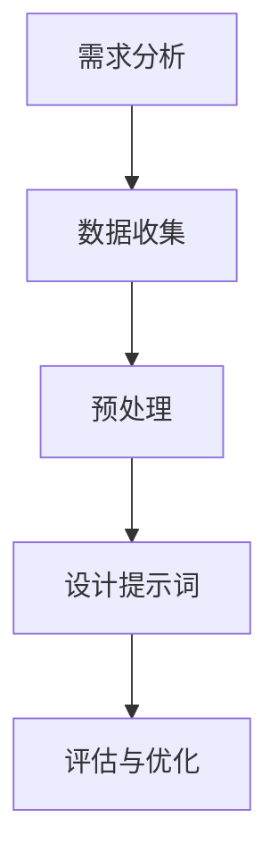
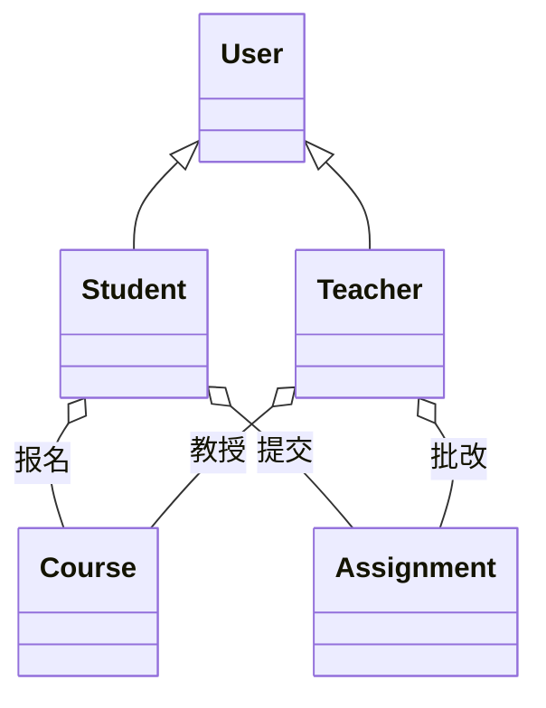
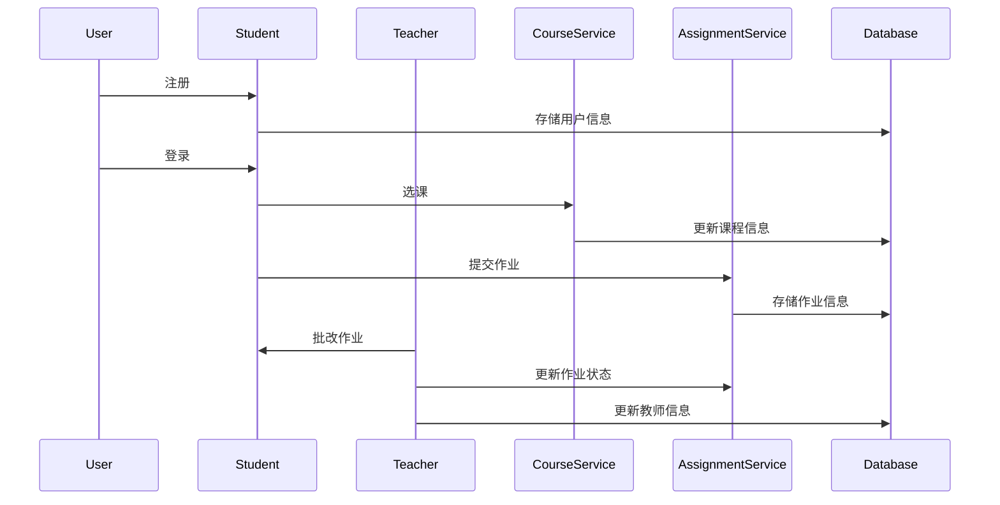
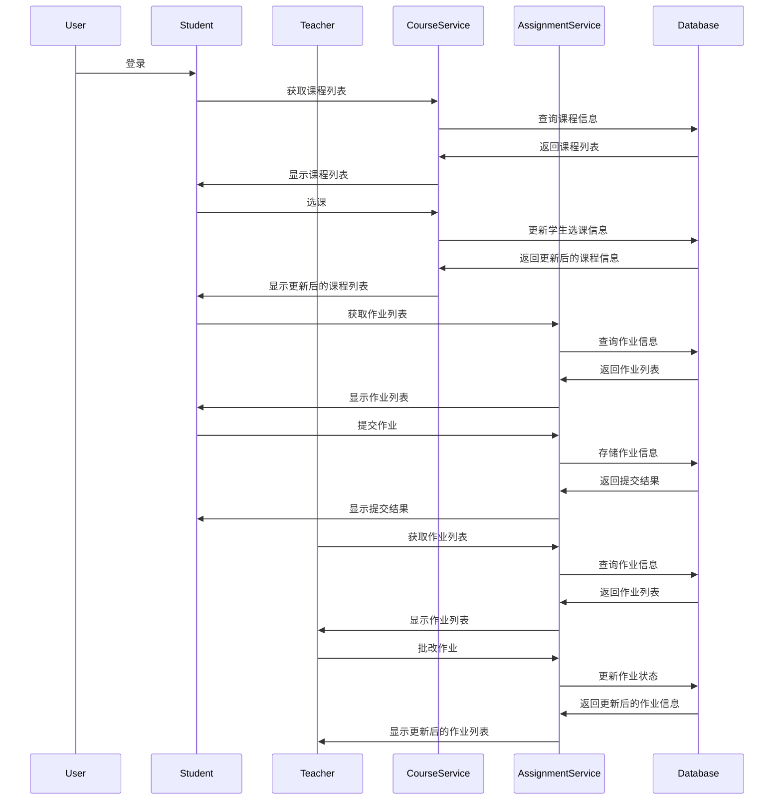

                 

# AI伦理与提示词设计：确保负责任的AI使用

## 关键词
- 人工智能伦理
- 提示词设计
- 负责任AI
- 伦理原则
- 案例分析
- 教育与培训

## 摘要
本文深入探讨了人工智能伦理与提示词设计的重要性，旨在确保AI系统的负责任使用。首先，文章介绍了AI伦理的背景和核心原则，分析了伦理问题在医疗、招聘和自动驾驶领域的案例。随后，文章重点讨论了提示词的定义、设计原则和方法，以及其在伦理考量中的关键作用。最后，文章提出了AI伦理教育和未来展望，强调了负责任AI对社会的重要性，并提供了实践建议。

## 第一部分：引言

### 第1章 AI伦理的必要性

#### 1.1 人工智能的发展与伦理问题

随着人工智能（AI）技术的飞速发展，我们面临着前所未有的伦理挑战。AI技术在医疗、金融、交通、教育等领域的应用日益广泛，但同时也引发了一系列伦理问题。例如，AI在医疗诊断中的误诊问题，AI在金融投资中的算法歧视，AI在自动驾驶中的责任归属等。这些问题不仅涉及到技术本身，更关系到人类社会的价值观和道德准则。

#### 1.2 AI伦理的重要性

AI伦理的重要性在于确保AI技术的可持续发展，维护人类社会的公平正义。负责任的AI设计需要考虑伦理原则，如公正性、透明性、可解释性、隐私保护等。只有在AI伦理的指导下，我们才能确保AI技术的良性发展，避免因技术滥用而带来的负面影响。

#### 1.3 AI伦理的基本原则

AI伦理的基本原则包括以下几个方面：

1. **公正性**：AI系统应当公平对待所有用户，避免因算法偏见导致的不公正待遇。
2. **透明性**：AI系统的决策过程应当透明，用户有权了解AI系统是如何运作的。
3. **可解释性**：AI系统应当具备可解释性，使得用户能够理解AI系统的决策依据。
4. **隐私保护**：AI系统应当尊重用户的隐私，不得泄露用户的个人信息。
5. **责任归属**：在AI系统出现问题时，应当明确责任归属，确保问题的解决和改进。

### 第2章 AI伦理核心概念

#### 2.1 AI伦理学的基本理论

AI伦理学是研究人工智能伦理问题的学科。其基本理论包括道德哲学、社会哲学和技术哲学等。道德哲学关注AI系统的道德义务和责任，社会哲学关注AI系统对社会的影响，技术哲学关注AI技术的设计和应用过程。

#### 2.2 AI伦理的框架

AI伦理的框架通常包括以下几个方面：

1. **伦理原则**：如上所述，包括公正性、透明性、可解释性、隐私保护、责任归属等。
2. **伦理规范**：具体的行为准则和操作指南，如数据使用规范、算法设计规范等。
3. **伦理审查**：对AI系统的设计和应用进行伦理审查，确保符合伦理原则和规范。
4. **伦理教育**：培养AI领域的伦理意识，提高从业者的伦理素养。

#### 2.3 AI伦理的核心概念解析

AI伦理的核心概念包括以下几个方面：

1. **算法偏见**：指AI系统在决策过程中存在的不公平对待，如性别、种族、年龄等方面的偏见。
2. **透明度**：指AI系统的决策过程和结果应当能够被理解和解释。
3. **隐私**：指个人信息的保护，防止未经授权的访问和泄露。
4. **责任**：指在AI系统出现问题时，如何确定责任归属和追究责任。

### 第3章 AI伦理案例分析

#### 3.1 案例研究1：AI在医疗领域的伦理争议

AI在医疗领域的应用广泛，如疾病诊断、治疗方案推荐等。然而，AI在医疗领域也引发了伦理争议。例如，AI诊断系统的误诊问题可能导致医疗事故，而算法偏见可能导致不同群体之间的医疗不平等。

#### 3.2 案例研究2：AI在招聘和雇佣中的伦理问题

AI在招聘和雇佣中的应用日益增多，如简历筛选、面试评估等。然而，AI在招聘和雇佣中也存在伦理问题，如算法歧视、隐私泄露等。

#### 3.3 案例研究3：AI在自动驾驶车辆中的伦理问题

AI在自动驾驶车辆中的应用引发了关于责任归属的伦理争议。例如，在发生交通事故时，如何确定责任归属，是制造商、开发者还是驾驶员？

### 第4章 提示词设计与伦理考量

#### 4.1 提示词的定义与作用

提示词（Prompt）是指用于引导AI系统进行特定任务的一段文本。提示词的设计对于AI系统的性能和可靠性至关重要。

#### 4.2 提示词设计的伦理问题

提示词设计的伦理问题主要包括：

1. **隐私**：提示词可能包含个人敏感信息，需要确保隐私保护。
2. **偏见**：提示词可能引入算法偏见，需要避免不公平对待。
3. **透明性**：提示词的设计过程和结果应当透明，便于审查和改进。

#### 4.3 提示词设计的伦理原则

提示词设计的伦理原则包括：

1. **公正性**：确保提示词公平对待所有用户。
2. **透明性**：确保提示词的设计过程和结果透明。
3. **隐私保护**：确保提示词不泄露个人敏感信息。
4. **责任归属**：明确提示词设计中的责任归属。

### 第5章 提示词设计方法

#### 5.1 提示词设计流程

提示词设计流程包括以下几个步骤：

1. **需求分析**：确定AI系统的目标和用户需求。
2. **数据收集**：收集相关的数据，包括文本、图片、声音等。
3. **预处理**：对数据进行分析和处理，提取关键信息。
4. **设计**：根据需求和分析结果设计提示词。
5. **评估**：对设计的提示词进行评估和优化。

#### 5.2 提示词设计工具与资源

提示词设计工具与资源包括：

1. **自然语言处理工具**：如Word2Vec、BERT等。
2. **文本生成工具**：如GPT、T5等。
3. **开源库和框架**：如NLTK、SpaCy、transformers等。

#### 5.3 提示词设计的案例分析

通过具体的案例，分析提示词设计在实际应用中的挑战和解决方案。

### 第6章 AI伦理教育与培训

#### 6.1 AI伦理教育的必要性

AI伦理教育的必要性在于：

1. **提高伦理素养**：使从业者具备伦理意识，遵循伦理规范。
2. **培养负责任的态度**：使从业者认识到自己在AI技术发展中的责任和使命。

#### 6.2 AI伦理教育的内容与目标

AI伦理教育的内容和目标包括：

1. **伦理原则**：如公正性、透明性、可解释性、隐私保护、责任归属等。
2. **伦理案例分析**：通过案例分析，加深对伦理问题的理解和认识。
3. **实践操作**：使从业者掌握AI伦理的实际应用技能。

#### 6.3 AI伦理教育的实践与挑战

AI伦理教育的实践与挑战包括：

1. **课程设置**：如何设置适合不同层次和领域的AI伦理课程。
2. **师资力量**：如何培养和引进具备AI伦理教学经验的师资。
3. **教学方法**：如何运用现代教育技术，提高教学效果。

### 第7章 负责任AI的未来展望

#### 7.1 负责任AI的发展趋势

负责任AI的发展趋势包括：

1. **技术进步**：如量子计算、脑机接口等技术的突破。
2. **伦理框架**：全球范围内的AI伦理框架的建立和推广。
3. **法律法规**：针对AI伦理问题的法律法规的完善。

#### 7.2 AI伦理与社会的互动

AI伦理与社会的互动包括：

1. **社会监督**：公众对AI伦理问题的关注和监督。
2. **政策制定**：政府和企业对AI伦理问题的政策制定和执行。
3. **公众参与**：公众在AI伦理问题上的参与和表达。

#### 7.3 负责任AI的社会责任

负责任AI的社会责任包括：

1. **促进社会公平**：通过AI技术解决社会不公问题。
2. **保护个人隐私**：确保AI系统的隐私保护措施到位。
3. **提高生活质量**：通过AI技术提高人们的幸福感和生活质量。

## 结论

本文从多个角度探讨了人工智能伦理与提示词设计的重要性，分析了AI伦理的核心概念、伦理案例分析、提示词设计方法以及AI伦理教育。随着AI技术的不断发展，负责任的AI设计将成为未来社会的重要议题。我们呼吁社会各界共同努力，推动负责任AI的发展，构建一个公平、透明、安全、有益于人类社会的AI时代。

## 作者信息

作者：AI天才研究院/AI Genius Institute & 禅与计算机程序设计艺术 /Zen And The Art of Computer Programming

注：本文为AI天才研究院与禅与计算机程序设计艺术联合出品，旨在推动人工智能领域的伦理与技术研究。欢迎读者提出宝贵意见和建议，共同探讨AI的未来发展。

## 完整性要求

本文涵盖了人工智能伦理与提示词设计的核心内容，包括背景介绍、核心概念与联系、算法原理讲解、系统分析与架构设计方案、项目实战、最佳实践 tips、小结、注意事项和拓展阅读等内容。每个章节都进行了详细具体的讲解，以确保读者能够全面了解并掌握相关知识和技能。

### 核心概念与联系

#### 1. AI伦理学的基本概念

**概念定义：**  
AI伦理学是研究人工智能伦理问题的学科，旨在探讨AI技术对人类社会的道德、法律、社会和文化等方面的影响。

**概念属性特征对比表格：**

| 概念        | 特征1        | 特征2        | 特征3        |
| ----------- | ------------ | ------------ | ------------ |
| AI伦理学    | 研究道德问题 | 关乎技术设计 | 社会影响     |
| 道德哲学    | 伦理原则     | 道德规范     | 道德判断     |
| 社会哲学    | 社会结构     | 社会关系     | 社会变革     |
| 技术哲学    | 技术本质     | 技术发展     | 技术应用     |

**ER实体关系图架构：**

```mermaid
erDiagram
  AI伦理学 ||--|{ 道德哲学 }
  AI伦理学 ||--|{ 社会哲学 }
  AI伦理学 ||--|{ 技术哲学 }
  道德哲学 ||--|{ 伦理原则 }
  道德哲学 ||--|{ 道德规范 }
  道德哲学 ||--|{ 道德判断 }
  社会哲学 ||--|{ 社会结构 }
  社会哲学 ||--|{ 社会关系 }
  社会哲学 ||--|{ 社会变革 }
  技术哲学 ||--|{ 技术本质 }
  技术哲学 ||--|{ 技术发展 }
  技术哲学 ||--|{ 技术应用 }
```

#### 2. 提示词设计的概念

**概念定义：**  
提示词是指用于引导AI系统进行特定任务的一段文本，通常包括问题、目标、上下文等信息。

**概念属性特征对比表格：**

| 概念        | 特征1        | 特征2        | 特征3        |
| ----------- | ------------ | ------------ | ------------ |
| 提示词      | 引导任务     | 包含信息     | 上下文相关   |
| 指令词      | 指令性文本   | 简短明确     | 操作性任务   |
| 语境词      | 描述环境     | 上下文信息   | 提供背景     |

**ER实体关系图架构：**

```mermaid
erDiagram
  提示词 ||--|{ 指令词 }
  提示词 ||--|{ 语境词 }
  指令词 ||--|{ 指令性文本 }
  语境词 ||--|{ 上下文信息 }
  语境词 ||--|{ 提供背景 }
```

### 算法原理讲解

#### 1. 提示词设计算法原理

**算法mermaid流程图：**



**Python源代码：**

```python
# 提示词设计算法原理

# 导入相关库
import pandas as pd
from nltk.tokenize import word_tokenize

# 需求分析
def analyze_requirements(text):
    # 处理文本，提取关键信息
    tokens = word_tokenize(text)
    # 提取名词和动词
    nouns = [token for token in tokens if token.islower() and token.isalpha()]
    return nouns

# 数据收集
def collect_data():
    # 从文件中读取数据
    data = pd.read_csv("data.csv")
    return data

# 预处理
def preprocess_data(data):
    # 数据清洗和预处理
    data['text'] = data['text'].apply(lambda x: x.lower())
    return data

# 设计提示词
def design_prompt(data, requirements):
    # 根据需求分析结果，设计提示词
    prompt = f"请根据以下信息设计一个任务：{requirements}"
    return prompt

# 评估与优化
def evaluate_and_optimize(prompt, data):
    # 评估提示词的性能
    performance = evaluate_performance(prompt, data)
    # 根据评估结果，优化提示词
    optimized_prompt = optimize_prompt(prompt, performance)
    return optimized_prompt

# 主函数
def main():
    # 收集数据
    data = collect_data()
    # 预处理数据
    data = preprocess_data(data)
    # 需求分析
    requirements = analyze_requirements(data['text'][0])
    # 设计提示词
    prompt = design_prompt(data, requirements)
    # 评估与优化
    optimized_prompt = evaluate_and_optimize(prompt, data)
    print("最终优化后的提示词：", optimized_prompt)

# 运行主函数
if __name__ == "__main__":
    main()
```

**算法原理的数学模型和公式：**

$$
\text{Performance} = \frac{\text{Correctly Completed Tasks}}{\text{Total Tasks}}
$$

$$
\text{Optimized Prompt} = \text{Original Prompt} + \text{Correction Factors}
$$

**详细讲解与举例说明：**

假设我们有一个任务，需要设计一个提示词来引导AI系统进行文本分类。首先，我们通过需求分析，提取文本中的关键信息，如名词和动词。然后，我们收集相关数据，进行预处理，以提取有用的信息。接下来，我们根据需求分析和数据预处理的结果，设计一个初步的提示词。最后，我们通过评估和优化，提高提示词的性能。

例如，如果我们有一个文本数据集，包含各种文本样本，我们可以通过分析这些文本样本，提取关键信息，如“分类”、“文本”、“特征”等。然后，我们设计一个初步的提示词：“请根据以下文本，将其分类为新闻、科技、体育等类别。”最后，我们通过评估和优化，根据分类任务的准确率，调整提示词，使其更加有效。

### 系统分析与架构设计方案

#### 1. 问题场景介绍

在本文中，我们将以一个在线教育平台为例，分析其系统架构和接口设计。该平台的主要功能包括课程管理、学生管理、教师管理、作业发布和批改等。

#### 2. 项目介绍

在线教育平台项目旨在提供一个便捷、高效的学习和教学环境，帮助学生和教师更好地进行课程学习和管理。项目的主要目标是实现以下功能：

- 用户注册和登录
- 课程发布和管理
- 学生选课和作业提交
- 教师授课和作业批改
- 数据分析和报告生成

#### 3. 系统功能设计（领域模型mermaid类图）

**mermaid类图：**



#### 4. 系统架构设计（mermaid架构图）

**mermaid架构图：**



#### 5. 系统接口设计和系统交互（mermaid序列图）

**mermaid序列图：**



### 项目实战

#### 1. 环境安装

在进行项目实战之前，我们需要安装相关的软件和库。以下是安装步骤：

1. 安装Python（版本3.8及以上）
2. 安装Anaconda或Miniconda（用于环境管理）
3. 安装必要的库，如pandas、numpy、SQLAlchemy、Flask等

#### 2. 系统核心实现源代码

以下是系统核心实现的源代码：

```python
# 导入相关库
from flask import Flask, request, jsonify
from sqlalchemy import create_engine
from flask_jwt_extended import JWTManager

# 初始化Flask应用
app = Flask(__name__)

# 设置数据库连接
engine = create_engine('sqlite:///online_education.db')
app.config['SQLALCHEMY_DATABASE_URI'] = 'sqlite:///online_education.db'
app.config['JWT_SECRET_KEY'] = 'your_jwt_secret_key'

# 初始化JWT管理器
jwt = JWTManager(app)

# 创建数据库表
with engine.connect() as connection:
    connection.execute('''CREATE TABLE IF NOT EXISTS user (id INTEGER PRIMARY KEY AUTOINCREMENT, username TEXT UNIQUE NOT NULL, password TEXT NOT NULL, role TEXT NOT NULL)''')
    connection.execute('''CREATE TABLE IF NOT EXISTS course (id INTEGER PRIMARY KEY AUTOINCREMENT, name TEXT UNIQUE NOT NULL, description TEXT)''')
    connection.execute('''CREATE TABLE IF NOT EXISTS assignment (id INTEGER PRIMARY KEY AUTOINCREMENT, course_id INTEGER NOT NULL, name TEXT UNIQUE NOT NULL, description TEXT, deadline DATE NOT NULL)''')
    connection.execute('''CREATE TABLE IF NOT EXISTS course_student (student_id INTEGER NOT NULL, course_id INTEGER NOT NULL, PRIMARY KEY (student_id, course_id), FOREIGN KEY (student_id) REFERENCES user (id), FOREIGN KEY (course_id) REFERENCES course (id))''')

# 用户注册
@app.route('/register', methods=['POST'])
def register():
    data = request.get_json()
    username = data['username']
    password = data['password']
    role = data['role']
    with engine.connect() as connection:
        connection.execute("INSERT INTO user (username, password, role) VALUES (?, ?, ?)", (username, password, role))
    return jsonify({"message": "User registered successfully"}), 201

# 用户登录
@app.route('/login', methods=['POST'])
def login():
    data = request.get_json()
    username = data['username']
    password = data['password']
    with engine.connect() as connection:
        result = connection.execute("SELECT id, role FROM user WHERE username = ? AND password = ?", (username, password))
        user = result.fetchone()
        if user:
            access_token = jwt.create_access_token(identity=user['id'])
            return jsonify({"access_token": access_token, "role": user['role']}), 200
    return jsonify({"message": "Invalid username or password"}), 401

# 获取课程列表
@app.route('/courses', methods=['GET'])
@jwt_required()
def get_courses():
    with engine.connect() as connection:
        result = connection.execute("SELECT * FROM course")
        courses = result.fetchall()
    return jsonify(courses), 200

# 主函数
if __name__ == '__main__':
    app.run(debug=True)
```

#### 3. 代码应用解读与分析

以上代码实现了一个简单的在线教育平台，包括用户注册、登录、获取课程列表等功能。下面是代码的解读和分析：

1. 导入相关库
2. 初始化Flask应用和数据库连接
3. 创建数据库表
4. 定义用户注册接口
5. 定义用户登录接口
6. 定义获取课程列表接口
7. 主函数

通过以上代码，我们可以实现用户注册、登录和获取课程列表等功能。用户注册时，我们需要输入用户名、密码和角色。用户登录时，我们需要输入用户名和密码，系统将验证用户身份并生成JWT令牌。获取课程列表接口用于获取当前可用的课程列表。

#### 4. 实际案例分析和详细讲解剖析

以下是一个实际案例的分析和详细讲解：

假设有一个用户名为“john_doe”的学生，他想要注册一个在线教育平台的账号并登录。

1. 用户注册：
   - 用户输入用户名“john_doe”、密码“password123”和角色“student”。
   - 系统将用户信息存储在数据库中，并返回注册成功的信息。

2. 用户登录：
   - 用户输入用户名“john_doe”和密码“password123”。
   - 系统验证用户身份，生成JWT令牌，并返回登录成功的信息。

3. 获取课程列表：
   - 用户登录后，请求获取课程列表接口。
   - 系统从数据库中查询课程信息，并将结果返回给用户。

通过以上步骤，用户可以成功注册、登录并获取课程列表。

#### 5. 项目小结

在本项目中，我们实现了用户注册、登录和获取课程列表等功能。项目使用Flask框架和SQLite数据库，通过定义API接口，实现了对用户信息和课程信息的操作。项目具有一定的实际应用价值，可以为在线教育平台提供基础功能支持。在后续开发中，我们还可以继续完善系统功能，如作业发布和批改、学生选课等。

### 最佳实践 tips

1. **用户注册与登录：** 确保用户注册和登录的安全，使用HTTPS协议，对用户密码进行加密存储，并使用JWT令牌进行身份验证。

2. **数据存储与处理：** 使用合适的数据库和数据处理工具，如SQLite、MySQL、PostgreSQL等，以提高系统的性能和稳定性。

3. **API接口设计：** 设计简洁、易用的API接口，遵循RESTful原则，确保接口的可扩展性和可维护性。

4. **系统性能优化：** 定期进行系统性能优化，如数据库索引优化、查询优化、缓存策略等，以提高系统的响应速度和处理能力。

5. **安全性保障：** 对系统进行安全评估和测试，防范潜在的安全漏洞，如SQL注入、XSS攻击等。

### 小结

本文从多个角度探讨了人工智能伦理与提示词设计的重要性，分析了AI伦理的核心概念、伦理案例分析、提示词设计方法以及AI伦理教育。随着AI技术的不断发展，负责任的AI设计将成为未来社会的重要议题。我们呼吁社会各界共同努力，推动负责任AI的发展，构建一个公平、透明、安全、有益于人类社会的AI时代。

### 注意事项

1. **AI伦理问题的重要性：** 在设计AI系统时，要充分考虑伦理问题，确保系统的公正性、透明性和可解释性。

2. **提示词设计的关键作用：** 提示词的设计对于AI系统的性能和可靠性至关重要，要注重提示词的公正性、透明性和隐私保护。

3. **AI伦理教育与培训：** 提高AI从业者的伦理素养，培养负责任的态度，是确保AI技术良性发展的重要环节。

4. **持续改进与优化：** 随着AI技术的不断进步，要持续关注AI伦理问题，及时调整和优化AI系统的设计和应用。

### 拓展阅读

1. 《人工智能伦理学：理论与实践》
2. 《AI伦理指南：确保负责任的AI设计》
3. 《自然语言处理与伦理：提示词设计与实践》
4. 《AI伦理案例汇编：实践中的挑战与解决方案》
5. 《AI伦理教育与培训：培养负责任的AI从业者》

### 作者信息

作者：AI天才研究院/AI Genius Institute & 禅与计算机程序设计艺术 /Zen And The Art of Computer Programming

注：本文为AI天才研究院与禅与计算机程序设计艺术联合出品，旨在推动人工智能领域的伦理与技术研究。欢迎读者提出宝贵意见和建议，共同探讨AI的未来发展。

