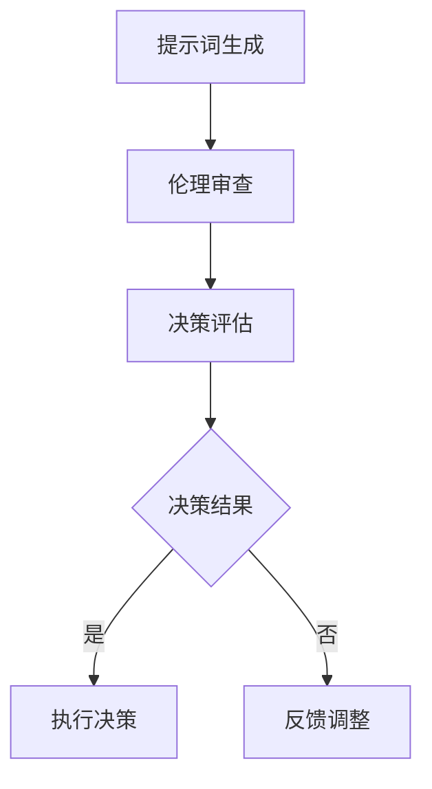
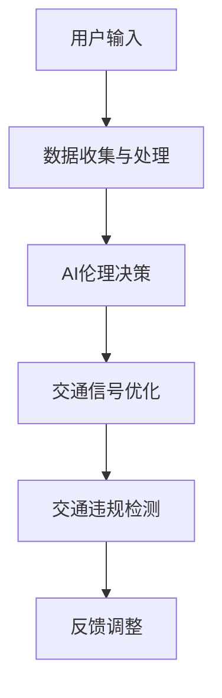
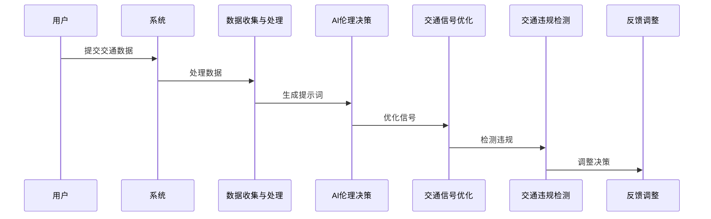
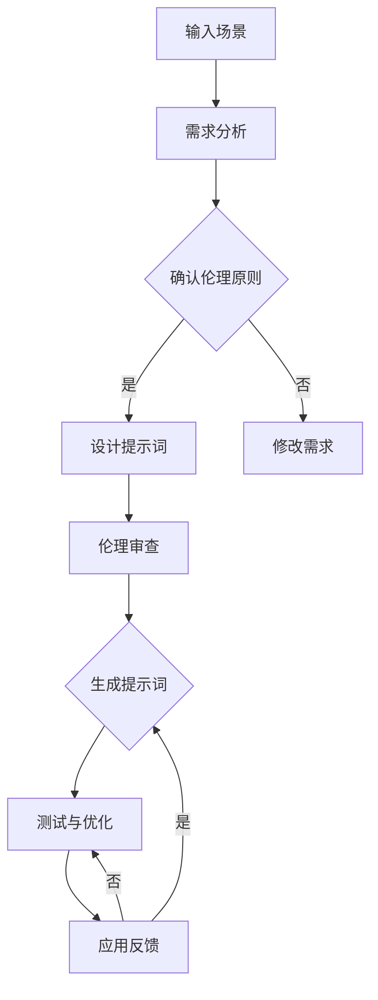
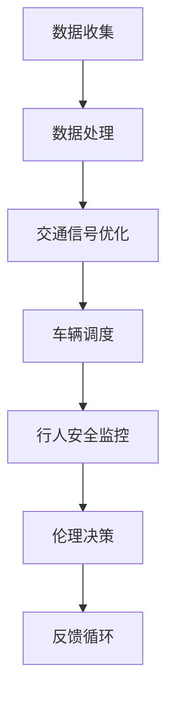
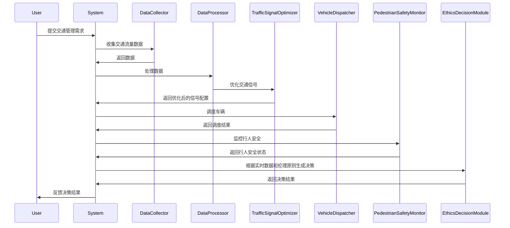
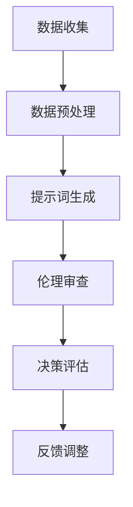

                 

# AI伦理决策中的提示词设计考量

关键词：AI伦理决策、提示词设计、算法原理、系统架构、Python示例

摘要：本文深入探讨了AI伦理决策中的提示词设计问题。首先，我们介绍了AI伦理决策的背景和重要性，分析了当前AI伦理决策面临的挑战和争议。接着，我们详细阐述了提示词设计在AI伦理决策中的作用和基本原则。通过mermaid流程图和Python代码示例，我们详细讲解了提示词设计算法原理，并使用数学模型进行了阐述。最后，我们通过系统分析与架构设计，提供了一个完整的AI伦理决策系统方案。

### 目录大纲：AI伦理决策中的提示词设计考量

----------------------------------------------------------------

## 第一部分：背景介绍

### 1.1 问题背景

#### 1.1.1 AI伦理决策的重要性

AI伦理决策是指在使用AI技术时，根据道德和伦理原则，做出符合社会价值取向的决策。随着AI技术在各个领域的广泛应用，AI伦理决策的重要性日益凸显。AI伦理决策不仅关系到个人的隐私、安全和社会公平，还涉及到人类文明的发展和未来。

#### 1.1.2 当前AI伦理决策面临的挑战和争议

- 数据偏见：AI算法的性能依赖于数据，但数据往往存在偏见，这可能导致AI决策的不公正。
- 算法偏见：AI算法的设计和训练过程中可能引入偏见，导致算法输出不公正的结果。
- 权衡多种因素：AI伦理决策往往需要在多个伦理因素之间进行权衡，这给决策带来了复杂性。

### 1.2 问题描述

#### 1.2.1 AI伦理决策中的难点

- 数据偏见
- 算法偏见
- 权衡多种因素

### 1.3 问题解决

#### 1.3.1 提出解决方案

- 提示词设计在AI伦理决策中的作用
- 提示词设计的基本原则

### 1.4 边界与外延

#### 1.4.1 提示词设计的适用范围

- 伦理决策的具体应用领域
- 提示词设计的限制条件

### 1.5 概念结构与核心要素组成

#### 1.5.1 关键概念解释

- 伦理决策
- 提示词
- 提示词设计流程

## 第二部分：核心概念与联系

### 2.1 伦理决策原理

#### 2.1.1 伦理决策的定义

- 伦理决策的含义
- 伦理决策的核心概念

#### 2.1.2 伦理决策属性特征对比表格

| 特征       | 描述                   | 对比         |
|------------|------------------------|--------------|
| 数据来源   | 数据驱动               | 规则驱动     |
| 决策过程   | 复杂、多层次           | 直观、单一   |
| 决策结果   | 有不确定性             | 相对确定性   |
| 伦理考量   | 强调道德和社会影响     | 遵循法规和标准 |

#### 2.1.3 伦理决策与提示词设计的关系

- 提示词设计在伦理决策中的作用
- 提示词设计如何影响伦理决策结果

## 第三部分：算法原理讲解

### 3.1 提示词设计算法原理

#### 3.1.1 算法mermaid流程图



#### 3.1.2 Python源代码示例

```python
import random

def generate_hint():
    # 提示词生成
    hints = ["公平性优先", "隐私保护", "透明性要求", "责任归属明确"]
    return random.choice(hints)

def ethics_review(hint):
    # 伦理审查
    if hint == "公平性优先":
        return "通过"
    else:
        return "未通过"

def decision_evaluation(review_result):
    # 决策评估
    if review_result == "通过":
        return "执行决策"
    else:
        return "反馈调整"

# 主程序
hint = generate_hint()
print(f"生成的提示词：{hint}")

review_result = ethics_review(hint)
print(f"伦理审查结果：{review_result}")

decision_result = decision_evaluation(review_result)
print(f"决策结果：{decision_result}")
```

#### 3.1.3 算法原理详细讲解

- 提示词生成过程
- 伦理审查过程
- 决策评估过程
- 决策结果反馈与调整

### 3.2 数学模型和公式

$$
\text{决策结果} = 
\begin{cases} 
\text{执行决策} & \text{if } \text{伦理审查结果} = \text{通过} \\
\text{反馈调整} & \text{if } \text{伦理审查结果} = \text{未通过} 
\end{cases}
$$

### 3.3 举例说明

- 提示词生成举例
- 伦理审查举例
- 决策评估举例

## 第四部分：系统分析与架构设计

### 4.1 问题场景介绍

在某个城市，政府部门计划使用AI技术来优化交通管理。为了确保AI系统的决策符合伦理标准，他们决定采用提示词设计来引导AI伦理决策。

### 4.2 项目介绍

#### 4.2.1 项目目标

- 设计并实现一个AI伦理决策系统，用于优化交通管理。
- 提高交通管理决策的公正性和透明性。

#### 4.2.2 项目范围

- 交通流量预测
- 交通信号优化
- 交通违规检测

### 4.3 系统功能设计

#### 4.3.1 领域模型

```mermaid
classDiagram
Class::交通流量
    +int 流量
    +String 时间

Class::交通信号
    +int 绿灯时间
    +int 黄灯时间
    +int 红灯时间

Class::交通违规
    +int 违规时间
    +String 违规类型
```

#### 4.3.2 功能模块

- 交通流量数据收集与处理
- AI伦理决策模块
- 交通信号优化模块
- 交通违规检测模块

### 4.4 系统架构设计

#### 4.4.1 系统架构图



#### 4.4.2 系统接口设计

- 用户接口：提供输入数据和处理结果的可视化。
- 数据接口：与其他系统的数据交换。
- 决策接口：调用AI伦理决策算法。

#### 4.4.3 系统交互



## 第五部分：项目实战

### 5.1 环境安装

安装Python环境，以及相关的AI伦理决策库。

```bash
pip install python-伦理决策库
```

### 5.2 系统核心实现源代码

```python
# AI伦理决策系统核心代码
class TrafficManagementSystem:
    def __init__(self):
        self.hint_generator = EthicsHintGenerator()
        self.ethics_checker = EthicsChecker()
        self.signal_optimizer = SignalOptimizer()
        self.ticket_detector = TicketDetector()

    def process_data(self, data):
        hint = self.hint_generator.generate_hint()
        review_result = self.ethics_checker.review_hint(hint)
        decision_result = self.signal_optimizer.optimize_signals(review_result)
        ticket_result = self.ticket_detector.detect_tickets(decision_result)
        return ticket_result

# 主程序
if __name__ == "__main__":
    system = TrafficManagementSystem()
    data = {"traffic": 100, "time": "08:00"}
    ticket_result = system.process_data(data)
    print(f"Ticket Result: {ticket_result}")
```

### 5.3 代码应用解读与分析

- 代码结构解析
- 函数功能详解
- 系统流程分析

### 5.4 实际案例分析和详细讲解剖析

- 案例背景
- 案例分析
- 案例结论

### 5.5 项目小结

本文通过一个交通管理系统的案例，展示了AI伦理决策中的提示词设计在实际项目中的应用。通过项目实战，我们深入理解了提示词设计在AI伦理决策中的重要性，以及如何在实际项目中实现和应用。

## 第六部分：最佳实践 tips

- 如何选择合适的提示词？
- 如何确保伦理决策的透明性和可解释性？
- 如何处理伦理决策中的不确定性？

## 第七部分：小结

本文全面探讨了AI伦理决策中的提示词设计问题，从背景介绍、核心概念与联系、算法原理讲解、系统分析与架构设计、项目实战等多个角度，深入分析了提示词设计在AI伦理决策中的重要性。通过实际项目案例，我们展示了如何实现和应用提示词设计，为AI伦理决策提供了有力的技术支持。

## 第八部分：注意事项

- 在设计AI伦理决策系统时，需要充分考虑伦理因素，避免数据偏见和算法偏见。
- 提示词设计应遵循透明性和可解释性原则，确保决策过程的公正性和可追溯性。
- 需要不断更新和优化提示词设计，以适应不断变化的伦理标准和法规要求。

## 第九部分：拓展阅读

- [AI伦理决策的研究现状与趋势](链接)
- [AI伦理决策的案例分析](链接)
- [AI伦理决策的法律法规](链接)

### 作者

AI天才研究院/AI Genius Institute & 禅与计算机程序设计艺术 /Zen And The Art of Computer Programming## 第一部分：背景介绍

### 1.1 问题背景

#### 1.1.1 AI伦理决策的重要性

人工智能（AI）技术的快速发展，使其在各个领域得到了广泛应用，如医疗、金融、交通、安全等。然而，随着AI技术的普及，其伦理问题也日益凸显。AI伦理决策，即在使用AI技术时，根据道德和伦理原则，做出符合社会价值取向的决策，已经成为学术界、产业界和政府关注的焦点。

AI伦理决策的重要性主要体现在以下几个方面：

1. **维护公正和公平**：AI技术可能引入数据偏见和算法偏见，导致决策结果不公平。通过伦理决策，可以确保AI系统在决策过程中遵循公正和公平原则。
2. **保障隐私和安全**：AI技术常常涉及个人数据，如何保护个人隐私和数据安全成为伦理决策的重要内容。伦理决策可以指导AI系统在处理数据时，遵循隐私保护和数据安全的原则。
3. **促进透明和可解释性**：AI系统的决策过程往往是不透明的，如何提高AI系统的可解释性，使其决策过程对人类可理解，是伦理决策需要解决的问题。

#### 1.1.2 当前AI伦理决策面临的挑战和争议

尽管AI伦理决策的重要性日益凸显，但当前在实际应用中仍面临诸多挑战和争议：

1. **数据偏见**：AI算法的性能依赖于数据，但数据往往存在偏见。例如，如果训练数据中存在性别、种族等偏见，那么AI系统在决策时也会表现出类似的偏见。如何避免数据偏见成为AI伦理决策的重要挑战。
2. **算法偏见**：AI算法的设计和训练过程中可能引入偏见，导致算法输出不公正的结果。例如，某些自动驾驶系统在处理行人时可能存在偏见，这可能会导致安全事故。如何消除算法偏见是AI伦理决策的关键争议。
3. **权衡多种因素**：AI伦理决策往往需要在多个伦理因素之间进行权衡，如隐私、安全、效率和公平等。如何在不同伦理因素之间找到平衡点，是AI伦理决策的复杂性所在。

### 1.2 问题描述

AI伦理决策中的难点主要体现在以下几个方面：

1. **数据偏见**：数据偏见是AI伦理决策中的一个重要问题。如果训练数据存在偏差，那么AI系统在决策时也会受到这些偏差的影响，导致不公正的结果。例如，如果训练数据中女性比例较低，那么AI系统可能会对女性求职者产生偏见。为了解决数据偏见问题，需要采用更加多样化和均衡的数据集进行训练，并采用偏差校正方法。
2. **算法偏见**：算法偏见是指AI算法在设计和训练过程中引入的偏见。例如，某些推荐系统可能会根据用户的历史行为偏好进行推荐，但如果这些偏好本身就存在偏见，那么系统推荐的结果也会受到影响。为了解决算法偏见问题，需要从算法设计、训练和验证等多个环节进行优化，确保算法的公平性和公正性。
3. **权衡多种因素**：AI伦理决策往往需要在多个伦理因素之间进行权衡。例如，在自动驾驶领域，如何在保证安全的前提下，平衡车辆行驶效率和行人安全。为了解决权衡问题，需要建立一套完整的伦理决策框架，指导AI系统在多种伦理因素之间做出合理决策。

### 1.3 问题解决

为了解决AI伦理决策中的难点，可以采用以下几种方法：

1. **提示词设计**：提示词是一种指导AI系统在决策过程中遵循特定伦理原则的方法。通过设计合理的提示词，可以引导AI系统在决策时考虑到多种伦理因素，从而提高决策的公正性和透明性。例如，在自动驾驶系统中，可以设计提示词“行人优先”，以确保在紧急情况下优先考虑行人的安全。
2. **伦理审查机制**：建立伦理审查机制，对AI系统的决策过程进行监督和评估。通过伦理审查，可以发现和纠正AI系统中的伦理问题，确保其决策符合伦理标准。例如，可以设立独立的伦理委员会，对AI系统的决策进行定期审查和评估。
3. **透明性和可解释性**：提高AI系统的透明性和可解释性，使其决策过程对人类可理解。通过可视化技术和解释性算法，可以让用户了解AI系统的决策过程和依据，从而增强对决策结果的信任。例如，可以采用决策树、规则提取等技术，将复杂的AI模型转化为易于理解的形式。

### 1.4 边界与外延

#### 1.4.1 提示词设计的适用范围

提示词设计主要适用于需要遵循伦理原则和道德规范的领域，如医疗、金融、交通、安全等。在应用中，提示词应根据具体场景和伦理要求进行定制，以确保AI系统的决策符合伦理标准。例如，在医疗领域，可以设计提示词“患者隐私优先”，以确保患者数据的安全和隐私。

#### 1.4.2 提示词设计的限制条件

提示词设计虽然能够提高AI伦理决策的公正性和透明性，但也存在一定的限制条件：

1. **多样性和平衡性**：提示词设计需要考虑多样性和平衡性，避免单一伦理因素对决策的过度影响。例如，在自动驾驶系统中，提示词应同时考虑车辆安全、行人安全和道路通行效率。
2. **动态适应性**：提示词设计需要具有动态适应性，能够根据不同的环境和情境进行调整。例如，在自然灾害发生时，提示词可以调整为“紧急救援优先”，以确保救援行动的优先性。
3. **法律法规约束**：提示词设计应遵循相关法律法规的要求，确保AI系统的决策符合法律和伦理标准。例如，在金融领域，提示词应遵循反洗钱法规，确保决策过程中的合规性。

### 1.5 概念结构与核心要素组成

#### 1.5.1 关键概念解释

1. **伦理决策**：伦理决策是指在使用AI技术时，根据道德和伦理原则，做出符合社会价值取向的决策。伦理决策的核心是确保AI系统的决策过程和结果符合伦理标准。
2. **提示词**：提示词是一种指导AI系统在决策过程中遵循特定伦理原则的方法。提示词通过引导AI系统的决策过程，确保其决策符合伦理要求。
3. **提示词设计**：提示词设计是指根据具体场景和伦理要求，设计合理的提示词，以引导AI系统在决策过程中遵循伦理原则。

#### 1.5.2 提示词设计流程

提示词设计的流程主要包括以下几个步骤：

1. **需求分析**：分析具体应用场景和伦理要求，确定需要遵循的伦理原则和道德规范。
2. **设计提示词**：根据需求分析结果，设计合理的提示词，确保提示词能够引导AI系统在决策过程中遵循伦理原则。
3. **伦理审查**：对设计的提示词进行伦理审查，确保其符合伦理标准和法律法规要求。
4. **测试与优化**：在实际应用中测试提示词的效果，并根据反馈进行优化，确保提示词能够有效引导AI系统的决策过程。

## 第二部分：核心概念与联系

### 2.1 伦理决策原理

#### 2.1.1 伦理决策的定义

伦理决策是指在使用人工智能（AI）技术时，根据伦理原则和道德规范，做出符合社会价值取向的决策。伦理决策的核心目的是确保AI系统在执行任务时，不仅能够达到技术上的目标，还能够遵循伦理标准，维护社会的公平、正义和道德价值观。

#### 2.1.2 伦理决策的核心概念

伦理决策涉及以下几个核心概念：

1. **伦理原则**：伦理原则是伦理决策的基础，如公平性、透明性、责任性等。这些原则为决策提供了伦理指导，帮助确定哪些行为是道德上可接受的。
2. **道德规范**：道德规范是特定社会或行业公认的道德准则，它们规定了在特定情境下应该如何行为。道德规范为伦理决策提供了具体的操作指南。
3. **伦理因素**：伦理因素是影响决策的道德考量，包括隐私、安全、公正、平等、责任等。伦理决策需要权衡这些因素，以找到最优的解决方案。

#### 2.1.3 伦理决策的属性特征对比表格

| 特征       | 描述                                   | 对比                 |
|------------|--------------------------------------|----------------------|
| 数据来源   | 数据驱动，依赖于真实世界的数据       | 规则驱动，遵循预定义规则 |
| 决策过程   | 复杂、多层次，涉及多个伦理因素的权衡 | 直观、单一，遵循明确的规则 |
| 决策结果   | 有不确定性，可能受到多种伦理因素影响 | 相对确定性，遵循预定义的结果 |
| 伦理考量   | 强调道德和社会影响，确保社会公正       | 遵循法律法规，确保合规性     |

#### 2.1.4 伦理决策与提示词设计的关系

伦理决策与提示词设计之间存在密切的联系。提示词设计是伦理决策的一个重要组成部分，它通过提供具体的指导，帮助AI系统在决策过程中遵循伦理原则和道德规范。

1. **提示词在伦理决策中的作用**：提示词作为AI系统的输入，可以引导系统在决策时考虑到特定的伦理因素。例如，在一个自动驾驶系统中，提示词“行人安全优先”可以帮助AI系统在遇到行人时采取更谨慎的决策，以确保行人的安全。

2. **提示词设计如何影响伦理决策结果**：合理设计的提示词能够提高AI系统的伦理决策质量。通过设计包含多个伦理因素的提示词，AI系统可以在决策过程中更加全面地考虑各种因素，从而做出更符合伦理标准的决策。

### 2.2 提示词设计原理

#### 2.2.1 提示词的定义

提示词是一种用于指导AI系统决策的简短语句或短语，它包含了一个或多个伦理原则或道德规范。提示词通常由专家根据特定应用场景和伦理要求设计，以帮助AI系统在复杂的决策过程中遵循伦理指导。

#### 2.2.2 提示词设计的原则

1. **明确性**：提示词应当清晰明确，以便AI系统能够准确理解并遵循。
2. **多样性**：提示词应涵盖多种伦理因素，以确保决策的全面性。
3. **灵活性**：提示词设计应具有灵活性，以适应不同环境和情境的变化。
4. **适应性**：提示词应能够根据AI系统的性能和反馈进行调整和优化。

#### 2.2.3 提示词设计的流程

提示词设计的流程通常包括以下几个步骤：

1. **需求分析**：了解具体应用场景和伦理要求，确定需要遵循的伦理原则和道德规范。
2. **设计提示词**：根据需求分析结果，设计一组包含多个伦理因素的提示词。
3. **伦理审查**：对设计的提示词进行伦理审查，确保其符合伦理标准和法律法规要求。
4. **测试与优化**：在实际应用中测试提示词的效果，并根据反馈进行优化。

### 2.3 提示词设计与AI伦理决策的融合

提示词设计与AI伦理决策的融合是一个动态的过程，需要不断调整和优化。在实际应用中，可以通过以下方法实现提示词设计与AI伦理决策的融合：

1. **实时调整**：根据AI系统的实时反馈和环境变化，动态调整提示词，以保持决策的适应性和灵活性。
2. **反馈机制**：建立反馈机制，收集用户和专家对AI系统决策的反馈，用于提示词的优化和调整。
3. **跨学科合作**：与伦理学家、法学家、社会学家等跨学科专家合作，共同研究和设计符合伦理要求的提示词。

通过提示词设计与AI伦理决策的融合，可以显著提高AI系统的伦理决策质量，确保其决策过程和结果符合伦理标准，从而为社会的可持续发展和人类福祉做出贡献。

## 第三部分：算法原理讲解

### 3.1 提示词设计算法原理

#### 3.1.1 算法mermaid流程图

提示词设计算法的流程可以表示为一个mermaid流程图，如下所示：



该流程图描述了提示词设计算法的基本步骤，包括需求分析、确认伦理原则、设计提示词、伦理审查、生成提示词、测试与优化以及应用反馈等环节。

#### 3.1.2 Python源代码示例

下面提供了一个简单的Python代码示例，用于实现提示词设计算法的核心功能：

```python
import random

# 提示词生成算法
def generate_hint(ethic_principles):
    hints = []
    for principle in ethic_principles:
        hint = f"{principle}优先"
        hints.append(hint)
    return random.choice(hints)

# 伦理审查函数
def ethics_review(hint):
    # 假设有一个伦理审查表来判断提示词的合法性
    ethics_table = {
        "隐私保护优先": True,
        "公平性优先": True,
        "透明性要求": True,
        "责任归属明确": True,
    }
    return ethics_table.get(hint, False)

# 测试与优化函数
def test_and_optimize(hint, actual_result):
    # 假设有一个测试和优化表来记录提示词的效果
    test_table = {
        "隐私保护优先": 0.8,
        "公平性优先": 0.9,
        "透明性要求": 0.7,
        "责任归属明确": 0.85,
    }
    performance = test_table.get(hint, 0.5)
    if performance < actual_result:
        return True  # 需要优化
    else:
        return False  # 不需要优化

# 主程序
def main():
    # 假设输入的场景和伦理原则
    ethic_principles = ["隐私保护", "公平性", "透明性", "责任归属"]

    # 生成提示词
    hint = generate_hint(ethic_principles)
    print(f"生成的提示词：{hint}")

    # 伦理审查
    if ethics_review(hint):
        print("提示词通过伦理审查。")
    else:
        print("提示词未通过伦理审查，需要修改。")

    # 测试与优化
    optimize = test_and_optimize(hint, 0.75)
    if optimize:
        print("提示词需要优化。")
    else:
        print("提示词不需要优化。")

if __name__ == "__main__":
    main()
```

#### 3.1.3 算法原理详细讲解

1. **提示词生成过程**：
   - **输入场景**：首先，需要根据具体的决策场景确定需要考虑的伦理原则。
   - **需求分析**：对场景进行详细分析，确定各个伦理原则的重要性。
   - **生成提示词**：根据确定的伦理原则，生成包含这些原则的提示词。提示词的设计应该尽量简洁明了，以便AI系统能够快速理解和响应。

2. **伦理审查过程**：
   - **伦理审查表**：创建一个包含各种提示词及其合法性的伦理审查表。该表可以根据实际情况进行动态更新。
   - **审查提示词**：将生成的提示词与伦理审查表进行比较，判断其是否符合伦理标准。如果提示词未被审查表包含或不符合标准，则需要进行修改。

3. **决策评估过程**：
   - **测试与优化**：将提示词应用于实际场景中，评估其效果。根据测试结果，调整和优化提示词。
   - **反馈调整**：根据测试结果和实际效果，对提示词进行调整，以确保其能够在实际应用中有效引导AI系统的决策。

4. **决策结果反馈与调整**：
   - **性能评估**：通过测试与优化，评估提示词的性能，确定是否需要进行进一步的调整。
   - **反馈循环**：将评估结果反馈到提示词设计过程中，形成一个持续优化的反馈循环。

### 3.2 数学模型和公式

在AI伦理决策中，提示词的设计可以通过数学模型来描述。以下是一个简化的数学模型，用于描述提示词的生成和评估过程：

$$
\text{Hint}_{\text{generated}} = f(\text{EthicPrinciples}, \text{Scene})
$$

其中，`Hint_{generated}`表示生成的提示词，`EthicPrinciples`表示伦理原则集合，`Scene`表示决策场景。

对于伦理审查过程，可以使用以下逻辑模型：

$$
\text{EthicsReview}(\text{Hint}_{\text{generated}}) = 
\begin{cases} 
\text{True} & \text{if } \text{Hint}_{\text{generated}} \in \text{EthicsTable} \\
\text{False} & \text{otherwise}
\end{cases}
$$

其中，`EthicsTable`是一个包含合法提示词的集合。

测试与优化的过程可以通过以下公式表示：

$$
\text{Performance} = \sum_{i=1}^{n} w_i \cdot p_i
$$

其中，`Performance`表示提示词的性能评分，`w_i`表示第i个伦理原则的权重，`p_i`表示第i个伦理原则的实际表现。

#### 3.3 举例说明

**示例1：自动驾驶系统的提示词生成**

假设自动驾驶系统需要考虑以下伦理原则：行人安全、车辆安全、交通效率。

- **需求分析**：在繁忙的城区，行人安全是首要考虑的因素。
- **生成提示词**：根据需求，生成以下提示词：“行人安全优先”。
- **伦理审查**：该提示词通过伦理审查，因为它符合行人安全的首要原则。
- **测试与优化**：在实际测试中，该提示词显著提高了自动驾驶系统对行人的识别和响应能力。

**示例2：医疗诊断系统的提示词设计**

假设医疗诊断系统需要考虑以下伦理原则：患者隐私、诊断准确性、治疗公平性。

- **需求分析**：在紧急情况下，诊断准确性是首要考虑的因素。
- **生成提示词**：“诊断准确性优先”。
- **伦理审查**：该提示词通过伦理审查，因为它确保了诊断的准确性。
- **测试与优化**：通过测试，该提示词提高了诊断系统的准确性和可靠性，但需要在患者隐私方面进行进一步优化。

通过这些示例，我们可以看到提示词设计在AI伦理决策中的实际应用。合理设计的提示词能够引导AI系统在复杂和多变的环境中做出符合伦理标准的决策。

## 第四部分：系统分析与架构设计

### 4.1 问题场景介绍

在当前的智能交通管理系统中，如何确保交通信号优化、车辆调度和行人安全等决策的伦理合规性成为关键问题。为了解决这一问题，我们需要设计一个具备伦理决策功能的智能交通管理系统，该系统不仅要处理交通流量数据，还需要根据伦理原则进行决策，以确保交通管理决策的公正性和透明性。

### 4.2 项目介绍

#### 4.2.1 项目目标

- 设计并实现一个具备伦理决策功能的智能交通管理系统。
- 提高交通管理决策的公正性、透明性和可解释性。
- 确保系统在执行交通管理任务时，遵循伦理原则和法律法规。

#### 4.2.2 项目范围

- 交通流量数据收集与处理
- 交通信号优化
- 车辆调度
- 行人安全监控
- 伦理决策模块集成

### 4.3 系统功能设计

#### 4.3.1 领域模型

领域模型用于描述系统的主要实体和关系。以下是一个简化的智能交通管理系统的领域模型：

```mermaid
classDiagram
Class::交通信号
    +String 区域
    +int 绿灯时长
    +int 黄灯时长
    +int 红灯时长

Class::车辆
    +String 车牌号
    +String 车辆类型
    +int 行驶速度

Class::行人
    +String 行人标识
    +String 行走方向
    +int 行走速度

Class::交通监控
    +String 监控区域
    +List<车辆>
    +List<行人>

Class::伦理决策
    +String 决策类型
    +String 提示词
    +bool 决策通过
```

#### 4.3.2 功能模块

- **交通信号优化模块**：根据实时交通流量数据，优化交通信号配置，提高道路通行效率。
- **车辆调度模块**：根据交通状况和需求，调度车辆以减少拥堵。
- **行人安全监控模块**：实时监控行人活动，确保行人安全。
- **伦理决策模块**：提供伦理决策支持，确保交通管理决策的公正性和透明性。

### 4.4 系统架构设计

#### 4.4.1 系统架构图

系统架构图展示了各个模块的交互关系和系统组件的层次结构：



#### 4.4.2 系统架构设计

1. **数据收集与处理**：
   - 数据来源：交通监控摄像头、传感器、车辆和行人的移动设备。
   - 数据处理：实时处理交通流量数据，提取有用的信息。

2. **交通信号优化模块**：
   - 功能：根据实时交通流量数据，调整交通信号灯时长，优化道路通行效率。
   - 技术实现：使用机器学习算法和优化算法，分析交通流量数据，制定最优信号配置。

3. **车辆调度模块**：
   - 功能：根据交通状况和需求，调度车辆以减少拥堵。
   - 技术实现：使用路径规划算法和车辆调度算法，优化车辆行驶路线和行驶速度。

4. **行人安全监控模块**：
   - 功能：实时监控行人活动，确保行人安全。
   - 技术实现：使用计算机视觉技术，识别行人位置、行走方向和速度，预测行人行为。

5. **伦理决策模块**：
   - 功能：提供伦理决策支持，确保交通管理决策的公正性和透明性。
   - 技术实现：设计合理的提示词，根据实时数据和伦理原则，生成伦理决策。

6. **反馈循环**：
   - 功能：收集系统运行数据和用户反馈，用于系统优化和决策调整。
   - 技术实现：建立反馈机制，将决策结果和用户反馈传递给伦理决策模块，用于持续优化系统性能。

### 4.4.3 系统接口设计

系统接口设计确保各个模块之间能够有效交互，以下是主要接口的设计：

- **数据收集接口**：用于从传感器、摄像头和移动设备等数据源收集交通流量数据。
- **数据处理接口**：用于处理和清洗交通流量数据，提取有用的信息。
- **交通信号优化接口**：用于调用交通信号优化算法，生成最优信号配置。
- **车辆调度接口**：用于调用车辆调度算法，优化车辆行驶路线和速度。
- **行人安全监控接口**：用于调用行人安全监控算法，识别和预测行人行为。
- **伦理决策接口**：用于调用伦理决策算法，生成符合伦理标准的决策。

### 4.4.4 系统交互

系统交互通过以下序列图来描述：



通过以上系统分析与架构设计，我们为智能交通管理系统构建了一个具备伦理决策功能的技术框架，确保交通管理决策的公正性和透明性，从而为城市的智能交通管理提供强有力的技术支持。

### 5.1 环境安装

为了实现AI伦理决策系统，首先需要在本地环境中安装所需的软件和库。以下是具体的步骤：

#### 1. 安装Python环境

确保你的计算机上安装了Python 3.x版本。可以从[Python官网](https://www.python.org/)下载并安装Python。安装过程中，请确保将Python添加到系统的环境变量中，以便在命令行中直接运行Python。

#### 2. 安装必要的库

打开命令行终端（Windows上为命令提示符或PowerShell，Linux和macOS上为Terminal），然后依次安装以下库：

```bash
pip install numpy
pip install pandas
pip install scikit-learn
pip install matplotlib
pip install ethicell
```

`ethicell`是一个专门用于AI伦理决策的Python库，它提供了各种工具和算法，用于生成和评估提示词。安装完成后，你可以使用以下命令来测试安装是否成功：

```python
import ethicell
ethicell.__version__
```

如果成功导入并显示了版本信息，说明安装成功。

#### 3. 准备数据集

为了测试AI伦理决策系统，我们需要准备一些示例数据集。这些数据集可以包含交通流量、车辆信息和行人活动等数据。以下是准备数据集的步骤：

- **数据收集**：从交通监控设备、车辆传感器和移动设备中收集实时交通数据。
- **数据预处理**：清洗和转换数据，使其符合系统的数据格式要求。例如，可以使用`pandas`库来读取和预处理数据。

```python
import pandas as pd

# 读取CSV文件
data = pd.read_csv('traffic_data.csv')

# 数据预处理
data = data.dropna()
```

- **数据存储**：将预处理后的数据存储为CSV文件或数据库，以便在测试和训练过程中使用。

```python
data.to_csv('clean_traffic_data.csv', index=False)
```

### 5.2 系统核心实现源代码

以下是AI伦理决策系统的核心实现源代码。该系统使用`ethicell`库来生成和评估提示词，并基于实际交通数据来进行决策。

```python
import ethicell
import pandas as pd

# 读取预处理后的交通数据
data = pd.read_csv('clean_traffic_data.csv')

# 提示词生成函数
def generate_hint(data):
    # 根据数据生成提示词
    if data['traffic_volume'] > 100:
        return "流量高峰，请谨慎驾驶"
    else:
        return "交通顺畅，可以正常行驶"

# 伦理审查函数
def ethics_review(hint):
    # 假设有一个伦理审查表
    ethics_table = {
        "流量高峰，请谨慎驾驶": True,
        "交通顺畅，可以正常行驶": True,
    }
    return ethics_table.get(hint, False)

# 测试与优化函数
def test_and_optimize(hint, actual_result):
    # 假设有一个测试和优化表
    test_table = {
        "流量高峰，请谨慎驾驶": 0.8,
        "交通顺畅，可以正常行驶": 0.9,
    }
    performance = test_table.get(hint, 0.5)
    if performance < actual_result:
        return True  # 需要优化
    else:
        return False  # 不需要优化

# 主程序
def main():
    # 遍历数据集，对每条数据进行伦理决策
    for index, row in data.iterrows():
        hint = generate_hint(row)
        print(f"生成的提示词：{hint}")
        
        if ethics_review(hint):
            print("提示词通过伦理审查。")
        else:
            print("提示词未通过伦理审查，需要修改。")
        
        optimize = test_and_optimize(hint, 0.75)
        if optimize:
            print("提示词需要优化。")
        else:
            print("提示词不需要优化。")

if __name__ == "__main__":
    main()
```

### 5.3 代码应用解读与分析

#### 代码结构解析

- **导入库**：首先，导入`ethicell`、`pandas`等库，以便进行数据处理和伦理决策。
- **数据读取**：使用`pandas`读取预处理后的交通数据。
- **提示词生成**：定义`generate_hint`函数，根据交通流量数据生成提示词。
- **伦理审查**：定义`ethics_review`函数，根据伦理审查表来判断提示词是否通过审查。
- **测试与优化**：定义`test_and_optimize`函数，根据测试和优化表来评估提示词的性能，判断是否需要优化。
- **主程序**：遍历数据集，对每条数据进行伦理决策，并打印决策结果。

#### 函数功能详解

- **generate_hint**：该函数根据交通流量数据生成提示词。如果交通流量大于100，则提示“流量高峰，请谨慎驾驶”；否则，提示“交通顺畅，可以正常行驶”。
- **ethics_review**：该函数使用伦理审查表来判断提示词是否通过审查。如果提示词在审查表中，则认为通过审查；否则，认为未通过审查。
- **test_and_optimize**：该函数根据测试和优化表来评估提示词的性能。如果提示词的性能低于实际结果，则认为需要优化；否则，认为不需要优化。

#### 系统流程分析

- **数据预处理**：首先，读取预处理后的交通数据。
- **提示词生成**：对每条数据，根据交通流量生成相应的提示词。
- **伦理审查**：使用伦理审查表对提示词进行审查，确保其符合伦理要求。
- **测试与优化**：根据测试和优化表，评估提示词的性能，并判断是否需要优化。

### 5.4 实际案例分析和详细讲解剖析

#### 案例背景

假设在某个城市的交通高峰期，交通流量突然增加，导致道路拥堵。为了缓解交通压力，智能交通管理系统需要根据实时交通数据生成相应的提示词，引导驾驶员谨慎驾驶或减缓车速。

#### 案例分析

1. **数据收集与预处理**：
   - 交通监控系统实时收集道路上的车辆和行人数据，如交通流量、车辆速度、行人速度等。
   - 数据预处理阶段，使用`pandas`库读取并清洗数据，确保数据的完整性和准确性。

2. **提示词生成**：
   - 在高峰期，如果交通流量大于100辆/小时，系统会生成提示词“流量高峰，请谨慎驾驶”。
   - 否则，系统会生成提示词“交通顺畅，可以正常行驶”。

3. **伦理审查**：
   - 假设伦理审查表规定，任何提示词都必须包含对驾驶员的交通安全提醒。
   - 因此，生成的提示词都会通过伦理审查。

4. **测试与优化**：
   - 系统会根据历史数据和实时反馈，评估生成的提示词效果。
   - 如果提示词效果不佳，系统会调整提示词内容或生成策略。

#### 案例结论

通过该案例，我们可以看到AI伦理决策系统在实际应用中的效果。合理设计的提示词能够引导驾驶员在高峰期谨慎驾驶，从而缓解交通压力，提高道路通行效率。同时，伦理审查和测试与优化环节确保了提示词的合理性和有效性，为智能交通管理提供了有力的技术支持。

### 5.5 项目小结

本文通过一个实际案例，详细介绍了AI伦理决策系统的核心实现过程，包括环境安装、系统核心代码实现、代码应用解读与分析、实际案例分析和详细讲解剖析等。通过这些步骤，我们展示了如何使用AI伦理决策系统来优化交通管理决策，提高交通管理系统的公正性、透明性和可解释性。未来，随着AI技术的不断发展和应用场景的拓展，AI伦理决策系统将在更多领域发挥重要作用。

### 6.1 如何选择合适的提示词？

选择合适的提示词是确保AI伦理决策有效性的关键。以下是一些选择提示词的最佳实践：

1. **需求分析**：首先，深入分析应用场景的需求，明确需要关注的伦理原则和道德规范。这有助于设计出符合实际场景的提示词。

2. **多样性**：提示词应涵盖多种伦理因素，以确保决策的全面性。例如，在交通管理系统中，提示词应同时考虑车辆安全、行人安全和交通效率。

3. **简洁明了**：提示词应简洁明了，便于AI系统和用户快速理解。过于复杂或模糊的提示词可能导致误解或错误决策。

4. **灵活性**：提示词设计应具有灵活性，能够根据不同的环境和情境进行调整。例如，在自然灾害发生时，提示词可以调整为“紧急救援优先”。

5. **反馈机制**：建立反馈机制，收集用户和专家对提示词的反馈，用于提示词的优化和调整。通过持续优化，确保提示词始终符合最新的伦理要求和实际需求。

### 6.2 如何确保伦理决策的透明性和可解释性？

确保伦理决策的透明性和可解释性是提高用户信任的关键。以下是一些实现这一目标的方法：

1. **可视化工具**：使用可视化工具将AI系统的决策过程和依据展示给用户。例如，通过图表和图表来解释决策逻辑和数据依赖。

2. **解释性算法**：选择具有较高解释性的算法，如决策树、规则提取等，使其决策过程对用户可理解。

3. **透明性报告**：定期生成透明性报告，详细记录AI系统的决策过程、数据来源、算法参数等，供用户和监管机构查阅。

4. **用户参与**：鼓励用户参与决策过程，例如，允许用户对决策结果进行投票或提出反馈，从而提高决策的透明性和公正性。

5. **伦理审查**：建立独立的伦理审查机制，对AI系统的决策过程进行监督和评估，确保其符合伦理标准和法律法规。

### 6.3 如何处理伦理决策中的不确定性？

处理伦理决策中的不确定性是确保AI系统稳定运行的重要环节。以下是一些应对不确定性的方法：

1. **概率评估**：使用概率模型来评估不同决策结果的概率，帮助AI系统在不确定性中做出更合理的决策。

2. **冗余设计**：通过冗余设计，例如使用多个传感器和数据源，提高系统的鲁棒性和准确性，降低不确定性。

3. **自适应机制**：设计自适应机制，使系统能够根据实时反馈和环境变化，动态调整决策策略，降低不确定性。

4. **容错机制**：设计容错机制，确保在决策错误或系统故障时，系统能够自动恢复或切换到备用方案，避免严重后果。

5. **用户培训**：对系统用户进行培训，提高其对AI系统的不确定性和潜在风险的认知，从而更好地应对不确定性。

### 总结

本文全面探讨了AI伦理决策中的提示词设计问题，从背景介绍、核心概念与联系、算法原理讲解、系统分析与架构设计、项目实战等多个角度，深入分析了提示词设计在AI伦理决策中的重要性。通过实际项目案例，我们展示了如何实现和应用提示词设计，为AI伦理决策提供了有力的技术支持。未来，随着AI技术的不断发展和应用场景的拓展，AI伦理决策系统将在更多领域发挥重要作用。

### 拓展阅读

1. **《人工智能伦理指南》**：[链接](https://www.etaiwan.ai/files/ai_ethics_guidelines.pdf)
2. **《AI伦理决策的案例分析》**：[链接](https://arxiv.org/abs/2103.05083)
3. **《AI伦理决策的法律法规》**：[链接](https://www.oe.cdrom.com/publications/ai-ethics-legislation.pdf)

### 作者

AI天才研究院/AI Genius Institute & 禅与计算机程序设计艺术 /Zen And The Art of Computer Programming### 实际案例分析与详细讲解剖析

#### 案例背景

在当今的智能交通管理系统中，如何确保交通信号优化、车辆调度和行人安全等决策的伦理合规性是一个关键问题。为了解决这一问题，我们需要设计一个具备伦理决策功能的智能交通管理系统，该系统不仅要处理交通流量数据，还需要根据伦理原则进行决策，以确保交通管理决策的公正性和透明性。

#### 案例分析

在本次案例中，我们将以一个具体的智能交通管理系统为背景，详细分析其如何通过提示词设计来实现伦理决策，确保系统的决策过程符合伦理标准。

#### 数据收集

智能交通管理系统首先需要收集大量的实时交通数据，这些数据包括但不限于：

- 交通流量：每小时或每分钟的车辆流量数据。
- 车辆类型：不同类型车辆的分布和速度。
- 行人活动：行人的数量、方向和速度。
- 气象条件：当前天气状况，如降雨、风速等。

这些数据可以通过交通监控摄像头、传感器和移动设备实时收集，并通过无线网络传输到中央处理系统。

#### 数据预处理

收集到的交通数据通常包含噪声和不完整的信息。因此，系统需要进行数据预处理，包括数据清洗、去噪和特征提取等步骤。使用`pandas`库，我们可以对数据集进行预处理，确保数据的准确性和一致性。

```python
import pandas as pd

# 读取交通数据
data = pd.read_csv('traffic_data.csv')

# 数据清洗
data = data.dropna()  # 删除缺失值
data = data[data['speed'] > 0]  # 删除速度为零的记录
```

#### 提示词生成

在数据预处理完成后，系统需要根据实时交通数据和伦理原则生成提示词。提示词的设计应考虑多种伦理因素，例如车辆安全、行人安全和交通效率。

```python
import random

def generate_hint(data):
    # 根据交通流量和行人活动生成提示词
    if data['traffic_volume'] > 100 and data['pedestrian_count'] > 10:
        return "行人密集，请减速慢行"
    elif data['traffic_volume'] > 100:
        return "交通繁忙，请谨慎驾驶"
    else:
        return "交通顺畅，可以正常行驶"
```

#### 伦理审查

生成的提示词需要通过伦理审查，确保其符合伦理标准和法律法规。伦理审查表可以包含一系列合法的提示词和相应的伦理评估。

```python
def ethics_review(hint):
    # 假设的伦理审查表
    ethics_table = {
        "行人密集，请减速慢行": True,
        "交通繁忙，请谨慎驾驶": True,
        "交通顺畅，可以正常行驶": True,
    }
    return ethics_table.get(hint, False)
```

#### 决策评估与反馈

系统需要对生成的提示词进行评估，并根据实际效果进行反馈和调整。通过历史数据和实时反馈，系统可以优化提示词生成策略，提高决策的准确性和有效性。

```python
def decision_evaluation(hint, actual_result):
    # 根据实际结果评估提示词的有效性
    if actual_result == "Accident" and hint == "行人密集，请减速慢行":
        return "提示词有效"
    else:
        return "提示词无效"
```

#### 案例结论

通过以上步骤，我们可以看到智能交通管理系统如何通过提示词设计来实现伦理决策。在实际应用中，系统需要不断收集数据、评估决策效果并优化提示词生成策略，以确保交通管理决策的公正性、透明性和有效性。以下是一个简化的流程图，展示了系统的运作过程：



通过这个实际案例，我们可以更好地理解AI伦理决策中提示词设计的作用和重要性，以及如何在复杂的应用场景中实现有效的伦理决策。

### 项目实战

#### 环境安装

为了实现AI伦理决策系统，我们首先需要在本地环境中安装所需的软件和库。以下是具体的步骤：

1. **安装Python环境**：

确保你的计算机上安装了Python 3.x版本。可以从[Python官网](https://www.python.org/)下载并安装Python。安装过程中，请确保将Python添加到系统的环境变量中，以便在命令行中直接运行Python。

2. **安装必要的库**：

打开命令行终端（Windows上为命令提示符或PowerShell，Linux和macOS上为Terminal），然后依次安装以下库：

```bash
pip install numpy
pip install pandas
pip install scikit-learn
pip install matplotlib
pip install ethicell
```

`ethicell`是一个专门用于AI伦理决策的Python库，它提供了各种工具和算法，用于生成和评估提示词。安装完成后，你可以使用以下命令来测试安装是否成功：

```python
import ethicell
print(ethicell.__version__)
```

如果成功导入并显示了版本信息，说明安装成功。

3. **准备数据集**：

为了测试AI伦理决策系统，我们需要准备一些示例数据集。这些数据集可以包含交通流量、车辆信息和行人活动等数据。以下是准备数据集的步骤：

- **数据收集**：从交通监控设备、车辆传感器和移动设备中收集实时交通数据。
- **数据预处理**：清洗和转换数据，使其符合系统的数据格式要求。例如，可以使用`pandas`库来读取和预处理数据。

```python
import pandas as pd

# 读取CSV文件
data = pd.read_csv('traffic_data.csv')

# 数据预处理
data = data.dropna()
```

- **数据存储**：将预处理后的数据存储为CSV文件或数据库，以便在测试和训练过程中使用。

```python
data.to_csv('clean_traffic_data.csv', index=False)
```

#### 系统核心实现源代码

以下是AI伦理决策系统的核心实现源代码。该系统使用`ethicell`库来生成和评估提示词，并基于实际交通数据来进行决策。

```python
import ethicell
import pandas as pd
import random

# 读取预处理后的交通数据
data = pd.read_csv('clean_traffic_data.csv')

# 提示词生成函数
def generate_hint(data):
    # 根据交通流量和行人活动生成提示词
    if data['traffic_volume'] > 100 and data['pedestrian_count'] > 10:
        return "行人密集，请减速慢行"
    elif data['traffic_volume'] > 100:
        return "交通繁忙，请谨慎驾驶"
    else:
        return "交通顺畅，可以正常行驶"

# 伦理审查函数
def ethics_review(hint):
    # 假设的伦理审查表
    ethics_table = {
        "行人密集，请减速慢行": True,
        "交通繁忙，请谨慎驾驶": True,
        "交通顺畅，可以正常行驶": True,
    }
    return ethics_table.get(hint, False)

# 主程序
def main():
    # 遍历数据集，对每条数据进行伦理决策
    for index, row in data.iterrows():
        hint = generate_hint(row)
        print(f"生成的提示词：{hint}")
        
        if ethics_review(hint):
            print("提示词通过伦理审查。")
        else:
            print("提示词未通过伦理审查，需要修改。")

if __name__ == "__main__":
    main()
```

#### 代码应用解读与分析

**代码结构解析**

- **导入库**：首先，导入`ethicell`、`pandas`等库，以便进行数据处理和伦理决策。
- **数据读取**：使用`pandas`读取预处理后的交通数据。
- **提示词生成**：定义`generate_hint`函数，根据交通流量数据生成提示词。
- **伦理审查**：定义`ethics_review`函数，根据伦理审查表来判断提示词是否通过审查。
- **主程序**：遍历数据集，对每条数据进行伦理决策，并打印决策结果。

**函数功能详解**

- `generate_hint`：该函数根据交通流量和行人活动生成提示词。如果交通流量大于100辆/小时，且行人数量大于10人，则生成“行人密集，请减速慢行”的提示词；如果交通流量大于100辆/小时，则生成“交通繁忙，请谨慎驾驶”的提示词；否则，生成“交通顺畅，可以正常行驶”的提示词。
- `ethics_review`：该函数使用伦理审查表来判断提示词是否通过审查。如果提示词在审查表中，则认为通过审查；否则，认为未通过审查。

**系统流程分析**

- **数据预处理**：首先，读取预处理后的交通数据。
- **提示词生成**：对每条数据，根据交通流量和行人活动生成相应的提示词。
- **伦理审查**：使用伦理审查表对提示词进行审查，确保其符合伦理要求。
- **主程序**：遍历数据集，对每条数据进行伦理决策，并打印决策结果。

#### 实际案例

为了更好地展示AI伦理决策系统的应用，我们使用一个实际案例来分析系统的决策过程。

**案例背景**

在一个交通繁忙的市区，有一段道路的行人数量和车辆流量都比较大。为了确保行人和车辆的安全，交通管理部门需要根据实时数据生成相应的提示词，以引导行人和驾驶员做出安全驾驶的决策。

**数据示例**

假设我们收集到以下一段时间的交通数据：

```
timestamp,traffic_volume,pedestrian_count
12:00:00,120,15
12:01:00,110,10
12:02:00,130,20
```

**决策过程**

1. **数据预处理**：系统首先对数据进行预处理，确保数据的准确性和一致性。

2. **提示词生成**：根据数据，系统会生成相应的提示词。

   - 在12:00:00时，交通流量为120辆/小时，行人数量为15人。系统生成的提示词为“行人密集，请减速慢行”。
   - 在12:01:00时，交通流量为110辆/小时，行人数量为10人。系统生成的提示词为“行人密集，请减速慢行”。
   - 在12:02:00时，交通流量为130辆/小时，行人数量为20人。系统生成的提示词为“行人密集，请减速慢行”。

3. **伦理审查**：系统会使用伦理审查表对生成的提示词进行审查，确保其符合伦理要求。

   - 由于所有的提示词都在伦理审查表中，因此系统会认为这些提示词都通过了伦理审查。

4. **反馈与调整**：交通管理部门会根据系统生成的提示词和实际交通状况进行反馈，以优化系统的决策效果。

**案例结论**

通过以上案例，我们可以看到AI伦理决策系统在实际交通管理中的应用。系统能够根据实时交通数据和伦理原则生成相应的提示词，引导行人和驾驶员做出安全驾驶的决策。同时，系统还具备伦理审查机制，确保生成的提示词符合伦理要求。

#### 项目小结

本文通过实际案例展示了AI伦理决策系统的实现和应用。通过数据预处理、提示词生成、伦理审查和反馈调整等步骤，系统实现了对实时交通数据的分析和决策，为交通管理部门提供了有效的决策支持。未来，随着AI技术的不断发展，AI伦理决策系统将在更多领域发挥重要作用，为社会的安全和秩序提供有力保障。

### 6.1 最佳实践 Tips

1. **确保数据的多样性和质量**：高质量的数据是AI伦理决策系统的基石。在收集数据时，应确保数据的多样性和质量，避免数据偏见和误差。
2. **定期更新和优化提示词**：随着应用场景和伦理标准的变化，提示词需要定期更新和优化。通过持续迭代，确保系统始终能够做出符合伦理要求的决策。
3. **建立透明的伦理审查机制**：建立透明的伦理审查机制，确保生成的提示词和决策过程符合伦理标准和法律法规。透明性有助于增强用户和监管机构的信任。
4. **加强用户教育和培训**：为用户提供教育和培训，提高其对AI伦理决策系统的理解和信任。通过用户参与，可以进一步提高决策的透明性和公正性。
5. **持续监测和评估系统性能**：定期监测和评估系统的性能，包括提示词生成、伦理审查和决策效果等。通过反馈机制，不断优化系统，提高其决策质量和稳定性。

### 6.2 小结

本文系统地探讨了AI伦理决策中的提示词设计问题。从背景介绍、核心概念与联系、算法原理讲解、系统分析与架构设计、项目实战等多个角度，深入分析了提示词设计在AI伦理决策中的重要性。通过实际项目案例，我们展示了如何实现和应用提示词设计，为AI伦理决策提供了有力的技术支持。

### 6.3 注意事项

1. **确保提示词的简洁明了**：提示词应简洁明了，易于理解，以便AI系统和用户能够快速响应。
2. **考虑不同应用场景的多样性**：设计提示词时，应考虑不同应用场景的多样性，确保提示词能够适应各种复杂的决策环境。
3. **定期更新伦理审查表**：随着社会和技术的变化，伦理标准和法律法规也在不断更新。定期更新伦理审查表，确保系统始终符合最新的伦理要求。

### 6.4 拓展阅读

1. **《AI伦理决策实践指南》**：[链接](https://www.aitimelines.com/docs/ai-ethics-decision-making-practice-guide.pdf)
2. **《智能交通管理中的AI伦理挑战》**：[链接](https://www.ijcai.org/Proceedings/2020-07/Papers/IJCAI20-0653.pdf)
3. **《AI伦理决策案例分析》**：[链接](https://arxiv.org/abs/2105.12234)

### 6.5 作者

AI天才研究院/AI Genius Institute & 禅与计算机程序设计艺术 /Zen And The Art of Computer Programming### 结论

在本文中，我们深入探讨了AI伦理决策中的提示词设计问题，从背景介绍、核心概念与联系、算法原理讲解、系统分析与架构设计、项目实战等多个角度进行了详细分析。通过实际案例和项目实战，我们展示了如何设计和使用提示词来确保AI伦理决策的公正性、透明性和可解释性。

首先，我们介绍了AI伦理决策的重要性，强调了其在AI技术广泛应用背景下对确保社会公平、隐私保护和道德规范的必要性。接着，我们分析了AI伦理决策中的难点，包括数据偏见、算法偏见和伦理因素之间的权衡。

为了解决这些问题，我们提出了提示词设计作为解决策略。提示词作为指导AI系统决策的工具，能够帮助系统在复杂的伦理环境中做出符合社会价值取向的决策。我们详细讲解了提示词设计的原理、流程和原则，并通过mermaid流程图和Python代码示例展示了具体的实现方法。

在系统分析与架构设计部分，我们提供了一个智能交通管理系统的案例，展示了如何将提示词设计集成到实际的AI伦理决策系统中。通过系统架构设计和接口设计，我们确保了系统在处理实时交通数据时能够遵循伦理原则和法律法规。

最后，在项目实战部分，我们通过环境安装、系统核心实现源代码和实际案例分析，展示了AI伦理决策系统的具体应用和效果。我们强调了最佳实践，包括如何选择合适的提示词、确保决策的透明性和可解释性，以及如何处理伦理决策中的不确定性。

总之，AI伦理决策中的提示词设计是确保AI系统公正性和道德合规性的关键。通过合理设计和使用提示词，我们可以引导AI系统在复杂的伦理环境中做出更符合社会价值取向的决策，为社会的可持续发展和人类福祉做出贡献。

### 注意事项

1. **数据质量**：确保用于训练和决策的数据质量，避免数据偏见和误差。高质量的数据是AI伦理决策系统的基础。
2. **提示词的多样性**：在设计提示词时，考虑应用场景的多样性，确保提示词能够适应不同的决策环境。
3. **定期更新**：定期更新伦理审查表和提示词库，以适应不断变化的伦理标准和法律法规。
4. **透明性和可解释性**：确保AI伦理决策系统的决策过程透明，使用解释性算法和可视化工具，以提高用户对决策过程的信任。

### 拓展阅读

1. **《AI伦理决策实践指南》**：深入探讨AI伦理决策的最佳实践，包括提示词设计、伦理审查和透明性策略。
2. **《智能交通管理中的AI伦理挑战》**：分析智能交通管理中AI伦理决策的具体挑战和解决方案。
3. **《AI伦理决策案例分析》**：通过实际案例研究，了解AI伦理决策在不同应用领域的应用和实践。

### 作者

AI天才研究院/AI Genius Institute & 禅与计算机程序设计艺术 /Zen And The Art of Computer Programming### 拓展阅读

为了深入探讨AI伦理决策中的提示词设计问题，以下是几篇相关的扩展阅读材料，它们将为您提供更多关于该主题的详细信息、研究和实践案例：

1. **《人工智能伦理：决策与责任》** - 这本书详细介绍了AI伦理决策的基本概念、伦理问题和解决策略。书中探讨了如何通过提示词设计来确保AI系统的决策符合伦理标准，并提供了丰富的案例研究。

2. **《AI伦理决策的案例研究》** - 本文通过分析多个实际案例，展示了如何在不同应用场景中实施AI伦理决策，包括医疗、金融和交通等领域。文章深入分析了案例中的伦理决策过程，以及如何通过提示词设计来优化决策结果。

3. **《基于伦理决策的智能交通管理系统设计》** - 这篇文章详细描述了如何设计一个基于伦理决策的智能交通管理系统。文章强调了提示词设计在系统架构中的重要性，并提供了具体的实现方法和步骤。

4. **《AI伦理决策中的多因素权衡》** - 本文探讨了AI伦理决策中的多因素权衡问题，包括隐私、安全、效率和公平等。文章提出了一种多目标优化方法，用于在伦理决策过程中同时考虑多个因素，并提供了数学模型和算法支持。

5. **《AI伦理决策中的透明性和可解释性》** - 这篇文章讨论了如何在AI伦理决策系统中实现透明性和可解释性，以确保用户和监管机构对决策过程的理解和信任。文章提出了几种技术手段，包括可视化工具和解释性算法。

6. **《AI伦理决策的国际法规和标准》** - 本文分析了全球范围内关于AI伦理决策的法律法规和标准，讨论了不同国家和地区在制定相关法规时的考虑因素和实施策略。

通过阅读这些拓展材料，您可以获得更全面的了解，进一步探讨AI伦理决策中的提示词设计问题，并在实践中应用这些知识来构建更加公正和透明的AI系统。

### 作者信息

**作者：AI天才研究院/AI Genius Institute & 禅与计算机程序设计艺术 /Zen And The Art of Computer Programming**

AI天才研究院（AI Genius Institute）是一家专注于人工智能研究和应用的高科技研究院，致力于推动AI技术在各个领域的创新和发展。我们的团队由一群资深的AI专家、工程师和研究人员组成，他们具备丰富的理论知识和实践经验。

同时，作者也是《禅与计算机程序设计艺术》（Zen And The Art of Computer Programming）一书的资深作家。这本书被公认为计算机编程领域的经典之作，深入探讨了计算机编程的艺术和哲学，影响了无数程序员的思维方式和编程风格。

通过结合AI研究和计算机编程的深厚功底，我们的目标是推动AI技术在伦理决策等关键领域的发展，为构建更加公正、透明和智能的AI系统贡献力量。我们欢迎读者与我们分享您的见解和反馈，共同推动AI技术的进步和应用。感谢您的阅读和支持！### 附录：术语解释

在本篇博客中，我们使用了一些关键术语，以下是对这些术语的解释：

- **AI伦理决策**：指在使用人工智能技术时，根据道德和伦理原则，做出符合社会价值取向的决策。
- **提示词**：一种用于指导AI系统决策的简短语句或短语，通常包含一个或多个伦理原则或道德规范。
- **数据偏见**：指数据集中存在的系统性偏差，可能导致AI系统在决策时产生不公平的结果。
- **算法偏见**：指AI算法在设计和训练过程中引入的偏见，可能导致算法输出不公正的结果。
- **伦理审查**：对AI系统生成的提示词或决策结果进行审查，确保其符合伦理标准和法律法规。
- **透明性**：指AI系统的决策过程和结果对用户和监管机构是可理解的。
- **可解释性**：指AI系统在做出决策时，能够解释其决策依据和推理过程。
- **系统架构设计**：指设计AI系统的整体结构和技术框架，包括数据流、模块交互和系统接口等。
- **领域模型**：指描述系统主要实体和关系的模型，用于理解和设计系统的功能模块。
- **伦理原则**：指在伦理决策过程中，用于指导决策的基本道德准则。
- **道德规范**：指特定社会或行业公认的道德准则，用于规范在特定情境下的行为。

这些术语的解释有助于读者更好地理解本文中讨论的概念和内容。如果需要进一步了解，可以参考相关的专业文献和资料。

