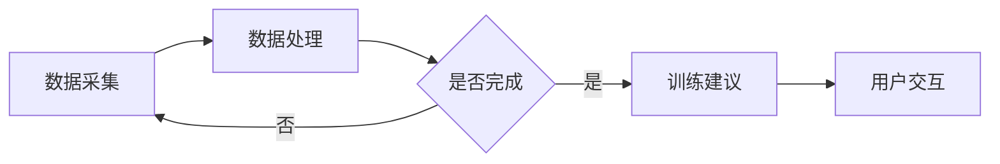
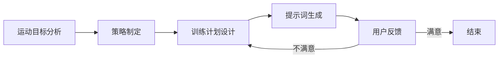
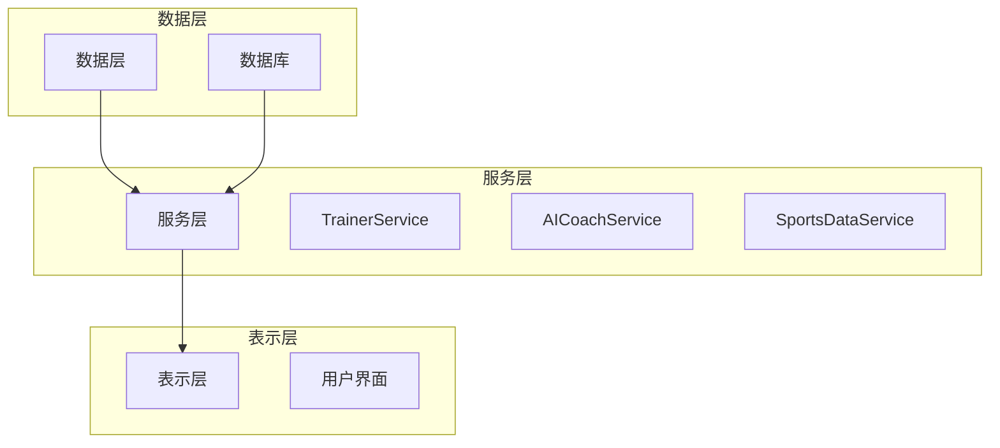
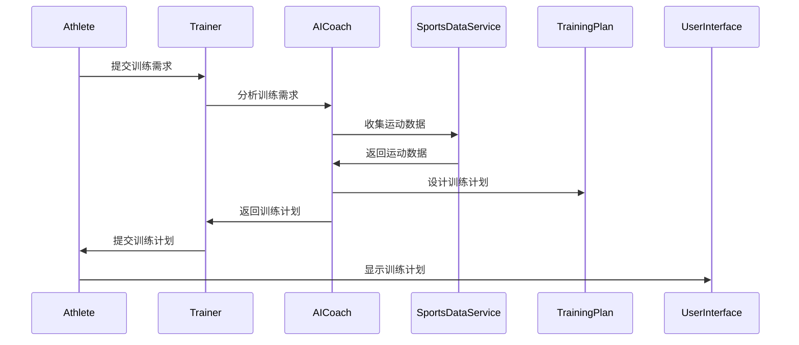

                 


# AI体育教练：提示词设计的运动训练系统

## 关键词
- 人工智能体育教练
- 提示词设计
- 运动训练系统
- 个性化训练
- 算法原理

## 摘要
本文深入探讨了AI体育教练：提示词设计的运动训练系统，旨在阐述该系统如何通过先进的提示词设计技术，实现个性化运动训练，提高运动员的训练效率和成果。本文分为六个部分：背景介绍、核心概念与联系、算法原理讲解、系统分析与架构设计、项目实战和最佳实践Tips。每个部分都详细分析了相关概念、原理和实践，为读者提供了全面的理解和应用指导。

### 第一部分：背景介绍

#### 1.1 问题背景
随着人工智能技术的不断发展，其在体育领域的应用也日益广泛。然而，传统的体育教练往往难以满足个性化训练的需求，无法有效提高运动员的竞技水平。因此，AI体育教练的兴起成为了一个必然趋势。

#### 1.2 问题描述
运动训练中的痛点主要包括：缺乏个性化指导、无法实时分析运动数据、训练效果难以评估等。当前解决方案的局限性主要体现在：技术门槛高、应用范围有限、无法实现真正的个性化训练。

#### 1.3 问题解决
AI体育教练结合了人工智能和运动科学，通过提示词设计实现对运动员的个性化指导，实时分析运动数据，评估训练效果，从而有效解决上述痛点。

#### 1.4 边界与外延
本文主要讨论AI体育教练和提示词设计的原理和应用，不包括AI在体育领域其他方面的应用，如体育数据分析、装备优化等。

#### 1.5 概念结构与核心要素组成
AI体育教练的核心组成部分包括：数据采集模块、算法模块、用户交互模块。提示词设计的关键要素包括：运动目标、运动策略、训练计划。

### 第二部分：核心概念与联系

#### 2.1 AI体育教练的概念原理
AI体育教练是一种基于人工智能技术的个性化运动训练系统，通过分析运动员的数据，给出个性化的训练建议。

#### 2.2 提示词设计的概念原理
提示词设计是指根据运动目标和运动员特点，制定相应的训练计划和技术动作。

#### 2.3 AI体育教练与提示词设计的联系
AI体育教练通过提示词设计，实现对运动员的个性化指导，提高训练效果。

#### 2.4 概念属性特征对比表格

| 概念             | 特征                  |
|------------------|----------------------|
| AI体育教练       | 个性化指导、实时数据分析、高效训练 |
| 提示词设计       | 个性化、针对性、高效性          |
| 运动训练系统     | 数据采集、算法分析、用户交互     |

#### 2.5 ER实体关系图架构
```mermaid
erDiagram
  Person ||--|{ AI教练 }|| Trainer
  Person ||--|{ 运动员 }|| Athlete
  AI教练 ||--|{ 提示词 }|| Instructions
  Trainer ||--|{ 训练计划 }|| TrainingPlan
  Athlete ||--|{ 运动数据 }|| SportsData
```

### 第三部分：算法原理讲解

#### 3.1 AI体育教练算法的mermaid流程图


#### 3.2 提示词设计算法的mermaid流程图


#### 3.3 算法原理的数学模型和公式
- AI体育教练算法的数学模型：
  $$模型公式1: T = f(S, P, D)$$
  其中，$T$代表训练建议，$S$代表运动数据，$P$代表训练计划，$D$代表用户反馈。

- 提示词设计算法的数学模型：
  $$模型公式2: I = g(O, A, T)$$
  其中，$I$代表提示词，$O$代表运动目标，$A$代表运动员特点，$T$代表训练计划。

#### 3.4 通俗易懂地举例说明
- AI体育教练算法举例：
  假设运动员A的运动数据为$S_A$，训练计划为$P_A$，用户反馈为$D_A$。通过算法，可以得到训练建议$T_A$。

- 提示词设计算法举例：
  假设运动目标为$O$，运动员特点为$A$，训练计划为$T$。通过算法，可以得到提示词$I$。

### 第四部分：系统分析与架构设计

#### 4.1 问题场景介绍
个性化训练需求：每个运动员的训练需求和目标不同，需要个性化的训练方案。数据收集与处理：需要收集运动员的运动数据，并对数据进行处理和分析。用户交互设计：设计方便用户使用的交互界面。

#### 4.2 系统功能设计
领域模型mermaid类图：
```mermaid
classDiagram
  Athlete <<interface>>
  Trainer <<interface>>
  AICoach
  TrainingPlan
  SportsData
  Athlete --|{数据采集}|> SportsData
  Athlete --|{训练计划}|> TrainingPlan
  Trainer --|{训练指导}|> AICoach
  AICoach --|{训练建议}|> Athlete
```

#### 4.3 系统架构设计
mermaid架构图：


#### 4.4 系统接口设计
接口设计原则：简洁、高效、易扩展。接口实现与调用：通过RESTful API实现，方便不同组件之间的通信。

#### 4.5 系统交互mermaid序列图


### 第五部分：项目实战

#### 5.1 环境安装
环境准备：安装Python、TensorFlow等必要库和工具。工具与软件安装：安装用于数据收集、处理和用户交互的工具和软件。

#### 5.2 系统核心实现源代码
源代码结构与功能：包括数据采集、数据处理、训练计划设计、提示词生成等模块。代码应用解读与分析：详细分析每个模块的实现原理和应用。

#### 5.3 实际案例分析和详细讲解剖析
案例背景：以一名篮球运动员的训练为例，分析其个性化训练需求。案例分析：通过AI体育教练系统，为运动员设计训练计划。剖析与总结：总结案例中的关键技术和实践经验。

#### 5.4 项目小结
项目成果：成功开发并实现了一个AI体育教练系统。项目经验与教训：总结了项目开发中的难点和解决方法。未来发展方向：探讨AI体育教练系统的未来发展和改进方向。

### 第六部分：最佳实践Tips

#### 6.1 提示词设计的最佳实践
提示词优化技巧：根据运动员的特点和训练目标，制定针对性的提示词。避免常见问题的策略：避免过度依赖提示词，结合运动员的实际情况进行调整。

#### 6.2 小结
书的主要观点：AI体育教练通过提示词设计实现个性化训练，提高运动员的竞技水平。阅读本书的建议：深入了解AI体育教练和提示词设计，结合实际应用场景进行实践。

#### 6.3 注意事项
使用AI体育教练时的注意事项：确保数据准确性，根据用户反馈及时调整训练计划。提示词设计的限制：提示词设计存在一定局限性，需要结合运动员的实际情况进行调整。

#### 6.4 拓展阅读
相关书籍推荐：深入阅读《人工智能：一种现代的方法》、《机器学习》等书籍。最新研究论文与资料：关注AI在体育领域的最新研究成果和应用。

### 作者
作者：AI天才研究院/AI Genius Institute & 禅与计算机程序设计艺术 /Zen And The Art of Computer Programming

本文以逻辑清晰、结构紧凑、简单易懂的专业技术语言，详细阐述了AI体育教练：提示词设计的运动训练系统的核心概念、原理和实践。通过一步步分析推理，深入探讨了该系统的设计思路、实现方法和应用场景，为读者提供了全面的技术指导。希望本文能够为从事人工智能体育教练领域的研究者和开发者提供有益的参考。

